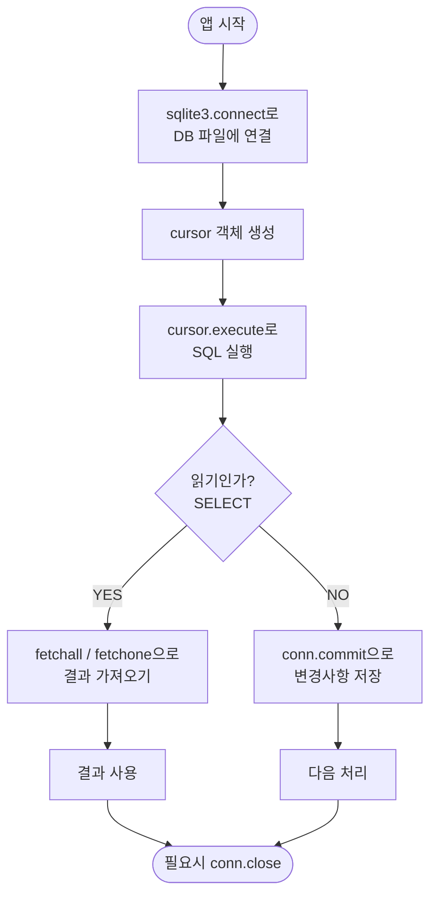
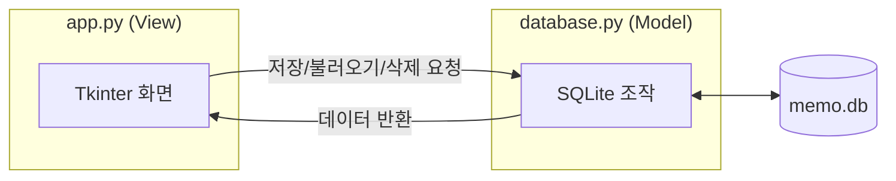
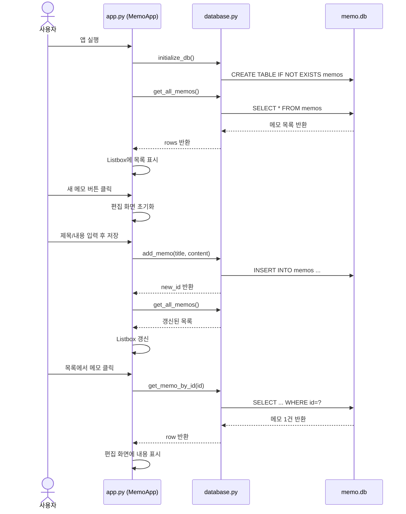

# 파이썬으로 만들기! 데스크톱 앱 시작  

저자: 최흥배, AI-Assisted   
    
권장 개발 환경
- **IDE**: Visual Code
- **컴파일러**: Python 3.13
- **OS**: Windows 10 이상

----- 
  
# Chapter 07. sqlite3을 사용하여 데이터베이스가 있는 메모장 만들기

---

## 이 챕터에서 만들 것
이번 챕터에서는 Python 표준 라이브러리에 포함된 **sqlite3** 모듈과 **Tkinter**를 조합하여, 데이터를 영구적으로 저장할 수 있는 "메모장 앱"을 만들어봅니다. 지금까지 만든 앱들은 앱을 닫으면 데이터가 사라졌지만, 이번에는 데이터베이스(DB)에 저장하기 때문에 앱을 다시 열어도 데이터가 남아있습니다.

```
┌─────────────────────────────────────────────┐
│         📓 SQLite 메모장 앱                   │
├──────────────────┬──────────────────────────┤
│  📋 메모 목록    │   ✏️ 편집 화면             │
│                  │                           │
│  > 오늘 할 일    │  제목: [오늘 할 일      ] │
│    장보기 목록   │                           │
│    아이디어 노트 │  내용:                    │
│                  │  ┌─────────────────────┐  │
│                  │  │ - 우유 사기          │  │
│                  │  │ - 파이썬 공부        │  │
│                  │  │                     │  │
│                  │  └─────────────────────┘  │
│  [새 메모] [삭제]│       [저장]  [삭제]       │
└──────────────────┴──────────────────────────┘
```

완성된 앱에서는 다음과 같은 기능을 구현할 것입니다.

- **메모 작성** — 제목과 내용을 입력하여 새 메모를 저장합니다.
- **메모 목록 표시** — 저장된 메모를 왼쪽 목록에서 확인할 수 있습니다.
- **메모 편집** — 목록에서 메모를 클릭하면 오른쪽에서 수정할 수 있습니다.
- **메모 삭제** — 선택한 메모를 삭제할 수 있습니다.
- **영구 저장** — 앱을 닫아도 메모가 사라지지 않습니다.

---

## 7-1. SQLite란 무엇인가?

본격적으로 코드를 작성하기 전에, SQLite가 어떤 것인지 간단히 이해해두면 이후의 코드가 훨씬 쉽게 읽힙니다.

**SQLite**는 파일 하나에 데이터베이스 전체를 저장하는 **경량형 관계형 데이터베이스**입니다. MySQL이나 PostgreSQL처럼 별도의 서버를 설치하거나 실행할 필요가 없고, Python 표준 라이브러리에 이미 포함되어 있어서 `pip install` 없이 바로 사용할 수 있습니다. 스마트폰 앱, 브라우저(Chrome, Firefox), 데스크톱 앱 등 매우 다양한 곳에서 실제로 쓰이고 있는 검증된 기술입니다.

```
  [MySQL / PostgreSQL]           [SQLite]
  ┌──────────────────┐          ┌─────────────────────┐
  │  별도 서버 실행   │          │  서버 불필요         │
  │  복잡한 설정      │   VS     │  파일 하나 (.db)     │
  │  네트워크 연결    │          │  Python 표준 내장    │
  │  대규모 시스템용  │          │  소규모·데스크톱용   │
  └──────────────────┘          └─────────────────────┘
```

데이터는 `.db` 확장자를 가진 파일로 저장됩니다. 우리가 만들 메모장은 `memo.db`라는 파일에 모든 메모 데이터가 저장됩니다.

### 관계형 데이터베이스의 기본 개념 — 테이블

SQLite는 데이터를 **테이블(Table)** 형태로 저장합니다. 테이블은 엑셀 시트처럼 행(Row)과 열(Column)로 구성됩니다.

```
  memos 테이블

  id  │  title          │  content              │  created_at
  ────┼─────────────────┼───────────────────────┼──────────────────
   1  │  오늘 할 일     │  우유 사기, 파이썬...  │  2026-04-20 10:00
   2  │  장보기 목록    │  당근, 양파, 고기...   │  2026-04-20 11:30
   3  │  아이디어 노트  │  앱 아이디어: ...      │  2026-04-20 14:00
```

이 챕터에서는 `memos`라는 이름의 테이블 하나를 만들어서 메모를 관리합니다.

---

## 7-2. SQL 기초 문법 — 딱 4가지만 기억하자!

데이터베이스를 다루는 언어가 **SQL(Structured Query Language)** 입니다. 복잡해 보이지만, 메모장 앱을 만들기 위해 필요한 SQL은 딱 **4가지 명령어(CRUD)**뿐입니다.

```
  CRUD 란?

  C ── CREATE (생성) ── INSERT
  R ── READ   (읽기) ── SELECT
  U ── UPDATE (수정) ── UPDATE
  D ── DELETE (삭제) ── DELETE
```

각각이 어떤 문법인지 예시를 통해 살펴봅시다.

**테이블 만들기 (CREATE TABLE)**

```sql
CREATE TABLE IF NOT EXISTS memos (
    id         INTEGER PRIMARY KEY AUTOINCREMENT,
    title      TEXT    NOT NULL,
    content    TEXT,
    created_at TEXT    DEFAULT (datetime('now', 'localtime'))
);
```

테이블이 없을 때만 새로 만들라는 명령입니다. `IF NOT EXISTS` 덕분에 앱을 두 번째 실행할 때 "이미 있는 테이블"이라는 오류가 나지 않습니다. `id` 컬럼은 `AUTOINCREMENT`가 붙어 있어서 새 메모를 추가할 때마다 자동으로 1씩 증가하는 고유 번호가 붙습니다.

**데이터 추가 (INSERT)**

```sql
INSERT INTO memos (title, content) VALUES ('오늘 할 일', '우유 사기');
```

**데이터 읽기 (SELECT)**

```sql
SELECT id, title, content, created_at FROM memos ORDER BY id DESC;
```

`ORDER BY id DESC`는 최신 메모가 위에 오도록 내림차순으로 정렬하라는 뜻입니다.

**데이터 수정 (UPDATE)**

```sql
UPDATE memos SET title = '수정된 제목', content = '수정된 내용' WHERE id = 1;
```

`WHERE id = 1`처럼 조건을 붙여서 특정 행만 수정합니다. 이 조건을 빠뜨리면 모든 행이 수정되므로 주의가 필요합니다.

**데이터 삭제 (DELETE)**

```sql
DELETE FROM memos WHERE id = 1;
```

---

## 7-3. Python에서 SQLite 사용하기 — 기본 패턴

Python에서 SQLite를 사용하는 기본적인 흐름을 먼저 익혀봅시다.



이 흐름을 코드로 표현하면 다음과 같습니다.

```python
import sqlite3

# 1. DB 파일에 연결 (없으면 자동으로 새로 만들어줌)
conn = sqlite3.connect("memo.db")

# 2. cursor 객체 생성 (SQL을 실행하는 도구)
cursor = conn.cursor()

# 3. SQL 실행
cursor.execute("SELECT id, title FROM memos")

# 4. 결과 가져오기 (SELECT의 경우)
rows = cursor.fetchall()   # 모든 결과를 리스트로
for row in rows:
    print(row[0], row[1])  # (id, title)

# 5. 변경사항이 있다면 커밋
conn.commit()

# 6. 연결 닫기
conn.close()
```

> 💡 **cursor란?** 데이터베이스에서 SQL을 실행하고 결과를 가져오는 "커서"입니다. 마치 텍스트 에디터에서 커서가 현재 위치를 나타내듯, DB cursor는 현재 SQL 실행 위치를 추적합니다.

> 💡 **commit이란?** 변경사항(INSERT, UPDATE, DELETE)을 실제로 DB 파일에 반영하는 작업입니다. commit을 하지 않으면 앱을 닫았을 때 변경사항이 사라집니다.

### SQL 인젝션 방지 — 플레이스홀더 사용

사용자가 입력한 값을 SQL에 직접 붙여 넣으면 **SQL 인젝션** 공격에 취약해집니다. Python의 sqlite3에서는 `?` 플레이스홀더를 사용하여 안전하게 값을 전달합니다.

```python
# ❌ 위험한 방식 — 절대 사용하지 말 것!
title = "사용자 입력"
cursor.execute(f"INSERT INTO memos (title) VALUES ('{title}')")

# ✅ 안전한 방식 — 플레이스홀더 사용
title = "사용자 입력"
cursor.execute("INSERT INTO memos (title) VALUES (?)", (title,))
#                                                   ↑
#                                       튜플로 값을 전달
```

두 번째 인자로 **튜플**을 전달하는 점에 주의하세요. 값이 하나일 때도 `(title,)`처럼 쉼표를 붙여 튜플 형태로 만들어야 합니다.

---

## 7-4. 프로젝트 구조 설계

앱을 만들기 전에 전체 구조를 설계해봅시다. 이번 앱은 역할에 따라 코드를 두 파일로 분리합니다.

```
memo_app/
│
├── database.py     ← DB 관련 처리 (SQLite 조작)
└── app.py          ← GUI 관련 처리 (Tkinter 화면)
```

이렇게 분리하면 DB 처리 로직과 화면 로직이 뒤섞이지 않아 코드를 읽고 수정하기가 훨씬 쉬워집니다. 다른 프로그래밍 언어에서 MVC 패턴이나 레이어 분리를 경험해보셨다면 익숙한 개념일 것입니다.



---

## 7-5. database.py 만들기

먼저 DB와 관련된 처리를 담당하는 `database.py`를 작성합니다. 새 폴더 `memo_app`을 만들고 그 안에 파일을 만들어주세요.

```python
# database.py
import sqlite3
from datetime import datetime

# DB 파일 경로 — 같은 폴더에 memo.db 파일로 저장됩니다
DB_PATH = "memo.db"


def get_connection():
    """DB 연결 객체를 반환하는 헬퍼 함수.
    
    row_factory를 설정하면 결과를 인덱스(row[0])가 아닌
    컬럼명(row['title'])으로 접근할 수 있어 편리합니다.
    """
    conn = sqlite3.connect(DB_PATH)
    conn.row_factory = sqlite3.Row  # 컬럼명으로 접근 가능하게 설정
    return conn


def initialize_db():
    """앱 시작 시 한 번 호출하여 테이블을 생성합니다.
    이미 테이블이 존재하면 아무것도 하지 않습니다.
    """
    conn = get_connection()
    cursor = conn.cursor()
    cursor.execute("""
        CREATE TABLE IF NOT EXISTS memos (
            id         INTEGER PRIMARY KEY AUTOINCREMENT,
            title      TEXT    NOT NULL DEFAULT '(제목 없음)',
            content    TEXT    NOT NULL DEFAULT '',
            created_at TEXT    NOT NULL DEFAULT (datetime('now', 'localtime')),
            updated_at TEXT    NOT NULL DEFAULT (datetime('now', 'localtime'))
        )
    """)
    conn.commit()
    conn.close()


def get_all_memos():
    """모든 메모를 최신순으로 반환합니다.
    
    Returns:
        list[sqlite3.Row]: 메모 데이터의 리스트.
        각 항목은 id, title, content, created_at, updated_at 을 가집니다.
    """
    conn = get_connection()
    cursor = conn.cursor()
    cursor.execute("""
        SELECT id, title, content, created_at, updated_at
        FROM memos
        ORDER BY updated_at DESC
    """)
    rows = cursor.fetchall()
    conn.close()
    return rows


def get_memo_by_id(memo_id: int):
    """특정 ID의 메모 하나를 반환합니다.

    Args:
        memo_id (int): 가져올 메모의 ID.

    Returns:
        sqlite3.Row | None: 메모 데이터. 없으면 None.
    """
    conn = get_connection()
    cursor = conn.cursor()
    cursor.execute("""
        SELECT id, title, content, created_at, updated_at
        FROM memos
        WHERE id = ?
    """, (memo_id,))
    row = cursor.fetchone()
    conn.close()
    return row


def add_memo(title: str, content: str) -> int:
    """새 메모를 추가하고, 추가된 메모의 ID를 반환합니다.

    Args:
        title (str): 메모 제목.
        content (str): 메모 내용.

    Returns:
        int: 새로 추가된 메모의 ID.
    """
    conn = get_connection()
    cursor = conn.cursor()
    cursor.execute("""
        INSERT INTO memos (title, content)
        VALUES (?, ?)
    """, (title, content))
    conn.commit()
    new_id = cursor.lastrowid  # 방금 추가된 행의 ID를 가져옴
    conn.close()
    return new_id


def update_memo(memo_id: int, title: str, content: str):
    """기존 메모를 수정합니다.

    Args:
        memo_id (int): 수정할 메모의 ID.
        title (str): 새 제목.
        content (str): 새 내용.
    """
    now = datetime.now().strftime("%Y-%m-%d %H:%M:%S")
    conn = get_connection()
    cursor = conn.cursor()
    cursor.execute("""
        UPDATE memos
        SET title = ?, content = ?, updated_at = ?
        WHERE id = ?
    """, (title, content, now, memo_id))
    conn.commit()
    conn.close()


def delete_memo(memo_id: int):
    """특정 메모를 삭제합니다.

    Args:
        memo_id (int): 삭제할 메모의 ID.
    """
    conn = get_connection()
    cursor = conn.cursor()
    cursor.execute("DELETE FROM memos WHERE id = ?", (memo_id,))
    conn.commit()
    conn.close()
```

> 💡 **`sqlite3.Row`란?** 기본적으로 `cursor.fetchall()`은 튜플의 리스트를 반환해서 `row[0]`, `row[1]`처럼 인덱스로 접근해야 합니다. `conn.row_factory = sqlite3.Row`를 설정하면 `row["title"]`, `row["content"]`처럼 컬럼 이름으로 접근할 수 있어 코드가 훨씬 읽기 쉬워집니다.

각 함수가 어떤 역할을 하는지 한눈에 정리해봅시다.

```
  database.py 함수 목록

  initialize_db()        ── 앱 시작 시 테이블 생성
  get_all_memos()        ── 전체 메모 목록 조회
  get_memo_by_id(id)     ── 특정 메모 1건 조회
  add_memo(title, body)  ── 새 메모 추가
  update_memo(id, ...)   ── 기존 메모 수정
  delete_memo(id)        ── 메모 삭제
```

---

## 7-6. app.py 만들기 — GUI 설계

이제 Tkinter로 화면을 만들 `app.py`를 작성합니다. 먼저 전체 화면 레이아웃을 다시 한번 설계도로 확인해봅시다.

```
┌─────────────────────────────────────────────────────────┐
│  Window (root)                                          │
│  ┌─────────────────────────────────────────────────┐   │
│  │  main_frame (PanedWindow)                       │   │
│  │  ┌──────────────────┐  ┌───────────────────┐   │   │
│  │  │  left_frame      │  │  right_frame       │   │   │
│  │  │                  │  │                    │   │   │
│  │  │  [새 메모 버튼]   │  │  Label: 제목       │   │   │
│  │  │                  │  │  Entry: title_var  │   │   │
│  │  │  Listbox         │  │                    │   │   │
│  │  │  (메모 목록)      │  │  Label: 내용       │   │   │
│  │  │                  │  │  Text: content_box │   │   │
│  │  │  [삭제 버튼]      │  │                    │   │   │
│  │  │                  │  │  [저장] [새 메모]   │   │   │
│  │  └──────────────────┘  └───────────────────┘   │   │
│  └─────────────────────────────────────────────────┘   │
│  status_bar: Label (하단 상태 표시)                      │
└─────────────────────────────────────────────────────────┘
```

전체 `app.py` 코드입니다. 각 부분에 상세한 주석을 달아두었으니 읽으면서 이해해 보세요.

```python
# app.py
import tkinter as tk
from tkinter import ttk, messagebox
import database  # 방금 만든 database.py 를 import


class MemoApp:
    """메모장 앱의 메인 클래스.
    
    모든 GUI 컴포넌트와 이벤트 처리를 담당합니다.
    """

    def __init__(self, root: tk.Tk):
        self.root = root
        self.root.title("📓 SQLite 메모장")
        self.root.geometry("800x500")
        self.root.minsize(600, 400)  # 최소 창 크기

        # 현재 편집 중인 메모의 ID를 저장 (새 메모는 None)
        self.current_memo_id: int | None = None

        # 메모 목록 데이터 (id → Listbox 인덱스 매핑용)
        self.memo_ids: list[int] = []

        self._build_ui()        # 화면 구성
        self._load_memo_list()  # DB에서 목록 불러오기

    # =========================================================
    # UI 구성
    # =========================================================

    def _build_ui(self):
        """전체 UI를 구성합니다."""
        self._build_paned_window()
        self._build_left_panel()
        self._build_right_panel()
        self._build_status_bar()

    def _build_paned_window(self):
        """좌우로 드래그하여 크기 조절이 가능한 분할 창을 만듭니다."""
        self.paned = tk.PanedWindow(
            self.root,
            orient=tk.HORIZONTAL,  # 가로 방향으로 분할
            sashwidth=5,           # 분할선 두께
            sashrelief=tk.RAISED,
            bg="#cccccc"
        )
        self.paned.pack(fill=tk.BOTH, expand=True)

    def _build_left_panel(self):
        """왼쪽 패널 — 메모 목록과 버튼을 배치합니다."""
        left_frame = tk.Frame(self.paned, bg="#f0f0f0")
        self.paned.add(left_frame, minsize=150, width=220)

        # 상단 레이블
        tk.Label(
            left_frame,
            text="📋 메모 목록",
            bg="#4a90d9",
            fg="white",
            font=("맑은 고딕", 11, "bold"),
            pady=6
        ).pack(fill=tk.X)

        # 새 메모 버튼
        tk.Button(
            left_frame,
            text="＋ 새 메모",
            command=self._new_memo,
            bg="#5cb85c",
            fg="white",
            font=("맑은 고딕", 10, "bold"),
            relief=tk.FLAT,
            pady=5,
            cursor="hand2"
        ).pack(fill=tk.X, padx=5, pady=(5, 2))

        # 메모 목록 Listbox + 스크롤바
        list_frame = tk.Frame(left_frame, bg="#f0f0f0")
        list_frame.pack(fill=tk.BOTH, expand=True, padx=5, pady=2)

        scrollbar = tk.Scrollbar(list_frame)
        scrollbar.pack(side=tk.RIGHT, fill=tk.Y)

        self.listbox = tk.Listbox(
            list_frame,
            yscrollcommand=scrollbar.set,
            selectmode=tk.SINGLE,    # 한 번에 하나만 선택
            font=("맑은 고딕", 10),
            activestyle="none",
            selectbackground="#4a90d9",
            selectforeground="white",
            bg="white",
            relief=tk.FLAT,
            borderwidth=1
        )
        self.listbox.pack(side=tk.LEFT, fill=tk.BOTH, expand=True)
        scrollbar.config(command=self.listbox.yview)

        # Listbox 클릭 이벤트 — 메모 선택 시 편집 화면에 표시
        self.listbox.bind("<<ListboxSelect>>", self._on_memo_select)

        # 삭제 버튼
        tk.Button(
            left_frame,
            text="🗑 삭제",
            command=self._delete_memo,
            bg="#d9534f",
            fg="white",
            font=("맑은 고딕", 10),
            relief=tk.FLAT,
            pady=4,
            cursor="hand2"
        ).pack(fill=tk.X, padx=5, pady=(2, 5))

    def _build_right_panel(self):
        """오른쪽 패널 — 제목 입력, 내용 입력, 저장 버튼을 배치합니다."""
        right_frame = tk.Frame(self.paned, bg="white")
        self.paned.add(right_frame, minsize=300)

        # 상단 레이블
        tk.Label(
            right_frame,
            text="✏️ 메모 편집",
            bg="#4a90d9",
            fg="white",
            font=("맑은 고딕", 11, "bold"),
            pady=6
        ).pack(fill=tk.X)

        # 제목 입력 영역
        title_frame = tk.Frame(right_frame, bg="white")
        title_frame.pack(fill=tk.X, padx=10, pady=(10, 5))

        tk.Label(
            title_frame,
            text="제목",
            bg="white",
            font=("맑은 고딕", 10, "bold"),
            width=5,
            anchor="w"
        ).pack(side=tk.LEFT)

        self.title_var = tk.StringVar()
        self.title_entry = tk.Entry(
            title_frame,
            textvariable=self.title_var,
            font=("맑은 고딕", 11),
            relief=tk.SOLID,
            borderwidth=1
        )
        self.title_entry.pack(side=tk.LEFT, fill=tk.X, expand=True)

        # 날짜 표시 레이블
        self.date_label = tk.Label(
            right_frame,
            text="",
            bg="white",
            fg="#888888",
            font=("맑은 고딕", 9),
            anchor="e"
        )
        self.date_label.pack(fill=tk.X, padx=10)

        # 내용 입력 영역
        tk.Label(
            right_frame,
            text="내용",
            bg="white",
            font=("맑은 고딕", 10, "bold"),
            anchor="w"
        ).pack(fill=tk.X, padx=10, pady=(5, 2))

        content_frame = tk.Frame(right_frame, bg="white")
        content_frame.pack(fill=tk.BOTH, expand=True, padx=10, pady=(0, 5))

        content_scroll = tk.Scrollbar(content_frame)
        content_scroll.pack(side=tk.RIGHT, fill=tk.Y)

        self.content_text = tk.Text(
            content_frame,
            yscrollcommand=content_scroll.set,
            font=("맑은 고딕", 11),
            wrap=tk.WORD,   # 단어 단위로 줄바꿈
            relief=tk.SOLID,
            borderwidth=1,
            padx=5,
            pady=5
        )
        self.content_text.pack(side=tk.LEFT, fill=tk.BOTH, expand=True)
        content_scroll.config(command=self.content_text.yview)

        # 저장 버튼
        tk.Button(
            right_frame,
            text="💾 저장",
            command=self._save_memo,
            bg="#4a90d9",
            fg="white",
            font=("맑은 고딕", 11, "bold"),
            relief=tk.FLAT,
            pady=6,
            cursor="hand2"
        ).pack(fill=tk.X, padx=10, pady=(0, 10))

    def _build_status_bar(self):
        """하단 상태바를 만듭니다. 저장/삭제 결과 메시지를 표시합니다."""
        self.status_var = tk.StringVar(value="앱이 시작되었습니다.")
        status_bar = tk.Label(
            self.root,
            textvariable=self.status_var,
            bg="#e0e0e0",
            fg="#444444",
            font=("맑은 고딕", 9),
            anchor="w",
            padx=8,
            pady=3
        )
        status_bar.pack(fill=tk.X, side=tk.BOTTOM)

    # =========================================================
    # 데이터 처리 메서드
    # =========================================================

    def _load_memo_list(self):
        """DB에서 메모 목록을 가져와 Listbox를 갱신합니다."""
        self.listbox.delete(0, tk.END)  # 기존 항목 전부 삭제
        self.memo_ids.clear()

        memos = database.get_all_memos()
        for memo in memos:
            # Listbox에 표시할 문자열 구성 (긴 제목은 잘라냄)
            display_title = memo["title"] if memo["title"] else "(제목 없음)"
            if len(display_title) > 20:
                display_title = display_title[:20] + "…"
            self.listbox.insert(tk.END, f"  {display_title}")
            self.memo_ids.append(memo["id"])  # ID를 별도 리스트에 기록

        count = len(memos)
        self.status_var.set(f"메모 {count}건 로드 완료.")

    def _on_memo_select(self, event):
        """Listbox에서 메모를 선택했을 때 편집 화면에 내용을 표시합니다."""
        selection = self.listbox.curselection()
        if not selection:
            return  # 선택된 것이 없으면 아무것도 하지 않음

        index = selection[0]                  # 선택된 항목의 인덱스
        memo_id = self.memo_ids[index]        # 해당 인덱스의 메모 ID
        memo = database.get_memo_by_id(memo_id)

        if memo is None:
            return

        # 편집 영역에 데이터 세팅
        self.current_memo_id = memo_id
        self.title_var.set(memo["title"])

        self.content_text.delete("1.0", tk.END)          # 기존 내용 삭제
        self.content_text.insert("1.0", memo["content"]) # 새 내용 삽입

        # 날짜 표시
        self.date_label.config(
            text=f"최종 수정: {memo['updated_at']}"
        )

    def _new_memo(self):
        """새 메모 작성을 위해 편집 화면을 초기화합니다."""
        self.current_memo_id = None         # ID를 None으로 → '신규' 상태
        self.title_var.set("")
        self.content_text.delete("1.0", tk.END)
        self.date_label.config(text="새 메모")
        self.listbox.selection_clear(0, tk.END)  # Listbox 선택 해제
        self.title_entry.focus()                  # 제목 입력창으로 포커스 이동
        self.status_var.set("새 메모를 작성해 보세요!")

    def _save_memo(self):
        """현재 편집 중인 내용을 저장합니다.
        
        current_memo_id가 None이면 새 메모(INSERT),
        값이 있으면 기존 메모 수정(UPDATE)입니다.
        """
        title = self.title_var.get().strip()
        # Text 위젯은 get()이 아닌 get("1.0", tk.END)로 전체 내용을 가져옴
        # END에는 마지막 줄바꿈이 포함되므로 strip()으로 제거
        content = self.content_text.get("1.0", tk.END).strip()

        # 제목이 비어있으면 기본값 사용
        if not title:
            title = "(제목 없음)"

        if self.current_memo_id is None:
            # 신규 메모 추가
            new_id = database.add_memo(title, content)
            self.current_memo_id = new_id
            self.status_var.set(f"✅ 새 메모가 저장되었습니다. (ID: {new_id})")
        else:
            # 기존 메모 수정
            database.update_memo(self.current_memo_id, title, content)
            self.status_var.set(f"✅ 메모가 수정되었습니다. (ID: {self.current_memo_id})")

        self._load_memo_list()  # 목록 갱신

    def _delete_memo(self):
        """선택된 메모를 삭제합니다. 삭제 전 확인 다이얼로그를 표시합니다."""
        selection = self.listbox.curselection()
        if not selection:
            messagebox.showwarning("경고", "삭제할 메모를 목록에서 선택해 주세요.")
            return

        index = selection[0]
        memo_id = self.memo_ids[index]

        # 삭제 확인 다이얼로그
        answer = messagebox.askyesno(
            "삭제 확인",
            "선택한 메모를 삭제하시겠습니까?\n이 작업은 되돌릴 수 없습니다."
        )
        if not answer:
            return  # '아니오'를 누르면 아무것도 하지 않음

        database.delete_memo(memo_id)

        # 삭제 후 편집 화면 초기화
        self._new_memo()
        self.status_var.set(f"🗑 메모가 삭제되었습니다. (ID: {memo_id})")
        self._load_memo_list()


# =========================================================
# 앱 진입점
# =========================================================
if __name__ == "__main__":
    # 1. DB 초기화 (테이블이 없으면 생성)
    database.initialize_db()

    # 2. Tkinter 루트 창 생성
    root = tk.Tk()

    # 3. 앱 객체 생성 (UI 구성 + 데이터 로드)
    app = MemoApp(root)

    # 4. 이벤트 루프 시작
    root.mainloop()
```

---

## 7-7. 앱 실행해보기

작성이 끝났으면 앱을 실행해봅시다. 터미널(명령 프롬프트)에서 `memo_app` 폴더로 이동한 뒤 다음 명령을 실행합니다.

```bash
cd memo_app
python app.py
```

처음 실행하면 `memo.db` 파일이 자동으로 생성되고, 아래와 같은 화면이 나타납니다.

```
┌────────────────────────────────────────────────────────┐
│  📓 SQLite 메모장                          [─][□][×]   │
├─────────────────────┬──────────────────────────────────┤
│  📋 메모 목록       │  ✏️ 메모 편집                     │
│ ┌───────────────┐   │  제목 [                        ] │
│ │ ＋ 새 메모    │   │  새 메모                         │
│ ├───────────────┤   │  내용                            │
│ │               │   │  ┌──────────────────────────┐   │
│ │  (목록 비어   │   │  │                          │   │
│ │   있음)       │   │  │                          │   │
│ │               │   │  └──────────────────────────┘   │
│ └───────────────┘   │  [         💾 저장             ] │
│ ┌───────────────┐   │                                  │
│ │    🗑 삭제    │   │                                  │
│ └───────────────┘   │                                  │
├─────────────────────┴──────────────────────────────────┤
│  앱이 시작되었습니다.                                    │
└────────────────────────────────────────────────────────┘
```

**기본 사용 방법**은 다음과 같습니다.

**① 새 메모 작성**: "＋ 새 메모" 버튼을 클릭하면 편집 화면이 비워집니다. 제목과 내용을 입력한 뒤 "💾 저장" 버튼을 누르면 DB에 저장되고 목록에 표시됩니다.

**② 메모 수정**: 목록에서 메모를 클릭하면 오른쪽에 내용이 표시됩니다. 수정 후 "💾 저장"을 누르면 업데이트됩니다.

**③ 메모 삭제**: 목록에서 삭제할 메모를 선택하고 "🗑 삭제" 버튼을 누르면 확인 다이얼로그가 나타납니다.

---

## 7-8. 처리 흐름 전체 정리

지금까지 만든 앱의 전체 흐름을 다이어그램으로 정리합니다.



---

## 7-9. 더 발전시켜보자! — 검색 기능 추가

기본 앱이 완성되었으니, 조금 더 편리하게 **메모 검색 기능**을 추가해봅시다. `database.py`와 `app.py` 양쪽을 조금씩 수정하면 됩니다.

### database.py에 검색 함수 추가

```python
# database.py 에 추가
def search_memos(keyword: str):
    """제목 또는 내용에 키워드가 포함된 메모를 반환합니다.
    
    SQL의 LIKE 연산자와 % 와일드카드를 사용합니다.
    '%keyword%' 는 'keyword를 포함하는 모든 문자열'을 의미합니다.

    Args:
        keyword (str): 검색할 키워드.

    Returns:
        list[sqlite3.Row]: 검색 결과 목록.
    """
    conn = get_connection()
    cursor = conn.cursor()
    # LIKE 검색에서도 ? 플레이스홀더를 사용합니다
    like_pattern = f"%{keyword}%"
    cursor.execute("""
        SELECT id, title, content, created_at, updated_at
        FROM memos
        WHERE title LIKE ? OR content LIKE ?
        ORDER BY updated_at DESC
    """, (like_pattern, like_pattern))
    rows = cursor.fetchall()
    conn.close()
    return rows
```

### app.py — 검색 바 추가

`_build_left_panel` 메서드 안의 `새 메모 버튼` 아래에 다음 코드를 추가합니다.

```python
# _build_left_panel 안에 추가 (새 메모 버튼 pack 이후)

# 검색 입력창
search_frame = tk.Frame(left_frame, bg="#f0f0f0")
search_frame.pack(fill=tk.X, padx=5, pady=2)

self.search_var = tk.StringVar()
# 검색어가 바뀔 때마다 _on_search_change 를 호출
self.search_var.trace_add("write", self._on_search_change)

tk.Entry(
    search_frame,
    textvariable=self.search_var,
    font=("맑은 고딕", 10),
    relief=tk.SOLID,
    borderwidth=1
).pack(fill=tk.X)

tk.Label(
    search_frame,
    text="🔍 제목/내용 검색",
    bg="#f0f0f0",
    fg="#888888",
    font=("맑은 고딕", 8)
).pack(anchor="w")
```

`MemoApp` 클래스 안에 검색 이벤트 핸들러를 추가합니다.

```python
# MemoApp 클래스 메서드로 추가
def _on_search_change(self, *args):
    """검색어가 변경될 때마다 목록을 필터링합니다.
    
    *args는 trace_add가 전달하는 인자를 무시하기 위한 것입니다.
    """
    keyword = self.search_var.get().strip()
    self.listbox.delete(0, tk.END)
    self.memo_ids.clear()

    if keyword:
        memos = database.search_memos(keyword)
        self.status_var.set(f"🔍 '{keyword}' 검색 결과: {len(memos)}건")
    else:
        memos = database.get_all_memos()
        self.status_var.set(f"메모 {len(memos)}건 로드 완료.")

    for memo in memos:
        display_title = memo["title"] if memo["title"] else "(제목 없음)"
        if len(display_title) > 20:
            display_title = display_title[:20] + "…"
        self.listbox.insert(tk.END, f"  {display_title}")
        self.memo_ids.append(memo["id"])
```

> 💡 **`trace_add("write", callback)`이란?** `StringVar`의 값이 변경될 때마다 자동으로 콜백 함수를 호출하는 기능입니다. 사용자가 검색창에 글자를 입력할 때마다 실시간으로 목록이 필터링됩니다.

---

## 7-10. 트러블슈팅 — 자주 발생하는 오류

앱을 만들다 보면 다음과 같은 오류를 만날 수 있습니다. 당황하지 말고 원인과 해결책을 확인해보세요.

```
  ❌ OperationalError: no such table: memos
  →  initialize_db()를 호출하지 않았거나, DB 파일 경로가 다릅니다.
     app.py를 실행하는 폴더와 database.py의 DB_PATH를 확인하세요.

  ❌ IndexError: list index out of range  (self.memo_ids[index])
  →  Listbox와 memo_ids 리스트의 동기화가 깨진 경우입니다.
     _load_memo_list() 호출 후 Listbox 항목 수와
     memo_ids 길이가 같은지 확인하세요.

  ❌ TclError: bad option "1.0"
  →  Text 위젯의 인덱스는 "행.열" 형식입니다.
     첫 번째 줄 첫 번째 글자는 "1.0" 이 맞습니다.
     "0.0"으로 쓰면 오류가 납니다.
```

---

## 7-11. 이 챕터의 정리

이번 챕터에서 배운 내용을 정리합니다.

```
  ✅ 이 챕터에서 배운 것

  1. SQLite의 개념과 특징
     ── 서버 불필요, 파일 기반, Python 표준 내장

  2. 기본 SQL 문법 (CRUD)
     ── CREATE TABLE, INSERT, SELECT, UPDATE, DELETE

  3. Python sqlite3 모듈 사용법
     ── connect → cursor → execute → commit → close
     ── row_factory로 컬럼명 접근
     ── ? 플레이스홀더로 SQL 인젝션 방지

  4. Tkinter GUI와 SQLite의 연동
     ── database.py / app.py 역할 분리
     ── Listbox + 편집 화면의 연동 패턴

  5. 검색 기능 (LIKE 연산자)
     ── StringVar.trace_add()로 실시간 필터링
```

데이터베이스를 사용하면 앱의 활용 범위가 크게 넓어집니다. 이번에 만든 메모장 앱의 구조를 응용하면 할 일 목록(TODO), 가계부, 주소록 등 다양한 데이터 관리 앱을 만들 수 있습니다. 다음 챕터에서는 완성된 앱을 다른 사람에게 배포하는 방법을 배워봅니다! 🎉  