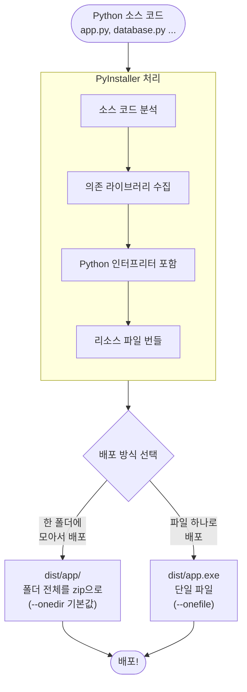

# 파이썬으로 만들기! 데스크톱 앱 시작  

저자: 최흥배, AI-Assisted   
    
권장 개발 환경
- **IDE**: Visual Code
- **컴파일러**: Python 3.13
- **OS**: Windows 10 이상

----- 
  
# Chapter 08. 만든 앱을 배포할 수 있도록

---

## 이 챕터에서 할 것
지금까지 여러 챕터에 걸쳐 멋진 앱들을 만들어왔습니다. 그런데 한 가지 아쉬운 점이 있습니다. 지금 만든 앱은 **Python이 설치된 컴퓨터에서만** 실행할 수 있습니다. 친구나 동료에게 "이 앱 써봐!" 하고 건네주려면 상대방도 Python을 설치하고, 필요한 라이브러리도 모두 설치해야 합니다. 이래서는 배포라고 부르기 어렵겠죠.

이번 챕터에서는 Python이 설치되지 않은 Windows 컴퓨터에서도 앱을 바로 실행할 수 있도록 **`.exe` 실행 파일**로 만드는 방법을 배웁니다.

```
  지금까지의 상황
  ┌─────────────────────────────────────────────┐
  │  개발자 PC                                   │
  │  ✅ Python 설치됨                            │
  │  ✅ tkinter, sqlite3, pandas ... 설치됨      │
  │  → python app.py  ← 이렇게만 실행 가능       │
  └─────────────────────────────────────────────┘
            │
            │  친구에게 app.py 파일만 전달하면?
            ▼
  ┌─────────────────────────────────────────────┐
  │  친구 PC                                     │
  │  ❌ Python 없음                              │
  │  → 실행 불가! 😢                             │
  └─────────────────────────────────────────────┘

  이번 챕터 목표
            │
            ▼
  ┌─────────────────────────────────────────────┐
  │  친구 PC                                     │
  │  ❌ Python 없음                              │
  │  ✅ app.exe 더블클릭만으로 실행! 🎉           │
  └─────────────────────────────────────────────┘
```

이 목표를 이루기 위해 **PyInstaller**라는 도구를 사용합니다. 이 챕터에서는 Chapter 07에서 만든 **SQLite 메모장 앱**을 예제로 사용하겠습니다. 다른 챕터에서 만든 앱도 기본 방법은 동일하니 그대로 응용할 수 있습니다.

---

## 8-1. 배포의 전체 흐름 이해하기

본격적으로 시작하기 전에 전체 흐름을 파악해봅시다.



PyInstaller는 여러분이 작성한 Python 스크립트를 분석해서, 실행에 필요한 모든 것(Python 인터프리터, 라이브러리, 리소스 파일 등)을 한데 묶어줍니다. 상대방은 Python을 전혀 몰라도 `.exe` 파일만 실행하면 됩니다.

---

## 8-2. PyInstaller 설치

먼저 PyInstaller를 설치합니다. 터미널(명령 프롬프트 또는 PowerShell)을 열고 다음 명령을 실행하세요.

```bash
pip install pyinstaller
```

설치가 완료되면 버전을 확인해봅니다.

```bash
pyinstaller --version
```

```
6.x.x   ← 이런 식으로 버전 번호가 출력되면 성공!
```

> 💡 **가상환경을 사용하고 있다면?** 가상환경(venv)이 활성화된 상태에서 설치해야 합니다. 가상환경 안에 설치된 라이브러리만 번들에 포함되기 때문에, 앱 실행에 필요한 모든 라이브러리가 가상환경에 설치되어 있는지 먼저 확인하세요.

---

## 8-3. 가장 간단한 빌드 — 일단 해보자

이론보다 실전이 먼저입니다. 일단 Chapter 07의 메모장 앱을 빌드해봅시다. 프로젝트 폴더(`memo_app`)로 이동한 뒤 다음 명령을 실행합니다.

```bash
cd memo_app
pyinstaller app.py
```

명령이 실행되면 터미널에 많은 로그가 흘러내려갑니다. 잠시 기다리면 다음과 같은 메시지와 함께 완료됩니다.

```
...
INFO: Building EXE from EXE-00.toc completed successfully.
```

빌드가 끝나면 프로젝트 폴더 안에 새로운 폴더들이 생겨나 있습니다.

```
memo_app/
│
├── app.py
├── database.py
├── memo.db
│
├── build/          ← 빌드 중간 파일 (신경 쓰지 않아도 됨)
│   └── app/
│       └── ...
│
├── dist/           ← ✅ 완성된 배포 파일이 여기에!
│   └── app/
│       ├── app.exe          ← 실행 파일
│       ├── _internal/       ← Python, 라이브러리 등 필요 파일들
│       │   └── ...
│       └── ...
│
└── app.spec        ← 빌드 설정 파일 (나중에 자세히 설명)
```

`dist/app/` 폴더 안의 `app.exe`를 더블클릭해보세요. 메모장 앱이 실행되면 성공입니다! 🎉 배포할 때는 이 `dist/app/` **폴더 전체**를 상대방에게 전달하면 됩니다.

---

## 8-4. `.spec` 파일 이해하기 — 빌드의 설계도

빌드를 하면 `app.spec`이라는 파일이 생성됩니다. 이 파일은 PyInstaller의 **빌드 설정 파일**로, Python 코드로 작성되어 있습니다. 처음에는 복잡해 보이지만, 핵심 부분만 이해하면 됩니다.

```python
# app.spec (자동 생성된 내용, 일부 발췌)

# Analysis: 어떤 파일을 분석할지 설정
a = Analysis(
    ['app.py'],          # 진입점 스크립트
    pathex=[],           # 추가 탐색 경로
    binaries=[],         # 추가 바이너리 파일
    datas=[],            # ✅ 리소스 파일 (이미지, DB 등) — 중요!
    hiddenimports=[],    # ✅ 자동 감지 안 되는 라이브러리 — 중요!
    ...
)

# 실행 파일 설정
exe = EXE(
    pyz,
    a.scripts,
    ...
    name='app',          # 실행 파일 이름
    console=True,        # False로 하면 콘솔 창 없이 실행
    icon=None,           # 아이콘 파일 경로
    ...
)
```

처음 `pyinstaller app.py`를 실행하면 이 파일이 자동 생성됩니다. 이후에는 이 파일을 직접 수정해서 빌드 옵션을 세밀하게 조정할 수 있습니다. `.spec` 파일로 빌드하려면 다음과 같이 실행합니다.

```bash
pyinstaller app.spec
```

---

## 8-5. 자주 만나는 문제와 해결법

단순한 앱은 기본 빌드만으로 잘 동작하지만, 리소스 파일이나 특수한 라이브러리를 사용하는 경우 추가 설정이 필요합니다. 자주 만나는 문제들을 하나씩 해결해봅시다.

### 문제 1 — 콘솔 창이 뜬다

GUI 앱을 실행했는데 까만 콘솔 창이 함께 뜨는 경우가 있습니다. Tkinter 앱에서는 콘솔 창이 필요 없으니 숨겨봅시다.

```bash
# --noconsole 옵션 추가
pyinstaller --noconsole app.py
```

또는 `.spec` 파일에서 수정할 수 있습니다.

```python
# app.spec
exe = EXE(
    ...
    console=False,   # True → False 로 변경
    ...
)
```

> ⚠️ **주의!** 개발·디버깅 중에는 `console=True`로 두는 것이 좋습니다. 콘솔에 에러 메시지가 출력되어 문제를 파악하기 쉽습니다. 배포 직전에 `False`로 바꾸세요.

### 문제 2 — 이미지, 아이콘 등 리소스 파일이 없다고 오류가 난다

앱에서 이미지나 외부 파일을 불러올 때, 빌드된 `.exe`는 원본 소스 폴더 구조와 다른 임시 경로에서 실행됩니다. 이 때문에 파일을 찾지 못하는 오류가 납니다.

이를 해결하는 방법은 두 단계로 나뉩니다.

**Step 1 — `resource_path` 함수 추가**

소스 코드에 다음 헬퍼 함수를 추가합니다. 이 함수는 개발 중에는 일반 경로를, `.exe`로 실행될 때는 번들 내부의 임시 경로를 자동으로 반환해줍니다.

```python
import sys
import os

def resource_path(relative_path: str) -> str:
    """개발 환경과 PyInstaller 빌드 환경 모두에서
    올바른 리소스 파일 경로를 반환합니다.

    PyInstaller로 빌드된 .exe는 실행 시 임시 폴더(_MEIPASS)에
    리소스를 압축 해제합니다. 이 함수가 그 경로를 처리해줍니다.
    """
    if hasattr(sys, '_MEIPASS'):
        # PyInstaller가 만든 임시 폴더 경로
        base_path = sys._MEIPASS
    else:
        # 일반 Python 실행 시의 현재 폴더 경로
        base_path = os.path.abspath(".")

    return os.path.join(base_path, relative_path)
```

사용 예시는 다음과 같습니다.

```python
# 이미지 파일을 불러올 때
icon_path = resource_path("assets/icon.png")
img = tk.PhotoImage(file=icon_path)

# DB 파일 경로 (7장 메모장의 경우)
DB_PATH = resource_path("memo.db")
```

**Step 2 — `.spec` 파일의 `datas`에 파일 등록**

빌드할 때 리소스 파일을 번들에 포함시키도록 `.spec` 파일을 수정합니다.

```python
# app.spec
a = Analysis(
    ['app.py'],
    ...
    datas=[
        # ('원본 파일/폴더 경로', '번들 내 저장될 폴더 이름')
        ('assets/icon.png', 'assets'),      # 단일 파일
        ('assets/', 'assets'),              # 폴더 전체
        ('data/config.json', 'data'),       # 설정 파일
    ],
    ...
)
```

> 💡 **Chapter 07 메모장의 경우** `memo.db`는 사용자가 실행하면서 데이터를 쌓아가는 파일이므로 번들에 포함할 필요가 없습니다. 단, `resource_path` 함수로 경로를 처리하면 실행 파일과 같은 폴더에 `memo.db`가 생성됩니다.

> ⚠️ **단, `--onefile` 모드에서 DB 파일 주의!** `--onefile`로 빌드하면 실행할 때마다 임시 폴더가 새로 생성되었다가 삭제됩니다. DB처럼 데이터를 유지해야 하는 파일은 임시 폴더가 아닌 **실행 파일 옆**에 저장해야 합니다. 이것은 뒤에서 다시 설명합니다.

### 문제 3 — `ModuleNotFoundError`가 난다

일부 라이브러리(특히 플러그인 방식으로 동작하는 것들)는 PyInstaller가 자동으로 감지하지 못하는 경우가 있습니다. 이럴 때는 `.spec` 파일의 `hiddenimports`에 직접 추가합니다.

```python
# app.spec
a = Analysis(
    ['app.py'],
    ...
    hiddenimports=[
        'pkg_resources.py2_warn',   # 일부 패키지에서 필요
        'PIL._tkinter_finder',       # Pillow 사용 시
        'pandas._libs.tslibs.np_datetime',  # pandas 사용 시
    ],
    ...
)
```

어떤 모듈을 추가해야 할지 모르겠다면 오류 메시지에서 힌트를 얻을 수 있습니다.

```
ModuleNotFoundError: No module named 'XXX'
                                      ↑
                          이 이름을 hiddenimports에 추가
```

---

## 8-6. 단일 파일(`.exe` 하나)로 빌드하기

지금까지는 `dist/app/` **폴더** 전체를 배포하는 방식이었습니다. 폴더 안에 파일이 수백 개가 되기 때문에 공유가 불편할 수 있습니다. `--onefile` 옵션을 사용하면 단 하나의 `.exe` 파일로 모든 것을 묶을 수 있습니다.

```bash
pyinstaller --onefile --noconsole app.py
```

빌드가 완료되면 `dist/app.exe` 파일 하나만 생성됩니다.

```
memo_app/
└── dist/
    └── app.exe   ← 이것 하나만 전달하면 됩니다!
```

다만 `--onefile`에는 주의할 점이 있습니다.

```
  --onedir (기본값)          vs       --onefile
  ┌─────────────────────┐            ┌─────────────────────┐
  │ dist/app/           │            │ dist/app.exe (1개)  │
  │  ├─ app.exe         │            └─────────────────────┘
  │  ├─ _internal/      │
  │  │   ├─ python3.dll │  장단점 비교
  │  │   └─ ...         │  ┌──────────┬────────────┬────────────┐
  │  └─ ...             │  │          │ --onedir   │ --onefile  │
  └─────────────────────┘  ├──────────┼────────────┼────────────┤
                            │ 배포 편의│ 폴더 전체  │ 파일 1개  │
                            ├──────────┼────────────┼────────────┤
                            │ 실행속도 │ 빠름 ✅    │ 느림 ❌   │
                            ├──────────┼────────────┼────────────┤
                            │ 용량     │ 분산        │ 1파일 집중 │
                            ├──────────┼────────────┼────────────┤
                            │ DB 파일  │ 관리 쉬움  │ 별도 처리  │
                            └──────────┴────────────┴────────────┘
```

`--onefile`로 빌드된 앱은 실행 시 OS의 임시 폴더에 파일을 압축 해제한 뒤 실행됩니다. 그래서 첫 실행이 조금 느리고, DB처럼 데이터를 저장해야 하는 파일은 별도 처리가 필요합니다.

### `--onefile`에서 DB 파일 경로 올바르게 처리하기

`--onefile` 모드에서 `memo.db`가 매번 임시 폴더에 생성되면 앱을 닫을 때 데이터가 사라집니다. DB 파일은 반드시 **`.exe`와 같은 폴더**에 저장해야 합니다.

```python
# database.py 수정

import sys
import os

def get_db_path() -> str:
    """.exe 실행 파일 옆에 memo.db를 저장하기 위한 경로를 반환합니다.
    
    --onefile 빌드 시 sys.executable이 .exe 파일 경로를 가리킵니다.
    일반 Python 실행 시에는 스크립트 파일의 위치를 사용합니다.
    """
    if getattr(sys, 'frozen', False):
        # PyInstaller로 빌드된 .exe로 실행 중인 경우
        # sys.executable = C:/Users/.../dist/app.exe
        exe_dir = os.path.dirname(sys.executable)
    else:
        # 일반 Python 스크립트로 실행 중인 경우
        exe_dir = os.path.dirname(os.path.abspath(__file__))

    return os.path.join(exe_dir, "memo.db")


# DB 경로를 동적으로 가져오도록 변경
DB_PATH = get_db_path()
```

> 💡 **`sys.frozen`이란?** PyInstaller로 빌드된 앱이 실행될 때, PyInstaller는 `sys.frozen = True`라는 속성을 자동으로 설정합니다. 이 속성의 유무로 "현재 스크립트로 실행 중인지", "빌드된 .exe로 실행 중인지"를 구분할 수 있습니다.

---

## 8-7. 아이콘 추가하기

배포할 앱에 아이콘이 있으면 훨씬 완성도 높아 보입니다. Windows에서는 `.ico` 형식의 아이콘 파일을 사용합니다.

### `.ico` 파일 만들기

PNG 이미지를 `.ico`로 변환하는 방법은 여러 가지가 있습니다. 가장 간단한 방법은 `Pillow` 라이브러리를 사용하는 것입니다.

```python
# png_to_ico.py — 이 스크립트를 한 번만 실행하면 됩니다
from PIL import Image

def convert_png_to_ico(png_path: str, ico_path: str):
    """PNG 이미지를 Windows용 .ico 파일로 변환합니다.
    
    여러 해상도를 포함시키면 Windows가 상황에 맞는 크기를 자동 선택합니다.
    """
    img = Image.open(png_path)
    # Windows 아이콘에서 자주 쓰이는 해상도들
    img.save(ico_path, format='ICO', sizes=[
        (16, 16),
        (32, 32),
        (48, 48),
        (64, 64),
        (128, 128),
        (256, 256),
    ])
    print(f"아이콘 변환 완료: {ico_path}")

convert_png_to_ico("assets/icon.png", "assets/app.ico")
```

### 아이콘을 포함하여 빌드하기

아이콘 파일이 준비되었으면 `--icon` 옵션으로 지정합니다.

```bash
pyinstaller --noconsole --onefile --icon=assets/app.ico app.py
```

또는 `.spec` 파일에서 설정합니다.

```python
# app.spec
exe = EXE(
    ...
    name='memo_app',          # 실행 파일 이름
    console=False,
    icon='assets/app.ico',    # ← 아이콘 경로 지정
    ...
)
```

앱 창 자체에도 아이콘을 표시하고 싶다면 `app.py`에 다음 코드를 추가합니다.

```python
# app.py의 MemoApp.__init__ 안에 추가
def __init__(self, root: tk.Tk):
    self.root = root
    ...
    # 창 아이콘 설정
    try:
        icon_path = resource_path("assets/app.ico")
        self.root.iconbitmap(icon_path)
    except Exception:
        pass  # 아이콘 파일이 없어도 앱은 정상 동작하도록
```

> 💡 **`try/except`로 감싸는 이유** 아이콘 파일이 없거나 경로가 틀려도 앱 자체는 정상적으로 실행되어야 합니다. 사소한 오류로 앱 전체가 멈추지 않도록 예외 처리를 해두는 것이 좋은 습관입니다.

---

## 8-8. `.spec` 파일로 한 번에 깔끔하게 빌드하기

여러 옵션을 매번 커맨드라인에 입력하면 번거롭습니다. 모든 설정을 `.spec` 파일에 정리해두면 `pyinstaller app.spec` 한 번으로 일관성 있게 빌드할 수 있습니다.

Chapter 07 메모장 앱을 위한 완성된 `.spec` 파일 예시를 살펴봅니다.

```python
# app.spec — 메모장 앱 완성 빌드 설정

# -*- mode: python ; coding: utf-8 -*-

block_cipher = None

a = Analysis(
    ['app.py'],                 # 진입점 스크립트
    pathex=['.'],               # 현재 폴더를 탐색 경로에 추가
    binaries=[],
    datas=[
        # 아이콘 파일을 번들에 포함
        ('assets/app.ico', 'assets'),
    ],
    hiddenimports=[
        # sqlite3는 표준 라이브러리지만 명시적으로 지정
        'sqlite3',
    ],
    hookspath=[],
    hooksconfig={},
    runtime_hooks=[],
    excludes=[
        # 사용하지 않는 모듈을 제외하면 파일 크기를 줄일 수 있음
        'matplotlib',
        'numpy',
        'pandas',
    ],
    win_no_prefer_redirects=False,
    win_private_assemblies=False,
    cipher=block_cipher,
    noarchive=False,
)

pyz = PYZ(
    a.pure,
    a.zipped_data,
    cipher=block_cipher
)

exe = EXE(
    pyz,
    a.scripts,
    a.binaries,
    a.zipfiles,
    a.datas,
    [],
    name='메모장',              # 실행 파일 이름 (한글도 가능)
    debug=False,
    bootloader_ignore_signals=False,
    strip=False,
    upx=True,                   # UPX 압축 사용 (파일 크기 감소)
    upx_exclude=[],
    runtime_tmpdir=None,
    console=False,              # 콘솔 창 숨김
    disable_windowed_traceback=False,
    target_arch=None,
    codesign_identity=None,
    entitlements_file=None,
    icon='assets/app.ico',      # 실행 파일 아이콘
    onefile=True,               # 단일 파일로 빌드
)
```

빌드 실행:

```bash
pyinstaller app.spec
```

---

## 8-9. 빌드 파일 크기 줄이기

PyInstaller로 빌드하면 기본적으로 꽤 큰 파일이 생성됩니다. 파일 크기를 줄이는 방법 몇 가지를 소개합니다.

### 가상환경을 사용하여 불필요한 패키지 제거

가장 효과적인 방법입니다. 앱에서 실제로 사용하는 라이브러리만 설치된 깨끗한 가상환경에서 빌드하면 파일 크기가 크게 줄어듭니다.

```bash
# 1. 새 가상환경 만들기
python -m venv venv_build

# 2. 가상환경 활성화
venv_build\Scripts\activate

# 3. 필요한 라이브러리만 설치 (메모장 앱은 표준 라이브러리만 사용)
pip install pyinstaller

# 4. 빌드
pyinstaller app.spec

# 5. 가상환경 비활성화
deactivate
```

### `excludes`로 불필요한 모듈 제외

`.spec` 파일의 `excludes` 목록에 사용하지 않는 모듈을 명시하면 번들에서 제외됩니다.

```python
# app.spec
a = Analysis(
    ...
    excludes=[
        'matplotlib',   # 그래프 라이브러리 (사용 안 함)
        'numpy',        # 수치 계산 라이브러리 (사용 안 함)
        'pandas',       # 데이터 분석 라이브러리 (사용 안 함)
        'scipy',
        'PIL',
        'PyQt5',
        'wx',
        'email',        # 사용하지 않는 표준 라이브러리도 제외 가능
        'http',
        'urllib',
    ],
)
```

> ⚠️ **너무 많이 제외하지 마세요.** 잘못 제외하면 앱이 실행되지 않을 수 있습니다. 제외한 후에는 반드시 앱을 실행해서 정상 동작하는지 확인하세요.

---

## 8-10. 최종 배포 전 체크리스트

빌드가 완료되었다고 바로 배포하면 안 됩니다. 배포 전에 반드시 다음 사항을 확인하세요.

```
  배포 전 최종 체크리스트

  ┌──────────────────────────────────────────────────┐
  │                                                  │
  │  ☐ 1. Python이 없는 다른 컴퓨터에서 테스트했나?  │
  │        (본인 개발 PC 외의 환경 필수!)             │
  │                                                  │
  │  ☐ 2. 콘솔 창이 뜨지 않는가? (--noconsole)       │
  │                                                  │
  │  ☐ 3. 모든 기능이 정상 동작하는가?               │
  │        - 메모 저장/불러오기/삭제/검색             │
  │        - 앱 재시작 후에도 데이터가 남아있는가?    │
  │                                                  │
  │  ☐ 4. 아이콘이 제대로 표시되는가?               │
  │                                                  │
  │  ☐ 5. DB 파일이 올바른 위치에 생성되는가?        │
  │        (.exe 옆에 memo.db가 생성되어야 함)        │
  │                                                  │
  │  ☐ 6. 앱 이름이 올바른가? (name 옵션 확인)       │
  │                                                  │
  │  ☐ 7. 바이러스 백신이 오탐지하지 않는가?         │
  │        (아래 내용 참고)                           │
  │                                                  │
  └──────────────────────────────────────────────────┘
```

### 바이러스 백신 오탐지 문제

PyInstaller로 빌드된 `.exe`는 바이러스 백신 소프트웨어가 오탐지하는 경우가 있습니다. 이것은 PyInstaller의 특성상 피하기 어려운 현상입니다. 대처 방법으로는 다음과 같은 것들이 있습니다.

첫째로 **UPX 압축을 비활성화**합니다. UPX 압축이 오탐지를 유발하는 경우가 있습니다.

```python
# app.spec
exe = EXE(
    ...
    upx=False,   # True → False
    ...
)
```

둘째로 **코드 서명(Code Signing)** 을 합니다. 신뢰할 수 있는 인증 기관에서 발급한 코드 서명 인증서를 사용하면 오탐지를 줄일 수 있습니다. 다만 인증서 발급에 비용이 들기 때문에 개인 프로젝트에서는 현실적이지 않을 수 있습니다.

셋째로 **배포 시 안내문**을 첨부합니다. 받는 사람에게 "PyInstaller로 만든 앱이며 안전한 프로그램입니다"라는 안내와 함께, 필요하다면 백신 예외 처리 방법을 알려주는 것이 현실적인 대처입니다.

---

## 8-11. 배포 패키징 — 인스톨러 만들기 (선택)

단순히 `.exe`나 폴더를 전달하는 것보다 **인스톨러(설치 프로그램)**를 만들면 훨씬 전문적인 느낌을 줄 수 있습니다. Windows용 무료 인스톨러 제작 도구로 **NSIS(Nullsoft Scriptable Install System)** 가 널리 쓰입니다.

다만 NSIS 설정은 이 책의 범위를 벗어나므로, 간단한 대안으로 **폴더를 zip으로 압축해서 배포하는 방법**을 소개합니다.

```python
# make_zip.py — 빌드 후 배포용 zip을 만드는 스크립트

import shutil
import os
from datetime import datetime

def make_distribution_zip():
    """dist/app 폴더를 zip으로 압축하여 배포용 파일을 만듭니다."""

    # 배포 폴더 경로
    dist_dir = "dist/app"

    # zip 파일 이름에 날짜/버전을 포함하면 관리하기 편합니다
    today = datetime.now().strftime("%Y%m%d")
    zip_name = f"memo_app_v1.0_{today}"

    # zip 파일 생성 (shutil.make_archive는 자동으로 .zip 확장자를 붙임)
    output_path = shutil.make_archive(
        base_name=zip_name,      # zip 파일 이름 (확장자 제외)
        format='zip',            # 압축 형식
        root_dir='dist',         # 압축 기준 폴더
        base_dir='app',          # 압축에 포함할 폴더
    )

    print(f"배포용 zip 생성 완료: {output_path}")
    print(f"파일 크기: {os.path.getsize(output_path) / 1024 / 1024:.1f} MB")

make_distribution_zip()
```

```bash
python make_zip.py
```

```
배포용 zip 생성 완료: memo_app_v1.0_20260420.zip
파일 크기: 12.3 MB
```

---

## 8-12. 전체 빌드 프로세스 자동화

매번 빌드 명령을 하나씩 입력하는 것이 번거롭다면, 빌드 전 과정을 자동화하는 스크립트를 만들어두면 편합니다.

```python
# build.py — 빌드 자동화 스크립트

import subprocess
import shutil
import os
import sys

APP_NAME = "메모장"
VERSION = "1.0.0"

def clean():
    """이전 빌드 결과물을 삭제합니다."""
    for folder in ["build", "dist"]:
        if os.path.exists(folder):
            shutil.rmtree(folder)
            print(f"  🗑 {folder}/ 삭제 완료")

def build():
    """PyInstaller로 앱을 빌드합니다."""
    print("  🔨 빌드 시작...")
    result = subprocess.run(
        [sys.executable, "-m", "PyInstaller", "app.spec"],
        capture_output=True,
        text=True,
        encoding="utf-8"
    )
    if result.returncode != 0:
        print("  ❌ 빌드 실패!")
        print(result.stderr)
        sys.exit(1)
    print("  ✅ 빌드 성공!")

def package():
    """빌드 결과물을 zip으로 압축합니다."""
    print("  📦 패키징 중...")
    zip_name = f"{APP_NAME}_v{VERSION}"
    shutil.make_archive(zip_name, 'zip', 'dist', 'app')
    size_mb = os.path.getsize(f"{zip_name}.zip") / 1024 / 1024
    print(f"  ✅ 패키지 완료: {zip_name}.zip ({size_mb:.1f} MB)")

def main():
    print("=" * 40)
    print(f"  {APP_NAME} v{VERSION} 빌드 시작")
    print("=" * 40)

    print("\n[1/3] 이전 빌드 정리")
    clean()

    print("\n[2/3] 빌드")
    build()

    print("\n[3/3] 패키징")
    package()

    print("\n" + "=" * 40)
    print("  🎉 모든 작업 완료!")
    print("=" * 40)

if __name__ == "__main__":
    main()
```

이제 배포할 때마다 다음 명령 하나면 됩니다.

```bash
python build.py
```

```
========================================
  메모장 v1.0.0 빌드 시작
========================================

[1/3] 이전 빌드 정리
  🗑 build/ 삭제 완료
  🗑 dist/ 삭제 완료

[2/3] 빌드
  🔨 빌드 시작...
  ✅ 빌드 성공!

[3/3] 패키징
  ✅ 패키지 완료: 메모장_v1.0.0.zip (13.2 MB)

========================================
  🎉 모든 작업 완료!
========================================
```

---

## 8-13. 이 챕터의 정리

```
  ✅ 이 챕터에서 배운 것

  1. PyInstaller의 역할
     ── Python 소스 + 라이브러리 + 인터프리터를 하나로 번들링
     ── Python 없는 환경에서도 .exe 실행 가능

  2. 기본 빌드 방법
     ── pyinstaller app.py
     ── --noconsole : 콘솔 창 숨김
     ── --onefile   : 단일 .exe 파일로 빌드
     ── --icon      : 아이콘 지정

  3. .spec 파일 활용
     ── datas        : 리소스 파일 포함
     ── hiddenimports: 자동 감지 안 되는 모듈 추가
     ── excludes     : 불필요한 모듈 제외 (크기 감소)

  4. 실행 환경에 따른 경로 처리
     ── resource_path()  : 리소스 파일용
     ── sys.frozen 체크  : DB 파일 저장 위치용

  5. 배포 전 확인 사항
     ── Python 없는 환경 테스트
     ── 바이러스 백신 오탐지 대처

  6. 빌드 자동화
     ── build.py 스크립트로 clean → build → package 일괄 처리
```

---

## 마치며 — 책 전체를 돌아보며

```
  ┌─────────────────────────────────────────────────────┐
  │                                                     │
  │   Ch.01  소개                                       │
  │     │                                               │
  │   Ch.02  Tkinter 기초 문법                          │
  │     │                                               │
  │   Ch.03  텍스트 변환 앱     ┐                       │
  │   Ch.04  PDF 분할·결합      ├ 실전 앱 제작          │
  │   Ch.05  Excel 연동 앱      │                       │
  │   Ch.06  OpenWeather 그래프 │                       │
  │   Ch.07  SQLite 메모장      ┘                       │
  │     │                                               │
  │   Ch.08  배포 (PyInstaller) ← 지금 여기!            │
  │                                                     │
  └─────────────────────────────────────────────────────┘
```

이 책을 통해 여러분은 Tkinter로 다양한 데스크톱 앱을 만들고, 그것을 실제로 배포까지 할 수 있는 능력을 갖추게 되었습니다. 처음에는 "GUI 앱이라니, 어렵지 않을까?" 하고 느꼈을 수도 있지만, 막상 해보면 Python의 간결함 덕분에 생각보다 빠르게 만들 수 있었을 것입니다.

여기서 배운 기술들은 단순히 이 책의 예제에만 국한되지 않습니다. PyInstaller로 배포하는 방법은 어떤 Python 앱에도 적용할 수 있고, SQLite 연동 패턴은 더 복잡한 데이터 관리 앱의 기반이 됩니다. 이제 여러분만의 아이디어로 새로운 앱을 만들어보세요. 그것이 이 책의 진짜 마지막 챕터입니다. 🚀    