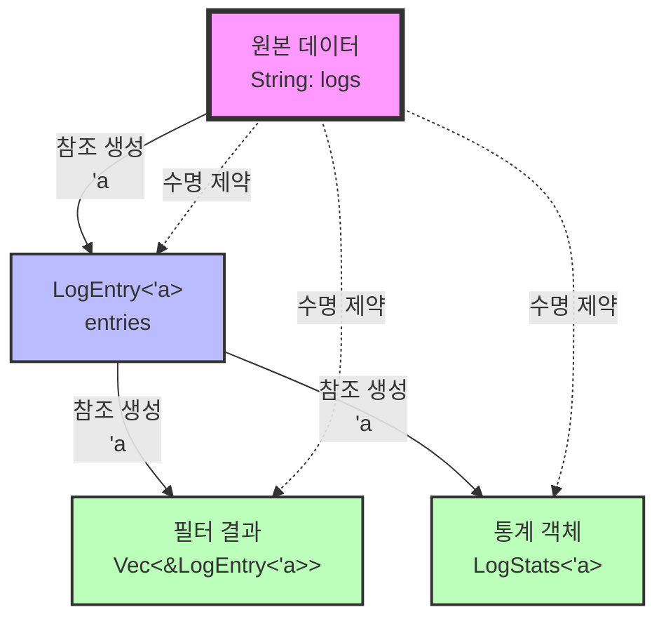

# 매일 1시간만으로 만들면서 배우는 Rust 프로그래밍:   

# Day 9: 라이프타임 기초
지금까지 우리는 소유권과 빌림을 통해 Rust가 어떻게 메모리 안전성을 보장하는지 배웠다. 하지만 참조를 사용하다 보면 컴파일러가 "lifetime parameter가 필요하다"는 메시지를 보여주는 경우가 있다. 오늘은 라이프타임이 무엇이며, 왜 필요한지, 그리고 실전에서 어떻게 사용하는지 로그 파서 예제를 통해 배워보겠다.

## **라이프타임이란 무엇인가**
라이프타임은 참조가 유효한 범위를 나타내는 개념이다. Rust 컴파일러는 모든 참조가 항상 유효한 데이터를 가리키도록 보장해야 하는데, 이를 위해 참조의 수명을 추적한다. 대부분의 경우 컴파일러가 자동으로 라이프타임을 추론하지만, 때로는 명시적으로 관계를 알려줘야 한다.

가장 중요한 것은 라이프타임이 참조의 유효 기간을 나타내지만, 실제로 데이터가 언제 해제되는지를 제어하지는 않는다는 점이다. 라이프타임은 단지 컴파일러에게 참조들 간의 관계를 설명하는 방법일 뿐이다.

## **댕글링 참조 문제**
라이프타임이 왜 필요한지 이해하기 위해, 먼저 Rust가 방지하려는 문제를 살펴보자. 다음은 댕글링 참조(dangling reference)를 만들려는 시도다.

```rust
fn main() {
    let r;
    
    {
        let x = 5;
        r = &x;  // 에러! x는 이 블록을 벗어나면 사라진다
    }
    
    println!("r: {}", r);  // r이 가리키는 데이터는 이미 없어졌다
}
```

이 코드는 컴파일되지 않는다. `x`는 내부 블록이 끝나면 스코프를 벗어나 해제되는데, `r`은 그 이후에도 `x`를 참조하려고 한다. Rust 컴파일러는 라이프타임 분석을 통해 이런 문제를 컴파일 타임에 잡아낸다.

```
error[E0597]: `x` does not live long enough
 --> src/main.rs:6:13
  |
6 |         r = &x;
  |             ^^ borrowed value does not live long enough
7 |     }
  |     - `x` dropped here while still borrowed
8 |     
9 |     println!("r: {}", r);
  |                       - borrow later used here
```

컴파일러 메시지가 명확하게 문제를 설명한다. `x`가 충분히 오래 살지 못한다는 것이다.

## **함수에서의 라이프타임**

이제 실전 상황을 보자. 로그 파서에서 로그 라인 중 가장 긴 것을 찾는 함수를 만든다고 가정하자.

```rust
fn longest(x: &str, y: &str) -> &str {
    if x.len() > y.len() {
        x
    } else {
        y
    }
}

fn main() {
    let string1 = String::from("long string is long");
    let string2 = String::from("short");
    
    let result = longest(string1.as_str(), string2.as_str());
    println!("가장 긴 문자열: {}", result);
}
```

이 코드도 컴파일되지 않는다. 에러 메시지를 보자.

```
error[E0106]: missing lifetime specifier
 --> src/main.rs:1:38
  |
1 | fn longest(x: &str, y: &str) -> &str {
  |               ----     ----     ^ expected named lifetime parameter
  |
  = help: this function's return type contains a borrowed value,
          but the signature does not say whether it is borrowed from `x` or `y`
```

컴파일러가 문제를 정확히 지적한다. 반환되는 참조가 `x`에서 온 것인지 `y`에서 온 것인지 알 수 없다는 것이다. 컴파일러는 함수 본문을 보지 않고 시그니처만으로 판단하기 때문에, 반환되는 참조의 라이프타임을 명시해야 한다.

## **라이프타임 명시하기**

라이프타임은 작은따옴표와 함께 짧은 이름으로 표기한다. 관례적으로 `'a`, `'b` 같은 이름을 사용한다. 위 함수를 수정해보자.

```rust
fn longest<'a>(x: &'a str, y: &'a str) -> &'a str {
    if x.len() > y.len() {
        x
    } else {
        y
    }
}
```

이 시그니처는 컴파일러에게 다음을 알려준다: "어떤 라이프타임 `'a`에 대해, 이 함수는 두 개의 문자열 슬라이스를 받는데 둘 다 최소한 `'a`만큼 살아있다. 그리고 반환하는 문자열 슬라이스도 `'a`만큼 살아있다."

```
     함수 시그니처의 라이프타임 명시
     
     fn longest<'a>(x: &'a str, y: &'a str) -> &'a str
                ^^^^   ^^^^^^^     ^^^^^^^      ^^^^^^^
                 |         |           |            |
                 |         |           |            +-- 반환값은 'a만큼 산다
                 |         |           +-- y도 'a만큼 산다
                 |         +-- x는 'a만큼 산다
                 +-- 'a는 라이프타임 매개변수
```

중요한 점은 우리가 참조의 실제 수명을 바꾸는 것이 아니라는 것이다. 단지 여러 참조의 라이프타임이 서로 어떤 관계인지를 설명할 뿐이다. 실제로 `'a`는 `x`와 `y`의 라이프타임 중 더 짧은 것으로 결정된다.

```rust
fn main() {
    let string1 = String::from("long string is long");
    
    {
        let string2 = String::from("short");
        let result = longest(string1.as_str(), string2.as_str());
        println!("가장 긴 문자열: {}", result);
    }  // result, string2가 여기서 스코프를 벗어난다
}
```

이 코드는 정상적으로 작동한다. `result`가 사용되는 시점에 `string1`과 `string2`가 모두 유효하기 때문이다.

하지만 다음 코드는 컴파일되지 않는다.

```rust
fn main() {
    let string1 = String::from("long string is long");
    let result;
    
    {
        let string2 = String::from("short");
        result = longest(string1.as_str(), string2.as_str());
    }  // string2가 여기서 스코프를 벗어난다
    
    println!("가장 긴 문자열: {}", result);  // 에러!
}
```

`result`가 `string2`를 참조할 수도 있는데, `string2`는 이미 사라졌기 때문에 컴파일러가 이를 거부한다.

## **실전: 로그 엔트리 구조체에 참조 저장하기**

이제 실용적인 예제로 넘어가자. 로그 파일을 파싱할 때, 원본 로그 라인을 복사하지 않고 참조로 저장하면 성능과 메모리 효율이 좋아진다. 하지만 구조체에 참조를 저장하려면 라이프타임을 명시해야 한다.

```rust
// 로그 엔트리 구조체 (참조를 포함)
struct LogEntry<'a> {
    timestamp: &'a str,
    level: &'a str,
    message: &'a str,
}

impl<'a> LogEntry<'a> {
    // 로그 라인을 파싱하여 LogEntry 생성
    fn parse(line: &'a str) -> Option<LogEntry<'a>> {
        let parts: Vec<&str> = line.splitn(3, '|').collect();
        
        if parts.len() != 3 {
            return None;
        }
        
        Some(LogEntry {
            timestamp: parts[0].trim(),
            level: parts[1].trim(),
            message: parts[2].trim(),
        })
    }
    
    // 로그 레벨이 ERROR인지 확인
    fn is_error(&self) -> bool {
        self.level == "ERROR"
    }
    
    // 포맷팅된 출력
    fn format(&self) -> String {
        format!("[{}] {}: {}", self.timestamp, self.level, self.message)
    }
}

fn main() {
    let log_line = String::from("2024-12-25 10:30:45|ERROR|Database connection failed");
    
    if let Some(entry) = LogEntry::parse(&log_line) {
        println!("파싱 성공!");
        println!("시간: {}", entry.timestamp);
        println!("레벨: {}", entry.level);
        println!("메시지: {}", entry.message);
        
        if entry.is_error() {
            println!("⚠️  에러 로그입니다!");
        }
        
        println!("\n포맷팅: {}", entry.format());
    }
}
```

실행 결과는 다음과 같다.

```
파싱 성공!
시간: 2024-12-25 10:30:45
레벨: ERROR
메시지: Database connection failed
⚠️  에러 로그입니다!

포맷팅: [2024-12-25 10:30:45] ERROR: Database connection failed
```

구조체 정의를 자세히 보자.

```rust
struct LogEntry<'a> {
    timestamp: &'a str,
    level: &'a str,
    message: &'a str,
}
```

`LogEntry<'a>`는 "이 구조체는 라이프타임 `'a`를 가진 참조들을 포함한다"는 의미다. 이는 `LogEntry` 인스턴스가 그 안의 참조들보다 더 오래 살 수 없다는 것을 보장한다.

```
     라이프타임 관계
     
     log_line (String)
     └─ 'a ─────────────────┐
                            │
     entry (LogEntry<'a>)   │
     ├─ timestamp: &'a str ─┤
     ├─ level: &'a str ─────┤
     └─ message: &'a str ───┘
     
     entry의 수명은 log_line보다 짧거나 같아야 한다
```

## **여러 로그 엔트리 필터링하기**

이제 여러 로그 라인을 처리하고, 에러만 필터링하는 함수를 만들어보자.

```rust
fn filter_errors<'a>(entries: &[LogEntry<'a>]) -> Vec<&LogEntry<'a>> {
    entries.iter()
        .filter(|entry| entry.is_error())
        .collect()
}

fn main() {
    let logs = vec![
        String::from("2024-12-25 10:30:45|INFO|Server started"),
        String::from("2024-12-25 10:31:12|ERROR|Database connection failed"),
        String::from("2024-12-25 10:31:15|WARN|Retrying connection"),
        String::from("2024-12-25 10:31:20|ERROR|Max retries exceeded"),
        String::from("2024-12-25 10:31:25|INFO|Falling back to cache"),
    ];
    
    // 모든 로그를 파싱
    let entries: Vec<LogEntry> = logs.iter()
        .filter_map(|line| LogEntry::parse(line))
        .collect();
    
    println!("전체 로그: {} 개\n", entries.len());
    
    // 에러만 필터링
    let errors = filter_errors(&entries);
    
    println!("에러 로그: {} 개", errors.len());
    for error in errors {
        println!("  {}", error.format());
    }
}
```

실행 결과다.

```
전체 로그: 5 개

에러 로그: 2 개
  [2024-12-25 10:31:12] ERROR: Database connection failed
  [2024-12-25 10:31:20] ERROR: Max retries exceeded
```

`filter_errors` 함수의 시그니처를 살펴보자.

```rust
fn filter_errors<'a>(entries: &[LogEntry<'a>]) -> Vec<&LogEntry<'a>>
```

이 함수는 `LogEntry<'a>`의 슬라이스를 받아서, 그 엔트리들에 대한 참조를 담은 벡터를 반환한다. 모든 참조가 같은 라이프타임 `'a`를 공유하므로, 반환된 벡터의 원소들은 원본 엔트리들이 살아있는 동안만 유효하다.

## **라이프타임 생략 규칙**

매번 라이프타임을 명시하면 코드가 복잡해진다. Rust는 흔한 패턴에 대해 라이프타임을 자동으로 추론하는 규칙을 가지고 있다. 이를 라이프타임 생략(lifetime elision)이라고 한다.

다음 세 가지 규칙을 적용한다.

1. 참조인 각 매개변수는 자신만의 라이프타임을 갖는다.
2. 입력 라이프타임이 정확히 하나라면, 그 라이프타임이 모든 출력 참조에 적용된다.
3. 메서드에서 `&self` 또는 `&mut self`가 있다면, `self`의 라이프타임이 모든 출력 참조에 적용된다.

예를 들어, 다음 두 함수는 동일하다.

```rust
// 명시적 라이프타임
fn first_word<'a>(s: &'a str) -> &'a str {
    s.split_whitespace().next().unwrap_or("")
}

// 생략된 라이프타임 (컴파일러가 자동 추론)
fn first_word(s: &str) -> &str {
    s.split_whitespace().next().unwrap_or("")
}
```

입력이 하나이고 출력도 하나이므로, 컴파일러가 자동으로 출력의 라이프타임이 입력과 같다고 추론한다.

우리의 `LogEntry::is_error` 메서드도 라이프타임을 명시할 필요가 없었다.

```rust
impl<'a> LogEntry<'a> {
    fn is_error(&self) -> bool {  // 라이프타임 명시 불필요
        self.level == "ERROR"
    }
}
```

반환 타입이 참조가 아니므로 라이프타임과 무관하다. 만약 `self`의 일부를 참조로 반환한다면, 자동으로 `self`의 라이프타임을 따른다.

## **실전: 로그 통계 수집기**

이제 조금 더 복잡한 예제를 만들어보자. 로그 파일에서 통계를 수집하는데, 각 레벨별로 첫 번째 로그 메시지를 저장한다.

```rust
use std::collections::HashMap;

struct LogStats<'a> {
    total_count: usize,
    first_by_level: HashMap<&'a str, &'a LogEntry<'a>>,
}

impl<'a> LogStats<'a> {
    fn new() -> Self {
        LogStats {
            total_count: 0,
            first_by_level: HashMap::new(),
        }
    }
    
    fn add_entry(&mut self, entry: &'a LogEntry<'a>) {
        self.total_count += 1;
        
        // 해당 레벨의 첫 엔트리만 저장
        self.first_by_level.entry(entry.level).or_insert(entry);
    }
    
    fn report(&self) {
        println!("=== 로그 통계 ===");
        println!("전체 로그 수: {}\n", self.total_count);
        
        println!("레벨별 첫 출현:");
        for (level, entry) in &self.first_by_level {
            println!("  {}: {}", level, entry.format());
        }
    }
}

fn main() {
    let logs = vec![
        String::from("2024-12-25 10:30:45|INFO|Server started"),
        String::from("2024-12-25 10:31:12|ERROR|Database connection failed"),
        String::from("2024-12-25 10:31:15|WARN|Retrying connection"),
        String::from("2024-12-25 10:31:20|ERROR|Max retries exceeded"),
        String::from("2024-12-25 10:31:25|INFO|Falling back to cache"),
        String::from("2024-12-25 10:31:30|WARN|Cache miss rate high"),
    ];
    
    let entries: Vec<LogEntry> = logs.iter()
        .filter_map(|line| LogEntry::parse(line))
        .collect();
    
    let mut stats = LogStats::new();
    
    for entry in &entries {
        stats.add_entry(entry);
    }
    
    stats.report();
}
```

실행 결과다.

```
=== 로그 통계 ===
전체 로그 수: 6

레벨별 첫 출현:
  ERROR: [2024-12-25 10:31:12] ERROR: Database connection failed
  INFO: [2024-12-25 10:30:45] INFO: Server started
  WARN: [2024-12-25 10:31:15] WARN: Retrying connection
```

이 예제에서 `LogStats<'a>`는 `LogEntry<'a>`에 대한 참조를 저장한다. 이는 통계 객체가 로그 엔트리들이 살아있는 동안만 유효하다는 것을 의미한다.

```
     데이터 라이프타임 흐름
     
     logs (Vec<String>) ─────────────┐
                                     │
     entries (Vec<LogEntry<'a>>) ────┤
                                     │
     stats (LogStats<'a>) ───────────┘
     └─ first_by_level: HashMap<&'a str, &'a LogEntry<'a>>
     
     모든 참조는 logs가 살아있는 동안 유효하다
```

## **라이프타임과 메서드**

메서드의 라이프타임은 특별한 규칙을 따른다. `impl` 블록에 라이프타임을 선언하고, 구조체 이름 뒤에도 명시해야 한다.

```rust
impl<'a> LogEntry<'a> {
    // 'a는 이미 선언되어 있으므로 메서드에서 바로 사용 가능
    fn get_message(&self) -> &'a str {
        self.message
    }
    
    // 다른 라이프타임을 추가로 도입할 수도 있다
    fn find_in_message<'b>(&self, pattern: &'b str) -> bool {
        self.message.contains(pattern)
    }
}
```

`get_message`는 구조체의 라이프타임 `'a`를 그대로 사용하고, `find_in_message`는 독립적인 라이프타임 `'b`를 가진 패턴을 받는다.

## **정적 라이프타임**

특별한 라이프타임 `'static`은 프로그램 전체 실행 기간 동안 살아있는 참조를 의미한다. 문자열 리터럴은 모두 `'static` 라이프타임을 갖는다.

```rust
let s: &'static str = "프로그램 전체에서 유효한 문자열";
```

프로그램 바이너리에 직접 저장되므로 항상 유효하다. 하지만 `'static`을 남용하면 안 된다. 대부분의 경우 일반 라이프타임으로 충분하며, `'static`을 요구하는 것은 보통 설계 문제의 신호다.

## **흔한 라이프타임 에러와 해결법**

### **에러 1: 참조가 원본보다 오래 살려고 함**

```rust
fn make_entry() -> LogEntry {  // 에러!
    let line = String::from("2024-12-25|INFO|Test");
    LogEntry::parse(&line).unwrap()
}  // line이 여기서 해제되지만 LogEntry는 line을 참조한다
```

해결법: 소유권을 가진 타입을 사용하거나, 호출자가 데이터를 제공하게 한다.

```rust
fn make_entry(line: &str) -> Option<LogEntry> {
    LogEntry::parse(line)
}
```

### **에러 2: 여러 라이프타임의 관계가 모호함**

```rust
fn choose_entry(x: &LogEntry, y: &LogEntry, use_first: bool) -> &LogEntry {
    // 에러! x와 y의 라이프타임 관계를 알 수 없다
    if use_first { x } else { y }
}
```

해결법: 라이프타임을 명시한다.

```rust
fn choose_entry<'a>(x: &'a LogEntry, y: &'a LogEntry, use_first: bool) -> &'a LogEntry {
    if use_first { x } else { y }
}
```

## **ASCII 다이어그램: 라이프타임의 작동 방식**

```
시간 흐름 →

┌─────────────────────────────────────┐
│ fn main() {                         │
│   let log_line = String::from(...) │ ← log_line 시작 ('a)
│   ┌─────────────────────────────┐   │
│   │ let entry = parse(&log_line)│   │ ← entry 시작 (최대 'a까지)
│   │                             │   │
│   │ println!("{}", entry.msg)   │   │ ✓ 유효 (log_line 살아있음)
│   │                             │   │
│   └─────────────────────────────┘   │ ← entry 끝
│ }                                   │ ← log_line 끝
└─────────────────────────────────────┘

라이프타임 'a는 log_line의 범위를 나타낸다
entry는 'a보다 길게 살 수 없다
```

## **Mermaid 다이어그램: 라이프타임 관계**



이 다이어그램은 원본 데이터에서 여러 참조가 파생되고, 모두 원본의 라이프타임에 제약받는 것을 보여준다.

## **실용적 가이드라인**

라이프타임을 다룰 때 다음 원칙들을 기억하자.

**첫째**, 가능하면 소유권을 가진 타입을 사용한다. `String`, `Vec<T>` 등은 라이프타임 고민 없이 사용할 수 있다. 참조는 성능이 중요하거나 데이터를 공유해야 할 때만 사용한다.

**둘째**, 컴파일러 메시지를 신뢰한다. Rust 컴파일러의 라이프타임 에러 메시지는 매우 명확하다. 메시지가 제안하는 바를 따르면 대부분 해결된다.

**셋째**, 단순하게 유지한다. 복잡한 라이프타임 관계가 필요하다면, 설계를 재고해볼 시점이다. 클론을 사용하거나 구조를 단순화하는 것이 나을 수 있다.

**넷째**, 생략 규칙을 활용한다. 명시적 라이프타임은 필요할 때만 쓴다. 컴파일러가 요구할 때 추가하면 된다.

## **오늘 배운 내용 정리**

오늘은 라이프타임의 기초를 배웠다. 라이프타임은 참조가 유효한 범위를 나타내며, 댕글링 참조를 방지하기 위해 존재한다. 함수와 구조체에서 참조를 사용할 때 라이프타임을 명시해야 하는 경우가 있으며, 이는 컴파일러에게 참조들 간의 관계를 설명하는 방법이다.

로그 파서 예제를 통해 실전에서 라이프타임이 어떻게 사용되는지 보았다. 구조체에 참조를 저장하고, 필터링하고, 통계를 수집하면서 모든 참조가 원본 데이터의 수명에 묶여있음을 확인했다.

라이프타임은 처음에는 어렵게 느껴지지만, 실제로는 우리가 이미 알고 있던 "참조는 원본이 사라지면 무효가 된다"는 개념을 형식화한 것일 뿐이다. 연습을 통해 자연스럽게 익힐 수 있다.

내일은 `Clone`과 `Copy` 트레잇을 배우면서, 언제 데이터를 복사하고 언제 참조를 사용할지 판단하는 법을 익힐 것이다. 라이프타임과 소유권을 완전히 이해하면, Rust의 나머지 기능들은 훨씬 쉽게 느껴질 것이다.    