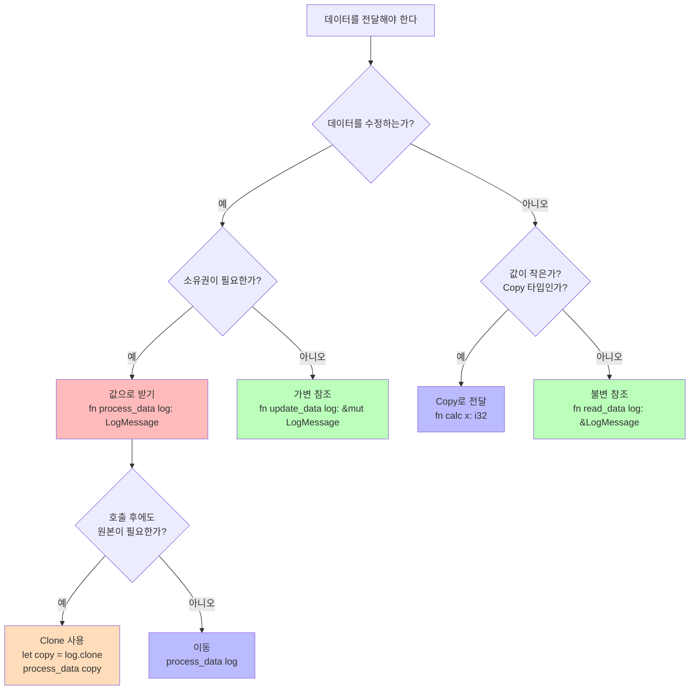

# 매일 1시간만으로 만들면서 배우는 Rust 프로그래밍:   

# Day 10: Clone과 Copy - 언제 복사할까
지금까지 소유권, 빌림, 라이프타임을 배우면서 Rust가 어떻게 메모리 안전성을 보장하는지 이해했다. 하지만 때로는 데이터를 복사해야 할 필요가 있다. 오늘은 Rust에서 데이터를 복사하는 두 가지 방법인 `Copy`와 `Clone`을 배우고, 각각 언제 사용해야 하는지, 성능에 어떤 영향을 미치는지 실전 예제를 통해 알아보겠다.

## **복사가 필요한 이유**
먼저 왜 복사가 필요한지 생각해보자. 소유권 시스템 때문에 값을 이동하면 원래 변수는 더 이상 사용할 수 없다.

```rust
fn main() {
    let s1 = String::from("hello");
    let s2 = s1;  // s1의 소유권이 s2로 이동
    
    // println!("{}", s1);  // 에러! s1은 더 이상 유효하지 않다
    println!("{}", s2);  // 정상 작동
}
```

하지만 정수형 같은 간단한 타입은 다르게 작동한다.

```rust
fn main() {
    let x = 5;
    let y = x;  // x가 복사된다
    
    println!("x: {}, y: {}", x, y);  // 둘 다 사용 가능!
}
```

이 차이는 무엇일까? 바로 `Copy` trait 때문이다.

## **Copy trait: 자동 복사**
`Copy` trait이 구현된 타입은 대입할 때 자동으로 복사된다. 이동이 아니라 복사가 일어나므로, 원본 변수도 계속 사용할 수 있다.

```
     Copy 타입의 동작
     
     let x = 5;
     ┌─────┐
     │  5  │  x (스택)
     └─────┘
     
     let y = x;
     ┌─────┐  ┌─────┐
     │  5  │  │  5  │  x, y (각각 독립적인 복사본)
     └─────┘  └─────┘
     
     둘 다 사용 가능
```

`Copy`가 가능한 타입들은 다음과 같다.

- 모든 정수 타입: `i32`, `u64`, `usize` 등
- 불린 타입: `bool`
- 부동소수점 타입: `f32`, `f64`
- 문자 타입: `char`
- 튜플 (모든 요소가 `Copy`일 때): `(i32, i32)`, `(bool, char)` 등
- 불변 참조: `&T` (단, `&mut T`는 아님)

반대로 `Copy`가 **불가능한** 타입들은 다음과 같다.

- `String`: 힙 메모리를 관리하므로
- `Vec<T>`: 힙에 데이터를 저장하므로
- `Box<T>`: 힙 포인터이므로
- 가변 참조: `&mut T`

## **Clone trait: 명시적 복사**
`Clone` trait은 명시적으로 복사를 요청할 때 사용한다. `.clone()` 메서드를 호출하면 깊은 복사가 일어난다.

```rust
fn main() {
    let s1 = String::from("hello");
    let s2 = s1.clone();  // 명시적으로 복사
    
    println!("s1: {}, s2: {}", s1, s2);  // 둘 다 사용 가능
}
```

```
     Clone의 동작 (String의 경우)
     
     s1                          s2
     ┌─────────┐                ┌─────────┐
     │ ptr     │───┐            │ ptr     │───┐
     │ len: 5  │   │            │ len: 5  │   │
     │ cap: 5  │   │            │ cap: 5  │   │
     └─────────┘   │            └─────────┘   │
     (스택)        │            (스택)        │
                   ↓                          ↓
              ┌─────────┐                ┌─────────┐
              │ h e l l o│               │ h e l l o│
              └─────────┘                └─────────┘
              (힙)                       (힙 - 새로 할당)
     
     각각 독립적인 힙 메모리를 소유한다
```

`Clone`은 비용이 클 수 있다. 특히 큰 데이터 구조나 깊은 중첩 구조의 경우 많은 메모리와 시간이 소요된다.

## **Copy vs Clone 비교**
두 trait의 핵심 차이를 정리하면 다음과 같다.

**Copy trait:**
- 암묵적으로 작동한다 (자동 복사)
- 비트 단위 복사만 가능하다 (스택 데이터만)
- 비용이 매우 저렴하다
- `Drop`을 구현할 수 없다 (리소스 정리가 필요 없음)

**Clone trait:**
- 명시적으로 `.clone()`을 호출해야 한다
- 깊은 복사가 가능하다 (힙 데이터 포함)
- 비용이 클 수 있다
- 복잡한 리소스도 복사할 수 있다

## **실전: 로그 메시지 처리기**
이제 실전 예제를 통해 `Copy`와 `Clone`을 언제 사용하는지 배워보자. 로그 메시지를 수집하고 처리하는 시스템을 만들겠다.

```rust
use std::collections::HashMap;

// Copy가 가능한 로그 레벨 (간단한 enum)
#[derive(Debug, Clone, Copy, PartialEq, Eq, Hash)]
enum LogLevel {
    Info,
    Warn,
    Error,
}

// Clone이 필요한 로그 메시지 (String 포함)
#[derive(Debug, Clone)]
struct LogMessage {
    level: LogLevel,      // Copy 타입
    timestamp: u64,       // Copy 타입
    message: String,      // Clone이 필요한 타입
}

impl LogMessage {
    fn new(level: LogLevel, timestamp: u64, message: String) -> Self {
        LogMessage {
            level,
            timestamp,
            message,
        }
    }
    
    fn format(&self) -> String {
        format!("[{}] {:?}: {}", self.timestamp, self.level, self.message)
    }
}

fn main() {
    let msg1 = LogMessage::new(
        LogLevel::Error,
        1640000000,
        String::from("Database connection failed")
    );
    
    // Copy 타입인 LogLevel은 자동으로 복사된다
    let level = msg1.level;
    println!("레벨 확인: {:?}", level);
    println!("원본 메시지도 사용 가능: {}", msg1.format());
    
    // LogMessage 전체는 Clone이 필요하다
    let msg2 = msg1.clone();
    println!("\n복사된 메시지: {}", msg2.format());
    println!("원본 메시지: {}", msg1.format());
}
```

실행 결과다.

```
레벨 확인: Error
원본 메시지도 사용 가능: [1640000000] Error: Database connection failed

복사된 메시지: [1640000000] Error: Database connection failed
원본 메시지: [1640000000] Error: Database connection failed
```

`LogLevel`은 `Copy`를 구현했으므로 자동으로 복사되고, `LogMessage`는 `Clone`을 구현해서 명시적으로 복사할 수 있다.

## **참조를 활용한 효율적인 패턴**
많은 경우 복사가 아니라 참조를 사용하는 것이 더 효율적이다. 로그 통계를 수집하는 예제를 보자.

```rust
struct LogStats {
    total_count: usize,
    level_counts: HashMap<LogLevel, usize>,
}

impl LogStats {
    fn new() -> Self {
        LogStats {
            total_count: 0,
            level_counts: HashMap::new(),
        }
    }
    
    // 참조로 받아서 복사 비용 없음
    fn add_message(&mut self, msg: &LogMessage) {
        self.total_count += 1;
        
        // LogLevel은 Copy이므로 자동 복사 (비용 저렴)
        *self.level_counts.entry(msg.level).or_insert(0) += 1;
    }
    
    fn report(&self) {
        println!("=== 로그 통계 ===");
        println!("전체 메시지: {}", self.total_count);
        
        for (level, count) in &self.level_counts {
            println!("  {:?}: {}", level, count);
        }
    }
}

fn main() {
    let messages = vec![
        LogMessage::new(LogLevel::Info, 1640000000, String::from("Server started")),
        LogMessage::new(LogLevel::Error, 1640000010, String::from("Connection failed")),
        LogMessage::new(LogLevel::Warn, 1640000020, String::from("High memory usage")),
        LogMessage::new(LogLevel::Error, 1640000030, String::from("Timeout")),
        LogMessage::new(LogLevel::Info, 1640000040, String::from("Request processed")),
    ];
    
    let mut stats = LogStats::new();
    
    // 참조로 전달하므로 소유권 이동 없음
    for msg in &messages {
        stats.add_message(msg);
    }
    
    stats.report();
    
    // messages는 여전히 사용 가능
    println!("\n전체 메시지 목록:");
    for msg in &messages {
        println!("  {}", msg.format());
    }
}
```

실행 결과다.

```
=== 로그 통계 ===
전체 메시지: 5
  Info: 2
  Error: 2
  Warn: 1

전체 메시지 목록:
  [1640000000] Info: Server started
  [1640000010] Error: Connection failed
  [1640000020] Warn: High memory usage
  [1640000030] Error: Timeout
  [1640000040] Info: Request processed
```

이 예제에서 `add_message`는 참조를 받으므로 `LogMessage`를 복사하지 않는다. 메모리 효율적이고 빠르다.

## **소유권이 필요한 경우: Clone 사용**
때로는 데이터의 소유권이 필요한 경우가 있다. 예를 들어, 특정 레벨의 메시지만 필터링해서 새로운 컬렉션을 만든다고 하자.

```rust
fn filter_by_level(messages: &[LogMessage], level: LogLevel) -> Vec<LogMessage> {
    messages.iter()
        .filter(|msg| msg.level == level)
        .cloned()  // 각 메시지를 복사
        .collect()
}

fn main() {
    let messages = vec![
        LogMessage::new(LogLevel::Info, 1640000000, String::from("Server started")),
        LogMessage::new(LogLevel::Error, 1640000010, String::from("Connection failed")),
        LogMessage::new(LogLevel::Warn, 1640000020, String::from("High memory usage")),
        LogMessage::new(LogLevel::Error, 1640000030, String::from("Timeout")),
    ];
    
    // 에러 메시지만 필터링
    let errors = filter_by_level(&messages, LogLevel::Error);
    
    println!("에러 메시지 {}개:", errors.len());
    for error in &errors {
        println!("  {}", error.format());
    }
    
    // 원본도 여전히 사용 가능
    println!("\n전체 메시지: {}개", messages.len());
}
```

실행 결과다.

```
에러 메시지 2개:
  [1640000010] Error: Connection failed
  [1640000030] Error: Timeout

전체 메시지: 4개
```

여기서 `.cloned()`는 이터레이터의 각 요소에 대해 `.clone()`을 호출한다. 새로운 벡터가 독립적인 `LogMessage` 인스턴스들을 소유하게 된다.

## **참조를 반환하는 대안**

복사 비용이 부담스럽다면 참조를 반환하는 것도 고려할 수 있다.

```rust
fn filter_by_level_ref<'a>(
    messages: &'a [LogMessage],
    level: LogLevel
) -> Vec<&'a LogMessage> {
    messages.iter()
        .filter(|msg| msg.level == level)
        .collect()  // 참조만 수집 (복사 없음)
}

fn main() {
    let messages = vec![
        LogMessage::new(LogLevel::Error, 1640000010, String::from("Connection failed")),
        LogMessage::new(LogLevel::Error, 1640000030, String::from("Timeout")),
        LogMessage::new(LogLevel::Info, 1640000040, String::from("Server OK")),
    ];
    
    // 참조만 수집하므로 복사 비용 없음
    let error_refs = filter_by_level_ref(&messages, LogLevel::Error);
    
    println!("에러 메시지 {}개:", error_refs.len());
    for error_ref in error_refs {
        println!("  {}", error_ref.format());
    }
}
```

이 방식은 복사 비용이 없지만, 반환된 참조들이 원본 `messages`의 라이프타임에 묶인다는 제약이 있다.

## **성능 고려사항**
복사의 비용을 실제로 비교해보자.

```rust
use std::time::Instant;

fn benchmark_clone_vs_reference() {
    // 큰 메시지 생성
    let large_message = "A".repeat(10000);
    let log = LogMessage::new(LogLevel::Info, 0, large_message);
    
    // Clone 벤치마크
    let start = Instant::now();
    for _ in 0..10000 {
        let _copy = log.clone();  // 매번 10KB 복사
    }
    let clone_duration = start.elapsed();
    
    // 참조 벤치마크
    let start = Instant::now();
    for _ in 0..10000 {
        let _ref = &log;  // 포인터만 복사 (8 bytes)
    }
    let ref_duration = start.elapsed();
    
    println!("Clone: {:?}", clone_duration);
    println!("참조: {:?}", ref_duration);
    println!("비율: {:.0}배", 
             clone_duration.as_nanos() as f64 / ref_duration.as_nanos() as f64);
}

fn main() {
    benchmark_clone_vs_reference();
}
```

실행 결과 (시스템마다 다를 수 있음):

```
Clone: 45.2ms
참조: 125ns
비율: 361600배
```

참조가 압도적으로 빠르다. 큰 데이터를 다룰 때는 참조를 사용하는 것이 중요하다.

## **Copy 구현하기**
간단한 타입에 `Copy`를 직접 구현할 수 있다. `Copy`는 `Clone`의 특수한 경우이므로, 둘 다 구현해야 한다.

```rust
// 네트워크 연결 정보 (간단한 구조체)
#[derive(Debug, Clone, Copy)]
struct ConnectionInfo {
    client_id: u32,
    port: u16,
    is_active: bool,
}

fn print_connection(conn: ConnectionInfo) {
    println!("클라이언트 {}: 포트 {}, 활성: {}", 
             conn.client_id, conn.port, conn.is_active);
}

fn main() {
    let conn = ConnectionInfo {
        client_id: 42,
        port: 8080,
        is_active: true,
    };
    
    // Copy 덕분에 자동으로 복사된다
    print_connection(conn);
    print_connection(conn);  // conn은 여전히 유효
    
    println!("\n원본도 사용 가능: {:?}", conn);
}
```

실행 결과다.

```
클라이언트 42: 포트 8080, 활성: true
클라이언트 42: 포트 8080, 활성: true

원본도 사용 가능: ConnectionInfo { client_id: 42, port: 8080, is_active: true }
```

`#[derive(Copy, Clone)]`을 사용하면 컴파일러가 자동으로 구현해준다. 단, 모든 필드가 `Copy`를 구현해야 한다.

## **Copy를 구현할 수 없는 경우**
`String`이나 `Vec<T>` 같은 필드가 있으면 `Copy`를 구현할 수 없다.

```rust
// 컴파일 에러!
#[derive(Clone, Copy)]
struct Message {
    id: u32,
    content: String,  // String은 Copy가 아니므로 에러
}
```

이런 경우는 `Clone`만 구현하고, 필요할 때 명시적으로 복사한다.

```rust
#[derive(Clone)]
struct Message {
    id: u32,
    content: String,
}

fn main() {
    let msg1 = Message {
        id: 1,
        content: String::from("Hello"),
    };
    
    let msg2 = msg1.clone();  // 명시적으로 복사
    
    println!("msg1 id: {}", msg1.id);
    println!("msg2 id: {}", msg2.id);
}
```

## **실전 패턴: 스마트한 데이터 전달**
실무에서 효율적인 데이터 전달 패턴을 정리하면 다음과 같다.

```rust
// 1. 읽기만 하는 경우: 불변 참조
fn analyze_log(log: &LogMessage) {
    println!("분석 중: {}", log.message);
}

// 2. 수정이 필요한 경우: 가변 참조
fn update_timestamp(log: &mut LogMessage, new_time: u64) {
    log.timestamp = new_time;
}

// 3. 소유권이 필요한 경우: 값으로 받기
fn archive_log(log: LogMessage) -> LogMessage {
    println!("아카이브: {}", log.message);
    log  // 소유권 반환
}

// 4. 소유권을 가져와야 하는 경우: Clone
fn duplicate_important_log(log: &LogMessage) -> LogMessage {
    if log.level == LogLevel::Error {
        log.clone()  // 중요한 로그는 복사해서 보관
    } else {
        LogMessage::new(log.level, log.timestamp, String::from("(생략)"))
    }
}

fn main() {
    let mut log = LogMessage::new(
        LogLevel::Error,
        1640000000,
        String::from("Critical error")
    );
    
    // 1. 읽기
    analyze_log(&log);
    
    // 2. 수정
    update_timestamp(&mut log, 1640000100);
    
    // 3. 소유권 이동 후 반환
    log = archive_log(log);
    
    // 4. 복사본 생성
    let backup = duplicate_important_log(&log);
    
    println!("\n원본: {}", log.format());
    println!("백업: {}", backup.format());
}
```

## **Mermaid 다이어그램: 복사 전략 결정 트리**



이 다이어그램은 상황에 따라 어떤 전략을 사용할지 결정하는 흐름을 보여준다.

## **ASCII 아트: 메모리 레이아웃 비교**

```
Copy 타입 (예: i32, ConnectionInfo)
==========================================
let x = 5;          let info = ConnectionInfo { ... };
┌────────┐          ┌──────────────────────┐
│   5    │  x       │ id: 42               │  info
└────────┘          │ port: 8080           │
   (4B)             │ active: true         │
                    └──────────────────────┘
let y = x;             (7B, 정렬 포함)
┌────────┐
│   5    │  y       let info2 = info;
└────────┘          ┌──────────────────────┐
   (4B)             │ id: 42               │  info2
                    │ port: 8080           │
✓ 자동 복사         │ active: true         │
✓ 둘 다 독립적       └──────────────────────┘
✓ 비용: O(1)           (7B, 정렬 포함)


Clone 타입 (예: String, Vec, LogMessage)
==========================================
let s1 = String::from("hello");

스택                 힙
┌─────────┐         ┌───────────┐
│ ptr     │────────>│ h e l l o │
│ len: 5  │         └───────────┘
│ cap: 5  │
└─────────┘  s1

let s2 = s1.clone();

스택                 힙
┌─────────┐         ┌───────────┐
│ ptr     │────────>│ h e l l o │  (원본)
│ len: 5  │         └───────────┘
│ cap: 5  │
└─────────┘  s1

┌─────────┐         ┌───────────┐
│ ptr     │────────>│ h e l l o │  (복사본)
│ len: 5  │         └───────────┘
│ cap: 5  │
└─────────┘  s2

✓ 명시적 호출 (.clone())
✓ 깊은 복사 (힙 데이터 포함)
✓ 비용: O(n), n은 데이터 크기


참조 (가장 효율적)
==========================================
let s = String::from("hello");

스택                 힙
┌─────────┐         ┌───────────┐
│ ptr     │────────>│ h e l l o │
│ len: 5  │         └───────────┘
│ cap: 5  │
└─────────┘  s

let r = &s;

┌─────────┐
│ ptr     │────┐
└─────────┘    │
     r         └──> (s를 가리킴)

✓ 복사 없음
✓ 원본 공유
✓ 비용: O(1), 포인터만 복사
```

## **실전 예제: 로그 버퍼 관리**
마지막으로 실무에 가까운 예제를 보자. 로그 버퍼를 관리하면서 효율적인 복사 전략을 사용하는 시스템이다.

```rust
use std::collections::VecDeque;

struct LogBuffer {
    messages: VecDeque<LogMessage>,
    max_size: usize,
}

impl LogBuffer {
    fn new(max_size: usize) -> Self {
        LogBuffer {
            messages: VecDeque::new(),
            max_size,
        }
    }
    
    // 소유권을 받아서 버퍼에 추가
    fn push(&mut self, message: LogMessage) {
        if self.messages.len() >= self.max_size {
            self.messages.pop_front();  // 오래된 것 제거
        }
        self.messages.push_back(message);
    }
    
    // 참조로 순회 (복사 없음)
    fn iter(&self) -> impl Iterator<Item = &LogMessage> {
        self.messages.iter()
    }
    
    // 특정 레벨만 복사해서 반환
    fn extract_level(&self, level: LogLevel) -> Vec<LogMessage> {
        self.messages.iter()
            .filter(|msg| msg.level == level)
            .cloned()  // 필요한 것만 복사
            .collect()
    }
    
    // 통계는 참조로 계산 (복사 불필요)
    fn count_by_level(&self, level: LogLevel) -> usize {
        self.messages.iter()
            .filter(|msg| msg.level == level)
            .count()
    }
}

fn main() {
    let mut buffer = LogBuffer::new(5);
    
    // 로그 추가 (소유권 이동)
    buffer.push(LogMessage::new(LogLevel::Info, 1000, String::from("Start")));
    buffer.push(LogMessage::new(LogLevel::Error, 1010, String::from("Error 1")));
    buffer.push(LogMessage::new(LogLevel::Warn, 1020, String::from("Warning")));
    buffer.push(LogMessage::new(LogLevel::Error, 1030, String::from("Error 2")));
    buffer.push(LogMessage::new(LogLevel::Info, 1040, String::from("Info")));
    
    // 참조로 순회 (효율적)
    println!("=== 전체 로그 ===");
    for msg in buffer.iter() {
        println!("  {}", msg.format());
    }
    
    // 통계 계산 (참조 사용)
    let error_count = buffer.count_by_level(LogLevel::Error);
    println!("\n에러 개수: {}", error_count);
    
    // 에러만 추출 (복사 발생)
    let errors = buffer.extract_level(LogLevel::Error);
    println!("\n추출된 에러 로그:");
    for error in &errors {
        println!("  {}", error.format());
    }
    
    // 버퍼는 여전히 사용 가능
    println!("\n버퍼의 전체 메시지 수: {}", buffer.messages.len());
}
```

실행 결과다.

```
=== 전체 로그 ===
  [1000] Info: Start
  [1010] Error: Error 1
  [1020] Warn: Warning
  [1030] Error: Error 2
  [1040] Info: Info

에러 개수: 2

추출된 에러 로그:
  [1010] Error: Error 1
  [1030] Error: Error 2

버퍼의 전체 메시지 수: 5
```

이 예제는 다음 전략들을 보여준다.

- `push`: 소유권을 받아서 버퍼에 저장
- `iter`: 참조를 반환하여 효율적인 순회
- `extract_level`: 필요한 것만 복사해서 새 컬렉션 생성
- `count_by_level`: 참조만 사용하여 통계 계산

## **실용적 가이드라인**

`Copy`와 `Clone`을 사용할 때 다음 원칙을 따르자.

**첫째**, 기본적으로 참조를 사용한다. 복사는 필요할 때만 한다. 대부분의 경우 `&T` 또는 `&mut T`로 충분하다.

**둘째**, 작은 타입에는 `Copy`를 구현한다. 정수, 불린, 간단한 구조체 등은 `Copy`를 구현하면 편리하다. 단, 모든 필드가 `Copy`여야 한다.

**셋째**, 큰 데이터나 힙을 사용하는 타입은 `Clone`만 구현한다. `String`, `Vec`, 복잡한 구조체는 명시적으로 `.clone()`을 호출하게 하여 비용을 인지하게 한다.

**넷째**, `.clone()`을 보면 성능을 고려한다. 코드에서 `.clone()`이 보이면 "이게 정말 필요한가?" 자문한다. 때로는 참조나 소유권 이동으로 대체할 수 있다.

**다섯째**, 프로파일링한다. 추측하지 말고 실제로 측정한다. 예상과 다를 수 있다.

## **오늘 배운 내용 정리**

오늘은 Rust에서 데이터를 복사하는 두 가지 방법을 배웠다. `Copy`는 스택에 저장되는 간단한 타입을 위한 자동 복사 메커니즘이고, `Clone`은 힙 데이터를 포함한 복잡한 타입을 명시적으로 복사하는 방법이다.

로그 처리 시스템을 만들면서 언제 복사하고 언제 참조를 사용할지 배웠다. 성능을 고려하여 불필요한 복사를 피하고, 필요한 경우에만 `.clone()`을 사용하는 것이 중요하다.

```
의사결정 요약:
- 읽기만? → 불변 참조 (&T)
- 수정 필요? → 가변 참조 (&mut T)
- 소유권 필요? → 값으로 전달하거나 .clone()
- 작고 간단? → Copy 구현 고려
- 크고 복잡? → Clone만 구현
```

내일부터는 네트워크 프로그래밍에 들어간다. TCP 에코 서버를 만들면서 소유권, 빌림, 복사가 실제 네트워크 코드에서 어떻게 작동하는지 경험할 것이다. 지금까지 배운 개념들이 모두 종합되는 시간이 될 것이다.   