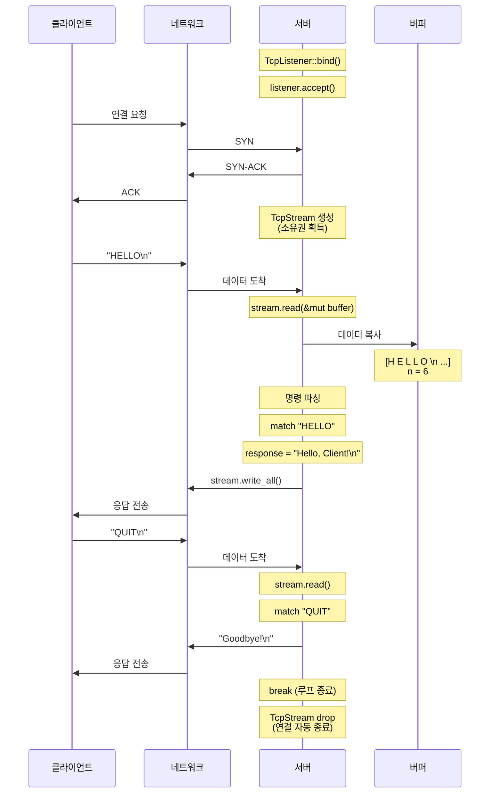

# 매일 1시간만으로 만들면서 배우는 Rust 프로그래밍:   

# Day 11: 첫 TCP 서버 - 한 클라이언트 처리
드디어 네트워크 프로그래밍에 들어왔다. 지금까지 배운 소유권, 빌림, 에러 처리가 실제 네트워크 코드에서 어떻게 작동하는지 경험할 시간이다. 오늘은 가장 기본적인 TCP 서버를 만들어보겠다. 한 번에 한 클라이언트만 처리하는 단순한 에코 서버지만, 실전 네트워크 프로그래밍의 핵심 개념들을 모두 담고 있다.

## **TCP 통신의 기초**
TCP(Transmission Control Protocol)는 신뢰할 수 있는 양방향 통신을 제공하는 프로토콜이다. 웹 브라우저, 이메일, 파일 전송 등 대부분의 인터넷 통신이 TCP를 사용한다.

TCP 통신은 다음과 같은 흐름으로 이루어진다.

```
서버                                클라이언트
│                                   │
│ TcpListener::bind("127.0.0.1:8080")
│ (포트 8080에서 대기)               │
│                                   │
│                                   │ TcpStream::connect("127.0.0.1:8080")
│                                   │ (서버에 연결 요청)
│ ◄─────────── SYN ─────────────── │
│ ───────────── SYN-ACK ──────────► │
│ ◄─────────── ACK ─────────────── │
│                                   │
│ listener.accept()                 │
│ (연결 수락, TcpStream 반환)       │
│                                   │
│ ◄═══════════ 데이터 교환 ═══════► │
│                                   │
│ stream.read()                     │ stream.write()
│ stream.write()                    │ stream.read()
│                                   │
│ ◄─────────── FIN ──────────────── │
│ ───────────── ACK ───────────────► │
│ (연결 종료)                        │
```

서버는 특정 포트에서 대기하고, 클라이언트가 연결 요청을 보내면 수락한다. 그 후 양방향으로 데이터를 주고받을 수 있다.

## **첫 번째 TCP 서버 만들기**
가장 간단한 TCP 서버부터 시작하자. 새로운 프로젝트를 만든다.

```bash
cargo new echo_server
cd echo_server
```

`src/main.rs`에 다음 코드를 작성한다.

```rust
use std::net::TcpListener;
use std::io::{Read, Write};

fn main() {
    // 127.0.0.1:8080에서 연결을 기다린다
    let listener = TcpListener::bind("127.0.0.1:8080")
        .expect("포트 바인딩 실패");
    
    println!("서버가 127.0.0.1:8080에서 시작되었습니다");
    
    // 연결을 하나 받는다
    match listener.accept() {
        Ok((mut stream, addr)) => {
            println!("클라이언트 연결: {}", addr);
            
            // 데이터를 읽을 버퍼
            let mut buffer = [0; 512];
            
            // 데이터 읽기
            match stream.read(&mut buffer) {
                Ok(n) => {
                    println!("{}바이트 받음", n);
                    
                    // 받은 데이터를 그대로 돌려보낸다 (에코)
                    if let Err(e) = stream.write(&buffer[..n]) {
                        eprintln!("쓰기 에러: {}", e);
                    } else {
                        println!("에코 완료");
                    }
                }
                Err(e) => eprintln!("읽기 에러: {}", e),
            }
        }
        Err(e) => eprintln!("연결 수락 실패: {}", e),
    }
}
```

서버를 실행한다.

```bash
cargo run
```

다음 메시지가 나타난다.

```
서버가 127.0.0.1:8080에서 시작되었습니다
```

서버가 연결을 기다리고 있다. 이제 클라이언트로 테스트해보자.

## **telnet으로 서버 테스트하기**
새 터미널을 열고 telnet으로 연결한다.

```bash
telnet 127.0.0.1 8080
```

연결되면 아무 메시지나 입력하고 엔터를 친다. 예를 들어 "Hello"를 입력하면, 서버가 같은 메시지를 돌려보낸다.

서버 터미널에서는 다음과 같은 출력을 볼 수 있다.

```
클라이언트 연결: 127.0.0.1:xxxxx
6바이트 받음
에코 완료
```

성공이다! 첫 번째 TCP 서버가 작동한다.

## **코드 분석: 소유권과 빌림**
이제 코드를 자세히 분석하면서 소유권이 어떻게 작동하는지 보자.

```rust
let listener = TcpListener::bind("127.0.0.1:8080")
    .expect("포트 바인딩 실패");
```

`TcpListener::bind()`는 `Result<TcpListener, std::io::Error>`를 반환한다. `expect()`는 에러가 발생하면 프로그램을 종료하고, 성공하면 `TcpListener`의 소유권을 `listener`에게 준다.

```rust
match listener.accept() {
    Ok((mut stream, addr)) => {
        // ...
    }
}
```

`accept()`는 연결을 기다렸다가, 클라이언트가 연결하면 `Result<(TcpStream, SocketAddr), Error>`를 반환한다. 튜플의 첫 번째 요소는 연결된 스트림이고, 두 번째는 클라이언트의 주소다.

```
소유권 흐름

listener.accept()
    │
    ├─► TcpStream (stream으로 이동)
    │   └─► 가변 참조로 read/write 호출
    │
    └─► SocketAddr (addr로 이동)
        └─► Display trait으로 출력
```

`mut stream`으로 선언한 이유는 `read()`와 `write()`가 가변 참조를 필요로 하기 때문이다.

```rust
let mut buffer = [0; 512];

match stream.read(&mut buffer) {
    Ok(n) => {
        // buffer[..n]만 유효한 데이터
    }
}
```

`read()`는 `&mut self`와 `&mut [u8]`를 받는다. 스트림도 가변이어야 하고, 버퍼도 가변이어야 한다. `n`은 실제로 읽은 바이트 수다.

```rust
stream.write(&buffer[..n])
```

`write()`는 슬라이스 `&[u8]`를 받는다. `buffer[..n]`은 실제로 받은 데이터만을 나타내는 슬라이스다. 전체 버퍼가 아니라 유효한 부분만 전송한다.

## **에러 처리 개선하기**
위 코드는 작동하지만 에러 처리가 조잡하다. `Result`를 제대로 활용해보자.

```rust
use std::net::{TcpListener, TcpStream};
use std::io::{Read, Write, Error};

fn handle_client(mut stream: TcpStream) -> Result<(), Error> {
    let mut buffer = [0; 512];
    
    // 데이터 읽기
    let n = stream.read(&mut buffer)?;
    println!("{}바이트 받음: {}", n, 
             String::from_utf8_lossy(&buffer[..n]));
    
    // 에코
    stream.write_all(&buffer[..n])?;
    println!("에코 완료");
    
    Ok(())
}

fn main() -> Result<(), Error> {
    let listener = TcpListener::bind("127.0.0.1:8080")?;
    println!("서버가 127.0.0.1:8080에서 시작되었습니다");
    
    // 한 클라이언트 처리
    let (stream, addr) = listener.accept()?;
    println!("클라이언트 연결: {}", addr);
    
    if let Err(e) = handle_client(stream) {
        eprintln!("클라이언트 처리 중 에러: {}", e);
    }
    
    Ok(())
}
```

개선된 점들이다.

**첫째**, `handle_client` 함수로 분리했다. 관심사의 분리로 코드가 깔끔해진다.

**둘째**, `?` 연산자로 에러를 전파한다. 코드가 간결해지고 읽기 쉬워진다.

**셋째**, `write_all()`을 사용한다. `write()`는 전체를 쓰지 못할 수도 있지만, `write_all()`은 전체를 쓰거나 에러를 반환한다.

**넷째**, `main()`이 `Result`를 반환한다. 이제 `main()`에서도 `?` 연산자를 쓸 수 있다.

## **소유권 이동 살펴보기**
`handle_client(stream)`을 호출할 때 무슨 일이 일어나는지 보자.

```rust
let (stream, addr) = listener.accept()?;
println!("클라이언트 연결: {}", addr);

if let Err(e) = handle_client(stream) {  // stream의 소유권 이동
    eprintln!("클라이언트 처리 중 에러: {}", e);
}

// println!("{:?}", stream);  // 에러! stream은 이미 이동했다
```

`stream`은 `handle_client`로 이동했으므로, 그 이후에는 사용할 수 없다. 이는 의도된 동작이다. 함수가 스트림의 소유권을 가져가서 연결을 완전히 관리한다.

만약 소유권을 유지하고 싶다면 참조를 전달할 수도 있다.

```rust
fn handle_client(stream: &mut TcpStream) -> Result<(), Error> {
    // 같은 코드
}

fn main() -> Result<(), Error> {
    let listener = TcpListener::bind("127.0.0.1:8080")?;
    println!("서버가 127.0.0.1:8080에서 시작되었습니다");
    
    let (mut stream, addr) = listener.accept()?;
    println!("클라이언트 연결: {}", addr);
    
    if let Err(e) = handle_client(&mut stream) {
        eprintln!("클라이언트 처리 중 에러: {}", e);
    }
    
    // stream은 여전히 유효하다
    
    Ok(())
}
```

이 경우 함수가 끝난 후에도 `stream`을 사용할 수 있다. 상황에 따라 적절한 방식을 선택하면 된다.

## **실전: 간단한 프로토콜 구현하기**
단순 에코 대신 간단한 프로토콜을 구현해보자. 클라이언트가 보낸 명령에 따라 다르게 응답하는 서버다.

```rust
use std::net::{TcpListener, TcpStream};
use std::io::{Read, Write, Error};

fn handle_client(mut stream: TcpStream) -> Result<(), Error> {
    let mut buffer = [0; 512];
    
    loop {
        // 데이터 읽기
        let n = stream.read(&mut buffer)?;
        
        // 연결 종료
        if n == 0 {
            println!("클라이언트 연결 종료");
            break;
        }
        
        // 받은 데이터를 문자열로 변환
        let received = String::from_utf8_lossy(&buffer[..n]);
        let command = received.trim();
        
        println!("명령 받음: {}", command);
        
        // 명령 처리
        let response = match command {
            "HELLO" => "Hello, Client!\n",
            "TIME" => "2024-12-25 10:30:00\n",
            "PING" => "PONG\n",
            "QUIT" => {
                stream.write_all(b"Goodbye!\n")?;
                break;
            }
            _ => "Unknown command. Try: HELLO, TIME, PING, QUIT\n",
        };
        
        // 응답 전송
        stream.write_all(response.as_bytes())?;
    }
    
    Ok(())
}

fn main() -> Result<(), Error> {
    let listener = TcpListener::bind("127.0.0.1:8080")?;
    println!("서버가 127.0.0.1:8080에서 시작되었습니다");
    println!("명령어: HELLO, TIME, PING, QUIT");
    
    let (stream, addr) = listener.accept()?;
    println!("클라이언트 연결: {}", addr);
    
    if let Err(e) = handle_client(stream) {
        eprintln!("클라이언트 처리 중 에러: {}", e);
    }
    
    println!("서버 종료");
    Ok(())
}
```

이제 서버가 여러 명령을 처리할 수 있다. telnet으로 연결해서 테스트해보자.

```
$ telnet 127.0.0.1 8080
Trying 127.0.0.1...
Connected to localhost.

HELLO
Hello, Client!

PING
PONG

TIME
2024-12-25 10:30:00

UNKNOWN
Unknown command. Try: HELLO, TIME, PING, QUIT

QUIT
Goodbye!
Connection closed by foreign host.
```

서버 터미널에서는 다음과 같은 출력을 볼 수 있다.

```
서버가 127.0.0.1:8080에서 시작되었습니다
명령어: HELLO, TIME, PING, QUIT
클라이언트 연결: 127.0.0.1:xxxxx
명령 받음: HELLO
명령 받음: PING
명령 받음: TIME
명령 받음: UNKNOWN
명령 받음: QUIT
클라이언트 연결 종료
서버 종료
```

## **버퍼와 소유권**
네트워크 프로그래밍에서 버퍼 관리는 중요하다. 위 코드에서 버퍼가 어떻게 사용되는지 보자.

```rust
let mut buffer = [0; 512];

loop {
    let n = stream.read(&mut buffer)?;
    // buffer의 일부만 유효하다
    let received = String::from_utf8_lossy(&buffer[..n]);
    // ...
}
```

```
     버퍼 메모리 레이아웃
     
     buffer: [u8; 512]
     ┌──────────────────────────────┬──────────────┐
     │ H E L L O \n                 │ (쓰레기)      │
     └──────────────────────────────┴──────────────┘
      0         n=6                  512
      
      &buffer[..n]는 실제로 받은 데이터만 포함
```

`String::from_utf8_lossy()`는 `&[u8]`를 받아서 `Cow<str>`를 반환한다. 이는 소유권을 가져가지 않고 참조만 사용한다. 유효하지 않은 UTF-8 바이트는 대체 문자로 변환된다.

## **ASCII 아트: TCP 연결 상태**

```
서버의 상태 변화

┌─────────────┐
│   CLOSED    │
│  (시작 전)   │
└──────┬──────┘
       │ TcpListener::bind()
       ↓
┌─────────────┐
│   LISTEN    │ ←─────────────────┐
│  (대기 중)   │                   │
└──────┬──────┘                   │
       │ accept()                 │ 다음 연결 대기
       ↓ (블로킹)                  │
┌─────────────┐                   │
│ ESTABLISHED │                   │
│  (연결됨)    │                   │
└──────┬──────┘                   │
       │                          │
       │ ◄═══ 데이터 교환 ═══►    │
       │                          │
       │ read() / write()         │
       │                          │
       ↓                          │
┌─────────────┐                   │
│   CLOSED    │                   │
│ (연결 종료)  │───────────────────┘
└─────────────┘

한 클라이언트만 처리하므로 종료
```

## **Mermaid 다이어그램: 데이터 흐름**



이 다이어그램은 클라이언트와 서버 간의 전체 통신 흐름을 보여준다.

## **실전: 클라이언트도 만들어보기**
서버를 테스트하기 위해 Rust로 클라이언트도 만들어보자.

```rust
// src/bin/client.rs
use std::net::TcpStream;
use std::io::{self, Read, Write, BufRead};

fn main() -> io::Result<()> {
    let mut stream = TcpStream::connect("127.0.0.1:8080")?;
    println!("서버에 연결되었습니다");
    println!("명령어를 입력하세요 (종료: QUIT)");
    
    let stdin = io::stdin();
    let mut buffer = [0; 512];
    
    for line in stdin.lock().lines() {
        let line = line?;
        
        // 서버로 전송
        stream.write_all(line.as_bytes())?;
        stream.write_all(b"\n")?;
        
        // 응답 받기
        let n = stream.read(&mut buffer)?;
        if n == 0 {
            println!("서버 연결 종료");
            break;
        }
        
        let response = String::from_utf8_lossy(&buffer[..n]);
        print!("서버: {}", response);
        
        if line.trim() == "QUIT" {
            break;
        }
    }
    
    println!("클라이언트 종료");
    Ok(())
}
```

`Cargo.toml`에 바이너리를 추가한다.

```toml
[[bin]]
name = "client"
path = "src/bin/client.rs"
```

이제 두 개의 터미널을 열어서 테스트할 수 있다.

터미널 1 (서버):
```bash
cargo run
```

터미널 2 (클라이언트):
```bash
cargo run --bin client
```

클라이언트에서 명령을 입력하면 서버가 응답한다.

```
서버에 연결되었습니다
명령어를 입력하세요 (종료: QUIT)
HELLO
서버: Hello, Client!
PING
서버: PONG
QUIT
서버: Goodbye!
클라이언트 종료
```

## **소유권과 Drop: 자동 연결 종료**
`TcpStream`은 `Drop` trait을 구현한다. 스코프를 벗어나면 자동으로 연결이 닫힌다.

```rust
fn handle_client(mut stream: TcpStream) -> Result<(), Error> {
    // ... 처리 ...
    Ok(())
}  // 여기서 stream이 drop되고 연결이 자동으로 닫힌다

fn main() -> Result<(), Error> {
    let listener = TcpListener::bind("127.0.0.1:8080")?;
    
    let (stream, addr) = listener.accept()?;
    println!("클라이언트 연결: {}", addr);
    
    handle_client(stream)?;
    // stream의 소유권이 이동했으므로 여기서는 사용 불가
    // handle_client가 끝나면서 자동으로 연결 종료
    
    Ok(())
}
```

명시적으로 닫고 싶다면 `drop()`을 호출할 수 있다.

```rust
drop(stream);  // 명시적 종료
```

하지만 대부분의 경우 자동 drop으로 충분하다. 소유권 시스템이 리소스를 안전하게 관리해준다.

## **에러 시나리오 처리하기**
실제 네트워크 환경에서는 다양한 에러가 발생할 수 있다. 몇 가지 시나리오를 살펴보자.

```rust
use std::io::{Error, ErrorKind};

fn handle_client(mut stream: TcpStream) -> Result<(), Error> {
    let mut buffer = [0; 512];
    
    loop {
        match stream.read(&mut buffer) {
            Ok(0) => {
                // 정상적인 연결 종료
                println!("클라이언트가 연결을 닫았습니다");
                break;
            }
            Ok(n) => {
                // 데이터 처리
                let received = String::from_utf8_lossy(&buffer[..n]);
                let command = received.trim();
                
                println!("명령: {}", command);
                
                // 명령 처리 및 응답
                // ...
            }
            Err(e) if e.kind() == ErrorKind::WouldBlock => {
                // non-blocking 모드에서 데이터가 없을 때
                continue;
            }
            Err(e) if e.kind() == ErrorKind::Interrupted => {
                // 시스템 인터럽트 (재시도 가능)
                continue;
            }
            Err(e) => {
                // 복구 불가능한 에러
                eprintln!("읽기 에러: {}", e);
                return Err(e);
            }
        }
    }
    
    Ok(())
}
```

에러의 종류에 따라 다르게 처리한다. `ErrorKind`로 에러 유형을 확인하고 적절히 대응할 수 있다.

## **타임아웃 설정하기**
무한정 기다리지 않도록 타임아웃을 설정할 수 있다.

```rust
use std::time::Duration;

fn handle_client(mut stream: TcpStream) -> Result<(), Error> {
    // 읽기 타임아웃 설정 (5초)
    stream.set_read_timeout(Some(Duration::from_secs(5)))?;
    
    // 쓰기 타임아웃 설정 (5초)
    stream.set_write_timeout(Some(Duration::from_secs(5)))?;
    
    let mut buffer = [0; 512];
    
    match stream.read(&mut buffer) {
        Ok(n) => {
            // 정상 처리
        }
        Err(e) if e.kind() == ErrorKind::WouldBlock || 
                  e.kind() == ErrorKind::TimedOut => {
            println!("타임아웃: 클라이언트 응답 없음");
            return Ok(());
        }
        Err(e) => return Err(e),
    }
    
    Ok(())
}
```

타임아웃은 클라이언트가 응답하지 않는 경우를 처리하는 데 유용하다.

## **성능 고려사항: 버퍼 크기**
버퍼 크기는 성능에 영향을 미친다. 너무 작으면 여러 번 읽어야 하고, 너무 크면 메모리 낭비다.

```rust
// 작은 메시지용 (명령어 등)
let mut small_buffer = [0; 512];      // 512 bytes

// 일반적인 용도
let mut medium_buffer = [0; 4096];    // 4 KB

// 대용량 데이터 전송
let mut large_buffer = [0; 65536];    // 64 KB
```

실무에서는 4KB가 일반적인 선택이다. 대부분의 시스템에서 효율적으로 작동한다.

## **실용적 패턴: 재사용 가능한 핸들러**
실제 프로젝트에서는 핸들러를 재사용 가능하게 만드는 것이 좋다.

```rust
use std::collections::HashMap;

struct CommandHandler {
    commands: HashMap<String, Box<dyn Fn() -> String>>,
}

impl CommandHandler {
    fn new() -> Self {
        let mut commands: HashMap<String, Box<dyn Fn() -> String>> = HashMap::new();
        
        commands.insert("HELLO".to_string(), 
                       Box::new(|| "Hello, Client!\n".to_string()));
        commands.insert("PING".to_string(), 
                       Box::new(|| "PONG\n".to_string()));
        
        CommandHandler { commands }
    }
    
    fn handle(&self, command: &str) -> String {
        self.commands
            .get(command)
            .map(|f| f())
            .unwrap_or_else(|| "Unknown command\n".to_string())
    }
}

fn handle_client_with_handler(mut stream: TcpStream) -> Result<(), Error> {
    let handler = CommandHandler::new();
    let mut buffer = [0; 512];
    
    loop {
        let n = stream.read(&mut buffer)?;
        if n == 0 { break; }
        
        let command = String::from_utf8_lossy(&buffer[..n]);
        let command = command.trim();
        
        if command == "QUIT" {
            stream.write_all(b"Goodbye!\n")?;
            break;
        }
        
        let response = handler.handle(command);
        stream.write_all(response.as_bytes())?;
    }
    
    Ok(())
}
```

이 패턴은 확장 가능하고 테스트하기 쉽다. 새로운 명령을 추가하기도 간단하다.

## **오늘 배운 내용 정리**
오늘은 첫 번째 TCP 서버를 만들었다. `TcpListener`로 연결을 받고, `TcpStream`으로 데이터를 읽고 쓰는 기본을 배웠다. 

소유권 시스템이 네트워크 코드에서도 그대로 적용된다는 것을 확인했다. 스트림의 소유권을 함수로 이동하거나 참조로 빌릴 수 있고, 스코프를 벗어나면 자동으로 연결이 닫힌다.

버퍼를 사용한 데이터 읽기와 쓰기, 슬라이스를 활용한 효율적인 데이터 처리, 그리고 간단한 프로토콜 구현까지 실전 네트워크 프로그래밍의 기초를 다졌다.

```
오늘의 핵심 개념:
- TcpListener: 연결 대기
- TcpStream: 양방향 통신
- 소유권과 참조: 네트워크 리소스 관리
- 버퍼와 슬라이스: 효율적인 데이터 처리
- Drop trait: 자동 리소스 정리
```

지금은 한 번에 한 클라이언트만 처리하지만, 다음 장들에서 여러 클라이언트를 동시에 처리하는 방법을 배울 것이다. 오늘 배운 기초가 그 모든 것의 토대가 된다.

내일은 에러 처리를 심화하여 `?` 연산자를 활용한 깔끔한 에러 전파와 커스텀 에러 타입을 만드는 법을 배운다. 실전 서버에 필수적인 견고한 에러 처리 전략을 익힐 것이다.  