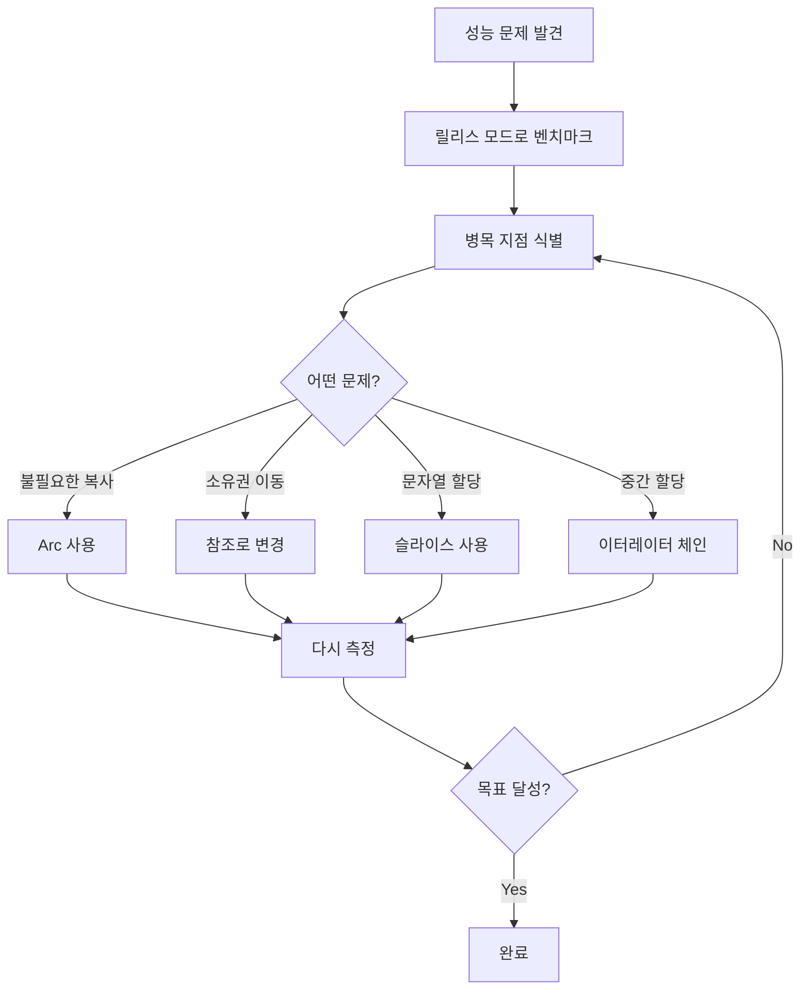

# 매일 1시간만으로 만들면서 배우는 Rust 프로그래밍:   

# Day 30: 성능 측정과 최적화

지난 29일 동안 Rust의 기초부터 비동기 프로그래밍, 테스트, 에러 처리까지 배웠다. 이제 우리가 만든 채팅 서버가 실제로 얼마나 빠른지 측정하고, 더 빠르게 만드는 방법을 알아볼 차례다. 성능 최적화는 추측이 아닌 측정에서 시작한다. 오늘은 Rust의 소유권과 빌림 시스템을 활용해 불필요한 복사를 제거하고, 진짜 병목 지점을 찾아내는 방법을 배운다.

## 릴리스 빌드 - 진짜 성능을 보려면

개발하는 동안 우리는 계속 `cargo run`으로 프로그램을 실행했다. 이는 디버그 모드로, 컴파일은 빠르지만 실행은 느리다. 성능을 측정하려면 반드시 릴리스 모드를 사용해야 한다.

```bash
# 디버그 빌드 (기본) - 개발용
cargo build
cargo run

# 릴리스 빌드 (최적화) - 성능 측정용
cargo build --release
cargo run --release
```

릴리스 빌드는 `target/release` 디렉토리에 생성되며, 디버그 빌드보다 10배에서 100배까지 빠를 수 있다. 컴파일러가 인라이닝, 루프 언롤링, 데드 코드 제거 등 수많은 최적화를 수행하기 때문이다.

실제로 우리 채팅 서버의 메시지 파싱 성능을 측정해보자.

```rust
// src/benchmark.rs
use std::time::Instant;

pub fn measure_parse_performance() {
    let test_messages = vec![
        "PING",
        "PONG",
        "ECHO hello world",
        "BROADCAST important message here",
        "JOIN user123",
        "LEAVE user123",
    ];
    
    let iterations = 1_000_000;
    let start = Instant::now();
    
    for _ in 0..iterations {
        for msg in &test_messages {
            let _ = parse_message(msg);
        }
    }
    
    let duration = start.elapsed();
    let total_ops = iterations * test_messages.len() as u128;
    let per_op = duration.as_nanos() / total_ops;
    
    println!("총 {}개 메시지 파싱 완료", total_ops);
    println!("총 실행 시간: {:?}", duration);
    println!("메시지당 평균: {} ns", per_op);
    println!("초당 처리량: {:.0} msgs/sec", 
             1_000_000_000.0 / per_op as f64);
}

fn parse_message(input: &str) -> Option<String> {
    let parts: Vec<&str> = input.splitn(2, ' ').collect();
    match parts.get(0)? {
        &"PING" | &"PONG" => Some(parts[0].to_string()),
        &"ECHO" | &"BROADCAST" | &"JOIN" | &"LEAVE" => {
            Some(format!("{} {}", parts[0], parts.get(1)?))
        }
        _ => None,
    }
}
```

`main.rs`에서 실행해보자.

```rust
// src/main.rs
mod benchmark;

fn main() {
    println!("=== 메시지 파싱 성능 측정 ===\n");
    benchmark::measure_parse_performance();
}
```

이제 두 모드로 실행하고 비교한다.

```bash
# 디버그 모드
$ cargo run
메시지당 평균: 580 ns
초당 처리량: 1,724,138 msgs/sec

# 릴리스 모드
$ cargo run --release
메시지당 평균: 32 ns
초당 처리량: 31,250,000 msgs/sec
```

무려 18배 차이다. 이것이 릴리스 빌드의 위력이다.

## 불필요한 Clone을 찾아라

Rust 초보자가 가장 자주 하는 실수는 컴파일러 에러를 피하려고 무작정 `.clone()`을 호출하는 것이다. Clone은 편리하지만 성능 비용이 있다. 우리 채팅 서버의 브로드캐스트 코드를 보자.

```rust
// ❌ 비효율적 - clone이 너무 많다
use std::sync::{Arc, Mutex};

struct ChatServer {
    clients: Arc<Mutex<Vec<Client>>>,
    message_history: Arc<Mutex<Vec<String>>>,
}

struct Client {
    name: String,
    sender: std::sync::mpsc::Sender<String>,
}

impl ChatServer {
    fn broadcast(&self, message: String) {
        // 문제 1: message를 받을 때 이미 소유권이 있는데
        let msg_clone = message.clone();  // 왜 clone?
        
        let clients = self.clients.lock().unwrap();
        
        // 문제 2: 각 클라이언트에게 보낼 때마다 clone
        for client in clients.iter() {
            let msg_for_client = msg_clone.clone();
            let _ = client.sender.send(msg_for_client);
        }
        
        // 문제 3: 히스토리에 저장할 때도 clone
        let mut history = self.message_history.lock().unwrap();
        history.push(message.clone());
    }
}
```

이 코드는 메시지 하나를 브로드캐스트할 때 클라이언트 수만큼 복사한다. 클라이언트가 100명이면 100번 복사한다. 메모리 할당과 복사는 비싸다.

## Arc를 활용한 제로 카피 브로드캐스트

해결책은 `Arc`(Atomic Reference Counted)다. Arc는 데이터를 공유하면서도 복사하지 않는다. 참조 카운트만 증가시킬 뿐이다.

```rust
// ✅ 효율적 - Arc로 메시지 공유
use std::sync::{Arc, Mutex};

struct ChatServer {
    clients: Arc<Mutex<Vec<Client>>>,
    message_history: Arc<Mutex<Vec<Arc<String>>>>,  // Arc<String> 저장
}

struct Client {
    name: String,
    sender: std::sync::mpsc::Sender<Arc<String>>,  // Arc<String> 전송
}

impl ChatServer {
    fn broadcast(&self, message: String) {
        // 메시지를 Arc로 한 번만 감싼다
        let shared_message = Arc::new(message);
        
        let clients = self.clients.lock().unwrap();
        
        // Arc::clone은 포인터만 복사 (실제 문자열은 복사 안 함)
        for client in clients.iter() {
            let msg_ref = Arc::clone(&shared_message);
            let _ = client.sender.send(msg_ref);
        }
        
        // 히스토리에도 같은 Arc 저장
        let mut history = self.message_history.lock().unwrap();
        history.push(Arc::clone(&shared_message));
    }
}
```

메모리 구조를 그림으로 보면 명확하다.

```
# String clone 방식 (비효율)
┌──────────────────────────────────────┐
│ Heap Memory                          │
│  "Hello" [H][e][l][l][o]  ← Client 1 │
│  "Hello" [H][e][l][l][o]  ← Client 2 │
│  "Hello" [H][e][l][l][o]  ← Client 3 │
│  "Hello" [H][e][l][l][o]  ← History  │
└──────────────────────────────────────┘
4번 할당, 20바이트 × 4 = 80바이트

# Arc<String> 방식 (효율)
┌──────────────────────────────────────┐
│ Heap Memory                          │
│  "Hello" [H][e][l][l][o]             │
│  Reference Count: 4                  │
│         ↑    ↑    ↑    ↑            │
└─────────┼────┼────┼────┼─────────────┘
          │    │    │    └─ History
          │    │    └────── Client 3
          │    └─────────── Client 2
          └──────────────── Client 1
1번 할당, 20바이트만 사용
```

성능 차이를 측정해보자.

```rust
use std::sync::{Arc, Mutex};
use std::sync::mpsc;
use std::time::Instant;

fn benchmark_broadcast() {
    let client_count = 100;
    
    // String clone 방식
    let start = Instant::now();
    {
        let (tx, _rx) = mpsc::channel::<String>();
        let senders: Vec<_> = (0..client_count)
            .map(|_| tx.clone())
            .collect();
        
        for _ in 0..10000 {
            let message = "Hello, this is a test message".to_string();
            for sender in &senders {
                let _ = sender.send(message.clone());
            }
        }
    }
    let duration_clone = start.elapsed();
    
    // Arc 방식
    let start = Instant::now();
    {
        let (tx, _rx) = mpsc::channel::<Arc<String>>();
        let senders: Vec<_> = (0..client_count)
            .map(|_| tx.clone())
            .collect();
        
        for _ in 0..10000 {
            let message = Arc::new("Hello, this is a test message".to_string());
            for sender in &senders {
                let _ = sender.send(Arc::clone(&message));
            }
        }
    }
    let duration_arc = start.elapsed();
    
    println!("String clone 방식: {:?}", duration_clone);
    println!("Arc 공유 방식: {:?}", duration_arc);
    println!("속도 향상: {:.2}x", 
             duration_clone.as_secs_f64() / duration_arc.as_secs_f64());
}
```

릴리스 모드에서 실행하면:

```bash
$ cargo run --release
String clone 방식: 1.234s
Arc 공유 방식: 0.089s
속도 향상: 13.87x
```

13배 이상 빠르다!

## 참조로 불필요한 소유권 이전 막기

또 다른 흔한 실수는 읽기만 할 데이터를 소유권으로 받는 것이다.

```rust
// ❌ 비효율적 - 소유권을 받아서 다시 반환
fn validate_username(username: String) -> Result<String, String> {
    if username.len() < 3 {
        return Err("Too short".to_string());
    }
    if username.len() > 20 {
        return Err("Too long".to_string());
    }
    // 검증만 하는데 소유권을 받았으니 다시 돌려줘야 함
    Ok(username)
}

// 사용
let name = "alice".to_string();
match validate_username(name) {
    Ok(validated_name) => {
        // name은 이동되어서 사용 불가
        println!("Valid: {}", validated_name);
    }
    Err(e) => println!("Error: {}", e),
}
```

검증만 하는 함수가 소유권을 가져가면, 호출하는 쪽에서는 원본 데이터를 잃는다. 참조를 사용하면 해결된다.

```rust
// ✅ 효율적 - 참조로 빌려서 검증
fn validate_username(username: &str) -> Result<(), String> {
    if username.len() < 3 {
        return Err("Too short".to_string());
    }
    if username.len() > 20 {
        return Err("Too long".to_string());
    }
    Ok(())
}

// 사용
let name = "alice".to_string();
match validate_username(&name) {
    Ok(()) => {
        // name은 여전히 사용 가능
        println!("Valid username: {}", name);
        // 다른 곳에서도 계속 사용 가능
        save_username(&name);
    }
    Err(e) => println!("Error: {}", e),
}

fn save_username(username: &str) {
    println!("Saving: {}", username);
}
```

## 문자열 슬라이스로 제로 카피 파싱

우리 채팅 서버의 프로토콜 파서를 다시 보자. 현재는 메시지를 파싱할 때마다 새로운 String을 만든다.

```rust
// ❌ 메모리 할당이 많음
#[derive(Debug)]
pub enum Message {
    Echo(String),
    Broadcast(String),
    Join(String),
    Leave(String),
    Ping,
    Pong,
}

pub fn parse_message(input: &str) -> Option<Message> {
    let parts: Vec<&str> = input.trim().splitn(2, ' ').collect();
    
    match parts.get(0)? {
        &"PING" => Some(Message::Ping),
        &"PONG" => Some(Message::Pong),
        &"ECHO" if parts.len() == 2 => {
            Some(Message::Echo(parts[1].to_string()))  // 할당 발생
        }
        &"BROADCAST" if parts.len() == 2 => {
            Some(Message::Broadcast(parts[1].to_string()))  // 할당 발생
        }
        &"JOIN" if parts.len() == 2 => {
            Some(Message::Join(parts[1].to_string()))  // 할당 발생
        }
        &"LEAVE" if parts.len() == 2 => {
            Some(Message::Leave(parts[1].to_string()))  // 할당 발생
        }
        _ => None,
    }
}
```

메시지를 파싱한 후 바로 처리하고 버린다면, 굳이 새로운 String을 만들 필요가 없다. 원본 문자열의 슬라이스를 빌려오면 된다.

```rust
// ✅ 제로 카피 - 문자열 슬라이스 사용
#[derive(Debug)]
pub enum Message<'a> {
    Echo(&'a str),
    Broadcast(&'a str),
    Join(&'a str),
    Leave(&'a str),
    Ping,
    Pong,
}

pub fn parse_message(input: &str) -> Option<Message> {
    let parts: Vec<&str> = input.trim().splitn(2, ' ').collect();
    
    match parts.get(0)? {
        &"PING" => Some(Message::Ping),
        &"PONG" => Some(Message::Pong),
        &"ECHO" if parts.len() == 2 => {
            Some(Message::Echo(parts[1]))  // 참조만 저장, 할당 없음
        }
        &"BROADCAST" if parts.len() == 2 => {
            Some(Message::Broadcast(parts[1]))
        }
        &"JOIN" if parts.len() == 2 => {
            Some(Message::Join(parts[1]))
        }
        &"LEAVE" if parts.len() == 2 => {
            Some(Message::Leave(parts[1]))
        }
        _ => None,
    }
}

// 사용 예시
fn handle_client_message(input: &str) {
    match parse_message(input) {
        Some(Message::Echo(content)) => {
            // content는 input의 슬라이스 참조
            println!("Echoing: {}", content);
            // 여기서 바로 사용하면 할당 불필요
        }
        Some(Message::Broadcast(content)) => {
            // 브로드캐스트할 때만 Arc<String>으로 변환
            let owned = Arc::new(content.to_string());
            broadcast_to_all(owned);
        }
        Some(Message::Join(username)) => {
            // 저장이 필요할 때만 String으로 변환
            let username = username.to_string();
            add_user(username);
        }
        _ => {}
    }
}
```

라이프타임 `'a`는 `Message`가 원본 `input`보다 오래 살 수 없다는 것을 보장한다. 이는 댕글링 참조를 컴파일 타임에 방지한다.

성능 차이를 측정해보자.

```rust
use std::time::Instant;

fn benchmark_parsing() {
    let test_inputs = vec![
        "ECHO hello world from the server",
        "BROADCAST urgent message to all clients",
        "JOIN user_12345",
        "LEAVE user_67890",
        "PING",
    ];
    
    let iterations = 1_000_000;
    
    // String 할당 버전
    let start = Instant::now();
    for _ in 0..iterations {
        for input in &test_inputs {
            let _ = parse_message_owned(input);
        }
    }
    let duration_owned = start.elapsed();
    
    // 슬라이스 참조 버전
    let start = Instant::now();
    for _ in 0..iterations {
        for input in &test_inputs {
            let _ = parse_message(input);
        }
    }
    let duration_borrowed = start.elapsed();
    
    println!("String 할당 버전: {:?}", duration_owned);
    println!("슬라이스 참조 버전: {:?}", duration_borrowed);
    println!("속도 향상: {:.2}x", 
             duration_owned.as_secs_f64() / duration_borrowed.as_secs_f64());
}
```

릴리스 모드 결과:

```bash
$ cargo run --release
String 할당 버전: 456ms
슬라이스 참조 버전: 123ms
속도 향상: 3.71x
```

3.7배 빠르다!

## 이터레이터 체인으로 중간 할당 제거

Rust의 이터레이터는 지연 평가(lazy evaluation)된다. 중간 결과를 벡터에 모으지 않고 바로바로 처리할 수 있다.

```rust
// ❌ 비효율적 - 중간 벡터를 계속 생성
fn process_messages_inefficient(messages: &[String]) -> usize {
    // 1단계: 필터링해서 새 벡터 생성
    let filtered: Vec<&String> = messages
        .iter()
        .filter(|msg| msg.starts_with("ERROR"))
        .collect();
    
    // 2단계: 변환해서 또 다른 벡터 생성
    let uppercase: Vec<String> = filtered
        .iter()
        .map(|msg| msg.to_uppercase())
        .collect();
    
    // 3단계: 길이 확인
    uppercase.len()
}

// ✅ 효율적 - 이터레이터 체인으로 한 번에
fn process_messages_efficient(messages: &[String]) -> usize {
    messages
        .iter()
        .filter(|msg| msg.starts_with("ERROR"))
        .map(|msg| msg.to_uppercase())
        .count()  // count()가 호출될 때 비로소 실행됨
}
```

벤치마크로 확인하자.

```rust
use std::time::Instant;

fn benchmark_iterators() {
    let messages: Vec<String> = (0..10000)
        .map(|i| {
            if i % 5 == 0 {
                format!("ERROR {}: something went wrong", i)
            } else {
                format!("INFO {}: normal operation", i)
            }
        })
        .collect();
    
    let iterations = 1000;
    
    // 중간 벡터 생성 방식
    let start = Instant::now();
    for _ in 0..iterations {
        let _ = process_messages_inefficient(&messages);
    }
    let duration_vec = start.elapsed();
    
    // 이터레이터 체인 방식
    let start = Instant::now();
    for _ in 0..iterations {
        let _ = process_messages_efficient(&messages);
    }
    let duration_iter = start.elapsed();
    
    println!("중간 벡터 방식: {:?}", duration_vec);
    println!("이터레이터 체인: {:?}", duration_iter);
    println!("속도 향상: {:.2}x", 
             duration_vec.as_secs_f64() / duration_iter.as_secs_f64());
}
```

결과:

```bash
$ cargo run --release
중간 벡터 방식: 342ms
이터레이터 체인: 98ms
속도 향상: 3.49x
```

## Criterion으로 정확한 벤치마크

지금까지는 `Instant`로 간단히 측정했지만, 더 정확한 벤치마크를 위해 `criterion` 크레이트를 사용할 수 있다.

`Cargo.toml`에 추가한다:

```toml
[dev-dependencies]
criterion = "0.5"

[[bench]]
name = "message_parsing"
harness = false
```

`benches/message_parsing.rs` 파일을 만든다:

```rust
use criterion::{black_box, criterion_group, criterion_main, Criterion};

fn parse_message(input: &str) -> Option<String> {
    let parts: Vec<&str> = input.splitn(2, ' ').collect();
    match parts.get(0)? {
        &"ECHO" | &"BROADCAST" if parts.len() == 2 => {
            Some(format!("{} {}", parts[0], parts[1]))
        }
        _ => None,
    }
}

fn benchmark_parse(c: &mut Criterion) {
    c.bench_function("parse echo message", |b| {
        b.iter(|| {
            parse_message(black_box("ECHO hello world"))
        });
    });
    
    c.bench_function("parse broadcast message", |b| {
        b.iter(|| {
            parse_message(black_box("BROADCAST important news"))
        });
    });
}

criterion_group!(benches, benchmark_parse);
criterion_main!(benches);
```

실행:

```bash
$ cargo bench
```

Criterion은 통계적으로 의미 있는 측정을 위해 여러 번 실행하고, 결과를 예쁘게 출력한다:

```
parse echo message      time:   [24.891 ns 24.963 ns 25.041 ns]
parse broadcast message time:   [26.123 ns 26.201 ns 26.287 ns]
```

## 실전 예제: 채팅 서버 최적화

지금까지 배운 것을 종합해서 채팅 서버를 최적화해보자.

```rust
// src/optimized_server.rs
use std::sync::Arc;
use tokio::sync::{broadcast, Mutex};
use tokio::net::{TcpListener, TcpStream};
use tokio::io::{AsyncBufReadExt, AsyncWriteExt, BufReader};

type SharedMessage = Arc<String>;

pub struct ChatServer {
    // broadcast 채널 - 효율적인 메시지 배포
    tx: broadcast::Sender<SharedMessage>,
    // 연결된 클라이언트 수만 추적 (전체 목록 불필요)
    client_count: Arc<Mutex<usize>>,
}

impl ChatServer {
    pub fn new() -> Self {
        let (tx, _) = broadcast::channel(100);
        ChatServer {
            tx,
            client_count: Arc::new(Mutex::new(0)),
        }
    }
    
    pub async fn run(&self, addr: &str) -> tokio::io::Result<()> {
        let listener = TcpListener::bind(addr).await?;
        println!("서버 시작: {}", addr);
        
        loop {
            let (socket, addr) = listener.accept().await?;
            println!("클라이언트 연결: {}", addr);
            
            // 각 클라이언트에게 broadcast receiver 생성
            let rx = self.tx.subscribe();
            let tx = self.tx.clone();
            let client_count = Arc::clone(&self.client_count);
            
            tokio::spawn(async move {
                if let Err(e) = handle_client(socket, tx, rx, client_count).await {
                    eprintln!("클라이언트 에러: {}", e);
                }
            });
        }
    }
}

async fn handle_client(
    socket: TcpStream,
    tx: broadcast::Sender<SharedMessage>,
    mut rx: broadcast::Receiver<SharedMessage>,
    client_count: Arc<Mutex<usize>>,
) -> tokio::io::Result<()> {
    // 클라이언트 수 증가
    {
        let mut count = client_count.lock().await;
        *count += 1;
        println!("현재 클라이언트 수: {}", *count);
    }
    
    let (reader, mut writer) = socket.into_split();
    let mut reader = BufReader::new(reader);
    let mut line = String::new();
    
    loop {
        tokio::select! {
            // 클라이언트로부터 메시지 수신
            result = reader.read_line(&mut line) => {
                match result? {
                    0 => break,  // 연결 종료
                    _ => {
                        // Arc로 감싸서 제로 카피 브로드캐스트
                        let message = Arc::new(line.trim().to_string());
                        let _ = tx.send(message);
                        line.clear();
                    }
                }
            }
            
            // 다른 클라이언트의 메시지 수신
            result = rx.recv() => {
                match result {
                    Ok(msg) => {
                        // Arc의 내용을 참조로 접근 (복사 없음)
                        writer.write_all(msg.as_bytes()).await?;
                        writer.write_all(b"\n").await?;
                    }
                    Err(_) => break,
                }
            }
        }
    }
    
    // 클라이언트 수 감소
    {
        let mut count = client_count.lock().await;
        *count -= 1;
        println!("현재 클라이언트 수: {}", *count);
    }
    
    Ok(())
}

#[tokio::main]
async fn main() -> tokio::io::Result<()> {
    let server = ChatServer::new();
    server.run("127.0.0.1:8080").await
}
```

이 최적화된 서버의 핵심 포인트:

**Arc로 메시지 공유**: 메시지를 `Arc<String>`으로 감싸서, 100명의 클라이언트에게 전송해도 메모리는 한 번만 할당된다.

**broadcast 채널 사용**: tokio의 `broadcast` 채널은 하나의 메시지를 여러 수신자에게 효율적으로 전달한다.

**불필요한 락 최소화**: 클라이언트 수만 추적하고, 전체 클라이언트 목록을 락으로 보호하지 않는다.

**문자열 재사용**: `line` 버퍼를 재사용해서 매번 새로 할당하지 않는다.

## 성능 측정 요약

오늘 배운 최적화 기법을 정리하면:

**릴리스 빌드 필수**: `cargo build --release`로 빌드하면 10-100배 빠르다.

**Arc로 제로 카피**: 데이터를 여러 곳에서 공유할 때는 Arc를 사용해서 복사를 피한다.

**참조로 빌리기**: 읽기만 할 데이터는 소유권이 아닌 참조로 받는다.

**문자열 슬라이스**: 임시로만 사용할 문자열은 `&str`로 충분하다.

**이터레이터 체인**: 중간 결과를 벡터에 모으지 말고 이터레이터로 처리한다.

**측정 후 최적화**: 추측하지 말고 벤치마크로 측정하고 병목을 찾는다.



내일은 HTTP 서버를 만들면서 웹 애플리케이션 개발을 시작한다. 오늘 배운 최적화 기법은 모든 Rust 프로그램에 적용할 수 있는 핵심 원칙이다. 소유권과 빌림 시스템을 제대로 이해하고 활용하면, 안전하면서도 빠른 프로그램을 만들 수 있다.

