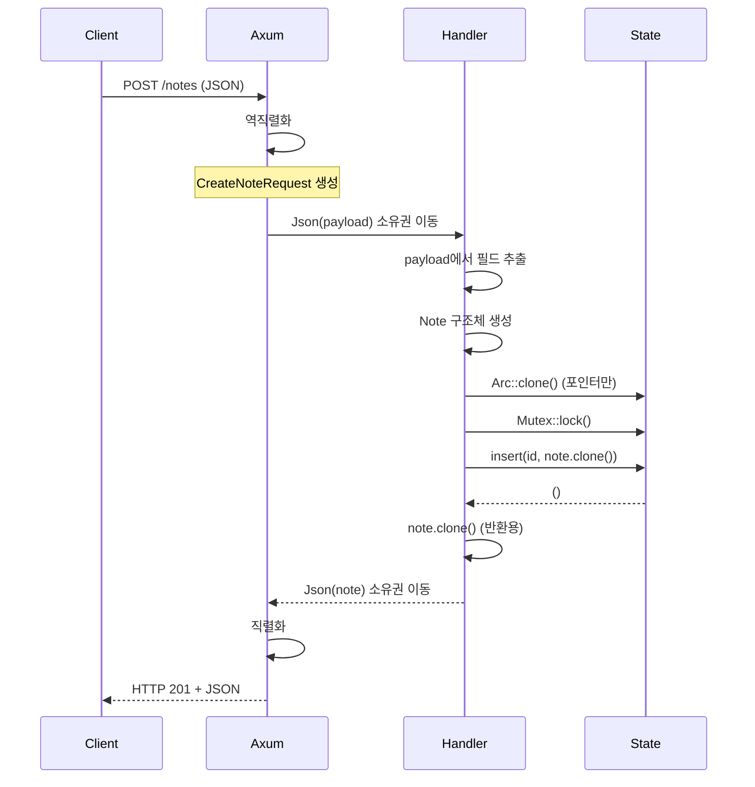

# 매일 1시간만으로 만들면서 배우는 Rust 프로그래밍:   

# Day 31: HTTP 서버 기초

지난 30일 동안 TCP 소켓부터 비동기 프로그래밍, 성능 최적화까지 배웠다. 이제 실제 웹 애플리케이션을 만들 차례다. 오늘은 HTTP 프로토콜을 이해하고, Rust의 `axum` 프레임워크로 REST API 서버를 만든다. TCP 채팅 서버에서 배운 소유권과 빌림 개념이 HTTP 핸들러에서 어떻게 작동하는지 직접 경험한다.

## HTTP 프로토콜 - 텍스트 기반의 요청과 응답

HTTP는 결국 TCP 위에서 동작하는 텍스트 프로토콜이다. 클라이언트가 요청을 보내면 서버가 응답한다. 간단한 예를 보자.

```
클라이언트가 보내는 HTTP 요청:
┌─────────────────────────────────────┐
│ GET /users/123 HTTP/1.1             │
│ Host: api.example.com               │
│ Accept: application/json            │
│ Authorization: Bearer token123      │
│                                     │
└─────────────────────────────────────┘

서버가 보내는 HTTP 응답:
┌─────────────────────────────────────┐
│ HTTP/1.1 200 OK                     │
│ Content-Type: application/json      │
│ Content-Length: 45                  │
│                                     │
│ {"id":123,"name":"Alice","age":30}  │
└─────────────────────────────────────┘
```

구조는 단순하다. 첫 줄에 메서드(GET, POST 등)와 경로가 있고, 그 다음 헤더들, 빈 줄, 그리고 본문이다. 우리는 이런 저수준 파싱을 직접 할 필요가 없다. `axum` 같은 프레임워크가 다 처리해준다.

## Axum 프레임워크 시작하기

Axum은 tokio 기반의 웹 프레임워크다. 비동기이고, 타입 안전하며, ergonomic하다. 새 프로젝트를 만들자.

```bash
cargo new http_server
cd http_server
```

`Cargo.toml`에 의존성을 추가한다:

```toml
[package]
name = "http_server"
version = "0.1.0"
edition = "2021"

[dependencies]
tokio = { version = "1", features = ["full"] }
axum = "0.7"
serde = { version = "1.0", features = ["derive"] }
serde_json = "1.0"
```

가장 간단한 HTTP 서버부터 시작한다.

```rust
// src/main.rs
use axum::{
    routing::get,
    Router,
};

#[tokio::main]
async fn main() {
    // 라우터 생성
    let app = Router::new()
        .route("/", get(root_handler));
    
    // 서버 시작
    let listener = tokio::net::TcpListener::bind("127.0.0.1:3000")
        .await
        .unwrap();
    
    println!("서버 시작: http://127.0.0.1:3000");
    
    axum::serve(listener, app)
        .await
        .unwrap();
}

// 핸들러 함수
async fn root_handler() -> &'static str {
    "Hello, HTTP World!"
}
```

실행하고 브라우저나 curl로 테스트한다.

```bash
cargo run

# 다른 터미널에서
curl http://127.0.0.1:3000
# 출력: Hello, HTTP World!
```

이게 전부다! Axum이 TCP 연결, HTTP 파싱, 응답 직렬화를 다 처리한다.

## 여러 엔드포인트 만들기

실용적인 API를 위해 여러 경로를 추가하자. 간단한 사용자 정보 API를 만든다.

```rust
use axum::{
    routing::{get, post},
    Router,
    http::StatusCode,
};

#[tokio::main]
async fn main() {
    let app = Router::new()
        .route("/", get(root_handler))
        .route("/health", get(health_check))
        .route("/users", get(list_users).post(create_user))
        .route("/users/:id", get(get_user));
    
    let listener = tokio::net::TcpListener::bind("127.0.0.1:3000")
        .await
        .unwrap();
    
    println!("서버 시작: http://127.0.0.1:3000");
    
    axum::serve(listener, app)
        .await
        .unwrap();
}

async fn root_handler() -> &'static str {
    "User API v1.0"
}

async fn health_check() -> &'static str {
    "OK"
}

async fn list_users() -> &'static str {
    "모든 사용자 목록"
}

async fn create_user() -> (StatusCode, &'static str) {
    (StatusCode::CREATED, "사용자 생성됨")
}

async fn get_user() -> &'static str {
    "특정 사용자 정보"
}
```

테스트해보자.

```bash
curl http://127.0.0.1:3000/health
# 출력: OK

curl http://127.0.0.1:3000/users
# 출력: 모든 사용자 목록

curl -X POST http://127.0.0.1:3000/users
# 출력: 사용자 생성됨
```

## 경로 파라미터 추출하기

URL에서 파라미터를 가져올 때 소유권이 어떻게 작동하는지 보자.

```rust
use axum::{
    extract::Path,
    routing::get,
    Router,
};

async fn get_user(
    // Path는 URL 파라미터를 추출한다
    Path(user_id): Path<u32>
) -> String {
    // user_id는 소유권이 이 함수로 이동됨
    format!("사용자 ID: {}", user_id)
}

async fn get_user_posts(
    // 튜플로 여러 파라미터 추출
    Path((user_id, post_id)): Path<(u32, u32)>
) -> String {
    format!("사용자 {}의 게시글 {}", user_id, post_id)
}

#[tokio::main]
async fn main() {
    let app = Router::new()
        .route("/users/:id", get(get_user))
        .route("/users/:user_id/posts/:post_id", get(get_user_posts));
    
    let listener = tokio::net::TcpListener::bind("127.0.0.1:3000")
        .await
        .unwrap();
    
    axum::serve(listener, app).await.unwrap();
}
```

테스트:

```bash
curl http://127.0.0.1:3000/users/42
# 출력: 사용자 ID: 42

curl http://127.0.0.1:3000/users/10/posts/5
# 출력: 사용자 10의 게시글 5
```

`Path<u32>`는 URL에서 숫자를 파싱하고 소유권을 핸들러에게 준다. 타입이 맞지 않으면 자동으로 400 에러를 반환한다.

## JSON 데이터 다루기

실전에서는 구조화된 데이터를 주고받는다. Serde를 사용해 JSON을 Rust 구조체로 변환한다.

```rust
use axum::{
    extract::{Path, Json},
    routing::{get, post},
    Router,
    http::StatusCode,
};
use serde::{Deserialize, Serialize};

// 사용자 구조체
#[derive(Debug, Serialize, Deserialize, Clone)]
struct User {
    id: u32,
    name: String,
    email: String,
    age: u32,
}

// 사용자 생성 요청
#[derive(Debug, Deserialize)]
struct CreateUserRequest {
    name: String,
    email: String,
    age: u32,
}

#[tokio::main]
async fn main() {
    let app = Router::new()
        .route("/users", get(list_users).post(create_user))
        .route("/users/:id", get(get_user).delete(delete_user));
    
    let listener = tokio::net::TcpListener::bind("127.0.0.1:3000")
        .await
        .unwrap();
    
    println!("서버 시작: http://127.0.0.1:3000");
    
    axum::serve(listener, app).await.unwrap();
}

// 모든 사용자 조회
async fn list_users() -> Json<Vec<User>> {
    // 실제로는 데이터베이스에서 가져옴
    let users = vec![
        User {
            id: 1,
            name: "Alice".to_string(),
            email: "alice@example.com".to_string(),
            age: 30,
        },
        User {
            id: 2,
            name: "Bob".to_string(),
            email: "bob@example.com".to_string(),
            age: 25,
        },
    ];
    
    // Json<T>는 자동으로 직렬화
    Json(users)
}

// 특정 사용자 조회
async fn get_user(Path(id): Path<u32>) -> Result<Json<User>, StatusCode> {
    // 실제로는 데이터베이스에서 조회
    if id == 1 {
        Ok(Json(User {
            id: 1,
            name: "Alice".to_string(),
            email: "alice@example.com".to_string(),
            age: 30,
        }))
    } else {
        Err(StatusCode::NOT_FOUND)
    }
}

// 사용자 생성
async fn create_user(
    // Json<T>는 요청 본문을 역직렬화
    Json(payload): Json<CreateUserRequest>
) -> (StatusCode, Json<User>) {
    // payload의 소유권이 이 함수로 이동됨
    let user = User {
        id: 100,  // 실제로는 DB가 생성
        name: payload.name,
        email: payload.email,
        age: payload.age,
    };
    
    (StatusCode::CREATED, Json(user))
}

// 사용자 삭제
async fn delete_user(Path(id): Path<u32>) -> StatusCode {
    println!("사용자 {} 삭제", id);
    StatusCode::NO_CONTENT
}
```

테스트해보자.

```bash
# 모든 사용자 조회
curl http://127.0.0.1:3000/users
# 출력: [{"id":1,"name":"Alice","email":"alice@example.com","age":30},...]

# 특정 사용자 조회
curl http://127.0.0.1:3000/users/1
# 출력: {"id":1,"name":"Alice","email":"alice@example.com","age":30}

# 존재하지 않는 사용자
curl -i http://127.0.0.1:3000/users/999
# 출력: HTTP/1.1 404 Not Found

# 사용자 생성
curl -X POST http://127.0.0.1:3000/users \
  -H "Content-Type: application/json" \
  -d '{"name":"Charlie","email":"charlie@example.com","age":28}'
# 출력: {"id":100,"name":"Charlie","email":"charlie@example.com","age":28}

# 사용자 삭제
curl -X DELETE -i http://127.0.0.1:3000/users/1
# 출력: HTTP/1.1 204 No Content
```

## 소유권과 빌림이 핸들러에서 작동하는 방식

핸들러 함수에서 데이터가 어떻게 이동하는지 자세히 보자.

```rust
use axum::{extract::Json, http::StatusCode};
use serde::Deserialize;

#[derive(Deserialize)]
struct CreateUserRequest {
    name: String,
    email: String,
}

// ❌ 비효율적 - 불필요한 clone
async fn create_user_inefficient(
    Json(payload): Json<CreateUserRequest>
) -> (StatusCode, String) {
    // payload는 이미 소유권이 있는데
    let name = payload.name.clone();  // 왜 clone?
    let email = payload.email.clone();
    
    let response = format!("Created: {} ({})", name, email);
    (StatusCode::CREATED, response)
}

// ✅ 효율적 - 소유권 활용
async fn create_user_efficient(
    Json(payload): Json<CreateUserRequest>
) -> (StatusCode, String) {
    // payload의 소유권이 이 함수로 이동됨
    // 필드의 소유권도 이동시킬 수 있음
    let response = format!("Created: {} ({})", payload.name, payload.email);
    // payload는 더 이상 사용 불가 (이동됨)
    (StatusCode::CREATED, response)
}

// ✅ 참조 활용 - 여러 곳에서 사용
async fn create_user_with_validation(
    Json(payload): Json<CreateUserRequest>
) -> Result<(StatusCode, String), StatusCode> {
    // 검증은 참조로
    if !is_valid_email(&payload.email) {
        return Err(StatusCode::BAD_REQUEST);
    }
    
    if !is_valid_name(&payload.name) {
        return Err(StatusCode::BAD_REQUEST);
    }
    
    // 검증 후 소유권 이동
    let response = format!("Created: {} ({})", payload.name, payload.email);
    Ok((StatusCode::CREATED, response))
}

fn is_valid_email(email: &str) -> bool {
    email.contains('@')
}

fn is_valid_name(name: &str) -> bool {
    !name.is_empty() && name.len() <= 50
}
```

핵심은 `Json(payload)`가 역직렬화된 구조체의 소유권을 핸들러에게 준다는 것이다. 검증할 때는 참조를 사용하고, 실제 사용할 때는 소유권을 이동시킨다.

## 쿼리 파라미터 처리

URL의 쿼리 스트링도 추출할 수 있다.

```rust
use axum::{
    extract::Query,
    routing::get,
    Json,
    Router,
};
use serde::{Deserialize, Serialize};

#[derive(Deserialize)]
struct Pagination {
    #[serde(default = "default_page")]
    page: u32,
    #[serde(default = "default_limit")]
    limit: u32,
}

fn default_page() -> u32 { 1 }
fn default_limit() -> u32 { 10 }

#[derive(Deserialize)]
struct UserFilter {
    #[serde(default)]
    name: Option<String>,
    #[serde(default)]
    min_age: Option<u32>,
    #[serde(default)]
    max_age: Option<u32>,
}

#[derive(Serialize)]
struct User {
    id: u32,
    name: String,
    age: u32,
}

#[derive(Serialize)]
struct PaginatedResponse<T> {
    data: Vec<T>,
    page: u32,
    limit: u32,
    total: u32,
}

#[tokio::main]
async fn main() {
    let app = Router::new()
        .route("/users", get(search_users));
    
    let listener = tokio::net::TcpListener::bind("127.0.0.1:3000")
        .await
        .unwrap();
    
    axum::serve(listener, app).await.unwrap();
}

async fn search_users(
    Query(pagination): Query<Pagination>,
    Query(filter): Query<UserFilter>,
) -> Json<PaginatedResponse<User>> {
    println!("페이지: {}, 제한: {}", pagination.page, pagination.limit);
    
    if let Some(ref name) = filter.name {
        println!("이름 필터: {}", name);
    }
    
    if let Some(min) = filter.min_age {
        println!("최소 나이: {}", min);
    }
    
    // 실제로는 데이터베이스 쿼리
    let users = vec![
        User { id: 1, name: "Alice".to_string(), age: 30 },
        User { id: 2, name: "Bob".to_string(), age: 25 },
    ];
    
    Json(PaginatedResponse {
        data: users,
        page: pagination.page,
        limit: pagination.limit,
        total: 100,
    })
}
```

테스트:

```bash
# 기본 페이지네이션
curl "http://127.0.0.1:3000/users"
# page=1, limit=10

# 커스텀 페이지네이션
curl "http://127.0.0.1:3000/users?page=2&limit=20"
# page=2, limit=20

# 필터링
curl "http://127.0.0.1:3000/users?name=Alice&min_age=25&max_age=35"
```

## 에러 응답 구조화하기

실전에서는 일관된 에러 응답이 중요하다.

```rust
use axum::{
    extract::{Path, Json},
    response::{IntoResponse, Response},
    http::StatusCode,
    routing::get,
    Router,
};
use serde::{Deserialize, Serialize};

#[derive(Serialize)]
struct ErrorResponse {
    error: String,
    message: String,
}

// 커스텀 에러 타입
enum AppError {
    NotFound(String),
    BadRequest(String),
    InternalError,
}

// AppError를 HTTP 응답으로 변환
impl IntoResponse for AppError {
    fn into_response(self) -> Response {
        let (status, error, message) = match self {
            AppError::NotFound(msg) => {
                (StatusCode::NOT_FOUND, "NOT_FOUND", msg)
            }
            AppError::BadRequest(msg) => {
                (StatusCode::BAD_REQUEST, "BAD_REQUEST", msg)
            }
            AppError::InternalError => {
                (StatusCode::INTERNAL_SERVER_ERROR, 
                 "INTERNAL_ERROR", 
                 "Something went wrong".to_string())
            }
        };
        
        let body = Json(ErrorResponse {
            error: error.to_string(),
            message,
        });
        
        (status, body).into_response()
    }
}

#[derive(Serialize)]
struct User {
    id: u32,
    name: String,
}

#[tokio::main]
async fn main() {
    let app = Router::new()
        .route("/users/:id", get(get_user));
    
    let listener = tokio::net::TcpListener::bind("127.0.0.1:3000")
        .await
        .unwrap();
    
    axum::serve(listener, app).await.unwrap();
}

async fn get_user(Path(id): Path<u32>) -> Result<Json<User>, AppError> {
    if id == 0 {
        return Err(AppError::BadRequest(
            "ID는 0이 될 수 없습니다".to_string()
        ));
    }
    
    // 실제로는 데이터베이스 조회
    if id > 100 {
        return Err(AppError::NotFound(
            format!("사용자 {}를 찾을 수 없습니다", id)
        ));
    }
    
    Ok(Json(User {
        id,
        name: format!("User{}", id),
    }))
}
```

테스트:

```bash
# 성공
curl http://127.0.0.1:3000/users/50
# {"id":50,"name":"User50"}

# 잘못된 요청
curl -i http://127.0.0.1:3000/users/0
# HTTP/1.1 400 Bad Request
# {"error":"BAD_REQUEST","message":"ID는 0이 될 수 없습니다"}

# 찾을 수 없음
curl -i http://127.0.0.1:3000/users/999
# HTTP/1.1 404 Not Found
# {"error":"NOT_FOUND","message":"사용자 999를 찾을 수 없습니다"}
```

## 실전 예제: 메모 API 만들기

지금까지 배운 것을 종합해서 간단한 메모 API를 만들어보자.

```rust
use axum::{
    extract::{Path, Json, Query},
    response::IntoResponse,
    http::StatusCode,
    routing::{get, post, put, delete},
    Router,
};
use serde::{Deserialize, Serialize};
use std::sync::{Arc, Mutex};
use std::collections::HashMap;

// 메모 구조체
#[derive(Debug, Clone, Serialize, Deserialize)]
struct Note {
    id: u32,
    title: String,
    content: String,
    #[serde(with = "chrono::serde::ts_seconds")]
    created_at: chrono::DateTime<chrono::Utc>,
}

// 메모 생성 요청
#[derive(Deserialize)]
struct CreateNoteRequest {
    title: String,
    content: String,
}

// 메모 수정 요청
#[derive(Deserialize)]
struct UpdateNoteRequest {
    title: Option<String>,
    content: Option<String>,
}

// 검색 쿼리
#[derive(Deserialize)]
struct SearchQuery {
    #[serde(default)]
    query: Option<String>,
}

// 앱 상태 (실제로는 데이터베이스 사용)
type NoteStore = Arc<Mutex<HashMap<u32, Note>>>;

struct AppState {
    notes: NoteStore,
    next_id: Arc<Mutex<u32>>,
}

#[tokio::main]
async fn main() {
    // 공유 상태 생성
    let state = Arc::new(AppState {
        notes: Arc::new(Mutex::new(HashMap::new())),
        next_id: Arc::new(Mutex::new(1)),
    });
    
    let app = Router::new()
        .route("/notes", get(list_notes).post(create_note))
        .route("/notes/search", get(search_notes))
        .route("/notes/:id", get(get_note).put(update_note).delete(delete_note))
        .with_state(state);
    
    let listener = tokio::net::TcpListener::bind("127.0.0.1:3000")
        .await
        .unwrap();
    
    println!("메모 API 서버 시작: http://127.0.0.1:3000");
    println!("예제:");
    println!("  POST /notes - 메모 생성");
    println!("  GET /notes - 모든 메모 조회");
    println!("  GET /notes/:id - 특정 메모 조회");
    println!("  PUT /notes/:id - 메모 수정");
    println!("  DELETE /notes/:id - 메모 삭제");
    println!("  GET /notes/search?query=keyword - 메모 검색");
    
    axum::serve(listener, app).await.unwrap();
}

// 모든 메모 조회
async fn list_notes(
    axum::extract::State(state): axum::extract::State<Arc<AppState>>
) -> Json<Vec<Note>> {
    let notes = state.notes.lock().unwrap();
    let mut all_notes: Vec<Note> = notes.values().cloned().collect();
    all_notes.sort_by(|a, b| b.created_at.cmp(&a.created_at));
    Json(all_notes)
}

// 메모 생성
async fn create_note(
    axum::extract::State(state): axum::extract::State<Arc<AppState>>,
    Json(payload): Json<CreateNoteRequest>,
) -> (StatusCode, Json<Note>) {
    let id = {
        let mut next_id = state.next_id.lock().unwrap();
        let id = *next_id;
        *next_id += 1;
        id
    };
    
    let note = Note {
        id,
        title: payload.title,
        content: payload.content,
        created_at: chrono::Utc::now(),
    };
    
    state.notes.lock().unwrap().insert(id, note.clone());
    
    (StatusCode::CREATED, Json(note))
}

// 특정 메모 조회
async fn get_note(
    axum::extract::State(state): axum::extract::State<Arc<AppState>>,
    Path(id): Path<u32>,
) -> Result<Json<Note>, StatusCode> {
    let notes = state.notes.lock().unwrap();
    notes.get(&id)
        .cloned()
        .map(Json)
        .ok_or(StatusCode::NOT_FOUND)
}

// 메모 수정
async fn update_note(
    axum::extract::State(state): axum::extract::State<Arc<AppState>>,
    Path(id): Path<u32>,
    Json(payload): Json<UpdateNoteRequest>,
) -> Result<Json<Note>, StatusCode> {
    let mut notes = state.notes.lock().unwrap();
    
    let note = notes.get_mut(&id).ok_or(StatusCode::NOT_FOUND)?;
    
    if let Some(title) = payload.title {
        note.title = title;
    }
    
    if let Some(content) = payload.content {
        note.content = content;
    }
    
    Ok(Json(note.clone()))
}

// 메모 삭제
async fn delete_note(
    axum::extract::State(state): axum::extract::State<Arc<AppState>>,
    Path(id): Path<u32>,
) -> StatusCode {
    let mut notes = state.notes.lock().unwrap();
    
    if notes.remove(&id).is_some() {
        StatusCode::NO_CONTENT
    } else {
        StatusCode::NOT_FOUND
    }
}

// 메모 검색
async fn search_notes(
    axum::extract::State(state): axum::extract::State<Arc<AppState>>,
    Query(query): Query<SearchQuery>,
) -> Json<Vec<Note>> {
    let notes = state.notes.lock().unwrap();
    
    let results: Vec<Note> = if let Some(q) = query.query {
        let q = q.to_lowercase();
        notes.values()
            .filter(|note| {
                note.title.to_lowercase().contains(&q) ||
                note.content.to_lowercase().contains(&q)
            })
            .cloned()
            .collect()
    } else {
        notes.values().cloned().collect()
    };
    
    Json(results)
}
```

`Cargo.toml`에 chrono 추가:

```toml
[dependencies]
tokio = { version = "1", features = ["full"] }
axum = "0.7"
serde = { version = "1.0", features = ["derive"] }
serde_json = "1.0"
chrono = { version = "0.4", features = ["serde"] }
```

완전한 API 테스트:

```bash
# 메모 생성
curl -X POST http://127.0.0.1:3000/notes \
  -H "Content-Type: application/json" \
  -d '{"title":"첫 메모","content":"Rust는 재미있다"}'
# {"id":1,"title":"첫 메모","content":"Rust는 재미있다","created_at":...}

# 또 다른 메모
curl -X POST http://127.0.0.1:3000/notes \
  -H "Content-Type: application/json" \
  -d '{"title":"HTTP 배우기","content":"Axum은 편리하다"}'

# 모든 메모 조회
curl http://127.0.0.1:3000/notes

# 특정 메모 조회
curl http://127.0.0.1:3000/notes/1

# 메모 수정
curl -X PUT http://127.0.0.1:3000/notes/1 \
  -H "Content-Type: application/json" \
  -d '{"content":"Rust는 정말 재미있다!"}'

# 메모 검색
curl "http://127.0.0.1:3000/notes/search?query=rust"

# 메모 삭제
curl -X DELETE http://127.0.0.1:3000/notes/1
```

## 소유권 흐름 정리

HTTP 핸들러에서 데이터가 어떻게 흐르는지 다이어그램으로 정리한다.



핵심 포인트:

**역직렬화된 데이터의 소유권은 핸들러로 이동한다**. `Json(payload)`에서 `payload`는 핸들러가 소유한다.

**상태는 `Arc`로 공유한다**. `Arc::clone()`은 참조 카운트만 증가시키므로 저렴하다.

**`Mutex::lock()`은 MutexGuard를 반환한다**. 스코프를 벗어나면 자동으로 언락된다.

**응답 데이터의 소유권도 Axum으로 이동한다**. `Json(note)`에서 `note`는 이동된다.

## 정리

오늘 HTTP 서버의 기초를 배웠다. TCP 소켓 위에 HTTP 프로토콜이 있고, Axum 같은 프레임워크가 파싱과 직렬화를 처리해준다. 소유권과 빌림의 원칙은 그대로 적용된다. 핸들러는 요청 데이터의 소유권을 받고, 검증할 때는 참조를 사용하며, 응답 데이터의 소유권을 반환한다. `Arc`와 `Mutex`로 상태를 안전하게 공유한다.

내일은 미들웨어를 추가해서 로깅, 인증 같은 횡단 관심사를 처리하고, 더 복잡한 상태 관리를 배운다.


