# SuperSocketLite를 이용한 C# 게임 서버 프로그래밍
    
저자: 최흥배, Gemini 2.5 Pro  
  
- .NET 8 이상, 
- C#
- Windows, Linux
- Visual Studio Code, Visual Studio 2022 이상  
--------
  
# Chapter.03 채팅 서버
채팅 서버는 복수개의 방이 있고, 방 안에서 채팅을 한다.

코드는 아래에 있다.  
[SuperSocketLite Tutorials - ChatServer](https://github.com/jacking75/SuperSocketLite/tree/master/Tutorials/ChatServer)   
이것을 빌드하면 빌드된 결과물은 Tutorial 디렉토리에 있는 `00_server_bins` 디렉토리에 생성된다.  
실행은 `00_server_bins` 에 있는 `run_ChatServer.bat`(Windows 기준)으로 실행한다.   

`run_ChatServer.bat` 의 내용  
<pre>
dotnet net9.0\ChatServer.dll --uniqueID 1 --name ChatServer --port 32452 --maxConnectionNumber 256  --maxRequestLength 1024 --receiveBufferSize 16384 --sendBufferSize 16384 --roomMaxCount 100 --roomMaxUserCount 4 --roomStartNumber 0
</pre>  
채팅 서버는 실행 시에 옵션 값을 전달해야 한다.  

<pre> 
ChatServer/
├── Properties/
├── .editorconfig
├── ChatServer.csproj
├── ChatServer.sln
├── ChatServerOption.cs
├── MainServer.cs
├── NLog.config
├── NLogLog.cs
├── NLogLogFactory.cs
├── PKHCommon.cs
├── PKHRoom.cs
├── PKHandler.cs
├── PacketData.cs
├── PacketDefine.cs
├── PacketProcessor.cs
├── Program.cs
├── ReceiveFilter.cs
├── Room.cs
├── RoomManager.cs
├── ServerPacketData.cs
└── UserManager.cs 
</pre>  
  

## 클래스 다이어그램
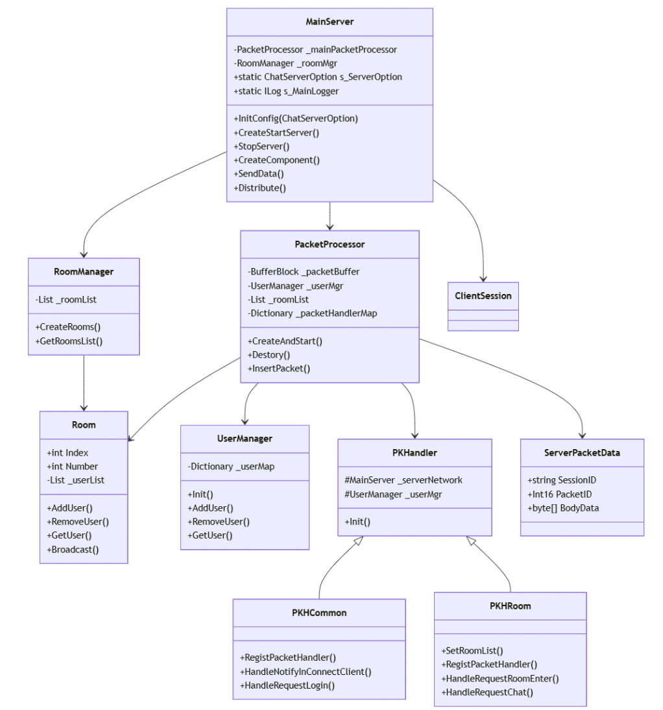    
  
이 클래스 다이어그램은 채팅 서버의 주요 클래스들과 그들 간의 관계를 보여준다.  
1. MainServer: 서버의 핵심 클래스로 전체적인 서버 운영을 관리한다.  
2. PacketProcessor: 패킷 처리를 담당하는 클래스이다.  
3. RoomManager: 채팅방들을 관리하는 클래스이다.  
4. UserManager: 사용자들을 관리하는 클래스이다.  
5. PKHandler와 그 하위 클래스들(PKHCommon, PKHRoom): 각각의 패킷 타입별 처리를 담당한다.
  
주요 관계:  
* MainServer가 PacketProcessor와 RoomManager를 포함한다.  
* PacketProcessor는 UserManager와 Room들을 관리한다.  
* PKHandler를 상속받은 PKHCommon과 PKHRoom이 각각의 패킷 처리를 담당한다.
  

## 코드 흐름을 중심으로 시퀸스 다이어그램
  
     
    
이 시퀀스 다이어그램은 채팅 서버의 주요 프로세스 흐름을 보여준다:  

1. 서버 초기화    
- MainServer 시작   
- 룸 매니저 초기화  
- 패킷 프로세서 초기화  
- 패킷 핸들러 등록
  
2. 클라이언트 접속 및 로그인    
- 클라이언트 연결  
- 로그인 요청/응답  
- 유저 매니저에 사용자 추가
  
3. 채팅방 관련 처리    
- 방 입장  
- 채팅 메시지 처리  
- 방 퇴장  
  
4. 접속 종료    
- 클라이언트 연결 해제  
- 유저 정보 정리  
- 방 정보 정리
  

주요 특징:  
* 모든 패킷은 MainServer를 통해 PacketProcessor로 전달됨  
* PacketProcessor가 각 패킷 타입에 맞는 핸들러로 처리를 위임  
* Room 클래스가 채팅방 관련 모든 브로드캐스팅을 담당
  

## MainServer 클래스를 중심으로 주요 코드 흐름 다이어그램
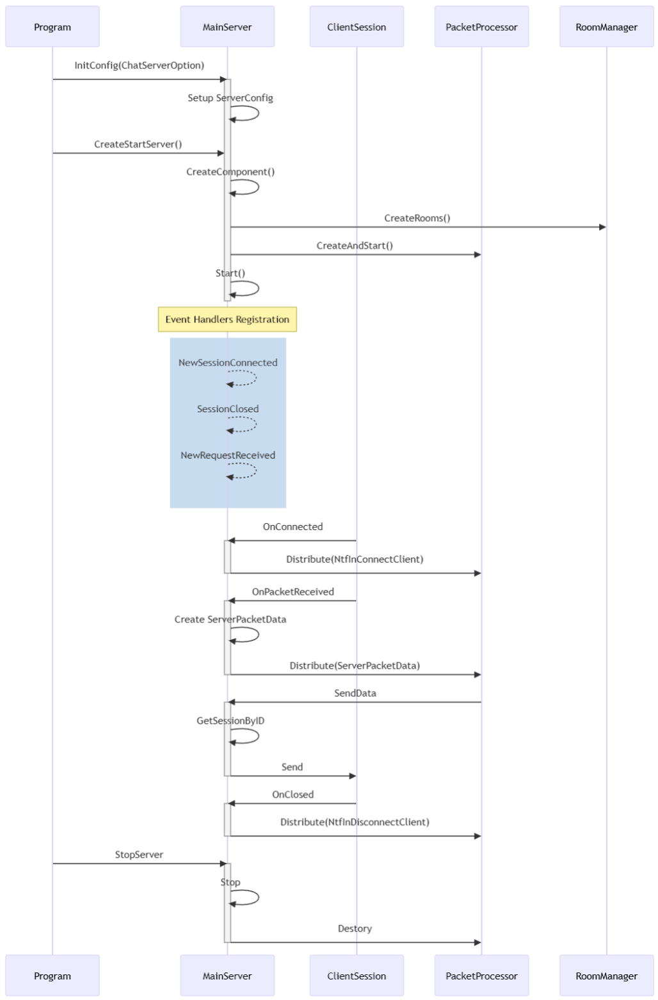      
  
이 시퀀스 다이어그램은 MainServer를 중심으로 한 주요 코드 흐름을 보여준다:    
  
1. 초기화 및 시작 단계  
* InitConfig: 서버 설정 초기화  
* CreateStartServer: 서버 컴포넌트 생성 및 시작  
* CreateComponent: RoomManager, PacketProcessor 초기화
  
2. 이벤트 핸들러 등록  
* NewSessionConnected  
* SessionClosed  
* NewRequestReceived
  
3. 세션 관리 흐름  
* OnConnected: 새 클라이언트 연결 처리  
* OnPacketReceived: 패킷 수신 처리  
* OnClosed: 클라이언트 연결 종료 처리
  
4. 데이터 송수신  
* Distribute: 패킷 처리기로 전달  
* SendData: 클라이언트로 데이터 전송
  
5. 종료 처리  
* StopServer: 서버 종료  
* 관련 리소스 정리
  
  
주요 특징:  
* 이벤트 기반 처리  
* 비동기 통신 지원  
* 중앙화된 패킷 처리  
* 세션 기반 클라이언트 관리
  
 
## 채팅 서버 설정 값
파일: ChatServerOption.cs    

- 서버 설정을 위한 명령줄 옵션을 정의한다.  
- CommandLine 라이브러리를 사용하여 옵션을 파싱한다.  
    - [NuGet](https://www.nuget.org/packages/nuget.commandline )

```
using CommandLine;


namespace ChatServer;

public class ChatServerOption
{
    [Option( "uniqueID", Required = true, HelpText = "Server UniqueID")]
    public int ChatServerUniqueID { get; set; }

    [Option("name", Required = true, HelpText = "Server Name")]
    public string Name { get; set; }

    [Option("maxConnectionNumber", Required = true, HelpText = "MaxConnectionNumber")]
    public int MaxConnectionNumber { get; set; }

    [Option("port", Required = true, HelpText = "Port")]
    public int Port { get; set; }

    [Option("maxRequestLength", Required = true, HelpText = "maxRequestLength")]
    public int MaxRequestLength { get; set; }

    [Option("receiveBufferSize", Required = true, HelpText = "receiveBufferSize")]
    public int ReceiveBufferSize { get; set; }

    [Option("sendBufferSize", Required = true, HelpText = "sendBufferSize")]
    public int SendBufferSize { get; set; }

    [Option("roomMaxCount", Required = true, HelpText = "Max Romm Count")]
    public int RoomMaxCount { get; set; } = 0;

    [Option("roomMaxUserCount", Required = true, HelpText = "RoomMaxUserCount")]
    public int RoomMaxUserCount { get; set; } = 0;

    [Option("roomStartNumber", Required = true, HelpText = "RoomStartNumber")]
    public int RoomStartNumber { get; set; } = 0;      

}
```    
   

## ChatServer의 스레드 사용 구조

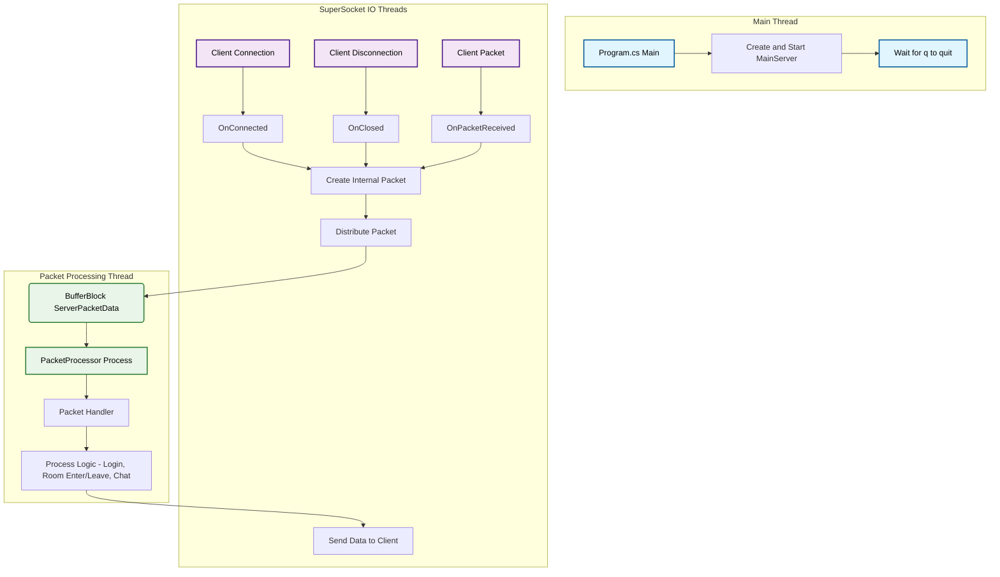

### 다이어그램 설명
이 다이어그램은 `ChatServer`의 세 가지 주요 스레드 그룹과 그 상호 작용을 보여준다.

1.  **Main Thread (보라색)**

      * 애플리케이션의 시작점입니다 (`Program.cs`의 `Main` 함수).
      * `MainServer` 객체를 생성하고 시작하는 역할을 한다.
      * 서버가 실행되는 동안 'q' 키 입력을 기다리며 대기한다.

2.  **SuperSocket IO Threads (파란색)**

      * 네트워킹 라이브러리인 `SuperSocketLite`에 의해 관리되는 스레드 풀이다.
      * 클라이언트의 연결, 연결 해제, 데이터 수신과 같은 I/O 작업을 비동기적으로 처리한다.
      * 클라이언트로부터 패킷이 수신되면(`OnPacketReceived`), 이 스레드는 해당 패킷을 `PacketProcessor`에 전달(`Distribute`)한다.
      * 클라이언트에게 데이터를 보낼 때도 이 스레드가 사용된다.

3.  **Packet Processing Thread (연보라색)**

      * `PacketProcessor` 클래스 내에서 생성되는 별도의 **단일 스레드**이다.
      * `BufferBlock`이라는 큐에 쌓인 패킷들을 순차적으로 가져와 처리한다.
      * 로그인, 채팅, 채팅방 입장/퇴장과 같은 **핵심적인 게임 로직**이 모두 이 스레드에서 순서대로 안전하게 처리된다. 이를 통해 여러 스레드가 동시에 데이터에 접근할 때 발생할 수 있는 복잡한 동시성 문제를 방지한다.
      * 로직 처리 후 클라이언트에게 응답을 보내야 할 경우, `SuperSocket IO Thread`에 데이터 전송을 요청한다.

  

## MainServer 클래스
파일: MainServer.cs  
  
`MainServer` 클래스는 SuperSocketLite 라이브러리의 `AppServer`를 상속받아 채팅 서버의 핵심 기능을 구현한 클래스다. 클라이언트의 연결 관리, 패킷 수신 및 처리를 담당하며, 전체 서버의 동작을 총괄한다.

### 주요 기능 및 역할

* **서버 설정 및 시작/종료**:
    * `InitConfig()`: 서버의 이름, 포트, 최대 연결 수와 같은 초기 설정을 `ChatServerOption` 객체를 통해 받아 구성한다.
    * `CreateStartServer()`: `Setup()` 메서드를 호출하여 서버를 설정하고, 로깅을 위해 `NLogLogFactory`를 사용한다. 설정이 완료되면 `Start()` 메서드를 호출하여 서버를 시작한다.
    * `StopServer()`: 서버의 작동을 중지하고 `PacketProcessor` 등의 리소스를 정리한다.

* **컴포넌트 생성**:
    * `CreateComponent()`: 서버가 시작될 때 필요한 주요 컴포넌트들을 생성하고 초기화한다.
    * `RoomManager`를 통해 채팅방들을 생성하고, `PacketProcessor`를 생성하여 패킷을 처리할 스레드를 시작시킨다.
    * `Room` 클래스가 클라이언트에게 데이터를 보낼 수 있도록 `SendData` 메서드를 `Room.NetSendFunc`에 할당한다.

* **세션 및 패킷 처리**:
    * `OnConnected()`: 새로운 클라이언트가 접속하면 호출되며, 접속 로그를 남기고 `PacketProcessor`에 클라이언트 연결을 알리는 내부 패킷을 전달한다.
    * `OnClosed()`: 클라이언트 접속이 끊어지면 호출되며, 접속 해제 로그를 남기고 `PacketProcessor`에 클라이언트 연결 끊김을 알리는 내부 패킷을 전달한다.
    * `OnPacketReceived()`: 클라이언트로부터 새로운 패킷을 수신하면 호출된다. 수신된 데이터(`EFBinaryRequestInfo`)를 `ServerPacketData` 형식으로 변환한 후, `Distribute()` 메서드를 통해 `PacketProcessor`로 전달하여 처리하도록 한다.
    * `SendData()`: 특정 세션 ID를 가진 클라이언트에게 바이트 배열 형태의 데이터를 전송한다.
    * `Distribute()`: `OnPacketReceived` 등에서 받은 패킷을 `PacketProcessor`의 큐에 추가하여 순차적으로 처리되도록 한다.

`MainServer`는 이처럼 서버의 전체적인 흐름을 제어하고, 클라이언트와의 통신을 관리하며, 수신된 패킷을 `PacketProcessor`에 넘겨 실제 로직이 처리되도록 하는 중요한 역할을 담당하는 클래스라고 할 수 있다.


### 생성자: `MainServer()`
`MainServer` 클래스의 생성자다. `AppServer`를 기반으로 세션이 연결되었을 때, 세션이 닫혔을 때, 그리고 새로운 요청을 받았을 때 호출될 함수들을 미리 등록하는 역할을 한다.

* **`NewSessionConnected += new SessionHandler<ClientSession>(OnConnected);`**: 새로운 클라이언트가 서버에 접속하면 `OnConnected` 함수를 호출하도록 지정한다.
* **`SessionClosed += new SessionHandler<ClientSession, CloseReason>(OnClosed);`**: 클라이언트의 접속이 끊어지면 `OnClosed` 함수를 호출하도록 지정한다.
* **`NewRequestReceived += new RequestHandler<ClientSession, EFBinaryRequestInfo>(OnPacketReceived);`**: 클라이언트로부터 패킷을 받으면 `OnPacketReceived` 함수를 호출하도록 지정한다.

### `InitConfig(ChatServerOption option)`
서버의 기본 설정을 초기화하는 함수다.

* `ChatServerOption` 객체를 인자로 받아 서버의 이름, 포트, 최대 연결 수 등 SuperSocketLite 라이브러리가 필요로 하는 설정 값들을 구성한다.
* 이 함수를 통해 커맨드라인 인자로 전달된 옵션들이 실제 서버 설정에 반영된다.

### `CreateStartServer()`
서버를 설정하고 실행하는 과정을 담당하는 함수다.

* `Setup()` 메서드를 호출하여 `InitConfig`에서 만든 설정으로 서버를 구성한다. 이때 로그 기록을 위해 `NLogLogFactory`를 사용한다.
* 서버 설정이 성공하면, `CreateComponent()`를 호출하여 채팅방, 패킷 프로세서 등 서버 운영에 필요한 핵심 요소들을 생성한다.
* 모든 준비가 끝나면 `Start()` 메서드를 호출하여 클라이언트의 접속을 받기 시작한다.
* 만약 서버 생성 과정에서 예외가 발생하면 콘솔에 에러 메시지를 출력한다.

### `StopServer()`
실행 중인 서버를 중지시키는 함수다.

* `Stop()` 메서드를 호출하여 더 이상 클라이언트 접속을 받지 않고 현재 연결된 모든 세션을 종료시킨다.
* `_mainPacketProcessor.Destory()`를 호출하여 패킷을 처리하던 스레드를 안전하게 종료한다.

### `CreateComponent()`
서버의 핵심 기능들을 담당하는 객체들을 생성하고 초기화하는 함수다.

* `Room.NetSendFunc = this.SendData;`: `Room` 객체들이 클라이언트에게 패킷을 보낼 수 있도록 `MainServer`의 `SendData` 함수를 `Room`의 정적 변수에 할당한다.
* `_roomMgr.CreateRooms();`: `RoomManager`를 통해 설정 파일에 정의된 수만큼 채팅방을 생성한다.
* `_mainPacketProcessor.CreateAndStart()`: 패킷 처리를 전담하는 `PacketProcessor` 객체를 생성하고, 패킷 처리 스레드를 시작시킨다.

### `SendData(string sessionID, byte[] sendData)`
특정 클라이언트에게 데이터를 전송하는 함수다.

* 매개변수로 받은 `sessionID`를 사용하여 `GetSessionByID`로 클라이언트 세션 객체를 찾는다.
* 세션이 존재하면 `session.Send()` 메서드를 호출하여 `sendData` 바이트 배열을 클라이언트에게 전송한다.
* 데이터 전송 중 발생할 수 있는 예외(네트워크 타임아웃 등)를 처리하여 서버가 비정상적으로 종료되는 것을 방지한다.

### `Distribute(ServerPacketData requestPacket)`
수신된 패킷을 `PacketProcessor`에게 전달하는 역할을 하는 함수다.

* 클라이언트로부터 받은 패킷 데이터(`requestPacket`)를 `_mainPacketProcessor`의 `InsertPacket` 메서드를 통해 처리 큐에 추가한다.
* 이렇게 함으로써 패킷 수신부와 처리부를 분리하여, 네트워크 스레드가 패킷 처리 작업으로 인해 지연되는 것을 막는다.

### `OnConnected(ClientSession session)`
새로운 클라이언트가 성공적으로 접속했을 때 호출되는 이벤트 핸들러 함수다.

* 접속한 클라이언트의 세션 번호를 로그로 기록한다.
* `ServerPacketData.MakeNTFInConnectOrDisConnectClientPacket`을 호출하여 클라이언트가 접속했음을 알리는 내부용 패킷을 생성한다.
* 생성된 패킷을 `Distribute` 함수로 전달하여 `PacketProcessor`가 이 접속 이벤트를 처리하도록 한다.

### `OnClosed(ClientSession session, CloseReason reason)`
클라이언트 접속이 끊어졌을 때 호출되는 이벤트 핸들러 함수다.

* 접속이 끊긴 클라이언트의 세션 번호와 접속 종료 사유를 로그로 남긴다.
* `OnConnected`와 유사하게, 클라이언트 접속이 끊어졌음을 알리는 내부용 패킷을 생성한다.
* 이 패킷을 `Distribute` 함수로 전달하여, `PacketProcessor`가 해당 유저의 퇴장 처리 등을 수행하도록 한다.

### `OnPacketReceived(ClientSession session, EFBinaryRequestInfo reqInfo)`
클라이언트로부터 패킷 데이터가 도착했을 때 호출되는 이벤트 핸들러 함수다.

* 데이터 수신 사실과 수신된 데이터의 크기를 로그로 기록한다.
* 수신된 데이터(`reqInfo`)를 서버 내부에서 사용하기 편한 `ServerPacketData` 형식으로 변환한다. 이 과정에서 패킷의 크기, ID, 타입, 그리고 실제 데이터(Body)가 `ServerPacketData` 객체에 복사된다.
* 변환된 `ServerPacketData` 객체를 `Distribute` 함수에 넘겨주어 패킷 처리 큐에 등록한다.
  

전체 코드  
```
namespace ChatServer;

public class MainServer : AppServer<ClientSession, EFBinaryRequestInfo>
{
    public static ChatServerOption s_ServerOption;
    public static SuperSocketLite.SocketBase.Logging.ILog s_MainLogger;

    SuperSocketLite.SocketBase.Config.IServerConfig _config;

    PacketProcessor _mainPacketProcessor = new ();
    RoomManager _roomMgr = new ();
    
    
    public MainServer()
        : base(new DefaultReceiveFilterFactory<ReceiveFilter, EFBinaryRequestInfo>())
    {
        NewSessionConnected += new SessionHandler<ClientSession>(OnConnected);
        SessionClosed += new SessionHandler<ClientSession, CloseReason>(OnClosed);
        NewRequestReceived += new RequestHandler<ClientSession, EFBinaryRequestInfo>(OnPacketReceived);
    }

    public void InitConfig(ChatServerOption option)
    {
        s_ServerOption = option;

        _config = new SuperSocketLite.SocketBase.Config.ServerConfig
        {
            Name = option.Name,
            Ip = "Any",
            Port = option.Port,
            Mode = SocketMode.Tcp,
            MaxConnectionNumber = option.MaxConnectionNumber,
            MaxRequestLength = option.MaxRequestLength,
            ReceiveBufferSize = option.ReceiveBufferSize,
            SendBufferSize = option.SendBufferSize
        };
    }
    
    public void CreateStartServer()
    {
        try
        {
            bool bResult = Setup(new SuperSocketLite.SocketBase.Config.RootConfig(), 
                                _config, 
                                logFactory: new NLogLogFactory());

            if (bResult == false)
            {
                Console.WriteLine("[ERROR] 서버 네트워크 설정 실패 ㅠㅠ");
                return;
            } 
            else 
            {
                s_MainLogger = base.Logger;
                s_MainLogger.Info("서버 초기화 성공");
            }


            CreateComponent();

            Start();

            s_MainLogger.Info("서버 생성 성공");
        }
        catch (Exception ex)
        {
            Console.WriteLine($"[ERROR] 서버 생성 실패: {ex.ToString()}");
        }          
    }

    
    public void StopServer()
    {            
        Stop();

        _mainPacketProcessor.Destory();
    }

    // 주요 객체 생성
    public ErrorCode CreateComponent()
    {
        Room.NetSendFunc = this.SendData;
        _roomMgr.CreateRooms();

        _mainPacketProcessor = new PacketProcessor();
        _mainPacketProcessor.CreateAndStart(_roomMgr.GetRoomsList(), this);

        s_MainLogger.Info("CreateComponent - Success");
        return ErrorCode.None;
    }

    // 네트워크로 패킷을 보낸다
    public bool SendData(string sessionID, byte[] sendData)
    {
        var session = GetSessionByID(sessionID);

        try
        {
            if (session == null)
            {
                return false;
            }

            session.Send(sendData, 0, sendData.Length);
        }
        catch(Exception ex)
        {
            // TimeoutException 예외가 발생할 수 있다
            MainServer.s_MainLogger.Error($"{ex.ToString()},  {ex.StackTrace}");

            session.SendEndWhenSendingTimeOut(); 
            session.Close();
        }
        return true;
    }

    // 패킷처리기로 패킷을 전달한다
    public void Distribute(ServerPacketData requestPacket)
    {
        _mainPacketProcessor.InsertPacket(requestPacket);
    }
                    

    void OnConnected(ClientSession session)
    {
        //옵션의 최대 연결 수를 넘으면 SuperSocket이 바로 접속을 짤라버린다. 즉 이 OnConneted 함수가 호출되지 않는다
        s_MainLogger.Info(string.Format("세션 번호 {0} 접속", session.SessionID));
                    
        var packet = ServerPacketData.MakeNTFInConnectOrDisConnectClientPacket(true, session.SessionID);            
        Distribute(packet);
    }

    void OnClosed(ClientSession session, CloseReason reason)
    {
        s_MainLogger.Info($"세션 번호 {session.SessionID} 접속해제: {reason.ToString()}");

        var packet = ServerPacketData.MakeNTFInConnectOrDisConnectClientPacket(false, session.SessionID);
        Distribute(packet);
    }

    void OnPacketReceived(ClientSession session, EFBinaryRequestInfo reqInfo)
    {
        s_MainLogger.Debug($"세션 번호 {session.SessionID} 받은 데이터 크기: {reqInfo.Body.Length}, ThreadId: {System.Threading.Thread.CurrentThread.ManagedThreadId}");

        var packet = new ServerPacketData();
        packet.SessionID = session.SessionID;
        packet.PacketSize = reqInfo.Size;            
        packet.PacketID = reqInfo.PacketID;
        packet.Type = reqInfo.Type;
        packet.BodyData = reqInfo.Body;
                
        Distribute(packet);
    }
}

public class ClientSession : AppSession<ClientSession, EFBinaryRequestInfo>
{
}
```  
    
### 주요 함수 호출 다이어그램    
```mermaid    
sequenceDiagram
    participant Program as Program.cs
    participant MainServer as MainServer
    participant SuperSocketLite as SuperSocketLite 프레임워크
    participant PacketProcessor as PacketProcessor
    participant Client as 클라이언트

    Note over Program, Client: 서버 시작 및 실행 흐름

    Program->>MainServer: new MainServer() (생성자)
    Program->>MainServer: InitConfig(options)
    Program->>MainServer: CreateStartServer()
    MainServer->>MainServer: CreateComponent()
    MainServer->>PacketProcessor: CreateAndStart()
    MainServer->>SuperSocketLite: Start()

    Note over Program, Client: 클라이언트 접속 및 데이터 통신

    Client->>SuperSocketLite: 서버 접속
    SuperSocketLite->>MainServer: OnConnected(session)
    MainServer->>MainServer: Distribute(packet)
    MainServer->>PacketProcessor: InsertPacket(packet)

    Client->>SuperSocketLite: 패킷 전송
    SuperSocketLite->>MainServer: OnPacketReceived(session, reqInfo)
    MainServer->>MainServer: Distribute(packet)
    MainServer->>PacketProcessor: InsertPacket(packet)
    
    Note right of PacketProcessor: 패킷 처리 후<br/>필요 시 SendData() 호출

    Client->>SuperSocketLite: 접속 종료
    SuperSocketLite->>MainServer: OnClosed(session, reason)
    MainServer->>MainServer: Distribute(packet)
    MainServer->>PacketProcessor: InsertPacket(packet)


    Note over Program, Client: 서버 종료

    Program->>MainServer: StopServer()
    MainServer->>SuperSocketLite: Stop()
    MainServer->>PacketProcessor: Destory()
```    
  

## ClientSession 클래스:  
- `ClientSession` 클래스는 `AppSession<ClientSession, EFBinaryRequestInfo>`를 상속받는다.
- 이 클래스는 개별 클라이언트 연결을 나타낸다.
    
  

## 클라이언트 접속 (OnConnected)
클라이언트가 서버에 접속했을 때의 처리 흐름이다.

```mermaid
sequenceDiagram
    participant Client as 클라이언트
    participant SuperSocketLite as SuperSocketLite 프레임워크
    participant MainServer as MainServer
    participant PacketProcessor as PacketProcessor
    participant PKHCommon as PKHCommon

    Client->>SuperSocketLite: 서버에 접속 요청
    SuperSocketLite->>MainServer: OnConnected(session) 호출
    MainServer->>MainServer: ServerPacketData.MakeNTFInConnectOrDisConnectClientPacket()
    Note right of MainServer: 접속 알림용 내부 패킷 생성
    MainServer->>MainServer: Distribute(packet)
    MainServer->>PacketProcessor: InsertPacket(packet)
    Note right of PacketProcessor: 패킷을 처리 큐에 추가

    PacketProcessor->>PKHCommon: HandleNotifyInConnectClient(packet) 호출
    PKHCommon->>MainServer: 현재 접속 세션 수 로그 기록
```
  
## 클라이언트 접속 끊어짐 (OnClosed)
클라이언트의 접속이 끊어졌을 때의 처리 흐름이다.

```mermaid
sequenceDiagram
    participant Client as 클라이언트
    participant SuperSocketLite as SuperSocketLite 프레임워크
    participant MainServer as MainServer
    participant PacketProcessor as PacketProcessor
    participant PKHCommon as PKHCommon
    participant UserManager as UserManager

    Client--xSuperSocketLite: 접속 끊어짐
    SuperSocketLite->>MainServer: OnClosed(session, reason) 호출
    MainServer->>MainServer: ServerPacketData.MakeNTFInConnectOrDisConnectClientPacket()
    Note right of MainServer: 접속 해제 알림용 내부 패킷 생성
    MainServer->>MainServer: Distribute(packet)
    MainServer->>PacketProcessor: InsertPacket(packet)

    PacketProcessor->>PKHCommon: HandleNotifyInDisConnectClient(packet) 호출
    PKHCommon->>UserManager: GetUser(sessionID)
    UserManager-->>PKHCommon: user 객체 반환
    Note right of PKHCommon: 유저가 방에 있었다면<br/>퇴장 처리 패킷을 다시 Distribute
    PKHCommon->>UserManager: RemoveUser(sessionID)
```
  
## 데이터 수신 (OnPacketReceived)
클라이언트로부터 데이터를 받았을 때의 처리 흐름이다.

```mermaid
sequenceDiagram
    participant Client as 클라이언트
    participant SuperSocketLite as SuperSocketLite 프레임워크
    participant MainServer as MainServer
    participant PacketProcessor as PacketProcessor

    Client->>SuperSocketLite: 데이터(패킷) 전송
    SuperSocketLite->>MainServer: OnPacketReceived(session, reqInfo) 호출
    Note right of MainServer: 받은 데이터(reqInfo)를<br/>ServerPacketData 형식으로 변환
    MainServer->>MainServer: Distribute(packet)
    MainServer->>PacketProcessor: InsertPacket(packet)
    Note right of PacketProcessor: 패킷을 처리 큐에 추가
```

## 패킷 처리 (PacketProcessor)
`PacketProcessor`가 큐에 쌓인 패킷을 처리하는 일반적인 흐름이다.

```mermaid
sequenceDiagram
    participant PacketProcessor as PacketProcessor
    participant PacketHandlerMap as Dictionary<int, Action>
    participant PacketHandler as PKHCommon or PKHRoom
    participant MainServer as MainServer
    participant Client as 클라이언트

    loop Process Thread
        PacketProcessor->>PacketProcessor: _packetBuffer.Receive()
        Note right of PacketProcessor: 큐에서 패킷을 하나 꺼냄
        PacketProcessor->>PacketHandlerMap: _packetHandlerMap[packet.PacketID]
        Note right of PacketHandlerMap: 패킷 ID에 맞는 핸들러 함수를 찾음
        PacketHandlerMap-->>PacketProcessor: Handler 함수 반환
        PacketProcessor->>PacketHandler: 해당 Handler 함수 실행 (예: HandleRequestLogin)
        PacketHandler->>PacketHandler: 패킷 처리 로직 수행
        opt 응답 필요 시
            PacketHandler->>MainServer: SendData(sessionID, sendData)
            MainServer->>Client: 데이터 전송
        end
    end
```
  

## PacketProcessor 클래스
파일: PacketProcessor.cs  
  
- 패킷 처리를 담당하는 클래스이다.  
- BufferBlock을 사용하여 패킷을 비동기적으로 처리한다.  
- 사용자 관리, 방 관리 기능을 포함한다.  
- 패킷 핸들러를 등록하고 실행하는 메커니즘을 가지고 있다.  
      
### PacketProcessor 클래스 개요
`PacketProcessor` 클래스는 클라이언트로부터 받은 패킷을 실질적으로 처리하는 핵심 클래스다. SuperSocketLite 라이브러리가 클라이언트로부터 패킷을 수신하면, `MainServer`는 이 패킷을 `PacketProcessor`의 처리 큐(`_packetBuffer`)에 추가한다. `PacketProcessor`는 별도의 스레드를 사용하여 이 큐에서 패킷을 하나씩 꺼내어 미리 등록된 핸들러 함수에 전달하고 실행하는 역할을 한다.

이러한 구조는 네트워크 패킷 수신부와 실제 로직 처리부를 분리하여, 특정 패킷 처리가 지연되더라도 전체 네트워크 성능에 미치는 영향을 최소화하는 장점이 있다.

<pre>
┌─────────────────────────────────────────────────────────────────────────────────┐
│                           PacketProcessor 아키텍처                               │
└─────────────────────────────────────────────────────────────────────────────────┘

   클라이언트                SuperSocketLite               MainServer
        │                         │                          │
        │      패킷 전송           │                          │
        ├───────────────────────► │                          │
        │                         │        패킷 수신          │
        │                         ├─────────────────────────►│
        │                         │                          │
        │                         │                          ▼  큐에 추가
        │                         │                 ┌──────────────────┐
        │                         │                 │   _packetBuffer  │
        │                         │                 │    (처리 큐)      │
        │                         │                 ┤   ┌────────────┐ │
        │                         │                 │   │  Packet 1  │ │
        │                         │                 │   ├────────────┤ │
        │                         │                 │   │  Packet 2  │ │
        │                         │                 │   ├────────────┤ │
        │                         │                 │   │  Packet 3  │ │
        │                         │                 │   └────────────┘ │
        │                         │                 └──────────────────┘
        │                         │                          │
        │                         │                          │ 패킷을 하나씩 
        │                         │                          │ 꺼내어 처리
        │                         │                          ▼
        │                         │                 ┌──────────────────┐
        │                         │                 │ PacketProcessor  │
        │                         │                 │   별도 스레드      │
        │                         │                 │                  │
        │                         │                 │ ┌──────────────┐ │
        │                         │                 │ │ 핸들러 함수들  │ │
        │                         │                 │ │              │ │
        │                         │                 │ │ LoginHandler │ │
        │                         │                 │ │ ChatHandler  │ │
        │                         │                 │ │ RoomHandler  │ │
        │                         │                 │ │     ...      │ │
        │                         │                 │ └──────────────┘ │
        │                         │                 └──────────────────┘
        │                         │                          │
        │      응답 전송           │◄─────────────────────────┤
        │◄────────────────────────┤                          │
        │                         │                          │

┌──────────────────────────────────────────────────────────────────────────────┐
│                                장점                                           │
├──────────────────────────────────────────────────────────────────────────────┤
│  🔹 네트워크 수신부 ↔ 로직 처리부 분리                                           │
│  🔹 패킷 처리 지연이 전체 네트워크 성능에 미치는 영향 최소화                        │
│  🔹 비동기 처리로 인한 높은 처리량 달성                                          │
│  🔹 큐 기반 버퍼링으로 트래픽 급증 시에도 안정적 처리                              │
└─────────────────────────────────────────────────────────────────────────────┘

        Network Thread                    Processing Thread
             │                                   │
    ┌─────────────────┐                 ┌─────────────────┐
    │  Fast Response  │                 │ Heavy Logic     │
    │  Low Latency    │                 │ Can Take Time   │
    └─────────────────┘                 └─────────────────┘
</pre>
  

### 멤버 변수

  * `_isThreadRunning`: 패킷 처리 스레드의 실행 상태를 제어하는 플래그다.
  * `_processThread`: `Process()` 메서드를 실행하는 실제 스레드 객체다.
  * `_packetBuffer`: 수신된 패킷(`ServerPacketData`)을 임시로 저장하는 큐(Queue)다. `BufferBlock<T>`은 스레드로부터 안전하게 데이터를 추가하고 꺼낼 수 있는 기능을 제공한다.
  * `_userMgr`: 유저 정보를 관리하는 `UserManager` 객체다.
  * `_roomList`, `_roomNumberRange`: 채팅방 목록과 방 번호 범위를 관리한다.
  * `_packetHandlerMap`: `PacketId`를 키로, 해당 패킷을 처리할 함수(`Action<ServerPacketData>`)를 값으로 가지는 딕셔너리다. 패킷 종류에 따라 어떤 함수를 실행할지 결정하는 데 사용된다.
  * `_commonPacketHandler`, `_roomPacketHandler`: 실제 패킷 처리 로직을 담고 있는 핸들러 클래스 객체다.

-----

### 멤버 함수 및 코드 설명

#### `CreateAndStart(List<Room> roomList, MainServer mainServer)`
서버 시작 시 호출되며, `PacketProcessor`를 작동시키는 데 필요한 모든 초기화 작업을 수행한다.

```csharp
public void CreateAndStart(List<Room> roomList, MainServer mainServer)
{
    // 1. UserManager 초기화
    var maxUserCount = MainServer.s_ServerOption.RoomMaxCount * MainServer.s_ServerOption.RoomMaxUserCount;
    _userMgr.Init(maxUserCount);

    // 2. Room 정보 설정
    _roomList = roomList;
    var minRoomNum = _roomList[0].Number;
    var maxRoomNum = _roomList[0].Number + _roomList.Count() - 1;
    _roomNumberRange = new Tuple<int, int>(minRoomNum, maxRoomNum);
    
    // 3. 패킷 핸들러 등록
    RegistPacketHandler(mainServer);

    // 4. 패킷 처리 스레드 생성 및 시작
    _isThreadRunning = true;
    _processThread = new System.Threading.Thread(this.Process);
    _processThread.Start();
}
```

1.  **UserManager 초기화**: 서버 설정에 명시된 최대 방 개수와 방당 최대 유저 수를 곱하여 서버가 수용할 전체 유저 수를 계산하고 `UserManager`를 초기화한다.
2.  **Room 정보 설정**: `RoomManager`로부터 생성된 방 리스트를 받아오고, 관리할 방 번호의 시작과 끝 범위를 설정한다.
3.  **패킷 핸들러 등록**: `RegistPacketHandler` 함수를 호출하여 어떤 패킷 ID에 어떤 처리 함수를 연결할지 설정한다.
4.  **스레드 시작**: `_isThreadRunning` 플래그를 `true`로 설정하고, `Process` 함수를 실행할 새로운 스레드를 생성하여 시작한다. 이 시점부터 `PacketProcessor`는 패킷을 처리할 준비를 마친다.

#### `Destory()`
서버를 종료할 때 호출되어 패킷 처리 스레드를 안전하게 중지시킨다.

```csharp
public void Destory()
{
    _isThreadRunning = false;
    _packetBuffer.Complete();
}
```

  * `_isThreadRunning = false;`: `Process` 함수의 `while` 루프를 빠져나오도록 신호를 보낸다.
  * `_packetBuffer.Complete();`: `_packetBuffer`에 더 이상 새로운 패킷이 추가되지 않을 것임을 알린다. 만약 큐가 비어있는 상태에서 `Receive()`가 호출되면, `InvalidOperationException`을 발생시켜 `Process` 메서드의 `while` 루프를 즉시 종료시키는 효과를 준다.

#### `InsertPacket(ServerPacketData data)`
`MainServer`가 클라이언트로부터 패킷을 받을 때마다 호출하는 함수다.

```csharp
public void InsertPacket(ServerPacketData data)
{
    _packetBuffer.Post(data);
}
```

  * `_packetBuffer.Post(data);`: 인자로 받은 `ServerPacketData` 객체를 `_packetBuffer` 큐에 추가한다. 이 작업은 매우 빠르므로 네트워크 수신 스레드의 지연을 최소화한다.

#### `RegistPacketHandler(MainServer serverNetwork)`
패킷 ID와 그 패킷을 처리할 함수를 `_packetHandlerMap`에 등록하는 역할을 한다.

```csharp
void RegistPacketHandler(MainServer serverNetwork)
{            
    // 1. 공통 패킷 핸들러 초기화 및 등록
    _commonPacketHandler.Init(serverNetwork, _userMgr);
    _commonPacketHandler.RegistPacketHandler(_packetHandlerMap);                
    
    // 2. 채팅방 관련 패킷 핸들러 초기화 및 등록
    _roomPacketHandler.Init(serverNetwork, _userMgr);
    _roomPacketHandler.SetRooomList(_roomList);
    _roomPacketHandler.RegistPacketHandler(_packetHandlerMap);
}
```

1.  `_commonPacketHandler` (로그인 등)와 `_roomPacketHandler` (채팅, 방 입장/퇴장 등) 객체를 초기화한다.
2.  각 핸들러 객체의 `RegistPacketHandler` 함수를 호출하여, 핸들러들이 자신들이 처리할 패킷 ID와 처리 함수를 `_packetHandlerMap` 딕셔너리에 스스로 등록하도록 한다. 예를 들어 `PKHCommon` 클래스는 로그인 요청(`PacketId.ReqLogin`)을 `HandleRequestLogin` 함수와 연결하여 `_packetHandlerMap`에 추가한다.

#### `Process()`
패킷 처리 스레드에서 무한 루프를 돌며 실제 패킷 처리를 담당하는 가장 핵심적인 함수다.

```csharp
void Process()
{
    while (_isThreadRunning) // 1. 스레드 실행 플래그 검사
    {
        try
        {
            // 2. 큐에서 패킷 꺼내오기 (블로킹)
            var packet = _packetBuffer.Receive();

            // 3. 핸들러 맵에서 처리 함수 찾기
            if (_packetHandlerMap.ContainsKey(packet.PacketID))
            {
                // 4. 처리 함수 실행
                _packetHandlerMap[packet.PacketID](packet);
            }
            else
            {
                System.Diagnostics.Debug.WriteLine("...");
            }
        }
        catch (Exception ex) // 5. 예외 처리
        {
            if(_isThreadRunning)
            {
                MainServer.s_MainLogger.Error(ex.ToString());
            }                
        }
    }
}
```

1.  `while (_isThreadRunning)`: `_isThreadRunning`이 `true`인 동안 계속해서 루프를 실행한다.
2.  `var packet = _packetBuffer.Receive();`: `_packetBuffer` 큐에서 패킷을 하나 꺼낸다. 만약 큐가 비어있으면 새로운 패킷이 들어올 때까지 이 라인에서 대기(블로킹)한다.
3.  `if (_packetHandlerMap.ContainsKey(packet.PacketID))`: 꺼내온 패킷의 ID가 `_packetHandlerMap`에 등록되어 있는지 확인한다.
4.  `_packetHandlerMap[packet.PacketID](packet);`: 등록된 ID라면, 해당 ID에 연결된 처리 함수를 호출하여 패킷 처리를 위임한다.
5.  `catch (Exception ex)`: 패킷 처리 중 발생할 수 있는 모든 예외를 잡아 로그로 기록한다. 이를 통해 특정 패킷 처리 시 에러가 발생하더라도 전체 서버 스레드가 중단되는 사태를 방지한다.

  
전체 코드:    
```  
// 패킷 처리 클래스
class PacketProcessor
{
    bool _isThreadRunning = false;
    System.Threading.Thread _processThread = null;

    //receive쪽에서 처리하지 않아도 Post에서 블럭킹 되지 않는다. 
    //BufferBlock<T>(DataflowBlockOptions) 에서 DataflowBlockOptions의 BoundedCapacity로 버퍼 가능 수 지정. BoundedCapacity 보다 크게 쌓이면 블럭킹 된다
    BufferBlock<ServerPacketData> _packetBuffer = new BufferBlock<ServerPacketData>();

    UserManager _userMgr = new UserManager();

    Tuple<int,int> _roomNumberRange = new Tuple<int, int>(-1, -1);
    List<Room> _roomList = new ();

    Dictionary<int, Action<ServerPacketData>> _packetHandlerMap = new ();
    PKHCommon _commonPacketHandler = new ();
    PKHRoom _roomPacketHandler = new ();
            
        
    public void CreateAndStart(List<Room> roomList, MainServer mainServer)
    {
        var maxUserCount = MainServer.s_ServerOption.RoomMaxCount * MainServer.s_ServerOption.RoomMaxUserCount;
        _userMgr.Init(maxUserCount);

        _roomList = roomList;
        var minRoomNum = _roomList[0].Number;
        var maxRoomNum = _roomList[0].Number + _roomList.Count() - 1;
        _roomNumberRange = new Tuple<int, int>(minRoomNum, maxRoomNum);
        
        RegistPacketHandler(mainServer);

        _isThreadRunning = true;
        _processThread = new System.Threading.Thread(this.Process);
        _processThread.Start();
    }
    
    public void Destory()
    {
        _isThreadRunning = false;
        _packetBuffer.Complete();
    }
          
    public void InsertPacket(ServerPacketData data)
    {
        _packetBuffer.Post(data);
    }

    
    void RegistPacketHandler(MainServer serverNetwork)
    {            
        _commonPacketHandler.Init(serverNetwork, _userMgr);
        _commonPacketHandler.RegistPacketHandler(_packetHandlerMap);                
        
        _roomPacketHandler.Init(serverNetwork, _userMgr);
        _roomPacketHandler.SetRooomList(_roomList);
        _roomPacketHandler.RegistPacketHandler(_packetHandlerMap);
    }

    void Process()
    {
        while (_isThreadRunning)
        {
            //System.Threading.Thread.Sleep(64); //테스트 용
            try
            {
                var packet = _packetBuffer.Receive();

                if (_packetHandlerMap.ContainsKey(packet.PacketID))
                {
                    _packetHandlerMap[packet.PacketID](packet);
                }
                else
                {
                    System.Diagnostics.Debug.WriteLine("세션 번호 {0}, PacketID {1}, 받은 데이터 크기: {2}", packet.SessionID, packet.PacketID, packet.BodyData.Length);
                }
            }
            catch (Exception ex)
            {
                _isThreadRunning.IfTrue(() => MainServer.s_MainLogger.Error(ex.ToString()));
            }
        }
    }


}
```  
     
  
## 에러 코드 정의
파일: PacketDefine.cs    
    
```
public enum ErrorCode : short
{
    None = 0, // 에러가 아니다

    // 서버 초기화 에러
    RedisInitFail = 1,    // Redis 초기화 에러

    // 로그인 
    LoginInvalidAuthToken = 1001, // 로그인 실패: 잘못된 인증 토큰
    AddUserDuplication = 1002,
    RemoveUserSearchFailureUserId = 1003,
    UserAuthSearchFailureUserId = 1004,
    UserAuthAlreadySetAuth = 1005,
    LoginAlreadyWorking = 1006,
    LoginFullUserCount = 1007,

    DbLoginInvalidPassword = 1011,
    DbLoginEmptyUser = 1012,
    DbLoginException = 1013,

    RoomEnterInvalidState = 1021,
    RoomEnterInvalidUser = 1022,
    RoomEnterErrorSystem = 1023,
    RoomEnterInvalidRoomNumber = 1024,
    RoomEnterFailAddUser = 1025,
}
```  
    
  
## 패킷 ID 정의
클라이언트-서버 간 통신에 사용되는 패킷 종류를 정의한다.
  
파일: PacketDefine.cs   
```
public enum PacketId : int
{
    ReqResTestEcho = 101,


    // 클라이언트
    CsBegin = 1001,

    ReqLogin = 1002,
    ResLogin = 1003,
    NtfMustClose = 1005,

    ReqRoomEnter = 1015,
    ResRoomEnter = 1016,
    NtfRoomUserList = 1017,
    NtfRoomNewUser = 1018,

    ReqRoomLeave = 1021,
    ResRoomLeave = 1022,
    NtfRoomLeaveUser = 1023,

    ReqRoomChat = 1026,
    NtfRoomChat = 1027,


    ReqRoomDevAllRoomStartGame = 1091,
    ResRoomDevAllRoomStartGame = 1092,

    ReqRoomDevAllRoomEndGame = 1093,
    ResRoomDevAllRoomEndGame = 1094,

    CsEnd = 1100,


    // 시스템, 서버 - 서버
    S2sStart = 8001,

    NtfInConnectClient = 8011,
    NtfInDisconnectClient = 8012,

    ReqSsServerinfo = 8021,
    ResSsServerinfo = 8023,

    ReqInRoomEnter = 8031,
    ResInRoomEnter = 8032,

    NtfInRoomLeave = 8036,


    // DB 8101 ~ 9000
    ReqDbLogin = 8101,
    ResDbLogin = 8102,
}
```  

  
## Logger
NLogLogFactory.cs:    
- NLog 라이브러리를 사용하여 로깅 기능을 구현한다.  
- SuperSocket 프레임워크와 통합되어 있다.
  
NLogLog.cs:    
- NLog를 사용하여 SuperSocket의 ILog 인터페이스를 구현한다.
  
### NLogLogFactory.cs
이 클래스는 SuperSocketLite 프레임워크가 NLog를 사용하여 로그를 기록하도록 연결해주는 '공장(Factory)' 역할을 한다. SuperSocketLite는 자체 로깅 인터페이스를 가지고 있는데, `NLogLogFactory`는 이 인터페이스를 구현하여 실제 NLog 객체를 생성해주는 책임을 진다.
  
```csharp
#if (__NOT_USE_NLOG__ != true)  //NLog를 사용하지 않는다면 __NOT_USE_NLOG__ 선언한다
public class NLogLogFactory : SuperSocketLite.SocketBase.Logging.LogFactoryBase
{
    // 생성자 1: 기본 설정 파일("NLog.config")을 사용한다.
    public NLogLogFactory()
        : this("NLog.config")
    {
    }

    // 생성자 2: 특정 경로의 설정 파일을 사용한다.
    public NLogLogFactory(string nlogConfig)
        : base(nlogConfig)
    {
        if (!IsSharedConfig)
        {
            // NLog 설정 파일을 로드한다.
            LogManager.Setup().LoadConfigurationFromFile(new[] { ConfigFile });
        }
        else
        {                
        }
    }

    // SuperSocketLite가 로그 객체를 요청할 때 호출되는 함수다.
    public override SuperSocketLite.SocketBase.Logging.ILog GetLog(string name)
    {
        // NLog의 Logger를 생성하고, 이를 감싼 NLogLog 객체를 반환한다.
        return new NLogLog(NLog.LogManager.GetLogger(name));
    }
}
#endif
```

  * **`NLogLogFactory()`**: 생성자에서 NLog 설정 파일의 경로를 지정하고, `LogManager.Setup().LoadConfigurationFromFile()`를 호출하여 `NLog.config` 파일의 내용을 읽어와 NLog 전체에 적용한다.
  * **`GetLog(string name)`**: SuperSocketLite 프레임워크가 로그 객체를 필요로 할 때 이 함수를 호출한다. 그러면 `NLog.LogManager.GetLogger(name)`를 통해 NLog의 로거 인스턴스를 얻고, 이 인스턴스를 `NLogLog` 클래스로 감싸서 반환한다. 이를 통해 SuperSocketLite는 자신이 필요로 하는 `ILog` 인터페이스 타입의 객체를 얻게 된다.

### NLogLog.cs
이 클래스는 SuperSocketLite의 `ILog` 인터페이스와 NLog 라이브러리의 `ILogger`를 연결하는 '어댑터(Adapter)' 역할을 한다. SuperSocketLite는 `ILog` 인터페이스에 정의된 `Debug`, `Error`, `Info` 같은 메서드를 호출하는데, `NLogLog` 클래스는 이 호출을 받아 실제 NLog의 `ILogger` 객체에게 전달한다.

```csharp
public class NLogLog : SuperSocketLite.SocketBase.Logging.ILog
{
    private NLog.ILogger Log; // NLog의 실제 로거 객체다.

    public NLogLog(NLog.ILogger log)
    {
        if (log == null)
        {
            throw new ArgumentNullException("log");
        }
        Log = log;
    }

    // ILog 인터페이스의 다양한 프로퍼티와 메서드를 구현한다.
    public bool IsDebugEnabled
    {
        get { return Log.IsDebugEnabled; }
    }

    public void Debug(string message)
    {
        Log.Debug(message); // SuperSocket의 Debug 호출을 NLog의 Debug로 전달한다.
    }                         
    
    public void Error(string message)
    {
        Log.Error(message); // SuperSocket의 Error 호출을 NLog의 Error로 전달한다.
    }
    // ... (Info, Warn, Fatal 등 다른 로그 레벨도 동일한 방식으로 구현) ...
}
```

  * **`NLogLog(NLog.ILogger log)`**: 생성자에서 NLog 로거 객체를 받아 내부 멤버 변수 `Log`에 저장한다.
  * **인터페이스 구현**: `ILog` 인터페이스에 정의된 `Debug`, `Error`, `Info` 등 모든 메서드를 구현한다. 각 메서드는 단순히 내부에 저장된 NLog 로거 객체의 해당 메서드를 그대로 호출해주는 방식으로 동작한다.

### NLog.config
이 파일은 NLog의 동작 방식을 정의하는 XML 기반의 설정 파일이다. 로그를 어떤 형식으로, 어떤 레벨의 로그를, 어디에(콘솔, 파일 등) 기록할지를 상세하게 설정한다.

```xml
<?xml version="1.0" encoding="utf-8" ?>
<nlog xmlns="http://www.nlog-project.org/schemas/NLog.xsd"
      xmlns:xsi="http://www.w3.org/2001/XMLSchema-instance">

  <targets async="true">
    <target name="console" xsi:type="ColoredConsole" layout="${date:format=HH\:mm\:ss}| [TID:${threadid}] | ${message}" />
    
    <target name="InfoFile" xsi:type="File"
            fileName="${basedir}/Logs/Info_${logger}.log"
            ...
            layout="[${date}] [TID:${threadid}] [${stacktrace}]: ${message}" />

    <target name="ErrorFile" xsi:type="File"
            fileName="${basedir}/Logs/Error_${logger}.log"
            ... />
  </targets>

  <rules>
    <logger name="*" minlevel="Debug" maxlevel="Info" writeTo="InfoFile" />
    <logger name="*" minlevel="Error" writeTo="ErrorFile" />
    <logger name="*" minlevel="Debug" writeTo="console" />
  </rules>
</nlog>
```

  * **`<targets>`**: 로그를 어디에 출력할지 '목적지'를 설정한다.
      * `console`: 로그를 색상이 적용된 콘솔 창에 출력한다.
      * `InfoFile`: `Debug`, `Info` 레벨의 로그를 `Logs/Info_...log` 파일에 저장한다.
      * `ErrorFile`: `Warn`, `Error`, `Fatal` 레벨의 로그를 `Logs/Error_...log` 파일에 저장한다.
  * **`<rules>`**: 어떤 로거에서 발생한, 어떤 레벨의 로그를 어느 `target`으로 보낼지 '규칙'을 정한다.
      * 모든 로거(`name="*"`)에서 발생한 `Debug`부터 `Info` 레벨까지의 로그는 `InfoFile`에 기록한다.
      * 모든 로거에서 발생한 `Error` 레벨 이상의 로그는 `ErrorFile`에 기록한다.
      * 모든 로거에서 발생한 `Debug` 레벨 이상의 모든 로그는 `console`에도 함께 기록한다.   

  

## RoomManager 클래스
파일: RoomManager.cs   
  
- 채팅방을 생성하고 관리하는 클래스이다.  
- 서버 옵션에 따라 여러 개의 방을 생성한다.
  
### RoomManager 클래스 개요
`RoomManager` 클래스는 채팅 서버에 존재하는 모든 '방(Room)'을 생성하고 관리하는 역할을 전담하는 클래스다. 서버가 처음 시작될 때, 서버 설정에 명시된 개수만큼 방 객체를 미리 생성하여 리스트 형태로 보관하고, 다른 객체들이 이 방 목록에 접근할 수 있도록 제공하는 기능을 담당한다.

### 멤버 변수
  * `List<Room> _roomList`: 생성된 `Room` 객체들을 저장하는 리스트다. 이 리스트를 통해 서버 내의 모든 방을 일괄적으로 관리할 수 있다.

-----

### 멤버 함수 및 코드 설명

#### `CreateRooms()`
서버가 시작될 때, 설정 값을 기반으로 모든 채팅방을 생성하는 함수다.

```csharp
public void CreateRooms()
{
    // 1. 서버 옵션에서 방 생성에 필요한 정보를 가져온다.
    var maxRoomCount = MainServer.s_ServerOption.RoomMaxCount;
    var startNumber = MainServer.s_ServerOption.RoomStartNumber; // 게임 서버가 N개일 때 각 방에 고유 번호를 할당하기 위한 것이다
    var maxUserCount = MainServer.s_ServerOption.RoomMaxUserCount;

    // 2. 설정된 방의 개수만큼 반복하여 방을 생성한다.
    for(int i = 0; i < maxRoomCount; ++i)
    {
        var roomNumber = (startNumber + i); // 3. 각 방의 고유 번호를 계산한다.
        var room = new Room(); // 4. 새로운 Room 객체를 생성한다.
        room.Init(i, roomNumber, maxUserCount); // 5. Room 객체를 초기화한다.

        _roomList.Add(room); // 6. 생성된 방을 리스트에 추가한다.
    }                                   
}
```

1.  `MainServer.s_ServerOption`에서 `RoomMaxCount`(생성할 최대 방 개수), `RoomStartNumber`(시작 방 번호), `RoomMaxUserCount`(방 당 최대 인원) 값을 불러온다.
2.  `for` 루프를 사용하여 `maxRoomCount` 만큼 반복 작업을 수행한다.
3.  각 방에 할당될 고유한 방 번호(`roomNumber`)를 `startNumber`에 인덱스 `i`를 더하여 계산한다.
4.  `new Room()`을 통해 새로운 방 객체 인스턴스를 메모리에 할당한다.
5.  생성된 `Room` 객체의 `Init` 함수를 호출하여 방의 인덱스, 고유 번호, 최대 수용 인원 정보를 설정하며 초기화한다.
6.  초기화가 완료된 `Room` 객체를 `_roomList` 리스트에 추가하여 관리를 시작한다.

#### `GetRoomsList()`
생성된 모든 방의 리스트를 외부로 반환하는 함수다.

```csharp
public List<Room> GetRoomsList() { return _roomList; }
```

  * 이 함수는 `PacketProcessor`와 같은 다른 클래스가 방 목록에 접근해야 할 때 사용된다.
  * `_roomList` 멤버 변수에 저장된 `Room` 객체들의 리스트를 그대로 반환하는 매우 간단한 기능을 수행한다.

  
## Room 클래스
파일: Room.cs   
  
방을 가리키는 객체이다. 채팅은 이 방에서만 할 수 있다.  
   
### Room 클래스 개요
`Room` 클래스는 채팅 서버에서 개별적인 '방' 하나를 나타내는 클래스다. 방의 고유 정보(번호, 최대 인원 등)를 가지고 있으며, 해당 방에 입장한 유저들의 목록을 관리한다. 또한, 방에 속한 유저들 간의 데이터 통신(채팅, 입장/퇴장 알림 등)을 중계하는 핵심적인 역할을 수행한다.

### 멤버 변수 및 속성
  * `Index`, `Number`: 방의 인덱스와 사용자가 식별하는 고유 번호다.
  * `_maxUserCount`: 방에 최대로 입장할 수 있는 유저의 수다.
  * `_userList`: 현재 방에 입장해 있는 유저(`RoomUser`)들의 정보를 담고 있는 리스트다.
  * `NetSendFunc`: `MainServer`의 `SendData` 함수가 할당되는 정적(static) 변수다. `Room` 클래스는 이 함수를 통해 특정 유저에게 패킷을 전송할 수 있다.

-----

### 멤버 함수 및 코드 설명

#### `Init(int index, int number, int maxUserCount)`
`RoomManager`가 방을 생성할 때 호출되어 방의 기본 정보를 초기화하는 함수다.

```csharp
public void Init(int index, int number, int maxUserCount)
{
    Index = index;
    Number = number;
    _maxUserCount = maxUserCount;
}
```

  * 매개변수로 받은 `index`, `number`, `maxUserCount` 값을 각각의 멤버 속성에 할당하여 방의 상태를 설정한다.

#### `AddUser(string userID, string netSessionID)`
새로운 유저를 방에 추가하는 함수다.

```csharp
public bool AddUser(string userID, string netSessionID)
{
    if(GetUser(userID) != null) // 1. 중복 유저 검사
    {
        return false;
    }

    var roomUser = new RoomUser(); // 2. RoomUser 객체 생성
    roomUser.Set(userID, netSessionID); // 3. 유저 정보 설정
    _userList.Add(roomUser); // 4. 리스트에 추가

    return true;
}
```

1.  `GetUser(userID)`를 호출하여 이미 같은 ID의 유저가 방에 있는지 확인하고, 있다면 `false`를 반환하여 중복 입장을 막는다.
2.  새로운 `RoomUser` 객체를 생성한다.
3.  `RoomUser` 객체에 유저의 ID와 네트워크 세션 ID를 설정한다.
4.  설정된 `RoomUser` 객체를 `_userList`에 추가하여 방에 입장시킨다.

#### `RemoveUser(string netSessionID)` 및 `RemoveUser(RoomUser user)`
방에서 유저를 제거하는 함수다. 두 가지 버전으로 구현되어 있다.

```csharp
public void RemoveUser(string netSessionID)
{
    var index = _userList.FindIndex(x => x.NetSessionID == netSessionID);
    _userList.RemoveAt(index);
}

public bool RemoveUser(RoomUser user)
{
    return _userList.Remove(user);
}
```

  * `netSessionID`를 받는 버전은 `FindIndex`로 해당 세션을 가진 유저의 인덱스를 찾아 `RemoveAt`으로 제거한다.
  * `RoomUser` 객체를 직접 받는 버전은 `List.Remove` 기능을 이용하여 리스트에서 해당 객체를 찾아 제거한다.

#### `GetUser(string userID)` 및 `GetUserByNetSessionId(string netSessionID)`
특정 유저를 찾는 함수다.

```csharp
public RoomUser GetUser(string userID)
{
    return _userList.Find(x => x.UserID == userID);
}

public RoomUser GetUserByNetSessionId(string netSessionID)
{
    return _userList.Find(x => x.NetSessionID == netSessionID);
}
```

  * `UserID` 또는 `NetSessionID`를 기준으로 `_userList`에서 일치하는 `RoomUser` 객체를 찾아 반환한다.

#### `CurrentUserCount()`
현재 방에 있는 유저의 수를 반환한다.

```csharp
public int CurrentUserCount()
{
    return _userList.Count();
}
```

  * `_userList`의 `Count()` 확장 메서드를 호출하여 리스트에 포함된 요소의 개수를 반환한다.

#### `SendNotifyPacketUserList(string userNetSessionID)`
방에 새로 들어온 유저에게 현재 방에 있는 모든 유저의 목록을 전송하는 함수다.

```csharp
public void SendNotifyPacketUserList(string userNetSessionID)
{
    var packet = new CSBaseLib.PKTNtfRoomUserList();
    foreach (var user in _userList)
    {
        packet.UserIDList.Add(user.UserID); // 1. 패킷에 유저 ID 추가
    }

    var bodyData = MessagePackSerializer.Serialize(packet); // 2. 패킷 직렬화
    var sendPacket = PacketToBytes.Make(PacketId.NtfRoomUserList, bodyData); // 3. 전송용 데이터 생성

    NetSendFunc(userNetSessionID, sendPacket); // 4. 패킷 전송
}
```

1.  `PKTNtfRoomUserList` 패킷을 생성하고, `_userList`를 순회하며 모든 유저의 ID를 패킷에 담는다.
2.  `MessagePackSerializer`를 사용하여 패킷 객체를 바이트 배열로 직렬화한다.
3.  `PacketToBytes.Make`를 호출하여 패킷 헤더 정보가 포함된 최종 전송용 바이트 배열을 만든다.
4.  `NetSendFunc` (즉, `MainServer`의 `SendData` 함수)를 호출하여 해당 유저에게 패킷을 전송한다.

#### `SendNofifyPacketNewUser(string newUserNetSessionID, string newUserID)`
기존에 방에 있던 유저들에게 새로 들어온 유저의 정보를 알리는 함수다.

```csharp
public void SendNofifyPacketNewUser(string newUserNetSessionID, string newUserID)
{
    var packet = new PKTNtfRoomNewUser();
    packet.UserID = newUserID;
    
    var bodyData = MessagePackSerializer.Serialize(packet);
    var sendPacket = PacketToBytes.Make(PacketId.NtfRoomNewUser, bodyData);

    Broadcast(newUserNetSessionID, sendPacket); // 1. 브로드캐스트 호출
}
```

1.  새 유저의 정보를 담은 `PKTNtfRoomNewUser` 패킷을 생성하고 직렬화한 후, `Broadcast` 함수를 호출한다. 이때 첫 번째 인자로 `newUserNetSessionID`를 넘겨주어, **새로 들어온 자신을 제외한** 나머지 모든 유저에게만 패킷이 전송되도록 한다.

#### `SendNotifyPacketLeaveUser(string userID)`
방을 나간 유저의 정보를 남아있는 유저들에게 알리는 함수다.

```csharp
public void SendNotifyPacketLeaveUser(string userID)
{
    if(CurrentUserCount() == 0)
    {
        return;
    }

    var packet = new PKTNtfRoomLeaveUser();
    packet.UserID = userID;
    
    var bodyData = MessagePackSerializer.Serialize(packet);
    var sendPacket = PacketToBytes.Make(PacketId.NtfRoomLeaveUser, bodyData);

    Broadcast("", sendPacket); // 1. 브로드캐스트 호출
}
```

1.  나간 유저의 정보를 담은 `PKTNtfRoomLeaveUser` 패킷을 만들고, `Broadcast` 함수를 호출한다. 첫 번째 인자를 빈 문자열로 넘겨주어, **모든** 남아있는 유저에게 패킷이 전송되도록 한다.

#### `Broadcast(string excludeNetSessionID, byte[] sendPacket)`
특정 유저를 제외하고 방에 있는 모든 유저에게 동일한 패킷을 전송하는 함수다.

```csharp
public void Broadcast(string excludeNetSessionID, byte[] sendPacket)
{
    foreach(var user in _userList)
    {
        if(user.NetSessionID == excludeNetSessionID) // 1. 제외할 유저인지 확인
        {
            continue;
        }

        NetSendFunc(user.NetSessionID, sendPacket); // 2. 패킷 전송
    }
}
```

1.  `_userList`를 순회하면서, 현재 유저의 세션 ID가 제외 대상인 `excludeNetSessionID`와 일치하는지 확인한다. 일치하면 `continue`를 통해 다음 유저로 넘어간다.
2.  제외 대상이 아닌 모든 유저에게 `NetSendFunc`를 통해 인자로 받은 `sendPacket`을 전송한다. 채팅 메시지 전파 등에 사용된다.   
  
  
## RoomUser
파일: Room.cs  

방 안에 있는 유저를 가리키는 객체이다.    
  
```
public class RoomUser
{
    public string UserID { get; private set; }

    public string NetSessionID { get; private set; }


    public void Set(string userID, string netSessionID)
    {
        UserID = userID;
        NetSessionID = netSessionID;
    }
}
```  

  
## 패킷 핸들러 클래스 PKHandler

### PKHandler 클래스 개요
`PKHandler` 클래스는 실제 패킷 처리 로직을 담고 있는 다른 핸들러 클래스들(`PKHCommon`, `PKHRoom`)의 **부모 클래스(Base Class)** 역할을 한다. 이 클래스 자체는 특정 패킷을 직접 처리하지 않는다. 대신, 모든 자식 핸들러들이 공통적으로 필요로 하는 핵심 객체인 `MainServer`와 `UserManager`에 대한 참조를 저장하고 제공하는 기반을 마련해주는 역할을 한다.

이러한 상속 구조를 통해 코드의 중복을 줄이고, 자식 핸들러들이 일관된 방식으로 서버의 주요 기능(네트워크 전송, 유저 관리)에 접근할 수 있도록 설계의 통일성을 제공한다.

### 멤버 변수
  * `protected MainServer _serverNetwork`: `MainServer` 객체에 대한 참조다. `protected`로 선언되어 있어 `PKHandler`를 상속받는 자식 클래스에서 이 변수에 접근할 수 있다. 자식 핸들러들은 이 변수를 통해 클라이언트에게 패킷을 전송하는 `SendData` 함수를 호출할 수 있다.
  * `protected UserManager _userMgr`: `UserManager` 객체에 대한 참조다. 마찬가지로 `protected`이며, 자식 클래스들이 유저 정보를 조회하거나 수정하는 등 `UserManager`의 기능을 사용할 수 있도록 한다.

-----

### 멤버 함수 및 코드 설명

#### `Init(MainServer serverNetwork, UserManager userMgr)`
`PKHandler`의 자식 객체가 생성되고 사용되기 전에 호출되어, 필요한 핵심 객체들을 전달받아 초기화하는 함수다.

```csharp
public void Init(MainServer serverNetwork, UserManager userMgr)
{
    _serverNetwork = serverNetwork;
    _userMgr = userMgr;
}
```

  * 이 함수는 `PacketProcessor`가 `PKHCommon`이나 `PKHRoom` 같은 핸들러들을 초기화할 때 호출된다.
  * 첫 번째 매개변수로 받은 `MainServer` 객체의 참조를 `_serverNetwork` 멤버 변수에 할당한다.
  * 두 번째 매개변수로 받은 `UserManager` 객체의 참조를 `_userMgr` 멤버 변수에 할당한다.
  * 이 `Init` 함수가 실행된 이후부터, 이 핸들러의 자식 클래스들은 `_serverNetwork`와 `_userMgr`을 통해 서버의 주요 기능에 안전하게 접근하고 사용할 수 있게 된다.

  
전체 코드:  
```
public class PKHandler
{
    protected MainServer _serverNetwork;
    protected UserManager _userMgr = null;


    public void Init(MainServer serverNetwork, UserManager userMgr)
    {
        _serverNetwork = serverNetwork;
        _userMgr = userMgr;
    }            
            
}
```  


## 패킷 핸들러 클래스 PKHCommon
- 공통적인 기능을 처리하는 패킷 핸들러를 구현한다.  
- 클라이언트 연결, 연결 해제, 로그인 등의 기능을 처리한다.
  
### PKHCommon 클래스 개요
`PKHCommon` 클래스는 `PKHandler`를 상속받아, 서버의 공통적인 기능과 관련된 패킷들을 처리하는 핸들러 클래스다. 여기서 '공통 기능'이란, 특정 방(Room)에 속하지 않는 기능들, 예를 들어 클라이언트의 접속 및 접속 해제 처리, 그리고 로그인 요청 처리 같은 서버의 기본적인 상호작용을 의미한다.

### 멤버 함수 및 코드 설명

#### `RegistPacketHandler(Dictionary<int, Action<ServerPacketData>> packetHandlerMap)`
`PacketProcessor`가 가지고 있는 `packetHandlerMap`에 이 클래스가 처리할 패킷들과 그에 해당하는 함수들을 등록하는 역할을 한다.

```csharp
public void RegistPacketHandler(Dictionary<int, Action<ServerPacketData>> packetHandlerMap)
{            
    packetHandlerMap.Add((int)PacketId.NtfInConnectClient, HandleNotifyInConnectClient);
    packetHandlerMap.Add((int)PacketId.NtfInDisconnectClient, HandleNotifyInDisConnectClient);
    packetHandlerMap.Add((int)PacketId.ReqLogin, HandleRequestLogin);
}
```

  * `PacketId.NtfInConnectClient`: 클라이언트가 접속했을 때 발생하는 내부 알림 패킷이며, `HandleNotifyInConnectClient` 함수가 처리하도록 등록한다.
  * `PacketId.NtfInDisconnectClient`: 클라이언트의 접속이 끊겼을 때 발생하는 내부 알림 패킷이며, `HandleNotifyInDisConnectClient` 함수가 처리하도록 등록한다.
  * `PacketId.ReqLogin`: 클라이언트로부터 로그인 요청이 왔을 때, `HandleRequestLogin` 함수가 처리하도록 등록한다.

#### `HandleNotifyInConnectClient(ServerPacketData requestData)`
클라이언트가 서버에 새로 접속했을 때 호출되는 함수다.

```csharp
public void HandleNotifyInConnectClient(ServerPacketData requestData)
{
    MainServer.s_MainLogger.Debug($"Current Connected Session Count: {_serverNetwork.SessionCount}");
}
```

  * 이 함수는 매우 간단하게 현재 서버에 연결된 총 세션의 수를 디버그 레벨 로그로 출력하는 기능만 수행한다.

#### `HandleNotifyInDisConnectClient(ServerPacketData requestData)`
클라이언트의 접속이 끊어졌을 때 호출되어 후처리 작업을 수행하는 함수다.

```csharp
public void HandleNotifyInDisConnectClient(ServerPacketData requestData)
{
    var sessionID = requestData.SessionID;
    var user = _userMgr.GetUser(sessionID); // 1. 유저 정보 조회
    
    if (user != null) // 2. 유저 존재 여부 확인
    {
        var roomNum = user.RoomNumber;

        if (roomNum != PacketDef.InvalidRoomNumber) // 3. 방 입장 상태 확인
        {
            // 4. 방 퇴장 내부 패킷 생성 및 전달
            var packet = new PKTInternalNtfRoomLeave() { ... };
            var packetBodyData = MessagePackSerializer.Serialize(packet);
            var internalPacket = new ServerPacketData();
            internalPacket.SetPacketData(sessionID, (Int16)PacketId.NtfInRoomLeave, packetBodyData);

            _serverNetwork.Distribute(internalPacket);
        }

        _userMgr.RemoveUser(sessionID); // 5. 유저 정보 제거
    }
                
    MainServer.s_MainLogger.Debug(...);
}
```

1.  접속이 끊긴 `sessionID`를 사용하여 `UserManager`로부터 해당 유저 정보를 조회한다.
2.  만약 `user`가 `null`이 아니라면 (즉, 로그인까지 완료했던 유저라면) 후처리를 진행한다.
3.  유저가 특정 방에 들어가 있는 상태(`RoomNumber`가 유효한 값)인지 확인한다.
4.  만약 방에 있었다면, 해당 유저가 방을 나갔음을 `PKHRoom` 핸들러에 알리기 위한 내부용 패킷(`NtfInRoomLeave`)을 생성하여 `Distribute` 함수로 다시 패킷 큐에 넣는다.
5.  모든 처리가 끝난 후, `UserManager`에서 해당 유저의 정보를 완전히 삭제한다.

#### `HandleRequestLogin(ServerPacketData packetData)`
클라이언트의 로그인 요청을 처리하는 함수다.

```csharp
public void HandleRequestLogin(ServerPacketData packetData)
{
    // ...
    try
    {
        if(_userMgr.GetUser(sessionID) != null) // 1. 중복 로그인 확인
        {
            SendResponseLoginToClient(ErrorCode.LoginAlreadyWorking, packetData.SessionID);
            return;
        }
                        
        var reqData = MessagePackSerializer.Deserialize<PKTReqLogin>(packetData.BodyData); // 2. 패킷 역직렬화

        var errorCode = _userMgr.AddUser(reqData.UserID, sessionID); // 3. 유저 추가
        if (errorCode != ErrorCode.None) // 4. 유저 추가 실패 시
        {
            SendResponseLoginToClient(errorCode, packetData.SessionID);

            if (errorCode == ErrorCode.LoginFullUserCount) // 5. 서버 full 상태 시
            {
                SendNotifyMustCloseToClient(ErrorCode.LoginFullUserCount, packetData.SessionID);
            }
            return;
        }

        SendResponseLoginToClient(errorCode, packetData.SessionID); // 6. 로그인 성공 응답
        // ...
    }
    catch(Exception ex) { ... }
}
```

1.  이미 해당 세션 ID로 로그인한 유저가 있는지 확인하여 중복 로그인을 방지한다.
2.  `MessagePackSerializer`를 사용해 패킷의 `BodyData`를 `PKTReqLogin` 객체로 변환하여 유저 ID와 토큰 정보를 얻는다.
3.  `UserManager`의 `AddUser` 함수를 호출하여 새로운 유저를 등록한다.
4.  `AddUser` 과정에서 에러(예: ID 중복)가 발생하면, 해당 에러 코드를 담아 클라이언트에게 로그인 실패 응답을 보낸다.
5.  만약 에러가 '서버 인원 초과'라면, 접속을 강제로 끊어야 한다는 `NtfMustClose` 패킷을 추가로 보낸다.
6.  모든 과정이 성공하면, 성공을 의미하는 `ErrorCode.None`을 담아 클라이언트에게 로그인 성공 응답을 보낸다.

#### `SendResponseLoginToClient(ErrorCode errorCode, string sessionID)`
로그인 요청에 대한 응답 패킷을 만들어 클라이언트에게 전송하는 헬퍼 함수다.

```csharp
public void SendResponseLoginToClient(ErrorCode errorCode, string sessionID)
{
    var resLogin = new PKTResLogin() { Result = (short)errorCode };
    var bodyData = MessagePackSerializer.Serialize(resLogin);
    var sendData = PacketToBytes.Make(PacketId.ResLogin, bodyData);

    _serverNetwork.SendData(sessionID, sendData);
}
```

  * 결과 코드(`errorCode`)를 담은 `PKTResLogin` 객체를 생성하고, 이를 직렬화하여 최종 전송용 데이터로 만든 후 `_serverNetwork.SendData`를 통해 클라이언트에게 전송한다.

#### `SendNotifyMustCloseToClient(ErrorCode errorCode, string sessionID)`
서버가 꽉 차서 접속을 종료해야 함을 알리는 패킷을 만들어 전송하는 헬퍼 함수다.

```csharp
public void SendNotifyMustCloseToClient(ErrorCode errorCode, string sessionID)
{
    var resLogin = new PKNtfMustClose() { Result = (short)errorCode };
    var bodyData = MessagePackSerializer.Serialize(resLogin);
    var sendData = PacketToBytes.Make(PacketId.NtfMustClose, bodyData);

    _serverNetwork.SendData(sessionID, sendData);
}
```

  * 결과 코드를 담은 `PKNtfMustClose` 객체를 생성하고, 위와 동일한 과정을 거쳐 클라이언트에게 전송한다.
  

  
## 패킷 핸들러 클래스 PKHRoom
- 방 관련 패킷 핸들러를 구현한다.  
- 방 입장, 퇴장, 채팅 등의 기능을 처리한다.
    
### PKHRoom 클래스 개요
`PKHRoom` 클래스는 `PKHandler`를 상속받아, 사용자의 '방(Room)'과 관련된 모든 패킷을 처리하는 핸들러 클래스다. 방에 입장하거나 퇴장하는 것, 그리고 방 안에서 채팅하는 기능 등 사용자가 방에 들어간 이후의 모든 상호작용은 이 클래스에서 담당한다.

### 멤버 변수
  * `_roomList`: `RoomManager`로부터 받은 전체 방의 리스트에 대한 참조다.
  * `_startRoomNumber`: 방 리스트의 시작 번호로, 실제 방 번호와 리스트의 인덱스를 변환하는 데 사용된다.

-----

### 멤버 함수 및 코드 설명

#### `SetRooomList(List<Room> roomList)`
`PacketProcessor`가 이 클래스를 초기화할 때 호출되어, 관리해야 할 방 목록을 설정하는 함수다.

```csharp
public void SetRooomList(List<Room> roomList)
{
    _roomList = roomList;
    _startRoomNumber = roomList[0].Number;
}
```

  * 인자로 받은 `roomList`를 내부 멤버 변수 `_roomList`에 할당한다.
  * 방 리스트의 첫 번째 방의 번호를 `_startRoomNumber`에 저장하여, 방 번호로 리스트의 인덱스를 빠르게 계산할 수 있도록 준비한다.

#### `RegistPacketHandler(Dictionary<int, Action<ServerPacketData>> packetHandlerMap)`
이 클래스가 처리할 패킷의 종류와 해당 처리 함수를 `PacketProcessor`의 `packetHandlerMap`에 등록하는 함수다.

```csharp
public void RegistPacketHandler(Dictionary<int, Action<ServerPacketData>> packetHandlerMap)
{
    packetHandlerMap.Add((int)PacketId.ReqRoomEnter, HandleRequestRoomEnter);
    packetHandlerMap.Add((int)PacketId.ReqRoomLeave, HandleRequestLeave);
    packetHandlerMap.Add((int)PacketId.NtfInRoomLeave, HandleNotifyLeaveInternal);
    packetHandlerMap.Add((int)PacketId.ReqRoomChat, HandleRequestChat);
}
```

  * `ReqRoomEnter`: 방 입장 요청이 오면 `HandleRequestRoomEnter` 함수를 호출하도록 등록한다.
  * `ReqRoomLeave`: 방 퇴장 요청이 오면 `HandleRequestLeave` 함수를 호출하도록 등록한다.
  * `NtfInRoomLeave`: 접속 종료로 인한 내부적인 방 퇴장 알림이 오면 `HandleNotifyLeaveInternal` 함수를 호출하도록 등록한다.
  * `ReqRoomChat`: 방 채팅 요청이 오면 `HandleRequestChat` 함수를 호출하도록 등록한다.

#### `GetRoom(int roomNumber)`
방 번호를 사용하여 `_roomList`에서 해당하는 `Room` 객체를 찾아 반환하는 헬퍼 함수다.

```csharp
Room GetRoom(int roomNumber)
{
    var index = roomNumber - _startRoomNumber; // 1. 인덱스 계산

    if( index < 0 || index >= _roomList.Count()) // 2. 유효성 검사
    {
        return null;
    }

    return _roomList[index]; // 3. Room 객체 반환
}
```

1.  실제 방 번호에서 시작 방 번호를 빼서 리스트의 인덱스를 계산한다.
2.  계산된 인덱스가 리스트의 유효한 범위를 벗어나는지 확인하고, 벗어나면 `null`을 반환한다.
3.  유효한 인덱스라면 `_roomList`에서 해당 `Room` 객체를 찾아 반환한다.

#### `HandleRequestRoomEnter(ServerPacketData packetData)`
클라이언트의 방 입장 요청을 처리하는 함수다.

```csharp
public void HandleRequestRoomEnter(ServerPacketData packetData)
{
    // ...
    var user = _userMgr.GetUser(sessionID);
    if (user == null || user.IsConfirm(sessionID) == false) { ... } // 1. 유저 유효성 검사

    if (user.IsStateRoom()) { ... } // 2. 이미 다른 방에 있는지 검사

    var reqData = MessagePackSerializer.Deserialize<PKTReqRoomEnter>(packetData.BodyData);
    var room = GetRoom(reqData.RoomNumber); // 3. 요청된 방 조회

    if (room == null) { ... } // 4. 방 존재 여부 검사
    if (room.AddUser(user.ID(), sessionID) == false) { ... } // 5. 방에 유저 추가

    user.EnteredRoom(reqData.RoomNumber); // 6. 유저 상태 변경

    room.SendNotifyPacketUserList(sessionID); // 7. 기존 유저 목록 전송
    room.SendNofifyPacketNewUser(sessionID, user.ID()); // 8. 새 유저 입장 알림

    SendResponseEnterRoomToClient(ErrorCode.None, sessionID); // 9. 성공 응답 전송
    // ...
}
```

1.  요청한 유저가 유효한지, 로그인 상태인지 확인한다.
2.  유저가 이미 다른 방에 들어가 있는 상태인지 확인하여 중복 입장을 막는다.
3.  패킷 데이터를 역직렬화하여 클라이언트가 입장하려는 방 번호를 얻고, `GetRoom`으로 해당 `Room` 객체를 찾는다.
4.  `Room` 객체가 `null`이면 유효하지 않은 방 번호이므로 에러를 응답한다.
5.  `room.AddUser`를 호출하여 방에 유저를 추가하고, 실패하면(예: 방이 꽉 찼을 경우) 에러를 응답한다.
6.  `user.EnteredRoom`을 호출하여 유저 객체의 상태를 '방에 들어간 상태'로 변경한다.
7.  `room.SendNotifyPacketUserList`를 호출하여 새로 입장한 유저에게 현재 방에 있는 다른 유저들의 목록을 보내준다.
8.  `room.SendNofifyPacketNewUser`를 호출하여 기존에 있던 유저들에게 새로운 유저가 입장했음을 알린다.
9.  모든 과정이 성공하면 클라이언트에게 성공했다는 응답을 보낸다.

#### `HandleRequestLeave(ServerPacketData packetData)`
클라이언트가 자발적으로 방을 나가는 요청을 처리하는 함수다.

```csharp
public void HandleRequestLeave(ServerPacketData packetData)
{
    // ...
    var user = _userMgr.GetUser(sessionID);
    if(user == null) { return; }

    if(LeaveRoomUser(sessionID, user.RoomNumber) == false) { return; } // 1. 퇴장 처리

    user.LeaveRoom(); // 2. 유저 상태 변경

    SendResponseLeaveRoomToClient(sessionID); // 3. 성공 응답 전송
    // ...
}
```

1.  `LeaveRoomUser` 함수를 호출하여 실제 방에서 유저를 제거하는 로직을 수행한다.
2.  `user.LeaveRoom`을 호출하여 유저 객체의 상태를 '방에 없는 상태'로 되돌린다.
3.  클라이언트에게 방에서 성공적으로 나갔다는 응답을 보낸다.

#### `LeaveRoomUser(string sessionID, int roomNumber)`
실제로 방에서 유저를 제거하고, 남아있는 다른 유저들에게 퇴장을 알리는 로직을 수행하는 함수다.

```csharp
bool LeaveRoomUser(string sessionID, int roomNumber)
{
    var room = GetRoom(roomNumber);
    if (room == null) { return false; }

    var roomUser = room.GetUserByNetSessionId(sessionID);
    if (roomUser == null) { return false; }
                
    var userID = roomUser.UserID;
    room.RemoveUser(roomUser); // 1. 방에서 유저 객체 제거

    room.SendNotifyPacketLeaveUser(userID); // 2. 다른 유저에게 퇴장 알림
    return true;
}
```

1.  `room.RemoveUser`를 호출하여 방의 유저 목록에서 해당 유저를 제거한다.
2.  `room.SendNotifyPacketLeaveUser`를 호출하여, 방에 남아있는 다른 모든 유저에게 누가 나갔는지를 알리는 패킷을 방송(Broadcast)한다.

#### `HandleNotifyLeaveInternal(ServerPacketData packetData)`
클라이언트의 접속이 끊겨서 비자발적으로 방을 나가게 될 때 호출되는 함수다.

```csharp
public void HandleNotifyLeaveInternal(ServerPacketData packetData)
{
    // ...
    var reqData = MessagePackSerializer.Deserialize<PKTInternalNtfRoomLeave>(packetData.BodyData);            
    LeaveRoomUser(sessionID, reqData.RoomNumber); // 1. 퇴장 처리 로직 재사용
}
```

1.  `PKHCommon`의 접속 해제 처리 함수로부터 전달받은 내부 패킷을 처리한다. 핵심 로직은 `LeaveRoomUser` 함수와 동일하므로, 해당 함수를 호출하여 코드를 재사용한다.

#### `HandleRequestChat(ServerPacketData packetData)`
클라이언트의 채팅 메시지 요청을 처리하여 방 전체에 전파하는 함수다.

```csharp
public void HandleRequestChat(ServerPacketData packetData)
{
    // ...
    var (isResult, room, roomUser) = CheckRoomAndRoomUser(sessionID);
    if(isResult == false) { return; } // 1. 유저 및 방 상태 확인

    var reqData = MessagePackSerializer.Deserialize<PKTReqRoomChat>(packetData.BodyData);

    var notifyPacket = new PKTNtfRoomChat() // 2. 채팅 알림 패킷 생성
    {
        UserID = roomUser.UserID,
        ChatMessage = reqData.ChatMessage
    };

    var Body = MessagePackSerializer.Serialize(notifyPacket);
    var sendData = PacketToBytes.Make(PacketId.NtfRoomChat, Body);

    room.Broadcast("", sendData); // 3. 방 전체에 브로드캐스트
    // ...
}
```

1.  `CheckRoomAndRoomUser` 헬퍼 함수를 통해 채팅을 요청한 유저가 실제로 해당 방에 있는지 검증한다.
2.  `PKTNtfRoomChat` 패킷을 생성하고, 누가 어떤 메시지를 보냈는지 정보를 담는다.
3.  `room.Broadcast` 함수를 호출하여, 자신을 포함한 방 안의 모든 유저에게 채팅 메시지 패킷을 전송한다.    
  

## `방 입장`, `방 채팅`, `방 나가기`, `클라이언트 연결 끊어짐` 시퀸스 다이어그램

### 1. 방 입장 (Room Enter) 흐름
클라이언트가 방 입장을 요청하고, 서버가 이를 처리하여 다른 유저에게 알리고 요청한 클라이언트에게 최종 응답을 보내는 과정이다.

```mermaid
sequenceDiagram
    participant Client as 클라이언트
    participant Server as MainServer (네트워크)
    participant Processor as PacketProcessor
    participant RoomHandler as PKHRoom
    participant Room as Room 객체
    participant OtherClients as 다른 클라이언트들

    Client->>Server: ReqRoomEnter 패킷 전송
    Server->>Processor: Distribute(packet)
    Processor->>RoomHandler: HandleRequestRoomEnter(packet)
    RoomHandler->>Room: GetRoom()
    Room->>RoomHandler: Room 객체 반환
    RoomHandler->>Room: AddUser(user)
    RoomHandler->>Room: SendNotifyPacketUserList(newUser)
    Room->>Server: SendData(newUser, UserList)
    Server-->>Client: NtfRoomUserList 패킷 전송 (유저 목록)
    
    RoomHandler->>Room: SendNofifyPacketNewUser(newUser)
    Room->>Room: Broadcast(NewUser)
    Room->>Server: SendData(otherUser, NewUser)
    Server-->>OtherClients: NtfRoomNewUser 패킷 전송 (새 유저 입장)

    RoomHandler->>Server: SendResponseEnterRoomToClient()
    Server-->>Client: ResRoomEnter 패킷 전송 (입장 성공)

```

### 2. 방 채팅 (Room Chat) 흐름
클라이언트가 보낸 채팅 메시지를 서버가 받아서 방에 있는 모든 유저에게 전파하는 과정이다.

```mermaid
sequenceDiagram
    participant SenderClient as 채팅 보낸 클라이언트
    participant Server as MainServer (네트워크)
    participant Processor as PacketProcessor
    participant RoomHandler as PKHRoom
    participant Room as Room 객체
    participant AllClients as 모든 클라이언트 (본인 포함)

    SenderClient->>Server: ReqRoomChat 패킷 전송
    Server->>Processor: Distribute(packet)
    Processor->>RoomHandler: HandleRequestChat(packet)
    RoomHandler->>Room: GetRoom()
    Room->>RoomHandler: Room 객체 반환
    RoomHandler->>Room: Broadcast(chatMessage)
    
    Note over Room, AllClients: 방에 있는 모든 유저에게 전송
    Room->>Server: SendData(eachUser, ChatMessage)
    Server-->>AllClients: NtfRoomChat 패킷 전송 (채팅 메시지)

```

### 3. 방 나가기 (Room Leave) 흐름
클라이언트가 방 나가기를 요청하면, 서버는 해당 유저를 방에서 제거하고 이 사실을 방에 남아있는 다른 유저들에게 알리는 과정이다.

```mermaid
sequenceDiagram
    participant LeavingClient as 나가는 클라이언트
    participant Server as MainServer (네트워크)
    participant Processor as PacketProcessor
    participant RoomHandler as PKHRoom
    participant Room as Room 객체
    participant RemainingClients as 남은 클라이언트들

    LeavingClient->>Server: ReqRoomLeave 패킷 전송
    Server->>Processor: Distribute(packet)
    Processor->>RoomHandler: HandleRequestLeave(packet)
    RoomHandler->>RoomHandler: LeaveRoomUser()
    RoomHandler->>Room: GetRoom()
    Room->>RoomHandler: Room 객체 반환
    RoomHandler->>Room: RemoveUser(leavingUser)
    RoomHandler->>Room: SendNotifyPacketLeaveUser(leavingUser)
    Room->>Room: Broadcast(LeaveUser)
    Room->>Server: SendData(remainingUser, LeaveUser)
    Server-->>RemainingClients: NtfRoomLeaveUser 패킷 전송 (유저 퇴장)

    RoomHandler->>Server: SendResponseLeaveRoomToClient()
    Server-->>LeavingClient: ResRoomLeave 패킷 전송 (퇴장 성공)

```    


### 4. 클라이언트 연결이 끊어졌을 때의 흐름  

```mermaid
sequenceDiagram
    participant SuperSocketLite as SuperSocketLite 프레임워크
    participant MainServer as MainServer
    participant ServerPacketData as ServerPacketData 클래스
    participant PacketProcessor as PacketProcessor
    participant PKHCommon as PKHCommon
    participant UserManager as UserManager
    participant PKHRoom as PKHRoom

    Note over SuperSocketLite, PKHRoom: 클라이언트 접속 종료 시 흐름

    SuperSocketLite->>MainServer: OnClosed(session, reason) 호출
    MainServer->>ServerPacketData: MakeNTFInConnectOrDisConnectClientPacket(false, session.SessionID)
    Note right of MainServer: 접속 해제 알림용 내부 패킷 생성
    ServerPacketData-->>MainServer: packet 객체 반환

    MainServer->>MainServer: Distribute(packet)
    MainServer->>PacketProcessor: InsertPacket(packet)

    Note over PacketProcessor, PKHRoom: PacketProcessor의 별도 스레드에서 처리 시작
    PacketProcessor->>PKHCommon: HandleNotifyInDisConnectClient(packet) 호출
    PKHCommon->>UserManager: GetUser(sessionID)
    UserManager-->>PKHCommon: User 객체 반환

    alt User가 로그인 상태였고, 방에 있었다면
        PKHCommon->>MainServer: Distribute(NtfInRoomLeave 패킷)
        MainServer->>PacketProcessor: InsertPacket(NtfInRoomLeave 패킷)
        Note over PacketProcessor, PKHRoom: 방 퇴장 처리를 위해 큐에 다시 넣음
    end
    
    PKHCommon->>UserManager: RemoveUser(sessionID)
    Note over PKHCommon, UserManager: UserManager에서 유저 정보 최종 삭제

```

### 다이어그램 상세 설명

1.  **이벤트 발생**: 클라이언트의 접속이 끊어지면 SuperSocketLite 프레임워크가 `MainServer`의 `OnClosed` 함수를 자동으로 호출한다.
2.  **내부 패킷 생성**: `OnClosed` 함수는 접속이 끊겼다는 사실을 다른 로직에 알리기 위해 `ServerPacketData.MakeNTFInConnectOrDisConnectClientPacket`을 호출하여 내부 알림용 패킷(`NtfInDisconnectClient`)을 생성한다.
3.  **패킷 분배**: 생성된 패킷은 `Distribute` 함수를 통해 `PacketProcessor`의 처리 큐에 들어간다.
4.  **패킷 처리**: `PacketProcessor`의 처리 스레드는 큐에서 이 패킷을 꺼내어, 미리 등록된 핸들러인 `PKHCommon`의 `HandleNotifyInDisConnectClient` 함수를 호출한다.
5.  **후속 작업**:
      * `HandleNotifyInDisConnectClient` 함수는 `UserManager`를 통해 접속이 끊긴 유저의 정보를 조회한다.
      * 만약 유저가 특정 방에 들어가 있던 상태였다면, 해당 유저를 방에서 내보내는 처리를 하기 위해 또 다른 내부 패킷(`NtfInRoomLeave`)을 만들어 다시 `Distribute` 함수로 보낸다. 이 패킷은 나중에 `PKHRoom` 핸들러에 의해 처리될 것이다.
      * 모든 관련 처리가 끝나면 `UserManager`에서 해당 유저의 정보를 완전히 삭제한다.
