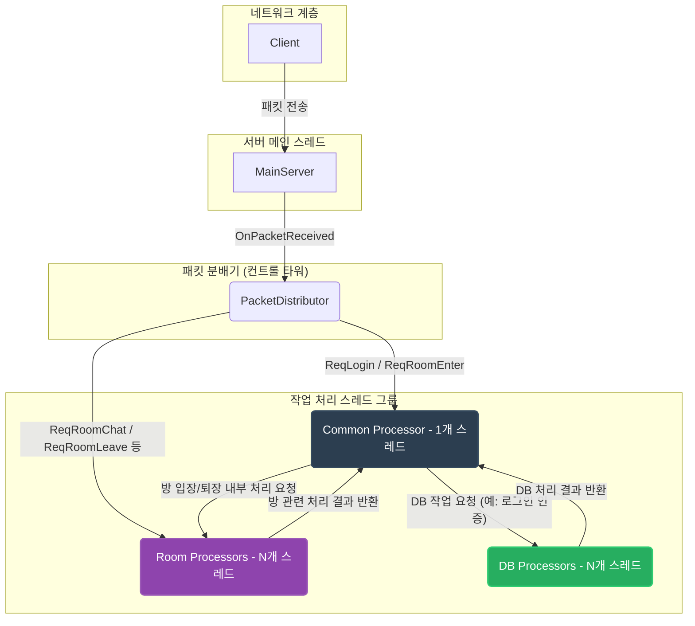
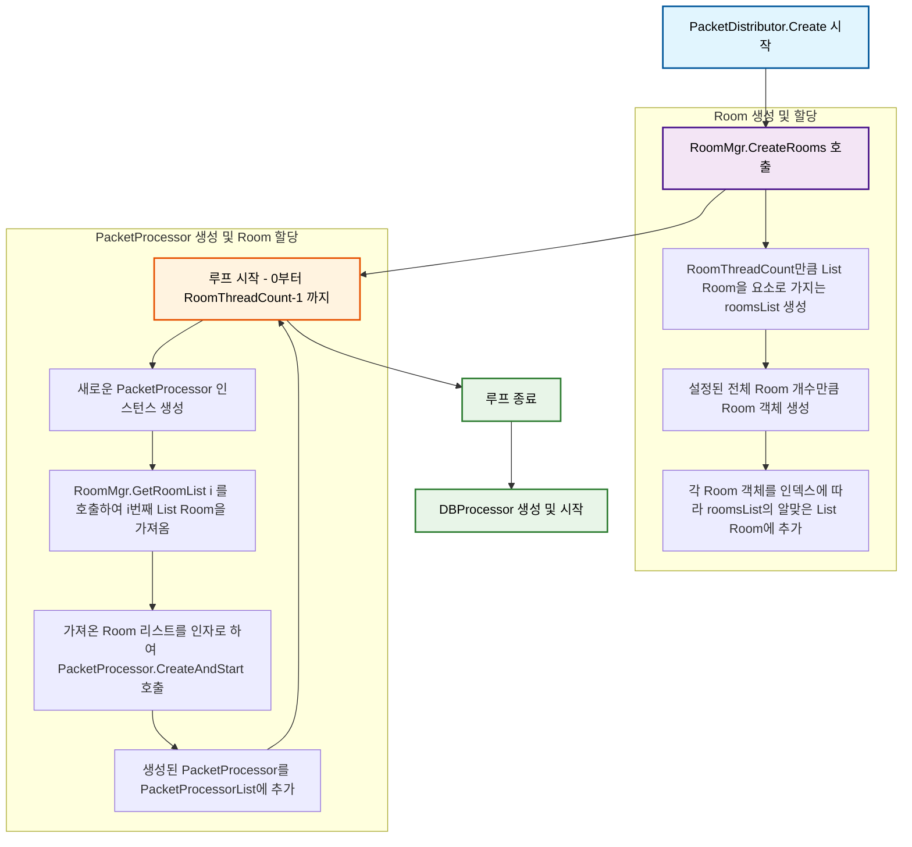
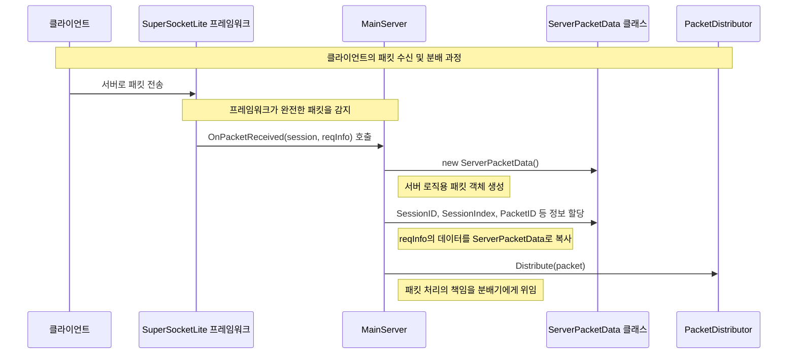
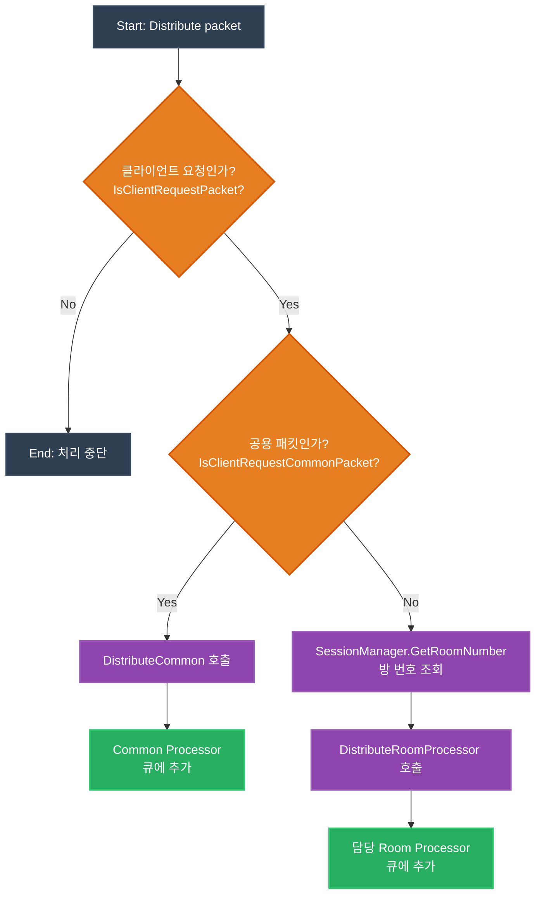
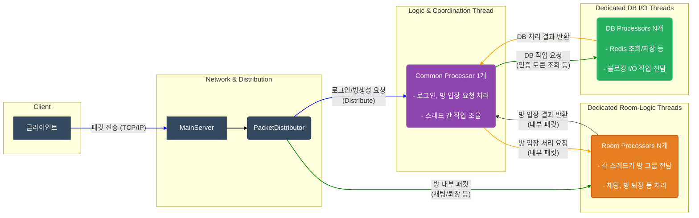
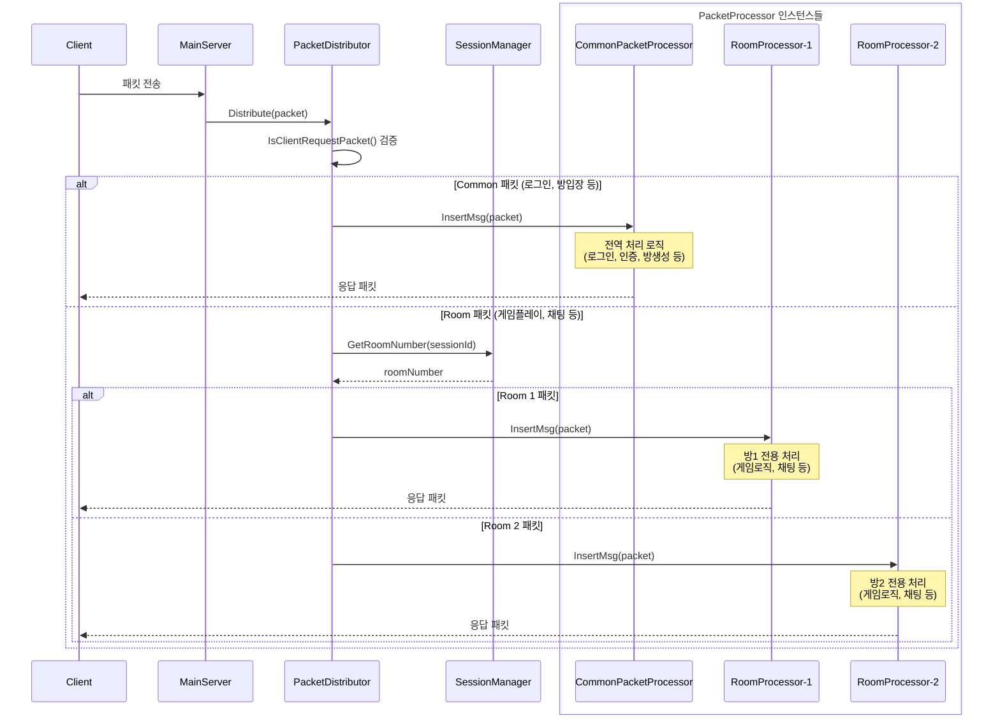
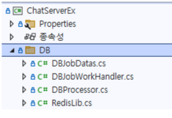
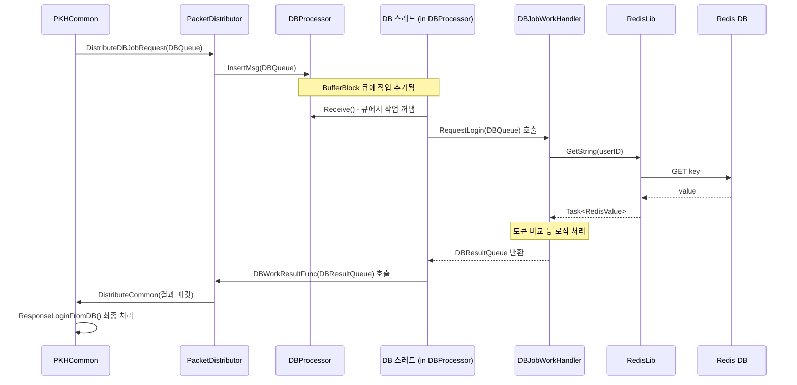
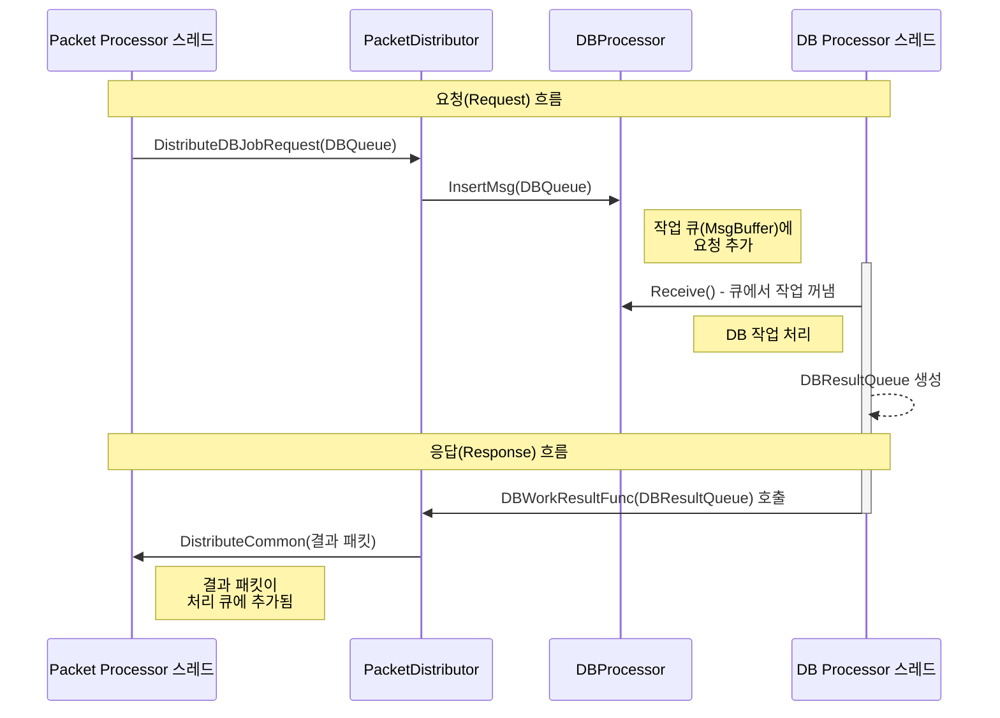
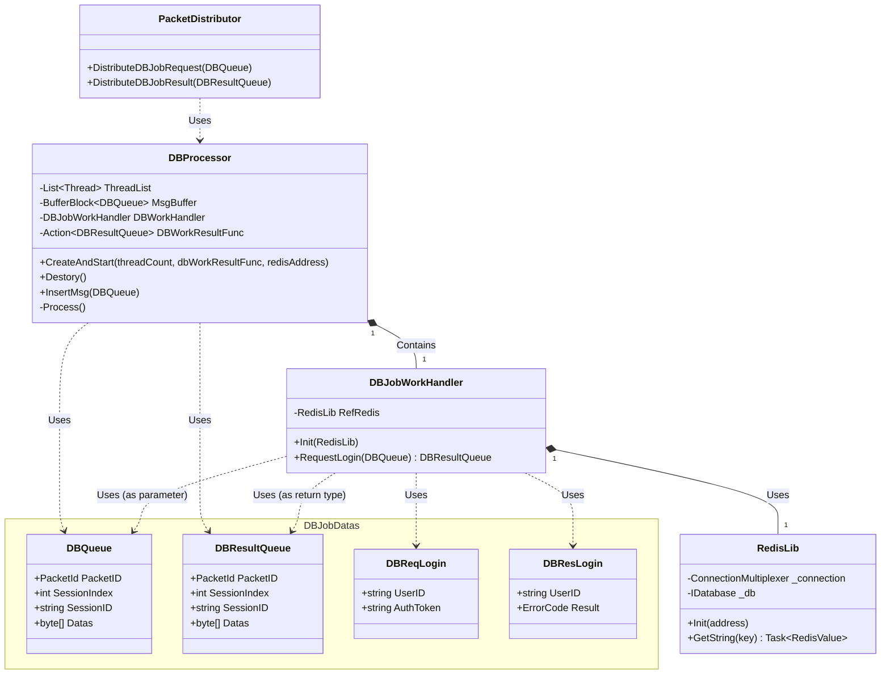

# SuperSocketLite를 이용한 C# 게임 서버 프로그래밍
    
저자: 최흥배, Gemini 2.5 Pro  
  
- .NET 8 이상, 
- C#
- Windows, Linux
- Visual Studio Code, Visual Studio 2022 이상  
--------
  
# Chapter.04 채팅 서버 2
채팅 서버와 거의 동일하지만 패킷 처리를 멀티스레드로 처리하는 부분이 다르다.  
또 데이터베이스 작업 처리도 하고 있다.  
  
코드는 아래에 있다.    
[SuperSocketLite Tutorials - ChatServerEx](https://github.com/jacking75/SuperSocketLite/tree/master/Tutorials/ChatServerEx ) 
    

## `ChatServer`와 `ChatServerEx`의 차이점
`ChatServerEx`는 `ChatServer`의 기본적인 기능 위에서 아키텍처를 대폭 개선하여 성능과 확장성을 크게 향상시킨 버전이다. 가장 핵심적인 차이점은 **멀티 스레딩 도입**, **데이터베이스 연동**, 그리고 **세션 상태 관리 방식의 고도화**에 있다.

### 1. 서버 아키텍처: 단일 스레드 vs 멀티 스레드
* **ChatServer (단일 스레드)**:
    * 하나의 `PacketProcessor` 클래스가 모든 패킷(로그인, 방 입장, 채팅 등)을 순차적으로 처리하는 구조다.
    * 모든 로직이 단일 스레드에서 동작하므로 구현은 단순하지만, 특정 작업이 오래 걸리면 서버 전체가 느려질 수 있고, 동시 접속자 수가 많아지면 성능 저하가 발생하기 쉽다.

* **ChatServerEx (멀티 스레드)**:
    * **`PacketDistributor`** 라는 새로운 클래스가 도입되어 컨트롤 타워 역할을 한다.
    * 패킷의 종류에 따라 처리를 분배하는 구조로 변경되었다.
        * **Common Processor (1개)**: 로그인, 방 입장 요청과 같은 공통적인 패킷을 처리하는 전용 스레드다.
        * **Room Processors (N개)**: 실제 방(Room) 내부에서 일어나는 채팅, 퇴장 등의 패킷을 처리하는 스레드 그룹이다. 방 번호에 따라 특정 스레드에 작업이 할당된다.
        * **DB Processors (N개)**: 데이터베이스 작업을 처리하는 별도의 스레드 그룹이다.
    * 이러한 멀티 스레드 구조 덕분에 각기 다른 종류의 작업을 병렬로 처리할 수 있어 서버의 전체적인 처리량과 응답성이 크게 향상되었다.
       

아래 다이어그램은 `PacketDistributor`가 어떻게 컨트롤 타워 역할을 수행하며, 패킷의 종류에 따라 각각의 전담 처리 스레드 그룹으로 작업을 분배하는지를 보여준다.



#### 다이어그램 상세 설명
1.  **패킷 수신**: 클라이언트(`Client`)가 보낸 모든 패킷은 가장 먼저 `MainServer`의 네트워크 계층을 통해 수신된다.

2.  **분배기 전달**: `MainServer`는 받은 패킷을 아무런 처리 없이 그대로 `PacketDistributor`에게 전달한다.

3.  **처리 분배 (컨트롤 타워 역할)**: `PacketDistributor`는 패킷의 ID를 확인하여 어떤 종류의 작업인지 판단하고, 가장 적합한 처리 스레드 그룹으로 작업을 분배한다.

      * **Common Processor (공통 처리)**: 로그인(`ReqLogin`)이나 방 입장(`ReqRoomEnter`)과 같이 여러 단계에 걸친 조정이 필요하거나, 특정 방에 종속되지 않는 공통적인 요청은 `Common Processor`에게 전달된다.
      * **Room Processors (방 전용 처리)**: 방에 이미 입장한 유저가 보내는 채팅(`ReqRoomChat`)이나 방 나가기(`ReqRoomLeave`) 요청처럼 특정 방 내부에서만 처리하면 되는 작업은, 해당 방을 담당하는 `Room Processor`에게 직접 전달된다.
      * **DB Processors (DB 전용 처리)**: `Common Processor`가 로그인 요청을 처리하다가 사용자 인증 정보가 필요해지면, 직접 DB에 접근하지 않고 `DB Processor`에게 "이 사용자 정보 좀 조회해줘" 와 같은 DB 작업을 요청한다. `DB Processor`는 이 작업만 처리하고 결과를 다시 `Common Processor`에게 돌려준다.

이처럼 각기 다른 역할을 하는 스레드들이 작업을 나눠서 병렬로 처리하기 때문에, `ChatServerEx`는 단일 스레드 구조인 `ChatServer`에 비해 훨씬 높은 성능과 안정성을 가질 수 있다. 
  

#### 스레드 별로 관리하는 Room 객체를 할당
PacketDistributor 클래스의 Create 함수   
```
public ErrorCode Create(MainServer mainServer)
{
    var roomThreadCount = MainServer.s_ServerOption.RoomThreadCount;
    
    Room.NetSendFunc = mainServer.SendData;

    SessionManager.CreateSession(ClientSession.s_MaxSessionCount);

    RoomMgr.CreateRooms();

    CommonPacketProcessor = new PacketProcessor();
    CommonPacketProcessor.CreateAndStart(true, null, mainServer, SessionManager);
                
    for (int i = 0; i < roomThreadCount; ++i)
    {
        var packetProcess = new PacketProcessor();
        packetProcess.CreateAndStart(false, RoomMgr.GetRoomList(i), mainServer, SessionManager);
        PacketProcessorList.Add(packetProcess);
    }

    DBWorker.MainLogger = MainServer.s_MainLogger;
    var error = DBWorker.CreateAndStart(MainServer.s_ServerOption.DBWorkerThreadCount, DistributeDBJobResult, MainServer.s_ServerOption.RedisAddres);
    if (error != ErrorCode.None)
    {
        return error;
    }

    return ErrorCode.None;
}
```  
   
다음은 `PacketDistributor` 클래스의 `Create` 함수에서 각 스레드가 관리하는 `Room` 객체를 할당하는 과정을 나타낸 mermaid 다이어그램입니다.



##### 다이어그램 설명
1.  **Room 생성 및 할당 (RoomManager.CreateRooms)**

      * `PacketDistributor`의 `Create` 함수가 호출되면 먼저 `RoomManager`의 `CreateRooms` 함수를 실행합니다.
      * 서버 옵션에 설정된 `RoomThreadCount` 개수만큼의 `List<Room>`을 생성하여 `_roomsList`에 추가합니다.
      * 마찬가지로 옵션에 따라 필요한 전체 `Room` 객체들을 생성합니다.
      * 생성된 각 `Room` 객체들은 순서에 따라 `_roomsList`에 있는 각각의 `List<Room>`에 분배되어 할당됩니다.

2.  **PacketProcessor 생성 및 Room 할당**

      * `RoomThreadCount` 만큼 반복하는 루프를 실행합니다.
      * 루프의 각 단계에서 새로운 `PacketProcessor` 객체를 생성합니다.
      * `RoomManager`에서 현재 루프 인덱스(i)에 해당하는 `List<Room>`을 가져옵니다.
      * 이 `List<Room>`을 인자로 하여 `PacketProcessor`의 `CreateAndStart` 함수를 호출함으로써, 해당 `PacketProcessor`가 특정 `Room`들의 처리를 담당하도록 합니다.
      * 마지막으로, 생성 및 설정이 완료된 `PacketProcessor`를 `PacketProcessorList`에 추가하여 관리합니다.   


### 2. 데이터베이스 연동: 없음 vs Redis 연동
* **ChatServer (DB 없음)**:
    * 모든 유저 정보는 서버 메모리(`UserManager`)에만 저장된다.
    * 서버가 종료되면 모든 유저 데이터가 사라지는 휘발성 구조다.

* **ChatServerEx (Redis 연동)**:
    * **로그인 시 Redis DB를 사용**하여 사용자 인증을 수행한다.
    * `DB`라는 별도의 디렉터리에 `DBProcessor`, `RedisLib` 등 DB 연동을 위한 전문적인 클래스들이 추가되었다.
    * 로그인 요청이 오면 메인 로직 스레드가 DB 스레드에게 작업을 요청하고, DB 스레드가 Redis에서 인증 토큰을 검증한 후 그 결과를 다시 메인 로직 스레드에 돌려주는 **비동기 방식**으로 동작한다.
    * 이를 통해 DB 조회와 같은 시간이 걸릴 수 있는 작업이 서버의 다른 로직 처리를 막지 않도록 하여 성능을 유지한다.

### 3. 세션 및 유저 관리 방식의 변화
* **ChatServer**:
    * `UserManager`가 유저의 모든 정보(ID, 세션, 속한 방 번호 등)를 관리한다.
    * 세션을 문자열 기반의 `SessionID`로 식별한다.

* **ChatServerEx**:
    * **세션 인덱스(`SessionIndex`) 도입**: 각 클라이언트 접속마다 고유한 정수 번호를 부여하여 관리한다. 이는 문자열보다 검색 및 관리가 훨씬 효율적이다.
    * **`ConnectSessionManager` 도입**: 클라이언트의 '상태'를 전문적으로 관리하는 클래스가 추가되었다.
    * **세션 상태 기계(State Machine)**: `ConnectSession` 클래스는 각 클라이언트가 현재 어떤 상태인지(`None`, `Logining`, `Login`, `RoomEntering`, `Room`) 명시적으로 관리한다. 이를 통해 멀티스레드 환경에서 발생할 수 있는 복잡한 동시성 문제를 보다 안정적으로 제어할 수 있다.
    * `UserManager`는 이제 순수한 유저 정보(ID, 세션 인덱스)만 관리하고, 유저가 어느 방에 있는지와 같은 '상태' 정보는 `ConnectSessionManager`가 담당하도록 역할이 분리되었다.

### 4. 패킷 처리 흐름의 변화
* **ChatServer**:
    * 클라이언트 요청 -> `MainServer` -> `PacketProcessor` -> `PKH...` 핸들러에서 모든 로직 처리 완료 (동기 방식)

* **ChatServerEx**:
    * **내부 패킷 시스템 도입**: 스레드 간의 통신을 위해 내부적으로만 사용되는 패킷(예: `ReqInRoomEnter`, `ResInRoomEnter`)이 추가되었다.
    * **방 입장 흐름 예시**:
        1.  클라이언트의 방 입장 요청(`ReqRoomEnter`)은 **Common Processor**가 먼저 받는다.
        2.  Common Processor는 유저의 상태를 '방 입장 중'(`RoomEntering`)으로 바꾸고, 실제 방 입장을 처리할 **Room Processor**에게 내부 패킷(`ReqInRoomEnter`)을 보낸다.
        3.  Room Processor는 내부 패킷을 받아 유저를 방에 추가한 후, 처리 결과를 다시 Common Processor에게 내부 패킷(`ResInRoomEnter`)으로 알려준다.
        4.  최종 결과를 받은 Common Processor가 유저의 상태를 '방에 있음'(`Room`)으로 확정하고 클라이언트에게 성공 응답을 보낸다.
    * 이처럼 여러 스레드가 역할을 분담하여 점진적으로 작업을 처리하는 방식으로 변경되었다.

  
`ChatServer`가 채팅 서버의 기본 개념을 학습하기 좋은 간단한 단일 스레드 예제라면, `ChatServerEx`는 실제 서비스 환경을 고려하여 **성능, 확장성, 안정성**을 모두 대폭 강화한 실전적인 아키텍처의 서버라고 할 수 있다. 핵심은 작업을 잘게 나누어 여러 스레드에 분산시키고, 오래 걸리는 작업은 비동기로 처리하여 서버가 멈추는 일이 없도록 설계했다는 점이다.
  

## 데이터를 받은 후 패킷 처리까지의 흐름

### `OnPacketReceived(ClientSession session, EFBinaryRequestInfo reqInfo)` 함수 설명
이 함수는 SuperSocketLite 프레임워크가 클라이언트로부터 **완전한 하나의 패킷**을 수신했을 때마다 자동으로 호출되는 매우 중요한 이벤트 핸들러다. 이 함수의 주된 역할은 네트워크 계층에서 받은 원시 데이터(`EFBinaryRequestInfo`)를 서버의 로직 계층에서 사용하기 쉬운 `ServerPacketData` 형식으로 변환하고, 이를 패킷 분배기(`PacketDistributor`)에게 전달하는 것이다.

```csharp
void OnPacketReceived(ClientSession session, EFBinaryRequestInfo reqInfo)
{
    // 1. 디버그 로그 기록
    s_MainLogger.Debug(string.Format("세션 번호 {0} 받은 데이터 크기: {1}, ThreadId: {2}", session.SessionID, reqInfo.Body.Length, System.Threading.Thread.CurrentThread.ManagedThreadId));

    // 2. ServerPacketData 객체 생성
    var packet = new ServerPacketData();
    packet.SessionID = session.SessionID;
    packet.SessionIndex = session.SessionIndex;
    packet.PacketSize = reqInfo.Size;            
    packet.PacketID = reqInfo.PacketID;
    packet.Type = reqInfo.Type;
    packet.BodyData = reqInfo.Body;
            
    // 3. 패킷 분배기에게 전달
    Distributor.Distribute(packet);
}
```

1.  **로그 기록**: 어떤 클라이언트(`session.SessionID`)로부터 얼마나 큰 데이터를 받았는지, 그리고 이 코드를 실행하는 스레드의 ID는 무엇인지 디버그용 로그를 남긴다.
2.  **데이터 변환**:
      * 새로운 `ServerPacketData` 객체를 생성한다.
      * SuperSocketLite가 전달해준 `session` 객체와 `reqInfo` 객체로부터 `SessionID`, `SessionIndex`, 패킷의 전체 크기, 패킷 ID, 타입, 그리고 실제 데이터(Body)를 `ServerPacketData` 객체의 각 필드에 복사하여 채워 넣는다.
3.  **패킷 분배**: 모든 정보가 담긴 `packet` 객체를 `Distributor.Distribute(packet)` 메서드를 호출하여 전달한다. 이 시점 이후의 모든 복잡한 처리 과정은 `PacketDistributor`가 담당하게 되며, `OnPacketReceived` 함수의 역할은 여기서 끝난다.

### 코드 흐름 Mermaid 다이어그램
`OnPacketReceived` 함수가 호출되고 패킷이 `PacketDistributor`로 전달되는 과정의 흐름은 다음과 같다.


  
### `Distribute(ServerPacketData requestPacket)` 함수 설명
`Distribute` 함수는 `PacketDistributor` 클래스의 가장 핵심적인 메서드로, `MainServer`로부터 전달받은 클라이언트의 모든 요청 패킷을 **어떤 스레드(Processor)에서 처리할지 결정하고 전달하는 중앙 관제 센터(Control Tower)의 역할**을 수행한다.

```csharp
public void Distribute(ServerPacketData requestPacket)
{
    var packetId = (PacketId)requestPacket.PacketID;
    var sessionIndex = requestPacket.SessionIndex;
                
    // 1. 서버 내부용 패킷인지, 클라이언트 요청 패킷인지 검사
    if(IsClientRequestPacket(packetId) == false)
    {
        MainServer.s_MainLogger.Debug("[Distribute] - 클라리언트의 요청 패킷이 아니다.");
        return; 
    }

    // 2. 공용(Common) 패킷인지 확인
    if(IsClientRequestCommonPacket(packetId))
    {
        DistributeCommon(true, requestPacket); // 3. Common Processor로 전달
        return;
    }

    // 4. Room 패킷 처리
    var roomNumber = SessionManager.GetRoomNumber(sessionIndex);
    if(DistributeRoomProcessor(true, false, roomNumber, requestPacket) == false) // 5. Room Processor로 전달
    {
        return;
    }            
}
```

1.  **클라이언트 요청 검사**: `IsClientRequestPacket` 함수를 통해, 이 패킷이 서버 내부에서 생성된 패킷이 아닌 순수 클라이언트의 요청 패킷이 맞는지 확인한다. 아니라면, 잘못된 요청으로 간주하고 처리를 중단한다.
2.  **공용 패킷 여부 확인**: `IsClientRequestCommonPacket` 함수를 통해 패킷이 로그인(`ReqLogin`)이나 방 입장(`ReqRoomEnter`)처럼 특정 방에 소속되지 않은 '공통' 기능 요청인지 확인한다.
3.  **공용 패킷 처리**: 만약 공통 패킷이 맞다면, `DistributeCommon` 함수를 호출하여 `CommonPacketProcessor`의 처리 큐에 패킷을 넣는다.
4.  **방 관련 패킷 처리**: 공통 패킷이 아니라면, 해당 유저가 속한 방에서 처리해야 할 패킷(예: 채팅)으로 간주한다. `SessionManager`를 통해 요청을 보낸 클라이언트의 `sessionIndex`로 현재 어느 방(`roomNumber`)에 있는지 조회한다.
5.  **방 전담 처리**: `DistributeRoomProcessor` 함수를 호출한다. 이 함수는 `roomNumber`를 보고, 여러 `Room Processor` 스레드 중 해당 방을 담당하는 스레드를 찾아 그 스레드의 처리 큐에 패킷을 넣는 역할을 수행한다.

결론적으로 이 함수는 패킷의 종류를 빠르고 정확하게 식별하여, 그에 맞는 전문 처리 스레드에게 작업을 효율적으로 분배하는 역할을 담당한다.

### 코드 흐름 Mermaid 다이어그램
`Distribute` 함수의 내부 로직 흐름을 나타내는 다이어그램은 다음과 같다.  
   

      
### 주요 처리 단계
1. OnPacketReceived
* 세션과 요청 정보를 받아서 ServerPacketData 생성
  
2. Distributor.Distribute
* 클라이언트 요청 패킷인지 검증  
* 공통 패킷인지 룸 패킷인지 구분
  
3. 패킷 분배
* 공통 패킷: CommonPacketProcessor로 전달. 방에 있는 클라이언트에서 요청한 것이 아닌 것들. 예) 로그인  
* 룸 패킷: 해당 방의 PacketProcessor로 전달. 방에 있는 클라이언트에서 요청한 것. 예) 방 채팅
  
4. PacketProcessor 처리
* BufferBlock에 패킷 저장  
* 별도 스레드에서 패킷 처리  
* 등록된 패킷 핸들러 맵에서 해당 처리기 실행  
* 이 구조를 통해 패킷은 체계적으로 분류되고 적절한 처리기에 의해 비동기적으로 처리됩니다.
  
  
## ChatServerEx 멀티스레드 구조

### ChatServerEx 멀티스레드 구조 설명
`ChatServerEx`의 핵심은 **역할 기반의 철저한 작업 분리**다. 단일 스레드가 모든 것을 처리하던 `ChatServer`와 달리, `ChatServerEx`는 성격이 다른 작업들을 별도의 전담 스레드 그룹에 할당하여 병렬로 처리함으로써 서버의 전체 처리량과 안정성을 극대화하는 구조를 가진다. 이 모든 스레드의 작업을 지휘하는 컨트롤 타워가 바로 **`PacketDistributor`** 클래스다.

#### 1. 스레드의 종류와 역할
`ChatServerEx`는 크게 3가지 종류의 작업 처리 스레드(Processor) 그룹을 사용한다.

  * **Common Processor (공용 처리 스레드 - 1개)**

      * **역할**: 클라이언트의 초기 요청을 처리하고, 여러 스레드에 걸친 작업의 흐름을 조율하는 **매니저** 역할을 한다.
      * **담당 작업**: 로그인 요청(`ReqLogin`), 방 입장 요청(`ReqRoomEnter`)과 같이 특정 방에 아직 소속되지 않은 상태의 공통 패킷을 전담한다.
      * **동작 방식**: 로그인 시 DB 인증이 필요하면 **DB Processor**에게 작업을 요청하고, 방 입장 시에는 실제 입장을 처리할 **Room Processor**에게 내부 패킷을 전달하는 등, 다른 스레드 그룹과의 통신을 시작하는 출발점 역할을 한다. `PacketProcessor` 클래스를 `IsCommon=true`로 하여 생성한다.

  * **Room Processors (방 전용 처리 스레드 - N개)**

      * **역할**: 실제 방 내부에서 발생하는 모든 상호작용을 처리하는 **실무자** 역할을 한다.
      * **담당 작업**: 방 채팅(`ReqRoomChat`), 방 나가기(`ReqRoomLeave`) 등 이미 방에 입장한 유저들의 패킷을 처리한다.
      * **동작 방식**: 서버 옵션에 따라 여러 개의 스레드가 생성되며, 각 스레드는 전체 방의 일부를 나누어 담당한다. 예를 들어 100개의 방과 4개의 Room Processor 스레드가 있다면, 각 스레드가 25개씩의 방을 전담하는 식이다. 이를 통해 특정 방의 채팅 트래픽이 많아져도 다른 방에 영향을 주지 않고 독립적으로 처리할 수 있다.

  * **DB Processors (데이터베이스 처리 스레드 - N개)**

      * **역할**: Redis와 같이 외부 데이터베이스와 통신하는 느린 I/O 작업을 전담하는 **외부 전문가** 역할을 한다.
      * **담당 작업**: 사용자 로그인 시 인증 토큰을 Redis에서 조회하는 등의 DB 관련 작업을 모두 처리한다.
      * **동작 방식**: `DBProcessor`는 `Common Processor` 등 다른 스레드로부터 DB 작업 요청(`DBQueue`)을 받으면, 이를 큐에 넣고 순차적으로 처리한다. 처리가 완료되면 그 결과를 다시 요청했던 스레드(주로 Common Processor)에게 돌려준다. 이를 통해 DB 조회로 인한 대기 시간이 게임 로직을 처리하는 다른 중요한 스레드들을 지연시키는 것을 완벽하게 방지한다.

#### 2. 스레드 간의 통신
스레드 간의 통신은 **스레드 안전 큐(`BufferBlock`)** 를 통해 이루어진다.

  * `PacketDistributor`는 패킷을 받으면 해당 패킷을 처리할 스레드(Common 또는 Room Processor)의 `BufferBlock` 큐에 `ServerPacketData`를 넣어준다 (`Post` 또는 `InsertMsg` 호출).
  * `Common Processor`는 DB 작업이 필요할 때, `DBProcessor`의 `BufferBlock` 큐에 `DBQueue` 객체를 넣어준다.
  * 각 Processor 스레드는 자신의 `while` 루프 안에서 큐에 데이터가 들어오기를 기다리다가(`Receive`), 데이터가 들어오면 이를 꺼내 처리하는 생산자-소비자 패턴으로 동작한다.

### 멀티스레드 구조 Mermaid 다이어그램
`ChatServerEx`의 전체적인 멀티스레드 구조와 패킷 처리 흐름을 나타낸 다이어그램이다.


  

## PacketDistributor, PacketProcessor

PacketDistributor.cs
```
public class PacketDistributor
{
    ConnectSessionManager SessionManager = new ConnectSessionManager();
    
    PacketProcessor CommonPacketProcessor = null;
    List<PacketProcessor> PacketProcessorList = new List<PacketProcessor>();

    DBProcessor DBWorker = new DBProcessor();

    RoomManager RoomMgr = new RoomManager();
}
```  

### 클래스 간의 관계 설명
이 세 클래스의 관계를 한마디로 정의하면 **'총괄 지휘관과 전문 실무팀'** 의 관계라고 할 수 있다.

  * **`PacketProcessor` (실무팀의 '역할 정의서' 또는 '템플릿')**:

      * 이 클래스는 독립된 스레드에서 패킷을 처리하는 **'방법'** 을 정의한 일반적인(Generic) 클래스다.
      * 이 클래스 자체는 '공용' 패킷을 처리할지, '방' 패킷을 처리할지 결정하지 않는다. 단지 `BufferBlock` 큐에서 패킷을 꺼내 `_packetHandlerMap`에 등록된 함수를 실행하는 표준화된 작업 절차만을 가지고 있다.

  * **`CommonPacketProcessor` (공용 업무 전담팀)**:

      * `CommonPacketProcessor`는 별개의 클래스 파일이 아니라, `PacketDistributor` 내에서 `PacketProcessor` 클래스를 **`IsCommon = true`** 로 설정하여 생성한 **'인스턴스(객체)'** 다.
      * 이 인스턴스는 `PKHCommon` 핸들러를 사용하여 로그인, 방 입장 요청과 같은 서버의 공통적인 작업을 처리하도록 특화되어 있다. 즉, `PacketProcessor`라는 템플릿으로 '공용 업무팀'을 하나 만든 것이다.

  * **`PacketDistributor` (총괄 지휘관)**:

      * 이 클래스는 서버의 모든 패킷 처리 흐름을 총괄하는 **'지휘관'** 이다.
      * `PacketDistributor`는 자신의 멤버 변수로 `CommonPacketProcessor` 인스턴스 **한 개**와, `PacketProcessorList`라는 이름으로 `Room Processor` 인스턴스 **여러 개**를 생성하고 소유한다.
      * 외부(`MainServer`)로부터 패킷을 받으면, 패킷의 종류를 분석하여 이 요청을 처리할 가장 적합한 팀, 즉 `CommonPacketProcessor`에게 보낼지 아니면 여러 `Room Processor` 중 하나에게 보낼지를 결정하고 작업을 할당(`InsertMsg`)하는 역할을 수행한다.

**결론적으로, `PacketDistributor`가 지휘관으로서 `PacketProcessor`라는 동일한 설계도(클래스)로 만들어진 `CommonPacketProcessor`팀과 여러 개의 `Room Processor`팀에게 적절한 임무(패킷)를 분배하는 구조라고 할 수 있다.**

### 코드 흐름 Mermaid 다이어그램
`PacketDistributor`가 패킷을 받아 `CommonPacketProcessor` 또는 `Room Processor` 인스턴스에게 작업을 전달하는 전체 흐름을 다이어그램으로 나타내면 다음과 같다.



1.  **패킷 수신**: `MainServer`가 클라이언트로부터 패킷을 받으면, 가장 먼저 `PacketDistributor`의 `Distribute` 함수를 호출한다.
2.  **작업 분석 및 분배**: `Distributor`는 수신된 패킷의 ID를 확인한다.
3.  **공용 작업 처리**: 만약 패킷이 `ReqLogin`이나 `ReqRoomEnter`와 같이 공통적인 작업이라면, `Distributor`는 자신이 관리하는 `CommonPacketProcessor` 인스턴스의 `InsertMsg` 함수를 호출하여 패킷을 전달한다.
4.  **방 전용 작업 처리**: 만약 패킷이 그 외의 방 관련 작업이라면, `Distributor`는 해당 유저가 속한 방 번호를 찾아, 그 방을 담당하는 `Room Processor` 인스턴스의 `InsertMsg` 함수를 호출하여 패킷을 전달한다.
5.  **비동기 처리**: `InsertMsg` 함수는 단순히 패킷을 해당 Processor의 처리 큐에 넣고 즉시 반환되므로, `Distributor`는 다음 요청을 받기 위해 지체 없이 대기할 수 있다. 실제 패킷 처리는 각 Processor의 별도 스레드에서 비동기적으로 이루어진다.
  
    
### PacketDistributor 클래스 개요
`PacketDistributor` 클래스는 `ChatServerEx` 아키텍처의 가장 핵심적인 **중앙 관제 센터(Control Tower)이자 총괄 지휘관**이다. `MainServer`가 클라이언트로부터 패킷을 수신하면, 이 클래스는 해당 패킷의 종류를 분석하여 **Common Processor, Room Processor, DB Processor** 등 어떤 전문 처리 스레드 그룹에게 작업을 분배할지 결정하고 전달하는 역할을 전담한다. 이를 통해 복잡한 멀티스레드 환경의 작업 흐름을 일관되게 관리하고 제어한다.

### 멤버 변수
  * `ConnectSessionManager SessionManager`: 클라이언트 세션의 상태(로그인 여부, 속한 방 번호 등)를 관리하는 객체다.
  * `PacketProcessor CommonPacketProcessor`: 공통 기능(로그인, 방 입장 요청 등)을 처리하는 단일 스레드 프로세서 객체다.
  * `List<PacketProcessor> PacketProcessorList`: 방 관련 기능(채팅 등)을 처리하는 다중 스레드 프로세서 객체들의 리스트다.
  * `DBProcessor DBWorker`: 데이터베이스 관련 작업을 처리하는 프로세서 객체다.
  * `RoomManager RoomMgr`: 모든 방을 생성하고 관리하는 객체다.

-----

### 멤버 함수 및 코드 설명

#### `Create(MainServer mainServer)`

서버 시작 시 호출되어, 서버 운영에 필요한 모든 핵심 컴포넌트(각종 Processor, Manager 등)를 생성하고 시작하는 함수다.

```csharp
public ErrorCode Create(MainServer mainServer)
{
    // ...
    SessionManager.CreateSession(ClientSession.s_MaxSessionCount); // 1. 세션 관리자 생성

    RoomMgr.CreateRooms(); // 2. 모든 방 생성

    // 3. 공통 패킷 처리기 생성 및 시작
    CommonPacketProcessor = new PacketProcessor();
    CommonPacketProcessor.CreateAndStart(true, null, mainServer, SessionManager);
                
    // 4. 방 패킷 처리기들 생성 및 시작
    for (int i = 0; i < roomThreadCount; ++i)
    {
        var packetProcess = new PacketProcessor();
        packetProcess.CreateAndStart(false, RoomMgr.GetRoomList(i), mainServer, SessionManager);
        PacketProcessorList.Add(packetProcess);
    }

    // 5. DB 작업 처리기 생성 및 시작
    DBWorker.CreateAndStart(...);
    // ...
}
```

1.  클라이언트의 최대 연결 수만큼 `ConnectSession`을 관리할 `SessionManager`를 생성한다.
2.  `RoomManager`를 통해 설정에 명시된 모든 방을 미리 생성한다.
3.  공통 패킷을 처리할 `CommonPacketProcessor` 인스턴스를 하나 생성하고, `CreateAndStart(true, ...)`를 호출하여 전용 스레드를 시작시킨다.
4.  설정에 명시된 `roomThreadCount` 만큼 `for` 루프를 돌면서, 각각의 방 그룹을 전담할 `PacketProcessor` 인스턴스(Room Processor)들을 생성하고 스레드를 시작시킨다.
5.  Redis와 통신하며 DB 작업을 처리할 `DBWorker`를 생성하고 관련 스레드들을 시작시킨다.

#### `Destory()`
서버를 종료할 때 모든 스레드를 안전하게 중지시키는 함수다.

```csharp
public void Destory()
{
    DBWorker.Destory();
    CommonPacketProcessor.Destory();
    PacketProcessorList.ForEach(preocess => preocess.Destory());
    // ...
}
```

  * `DBWorker`, `CommonPacketProcessor`, 그리고 `PacketProcessorList`에 있는 모든 Room Processor들의 `Destory()` 메서드를 순차적으로 호출하여, 각 스레드가 정상적으로 종료되도록 한다.
  

#### `Distribute(ServerPacketData requestPacket)`
`MainServer`로부터 패킷을 받아 어떤 프로세서에게 전달할지 결정하는 가장 핵심적인 라우팅 함수다.

```csharp
public void Distribute(ServerPacketData requestPacket)
{
    var packetId = (PacketId)requestPacket.PacketID;
    // ...
    if(IsClientRequestPacket(packetId) == false) { return; } // 1. 클라이언트 요청인지 확인

    if(IsClientRequestCommonPacket(packetId)) // 2. 공용 패킷인지 확인
    {
        DistributeCommon(true, requestPacket); // 3. Common Processor로 전달
        return;
    }

    // 4. Room Processor로 전달
    var roomNumber = SessionManager.GetRoomNumber(sessionIndex);
    DistributeRoomProcessor(true, false, roomNumber, requestPacket);
    //...
}
```

1.  `IsClientRequestPacket` 함수를 통해 클라이언트가 보낸 유효한 요청인지 먼저 확인한다.
2.  `IsClientRequestCommonPacket` 함수로 로그인(`ReqLogin`)이나 방 입장(`ReqRoomEnter`) 같은 공용 패킷인지 확인한다.
3.  공용 패킷이 맞다면 `DistributeCommon` 함수를 호출하여 `CommonPacketProcessor`에게 작업을 넘긴다.
4.  공용 패킷이 아니라면 방 내부 패킷(채팅 등)으로 간주하고, `SessionManager`에서 유저의 방 번호를 조회한 뒤 `DistributeRoomProcessor`를 호출하여 해당 방을 담당하는 `Room Processor`에게 작업을 넘긴다.

#### `DistributeCommon(bool isClientPacket, ServerPacketData requestPacket)`
패킷을 `CommonPacketProcessor`의 처리 큐에 넣는 함수다.

```csharp
public void DistributeCommon(bool isClientPacket, ServerPacketData requestPacket)
{
    CommonPacketProcessor.InsertMsg(isClientPacket, requestPacket);
}
```

  * `CommonPacketProcessor`의 `InsertMsg` 메서드를 호출하여, 해당 프로세서의 `BufferBlock` 큐에 패킷을 추가한다.

#### `DistributeRoomProcessor(bool isClientPacket, bool isPreRoomEnter, int roomNumber, ServerPacketData requestPacket)`
패킷을 담당 `Room Processor`의 처리 큐에 넣는 함수다.

```csharp
public bool DistributeRoomProcessor(...)
{
    var processor = PacketProcessorList.Find(x => x.관리중인_Room(roomNumber)); // 1. 담당 프로세서 검색
    if (processor != null)
    {
        // ...
        processor.InsertMsg(isClientPacket, requestPacket); // 2. 큐에 추가
        return true;
    }
    //...
}
```

1.  `PacketProcessorList`에서 `관리중인_Room(roomNumber)` 조건을 만족하는, 즉 인자로 받은 `roomNumber`를 담당하고 있는 `PacketProcessor` 인스턴스를 찾는다.
2.  담당 프로세서를 찾았다면, `InsertMsg`를 호출하여 해당 프로세서의 큐에 패킷을 추가한다.

#### `DistributeDBJobRequest(DBQueue dbQueue)` 및 `DistributeDBJobResult(DBResultQueue resultData)`
DB 작업 요청과 결과 처리를 중계하는 함수들이다.

```csharp
public void DistributeDBJobRequest(DBQueue dbQueue)
{
    DBWorker.InsertMsg(dbQueue);
}

public void DistributeDBJobResult(DBResultQueue resultData)
{
    // ...
    DistributeCommon(false, requestPacket);            
}
```

  * `DistributeDBJobRequest`: `PKHCommon` 같은 핸들러가 DB 작업이 필요할 때 호출하며, 이 함수는 작업을 `DBWorker`의 큐에 넣는다.
  * `DistributeDBJobResult`: `DBWorker`가 작업을 마친 후 결과를 반환하기 위해 이 함수를 호출한다. 함수는 DB 결과를 다시 `ServerPacketData`로 변환하여, 이 결과를 기다리고 있던 `CommonPacketProcessor`에게 전달하여 후속 처리를 하도록 한다.

  

### PacketProcessor 클래스 개요
`PacketProcessor` 클래스는 `ChatServerEx` 프로젝트에서 **독립된 스레드에서 패킷을 처리하는 표준화된 실행 단위(Worker)** 역할을 하는 매우 중요한 범용 클래스다. 이 클래스 하나가 '공용 처리기'가 되기도 하고 '방 전용 처리기'가 되기도 하는 **재사용 가능한 템플릿**으로 설계되었다.

주요 역할은 `BufferBlock`이라는 스레드 안전 큐를 통해 외부로부터 처리할 패킷을 전달받고, 자신의 전용 스레드에서 이 패킷들을 하나씩 꺼내어 미리 등록된 처리 함수(`PacketHandler`)를 실행하는 것이다. 이를 통해 시간이 걸리는 작업이 다른 부분에 영향을 주지 않도록 격리시키는 역할을 수행한다.

### 멤버 변수
  * `_공용_프로세서`: 이 `PacketProcessor` 인스턴스가 공용(Common) 작업을 처리할지, 방(Room) 관련 작업을 처리할지를 구분하는 플래그다.
  * `_isThreadRunning`, `_processThread`: 패킷 처리 루프를 실행하는 스레드의 실행 상태와 실제 스레드 객체다.
  * `_packetBuffer`: 외부로부터 전달된 `ServerPacketData`를 임시로 저장하는 스레드 안전 큐다.
  * `_roomNumberRange`, `_roomList`: 이 프로세서가 '방 전용 처리기'일 경우, 자신이 담당하는 방의 번호 범위와 방 객체 리스트를 저장한다.
  * `_packetHandlerMap`: 패킷 ID를 키(Key)로, 해당 패킷을 처리할 함수를 값(Value)으로 가지는 딕셔너리다.
  * `_commonPacketHandler`, `_roomPacketHandler`: 실제 패킷 처리 로직이 담긴 핸들러 클래스 객체다.

-----

### 멤버 함수 및 코드 설명

#### `CreateAndStart(bool IsCommon, List<Room> roomList, MainServer mainServer, ConnectSessionManager sessionMgr)`
`PacketProcessor` 인스턴스를 생성하고, 전용 스레드를 시작하여 패킷을 처리할 준비를 마치는 초기화 함수다.

```csharp
public void CreateAndStart(bool IsCommon, List<Room> roomList, MainServer mainServer, ConnectSessionManager sessionMgr)
{
    _공용_프로세서 = IsCommon; // 1. 프로세서 종류 설정

    if (IsCommon == false) // 2. 방 전용 프로세서일 경우
    {
        _roomList = roomList;
        // 담당할 방 번호 범위를 설정
        var minRoomNum = _roomList[0].Number;
        var maxRoomNum = _roomList[0].Number + _roomList.Count() - 1;
        _roomNumberRange = new Tuple<int, int>(minRoomNum, maxRoomNum);
    }

    RegistPacketHandler(mainServer, sessionMgr); // 3. 패킷 핸들러 등록

    // 4. 스레드 생성 및 시작
    _isThreadRunning = true;
    _processThread = new System.Threading.Thread(this.Process);
    _processThread.Start();
}
```

1.  `IsCommon` 플래그를 통해 이 인스턴스가 '공용 처리기'인지 '방 전용 처리기'인지 역할을 정의한다.
2.  만약 '방 전용 처리기'라면(`IsCommon == false`), 자신이 담당할 `roomList`를 받아오고, `PacketDistributor`가 자신을 쉽게 찾을 수 있도록 담당할 방 번호의 최소/최대 범위를 `_roomNumberRange`에 저장한다.
3.  `RegistPacketHandler`를 호출하여 역할에 맞는 패킷 처리 함수들을 `_packetHandlerMap`에 등록한다.
4.  패킷 처리 루프인 `Process` 함수를 실행할 새로운 스레드를 생성하고 시작시킨다.

#### `Destory()`
서버 종료 시, 실행 중인 스레드를 안전하게 중지시키는 함수다.

```csharp
public void Destory()
{
    _isThreadRunning = false;
    _packetBuffer.Complete();
}
```

  * `_isThreadRunning` 플래그를 `false`로 바꿔 `Process` 함수의 `while` 루프가 종료되도록 신호를 보낸다.
  * `_packetBuffer.Complete()`를 호출하여 더 이상 큐에 데이터가 들어오지 않을 것임을 알리고, 큐가 비어있다면 `Receive()`에서 즉시 예외를 발생시켜 스레드가 깔끔하게 종료되도록 유도한다.

#### `관리중인_Room(int roomNumber)`
`PacketDistributor`가 특정 방을 담당하는 `PacketProcessor`를 찾기 위해 호출하는 함수다.

```csharp
public bool 관리중인_Room(int roomNumber)
{
    return roomNumber >= _roomNumberRange.Item1 && roomNumber <= _roomNumberRange.Item2;
}
```

  * 인자로 받은 `roomNumber`가 자신이 관리하는 방 번호 범위(`_roomNumberRange`) 내에 있는지 확인하여 `true` 또는 `false`를 반환한다.

#### `InsertMsg(bool isClientRequest, ServerPacketData data)`
외부(주로 `PacketDistributor`)에서 처리할 패킷을 이 프로세서의 큐에 넣기 위해 호출하는 함수다.

```csharp
public void InsertMsg(bool isClientRequest, ServerPacketData data)
{
    // ...
    _packetBuffer.Post(data);
}
```

  * 전달받은 `ServerPacketData`를 `_packetBuffer.Post(data)`를 통해 자신의 처리 큐에 추가한다. 이 작업은 매우 빠르기 때문에, 호출한 쪽(Distributor)은 지연 없이 다음 작업을 수행할 수 있다.

#### `RegistPacketHandler(MainServer serverNetwork, ConnectSessionManager sessionManager)`
프로세서의 역할에 맞는 패킷 처리 함수들을 `_packetHandlerMap`에 등록하는 함수다.

```csharp
void RegistPacketHandler(MainServer serverNetwork, ConnectSessionManager sessionManager)
{
    if (_공용_프로세서) // 1. 공용 프로세서일 경우
    {
        _commonPacketHandler.Init(serverNetwork, sessionManager);
        // ...
        _commonPacketHandler.RegistPacketHandler(_packetHandlerMap);                
    }
    else // 2. 방 전용 프로세서일 경우
    {
        _roomPacketHandler.Init(serverNetwork, sessionManager);
        _roomPacketHandler.Init(_roomList);
        _roomPacketHandler.RegistPacketHandler(_packetHandlerMap);
    }          
}
```

1.  `_공용_프로세서` 플래그가 `true`이면, `PKHCommon` 핸들러를 초기화하고, `PKHCommon`이 처리하는 로그인, 방 입장 요청 관련 함수들을 `_packetHandlerMap`에 등록한다.
2.  플래그가 `false`이면, `PKHRoom` 핸들러를 초기화하고, `PKHRoom`이 처리하는 채팅, 방 퇴장 관련 함수들을 `_packetHandlerMap`에 등록한다.

#### `Process()`
별도의 스레드에서 무한 루프를 돌며 실제 패킷 처리를 수행하는 가장 핵심적인 함수다.

```csharp
void Process()
{
    while (_isThreadRunning) // 1. 스레드 실행 플래그 확인
    {
        try
        {
            var packet = _packetBuffer.Receive(); // 2. 큐에서 패킷 꺼내기

            if (_packetHandlerMap.ContainsKey(packet.PacketID)) // 3. 핸들러 조회
            {
                _packetHandlerMap[packet.PacketID](packet); // 4. 핸들러 실행
            }
            // ...
        }
        catch (Exception ex) // 5. 예외 처리
        {
            // ...
        }
    }
}
```

1.  `_isThreadRunning` 플래그가 `true`인 동안 계속해서 루프를 돈다.
2.  `_packetBuffer.Receive()`를 호출하여 큐에서 패킷을 하나 꺼낸다. 만약 큐가 비어있으면 데이터가 들어올 때까지 여기서 대기한다(블로킹).
3.  꺼낸 패킷의 `PacketID`를 사용하여 `_packetHandlerMap`에서 이 패킷을 처리할 함수가 등록되어 있는지 확인한다.
4.  등록된 함수가 있다면, 해당 함수를 호출하여 실제 패킷 처리 로직을 실행한다.
5.  패킷 처리 중 어떤 예외가 발생하더라도 `try-catch`로 잡아내어 로그를 남기고 루프를 계속 실행함으로써, 스레드가 갑자기 죽는 것을 방지하고 서버의 안정성을 유지한다.
  
  

## 모든 클라이언트 세션의 상태 관리

### ConnectSessionManager 클래스의 역할과 목적
`ConnectSessionManager` 클래스는 `ChatServerEx` 서버에 접속한 **모든 클라이언트 세션의 '상태(State)'를 중앙에서 관리하고 통제**하기 위해 설계된 매우 중요한 클래스다.

`ChatServer`에서는 `UserManager`가 유저의 정보와 상태(방 번호 등)를 모두 관리했지만, 멀티스레드 환경인 `ChatServerEx`에서는 이런 방식이 동시성 문제를 일으킬 수 있다. 따라서 `ConnectSessionManager`는 **유저의 상태 관리 기능**을 전문적으로 분리하여 다음과 같은 목적을 달성한다.

1.  **상태 기계(State Machine) 관리**: 각 클라이언트가 현재 어떤 상태인지(예: 연결만 된 상태, 로그인 중, 로그인 완료, 방 입장 중, 방에 있는 상태)를 명확하게 추적하고 관리한다. 이는 특정 상태에서만 허용되는 요청(예: 로그인 상태여야만 방 입장 가능)을 안전하게 처리하기 위함이다.

2.  **스레드 안전성 확보**: 세션의 상태를 변경하는 작업을 이 클래스를 통해서만 하도록 강제하여, 여러 스레드가 동시에 한 유저의 상태를 변경하려 할 때 발생할 수 있는 데이터 충돌 문제를 방지한다. `ConnectSession` 내부에서는 `Interlocked`를 사용하여 원자적(atomic)으로 상태를 변경함으로써 스레드 안전성을 보장한다.

3.  **역할 분리**: `UserManager`는 순수한 유저의 고유 정보(ID 등)만 관리하고, `ConnectSessionManager`는 시시각각 변하는 '상태' 정보만 관리하도록 역할을 명확히 분리하여 코드의 구조를 더 깔끔하고 이해하기 쉽게 만든다.

결론적으로, `ConnectSessionManager`는 복잡한 멀티스레드 환경에서 수많은 클라이언트들의 상태를 일관되고 안전하게 관리하기 위한 **전문 상태 관리자**라고 할 수 있다.

-----

### 멤버 함수 및 코드 설명

#### `CreateSession(int maxCount)`
서버가 허용하는 최대 클라이언트 수만큼 미리 `ConnectSession` 객체를 생성하여 리스트에 담아두는 초기화 함수다.

```csharp
public void CreateSession(int maxCount)
{
    for (int i = 0; i < maxCount; ++i)
    {
        _sessionList.Add(new ConnectSession());
    }
    //...
}
```

  * `for` 루프를 돌면서 서버의 최대 연결 수(`maxCount`)만큼 `new ConnectSession()`을 호출하여, 비어있는 `ConnectSession` 객체들을 `_sessionList`에 미리 만들어 채워 넣는다. 이는 서버 실행 중에 새로운 객체를 할당하는 부담을 줄이기 위한 최적화 기법이다.

#### `SetClear(int index)`
접속이 끊긴 세션의 상태 정보를 초기화하여, 해당 세션 인덱스를 새로운 클라이언트가 재사용할 수 있도록 깨끗하게 만드는 함수다.

```csharp
public void SetClear(int index)
{
    var session = GetSession(index);
    session.Clear();
}
```

  * `GetSession(index)`를 통해 해당 인덱스의 `ConnectSession` 객체를 찾은 뒤, 그 객체의 `Clear()` 메서드를 호출한다. `Clear()` 메서드는 상태를 `None`으로, 방 번호를 `-1`로 되돌린다.

#### `SetDisable(int index)`
특정 세션을 비활성화 상태로 만드는 함수다. 예를 들어 서버가 꽉 찼을 때 더 이상 요청을 받지 않도록 할 때 사용된다.

```csharp
public void SetDisable(int index)
{
    var session = GetSession(index);
    session.SetDisable();
}
```

  * 대상 세션 객체의 `SetDisable()`을 호출하여 `IsEnable` 플래그를 `false`로 설정한다.

#### `GetRoomNumber(int index)`
특정 세션이 현재 어느 방에 들어가 있는지 방 번호를 조회하는 함수다.

```csharp
public int GetRoomNumber(int index)
{
    var session = GetSession(index);
    return session.GetRoomNumber();
}
```

  * 세션 객체의 `GetRoomNumber()`를 호출하여 현재 방 번호를 반환받는다.

#### `EnableReuqestLogin(int index)` 및 `EnableReuqestEnterRoom(int index)`
각각 로그인과 방 입장을 요청할 수 있는 '올바른 상태'인지 확인하는 함수다.

```csharp
public bool EnableReuqestLogin(int index)
{
    var session = GetSession(index);
    return session.IsStateNone(); // 아무것도 안 한 상태여야 로그인 가능
}

public bool EnableReuqestEnterRoom(int index)
{
    var session = GetSession(index);
    return session.IsStateLogin(); // 로그인 완료 상태여야 방 입장 가능
}
```

  * `EnableReuqestLogin`은 세션의 상태가 `None`(초기 접속 상태)일 때만 `true`를 반환한다.
  * `EnableReuqestEnterRoom`은 세션의 상태가 `Login`(로그인 완료 상태)일 때만 `true`를 반환한다.

#### `SetPreLogin(int index)` 및 `SetPreRoomEnter(int index, int roomNumber)`
각각 로그인과 방 입장을 '시도하는 중'이라는 중간 상태로 변경하는 함수다. 이는 작업이 완료되기 전에 다른 요청이 끼어드는 것을 막는다.

```csharp
public void SetPreLogin(int index)
{
    var session = GetSession(index);
    session.SetStatePreLogin(); // 상태를 'Logining'으로 변경
}

public bool SetPreRoomEnter(int index, int roomNumber)
{
    var session = GetSession(index);
    return session.SetPreRoomEnter(roomNumber); // 상태를 'RoomEntering'으로 변경
}
```

  * `SetPreLogin`은 상태를 `Logining`으로 설정한다.
  * `SetPreRoomEnter`는 `Login` 상태에서 `RoomEntering` 상태로 안전하게 변경하고, 입장하려는 방 번호를 임시로 저장한다.

#### `SetLogin(int index, string userID)` 및 `SetRoomEntered(int index, int roomNumber)`
로그인과 방 입장이 '완전히 성공'했을 때, 최종 상태로 확정하는 함수다.

```csharp
public void SetLogin(int index, string userID)
{
    var session = GetSession(index);
    session.SetStateLogin(userID); // 'Login' 상태로 확정하고 유저 ID 저장
}

public bool SetRoomEntered(int index, int roomNumber)
{
    var session = GetSession(index);
    return session.SetRoomEntered(roomNumber); // 'Room' 상태로 확정하고 방 번호 저장
}
```

  * `SetLogin`은 DB 인증까지 마친 후 호출되며, 상태를 `Login`으로 확정하고 유저 ID를 세션에 기록한다.
  * `SetRoomEntered`는 `Room Processor`가 방에 유저를 성공적으로 추가한 뒤 호출되며, 상태를 `Room`으로 확정한다.
  

## 클라이언트의 연결 상태 조사

### `RemoteConnectCheck` & `RemoteCheckState` 클래스의 역할과 목적
이 두 클래스는 `ChatServerEx` 서버가 다른 원격 서버(예: 다른 채팅 서버, 인증 서버 등)와 **지속적인 연결을 유지**하기 위한 목적으로 설계되었다. 분산 환경에서 여러 서버가 서로 통신해야 할 때, 네트워크 문제 등으로 연결이 끊어지는 경우가 발생할 수 있다. 이 클래스들은 바로 그럴 때 **연결이 끊어졌음을 감지하고 자동으로 재접속을 시도**하는, 안정적인 서버 간 통신을 위한 필수적인 기능을 수행한다.

  * **`RemoteConnectCheck` (재연결 관리자)**:

      * **역할**: 여러 원격 서버들의 연결 상태를 주기적으로 감시하고, 연결이 끊어진 서버에 재접속을 시도하도록 지시하는 **총괄 관리자** 역할을 한다.
      * **목적**: 별도의 스레드를 사용하여 주기적으로 모든 원격 서버의 연결 상태를 체크함으로써, 메인 서버 로직에 영향을 주지 않으면서 안정적인 서버 간 연결을 보장하는 것이 목적이다.

  * **`RemoteCheckState` (개별 연결 상태 저장소)**:

      * **역할**: `RemoteConnectCheck`가 관리하는 **각각의 원격 서버 하나하나의 상태**를 저장하고 관리하는 '상태 객체'다.
      * **목적**: 각 원격 서버의 주소, 현재 연결 세션, 마지막 재시도 시간 등의 정보를 개별적으로 관리하여, `RemoteConnectCheck`가 여러 서버를 효율적으로 동시에 관리할 수 있도록 돕는 것이 목적이다.

-----

### `RemoteConnectCheck` 클래스의 멤버 함수 설명

#### `Init(MainServer appServer, List<Tuple<string, string, int>> remoteInfoList)`
`RemoteConnectCheck`를 초기화하고 재연결 감시 스레드를 시작하는 함수다.

```csharp
public void Init(MainServer appServer, List<Tuple<string, string, int>> remoteInfoList)
{
    _appServer = appServer;

    foreach (var remoteInfo in remoteInfoList) // 1. 원격 서버 목록 순회
    {
        // ... IP 주소 파싱 ...
        var remote = new RemoteCheckState(); // 2. RemoteCheckState 객체 생성
        remote.Init(remoteInfo.Item1, serverAddress);
        _remoteList.Add(remote); // 3. 관리 목록에 추가
    }

    _isCheckRunning = true; // 4. 스레드 실행 플래그 설정
    _checkThread = new System.Threading.Thread(this.CheckAndConnect);
    _checkThread.Start(); // 5. 감시 스레드 시작
}
```

1.  인자로 받은 `remoteInfoList`(연결할 서버들의 정보 목록)를 순회한다.
2.  각 서버 정보마다 `RemoteCheckState` 객체를 새로 생성하고, 해당 서버의 타입과 주소 정보로 초기화한다.
3.  생성된 `RemoteCheckState` 객체를 내부 관리 목록인 `_remoteList`에 추가한다.
4.  스레드를 실행할 수 있도록 `_isCheckRunning` 플래그를 `true`로 설정한다.
5.  `CheckAndConnect` 함수를 실행할 새로운 스레드를 생성하고 시작하여, 주기적인 연결 상태 감시를 개시한다.

#### `Stop()`
감시 스레드를 안전하게 종료하는 함수다.

```csharp
public void Stop()
{
    _isCheckRunning = false;
    _checkThread.Join();
}
```

  * `_isCheckRunning` 플래그를 `false`로 만들어 `CheckAndConnect`의 `while` 루프가 멈추도록 하고, `_checkThread.Join()`을 호출하여 스레드가 완전히 종료될 때까지 기다린다.

#### `CheckAndConnect()`
별도의 스레드에서 주기적으로 실행되며 실제 연결 상태를 확인하고 재접속을 시도하는 핵심 함수다.

```csharp
void CheckAndConnect()
{
    while (_isCheckRunning)
    {
        System.Threading.Thread.Sleep(100); // 1. 잠시 대기

        foreach (var remote in _remoteList) // 2. 모든 원격 서버 순회
        {
            if(remote.IsPass()) // 3. 연결 상태 확인
            {
                continue; // 4. 정상이면 통과
            }
            else
            {
                remote.TryConnect(_appServer); // 5. 비정상이면 재접속 시도
            }
        }
    }
}
```

1.  루프를 한번 돌 때마다 100밀리초 동안 대기하여 CPU 사용량을 조절한다.
2.  관리 중인 모든 `RemoteCheckState` 객체들을 순회한다.
3.  `remote.IsPass()`를 호출하여 해당 서버의 연결이 정상인지, 또는 방금 재시도를 해서 기다려야 하는 상태인지 확인한다.
4.  연결이 정상이면 `continue`를 통해 다음 서버로 넘어간다.
5.  연결에 문제가 있다고 판단되면 `remote.TryConnect()`를 호출하여 해당 서버에 대한 재접속을 시도한다.

-----

### `RemoteCheckState` 클래스의 멤버 함수 설명

#### `Init(string serverType, System.Net.IPEndPoint endPoint)`
`RemoteCheckState` 객체를 특정 서버의 정보로 초기화하는 함수다.

```csharp
public void Init(string serverType, System.Net.IPEndPoint endPoint)
{
    _serverType = serverType;
    _address = endPoint;
}
```

  * 인자로 받은 서버의 종류(`serverType`)와 접속 주소(`endPoint`)를 내부 변수에 저장한다.

#### `IsPass()`
현재 이 서버에 대한 재연결 시도를 건너뛰어도 되는지('통과'해도 되는지)를 판단하는 함수다.

```csharp
public bool IsPass()
{
    // 1. 이미 연결되어 있거나, 연결 시도 중이면 통과
    if ((_session != null && _session.Connected) || _isTryConnecting)
    {
        return true;
    }

    // 2. 마지막 시도 후 3초가 지나지 않았으면 통과
    var diffTime = DateTime.Now.Subtract(_checkedTime);
    if (diffTime.Seconds <= 3)
    {
        return true;
    }
    else
    {
        _checkedTime = DateTime.Now; // 3초가 지났으면, 현재 시간으로 갱신
    }

    return false; // 재시도 필요
}
```

1.  현재 세션이 이미 연결(`_session.Connected`)되어 있거나, `TryConnect` 함수가 실행 중(`_isTryConnecting`)이라면 굳이 재시도할 필요가 없으므로 `true`를 반환한다.
2.  마지막으로 재시도를 했던 시간(`_checkedTime`)으로부터 3초가 지나지 않았다면, 너무 잦은 재시도를 막기 위해 `true`를 반환하여 이번 턴은 건너뛴다.
3.  위 조건에 모두 해당하지 않으면, 재시도가 필요하므로 `false`를 반환한다.

#### `TryConnect(MainServer appServer)`
실제로 SuperSocketLite의 기능을 사용하여 원격 서버에 비동기적으로 접속을 시도하는 함수다.

```csharp
public async void TryConnect(MainServer appServer)
{
    _isTryConnecting = true; // 1. '연결 시도 중' 플래그 설정
    var activeConnector = appServer as SuperSocketLite.SocketBase.IActiveConnector;

    try
    {
        // 2. 비동기 연결 시도
        var task = await activeConnector.ActiveConnect(_address);

        if (task.Result) // 3. 연결 성공 시
        {
            _session = task.Session; // 4. 세션 저장
        }
    }
    catch { }
    finally
    {
        _isTryConnecting = false; // 5. '연결 시도 중' 플래그 해제
    }
}
```

1.  다른 스레드가 중복으로 연결을 시도하지 못하도록 `_isTryConnecting` 플래그를 `true`로 설정한다.
2.  `appServer`의 `ActiveConnect` 기능을 사용하여 `_address`에 비동기적으로 접속을 시도하고, 결과가 올 때까지 `await`로 기다린다.
3.  비동기 작업의 결과(`task.Result`)가 `true`이면 연결에 성공한 것이다.
4.  성공적으로 연결된 세션 객체(`task.Session`)를 내부 변수 `_session`에 저장하여 연결 상태를 유지한다.
5.  연결이 성공하든 실패하든, `finally` 블록에서 `_isTryConnecting` 플래그를 다시 `false`로 해제하여 다음 재시도가 가능하도록 한다.
  


## 데이터베이스 프로그래밍
ChatServerEx 에서는 Redis만을 데이터베이스로 다루고 있다.
  
아래 글들을 통해서 Redis와 MySQL 프로그래밍을 학습하기 바란다.

### Redis 프로그래밍
* [Redis의 기본 데이터 유형 및 명령](https://docs.google.com/document/d/10mHFq-kTpGBk1-id5Z-zoseiLnTKr_T8N3byBZP5mEg/edit?usp=sharing)  
* [(영상) Redis 야무지게 사용하기](https://forward.nhn.com/2021/sessions/16)  
* [Redis 기능 학습하기](http://redisgate.kr/redis/introduction/redis_intro.php)  
* C# Redis 프로그래밍 학습  
    * [CloudStructures - Redis 라이브러리 - jacking75](https://jacking75.github.io/NET_lib_CloudStructures/)  
    * [CloudStructures를 이용한 C\# Redis 프로그래밍](https://gist.github.com/jacking75/5f91f8cf975e0bf778508acdf79499c0)  
  

### MySQL 프로그래밍
* [MySqlConnector 간단 정리](https://gist.github.com/jacking75/51a1c96f4efa1b7a27030a7410f39bc6)  
* [프로그래밍 라이브러리는 SalKata 소개](https://docs.google.com/document/d/e/2PACX-1vTnRYJOXyOagNhTdhpkI_xOQX4DlMu0TRcC9Ehew6wraufgEtBuQiSdGpKzaEmRb-jfsLv43i0nBQsp/pub)  
    * [예제 프로그램: github\_sqlkata\_demo.zip](https://drive.google.com/file/d/1FBpB1zQ84LqGOA9WAJ6vk5S3453ekqDc/view?usp=sharing)  
* [코드에서 DB 트랜잭션 하기](https://github.com/jacking75/edu_Learn_ASPNetCore_APIServer/blob/main/how_to_db_transaction.md)
  
데이터베이스 관련 처리는 IO 처리 중의 하나이므로 메인 스레드 혹은 패킷 처리 스레드에서 DB 작업 처리를 하면 안된다. 그래서 별도의 DB 작업용 스레드를 만들고, 이 스레드를 사용하여 비동기로 DB 작업을 처리해야 한다.  
  
ChatServerEx 에서 DB 작업 처리와 관련된 코드는 아래 것들이다.  
    
  

### 클래스별 역할과 목적
아래 4개의 클래스는 **서버의 메인 로직과 데이터베이스 작업을 완벽하게 분리**하여, DB 조회와 같은 느린 작업이 서버 전체의 성능을 저하하는 것을 막기 위한 목적으로 설계되었다.

  * **`RedisLib.cs` (Redis 통신 전문가)**: 실제 Redis 데이터베이스와 직접 통신하는 가장 낮은 수준의 역할을 담당하는 유틸리티 클래스다. `StackExchange.Redis` 라이브러리를 감싸서, 연결을 관리하고 문자열을 가져오는 등의 간단한 인터페이스를 제공한다.

  * **`DBJobDatas.cs` (데이터 운송 수단)**: 스레드 간에 DB 작업 요청 및 결과 데이터를 주고받을 때 사용하는 데이터 구조체(DTO, Data Transfer Object)를 정의하는 파일이다.

      * `DBQueue`: `Common Processor`가 `DB Processor`에게 "이 작업을 해달라"고 요청할 때 보내는 데이터 객체다.
      * `DBResultQueue`: `DB Processor`가 작업을 마친 후, "결과는 이렇다"고 응답할 때 보내는 데이터 객체다.
      * `DBReqLogin`, `DBResLogin`: 로그인 요청/응답에 특화된 데이터 구조체다.

  * **`DBJobWorkHandler.cs` (실제 DB 작업자)**: `RedisLib`를 사용하여 실제 DB 로직을 수행하는 클래스다. 예를 들어 "로그인 요청이 들어오면, Redis에서 해당 유저의 토큰을 조회해서 일치하는지 확인한다"와 같은 비즈니스 로직이 이 클래스의 메서드에 구현되어 있다.

  * **`DBProcessor.cs` (DB 작업 관리자 및 스레드 엔진)**: DB 작업을 처리할 **별도의 스레드들을 생성하고 관리**하는 가장 중요한 클래스다. 외부로부터 DB 작업 요청(`DBQueue`)을 받아 자신의 처리 큐에 넣고, 관리하는 스레드들이 이 큐에서 작업을 꺼내 `DBJobWorkHandler`의 메서드를 호출하여 실행하도록 지시한다. 작업이 완료되면 그 결과를 다시 외부(PacketDistributor)로 전달하는 역할도 수행한다.

### 연관 관계 및 전체 동작 흐름
1.  **요청 시작 (`PKHCommon`)**: 클라이언트의 로그인 요청을 받은 `PKHCommon` 핸들러가 `DBReqLogin` 데이터 객체를 생성한다.
2.  **작업 큐 생성**: `PKHCommon`은 이 데이터를 담아 `DBQueue` 객체를 만들고, `PacketDistributor`를 통해 `DBProcessor`에게 전달한다.
3.  **작업 접수 (`DBProcessor`)**: `DBProcessor`는 `InsertMsg` 함수를 통해 `DBQueue`를 받아 내부의 `BufferBlock` 큐에 추가한다.
4.  **작업 처리 (DB 스레드)**: `DBProcessor`가 관리하는 별도의 스레드가 자신의 `Process` 루프 안에서 큐에 들어온 `DBQueue`를 꺼낸다.
5.  **실제 로직 실행 (`DBJobWorkHandler`)**: DB 스레드는 `DBQueue`의 `PacketID`를 보고 `DBWorkHandlerMap`에서 적절한 처리 함수(예: `DBJobWorkHandler.RequestLogin`)를 찾아 실행한다.
6.  **Redis 통신 (`RedisLib`)**: `DBJobWorkHandler.RequestLogin` 함수는 `RedisLib`를 사용하여 실제 Redis에 "해당 유저 ID의 토큰 값을 달라"고 요청한다.
7.  **결과 생성**: `DBJobWorkHandler`는 Redis로부터 받은 결과와 요청을 비교하여, 로그인 성공/실패 여부를 `DBResLogin` 객체에 담고, 이를 포함한 `DBResultQueue` 객체를 최종적으로 반환한다.
8.  **결과 반환 (`DBProcessor`)**: DB 스레드는 `DBJobWorkHandler`로부터 받은 `DBResultQueue`를 `DBWorkResultFunc` (실체는 `PacketDistributor.DistributeDBJobResult`)를 통해 다시 `PacketDistributor`에게 보낸다.
9.  **최종 처리**: `PacketDistributor`는 이 결과를 다시 `Common Processor`에게 전달하고, `PKHCommon`의 `ResponseLoginFromDB` 함수가 호출되어 클라이언트에게 최종 응답을 보내는 것으로 모든 과정이 마무리된다.

-----

### 각 클래스 멤버 함수 상세 설명

#### `RedisLib.cs`

  * `Init(string address)`: 인자로 받은 주소로 Redis 서버에 접속하고, 통신에 사용할 `IDatabase` 객체를 얻는다.
  * `GetString(string key)`: 특정 키에 해당하는 문자열 값을 비동기적으로 가져오는 작업을 요청한다.

#### `DBJobWorkHandler.cs`

  * `Init(RedisLib redis)`: `DBProcessor`로부터 `RedisLib` 객체를 받아 저장하고, 더미 데이터를 요청하여 미리 Redis와의 연결을 활성화시킨다.
  * `RequestLogin(DBQueue dbQueue)`: 이 클래스의 핵심 로직이다.
    1.  `dbQueue.Datas`를 `DBReqLogin`으로 역직렬화하여 유저 ID와 토큰을 얻는다.
    2.  `RefRedis.GetString`을 호출하여 Redis에서 해당 유저 ID의 저장된 토큰 값을 조회한다.
    3.  조회 결과가 없거나, 클라이언트가 보낸 토큰과 일치하지 않으면 각각에 맞는 에러 코드를 담아 `RequestLoginValue`를 호출한다.
    4.  토큰이 일치하면 `ErrorCode.None`을 담아 `RequestLoginValue`를 호출한다.
  * `RequestLoginValue(...)`: `RequestLogin`의 처리 결과를 `DBResLogin` 객체에 담고, 이를 포함한 최종 `DBResultQueue` 객체를 생성하여 반환하는 헬퍼 함수다.

#### `DBProcessor.cs`

  * `CreateAndStart(...)`:
    1.  `RedisLib`와 `DBJobWorkHandler`를 생성 및 초기화하고, `RegistPacketHandler`를 통해 처리할 DB 작업의 종류(예: `ReqDbLogin`)와 실제 처리 함수(`DBJobWorkHandler.RequestLogin`)를 `DBWorkHandlerMap`에 등록한다.
    2.  인자로 받은 `threadCount`만큼 `Process` 함수를 실행할 스레드를 생성하고 시작시킨다.
  * `Destory()`: 실행 중인 모든 DB 스레드를 안전하게 종료시킨다.
  * `InsertMsg(DBQueue dbQueue)`: 외부(주로 `PacketDistributor`)로부터 받은 DB 작업 요청을 `MsgBuffer` 큐에 추가한다.
  * `Process()`: DB 스레드에서 무한 루프를 돌며 실제 작업을 처리한다.
    1.  `MsgBuffer.Receive()`를 통해 큐에서 작업(`dbJob`)을 꺼낸다.
    2.  `DBWorkHandlerMap`에서 `dbJob.PacketID`에 맞는 처리 함수를 찾아 실행한다.
    3.  처리 함수가 반환한 결과(`DBResultQueue`)를 `DBWorkResultFunc` 콜백 함수를 호출하여 외부로 전달한다.

### 연관 관계 동작 흐름 Mermaid 다이어그램



 
### 스레드 생성 및 관리
`DBProcessor`는 데이터베이스 관련 작업을 전담하여 처리하기 위해 **독립적인 스레드 풀(Thread Pool)을 직접 생성하고 관리**하는 역할을 한다. 이를 통해 DB 조회와 같이 시간이 오래 걸릴 수 있는 작업이 서버의 주요 로직(채팅 처리 등)을 지연시키는 것을 원천적으로 차단한다.

#### 1. 스레드 생성 (`CreateAndStart` 함수)
`DBProcessor`의 스레드 생성은 `CreateAndStart` 함수 내에서 이루어진다.

```csharp
public ErrorCode CreateAndStart(int threadCount, Action<DBResultQueue> dbWorkResultFunc, string redisAddress)
{
    // ... 초기화 작업 ...

    IsThreadRunning = true; // 1. 스레드 실행 플래그 활성화

    for (int i = 0; i < threadCount; ++i) // 2. 설정된 개수만큼 반복
    {
        // 3. Process 함수를 실행할 스레드 생성
        var processThread = new System.Threading.Thread(this.Process);
        processThread.Start(); // 4. 스레드 시작

        ThreadList.Add(processThread); // 5. 관리 목록에 추가
    }

    // ...
    return ErrorCode.None;
}
```

1.  `IsThreadRunning` 플래그를 `true`로 설정하여, 각 스레드의 메인 루프(`Process` 함수)가 실행될 수 있도록 준비한다.
2.  서버 옵션으로 받은 `threadCount` 만큼 `for` 루프를 실행한다.
3.  `new System.Threading.Thread(this.Process)` 코드를 통해, 모든 스레드가 동일한 `Process` 함수를 실행하도록 새로운 스레드 객체를 생성한다.
4.  `processThread.Start()`를 호출하여 스레드를 즉시 실행시킨다. 이 시점부터 스레드는 `Process` 함수 내부의 `while` 루프를 돌며 작업이 들어오기를 기다린다.
5.  생성된 스레드 객체를 `ThreadList`에 추가하여 서버가 종료될 때 관리할 수 있도록 한다.

#### 2. 스레드 관리 및 종료 (`Process` 및 `Destory` 함수)
생성된 스레드들은 `Process` 함수 안에서 `IsThreadRunning` 플래그를 확인하며 계속 실행된다.

```csharp
void Process()
{
    while (IsThreadRunning) // 실행 플래그가 true인 동안 계속 실행
    {
        // ... 작업 처리 로직 ...
    }
}

public void Destory()
{
    IsThreadRunning = false; // 루프 종료 신호
    MsgBuffer.Complete(); // 큐를 닫아 대기 상태의 스레드를 즉시 깨움
}
```

  * **관리**: 스레드들은 `Process` 함수의 `while (IsThreadRunning)` 루프 안에서 계속 실행되며, `MsgBuffer.Receive()`를 통해 작업 큐에 요청이 들어올 때까지 대기(Blocked) 상태에 머무른다. 이를 통해 작업을 기다리는 동안 CPU 자원을 거의 사용하지 않는다.
  * **종료**: 서버 종료 시 `Destory` 함수가 호출되면, `IsThreadRunning`을 `false`로 변경하여 `while` 루프가 다음 반복에서 멈추도록 한다. 또한, `MsgBuffer.Complete()`를 호출하여 `Receive()`에서 대기 중인 스레드에 예외를 발생시켜 즉시 루프를 빠져나오게 함으로써 스레드를 안전하고 신속하게 종료시킨다.


### 패킷 처리 스레드와의 통신
`DBProcessor`와 다른 패킷 처리 스레드(주로 `CommonPacketProcessor`)와의 통신은 **스레드에 안전한 큐(`BufferBlock`)** 와 **콜백 함수(delegate)** 를 통해 이루어진다.

1.  **요청 (Request): Packet Processor -> DB Processor**

      * 패킷 처리 스레드(예: `PKHCommon`)에서 DB 작업이 필요하면, `DBQueue` 객체에 작업 내용(패킷 ID, 데이터 등)을 담는다.
      * `PacketDistributor`를 통해 `DBProcessor.InsertMsg(dbQueue)` 함수가 호출된다.
      * `InsertMsg` 함수는 전달받은 `dbQueue` 객체를 `MsgBuffer.Post()`를 사용해 `DBProcessor`의 작업 큐에 **넣는다(Push)**. 이 과정은 비동기적으로, 요청 스레드는 결과를 기다리지 않고 즉시 자신의 다음 작업을 수행한다.

2.  **응답 (Response): DB Processor -> Packet Processor**

      * `DBProcessor`의 스레드가 큐에서 작업을 꺼내 처리하고 나면, 그 결과(`DBResultQueue`)를 얻게 된다.
      * `Process` 함수는 `CreateAndStart` 시점에 미리 등록해 둔 콜백 함수인 `DBWorkResultFunc(result)`를 호출한다.
      * 이 `DBWorkResultFunc`의 실체는 `PacketDistributor.DistributeDBJobResult` 함수다.
      * `DistributeDBJobResult` 함수는 전달받은 `DBResultQueue`를 다시 `ServerPacketData`로 변환하여, 결과를 기다리던 원래의 패킷 처리 스레드(`CommonPacketProcessor`)의 큐에 **다시 넣어준다(Push)**.

이러한 요청-응답 통신 흐름을 아래 Mermaid 다이어그램으로 시각화할 수 있다.


  
  
### DBJobWorkHandler 클래스의 역할과 목적
`DBJobWorkHandler` 클래스는 `DBProcessor`에 의해 관리되는 DB 작업 스레드가 **"실제로 어떤 DB 작업을 수행할 것인가"** 에 대한 구체적인 **비즈니스 로직**을 담고 있는 **핵심 작업자(Worker)** 클래스다.

`DBProcessor`가 스레드를 생성하고 작업을 분배하는 '관리자'라면, `DBJobWorkHandler`는 그 지시를 받아 실제 데이터베이스(Redis)에 접근하여 데이터를 조회하고, 비교하고, 결과를 만들어내는 '실무자'의 역할을 수행한다.

주요 목적은 다음과 같다:
1.  **DB 로직의 중앙화**: 로그인 인증, 유저 데이터 저장, 아이템 정보 조회 등 모든 종류의 데이터베이스 관련 실제 로직을 이 클래스 한 곳에 모아 관리의 편의성을 높인다.
2.  **역할의 분리**: `DBProcessor`는 스레드 관리와 큐잉(Queuing)에만 집중하고, `DBJobWorkHandler`는 순수한 DB 데이터 처리에만 집중하도록 역할을 명확하게 분리하여 코드의 구조를 단순화하고 유지보수를 용이하게 만든다.
3.  **데이터베이스 통신 실행**: `RedisLib`와 같은 저수준 DB 라이브러리를 직접 사용하여, 상위 계층(예: `PKHCommon`)에서 전달된 요청을 실제 DB 쿼리로 변환하고 실행하는 책임을 진다.

결론적으로, `DBJobWorkHandler`는 DB 작업의 '무엇을(What)'과 '어떻게(How)'를 정의하는 클래스라고 할 수 있다.

-----

### 멤버 함수 및 코드 설명

#### `Init(RedisLib redis)`
`DBProcessor`가 생성될 때 호출되며, `DBJobWorkHandler`가 작업에 필요한 `RedisLib` 객체를 받아오고 DB 연결을 준비하는 초기화 함수다.

```csharp
public Tuple<ErrorCode,string> Init(RedisLib redis)
{
    try
    {
        RefRedis = redis; // 1. RedisLib 객체 참조 저장

        // 2. Redis 연결 활성화 (Warm-up)
        RefRedis.GetString("test");

        return new Tuple<ErrorCode, string>(ErrorCode.None, "");
    }
    catch(Exception ex)
    {
        return new Tuple<ErrorCode, string>(ErrorCode.RedisInitFail, ex.ToString());
    }
}
```

1.  `DBProcessor`로부터 전달받은 `RedisLib` 객체의 참조를 내부 변수 `RefRedis`에 저장하여, 다른 함수에서 Redis에 접근할 수 있도록 한다.
2.  `RefRedis.GetString("test")`를 호출하여 Redis에 더미(dummy) 데이터를 요청한다. 이 작업의 주된 목적은 프로그램 시작 시점에 실제로 Redis와 통신하여 연결을 미리 활성화(Warm-up) 시키고, 연결에 문제가 있다면 빠르게 감지하기 위함이다.

#### `RequestLogin(DBQueue dbQueue)`
DB 스레드로부터 로그인 요청 작업을 받아 실제 인증 로직을 수행하는 가장 핵심적인 함수다.

```csharp
public DBResultQueue RequestLogin(DBQueue dbQueue)
{
    // ...
    try
    {
        // 1. 요청 데이터 역직렬화
        var reqData = MessagePackSerializer.Deserialize<DBReqLogin>(dbQueue.Datas);
        userID = reqData.UserID;

        // 2. Redis에서 유저의 인증 토큰 조회
        var redis = RefRedis.GetString(reqData.UserID);
        var value = redis.Result;

        // 3. 유저 존재 여부 확인
        if (value.IsNullOrEmpty)
        {
            return RequestLoginValue(ErrorCode.DbLoginEmptyUser, ...);
        }
                                        
        // 4. 인증 토큰 비교
        if( reqData.AuthToken != value)
        {
            return RequestLoginValue(ErrorCode.DbLoginInvalidPassword, ...);
        }
        else
        {
            // 5. 로그인 성공 처리
            return RequestLoginValue(ErrorCode.None, ...);
        }
    }
    catch
    {
        return RequestLoginValue(ErrorCode.DbLoginException, ...);
    }
}
```

1.  `dbQueue`에 담겨 온 바이트 배열 데이터를 `MessagePackSerializer`를 사용해 `DBReqLogin` 객체로 변환하여 클라이언트가 보낸 `UserID`와 `AuthToken`을 추출한다.
2.  `RefRedis.GetString`을 호출하여 Redis DB에 해당 `UserID`를 키(key)로 가지는 저장된 인증 토큰 값을 조회한다.
3.  만약 조회 결과(`value`)가 비어있다면(`IsNullOrEmpty`), 존재하지 않는 사용자이므로 `DbLoginEmptyUser` 에러 코드를 담아 결과를 반환한다.
4.  조회된 토큰 값과 클라이언트가 보낸 `reqData.AuthToken`이 일치하지 않으면, 잘못된 비밀번호(토큰)이므로 `DbLoginInvalidPassword` 에러 코드를 담아 결과를 반환한다.
5.  모든 검증을 통과하면, 성공을 의미하는 `ErrorCode.None`을 담아 결과를 반환한다.
  

#### `RequestLoginValue(ErrorCode result, string userID, string sessionID, int sessionIndex)`
`RequestLogin` 함수의 처리 결과를 포장하여 `DBProcessor`에게 돌려줄 최종 `DBResultQueue` 객체를 만드는 헬퍼(Helper) 함수다.

```csharp
DBResultQueue RequestLoginValue(ErrorCode result, string userID, string sessionID, int sessionIndex)
{
    var returnData = new DBResultQueue() // 1. 결과 큐 객체 생성
    {
        PacketID = PacketId.ResDbLogin,
        SessionID = sessionID,
        SessionIndex = sessionIndex
    };

    // 2. 실제 결과 데이터 생성 및 직렬화
    var resLoginData = new DBResLogin() { UserID = userID, Result = result };
    returnData.Datas = MessagePackSerializer.Serialize(resLoginData);
    
    return returnData; // 3. 최종 결과 반환
}
```

1.  응답 데이터를 담을 `DBResultQueue` 객체를 생성하고, 응답 패킷 ID(`ResDbLogin`)와 클라이언트의 세션 정보를 채운다.
2.  로그인 처리 결과(`result`)와 `userID`를 담은 `DBResLogin` 객체를 생성하고, 이를 다시 바이트 배열로 직렬화하여 `returnData.Datas`에 할당한다.
3.  모든 정보가 담긴 `DBResultQueue` 객체를 `RequestLogin` 함수를 호출했던 `DBProcessor`의 스레드에게 반환한다.    
  

### 클래스 다이어그램
이 다이어그램은 각 클래스가 가지는 주요 멤버 변수와 메서드, 그리고 클래스 간의 '포함(Composition)' 및 '사용(Dependency)' 관계를 명확하게 보여준다.



### 다이어그램 관계 설명

  * **`PacketDistributor` ..\> `DBProcessor`**: `PacketDistributor`는 `DBProcessor`의 `InsertMsg`와 같은 메서드를 \*\*사용(Uses)\*\*하여 DB 작업을 요청한다.
  * **`DBProcessor` "1" \*-- "1" `DBJobWorkHandler`**: `DBProcessor`는 내부에 `DBJobWorkHandler` 인스턴스 한 개를 \*\*포함(Contains/Composition)\*\*하여 실제 DB 로직을 위임한다.
  * **`DBProcessor` ..\> `DBQueue` / `DBResultQueue`**: `DBProcessor`는 작업 요청을 받기 위해 `DBQueue`를, 작업 결과를 전달하기 위해 `DBResultQueue`를 \*\*사용(Uses)\*\*한다.
  * **`DBJobWorkHandler` "1" \*-- "1" `RedisLib`**: `DBJobWorkHandler`는 실제 Redis DB와 통신하기 위해 `RedisLib` 인스턴스를 \*\*사용(Uses)\*\*한다.
  * **`DBJobWorkHandler` ..\> `DBJobDatas` 네임스페이스 클래스들**: `DBJobWorkHandler`는 `RequestLogin`과 같은 메서드의 파라미터로 `DBQueue`를, 반환 타입으로 `DBResultQueue`를 **사용**하며, 내부 로직에서 데이터를 역직렬화/직렬화하기 위해 `DBReqLogin`, `DBResLogin`을 **사용**한다.  