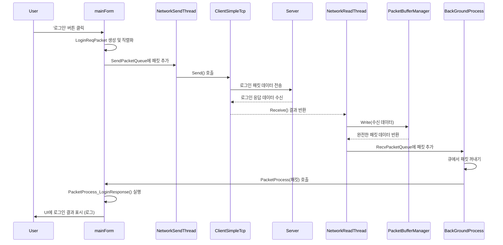
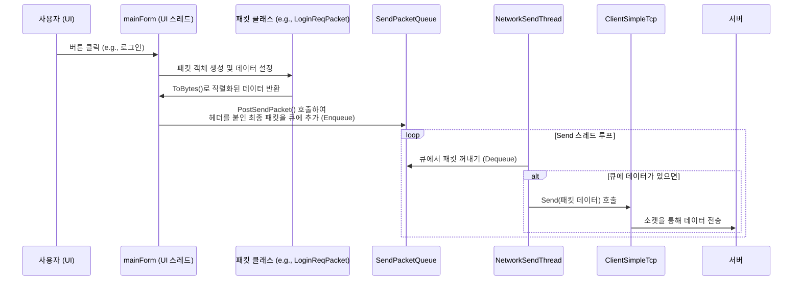
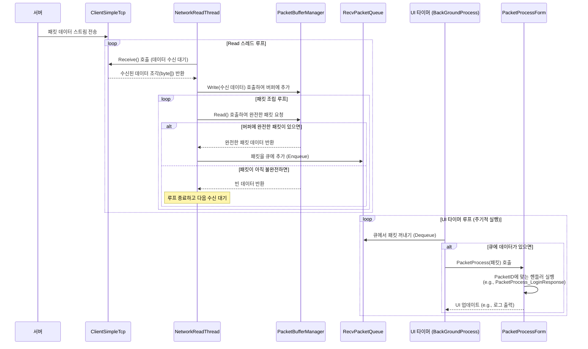
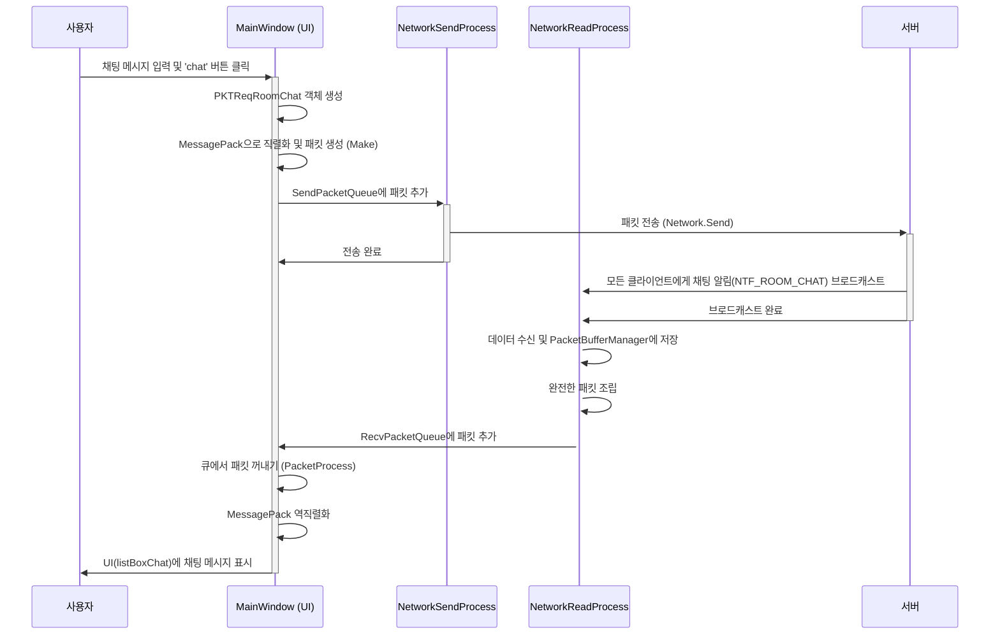
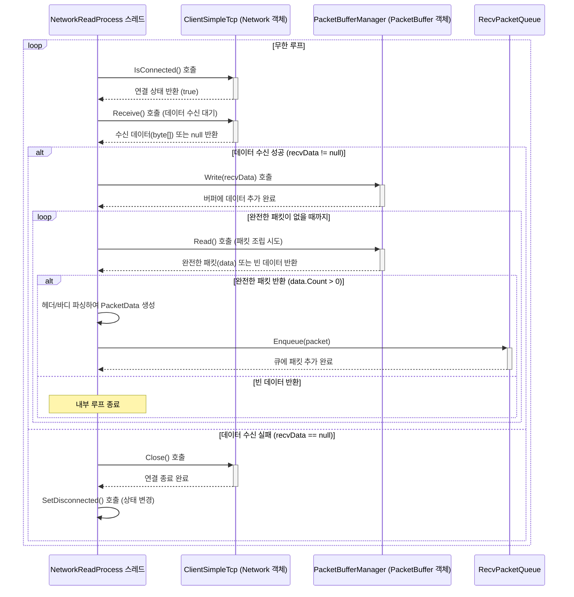

# SuperSocketLite를 이용한 C# 게임 서버 프로그래밍
    
저자: 최흥배, Gemini 2.5 Pro  
  
- .NET 8 이상, 
- C#
- Windows, Linux
- Visual Studio Code, Visual Studio 2022 이상  
--------
  
# Chapter.05 테스트용 클라이언트 

## EchoClient
[코드](https://github.com/jacking75/SuperSocketLite/tree/master/Tutorials/EchoClient )  

<pre>
EchoClient/
├── Properties/
├── App.config
├── ClientSimpleTcp.cs
├── DevLog.cs
├── Packet.cs
├── PacketBufferManager.cs
├── PacketDefine.cs
├── PacketProcessForm.cs
├── Program.cs
├── csharp_test_client.csproj
├── csharp_test_client.sln
├── mainForm.Designer.cs
├── mainForm.cs
└── mainForm.resx  
</pre>  

  
### 주요 코드 설명
C#으로 작성된 Windows Forms 기반의 TCP 클라이언트 애플리케이션이다. 서버와 소켓 통신을 통해 로그인, 채팅방 입장/퇴장, 메시지 송수신 및 릴레이 기능을 수행한다.

#### 파일 및 클래스 구성
  * **솔루션 및 프로젝트 파일**:
      * `csharp_test_client.sln`: Visual Studio 솔루션 파일이다.
      * `csharp_test_client.csproj`: C# 프로젝트 파일로, 프로젝트의 구성, 참조, 빌드 설정 등을 정의한다.
  * **애플리케이션 진입점**:
      * `Program.cs`: 애플리케이션의 주 진입점(`Main` 메서드)을 포함하며, `mainForm`을 실행시킨다.
  * **UI 및 로직**:
      * `mainForm.cs`: 메인 UI 로직을 담당하는 핵심 클래스다. 사용자 입력 처리, 네트워크 연결, 스레드 관리, 패킷 큐 관리 등을 수행한다.
      * `mainForm.Designer.cs`: `mainForm`의 UI 컨트롤(버튼, 텍스트박스 등)들이 자동으로 생성되고 관리되는 코드다.
      * `PacketProcessForm.cs`: `mainForm`의 `partial` 클래스로, 서버로부터 받은 패킷을 처리하는 핸들러들을 모아놓은 파일이다.
  * **네트워크 및 패킷 처리**:
      * `ClientSimpleTcp.cs`: `System.Net.Sockets.Socket` 클래스를 래핑하여 TCP 연결, 송신, 수신 기능을 단순화한 클래스다.
      * `PacketBufferManager.cs`: TCP의 스트림 기반 데이터 수신을 패킷 단위로 끊어서 처리할 수 있도록 도와주는 버퍼 관리 클래스다.
      * `Packet.cs`: `LoginReqPacket`, `RoomEnterResPacket` 등 서버와 주고받는 각 패킷의 데이터를 정의하고, 바이트 배열로 직렬화하거나 역직렬화하는 기능을 포함한다.
      * `PacketDefine.cs`: `PACKET_ID` 열거형을 통해 패킷의 종류를 정의하고, `ERROR_CODE`를 통해 서버와 클라이언트 간의 오류 코드를 정의한다.
  * **유틸리티 및 설정**:
      * `DevLog.cs`: 개발 및 디버깅을 위한 로그를 큐에 저장하고 UI에 표시하는 기능을 제공한다.
      * `Properties/`: `AssemblyInfo.cs` (어셈블리 정보), `Resources.resx` (리소스), `Settings.settings` (설정) 등 프로젝트의 속성과 관련된 파일들을 포함한다.

-----

### 네트워크 관련 상세 설명
이 애플리케이션의 네트워크 로직은 크게 **연결 관리**, **데이터 송신**, **데이터 수신 및 처리** 세 부분으로 나뉜다.

1.  **연결 관리 (`ClientSimpleTcp.cs`)**:

      * `Connect(string ip, int port)` 메서드는 IP 주소와 포트 번호를 받아 서버에 TCP 연결을 시도한다. 성공하면 `Socket` 객체가 생성되고 연결된 상태가 된다.
      * `Close()` 메서드는 소켓 연결을 종료한다.
      * `IsConnected()`를 통해 현재 서버와 연결되어 있는지 확인할 수 있다.

2.  **데이터 송신 (`mainForm.cs`, `ClientSimpleTcp.cs`)**:

      * 사용자가 UI의 버튼(예: 로그인, 채팅 전송)을 클릭하면, `mainForm`은 해당 기능에 맞는 패킷 객체를 생성한다 (예: `LoginReqPacket`).
      * 패킷 데이터를 `ToBytes()` 메서드를 사용해 `byte[]` 배열로 직렬화한다.
      * `PostSendPacket` 메서드는 직렬화된 데이터에 패킷 헤더(전체 크기, ID 등)를 붙여 완전한 패킷 데이터를 만든다.
      * 이 패킷 데이터는 `SendPacketQueue`라는 큐에 추가된다.
      * 별도의 스레드로 동작하는 `NetworkSendProcess` 메서드가 이 큐를 계속 확인하다가, 큐에 데이터가 있으면 하나를 꺼내 `ClientSimpleTcp.Send` 메서드를 호출하여 서버로 전송한다. 이렇게 큐를 사용하는 이유는 UI 스레드가 네트워크 송신으로 인해 멈추는 것을 방지하기 위함이다.

3.  **데이터 수신 및 처리 (`mainForm.cs`, `PacketBufferManager.cs`, `PacketProcessForm.cs`)**:

      * `NetworkReadProcess` 메서드가 별도의 스레드에서 계속 실행된다. 이 스레드는 `ClientSimpleTcp.Receive` 메서드를 호출하여 서버로부터 데이터가 올 때까지 대기(블로킹)한다.
      * 데이터가 수신되면 `PacketBufferManager.Write`를 호출해 내부 버퍼에 데이터를 추가한다. TCP는 스트림 기반이므로 한 번에 여러 패킷이 붙어서 오거나, 하나의 패킷이 여러 번에 나뉘어 올 수 있다.
      * `PacketBufferManager.Read` 메서드는 버퍼를 읽어 완전한 형태의 패킷 하나를 만들 수 있는지 확인한다. 먼저 패킷 헤더 크기(5바이트)만큼 데이터가 있는지 확인하고, 헤더에서 전체 패킷 크기를 읽어온다. 그 후 버퍼에 전체 패킷 크기만큼의 데이터가 쌓였는지 확인하여, 다 쌓였다면 완전한 패킷 하나를 분리하여 반환한다.
      * `NetworkReadProcess`는 이렇게 얻은 완전한 패킷 데이터를 `RecvPacketQueue` 큐에 넣는다.
      * UI 스레드에서 주기적으로 실행되는 `BackGroundProcess` (UI 타이머에 의해 호출)가 `RecvPacketQueue`에서 패킷을 꺼낸다.
      * `PacketProcess` 메서드는 패킷의 ID를 확인하고, `PacketFuncDic`이라는 딕셔너리를 사용해 해당 ID에 맞는 처리 함수(예: `PacketProcess_LoginResponse`)를 호출한다.
      * 각각의 패킷 처리 함수는 패킷의 바디 데이터를 역직렬화하여 UI(로그, 채팅창 등)에 결과를 표시한다.

-----

### 코드 동작 Mermaid 다이어그램

아래는 사용자가 '로그인' 버튼을 눌렀을 때의 주요 동작을 나타낸 시퀀스 다이어그램이다.


    
  
### ClientSimpleTcp 클래스
이 클래스는 C#의 `System.Net.Sockets.Socket` 클래스를 더 사용하기 쉽게 래핑(wrapping)하여 TCP 통신을 간편하게 처리하기 위해 만들어진 클래스다. 복잡한 소켓 설정을 최소화하고, 연결, 송신, 수신, 연결 종료와 같은 핵심 기능들을 직관적인 메서드로 제공하는 것이 주 목적이다.

#### 멤버 함수 상세 설명

* **`Connect(string ip, int port)`**
    * **목적**: 지정된 IP 주소와 포트 번호를 가진 서버에 TCP 연결을 시도한다.
    * **코드 설명**:
        1.  `IPAddress.Parse(ip)`: 입력받은 문자열 형태의 IP 주소를 `IPAddress` 객체로 변환한다.
        2.  `Sock = new Socket(...)`: TCP 통신을 위한 `Socket` 객체를 생성한다. `AddressFamily.InterNetwork`는 IPv4 주소 체계를, `SocketType.Stream`은 순서가 보장되는 양방향 연결(TCP)을 의미한다.
        3.  `Sock.Connect(...)`: `IPEndPoint` 객체(IP와 포트 정보를 가짐)를 생성하여 실제 서버에 연결을 시도한다.
        4.  `try-catch`: 연결 과정에서 발생할 수 있는 예외(예: 서버가 닫혀있거나 주소가 잘못된 경우)를 잡아 `LatestErrorMsg`에 오류 메시지를 저장하고 `false`를 반환한다.
        5.  연결에 성공하면 `true`를 반환한다.

* **`Receive()`**
    * **목적**: 서버로부터 데이터를 수신하는 함수다. 데이터가 올 때까지 스레드를 멈추고 기다리는 블로킹(blocking) 방식으로 동작한다.
    * **코드 설명**:
        1.  `byte[] ReadBuffer = new byte[2048]`: 서버로부터 데이터를 받아 저장할 2048바이트 크기의 버퍼를 생성한다.
        2.  `Sock.Receive(...)`: 소켓을 통해 데이터를 수신하고 `ReadBuffer`에 저장한다. 반환값 `nRecv`는 실제로 수신된 데이터의 바이트 수다.
        3.  `if (nRecv == 0)`: 수신된 데이터의 크기가 0이면 서버가 정상적으로 연결을 종료했다는 의미이므로 `null`을 반환한다.
        4.  `return Tuple.Create(nRecv, ReadBuffer)`: 수신에 성공하면, 수신된 데이터의 크기와 데이터가 담긴 버퍼를 `Tuple` 객체로 묶어 반환한다.
        5.  `catch (SocketException se)`: 데이터 수신 중 예외(예: 갑작스러운 연결 끊김)가 발생하면 오류 메시지를 저장하고 `null`을 반환한다.

* **`Send(byte[] sendData)`**
    * **목적**: 서버로 바이트 배열 형태의 데이터를 전송한다.
    * **코드 설명**:
        1.  `if (Sock != null && Sock.Connected)`: 소켓이 생성되어 있고 서버와 연결된 상태인지 먼저 확인한다.
        2.  `Sock.Send(...)`: 연결된 소켓을 통해 `sendData` 바이트 배열에 담긴 데이터를 서버로 전송한다.
        3.  `catch (SocketException se)`: 전송 중 예외 발생 시 `LatestErrorMsg`에 오류 메시지를 기록한다.

* **`Close()`**
    * **목적**: 현재 열려있는 소켓 연결을 안전하게 종료한다.
    * **코드 설명**:
        1.  `if (Sock != null && Sock.Connected)`: 소켓이 유효하고 연결된 상태인지 확인한다.
        2.  `Sock.Close()`: 소켓 연결을 닫고 관련된 모든 리소스를 해제한다.

* **`IsConnected()`**
    * **목적**: 현재 소켓이 서버와 연결되어 있는지 여부를 간단하게 확인하여 `true` 또는 `false`로 반환한다.

---

### PacketBufferManager 클래스
TCP 통신은 데이터가 정해진 크기로 나뉘어 오는 것이 아니라, 물 흐르듯 이어져 오는 스트림(Stream) 방식이다. 따라서 수신한 데이터를 패킷 단위(의미 있는 데이터 묶음)로 올바르게 잘라내기 위한 버퍼 관리 클래스가 필요하며, `PacketBufferManager`가 바로 그 역할을 한다.

#### 멤버 함수 상세 설명

* **`Init(int size, int headerSize, int maxPacketSize)`**
    * **목적**: 패킷 버퍼를 사용하기 전에 필요한 초기 설정을 수행한다.
    * **코드 설명**:
        1.  버퍼의 전체 크기(`BufferSize`), 패킷 헤더의 크기(`HeaderSize`), 처리할 수 있는 최대 패킷의 크기(`MaxPacketSize`)를 설정한다.
        2.  `PacketData = new byte[size]`: 실제 데이터를 저장할 주 버퍼를 할당한다.
        3.  `PacketDataTemp = new byte[size]`: 버퍼를 재정리할 때 임시로 데이터를 담아둘 보조 버퍼를 할당한다.

* **`Write(byte[] data, int pos, int size)`**
    * **목적**: `ClientSimpleTcp.Receive`를 통해 수신된 데이터 조각을 내부 버퍼(`PacketData`)에 추가한다.
    * **코드 설명**:
        1.  `var remainBufferSize = BufferSize - WritePos`: 현재 버퍼에서 데이터를 쓸 수 있는 남은 공간을 계산한다.
        2.  `if (remainBufferSize < size)`: 남은 공간이 쓰려는 데이터의 크기보다 작으면 쓰기를 중단하고 `false`를 반환하여 버퍼 오버플로우를 방지한다.
        3.  `Buffer.BlockCopy(...)`: `data` 배열의 `pos` 위치에서부터 `size` 만큼을 `PacketData` 버퍼의 `WritePos`(현재까지 데이터가 쓰여진 위치)에 복사한다.
        4.  `WritePos += size`: 데이터가 추가된 만큼 `WritePos` 위치를 뒤로 이동시킨다.
        5.  `NextFree()`를 호출하여 버퍼에 남은 공간이 부족하면 `BufferRelocate()`를 통해 버퍼를 정리한다.

* **`Read()`**
    * **목적**: 현재 버퍼에 쌓인 데이터 중에서 완전한 형태의 패킷 하나를 분리하여 반환한다.
    * **코드 설명**:
        1.  `var enableReadSize = WritePos - ReadPos`: 버퍼에서 아직 읽지 않은 데이터의 전체 크기를 계산한다. `ReadPos`는 읽기가 완료된 위치, `WritePos`는 쓰기가 완료된 위치다.
        2.  `if (enableReadSize < HeaderSize)`: 읽지 않은 데이터가 패킷 헤더 크기보다 작으면, 아직 완전한 패킷 길이를 알 수 없으므로 빈 `ArraySegment`를 반환한다.
        3.  `var packetDataSize = BitConverter.ToInt16(PacketData, ReadPos)`: 버퍼의 `ReadPos` 위치에서 2바이트를 읽어 전체 패킷의 크기를 알아낸다. (이 코드의 패킷 구조상, 맨 앞 2바이트가 전체 패킷 크기를 나타낸다)
        4.  `if (enableReadSize < packetDataSize)`: 버퍼에 쌓인 데이터가 방금 읽어온 패킷 전체 크기보다 작다면, 아직 패킷 하나가 완전히 도착하지 않은 것이므로 빈 `ArraySegment`를 반환한다.
        5.  `new ArraySegment<byte>(...)`: 완전한 패킷 하나가 버퍼에 존재하므로, `PacketData` 버퍼의 `ReadPos` 위치에서 `packetDataSize` 만큼을 가리키는 `ArraySegment`를 생성하여 반환한다. `ArraySegment`는 원본 배열을 복사하지 않고 특정 부분만 가리키므로 효율적이다.
        6.  `ReadPos += packetDataSize`: 패킷 하나를 읽었으므로, `ReadPos`를 읽은 패킷의 크기만큼 뒤로 이동시킨다.

* **`BufferRelocate()`**
    * **목적**: 버퍼의 앞부분에 이미 읽고 지나간 공간이 많이 쌓였을 때, 아직 읽지 않은 데이터들을 버퍼의 맨 앞으로 당겨와서 공간을 확보(재정리)한다.
    * **코드 설명**:
        1.  `var enableReadSize = WritePos - ReadPos`: 버퍼에 남아있는 유효한 데이터(아직 읽지 않은 데이터)의 크기를 계산한다.
        2.  `Buffer.BlockCopy(PacketData, ReadPos, PacketDataTemp, 0, enableReadSize)`: `PacketData` 버퍼의 `ReadPos`부터 남아있는 데이터를 임시 버퍼인 `PacketDataTemp`의 맨 앞(0번 인덱스)으로 복사한다.
        3.  `Buffer.BlockCopy(PacketDataTemp, 0, PacketData, 0, enableReadSize)`: 임시 버퍼에 복사했던 데이터를 다시 `PacketData` 버퍼의 맨 앞으로 복사한다.
        4.  `ReadPos = 0`, `WritePos = enableReadSize`: `ReadPos`는 0으로 초기화하고, `WritePos`는 유효한 데이터의 크기만큼으로 설정하여 버퍼의 상태를 최신화한다.
  

### 서버에서 패킷을 받아서 처리하는 과정
서버로부터 데이터를 수신하고 이를 처리하는 과정은 여러 단계에 걸쳐 비동기적으로 이루어진다. 핵심은 **별도의 스레드에서 네트워크 데이터를 지속적으로 수신하여 버퍼에 쌓고, UI 스레드에서는 이 버퍼에서 완성된 패킷을 가져와 안전하게 처리**하는 것이다.

1.  **데이터 수신 (NetworkReadProcess 스레드)**
    * `mainForm.cs`의 `NetworkReadProcess` 메서드는 프로그램 시작 시 생성된 별도의 스레드에서 무한 루프를 돌며 실행된다.
    * 이 루프 안에서 `ClientSimpleTcp.Receive()` 메서드를 호출하여 서버로부터 데이터가 올 때까지 대기한다.
    * `Receive()`는 소켓을 통해 데이터를 받으면, 수신된 데이터의 크기와 데이터가 담긴 바이트 배열(`byte[]`)을 `Tuple` 형태로 반환한다.

2.  **스트림을 패킷으로 변환 (PacketBufferManager)**
    * `NetworkReadProcess`는 `Receive()`로 받은 데이터 조각을 `PacketBufferManager.Write()` 메서드에 넘겨 내부 버퍼에 추가한다.
    * `Write()`가 실행된 후, `PacketBuffer.Read()` 메서드를 루프 안에서 계속 호출한다. `Read()` 메서드는 현재 버퍼에 완전한 형태의 패킷이 하나 이상 존재하는지 검사한다.
        * 먼저 버퍼에 헤더 크기(5바이트)만큼 데이터가 있는지 확인한다.
        * 헤더가 있다면, 헤더의 첫 2바이트를 읽어 해당 패킷의 전체 크기(`packetDataSize`)를 알아낸다.
        * 버퍼에 `packetDataSize` 만큼의 데이터가 쌓여 있다면, 이는 완전한 패킷 하나가 도착했다는 의미다.
        * 이 완전한 패킷 데이터를 `ArraySegment<byte>` 형태로 잘라내어 반환하고, 버퍼의 읽기 위치(`ReadPos`)를 그만큼 뒤로 이동시킨다.

3.  **수신 패킷 큐에 추가**
    * `Read()`를 통해 성공적으로 분리된 완전한 패킷은 `PacketData` 구조체로 변환된 후, `RecvPacketQueue`라는 큐(Queue)에 추가된다.
    * 이 과정은 다른 스레드에서 동시에 접근할 수 있으므로 `lock`을 사용하여 스레드 안전성을 보장한다.

4.  **패킷 처리 (UI 스레드)**
    * `mainForm`의 UI 스레드에서는 `dispatcherUITimer`가 주기적으로 `BackGroundProcess` 메서드를 호출한다.
    * `BackGroundProcess`는 `RecvPacketQueue`에 처리할 패킷이 있는지 확인하고, 있다면 하나를 꺼내온다(`Dequeue`).
    * 꺼내온 패킷은 `PacketProcess` 메서드(`PacketProcessForm.cs`에 정의됨)로 전달된다.
    * `PacketProcess`는 패킷 헤더에서 읽어온 `PacketID`를 확인한다. 그리고 `PacketFuncDic`이라는 딕셔너리를 사용하여 `PacketID`에 맞는 처리 함수를 찾아 호출한다. 예를 들어, `PACKET_ID_LOGIN_RES` ID를 가진 패킷이 들어오면 `PacketProcess_LoginResponse` 함수가 실행된다.
    * 각각의 처리 함수(예: `PacketProcess_LoginResponse`)는 전달받은 바이트 데이터를 `FromBytes` 메서드를 사용해 자신에게 맞는 패킷 클래스(예: `LoginResPacket`)로 역직렬화한 후, 그 결과를 로그창에 출력하는 등 UI를 업데이트하는 작업을 수행한다.

---

### 서버로 패킷을 보내는 과정
패킷을 보내는 과정 역시 UI 스레드의 멈춤을 방지하기 위해 큐를 사용하는 비동기 방식으로 구현되었다.

1.  **사용자 입력 및 패킷 생성**
    * 사용자가 "로그인" 버튼이나 "채팅 전송" 버튼과 같은 UI 컨트롤을 조작하면 해당 이벤트 핸들러(예: `button2_Click`)가 실행된다.
    * 이벤트 핸들러 안에서는 서버로 보낼 데이터에 맞는 패킷 클래스(예: `LoginReqPacket`)의 인스턴스를 생성한다.
    * `SetValue`와 같은 메서드를 사용하여 사용자가 입력한 ID, 비밀번호, 채팅 메시지 등의 데이터를 패킷 객체에 채워 넣는다.

2.  **패킷 직렬화 및 전송 큐에 추가**
    * 데이터가 채워진 패킷 객체와 패킷 ID를 `PostSendPacket` 메서드에 전달한다.
    * `PostSendPacket` 메서드는 다음 작업을 수행한다:
        * 전달받은 패킷 객체의 `ToBytes()` 메서드를 호출하여 몸체(body) 데이터를 바이트 배열로 직렬화한다.
        * 패킷 헤더 정보를 생성한다. 헤더는 전체 패킷 크기(헤더 + 몸체)와 `PacketID`로 구성된다.
        * 헤더와 몸체 바이트 배열을 순서대로 합쳐 하나의 완전한 패킷 바이트 배열을 만든다.
        * 완성된 패킷 바이트 배열을 `SendPacketQueue`라는 큐에 추가(`Enqueue`)한다. 이 과정 역시 스레드 안전성을 위해 `lock`으로 보호된다.

3.  **데이터 전송 (NetworkSendThread 스레드)**
    * `mainForm.cs`의 `NetworkSendProcess` 메서드는 프로그램 시작 시 생성된 별도의 스레드에서 무한 루프를 돌며 실행된다.
    * 이 스레드는 `SendPacketQueue`를 지속적으로 확인하다가 큐에 전송할 패킷이 들어오면 하나를 꺼낸다(`Dequeue`).
    * 꺼내온 패킷 바이트 배열을 `ClientSimpleTcp.Send()` 메서드에 전달하여 서버로 전송한다. `Send()` 메서드는 내부적으로 소켓을 통해 해당 데이터를 네트워크로 내보낸다.
  

### 패킷 송신 과정 다이어그램
이 다이어그램은 사용자가 UI에서 특정 동작을 했을 때, 해당 데이터가 패킷으로 만들어져 서버까지 전송되는 전체 흐름을 보여준다.



**동작 설명:**

1.  사용자가 UI에서 버튼을 클릭하면 `mainForm`의 이벤트 핸들러가 호출된다.
2.  `mainForm`은 해당 요청에 맞는 `Packet` 클래스(예: `LoginReqPacket`)의 인스턴스를 만들고 사용자 데이터를 설정한다.
3.  `ToBytes()` 메서드로 패킷 몸체를 `byte[]`로 직렬화하고, `PostSendPacket` 메서드에서 헤더(크기, ID)를 추가하여 완전한 패킷 데이터를 만든다.
4.  이 패킷 데이터는 `SendPacketQueue`에 저장된다.
5.  별도의 스레드인 `NetworkSendThread`는 이 큐를 계속 감시하다가, 패킷이 들어오면 꺼내서 `ClientSimpleTcp`의 `Send` 메서드를 통해 서버로 전송한다.

-----

### 패킷 수신 및 처리 과정 다이어그램
이 다이어그램은 서버로부터 데이터가 들어왔을 때, 이를 수신하고 완전한 패킷으로 조립하여 최종적으로 처리하는 전체 흐름을 보여준다.  


  
**동작 설명:**

1.  `NetworkReadThread`는 `ClientSimpleTcp.Receive()`를 통해 서버로부터 들어오는 데이터 스트림을 지속적으로 수신한다.
2.  수신된 데이터 조각은 `PacketBufferManager`의 내부 버퍼에 `Write`된다.
3.  `NetworkReadThread`는 `PacketBufferManager.Read()`를 호출하여 버퍼에 완전한 패킷이 조립되었는지 확인한다. 완전한 패킷이 있다면 이를 분리하여 `RecvPacketQueue`에 넣는다.
4.  UI 스레드에서 주기적으로 실행되는 `BackGroundProcess`가 `RecvPacketQueue`를 확인하여 처리할 패킷을 꺼낸다.
5.  꺼내온 패킷은 `PacketProcessForm`으로 전달되어 `PacketID`에 따라 적절한 처리 함수가 호출되고, 결과가 UI에 반영된다.
  
  
<br>  
    
## ChatClient
ChatServer에서 사용하는 클라이언트 프로그램이다. WPF를 사용하였다.     
[코드](https://github.com/jacking75/SuperSocketLite/tree/master/Tutorials/ChatClient )  

<pre>
ChatClient/
├── Properties/
├── App.config
├── App.xaml
├── App.xaml.cs
├── ClientSimpleTcp.cs
├── DevLog.cs
├── MainWindow.xaml
├── MainWindow.xaml.cs
├── PacketBufferManager.cs
├── PacketData.cs
├── PacketDefine.cs
├── TestClient.csproj
└── TestClient.sln
</pre>      
  
  
### 파일 및 클래스 설명
C# WPF를 사용하여 만든 간단한 채팅 클라이언트 프로젝트다. 각 파일과 클래스는 다음과 같은 역할을 수행한다.

  * **솔루션 및 프로젝트 파일**

      * `TestClient.sln`: Visual Studio 솔루션 파일로, 이 솔루션에 포함된 프로젝트들의 정보를 담고 있다.
      * `TestClient.csproj`: C\# 프로젝트 파일로, 프로젝트의 빌드 설정, 프레임워크 정보(net8.0-windows), 그리고 MessagePack과 같은 외부 라이브러리 의존성을 정의한다.

  * **WPF 애플리케이션 파일**

      * `App.xaml` / `App.xaml.cs`: WPF 애플리케이션의 시작점이다. `App.xaml`에서는 `MainWindow.xaml`을 시작 URI로 지정하고 있다.
      * `MainWindow.xaml` / `MainWindow.xaml.cs`: 클라이언트의 메인 UI와 핵심 로직을 담당한다.
          * `MainWindow.xaml`: 서버 접속 정보(IP, Port), 로그인 정보(ID, PW), 채팅, 사용자 목록 등을 표시하는 UI 요소들이 XAML 코드로 정의되어 있다.
          * `MainWindow.xaml.cs`: UI 이벤트 처리, 네트워크 연결, 패킷 송수신 및 처리를 위한 모든 로직이 포함된 핵심 클래스다.

  * **네트워크 및 데이터 처리 클래스**

      * `ClientSimpleTcp.cs`: TCP 소켓 통신을 간편하게 사용하기 위한 래퍼(Wrapper) 클래스다. 서버에 연결(`Connect`), 데이터 송신(`Send`), 수신(`Receive`), 연결 종료(`Close`) 기능을 제공한다.
      * `PacketBufferManager.cs`: TCP 스트림 데이터를 패킷 단위로 처리하기 위한 버퍼 관리 클래스다. 서버로부터 받은 데이터 조각들을 모아 완전한 패킷으로 만들어주는 중요한 역할을 한다.
      * `PacketDefine.cs`: 서버와 클라이언트 간에 약속된 패킷의 종류(`PACKETID`)와 오류 코드(`ERROR_CODE`)를 열거형(enum)으로 정의한다.
      * `PacketData.cs`: 실제 통신에 사용되는 패킷의 데이터 구조를 정의한다. `MessagePack`을 사용하여 객체를 직렬화/역직렬화하며, `PKTReqLogin`(로그인 요청), `PKTNtfRoomChat`(채팅 알림) 등의 클래스가 포함되어 있다. 또한, `PacketToBytes` 클래스는 패킷 데이터를 `byte[]` 배열로 변환하는 기능을 제공한다.
      * `DevLog.cs`: 개발 및 디버깅 목적으로 로그를 기록하고 UI에 표시하기 위한 클래스다.

  * **기타 파일**

      * `Properties/`: 프로젝트의 리소스, 설정 등을 담고 있는 파일들이다.
      * `App.config`: .NET 애플리케이션의 설정을 담는 XML 파일이다.

### 네트워크 관련 상세 설명
이 클라이언트의 네트워크 동작은 `MainWindow.xaml.cs`의 두 개의 스레드(`NetworkReadThread`, `NetworkSendProcess`)와 `PacketBufferManager`, `ClientSimpleTcp` 클래스를 중심으로 이루어진다.

1.  **연결 (Connection)**

      * 사용자가 UI에서 '접속' 버튼을 누르면 `Button_Click` 이벤트 핸들러가 호출된다.
      * `ClientSimpleTcp` 클래스의 `Connect` 메소드를 호출하여 서버의 IP와 포트로 TCP 소켓 연결을 시도한다.
      * 연결이 성공하면 `MainWindow`의 `ClientState`가 `CONNECTED`로 변경된다.

2.  **데이터 송신 (Send)**

      * 사용자가 '채팅' 버튼을 누르면 `Button_Click_5` 이벤트 핸들러가 실행된다.
      * `PKTReqRoomChat`과 같은 요청 패킷 객체를 생성하고, `MessagePackSerializer.Serialize()`를 이용해 `byte[]` 데이터로 직렬화한다.
      * `PacketToBytes.Make()` 메소드는 이 직렬화된 데이터(Body) 앞에 5바이트 크기의 헤더(전체 패킷 크기, 패킷 ID)를 붙여 완전한 패킷 `byte[]`를 생성한다.
      * 생성된 패킷은 `SendPacketQueue`라는 큐(Queue)에 추가된다.
      * `NetworkSendProcess` 스레드가 백그라운드에서 계속 실행되면서 `SendPacketQueue`를 확인하고, 큐에 패킷이 있으면 꺼내서 `Network.Send()` 메소드를 통해 서버로 전송한다.

3.  **데이터 수신 (Receive)**

      * `NetworkReadProcess` 스레드는 백그라운드에서 `Network.Receive()`를 계속 호출하며 서버로부터 데이터를 수신한다. TCP는 스트림 기반 프로토콜이므로 데이터가 패킷 단위로 정확히 나뉘어 오지 않을 수 있다.
      * 수신된 `byte[]` 데이터는 `PacketBufferManager`의 `Write()` 메소드를 통해 내부 버퍼에 저장된다.
      * 이후 `PacketBuffer.Read()` 메소드를 호출하여 버퍼에 완전한 패킷이 존재하는지 확인한다.
          * `Read()` 메소드는 먼저 패킷 헤더(최소 5바이트)를 읽어 패킷의 전체 크기를 알아낸다.
          * 버퍼에 저장된 데이터가 이 전체 크기보다 크거나 같으면, 완전한 패킷 하나를 `ArraySegment<byte>` 형태로 잘라내어 반환한다.
          * 만약 데이터가 아직 부족하다면 빈 `ArraySegment<byte>`를 반환하고 다음 수신을 기다린다.
      * 완전한 패킷이 반환되면, `NetworkReadProcess`는 이 패킷을 `PacketData` 구조체로 파싱하여 `RecvPacketQueue`에 추가한다.
      * 메인 UI 스레드에서 주기적으로 실행되는 `BackGroundProcess`가 `RecvPacketQueue`를 확인하고, 패킷이 있으면 꺼내 `PacketProcess()` 메소드를 호출한다.

4.  **패킷 처리 (Process)**

      * `PacketProcess()` 메소드는 수신된 패킷의 `PacketID`에 따라 `switch` 문으로 분기한다.
      * 예를 들어, `PACKETID.NTF_ROOM_CHAT` 이라면 `MessagePackSerializer.Deserialize<PKTNtfRoomChat>()`를 사용해 `byte[]` Body 데이터를 `PKTNtfRoomChat` 객체로 역직렬화한다.
      * 마지막으로, 역직렬화된 객체의 데이터(유저 ID, 채팅 메시지)를 UI의 `listBoxChat`에 추가하여 사용자에게 보여준다.

### 동작 다이어그램 (Mermaid)
다음은 사용자가 채팅 메시지를 보내고 받는 과정을 나타낸 Mermaid 시퀀스 다이어그램이다.




### 패킷을 보낼 때 (송신)
패킷 송신은 `UI 스레드` -> `SendPacketQueue` -> `NetworkSendProcess 스레드` 순서로 동작한다. 사용자의 입력에서 시작하여 네트워크로 전송되는 과정은 다음과 같다.

1.  **사용자 입력 및 패킷 객체 생성**:
    * 사용자가 "chat" 버튼을 누르면 `MainWindow.xaml.cs`의 `Button_Click_5` 이벤트 핸들러가 호출된다.
    * `PKTReqRoomChat` 클래스의 인스턴스를 생성하고, 사용자가 입력한 채팅 메시지를 `ChatMessage` 속성에 담는다. 이 클래스는 `PacketData.cs`에 `[MessagePackObject]`로 정의되어 있어 직렬화가 가능하다.

2.  **데이터 직렬화 (Serialization)**:
    * `MessagePackSerializer.Serialize()` 메소드를 사용하여 `PKTReqRoomChat` 객체를 `byte[]` 형태의 데이터(Body)로 변환한다. MessagePack은 데이터를 효율적인 바이너리 형태로 압축하여 전송 데이터의 크기를 줄여준다.

3.  **완전한 패킷 구성**:
    * `CSBaseLib.PacketToBytes.Make()` 메소드를 호출하여 최종적으로 서버에 전송할 패킷을 완성한다.
    * 이 메소드는 직렬화된 `Body` 데이터 앞에 5바이트 크기의 `Header`를 추가한다.
        * **헤더 구성 (총 5바이트)**:
            * **Packet Size (2바이트)**: 헤더(5)와 Body의 크기를 더한 전체 패킷의 길이.
            * **Packet ID (2바이트)**: 패킷의 종류를 식별하는 고유 ID. `PACKETID.REQ_ROOM_CHAT` 값이 들어간다.
            * **Type (1바이트)**: 패킷의 추가 속성을 나타내는 값 (여기서는 0으로 고정).

4.  **전송 큐에 추가**:
    * 완성된 패킷(`byte[]`)은 `PostSendPacket()` 메소드를 통해 `SendPacketQueue`라는 큐(Queue)에 추가된다.
    * UI 스레드는 패킷을 큐에 넣는 작업까지만 수행하고 즉시 다음 작업을 처리하므로, 네트워크 전송으로 인한 UI 멈춤 현상이 발생하지 않는다.

5.  **네트워크 전송**:
    * `MainWindow`가 생성될 때 시작된 `NetworkSendProcess` 스레드는 무한 루프를 돌며 `SendPacketQueue`를 계속 감시한다.
    * 큐에 전송할 패킷이 들어오면, 패킷을 하나 꺼내 `Network.Send()` 메소드를 호출하여 서버로 전송한다. `Network.Send()`는 `ClientSimpleTcp.cs`에 구현된 `Socket.Send()`를 호출하는 역할을 한다.
  

### 패킷을 받을 때 (수신)
패킷 수신은 `NetworkReadProcess 스레드` -> `PacketBufferManager` -> `RecvPacketQueue` -> `UI 스레드` 순서로 동작한다. 네트워크에서 들어온 데이터를 파싱하여 UI에 반영하는 과정은 다음과 같다.

1.  **데이터 수신 및 버퍼링**:
    * `NetworkReadProcess` 스레드는 무한 루프를 돌며 `Network.Receive()`를 호출하여 서버로부터 데이터를 수신한다.
    * TCP는 스트림 기반 프로토콜이므로, 수신된 데이터는 패킷 단위로 나뉘어 있지 않을 수 있다(패킷 일부만 오거나, 여러 패킷이 붙어서 올 수 있음).
    * 수신된 데이터(`byte[]`)는 `PacketBuffer.Write()`를 통해 `PacketBufferManager`의 내부 버퍼에 그대로 쌓인다.

2.  **완전한 패킷 분리**:
    * `PacketBuffer.Write()` 이후, `PacketBuffer.Read()`가 루프 안에서 호출되어 버퍼에 완성된 패킷이 있는지 검사한다.
    * `PacketBufferManager.Read()` 메소드는 다음과 같이 동작한다:
        * 먼저 버퍼의 가장 앞에서 2바이트를 읽어 `packetDataSize`(패킷의 전체 크기)를 확인한다.
        * 현재 버퍼에 쌓인 데이터의 양(`enableReadSize`)이 `packetDataSize`보다 크거나 같으면, 완전한 패킷 하나가 도착했다고 판단한다.
        * 버퍼에서 `packetDataSize`만큼의 데이터를 잘라내어 `ArraySegment<byte>` 형태로 반환한다.
        * 아직 패킷이 완성되지 않았다면(데이터가 부족하다면) 아무것도 반환하지 않고 다음 수신을 기다린다.

3.  **수신 큐에 추가**:
    * `PacketBufferManager`로부터 완전한 패킷이 반환되면, `NetworkReadProcess`는 이 패킷을 `PacketData` 구조체로 변환한다. 헤더 정보를 파싱하여 `PacketID`를 얻고, 나머지 Body 데이터를 `BodyData` 속성에 저장한다.
    * 생성된 `PacketData`는 `RecvPacketQueue`라는 수신 큐에 추가된다.

4.  **패킷 처리 및 UI 업데이트**:
    * UI 스레드에서 주기적으로 실행되는 `BackGroundProcess` 메소드(`DispatcherTimer`에 의해 호출됨)가 `RecvPacketQueue`를 확인한다.
    * 큐에 처리할 패킷이 있으면 하나를 꺼내 `PacketProcess()` 메소드를 호출한다.
    * `PacketProcess()` 메소드는 수신된 패킷의 `PacketID`를 기반으로 `switch` 문을 통해 분기한다. 예를 들어 `PACKETID.NTF_ROOM_CHAT`인 경우 다음을 수행한다.
        * `MessagePackSerializer.Deserialize<PKTNtfRoomChat>()`을 호출하여 `BodyData`(`byte[]`)를 다시 `PKTNtfRoomChat` 객체로 역직렬화한다.
        * 역직렬화된 객체에서 `UserID`와 `ChatMessage`를 추출하여 UI 요소인 `listBoxChat`에 새로운 아이템을 추가한다. 이 작업은 UI 스레드에서 수행되므로 안전하다.
   


### `void NetworkReadProcess()` 함수 상세 설명
이 함수는 `MainWindow`가 생성될 때 시작되는 별도의 스레드에서 실행되며, 오직 서버로부터 데이터를 수신하고 이를 완전한 패킷으로 조립하는 역할만 담당한다. 네트워크 작업은 시간이 걸릴 수 있으므로, 별도 스레드로 분리하여 UI가 멈추는 현상을 방지한다.

```csharp
void NetworkReadProcess()
{
    // (1) 패킷 헤더 크기를 상수로 정의한다.
    const Int16 PacketHeaderSize = CSBaseLib.PacketDef.PACKET_HEADER_SIZE;

    // (2) IsNetworkThreadRunning 플래그가 true인 동안 무한 루프를 돈다.
    while (IsNetworkThreadRunning)
    {
        // (3) 네트워크 연결 상태를 확인한다.
        if (Network.IsConnected() == false)
        {
            // (3-1) 연결이 끊어져 있으면 잠시 대기 후 루프를 계속한다.
            System.Threading.Thread.Sleep(1);
            continue;
        }

        // (4) 서버로부터 데이터를 수신한다.
        var recvData = Network.Receive();

        // (5) 수신된 데이터가 있는지 확인한다.
        if (recvData != null)
        {
            // (5-1) 수신된 데이터를 PacketBufferManager에 기록한다.
            PacketBuffer.Write(recvData.Item2, 0, recvData.Item1);

            // (6) 버퍼에 완전한 패킷이 여러 개 있을 수 있으므로 루프를 돈다.
            while (true)
            {
                // (6-1) 버퍼에서 완전한 패킷 하나를 읽어온다.
                var data = PacketBuffer.Read();
                if (data.Count < 1)
                {
                    // (6-2) 더 이상 완전한 패킷이 없으면 루프를 빠져나간다.
                    break;
                }

                // (7) 패킷을 RecvPacketQueue에 넣기 위해 PacketData 구조체로 변환한다.
                var packet = new PacketData();
                packet.DataSize = (short)(data.Count - PacketHeaderSize);
                packet.PacketID = BitConverter.ToInt16(data.Array, data.Offset + 2);
                packet.Type = (SByte)data.Array[(data.Offset + 4)];
                packet.BodyData = new byte[packet.DataSize];
                Buffer.BlockCopy(data.Array, (data.Offset + PacketHeaderSize), packet.BodyData, 0, (data.Count - PacketHeaderSize));
                
                // (8) 완성된 패킷을 수신 큐에 추가한다.
                lock (((System.Collections.ICollection)RecvPacketQueue).SyncRoot)
                {
                    RecvPacketQueue.Enqueue(packet);
                }
            }
        }
        else
        {
            // (9) Receive()가 null을 반환하면 서버와 연결이 끊어진 것이다.
            Network.Close();
            SetDisconnectd();
            DevLog.Write("서버와 접속 종료 !!!", LOG_LEVEL.INFO);
        }
    }
}
```

1.  **`PacketHeaderSize` 상수**: `PacketDefine.cs`에 정의된 `PACKET_HEADER_SIZE`(5바이트) 값을 가져와 상수로 사용한다. 이 값은 패킷을 파싱할 때 헤더와 본문을 구분하는 기준이 된다.
2.  **`while (IsNetworkThreadRunning)`**: 이 스레드는 `IsNetworkThreadRunning` 플래그가 `false`가 될 때까지 (주로 프로그램이 종료될 때) 계속 실행된다.
3.  **`Network.IsConnected()`**: `ClientSimpleTcp.cs`에 있는 메소드다. 소켓(`Sock`) 객체가 null이 아니고 `Connected` 속성이 true인지 확인하여 현재 서버와 연결된 상태인지 알려준다. 연결되어 있지 않으면 1ms 대기(`Sleep`)하고 루프의 처음으로 돌아가 불필요한 CPU 사용을 막는다.
4.  **`Network.Receive()`**: `ClientSimpleTcp.cs`의 핵심 수신 메소드다. 내부적으로 `Socket.Receive()`를 호출하여 네트워크 스트림으로부터 데이터를 읽어온다. 이 메소드는 `Tuple<int, byte[]>`를 반환하는데, `Item1`은 수신한 데이터의 길이, `Item2`는 데이터가 담긴 `byte` 배열이다. 데이터가 없으면 `null`을 반환한다.
5.  **`if (recvData != null)`**: 수신한 데이터가 있을 때만 다음 로직을 처리한다.
6.  **`PacketBuffer.Write(...)`**: `PacketBufferManager.cs`의 메소드다. `recvData`로 받은 `byte` 배열을 내부 버퍼(`PacketData`)에 복사하여 쌓아두는 역할을 한다. TCP 스트림 특성상 도착한 데이터가 완전한 패킷이 아닐 수 있으므로, 일단 버퍼에 저장하는 과정이다.
7.  **`while (true)`**: 한 번의 수신으로 여러 패킷이 한꺼번에 도착할 수 있으므로, 버퍼에 있는 모든 완성된 패킷을 처리하기 위해 내부 루프를 돈다.
8.  **`PacketBuffer.Read()`**: `PacketBufferManager.cs`의 가장 중요한 메소드다. 버퍼에 저장된 데이터를 기반으로 완전한 패킷 하나를 식별하고 잘라내어 반환한다.
      * **동작 원리**:
        1.  버퍼의 맨 앞에 최소 2바이트(패킷 전체 길이를 나타내는 정보)가 있는지 확인한다.
        2.  2바이트를 읽어 `packetDataSize`를 확인한다.
        3.  버퍼에 쌓인 전체 데이터의 크기가 `packetDataSize`보다 크거나 같은지 확인한다.
        4.  크기가 충분하면, `packetDataSize`만큼의 데이터를 `ArraySegment<byte>`로 잘라내어 반환하고, 버퍼의 읽기 위치(`ReadPos`)를 그만큼 이동시킨다.
        5.  크기가 부족하면, 아직 패킷이 완성되지 않은 것이므로 빈 `ArraySegment<byte>`를 반환한다.
9.  **`if (data.Count < 1)`**: `PacketBuffer.Read()`가 빈 데이터를 반환하면, 버퍼에 더 이상 처리할 완전한 패킷이 없다는 의미이므로 내부 루프를 `break`한다.
10. **패킷 파싱**: `Read()`로 얻은 `byte` 배열(`data`)을 `PacketData` 구조체로 변환한다. 헤더 정보를 순서대로 읽어 `DataSize`, `PacketID`, `Type`을 추출하고, 나머지 부분을 `BodyData`에 복사한다.
11. **`RecvPacketQueue.Enqueue(packet)`**: 완성된 `PacketData`를 `RecvPacketQueue`에 추가한다. 이 큐는 여러 스레드에서 접근할 수 있으므로 `lock`을 사용하여 동기화 문제를 방지한다. UI 스레드는 이 큐를 주기적으로 확인하여 패킷을 처리한다.
12. **연결 종료 처리**: `Network.Receive()`가 `null`을 반환하면, 이는 서버가 연결을 종료했거나 네트워크 오류가 발생한 경우다. 이 때 `Network.Close()`로 소켓을 정리하고 `SetDisconnectd()`를 호출하여 클라이언트의 상태를 연결 끊김으로 변경한다.
  

### Mermaid 다이어그램
`NetworkReadProcess` 스레드가 서버로부터 데이터를 받아 패킷을 조립하여 큐에 넣는 전체 과정을 나타낸 다이어그램이다.

