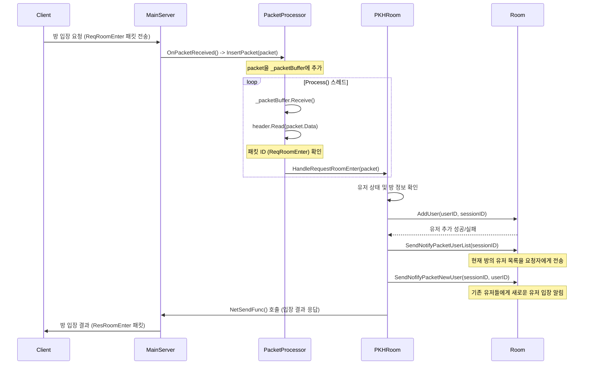

# SuperSocketLite를 이용한 C# 게임 서버 프로그래밍
    
저자: 최흥배, Gemini 2.5 Pro  
  
- .NET 8 이상, 
- C#
- Windows, Linux
- Visual Studio Code, Visual Studio 2022 이상  
--------


# Chapter.06 MemoryPack을 이용한 패킷 데이터 직렬화 

MemoryPack에 대한 설명은 아래 영상을 참고하기 바란다.
[.NET Conf 2023 x Seoul Hands-on-Lab: 데이터 직렬화](https://youtu.be/uGjrPjqGR24?si=D_zy1hauPWPIkMTR )  
  
MemoryPack을 서버에 사용한 예는 아래 코드에 있다.  
[PvPGameServer](https://github.com/jacking75/SuperSocketLite/tree/master/Tutorials/PvPGameServer)  
[PvPGameServer_Client](https://github.com/jacking75/SuperSocketLite/tree/master/Tutorials/PvPGameServer_Client)    
  

## PacketProcessor의 Process() 메서드 상세 설명
`PvPGameServer`에 있는 코드이다.  
  
`PacketProcessor` 클래스의 `Process()` 메서드는 클라이언트로부터 받은 패킷을 처리하는 핵심 로직을 담당한다. 이 메서드는 별도의 스레드에서 실행되며, 수신된 패킷을 순차적으로 처리하는 역할을 한다.

### `Process()` 메서드의 전체 흐름
`Process()` 메서드는 `_isThreadRunning` 플래그가 `true`인 동안 무한 루프를 돌며 다음과 같은 작업을 수행한다.

1.  **패킷 수신**: `_packetBuffer`에서 패킷을 하나 꺼내온다. `_packetBuffer`는 `BufferBlock<MemoryPackBinaryRequestInfo>` 타입으로, 다른 스레드(네트워크 수신 스레드)에서 전달된 패킷들이 저장되는 일종의 작업 큐(Queue)이다. `Receive()` 메서드는 버퍼가 비어있을 경우 새로운 패킷이 들어올 때까지 대기(Blocking)한다.
2.  **헤더 파싱**: 수신한 패킷(`packet.Data`)에서 헤더 정보를 읽어온다. `MemoryPackPacketHeader` 구조체의 `Read()` 메서드를 호출하여 패킷의 전체 크기, ID, 타입 등을 추출한다.
3.  **핸들러 검색 및 실행**: `_packetHandlerDict` 딕셔너리에서 패킷 ID(`header.Id`)에 해당하는 처리 함수(핸들러)가 있는지 확인한다. 만약 등록된 핸들러가 있다면, 해당 핸들러를 호출하여 패킷 처리를 위임한다.

-----

### 각 코드의 상세 설명 및 상호작용

#### 1. `PacketProcessor.Process()`

```csharp
// PvPGameServer/PacketProcessor.cs

void Process()
{
    while (_isThreadRunning)
    {
        try
        {
            // 1. _packetBuffer에서 패킷을 꺼냅니다.
            var packet = _packetBuffer.Receive();

            // 2. 패킷 헤더를 읽습니다.
            var header = new MemoryPackPacketHeader();
            header.Read(packet.Data);

            // 3. 패킷 ID에 맞는 핸들러가 있는지 확인하고 실행합니다.
            if (_packetHandlerDict.ContainsKey(header.Id))
            {
                _packetHandlerDict[header.Id](packet);
            }
        }
        catch (Exception ex)
        {
            //...
        }
    }
}
```

  - **`_packetBuffer.Receive()`**: `MainServer`의 `OnPacketReceived` 이벤트 핸들러에서 `_packetProcessor.InsertPacket(reqInfo)`를 통해 `_packetBuffer`에 저장된 패킷을 꺼내오는 부분이다. 이 버퍼 덕분에 네트워크 스레드는 패킷 수신에만 집중하고, 실제 복잡한 처리는 `PacketProcessor`의 스레드로 분리되어 서버 전체의 성능이 향상된다.
  

#### 2. `MemoryPackPacketHeader.Read()`

```csharp
// PvPGameServer/PacketData.cs

public void Read(byte[] headerData)
{
    var pos = PacketHeaderMemoryPackStartPos; // 시작 위치는 1

    TotalSize = FastBinaryRead.UInt16(headerData, pos); // 2바이트: 전체 크기
    pos += 2;

    Id = FastBinaryRead.UInt16(headerData, pos); // 2바이트: 패킷 ID
    pos += 2;

    Type = headerData[pos]; // 1바이트: 타입
    pos += 1;
}
```

  - `Process()` 메서드에서 `header.Read()`가 호출되면, 이 코드가 실행된다.
  - `packet.Data` (바이트 배열)에서 정해진 위치와 크기만큼 데이터를 읽어 `TotalSize`, `Id`, `Type` 속성을 채운다.
  - 예를 들어, `Id`는 패킷 데이터의 3번째 바이트부터 2바이트를 읽어와 `UInt16` 값으로 변환하여 저장한다. 이 `Id` 값이 어떤 종류의 요청인지를 구분하는 핵심 키가 된다.

#### 3. `_packetHandlerDict`와 핸들러 등록
`Process()` 메서드가 패킷 ID에 맞는 핸들러를 찾기 위해 사용하는 `_packetHandlerDict`는 `PacketProcessor`의 `RegistPacketHandler()` 메서드에서 초기화된다.

```csharp
// PvPGameServer/PacketProcessor.cs

void RegistPacketHandler()
{
    // ...
    _commonPacketHandler.Init(_userMgr);
    _commonPacketHandler.RegistPacketHandler(_packetHandlerDict);

    _roomPacketHandler.Init(_userMgr);
    _roomPacketHandler.SetRooomList(_roomList);
    _roomPacketHandler.RegistPacketHandler(_packetHandlerDict);
}
```

  - `PKHCommon`과 `PKHRoom` 클래스의 `RegistPacketHandler` 메서드를 호출하여 각각의 클래스가 처리할 패킷 핸들러들을 `_packetHandlerDict`에 등록헌다.

**`PKHCommon.cs` (공통 기능 핸들러 등록):**

```csharp
// PvPGameServer/PKHCommon.cs

public void RegistPacketHandler(Dictionary<int, Action<MemoryPackBinaryRequestInfo>> packetHandlerDict)
{
    // ...
    packetHandlerDict.Add((int)PacketId.ReqLogin, HandleRequestLogin);
}
```

  - `PacketId.ReqLogin`(1002) 이라는 키에 `HandleRequestLogin` 메서드를 값으로 등록한다.
  - 따라서 `Process()` 메서드가 ID가 1002인 패킷을 받으면 `PKHCommon`의 `HandleRequestLogin` 메서드를 실행하게 된다. 이 메서드는 로그인 요청을 처리하고 `UserManager`를 통해 유저를 추가하는 등의 작업을 수행한다.

**`PKHRoom.cs` (게임 룸 관련 핸들러 등록):**

```csharp
// PvPGameServer/PKHRoom.cs

public void RegistPacketHandler(Dictionary<int, Action<MemoryPackBinaryRequestInfo>> packetHandlerDict)
{
    packetHandlerDict.Add((int)PacketId.ReqRoomEnter, HandleRequestRoomEnter);
    packetHandlerDict.Add((int)PacketId.ReqRoomLeave, HandleRequestLeave);
    // ...
}
```

  - `PacketId.ReqRoomEnter`(1015) 키에 `HandleRequestRoomEnter` 메서드를 등록한다.
  - ID가 1015인 패킷이 들어오면 `PKHRoom`의 `HandleRequestRoomEnter` 메서드가 실행된다. 이 메서드는 유저가 특정 방에 입장하는 로직을 처리하며, `UserManager`에서 유저 정보를 확인하고 `Room` 클래스의 메서드를 호출하여 방에 유저를 추가한다.

-----

### Mermaid 다이어그램으로 보는 동작 흐름
아래 다이어그램은 클라이언트가 '방 입장'을 요청했을 때의 전체적인 상호작용을 보여줍니다.


  
  
  
### MemoryPack 패킷 직렬화 구조 (ASCII Art)
패킷은 크게 **헤더(Header)** 와 **바디(Body)**로 구성된다. 헤더는 고정 크기(6바이트)이며, 바디는 `MemoryPack`으로 직렬화된 실제 데이터가 들어가는 가변적인 크기를 가잔다.

아래는 `PKTReqLogin`이라는 로그인 요청 패킷을 예시로 직렬화 과정을 시각화한 것이다.

  
```
[------------------------------ 전체 패킷 (byte[]) -----------------------------]
|                                                                                |
|  +---------------------------+-----------------------------------------------+  |
|  |       헤더 (6 바이트)       |         바디 (가변 크기, N 바이트)              |  |
|  +---------------------------+-----------------------------------------------+  |
|  |                           |                                               |  |
|  | [1] |   [2]   |   [3]   |   |        [MemoryPack으로 직렬화된 데이터]         |  |
|  v   v         v         v   v                                               v  |
+----+-----------+-----------+----+------------------------------------------------+
| MP | TotalSize | PacketId  |Type|         Serialized PKTReqLogin Object          |
|Code| (2 bytes) | (2 bytes) |(1) |                                                |
+----+-----------+-----------+----+------------------------------------------------+
                                  |                                                |
                                  |  +------------------+------------------------+  |
                                  |  |   UserID(string) |   AuthToken(string)    |  |
                                  |  +------------------+------------------------+  |
                                  |                                                |
                                  +------------------------------------------------+
```

### 각 부분 설명

1.  **MP Code (MemoryPack Code, 1바이트)**

      * `PacketHeaderMemoryPackStartPos`가 1로 설정되어 있는 것으로 보아, 패킷의 가장 앞 1바이트는 `MemoryPack` 라이브러리가 사용하는 자체적인 코드나 마커가 위치하는 공간이다.

2.  **Header (헤더, 5바이트)**

      * `MemoryPackPacketHeader` 구조체에 해당하며, 패킷의 종류와 크기를 식별하는 중요한 정보를 담고 있다.
      * **TotalSize (2바이트)**: 헤더와 바디를 포함한 패킷의 전체 길이를 나타낸다. `ReceiveFilter`는 이 값을 보고 어디까지가 하나의 완전한 패킷인지 판단한다.
      * **PacketId (2바이트)**: 패킷의 종류를 구분하는 고유 ID이다. 예를 들어 `ReqLogin`은 1002, `ReqRoomEnter`는 1015와 같이 `PacketDefine.cs`에 정의되어 있다. `PacketProcessor`는 이 ID를 보고 어떤 처리 함수(Handler)를 호출할지 결정한다.
      * **Type (1바이트)**: 패킷의 추가적인 속성을 정의하기 위한 필드이다.

3.  **Body (바디, N 바이트)**

      * 실제 전송하고자 하는 데이터가 `MemoryPack` 라이브러리에 의해 직렬화되어 바이트 배열 형태로 변환된 부분이다.
      * 위 예시에서는 `PKTReqLogin` 클래스의 인스턴스가 직렬화되었다. 이 클래스는 `UserID`와 `AuthToken`이라는 두 개의 문자열 속성을 가지고 있으며, `MemoryPack`은 이 속성들을 매우 효율적이고 압축된 형태의 바이트 데이터로 변환한다. 서버는 이 바디 부분을 다시 `PKTReqLogin` 객체로 역직렬화하여 사용한다.   


## `MemoryPackPacketHeader` 클래스 상세 분석
`MemoryPackPacketHeader` 구조체는 이 서버의 네트워크 통신에서 가장 핵심적인 역할을 수행하는 부분이다. 클라이언트와 서버가 서로 데이터를 주고받을 때, "이 데이터 덩어리는 무엇이며, 길이는 얼마인가?"라는 약속(프로토콜)을 정의한다.

### 1. `MemoryPackPacketHeader`의 목적
이 구조체의 주된 목적은 수신된 바이트 스트림(Byte Stream)에서 **개별 패킷을 정확하게 식별하고 분리**해내는 것이다. TCP/IP 통신은 데이터가 물 흐르듯 연속적으로 들어오기 때문에, 어디부터 어디까지가 하나의 의미 있는 데이터 단위(패킷)인지를 구분할 명확한 규칙이 필요하다. `MemoryPackPacketHeader`가 바로 그 규칙의 역할을 한다.

모든 패킷의 맨 앞에는 이 헤더 정보가 붙어있으며, 서버는 이 헤더를 먼저 읽어 패킷의 전체 크기와 종류를 파악한 뒤, 그에 맞게 데이터를 처리한다.

-----

### 2. 멤버 변수 및 상수 상세 설명

```csharp
// PvPGameServer/PacketData.cs

public struct MemoryPackPacketHeader
{
    // [1] 상수들
    const int PacketHeaderMemoryPackStartPos = 1;
    public const int HeaderSize = 6;

    // [2] 멤버 변수들
    public UInt16 TotalSize;
    public UInt16 Id;
    public byte Type;

    // ... 메서드들 ...
}
```

#### [1] 상수 (Constants)

  * `const int PacketHeaderMemoryPackStartPos = 1;`

      * `MemoryPack` 라이브러리가 직렬화할 때, 데이터의 가장 첫 바이트에 자체적인 식별 코드를 추가할 수 있다. 이 상수는 실제 패킷 데이터(TotalSize, Id, Type)가 이 식별 코드 바로 다음, 즉 **1번 인덱스부터 시작**된다는 것을 명시하는 중요한 값이다.

  * `public const int HeaderSize = 6;`

      * 헤더의 전체 크기를 정의한다. 이 값은 `PacketHeaderMemoryPackStartPos`(1바이트)와 실제 헤더 데이터(TotalSize 2바이트 + Id 2바이트 + Type 1바이트 = 5바이트)를 더한 값인 6바이트가 된다.
      * `ReceiveFilter`와 같은 네트워크 수신 클래스는 이 `HeaderSize` 만큼의 데이터를 우선적으로 읽어들여 패킷을 해석하기 시작한다.

#### [2] 멤버 변수 (Members)

  * `public UInt16 TotalSize;`

      * \*\*패킷의 전체 크기(길이)\*\*를 나타냅니다 (헤더 + 바디).
      * 이 값은 서버가 하나의 완전한 패킷을 수신하기 위해 앞으로 몇 바이트를 더 읽어야 하는지 알려주는 가장 중요한 정보이다.

  * `public UInt16 Id;`

      * **패킷의 종류를 식별하는 고유 번호**입니다.
      * `PacketDefine.cs` 파일에 `ReqLogin = 1002`, `ReqRoomEnter = 1015` 처럼 모든 패킷의 ID가 열거형(enum)으로 정의되어 있다. `PacketProcessor`는 이 `Id`를 보고 어떤 요청인지 판단하여 적절한 처리 함수로 분기한다.

  * `public byte Type;`

      * 패킷을 추가적으로 분류하기 위한 **보조 타입 값**이다. 예를 들어, 같은 알림(Notify) 패킷이라도 긴급한 알림인지, 일반 알림인지 등을 구분하는 용도로 사용할 수 있다.

-----

### 3. 코드에서의 `MemoryPackPacketHeader` 활용 사례
`MemoryPackPacketHeader`는 패킷을 **받을 때(Parsing)** 와 **보낼 때(Constructing)** 모두 사용된다.

#### 1. 패킷을 받을 때 (Inbound) - `ReceiveFilter.cs` & `PacketProcessor.cs`
클라이언트로부터 데이터가 도착하면 `ReceiveFilter`가 가장 먼저 동작한다.

  * **`ReceiveFilter.GetBodyLengthFromHeader()`**

    ```csharp
    // PvPGameServer/ReceiveFilter.cs
    protected override int GetBodyLengthFromHeader(byte[] header, int offset, int length)
    {
        // ...
        var totalSize = BitConverter.ToUInt16(header, offset + MemoryPackBinaryRequestInfo.PacketHeaderMemorypackStartPos);
        return totalSize - MemoryPackBinaryRequestInfo.HeaderSize;
    }
    ```

      * SuperSocket 엔진은 body 사이즈를 알기 위해서 이 메서드를 호출한다.
      * `header` 바이트 배열의 `PacketHeaderMemorypackStartPos`(1번 인덱스) 위치에서 2바이트를 읽어 `totalSize`를 얻는다.
      * **`totalSize`에서 헤더 크기(`HeaderSize`)를 뺀 값**을 반환하는데, 이것이 바로 순수한 **바디(Body)의 길이**가 된다. 엔진은 이 길이만큼 데이터를 더 수신하여 하나의 완전한 패킷을 조립한다.

  * **`PacketProcessor.Process()`**

    ```csharp
    // PvPGameServer/PacketProcessor.cs
    void Process()
    {
        // ...
            var packet = _packetBuffer.Receive();

            var header = new MemoryPackPacketHeader();
            header.Read(packet.Data); // [사용 지점 1]

            if (_packetHandlerDict.ContainsKey(header.Id)) // [사용 지점 2]
            {
                _packetHandlerDict[header.Id](packet);
            }
        // ...
    }
    ```

      * `header.Read(packet.Data)`: 완성된 패킷 데이터(`packet.Data`)를 `Read` 메서드에 넘겨 `TotalSize`, `Id`, `Type` 멤버 변수를 채운다.
      * `header.Id`: 채워진 `Id` 값을 키(Key)로 사용하여 `_packetHandlerDict`에서 이 패킷을 처리할 적절한 함수(예: `HandleRequestLogin`)를 찾아 실행한다.

#### 2. 패킷을 보낼 때 (Outbound) - `PKHRoom.cs`, `InnerPakcetMaker.cs` 등
서버가 클라이언트에게 응답을 보내거나 다른 서버에 데이터를 보낼 때 `Write` 메서드를 사용한다.

  * **`MemoryPackPacketHeader.Write()`**

    ```csharp
    // PvPGameServer/PacketData.cs
    public static void Write(byte[] packetData, PacketId packetId, byte type = 0)
    {
        var pos = PacketHeaderMemoryPackStartPos;

        FastBinaryWrite.UInt16(packetData, pos, (UInt16)packetData.Length);
        pos += 2;

        FastBinaryWrite.UInt16(packetData, pos, (UInt16)packetId);
        pos += 2;

        packetData[pos] = type;
    }
    ```

      * 이 정적(static) 메서드는 `MemoryPack`으로 직렬화가 완료된 바이트 배열(`packetData`)을 받아, 헤더 정보를 직접 덮어쓴다.
      * 전체 길이(`packetData.Length`)와 패킷 ID(`packetId`)를 바이트 배열의 정해진 위치에 기록하여 완전한 형태의 패킷으로 만든다.

  * **`PKHRoom`의 응답 패킷 생성 예시**

    ```csharp
    // PvPGameServer/PKHRoom.cs
    void SendResponseEnterRoomToClient(ErrorCode errorCode, string sessionID)
    {
        var resRoomEnter = new PKTResRoomEnter() { Result = (short)errorCode };

        var sendPacket = MemoryPackSerializer.Serialize(resRoomEnter); // 1. 바디 직렬화
        MemoryPackPacketHeader.Write(sendPacket, PacketId.ResRoomEnter); // 2. 헤더 정보 쓰기
        
        NetSendFunc(sessionID, sendPacket); // 3. 전송
    }
    ```

      * `PKTResRoomEnter` 객체를 `MemoryPack`으로 직렬화하여 바디(`sendPacket`)를 만든다.
      * `MemoryPackPacketHeader.Write()`를 호출하여 이 바디 데이터의 앞부분에 `TotalSize`와 `PacketId.ResRoomEnter`를 기록한다.
      * 이제 헤더와 바디가 합쳐진 완전한 패킷이 `NetSendFunc`를 통해 클라이언트로 전송됩니다. 이 과정은 `PKHCommon`이나 `InnerPakcetMaker` 등 다른 클래스에서도 동일한 패턴으로 사용된다.  
  


## `MemoryPackBinaryRequestInfo`와 `ReceiveFilter` 클래스 상세 설명
두 클래스는 서버가 클라이언트로부터 들어오는 연속적인 바이트 데이터를 의미 있는 패킷 단위로 잘라내고(Framing), 처리할 수 있는 형태로 가공하는 핵심적인 역할을 담당한다.

### 1. `MemoryPackBinaryRequestInfo` 클래스
이 클래스는 SuperSocket 엔진이 네트워크 스트림에서 성공적으로 분리해 낸 **하나의 완전한 요청(패킷)을 표현하는 데이터 구조체**이다. `ReceiveFilter`에 의해 성공적으로 파싱된 결과물이 바로 이 클래스의 인스턴스이다.

```csharp
// PvPGameServer/ReceiveFilter.cs

/// <summary>
/// 메모리 팩으로 직렬화된 이진 요청 정보를 나타내는 클래스입니다.
/// </summary>
public class MemoryPackBinaryRequestInfo : BinaryRequestInfo
{
    /// <summary>
    /// 세션 ID를 나타냅니다.
    /// </summary>
    public string SessionID;

    /// <summary>
    /// 패킷의 헤더와 바디 전체를 나타내는 바이트 배열입니다.
    /// </summary>
    public byte[] Data;

    /// <summary>
    /// 패킷 헤더의 메모리 팩 시작 위치입니다.
    /// </summary>
    public const int PacketHeaderMemorypackStartPos = 1;

    /// <summary>
    /// 패킷 헤더의 크기입니다. 5는 실제 헤더의 크기이다
    /// </summary>
    public const int HeaderSize = 5 + PacketHeaderMemorypackStartPos;

    /// <summary>
    /// MemoryPackBinaryRequestInfo 클래스의 새 인스턴스를 초기화합니다.
    /// </summary>
    /// <param name="packetData">패킷 데이터</param>
    public MemoryPackBinaryRequestInfo(byte[] packetData)
        : base(null, packetData)
    {
        Data = packetData;
    }
}
```

#### 클래스 멤버 상세 설명

  * **`SessionID`**: 어떤 클라이언트 세션으로부터 이 요청이 왔는지 식별하는 ID 이다. 이 값은 패킷 수신 시점인 `MainServer.OnPacketReceived`에서 채워진다.
  * **`Data`**: 패킷의 **헤더(Header)와 바디(Body)가 모두 포함된 완전한 형태의 바이트 배열**이다. 이 `Data`가 `PacketProcessor`로 전달되어 최종적으로 처리된다.
  * **`PacketHeaderMemorypackStartPos`**: 실제 패킷 헤더 정보가 시작되는 위치를 나타내는 상수이다. 값이 1이므로, 바이트 배열의 0번 인덱스는 비워두고 1번 인덱스부터 `TotalSize`와 같은 헤더 정보가 기록됨을 의미한다.
  * **`HeaderSize`**: 패킷 헤더의 전체 크기를 6바이트로 정의하는 상수이다. (`PacketHeaderMemorypackStartPos` 1바이트 + 실제 헤더 데이터 5바이트).
  * **`MemoryPackBinaryRequestInfo(byte[] packetData)` (생성자)**: `ReceiveFilter`가 패킷을 성공적으로 조립했을 때 호출되는 생성자이다. 완성된 패킷 바이트 배열(`packetData`)을 받아 `Data` 멤버 변수에 저장한다.

### 2. `ReceiveFilter` 클래스
이 클래스는 SuperSocket Lite 프레임워크의 `FixedHeaderReceiveFilter`를 상속받아 구현되었다. 주된 역할은 TCP 소켓으로 들어오는 연속적인 바이트 스트림을 읽어, **미리 정의된 헤더 규칙에 따라 하나의 완전한 패킷을 분리**해내는 것이다.

```csharp
// PvPGameServer/ReceiveFilter.cs

/// <summary>
/// MemoryPackBinaryRequestInfo를 사용하는 고정 헤더 수신 필터 클래스입니다.
/// </summary>
public class ReceiveFilter : FixedHeaderReceiveFilter<MemoryPackBinaryRequestInfo>
{
    // ... 생성자와 메서드들 ...
}
```

#### 멤버 함수 및 코드 상세 설명

1.  **`public ReceiveFilter() : base(MemoryPackBinaryRequestInfo.HeaderSize)` (생성자)**

      * `ReceiveFilter`가 생성될 때 부모 클래스인 `FixedHeaderReceiveFilter`의 생성자를 호출한다.
      * `MemoryPackBinaryRequestInfo.HeaderSize`(값: 6)를 인자로 넘겨주는데, 이는 "모든 패킷의 헤더는 고정된 6바이트 크기를 가진다" 라고 SuperSocket 엔진에게 알려주는 것이다. 이 덕분에 엔진은 우선 6바이트를 수신하여 헤더 정보를 해석하기 시작한다.

2.  **`protected override int GetBodyLengthFromHeader(byte[] header, int offset, int length)`**

      * 이 메서드는 SuperSocket 엔진이 정확히 **헤더 크기(6바이트)만큼의 데이터를 수신했을 때 자동으로 호출**된다.
      * **목적**: 헤더 정보 안에서 패킷의 '전체 크기'를 읽어낸 뒤, 이를 바탕으로 '바디(Body)의 길이'가 얼마인지를 계산하여 엔진에게 알려주는 것이다.
      * **코드 설명**:
        ```csharp
        var totalSize = BitConverter.ToUInt16(header, offset + MemoryPackBinaryRequestInfo.PacketHeaderMemorypackStartPos);
        return totalSize - MemoryPackBinaryRequestInfo.HeaderSize;
        ```
          * `BitConverter.ToUInt16(...)`: 수신된 6바이트 헤더 데이터(`header`)에서 `PacketHeaderMemorypackStartPos`(1번 인덱스) 위치부터 2바이트를 읽어, 패킷의 전체 크기(`totalSize`)를 구한다.
          * `return totalSize - MemoryPackBinaryRequestInfo.HeaderSize;`: 패킷 전체 크기에서 헤더 크기(6바이트)를 빼서, 순수한 바디 데이터의 길이를 반환한다. 이제 엔진은 이 길이만큼의 바이트를 더 수신해야 하나의 완전한 패킷이 완성된다는 것을 알게 된다.

3.  **`protected override MemoryPackBinaryRequestInfo ResolveRequestInfo(ArraySegment<byte> header, byte[] readBuffer, int offset, int length)`**

      * 이 메서드는 `GetBodyLengthFromHeader`가 반환한 길이만큼의 **바디 데이터까지 모두 수신하여 완전한 패킷 하나가 준비되었을 때 호출**된다.
      * **목적**: 수신된 헤더와 바디 데이터를 합쳐 최종적인 결과물인 `MemoryPackBinaryRequestInfo` 인스턴스를 만들어 반환하는 것이다.
      * **코드 설명**:
        ```csharp
        // body 데이터가 있는 경우
        if (length > 0)
        {
            if (offset >= MemoryPackBinaryRequestInfo.HeaderSize)
            {
                // ... 헤더와 바디가 버퍼에 연속적으로 있는 경우
                var packetStartPos = offset - MemoryPackBinaryRequestInfo.HeaderSize;
                var packetSize = length + MemoryPackBinaryRequestInfo.HeaderSize;
                return new MemoryPackBinaryRequestInfo(readBuffer.CloneRange(packetStartPos, packetSize));
            }
            else
            {
                // ... 헤더와 바디가 버퍼에 나뉘어 있는 경우
                var packetData = new Byte[length + MemoryPackBinaryRequestInfo.HeaderSize];
                header.CopyTo(packetData, 0); // 헤더를 복사하고
                Array.Copy(readBuffer, offset, packetData, MemoryPackBinaryRequestInfo.HeaderSize, length); // 바디를 뒤에 붙임
                return new MemoryPackBinaryRequestInfo(packetData);
            }
        }
        // body 데이터가 없는 경우 (헤더만 있는 패킷)
        return new MemoryPackBinaryRequestInfo(header.CloneRange(header.Offset, header.Count));
        ```
          * 메서드는 네트워크 버퍼의 상태에 따라 헤더와 바디 데이터를 조합하는 여러 경우의 수를 처리한다.
          * 가장 중요한 로직은, 어떤 경우든 **헤더와 바디를 순서대로 합쳐 하나의 완전한 바이트 배열(`packetData`)을 만드는 것**이다.
          * 최종적으로 `new MemoryPackBinaryRequestInfo(packetData)`를 통해 완성된 패킷 객체를 생성하여 SuperSocket 엔진에게 반환하고, 이 객체는 `MainServer`의 `OnPacketReceived` 이벤트 핸들러로 전달된다.
  

