# SuperSocketLite를 이용한 C# 게임 서버 프로그래밍
    
저자: 최흥배, Claude AI  
  
- .NET 8 이상, 
- C#
- Windows, Linux
- Visual Studio Code, Visual Studio 2022 이상  
--------
  
# Chapter.01 시작하기
SuperSocketLite는 오픈 소스인 [SuperSocket](https://www.supersocket.net/)을 .NET Core로 포팅하면서 만들어진 라이브러리이다. 그래서 대부분의 코드는 SuperSocket과 비슷하다.   
다만 범용적인 사용을 목적으로 하는 SuperSocket과 달리 게임 서버 개발을 주 목적으로 하여 게임 서버 개발에는 불필요 하다고 생각되는 코드는 제거하여 SuperSocket에 비해 코드는 더 간단하다.  
SuperSocketLite는 핵심 코드는 SuperSocket과 동일하지만 기능을 축소시키면서 코드는 더 간단해졌다.

## SuperSocketLite 저장소
[GitHub - jacking75/SuperSocketLite: SuperSocket 1.6 버전의 .NET Core 포팅](https://github.com/jacking75/SuperSocketLite )  
    
## 아키텍처
[여기에 있는 문서](https://github.com/jacking75/SuperSocketLite/tree/master/Docs/SuperSocket-1_6-Doc)들은 기존 SuperSocket에서 가져온 문서로 주요 기능은 SuperSocketLite와 동일하므로 이 문서를 보면 된다.  
  
[https://github.com/jacking75/SuperSocketLite/tree/master/Docs](https://github.com/jacking75/SuperSocketLite/tree/master/Docs) 에 있는 SuperSocketLite_Code.xlsx 문서를 보면 주요 클래스가 어떻게 관계 되고, 호출 되는지 파악할 수 있다.  
[DeepWiki](https://deepwiki.com/jacking75/SuperSocketLite) 의 문서도 보는 것을 추천한다.
  
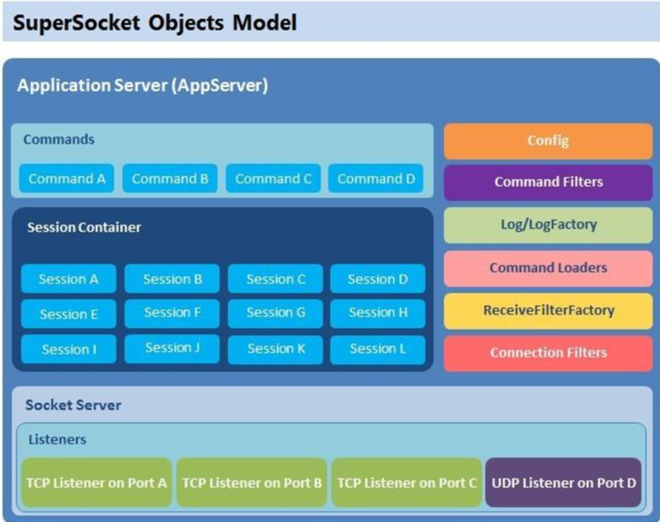   
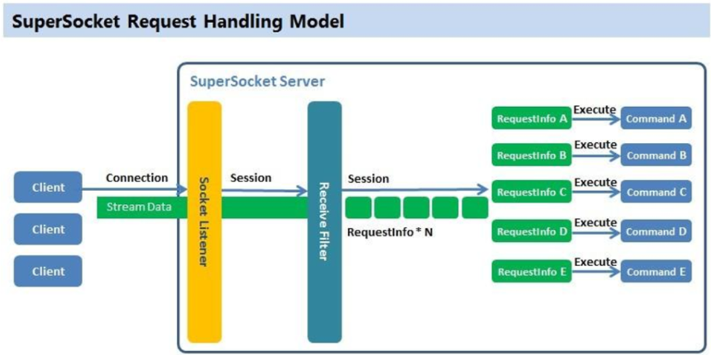   
  
이 이미지는 SuperSocket 서버의 요청 처리 모델(Request Handling Model)을 도식화한 것이다.     
주요 구성요소와 흐름을 다음과 같이 설명할 수 있다:  
  
1. 클라이언트 레벨:  
- 여러 클라이언트가 서버에 연결을 시도할 수 있음  
- Stream Data를 통해 서버와 통신
  
2. SuperSocket 서버 내부:  
- Socket Listener: 클라이언트의 연결을 수신하는 첫 번째 계층  
- Session: 클라이언트와의 연결을 관리하는 세션 계층  
- Receive Filter: 수신된 데이터를 처리하고 필터링하는 계층
  
3. 요청 처리 프로세스:  
- RequestInfo \* N: 여러 요청 정보를 처리할 수 있음  
- RequestInfo A부터 E까지 각각의 요청이 해당하는 Command로 실행됨  
- Execute: 각 RequestInfo는 대응하는 Command(A부터 E)를 실행
  
4. 이 모델의 장점:  
- 다중 클라이언트 처리 가능  
- 요청을 체계적으로 관리  
- 모듈화된 구조로 유지보수가 용이  
- 확장성이 뛰어남
  
이는 네트워크 애플리케이션에서 흔히 사용되는 서버 아키텍처로, 효율적인 클라이언트-서버 통신을 가능하게 한다.  
  
<br>    

**클라이언트 연결부터 요청 처리까지의 흐름**:
1. 클라이언트 연결 단계:  
- 여러 클라이언트가 서버에 Connection 요청  
- (연결된 이후)Stream Data를 통해 데이터 전송

2. Socket Listener 처리:  
- 서버의 첫 번째 계층인 Socket Listener가 클라이언트의 연결 요청을 수신  
- 연결이 성립되면 Session을 생성

3. Session 관리:  
- 생성된 Session이 클라이언트와의 지속적인 연결을 관리  
- Session을 통해 데이터의 송수신이 이루어짐

4. Receive Filter 처리:  
- Session을 통해 전달된 데이터는 Receive Filter로 전달  
- Receive Filter는 수신된 데이터를 적절한 RequestInfo 형태로 변환

5. RequestInfo 처리:  
- 변환된 RequestInfo는 각각의 종류에 따라 분류됨 (A, B, C, D, E 등)  
- 각 RequestInfo는 해당하는 Command로 매핑됨

6. Command 실행:  
- 각 RequestInfo에 매핑된 Command가 Execute를 통해 실행  
- Command A부터 E까지 각각의 비즈니스 로직 수행
  
이러한 흐름을 통해 클라이언트의 요청이 체계적으로 처리되며, 각 단계별로 모듈화되어 있어 유지보수와 확장이 용이다.
  

## 설명 동영상
YouTube에 내가 만든 설명 영상을 참고하면 학습에 도움이 될 것이다.    
- [YouTube 재생목록: SuperSocketLite](https://www.youtube.com/watch?v=uGjrPjqGR24&list=PLW_xyUw4fSdb9Em4r0QhgJmH1oN2ZNC90)  
- [.NET Conf 2023 x Seoul Hands-on-Lab: Echo Server](https://www.youtube.com/watch?v=TwMNbxUgMUI&list=PLW_xyUw4fSdZOtyDX5Wf5sKbFMYSH-K3o&index=7&pp=gAQBiAQB)   
- [SuperSocketLite Tutorial - Echo Server 만들기](https://youtu.be/ZgzMuHE43hU?si=G7MEbY-rlRthQLUe)  
- [SuperSocketLite Tutorial - Chat Server 만들기](https://youtu.be/eiwvQ8NV2h8?si=JGel57hb6HbNEuhY)
   
<br>  
  
## 사용 방법
1. 라이브러리 참조하기
    - 프로젝트 참조, DLL 참조, NuGet 중 하나를 선택한다.
2. SuperSocketLite의 핵식 클래스 상속 받아서 구현하기
    - AppServer를 상속 받는 클래스를 구현한다.
    - AppSession를 상속 받는 클래스를 구현한다.
    - BinaryRequestInfo, FixedHeaderReceiveFilter를 상속 받는 클래스를 구현한다.
    
    
### 라이브러리 참조하기
아래 3가지 방법 중에서 선택하면 된다.  
  
1. SuperSocketLite 프로젝트를 참조하기  
[EchoServer](https://github.com/jacking75/SuperSocketLite/tree/master/Tutorials/EchoServer)   
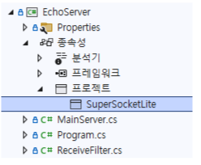   
  
EchoServer.csproj    
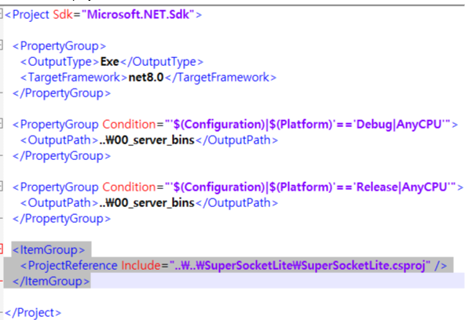   
    
  
2. 빌드된 lib 파일(DLL) 참조하기
아래 프로젝트를 참고한다.    
[EchoServerEx](https://github.com/jacking75/SuperSocketLite/tree/master/Tutorials/EchoServerEx)   
  
EchoServerEx.csproj  
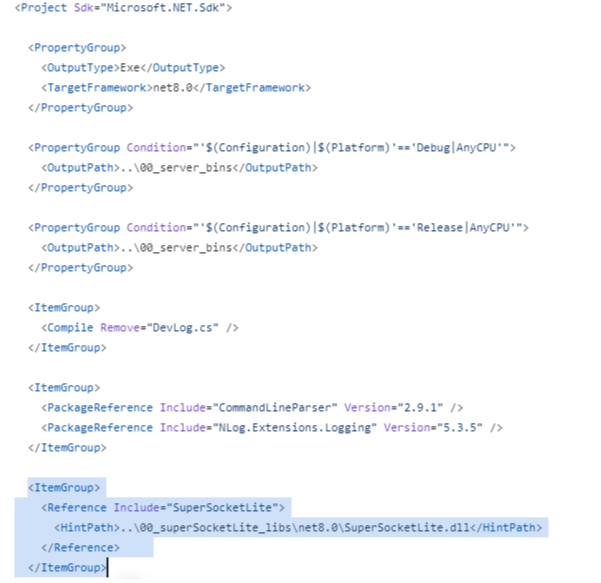   
  

3. Nuget 사용하기  
[nuget](https://www.nuget.org/packages/SuperSocketLite)  
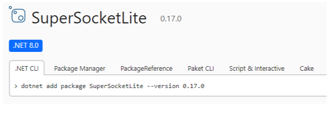     
  
  
  
### SuperSocketLite의 핵식 클래스 상속 받아서 구현하기
SuperSocketLite의 AppServer와 AppSession 클래스를 상속한 클래스를 만들어야 한다.    
- AppSession
    - 서버에 연결된 클라이언트의 네트워크 객체를 가리키는 클래스.   
    - 이 클래스를 통해 데이터 주고 받기를 한다.

- AppServer
    - 네트워크 서버 클래스. 모든 AppSession 객체를 관리한다.   
    - SuperSocket의 몸통이다.
    
#### AppServer  
아래는 AppServer를 상속하여 만든 BoardServerNet 클래스의 예이다.
**NetworkSession** 은 AppSession 클래스를 상속한 클래스이다.  
**EFBinaryRequestInfo** 은 클라이언트에서 보낸 데이터를 가지고 있는 클래스이다. 자세한 설명은 뒤에 하겠다.
```
class BoardServerNet : AppServer<NetworkSession, 
                                EFBinaryRequestInfo> 
{
}

// AppSession의 기능을 확장할 필요가 없으면 그냥 상속만 받으면 된다
public class NetworkSession : AppSession<NetworkSession, EFBinaryRequestInfo>
{
}
```  
      
    
BoardServerNet 클래스에 네트워크 이벤트(연결, 끊어짐, 데이터 수신)가 발생했을 때 호출될 함수를 등록한다.  
```
public BoardServerNet()
    : base(new DefaultReceiveFilterFactory<ReceiveFilter, EFBinaryRequestInfo>())
{
    NewSessionConnected += new SessionHandler<NetworkSession>(OnConnected);
    SessionClosed += new SessionHandler<NetworkSession, CloseReason>(OnClosed);
    NewRequestReceived += new RequestHandler<NetworkSession, EFBinaryRequestInfo>(RequestReceived);
}

// 클라이언트가 접속했을 때 호출
private void OnConnected(NetworkSession session)
{
}

// 클라이언트가 접속을 해제했을 때 호출
private void OnClosed(NetworkSession session, CloseReason reason)
{
}

// 클라이언트로부터 데이터를 수신했을 때 호출
private void RequestReceived(NetworkSession session, EFBinaryRequestInfo reqInfo)
{
}
```  
    
<br>      
  
위에서 정의한 BoardServerNet 클래스를 사용하기 위해 네트워크 옵션을 정의하고, Setup 함수에서 사용한다.  
```
void InitConfig()
{
    m_Config = new ServerConfig
    {
        Port = 23478,
        Ip = "Any",
        MaxConnectionNumber = 100,
        Mode = SocketMode.Tcp,
        Name = "BoardServerNet"
    };
}

void CreateServer()
{
      m_Server = new BoardServerNet();
      bool bResult = m_Server.Setup(new RootConfig(), 
                                    m_Config, 
                                    logFactory: new Log4NetLogFactory()
                                    );

      if (bResult == false)
      {
      }

      ......
}
```  
  

서버 네트워크 시작에는 Start() 함수를 호출하고, 중단할 때는 Stop() 함수를 호출한다.  
```
// 네트워크 시작
if (! m_Server.Start())
{
    return;
}

....
// 네트워크 중지
m_Server.Stop();
```  
    

##### 네트워크 옵션 파라미터    
루트 설정(모든 서버 네트워크에 적용)에 사용하는 파리미터 **IRootConfig**    
* maxWorkingThreads: .NET 스레드 풀의 최대 작업 스레드 수
* minWorkingThreads: .NET 스레드 풀의 최소 작업 스레드 수
* maxCompletionPortThreads: .NET 스레드 풀의 최대 완료 스레드 수
* minCompletionPortThreads: .NET 스레드 풀의 최소 완료 스레드 수
* disablePerformanceDataCollector: 성능 데이터 수집기 비활성화 여부
* performanceDataCollectInterval: 성능 데이터 수집 간격 (초 단위, 기본값: 60)
* isolation: SuperSocket 인스턴스 격리 수준
    - None - 격리 없음
    - AppDomain - 서버 인스턴스가 AppDomain으로 격리됨
    - Process - 서버 인스턴스가 프로세스로 격리됨
* logFactory: 기본 logFactory의 이름, 모든 로그 팩토리는 하위 노드인 "logFactories"에서 정의되며 이는 후속 문서에서 소개될 예정
* defaultCulture: 전역 애플리케이션의 기본 스레드 문화권, .NET 4.5에서만 사용 가능
    
  
##### 서버 인스턴스 옵션 파라미터           
IServerconfig    
* name: 서버 인스턴스의 이름
* serverType: 실행하려는 AppServer 타입의 전체 이름
* serverTypeName: 선택된 서버 타입의 이름, 모든 서버 타입은 후속 문서에서 소개될 serverTypes 노드에서 정의되어야 함
* ip: 서버 인스턴스가 수신하는 IP. 정확한 IP를 설정하거나 다음 값들을 설정할 수 있음: Any - 모든 IPv4 주소, IPv6Any - 모든 IPv6 주소
* port: 서버 인스턴스가 수신하는 포트
* listenBacklog: 수신 백로그 크기
* mode: 소켓 서버의 실행 모드, Tcp (기본값) 또는 Udp
* disabled: 서버 인스턴스 비활성화 여부
* startupOrder: 서버 인스턴스 시작 순서, 부트스트랩은 이 값에 따라 모든 서버 인스턴스를 순서대로 시작함
* sendTimeOut: 데이터 전송 시간 초과
* sendingQueueSize: 전송 큐의 최대 크기
* maxConnectionNumber: 서버 인스턴스가 동시에 허용하는 최대 연결 수
* receiveBufferSize: 수신 버퍼 크기 (세션당)
* sendBufferSize: 전송 버퍼 크기 (세션당)
* syncSend: 동기 모드로 데이터 전송, 기본값: false
* logCommand: 명령 실행 기록 로그 여부
* logBasicSessionActivity: 연결 및 종료와 같은 세션의 기본 활동 로그 여부
* clearIdleSession: 유휴 세션 정리 여부 (true 또는 false), 기본값은 false
* clearIdleSessionInterval: 유휴 세션 정리 간격 (기본값: 120초)
* idleSessionTimeOut: 세션 시간 초과 기간 (기본값: 300초)
* security: Empty, Tls, Ssl3. 소켓 서버의 보안 옵션, 기본값은 empty
* maxRequestLength: 허용되는 최대 요청 길이, 기본값은 1024
* textEncoding: 서버 인스턴스의 기본 텍스트 인코딩, 기본값은 ASCII
* defaultCulture: 이 앱서버 인스턴스의 기본 스레드 문화권, .NET 4.5에서만 사용 가능하며 격리 모델이 'None'인 경우 설정할 수 없음
* disableSessionSnapshot: 세션 스냅샷 비활성화 여부 표시, 기본값은 false (세션 수 기록)
* sessionSnapshotInterval: 세션 스냅샷 생성 간격, 기본값은 5초
* keepAliveTime: 연결 유지 간격, 기본값은 600초
* keepAliveInterval: 연결 유지 실패 후 재시도 간격, 기본값은 60초  
  

#### AppSession

##### AppSession 기능 확장
  
```
public class TelnetSession : AppSession<TelnetSession>
{
    protected override void OnSessionStarted()
    {
        this.Send("Welcome to SuperSocket Telnet Server");
    }

    protected override void HandleUnknownRequest(StringRequestInfo requestInfo)
    {
        this.Send("Unknow request");
    }

    protected override void HandleException(Exception e)
    {
        this.Send("Application error: {0}", e.Message);
    }

    protected override void OnSessionClosed(CloseReason reason)
    {
        //add you logics which will be executed after the session is closed
        base.OnSessionClosed(reason);
    }
}
```  
    

##### AppSession 다루기
데이터 보내기  
```
session.Send(data, 0, data.Length);
or
session.Send("Welcome to use SuperSocket!");
```  
  
AppServer 세션 찾기     
GetSessionByID 멤버를 사용한다.     
```
var session = appServer.GetSessionByID(sessionID);
if(session != null)
    session.Send(data, 0, data.Length);
```  
  
sessionID는 AppSession 객체를 생성할 때 GUID를 string으로 할당한다.     
UDP의 경우 UdpRequestInfo를 사용하면 GUID로 만들고, 아니면 리모트의 IP와 Port로 만든다.  
    

연결된 모든 세션에 메시지 보내기  
```
foreach(var session in appServer.GetAllSessions())
{
    session.Send(data, 0, data.Length);
}
```  
    
    
커스텀 Key로 세션들 찾기      
아래의 CompanyId 처럼 새로운 Key를 사용하여 검색이 가능하다.    
```
var sessions = appServer.GetSessions(s => s.CompanyId == companyId);
foreach(var s in sessions)
{
    s.Send(data, 0, data.Length);
}
```  
    
    
#### Custome 프로토콜 정의(binary 기반)**    
SuperSocketLite 에서는 binary 기반의 프로토콜을 정의해서 사용하는 것만을 주로 고려하고 있다.    
  
`EFBinaryRequestInfo` 클래스는 접속된 클라이언트 보낸 데이터(패킷)을 가지고 있는 클래스라고 생각하면 된다.
`ReceiveFilter` 클래스는 SuperSocketLite에게 클라이언트 보낸 데이터를 어떻게 패킷으로 만들어주는 클래스라고 생각하면 된다. 클라이언트가 보낸 패킷은 **헤더 + 보디**로 이루어졌다고 가정하고 헤더가 어느 부분이고, 보디가 어디인지를 정의해서 `EFBinaryRequestInfo` 객체를 만든다. 
  
```
/// <summary>
/// 이진 요청 정보 클래스
/// 패킷의 헤더와 보디에 해당하는 부분을 나타냅니다.
/// </summary>
public class EFBinaryRequestInfo : BinaryRequestInfo
{
    /// <summary>
    /// 전체 크기
    /// </summary>
    public Int16 TotalSize { get; private set; }

    /// <summary>
    /// 패킷 ID
    /// </summary>
    public Int16 PacketID { get; private set; }

    /// <summary>
    /// 예약(더미)값 
    /// </summary>
    public SByte Value1 { get; private set; }

    /// <summary>
    /// 헤더 크기
    /// </summary>
    public const int HeaderSize = 5;

    /// <summary>
    /// EFBinaryRequestInfo 클래스의 새 인스턴스를 초기화합니다.
    /// </summary>
    /// <param name="totalSize">전체 크기</param>
    /// <param name="packetID">패킷 ID</param>
    /// <param name="value1">값 1</param>
    /// <param name="body">바디</param>
    public EFBinaryRequestInfo(Int16 totalSize, Int16 packetID, SByte value1, byte[] body)
        : base(null, body)
    {
        this.TotalSize = totalSize;
        this.PacketID = packetID;
        this.Value1 = value1;
    }
}

/// <summary>
/// 수신 필터 클래스
/// </summary>
public class ReceiveFilter : FixedHeaderReceiveFilter<EFBinaryRequestInfo>
{
    /// <summary>
    /// ReceiveFilter 클래스의 새 인스턴스를 초기화합니다.
    /// </summary>
    public ReceiveFilter() : base(EFBinaryRequestInfo.HeaderSize)
    {
    }

    /// <summary>
    /// 헤더에서 바디 길이를 가져옵니다.
    /// </summary>
    /// <param name="header">헤더</param>
    /// <param name="offset">오프셋</param>
    /// <param name="length">길이</param>
    /// <returns>바디 길이</returns>
    protected override int GetBodyLengthFromHeader(byte[] header, int offset, int length)
    {
        if (!BitConverter.IsLittleEndian)
            Array.Reverse(header, offset, 2);

        var packetTotalSize = BitConverter.ToInt16(header, offset);
        return packetTotalSize - EFBinaryRequestInfo.HeaderSize;
    }

    /// <summary>
    /// 요청 정보를 해결합니다.
    /// </summary>
    /// <param name="header">헤더</param>
    /// <param name="buffer">바디 버퍼</param>
    /// <param name="offset">오프셋. receive 버퍼 내의 오프셋으로 패킷의 보디의 시작 지점을 가리킨다</param>
    /// <param name="length">길이. 패킷 바디의 크기</param>
    /// <returns>해결된 요청 정보</returns>
    protected override EFBinaryRequestInfo ResolveRequestInfo(ArraySegment<byte> header, byte[] buffer, int offset, int length)
    {
        if (!BitConverter.IsLittleEndian)
            Array.Reverse(header.Array, 0, EFBinaryRequestInfo.HeaderSize);

        return new EFBinaryRequestInfo(BitConverter.ToInt16(header.Array, 0),
                                       BitConverter.ToInt16(header.Array, 0 + 2),
                                       (SByte)header.Array[4],
                                       buffer.CloneRange(offset, length));
    }
}
```  
    
SuperSocketLite 라이브러리를 참고하고, 핵심 클래스를 사용하는 방법을 설명하였다. 
다음 장부터는 서버 프로그램을 만들면서 사용 방법을 배워보도록 한다.         
    
    
    
<br>  
  
# Chapter.02 에코 서버 만들기 

코드 위치:   
[SuperSocketLite Tutorials - EchoServer](https://github.com/jacking75/SuperSocketLite/tree/master/Tutorials/EchoServer)  
  
<pre>  
┌─────────────────────────────┐
│ Name                        │
├─────────────────────────────┤
│ 📁 ..                       │
├─────────────────────────────┤
│ 📁 Properties               │
├─────────────────────────────┤
│ 📄 EchoServer.csproj        │
├─────────────────────────────┤
│ 📄 EchoServer.sln           │
├─────────────────────────────┤
│ 📄 MainServer.cs            │
├─────────────────────────────┤
│ 📄 Program.cs               │
├─────────────────────────────┤
│ 📄 ReceiveFilter.cs         │
└─────────────────────────────┘  
</pre>  
  

## 클래스 다이어그램

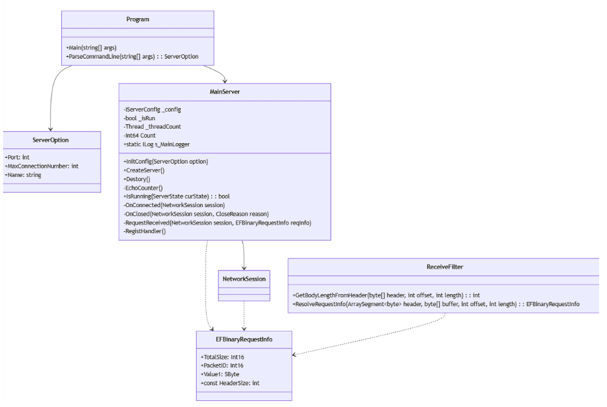

이 다이어그램은 Echo Server의 주요 클래스들과 그들 간의 관계를 보여준다:  
1. Program 클래스: 메인 진입점으로 서버를 초기화하고 실행한다.  
2. ServerOption 클래스: 서버 설정을 담당하는 클래스이다.  
3. MainServer 클래스: 실제 서버 기능을 구현하는 핵심 클래스이다.  
4. NetworkSession 클래스: 클라이언트 연결을 관리하는 세션 클래스이다.  
5. EFBinaryRequestInfo 클래스: 바이너리 패킷의 구조를 정의한다.  
6. ReceiveFilter 클래스: 수신된 데이터를 처리하는 필터 클래스이다.

화살표는 다음과 같은 관계를 나타낸다:

* 실선 화살표(-->): 의존성/소유 관계  
* 점선 화살표(..>): 사용 관계
    

## 코드 흐름을 중심으로 시퀸스 다이어그램
  
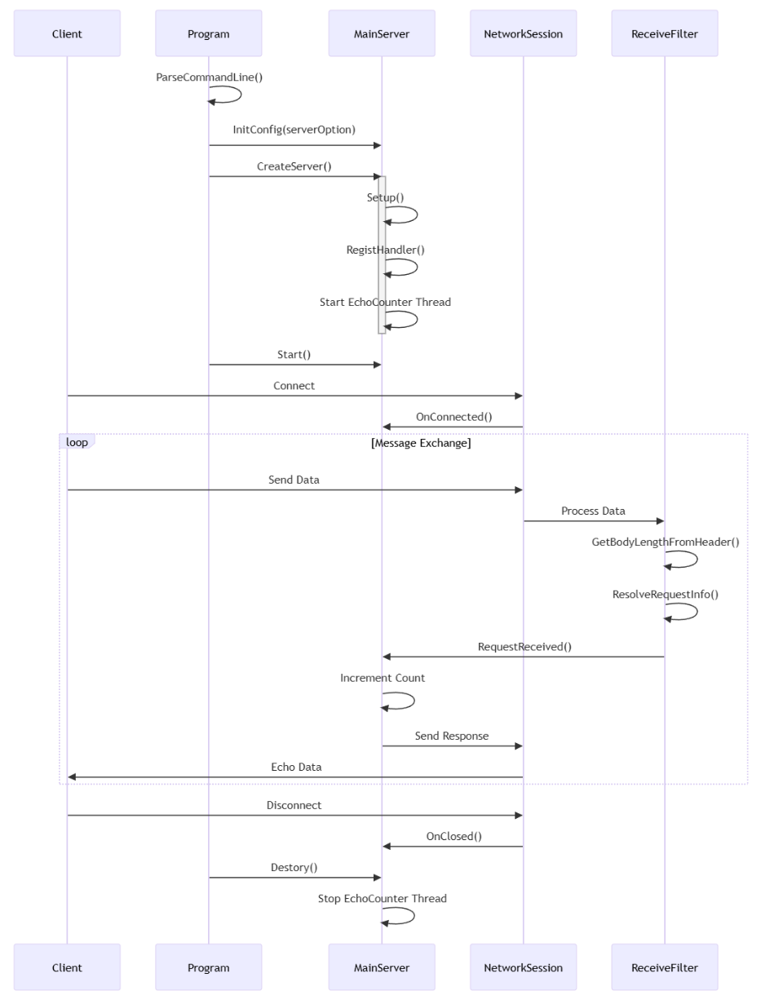  
  
이 시퀀스 다이어그램은 Echo Server의 주요 실행 흐름을 보여준다:

1. 초기화 단계
* Program이 명령줄 인수를 파싱  
* MainServer 구성 및 생성  
* EchoCounter 스레드 시작
   
2. 클라이언트 연결 단계
* 클라이언트 연결 시 OnConnected 호출
  
3. 메시지 처리 단계 (루프)
* 클라이언트로부터 데이터 수신  
* ReceiveFilter를 통한 데이터 처리  
* 패킷 분석 및 응답  
* 클라이언트로 에코 응답

4. 연결 종료 단계  
* 클라이언트 연결 해제  
* 서버 종료 및 정리
  

특징적인 부분:  
* 비동기 통신 처리  
* 패킷 기반의 데이터 처리  
* 에코 카운터를 통한 모니터링  
* 세션 기반의 클라이언트 관리
  

## MainServer 클래스를 중심으로 주요 코드 흐름 다이어그램

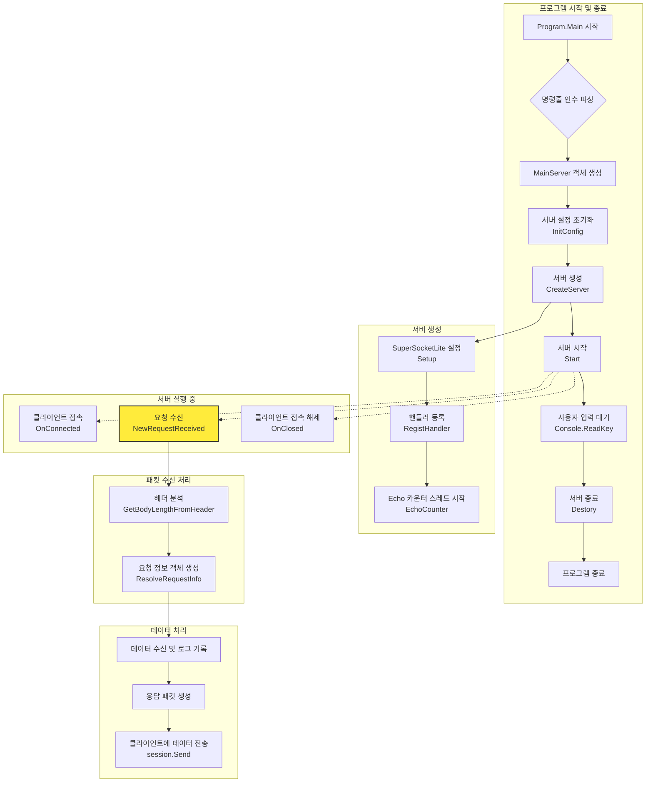
```mermaid   
graph TD
    subgraph Start ["프로그램 시작 및 종료"]
        A[Program.Main 시작] --> B{명령줄 인수 파싱}
        B --> C[MainServer 객체 생성]
        C --> D[서버 설정 초기화<br/>InitConfig]
        D --> E[서버 생성<br/>CreateServer]
        E --> F[서버 시작<br/>Start]
        F --> G[사용자 입력 대기<br/>Console.ReadKey]
        G --> H[서버 종료<br/>Destory]
        H --> I[프로그램 종료]
    end

    subgraph Create ["서버 생성"]
        E1[SuperSocketLite 설정<br/>Setup]
        E2[핸들러 등록<br/>RegistHandler]
        E3[Echo 카운터 스레드 시작<br/>EchoCounter]
    end

    subgraph Events ["서버 실행 중"]
        J[클라이언트 접속<br/>OnConnected]
        K[요청 수신<br/>NewRequestReceived]
        L[클라이언트 접속 해제<br/>OnClosed]
    end

    subgraph Process ["데이터 처리"]
        K1[데이터 수신 및 로그 기록]
        K2[응답 패킷 생성]
        K3[클라이언트에 데이터 전송<br/>session.Send]
    end

    subgraph Filter ["패킷 수신 처리"]
        RF1[헤더 분석<br/>GetBodyLengthFromHeader]
        RF2[요청 정보 객체 생성<br/>ResolveRequestInfo]
    end

    %% 연결 관계
    E --> E1
    E1 --> E2
    E2 --> E3
    
    F -.-> J
    F -.-> K
    F -.-> L
    
    K --> RF1
    RF1 --> RF2
    RF2 --> K1
    K1 --> K2
    K2 --> K3
    
    %% 스타일링
    classDef highlight fill:#ffeb3b,stroke:#333,stroke-width:2px
    class K highlight
```  
     
### 코드 흐름 설명
1.  **프로그램 시작 (`Program.cs`)**

      * 프로그램이 시작되면 `Main` 함수에서 명령줄 인수를 파싱하여 `ServerOption` 객체를 생성한다.
      * `MainServer`의 인스턴스를 만들고 `InitConfig` 메서드를 호출하여 포트, 최대 연결 수 등의 서버 설정을 초기화한다.
      * `CreateServer` 메서드를 호출하여 서버를 생성하고, `Start` 메서드로 서버를 시작하여 클라이언트의 접속을 기다리는 상태가 된다.
      * 사용자가 키를 입력하면 `Destory` 메서드를 호출하여 서버를 정상적으로 종료한다.

2.  **서버 생성 (`MainServer.cs - CreateServer`)**

      * `Setup` 메서드를 호출하여 SuperSocketLite 프레임워크에 필요한 기본 설정을 구성한다.
      * `RegistHandler` 메서드를 호출하여 패킷을 처리할 핸들러들을 등록한다 (주석에 따르면 EchoServer 예제에서는 별도의 핸들러를 등록하지 않는다).
      * `EchoCounter` 메서드를 별도의 스레드로 실행하여 주기적으로 Echo 횟수를 카운트한다.(디버그 용도이다)

3.  **이벤트 기반 동작 (`MainServer.cs`)**

      * **`OnConnected`**: 새로운 클라이언트가 접속하면 호출되어 세션 번호를 로그로 남긴다.
      * **`OnClosed`**: 클라이언트 접속이 끊어지면 호출되어 접속 해제 사유를 로그로 남긴다.
      * **`NewRequestReceived`**: 클라이언트로부터 데이터를 받으면 호출된다. 이것이 Echo 기능의 핵심이다.

4.  **데이터 수신 및 응답 (`MainServer.cs - RequestReceived`)**

      * 클라이언트로부터 `EFBinaryRequestInfo` 형태로 패킷을 받는다.
      * 수신된 데이터의 크기를 로그로 기록한다.
      * `Interlocked.Increment`를 사용하여 스레드에 안전하게 Echo 카운트를 1 증가시킨다.
      * 수신된 패킷의 Body 데이터를 그대로 사용하여 응답 패킷을 다시 생성한다.
      * `session.Send`를 통해 데이터를 보냈던 클라이언트에게 그대로 다시 전송한다 (Echo).

5.  **패킷 수신 처리 (`ReceiveFilter.cs`)**

      * 클라이언트로부터 TCP 스트림 데이터가 들어오면 `ReceiveFilter`가 동작한다.
      * `GetBodyLengthFromHeader` 메서드는 가장 먼저 호출되어, 고정 크기(5바이트)의 헤더를 읽어와 앞으로 수신해야 할 데이터(Body)의 길이를 계산한다.
      * Body 데이터까지 모두 수신되면 `ResolveRequestInfo` 메서드가 호출되어, 헤더와 Body 데이터를 `EFBinaryRequestInfo` 객체 하나로 완전하게 조립한다. 이 객체가 `NewRequestReceived` 이벤트 핸들러로 전달된다. 
         

EchoServer를 만드는 방법을 설명 하겠다.
  
## 프로젝트 설정
1. 새로운 C# 콘솔 애플리케이션 프로젝트를 생성한다.    
2. SuperSocketLite 라이브러리 프로젝트를 참조로 추가한다.
  
EchoServer.csproj    
```
<Project Sdk="Microsoft.NET.Sdk">

  <PropertyGroup>
    <OutputType>Exe</OutputType>
    <TargetFramework>net9.0</TargetFramework>
  </PropertyGroup>

  <PropertyGroup Condition="'$(Configuration)|$(Platform)'=='Debug|AnyCPU'">
    <OutputPath>..\00_server_bins</OutputPath>
  </PropertyGroup>

  <PropertyGroup Condition="'$(Configuration)|$(Platform)'=='Release|AnyCPU'">
    <OutputPath>..\00_server_bins</OutputPath>
  </PropertyGroup>

  <ItemGroup>
    <ProjectReference Include="..\..\SuperSocketLite\SuperSocketLite.csproj" />
  </ItemGroup>

</Project>
```
    
  
## MainServer 클래스  
`MainServer` 클래스는 `EchoServer`의 핵심 로직을 담당하는 메인 서버 클래스이다. SuperSocketLite 라이브러리의 `AppServer`를 상속받아 구현되었으며, 클라이언트의 연결, 데이터 수신 및 연결 종료와 같은 핵심 이벤트를 처리한다.

### 주요 특징 및 구조
* **상속 구조**: `MainServer`는 `AppServer<NetworkSession, EFBinaryRequestInfo>`를 상속받는다.
    * `AppServer`: SuperSocketLite 프레임워크에서 제공하는 서버의 기본 기능을 담고 있는 추상 클래스이다.
    * `NetworkSession`: 클라이언트 한 명과의 연결을 나타내는 세션 클래스이다. `AppSession<NetworkSession, EFBinaryRequestInfo>`을 상속한다.
    * `EFBinaryRequestInfo`: 클라이언트로부터 수신한 데이터를 파싱하여 담는 요청 정보 클래스이다. 패킷의 헤더와 바디 정보를 포함한다.

* **주요 멤버 변수**
    * `s_MainLogger`: 서버의 동작 상태를 기록하기 위한 정적(static) 로거(Logger) 인스턴스이다.
    * `_config`: 포트, IP, 최대 연결 수 등 서버의 설정 정보를 담는 `IServerConfig` 타입의 변수이다.
    * `_isRun`: `EchoCounter` 스레드의 실행 여부를 제어하는 `bool` 타입의 플래그이다.
    * `_threadCount`: 1초마다 수신된 패킷 수를 카운트하는 `EchoCounter` 메서드를 실행하는 스레드 객체이다.
  

### 핵심 메서드 흐름

#### 1. 생성자 (`MainServer()`)
`MainServer` 객체가 처음 생성될 때 호출된다. 여기서는 서버의 주요 이벤트 핸들러를 등록한다.
  
```
public MainServer()
        : base(new DefaultReceiveFilterFactory<ReceiveFilter, EFBinaryRequestInfo>())
{
    NewSessionConnected += new SessionHandler<NetworkSession>(OnConnected);
    SessionClosed += new SessionHandler<NetworkSession, CloseReason>(OnClosed);
    NewRequestReceived += new RequestHandler<NetworkSession, EFBinaryRequestInfo>(RequestReceived);
}
```  
  
* `NewSessionConnected`: 새로운 클라이언트가 접속했을 때 `OnConnected` 메서드를 호출한다.
* `SessionClosed`: 클라이언트 접속이 종료되었을 때 `OnClosed` 메서드를 호출한다.
* `NewRequestReceived`: 클라이언트로부터 새로운 데이터를 수신했을 때 `RequestReceived` 메서드를 호출한다.
  

#### 2. 서버 설정 (`InitConfig(ServerOption option)`)
`Program.cs`에서 파싱한 명령줄 인수를(`ServerOption`) 받아 서버의 구체적인 설정을 초기화한다.
  
```
public void InitConfig(ServerOption option)
{
    _config = new ServerConfig
    {
        Port = option.Port,
        Ip = "Any",
        MaxConnectionNumber = option.MaxConnectionNumber,
        Mode = SocketMode.Tcp,
        Name = option.Name
    };
}
```    
    
* `ServerConfig` 객체를 생성하여 포트(`Port`), IP(`Ip`), 최대 연결 수(`MaxConnectionNumber`), 소켓 모드(`Mode`), 서버 이름(`Name`) 등을 설정한다.
  

#### 3. 서버 생성 (`CreateServer()`)
실질적인 서버 객체를 생성하고 실행 준비를 마치는 단계이다.
  
```
public void CreateServer()
{
    try
    {
        bool isResult = Setup(new RootConfig(), _config, logFactory: new ConsoleLogFactory());

        if (isResult == false)
        {
            Console.WriteLine("[ERROR] 서버 네트워크 설정 실패 ㅠㅠ");
            return;
        }

        s_MainLogger = base.Logger;

        RegistHandler();

        _isRun = true;
        _threadCount = new Thread(EchoCounter);
        _threadCount.Start();

        s_MainLogger.Info($"[{DateTime.Now}] 서버 생성 성공");
    }
    catch (Exception ex)
    {
        s_MainLogger.Error($"서버 생성 실패: {ex.ToString()}");
    }
}
```  
    
1.  `Setup()`: `InitConfig`에서 설정한 `_config` 정보를 바탕으로 SuperSocketLite 프레임워크에 서버를 설정(Setup)한다. 실패 시 에러 메시지를 출력한다.
2.  `s_MainLogger = base.Logger;`: 프레임워크가 생성한 로거를 `s_MainLogger`에 할당하여 서버 전역에서 사용할 수 있게 한다.
3.  `RegistHandler()`: 패킷 ID에 따라 로직을 처리할 핸들러를 등록하는 메서드를 호출한다. (현재 EchoServer 예제에서는 주석 처리되어 있어 실제 등록하는 핸들러는 없다).
4.  `_threadCount.Start()`: 1초마다 수신된 패킷 수를 콘솔에 출력하는 `EchoCounter` 스레드를 시작한다.
  
  
#### 4. 서버 종료 (`Destory()`)
`Program.cs`에서 종료 신호를 받으면 호출되어 서버를 안전하게 종료한다.    
```
public void Destory()
{
    base.Stop();

    _isRun = false;
    _threadCount.Join();
}
```  
  
* `base.Stop()`: SuperSocketLite의 `Stop` 메서드를 호출하여 모든 클라이언트 세션을 닫고 리소스를 해제한다.
* `_isRun = false;`: `EchoCounter` 스레드의 `while` 루프를 중단시킨다.
* `_threadCount.Join()`: `EchoCounter` 스레드가 완전히 종료될 때까지 대기한다.
  

### 이벤트 핸들러 (핵심 로직)

#### `OnConnected(NetworkSession session)`
새로운 클라이언트가 서버에 접속할 때마다 실행된다. 접속한 클라이언트의 세션 ID와 현재 스레드 ID를 디버그 로그로 기록한다.   
```
private void OnConnected(NetworkSession session)
{
    s_MainLogger.Debug($"[{DateTime.Now}] 세션 번호 {session.SessionID} 접속 start, ThreadId: {System.Threading.Thread.CurrentThread.ManagedThreadId}"); 
}
```  
  
#### `OnClosed(NetworkSession session, CloseReason reason)`
클라이언트의 접속이 끊어졌을 때 실행된다. 접속이 끊어진 세션 ID와 그 이유(`CloseReason`)를 정보 로그로 기록한다.   
```
private void OnClosed(NetworkSession session, CloseReason reason)
{
    s_MainLogger.Info($"[{DateTime.Now}] 세션 번호 {session.SessionID},  접속해제: {reason.ToString()}");
}
```  
  
#### `RequestReceived(NetworkSession session, EFBinaryRequestInfo reqInfo)`
**EchoServer의 가장 핵심적인 부분**으로, 클라이언트로부터 데이터를 수신했을 때 실행된다.  
```
private void RequestReceived(NetworkSession session, EFBinaryRequestInfo reqInfo)
{
    s_MainLogger.Debug($"[{DateTime.Now}] 세션 번호 {session.SessionID},  받은 데이터 크기: {reqInfo.Body.Length}, ThreadId: {System.Threading.Thread.CurrentThread.ManagedThreadId}");

    Interlocked.Increment(ref Count);


    var totalSize = (Int16)(reqInfo.Body.Length + EFBinaryRequestInfo.HeaderSize);

    List<byte> dataSource =
    [
        .. BitConverter.GetBytes(totalSize),
        .. BitConverter.GetBytes((Int16)reqInfo.PacketID),
        .. new byte[1],
        .. reqInfo.Body,
    ];

    session.Send(dataSource.ToArray(), 0, dataSource.Count);
}
```  
    
1.  수신된 데이터의 크기(`reqInfo.Body.Length`)와 세션 ID를 로그로 기록한다.
2.  `Interlocked.Increment(ref Count)`: 멀티스레드 환경에서 안전하게 `Count` 변수(초당 패킷 수)를 1 증가시킨다.
3.  수신된 데이터(`reqInfo`)를 그대로 클라이언트에게 돌려주기 위해 응답 패킷을 생성한다.
    * 전체 크기(헤더 + 바디), 패킷 ID, 그리고 실제 데이터(Body)를 `List<byte>`에 조합한다.
    * 헤더 구성은 `EFBinaryRequestInfo` 클래스의 정의와 일치한다.
4.  `session.Send(...)`: 생성된 응답 패킷을 데이터를 보냈던 바로 그 클라이언트(`session`)에게 다시 전송합니다. 이것이 "Echo(메아리)" 기능이다.
      
  

## NetworkSession 클래스 정의   
파일: MainServer.cs      
```
public class NetworkSession : AppSession<NetworkSession, EFBinaryRequestInfo>
{
}
```  

  
## ReceiveFilter 및 EFBinaryRequestInfo 클래스 구현
파일: ReceiveFilter.cs    
  
### EFBinaryRequestInfo 클래스
`EFBinaryRequestInfo` 클래스는 클라이언트로부터 수신한 하나의 완전한 데이터 패킷을 표현하는 데이터 구조 클래스다. TCP/IP 통신으로 들어온 바이트 배열 데이터를 서버가 논리적으로 처리할 수 있는 의미 있는 단위로 정의한 것이다. 이 클래스는 SuperSocketLite의 `BinaryRequestInfo`를 상속받아 구현됐다.

* **주요 속성(Properties)**
    * `TotalSize`: 패킷의 전체 크기(헤더 + 바디)를 나타낸다.
    * `PacketID`: 수신된 패킷의 고유 ID를 나타낸다. 이를 통해 서버는 어떤 종류의 요청인지 구분할 수 있다.
    * `Value1`: 현재 코드에서는 특별한 용도 없이 예약된 1바이트 공간이다.
    * `Body`: `BinaryRequestInfo`로부터 상속받은 속성이며, 헤더를 제외한 실제 데이터(페이로드)를 담는 바이트 배열이다.

* **주요 상수(Constant)**
    * `HeaderSize`: 패킷 헤더의 크기가 5바이트로 고정되어 있음을 정의한다. 헤더는 `TotalSize`(2바이트), `PacketID`(2바이트), `Value1`(1바이트)로 구성된다.

* **생성자**
    * `EFBinaryRequestInfo`의 생성자는 패킷의 전체 크기, ID, 예약 값, 그리고 바디 데이터를 인자로 받아 객체의 각 속성을 초기화하는 역할을 한다. `ResolveRequestInfo` 메서드에서 최종적으로 파싱된 데이터를 사용하여 이 생성자를 호출한다.
  
```
/// <summary>
/// 이진 요청 정보 클래스
/// 패킷의 헤더와 보디에 해당하는 부분을 나타냅니다.
/// </summary>
public class EFBinaryRequestInfo : BinaryRequestInfo
{
    /// 전체 크기
    public Int16 TotalSize { get; private set; }

    /// 패킷 ID
    public Int16 PacketID { get; private set; }

    /// 예약(더미)값 
    public SByte Value1 { get; private set; }

    /// 헤더 크기
    public const int HeaderSize = 5;

    /// <summary>
    /// EFBinaryRequestInfo 클래스의 새 인스턴스를 초기화합니다.
    /// </summary>
    /// <param name="totalSize">전체 크기</param>
    /// <param name="packetID">패킷 ID</param>
    /// <param name="value1">값 1</param>
    /// <param name="body">바디</param>
    public EFBinaryRequestInfo(Int16 totalSize, Int16 packetID, SByte value1, byte[] body)
        : base(null, body)
    {
        this.TotalSize = totalSize;
        this.PacketID = packetID;
        this.Value1 = value1;
    }
}
```  
  
### ReceiveFilter 클래스
`ReceiveFilter` 클래스는 서버가 클라이언트로부터 받은 연속적인 바이트 스트림(Stream)을 분석하여 논리적인 패킷 단위인 `EFBinaryRequestInfo` 객체로 만들어주는 역할을 하는 클래스다. TCP는 경계가 없는 스트림 기반 프로토콜이므로, 어디까지가 하나의 패킷인지를 개발자가 직접 정의하고 구분해야 하며, 이 필터가 바로 그 역할을 수행한다. 이 클래스는 SuperSocketLite에서 제공하는 `FixedHeaderReceiveFilter<EFBinaryRequestInfo>`를 상속받는다. 이는 정해진 크기의 헤더를 먼저 수신하고, 그 헤더 안에 전체 패킷의 크기 정보가 들어있는 프로토콜을 쉽게 구현하도록 도와준다.

* **`GetBodyLengthFromHeader` 메서드**
    * 이 메서드는 고정된 크기(5바이트)의 헤더를 성공적으로 수신했을 때 가장 먼저 호출된다.
    * 수신된 헤더 데이터(`header`)에서 패킷의 전체 크기(`packetTotalSize`)를 읽어온다.
    * 읽어온 전체 크기에서 헤더의 크기(`HeaderSize`)를 빼서 앞으로 더 수신해야 할 바디(Body) 데이터의 길이를 계산하고 반환한다. 프레임워크는 이 메서드가 반환한 길이만큼의 바디 데이터를 추가로 수신한다.

* **`ResolveRequestInfo` 메서드**
    * `GetBodyLengthFromHeader`에서 계산된 길이의 바디 데이터까지 모두 성공적으로 수신하면 이 메서드가 호출된다.
    * 완전히 수신된 헤더(`header`)와 바디(`buffer`) 데이터를 사용하여 `new EFBinaryRequestInfo(...)` 생성자를 호출함으로써 하나의 완전한 요청 정보 객체를 생성한다.
    * 여기서 생성된 `EFBinaryRequestInfo` 객체는 `MainServer`의 `NewRequestReceived` 이벤트 핸들러에 인자로 전달되어 최종적으로 서버의 비즈니스 로직을 처리하게 된다.
    * `BitConverter.IsLittleEndian`을 확인하는 코드는 다른 바이트 순서(엔디언)를 사용하는 시스템 간의 통신 호환성을 보장하기 위한 것이다.
  
```
public class ReceiveFilter : FixedHeaderReceiveFilter<EFBinaryRequestInfo>
{
    /// ReceiveFilter 클래스의 새 인스턴스를 초기화합니다.
    public ReceiveFilter() : base(EFBinaryRequestInfo.HeaderSize)
    {
    }

    /// <summary>
    /// 헤더에서 바디 길이를 가져옵니다.
    /// </summary>
    /// <param name="header">헤더</param>
    /// <param name="offset">오프셋</param>
    /// <param name="length">길이</param>
    /// <returns>바디 길이</returns>
    protected override int GetBodyLengthFromHeader(byte[] header, int offset, int length)
    {
        if (!BitConverter.IsLittleEndian)
            Array.Reverse(header, offset, 2);

        var packetTotalSize = BitConverter.ToInt16(header, offset);
        return packetTotalSize - EFBinaryRequestInfo.HeaderSize;
    }

    /// <summary>
    /// 요청 정보를 해결합니다.
    /// </summary>
    /// <param name="header">헤더</param>
    /// <param name="buffer">바디 버퍼</param>
    /// <param name="offset">오프셋. receive 버퍼 내의 오프셋으로 패킷의 보디의 시작 지점을 가리킨다</param>
    /// <param name="length">길이. 패킷 바디의 크기</param>
    /// <returns>해결된 요청 정보</returns>
    protected override EFBinaryRequestInfo ResolveRequestInfo(ArraySegment<byte> header, byte[] buffer, int offset, int length)
    {
        if (!BitConverter.IsLittleEndian)
            Array.Reverse(header.Array, 0, EFBinaryRequestInfo.HeaderSize);

        return new EFBinaryRequestInfo(BitConverter.ToInt16(header.Array, 0),
                                       BitConverter.ToInt16(header.Array, 0 + 2),
                                       (SByte)header.Array[4],
                                       buffer.CloneRange(offset, length));
    }
}
```    
  
  
## void Main에서 서버 실행
파일: Program.cs      
```
class Program
{
    static void Main(string[] args)
    {
        Console.WriteLine("Hello SuperSocketLite");

        var serverOption = new ServerOption
        {
            Port = 32452,
            MaxConnectionNumber = 32,
            Name = "EchoServer"
        };

        // 서버를 생성하고 초기화한다.
        var server = new MainServer();
        server.InitConfig(serverOption);
        server.CreateServer();

        // 서버를 시작한다.
        var IsResult = server.Start();

        if (IsResult)
        {
            MainServer.s_MainLogger.Info("서버 네트워크 시작");
        }
        else
        {
            Console.WriteLine("서버 네트워크 시작 실패");
            return;
        }
                    

        Console.WriteLine("key를 누르면 종료한다....");
        Console.ReadKey();

        server.Destory();
     }
}
```   
      
    
## 주요 포인트
* SuperSocketLite의 AppServer를 상속받아 MainServer 클래스를 구현한다.  
* NetworkSession은 클라이언트 연결을 나타낸다.  
* ReceiveFilter는 네트워크로 받은 데이터를 우리가 정의한 패킷 구조 맞게 파싱하는 역할을 한다.  
* EFBinaryRequestInfo는 파싱된 데이터를 담는다.  
* OnRequestReceived 메서드에서 실제 에코 로직을 구현한다.
  

이 예제를 기반으로 필요에 따라 더 복잡한 기능을 추가할 수 있다.  

EchoServer를 테스트 할 때는 아래 클라이언트를 사용한다  
[SuperSocketLite Tutorials - EchoClient](https://github.com/jacking75/SuperSocketLite/tree/master/Tutorials/EchoClient)    
WinForm으로 만든 클라이언트로 Windows 에서만 사용할 수 있다.  
  
  
  
## 참고 
  
### SuperSocketLite를 사용한 서버 프로그램의 흐름 
SuperSocketLite를 사용한 게임 서버는 대략 아래와 같은 흐름으로 처리가 되니 이 다이얼그램을 꼭 기억하는 것이 좋다.  
  

### TCP는 경계가 없는 스트림 기반 프로토콜  
  
#### 개념 설명
TCP는 메시지의 경계를 보존하지 않는 스트림 기반 프로토콜입니다. 애플리케이션에서 여러 개의 개별 메시지를 보내더라도, TCP는 이를 하나의 연속된 바이트 스트림으로 처리합니다.

#### 시각적 설명

```
애플리케이션이 보내는 데이터:
┌─────────┐ ┌───────────┐ ┌──────┐ ┌─────────────┐
│Message 1│ │Message 2  │ │Msg 3 │ │Message 4    │
└─────────┘ └───────────┘ └──────┘ └─────────────┘
                          │
                          ▼
TCP 스트림 (경계 없음):
┌──────────────────────────────────────────────────┐
│Message1Message2Msg3Message4                      │
└──────────────────────────────────────────────────┘
                          │
                          ▼
네트워크로 전송되는 패킷들:
┌─────────────────┐ ┌─────────────────┐ ┌─────────────────┐
│Packet 1:        │ │Packet 2:        │ │Packet 3:        │
│Message1Me...    │ │...ssage2Msg3... │ │...Message4      │
└─────────────────┘ └─────────────────┘ └─────────────────┘
                          │
                          ▼
수신측에서 받는 데이터:
┌──────────────────────────────────────────────────┐
│Message1Message2Msg3Message4                      │
└──────────────────────────────────────────────────┘
```

#### 문제점

- **원래 메시지의 경계를 알 수 없음**: 수신측에서는 어디서 한 메시지가 끝나고 다른 메시지가 시작되는지 모름
- **애플리케이션이 직접 메시지 구분을 처리해야 함**: TCP는 단순히 바이트만 전달
- **길이 정보나 구분자를 사용해서 파싱 필요**: 프로토콜 설계 시 고려사항

#### 게임 서버 개발에서의 실제 예시

##### 잘못된 예 (TCP에서 이렇게 하면 안 됨)
```csharp
// 개별 메시지를 따로 보냄
socket.Send(Encoding.UTF8.GetBytes("LOGIN:user123"));
socket.Send(Encoding.UTF8.GetBytes("MOVE:100,200"));

// 받는 쪽에서는 "LOGIN:user123MOVE:100,200"로 받을 수 있음
// 메시지 경계를 구분할 수 없음!
```

##### 올바른 예 1: 길이 헤더 사용
```csharp
public void SendMessage(string message)
{
    byte[] messageBytes = Encoding.UTF8.GetBytes(message);
    byte[] lengthBytes = BitConverter.GetBytes(messageBytes.Length);
    
    // 먼저 메시지 길이를 보냄 (4바이트)
    socket.Send(lengthBytes);
    // 그 다음 실제 메시지를 보냄
    socket.Send(messageBytes);
}

public string ReceiveMessage()
{
    // 먼저 길이를 읽음
    byte[] lengthBytes = new byte[4];
    socket.Receive(lengthBytes, 4, SocketFlags.None);
    int messageLength = BitConverter.ToInt32(lengthBytes, 0);
    
    // 길이만큼 메시지를 읽음
    byte[] messageBytes = new byte[messageLength];
    socket.Receive(messageBytes, messageLength, SocketFlags.None);
    
    return Encoding.UTF8.GetString(messageBytes);
}
```

##### 올바른 예 2: 구분자 사용
```csharp
public void SendMessage(string message)
{
    string messageWithDelimiter = message + "\n"; // 개행문자를 구분자로 사용
    byte[] messageBytes = Encoding.UTF8.GetBytes(messageWithDelimiter);
    socket.Send(messageBytes);
}

public string ReceiveMessage()
{
    StringBuilder buffer = new StringBuilder();
    byte[] tempBuffer = new byte[1];
    
    while (true)
    {
        socket.Receive(tempBuffer, 1, SocketFlags.None);
        char receivedChar = Encoding.UTF8.GetString(tempBuffer)[0];
        
        if (receivedChar == '\n') // 구분자를 만나면 메시지 완성
            break;
            
        buffer.Append(receivedChar);
    }
    
    return buffer.ToString();
}
```

#### UDP와의 차이점

| 특성 | TCP | UDP |
|------|-----|-----|
| 메시지 경계 | 없음 (스트림) | 있음 (데이터그램) |
| 신뢰성 | 보장됨 | 보장되지 않음 |
| 순서 | 보장됨 | 보장되지 않음 |
| 패킷 분할 | 투명하게 처리 | 애플리케이션이 처리 |

#### 결론
TCP를 사용할 때는 반드시 **메시지 프레이밍(Message Framing)** 기법을 사용해야 합니다. 게임 서버에서는 보통 다음 중 하나를 선택합니다:

1. **고정 길이 헤더**: 메시지 앞에 길이 정보 포함
2. **구분자**: 특정 문자나 바이트 시퀀스로 메시지 구분
3. **고정 길이 메시지**: 모든 메시지가 같은 크기
4. **프로토콜 버퍼나 JSON**: 자체적으로 경계를 정의하는 형식 사용

이렇게 해야 네트워크 게임에서 안정적인 통신이 가능합니다.


<br>  
     

# Chapter.03 채팅 서버
채팅 서버는 복수개의 방이 있고, 방 안에서 채팅을 한다.

코드는 아래에 있다.  
[SuperSocketLite Tutorials - ChatServer](https://github.com/jacking75/SuperSocketLite/tree/master/Tutorials/ChatServer)  

<pre> 
ChatServer/
├── Properties/
├── .editorconfig
├── ChatServer.csproj
├── ChatServer.sln
├── ChatServerOption.cs
├── MainServer.cs
├── NLog.config
├── NLogLog.cs
├── NLogLogFactory.cs
├── PKHCommon.cs
├── PKHRoom.cs
├── PKHandler.cs
├── PacketData.cs
├── PacketDefine.cs
├── PacketProcessor.cs
├── Program.cs
├── ReceiveFilter.cs
├── Room.cs
├── RoomManager.cs
├── ServerPacketData.cs
└── UserManager.cs 
</pre>  
  

## 클래스 다이어그램
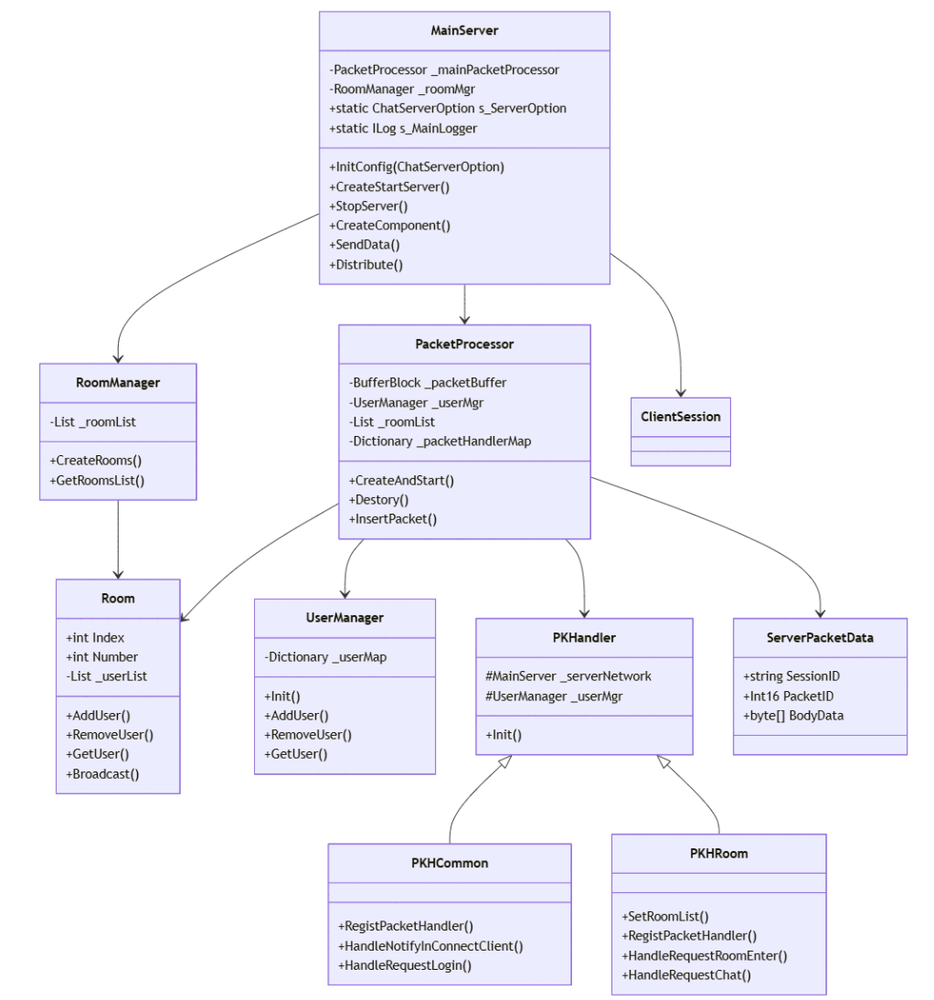    
  
이 클래스 다이어그램은 채팅 서버의 주요 클래스들과 그들 간의 관계를 보여준다.  
1. MainServer: 서버의 핵심 클래스로 전체적인 서버 운영을 관리한다.  
2. PacketProcessor: 패킷 처리를 담당하는 클래스이다.  
3. RoomManager: 채팅방들을 관리하는 클래스이다.  
4. UserManager: 사용자들을 관리하는 클래스이다.  
5. PKHandler와 그 하위 클래스들(PKHCommon, PKHRoom): 각각의 패킷 타입별 처리를 담당한다.
  
주요 관계:  
* MainServer가 PacketProcessor와 RoomManager를 포함한다.  
* PacketProcessor는 UserManager와 Room들을 관리한다.  
* PKHandler를 상속받은 PKHCommon과 PKHRoom이 각각의 패킷 처리를 담당한다.
  

## 코드 흐름을 중심으로 시퀸스 다이어그램
  
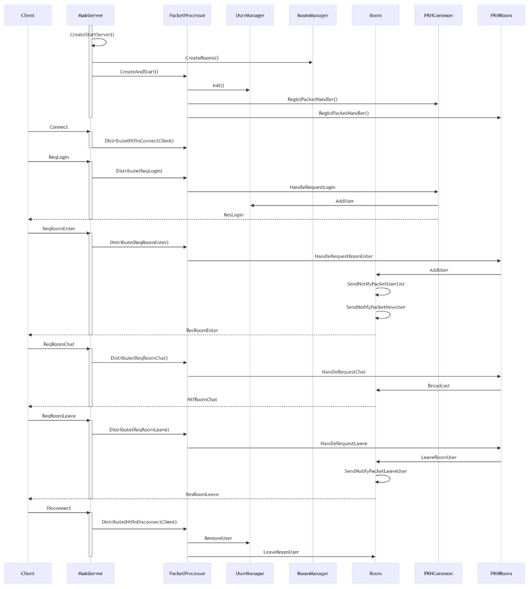     
    
이 시퀀스 다이어그램은 채팅 서버의 주요 프로세스 흐름을 보여준다:  

1. 서버 초기화    
- MainServer 시작   
- 룸 매니저 초기화  
- 패킷 프로세서 초기화  
- 패킷 핸들러 등록
  
2. 클라이언트 접속 및 로그인    
- 클라이언트 연결  
- 로그인 요청/응답  
- 유저 매니저에 사용자 추가
  
3. 채팅방 관련 처리    
- 방 입장  
- 채팅 메시지 처리  
- 방 퇴장  
  
4. 접속 종료    
- 클라이언트 연결 해제  
- 유저 정보 정리  
- 방 정보 정리
  

주요 특징:  
* 모든 패킷은 MainServer를 통해 PacketProcessor로 전달됨  
* PacketProcessor가 각 패킷 타입에 맞는 핸들러로 처리를 위임  
* Room 클래스가 채팅방 관련 모든 브로드캐스팅을 담당
  

## MainServer 클래스를 중심으로 주요 코드 흐름 다이어그램
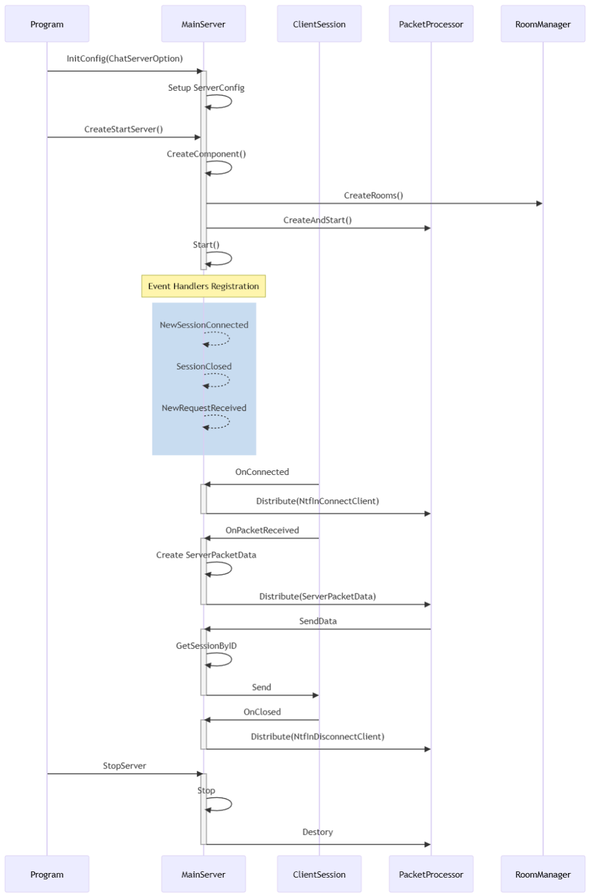      
  
이 시퀀스 다이어그램은 MainServer를 중심으로 한 주요 코드 흐름을 보여준다:    
  
1. 초기화 및 시작 단계  
* InitConfig: 서버 설정 초기화  
* CreateStartServer: 서버 컴포넌트 생성 및 시작  
* CreateComponent: RoomManager, PacketProcessor 초기화
  
2. 이벤트 핸들러 등록  
* NewSessionConnected  
* SessionClosed  
* NewRequestReceived
  
3. 세션 관리 흐름  
* OnConnected: 새 클라이언트 연결 처리  
* OnPacketReceived: 패킷 수신 처리  
* OnClosed: 클라이언트 연결 종료 처리
  
4. 데이터 송수신  
* Distribute: 패킷 처리기로 전달  
* SendData: 클라이언트로 데이터 전송
  
5. 종료 처리  
* StopServer: 서버 종료  
* 관련 리소스 정리
  
  
주요 특징:  
* 이벤트 기반 처리  
* 비동기 통신 지원  
* 중앙화된 패킷 처리  
* 세션 기반 클라이언트 관리
  
 
## 채팅 서버 설정 값
파일: ChatServerOption.cs    

- 서버 설정을 위한 명령줄 옵션을 정의한다.  
- CommandLine 라이브러리를 사용하여 옵션을 파싱한다.  
    - [NuGet](https://www.nuget.org/packages/nuget.commandline )

```
using CommandLine;


namespace ChatServer;

public class ChatServerOption
{
    [Option( "uniqueID", Required = true, HelpText = "Server UniqueID")]
    public int ChatServerUniqueID { get; set; }

    [Option("name", Required = true, HelpText = "Server Name")]
    public string Name { get; set; }

    [Option("maxConnectionNumber", Required = true, HelpText = "MaxConnectionNumber")]
    public int MaxConnectionNumber { get; set; }

    [Option("port", Required = true, HelpText = "Port")]
    public int Port { get; set; }

    [Option("maxRequestLength", Required = true, HelpText = "maxRequestLength")]
    public int MaxRequestLength { get; set; }

    [Option("receiveBufferSize", Required = true, HelpText = "receiveBufferSize")]
    public int ReceiveBufferSize { get; set; }

    [Option("sendBufferSize", Required = true, HelpText = "sendBufferSize")]
    public int SendBufferSize { get; set; }

    [Option("roomMaxCount", Required = true, HelpText = "Max Romm Count")]
    public int RoomMaxCount { get; set; } = 0;

    [Option("roomMaxUserCount", Required = true, HelpText = "RoomMaxUserCount")]
    public int RoomMaxUserCount { get; set; } = 0;

    [Option("roomStartNumber", Required = true, HelpText = "RoomStartNumber")]
    public int RoomStartNumber { get; set; } = 0;      

}
```    
   

## ChatServer의 스레드 사용 구조

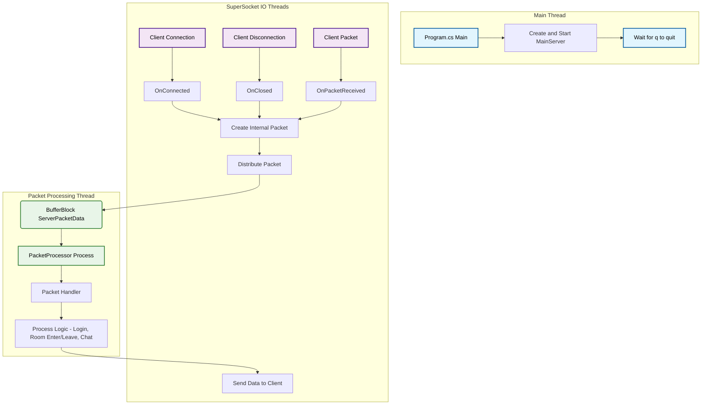
```mermaid
graph TD
    subgraph Main_Thread["Main Thread"]
        A[Program.cs Main] --> B[Create and Start MainServer]
        B --> C[Wait for q to quit]
    end
    
    subgraph SuperSocket_IO["SuperSocket IO Threads"]
        D[Client Connection] --> E[OnConnected]
        F[Client Disconnection] --> G[OnClosed]
        H[Client Packet] --> I[OnPacketReceived]
        E --> J[Create Internal Packet]
        G --> J
        I --> J
        J --> K[Distribute Packet]
        L[Send Data to Client]
    end
    
    subgraph Packet_Processing["Packet Processing Thread"]
        M(BufferBlock ServerPacketData) --> N[PacketProcessor Process]
        N --> O[Packet Handler]
        O --> P[Process Logic - Login, Room Enter/Leave, Chat]
        P --> L
    end
    
    K --> M
    
    style A fill:#e1f5fe,stroke:#01579b,stroke-width:2px,color:#000
    style C fill:#e1f5fe,stroke:#01579b,stroke-width:2px,color:#000
    style D fill:#f3e5f5,stroke:#4a148c,stroke-width:2px,color:#000
    style F fill:#f3e5f5,stroke:#4a148c,stroke-width:2px,color:#000
    style H fill:#f3e5f5,stroke:#4a148c,stroke-width:2px,color:#000
    style M fill:#e8f5e8,stroke:#2e7d32,stroke-width:2px,color:#000
    style N fill:#e8f5e8,stroke:#2e7d32,stroke-width:2px,color:#000
```

### 다이어그램 설명
이 다이어그램은 `ChatServer`의 세 가지 주요 스레드 그룹과 그 상호 작용을 보여준다.

1.  **Main Thread (보라색)**

      * 애플리케이션의 시작점입니다 (`Program.cs`의 `Main` 함수).
      * `MainServer` 객체를 생성하고 시작하는 역할을 한다.
      * 서버가 실행되는 동안 'q' 키 입력을 기다리며 대기한다.

2.  **SuperSocket IO Threads (파란색)**

      * 네트워킹 라이브러리인 `SuperSocketLite`에 의해 관리되는 스레드 풀이다.
      * 클라이언트의 연결, 연결 해제, 데이터 수신과 같은 I/O 작업을 비동기적으로 처리한다.
      * 클라이언트로부터 패킷이 수신되면(`OnPacketReceived`), 이 스레드는 해당 패킷을 `PacketProcessor`에 전달(`Distribute`)한다.
      * 클라이언트에게 데이터를 보낼 때도 이 스레드가 사용된다.

3.  **Packet Processing Thread (연보라색)**

      * `PacketProcessor` 클래스 내에서 생성되는 별도의 **단일 스레드**이다.
      * `BufferBlock`이라는 큐에 쌓인 패킷들을 순차적으로 가져와 처리한다.
      * 로그인, 채팅, 채팅방 입장/퇴장과 같은 **핵심적인 게임 로직**이 모두 이 스레드에서 순서대로 안전하게 처리된다. 이를 통해 여러 스레드가 동시에 데이터에 접근할 때 발생할 수 있는 복잡한 동시성 문제를 방지한다.
      * 로직 처리 후 클라이언트에게 응답을 보내야 할 경우, `SuperSocket IO Thread`에 데이터 전송을 요청한다.

  

## MainServer 클래스
파일: MainServer.cs  
  
`MainServer` 클래스는 SuperSocketLite 라이브러리의 `AppServer`를 상속받아 채팅 서버의 핵심 기능을 구현한 클래스다. 클라이언트의 연결 관리, 패킷 수신 및 처리를 담당하며, 전체 서버의 동작을 총괄한다.

### 주요 기능 및 역할

* **서버 설정 및 시작/종료**:
    * `InitConfig()`: 서버의 이름, 포트, 최대 연결 수와 같은 초기 설정을 `ChatServerOption` 객체를 통해 받아 구성한다.
    * `CreateStartServer()`: `Setup()` 메서드를 호출하여 서버를 설정하고, 로깅을 위해 `NLogLogFactory`를 사용한다. 설정이 완료되면 `Start()` 메서드를 호출하여 서버를 시작한다.
    * `StopServer()`: 서버의 작동을 중지하고 `PacketProcessor` 등의 리소스를 정리한다.

* **컴포넌트 생성**:
    * `CreateComponent()`: 서버가 시작될 때 필요한 주요 컴포넌트들을 생성하고 초기화한다.
    * `RoomManager`를 통해 채팅방들을 생성하고, `PacketProcessor`를 생성하여 패킷을 처리할 스레드를 시작시킨다.
    * `Room` 클래스가 클라이언트에게 데이터를 보낼 수 있도록 `SendData` 메서드를 `Room.NetSendFunc`에 할당한다.

* **세션 및 패킷 처리**:
    * `OnConnected()`: 새로운 클라이언트가 접속하면 호출되며, 접속 로그를 남기고 `PacketProcessor`에 클라이언트 연결을 알리는 내부 패킷을 전달한다.
    * `OnClosed()`: 클라이언트 접속이 끊어지면 호출되며, 접속 해제 로그를 남기고 `PacketProcessor`에 클라이언트 연결 끊김을 알리는 내부 패킷을 전달한다.
    * `OnPacketReceived()`: 클라이언트로부터 새로운 패킷을 수신하면 호출된다. 수신된 데이터(`EFBinaryRequestInfo`)를 `ServerPacketData` 형식으로 변환한 후, `Distribute()` 메서드를 통해 `PacketProcessor`로 전달하여 처리하도록 한다.
    * `SendData()`: 특정 세션 ID를 가진 클라이언트에게 바이트 배열 형태의 데이터를 전송한다.
    * `Distribute()`: `OnPacketReceived` 등에서 받은 패킷을 `PacketProcessor`의 큐에 추가하여 순차적으로 처리되도록 한다.

`MainServer`는 이처럼 서버의 전체적인 흐름을 제어하고, 클라이언트와의 통신을 관리하며, 수신된 패킷을 `PacketProcessor`에 넘겨 실제 로직이 처리되도록 하는 중요한 역할을 담당하는 클래스라고 할 수 있다.


### 생성자: `MainServer()`
`MainServer` 클래스의 생성자다. `AppServer`를 기반으로 세션이 연결되었을 때, 세션이 닫혔을 때, 그리고 새로운 요청을 받았을 때 호출될 함수들을 미리 등록하는 역할을 한다.

* **`NewSessionConnected += new SessionHandler<ClientSession>(OnConnected);`**: 새로운 클라이언트가 서버에 접속하면 `OnConnected` 함수를 호출하도록 지정한다.
* **`SessionClosed += new SessionHandler<ClientSession, CloseReason>(OnClosed);`**: 클라이언트의 접속이 끊어지면 `OnClosed` 함수를 호출하도록 지정한다.
* **`NewRequestReceived += new RequestHandler<ClientSession, EFBinaryRequestInfo>(OnPacketReceived);`**: 클라이언트로부터 패킷을 받으면 `OnPacketReceived` 함수를 호출하도록 지정한다.

### `InitConfig(ChatServerOption option)`
서버의 기본 설정을 초기화하는 함수다.

* `ChatServerOption` 객체를 인자로 받아 서버의 이름, 포트, 최대 연결 수 등 SuperSocketLite 라이브러리가 필요로 하는 설정 값들을 구성한다.
* 이 함수를 통해 커맨드라인 인자로 전달된 옵션들이 실제 서버 설정에 반영된다.

### `CreateStartServer()`
서버를 설정하고 실행하는 과정을 담당하는 함수다.

* `Setup()` 메서드를 호출하여 `InitConfig`에서 만든 설정으로 서버를 구성한다. 이때 로그 기록을 위해 `NLogLogFactory`를 사용한다.
* 서버 설정이 성공하면, `CreateComponent()`를 호출하여 채팅방, 패킷 프로세서 등 서버 운영에 필요한 핵심 요소들을 생성한다.
* 모든 준비가 끝나면 `Start()` 메서드를 호출하여 클라이언트의 접속을 받기 시작한다.
* 만약 서버 생성 과정에서 예외가 발생하면 콘솔에 에러 메시지를 출력한다.

### `StopServer()`
실행 중인 서버를 중지시키는 함수다.

* `Stop()` 메서드를 호출하여 더 이상 클라이언트 접속을 받지 않고 현재 연결된 모든 세션을 종료시킨다.
* `_mainPacketProcessor.Destory()`를 호출하여 패킷을 처리하던 스레드를 안전하게 종료한다.

### `CreateComponent()`
서버의 핵심 기능들을 담당하는 객체들을 생성하고 초기화하는 함수다.

* `Room.NetSendFunc = this.SendData;`: `Room` 객체들이 클라이언트에게 패킷을 보낼 수 있도록 `MainServer`의 `SendData` 함수를 `Room`의 정적 변수에 할당한다.
* `_roomMgr.CreateRooms();`: `RoomManager`를 통해 설정 파일에 정의된 수만큼 채팅방을 생성한다.
* `_mainPacketProcessor.CreateAndStart()`: 패킷 처리를 전담하는 `PacketProcessor` 객체를 생성하고, 패킷 처리 스레드를 시작시킨다.

### `SendData(string sessionID, byte[] sendData)`
특정 클라이언트에게 데이터를 전송하는 함수다.

* 매개변수로 받은 `sessionID`를 사용하여 `GetSessionByID`로 클라이언트 세션 객체를 찾는다.
* 세션이 존재하면 `session.Send()` 메서드를 호출하여 `sendData` 바이트 배열을 클라이언트에게 전송한다.
* 데이터 전송 중 발생할 수 있는 예외(네트워크 타임아웃 등)를 처리하여 서버가 비정상적으로 종료되는 것을 방지한다.

### `Distribute(ServerPacketData requestPacket)`
수신된 패킷을 `PacketProcessor`에게 전달하는 역할을 하는 함수다.

* 클라이언트로부터 받은 패킷 데이터(`requestPacket`)를 `_mainPacketProcessor`의 `InsertPacket` 메서드를 통해 처리 큐에 추가한다.
* 이렇게 함으로써 패킷 수신부와 처리부를 분리하여, 네트워크 스레드가 패킷 처리 작업으로 인해 지연되는 것을 막는다.

### `OnConnected(ClientSession session)`
새로운 클라이언트가 성공적으로 접속했을 때 호출되는 이벤트 핸들러 함수다.

* 접속한 클라이언트의 세션 번호를 로그로 기록한다.
* `ServerPacketData.MakeNTFInConnectOrDisConnectClientPacket`을 호출하여 클라이언트가 접속했음을 알리는 내부용 패킷을 생성한다.
* 생성된 패킷을 `Distribute` 함수로 전달하여 `PacketProcessor`가 이 접속 이벤트를 처리하도록 한다.

### `OnClosed(ClientSession session, CloseReason reason)`
클라이언트 접속이 끊어졌을 때 호출되는 이벤트 핸들러 함수다.

* 접속이 끊긴 클라이언트의 세션 번호와 접속 종료 사유를 로그로 남긴다.
* `OnConnected`와 유사하게, 클라이언트 접속이 끊어졌음을 알리는 내부용 패킷을 생성한다.
* 이 패킷을 `Distribute` 함수로 전달하여, `PacketProcessor`가 해당 유저의 퇴장 처리 등을 수행하도록 한다.

### `OnPacketReceived(ClientSession session, EFBinaryRequestInfo reqInfo)`
클라이언트로부터 패킷 데이터가 도착했을 때 호출되는 이벤트 핸들러 함수다.

* 데이터 수신 사실과 수신된 데이터의 크기를 로그로 기록한다.
* 수신된 데이터(`reqInfo`)를 서버 내부에서 사용하기 편한 `ServerPacketData` 형식으로 변환한다. 이 과정에서 패킷의 크기, ID, 타입, 그리고 실제 데이터(Body)가 `ServerPacketData` 객체에 복사된다.
* 변환된 `ServerPacketData` 객체를 `Distribute` 함수에 넘겨주어 패킷 처리 큐에 등록한다.
  

전체 코드  
```
namespace ChatServer;

public class MainServer : AppServer<ClientSession, EFBinaryRequestInfo>
{
    public static ChatServerOption s_ServerOption;
    public static SuperSocketLite.SocketBase.Logging.ILog s_MainLogger;

    SuperSocketLite.SocketBase.Config.IServerConfig _config;

    PacketProcessor _mainPacketProcessor = new ();
    RoomManager _roomMgr = new ();
    
    
    public MainServer()
        : base(new DefaultReceiveFilterFactory<ReceiveFilter, EFBinaryRequestInfo>())
    {
        NewSessionConnected += new SessionHandler<ClientSession>(OnConnected);
        SessionClosed += new SessionHandler<ClientSession, CloseReason>(OnClosed);
        NewRequestReceived += new RequestHandler<ClientSession, EFBinaryRequestInfo>(OnPacketReceived);
    }

    public void InitConfig(ChatServerOption option)
    {
        s_ServerOption = option;

        _config = new SuperSocketLite.SocketBase.Config.ServerConfig
        {
            Name = option.Name,
            Ip = "Any",
            Port = option.Port,
            Mode = SocketMode.Tcp,
            MaxConnectionNumber = option.MaxConnectionNumber,
            MaxRequestLength = option.MaxRequestLength,
            ReceiveBufferSize = option.ReceiveBufferSize,
            SendBufferSize = option.SendBufferSize
        };
    }
    
    public void CreateStartServer()
    {
        try
        {
            bool bResult = Setup(new SuperSocketLite.SocketBase.Config.RootConfig(), 
                                _config, 
                                logFactory: new NLogLogFactory());

            if (bResult == false)
            {
                Console.WriteLine("[ERROR] 서버 네트워크 설정 실패 ㅠㅠ");
                return;
            } 
            else 
            {
                s_MainLogger = base.Logger;
                s_MainLogger.Info("서버 초기화 성공");
            }


            CreateComponent();

            Start();

            s_MainLogger.Info("서버 생성 성공");
        }
        catch (Exception ex)
        {
            Console.WriteLine($"[ERROR] 서버 생성 실패: {ex.ToString()}");
        }          
    }

    
    public void StopServer()
    {            
        Stop();

        _mainPacketProcessor.Destory();
    }

    // 주요 객체 생성
    public ErrorCode CreateComponent()
    {
        Room.NetSendFunc = this.SendData;
        _roomMgr.CreateRooms();

        _mainPacketProcessor = new PacketProcessor();
        _mainPacketProcessor.CreateAndStart(_roomMgr.GetRoomsList(), this);

        s_MainLogger.Info("CreateComponent - Success");
        return ErrorCode.None;
    }

    // 네트워크로 패킷을 보낸다
    public bool SendData(string sessionID, byte[] sendData)
    {
        var session = GetSessionByID(sessionID);

        try
        {
            if (session == null)
            {
                return false;
            }

            session.Send(sendData, 0, sendData.Length);
        }
        catch(Exception ex)
        {
            // TimeoutException 예외가 발생할 수 있다
            MainServer.s_MainLogger.Error($"{ex.ToString()},  {ex.StackTrace}");

            session.SendEndWhenSendingTimeOut(); 
            session.Close();
        }
        return true;
    }

    // 패킷처리기로 패킷을 전달한다
    public void Distribute(ServerPacketData requestPacket)
    {
        _mainPacketProcessor.InsertPacket(requestPacket);
    }
                    

    void OnConnected(ClientSession session)
    {
        //옵션의 최대 연결 수를 넘으면 SuperSocket이 바로 접속을 짤라버린다. 즉 이 OnConneted 함수가 호출되지 않는다
        s_MainLogger.Info(string.Format("세션 번호 {0} 접속", session.SessionID));
                    
        var packet = ServerPacketData.MakeNTFInConnectOrDisConnectClientPacket(true, session.SessionID);            
        Distribute(packet);
    }

    void OnClosed(ClientSession session, CloseReason reason)
    {
        s_MainLogger.Info($"세션 번호 {session.SessionID} 접속해제: {reason.ToString()}");

        var packet = ServerPacketData.MakeNTFInConnectOrDisConnectClientPacket(false, session.SessionID);
        Distribute(packet);
    }

    void OnPacketReceived(ClientSession session, EFBinaryRequestInfo reqInfo)
    {
        s_MainLogger.Debug($"세션 번호 {session.SessionID} 받은 데이터 크기: {reqInfo.Body.Length}, ThreadId: {System.Threading.Thread.CurrentThread.ManagedThreadId}");

        var packet = new ServerPacketData();
        packet.SessionID = session.SessionID;
        packet.PacketSize = reqInfo.Size;            
        packet.PacketID = reqInfo.PacketID;
        packet.Type = reqInfo.Type;
        packet.BodyData = reqInfo.Body;
                
        Distribute(packet);
    }
}

public class ClientSession : AppSession<ClientSession, EFBinaryRequestInfo>
{
}
```  
    
### 주요 함수 호출 다이어그램    
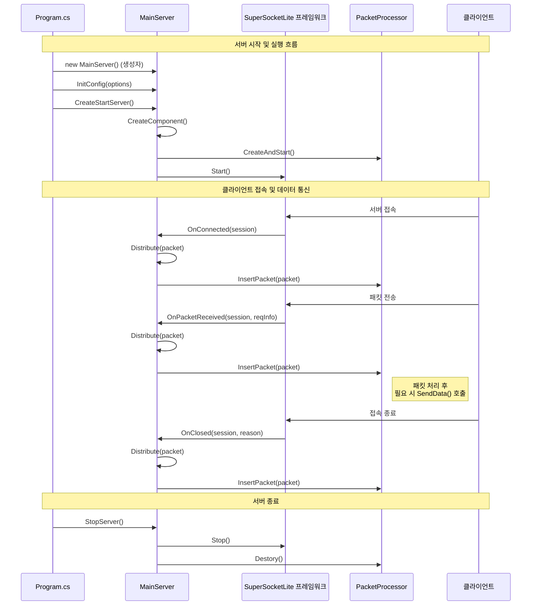
```mermaid    
sequenceDiagram
    participant Program as Program.cs
    participant MainServer as MainServer
    participant SuperSocketLite as SuperSocketLite 프레임워크
    participant PacketProcessor as PacketProcessor
    participant Client as 클라이언트

    Note over Program, Client: 서버 시작 및 실행 흐름

    Program->>MainServer: new MainServer() (생성자)
    Program->>MainServer: InitConfig(options)
    Program->>MainServer: CreateStartServer()
    MainServer->>MainServer: CreateComponent()
    MainServer->>PacketProcessor: CreateAndStart()
    MainServer->>SuperSocketLite: Start()

    Note over Program, Client: 클라이언트 접속 및 데이터 통신

    Client->>SuperSocketLite: 서버 접속
    SuperSocketLite->>MainServer: OnConnected(session)
    MainServer->>MainServer: Distribute(packet)
    MainServer->>PacketProcessor: InsertPacket(packet)

    Client->>SuperSocketLite: 패킷 전송
    SuperSocketLite->>MainServer: OnPacketReceived(session, reqInfo)
    MainServer->>MainServer: Distribute(packet)
    MainServer->>PacketProcessor: InsertPacket(packet)
    
    Note right of PacketProcessor: 패킷 처리 후<br/>필요 시 SendData() 호출

    Client->>SuperSocketLite: 접속 종료
    SuperSocketLite->>MainServer: OnClosed(session, reason)
    MainServer->>MainServer: Distribute(packet)
    MainServer->>PacketProcessor: InsertPacket(packet)


    Note over Program, Client: 서버 종료

    Program->>MainServer: StopServer()
    MainServer->>SuperSocketLite: Stop()
    MainServer->>PacketProcessor: Destory()
```    
  

## ClientSession 클래스:  
- `ClientSession` 클래스는 `AppSession<ClientSession, EFBinaryRequestInfo>`를 상속받는다.
- 이 클래스는 개별 클라이언트 연결을 나타낸다.
    
  

## 클라이언트 접속 (OnConnected)
클라이언트가 서버에 접속했을 때의 처리 흐름이다.

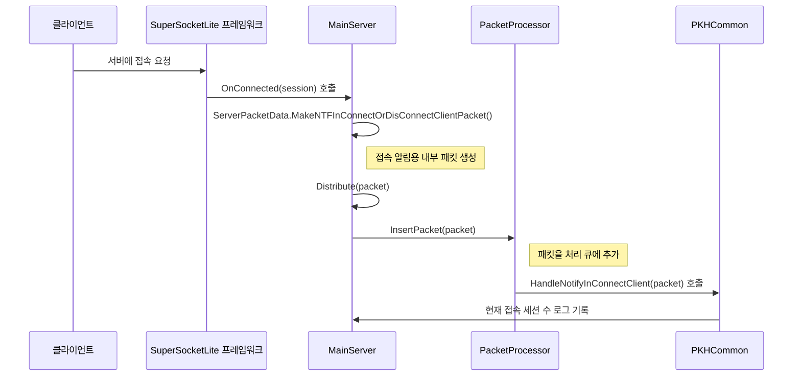
```mermaid
sequenceDiagram
    participant Client as 클라이언트
    participant SuperSocketLite as SuperSocketLite 프레임워크
    participant MainServer as MainServer
    participant PacketProcessor as PacketProcessor
    participant PKHCommon as PKHCommon

    Client->>SuperSocketLite: 서버에 접속 요청
    SuperSocketLite->>MainServer: OnConnected(session) 호출
    MainServer->>MainServer: ServerPacketData.MakeNTFInConnectOrDisConnectClientPacket()
    Note right of MainServer: 접속 알림용 내부 패킷 생성
    MainServer->>MainServer: Distribute(packet)
    MainServer->>PacketProcessor: InsertPacket(packet)
    Note right of PacketProcessor: 패킷을 처리 큐에 추가

    PacketProcessor->>PKHCommon: HandleNotifyInConnectClient(packet) 호출
    PKHCommon->>MainServer: 현재 접속 세션 수 로그 기록
```
  
## 클라이언트 접속 끊어짐 (OnClosed)
클라이언트의 접속이 끊어졌을 때의 처리 흐름이다.

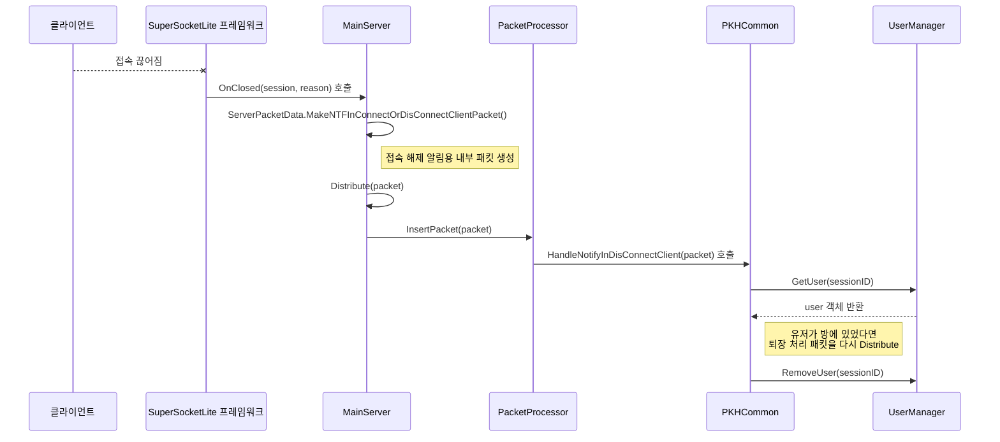
```mermaid
sequenceDiagram
    participant Client as 클라이언트
    participant SuperSocketLite as SuperSocketLite 프레임워크
    participant MainServer as MainServer
    participant PacketProcessor as PacketProcessor
    participant PKHCommon as PKHCommon
    participant UserManager as UserManager

    Client--xSuperSocketLite: 접속 끊어짐
    SuperSocketLite->>MainServer: OnClosed(session, reason) 호출
    MainServer->>MainServer: ServerPacketData.MakeNTFInConnectOrDisConnectClientPacket()
    Note right of MainServer: 접속 해제 알림용 내부 패킷 생성
    MainServer->>MainServer: Distribute(packet)
    MainServer->>PacketProcessor: InsertPacket(packet)

    PacketProcessor->>PKHCommon: HandleNotifyInDisConnectClient(packet) 호출
    PKHCommon->>UserManager: GetUser(sessionID)
    UserManager-->>PKHCommon: user 객체 반환
    Note right of PKHCommon: 유저가 방에 있었다면<br/>퇴장 처리 패킷을 다시 Distribute
    PKHCommon->>UserManager: RemoveUser(sessionID)
```
  
## 데이터 수신 (OnPacketReceived)
클라이언트로부터 데이터를 받았을 때의 처리 흐름이다.

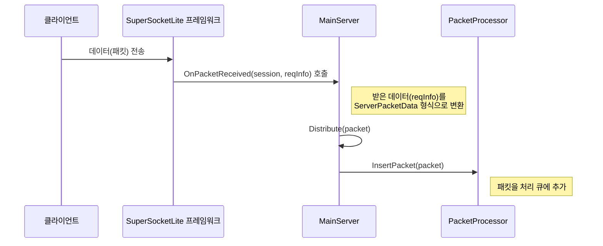
```mermaid
sequenceDiagram
    participant Client as 클라이언트
    participant SuperSocketLite as SuperSocketLite 프레임워크
    participant MainServer as MainServer
    participant PacketProcessor as PacketProcessor

    Client->>SuperSocketLite: 데이터(패킷) 전송
    SuperSocketLite->>MainServer: OnPacketReceived(session, reqInfo) 호출
    Note right of MainServer: 받은 데이터(reqInfo)를<br/>ServerPacketData 형식으로 변환
    MainServer->>MainServer: Distribute(packet)
    MainServer->>PacketProcessor: InsertPacket(packet)
    Note right of PacketProcessor: 패킷을 처리 큐에 추가
```

## 패킷 처리 (PacketProcessor)
`PacketProcessor`가 큐에 쌓인 패킷을 처리하는 일반적인 흐름이다.

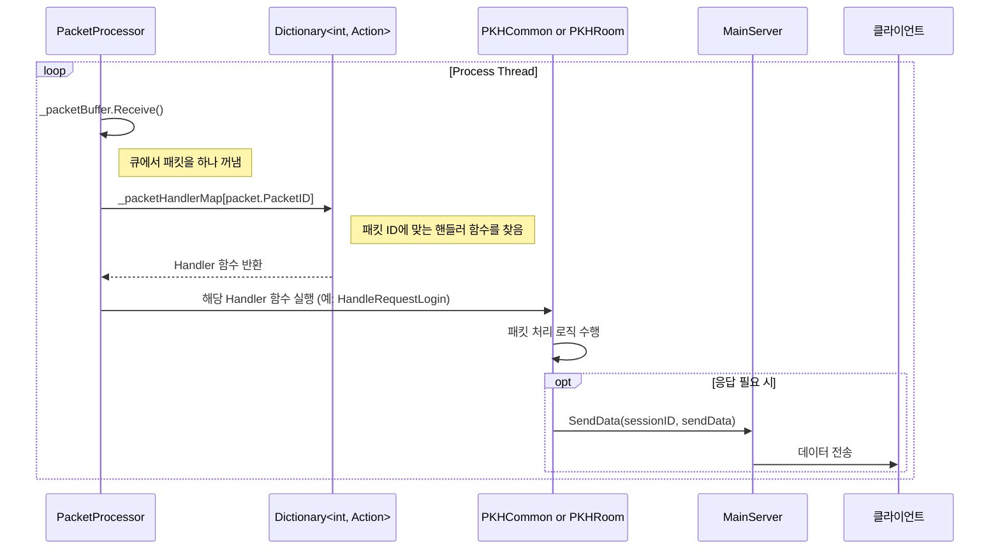
```mermaid
sequenceDiagram
    participant PacketProcessor as PacketProcessor
    participant PacketHandlerMap as Dictionary<int, Action>
    participant PacketHandler as PKHCommon or PKHRoom
    participant MainServer as MainServer
    participant Client as 클라이언트

    loop Process Thread
        PacketProcessor->>PacketProcessor: _packetBuffer.Receive()
        Note right of PacketProcessor: 큐에서 패킷을 하나 꺼냄
        PacketProcessor->>PacketHandlerMap: _packetHandlerMap[packet.PacketID]
        Note right of PacketHandlerMap: 패킷 ID에 맞는 핸들러 함수를 찾음
        PacketHandlerMap-->>PacketProcessor: Handler 함수 반환
        PacketProcessor->>PacketHandler: 해당 Handler 함수 실행 (예: HandleRequestLogin)
        PacketHandler->>PacketHandler: 패킷 처리 로직 수행
        opt 응답 필요 시
            PacketHandler->>MainServer: SendData(sessionID, sendData)
            MainServer->>Client: 데이터 전송
        end
    end
```
  

## PacketProcessor 클래스
파일: PacketProcessor.cs  
  
- 패킷 처리를 담당하는 클래스이다.  
- BufferBlock을 사용하여 패킷을 비동기적으로 처리한다.  
- 사용자 관리, 방 관리 기능을 포함한다.  
- 패킷 핸들러를 등록하고 실행하는 메커니즘을 가지고 있다.  
      
### PacketProcessor 클래스 개요
`PacketProcessor` 클래스는 클라이언트로부터 받은 패킷을 실질적으로 처리하는 핵심 클래스다. SuperSocketLite 라이브러리가 클라이언트로부터 패킷을 수신하면, `MainServer`는 이 패킷을 `PacketProcessor`의 처리 큐(`_packetBuffer`)에 추가한다. `PacketProcessor`는 별도의 스레드를 사용하여 이 큐에서 패킷을 하나씩 꺼내어 미리 등록된 핸들러 함수에 전달하고 실행하는 역할을 한다.

이러한 구조는 네트워크 패킷 수신부와 실제 로직 처리부를 분리하여, 특정 패킷 처리가 지연되더라도 전체 네트워크 성능에 미치는 영향을 최소화하는 장점이 있다.

<pre>
┌─────────────────────────────────────────────────────────────────────────────────┐
│                           PacketProcessor 아키텍처                               │
└─────────────────────────────────────────────────────────────────────────────────┘

   클라이언트                SuperSocketLite               MainServer
        │                         │                          │
        │      패킷 전송           │                          │
        ├───────────────────────► │                          │
        │                         │        패킷 수신          │
        │                         ├─────────────────────────►│
        │                         │                          │
        │                         │                          ▼  큐에 추가
        │                         │                 ┌──────────────────┐
        │                         │                 │   _packetBuffer  │
        │                         │                 │    (처리 큐)      │
        │                         │                 ┤   ┌────────────┐ │
        │                         │                 │   │  Packet 1  │ │
        │                         │                 │   ├────────────┤ │
        │                         │                 │   │  Packet 2  │ │
        │                         │                 │   ├────────────┤ │
        │                         │                 │   │  Packet 3  │ │
        │                         │                 │   └────────────┘ │
        │                         │                 └──────────────────┘
        │                         │                          │
        │                         │                          │ 패킷을 하나씩 
        │                         │                          │ 꺼내어 처리
        │                         │                          ▼
        │                         │                 ┌──────────────────┐
        │                         │                 │ PacketProcessor  │
        │                         │                 │   별도 스레드      │
        │                         │                 │                  │
        │                         │                 │ ┌──────────────┐ │
        │                         │                 │ │ 핸들러 함수들  │ │
        │                         │                 │ │              │ │
        │                         │                 │ │ LoginHandler │ │
        │                         │                 │ │ ChatHandler  │ │
        │                         │                 │ │ RoomHandler  │ │
        │                         │                 │ │     ...      │ │
        │                         │                 │ └──────────────┘ │
        │                         │                 └──────────────────┘
        │                         │                          │
        │      응답 전송           │◄─────────────────────────┤
        │◄────────────────────────┤                          │
        │                         │                          │

┌──────────────────────────────────────────────────────────────────────────────┐
│                                장점                                           │
├──────────────────────────────────────────────────────────────────────────────┤
│  🔹 네트워크 수신부 ↔ 로직 처리부 분리                                           │
│  🔹 패킷 처리 지연이 전체 네트워크 성능에 미치는 영향 최소화                        │
│  🔹 비동기 처리로 인한 높은 처리량 달성                                          │
│  🔹 큐 기반 버퍼링으로 트래픽 급증 시에도 안정적 처리                              │
└─────────────────────────────────────────────────────────────────────────────┘

        Network Thread                    Processing Thread
             │                                   │
    ┌─────────────────┐                 ┌─────────────────┐
    │  Fast Response  │                 │ Heavy Logic     │
    │  Low Latency    │                 │ Can Take Time   │
    └─────────────────┘                 └─────────────────┘
</pre>
  

### 멤버 변수

  * `_isThreadRunning`: 패킷 처리 스레드의 실행 상태를 제어하는 플래그다.
  * `_processThread`: `Process()` 메서드를 실행하는 실제 스레드 객체다.
  * `_packetBuffer`: 수신된 패킷(`ServerPacketData`)을 임시로 저장하는 큐(Queue)다. `BufferBlock<T>`은 스레드로부터 안전하게 데이터를 추가하고 꺼낼 수 있는 기능을 제공한다.
  * `_userMgr`: 유저 정보를 관리하는 `UserManager` 객체다.
  * `_roomList`, `_roomNumberRange`: 채팅방 목록과 방 번호 범위를 관리한다.
  * `_packetHandlerMap`: `PacketId`를 키로, 해당 패킷을 처리할 함수(`Action<ServerPacketData>`)를 값으로 가지는 딕셔너리다. 패킷 종류에 따라 어떤 함수를 실행할지 결정하는 데 사용된다.
  * `_commonPacketHandler`, `_roomPacketHandler`: 실제 패킷 처리 로직을 담고 있는 핸들러 클래스 객체다.

-----

### 멤버 함수 및 코드 설명

#### `CreateAndStart(List<Room> roomList, MainServer mainServer)`
서버 시작 시 호출되며, `PacketProcessor`를 작동시키는 데 필요한 모든 초기화 작업을 수행한다.

```csharp
public void CreateAndStart(List<Room> roomList, MainServer mainServer)
{
    // 1. UserManager 초기화
    var maxUserCount = MainServer.s_ServerOption.RoomMaxCount * MainServer.s_ServerOption.RoomMaxUserCount;
    _userMgr.Init(maxUserCount);

    // 2. Room 정보 설정
    _roomList = roomList;
    var minRoomNum = _roomList[0].Number;
    var maxRoomNum = _roomList[0].Number + _roomList.Count() - 1;
    _roomNumberRange = new Tuple<int, int>(minRoomNum, maxRoomNum);
    
    // 3. 패킷 핸들러 등록
    RegistPacketHandler(mainServer);

    // 4. 패킷 처리 스레드 생성 및 시작
    _isThreadRunning = true;
    _processThread = new System.Threading.Thread(this.Process);
    _processThread.Start();
}
```

1.  **UserManager 초기화**: 서버 설정에 명시된 최대 방 개수와 방당 최대 유저 수를 곱하여 서버가 수용할 전체 유저 수를 계산하고 `UserManager`를 초기화한다.
2.  **Room 정보 설정**: `RoomManager`로부터 생성된 방 리스트를 받아오고, 관리할 방 번호의 시작과 끝 범위를 설정한다.
3.  **패킷 핸들러 등록**: `RegistPacketHandler` 함수를 호출하여 어떤 패킷 ID에 어떤 처리 함수를 연결할지 설정한다.
4.  **스레드 시작**: `_isThreadRunning` 플래그를 `true`로 설정하고, `Process` 함수를 실행할 새로운 스레드를 생성하여 시작한다. 이 시점부터 `PacketProcessor`는 패킷을 처리할 준비를 마친다.

#### `Destory()`
서버를 종료할 때 호출되어 패킷 처리 스레드를 안전하게 중지시킨다.

```csharp
public void Destory()
{
    _isThreadRunning = false;
    _packetBuffer.Complete();
}
```

  * `_isThreadRunning = false;`: `Process` 함수의 `while` 루프를 빠져나오도록 신호를 보낸다.
  * `_packetBuffer.Complete();`: `_packetBuffer`에 더 이상 새로운 패킷이 추가되지 않을 것임을 알린다. 만약 큐가 비어있는 상태에서 `Receive()`가 호출되면, `InvalidOperationException`을 발생시켜 `Process` 메서드의 `while` 루프를 즉시 종료시키는 효과를 준다.

#### `InsertPacket(ServerPacketData data)`
`MainServer`가 클라이언트로부터 패킷을 받을 때마다 호출하는 함수다.

```csharp
public void InsertPacket(ServerPacketData data)
{
    _packetBuffer.Post(data);
}
```

  * `_packetBuffer.Post(data);`: 인자로 받은 `ServerPacketData` 객체를 `_packetBuffer` 큐에 추가한다. 이 작업은 매우 빠르므로 네트워크 수신 스레드의 지연을 최소화한다.

#### `RegistPacketHandler(MainServer serverNetwork)`
패킷 ID와 그 패킷을 처리할 함수를 `_packetHandlerMap`에 등록하는 역할을 한다.

```csharp
void RegistPacketHandler(MainServer serverNetwork)
{            
    // 1. 공통 패킷 핸들러 초기화 및 등록
    _commonPacketHandler.Init(serverNetwork, _userMgr);
    _commonPacketHandler.RegistPacketHandler(_packetHandlerMap);                
    
    // 2. 채팅방 관련 패킷 핸들러 초기화 및 등록
    _roomPacketHandler.Init(serverNetwork, _userMgr);
    _roomPacketHandler.SetRooomList(_roomList);
    _roomPacketHandler.RegistPacketHandler(_packetHandlerMap);
}
```

1.  `_commonPacketHandler` (로그인 등)와 `_roomPacketHandler` (채팅, 방 입장/퇴장 등) 객체를 초기화한다.
2.  각 핸들러 객체의 `RegistPacketHandler` 함수를 호출하여, 핸들러들이 자신들이 처리할 패킷 ID와 처리 함수를 `_packetHandlerMap` 딕셔너리에 스스로 등록하도록 한다. 예를 들어 `PKHCommon` 클래스는 로그인 요청(`PacketId.ReqLogin`)을 `HandleRequestLogin` 함수와 연결하여 `_packetHandlerMap`에 추가한다.

#### `Process()`
패킷 처리 스레드에서 무한 루프를 돌며 실제 패킷 처리를 담당하는 가장 핵심적인 함수다.

```csharp
void Process()
{
    while (_isThreadRunning) // 1. 스레드 실행 플래그 검사
    {
        try
        {
            // 2. 큐에서 패킷 꺼내오기 (블로킹)
            var packet = _packetBuffer.Receive();

            // 3. 핸들러 맵에서 처리 함수 찾기
            if (_packetHandlerMap.ContainsKey(packet.PacketID))
            {
                // 4. 처리 함수 실행
                _packetHandlerMap[packet.PacketID](packet);
            }
            else
            {
                System.Diagnostics.Debug.WriteLine("...");
            }
        }
        catch (Exception ex) // 5. 예외 처리
        {
            if(_isThreadRunning)
            {
                MainServer.s_MainLogger.Error(ex.ToString());
            }                
        }
    }
}
```

1.  `while (_isThreadRunning)`: `_isThreadRunning`이 `true`인 동안 계속해서 루프를 실행한다.
2.  `var packet = _packetBuffer.Receive();`: `_packetBuffer` 큐에서 패킷을 하나 꺼낸다. 만약 큐가 비어있으면 새로운 패킷이 들어올 때까지 이 라인에서 대기(블로킹)한다.
3.  `if (_packetHandlerMap.ContainsKey(packet.PacketID))`: 꺼내온 패킷의 ID가 `_packetHandlerMap`에 등록되어 있는지 확인한다.
4.  `_packetHandlerMap[packet.PacketID](packet);`: 등록된 ID라면, 해당 ID에 연결된 처리 함수를 호출하여 패킷 처리를 위임한다.
5.  `catch (Exception ex)`: 패킷 처리 중 발생할 수 있는 모든 예외를 잡아 로그로 기록한다. 이를 통해 특정 패킷 처리 시 에러가 발생하더라도 전체 서버 스레드가 중단되는 사태를 방지한다.

  
전체 코드:    
```  
// 패킷 처리 클래스
class PacketProcessor
{
    bool _isThreadRunning = false;
    System.Threading.Thread _processThread = null;

    //receive쪽에서 처리하지 않아도 Post에서 블럭킹 되지 않는다. 
    //BufferBlock<T>(DataflowBlockOptions) 에서 DataflowBlockOptions의 BoundedCapacity로 버퍼 가능 수 지정. BoundedCapacity 보다 크게 쌓이면 블럭킹 된다
    BufferBlock<ServerPacketData> _packetBuffer = new BufferBlock<ServerPacketData>();

    UserManager _userMgr = new UserManager();

    Tuple<int,int> _roomNumberRange = new Tuple<int, int>(-1, -1);
    List<Room> _roomList = new ();

    Dictionary<int, Action<ServerPacketData>> _packetHandlerMap = new ();
    PKHCommon _commonPacketHandler = new ();
    PKHRoom _roomPacketHandler = new ();
            
        
    public void CreateAndStart(List<Room> roomList, MainServer mainServer)
    {
        var maxUserCount = MainServer.s_ServerOption.RoomMaxCount * MainServer.s_ServerOption.RoomMaxUserCount;
        _userMgr.Init(maxUserCount);

        _roomList = roomList;
        var minRoomNum = _roomList[0].Number;
        var maxRoomNum = _roomList[0].Number + _roomList.Count() - 1;
        _roomNumberRange = new Tuple<int, int>(minRoomNum, maxRoomNum);
        
        RegistPacketHandler(mainServer);

        _isThreadRunning = true;
        _processThread = new System.Threading.Thread(this.Process);
        _processThread.Start();
    }
    
    public void Destory()
    {
        _isThreadRunning = false;
        _packetBuffer.Complete();
    }
          
    public void InsertPacket(ServerPacketData data)
    {
        _packetBuffer.Post(data);
    }

    
    void RegistPacketHandler(MainServer serverNetwork)
    {            
        _commonPacketHandler.Init(serverNetwork, _userMgr);
        _commonPacketHandler.RegistPacketHandler(_packetHandlerMap);                
        
        _roomPacketHandler.Init(serverNetwork, _userMgr);
        _roomPacketHandler.SetRooomList(_roomList);
        _roomPacketHandler.RegistPacketHandler(_packetHandlerMap);
    }

    void Process()
    {
        while (_isThreadRunning)
        {
            //System.Threading.Thread.Sleep(64); //테스트 용
            try
            {
                var packet = _packetBuffer.Receive();

                if (_packetHandlerMap.ContainsKey(packet.PacketID))
                {
                    _packetHandlerMap[packet.PacketID](packet);
                }
                else
                {
                    System.Diagnostics.Debug.WriteLine("세션 번호 {0}, PacketID {1}, 받은 데이터 크기: {2}", packet.SessionID, packet.PacketID, packet.BodyData.Length);
                }
            }
            catch (Exception ex)
            {
                _isThreadRunning.IfTrue(() => MainServer.s_MainLogger.Error(ex.ToString()));
            }
        }
    }


}
```  
     
  
## 에러 코드 정의
파일: PacketDefine.cs    
    
```
public enum ErrorCode : short
{
    None = 0, // 에러가 아니다

    // 서버 초기화 에러
    RedisInitFail = 1,    // Redis 초기화 에러

    // 로그인 
    LoginInvalidAuthToken = 1001, // 로그인 실패: 잘못된 인증 토큰
    AddUserDuplication = 1002,
    RemoveUserSearchFailureUserId = 1003,
    UserAuthSearchFailureUserId = 1004,
    UserAuthAlreadySetAuth = 1005,
    LoginAlreadyWorking = 1006,
    LoginFullUserCount = 1007,

    DbLoginInvalidPassword = 1011,
    DbLoginEmptyUser = 1012,
    DbLoginException = 1013,

    RoomEnterInvalidState = 1021,
    RoomEnterInvalidUser = 1022,
    RoomEnterErrorSystem = 1023,
    RoomEnterInvalidRoomNumber = 1024,
    RoomEnterFailAddUser = 1025,
}
```  
    
  
## 패킷 ID 정의
클라이언트-서버 간 통신에 사용되는 패킷 종류를 정의한다.
  
파일: PacketDefine.cs   
```
public enum PacketId : int
{
    ReqResTestEcho = 101,


    // 클라이언트
    CsBegin = 1001,

    ReqLogin = 1002,
    ResLogin = 1003,
    NtfMustClose = 1005,

    ReqRoomEnter = 1015,
    ResRoomEnter = 1016,
    NtfRoomUserList = 1017,
    NtfRoomNewUser = 1018,

    ReqRoomLeave = 1021,
    ResRoomLeave = 1022,
    NtfRoomLeaveUser = 1023,

    ReqRoomChat = 1026,
    NtfRoomChat = 1027,


    ReqRoomDevAllRoomStartGame = 1091,
    ResRoomDevAllRoomStartGame = 1092,

    ReqRoomDevAllRoomEndGame = 1093,
    ResRoomDevAllRoomEndGame = 1094,

    CsEnd = 1100,


    // 시스템, 서버 - 서버
    S2sStart = 8001,

    NtfInConnectClient = 8011,
    NtfInDisconnectClient = 8012,

    ReqSsServerinfo = 8021,
    ResSsServerinfo = 8023,

    ReqInRoomEnter = 8031,
    ResInRoomEnter = 8032,

    NtfInRoomLeave = 8036,


    // DB 8101 ~ 9000
    ReqDbLogin = 8101,
    ResDbLogin = 8102,
}
```  

  
## Logger
NLogLogFactory.cs:    
- NLog 라이브러리를 사용하여 로깅 기능을 구현한다.  
- SuperSocket 프레임워크와 통합되어 있다.
  
NLogLog.cs:    
- NLog를 사용하여 SuperSocket의 ILog 인터페이스를 구현한다.
  
### NLogLogFactory.cs
이 클래스는 SuperSocketLite 프레임워크가 NLog를 사용하여 로그를 기록하도록 연결해주는 '공장(Factory)' 역할을 한다. SuperSocketLite는 자체 로깅 인터페이스를 가지고 있는데, `NLogLogFactory`는 이 인터페이스를 구현하여 실제 NLog 객체를 생성해주는 책임을 진다.
  
```csharp
#if (__NOT_USE_NLOG__ != true)  //NLog를 사용하지 않는다면 __NOT_USE_NLOG__ 선언한다
public class NLogLogFactory : SuperSocketLite.SocketBase.Logging.LogFactoryBase
{
    // 생성자 1: 기본 설정 파일("NLog.config")을 사용한다.
    public NLogLogFactory()
        : this("NLog.config")
    {
    }

    // 생성자 2: 특정 경로의 설정 파일을 사용한다.
    public NLogLogFactory(string nlogConfig)
        : base(nlogConfig)
    {
        if (!IsSharedConfig)
        {
            // NLog 설정 파일을 로드한다.
            LogManager.Setup().LoadConfigurationFromFile(new[] { ConfigFile });
        }
        else
        {                
        }
    }

    // SuperSocketLite가 로그 객체를 요청할 때 호출되는 함수다.
    public override SuperSocketLite.SocketBase.Logging.ILog GetLog(string name)
    {
        // NLog의 Logger를 생성하고, 이를 감싼 NLogLog 객체를 반환한다.
        return new NLogLog(NLog.LogManager.GetLogger(name));
    }
}
#endif
```

  * **`NLogLogFactory()`**: 생성자에서 NLog 설정 파일의 경로를 지정하고, `LogManager.Setup().LoadConfigurationFromFile()`를 호출하여 `NLog.config` 파일의 내용을 읽어와 NLog 전체에 적용한다.
  * **`GetLog(string name)`**: SuperSocketLite 프레임워크가 로그 객체를 필요로 할 때 이 함수를 호출한다. 그러면 `NLog.LogManager.GetLogger(name)`를 통해 NLog의 로거 인스턴스를 얻고, 이 인스턴스를 `NLogLog` 클래스로 감싸서 반환한다. 이를 통해 SuperSocketLite는 자신이 필요로 하는 `ILog` 인터페이스 타입의 객체를 얻게 된다.

### NLogLog.cs
이 클래스는 SuperSocketLite의 `ILog` 인터페이스와 NLog 라이브러리의 `ILogger`를 연결하는 '어댑터(Adapter)' 역할을 한다. SuperSocketLite는 `ILog` 인터페이스에 정의된 `Debug`, `Error`, `Info` 같은 메서드를 호출하는데, `NLogLog` 클래스는 이 호출을 받아 실제 NLog의 `ILogger` 객체에게 전달한다.

```csharp
public class NLogLog : SuperSocketLite.SocketBase.Logging.ILog
{
    private NLog.ILogger Log; // NLog의 실제 로거 객체다.

    public NLogLog(NLog.ILogger log)
    {
        if (log == null)
        {
            throw new ArgumentNullException("log");
        }
        Log = log;
    }

    // ILog 인터페이스의 다양한 프로퍼티와 메서드를 구현한다.
    public bool IsDebugEnabled
    {
        get { return Log.IsDebugEnabled; }
    }

    public void Debug(string message)
    {
        Log.Debug(message); // SuperSocket의 Debug 호출을 NLog의 Debug로 전달한다.
    }                         
    
    public void Error(string message)
    {
        Log.Error(message); // SuperSocket의 Error 호출을 NLog의 Error로 전달한다.
    }
    // ... (Info, Warn, Fatal 등 다른 로그 레벨도 동일한 방식으로 구현) ...
}
```

  * **`NLogLog(NLog.ILogger log)`**: 생성자에서 NLog 로거 객체를 받아 내부 멤버 변수 `Log`에 저장한다.
  * **인터페이스 구현**: `ILog` 인터페이스에 정의된 `Debug`, `Error`, `Info` 등 모든 메서드를 구현한다. 각 메서드는 단순히 내부에 저장된 NLog 로거 객체의 해당 메서드를 그대로 호출해주는 방식으로 동작한다.

### NLog.config
이 파일은 NLog의 동작 방식을 정의하는 XML 기반의 설정 파일이다. 로그를 어떤 형식으로, 어떤 레벨의 로그를, 어디에(콘솔, 파일 등) 기록할지를 상세하게 설정한다.

```xml
<?xml version="1.0" encoding="utf-8" ?>
<nlog xmlns="http://www.nlog-project.org/schemas/NLog.xsd"
      xmlns:xsi="http://www.w3.org/2001/XMLSchema-instance">

  <targets async="true">
    <target name="console" xsi:type="ColoredConsole" layout="${date:format=HH\:mm\:ss}| [TID:${threadid}] | ${message}" />
    
    <target name="InfoFile" xsi:type="File"
            fileName="${basedir}/Logs/Info_${logger}.log"
            ...
            layout="[${date}] [TID:${threadid}] [${stacktrace}]: ${message}" />

    <target name="ErrorFile" xsi:type="File"
            fileName="${basedir}/Logs/Error_${logger}.log"
            ... />
  </targets>

  <rules>
    <logger name="*" minlevel="Debug" maxlevel="Info" writeTo="InfoFile" />
    <logger name="*" minlevel="Error" writeTo="ErrorFile" />
    <logger name="*" minlevel="Debug" writeTo="console" />
  </rules>
</nlog>
```

  * **`<targets>`**: 로그를 어디에 출력할지 '목적지'를 설정한다.
      * `console`: 로그를 색상이 적용된 콘솔 창에 출력한다.
      * `InfoFile`: `Debug`, `Info` 레벨의 로그를 `Logs/Info_...log` 파일에 저장한다.
      * `ErrorFile`: `Warn`, `Error`, `Fatal` 레벨의 로그를 `Logs/Error_...log` 파일에 저장한다.
  * **`<rules>`**: 어떤 로거에서 발생한, 어떤 레벨의 로그를 어느 `target`으로 보낼지 '규칙'을 정한다.
      * 모든 로거(`name="*"`)에서 발생한 `Debug`부터 `Info` 레벨까지의 로그는 `InfoFile`에 기록한다.
      * 모든 로거에서 발생한 `Error` 레벨 이상의 로그는 `ErrorFile`에 기록한다.
      * 모든 로거에서 발생한 `Debug` 레벨 이상의 모든 로그는 `console`에도 함께 기록한다.   

  

## RoomManager 클래스
파일: RoomManager.cs   
  
- 채팅방을 생성하고 관리하는 클래스이다.  
- 서버 옵션에 따라 여러 개의 방을 생성한다.
  
### RoomManager 클래스 개요
`RoomManager` 클래스는 채팅 서버에 존재하는 모든 '방(Room)'을 생성하고 관리하는 역할을 전담하는 클래스다. 서버가 처음 시작될 때, 서버 설정에 명시된 개수만큼 방 객체를 미리 생성하여 리스트 형태로 보관하고, 다른 객체들이 이 방 목록에 접근할 수 있도록 제공하는 기능을 담당한다.

### 멤버 변수
  * `List<Room> _roomList`: 생성된 `Room` 객체들을 저장하는 리스트다. 이 리스트를 통해 서버 내의 모든 방을 일괄적으로 관리할 수 있다.

-----

### 멤버 함수 및 코드 설명

#### `CreateRooms()`
서버가 시작될 때, 설정 값을 기반으로 모든 채팅방을 생성하는 함수다.

```csharp
public void CreateRooms()
{
    // 1. 서버 옵션에서 방 생성에 필요한 정보를 가져온다.
    var maxRoomCount = MainServer.s_ServerOption.RoomMaxCount;
    var startNumber = MainServer.s_ServerOption.RoomStartNumber; // 게임 서버가 N개일 때 각 방에 고유 번호를 할당하기 위한 것이다
    var maxUserCount = MainServer.s_ServerOption.RoomMaxUserCount;

    // 2. 설정된 방의 개수만큼 반복하여 방을 생성한다.
    for(int i = 0; i < maxRoomCount; ++i)
    {
        var roomNumber = (startNumber + i); // 3. 각 방의 고유 번호를 계산한다.
        var room = new Room(); // 4. 새로운 Room 객체를 생성한다.
        room.Init(i, roomNumber, maxUserCount); // 5. Room 객체를 초기화한다.

        _roomList.Add(room); // 6. 생성된 방을 리스트에 추가한다.
    }                                   
}
```

1.  `MainServer.s_ServerOption`에서 `RoomMaxCount`(생성할 최대 방 개수), `RoomStartNumber`(시작 방 번호), `RoomMaxUserCount`(방 당 최대 인원) 값을 불러온다.
2.  `for` 루프를 사용하여 `maxRoomCount` 만큼 반복 작업을 수행한다.
3.  각 방에 할당될 고유한 방 번호(`roomNumber`)를 `startNumber`에 인덱스 `i`를 더하여 계산한다.
4.  `new Room()`을 통해 새로운 방 객체 인스턴스를 메모리에 할당한다.
5.  생성된 `Room` 객체의 `Init` 함수를 호출하여 방의 인덱스, 고유 번호, 최대 수용 인원 정보를 설정하며 초기화한다.
6.  초기화가 완료된 `Room` 객체를 `_roomList` 리스트에 추가하여 관리를 시작한다.

#### `GetRoomsList()`
생성된 모든 방의 리스트를 외부로 반환하는 함수다.

```csharp
public List<Room> GetRoomsList() { return _roomList; }
```

  * 이 함수는 `PacketProcessor`와 같은 다른 클래스가 방 목록에 접근해야 할 때 사용된다.
  * `_roomList` 멤버 변수에 저장된 `Room` 객체들의 리스트를 그대로 반환하는 매우 간단한 기능을 수행한다.

  
## Room 클래스
파일: Room.cs   
  
방을 가리키는 객체이다. 채팅은 이 방에서만 할 수 있다.  
   
### Room 클래스 개요
`Room` 클래스는 채팅 서버에서 개별적인 '방' 하나를 나타내는 클래스다. 방의 고유 정보(번호, 최대 인원 등)를 가지고 있으며, 해당 방에 입장한 유저들의 목록을 관리한다. 또한, 방에 속한 유저들 간의 데이터 통신(채팅, 입장/퇴장 알림 등)을 중계하는 핵심적인 역할을 수행한다.

### 멤버 변수 및 속성
  * `Index`, `Number`: 방의 인덱스와 사용자가 식별하는 고유 번호다.
  * `_maxUserCount`: 방에 최대로 입장할 수 있는 유저의 수다.
  * `_userList`: 현재 방에 입장해 있는 유저(`RoomUser`)들의 정보를 담고 있는 리스트다.
  * `NetSendFunc`: `MainServer`의 `SendData` 함수가 할당되는 정적(static) 변수다. `Room` 클래스는 이 함수를 통해 특정 유저에게 패킷을 전송할 수 있다.

-----

### 멤버 함수 및 코드 설명

#### `Init(int index, int number, int maxUserCount)`
`RoomManager`가 방을 생성할 때 호출되어 방의 기본 정보를 초기화하는 함수다.

```csharp
public void Init(int index, int number, int maxUserCount)
{
    Index = index;
    Number = number;
    _maxUserCount = maxUserCount;
}
```

  * 매개변수로 받은 `index`, `number`, `maxUserCount` 값을 각각의 멤버 속성에 할당하여 방의 상태를 설정한다.

#### `AddUser(string userID, string netSessionID)`
새로운 유저를 방에 추가하는 함수다.

```csharp
public bool AddUser(string userID, string netSessionID)
{
    if(GetUser(userID) != null) // 1. 중복 유저 검사
    {
        return false;
    }

    var roomUser = new RoomUser(); // 2. RoomUser 객체 생성
    roomUser.Set(userID, netSessionID); // 3. 유저 정보 설정
    _userList.Add(roomUser); // 4. 리스트에 추가

    return true;
}
```

1.  `GetUser(userID)`를 호출하여 이미 같은 ID의 유저가 방에 있는지 확인하고, 있다면 `false`를 반환하여 중복 입장을 막는다.
2.  새로운 `RoomUser` 객체를 생성한다.
3.  `RoomUser` 객체에 유저의 ID와 네트워크 세션 ID를 설정한다.
4.  설정된 `RoomUser` 객체를 `_userList`에 추가하여 방에 입장시킨다.

#### `RemoveUser(string netSessionID)` 및 `RemoveUser(RoomUser user)`
방에서 유저를 제거하는 함수다. 두 가지 버전으로 구현되어 있다.

```csharp
public void RemoveUser(string netSessionID)
{
    var index = _userList.FindIndex(x => x.NetSessionID == netSessionID);
    _userList.RemoveAt(index);
}

public bool RemoveUser(RoomUser user)
{
    return _userList.Remove(user);
}
```

  * `netSessionID`를 받는 버전은 `FindIndex`로 해당 세션을 가진 유저의 인덱스를 찾아 `RemoveAt`으로 제거한다.
  * `RoomUser` 객체를 직접 받는 버전은 `List.Remove` 기능을 이용하여 리스트에서 해당 객체를 찾아 제거한다.

#### `GetUser(string userID)` 및 `GetUserByNetSessionId(string netSessionID)`
특정 유저를 찾는 함수다.

```csharp
public RoomUser GetUser(string userID)
{
    return _userList.Find(x => x.UserID == userID);
}

public RoomUser GetUserByNetSessionId(string netSessionID)
{
    return _userList.Find(x => x.NetSessionID == netSessionID);
}
```

  * `UserID` 또는 `NetSessionID`를 기준으로 `_userList`에서 일치하는 `RoomUser` 객체를 찾아 반환한다.

#### `CurrentUserCount()`
현재 방에 있는 유저의 수를 반환한다.

```csharp
public int CurrentUserCount()
{
    return _userList.Count();
}
```

  * `_userList`의 `Count()` 확장 메서드를 호출하여 리스트에 포함된 요소의 개수를 반환한다.

#### `SendNotifyPacketUserList(string userNetSessionID)`
방에 새로 들어온 유저에게 현재 방에 있는 모든 유저의 목록을 전송하는 함수다.

```csharp
public void SendNotifyPacketUserList(string userNetSessionID)
{
    var packet = new CSBaseLib.PKTNtfRoomUserList();
    foreach (var user in _userList)
    {
        packet.UserIDList.Add(user.UserID); // 1. 패킷에 유저 ID 추가
    }

    var bodyData = MessagePackSerializer.Serialize(packet); // 2. 패킷 직렬화
    var sendPacket = PacketToBytes.Make(PacketId.NtfRoomUserList, bodyData); // 3. 전송용 데이터 생성

    NetSendFunc(userNetSessionID, sendPacket); // 4. 패킷 전송
}
```

1.  `PKTNtfRoomUserList` 패킷을 생성하고, `_userList`를 순회하며 모든 유저의 ID를 패킷에 담는다.
2.  `MessagePackSerializer`를 사용하여 패킷 객체를 바이트 배열로 직렬화한다.
3.  `PacketToBytes.Make`를 호출하여 패킷 헤더 정보가 포함된 최종 전송용 바이트 배열을 만든다.
4.  `NetSendFunc` (즉, `MainServer`의 `SendData` 함수)를 호출하여 해당 유저에게 패킷을 전송한다.

#### `SendNofifyPacketNewUser(string newUserNetSessionID, string newUserID)`
기존에 방에 있던 유저들에게 새로 들어온 유저의 정보를 알리는 함수다.

```csharp
public void SendNofifyPacketNewUser(string newUserNetSessionID, string newUserID)
{
    var packet = new PKTNtfRoomNewUser();
    packet.UserID = newUserID;
    
    var bodyData = MessagePackSerializer.Serialize(packet);
    var sendPacket = PacketToBytes.Make(PacketId.NtfRoomNewUser, bodyData);

    Broadcast(newUserNetSessionID, sendPacket); // 1. 브로드캐스트 호출
}
```

1.  새 유저의 정보를 담은 `PKTNtfRoomNewUser` 패킷을 생성하고 직렬화한 후, `Broadcast` 함수를 호출한다. 이때 첫 번째 인자로 `newUserNetSessionID`를 넘겨주어, **새로 들어온 자신을 제외한** 나머지 모든 유저에게만 패킷이 전송되도록 한다.

#### `SendNotifyPacketLeaveUser(string userID)`
방을 나간 유저의 정보를 남아있는 유저들에게 알리는 함수다.

```csharp
public void SendNotifyPacketLeaveUser(string userID)
{
    if(CurrentUserCount() == 0)
    {
        return;
    }

    var packet = new PKTNtfRoomLeaveUser();
    packet.UserID = userID;
    
    var bodyData = MessagePackSerializer.Serialize(packet);
    var sendPacket = PacketToBytes.Make(PacketId.NtfRoomLeaveUser, bodyData);

    Broadcast("", sendPacket); // 1. 브로드캐스트 호출
}
```

1.  나간 유저의 정보를 담은 `PKTNtfRoomLeaveUser` 패킷을 만들고, `Broadcast` 함수를 호출한다. 첫 번째 인자를 빈 문자열로 넘겨주어, **모든** 남아있는 유저에게 패킷이 전송되도록 한다.

#### `Broadcast(string excludeNetSessionID, byte[] sendPacket)`
특정 유저를 제외하고 방에 있는 모든 유저에게 동일한 패킷을 전송하는 함수다.

```csharp
public void Broadcast(string excludeNetSessionID, byte[] sendPacket)
{
    foreach(var user in _userList)
    {
        if(user.NetSessionID == excludeNetSessionID) // 1. 제외할 유저인지 확인
        {
            continue;
        }

        NetSendFunc(user.NetSessionID, sendPacket); // 2. 패킷 전송
    }
}
```

1.  `_userList`를 순회하면서, 현재 유저의 세션 ID가 제외 대상인 `excludeNetSessionID`와 일치하는지 확인한다. 일치하면 `continue`를 통해 다음 유저로 넘어간다.
2.  제외 대상이 아닌 모든 유저에게 `NetSendFunc`를 통해 인자로 받은 `sendPacket`을 전송한다. 채팅 메시지 전파 등에 사용된다.   
  
  
## RoomUser
파일: Room.cs  

방 안에 있는 유저를 가리키는 객체이다.    
  
```
public class RoomUser
{
    public string UserID { get; private set; }

    public string NetSessionID { get; private set; }


    public void Set(string userID, string netSessionID)
    {
        UserID = userID;
        NetSessionID = netSessionID;
    }
}
```  

  
## 패킷 핸들러 클래스 PKHandler

### PKHandler 클래스 개요
`PKHandler` 클래스는 실제 패킷 처리 로직을 담고 있는 다른 핸들러 클래스들(`PKHCommon`, `PKHRoom`)의 **부모 클래스(Base Class)** 역할을 한다. 이 클래스 자체는 특정 패킷을 직접 처리하지 않는다. 대신, 모든 자식 핸들러들이 공통적으로 필요로 하는 핵심 객체인 `MainServer`와 `UserManager`에 대한 참조를 저장하고 제공하는 기반을 마련해주는 역할을 한다.

이러한 상속 구조를 통해 코드의 중복을 줄이고, 자식 핸들러들이 일관된 방식으로 서버의 주요 기능(네트워크 전송, 유저 관리)에 접근할 수 있도록 설계의 통일성을 제공한다.

### 멤버 변수
  * `protected MainServer _serverNetwork`: `MainServer` 객체에 대한 참조다. `protected`로 선언되어 있어 `PKHandler`를 상속받는 자식 클래스에서 이 변수에 접근할 수 있다. 자식 핸들러들은 이 변수를 통해 클라이언트에게 패킷을 전송하는 `SendData` 함수를 호출할 수 있다.
  * `protected UserManager _userMgr`: `UserManager` 객체에 대한 참조다. 마찬가지로 `protected`이며, 자식 클래스들이 유저 정보를 조회하거나 수정하는 등 `UserManager`의 기능을 사용할 수 있도록 한다.

-----

### 멤버 함수 및 코드 설명

#### `Init(MainServer serverNetwork, UserManager userMgr)`
`PKHandler`의 자식 객체가 생성되고 사용되기 전에 호출되어, 필요한 핵심 객체들을 전달받아 초기화하는 함수다.

```csharp
public void Init(MainServer serverNetwork, UserManager userMgr)
{
    _serverNetwork = serverNetwork;
    _userMgr = userMgr;
}
```

  * 이 함수는 `PacketProcessor`가 `PKHCommon`이나 `PKHRoom` 같은 핸들러들을 초기화할 때 호출된다.
  * 첫 번째 매개변수로 받은 `MainServer` 객체의 참조를 `_serverNetwork` 멤버 변수에 할당한다.
  * 두 번째 매개변수로 받은 `UserManager` 객체의 참조를 `_userMgr` 멤버 변수에 할당한다.
  * 이 `Init` 함수가 실행된 이후부터, 이 핸들러의 자식 클래스들은 `_serverNetwork`와 `_userMgr`을 통해 서버의 주요 기능에 안전하게 접근하고 사용할 수 있게 된다.

  
전체 코드:  
```
public class PKHandler
{
    protected MainServer _serverNetwork;
    protected UserManager _userMgr = null;


    public void Init(MainServer serverNetwork, UserManager userMgr)
    {
        _serverNetwork = serverNetwork;
        _userMgr = userMgr;
    }            
            
}
```  


## 패킷 핸들러 클래스 PKHCommon
- 공통적인 기능을 처리하는 패킷 핸들러를 구현한다.  
- 클라이언트 연결, 연결 해제, 로그인 등의 기능을 처리한다.
  
### PKHCommon 클래스 개요
`PKHCommon` 클래스는 `PKHandler`를 상속받아, 서버의 공통적인 기능과 관련된 패킷들을 처리하는 핸들러 클래스다. 여기서 '공통 기능'이란, 특정 방(Room)에 속하지 않는 기능들, 예를 들어 클라이언트의 접속 및 접속 해제 처리, 그리고 로그인 요청 처리 같은 서버의 기본적인 상호작용을 의미한다.

### 멤버 함수 및 코드 설명

#### `RegistPacketHandler(Dictionary<int, Action<ServerPacketData>> packetHandlerMap)`
`PacketProcessor`가 가지고 있는 `packetHandlerMap`에 이 클래스가 처리할 패킷들과 그에 해당하는 함수들을 등록하는 역할을 한다.

```csharp
public void RegistPacketHandler(Dictionary<int, Action<ServerPacketData>> packetHandlerMap)
{            
    packetHandlerMap.Add((int)PacketId.NtfInConnectClient, HandleNotifyInConnectClient);
    packetHandlerMap.Add((int)PacketId.NtfInDisconnectClient, HandleNotifyInDisConnectClient);
    packetHandlerMap.Add((int)PacketId.ReqLogin, HandleRequestLogin);
}
```

  * `PacketId.NtfInConnectClient`: 클라이언트가 접속했을 때 발생하는 내부 알림 패킷이며, `HandleNotifyInConnectClient` 함수가 처리하도록 등록한다.
  * `PacketId.NtfInDisconnectClient`: 클라이언트의 접속이 끊겼을 때 발생하는 내부 알림 패킷이며, `HandleNotifyInDisConnectClient` 함수가 처리하도록 등록한다.
  * `PacketId.ReqLogin`: 클라이언트로부터 로그인 요청이 왔을 때, `HandleRequestLogin` 함수가 처리하도록 등록한다.

#### `HandleNotifyInConnectClient(ServerPacketData requestData)`
클라이언트가 서버에 새로 접속했을 때 호출되는 함수다.

```csharp
public void HandleNotifyInConnectClient(ServerPacketData requestData)
{
    MainServer.s_MainLogger.Debug($"Current Connected Session Count: {_serverNetwork.SessionCount}");
}
```

  * 이 함수는 매우 간단하게 현재 서버에 연결된 총 세션의 수를 디버그 레벨 로그로 출력하는 기능만 수행한다.

#### `HandleNotifyInDisConnectClient(ServerPacketData requestData)`
클라이언트의 접속이 끊어졌을 때 호출되어 후처리 작업을 수행하는 함수다.

```csharp
public void HandleNotifyInDisConnectClient(ServerPacketData requestData)
{
    var sessionID = requestData.SessionID;
    var user = _userMgr.GetUser(sessionID); // 1. 유저 정보 조회
    
    if (user != null) // 2. 유저 존재 여부 확인
    {
        var roomNum = user.RoomNumber;

        if (roomNum != PacketDef.InvalidRoomNumber) // 3. 방 입장 상태 확인
        {
            // 4. 방 퇴장 내부 패킷 생성 및 전달
            var packet = new PKTInternalNtfRoomLeave() { ... };
            var packetBodyData = MessagePackSerializer.Serialize(packet);
            var internalPacket = new ServerPacketData();
            internalPacket.SetPacketData(sessionID, (Int16)PacketId.NtfInRoomLeave, packetBodyData);

            _serverNetwork.Distribute(internalPacket);
        }

        _userMgr.RemoveUser(sessionID); // 5. 유저 정보 제거
    }
                
    MainServer.s_MainLogger.Debug(...);
}
```

1.  접속이 끊긴 `sessionID`를 사용하여 `UserManager`로부터 해당 유저 정보를 조회한다.
2.  만약 `user`가 `null`이 아니라면 (즉, 로그인까지 완료했던 유저라면) 후처리를 진행한다.
3.  유저가 특정 방에 들어가 있는 상태(`RoomNumber`가 유효한 값)인지 확인한다.
4.  만약 방에 있었다면, 해당 유저가 방을 나갔음을 `PKHRoom` 핸들러에 알리기 위한 내부용 패킷(`NtfInRoomLeave`)을 생성하여 `Distribute` 함수로 다시 패킷 큐에 넣는다.
5.  모든 처리가 끝난 후, `UserManager`에서 해당 유저의 정보를 완전히 삭제한다.

#### `HandleRequestLogin(ServerPacketData packetData)`
클라이언트의 로그인 요청을 처리하는 함수다.

```csharp
public void HandleRequestLogin(ServerPacketData packetData)
{
    // ...
    try
    {
        if(_userMgr.GetUser(sessionID) != null) // 1. 중복 로그인 확인
        {
            SendResponseLoginToClient(ErrorCode.LoginAlreadyWorking, packetData.SessionID);
            return;
        }
                        
        var reqData = MessagePackSerializer.Deserialize<PKTReqLogin>(packetData.BodyData); // 2. 패킷 역직렬화

        var errorCode = _userMgr.AddUser(reqData.UserID, sessionID); // 3. 유저 추가
        if (errorCode != ErrorCode.None) // 4. 유저 추가 실패 시
        {
            SendResponseLoginToClient(errorCode, packetData.SessionID);

            if (errorCode == ErrorCode.LoginFullUserCount) // 5. 서버 full 상태 시
            {
                SendNotifyMustCloseToClient(ErrorCode.LoginFullUserCount, packetData.SessionID);
            }
            return;
        }

        SendResponseLoginToClient(errorCode, packetData.SessionID); // 6. 로그인 성공 응답
        // ...
    }
    catch(Exception ex) { ... }
}
```

1.  이미 해당 세션 ID로 로그인한 유저가 있는지 확인하여 중복 로그인을 방지한다.
2.  `MessagePackSerializer`를 사용해 패킷의 `BodyData`를 `PKTReqLogin` 객체로 변환하여 유저 ID와 토큰 정보를 얻는다.
3.  `UserManager`의 `AddUser` 함수를 호출하여 새로운 유저를 등록한다.
4.  `AddUser` 과정에서 에러(예: ID 중복)가 발생하면, 해당 에러 코드를 담아 클라이언트에게 로그인 실패 응답을 보낸다.
5.  만약 에러가 '서버 인원 초과'라면, 접속을 강제로 끊어야 한다는 `NtfMustClose` 패킷을 추가로 보낸다.
6.  모든 과정이 성공하면, 성공을 의미하는 `ErrorCode.None`을 담아 클라이언트에게 로그인 성공 응답을 보낸다.

#### `SendResponseLoginToClient(ErrorCode errorCode, string sessionID)`
로그인 요청에 대한 응답 패킷을 만들어 클라이언트에게 전송하는 헬퍼 함수다.

```csharp
public void SendResponseLoginToClient(ErrorCode errorCode, string sessionID)
{
    var resLogin = new PKTResLogin() { Result = (short)errorCode };
    var bodyData = MessagePackSerializer.Serialize(resLogin);
    var sendData = PacketToBytes.Make(PacketId.ResLogin, bodyData);

    _serverNetwork.SendData(sessionID, sendData);
}
```

  * 결과 코드(`errorCode`)를 담은 `PKTResLogin` 객체를 생성하고, 이를 직렬화하여 최종 전송용 데이터로 만든 후 `_serverNetwork.SendData`를 통해 클라이언트에게 전송한다.

#### `SendNotifyMustCloseToClient(ErrorCode errorCode, string sessionID)`
서버가 꽉 차서 접속을 종료해야 함을 알리는 패킷을 만들어 전송하는 헬퍼 함수다.

```csharp
public void SendNotifyMustCloseToClient(ErrorCode errorCode, string sessionID)
{
    var resLogin = new PKNtfMustClose() { Result = (short)errorCode };
    var bodyData = MessagePackSerializer.Serialize(resLogin);
    var sendData = PacketToBytes.Make(PacketId.NtfMustClose, bodyData);

    _serverNetwork.SendData(sessionID, sendData);
}
```

  * 결과 코드를 담은 `PKNtfMustClose` 객체를 생성하고, 위와 동일한 과정을 거쳐 클라이언트에게 전송한다.
  

  
## 패킷 핸들러 클래스 PKHRoom
- 방 관련 패킷 핸들러를 구현한다.  
- 방 입장, 퇴장, 채팅 등의 기능을 처리한다.
    
### PKHRoom 클래스 개요
`PKHRoom` 클래스는 `PKHandler`를 상속받아, 사용자의 '방(Room)'과 관련된 모든 패킷을 처리하는 핸들러 클래스다. 방에 입장하거나 퇴장하는 것, 그리고 방 안에서 채팅하는 기능 등 사용자가 방에 들어간 이후의 모든 상호작용은 이 클래스에서 담당한다.

### 멤버 변수
  * `_roomList`: `RoomManager`로부터 받은 전체 방의 리스트에 대한 참조다.
  * `_startRoomNumber`: 방 리스트의 시작 번호로, 실제 방 번호와 리스트의 인덱스를 변환하는 데 사용된다.

-----

### 멤버 함수 및 코드 설명

#### `SetRooomList(List<Room> roomList)`
`PacketProcessor`가 이 클래스를 초기화할 때 호출되어, 관리해야 할 방 목록을 설정하는 함수다.

```csharp
public void SetRooomList(List<Room> roomList)
{
    _roomList = roomList;
    _startRoomNumber = roomList[0].Number;
}
```

  * 인자로 받은 `roomList`를 내부 멤버 변수 `_roomList`에 할당한다.
  * 방 리스트의 첫 번째 방의 번호를 `_startRoomNumber`에 저장하여, 방 번호로 리스트의 인덱스를 빠르게 계산할 수 있도록 준비한다.

#### `RegistPacketHandler(Dictionary<int, Action<ServerPacketData>> packetHandlerMap)`
이 클래스가 처리할 패킷의 종류와 해당 처리 함수를 `PacketProcessor`의 `packetHandlerMap`에 등록하는 함수다.

```csharp
public void RegistPacketHandler(Dictionary<int, Action<ServerPacketData>> packetHandlerMap)
{
    packetHandlerMap.Add((int)PacketId.ReqRoomEnter, HandleRequestRoomEnter);
    packetHandlerMap.Add((int)PacketId.ReqRoomLeave, HandleRequestLeave);
    packetHandlerMap.Add((int)PacketId.NtfInRoomLeave, HandleNotifyLeaveInternal);
    packetHandlerMap.Add((int)PacketId.ReqRoomChat, HandleRequestChat);
}
```

  * `ReqRoomEnter`: 방 입장 요청이 오면 `HandleRequestRoomEnter` 함수를 호출하도록 등록한다.
  * `ReqRoomLeave`: 방 퇴장 요청이 오면 `HandleRequestLeave` 함수를 호출하도록 등록한다.
  * `NtfInRoomLeave`: 접속 종료로 인한 내부적인 방 퇴장 알림이 오면 `HandleNotifyLeaveInternal` 함수를 호출하도록 등록한다.
  * `ReqRoomChat`: 방 채팅 요청이 오면 `HandleRequestChat` 함수를 호출하도록 등록한다.

#### `GetRoom(int roomNumber)`
방 번호를 사용하여 `_roomList`에서 해당하는 `Room` 객체를 찾아 반환하는 헬퍼 함수다.

```csharp
Room GetRoom(int roomNumber)
{
    var index = roomNumber - _startRoomNumber; // 1. 인덱스 계산

    if( index < 0 || index >= _roomList.Count()) // 2. 유효성 검사
    {
        return null;
    }

    return _roomList[index]; // 3. Room 객체 반환
}
```

1.  실제 방 번호에서 시작 방 번호를 빼서 리스트의 인덱스를 계산한다.
2.  계산된 인덱스가 리스트의 유효한 범위를 벗어나는지 확인하고, 벗어나면 `null`을 반환한다.
3.  유효한 인덱스라면 `_roomList`에서 해당 `Room` 객체를 찾아 반환한다.

#### `HandleRequestRoomEnter(ServerPacketData packetData)`
클라이언트의 방 입장 요청을 처리하는 함수다.

```csharp
public void HandleRequestRoomEnter(ServerPacketData packetData)
{
    // ...
    var user = _userMgr.GetUser(sessionID);
    if (user == null || user.IsConfirm(sessionID) == false) { ... } // 1. 유저 유효성 검사

    if (user.IsStateRoom()) { ... } // 2. 이미 다른 방에 있는지 검사

    var reqData = MessagePackSerializer.Deserialize<PKTReqRoomEnter>(packetData.BodyData);
    var room = GetRoom(reqData.RoomNumber); // 3. 요청된 방 조회

    if (room == null) { ... } // 4. 방 존재 여부 검사
    if (room.AddUser(user.ID(), sessionID) == false) { ... } // 5. 방에 유저 추가

    user.EnteredRoom(reqData.RoomNumber); // 6. 유저 상태 변경

    room.SendNotifyPacketUserList(sessionID); // 7. 기존 유저 목록 전송
    room.SendNofifyPacketNewUser(sessionID, user.ID()); // 8. 새 유저 입장 알림

    SendResponseEnterRoomToClient(ErrorCode.None, sessionID); // 9. 성공 응답 전송
    // ...
}
```

1.  요청한 유저가 유효한지, 로그인 상태인지 확인한다.
2.  유저가 이미 다른 방에 들어가 있는 상태인지 확인하여 중복 입장을 막는다.
3.  패킷 데이터를 역직렬화하여 클라이언트가 입장하려는 방 번호를 얻고, `GetRoom`으로 해당 `Room` 객체를 찾는다.
4.  `Room` 객체가 `null`이면 유효하지 않은 방 번호이므로 에러를 응답한다.
5.  `room.AddUser`를 호출하여 방에 유저를 추가하고, 실패하면(예: 방이 꽉 찼을 경우) 에러를 응답한다.
6.  `user.EnteredRoom`을 호출하여 유저 객체의 상태를 '방에 들어간 상태'로 변경한다.
7.  `room.SendNotifyPacketUserList`를 호출하여 새로 입장한 유저에게 현재 방에 있는 다른 유저들의 목록을 보내준다.
8.  `room.SendNofifyPacketNewUser`를 호출하여 기존에 있던 유저들에게 새로운 유저가 입장했음을 알린다.
9.  모든 과정이 성공하면 클라이언트에게 성공했다는 응답을 보낸다.

#### `HandleRequestLeave(ServerPacketData packetData)`
클라이언트가 자발적으로 방을 나가는 요청을 처리하는 함수다.

```csharp
public void HandleRequestLeave(ServerPacketData packetData)
{
    // ...
    var user = _userMgr.GetUser(sessionID);
    if(user == null) { return; }

    if(LeaveRoomUser(sessionID, user.RoomNumber) == false) { return; } // 1. 퇴장 처리

    user.LeaveRoom(); // 2. 유저 상태 변경

    SendResponseLeaveRoomToClient(sessionID); // 3. 성공 응답 전송
    // ...
}
```

1.  `LeaveRoomUser` 함수를 호출하여 실제 방에서 유저를 제거하는 로직을 수행한다.
2.  `user.LeaveRoom`을 호출하여 유저 객체의 상태를 '방에 없는 상태'로 되돌린다.
3.  클라이언트에게 방에서 성공적으로 나갔다는 응답을 보낸다.

#### `LeaveRoomUser(string sessionID, int roomNumber)`
실제로 방에서 유저를 제거하고, 남아있는 다른 유저들에게 퇴장을 알리는 로직을 수행하는 함수다.

```csharp
bool LeaveRoomUser(string sessionID, int roomNumber)
{
    var room = GetRoom(roomNumber);
    if (room == null) { return false; }

    var roomUser = room.GetUserByNetSessionId(sessionID);
    if (roomUser == null) { return false; }
                
    var userID = roomUser.UserID;
    room.RemoveUser(roomUser); // 1. 방에서 유저 객체 제거

    room.SendNotifyPacketLeaveUser(userID); // 2. 다른 유저에게 퇴장 알림
    return true;
}
```

1.  `room.RemoveUser`를 호출하여 방의 유저 목록에서 해당 유저를 제거한다.
2.  `room.SendNotifyPacketLeaveUser`를 호출하여, 방에 남아있는 다른 모든 유저에게 누가 나갔는지를 알리는 패킷을 방송(Broadcast)한다.

#### `HandleNotifyLeaveInternal(ServerPacketData packetData)`
클라이언트의 접속이 끊겨서 비자발적으로 방을 나가게 될 때 호출되는 함수다.

```csharp
public void HandleNotifyLeaveInternal(ServerPacketData packetData)
{
    // ...
    var reqData = MessagePackSerializer.Deserialize<PKTInternalNtfRoomLeave>(packetData.BodyData);            
    LeaveRoomUser(sessionID, reqData.RoomNumber); // 1. 퇴장 처리 로직 재사용
}
```

1.  `PKHCommon`의 접속 해제 처리 함수로부터 전달받은 내부 패킷을 처리한다. 핵심 로직은 `LeaveRoomUser` 함수와 동일하므로, 해당 함수를 호출하여 코드를 재사용한다.

#### `HandleRequestChat(ServerPacketData packetData)`
클라이언트의 채팅 메시지 요청을 처리하여 방 전체에 전파하는 함수다.

```csharp
public void HandleRequestChat(ServerPacketData packetData)
{
    // ...
    var (isResult, room, roomUser) = CheckRoomAndRoomUser(sessionID);
    if(isResult == false) { return; } // 1. 유저 및 방 상태 확인

    var reqData = MessagePackSerializer.Deserialize<PKTReqRoomChat>(packetData.BodyData);

    var notifyPacket = new PKTNtfRoomChat() // 2. 채팅 알림 패킷 생성
    {
        UserID = roomUser.UserID,
        ChatMessage = reqData.ChatMessage
    };

    var Body = MessagePackSerializer.Serialize(notifyPacket);
    var sendData = PacketToBytes.Make(PacketId.NtfRoomChat, Body);

    room.Broadcast("", sendData); // 3. 방 전체에 브로드캐스트
    // ...
}
```

1.  `CheckRoomAndRoomUser` 헬퍼 함수를 통해 채팅을 요청한 유저가 실제로 해당 방에 있는지 검증한다.
2.  `PKTNtfRoomChat` 패킷을 생성하고, 누가 어떤 메시지를 보냈는지 정보를 담는다.
3.  `room.Broadcast` 함수를 호출하여, 자신을 포함한 방 안의 모든 유저에게 채팅 메시지 패킷을 전송한다.    
  

## `방 입장`, `방 채팅`, `방 나가기`, `클라이언트 연결 끊어짐` 시퀸스 다이어그램

### 1. 방 입장 (Room Enter) 흐름
클라이언트가 방 입장을 요청하고, 서버가 이를 처리하여 다른 유저에게 알리고 요청한 클라이언트에게 최종 응답을 보내는 과정이다.

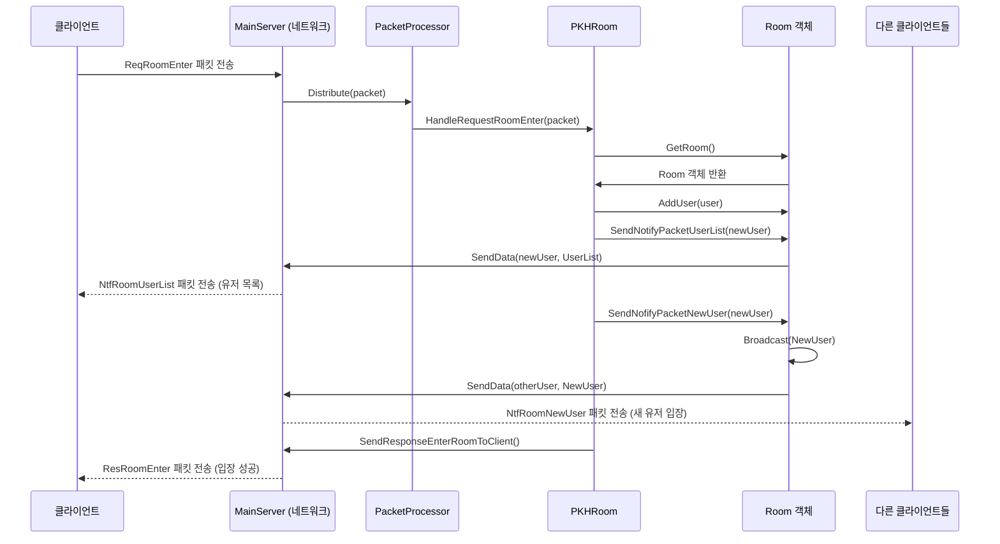
```mermaid
sequenceDiagram
    participant Client as 클라이언트
    participant Server as MainServer (네트워크)
    participant Processor as PacketProcessor
    participant RoomHandler as PKHRoom
    participant Room as Room 객체
    participant OtherClients as 다른 클라이언트들

    Client->>Server: ReqRoomEnter 패킷 전송
    Server->>Processor: Distribute(packet)
    Processor->>RoomHandler: HandleRequestRoomEnter(packet)
    RoomHandler->>Room: GetRoom()
    Room->>RoomHandler: Room 객체 반환
    RoomHandler->>Room: AddUser(user)
    RoomHandler->>Room: SendNotifyPacketUserList(newUser)
    Room->>Server: SendData(newUser, UserList)
    Server-->>Client: NtfRoomUserList 패킷 전송 (유저 목록)
    
    RoomHandler->>Room: SendNofifyPacketNewUser(newUser)
    Room->>Room: Broadcast(NewUser)
    Room->>Server: SendData(otherUser, NewUser)
    Server-->>OtherClients: NtfRoomNewUser 패킷 전송 (새 유저 입장)

    RoomHandler->>Server: SendResponseEnterRoomToClient()
    Server-->>Client: ResRoomEnter 패킷 전송 (입장 성공)

```

### 2. 방 채팅 (Room Chat) 흐름
클라이언트가 보낸 채팅 메시지를 서버가 받아서 방에 있는 모든 유저에게 전파하는 과정이다.

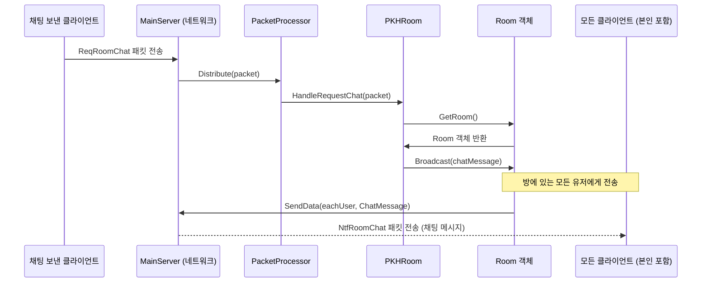
```mermaid
sequenceDiagram
    participant SenderClient as 채팅 보낸 클라이언트
    participant Server as MainServer (네트워크)
    participant Processor as PacketProcessor
    participant RoomHandler as PKHRoom
    participant Room as Room 객체
    participant AllClients as 모든 클라이언트 (본인 포함)

    SenderClient->>Server: ReqRoomChat 패킷 전송
    Server->>Processor: Distribute(packet)
    Processor->>RoomHandler: HandleRequestChat(packet)
    RoomHandler->>Room: GetRoom()
    Room->>RoomHandler: Room 객체 반환
    RoomHandler->>Room: Broadcast(chatMessage)
    
    Note over Room, AllClients: 방에 있는 모든 유저에게 전송
    Room->>Server: SendData(eachUser, ChatMessage)
    Server-->>AllClients: NtfRoomChat 패킷 전송 (채팅 메시지)

```

### 3. 방 나가기 (Room Leave) 흐름
클라이언트가 방 나가기를 요청하면, 서버는 해당 유저를 방에서 제거하고 이 사실을 방에 남아있는 다른 유저들에게 알리는 과정이다.

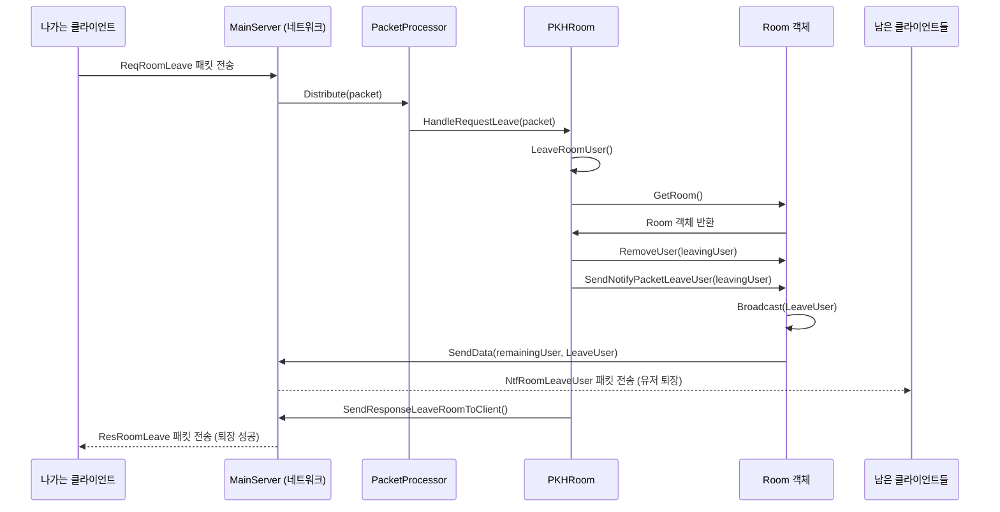
```mermaid
sequenceDiagram
    participant LeavingClient as 나가는 클라이언트
    participant Server as MainServer (네트워크)
    participant Processor as PacketProcessor
    participant RoomHandler as PKHRoom
    participant Room as Room 객체
    participant RemainingClients as 남은 클라이언트들

    LeavingClient->>Server: ReqRoomLeave 패킷 전송
    Server->>Processor: Distribute(packet)
    Processor->>RoomHandler: HandleRequestLeave(packet)
    RoomHandler->>RoomHandler: LeaveRoomUser()
    RoomHandler->>Room: GetRoom()
    Room->>RoomHandler: Room 객체 반환
    RoomHandler->>Room: RemoveUser(leavingUser)
    RoomHandler->>Room: SendNotifyPacketLeaveUser(leavingUser)
    Room->>Room: Broadcast(LeaveUser)
    Room->>Server: SendData(remainingUser, LeaveUser)
    Server-->>RemainingClients: NtfRoomLeaveUser 패킷 전송 (유저 퇴장)

    RoomHandler->>Server: SendResponseLeaveRoomToClient()
    Server-->>LeavingClient: ResRoomLeave 패킷 전송 (퇴장 성공)

```    


### 4. 클라이언트 연결이 끊어졌을 때의 흐름  

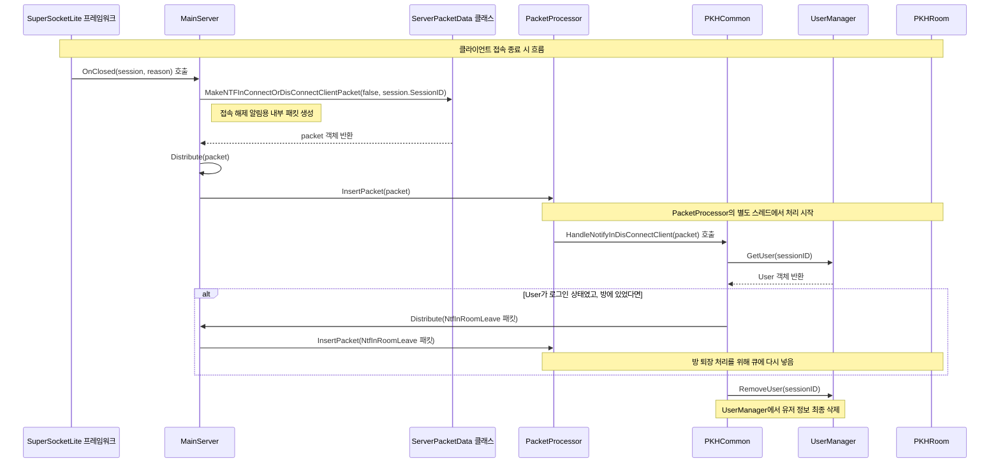
```mermaid
sequenceDiagram
    participant SuperSocketLite as SuperSocketLite 프레임워크
    participant MainServer as MainServer
    participant ServerPacketData as ServerPacketData 클래스
    participant PacketProcessor as PacketProcessor
    participant PKHCommon as PKHCommon
    participant UserManager as UserManager
    participant PKHRoom as PKHRoom

    Note over SuperSocketLite, PKHRoom: 클라이언트 접속 종료 시 흐름

    SuperSocketLite->>MainServer: OnClosed(session, reason) 호출
    MainServer->>ServerPacketData: MakeNTFInConnectOrDisConnectClientPacket(false, session.SessionID)
    Note right of MainServer: 접속 해제 알림용 내부 패킷 생성
    ServerPacketData-->>MainServer: packet 객체 반환

    MainServer->>MainServer: Distribute(packet)
    MainServer->>PacketProcessor: InsertPacket(packet)

    Note over PacketProcessor, PKHRoom: PacketProcessor의 별도 스레드에서 처리 시작
    PacketProcessor->>PKHCommon: HandleNotifyInDisConnectClient(packet) 호출
    PKHCommon->>UserManager: GetUser(sessionID)
    UserManager-->>PKHCommon: User 객체 반환

    alt User가 로그인 상태였고, 방에 있었다면
        PKHCommon->>MainServer: Distribute(NtfInRoomLeave 패킷)
        MainServer->>PacketProcessor: InsertPacket(NtfInRoomLeave 패킷)
        Note over PacketProcessor, PKHRoom: 방 퇴장 처리를 위해 큐에 다시 넣음
    end
    
    PKHCommon->>UserManager: RemoveUser(sessionID)
    Note over PKHCommon, UserManager: UserManager에서 유저 정보 최종 삭제

```

### 다이어그램 상세 설명

1.  **이벤트 발생**: 클라이언트의 접속이 끊어지면 SuperSocketLite 프레임워크가 `MainServer`의 `OnClosed` 함수를 자동으로 호출한다.
2.  **내부 패킷 생성**: `OnClosed` 함수는 접속이 끊겼다는 사실을 다른 로직에 알리기 위해 `ServerPacketData.MakeNTFInConnectOrDisConnectClientPacket`을 호출하여 내부 알림용 패킷(`NtfInDisconnectClient`)을 생성한다.
3.  **패킷 분배**: 생성된 패킷은 `Distribute` 함수를 통해 `PacketProcessor`의 처리 큐에 들어간다.
4.  **패킷 처리**: `PacketProcessor`의 처리 스레드는 큐에서 이 패킷을 꺼내어, 미리 등록된 핸들러인 `PKHCommon`의 `HandleNotifyInDisConnectClient` 함수를 호출한다.
5.  **후속 작업**:
      * `HandleNotifyInDisConnectClient` 함수는 `UserManager`를 통해 접속이 끊긴 유저의 정보를 조회한다.
      * 만약 유저가 특정 방에 들어가 있던 상태였다면, 해당 유저를 방에서 내보내는 처리를 하기 위해 또 다른 내부 패킷(`NtfInRoomLeave`)을 만들어 다시 `Distribute` 함수로 보낸다. 이 패킷은 나중에 `PKHRoom` 핸들러에 의해 처리될 것이다.
      * 모든 관련 처리가 끝나면 `UserManager`에서 해당 유저의 정보를 완전히 삭제한다.
  
  
<br>   


# Chapter.04 채팅 서버 2
채팅 서버와 거의 동일하지만 패킷 처리를 멀티스레드로 처리하는 부분이 다르다.  
또 데이터베이스 작업 처리도 하고 있다.  
  
코드는 아래에 있다.    
[SuperSocketLite Tutorials - ChatServerEx](https://github.com/jacking75/SuperSocketLite/tree/master/Tutorials/ChatServerEx ) 
    

## `ChatServer`와 `ChatServerEx`의 차이점
`ChatServerEx`는 `ChatServer`의 기본적인 기능 위에서 아키텍처를 대폭 개선하여 성능과 확장성을 크게 향상시킨 버전이다. 가장 핵심적인 차이점은 **멀티 스레딩 도입**, **데이터베이스 연동**, 그리고 **세션 상태 관리 방식의 고도화**에 있다.

### 1. 서버 아키텍처: 단일 스레드 vs 멀티 스레드
* **ChatServer (단일 스레드)**:
    * 하나의 `PacketProcessor` 클래스가 모든 패킷(로그인, 방 입장, 채팅 등)을 순차적으로 처리하는 구조다.
    * 모든 로직이 단일 스레드에서 동작하므로 구현은 단순하지만, 특정 작업이 오래 걸리면 서버 전체가 느려질 수 있고, 동시 접속자 수가 많아지면 성능 저하가 발생하기 쉽다.

* **ChatServerEx (멀티 스레드)**:
    * **`PacketDistributor`** 라는 새로운 클래스가 도입되어 컨트롤 타워 역할을 한다.
    * 패킷의 종류에 따라 처리를 분배하는 구조로 변경되었다.
        * **Common Processor (1개)**: 로그인, 방 입장 요청과 같은 공통적인 패킷을 처리하는 전용 스레드다.
        * **Room Processors (N개)**: 실제 방(Room) 내부에서 일어나는 채팅, 퇴장 등의 패킷을 처리하는 스레드 그룹이다. 방 번호에 따라 특정 스레드에 작업이 할당된다.
        * **DB Processors (N개)**: 데이터베이스 작업을 처리하는 별도의 스레드 그룹이다.
    * 이러한 멀티 스레드 구조 덕분에 각기 다른 종류의 작업을 병렬로 처리할 수 있어 서버의 전체적인 처리량과 응답성이 크게 향상되었다.
       

아래 다이어그램은 `PacketDistributor`가 어떻게 컨트롤 타워 역할을 수행하며, 패킷의 종류에 따라 각각의 전담 처리 스레드 그룹으로 작업을 분배하는지를 보여준다.

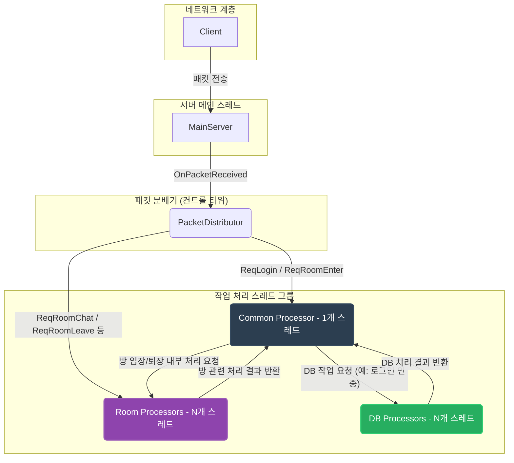
```mermaid
graph TD
    subgraph "네트워크 계층"
        A[Client]
    end

    subgraph "서버 메인 스레드"
        B[MainServer]
    end

    subgraph "패킷 분배기 (컨트롤 타워)"
        C(PacketDistributor)
    end

    subgraph "작업 처리 스레드 그룹"
        D(Common Processor - 1개 스레드)
        E(Room Processors - N개 스레드)
        F(DB Processors - N개 스레드)
    end
    
    A --"패킷 전송"--> B
    B --"OnPacketReceived"--> C
    
    C --"ReqLogin / ReqRoomEnter"--> D
    C --"ReqRoomChat / ReqRoomLeave 등"--> E
    
    D --"DB 작업 요청 (예: 로그인 인증)"--> F
    F --"DB 처리 결과 반환"--> D

    D --"방 입장/퇴장 내부 처리 요청"--> E
    E --"방 관련 처리 결과 반환"--> D
    
    style D fill:#2c3e50,stroke:#34495e,stroke-width:2px,color:#fff
    style E fill:#8e44ad,stroke:#9b59b6,stroke-width:2px,color:#fff
    style F fill:#27ae60,stroke:#2ecc71,stroke-width:2px,color:#fff

```

#### 다이어그램 상세 설명
1.  **패킷 수신**: 클라이언트(`Client`)가 보낸 모든 패킷은 가장 먼저 `MainServer`의 네트워크 계층을 통해 수신된다.

2.  **분배기 전달**: `MainServer`는 받은 패킷을 아무런 처리 없이 그대로 `PacketDistributor`에게 전달한다.

3.  **처리 분배 (컨트롤 타워 역할)**: `PacketDistributor`는 패킷의 ID를 확인하여 어떤 종류의 작업인지 판단하고, 가장 적합한 처리 스레드 그룹으로 작업을 분배한다.

      * **Common Processor (공통 처리)**: 로그인(`ReqLogin`)이나 방 입장(`ReqRoomEnter`)과 같이 여러 단계에 걸친 조정이 필요하거나, 특정 방에 종속되지 않는 공통적인 요청은 `Common Processor`에게 전달된다.
      * **Room Processors (방 전용 처리)**: 방에 이미 입장한 유저가 보내는 채팅(`ReqRoomChat`)이나 방 나가기(`ReqRoomLeave`) 요청처럼 특정 방 내부에서만 처리하면 되는 작업은, 해당 방을 담당하는 `Room Processor`에게 직접 전달된다.
      * **DB Processors (DB 전용 처리)**: `Common Processor`가 로그인 요청을 처리하다가 사용자 인증 정보가 필요해지면, 직접 DB에 접근하지 않고 `DB Processor`에게 "이 사용자 정보 좀 조회해줘" 와 같은 DB 작업을 요청한다. `DB Processor`는 이 작업만 처리하고 결과를 다시 `Common Processor`에게 돌려준다.

이처럼 각기 다른 역할을 하는 스레드들이 작업을 나눠서 병렬로 처리하기 때문에, `ChatServerEx`는 단일 스레드 구조인 `ChatServer`에 비해 훨씬 높은 성능과 안정성을 가질 수 있다. 
  

#### 스레드 별로 관리하는 Room 객체를 할당
PacketDistributor 클래스의 Create 함수   
```
public ErrorCode Create(MainServer mainServer)
{
    var roomThreadCount = MainServer.s_ServerOption.RoomThreadCount;
    
    Room.NetSendFunc = mainServer.SendData;

    SessionManager.CreateSession(ClientSession.s_MaxSessionCount);

    RoomMgr.CreateRooms();

    CommonPacketProcessor = new PacketProcessor();
    CommonPacketProcessor.CreateAndStart(true, null, mainServer, SessionManager);
                
    for (int i = 0; i < roomThreadCount; ++i)
    {
        var packetProcess = new PacketProcessor();
        packetProcess.CreateAndStart(false, RoomMgr.GetRoomList(i), mainServer, SessionManager);
        PacketProcessorList.Add(packetProcess);
    }

    DBWorker.MainLogger = MainServer.s_MainLogger;
    var error = DBWorker.CreateAndStart(MainServer.s_ServerOption.DBWorkerThreadCount, DistributeDBJobResult, MainServer.s_ServerOption.RedisAddres);
    if (error != ErrorCode.None)
    {
        return error;
    }

    return ErrorCode.None;
}
```  
   
다음은 `PacketDistributor` 클래스의 `Create` 함수에서 각 스레드가 관리하는 `Room` 객체를 할당하는 과정을 나타낸 mermaid 다이어그램입니다.

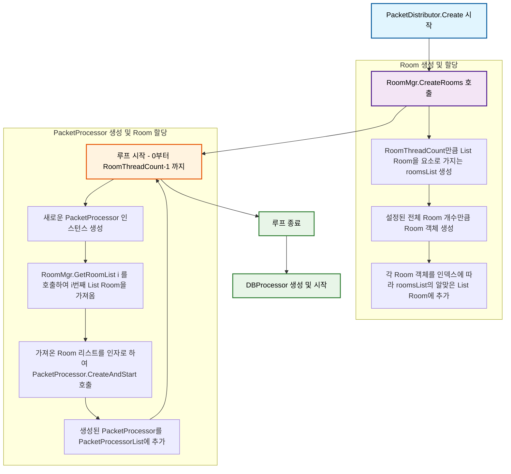
```mermaid
graph TD
    A[PacketDistributor.Create 시작] --> B[RoomMgr.CreateRooms 호출]
    
    subgraph Room_Creation["Room 생성 및 할당"]
        B --> C[RoomThreadCount만큼 List Room을 요소로 가지는 roomsList 생성]
        C --> D[설정된 전체 Room 개수만큼 Room 객체 생성]
        D --> E[각 Room 객체를 인덱스에 따라 roomsList의 알맞은 List Room에 추가]
    end
    
    B --> F[루프 시작 - 0부터 RoomThreadCount-1 까지]
    
    subgraph PacketProcessor_Creation["PacketProcessor 생성 및 Room 할당"]
        F --> G[새로운 PacketProcessor 인스턴스 생성]
        G --> H[RoomMgr.GetRoomList i 를 호출하여 i번째 List Room을 가져옴]
        H --> I[가져온 Room 리스트를 인자로 하여 PacketProcessor.CreateAndStart 호출]
        I --> J[생성된 PacketProcessor를 PacketProcessorList에 추가]
    end
    
    J --> F
    F --> K[루프 종료]
    K --> L[DBProcessor 생성 및 시작]
    
    style A fill:#e1f5fe,stroke:#01579b,stroke-width:2px,color:#000
    style B fill:#f3e5f5,stroke:#4a148c,stroke-width:2px,color:#000
    style F fill:#fff3e0,stroke:#e65100,stroke-width:2px,color:#000
    style K fill:#e8f5e8,stroke:#2e7d32,stroke-width:2px,color:#000
    style L fill:#e8f5e8,stroke:#2e7d32,stroke-width:2px,color:#000
```

##### 다이어그램 설명
1.  **Room 생성 및 할당 (RoomManager.CreateRooms)**

      * `PacketDistributor`의 `Create` 함수가 호출되면 먼저 `RoomManager`의 `CreateRooms` 함수를 실행합니다.
      * 서버 옵션에 설정된 `RoomThreadCount` 개수만큼의 `List<Room>`을 생성하여 `_roomsList`에 추가합니다.
      * 마찬가지로 옵션에 따라 필요한 전체 `Room` 객체들을 생성합니다.
      * 생성된 각 `Room` 객체들은 순서에 따라 `_roomsList`에 있는 각각의 `List<Room>`에 분배되어 할당됩니다.

2.  **PacketProcessor 생성 및 Room 할당**

      * `RoomThreadCount` 만큼 반복하는 루프를 실행합니다.
      * 루프의 각 단계에서 새로운 `PacketProcessor` 객체를 생성합니다.
      * `RoomManager`에서 현재 루프 인덱스(i)에 해당하는 `List<Room>`을 가져옵니다.
      * 이 `List<Room>`을 인자로 하여 `PacketProcessor`의 `CreateAndStart` 함수를 호출함으로써, 해당 `PacketProcessor`가 특정 `Room`들의 처리를 담당하도록 합니다.
      * 마지막으로, 생성 및 설정이 완료된 `PacketProcessor`를 `PacketProcessorList`에 추가하여 관리합니다.   


### 2. 데이터베이스 연동: 없음 vs Redis 연동
* **ChatServer (DB 없음)**:
    * 모든 유저 정보는 서버 메모리(`UserManager`)에만 저장된다.
    * 서버가 종료되면 모든 유저 데이터가 사라지는 휘발성 구조다.

* **ChatServerEx (Redis 연동)**:
    * **로그인 시 Redis DB를 사용**하여 사용자 인증을 수행한다.
    * `DB`라는 별도의 디렉터리에 `DBProcessor`, `RedisLib` 등 DB 연동을 위한 전문적인 클래스들이 추가되었다.
    * 로그인 요청이 오면 메인 로직 스레드가 DB 스레드에게 작업을 요청하고, DB 스레드가 Redis에서 인증 토큰을 검증한 후 그 결과를 다시 메인 로직 스레드에 돌려주는 **비동기 방식**으로 동작한다.
    * 이를 통해 DB 조회와 같은 시간이 걸릴 수 있는 작업이 서버의 다른 로직 처리를 막지 않도록 하여 성능을 유지한다.

### 3. 세션 및 유저 관리 방식의 변화
* **ChatServer**:
    * `UserManager`가 유저의 모든 정보(ID, 세션, 속한 방 번호 등)를 관리한다.
    * 세션을 문자열 기반의 `SessionID`로 식별한다.

* **ChatServerEx**:
    * **세션 인덱스(`SessionIndex`) 도입**: 각 클라이언트 접속마다 고유한 정수 번호를 부여하여 관리한다. 이는 문자열보다 검색 및 관리가 훨씬 효율적이다.
    * **`ConnectSessionManager` 도입**: 클라이언트의 '상태'를 전문적으로 관리하는 클래스가 추가되었다.
    * **세션 상태 기계(State Machine)**: `ConnectSession` 클래스는 각 클라이언트가 현재 어떤 상태인지(`None`, `Logining`, `Login`, `RoomEntering`, `Room`) 명시적으로 관리한다. 이를 통해 멀티스레드 환경에서 발생할 수 있는 복잡한 동시성 문제를 보다 안정적으로 제어할 수 있다.
    * `UserManager`는 이제 순수한 유저 정보(ID, 세션 인덱스)만 관리하고, 유저가 어느 방에 있는지와 같은 '상태' 정보는 `ConnectSessionManager`가 담당하도록 역할이 분리되었다.

### 4. 패킷 처리 흐름의 변화
* **ChatServer**:
    * 클라이언트 요청 -> `MainServer` -> `PacketProcessor` -> `PKH...` 핸들러에서 모든 로직 처리 완료 (동기 방식)

* **ChatServerEx**:
    * **내부 패킷 시스템 도입**: 스레드 간의 통신을 위해 내부적으로만 사용되는 패킷(예: `ReqInRoomEnter`, `ResInRoomEnter`)이 추가되었다.
    * **방 입장 흐름 예시**:
        1.  클라이언트의 방 입장 요청(`ReqRoomEnter`)은 **Common Processor**가 먼저 받는다.
        2.  Common Processor는 유저의 상태를 '방 입장 중'(`RoomEntering`)으로 바꾸고, 실제 방 입장을 처리할 **Room Processor**에게 내부 패킷(`ReqInRoomEnter`)을 보낸다.
        3.  Room Processor는 내부 패킷을 받아 유저를 방에 추가한 후, 처리 결과를 다시 Common Processor에게 내부 패킷(`ResInRoomEnter`)으로 알려준다.
        4.  최종 결과를 받은 Common Processor가 유저의 상태를 '방에 있음'(`Room`)으로 확정하고 클라이언트에게 성공 응답을 보낸다.
    * 이처럼 여러 스레드가 역할을 분담하여 점진적으로 작업을 처리하는 방식으로 변경되었다.

  
`ChatServer`가 채팅 서버의 기본 개념을 학습하기 좋은 간단한 단일 스레드 예제라면, `ChatServerEx`는 실제 서비스 환경을 고려하여 **성능, 확장성, 안정성**을 모두 대폭 강화한 실전적인 아키텍처의 서버라고 할 수 있다. 핵심은 작업을 잘게 나누어 여러 스레드에 분산시키고, 오래 걸리는 작업은 비동기로 처리하여 서버가 멈추는 일이 없도록 설계했다는 점이다.
  

## 데이터를 받은 후 패킷 처리까지의 흐름

### `OnPacketReceived(ClientSession session, EFBinaryRequestInfo reqInfo)` 함수 설명
이 함수는 SuperSocketLite 프레임워크가 클라이언트로부터 **완전한 하나의 패킷**을 수신했을 때마다 자동으로 호출되는 매우 중요한 이벤트 핸들러다. 이 함수의 주된 역할은 네트워크 계층에서 받은 원시 데이터(`EFBinaryRequestInfo`)를 서버의 로직 계층에서 사용하기 쉬운 `ServerPacketData` 형식으로 변환하고, 이를 패킷 분배기(`PacketDistributor`)에게 전달하는 것이다.

```csharp
void OnPacketReceived(ClientSession session, EFBinaryRequestInfo reqInfo)
{
    // 1. 디버그 로그 기록
    s_MainLogger.Debug(string.Format("세션 번호 {0} 받은 데이터 크기: {1}, ThreadId: {2}", session.SessionID, reqInfo.Body.Length, System.Threading.Thread.CurrentThread.ManagedThreadId));

    // 2. ServerPacketData 객체 생성
    var packet = new ServerPacketData();
    packet.SessionID = session.SessionID;
    packet.SessionIndex = session.SessionIndex;
    packet.PacketSize = reqInfo.Size;            
    packet.PacketID = reqInfo.PacketID;
    packet.Type = reqInfo.Type;
    packet.BodyData = reqInfo.Body;
            
    // 3. 패킷 분배기에게 전달
    Distributor.Distribute(packet);
}
```

1.  **로그 기록**: 어떤 클라이언트(`session.SessionID`)로부터 얼마나 큰 데이터를 받았는지, 그리고 이 코드를 실행하는 스레드의 ID는 무엇인지 디버그용 로그를 남긴다.
2.  **데이터 변환**:
      * 새로운 `ServerPacketData` 객체를 생성한다.
      * SuperSocketLite가 전달해준 `session` 객체와 `reqInfo` 객체로부터 `SessionID`, `SessionIndex`, 패킷의 전체 크기, 패킷 ID, 타입, 그리고 실제 데이터(Body)를 `ServerPacketData` 객체의 각 필드에 복사하여 채워 넣는다.
3.  **패킷 분배**: 모든 정보가 담긴 `packet` 객체를 `Distributor.Distribute(packet)` 메서드를 호출하여 전달한다. 이 시점 이후의 모든 복잡한 처리 과정은 `PacketDistributor`가 담당하게 되며, `OnPacketReceived` 함수의 역할은 여기서 끝난다.

### 코드 흐름 Mermaid 다이어그램
`OnPacketReceived` 함수가 호출되고 패킷이 `PacketDistributor`로 전달되는 과정의 흐름은 다음과 같다.

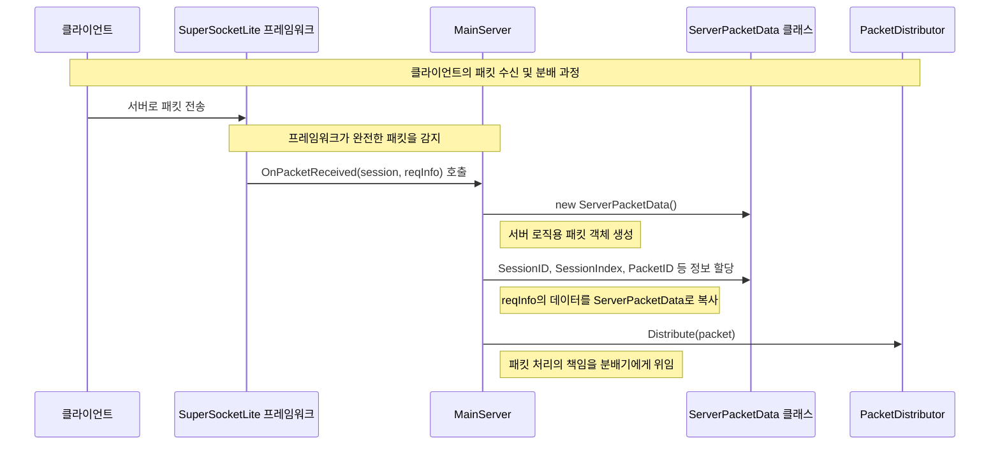
```mermaid
sequenceDiagram
    participant Client as 클라이언트
    participant SuperSocketLite as SuperSocketLite 프레임워크
    participant MainServer as MainServer
    participant ServerPacketData as ServerPacketData 클래스
    participant Distributor as PacketDistributor

    Note over Client, Distributor: 클라이언트의 패킷 수신 및 분배 과정
    
    Client->>SuperSocketLite: 서버로 패킷 전송
    
    Note over SuperSocketLite, MainServer: 프레임워크가 완전한 패킷을 감지
    SuperSocketLite->>MainServer: OnPacketReceived(session, reqInfo) 호출
    
    MainServer->>ServerPacketData: new ServerPacketData()
    Note right of MainServer: 서버 로직용 패킷 객체 생성

    MainServer->>ServerPacketData: SessionID, SessionIndex, PacketID 등 정보 할당
    Note right of MainServer: reqInfo의 데이터를 ServerPacketData로 복사
    
    MainServer->>Distributor: Distribute(packet)
    Note right of MainServer: 패킷 처리의 책임을 분배기에게 위임

```  
  
### `Distribute(ServerPacketData requestPacket)` 함수 설명
`Distribute` 함수는 `PacketDistributor` 클래스의 가장 핵심적인 메서드로, `MainServer`로부터 전달받은 클라이언트의 모든 요청 패킷을 **어떤 스레드(Processor)에서 처리할지 결정하고 전달하는 중앙 관제 센터(Control Tower)의 역할**을 수행한다.

```csharp
public void Distribute(ServerPacketData requestPacket)
{
    var packetId = (PacketId)requestPacket.PacketID;
    var sessionIndex = requestPacket.SessionIndex;
                
    // 1. 서버 내부용 패킷인지, 클라이언트 요청 패킷인지 검사
    if(IsClientRequestPacket(packetId) == false)
    {
        MainServer.s_MainLogger.Debug("[Distribute] - 클라리언트의 요청 패킷이 아니다.");
        return; 
    }

    // 2. 공용(Common) 패킷인지 확인
    if(IsClientRequestCommonPacket(packetId))
    {
        DistributeCommon(true, requestPacket); // 3. Common Processor로 전달
        return;
    }

    // 4. Room 패킷 처리
    var roomNumber = SessionManager.GetRoomNumber(sessionIndex);
    if(DistributeRoomProcessor(true, false, roomNumber, requestPacket) == false) // 5. Room Processor로 전달
    {
        return;
    }            
}
```

1.  **클라이언트 요청 검사**: `IsClientRequestPacket` 함수를 통해, 이 패킷이 서버 내부에서 생성된 패킷이 아닌 순수 클라이언트의 요청 패킷이 맞는지 확인한다. 아니라면, 잘못된 요청으로 간주하고 처리를 중단한다.
2.  **공용 패킷 여부 확인**: `IsClientRequestCommonPacket` 함수를 통해 패킷이 로그인(`ReqLogin`)이나 방 입장(`ReqRoomEnter`)처럼 특정 방에 소속되지 않은 '공통' 기능 요청인지 확인한다.
3.  **공용 패킷 처리**: 만약 공통 패킷이 맞다면, `DistributeCommon` 함수를 호출하여 `CommonPacketProcessor`의 처리 큐에 패킷을 넣는다.
4.  **방 관련 패킷 처리**: 공통 패킷이 아니라면, 해당 유저가 속한 방에서 처리해야 할 패킷(예: 채팅)으로 간주한다. `SessionManager`를 통해 요청을 보낸 클라이언트의 `sessionIndex`로 현재 어느 방(`roomNumber`)에 있는지 조회한다.
5.  **방 전담 처리**: `DistributeRoomProcessor` 함수를 호출한다. 이 함수는 `roomNumber`를 보고, 여러 `Room Processor` 스레드 중 해당 방을 담당하는 스레드를 찾아 그 스레드의 처리 큐에 패킷을 넣는 역할을 수행한다.

결론적으로 이 함수는 패킷의 종류를 빠르고 정확하게 식별하여, 그에 맞는 전문 처리 스레드에게 작업을 효율적으로 분배하는 역할을 담당한다.

### 코드 흐름 Mermaid 다이어그램
`Distribute` 함수의 내부 로직 흐름을 나타내는 다이어그램은 다음과 같다.  
   
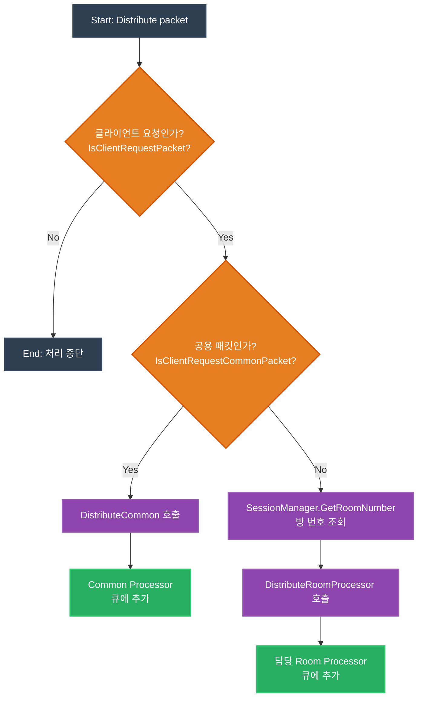
```mermaid
flowchart TD
    A[Start: Distribute packet] --> B{클라이언트 요청인가?<br/>IsClientRequestPacket?}
    B -->|No| C[End: 처리 중단]
    B -->|Yes| D{공용 패킷인가?<br/>IsClientRequestCommonPacket?}
    D -->|Yes| E[DistributeCommon 호출]
    E --> F[Common Processor<br/>큐에 추가]
    D -->|No| G[SessionManager.GetRoomNumber<br/>방 번호 조회]
    G --> H[DistributeRoomProcessor 호출]
    H --> I[담당 Room Processor<br/>큐에 추가]
    
    classDef startEnd fill:#2c3e50,stroke:#34495e,stroke-width:2px,color:#fff
    classDef decision fill:#e67e22,stroke:#d35400,stroke-width:2px,color:#fff
    classDef process fill:#8e44ad,stroke:#9b59b6,stroke-width:2px,color:#fff
    classDef queue fill:#27ae60,stroke:#2ecc71,stroke-width:2px,color:#fff
    
    class A,C startEnd
    class B,D decision
    class E,G,H process
    class F,I queue
```
      
### 주요 처리 단계
1. OnPacketReceived
* 세션과 요청 정보를 받아서 ServerPacketData 생성
  
2. Distributor.Distribute
* 클라이언트 요청 패킷인지 검증  
* 공통 패킷인지 룸 패킷인지 구분
  
3. 패킷 분배
* 공통 패킷: CommonPacketProcessor로 전달. 방에 있는 클라이언트에서 요청한 것이 아닌 것들. 예) 로그인  
* 룸 패킷: 해당 방의 PacketProcessor로 전달. 방에 있는 클라이언트에서 요청한 것. 예) 방 채팅
  
4. PacketProcessor 처리
* BufferBlock에 패킷 저장  
* 별도 스레드에서 패킷 처리  
* 등록된 패킷 핸들러 맵에서 해당 처리기 실행  
* 이 구조를 통해 패킷은 체계적으로 분류되고 적절한 처리기에 의해 비동기적으로 처리됩니다.
  
  
## ChatServerEx 멀티스레드 구조

### ChatServerEx 멀티스레드 구조 설명
`ChatServerEx`의 핵심은 **역할 기반의 철저한 작업 분리**다. 단일 스레드가 모든 것을 처리하던 `ChatServer`와 달리, `ChatServerEx`는 성격이 다른 작업들을 별도의 전담 스레드 그룹에 할당하여 병렬로 처리함으로써 서버의 전체 처리량과 안정성을 극대화하는 구조를 가진다. 이 모든 스레드의 작업을 지휘하는 컨트롤 타워가 바로 **`PacketDistributor`** 클래스다.

#### 1. 스레드의 종류와 역할
`ChatServerEx`는 크게 3가지 종류의 작업 처리 스레드(Processor) 그룹을 사용한다.

  * **Common Processor (공용 처리 스레드 - 1개)**

      * **역할**: 클라이언트의 초기 요청을 처리하고, 여러 스레드에 걸친 작업의 흐름을 조율하는 **매니저** 역할을 한다.
      * **담당 작업**: 로그인 요청(`ReqLogin`), 방 입장 요청(`ReqRoomEnter`)과 같이 특정 방에 아직 소속되지 않은 상태의 공통 패킷을 전담한다.
      * **동작 방식**: 로그인 시 DB 인증이 필요하면 **DB Processor**에게 작업을 요청하고, 방 입장 시에는 실제 입장을 처리할 **Room Processor**에게 내부 패킷을 전달하는 등, 다른 스레드 그룹과의 통신을 시작하는 출발점 역할을 한다. `PacketProcessor` 클래스를 `IsCommon=true`로 하여 생성한다.

  * **Room Processors (방 전용 처리 스레드 - N개)**

      * **역할**: 실제 방 내부에서 발생하는 모든 상호작용을 처리하는 **실무자** 역할을 한다.
      * **담당 작업**: 방 채팅(`ReqRoomChat`), 방 나가기(`ReqRoomLeave`) 등 이미 방에 입장한 유저들의 패킷을 처리한다.
      * **동작 방식**: 서버 옵션에 따라 여러 개의 스레드가 생성되며, 각 스레드는 전체 방의 일부를 나누어 담당한다. 예를 들어 100개의 방과 4개의 Room Processor 스레드가 있다면, 각 스레드가 25개씩의 방을 전담하는 식이다. 이를 통해 특정 방의 채팅 트래픽이 많아져도 다른 방에 영향을 주지 않고 독립적으로 처리할 수 있다.

  * **DB Processors (데이터베이스 처리 스레드 - N개)**

      * **역할**: Redis와 같이 외부 데이터베이스와 통신하는 느린 I/O 작업을 전담하는 **외부 전문가** 역할을 한다.
      * **담당 작업**: 사용자 로그인 시 인증 토큰을 Redis에서 조회하는 등의 DB 관련 작업을 모두 처리한다.
      * **동작 방식**: `DBProcessor`는 `Common Processor` 등 다른 스레드로부터 DB 작업 요청(`DBQueue`)을 받으면, 이를 큐에 넣고 순차적으로 처리한다. 처리가 완료되면 그 결과를 다시 요청했던 스레드(주로 Common Processor)에게 돌려준다. 이를 통해 DB 조회로 인한 대기 시간이 게임 로직을 처리하는 다른 중요한 스레드들을 지연시키는 것을 완벽하게 방지한다.

#### 2. 스레드 간의 통신
스레드 간의 통신은 **스레드 안전 큐(`BufferBlock`)** 를 통해 이루어진다.

  * `PacketDistributor`는 패킷을 받으면 해당 패킷을 처리할 스레드(Common 또는 Room Processor)의 `BufferBlock` 큐에 `ServerPacketData`를 넣어준다 (`Post` 또는 `InsertMsg` 호출).
  * `Common Processor`는 DB 작업이 필요할 때, `DBProcessor`의 `BufferBlock` 큐에 `DBQueue` 객체를 넣어준다.
  * 각 Processor 스레드는 자신의 `while` 루프 안에서 큐에 데이터가 들어오기를 기다리다가(`Receive`), 데이터가 들어오면 이를 꺼내 처리하는 생산자-소비자 패턴으로 동작한다.

### 멀티스레드 구조 Mermaid 다이어그램
`ChatServerEx`의 전체적인 멀티스레드 구조와 패킷 처리 흐름을 나타낸 다이어그램이다.

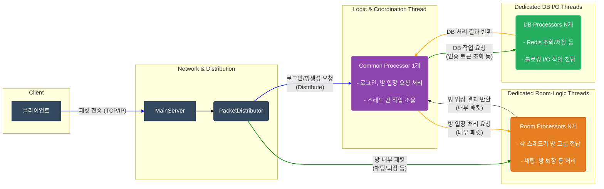
```mermaid
graph LR
    subgraph Client
        direction LR
        A[클라이언트]
    end

    subgraph Network_Distribution["Network & Distribution"]
        direction TB
        B[MainServer] --> C(PacketDistributor)
    end
    
    subgraph Logic_Coordination["Logic & Coordination Thread"]
        direction TB
        D("
            Common Processor 1개<br/>
            - 로그인, 방 입장 요청 처리<br/>
            - 스레드 간 작업 조율
        ")
    end

    subgraph Dedicated_Room["Dedicated Room-Logic Threads"]
        direction TB
        E("
            Room Processors N개<br/>
            - 각 스레드가 방 그룹 전담<br/>
            - 채팅, 방 퇴장 등 처리
        ")
    end

    subgraph Dedicated_DB["Dedicated DB I/O Threads"]
        direction TB
        F("
            DB Processors N개<br/>
            - Redis 조회/저장 등<br/>
            - 블로킹 I/O 작업 전담
        ")
    end

    A -- "패킷 전송 (TCP/IP)" --> B
    
    C -- "로그인/방생성 요청<br/>(Distribute)" --> D
    C -- "방 내부 패킷<br/>(채팅/퇴장 등)" --> E
    
    D -- "DB 작업 요청<br/>(인증 토큰 조회 등)" --> F
    F -- "DB 처리 결과 반환" --> D
    
    D -- "방 입장 처리 요청<br/>(내부 패킷)" --> E
    E -- "방 입장 결과 반환<br/>(내부 패킷)" --> D

    linkStyle 0 stroke-width:2px,fill:none,stroke:black
    linkStyle 1 stroke-width:1.5px,fill:none,stroke:blue
    linkStyle 2 stroke-width:1.5px,fill:none,stroke:blue
    linkStyle 3 stroke-width:1.5px,fill:none,stroke:green
    linkStyle 4 stroke-width:1.5px,fill:none,stroke:green
    linkStyle 5 stroke-width:1.5px,fill:none,stroke:orange
    linkStyle 6 stroke-width:1.5px,fill:none,stroke:orange

    style A fill:#34495e,stroke:#2c3e50,stroke-width:2px,color:#fff
    style B fill:#34495e,stroke:#2c3e50,stroke-width:2px,color:#fff
    style C fill:#34495e,stroke:#2c3e50,stroke-width:2px,color:#fff
    style D fill:#8e44ad,stroke:#9b59b6,stroke-width:2px,color:#fff
    style E fill:#e67e22,stroke:#d35400,stroke-width:2px,color:#fff
    style F fill:#27ae60,stroke:#2ecc71,stroke-width:2px,color:#fff
```
  

## PacketDistributor, PacketProcessor

PacketDistributor.cs
```
public class PacketDistributor
{
    ConnectSessionManager SessionManager = new ConnectSessionManager();
    
    PacketProcessor CommonPacketProcessor = null;
    List<PacketProcessor> PacketProcessorList = new List<PacketProcessor>();

    DBProcessor DBWorker = new DBProcessor();

    RoomManager RoomMgr = new RoomManager();
}
```  

### 클래스 간의 관계 설명
이 세 클래스의 관계를 한마디로 정의하면 **'총괄 지휘관과 전문 실무팀'** 의 관계라고 할 수 있다.

  * **`PacketProcessor` (실무팀의 '역할 정의서' 또는 '템플릿')**:

      * 이 클래스는 독립된 스레드에서 패킷을 처리하는 **'방법'** 을 정의한 일반적인(Generic) 클래스다.
      * 이 클래스 자체는 '공용' 패킷을 처리할지, '방' 패킷을 처리할지 결정하지 않는다. 단지 `BufferBlock` 큐에서 패킷을 꺼내 `_packetHandlerMap`에 등록된 함수를 실행하는 표준화된 작업 절차만을 가지고 있다.

  * **`CommonPacketProcessor` (공용 업무 전담팀)**:

      * `CommonPacketProcessor`는 별개의 클래스 파일이 아니라, `PacketDistributor` 내에서 `PacketProcessor` 클래스를 **`IsCommon = true`** 로 설정하여 생성한 **'인스턴스(객체)'** 다.
      * 이 인스턴스는 `PKHCommon` 핸들러를 사용하여 로그인, 방 입장 요청과 같은 서버의 공통적인 작업을 처리하도록 특화되어 있다. 즉, `PacketProcessor`라는 템플릿으로 '공용 업무팀'을 하나 만든 것이다.

  * **`PacketDistributor` (총괄 지휘관)**:

      * 이 클래스는 서버의 모든 패킷 처리 흐름을 총괄하는 **'지휘관'** 이다.
      * `PacketDistributor`는 자신의 멤버 변수로 `CommonPacketProcessor` 인스턴스 **한 개**와, `PacketProcessorList`라는 이름으로 `Room Processor` 인스턴스 **여러 개**를 생성하고 소유한다.
      * 외부(`MainServer`)로부터 패킷을 받으면, 패킷의 종류를 분석하여 이 요청을 처리할 가장 적합한 팀, 즉 `CommonPacketProcessor`에게 보낼지 아니면 여러 `Room Processor` 중 하나에게 보낼지를 결정하고 작업을 할당(`InsertMsg`)하는 역할을 수행한다.

**결론적으로, `PacketDistributor`가 지휘관으로서 `PacketProcessor`라는 동일한 설계도(클래스)로 만들어진 `CommonPacketProcessor`팀과 여러 개의 `Room Processor`팀에게 적절한 임무(패킷)를 분배하는 구조라고 할 수 있다.**

### 코드 흐름 Mermaid 다이어그램
`PacketDistributor`가 패킷을 받아 `CommonPacketProcessor` 또는 `Room Processor` 인스턴스에게 작업을 전달하는 전체 흐름을 다이어그램으로 나타내면 다음과 같다.

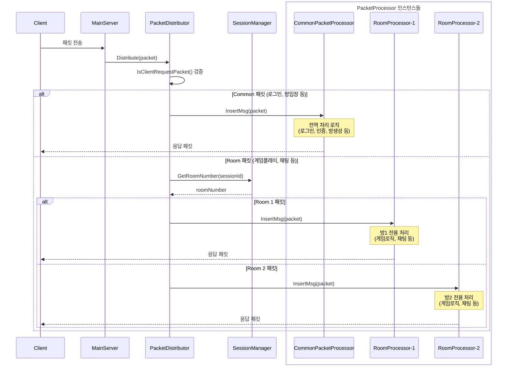
```mermaid
sequenceDiagram
    participant Client as Client
    participant MainServer as MainServer
    participant Distributor as PacketDistributor
    participant SessionMgr as SessionManager
    
    box PacketProcessor 인스턴스들
        participant CommonP as CommonPacketProcessor
        participant RoomP1 as RoomProcessor-1
        participant RoomP2 as RoomProcessor-2
    end

    Client->>MainServer: 패킷 전송
    MainServer->>Distributor: Distribute(packet)
    
    Distributor->>Distributor: IsClientRequestPacket() 검증
    
    alt Common 패킷 (로그인, 방입장 등)
        Distributor->>CommonP: InsertMsg(packet)
        Note over CommonP: 전역 처리 로직<br/>(로그인, 인증, 방생성 등)
        CommonP-->>Client: 응답 패킷
        
    else Room 패킷 (게임플레이, 채팅 등)
        Distributor->>SessionMgr: GetRoomNumber(sessionId)
        SessionMgr-->>Distributor: roomNumber
        
        alt Room 1 패킷
            Distributor->>RoomP1: InsertMsg(packet)
            Note over RoomP1: 방1 전용 처리<br/>(게임로직, 채팅 등)
            RoomP1-->>Client: 응답 패킷
            
        else Room 2 패킷  
            Distributor->>RoomP2: InsertMsg(packet)
            Note over RoomP2: 방2 전용 처리<br/>(게임로직, 채팅 등)
            RoomP2-->>Client: 응답 패킷
        end
    end
```  

1.  **패킷 수신**: `MainServer`가 클라이언트로부터 패킷을 받으면, 가장 먼저 `PacketDistributor`의 `Distribute` 함수를 호출한다.
2.  **작업 분석 및 분배**: `Distributor`는 수신된 패킷의 ID를 확인한다.
3.  **공용 작업 처리**: 만약 패킷이 `ReqLogin`이나 `ReqRoomEnter`와 같이 공통적인 작업이라면, `Distributor`는 자신이 관리하는 `CommonPacketProcessor` 인스턴스의 `InsertMsg` 함수를 호출하여 패킷을 전달한다.
4.  **방 전용 작업 처리**: 만약 패킷이 그 외의 방 관련 작업이라면, `Distributor`는 해당 유저가 속한 방 번호를 찾아, 그 방을 담당하는 `Room Processor` 인스턴스의 `InsertMsg` 함수를 호출하여 패킷을 전달한다.
5.  **비동기 처리**: `InsertMsg` 함수는 단순히 패킷을 해당 Processor의 처리 큐에 넣고 즉시 반환되므로, `Distributor`는 다음 요청을 받기 위해 지체 없이 대기할 수 있다. 실제 패킷 처리는 각 Processor의 별도 스레드에서 비동기적으로 이루어진다.
  
    
### PacketDistributor 클래스 개요
`PacketDistributor` 클래스는 `ChatServerEx` 아키텍처의 가장 핵심적인 **중앙 관제 센터(Control Tower)이자 총괄 지휘관**이다. `MainServer`가 클라이언트로부터 패킷을 수신하면, 이 클래스는 해당 패킷의 종류를 분석하여 **Common Processor, Room Processor, DB Processor** 등 어떤 전문 처리 스레드 그룹에게 작업을 분배할지 결정하고 전달하는 역할을 전담한다. 이를 통해 복잡한 멀티스레드 환경의 작업 흐름을 일관되게 관리하고 제어한다.

### 멤버 변수
  * `ConnectSessionManager SessionManager`: 클라이언트 세션의 상태(로그인 여부, 속한 방 번호 등)를 관리하는 객체다.
  * `PacketProcessor CommonPacketProcessor`: 공통 기능(로그인, 방 입장 요청 등)을 처리하는 단일 스레드 프로세서 객체다.
  * `List<PacketProcessor> PacketProcessorList`: 방 관련 기능(채팅 등)을 처리하는 다중 스레드 프로세서 객체들의 리스트다.
  * `DBProcessor DBWorker`: 데이터베이스 관련 작업을 처리하는 프로세서 객체다.
  * `RoomManager RoomMgr`: 모든 방을 생성하고 관리하는 객체다.

-----

### 멤버 함수 및 코드 설명

#### `Create(MainServer mainServer)`

서버 시작 시 호출되어, 서버 운영에 필요한 모든 핵심 컴포넌트(각종 Processor, Manager 등)를 생성하고 시작하는 함수다.

```csharp
public ErrorCode Create(MainServer mainServer)
{
    // ...
    SessionManager.CreateSession(ClientSession.s_MaxSessionCount); // 1. 세션 관리자 생성

    RoomMgr.CreateRooms(); // 2. 모든 방 생성

    // 3. 공통 패킷 처리기 생성 및 시작
    CommonPacketProcessor = new PacketProcessor();
    CommonPacketProcessor.CreateAndStart(true, null, mainServer, SessionManager);
                
    // 4. 방 패킷 처리기들 생성 및 시작
    for (int i = 0; i < roomThreadCount; ++i)
    {
        var packetProcess = new PacketProcessor();
        packetProcess.CreateAndStart(false, RoomMgr.GetRoomList(i), mainServer, SessionManager);
        PacketProcessorList.Add(packetProcess);
    }

    // 5. DB 작업 처리기 생성 및 시작
    DBWorker.CreateAndStart(...);
    // ...
}
```

1.  클라이언트의 최대 연결 수만큼 `ConnectSession`을 관리할 `SessionManager`를 생성한다.
2.  `RoomManager`를 통해 설정에 명시된 모든 방을 미리 생성한다.
3.  공통 패킷을 처리할 `CommonPacketProcessor` 인스턴스를 하나 생성하고, `CreateAndStart(true, ...)`를 호출하여 전용 스레드를 시작시킨다.
4.  설정에 명시된 `roomThreadCount` 만큼 `for` 루프를 돌면서, 각각의 방 그룹을 전담할 `PacketProcessor` 인스턴스(Room Processor)들을 생성하고 스레드를 시작시킨다.
5.  Redis와 통신하며 DB 작업을 처리할 `DBWorker`를 생성하고 관련 스레드들을 시작시킨다.

#### `Destory()`
서버를 종료할 때 모든 스레드를 안전하게 중지시키는 함수다.

```csharp
public void Destory()
{
    DBWorker.Destory();
    CommonPacketProcessor.Destory();
    PacketProcessorList.ForEach(preocess => preocess.Destory());
    // ...
}
```

  * `DBWorker`, `CommonPacketProcessor`, 그리고 `PacketProcessorList`에 있는 모든 Room Processor들의 `Destory()` 메서드를 순차적으로 호출하여, 각 스레드가 정상적으로 종료되도록 한다.
  

#### `Distribute(ServerPacketData requestPacket)`
`MainServer`로부터 패킷을 받아 어떤 프로세서에게 전달할지 결정하는 가장 핵심적인 라우팅 함수다.

```csharp
public void Distribute(ServerPacketData requestPacket)
{
    var packetId = (PacketId)requestPacket.PacketID;
    // ...
    if(IsClientRequestPacket(packetId) == false) { return; } // 1. 클라이언트 요청인지 확인

    if(IsClientRequestCommonPacket(packetId)) // 2. 공용 패킷인지 확인
    {
        DistributeCommon(true, requestPacket); // 3. Common Processor로 전달
        return;
    }

    // 4. Room Processor로 전달
    var roomNumber = SessionManager.GetRoomNumber(sessionIndex);
    DistributeRoomProcessor(true, false, roomNumber, requestPacket);
    //...
}
```

1.  `IsClientRequestPacket` 함수를 통해 클라이언트가 보낸 유효한 요청인지 먼저 확인한다.
2.  `IsClientRequestCommonPacket` 함수로 로그인(`ReqLogin`)이나 방 입장(`ReqRoomEnter`) 같은 공용 패킷인지 확인한다.
3.  공용 패킷이 맞다면 `DistributeCommon` 함수를 호출하여 `CommonPacketProcessor`에게 작업을 넘긴다.
4.  공용 패킷이 아니라면 방 내부 패킷(채팅 등)으로 간주하고, `SessionManager`에서 유저의 방 번호를 조회한 뒤 `DistributeRoomProcessor`를 호출하여 해당 방을 담당하는 `Room Processor`에게 작업을 넘긴다.

#### `DistributeCommon(bool isClientPacket, ServerPacketData requestPacket)`
패킷을 `CommonPacketProcessor`의 처리 큐에 넣는 함수다.

```csharp
public void DistributeCommon(bool isClientPacket, ServerPacketData requestPacket)
{
    CommonPacketProcessor.InsertMsg(isClientPacket, requestPacket);
}
```

  * `CommonPacketProcessor`의 `InsertMsg` 메서드를 호출하여, 해당 프로세서의 `BufferBlock` 큐에 패킷을 추가한다.

#### `DistributeRoomProcessor(bool isClientPacket, bool isPreRoomEnter, int roomNumber, ServerPacketData requestPacket)`
패킷을 담당 `Room Processor`의 처리 큐에 넣는 함수다.

```csharp
public bool DistributeRoomProcessor(...)
{
    var processor = PacketProcessorList.Find(x => x.관리중인_Room(roomNumber)); // 1. 담당 프로세서 검색
    if (processor != null)
    {
        // ...
        processor.InsertMsg(isClientPacket, requestPacket); // 2. 큐에 추가
        return true;
    }
    //...
}
```

1.  `PacketProcessorList`에서 `관리중인_Room(roomNumber)` 조건을 만족하는, 즉 인자로 받은 `roomNumber`를 담당하고 있는 `PacketProcessor` 인스턴스를 찾는다.
2.  담당 프로세서를 찾았다면, `InsertMsg`를 호출하여 해당 프로세서의 큐에 패킷을 추가한다.

#### `DistributeDBJobRequest(DBQueue dbQueue)` 및 `DistributeDBJobResult(DBResultQueue resultData)`
DB 작업 요청과 결과 처리를 중계하는 함수들이다.

```csharp
public void DistributeDBJobRequest(DBQueue dbQueue)
{
    DBWorker.InsertMsg(dbQueue);
}

public void DistributeDBJobResult(DBResultQueue resultData)
{
    // ...
    DistributeCommon(false, requestPacket);            
}
```

  * `DistributeDBJobRequest`: `PKHCommon` 같은 핸들러가 DB 작업이 필요할 때 호출하며, 이 함수는 작업을 `DBWorker`의 큐에 넣는다.
  * `DistributeDBJobResult`: `DBWorker`가 작업을 마친 후 결과를 반환하기 위해 이 함수를 호출한다. 함수는 DB 결과를 다시 `ServerPacketData`로 변환하여, 이 결과를 기다리고 있던 `CommonPacketProcessor`에게 전달하여 후속 처리를 하도록 한다.

  

### PacketProcessor 클래스 개요
`PacketProcessor` 클래스는 `ChatServerEx` 프로젝트에서 **독립된 스레드에서 패킷을 처리하는 표준화된 실행 단위(Worker)** 역할을 하는 매우 중요한 범용 클래스다. 이 클래스 하나가 '공용 처리기'가 되기도 하고 '방 전용 처리기'가 되기도 하는 **재사용 가능한 템플릿**으로 설계되었다.

주요 역할은 `BufferBlock`이라는 스레드 안전 큐를 통해 외부로부터 처리할 패킷을 전달받고, 자신의 전용 스레드에서 이 패킷들을 하나씩 꺼내어 미리 등록된 처리 함수(`PacketHandler`)를 실행하는 것이다. 이를 통해 시간이 걸리는 작업이 다른 부분에 영향을 주지 않도록 격리시키는 역할을 수행한다.

### 멤버 변수
  * `_공용_프로세서`: 이 `PacketProcessor` 인스턴스가 공용(Common) 작업을 처리할지, 방(Room) 관련 작업을 처리할지를 구분하는 플래그다.
  * `_isThreadRunning`, `_processThread`: 패킷 처리 루프를 실행하는 스레드의 실행 상태와 실제 스레드 객체다.
  * `_packetBuffer`: 외부로부터 전달된 `ServerPacketData`를 임시로 저장하는 스레드 안전 큐다.
  * `_roomNumberRange`, `_roomList`: 이 프로세서가 '방 전용 처리기'일 경우, 자신이 담당하는 방의 번호 범위와 방 객체 리스트를 저장한다.
  * `_packetHandlerMap`: 패킷 ID를 키(Key)로, 해당 패킷을 처리할 함수를 값(Value)으로 가지는 딕셔너리다.
  * `_commonPacketHandler`, `_roomPacketHandler`: 실제 패킷 처리 로직이 담긴 핸들러 클래스 객체다.

-----

### 멤버 함수 및 코드 설명

#### `CreateAndStart(bool IsCommon, List<Room> roomList, MainServer mainServer, ConnectSessionManager sessionMgr)`
`PacketProcessor` 인스턴스를 생성하고, 전용 스레드를 시작하여 패킷을 처리할 준비를 마치는 초기화 함수다.

```csharp
public void CreateAndStart(bool IsCommon, List<Room> roomList, MainServer mainServer, ConnectSessionManager sessionMgr)
{
    _공용_프로세서 = IsCommon; // 1. 프로세서 종류 설정

    if (IsCommon == false) // 2. 방 전용 프로세서일 경우
    {
        _roomList = roomList;
        // 담당할 방 번호 범위를 설정
        var minRoomNum = _roomList[0].Number;
        var maxRoomNum = _roomList[0].Number + _roomList.Count() - 1;
        _roomNumberRange = new Tuple<int, int>(minRoomNum, maxRoomNum);
    }

    RegistPacketHandler(mainServer, sessionMgr); // 3. 패킷 핸들러 등록

    // 4. 스레드 생성 및 시작
    _isThreadRunning = true;
    _processThread = new System.Threading.Thread(this.Process);
    _processThread.Start();
}
```

1.  `IsCommon` 플래그를 통해 이 인스턴스가 '공용 처리기'인지 '방 전용 처리기'인지 역할을 정의한다.
2.  만약 '방 전용 처리기'라면(`IsCommon == false`), 자신이 담당할 `roomList`를 받아오고, `PacketDistributor`가 자신을 쉽게 찾을 수 있도록 담당할 방 번호의 최소/최대 범위를 `_roomNumberRange`에 저장한다.
3.  `RegistPacketHandler`를 호출하여 역할에 맞는 패킷 처리 함수들을 `_packetHandlerMap`에 등록한다.
4.  패킷 처리 루프인 `Process` 함수를 실행할 새로운 스레드를 생성하고 시작시킨다.

#### `Destory()`
서버 종료 시, 실행 중인 스레드를 안전하게 중지시키는 함수다.

```csharp
public void Destory()
{
    _isThreadRunning = false;
    _packetBuffer.Complete();
}
```

  * `_isThreadRunning` 플래그를 `false`로 바꿔 `Process` 함수의 `while` 루프가 종료되도록 신호를 보낸다.
  * `_packetBuffer.Complete()`를 호출하여 더 이상 큐에 데이터가 들어오지 않을 것임을 알리고, 큐가 비어있다면 `Receive()`에서 즉시 예외를 발생시켜 스레드가 깔끔하게 종료되도록 유도한다.

#### `관리중인_Room(int roomNumber)`
`PacketDistributor`가 특정 방을 담당하는 `PacketProcessor`를 찾기 위해 호출하는 함수다.

```csharp
public bool 관리중인_Room(int roomNumber)
{
    return roomNumber >= _roomNumberRange.Item1 && roomNumber <= _roomNumberRange.Item2;
}
```

  * 인자로 받은 `roomNumber`가 자신이 관리하는 방 번호 범위(`_roomNumberRange`) 내에 있는지 확인하여 `true` 또는 `false`를 반환한다.

#### `InsertMsg(bool isClientRequest, ServerPacketData data)`
외부(주로 `PacketDistributor`)에서 처리할 패킷을 이 프로세서의 큐에 넣기 위해 호출하는 함수다.

```csharp
public void InsertMsg(bool isClientRequest, ServerPacketData data)
{
    // ...
    _packetBuffer.Post(data);
}
```

  * 전달받은 `ServerPacketData`를 `_packetBuffer.Post(data)`를 통해 자신의 처리 큐에 추가한다. 이 작업은 매우 빠르기 때문에, 호출한 쪽(Distributor)은 지연 없이 다음 작업을 수행할 수 있다.

#### `RegistPacketHandler(MainServer serverNetwork, ConnectSessionManager sessionManager)`
프로세서의 역할에 맞는 패킷 처리 함수들을 `_packetHandlerMap`에 등록하는 함수다.

```csharp
void RegistPacketHandler(MainServer serverNetwork, ConnectSessionManager sessionManager)
{
    if (_공용_프로세서) // 1. 공용 프로세서일 경우
    {
        _commonPacketHandler.Init(serverNetwork, sessionManager);
        // ...
        _commonPacketHandler.RegistPacketHandler(_packetHandlerMap);                
    }
    else // 2. 방 전용 프로세서일 경우
    {
        _roomPacketHandler.Init(serverNetwork, sessionManager);
        _roomPacketHandler.Init(_roomList);
        _roomPacketHandler.RegistPacketHandler(_packetHandlerMap);
    }          
}
```

1.  `_공용_프로세서` 플래그가 `true`이면, `PKHCommon` 핸들러를 초기화하고, `PKHCommon`이 처리하는 로그인, 방 입장 요청 관련 함수들을 `_packetHandlerMap`에 등록한다.
2.  플래그가 `false`이면, `PKHRoom` 핸들러를 초기화하고, `PKHRoom`이 처리하는 채팅, 방 퇴장 관련 함수들을 `_packetHandlerMap`에 등록한다.

#### `Process()`
별도의 스레드에서 무한 루프를 돌며 실제 패킷 처리를 수행하는 가장 핵심적인 함수다.

```csharp
void Process()
{
    while (_isThreadRunning) // 1. 스레드 실행 플래그 확인
    {
        try
        {
            var packet = _packetBuffer.Receive(); // 2. 큐에서 패킷 꺼내기

            if (_packetHandlerMap.ContainsKey(packet.PacketID)) // 3. 핸들러 조회
            {
                _packetHandlerMap[packet.PacketID](packet); // 4. 핸들러 실행
            }
            // ...
        }
        catch (Exception ex) // 5. 예외 처리
        {
            // ...
        }
    }
}
```

1.  `_isThreadRunning` 플래그가 `true`인 동안 계속해서 루프를 돈다.
2.  `_packetBuffer.Receive()`를 호출하여 큐에서 패킷을 하나 꺼낸다. 만약 큐가 비어있으면 데이터가 들어올 때까지 여기서 대기한다(블로킹).
3.  꺼낸 패킷의 `PacketID`를 사용하여 `_packetHandlerMap`에서 이 패킷을 처리할 함수가 등록되어 있는지 확인한다.
4.  등록된 함수가 있다면, 해당 함수를 호출하여 실제 패킷 처리 로직을 실행한다.
5.  패킷 처리 중 어떤 예외가 발생하더라도 `try-catch`로 잡아내어 로그를 남기고 루프를 계속 실행함으로써, 스레드가 갑자기 죽는 것을 방지하고 서버의 안정성을 유지한다.
  
  

## 모든 클라이언트 세션의 상태 관리

### ConnectSessionManager 클래스의 역할과 목적
`ConnectSessionManager` 클래스는 `ChatServerEx` 서버에 접속한 **모든 클라이언트 세션의 '상태(State)'를 중앙에서 관리하고 통제**하기 위해 설계된 매우 중요한 클래스다.

`ChatServer`에서는 `UserManager`가 유저의 정보와 상태(방 번호 등)를 모두 관리했지만, 멀티스레드 환경인 `ChatServerEx`에서는 이런 방식이 동시성 문제를 일으킬 수 있다. 따라서 `ConnectSessionManager`는 **유저의 상태 관리 기능**을 전문적으로 분리하여 다음과 같은 목적을 달성한다.

1.  **상태 기계(State Machine) 관리**: 각 클라이언트가 현재 어떤 상태인지(예: 연결만 된 상태, 로그인 중, 로그인 완료, 방 입장 중, 방에 있는 상태)를 명확하게 추적하고 관리한다. 이는 특정 상태에서만 허용되는 요청(예: 로그인 상태여야만 방 입장 가능)을 안전하게 처리하기 위함이다.

2.  **스레드 안전성 확보**: 세션의 상태를 변경하는 작업을 이 클래스를 통해서만 하도록 강제하여, 여러 스레드가 동시에 한 유저의 상태를 변경하려 할 때 발생할 수 있는 데이터 충돌 문제를 방지한다. `ConnectSession` 내부에서는 `Interlocked`를 사용하여 원자적(atomic)으로 상태를 변경함으로써 스레드 안전성을 보장한다.

3.  **역할 분리**: `UserManager`는 순수한 유저의 고유 정보(ID 등)만 관리하고, `ConnectSessionManager`는 시시각각 변하는 '상태' 정보만 관리하도록 역할을 명확히 분리하여 코드의 구조를 더 깔끔하고 이해하기 쉽게 만든다.

결론적으로, `ConnectSessionManager`는 복잡한 멀티스레드 환경에서 수많은 클라이언트들의 상태를 일관되고 안전하게 관리하기 위한 **전문 상태 관리자**라고 할 수 있다.

-----

### 멤버 함수 및 코드 설명

#### `CreateSession(int maxCount)`
서버가 허용하는 최대 클라이언트 수만큼 미리 `ConnectSession` 객체를 생성하여 리스트에 담아두는 초기화 함수다.

```csharp
public void CreateSession(int maxCount)
{
    for (int i = 0; i < maxCount; ++i)
    {
        _sessionList.Add(new ConnectSession());
    }
    //...
}
```

  * `for` 루프를 돌면서 서버의 최대 연결 수(`maxCount`)만큼 `new ConnectSession()`을 호출하여, 비어있는 `ConnectSession` 객체들을 `_sessionList`에 미리 만들어 채워 넣는다. 이는 서버 실행 중에 새로운 객체를 할당하는 부담을 줄이기 위한 최적화 기법이다.

#### `SetClear(int index)`
접속이 끊긴 세션의 상태 정보를 초기화하여, 해당 세션 인덱스를 새로운 클라이언트가 재사용할 수 있도록 깨끗하게 만드는 함수다.

```csharp
public void SetClear(int index)
{
    var session = GetSession(index);
    session.Clear();
}
```

  * `GetSession(index)`를 통해 해당 인덱스의 `ConnectSession` 객체를 찾은 뒤, 그 객체의 `Clear()` 메서드를 호출한다. `Clear()` 메서드는 상태를 `None`으로, 방 번호를 `-1`로 되돌린다.

#### `SetDisable(int index)`
특정 세션을 비활성화 상태로 만드는 함수다. 예를 들어 서버가 꽉 찼을 때 더 이상 요청을 받지 않도록 할 때 사용된다.

```csharp
public void SetDisable(int index)
{
    var session = GetSession(index);
    session.SetDisable();
}
```

  * 대상 세션 객체의 `SetDisable()`을 호출하여 `IsEnable` 플래그를 `false`로 설정한다.

#### `GetRoomNumber(int index)`
특정 세션이 현재 어느 방에 들어가 있는지 방 번호를 조회하는 함수다.

```csharp
public int GetRoomNumber(int index)
{
    var session = GetSession(index);
    return session.GetRoomNumber();
}
```

  * 세션 객체의 `GetRoomNumber()`를 호출하여 현재 방 번호를 반환받는다.

#### `EnableReuqestLogin(int index)` 및 `EnableReuqestEnterRoom(int index)`
각각 로그인과 방 입장을 요청할 수 있는 '올바른 상태'인지 확인하는 함수다.

```csharp
public bool EnableReuqestLogin(int index)
{
    var session = GetSession(index);
    return session.IsStateNone(); // 아무것도 안 한 상태여야 로그인 가능
}

public bool EnableReuqestEnterRoom(int index)
{
    var session = GetSession(index);
    return session.IsStateLogin(); // 로그인 완료 상태여야 방 입장 가능
}
```

  * `EnableReuqestLogin`은 세션의 상태가 `None`(초기 접속 상태)일 때만 `true`를 반환한다.
  * `EnableReuqestEnterRoom`은 세션의 상태가 `Login`(로그인 완료 상태)일 때만 `true`를 반환한다.

#### `SetPreLogin(int index)` 및 `SetPreRoomEnter(int index, int roomNumber)`
각각 로그인과 방 입장을 '시도하는 중'이라는 중간 상태로 변경하는 함수다. 이는 작업이 완료되기 전에 다른 요청이 끼어드는 것을 막는다.

```csharp
public void SetPreLogin(int index)
{
    var session = GetSession(index);
    session.SetStatePreLogin(); // 상태를 'Logining'으로 변경
}

public bool SetPreRoomEnter(int index, int roomNumber)
{
    var session = GetSession(index);
    return session.SetPreRoomEnter(roomNumber); // 상태를 'RoomEntering'으로 변경
}
```

  * `SetPreLogin`은 상태를 `Logining`으로 설정한다.
  * `SetPreRoomEnter`는 `Login` 상태에서 `RoomEntering` 상태로 안전하게 변경하고, 입장하려는 방 번호를 임시로 저장한다.

#### `SetLogin(int index, string userID)` 및 `SetRoomEntered(int index, int roomNumber)`
로그인과 방 입장이 '완전히 성공'했을 때, 최종 상태로 확정하는 함수다.

```csharp
public void SetLogin(int index, string userID)
{
    var session = GetSession(index);
    session.SetStateLogin(userID); // 'Login' 상태로 확정하고 유저 ID 저장
}

public bool SetRoomEntered(int index, int roomNumber)
{
    var session = GetSession(index);
    return session.SetRoomEntered(roomNumber); // 'Room' 상태로 확정하고 방 번호 저장
}
```

  * `SetLogin`은 DB 인증까지 마친 후 호출되며, 상태를 `Login`으로 확정하고 유저 ID를 세션에 기록한다.
  * `SetRoomEntered`는 `Room Processor`가 방에 유저를 성공적으로 추가한 뒤 호출되며, 상태를 `Room`으로 확정한다.
  

## 클라이언트의 연결 상태 조사

### `RemoteConnectCheck` & `RemoteCheckState` 클래스의 역할과 목적
이 두 클래스는 `ChatServerEx` 서버가 다른 원격 서버(예: 다른 채팅 서버, 인증 서버 등)와 **지속적인 연결을 유지**하기 위한 목적으로 설계되었다. 분산 환경에서 여러 서버가 서로 통신해야 할 때, 네트워크 문제 등으로 연결이 끊어지는 경우가 발생할 수 있다. 이 클래스들은 바로 그럴 때 **연결이 끊어졌음을 감지하고 자동으로 재접속을 시도**하는, 안정적인 서버 간 통신을 위한 필수적인 기능을 수행한다.

  * **`RemoteConnectCheck` (재연결 관리자)**:

      * **역할**: 여러 원격 서버들의 연결 상태를 주기적으로 감시하고, 연결이 끊어진 서버에 재접속을 시도하도록 지시하는 **총괄 관리자** 역할을 한다.
      * **목적**: 별도의 스레드를 사용하여 주기적으로 모든 원격 서버의 연결 상태를 체크함으로써, 메인 서버 로직에 영향을 주지 않으면서 안정적인 서버 간 연결을 보장하는 것이 목적이다.

  * **`RemoteCheckState` (개별 연결 상태 저장소)**:

      * **역할**: `RemoteConnectCheck`가 관리하는 **각각의 원격 서버 하나하나의 상태**를 저장하고 관리하는 '상태 객체'다.
      * **목적**: 각 원격 서버의 주소, 현재 연결 세션, 마지막 재시도 시간 등의 정보를 개별적으로 관리하여, `RemoteConnectCheck`가 여러 서버를 효율적으로 동시에 관리할 수 있도록 돕는 것이 목적이다.

-----

### `RemoteConnectCheck` 클래스의 멤버 함수 설명

#### `Init(MainServer appServer, List<Tuple<string, string, int>> remoteInfoList)`
`RemoteConnectCheck`를 초기화하고 재연결 감시 스레드를 시작하는 함수다.

```csharp
public void Init(MainServer appServer, List<Tuple<string, string, int>> remoteInfoList)
{
    _appServer = appServer;

    foreach (var remoteInfo in remoteInfoList) // 1. 원격 서버 목록 순회
    {
        // ... IP 주소 파싱 ...
        var remote = new RemoteCheckState(); // 2. RemoteCheckState 객체 생성
        remote.Init(remoteInfo.Item1, serverAddress);
        _remoteList.Add(remote); // 3. 관리 목록에 추가
    }

    _isCheckRunning = true; // 4. 스레드 실행 플래그 설정
    _checkThread = new System.Threading.Thread(this.CheckAndConnect);
    _checkThread.Start(); // 5. 감시 스레드 시작
}
```

1.  인자로 받은 `remoteInfoList`(연결할 서버들의 정보 목록)를 순회한다.
2.  각 서버 정보마다 `RemoteCheckState` 객체를 새로 생성하고, 해당 서버의 타입과 주소 정보로 초기화한다.
3.  생성된 `RemoteCheckState` 객체를 내부 관리 목록인 `_remoteList`에 추가한다.
4.  스레드를 실행할 수 있도록 `_isCheckRunning` 플래그를 `true`로 설정한다.
5.  `CheckAndConnect` 함수를 실행할 새로운 스레드를 생성하고 시작하여, 주기적인 연결 상태 감시를 개시한다.

#### `Stop()`
감시 스레드를 안전하게 종료하는 함수다.

```csharp
public void Stop()
{
    _isCheckRunning = false;
    _checkThread.Join();
}
```

  * `_isCheckRunning` 플래그를 `false`로 만들어 `CheckAndConnect`의 `while` 루프가 멈추도록 하고, `_checkThread.Join()`을 호출하여 스레드가 완전히 종료될 때까지 기다린다.

#### `CheckAndConnect()`
별도의 스레드에서 주기적으로 실행되며 실제 연결 상태를 확인하고 재접속을 시도하는 핵심 함수다.

```csharp
void CheckAndConnect()
{
    while (_isCheckRunning)
    {
        System.Threading.Thread.Sleep(100); // 1. 잠시 대기

        foreach (var remote in _remoteList) // 2. 모든 원격 서버 순회
        {
            if(remote.IsPass()) // 3. 연결 상태 확인
            {
                continue; // 4. 정상이면 통과
            }
            else
            {
                remote.TryConnect(_appServer); // 5. 비정상이면 재접속 시도
            }
        }
    }
}
```

1.  루프를 한번 돌 때마다 100밀리초 동안 대기하여 CPU 사용량을 조절한다.
2.  관리 중인 모든 `RemoteCheckState` 객체들을 순회한다.
3.  `remote.IsPass()`를 호출하여 해당 서버의 연결이 정상인지, 또는 방금 재시도를 해서 기다려야 하는 상태인지 확인한다.
4.  연결이 정상이면 `continue`를 통해 다음 서버로 넘어간다.
5.  연결에 문제가 있다고 판단되면 `remote.TryConnect()`를 호출하여 해당 서버에 대한 재접속을 시도한다.

-----

### `RemoteCheckState` 클래스의 멤버 함수 설명

#### `Init(string serverType, System.Net.IPEndPoint endPoint)`
`RemoteCheckState` 객체를 특정 서버의 정보로 초기화하는 함수다.

```csharp
public void Init(string serverType, System.Net.IPEndPoint endPoint)
{
    _serverType = serverType;
    _address = endPoint;
}
```

  * 인자로 받은 서버의 종류(`serverType`)와 접속 주소(`endPoint`)를 내부 변수에 저장한다.

#### `IsPass()`
현재 이 서버에 대한 재연결 시도를 건너뛰어도 되는지('통과'해도 되는지)를 판단하는 함수다.

```csharp
public bool IsPass()
{
    // 1. 이미 연결되어 있거나, 연결 시도 중이면 통과
    if ((_session != null && _session.Connected) || _isTryConnecting)
    {
        return true;
    }

    // 2. 마지막 시도 후 3초가 지나지 않았으면 통과
    var diffTime = DateTime.Now.Subtract(_checkedTime);
    if (diffTime.Seconds <= 3)
    {
        return true;
    }
    else
    {
        _checkedTime = DateTime.Now; // 3초가 지났으면, 현재 시간으로 갱신
    }

    return false; // 재시도 필요
}
```

1.  현재 세션이 이미 연결(`_session.Connected`)되어 있거나, `TryConnect` 함수가 실행 중(`_isTryConnecting`)이라면 굳이 재시도할 필요가 없으므로 `true`를 반환한다.
2.  마지막으로 재시도를 했던 시간(`_checkedTime`)으로부터 3초가 지나지 않았다면, 너무 잦은 재시도를 막기 위해 `true`를 반환하여 이번 턴은 건너뛴다.
3.  위 조건에 모두 해당하지 않으면, 재시도가 필요하므로 `false`를 반환한다.

#### `TryConnect(MainServer appServer)`
실제로 SuperSocketLite의 기능을 사용하여 원격 서버에 비동기적으로 접속을 시도하는 함수다.

```csharp
public async void TryConnect(MainServer appServer)
{
    _isTryConnecting = true; // 1. '연결 시도 중' 플래그 설정
    var activeConnector = appServer as SuperSocketLite.SocketBase.IActiveConnector;

    try
    {
        // 2. 비동기 연결 시도
        var task = await activeConnector.ActiveConnect(_address);

        if (task.Result) // 3. 연결 성공 시
        {
            _session = task.Session; // 4. 세션 저장
        }
    }
    catch { }
    finally
    {
        _isTryConnecting = false; // 5. '연결 시도 중' 플래그 해제
    }
}
```

1.  다른 스레드가 중복으로 연결을 시도하지 못하도록 `_isTryConnecting` 플래그를 `true`로 설정한다.
2.  `appServer`의 `ActiveConnect` 기능을 사용하여 `_address`에 비동기적으로 접속을 시도하고, 결과가 올 때까지 `await`로 기다린다.
3.  비동기 작업의 결과(`task.Result`)가 `true`이면 연결에 성공한 것이다.
4.  성공적으로 연결된 세션 객체(`task.Session`)를 내부 변수 `_session`에 저장하여 연결 상태를 유지한다.
5.  연결이 성공하든 실패하든, `finally` 블록에서 `_isTryConnecting` 플래그를 다시 `false`로 해제하여 다음 재시도가 가능하도록 한다.
  


## 데이터베이스 프로그래밍
ChatServerEx 에서는 Redis만을 데이터베이스로 다루고 있다.
  
아래 글들을 통해서 Redis와 MySQL 프로그래밍을 학습하기 바란다.

### Redis 프로그래밍
* [Redis의 기본 데이터 유형 및 명령](https://docs.google.com/document/d/10mHFq-kTpGBk1-id5Z-zoseiLnTKr_T8N3byBZP5mEg/edit?usp=sharing)  
* [(영상) Redis 야무지게 사용하기](https://forward.nhn.com/2021/sessions/16)  
* [Redis 기능 학습하기](http://redisgate.kr/redis/introduction/redis_intro.php)  
* C# Redis 프로그래밍 학습  
    * [CloudStructures - Redis 라이브러리 - jacking75](https://jacking75.github.io/NET_lib_CloudStructures/)  
    * [CloudStructures를 이용한 C\# Redis 프로그래밍](https://gist.github.com/jacking75/5f91f8cf975e0bf778508acdf79499c0)  
  

### MySQL 프로그래밍
* [MySqlConnector 간단 정리](https://gist.github.com/jacking75/51a1c96f4efa1b7a27030a7410f39bc6)  
* [프로그래밍 라이브러리는 SalKata 소개](https://docs.google.com/document/d/e/2PACX-1vTnRYJOXyOagNhTdhpkI_xOQX4DlMu0TRcC9Ehew6wraufgEtBuQiSdGpKzaEmRb-jfsLv43i0nBQsp/pub)  
    * [예제 프로그램: github\_sqlkata\_demo.zip](https://drive.google.com/file/d/1FBpB1zQ84LqGOA9WAJ6vk5S3453ekqDc/view?usp=sharing)  
* [코드에서 DB 트랜잭션 하기](https://github.com/jacking75/edu_Learn_ASPNetCore_APIServer/blob/main/how_to_db_transaction.md)
  
데이터베이스 관련 처리는 IO 처리 중의 하나이므로 메인 스레드 혹은 패킷 처리 스레드에서 DB 작업 처리를 하면 안된다. 그래서 별도의 DB 작업용 스레드를 만들고, 이 스레드를 사용하여 비동기로 DB 작업을 처리해야 한다.  
  
ChatServerEx 에서 DB 작업 처리와 관련된 코드는 아래 것들이다.  
    
  

### 클래스별 역할과 목적
아래 4개의 클래스는 **서버의 메인 로직과 데이터베이스 작업을 완벽하게 분리**하여, DB 조회와 같은 느린 작업이 서버 전체의 성능을 저하하는 것을 막기 위한 목적으로 설계되었다.

  * **`RedisLib.cs` (Redis 통신 전문가)**: 실제 Redis 데이터베이스와 직접 통신하는 가장 낮은 수준의 역할을 담당하는 유틸리티 클래스다. `StackExchange.Redis` 라이브러리를 감싸서, 연결을 관리하고 문자열을 가져오는 등의 간단한 인터페이스를 제공한다.

  * **`DBJobDatas.cs` (데이터 운송 수단)**: 스레드 간에 DB 작업 요청 및 결과 데이터를 주고받을 때 사용하는 데이터 구조체(DTO, Data Transfer Object)를 정의하는 파일이다.

      * `DBQueue`: `Common Processor`가 `DB Processor`에게 "이 작업을 해달라"고 요청할 때 보내는 데이터 객체다.
      * `DBResultQueue`: `DB Processor`가 작업을 마친 후, "결과는 이렇다"고 응답할 때 보내는 데이터 객체다.
      * `DBReqLogin`, `DBResLogin`: 로그인 요청/응답에 특화된 데이터 구조체다.

  * **`DBJobWorkHandler.cs` (실제 DB 작업자)**: `RedisLib`를 사용하여 실제 DB 로직을 수행하는 클래스다. 예를 들어 "로그인 요청이 들어오면, Redis에서 해당 유저의 토큰을 조회해서 일치하는지 확인한다"와 같은 비즈니스 로직이 이 클래스의 메서드에 구현되어 있다.

  * **`DBProcessor.cs` (DB 작업 관리자 및 스레드 엔진)**: DB 작업을 처리할 **별도의 스레드들을 생성하고 관리**하는 가장 중요한 클래스다. 외부로부터 DB 작업 요청(`DBQueue`)을 받아 자신의 처리 큐에 넣고, 관리하는 스레드들이 이 큐에서 작업을 꺼내 `DBJobWorkHandler`의 메서드를 호출하여 실행하도록 지시한다. 작업이 완료되면 그 결과를 다시 외부(PacketDistributor)로 전달하는 역할도 수행한다.

### 연관 관계 및 전체 동작 흐름
1.  **요청 시작 (`PKHCommon`)**: 클라이언트의 로그인 요청을 받은 `PKHCommon` 핸들러가 `DBReqLogin` 데이터 객체를 생성한다.
2.  **작업 큐 생성**: `PKHCommon`은 이 데이터를 담아 `DBQueue` 객체를 만들고, `PacketDistributor`를 통해 `DBProcessor`에게 전달한다.
3.  **작업 접수 (`DBProcessor`)**: `DBProcessor`는 `InsertMsg` 함수를 통해 `DBQueue`를 받아 내부의 `BufferBlock` 큐에 추가한다.
4.  **작업 처리 (DB 스레드)**: `DBProcessor`가 관리하는 별도의 스레드가 자신의 `Process` 루프 안에서 큐에 들어온 `DBQueue`를 꺼낸다.
5.  **실제 로직 실행 (`DBJobWorkHandler`)**: DB 스레드는 `DBQueue`의 `PacketID`를 보고 `DBWorkHandlerMap`에서 적절한 처리 함수(예: `DBJobWorkHandler.RequestLogin`)를 찾아 실행한다.
6.  **Redis 통신 (`RedisLib`)**: `DBJobWorkHandler.RequestLogin` 함수는 `RedisLib`를 사용하여 실제 Redis에 "해당 유저 ID의 토큰 값을 달라"고 요청한다.
7.  **결과 생성**: `DBJobWorkHandler`는 Redis로부터 받은 결과와 요청을 비교하여, 로그인 성공/실패 여부를 `DBResLogin` 객체에 담고, 이를 포함한 `DBResultQueue` 객체를 최종적으로 반환한다.
8.  **결과 반환 (`DBProcessor`)**: DB 스레드는 `DBJobWorkHandler`로부터 받은 `DBResultQueue`를 `DBWorkResultFunc` (실체는 `PacketDistributor.DistributeDBJobResult`)를 통해 다시 `PacketDistributor`에게 보낸다.
9.  **최종 처리**: `PacketDistributor`는 이 결과를 다시 `Common Processor`에게 전달하고, `PKHCommon`의 `ResponseLoginFromDB` 함수가 호출되어 클라이언트에게 최종 응답을 보내는 것으로 모든 과정이 마무리된다.

-----

### 각 클래스 멤버 함수 상세 설명

#### `RedisLib.cs`

  * `Init(string address)`: 인자로 받은 주소로 Redis 서버에 접속하고, 통신에 사용할 `IDatabase` 객체를 얻는다.
  * `GetString(string key)`: 특정 키에 해당하는 문자열 값을 비동기적으로 가져오는 작업을 요청한다.

#### `DBJobWorkHandler.cs`

  * `Init(RedisLib redis)`: `DBProcessor`로부터 `RedisLib` 객체를 받아 저장하고, 더미 데이터를 요청하여 미리 Redis와의 연결을 활성화시킨다.
  * `RequestLogin(DBQueue dbQueue)`: 이 클래스의 핵심 로직이다.
    1.  `dbQueue.Datas`를 `DBReqLogin`으로 역직렬화하여 유저 ID와 토큰을 얻는다.
    2.  `RefRedis.GetString`을 호출하여 Redis에서 해당 유저 ID의 저장된 토큰 값을 조회한다.
    3.  조회 결과가 없거나, 클라이언트가 보낸 토큰과 일치하지 않으면 각각에 맞는 에러 코드를 담아 `RequestLoginValue`를 호출한다.
    4.  토큰이 일치하면 `ErrorCode.None`을 담아 `RequestLoginValue`를 호출한다.
  * `RequestLoginValue(...)`: `RequestLogin`의 처리 결과를 `DBResLogin` 객체에 담고, 이를 포함한 최종 `DBResultQueue` 객체를 생성하여 반환하는 헬퍼 함수다.

#### `DBProcessor.cs`

  * `CreateAndStart(...)`:
    1.  `RedisLib`와 `DBJobWorkHandler`를 생성 및 초기화하고, `RegistPacketHandler`를 통해 처리할 DB 작업의 종류(예: `ReqDbLogin`)와 실제 처리 함수(`DBJobWorkHandler.RequestLogin`)를 `DBWorkHandlerMap`에 등록한다.
    2.  인자로 받은 `threadCount`만큼 `Process` 함수를 실행할 스레드를 생성하고 시작시킨다.
  * `Destory()`: 실행 중인 모든 DB 스레드를 안전하게 종료시킨다.
  * `InsertMsg(DBQueue dbQueue)`: 외부(주로 `PacketDistributor`)로부터 받은 DB 작업 요청을 `MsgBuffer` 큐에 추가한다.
  * `Process()`: DB 스레드에서 무한 루프를 돌며 실제 작업을 처리한다.
    1.  `MsgBuffer.Receive()`를 통해 큐에서 작업(`dbJob`)을 꺼낸다.
    2.  `DBWorkHandlerMap`에서 `dbJob.PacketID`에 맞는 처리 함수를 찾아 실행한다.
    3.  처리 함수가 반환한 결과(`DBResultQueue`)를 `DBWorkResultFunc` 콜백 함수를 호출하여 외부로 전달한다.

### 연관 관계 동작 흐름 Mermaid 다이어그램

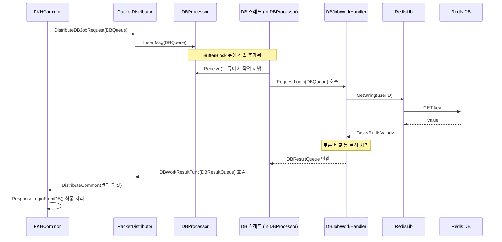
```mermaid
sequenceDiagram
    participant PKHCommon as PKHCommon
    participant Distributor as PacketDistributor
    participant DBProcessor as DBProcessor
    participant DBThread as DB 스레드 (in DBProcessor)
    participant WorkHandler as DBJobWorkHandler
    participant RedisLib as RedisLib
    participant Redis as Redis DB

    PKHCommon->>Distributor: DistributeDBJobRequest(DBQueue)
    Distributor->>DBProcessor: InsertMsg(DBQueue)
    
    Note over DBProcessor, DBThread: BufferBlock 큐에 작업 추가됨
    
    DBThread->>DBProcessor: Receive() - 큐에서 작업 꺼냄
    DBThread->>WorkHandler: RequestLogin(DBQueue) 호출
    WorkHandler->>RedisLib: GetString(userID)
    RedisLib->>Redis: GET key
    Redis-->>RedisLib: value
    RedisLib-->>WorkHandler: Task<RedisValue>
    
    Note over WorkHandler: 토큰 비교 등 로직 처리
    WorkHandler-->>DBThread: DBResultQueue 반환
    
    DBThread->>Distributor: DBWorkResultFunc(DBResultQueue) 호출
    Distributor->>PKHCommon: DistributeCommon(결과 패킷)
    PKHCommon->>PKHCommon: ResponseLoginFromDB() 최종 처리

```

 
### 스레드 생성 및 관리
`DBProcessor`는 데이터베이스 관련 작업을 전담하여 처리하기 위해 **독립적인 스레드 풀(Thread Pool)을 직접 생성하고 관리**하는 역할을 한다. 이를 통해 DB 조회와 같이 시간이 오래 걸릴 수 있는 작업이 서버의 주요 로직(채팅 처리 등)을 지연시키는 것을 원천적으로 차단한다.

#### 1. 스레드 생성 (`CreateAndStart` 함수)
`DBProcessor`의 스레드 생성은 `CreateAndStart` 함수 내에서 이루어진다.

```csharp
public ErrorCode CreateAndStart(int threadCount, Action<DBResultQueue> dbWorkResultFunc, string redisAddress)
{
    // ... 초기화 작업 ...

    IsThreadRunning = true; // 1. 스레드 실행 플래그 활성화

    for (int i = 0; i < threadCount; ++i) // 2. 설정된 개수만큼 반복
    {
        // 3. Process 함수를 실행할 스레드 생성
        var processThread = new System.Threading.Thread(this.Process);
        processThread.Start(); // 4. 스레드 시작

        ThreadList.Add(processThread); // 5. 관리 목록에 추가
    }

    // ...
    return ErrorCode.None;
}
```

1.  `IsThreadRunning` 플래그를 `true`로 설정하여, 각 스레드의 메인 루프(`Process` 함수)가 실행될 수 있도록 준비한다.
2.  서버 옵션으로 받은 `threadCount` 만큼 `for` 루프를 실행한다.
3.  `new System.Threading.Thread(this.Process)` 코드를 통해, 모든 스레드가 동일한 `Process` 함수를 실행하도록 새로운 스레드 객체를 생성한다.
4.  `processThread.Start()`를 호출하여 스레드를 즉시 실행시킨다. 이 시점부터 스레드는 `Process` 함수 내부의 `while` 루프를 돌며 작업이 들어오기를 기다린다.
5.  생성된 스레드 객체를 `ThreadList`에 추가하여 서버가 종료될 때 관리할 수 있도록 한다.

#### 2. 스레드 관리 및 종료 (`Process` 및 `Destory` 함수)
생성된 스레드들은 `Process` 함수 안에서 `IsThreadRunning` 플래그를 확인하며 계속 실행된다.

```csharp
void Process()
{
    while (IsThreadRunning) // 실행 플래그가 true인 동안 계속 실행
    {
        // ... 작업 처리 로직 ...
    }
}

public void Destory()
{
    IsThreadRunning = false; // 루프 종료 신호
    MsgBuffer.Complete(); // 큐를 닫아 대기 상태의 스레드를 즉시 깨움
}
```

  * **관리**: 스레드들은 `Process` 함수의 `while (IsThreadRunning)` 루프 안에서 계속 실행되며, `MsgBuffer.Receive()`를 통해 작업 큐에 요청이 들어올 때까지 대기(Blocked) 상태에 머무른다. 이를 통해 작업을 기다리는 동안 CPU 자원을 거의 사용하지 않는다.
  * **종료**: 서버 종료 시 `Destory` 함수가 호출되면, `IsThreadRunning`을 `false`로 변경하여 `while` 루프가 다음 반복에서 멈추도록 한다. 또한, `MsgBuffer.Complete()`를 호출하여 `Receive()`에서 대기 중인 스레드에 예외를 발생시켜 즉시 루프를 빠져나오게 함으로써 스레드를 안전하고 신속하게 종료시킨다.


### 패킷 처리 스레드와의 통신
`DBProcessor`와 다른 패킷 처리 스레드(주로 `CommonPacketProcessor`)와의 통신은 **스레드에 안전한 큐(`BufferBlock`)** 와 **콜백 함수(delegate)** 를 통해 이루어진다.

1.  **요청 (Request): Packet Processor -> DB Processor**

      * 패킷 처리 스레드(예: `PKHCommon`)에서 DB 작업이 필요하면, `DBQueue` 객체에 작업 내용(패킷 ID, 데이터 등)을 담는다.
      * `PacketDistributor`를 통해 `DBProcessor.InsertMsg(dbQueue)` 함수가 호출된다.
      * `InsertMsg` 함수는 전달받은 `dbQueue` 객체를 `MsgBuffer.Post()`를 사용해 `DBProcessor`의 작업 큐에 **넣는다(Push)**. 이 과정은 비동기적으로, 요청 스레드는 결과를 기다리지 않고 즉시 자신의 다음 작업을 수행한다.

2.  **응답 (Response): DB Processor -> Packet Processor**

      * `DBProcessor`의 스레드가 큐에서 작업을 꺼내 처리하고 나면, 그 결과(`DBResultQueue`)를 얻게 된다.
      * `Process` 함수는 `CreateAndStart` 시점에 미리 등록해 둔 콜백 함수인 `DBWorkResultFunc(result)`를 호출한다.
      * 이 `DBWorkResultFunc`의 실체는 `PacketDistributor.DistributeDBJobResult` 함수다.
      * `DistributeDBJobResult` 함수는 전달받은 `DBResultQueue`를 다시 `ServerPacketData`로 변환하여, 결과를 기다리던 원래의 패킷 처리 스레드(`CommonPacketProcessor`)의 큐에 **다시 넣어준다(Push)**.

이러한 요청-응답 통신 흐름을 아래 Mermaid 다이어그램으로 시각화할 수 있다.

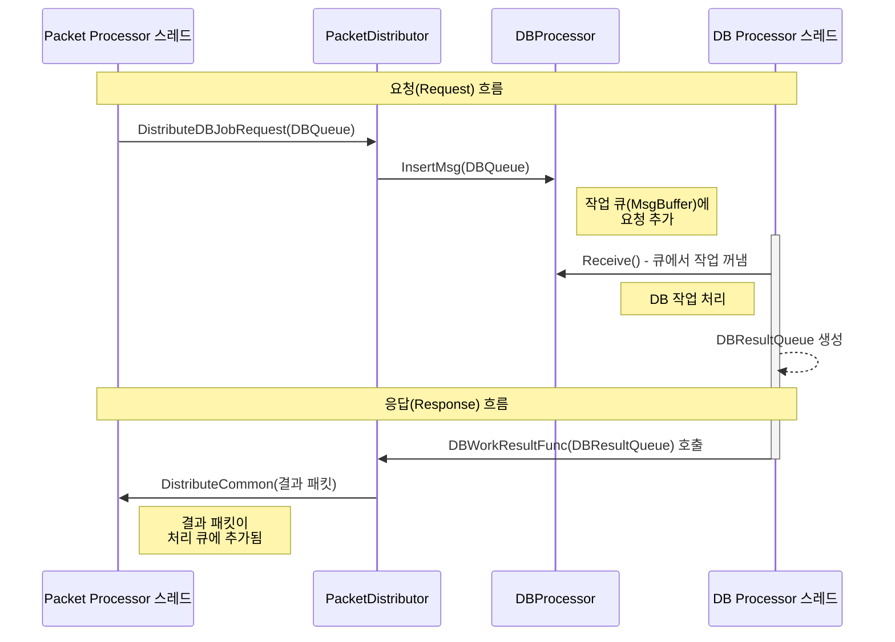
```mermaid
sequenceDiagram
    participant PktThread as Packet Processor 스레드
    participant Distributor as PacketDistributor
    participant DBProcessor as DBProcessor
    participant DBThread as DB Processor 스레드

    Note over PktThread, DBThread: 요청(Request) 흐름

    PktThread->>Distributor: DistributeDBJobRequest(DBQueue)
    Distributor->>DBProcessor: InsertMsg(DBQueue)
    Note right of DBProcessor: 작업 큐(MsgBuffer)에<br/>요청 추가
    
    activate DBThread
    DBThread->>DBProcessor: Receive() - 큐에서 작업 꺼냄
    Note left of DBThread: DB 작업 처리
    DBThread-->>DBThread: DBResultQueue 생성

    Note over PktThread, DBThread: 응답(Response) 흐름

    DBThread->>Distributor: DBWorkResultFunc(DBResultQueue) 호출
    deactivate DBThread
    
    Distributor->>PktThread: DistributeCommon(결과 패킷)
    Note right of PktThread: 결과 패킷이<br/>처리 큐에 추가됨
```  
  
  
### DBJobWorkHandler 클래스의 역할과 목적
`DBJobWorkHandler` 클래스는 `DBProcessor`에 의해 관리되는 DB 작업 스레드가 **"실제로 어떤 DB 작업을 수행할 것인가"** 에 대한 구체적인 **비즈니스 로직**을 담고 있는 **핵심 작업자(Worker)** 클래스다.

`DBProcessor`가 스레드를 생성하고 작업을 분배하는 '관리자'라면, `DBJobWorkHandler`는 그 지시를 받아 실제 데이터베이스(Redis)에 접근하여 데이터를 조회하고, 비교하고, 결과를 만들어내는 '실무자'의 역할을 수행한다.

주요 목적은 다음과 같다:
1.  **DB 로직의 중앙화**: 로그인 인증, 유저 데이터 저장, 아이템 정보 조회 등 모든 종류의 데이터베이스 관련 실제 로직을 이 클래스 한 곳에 모아 관리의 편의성을 높인다.
2.  **역할의 분리**: `DBProcessor`는 스레드 관리와 큐잉(Queuing)에만 집중하고, `DBJobWorkHandler`는 순수한 DB 데이터 처리에만 집중하도록 역할을 명확하게 분리하여 코드의 구조를 단순화하고 유지보수를 용이하게 만든다.
3.  **데이터베이스 통신 실행**: `RedisLib`와 같은 저수준 DB 라이브러리를 직접 사용하여, 상위 계층(예: `PKHCommon`)에서 전달된 요청을 실제 DB 쿼리로 변환하고 실행하는 책임을 진다.

결론적으로, `DBJobWorkHandler`는 DB 작업의 '무엇을(What)'과 '어떻게(How)'를 정의하는 클래스라고 할 수 있다.

-----

### 멤버 함수 및 코드 설명

#### `Init(RedisLib redis)`
`DBProcessor`가 생성될 때 호출되며, `DBJobWorkHandler`가 작업에 필요한 `RedisLib` 객체를 받아오고 DB 연결을 준비하는 초기화 함수다.

```csharp
public Tuple<ErrorCode,string> Init(RedisLib redis)
{
    try
    {
        RefRedis = redis; // 1. RedisLib 객체 참조 저장

        // 2. Redis 연결 활성화 (Warm-up)
        RefRedis.GetString("test");

        return new Tuple<ErrorCode, string>(ErrorCode.None, "");
    }
    catch(Exception ex)
    {
        return new Tuple<ErrorCode, string>(ErrorCode.RedisInitFail, ex.ToString());
    }
}
```

1.  `DBProcessor`로부터 전달받은 `RedisLib` 객체의 참조를 내부 변수 `RefRedis`에 저장하여, 다른 함수에서 Redis에 접근할 수 있도록 한다.
2.  `RefRedis.GetString("test")`를 호출하여 Redis에 더미(dummy) 데이터를 요청한다. 이 작업의 주된 목적은 프로그램 시작 시점에 실제로 Redis와 통신하여 연결을 미리 활성화(Warm-up) 시키고, 연결에 문제가 있다면 빠르게 감지하기 위함이다.

#### `RequestLogin(DBQueue dbQueue)`
DB 스레드로부터 로그인 요청 작업을 받아 실제 인증 로직을 수행하는 가장 핵심적인 함수다.

```csharp
public DBResultQueue RequestLogin(DBQueue dbQueue)
{
    // ...
    try
    {
        // 1. 요청 데이터 역직렬화
        var reqData = MessagePackSerializer.Deserialize<DBReqLogin>(dbQueue.Datas);
        userID = reqData.UserID;

        // 2. Redis에서 유저의 인증 토큰 조회
        var redis = RefRedis.GetString(reqData.UserID);
        var value = redis.Result;

        // 3. 유저 존재 여부 확인
        if (value.IsNullOrEmpty)
        {
            return RequestLoginValue(ErrorCode.DbLoginEmptyUser, ...);
        }
                                        
        // 4. 인증 토큰 비교
        if( reqData.AuthToken != value)
        {
            return RequestLoginValue(ErrorCode.DbLoginInvalidPassword, ...);
        }
        else
        {
            // 5. 로그인 성공 처리
            return RequestLoginValue(ErrorCode.None, ...);
        }
    }
    catch
    {
        return RequestLoginValue(ErrorCode.DbLoginException, ...);
    }
}
```

1.  `dbQueue`에 담겨 온 바이트 배열 데이터를 `MessagePackSerializer`를 사용해 `DBReqLogin` 객체로 변환하여 클라이언트가 보낸 `UserID`와 `AuthToken`을 추출한다.
2.  `RefRedis.GetString`을 호출하여 Redis DB에 해당 `UserID`를 키(key)로 가지는 저장된 인증 토큰 값을 조회한다.
3.  만약 조회 결과(`value`)가 비어있다면(`IsNullOrEmpty`), 존재하지 않는 사용자이므로 `DbLoginEmptyUser` 에러 코드를 담아 결과를 반환한다.
4.  조회된 토큰 값과 클라이언트가 보낸 `reqData.AuthToken`이 일치하지 않으면, 잘못된 비밀번호(토큰)이므로 `DbLoginInvalidPassword` 에러 코드를 담아 결과를 반환한다.
5.  모든 검증을 통과하면, 성공을 의미하는 `ErrorCode.None`을 담아 결과를 반환한다.
  

#### `RequestLoginValue(ErrorCode result, string userID, string sessionID, int sessionIndex)`
`RequestLogin` 함수의 처리 결과를 포장하여 `DBProcessor`에게 돌려줄 최종 `DBResultQueue` 객체를 만드는 헬퍼(Helper) 함수다.

```csharp
DBResultQueue RequestLoginValue(ErrorCode result, string userID, string sessionID, int sessionIndex)
{
    var returnData = new DBResultQueue() // 1. 결과 큐 객체 생성
    {
        PacketID = PacketId.ResDbLogin,
        SessionID = sessionID,
        SessionIndex = sessionIndex
    };

    // 2. 실제 결과 데이터 생성 및 직렬화
    var resLoginData = new DBResLogin() { UserID = userID, Result = result };
    returnData.Datas = MessagePackSerializer.Serialize(resLoginData);
    
    return returnData; // 3. 최종 결과 반환
}
```

1.  응답 데이터를 담을 `DBResultQueue` 객체를 생성하고, 응답 패킷 ID(`ResDbLogin`)와 클라이언트의 세션 정보를 채운다.
2.  로그인 처리 결과(`result`)와 `userID`를 담은 `DBResLogin` 객체를 생성하고, 이를 다시 바이트 배열로 직렬화하여 `returnData.Datas`에 할당한다.
3.  모든 정보가 담긴 `DBResultQueue` 객체를 `RequestLogin` 함수를 호출했던 `DBProcessor`의 스레드에게 반환한다.    
  

### 클래스 다이어그램
이 다이어그램은 각 클래스가 가지는 주요 멤버 변수와 메서드, 그리고 클래스 간의 '포함(Composition)' 및 '사용(Dependency)' 관계를 명확하게 보여준다.

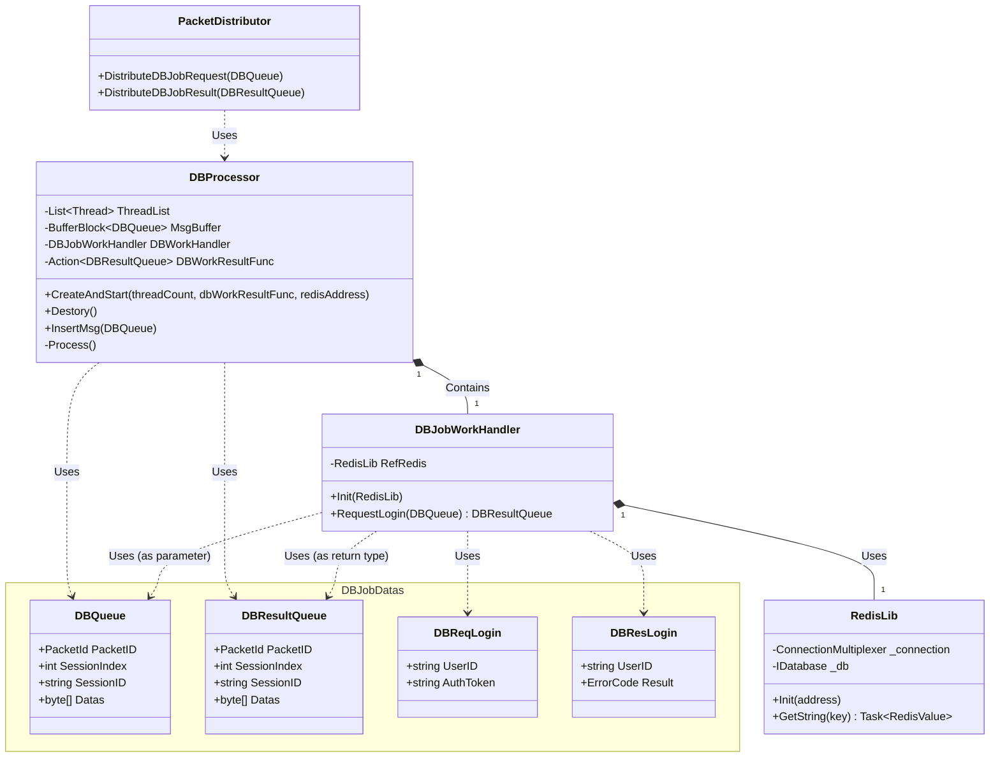
```mermaid
classDiagram
    class PacketDistributor {
        +DistributeDBJobRequest(DBQueue)
        +DistributeDBJobResult(DBResultQueue)
    }

    class DBProcessor {
        -List~Thread~ ThreadList
        -BufferBlock~DBQueue~ MsgBuffer
        -DBJobWorkHandler DBWorkHandler
        -Action~DBResultQueue~ DBWorkResultFunc
        +CreateAndStart(threadCount, dbWorkResultFunc, redisAddress)
        +Destory()
        +InsertMsg(DBQueue)
        -Process()
    }

    class DBJobWorkHandler {
        -RedisLib RefRedis
        +Init(RedisLib)
        +RequestLogin(DBQueue) DBResultQueue
    }

    class RedisLib {
        -ConnectionMultiplexer _connection
        -IDatabase _db
        +Init(address)
        +GetString(key) Task~RedisValue~
    }

    namespace DBJobDatas {
        class DBQueue {
            +PacketId PacketID
            +int SessionIndex
            +string SessionID
            +byte[] Datas
        }
        class DBResultQueue {
            +PacketId PacketID
            +int SessionIndex
            +string SessionID
            +byte[] Datas
        }
        class DBReqLogin {
            +string UserID
            +string AuthToken
        }
        class DBResLogin {
            +string UserID
            +ErrorCode Result
        }
    }

    PacketDistributor ..> DBProcessor : Uses
    DBProcessor "1" *-- "1" DBJobWorkHandler : Contains
    DBProcessor ..> DBQueue : Uses
    DBProcessor ..> DBResultQueue : Uses
    DBJobWorkHandler "1" *-- "1" RedisLib : Uses
    DBJobWorkHandler ..> DBQueue : Uses (as parameter)
    DBJobWorkHandler ..> DBResultQueue : Uses (as return type)
    DBJobWorkHandler ..> DBReqLogin : Uses
    DBJobWorkHandler ..> DBResLogin : Uses
```

### 다이어그램 관계 설명

  * **`PacketDistributor` ..\> `DBProcessor`**: `PacketDistributor`는 `DBProcessor`의 `InsertMsg`와 같은 메서드를 \*\*사용(Uses)\*\*하여 DB 작업을 요청한다.
  * **`DBProcessor` "1" \*-- "1" `DBJobWorkHandler`**: `DBProcessor`는 내부에 `DBJobWorkHandler` 인스턴스 한 개를 \*\*포함(Contains/Composition)\*\*하여 실제 DB 로직을 위임한다.
  * **`DBProcessor` ..\> `DBQueue` / `DBResultQueue`**: `DBProcessor`는 작업 요청을 받기 위해 `DBQueue`를, 작업 결과를 전달하기 위해 `DBResultQueue`를 \*\*사용(Uses)\*\*한다.
  * **`DBJobWorkHandler` "1" \*-- "1" `RedisLib`**: `DBJobWorkHandler`는 실제 Redis DB와 통신하기 위해 `RedisLib` 인스턴스를 \*\*사용(Uses)\*\*한다.
  * **`DBJobWorkHandler` ..\> `DBJobDatas` 네임스페이스 클래스들**: `DBJobWorkHandler`는 `RequestLogin`과 같은 메서드의 파라미터로 `DBQueue`를, 반환 타입으로 `DBResultQueue`를 **사용**하며, 내부 로직에서 데이터를 역직렬화/직렬화하기 위해 `DBReqLogin`, `DBResLogin`을 **사용**한다.  


<br>  

   
 # Chapter.05 테스트용 클라이언트 

## EchoClient
[코드](https://github.com/jacking75/SuperSocketLite/tree/master/Tutorials/EchoClient )  

<pre>
EchoClient/
├── Properties/
├── App.config
├── ClientSimpleTcp.cs
├── DevLog.cs
├── Packet.cs
├── PacketBufferManager.cs
├── PacketDefine.cs
├── PacketProcessForm.cs
├── Program.cs
├── csharp_test_client.csproj
├── csharp_test_client.sln
├── mainForm.Designer.cs
├── mainForm.cs
└── mainForm.resx  
</pre>  

  
### 주요 코드 설명
C#으로 작성된 Windows Forms 기반의 TCP 클라이언트 애플리케이션이다. 서버와 소켓 통신을 통해 로그인, 채팅방 입장/퇴장, 메시지 송수신 및 릴레이 기능을 수행한다.

#### 파일 및 클래스 구성
  * **솔루션 및 프로젝트 파일**:
      * `csharp_test_client.sln`: Visual Studio 솔루션 파일이다.
      * `csharp_test_client.csproj`: C# 프로젝트 파일로, 프로젝트의 구성, 참조, 빌드 설정 등을 정의한다.
  * **애플리케이션 진입점**:
      * `Program.cs`: 애플리케이션의 주 진입점(`Main` 메서드)을 포함하며, `mainForm`을 실행시킨다.
  * **UI 및 로직**:
      * `mainForm.cs`: 메인 UI 로직을 담당하는 핵심 클래스다. 사용자 입력 처리, 네트워크 연결, 스레드 관리, 패킷 큐 관리 등을 수행한다.
      * `mainForm.Designer.cs`: `mainForm`의 UI 컨트롤(버튼, 텍스트박스 등)들이 자동으로 생성되고 관리되는 코드다.
      * `PacketProcessForm.cs`: `mainForm`의 `partial` 클래스로, 서버로부터 받은 패킷을 처리하는 핸들러들을 모아놓은 파일이다.
  * **네트워크 및 패킷 처리**:
      * `ClientSimpleTcp.cs`: `System.Net.Sockets.Socket` 클래스를 래핑하여 TCP 연결, 송신, 수신 기능을 단순화한 클래스다.
      * `PacketBufferManager.cs`: TCP의 스트림 기반 데이터 수신을 패킷 단위로 끊어서 처리할 수 있도록 도와주는 버퍼 관리 클래스다.
      * `Packet.cs`: `LoginReqPacket`, `RoomEnterResPacket` 등 서버와 주고받는 각 패킷의 데이터를 정의하고, 바이트 배열로 직렬화하거나 역직렬화하는 기능을 포함한다.
      * `PacketDefine.cs`: `PACKET_ID` 열거형을 통해 패킷의 종류를 정의하고, `ERROR_CODE`를 통해 서버와 클라이언트 간의 오류 코드를 정의한다.
  * **유틸리티 및 설정**:
      * `DevLog.cs`: 개발 및 디버깅을 위한 로그를 큐에 저장하고 UI에 표시하는 기능을 제공한다.
      * `Properties/`: `AssemblyInfo.cs` (어셈블리 정보), `Resources.resx` (리소스), `Settings.settings` (설정) 등 프로젝트의 속성과 관련된 파일들을 포함한다.

-----

### 네트워크 관련 상세 설명
이 애플리케이션의 네트워크 로직은 크게 **연결 관리**, **데이터 송신**, **데이터 수신 및 처리** 세 부분으로 나뉜다.

1.  **연결 관리 (`ClientSimpleTcp.cs`)**:

      * `Connect(string ip, int port)` 메서드는 IP 주소와 포트 번호를 받아 서버에 TCP 연결을 시도한다. 성공하면 `Socket` 객체가 생성되고 연결된 상태가 된다.
      * `Close()` 메서드는 소켓 연결을 종료한다.
      * `IsConnected()`를 통해 현재 서버와 연결되어 있는지 확인할 수 있다.

2.  **데이터 송신 (`mainForm.cs`, `ClientSimpleTcp.cs`)**:

      * 사용자가 UI의 버튼(예: 로그인, 채팅 전송)을 클릭하면, `mainForm`은 해당 기능에 맞는 패킷 객체를 생성한다 (예: `LoginReqPacket`).
      * 패킷 데이터를 `ToBytes()` 메서드를 사용해 `byte[]` 배열로 직렬화한다.
      * `PostSendPacket` 메서드는 직렬화된 데이터에 패킷 헤더(전체 크기, ID 등)를 붙여 완전한 패킷 데이터를 만든다.
      * 이 패킷 데이터는 `SendPacketQueue`라는 큐에 추가된다.
      * 별도의 스레드로 동작하는 `NetworkSendProcess` 메서드가 이 큐를 계속 확인하다가, 큐에 데이터가 있으면 하나를 꺼내 `ClientSimpleTcp.Send` 메서드를 호출하여 서버로 전송한다. 이렇게 큐를 사용하는 이유는 UI 스레드가 네트워크 송신으로 인해 멈추는 것을 방지하기 위함이다.

3.  **데이터 수신 및 처리 (`mainForm.cs`, `PacketBufferManager.cs`, `PacketProcessForm.cs`)**:

      * `NetworkReadProcess` 메서드가 별도의 스레드에서 계속 실행된다. 이 스레드는 `ClientSimpleTcp.Receive` 메서드를 호출하여 서버로부터 데이터가 올 때까지 대기(블로킹)한다.
      * 데이터가 수신되면 `PacketBufferManager.Write`를 호출해 내부 버퍼에 데이터를 추가한다. TCP는 스트림 기반이므로 한 번에 여러 패킷이 붙어서 오거나, 하나의 패킷이 여러 번에 나뉘어 올 수 있다.
      * `PacketBufferManager.Read` 메서드는 버퍼를 읽어 완전한 형태의 패킷 하나를 만들 수 있는지 확인한다. 먼저 패킷 헤더 크기(5바이트)만큼 데이터가 있는지 확인하고, 헤더에서 전체 패킷 크기를 읽어온다. 그 후 버퍼에 전체 패킷 크기만큼의 데이터가 쌓였는지 확인하여, 다 쌓였다면 완전한 패킷 하나를 분리하여 반환한다.
      * `NetworkReadProcess`는 이렇게 얻은 완전한 패킷 데이터를 `RecvPacketQueue` 큐에 넣는다.
      * UI 스레드에서 주기적으로 실행되는 `BackGroundProcess` (UI 타이머에 의해 호출)가 `RecvPacketQueue`에서 패킷을 꺼낸다.
      * `PacketProcess` 메서드는 패킷의 ID를 확인하고, `PacketFuncDic`이라는 딕셔너리를 사용해 해당 ID에 맞는 처리 함수(예: `PacketProcess_LoginResponse`)를 호출한다.
      * 각각의 패킷 처리 함수는 패킷의 바디 데이터를 역직렬화하여 UI(로그, 채팅창 등)에 결과를 표시한다.

-----

### 코드 동작 Mermaid 다이어그램

아래는 사용자가 '로그인' 버튼을 눌렀을 때의 주요 동작을 나타낸 시퀀스 다이어그램이다.

```mermaid
sequenceDiagram
    participant User
    participant mainForm
    participant NetworkSendThread
    participant ClientSimpleTcp
    participant Server
    participant NetworkReadThread
    participant PacketBufferManager
    participant BackGroundProcess

    User->>mainForm: '로그인' 버튼 클릭
    mainForm->>mainForm: LoginReqPacket 생성 및 직렬화
    mainForm->>NetworkSendThread: SendPacketQueue에 패킷 추가
    NetworkSendThread->>ClientSimpleTcp: Send() 호출
    ClientSimpleTcp->>Server: 로그인 패킷 데이터 전송

    Server-->>ClientSimpleTcp: 로그인 응답 데이터 수신
    ClientSimpleTcp-->>NetworkReadThread: Receive() 결과 반환
    NetworkReadThread->>PacketBufferManager: Write(수신 데이터)
    PacketBufferManager-->>NetworkReadThread: 완전한 패킷 데이터 반환
    NetworkReadThread->>BackGroundProcess: RecvPacketQueue에 패킷 추가

    BackGroundProcess->>BackGroundProcess: 큐에서 패킷 꺼내기
    BackGroundProcess->>mainForm: PacketProcess(패킷) 호출
    mainForm->>mainForm: PacketProcess_LoginResponse() 실행
    mainForm->>User: UI에 로그인 결과 표시 (로그)

```
    
  
### ClientSimpleTcp 클래스
이 클래스는 C#의 `System.Net.Sockets.Socket` 클래스를 더 사용하기 쉽게 래핑(wrapping)하여 TCP 통신을 간편하게 처리하기 위해 만들어진 클래스다. 복잡한 소켓 설정을 최소화하고, 연결, 송신, 수신, 연결 종료와 같은 핵심 기능들을 직관적인 메서드로 제공하는 것이 주 목적이다.

#### 멤버 함수 상세 설명

* **`Connect(string ip, int port)`**
    * **목적**: 지정된 IP 주소와 포트 번호를 가진 서버에 TCP 연결을 시도한다.
    * **코드 설명**:
        1.  `IPAddress.Parse(ip)`: 입력받은 문자열 형태의 IP 주소를 `IPAddress` 객체로 변환한다.
        2.  `Sock = new Socket(...)`: TCP 통신을 위한 `Socket` 객체를 생성한다. `AddressFamily.InterNetwork`는 IPv4 주소 체계를, `SocketType.Stream`은 순서가 보장되는 양방향 연결(TCP)을 의미한다.
        3.  `Sock.Connect(...)`: `IPEndPoint` 객체(IP와 포트 정보를 가짐)를 생성하여 실제 서버에 연결을 시도한다.
        4.  `try-catch`: 연결 과정에서 발생할 수 있는 예외(예: 서버가 닫혀있거나 주소가 잘못된 경우)를 잡아 `LatestErrorMsg`에 오류 메시지를 저장하고 `false`를 반환한다.
        5.  연결에 성공하면 `true`를 반환한다.

* **`Receive()`**
    * **목적**: 서버로부터 데이터를 수신하는 함수다. 데이터가 올 때까지 스레드를 멈추고 기다리는 블로킹(blocking) 방식으로 동작한다.
    * **코드 설명**:
        1.  `byte[] ReadBuffer = new byte[2048]`: 서버로부터 데이터를 받아 저장할 2048바이트 크기의 버퍼를 생성한다.
        2.  `Sock.Receive(...)`: 소켓을 통해 데이터를 수신하고 `ReadBuffer`에 저장한다. 반환값 `nRecv`는 실제로 수신된 데이터의 바이트 수다.
        3.  `if (nRecv == 0)`: 수신된 데이터의 크기가 0이면 서버가 정상적으로 연결을 종료했다는 의미이므로 `null`을 반환한다.
        4.  `return Tuple.Create(nRecv, ReadBuffer)`: 수신에 성공하면, 수신된 데이터의 크기와 데이터가 담긴 버퍼를 `Tuple` 객체로 묶어 반환한다.
        5.  `catch (SocketException se)`: 데이터 수신 중 예외(예: 갑작스러운 연결 끊김)가 발생하면 오류 메시지를 저장하고 `null`을 반환한다.

* **`Send(byte[] sendData)`**
    * **목적**: 서버로 바이트 배열 형태의 데이터를 전송한다.
    * **코드 설명**:
        1.  `if (Sock != null && Sock.Connected)`: 소켓이 생성되어 있고 서버와 연결된 상태인지 먼저 확인한다.
        2.  `Sock.Send(...)`: 연결된 소켓을 통해 `sendData` 바이트 배열에 담긴 데이터를 서버로 전송한다.
        3.  `catch (SocketException se)`: 전송 중 예외 발생 시 `LatestErrorMsg`에 오류 메시지를 기록한다.

* **`Close()`**
    * **목적**: 현재 열려있는 소켓 연결을 안전하게 종료한다.
    * **코드 설명**:
        1.  `if (Sock != null && Sock.Connected)`: 소켓이 유효하고 연결된 상태인지 확인한다.
        2.  `Sock.Close()`: 소켓 연결을 닫고 관련된 모든 리소스를 해제한다.

* **`IsConnected()`**
    * **목적**: 현재 소켓이 서버와 연결되어 있는지 여부를 간단하게 확인하여 `true` 또는 `false`로 반환한다.

---

### PacketBufferManager 클래스
TCP 통신은 데이터가 정해진 크기로 나뉘어 오는 것이 아니라, 물 흐르듯 이어져 오는 스트림(Stream) 방식이다. 따라서 수신한 데이터를 패킷 단위(의미 있는 데이터 묶음)로 올바르게 잘라내기 위한 버퍼 관리 클래스가 필요하며, `PacketBufferManager`가 바로 그 역할을 한다.

#### 멤버 함수 상세 설명

* **`Init(int size, int headerSize, int maxPacketSize)`**
    * **목적**: 패킷 버퍼를 사용하기 전에 필요한 초기 설정을 수행한다.
    * **코드 설명**:
        1.  버퍼의 전체 크기(`BufferSize`), 패킷 헤더의 크기(`HeaderSize`), 처리할 수 있는 최대 패킷의 크기(`MaxPacketSize`)를 설정한다.
        2.  `PacketData = new byte[size]`: 실제 데이터를 저장할 주 버퍼를 할당한다.
        3.  `PacketDataTemp = new byte[size]`: 버퍼를 재정리할 때 임시로 데이터를 담아둘 보조 버퍼를 할당한다.

* **`Write(byte[] data, int pos, int size)`**
    * **목적**: `ClientSimpleTcp.Receive`를 통해 수신된 데이터 조각을 내부 버퍼(`PacketData`)에 추가한다.
    * **코드 설명**:
        1.  `var remainBufferSize = BufferSize - WritePos`: 현재 버퍼에서 데이터를 쓸 수 있는 남은 공간을 계산한다.
        2.  `if (remainBufferSize < size)`: 남은 공간이 쓰려는 데이터의 크기보다 작으면 쓰기를 중단하고 `false`를 반환하여 버퍼 오버플로우를 방지한다.
        3.  `Buffer.BlockCopy(...)`: `data` 배열의 `pos` 위치에서부터 `size` 만큼을 `PacketData` 버퍼의 `WritePos`(현재까지 데이터가 쓰여진 위치)에 복사한다.
        4.  `WritePos += size`: 데이터가 추가된 만큼 `WritePos` 위치를 뒤로 이동시킨다.
        5.  `NextFree()`를 호출하여 버퍼에 남은 공간이 부족하면 `BufferRelocate()`를 통해 버퍼를 정리한다.

* **`Read()`**
    * **목적**: 현재 버퍼에 쌓인 데이터 중에서 완전한 형태의 패킷 하나를 분리하여 반환한다.
    * **코드 설명**:
        1.  `var enableReadSize = WritePos - ReadPos`: 버퍼에서 아직 읽지 않은 데이터의 전체 크기를 계산한다. `ReadPos`는 읽기가 완료된 위치, `WritePos`는 쓰기가 완료된 위치다.
        2.  `if (enableReadSize < HeaderSize)`: 읽지 않은 데이터가 패킷 헤더 크기보다 작으면, 아직 완전한 패킷 길이를 알 수 없으므로 빈 `ArraySegment`를 반환한다.
        3.  `var packetDataSize = BitConverter.ToInt16(PacketData, ReadPos)`: 버퍼의 `ReadPos` 위치에서 2바이트를 읽어 전체 패킷의 크기를 알아낸다. (이 코드의 패킷 구조상, 맨 앞 2바이트가 전체 패킷 크기를 나타낸다)
        4.  `if (enableReadSize < packetDataSize)`: 버퍼에 쌓인 데이터가 방금 읽어온 패킷 전체 크기보다 작다면, 아직 패킷 하나가 완전히 도착하지 않은 것이므로 빈 `ArraySegment`를 반환한다.
        5.  `new ArraySegment<byte>(...)`: 완전한 패킷 하나가 버퍼에 존재하므로, `PacketData` 버퍼의 `ReadPos` 위치에서 `packetDataSize` 만큼을 가리키는 `ArraySegment`를 생성하여 반환한다. `ArraySegment`는 원본 배열을 복사하지 않고 특정 부분만 가리키므로 효율적이다.
        6.  `ReadPos += packetDataSize`: 패킷 하나를 읽었으므로, `ReadPos`를 읽은 패킷의 크기만큼 뒤로 이동시킨다.

* **`BufferRelocate()`**
    * **목적**: 버퍼의 앞부분에 이미 읽고 지나간 공간이 많이 쌓였을 때, 아직 읽지 않은 데이터들을 버퍼의 맨 앞으로 당겨와서 공간을 확보(재정리)한다.
    * **코드 설명**:
        1.  `var enableReadSize = WritePos - ReadPos`: 버퍼에 남아있는 유효한 데이터(아직 읽지 않은 데이터)의 크기를 계산한다.
        2.  `Buffer.BlockCopy(PacketData, ReadPos, PacketDataTemp, 0, enableReadSize)`: `PacketData` 버퍼의 `ReadPos`부터 남아있는 데이터를 임시 버퍼인 `PacketDataTemp`의 맨 앞(0번 인덱스)으로 복사한다.
        3.  `Buffer.BlockCopy(PacketDataTemp, 0, PacketData, 0, enableReadSize)`: 임시 버퍼에 복사했던 데이터를 다시 `PacketData` 버퍼의 맨 앞으로 복사한다.
        4.  `ReadPos = 0`, `WritePos = enableReadSize`: `ReadPos`는 0으로 초기화하고, `WritePos`는 유효한 데이터의 크기만큼으로 설정하여 버퍼의 상태를 최신화한다.
  

### 서버에서 패킷을 받아서 처리하는 과정
서버로부터 데이터를 수신하고 이를 처리하는 과정은 여러 단계에 걸쳐 비동기적으로 이루어진다. 핵심은 **별도의 스레드에서 네트워크 데이터를 지속적으로 수신하여 버퍼에 쌓고, UI 스레드에서는 이 버퍼에서 완성된 패킷을 가져와 안전하게 처리**하는 것이다.

1.  **데이터 수신 (NetworkReadProcess 스레드)**
    * `mainForm.cs`의 `NetworkReadProcess` 메서드는 프로그램 시작 시 생성된 별도의 스레드에서 무한 루프를 돌며 실행된다.
    * 이 루프 안에서 `ClientSimpleTcp.Receive()` 메서드를 호출하여 서버로부터 데이터가 올 때까지 대기한다.
    * `Receive()`는 소켓을 통해 데이터를 받으면, 수신된 데이터의 크기와 데이터가 담긴 바이트 배열(`byte[]`)을 `Tuple` 형태로 반환한다.

2.  **스트림을 패킷으로 변환 (PacketBufferManager)**
    * `NetworkReadProcess`는 `Receive()`로 받은 데이터 조각을 `PacketBufferManager.Write()` 메서드에 넘겨 내부 버퍼에 추가한다.
    * `Write()`가 실행된 후, `PacketBuffer.Read()` 메서드를 루프 안에서 계속 호출한다. `Read()` 메서드는 현재 버퍼에 완전한 형태의 패킷이 하나 이상 존재하는지 검사한다.
        * 먼저 버퍼에 헤더 크기(5바이트)만큼 데이터가 있는지 확인한다.
        * 헤더가 있다면, 헤더의 첫 2바이트를 읽어 해당 패킷의 전체 크기(`packetDataSize`)를 알아낸다.
        * 버퍼에 `packetDataSize` 만큼의 데이터가 쌓여 있다면, 이는 완전한 패킷 하나가 도착했다는 의미다.
        * 이 완전한 패킷 데이터를 `ArraySegment<byte>` 형태로 잘라내어 반환하고, 버퍼의 읽기 위치(`ReadPos`)를 그만큼 뒤로 이동시킨다.

3.  **수신 패킷 큐에 추가**
    * `Read()`를 통해 성공적으로 분리된 완전한 패킷은 `PacketData` 구조체로 변환된 후, `RecvPacketQueue`라는 큐(Queue)에 추가된다.
    * 이 과정은 다른 스레드에서 동시에 접근할 수 있으므로 `lock`을 사용하여 스레드 안전성을 보장한다.

4.  **패킷 처리 (UI 스레드)**
    * `mainForm`의 UI 스레드에서는 `dispatcherUITimer`가 주기적으로 `BackGroundProcess` 메서드를 호출한다.
    * `BackGroundProcess`는 `RecvPacketQueue`에 처리할 패킷이 있는지 확인하고, 있다면 하나를 꺼내온다(`Dequeue`).
    * 꺼내온 패킷은 `PacketProcess` 메서드(`PacketProcessForm.cs`에 정의됨)로 전달된다.
    * `PacketProcess`는 패킷 헤더에서 읽어온 `PacketID`를 확인한다. 그리고 `PacketFuncDic`이라는 딕셔너리를 사용하여 `PacketID`에 맞는 처리 함수를 찾아 호출한다. 예를 들어, `PACKET_ID_LOGIN_RES` ID를 가진 패킷이 들어오면 `PacketProcess_LoginResponse` 함수가 실행된다.
    * 각각의 처리 함수(예: `PacketProcess_LoginResponse`)는 전달받은 바이트 데이터를 `FromBytes` 메서드를 사용해 자신에게 맞는 패킷 클래스(예: `LoginResPacket`)로 역직렬화한 후, 그 결과를 로그창에 출력하는 등 UI를 업데이트하는 작업을 수행한다.

---

### 서버로 패킷을 보내는 과정
패킷을 보내는 과정 역시 UI 스레드의 멈춤을 방지하기 위해 큐를 사용하는 비동기 방식으로 구현되었다.

1.  **사용자 입력 및 패킷 생성**
    * 사용자가 "로그인" 버튼이나 "채팅 전송" 버튼과 같은 UI 컨트롤을 조작하면 해당 이벤트 핸들러(예: `button2_Click`)가 실행된다.
    * 이벤트 핸들러 안에서는 서버로 보낼 데이터에 맞는 패킷 클래스(예: `LoginReqPacket`)의 인스턴스를 생성한다.
    * `SetValue`와 같은 메서드를 사용하여 사용자가 입력한 ID, 비밀번호, 채팅 메시지 등의 데이터를 패킷 객체에 채워 넣는다.

2.  **패킷 직렬화 및 전송 큐에 추가**
    * 데이터가 채워진 패킷 객체와 패킷 ID를 `PostSendPacket` 메서드에 전달한다.
    * `PostSendPacket` 메서드는 다음 작업을 수행한다:
        * 전달받은 패킷 객체의 `ToBytes()` 메서드를 호출하여 몸체(body) 데이터를 바이트 배열로 직렬화한다.
        * 패킷 헤더 정보를 생성한다. 헤더는 전체 패킷 크기(헤더 + 몸체)와 `PacketID`로 구성된다.
        * 헤더와 몸체 바이트 배열을 순서대로 합쳐 하나의 완전한 패킷 바이트 배열을 만든다.
        * 완성된 패킷 바이트 배열을 `SendPacketQueue`라는 큐에 추가(`Enqueue`)한다. 이 과정 역시 스레드 안전성을 위해 `lock`으로 보호된다.

3.  **데이터 전송 (NetworkSendThread 스레드)**
    * `mainForm.cs`의 `NetworkSendProcess` 메서드는 프로그램 시작 시 생성된 별도의 스레드에서 무한 루프를 돌며 실행된다.
    * 이 스레드는 `SendPacketQueue`를 지속적으로 확인하다가 큐에 전송할 패킷이 들어오면 하나를 꺼낸다(`Dequeue`).
    * 꺼내온 패킷 바이트 배열을 `ClientSimpleTcp.Send()` 메서드에 전달하여 서버로 전송한다. `Send()` 메서드는 내부적으로 소켓을 통해 해당 데이터를 네트워크로 내보낸다.
  

### 패킷 송신 과정 다이어그램
이 다이어그램은 사용자가 UI에서 특정 동작을 했을 때, 해당 데이터가 패킷으로 만들어져 서버까지 전송되는 전체 흐름을 보여준다.

```mermaid
sequenceDiagram
    participant User as 사용자 (UI)
    participant mainForm as mainForm (UI 스레드)
    participant PacketClass as 패킷 클래스 (e.g., LoginReqPacket)
    participant SendQueue as SendPacketQueue
    participant SendThread as NetworkSendThread
    participant TcpClient as ClientSimpleTcp
    participant Server as 서버

    User->>mainForm: 버튼 클릭 (e.g., 로그인)
    mainForm->>PacketClass: 패킷 객체 생성 및 데이터 설정
    PacketClass->>mainForm: ToBytes()로 직렬화된 데이터 반환
    mainForm->>SendQueue: PostSendPacket() 호출하여 <br> 헤더를 붙인 최종 패킷을 큐에 추가 (Enqueue)

    loop Send 스레드 루프
        SendThread->>SendQueue: 큐에서 패킷 꺼내기 (Dequeue)
        alt 큐에 데이터가 있으면
            SendThread->>TcpClient: Send(패킷 데이터) 호출
            TcpClient->>Server: 소켓을 통해 데이터 전송
        end
    end
```

**동작 설명:**

1.  사용자가 UI에서 버튼을 클릭하면 `mainForm`의 이벤트 핸들러가 호출된다.
2.  `mainForm`은 해당 요청에 맞는 `Packet` 클래스(예: `LoginReqPacket`)의 인스턴스를 만들고 사용자 데이터를 설정한다.
3.  `ToBytes()` 메서드로 패킷 몸체를 `byte[]`로 직렬화하고, `PostSendPacket` 메서드에서 헤더(크기, ID)를 추가하여 완전한 패킷 데이터를 만든다.
4.  이 패킷 데이터는 `SendPacketQueue`에 저장된다.
5.  별도의 스레드인 `NetworkSendThread`는 이 큐를 계속 감시하다가, 패킷이 들어오면 꺼내서 `ClientSimpleTcp`의 `Send` 메서드를 통해 서버로 전송한다.

-----

### 패킷 수신 및 처리 과정 다이어그램
이 다이어그램은 서버로부터 데이터가 들어왔을 때, 이를 수신하고 완전한 패킷으로 조립하여 최종적으로 처리하는 전체 흐름을 보여준다.  

```mermaid
sequenceDiagram
    participant Server as 서버
    participant TcpClient as ClientSimpleTcp
    participant ReadThread as NetworkReadThread
    participant BufferManager as PacketBufferManager
    participant RecvQueue as RecvPacketQueue
    participant UI_Timer as UI 타이머 (BackGroundProcess)
    participant PacketProcessor as PacketProcessForm
    
    Server->>TcpClient: 패킷 데이터 스트림 전송
    
    loop Read 스레드 루프
        ReadThread->>TcpClient: Receive() 호출 (데이터 수신 대기)
        TcpClient-->>ReadThread: 수신된 데이터 조각(byte[]) 반환
        ReadThread->>BufferManager: Write(수신 데이터) 호출하여 버퍼에 추가
        
        loop 패킷 조립 루프
            ReadThread->>BufferManager: Read() 호출하여 완전한 패킷 요청
            alt 버퍼에 완전한 패킷이 있으면
                BufferManager-->>ReadThread: 완전한 패킷 데이터 반환
                ReadThread->>RecvQueue: 패킷을 큐에 추가 (Enqueue)
            else 패킷이 아직 불완전하면
                BufferManager-->>ReadThread: 빈 데이터 반환
                Note over ReadThread: 루프 종료하고 다음 수신 대기
            end
        end
    end
    
    loop UI 타이머 루프 (주기적 실행)
        UI_Timer->>RecvQueue: 큐에서 패킷 꺼내기 (Dequeue)
        alt 큐에 데이터가 있으면
            UI_Timer->>PacketProcessor: PacketProcess(패킷) 호출
            PacketProcessor->>PacketProcessor: PacketID에 맞는 핸들러 실행<br/>(e.g., PacketProcess_LoginResponse)
            PacketProcessor-->>UI_Timer: UI 업데이트 (e.g., 로그 출력)
        end
    end
```  
  
**동작 설명:**

1.  `NetworkReadThread`는 `ClientSimpleTcp.Receive()`를 통해 서버로부터 들어오는 데이터 스트림을 지속적으로 수신한다.
2.  수신된 데이터 조각은 `PacketBufferManager`의 내부 버퍼에 `Write`된다.
3.  `NetworkReadThread`는 `PacketBufferManager.Read()`를 호출하여 버퍼에 완전한 패킷이 조립되었는지 확인한다. 완전한 패킷이 있다면 이를 분리하여 `RecvPacketQueue`에 넣는다.
4.  UI 스레드에서 주기적으로 실행되는 `BackGroundProcess`가 `RecvPacketQueue`를 확인하여 처리할 패킷을 꺼낸다.
5.  꺼내온 패킷은 `PacketProcessForm`으로 전달되어 `PacketID`에 따라 적절한 처리 함수가 호출되고, 결과가 UI에 반영된다.
  
  
<br>  
    
## ChatClient
ChatServer에서 사용하는 클라이언트 프로그램이다. WPF를 사용하였다.     
[코드](https://github.com/jacking75/SuperSocketLite/tree/master/Tutorials/ChatClient )  

<pre>
ChatClient/
├── Properties/
├── App.config
├── App.xaml
├── App.xaml.cs
├── ClientSimpleTcp.cs
├── DevLog.cs
├── MainWindow.xaml
├── MainWindow.xaml.cs
├── PacketBufferManager.cs
├── PacketData.cs
├── PacketDefine.cs
├── TestClient.csproj
└── TestClient.sln
</pre>      
  
  
### 파일 및 클래스 설명
C# WPF를 사용하여 만든 간단한 채팅 클라이언트 프로젝트다. 각 파일과 클래스는 다음과 같은 역할을 수행한다.

  * **솔루션 및 프로젝트 파일**

      * `TestClient.sln`: Visual Studio 솔루션 파일로, 이 솔루션에 포함된 프로젝트들의 정보를 담고 있다.
      * `TestClient.csproj`: C\# 프로젝트 파일로, 프로젝트의 빌드 설정, 프레임워크 정보(net8.0-windows), 그리고 MessagePack과 같은 외부 라이브러리 의존성을 정의한다.

  * **WPF 애플리케이션 파일**

      * `App.xaml` / `App.xaml.cs`: WPF 애플리케이션의 시작점이다. `App.xaml`에서는 `MainWindow.xaml`을 시작 URI로 지정하고 있다.
      * `MainWindow.xaml` / `MainWindow.xaml.cs`: 클라이언트의 메인 UI와 핵심 로직을 담당한다.
          * `MainWindow.xaml`: 서버 접속 정보(IP, Port), 로그인 정보(ID, PW), 채팅, 사용자 목록 등을 표시하는 UI 요소들이 XAML 코드로 정의되어 있다.
          * `MainWindow.xaml.cs`: UI 이벤트 처리, 네트워크 연결, 패킷 송수신 및 처리를 위한 모든 로직이 포함된 핵심 클래스다.

  * **네트워크 및 데이터 처리 클래스**

      * `ClientSimpleTcp.cs`: TCP 소켓 통신을 간편하게 사용하기 위한 래퍼(Wrapper) 클래스다. 서버에 연결(`Connect`), 데이터 송신(`Send`), 수신(`Receive`), 연결 종료(`Close`) 기능을 제공한다.
      * `PacketBufferManager.cs`: TCP 스트림 데이터를 패킷 단위로 처리하기 위한 버퍼 관리 클래스다. 서버로부터 받은 데이터 조각들을 모아 완전한 패킷으로 만들어주는 중요한 역할을 한다.
      * `PacketDefine.cs`: 서버와 클라이언트 간에 약속된 패킷의 종류(`PACKETID`)와 오류 코드(`ERROR_CODE`)를 열거형(enum)으로 정의한다.
      * `PacketData.cs`: 실제 통신에 사용되는 패킷의 데이터 구조를 정의한다. `MessagePack`을 사용하여 객체를 직렬화/역직렬화하며, `PKTReqLogin`(로그인 요청), `PKTNtfRoomChat`(채팅 알림) 등의 클래스가 포함되어 있다. 또한, `PacketToBytes` 클래스는 패킷 데이터를 `byte[]` 배열로 변환하는 기능을 제공한다.
      * `DevLog.cs`: 개발 및 디버깅 목적으로 로그를 기록하고 UI에 표시하기 위한 클래스다.

  * **기타 파일**

      * `Properties/`: 프로젝트의 리소스, 설정 등을 담고 있는 파일들이다.
      * `App.config`: .NET 애플리케이션의 설정을 담는 XML 파일이다.

### 네트워크 관련 상세 설명
이 클라이언트의 네트워크 동작은 `MainWindow.xaml.cs`의 두 개의 스레드(`NetworkReadThread`, `NetworkSendProcess`)와 `PacketBufferManager`, `ClientSimpleTcp` 클래스를 중심으로 이루어진다.

1.  **연결 (Connection)**

      * 사용자가 UI에서 '접속' 버튼을 누르면 `Button_Click` 이벤트 핸들러가 호출된다.
      * `ClientSimpleTcp` 클래스의 `Connect` 메소드를 호출하여 서버의 IP와 포트로 TCP 소켓 연결을 시도한다.
      * 연결이 성공하면 `MainWindow`의 `ClientState`가 `CONNECTED`로 변경된다.

2.  **데이터 송신 (Send)**

      * 사용자가 '채팅' 버튼을 누르면 `Button_Click_5` 이벤트 핸들러가 실행된다.
      * `PKTReqRoomChat`과 같은 요청 패킷 객체를 생성하고, `MessagePackSerializer.Serialize()`를 이용해 `byte[]` 데이터로 직렬화한다.
      * `PacketToBytes.Make()` 메소드는 이 직렬화된 데이터(Body) 앞에 5바이트 크기의 헤더(전체 패킷 크기, 패킷 ID)를 붙여 완전한 패킷 `byte[]`를 생성한다.
      * 생성된 패킷은 `SendPacketQueue`라는 큐(Queue)에 추가된다.
      * `NetworkSendProcess` 스레드가 백그라운드에서 계속 실행되면서 `SendPacketQueue`를 확인하고, 큐에 패킷이 있으면 꺼내서 `Network.Send()` 메소드를 통해 서버로 전송한다.

3.  **데이터 수신 (Receive)**

      * `NetworkReadProcess` 스레드는 백그라운드에서 `Network.Receive()`를 계속 호출하며 서버로부터 데이터를 수신한다. TCP는 스트림 기반 프로토콜이므로 데이터가 패킷 단위로 정확히 나뉘어 오지 않을 수 있다.
      * 수신된 `byte[]` 데이터는 `PacketBufferManager`의 `Write()` 메소드를 통해 내부 버퍼에 저장된다.
      * 이후 `PacketBuffer.Read()` 메소드를 호출하여 버퍼에 완전한 패킷이 존재하는지 확인한다.
          * `Read()` 메소드는 먼저 패킷 헤더(최소 5바이트)를 읽어 패킷의 전체 크기를 알아낸다.
          * 버퍼에 저장된 데이터가 이 전체 크기보다 크거나 같으면, 완전한 패킷 하나를 `ArraySegment<byte>` 형태로 잘라내어 반환한다.
          * 만약 데이터가 아직 부족하다면 빈 `ArraySegment<byte>`를 반환하고 다음 수신을 기다린다.
      * 완전한 패킷이 반환되면, `NetworkReadProcess`는 이 패킷을 `PacketData` 구조체로 파싱하여 `RecvPacketQueue`에 추가한다.
      * 메인 UI 스레드에서 주기적으로 실행되는 `BackGroundProcess`가 `RecvPacketQueue`를 확인하고, 패킷이 있으면 꺼내 `PacketProcess()` 메소드를 호출한다.

4.  **패킷 처리 (Process)**

      * `PacketProcess()` 메소드는 수신된 패킷의 `PacketID`에 따라 `switch` 문으로 분기한다.
      * 예를 들어, `PACKETID.NTF_ROOM_CHAT` 이라면 `MessagePackSerializer.Deserialize<PKTNtfRoomChat>()`를 사용해 `byte[]` Body 데이터를 `PKTNtfRoomChat` 객체로 역직렬화한다.
      * 마지막으로, 역직렬화된 객체의 데이터(유저 ID, 채팅 메시지)를 UI의 `listBoxChat`에 추가하여 사용자에게 보여준다.

### 동작 다이어그램 (Mermaid)
다음은 사용자가 채팅 메시지를 보내고 받는 과정을 나타낸 Mermaid 시퀀스 다이어그램이다.

```mermaid
sequenceDiagram
    participant User as 사용자
    participant MainWindow as MainWindow (UI)
    participant SendThread as NetworkSendProcess
    participant ReadThread as NetworkReadProcess
    participant Server as 서버
    
    User->>+MainWindow: 채팅 메시지 입력 및 'chat' 버튼 클릭
    MainWindow->>MainWindow: PKTReqRoomChat 객체 생성
    MainWindow->>MainWindow: MessagePack으로 직렬화 및 패킷 생성 (Make)
    MainWindow->>+SendThread: SendPacketQueue에 패킷 추가
    SendThread->>+Server: 패킷 전송 (Network.Send)
    SendThread->>-MainWindow: 전송 완료
    Server->>+ReadThread: 모든 클라이언트에게 채팅 알림(NTF_ROOM_CHAT) 브로드캐스트
    Server->>-ReadThread: 브로드캐스트 완료
    ReadThread->>ReadThread: 데이터 수신 및 PacketBufferManager에 저장
    ReadThread->>ReadThread: 완전한 패킷 조립
    ReadThread->>MainWindow: RecvPacketQueue에 패킷 추가
    MainWindow->>MainWindow: 큐에서 패킷 꺼내기 (PacketProcess)
    MainWindow->>MainWindow: MessagePack 역직렬화
    MainWindow->>-User: UI(listBoxChat)에 채팅 메시지 표시
```


### 패킷을 보낼 때 (송신)
패킷 송신은 `UI 스레드` -> `SendPacketQueue` -> `NetworkSendProcess 스레드` 순서로 동작한다. 사용자의 입력에서 시작하여 네트워크로 전송되는 과정은 다음과 같다.

1.  **사용자 입력 및 패킷 객체 생성**:
    * 사용자가 "chat" 버튼을 누르면 `MainWindow.xaml.cs`의 `Button_Click_5` 이벤트 핸들러가 호출된다.
    * `PKTReqRoomChat` 클래스의 인스턴스를 생성하고, 사용자가 입력한 채팅 메시지를 `ChatMessage` 속성에 담는다. 이 클래스는 `PacketData.cs`에 `[MessagePackObject]`로 정의되어 있어 직렬화가 가능하다.

2.  **데이터 직렬화 (Serialization)**:
    * `MessagePackSerializer.Serialize()` 메소드를 사용하여 `PKTReqRoomChat` 객체를 `byte[]` 형태의 데이터(Body)로 변환한다. MessagePack은 데이터를 효율적인 바이너리 형태로 압축하여 전송 데이터의 크기를 줄여준다.

3.  **완전한 패킷 구성**:
    * `CSBaseLib.PacketToBytes.Make()` 메소드를 호출하여 최종적으로 서버에 전송할 패킷을 완성한다.
    * 이 메소드는 직렬화된 `Body` 데이터 앞에 5바이트 크기의 `Header`를 추가한다.
        * **헤더 구성 (총 5바이트)**:
            * **Packet Size (2바이트)**: 헤더(5)와 Body의 크기를 더한 전체 패킷의 길이.
            * **Packet ID (2바이트)**: 패킷의 종류를 식별하는 고유 ID. `PACKETID.REQ_ROOM_CHAT` 값이 들어간다.
            * **Type (1바이트)**: 패킷의 추가 속성을 나타내는 값 (여기서는 0으로 고정).

4.  **전송 큐에 추가**:
    * 완성된 패킷(`byte[]`)은 `PostSendPacket()` 메소드를 통해 `SendPacketQueue`라는 큐(Queue)에 추가된다.
    * UI 스레드는 패킷을 큐에 넣는 작업까지만 수행하고 즉시 다음 작업을 처리하므로, 네트워크 전송으로 인한 UI 멈춤 현상이 발생하지 않는다.

5.  **네트워크 전송**:
    * `MainWindow`가 생성될 때 시작된 `NetworkSendProcess` 스레드는 무한 루프를 돌며 `SendPacketQueue`를 계속 감시한다.
    * 큐에 전송할 패킷이 들어오면, 패킷을 하나 꺼내 `Network.Send()` 메소드를 호출하여 서버로 전송한다. `Network.Send()`는 `ClientSimpleTcp.cs`에 구현된 `Socket.Send()`를 호출하는 역할을 한다.
  

### 패킷을 받을 때 (수신)
패킷 수신은 `NetworkReadProcess 스레드` -> `PacketBufferManager` -> `RecvPacketQueue` -> `UI 스레드` 순서로 동작한다. 네트워크에서 들어온 데이터를 파싱하여 UI에 반영하는 과정은 다음과 같다.

1.  **데이터 수신 및 버퍼링**:
    * `NetworkReadProcess` 스레드는 무한 루프를 돌며 `Network.Receive()`를 호출하여 서버로부터 데이터를 수신한다.
    * TCP는 스트림 기반 프로토콜이므로, 수신된 데이터는 패킷 단위로 나뉘어 있지 않을 수 있다(패킷 일부만 오거나, 여러 패킷이 붙어서 올 수 있음).
    * 수신된 데이터(`byte[]`)는 `PacketBuffer.Write()`를 통해 `PacketBufferManager`의 내부 버퍼에 그대로 쌓인다.

2.  **완전한 패킷 분리**:
    * `PacketBuffer.Write()` 이후, `PacketBuffer.Read()`가 루프 안에서 호출되어 버퍼에 완성된 패킷이 있는지 검사한다.
    * `PacketBufferManager.Read()` 메소드는 다음과 같이 동작한다:
        * 먼저 버퍼의 가장 앞에서 2바이트를 읽어 `packetDataSize`(패킷의 전체 크기)를 확인한다.
        * 현재 버퍼에 쌓인 데이터의 양(`enableReadSize`)이 `packetDataSize`보다 크거나 같으면, 완전한 패킷 하나가 도착했다고 판단한다.
        * 버퍼에서 `packetDataSize`만큼의 데이터를 잘라내어 `ArraySegment<byte>` 형태로 반환한다.
        * 아직 패킷이 완성되지 않았다면(데이터가 부족하다면) 아무것도 반환하지 않고 다음 수신을 기다린다.

3.  **수신 큐에 추가**:
    * `PacketBufferManager`로부터 완전한 패킷이 반환되면, `NetworkReadProcess`는 이 패킷을 `PacketData` 구조체로 변환한다. 헤더 정보를 파싱하여 `PacketID`를 얻고, 나머지 Body 데이터를 `BodyData` 속성에 저장한다.
    * 생성된 `PacketData`는 `RecvPacketQueue`라는 수신 큐에 추가된다.

4.  **패킷 처리 및 UI 업데이트**:
    * UI 스레드에서 주기적으로 실행되는 `BackGroundProcess` 메소드(`DispatcherTimer`에 의해 호출됨)가 `RecvPacketQueue`를 확인한다.
    * 큐에 처리할 패킷이 있으면 하나를 꺼내 `PacketProcess()` 메소드를 호출한다.
    * `PacketProcess()` 메소드는 수신된 패킷의 `PacketID`를 기반으로 `switch` 문을 통해 분기한다. 예를 들어 `PACKETID.NTF_ROOM_CHAT`인 경우 다음을 수행한다.
        * `MessagePackSerializer.Deserialize<PKTNtfRoomChat>()`을 호출하여 `BodyData`(`byte[]`)를 다시 `PKTNtfRoomChat` 객체로 역직렬화한다.
        * 역직렬화된 객체에서 `UserID`와 `ChatMessage`를 추출하여 UI 요소인 `listBoxChat`에 새로운 아이템을 추가한다. 이 작업은 UI 스레드에서 수행되므로 안전하다.
   


### `void NetworkReadProcess()` 함수 상세 설명
이 함수는 `MainWindow`가 생성될 때 시작되는 별도의 스레드에서 실행되며, 오직 서버로부터 데이터를 수신하고 이를 완전한 패킷으로 조립하는 역할만 담당한다. 네트워크 작업은 시간이 걸릴 수 있으므로, 별도 스레드로 분리하여 UI가 멈추는 현상을 방지한다.

```csharp
void NetworkReadProcess()
{
    // (1) 패킷 헤더 크기를 상수로 정의한다.
    const Int16 PacketHeaderSize = CSBaseLib.PacketDef.PACKET_HEADER_SIZE;

    // (2) IsNetworkThreadRunning 플래그가 true인 동안 무한 루프를 돈다.
    while (IsNetworkThreadRunning)
    {
        // (3) 네트워크 연결 상태를 확인한다.
        if (Network.IsConnected() == false)
        {
            // (3-1) 연결이 끊어져 있으면 잠시 대기 후 루프를 계속한다.
            System.Threading.Thread.Sleep(1);
            continue;
        }

        // (4) 서버로부터 데이터를 수신한다.
        var recvData = Network.Receive();

        // (5) 수신된 데이터가 있는지 확인한다.
        if (recvData != null)
        {
            // (5-1) 수신된 데이터를 PacketBufferManager에 기록한다.
            PacketBuffer.Write(recvData.Item2, 0, recvData.Item1);

            // (6) 버퍼에 완전한 패킷이 여러 개 있을 수 있으므로 루프를 돈다.
            while (true)
            {
                // (6-1) 버퍼에서 완전한 패킷 하나를 읽어온다.
                var data = PacketBuffer.Read();
                if (data.Count < 1)
                {
                    // (6-2) 더 이상 완전한 패킷이 없으면 루프를 빠져나간다.
                    break;
                }

                // (7) 패킷을 RecvPacketQueue에 넣기 위해 PacketData 구조체로 변환한다.
                var packet = new PacketData();
                packet.DataSize = (short)(data.Count - PacketHeaderSize);
                packet.PacketID = BitConverter.ToInt16(data.Array, data.Offset + 2);
                packet.Type = (SByte)data.Array[(data.Offset + 4)];
                packet.BodyData = new byte[packet.DataSize];
                Buffer.BlockCopy(data.Array, (data.Offset + PacketHeaderSize), packet.BodyData, 0, (data.Count - PacketHeaderSize));
                
                // (8) 완성된 패킷을 수신 큐에 추가한다.
                lock (((System.Collections.ICollection)RecvPacketQueue).SyncRoot)
                {
                    RecvPacketQueue.Enqueue(packet);
                }
            }
        }
        else
        {
            // (9) Receive()가 null을 반환하면 서버와 연결이 끊어진 것이다.
            Network.Close();
            SetDisconnectd();
            DevLog.Write("서버와 접속 종료 !!!", LOG_LEVEL.INFO);
        }
    }
}
```

1.  **`PacketHeaderSize` 상수**: `PacketDefine.cs`에 정의된 `PACKET_HEADER_SIZE`(5바이트) 값을 가져와 상수로 사용한다. 이 값은 패킷을 파싱할 때 헤더와 본문을 구분하는 기준이 된다.
2.  **`while (IsNetworkThreadRunning)`**: 이 스레드는 `IsNetworkThreadRunning` 플래그가 `false`가 될 때까지 (주로 프로그램이 종료될 때) 계속 실행된다.
3.  **`Network.IsConnected()`**: `ClientSimpleTcp.cs`에 있는 메소드다. 소켓(`Sock`) 객체가 null이 아니고 `Connected` 속성이 true인지 확인하여 현재 서버와 연결된 상태인지 알려준다. 연결되어 있지 않으면 1ms 대기(`Sleep`)하고 루프의 처음으로 돌아가 불필요한 CPU 사용을 막는다.
4.  **`Network.Receive()`**: `ClientSimpleTcp.cs`의 핵심 수신 메소드다. 내부적으로 `Socket.Receive()`를 호출하여 네트워크 스트림으로부터 데이터를 읽어온다. 이 메소드는 `Tuple<int, byte[]>`를 반환하는데, `Item1`은 수신한 데이터의 길이, `Item2`는 데이터가 담긴 `byte` 배열이다. 데이터가 없으면 `null`을 반환한다.
5.  **`if (recvData != null)`**: 수신한 데이터가 있을 때만 다음 로직을 처리한다.
6.  **`PacketBuffer.Write(...)`**: `PacketBufferManager.cs`의 메소드다. `recvData`로 받은 `byte` 배열을 내부 버퍼(`PacketData`)에 복사하여 쌓아두는 역할을 한다. TCP 스트림 특성상 도착한 데이터가 완전한 패킷이 아닐 수 있으므로, 일단 버퍼에 저장하는 과정이다.
7.  **`while (true)`**: 한 번의 수신으로 여러 패킷이 한꺼번에 도착할 수 있으므로, 버퍼에 있는 모든 완성된 패킷을 처리하기 위해 내부 루프를 돈다.
8.  **`PacketBuffer.Read()`**: `PacketBufferManager.cs`의 가장 중요한 메소드다. 버퍼에 저장된 데이터를 기반으로 완전한 패킷 하나를 식별하고 잘라내어 반환한다.
      * **동작 원리**:
        1.  버퍼의 맨 앞에 최소 2바이트(패킷 전체 길이를 나타내는 정보)가 있는지 확인한다.
        2.  2바이트를 읽어 `packetDataSize`를 확인한다.
        3.  버퍼에 쌓인 전체 데이터의 크기가 `packetDataSize`보다 크거나 같은지 확인한다.
        4.  크기가 충분하면, `packetDataSize`만큼의 데이터를 `ArraySegment<byte>`로 잘라내어 반환하고, 버퍼의 읽기 위치(`ReadPos`)를 그만큼 이동시킨다.
        5.  크기가 부족하면, 아직 패킷이 완성되지 않은 것이므로 빈 `ArraySegment<byte>`를 반환한다.
9.  **`if (data.Count < 1)`**: `PacketBuffer.Read()`가 빈 데이터를 반환하면, 버퍼에 더 이상 처리할 완전한 패킷이 없다는 의미이므로 내부 루프를 `break`한다.
10. **패킷 파싱**: `Read()`로 얻은 `byte` 배열(`data`)을 `PacketData` 구조체로 변환한다. 헤더 정보를 순서대로 읽어 `DataSize`, `PacketID`, `Type`을 추출하고, 나머지 부분을 `BodyData`에 복사한다.
11. **`RecvPacketQueue.Enqueue(packet)`**: 완성된 `PacketData`를 `RecvPacketQueue`에 추가한다. 이 큐는 여러 스레드에서 접근할 수 있으므로 `lock`을 사용하여 동기화 문제를 방지한다. UI 스레드는 이 큐를 주기적으로 확인하여 패킷을 처리한다.
12. **연결 종료 처리**: `Network.Receive()`가 `null`을 반환하면, 이는 서버가 연결을 종료했거나 네트워크 오류가 발생한 경우다. 이 때 `Network.Close()`로 소켓을 정리하고 `SetDisconnectd()`를 호출하여 클라이언트의 상태를 연결 끊김으로 변경한다.
  

### Mermaid 다이어그램
`NetworkReadProcess` 스레드가 서버로부터 데이터를 받아 패킷을 조립하여 큐에 넣는 전체 과정을 나타낸 다이어그램이다.

```mermaid
sequenceDiagram
    participant Thread as NetworkReadProcess 스레드
    participant Network as ClientSimpleTcp (Network 객체)
    participant Buffer as PacketBufferManager (PacketBuffer 객체)
    participant Queue as RecvPacketQueue
    
    loop 무한 루프
        Thread->>+Network: IsConnected() 호출
        Network-->>-Thread: 연결 상태 반환 (true)
        Thread->>+Network: Receive() 호출 (데이터 수신 대기)
        Network-->>-Thread: 수신 데이터(byte[]) 또는 null 반환
        
        alt 데이터 수신 성공 (recvData != null)
            Thread->>+Buffer: Write(recvData) 호출
            Buffer-->>-Thread: 버퍼에 데이터 추가 완료
            
            loop 완전한 패킷이 없을 때까지
                Thread->>+Buffer: Read() 호출 (패킷 조립 시도)
                Buffer-->>-Thread: 완전한 패킷(data) 또는 빈 데이터 반환
                
                alt 완전한 패킷 반환 (data.Count > 0)
                    Thread->>Thread: 헤더/바디 파싱하여 PacketData 생성
                    Thread->>+Queue: Enqueue(packet)
                    Queue-->>-Thread: 큐에 패킷 추가 완료
                else 빈 데이터 반환
                    Note over Thread: 내부 루프 종료
                end
            end
            
        else 데이터 수신 실패 (recvData == null)
            Thread->>+Network: Close() 호출
            Network-->>-Thread: 연결 종료 완료
            Thread->>Thread: SetDisconnected() 호출 (상태 변경)
        end
    end
```       


<br>   
  
   
# Chapter.06 MemoryPack을 이용한 패킷 데이터 직렬화 
MemoryPack에 대한 설명은 아래 영상을 참고하기 바란다.  
[.NET Conf 2023 x Seoul Hands-on-Lab: 데이터 직렬화](https://youtube/uGjrPjqGR24?si=D_zy1hauPWPIkMTR )    
    
MemoryPack을 서버에 사용한 예는 아래 코드에 있다.  
[PvPGameServer](https://github.com/jacking75/SuperSocketLite/tree/master/Tutorials/PvPGameServer)  
[PvPGameServer_Client](https://github.com/jacking75/SuperSocketLite/tree/master/Tutorials/PvPGameServer_Client)    
  

## PacketProcessor의 Process() 메서드 상세 설명
`PvPGameServer`에 있는 코드이다.  MemoryPack 으로 패킷을 디코딩 하는 코드를 여기에서 볼 수 있다.  
  
`PacketProcessor` 클래스의 `Process()` 메서드는 클라이언트로부터 받은 패킷을 처리하는 핵심 로직을 담당한다. 이 메서드는 별도의 스레드에서 실행되며, 수신된 패킷을 순차적으로 처리하는 역할을 한다.

### `Process()` 메서드의 전체 흐름
`Process()` 메서드는 `_isThreadRunning` 플래그가 `true`인 동안 무한 루프를 돌며 다음과 같은 작업을 수행한다.

1.  **패킷 수신**: `_packetBuffer`에서 패킷을 하나 꺼내온다. `_packetBuffer`는 `BufferBlock<MemoryPackBinaryRequestInfo>` 타입으로, 다른 스레드(네트워크 수신 스레드)에서 전달된 패킷들이 저장되는 일종의 작업 큐(Queue)이다. `Receive()` 메서드는 버퍼가 비어있을 경우 새로운 패킷이 들어올 때까지 대기(Blocking)한다.
2.  **헤더 파싱**: 수신한 패킷(`packet.Data`)에서 헤더 정보를 읽어온다. `MemoryPackPacketHeader` 구조체의 `Read()` 메서드를 호출하여 패킷의 전체 크기, ID, 타입 등을 추출한다.
3.  **핸들러 검색 및 실행**: `_packetHandlerDict` 딕셔너리에서 패킷 ID(`header.Id`)에 해당하는 처리 함수(핸들러)가 있는지 확인한다. 만약 등록된 핸들러가 있다면, 해당 핸들러를 호출하여 패킷 처리를 위임한다.

-----

### 각 코드의 상세 설명 및 상호작용

#### 1. `PacketProcessor.Process()`

```csharp
// PvPGameServer/PacketProcessor.cs

void Process()
{
    while (_isThreadRunning)
    {
        try
        {
            // 1. _packetBuffer에서 패킷을 꺼냅니다.
            var packet = _packetBuffer.Receive();

            // 2. 패킷 헤더를 읽습니다.
            var header = new MemoryPackPacketHeader();
            header.Read(packet.Data);

            // 3. 패킷 ID에 맞는 핸들러가 있는지 확인하고 실행합니다.
            if (_packetHandlerDict.ContainsKey(header.Id))
            {
                _packetHandlerDict[header.Id](packet);
            }
        }
        catch (Exception ex)
        {
            //...
        }
    }
}
```

  - **`_packetBuffer.Receive()`**: `MainServer`의 `OnPacketReceived` 이벤트 핸들러에서 `_packetProcessor.InsertPacket(reqInfo)`를 통해 `_packetBuffer`에 저장된 패킷을 꺼내오는 부분이다. 이 버퍼 덕분에 네트워크 스레드는 패킷 수신에만 집중하고, 실제 복잡한 처리는 `PacketProcessor`의 스레드로 분리되어 서버 전체의 성능이 향상된다.
  

#### 2. `MemoryPackPacketHeader.Read()`

```csharp
// PvPGameServer/PacketData.cs

public void Read(byte[] headerData)
{
    var pos = PacketHeaderMemoryPackStartPos; // 시작 위치는 1

    TotalSize = FastBinaryRead.UInt16(headerData, pos); // 2바이트: 전체 크기
    pos += 2;

    Id = FastBinaryRead.UInt16(headerData, pos); // 2바이트: 패킷 ID
    pos += 2;

    Type = headerData[pos]; // 1바이트: 타입
    pos += 1;
}
```

  - `Process()` 메서드에서 `header.Read()`가 호출되면, 이 코드가 실행된다.
  - `packet.Data` (바이트 배열)에서 정해진 위치와 크기만큼 데이터를 읽어 `TotalSize`, `Id`, `Type` 속성을 채운다.
  - 예를 들어, `Id`는 패킷 데이터의 3번째 바이트부터 2바이트를 읽어와 `UInt16` 값으로 변환하여 저장한다. 이 `Id` 값이 어떤 종류의 요청인지를 구분하는 핵심 키가 된다.

#### 3. `_packetHandlerDict`와 핸들러 등록
`Process()` 메서드가 패킷 ID에 맞는 핸들러를 찾기 위해 사용하는 `_packetHandlerDict`는 `PacketProcessor`의 `RegistPacketHandler()` 메서드에서 초기화된다.

```csharp
// PvPGameServer/PacketProcessor.cs

void RegistPacketHandler()
{
    // ...
    _commonPacketHandler.Init(_userMgr);
    _commonPacketHandler.RegistPacketHandler(_packetHandlerDict);

    _roomPacketHandler.Init(_userMgr);
    _roomPacketHandler.SetRooomList(_roomList);
    _roomPacketHandler.RegistPacketHandler(_packetHandlerDict);
}
```

  - `PKHCommon`과 `PKHRoom` 클래스의 `RegistPacketHandler` 메서드를 호출하여 각각의 클래스가 처리할 패킷 핸들러들을 `_packetHandlerDict`에 등록헌다.

**`PKHCommon.cs` (공통 기능 핸들러 등록):**

```csharp
// PvPGameServer/PKHCommon.cs

public void RegistPacketHandler(Dictionary<int, Action<MemoryPackBinaryRequestInfo>> packetHandlerDict)
{
    // ...
    packetHandlerDict.Add((int)PacketId.ReqLogin, HandleRequestLogin);
}
```

  - `PacketId.ReqLogin`(1002) 이라는 키에 `HandleRequestLogin` 메서드를 값으로 등록한다.
  - 따라서 `Process()` 메서드가 ID가 1002인 패킷을 받으면 `PKHCommon`의 `HandleRequestLogin` 메서드를 실행하게 된다. 이 메서드는 로그인 요청을 처리하고 `UserManager`를 통해 유저를 추가하는 등의 작업을 수행한다.

**`PKHRoom.cs` (게임 룸 관련 핸들러 등록):**

```csharp
// PvPGameServer/PKHRoom.cs

public void RegistPacketHandler(Dictionary<int, Action<MemoryPackBinaryRequestInfo>> packetHandlerDict)
{
    packetHandlerDict.Add((int)PacketId.ReqRoomEnter, HandleRequestRoomEnter);
    packetHandlerDict.Add((int)PacketId.ReqRoomLeave, HandleRequestLeave);
    // ...
}
```

  - `PacketId.ReqRoomEnter`(1015) 키에 `HandleRequestRoomEnter` 메서드를 등록한다.
  - ID가 1015인 패킷이 들어오면 `PKHRoom`의 `HandleRequestRoomEnter` 메서드가 실행된다. 이 메서드는 유저가 특정 방에 입장하는 로직을 처리하며, `UserManager`에서 유저 정보를 확인하고 `Room` 클래스의 메서드를 호출하여 방에 유저를 추가한다.

-----

### Mermaid 다이어그램으로 보는 동작 흐름
아래 다이어그램은 클라이언트가 '방 입장'을 요청했을 때의 전체적인 상호작용을 보여줍니다.

```mermaid
sequenceDiagram
    participant Client
    participant MainServer
    participant PacketProcessor
    participant PKHRoom
    participant Room

    Client->>MainServer: 방 입장 요청 (ReqRoomEnter 패킷 전송)
    MainServer->>PacketProcessor: OnPacketReceived() -> InsertPacket(packet)
    Note over PacketProcessor: packet을 _packetBuffer에 추가

    loop Process() 스레드
        PacketProcessor->>PacketProcessor: _packetBuffer.Receive()
        PacketProcessor->>PacketProcessor: header.Read(packet.Data)
        Note over PacketProcessor: 패킷 ID (ReqRoomEnter) 확인
        PacketProcessor->>PKHRoom: HandleRequestRoomEnter(packet)
    end

    PKHRoom->>PKHRoom: 유저 상태 및 방 정보 확인
    PKHRoom->>Room: AddUser(userID, sessionID)
    Room-->>PKHRoom: 유저 추가 성공/실패
    PKHRoom->>Room: SendNotifyPacketUserList(sessionID)
    Note over Room: 현재 방의 유저 목록을 요청자에게 전송
    PKHRoom->>Room: SendNofifyPacketNewUser(sessionID, userID)
    Note over Room: 기존 유저들에게 새로운 유저 입장 알림
    PKHRoom->>MainServer: NetSendFunc() 호출 (입장 결과 응답)
    MainServer->>Client: 방 입장 결과 (ResRoomEnter 패킷)

```  
  
  
  
### MemoryPack 패킷 직렬화 구조 (ASCII Art)
패킷은 크게 **헤더(Header)** 와 **바디(Body)**로 구성된다. 헤더는 고정 크기(6바이트)이며, 바디는 `MemoryPack`으로 직렬화된 실제 데이터가 들어가는 가변적인 크기를 가잔다.

아래는 `PKTReqLogin`이라는 로그인 요청 패킷을 예시로 직렬화 과정을 시각화한 것이다.

  
```
[------------------------------ 전체 패킷 (byte[]) -----------------------------]
|                                                                                |
|  +---------------------------+-----------------------------------------------+  |
|  |       헤더 (6 바이트)       |         바디 (가변 크기, N 바이트)              |  |
|  +---------------------------+-----------------------------------------------+  |
|  |                           |                                               |  |
|  | [1] |   [2]   |   [3]   |   |        [MemoryPack으로 직렬화된 데이터]         |  |
|  v   v         v         v   v                                               v  |
+----+-----------+-----------+----+------------------------------------------------+
| MP | TotalSize | PacketId  |Type|         Serialized PKTReqLogin Object          |
|Code| (2 bytes) | (2 bytes) |(1) |                                                |
+----+-----------+-----------+----+------------------------------------------------+
                                  |                                                |
                                  |  +------------------+------------------------+  |
                                  |  |   UserID(string) |   AuthToken(string)    |  |
                                  |  +------------------+------------------------+  |
                                  |                                                |
                                  +------------------------------------------------+
```

### 각 부분 설명

1.  **MP Code (MemoryPack Code, 1바이트)**
      * `PacketHeaderMemoryPackStartPos`가 1로 설정되어 있는 것으로 보아, 패킷의 가장 앞 1바이트는 `MemoryPack` 라이브러리가 사용하는 자체적인 코드나 마커가 위치하는 공간이다.

2.  **Header (헤더, 5바이트)**
      * `MemoryPackPacketHeader` 구조체에 해당하며, 패킷의 종류와 크기를 식별하는 중요한 정보를 담고 있다.
      * **TotalSize (2바이트)**: 헤더와 바디를 포함한 패킷의 전체 길이를 나타낸다. `ReceiveFilter`는 이 값을 보고 어디까지가 하나의 완전한 패킷인지 판단한다.
      * **PacketId (2바이트)**: 패킷의 종류를 구분하는 고유 ID이다. 예를 들어 `ReqLogin`은 1002, `ReqRoomEnter`는 1015와 같이 `PacketDefine.cs`에 정의되어 있다. `PacketProcessor`는 이 ID를 보고 어떤 처리 함수(Handler)를 호출할지 결정한다.
      * **Type (1바이트)**: 패킷의 추가적인 속성을 정의하기 위한 필드이다.

3.  **Body (바디, N 바이트)**
      * 실제 전송하고자 하는 데이터가 `MemoryPack` 라이브러리에 의해 직렬화되어 바이트 배열 형태로 변환된 부분이다.
      * 위 예시에서는 `PKTReqLogin` 클래스의 인스턴스가 직렬화되었다. 이 클래스는 `UserID`와 `AuthToken`이라는 두 개의 문자열 속성을 가지고 있으며, `MemoryPack`은 이 속성들을 매우 효율적이고 압축된 형태의 바이트 데이터로 변환한다. 서버는 이 바디 부분을 다시 `PKTReqLogin` 객체로 역직렬화하여 사용한다.   
  

<br>   

## `MemoryPackPacketHeader` 클래스 상세 분석
`MemoryPackPacketHeader` 구조체는 이 서버의 네트워크 통신에서 가장 핵심적인 역할을 수행하는 부분이다. 클라이언트와 서버가 서로 데이터를 주고받을 때, "이 데이터 덩어리는 무엇이며, 길이는 얼마인가?"라는 약속(프로토콜)을 정의한다.

### 1. `MemoryPackPacketHeader`의 목적
이 구조체의 주된 목적은 수신된 바이트 스트림(Byte Stream)에서 **개별 패킷을 정확하게 식별하고 분리**해내는 것이다. TCP/IP 통신은 데이터가 물 흐르듯 연속적으로 들어오기 때문에, 어디부터 어디까지가 하나의 의미 있는 데이터 단위(패킷)인지를 구분할 명확한 규칙이 필요하다. `MemoryPackPacketHeader`가 바로 그 규칙의 역할을 한다.

모든 패킷의 맨 앞에는 이 헤더 정보가 붙어있으며, 서버는 이 헤더를 먼저 읽어 패킷의 전체 크기와 종류를 파악한 뒤, 그에 맞게 데이터를 처리한다.

-----

### 2. 멤버 변수 및 상수 상세 설명

```csharp
// PvPGameServer/PacketData.cs

public struct MemoryPackPacketHeader
{
    // [1] 상수들
    const int PacketHeaderMemoryPackStartPos = 1;
    public const int HeaderSize = 6;

    // [2] 멤버 변수들
    public UInt16 TotalSize;
    public UInt16 Id;
    public byte Type;

    // ... 메서드들 ...
}
```

#### [1] 상수 (Constants)

  * `const int PacketHeaderMemoryPackStartPos = 1;`

      * `MemoryPack` 라이브러리가 직렬화할 때, 데이터의 가장 첫 바이트에 자체적인 식별 코드를 추가할 수 있다. 이 상수는 실제 패킷 데이터(TotalSize, Id, Type)가 이 식별 코드 바로 다음, 즉 **1번 인덱스부터 시작**된다는 것을 명시하는 중요한 값이다.

  * `public const int HeaderSize = 6;`

      * 헤더의 전체 크기를 정의한다. 이 값은 `PacketHeaderMemoryPackStartPos`(1바이트)와 실제 헤더 데이터(TotalSize 2바이트 + Id 2바이트 + Type 1바이트 = 5바이트)를 더한 값인 6바이트가 된다.
      * `ReceiveFilter`와 같은 네트워크 수신 클래스는 이 `HeaderSize` 만큼의 데이터를 우선적으로 읽어들여 패킷을 해석하기 시작한다.

#### [2] 멤버 변수 (Members)

  * `public UInt16 TotalSize;`

      * \*\*패킷의 전체 크기(길이)\*\*를 나타냅니다 (헤더 + 바디).
      * 이 값은 서버가 하나의 완전한 패킷을 수신하기 위해 앞으로 몇 바이트를 더 읽어야 하는지 알려주는 가장 중요한 정보이다.

  * `public UInt16 Id;`

      * **패킷의 종류를 식별하는 고유 번호**입니다.
      * `PacketDefine.cs` 파일에 `ReqLogin = 1002`, `ReqRoomEnter = 1015` 처럼 모든 패킷의 ID가 열거형(enum)으로 정의되어 있다. `PacketProcessor`는 이 `Id`를 보고 어떤 요청인지 판단하여 적절한 처리 함수로 분기한다.

  * `public byte Type;`

      * 패킷을 추가적으로 분류하기 위한 **보조 타입 값**이다. 예를 들어, 같은 알림(Notify) 패킷이라도 긴급한 알림인지, 일반 알림인지 등을 구분하는 용도로 사용할 수 있다.

-----

### 3. 코드에서의 `MemoryPackPacketHeader` 활용 사례
`MemoryPackPacketHeader`는 패킷을 **받을 때(Parsing)** 와 **보낼 때(Constructing)** 모두 사용된다.

#### 1. 패킷을 받을 때 (Inbound) - `ReceiveFilter.cs` & `PacketProcessor.cs`
클라이언트로부터 데이터가 도착하면 `ReceiveFilter`가 가장 먼저 동작한다.

  * **`ReceiveFilter.GetBodyLengthFromHeader()`**

    ```csharp
    // PvPGameServer/ReceiveFilter.cs
    protected override int GetBodyLengthFromHeader(byte[] header, int offset, int length)
    {
        // ...
        var totalSize = BitConverter.ToUInt16(header, offset + MemoryPackBinaryRequestInfo.PacketHeaderMemorypackStartPos);
        return totalSize - MemoryPackBinaryRequestInfo.HeaderSize;
    }
    ```

      * SuperSocket 엔진은 body 사이즈를 알기 위해서 이 메서드를 호출한다.
      * `header` 바이트 배열의 `PacketHeaderMemorypackStartPos`(1번 인덱스) 위치에서 2바이트를 읽어 `totalSize`를 얻는다.
      * **`totalSize`에서 헤더 크기(`HeaderSize`)를 뺀 값**을 반환하는데, 이것이 바로 순수한 **바디(Body)의 길이**가 된다. 엔진은 이 길이만큼 데이터를 더 수신하여 하나의 완전한 패킷을 조립한다.

  * **`PacketProcessor.Process()`**

    ```csharp
    // PvPGameServer/PacketProcessor.cs
    void Process()
    {
        // ...
            var packet = _packetBuffer.Receive();

            var header = new MemoryPackPacketHeader();
            header.Read(packet.Data); // [사용 지점 1]

            if (_packetHandlerDict.ContainsKey(header.Id)) // [사용 지점 2]
            {
                _packetHandlerDict[header.Id](packet);
            }
        // ...
    }
    ```

      * `header.Read(packet.Data)`: 완성된 패킷 데이터(`packet.Data`)를 `Read` 메서드에 넘겨 `TotalSize`, `Id`, `Type` 멤버 변수를 채운다.
      * `header.Id`: 채워진 `Id` 값을 키(Key)로 사용하여 `_packetHandlerDict`에서 이 패킷을 처리할 적절한 함수(예: `HandleRequestLogin`)를 찾아 실행한다.

#### 2. 패킷을 보낼 때 (Outbound) - `PKHRoom.cs`, `InnerPakcetMaker.cs` 등
서버가 클라이언트에게 응답을 보내거나 다른 서버에 데이터를 보낼 때 `Write` 메서드를 사용한다.

  * **`MemoryPackPacketHeader.Write()`**

    ```csharp
    // PvPGameServer/PacketData.cs
    public static void Write(byte[] packetData, PacketId packetId, byte type = 0)
    {
        var pos = PacketHeaderMemoryPackStartPos;

        FastBinaryWrite.UInt16(packetData, pos, (UInt16)packetData.Length);
        pos += 2;

        FastBinaryWrite.UInt16(packetData, pos, (UInt16)packetId);
        pos += 2;

        packetData[pos] = type;
    }
    ```

      * 이 정적(static) 메서드는 `MemoryPack`으로 직렬화가 완료된 바이트 배열(`packetData`)을 받아, 헤더 정보를 직접 덮어쓴다.
      * 전체 길이(`packetData.Length`)와 패킷 ID(`packetId`)를 바이트 배열의 정해진 위치에 기록하여 완전한 형태의 패킷으로 만든다.

  * **`PKHRoom`의 응답 패킷 생성 예시**

    ```csharp
    // PvPGameServer/PKHRoom.cs
    void SendResponseEnterRoomToClient(ErrorCode errorCode, string sessionID)
    {
        var resRoomEnter = new PKTResRoomEnter() { Result = (short)errorCode };

        var sendPacket = MemoryPackSerializer.Serialize(resRoomEnter); // 1. 바디 직렬화
        MemoryPackPacketHeader.Write(sendPacket, PacketId.ResRoomEnter); // 2. 헤더 정보 쓰기
        
        NetSendFunc(sessionID, sendPacket); // 3. 전송
    }
    ```

      * `PKTResRoomEnter` 객체를 `MemoryPack`으로 직렬화하여 바디(`sendPacket`)를 만든다.
      * `MemoryPackPacketHeader.Write()`를 호출하여 이 바디 데이터의 앞부분에 `TotalSize`와 `PacketId.ResRoomEnter`를 기록한다.
      * 이제 헤더와 바디가 합쳐진 완전한 패킷이 `NetSendFunc`를 통해 클라이언트로 전송됩니다. 이 과정은 `PKHCommon`이나 `InnerPakcetMaker` 등 다른 클래스에서도 동일한 패턴으로 사용된다.  
    

<br>  

## `MemoryPackBinaryRequestInfo`와 `ReceiveFilter` 클래스 상세 설명
두 클래스는 서버가 클라이언트로부터 들어오는 연속적인 바이트 데이터를 의미 있는 패킷 단위로 잘라내고(Framing), 처리할 수 있는 형태로 가공하는 핵심적인 역할을 담당한다.

### 1. `MemoryPackBinaryRequestInfo` 클래스
이 클래스는 SuperSocket 엔진이 네트워크 스트림에서 성공적으로 분리해 낸 **하나의 완전한 요청(패킷)을 표현하는 데이터 구조체**이다. `ReceiveFilter`에 의해 성공적으로 파싱된 결과물이 바로 이 클래스의 인스턴스이다.

```csharp
// PvPGameServer/ReceiveFilter.cs

/// <summary>
/// 메모리 팩으로 직렬화된 이진 요청 정보를 나타내는 클래스입니다.
/// </summary>
public class MemoryPackBinaryRequestInfo : BinaryRequestInfo
{
    /// <summary>
    /// 세션 ID를 나타냅니다.
    /// </summary>
    public string SessionID;

    /// <summary>
    /// 패킷의 헤더와 바디가 포함된 바이트 배열입니다.(실제 클라이언트 보낸 패킷)
    /// </summary>
    public byte[] Data;

    /// <summary>
    /// 패킷 헤더의 메모리 팩 시작 위치입니다.
    /// </summary>
    public const int PacketHeaderMemorypackStartPos = 1;

    /// <summary>
    /// 패킷 헤더의 크기입니다. 5는 실제 헤더의 크기이다
    /// </summary>
    public const int HeaderSize = 5 + PacketHeaderMemorypackStartPos;

    /// <summary>
    /// MemoryPackBinaryRequestInfo 클래스의 새 인스턴스를 초기화합니다.
    /// </summary>
    /// <param name="packetData">패킷 데이터</param>
    public MemoryPackBinaryRequestInfo(byte[] packetData)
        : base(null, packetData)
    {
        Data = packetData;
    }
}
```

#### 클래스 멤버 상세 설명

  * **`SessionID`**: 어떤 클라이언트 세션으로부터 이 요청이 왔는지 식별하는 ID 이다. 이 값은 패킷 수신 시점인 `MainServer.OnPacketReceived`에서 채워진다.
  * **`Data`**: 패킷의 **헤더(Header)와 바디(Body)가 모두 포함된 완전한 형태의 바이트 배열**이다. 이 `Data`가 `PacketProcessor`로 전달되어 최종적으로 처리된다.
  * **`PacketHeaderMemorypackStartPos`**: 실제 패킷 헤더 정보가 시작되는 위치를 나타내는 상수이다. 값이 1이므로, 바이트 배열의 0번 인덱스는 비워두고 1번 인덱스부터 `TotalSize`와 같은 헤더 정보가 기록됨을 의미한다.
  * **`HeaderSize`**: 패킷 헤더의 전체 크기를 6바이트로 정의하는 상수이다. (`PacketHeaderMemorypackStartPos` 1바이트 + 실제 헤더 데이터 5바이트).
  * **`MemoryPackBinaryRequestInfo(byte[] packetData)` (생성자)**: `ReceiveFilter`가 패킷을 성공적으로 조립했을 때 호출되는 생성자이다. 완성된 패킷 바이트 배열(`packetData`)을 받아 `Data` 멤버 변수에 저장한다.

### 2. `ReceiveFilter` 클래스
이 클래스는 SuperSocket Lite 프레임워크의 `FixedHeaderReceiveFilter`를 상속받아 구현되었다. 주된 역할은 TCP 소켓으로 들어오는 연속적인 바이트 스트림을 읽어, **미리 정의된 헤더 규칙에 따라 하나의 완전한 패킷을 분리**해내는 것이다.

```csharp
// PvPGameServer/ReceiveFilter.cs

/// <summary>
/// MemoryPackBinaryRequestInfo를 사용하는 고정 헤더 수신 필터 클래스입니다.
/// </summary>
public class ReceiveFilter : FixedHeaderReceiveFilter<MemoryPackBinaryRequestInfo>
{
    // ... 생성자와 메서드들 ...
}
```

#### 멤버 함수 및 코드 상세 설명

1.  **`public ReceiveFilter() : base(MemoryPackBinaryRequestInfo.HeaderSize)` (생성자)**

      * `ReceiveFilter`가 생성될 때 부모 클래스인 `FixedHeaderReceiveFilter`의 생성자를 호출한다.
      * `MemoryPackBinaryRequestInfo.HeaderSize`(값: 6)를 인자로 넘겨주는데, 이는 "모든 패킷의 헤더는 고정된 6바이트 크기를 가진다" 라고 SuperSocket 엔진에게 알려주는 것이다. 이 덕분에 엔진은 우선 6바이트를 수신하여 헤더 정보를 해석하기 시작한다.

2.  **`protected override int GetBodyLengthFromHeader(byte[] header, int offset, int length)`**

      * 이 메서드는 SuperSocket 엔진이 정확히 **헤더 크기(6바이트)만큼의 데이터를 수신했을 때 자동으로 호출**된다.
      * **목적**: 헤더 정보 안에서 패킷의 '전체 크기'를 읽어낸 뒤, 이를 바탕으로 '바디(Body)의 길이'가 얼마인지를 계산하여 엔진에게 알려주는 것이다.
      * **코드 설명**:
        ```csharp
        var totalSize = BitConverter.ToUInt16(header, offset + MemoryPackBinaryRequestInfo.PacketHeaderMemorypackStartPos);
        return totalSize - MemoryPackBinaryRequestInfo.HeaderSize;
        ```
          * `BitConverter.ToUInt16(...)`: 수신된 6바이트 헤더 데이터(`header`)에서 `PacketHeaderMemorypackStartPos`(1번 인덱스) 위치부터 2바이트를 읽어, 패킷의 전체 크기(`totalSize`)를 구한다.
          * `return totalSize - MemoryPackBinaryRequestInfo.HeaderSize;`: 패킷 전체 크기에서 헤더 크기(6바이트)를 빼서, 순수한 바디 데이터의 길이를 반환한다. 이제 엔진은 이 길이만큼의 바이트를 더 수신해야 하나의 완전한 패킷이 완성된다는 것을 알게 된다.

3.  **`protected override MemoryPackBinaryRequestInfo ResolveRequestInfo(ArraySegment<byte> header, byte[] readBuffer, int offset, int length)`**

      * 이 메서드는 `GetBodyLengthFromHeader`가 반환한 길이만큼의 **바디 데이터까지 모두 수신하여 완전한 패킷 하나가 준비되었을 때 호출**된다.
      * **목적**: 수신된 헤더와 바디 데이터를 합쳐 최종적인 결과물인 `MemoryPackBinaryRequestInfo` 인스턴스를 만들어 반환하는 것이다.
      * **코드 설명**:
        ```csharp
        // body 데이터가 있는 경우
        if (length > 0)
        {
            if (offset >= MemoryPackBinaryRequestInfo.HeaderSize)
            {
                // ... 헤더와 바디가 버퍼에 연속적으로 있는 경우
                var packetStartPos = offset - MemoryPackBinaryRequestInfo.HeaderSize;
                var packetSize = length + MemoryPackBinaryRequestInfo.HeaderSize;
                return new MemoryPackBinaryRequestInfo(readBuffer.CloneRange(packetStartPos, packetSize));
            }
            else
            {
                // ... 헤더와 바디가 버퍼에 나뉘어 있는 경우
                var packetData = new Byte[length + MemoryPackBinaryRequestInfo.HeaderSize];
                header.CopyTo(packetData, 0); // 헤더를 복사하고
                Array.Copy(readBuffer, offset, packetData, MemoryPackBinaryRequestInfo.HeaderSize, length); // 바디를 뒤에 붙임
                return new MemoryPackBinaryRequestInfo(packetData);
            }
        }
        // body 데이터가 없는 경우 (헤더만 있는 패킷)
        return new MemoryPackBinaryRequestInfo(header.CloneRange(header.Offset, header.Count));
        ```
          * 메서드는 네트워크 버퍼의 상태에 따라 헤더와 바디 데이터를 조합하는 여러 경우의 수를 처리한다.
          * 가장 중요한 로직은, 어떤 경우든 **헤더와 바디를 순서대로 합쳐 하나의 완전한 바이트 배열(`packetData`)을 만드는 것**이다.
          * 최종적으로 `new MemoryPackBinaryRequestInfo(packetData)`를 통해 완성된 패킷 객체를 생성하여 SuperSocket 엔진에게 반환하고, 이 객체는 `MainServer`의 `OnPacketReceived` 이벤트 핸들러로 전달된다.
   

<br>   
  
   
# Chapter.07 온라인 오목 게임
온라인 오목 게임 코드는 https://github.com/yujinS0/GameServer 에 있는 코드를 가져와서 쉽게 사용되도록 코드를 조금 수정하였다.    
  
[수정된 코드](./codes/OnlineOmok/) 
 - OmokClient  winform으로 만든 클라이언트
 - OmokServer  서버 
 - ServerClientCommon   서버와 클라이언트가 공통으로 사용하는 코드  
 - SuperSocketLite   SuperSocketLite를 빌드한 DLL
   
    
<br>  

# Server 
  
## 코드 분석하기  

### 1. 프로젝트 시작점 분석 (Program.cs)
* **`Program.cs`**: 모든 애플리케이션의 시작점으로, 서버의 초기 설정과 실행을 담당한다.
    * `Main` 함수에서 `HostBuilder`를 사용하여 서버의 기본 환경을 구성한다.
    * `ConfigureAppConfiguration`을 통해 `appsettings.json` 파일을 로드하여 서버 설정을 가져온다.
    * `ConfigureLogging`으로 로깅 시스템을 설정한다.
    * `ConfigureServices`에서 `MainServer`를 호스팅 서비스로 등록하고 `ServerOption`을 구성한다.
    * `host.RunAsync()`를 호출하여 서버를 비동기적으로 실행한다.

### 2. 메인 서버 로직 파악 (MainServer.cs)
* **`MainServer.cs`**: 서버의 핵심 로직을 담고 있으며, SuperSocketLite 라이브러리의 `AppServer`를 상속받아 구현되었다.
    * 클라이언트 접속(`OnConnected`), 접속 종료(`OnClosed`), 패킷 수신(`OnPacketReceived`)과 같은 네트워크 이벤트를 처리하는 핸들러가 등록되어 있다.
    * `StartAsync`와 `StopAsync` 메서드를 통해 서비스의 시작과 중지를 관리한다.
    * `CreateServer` 메서드에서 서버의 네트워크 설정을 초기화하고, `CreateComponent`를 통해 `RoomManager`, `UserManager`, `PacketProcessor` 등 핵심 컴포넌트를 생성하고 초기화한다.
    * `SendData` 메서드는 특정 세션 ID를 가진 클라이언트에게 데이터를 전송하는 역할을 한다.

### 3. 패킷 수신 및 처리 과정 분석
* **`ReceiveFilter.cs`**: 클라이언트로부터 받은 데이터를 패킷 단위로 분리하는 역할을 한다.
    * `FixedHeaderReceiveFilter`를 상속하여 고정 길이의 헤더를 기반으로 패킷을 파싱한다.
    * `GetBodyLengthFromHeader` 메서드는 패킷 헤더에서 Body의 길이를 추출한다.
    * `ResolveRequestInfo` 메서드는 헤더와 Body를 조합하여 `MemoryPackBinaryRequestInfo` 객체를 생성한다.

* **`PacketProcessor.cs`**: 수신된 패킷을 실제 처리할 핸들러에게 전달하는 역할을 한다.
    * `BufferBlock`을 사용하여 수신된 패킷을 버퍼에 저장하고, 별도의 스레드에서 순차적으로 처리한다.
    * `RegistPacketHandler` 메서드에서 `PACKETID`에 따라 적절한 처리 함수를 `_packetHandlerMap`에 등록한다.
    * `Process` 메서드는 버퍼에서 패킷을 꺼내와 등록된 핸들러를 호출한다.

### 4. 패킷 종류 및 데이터 구조 파악
* **`ServerClientCommon/PacketDefine.cs`**: 클라이언트와 서버 간에 주고받는 패킷의 종류를 `PACKETID` 열거형으로 정의하고 있다. 로그인, 방 입장/퇴장, 채팅, 오목돌 놓기 등 다양한 요청과 응답, 알림 패킷이 정의되어 있다.
* **`ServerClientCommon/PacketData.cs`**: `MemoryPack`을 사용하여 직렬화할 패킷의 데이터 구조를 정의한다. `PKTReqLogin`, `PKTResRoomEnter` 등 각 패킷 ID에 해당하는 클래스들이 정의되어 있다.

### 5. 핵심 기능별 핸들러 분석
* **`PKHCommon.cs`**: 로그인, 하트비트 등 공통적인 기능을 처리하는 핸들러다.
    * `RequestLogin` 메서드는 로그인 요청을 처리하고, 성공 시 `UserManager`에 유저를 추가한다.
* **`PKHRoom.cs`**: 방(Room)과 관련된 로직을 처리하는 핸들러다.
    * `RequestRoomEnter`와 `RequestLeave`는 각각 방 입장 및 퇴장 요청을 처리한다.
    * `RequestChat`은 방 내의 채팅 메시지를 다른 유저들에게 브로드캐스팅한다.
    * `ReqReadyOmok`과 `RequestPlaceStone`은 오목 게임 준비 및 돌 놓기 요청을 처리한다.
* **`PKHDb.cs`**: 데이터베이스 관련 요청을 처리하는 핸들러다.
    * `RequestInUserWin`, `RequestInUserLose` 등의 메서드를 통해 게임 결과를 DB에 업데이트하는 로직을 수행한다.

### 6. 게임 로직 및 상태 관리 분석
* **`Room.cs`**: 개별 오목 게임방의 상태를 관리한다.
    * 방에 속한 유저 리스트(`_userList`)를 관리하며, 유저의 입장 및 퇴장을 처리한다.
    * `Broadcast` 메서드를 통해 방 안의 모든 유저에게 패킷을 전송한다.
    * `StartGame` 메서드가 호출되면 `Game` 객체를 생성하여 게임을 시작한다.
    * `TurnCheck`와 `RoomCheck` 메서드를 통해 일정 시간마다 턴 시간 초과나 방 유지 시간 초과를 검사한다.
* **`Game.cs`**: 실제 오목 게임의 로직을 담당한다.
    * 오목판(`board`)의 상태를 관리하며, `PlaceStone` 메서드를 통해 돌을 놓는 로직을 처리한다.
    * `CheckWin` 메서드를 통해 승리 조건을 검사한다.
    * 게임이 시작되거나 종료될 때 `NotifyGameStart`, `NotifyGameEnd` 등의 메서드를 통해 클라이언트에게 알림을 보낸다.
* **`RoomManager.cs`**: 서버 내의 모든 방을 생성하고 관리하는 역할을 한다.
    * `CreateRooms` 메서드로 서버 옵션에 따라 정해진 수의 방을 미리 생성해둔다.
    * `CheckRoom` 메서드를 주기적으로 호출하여 각 방의 상태를 점검한다.
* **`UserManager.cs`**: 서버에 접속한 모든 유저를 관리한다.
    * `AddUser`와 `RemoveUser` 메서드를 통해 유저의 로그인/로그아웃을 처리하며, 최대 접속자 수를 관리한다.
    * `GetUser` 메서드로 세션 ID를 통해 특정 유저 정보를 가져온다.

### 7. 설정 및 부가 기능 분석
* **`ServerOption.cs`**와 **`appsettings.json`**: 서버의 포트, 최대 접속자 수, 방 개수 등 다양한 설정을 정의하고 관리한다.
* **`NLog*` 파일**: 로깅 라이브러리인 NLog의 설정을 담당하며, 로그 형식과 저장 위치 등을 지정한다.
* **`MySqlWorker.cs`**: 데이터베이스 작업을 처리하기 위한 별도의 워커 스레드를 관리한다. 다만 현재 코드에서는 데이터베이스 기능이 주석 처리되어 임시적으로 사용되지 않고 있다.  
  

## 클래스 다이어그램
  
```mermaid
classDiagram
    class MainServer {
        -PacketProcessor _packetProcessor
        -RoomManager _roomMgr
        -UserManager _userMgr
        -MYSQLWorker _mysqlWorker
        +StartAsync()
        +StopAsync()
        +CreateServer()
        +SendData(string, byte[])
        +Distribute(MemoryPackBinaryRequestInfo)
    }

    class PacketProcessor {
        -UserManager _userMgr
        -RoomManager _roomMgr
        -Dictionary~int, Action~_packetHandlerMap
        +InsertPacket(MemoryPackBinaryRequestInfo)
        +Process()
    }

    class RoomManager {
        -List~Room~ _roomsList
        +CreateRooms()
        +GetRoomsList()
        +CheckRoom()
    }

    class UserManager {
        -Dictionary~string, User~ _userMap
        +AddUser(string, string)
        +RemoveUser(string)
        +GetUser(string)
    }

    class Room {
        -List~RoomUser~ _userList
        -Game game
        +AddUser(string, string)
        +RemoveUser(string)
        +Broadcast(string, byte[])
        +StartGame()
        +TurnCheck(DateTime)
    }
    
    class Game {
        -int[,] board
        -List~RoomUser~ players
        +StartGame()
        +PlaceStone(int, int, int)
        +CheckWin(int, int)
    }

    class User {
        -string UserID
        -string SessionID
        -int RoomNumber
    }

    class RoomUser {
        -string UserID
        -string NetSessionID
        -bool IsReady
        -int StoneColor
    }

    class PKHandler {
        #UserManager _userMgr
        #RoomManager _roomMgr
    }

    class PKHCommon {
        +RequestLogin(MemoryPackBinaryRequestInfo)
    }


    class PKHRoom {
        +RequestRoomEnter(MemoryPackBinaryRequestInfo)
        +RequestPlaceStone(MemoryPackBinaryRequestInfo)
    }
    
    class PKHDb {
        +RequestInUserWin(QueryFactory, MemoryPackBinaryRequestInfo)
    }

    class MySqlWorker {
      +InsertPacket(MemoryPackBinaryRequestInfo)
    }
    
    class NetworkSession {
        // AppSession<NetworkSession, MemoryPackBinaryRequestInfo>
    }
    
    class MemoryPackBinaryRequestInfo {
        +string SessionID
        +byte[] Data
    }

    MainServer --|> AppServer
    MainServer o-- PacketProcessor
    MainServer o-- RoomManager
    MainServer o-- MySqlWorker
    MainServer ..> NetworkSession
    MainServer ..> MemoryPackBinaryRequestInfo
    
    PacketProcessor o-- UserManager
    PacketProcessor o-- RoomManager
    PacketProcessor o-- PKHandler
    PacketProcessor ..> MemoryPackBinaryRequestInfo

    RoomManager o-- Room
    
    UserManager o-- User
    
    Room o-- RoomUser
    Room o-- Game
    
    Game o-- RoomUser
    
    PKHCommon --|> PKHandler
    PKHRoom --|> PKHandler
    PKHDb --|> PKHandler
    
    PKHandler ..> MemoryPackBinaryRequestInfo
```

  
## 오목 게임 서버의 주요 동작을 나타내는 시퀀스 다이어그램
  
### 1. 사용자 로그인 및 방 입장

```mermaid
sequenceDiagram
    participant Client
    participant MainServer
    participant PacketProcessor
    participant PKHCommon
    participant UserManager
    participant PKHRoom
    participant RoomManager
    participant Room

    Client->>MainServer: 1. 로그인 요청 (PKTReqLogin)
    MainServer->>PacketProcessor: 2. 패킷 전달
    PacketProcessor->>PKHCommon: 3. 로그인 핸들러 호출
    PKHCommon->>UserManager: 4. 유저 추가 (AddUser)
    UserManager-->>PKHCommon: 5. 처리 결과 반환
    PKHCommon-->>MainServer: 6. 로그인 응답 생성 (PKTResLogin)
    MainServer-->>Client: 7. 로그인 응답 전송

    Client->>MainServer: 8. 방 입장 요청 (PKTReqRoomEnter)
    MainServer->>PacketProcessor: 9. 패킷 전달
    PacketProcessor->>PKHRoom: 10. 방 입장 핸들러 호출
    PKHRoom->>RoomManager: 11. 방 정보 요청
    RoomManager-->>PKHRoom: 12. 방(Room) 객체 반환
    PKHRoom->>Room: 13. 방에 유저 추가 (AddUser)
    Room-->>PKHRoom: 14. 처리 결과 반환
    PKHRoom->>Room: 15. 새로운 유저 입장 알림 (NofifyPacketNewUser)
    Room-->>MainServer: 16. 다른 유저에게 브로드캐스트 요청
    MainServer-->>Client: 17. 방에 있는 유저 리스트 전송 (NotifyPacketUserList)
    MainServer-->>Client: 18. 방 입장 응답 전송 (PKTResRoomEnter)
```

**동작 설명:**

1.  클라이언트가 `PKTReqLogin` 패킷으로 서버에 로그인을 요청한다.
2.  `MainServer`는 받은 패킷을 `PacketProcessor`에게 넘긴다.
3.  `PacketProcessor`는 패킷 ID를 확인하고 등록된 핸들러인 `PKHCommon`의 `RequestLogin` 함수를 호출한다.
4.  `PKHCommon`은 `UserManager`를 통해 유저를 등록한다.
5.  `UserManager`는 처리 결과를 반환한다.
6.  `PKHCommon`은 결과에 따라 `PKTResLogin` 응답 패킷을 생성하여 `MainServer`를 통해 클라이언트에게 전송한다.
7.  로그인 성공 후, 클라이언트는 `PKTReqRoomEnter` 패킷으로 방 입장을 요청한다.
8.  `MainServer`는 이 패킷 또한 `PacketProcessor`에게 전달한다.
9.  `PacketProcessor`는 이번엔 `PKHRoom`의 `RequestRoomEnter` 함수를 호출한다.
10. `PKHRoom`은 `RoomManager`로부터 요청된 번호의 `Room` 객체를 가져온다.
11. `Room` 객체의 `AddUser` 함수를 호출하여 해당 방에 유저를 추가한다.
12. 방은 새로운 유저의 입장을 다른 유저들에게 알리기 위해 `Broadcast`를 요청하고, 입장한 클라이언트에게는 현재 방에 있는 유저 목록을 전송한다.
13. 최종적으로 `PKTResRoomEnter` 패킷으로 입장 성공/실패 여부를 클라이언트에게 응답한다.

-----

### 2. 오목 게임 진행 (돌 놓기)

```mermaid
sequenceDiagram
    participant ClientA as Player A
    participant ClientB as Player B
    participant MainServer
    participant PacketProcessor
    participant PKHRoom
    participant Room
    participant Game

    ClientA->>MainServer: 1. 돌 놓기 요청 (PKTReqPutMok)
    MainServer->>PacketProcessor: 2. 패킷 전달
    PacketProcessor->>PKHRoom: 3. 돌 놓기 핸들러 호출 (RequestPlaceStone)
    PKHRoom->>Room: 4. 게임 로직 처리 요청
    Room->>Game: 5. 돌 놓기 실행 (PlaceStone)
    Game->>Game: 6. 승리 조건 확인 (CheckWin)
    alt 승리 시
        Game->>Room: 7. 게임 종료 처리 (EndGame)
        Room->>MainServer: 8. 모든 플레이어에게 게임 종료 알림 (PKTNtfEndOmok)
        MainServer-->>ClientA: 9. 게임 종료 알림
        MainServer-->>ClientB: 9. 게임 종료 알림
    else 다음 턴 진행
        Game-->>PKHRoom: 10. 돌 놓기 성공
        PKHRoom->>Room: 11. 다른 유저에게 돌 놓기 사실 알림 (Broadcast)
        Room-->>MainServer: 12. 전송 요청 (PKTNtfPutMok)
        MainServer-->>ClientB: 13. Player B에게 Player A가 둔 돌 정보 전송
    end

```

**동작 설명:**

1.  차례인 클라이언트(Player A)가 `PKTReqPutMok` 패킷으로 돌을 놓을 위치를 서버에 요청한다.
2.  `MainServer`는 패킷을 `PacketProcessor`에 전달한다.
3.  `PacketProcessor`는 `PKHRoom`의 `RequestPlaceStone` 핸들러를 호출한다.
4.  `PKHRoom`은 유저가 속한 `Room` 객체를 찾아 `Game` 로직 처리를 위임한다.
5.  `Room`에 포함된 `Game` 객체의 `PlaceStone` 함수가 호출되어 오목판에 돌을 놓는다.
6.  돌을 놓은 후, `CheckWin` 함수를 통해 승리 조건을 즉시 확인한다.
7.  **만약 승리했다면**, `Game`은 `EndGame`을 호출하여 게임을 종료 상태로 만들고, `PKTNtfEndOmok` 패킷을 방에 있는 모든 클라이언트에게 전송하여 게임이 종료되었음을 알린다.
8.  **승리가 아니라면**, `PKHRoom`은 `Room`의 `Broadcast` 기능을 통해 `PKTNtfPutMok` 패킷을 상대방(Player B)에게 전송하여 방금 놓인 돌의 위치를 알려준다.
   


## 오목 게임 서버의 주요 기능에 대한 코드 중심의 상세

### 1. 로그인 과정
로그인 과정은 클라이언트가 자신의 ID를 서버에 보내 인증받고, 서버 전체에서 유일한 개체로 관리되기 시작하는 절차다.

1.  **패킷 수신 및 분배 (MainServer.cs -> PacketProcessor.cs)**
    * 클라이언트가 `PKTReqLogin` 패킷을 서버로 전송하면, `MainServer`의 `OnPacketReceived` 이벤트 핸들러가 이를 수신한다.
    * 수신된 패킷(`reqInfo`)은 세션 ID가 부여된 후 `Distribute` 메서드를 통해 `PacketProcessor`의 `InsertPacket`으로 전달된다.
    * `PacketProcessor`는 별도의 스레드에서 `_msgBuffer`에 쌓인 패킷을 하나씩 꺼내 `Process` 메서드로 처리한다.
    * `Process` 메서드는 패킷 헤더를 분석하여 `PACKETID.ReqLogin`에 맞는 핸들러를 `_packetHandlerMap`에서 찾아 호출한다. `ReqLogin`의 핸들러는 `PKHCommon` 클래스의 `RequestLogin` 메서드로 지정되어 있다.

2.  **로그인 처리 (PKHCommon.cs -> UserManager.cs)**
    * `PKHCommon`의 `RequestLogin` 메서드가 호출되면, 먼저 `_userMgr.GetUser(sessionID)`를 통해 이미 접속 중인 유저인지 확인한다.
    * 중복이 아닐 경우, 패킷 데이터를 `MemoryPackSerializer.Deserialize`를 통해 `PKTReqLogin` 객체로 역직렬화하여 클라이언트가 보낸 `UserID`를 얻는다.
    * `_userMgr.AddUser(reqData.UserID, sessionID)`를 호출하여 유저를 시스템에 추가한다.
    * `UserManager`의 `AddUser` 메서드는 현재 접속자 수가 최대치(`_maxUserCount`)를 넘지 않는지 확인하고, `_userMap`에 동일 세션 ID가 없는지 다시 체크한 후, 비어있는 `User` 객체를 찾아 정보를 할당하고 `_userMap`에 등록한다.
    * 성공적으로 추가되면 `ERROR_CODE.NONE`이 반환되고, `ResponseLoginToClient` 메서드를 통해 `PKTResLogin` 패킷이 클라이언트에게 전송되어 로그인 성공을 알린다.

### 2. 방 입장 과정
방 입장은 로그인을 완료한 유저가 특정 방에 참가하여 다른 유저와 상호작용할 수 있는 상태가 되는 과정이다.

1.  **패킷 수신 및 핸들러 호출 (MainServer.cs -> PacketProcessor.cs -> PKHRoom.cs)**
    * 클라이언트가 입장할 방 번호를 담아 `PKTReqRoomEnter` 패킷을 전송하면, 로그인과 동일한 과정을 거쳐 `PacketProcessor`가 `_packetHandlerMap`에서 `PACKETID.ReqRoomEnter`에 해당하는 핸들러를 찾는다.
    * 이 패킷의 핸들러는 `PKHRoom` 클래스의 `RequestRoomEnter` 메서드로 등록되어 있다.

2.  **방 입장 처리 (PKHRoom.cs -> Room.cs)**
    * `RequestRoomEnter` 메서드는 먼저 `_userMgr.GetUser(sessionID)`를 통해 유저 정보를 확인하고, `user.IsStateRoom()`으로 이미 다른 방에 들어가 있는지 검사한다.
    * `GetRoom(reqData.RoomNumber)`를 호출하여 `RoomManager`가 관리하는 방 목록에서 해당하는 `Room` 객체를 찾는다.
    * `room.AddUser(user.ID(), sessionID)`를 호출하여 `Room` 객체의 유저 목록(`_userList`)에 새로운 `RoomUser`를 추가한다.
    * 성공적으로 추가되면, `user.EnteredRoom(reqData.RoomNumber)`를 통해 유저의 상태를 '방에 있음'으로 변경한다.
    * `room.NotifyPacketUserList(sessionID)`를 호출하여 현재 방에 있는 다른 유저들의 목록(`PKTNtfRoomUserList`)을 입장한 클라이언트에게 전송한다.
    * `room.NofifyPacketNewUser(sessionID, user.ID())`를 호출하여 기존에 방에 있던 다른 유저들에게 새로운 유저가 입장했음을 `PKTNtfRoomNewUser` 패킷으로 브로드캐스트한다.
    * 마지막으로 `ResponseEnterRoomToClient`를 통해 `PKTResRoomEnter` 패킷을 전송하여 클라이언트에게 방 입장이 성공적으로 완료되었음을 알린다.

### 3. 게임 시작 과정
게임 시작은 한 방에 있는 모든 유저가 준비를 완료했을 때, 실제 오목 게임을 플레이할 수 있도록 초기화하는 과정이다.

1.  **준비 요청 (PKHRoom.cs)**
    * 클라이언트가 `PKTReqReadyOmok` 패킷을 보내 준비 완료 상태를 알리면 `PKHRoom`의 `ReqReadyOmok` 메서드가 호출된다.
    * 해당 유저의 `RoomUser` 객체를 찾아 `SetReady()`를 호출하여 준비 상태를 `true`로 변경한다.
    * `NotifyReadyOmok`을 통해 해당 유저의 준비 상태가 변경되었음을 `PKTNtfReadyOmok` 패킷으로 전송한다.

2.  **모든 유저 준비 완료 확인 및 게임 시작 (Room.cs -> Game.cs)**
    * `ReqReadyOmok` 메서드 마지막 부분에서 `room.AreAllUsersReady()`를 호출하여 방에 있는 모든 유저가 준비 상태인지 확인한다.
    * `AreAllUsersReady` 메서드는 `_userList`의 모든 `RoomUser`가 `IsReady`가 `true`인지 검사한다.
    * 모두 준비되었다면 `room.StartGame()` 메서드가 호출된다.
    * `Room`의 `StartGame` 메서드는 새로운 `Game` 객체를 생성하고, `game.StartGame()`을 호출한다.
    * `Game`의 `StartGame` 메서드는 게임 상태를 `IsGameStarted = true`로 설정하고, 흑돌과 백돌을 랜덤으로 결정한 후 `NotifyGameStart`를 호출한다.
    * `NotifyGameStart`는 `PKTNtfStartOmok` 패킷을 생성하여 선공할 유저의 ID를 담아 방 안의 모든 플레이어에게 전송하고, 이로써 클라이언트는 게임이 시작되었음을 인지하게 된다.

### 4. 돌 놓기 과정
돌 놓기는 게임이 시작된 후, 자신의 턴에 특정 위치에 오목돌을 두는 게임의 핵심 상호작용이다.

1.  **돌 놓기 요청 및 처리 (PKHRoom.cs -> Room.cs -> Game.cs)**
    * 자신의 턴인 클라이언트가 돌을 놓을 좌표(X, Y)를 담아 `PKTReqPutMok` 패킷을 전송하면, `PKHRoom`의 `RequestPlaceStone` 메서드가 호출된다.
    * 메서드는 `CheckRoomAndRoomUser`를 통해 요청이 유효한지 확인하고, `RoomUser`로부터 돌 색깔(`StoneColor`)을 가져온다.
    * `roomObject.Item2.game.PlaceStone(reqData.PosX, reqData.PosY, StoneColor)`를 호출하여 실제 게임 로직을 처리한다.
    * `Game` 클래스의 `PlaceStone` 메서드는 해당 좌표가 비어있는지, 게임이 진행 중인지 등을 검사한 후, 오목판 배열(`board[x, y]`)에 돌의 종류를 기록한다.

2.  **결과 판정 및 알림 (Game.cs -> Room.cs -> MainServer.cs)**
    * 돌을 놓은 직후, `Game`은 `CheckWin(x, y)` 메서드를 호출하여 해당 위치에 돌을 놓음으로써 게임이 끝났는지(5목 완성)를 판정한다.
    * **승리한 경우**:
        * `EndGame(winner)`을 호출하여 게임을 종료 상태로 만들고 승리자를 기록한다.
        * `NotifyGameEnd(winner)`를 통해 `PKTNtfEndOmok` 패킷을 생성하여 모든 플레이어에게 승리자 정보를 브로드캐스트한다. 이 과정에서 `UpdateUserGameData`를 호출하여 DB에 승패 기록을 요청하는 내부 패킷(`PKTReqInWin`, `PKTReqInLose`)을 `MYSQLWorker`로 보낸다.
    * **승리가 아닌 경우**:
        * `PlaceStone` 메서드가 `true`를 반환하고, `PKHRoom`은 `PKTNtfPutMok` 패킷을 생성한다. 이 패킷에는 방금 놓인 돌의 좌표와 색깔 정보가 담겨있다.
        * `roomObject.Item2.Broadcast(sessionID, sendPacket)`를 호출하여 요청한 자신을 제외한 방 안의 다른 모든 플레이어에게 이 패킷을 전송한다.
        * 상대방 클라이언트는 이 패킷을 받아 자신의 오목판 화면에 돌을 그리게 된다.   

  
## 게임 서버의 Room 과  User 객체 상태 조사
`MainServer` 클래스의 `CreateTimer` 함수는 서버의 주기적인 작업을 실행하기 위한 "신호탄"을 쏘는 매우 중요한 역할을 담당한다. 이 함수 자체는 간단하지만, 여기서 시작된 이벤트는 서버의 핵심적인 상태 관리 로직으로 이어진다.

### 1\. `CreateTimer` 함수의 코드 분석 (MainServer.cs)

  * **코드**:
    ```csharp
    public void CreateTimer(ServerOption serverOpt)
    {
        System.Timers.Timer _timer = new System.Timers.Timer(); ;

        int _checkRoomInterval = 1000; //serverOpt.RoomIntervalMilliseconds;

        _timer.Interval = _checkRoomInterval;
        _timer.Elapsed += NotifyEvent;
        _timer.Start();
        MainServer.MainLogger.Debug("_timer 타이머 시작!");

    }
    ```
  * **세부 동작 설명**:
    1.  `new System.Timers.Timer()`: .NET 프레임워크에서 제공하는 타이머 객체를 생성한다.
    2.  `int _checkRoomInterval = 1000;`: 타이머의 주기를 1000밀리초, 즉 1초로 설정한다. 원래는 `appsettings.json` 파일의 `RoomIntervalMilliseconds` 값을 사용하도록 설계되었으나, 현재는 코드에 1초로 고정되어 있다.
    3.  `_timer.Interval = _checkRoomInterval;`: 생성된 타이머 객체의 주기를 위에서 설정한 1초로 지정한다.
    4.  `_timer.Elapsed += NotifyEvent;`: 타이머의 주기가 다할 때마다(즉, 1초마다) `NotifyEvent`라는 이름의 메서드를 호출하도록 이벤트 핸들러를 등록한다.
    5.  `_timer.Start();`: 타이머의 작동을 즉시 시작시킨다. 이 시점부터 서버는 1초마다 `NotifyEvent` 메서드를 실행하게 된다.

### 2\. `NotifyEvent` 메서드: 내부 패킷 생성 (MainServer.cs)
`CreateTimer`에 의해 1초마다 호출되는 이 메서드는, 실제 로직을 직접 처리하는 대신, 서버 내부에서만 사용되는 특별한 패킷을 만들어 패킷 처리 시스템에 전달하는 역할을 한다.

  * **코드**:
    ```csharp
    private void NotifyEvent(object sender, System.Timers.ElapsedEventArgs e)
    {
        var memoryPakcPacket = new MemoryPackBinaryRequestInfo(null)
        {
            Data = new byte[MemoryPackPacketHeadInfo.HeadSize]
        };

        // 패킷 ID 설정
        MemoryPackPacketHeadInfo.WritePacketId(memoryPakcPacket.Data, (UInt16)PACKETID.NtfInTimer); // 타이머 이너 패킷

        Distribute(memoryPakcPacket);
        MainServer.MainLogger.Debug("NotifyEvent NtfInCheckRoom 이너 패킷 보냄 = 룸 상태 검사");
    }
    ```
  * **세부 동작 설명**:
    1.  `new MemoryPackBinaryRequestInfo(null)`: 클라이언트로부터 받은 패킷과 동일한 형태의 객체를 생성한다. 실제 내용물은 없다.
    2.  `Data = new byte[MemoryPackPacketHeadInfo.HeadSize]`: 패킷의 데이터 부분에 헤더 크기만큼의 비어있는 바이트 배열을 할당한다.
    3.  `MemoryPackPacketHeadInfo.WritePacketId(...)`: 이 비어있는 데이터에 `PACKETID.NtfInTimer`라는 ID를 기록한다. 이 ID는 "주기적인 타이머 이벤트"라는 의미를 가지는 내부 신호다.
    4.  `Distribute(memoryPakcPacket)`: 생성된 내부 패킷을 `PacketProcessor`로 보낸다. 이는 마치 클라이언트로부터 `NtfInTimer`라는 요청이 들어온 것처럼 위장하여, 서버의 표준 패킷 처리 절차를 따르게 하기 위함이다.

### 3\. 패킷 분배 및 처리기 호출 (PacketProcessor.cs -\> PKHRoom.cs)

`PacketProcessor`는 `NotifyEvent`가 보낸 내부 패킷을 받아 적절한 처리기에게 최종적으로 전달한다.

  * **`PacketProcessor.cs`**:
      * `Distribute`를 통해 호출된 `InsertPacket` 메서드는 `NtfInTimer` 패킷을 `_msgBuffer`에 넣는다.
      * 별도의 스레드에서 실행 중인 `Process` 메서드는 이 패킷을 꺼내 ID를 확인하고, `_packetHandlerMap`에서 `PACKETID.NtfInTimer`에 연결된 처리 함수를 찾는다.
  * **`PKHRoom.cs`**:
      * `RegistPacketHandler` 메서드에서 `packetHandlerMap.Add((int)PACKETID.NtfInTimer, CheckTimer);` 코드를 통해 `NtfInTimer` 패킷의 처리기로 `CheckTimer` 메서드를 미리 등록해 두었다.
      * 따라서 `PacketProcessor`는 최종적으로 `PKHRoom` 클래스의 `CheckTimer` 메서드를 호출하게 된다.

### 4\. `CheckTimer` 메서드: 실질적인 주기 작업 수행 (PKHRoom.cs)

이 메서드가 바로 타이머가 1초마다 궁극적으로 실행하고자 하는 핵심 로직이다.

  * **코드**:
    ```csharp
    private void CheckTimer(MemoryPackBinaryRequestInfo info) // 타이머
    {
        _logger.Debug("==NtfInTimer 패킷 처리 함수 : CheckTimer 진입");

        // 룸매니저 처리
        _roomMgr.CheckRoom();

        // 유저 매니저 처리
        _userMgr.CheckUser();
    }
    ```
  * **세부 동작 설명**:
    1.  `_roomMgr.CheckRoom()`: `RoomManager`의 `CheckRoom` 메서드를 호출한다. 이 메서드는 등록된 모든 방(`Room`)을 순회하며 각 방의 `RoomCheck`(장시간 미사용 방 폭파) 및 `TurnCheck`(오목 턴 시간 초과) 로직을 실행시킨다.
    2.  `_userMgr.CheckUser()`: `UserManager`의 `CheckUser` 메서드를 호출한다. 이 메서드는 접속 중인 모든 유저(`User`)를 순회하며 각 유저의 `UserCheck` 메서드를 호출하여, 마지막 하트비트 시간(`LoginTime`)을 기준으로 연결이 끊어졌는지(타임아웃)를 검사한다.

결론적으로 `MainServer`의 `CreateTimer`는 1초마다 내부 신호 패킷을 발생시키는 단순한 역할이지만, 이 신호는 서버의 패킷 처리 시스템을 통해 최종적으로 `RoomManager`와 `UserManager`의 상태 관리 기능을 주기적으로 실행시키는, 서버 안정성 유지의 핵심적인 역할을 수행하는 것이다.
  
  
### 시퀀스 다이어그램이다.

```mermaid
sequenceDiagram
    participant MainServer
    participant SystemTimer as System.Timers.Timer
    participant PacketProcessor
    participant PKHRoom
    participant RoomManager
    participant UserManager

    MainServer->>SystemTimer: 1. 타이머 생성 및 시작 (CreateTimer)
    activate SystemTimer

    loop 1초마다 반복
        SystemTimer-->>MainServer: 2. Elapsed 이벤트 발생 (NotifyEvent 호출)
        
        MainServer->>MainServer: 3. 내부 패킷 생성 (NtfInTimer)
        
        MainServer->>PacketProcessor: 4. 내부 패킷 전달 (Distribute -> InsertPacket)
        
        PacketProcessor->>PacketProcessor: 5. 별도 스레드에서 패킷 처리 (Process)
        
        PacketProcessor->>PKHRoom: 6. 핸들러 호출 (CheckTimer)
        
        PKHRoom->>RoomManager: 7. 룸 상태 점검 요청 (CheckRoom)
        activate RoomManager
        RoomManager-->>PKHRoom: 8. 점검 완료
        deactivate RoomManager
        
        PKHRoom->>UserManager: 9. 유저 상태 점검 요청 (CheckUser)
        activate UserManager
        UserManager-->>PKHRoom: 10. 점검 완료
        deactivate UserManager
        
    end
```  

  
### `RoomManager` 및 `UserManager`의 상태 점검 함수 상세 설명
`RoomManager`의 `CheckRoom()`과 `UserManager`의 `CheckUser()` 함수는 `MainServer`의 타이머에 의해 주기적으로 호출되어, 서버의 안정성을 유지하기 위한 핵심적인 상태 관리 작업을 수행한다.

-----

### 1\. `RoomManager.CheckRoom()` 함수
이 함수는 서버 내 모든 게임 방의 상태를 주기적으로 점검하여, 비정상적인 상태의 방을 정리하는 역할을 담당한다.

#### 가. 함수의 동작 원리 (RoomManager.cs)
`CheckRoom` 함수는 서버에 생성된 모든 방을 한 번에 검사할 경우 발생할 수 있는 부하를 분산시키기 위해, 전체 방 목록을 여러 개의 작은 그룹으로 나누어 순차적으로 점검하도록 설계되었다.

  * **코드**:

    ```csharp
    public void CheckRoom()
    {
        if (_checkRoomIndex >= _roomsList.Count)
        {
            _checkRoomIndex = 0;
        }
        int EndIndex = _checkRoomIndex + _maxRoomCount;
        if(EndIndex > _roomsList.Count)
        {
            EndIndex = _roomsList.Count;
        }
        _logger.Debug("==CheckRoom 정상 진입");
        for (int i = _checkRoomIndex; i < EndIndex; i++)
        {
            DateTime cutTime = DateTime.Now;
            // 룸체크
            _roomsList[i].RoomCheck(cutTime); 

            
            // 턴체크
            _roomsList[i].TurnCheck(cutTime);
        }
        _checkRoomIndex += _maxRoomCount;
    }
    ```

  * **세부 동작 설명**:

    1.  `_checkRoomIndex`는 현재까지 점검한 방의 인덱스를 나타낸다. 만약 모든 방을 한 바퀴 다 돌았다면 `0`으로 초기화하여 처음부터 다시 시작한다.
    2.  이번에 점검할 방의 마지막 인덱스(`EndIndex`)를 계산한다.
    3.  `for` 루프를 통해 이번 주기에 할당된 방 그룹만큼만 순회한다.
    4.  루프 내에서 각 `Room` 객체의 `RoomCheck(cutTime)`와 `TurnCheck(cutTime)`라는 두 가지 중요한 메서드를 호출한다.
    5.  점검이 끝나면 `_checkRoomIndex` 값을 증가시켜, 다음 호출 시에는 그 다음 그룹의 방들을 점검하도록 준비한다.

#### 나. `Room` 클래스의 점검 메서드 (Room.cs)
`RoomManager`의 `CheckRoom` 함수는 결국 개별 `Room` 객체의 `RoomCheck`와 `TurnCheck`를 호출하는 것이 핵심이다.

  * **`TurnCheck(DateTime cutTime)`**: 오목 게임의 턴 제한 시간을 관리한다.

      * **코드**:
        ```csharp
        internal void TurnCheck(DateTime cutTime) // 턴체크
        {
            if (game == null || !game.IsGameStarted) return;

            if ((cutTime - TurnTime).TotalSeconds > 20) // TODO : 이거 범위 맞는지? 그리고 Config로 받아오기
            {
                // ... (턴 변경 패킷 전송 로직)
                game.SetTurnSkipCount1();
                game.IsGameTurnSkip6times();
                TurnTime = DateTime.Now;
            }
        }
        ```
      * **설명**: 게임이 시작된 방에서만 동작하며, 마지막으로 돌을 둔 시각(`TurnTime`)으로부터 20초가 지났는지 확인한다. 20초가 초과되면 `NtfChangeTurn` 패킷을 보내 강제로 턴을 넘기고, 턴 넘김 횟수(`turnSkipCount`)를 1 증가시킨다.

  * **`RoomCheck(DateTime cutTime)`**: 방이 너무 오랫동안 유지되는 것을 방지한다.

      * **코드**:
        ```csharp
        internal void RoomCheck(DateTime cutTime) // 룸체크
        {
            if (!(_userList.Any())) { return; } // 유저가 없으면 체크 X
            if ((cutTime - StartTime).TotalMinutes > 30) // 30분
            {
                // ... (모든 유저를 방에서 내보내는 로직)
            }
        }
        ```
      * **설명**: 방에 유저가 입장한 시각(`StartTime`)으로부터 30분이 지났는지 확인한다. 30분이 초과되면 방에 있는 모든 유저에게 내부 퇴장 패킷을 보내 강제로 방에서 내보내고 정리한다.

-----

### 2\. `UserManager.CheckUser()` 함수
이 함수는 서버에 접속한 모든 유저의 연결 상태를 주기적으로 점검하여, 응답이 없는 유저(타임아웃)를 정리하는 역할을 담당한다.

#### 가. 함수의 동작 원리 (UserManager.cs)
`RoomManager`와 마찬가지로, 부하 분산을 위해 전체 유저 목록을 여러 그룹으로 나누어 순차적으로 점검한다.

  * **코드**:
    ```csharp
    public void CheckUser()
    {
        if (_checkUserIndex >= _userList.Count)
        {
            _checkUserIndex = 0;
        }
        int EndIndex = _checkUserIndex + _maxUserGroupCount;
        if (EndIndex > _userList.Count)
        {
            EndIndex = _userList.Count;
        }
        _logger.Debug("==CheckUser 정상 진입");
        for (int i = _checkUserIndex; i < EndIndex; i++)
        {
            DateTime cutTime = DateTime.Now;
            // 유저 상태 체크
            _userList[i].UserCheck(cutTime);
        }
        _checkUserIndex += _maxUserGroupCount;
    }
    ```
  * **세부 동작 설명**:
      * `CheckRoom` 함수와 거의 동일한 구조로 동작한다.
      * `_checkUserIndex`와 `_maxUserGroupCount`를 이용하여 이번 주기에 점검할 유저 그룹을 결정한다.
      * `for` 루프를 통해 해당 그룹에 속한 각 `User` 객체의 `UserCheck(cutTime)` 메서드를 호출한다.

#### 나. `User` 클래스의 점검 메서드 (UserManager.cs)
`UserManager`의 `CheckUser` 함수가 호출하는 `User` 객체의 `UserCheck` 메서드가 실제 타임아웃 판정을 수행하는 핵심 로직이다.

  * **`UserCheck(DateTime cutTime)`**: 유저의 마지막 응답 시간을 기준으로 타임아웃을 판정한다.
      * **코드**:
        ```csharp
        internal void UserCheck(DateTime cutTime)
        {
            if(!IsStateLogin()) { return; } // 로그인 상태가 아니면 체크 X
            if ((cutTime - LoginTime).TotalSeconds > 2.5) // 2.5초
            {
                MainServer.MainLogger.Debug("==시간 초과로 접속 종료");
                // 로그 아웃 처리
                if (_userManager != null) { _userManager.RemoveUser(SessionID); }
            }
        }
        ```
      * **설명**: 먼저 유저가 로그인 상태인지 확인한다. 유저의 마지막 활성 시간(`LoginTime`)과 현재 시간(`cutTime`)을 비교하여 2.5초 이상 차이가 나면 타임아웃으로 간주한다. 이 `LoginTime`은 클라이언트가 주기적으로 보내는 `ReqHeartBeat` 패킷을 서버가 수신할 때마다 현재 시간으로 갱신된다 (`PKHCommon.cs`의 `RequestHeartBeat` 함수 참고). 타임아웃으로 판정되면 `_userManager.RemoveUser`를 호출하여 서버에서 해당 유저의 정보를 완전히 제거한다.

   

## `Game` 클래스 상세 설명
`Game` 클래스는 실제 오목 게임의 모든 규칙과 상태를 관리하는 핵심 로직의 집합체다. 이 클래스는 게임판의 상태, 플레이어 정보, 턴 관리, 승패 판정 등 오목 게임을 진행하는 데 필요한 모든 기능을 직접적으로 수행한다.

-----

### 각 멤버 함수 및 코드 상세 설명

#### 1\. 멤버 변수

  * `BoardSize`: 오목판의 크기를 19x19로 정의하는 상수다.
  * `board`: 2차원 정수 배열로, 오목판의 상태를 저장한다. 0은 빈칸, 1은 흑돌, 2는 백돌을 의미한다.
  * `players`: 게임에 참여하는 두 명의 `RoomUser` 객체를 담고 있는 리스트다.
  * `IsGameStarted`: 게임이 현재 진행 중인지를 나타내는 boolean 플래그다.
  * `NetSendFunc`, `DistributeInnerPacket`: `MainServer`와 `PacketProcessor`로부터 전달받은 함수로, 각각 클라이언트에 패킷을 전송하고, 서버 내부 시스템(주로 DB 워커)에 패킷을 전달하는 역할을 한다.
  * `turnSkipCount`, `MaxSkipCount`: 턴 넘김 횟수를 기록하고, 최대 턴 넘김 횟수(6회)를 정의하여 무승부 판정에 사용한다.

#### 2\. 생성자: `Game(List<RoomUser> players, Func<string, byte[], bool> netSendFunction, ILog logger)`

  * **코드**:
    ```csharp
    public Game(List<RoomUser> players, Func<string, byte[], bool> netSendFunction, ILog logger)
    {
        this.players = players ?? throw new ArgumentNullException(nameof(players));
        NetSendFunc = netSendFunction ?? throw new ArgumentNullException(nameof(netSendFunction));
        InitializeBoard();
        this._logger = logger;
    }
    ```
  * **설명**: 플레이어 리스트와 패킷 전송 함수를 인자로 받아 초기화하고, `InitializeBoard()`를 호출하여 오목판을 깨끗한 상태로 준비시킨다.

#### 3\. `StartGame()`

  * **코드**:
    ```csharp
    public void StartGame()
    {
        IsGameStarted = true;
        NotifyGameStart();
        _logger.Debug("Game has started.");
        turnSkipCount = 0;
    }
    ```
  * **설명**: `IsGameStarted` 플래그를 `true`로 설정하고, `NotifyGameStart()`를 호출하여 실제 게임 시작 절차를 진행하며, 턴 스킵 횟수를 0으로 초기화한다.

#### 4\. `NotifyGameStart()`

  * **코드**:
    ```csharp
    private void NotifyGameStart()
    {
        // ... (오류 처리) ...
        var random = new Random();
        int firstPlayerIndex = random.Next(players.Count);
        var firstPlayer = players[firstPlayerIndex];

        players[firstPlayerIndex].StoneColor = (int)StoneType.Black;
        players[(firstPlayerIndex+1)%2].StoneColor = (int)StoneType.White;

        var startPacket = new PKTNtfStartOmok { FirstUserID = firstPlayer.UserID };
        // ... (패킷 직렬화 및 전송) ...
    }
    ```
  * **설명**: 두 명의 플레이어 중 무작위로 한 명을 선택하여 선공(흑돌)으로 지정하고, 다른 한 명을 후공(백돌)으로 지정한다. 그 후 `PKTNtfStartOmok` 패킷을 생성하여 선공 플레이어의 ID를 담아 모든 플레이어에게 전송함으로써 게임 시작을 알린다.

#### 5\. `PlaceStone(int x, int y, int stoneType)`

  * **코드**:
    ```csharp
    public bool PlaceStone(int x, int y, int stoneType)
    {
        if (!IsGameStarted || x < 0 || y < 0 || x >= BoardSize || y >= BoardSize || board[x, y] != (int)StoneType.None)
        {
            // ... (오류 로깅) ...
            return false;
        }
        board[x, y] = stoneType;
        // ... (디버그 로깅) ...

        if (CheckWin(x, y))
        {
            RoomUser winner = players.FirstOrDefault(p => p.StoneColor == stoneType);
            if (winner != null)
            {
                EndGame(winner);
                NotifyGameEnd(winner);
            }
        }
        return true;
    }
    ```
  * **설명**: 클라이언트가 요청한 좌표 `(x, y)`가 유효한지(게임판 범위 내, 빈 칸인지) 검사한다. 유효하다면 `board` 배열에 해당 돌(`stoneType`)을 기록한다. 돌을 놓은 후 즉시 `CheckWin(x, y)`를 호출하여 승리 여부를 판정하고, 만약 승리했다면 `EndGame`과 `NotifyGameEnd`를 호출하여 게임 종료 절차를 밟는다.

#### 6\. `EndGameDueToTurnSkips()` 및 `UpdateUserGameData()`

  * **`EndGameDueToTurnSkips()`**: 턴 넘김이 6회 누적되었을 때 호출된다. 모든 플레이어에게 게임 종료를 알리고, `UpdateDueGameData`를 호출하여 무승부 결과를 DB에 기록하도록 요청한다.
  * **`UpdateUserGameData()`**: 승자와 패자의 ID를 받아 `PKTReqInWin`, `PKTReqInLose` 같은 내부 패킷을 만든다. 이 패킷들은 `DistributeInnerPacket` 함수를 통해 `PacketProcessor`로 전달되어 최종적으로 `MYSQLWorker`가 DB에 승패 기록을 업데이트하게 된다.

-----

### 다른 코드와의 관계

  * **`Room` 클래스**: `Room`은 게임을 시작할 조건이 되면(`AreAllUsersReady()`) `Game` 객체를 생성하여 소유한다. `Room`은 `Game`의 진행 상태(시작, 종료)를 관리하는 컨테이너 역할을 한다.

  * **`PKHRoom` 클래스**: 이 클래스는 클라이언트의 게임 관련 요청을 직접 처리하는 핸들러다. 클라이언트로부터 `PKTReqPutMok` 패킷을 받으면, 해당 유저가 속한 `Room`을 찾고, 그 `Room`이 소유한 `Game` 객체의 `PlaceStone` 메서드를 호출하여 게임 로직을 실행시킨다.

  * **`PacketProcessor` 및 `MYSQLWorker`**: `Game` 클래스는 게임이 끝나면 승패 결과를 DB에 기록해야 한다. `Game`은 직접 DB에 접근하는 대신, `PKTReqInWin`과 같은 DB 작업용 내부 패킷을 만들어 `DistributeInnerPacket`을 통해 `PacketProcessor`에게 전달한다. `PacketProcessor`는 이 패킷을 받아 `MYSQLWorker`가 처리하도록 전달하는 중개자 역할을 한다.

-----

### 구현된 오목 게임 로직

#### 1\. 승리 판정 로직 (`CheckWin`, `CheckDirection`, `CountInDirection`)

  * `CheckWin(int x, int y)`: 돌이 놓인 `(x, y)` 위치를 기준으로 4가지 방향(가로, 세로, 대각선 2방향)에 대해 5목이 완성되었는지를 검사한다.
  * `CheckDirection(int x, int y, int dx, int dy, int stoneType)`: 한 방향과 그 반대 방향에 대해 연속된 돌의 개수를 모두 세어 합산한다. 예를 들어 가로 방향(`dx=1, dy=0`)을 검사할 때, 오른쪽으로 연속된 돌의 수와 왼쪽으로 연속된 돌의 수를 모두 센다.
  * `CountInDirection(...)`: `(x, y)`에서 시작하여 주어진 방향(`dx, dy`)으로 한 칸씩 이동하면서 같은 색 돌이 몇 개나 연속되는지를 세는 실질적인 카운팅 함수다.

이 로직을 통해, 특정 위치에 돌을 놓았을 때 그 돌을 포함하여 가로, 세로, 혹은 대각선 방향으로 같은 색 돌이 5개 이상 연속되면 승리로 판정한다.

#### 2\. 무승부 판정 로직 (`IsGameTurnSkip6times`)

  * `Room`의 `TurnCheck` 메서드는 20초마다 턴을 강제로 넘기면서 `game.SetTurnSkipCount1()`을 호출하여 턴 스킵 횟수를 1씩 증가시킨다.
  * `Game`의 `IsGameTurnSkip6times` 메서드는 이 턴 스킵 횟수가 `MaxSkipCount`(6회)에 도달했는지 확인한다.
  * 만약 6회에 도달했다면, `EndGameDueToTurnSkips()`를 호출하여 게임을 무승부로 종료시킨다. 이는 양측 플레이어가 장시간 아무런 수를 두지 않을 경우 게임이 교착 상태에 빠지는 것을 방지하는 규칙이다.


<br>   

# Client
클라이언트 코드를 효과적으로 파악하기 위한 순서와 각 부분의 핵심적인 역할을 설명하겠다.

## 1. 프로젝트 구조 및 설정 파악
가장 먼저 전체적인 구조를 이해해야 한다.

* **솔루션 파일 (`.sln`)**: `OmokClient.sln` 파일은 `OmokClient` 와 `ServerClientCommon` 라는 두 개의 프로젝트를 포함하고 있음을 알려준다. 이는 클라이언트와 서버에서 공통으로 사용하는 코드가 별도의 프로젝트로 관리되고 있음을 의미한다.
* **프로젝트 파일 (`.csproj`)**:
    * `OmokClient.csproj`: 클라이언트의 실행 파일(`WinExe`)을 만드는 프로젝트다. `MemoryPack`, `CloudStructures` 등의 외부 라이브러리를 사용하고 있으며, `ServerClientCommon` 프로젝트를 참조하고 있다.
    * `ServerClientCommon.csproj`: 공용 코드를 담는 라이브러리 프로젝트다. `MemoryPack`을 사용하여 데이터 직렬화를 처리하며, `AllowUnsafeBlocks` 속성을 통해 포인터와 같은 C#의 안전하지 않은 코드를 사용할 수 있게 설정되어 있다.

## 2. 프로그램의 시작과 메인 폼 로딩
로그램이 어떻게 시작되고 실행되는지 확인해야 한다.

* **`Program.cs`**: 모든 C# WinForms 애플리케이션의 시작점이다. `Main()` 함수에서 `Application.Run(new mainForm())` 코드를 통해 `mainForm`을 실행시킨다.
* **`mainForm.cs` - `mainForm_Load` 이벤트**: 폼이 처음 로드될 때 호출되는 함수다. 여기서 네트워크 스레드를 시작하고(`NetworkReadProcess`, `NetworkSendProcess`), 패킷 핸들러를 설정하며(`SetPacketHandler`), 오목 게임 로직(`Omok_Init`)을 초기화하는 등 프로그램의 핵심 기능들을 준비한다.

## 3. UI와 사용자 입력 처리
사용자 인터페이스(UI)가 어떻게 구성되고 사용자의 입력에 어떻게 반응하는지 알아야 한다.

* **`mainForm.Designer.cs`**: 로그인, 서버 접속, 채팅, 게임 준비 등 UI 컨트롤들이 어떻게 배치되어 있는지 정의하는 코드다. 각 버튼과 텍스트 상자의 이름과 속성을 여기서 확인할 수 있다.
* **`mainForm.cs` - 이벤트 핸들러**: `mainForm.Designer.cs`에 정의된 UI 컨트롤들의 이벤트(예: 버튼 클릭)를 처리하는 함수들이 있다.
    * `btnConnect_Click`: 서버 접속 버튼을 눌렀을 때 `Network.Connect`를 호출하여 서버에 연결한다.
    * `button_Login_Click`: 로그인 버튼을 누르면 `PKTReqLogin` 패킷을 만들어 서버로 전송한다.
    * `btn_RoomEnter_Click`: 방 입장 버튼을 누르면 `PKTReqRoomEnter` 패킷을 전송한다.
    * `panel1_MouseDown`: 오목판(panel1)을 클릭했을 때 해당 좌표에 돌을 놓는 요청(`SendPacketOmokPut`)을 보낸다.

## 4. 네트워크 통신
클라이언트와 서버가 어떻게 데이터를 주고받는지 이해하는 것이 중요하다.

* **`ClientSimpleTcp.cs`**: TCP 소켓 통신을 담당하는 핵심 클래스다. 서버에 접속(`Connect`), 데이터 수신(`Receive`), 데이터 송신(`Send`) 기능을 제공한다.
* **`mainForm.cs` - 네트워크 스레드**:
    * `NetworkReadProcess`: 별도의 스레드에서 무한 루프를 돌며 `Network.Receive`를 통해 서버로부터 데이터를 계속 수신한다. 수신한 데이터는 `PacketBuffer`에 저장한다.
    * `NetworkSendProcess`: `SendPacketQueue`에 보낼 패킷이 있는지 주기적으로 확인하고, 패킷이 있다면 `Network.Send`를 통해 서버로 전송한다.
* **`PacketBufferManager.cs`**: 서버로부터 받은 데이터 조각들을 모아서 완전한 패킷 형태로 만들어주는 역할을 한다. TCP 통신은 데이터가 나뉘어 도착할 수 있기 때문에 반드시 필요하다.

## 5. 패킷 구조와 처리
네트워크로 주고받는 데이터의 형식(패킷)과 그 처리 방법을 파악해야 한다.

* **`PacketDefine.cs`, `CSCommon/PacketID.cs`**: `PACKETID` 열거형(enum)을 통해 `ReqLogin`, `ResLogin` 등 모든 종류의 패킷을 고유한 ID로 정의한다.
* **`PacketData.cs`, `CSCommon/PacketDatas.cs`**: `MemoryPackable` 어트리뷰트가 붙은 클래스들을 통해 각 패킷의 데이터 구조를 정의한다. 예를 들어, `PKTReqLogin` 클래스는 로그인 요청 시 `UserID`와 `AuthToken`을 담는 구조체다.
* **`PacketProcessForm.cs`**: 서버로부터 받은 패킷을 처리하는 로직의 중심이다.
    * `SetPacketHandler()`: `PacketFuncDic`이라는 딕셔너리에 패킷 ID를 키(key)로, 해당 패킷을 처리할 함수를 값(value)으로 미리 등록해 둔다.
    * `PacketProcess()`: 수신된 패킷의 헤더에서 ID를 읽어와 `PacketFuncDic`에서 해당 ID에 맞는 처리 함수를 찾아 실행시킨다. 예를 들어, `ResLogin` ID의 패킷이 오면 `PacketProcess_Loginin` 함수가 호출된다.

## 6. 오목 게임 로직
실제 오목 게임이 어떻게 동작하는지 분석해야 한다.

* **`OmokBoard.cs`**: `mainForm`의 일부로, 오목판을 그리고(`panel1_Paint`), 돌을 표시하며(`돌그리기`), 사용자가 돌을 놓는 상호작용(`panel1_MouseDown`)을 처리한다.
* **`CSCommon/OmokRule.cs`**: 오목의 규칙을 담당하는 클래스다. 돌을 놓는 행위(`돌두기`), 오목 완성 여부 확인(`오목확인`), 삼삼과 같은 금수 규칙(`삼삼확인`) 등을 처리한다. 이 로직은 `ServerClientCommon`에 있어 서버와 클라이언트가 동일한 규칙을 공유하게 된다.
* **`AIPlayer.cs`**: AI 상대의 로직을 담고 있다. 점수판(`PointBoard`)을 기반으로 가장 유리한 수를 계산하여 돌을 놓을 위치를 결정한다.

## 7. 공용 코드의 역할
마지막으로, 클라이언트와 서버가 함께 사용하는 코드의 역할을 이해해야 한다.

* **`ServerClientCommon` 프로젝트**: 이 프로젝트의 코드들은 클라이언트와 서버 양쪽에서 모두 사용된다.
* **`FastBinaryRead.cs` / `FastBinaryWrite.cs`**: 바이트 배열(네트워크로 전송되는 데이터)을 `int`, `string` 등 C#의 기본 데이터 타입으로 변환하거나 그 반대의 작업을 빠르고 효율적으로 처리하기 위한 유틸리티 클래스다. `unsafe` 코드를 사용하여 메모리에 직접 접근함으로써 성능을 높인다.

이러한 순서로 코드를 분석하면, 각 파일과 코드가 어떤 역할을 하며 서로 어떻게 유기적으로 연결되어 동작하는지 체계적으로 파악할 수 있다.
  

## 오목 게임 로직
오목 게임의 핵심 로직은 `CSCommon/OmokRule.cs` 파일에 집중되어 있으며, `OmokBoard.cs`는 이 로직을 실제 게임 화면에 그려주고 사용자 입력을 처리하는 역할을 한다. 마지막으로 `AIPlayer.cs`는 인공지능 상대의 플레이 로직을 담고 있다.

### 1. 핵심 게임 규칙 및 상태 관리 (`CSCommon/OmokRule.cs`)
이 파일은 클라이언트와 서버가 공유하는 오목의 기본적인 규칙과 게임 상태를 관리하는 가장 중요한 코드다.

* **게임 상태 변수**:
    * `바둑판[,]`: 19x19 크기의 2차원 정수 배열로, 각 칸의 상태(없음, 흑돌, 백돌)를 저장한다.
    * `흑돌차례`: 현재 턴이 흑돌인지 백돌인지를 나타내는 `bool` 변수다.
    * `게임종료`: 게임이 끝났는지 여부를 나타낸다.
    * `현재돌x좌표`, `현재돌y좌표`: 마지막으로 돌을 놓은 위치를 저장하여, 해당 위치에 표식을 남기는 등의 용도로 사용된다.

* **주요 메서드**:
    * `StartGame()`: 게임이 시작될 때 호출되며, 바둑판을 비우고 턴을 흑돌로 초기화하는 등 모든 게임 상태를 리셋한다.
    * `돌두기(x, y)`: 지정된 좌표(x, y)에 현재 턴에 맞는 돌을 놓는다. 흑돌 차례일 경우, '삼삼'과 같은 금수(禁手)인지 확인하는 로직(`삼삼확인`)을 호출하여 금수일 경우 돌을 놓지 않고 실패를 반환한다.
    * `오목확인(x, y)`: 돌을 놓은 직후 호출되며, 해당 위치를 기준으로 가로, 세로, 대각선, 역대각선 방향으로 같은 색 돌이 5개 연속되었는지 검사한다. 만약 5개가 연속되면 `게임종료` 상태를 `true`로 변경한다.
    * `가로확인`, `세로확인`, `사선확인`, `역사선확인`: 각 방향별로 연속된 돌의 개수를 세는 내부적인 도우미 함수들이다.
    * `삼삼확인(x, y)`: 흑돌이 놓을 수 없는 자리인 '삼삼'을 검사하는 메서드다. 4개의 각 방향(가로, 세로, 대각선, 역대각선)에 대해 열린 3(한쪽이 막히지 않은 3개의 돌)이 만들어지는지를 `가로삼삼확인` 등의 함수를 통해 확인하고, 두 개 이상이 되면 `true`를 반환한다.

### 2. 게임 UI 및 사용자 상호작용 (`OmokBoard.cs`)
이 코드는 `OmokRule.cs`의 게임 로직을 기반으로 실제 사용자에게 보여지는 오목판을 그리고, 사용자의 마우스 클릭에 반응하여 게임을 진행시킨다.

* **오목판 그리기**:
    * `panel1_Paint`: WinForms의 `Panel` 컨트롤 위에 바둑판의 선, 화점 등을 그린다. 이후 `OmokRule`의 `바둑판` 배열을 순회하며, 돌이 있는 위치에 `돌그리기` 메서드를 호출하여 검은 돌과 흰 돌을 화면에 표시한다.
    * `현재돌표시`: 가장 마지막에 놓인 돌 위에 빨간 점을 그려서 사용자가 쉽게 인지할 수 있도록 한다.

* **사용자 입력 처리**:
    * `panel1_MouseDown`: 사용자가 오목판 위에서 마우스를 클릭했을 때 발생하는 이벤트다.
        1.  자신의 턴이 아니거나 게임이 종료된 상태라면 아무런 동작도 하지 않는다.
        2.  클릭한 마우스 좌표를 오목판의 배열 인덱스(x, y)로 변환한다.
        3.  `OmokRule.바둑판알(x, y)`을 통해 해당 위치에 이미 돌이 있는지 확인한다.
        4.  빈 곳이라면 `플레이어_돌두기` 메서드를 호출한다.
    * `플레이어_돌두기(isNotify, x, y)`: `OmokRule.돌두기`를 호출하여 게임 규칙에 따라 돌을 놓는다. 성공하면 화면에 돌을 그리고(`돌그리기`), 오목이 완성되었는지 확인(`OmokLogic.오목확인`)한다. 이후 `SendPacketOmokPut`을 호출하여 상대방에게 돌을 놓았다는 정보를 서버로 전송한다.

* **게임 흐름 제어**:
    * `StartGame`: 게임 시작 시 `OmokRule.StartGame()`을 호출하고, 자신의 턴 여부와 플레이어 이름을 설정한다.
    * `EndGame`: 게임 종료 시 `OmokRule.EndGame()`을 호출하여 게임 상태를 초기화하고 화면을 갱신한다.

### 3. 인공지능(AI) 로직 (`AIPlayer.cs`)
`AIPlayer.cs` 파일은 컴퓨터가 어떤 방식으로 수를 계산하고 돌을 놓을지 결정하는 알고리즘을 구현한 코드다.

* **핵심 원리**: 바둑판의 모든 빈칸에 대해 점수를 매기고, 가장 높은 점수를 얻는 위치에 돌을 놓는 방식이다.
* **점수 산정 방식 (`POINT` 열거형)**:
    * `P_GOOD`: 내가 돌을 놓았을 때 유리한 정도를 나타내는 점수다. 예를 들어, `P_GOOD3`(130000점)은 양쪽이 뚫린 3개의 돌을 만드는 자리의 점수이며, `P_GOOD4`(99999999점)는 4개의 돌을 만들어 거의 승리하는 자리의 점수다.
    * `P_BAD`: 상대방이 강한 공격을 할 수 있는 자리를 막는 것에 대한 점수다. 예를 들어 `P_BAD3`(60000점)은 상대가 양쪽 뚫린 3을 만드는 것을 막는 자리의 점수다.
    * 이 점수들을 통해 AI는 자신의 공격과 상대의 공격 방어를 동시에 고려하게 된다.

* **주요 메서드**:
    * `AI_PutAIPlayer`: AI가 돌을 놓을 위치를 결정하는 메인 함수다.
    * `initBoard(PointBoard)`: 점수를 계산하기 전에 `PointBoard`라는 점수판 배열을 0으로 초기화한다.
    * **점수 계산 루프**: 보드의 모든 빈칸을 순회하며, 만약 그곳에 나의 돌(공격)이나 상대의 돌(수비)을 놓았을 경우, 각 방향(가로, 세로, 대각선 등)으로 몇 개의 돌이 연속되는지를 계산하여 `POINT` 열거형에 정의된 점수를 `PointBoard`에 누적시킨다.
    * `AI_GetMaxPointRandom`: 점수 계산이 완료된 `PointBoard`에서 가장 높은 점수를 가진 칸을 찾는다. 만약 최고 점수가 여러 개일 경우, 그중 하나를 무작위로 선택하여 최종 위치를 결정한다.

이처럼 오목 게임 로직은 규칙을 정의하는 핵심 부분, 이를 화면에 그리고 사용자 입력을 받는 UI 부분, 그리고 AI의 수를 계산하는 부분으로 명확하게 나뉘어 구현되어 있다.
    


## 서버가 보낸 패킷 받기

### `NetworkReadProcess()` 함수 상세 설명
이 함수는 `mainForm_Load`에서 생성된 별도의 스레드(`NetworkReadThread`) 위에서 동작하며, 주된 역할은 서버로부터 들어오는 데이터를 지속적으로 수신하고 이를 완전한 패킷 형태로 가공하여 수신 큐(`RecvPacketQueue`)에 저장하는 것이다. UI 스레드와 분리되어 네트워크 수신 작업이 프로그램 전체의 응답성을 해치지 않도록 만든다.

```csharp
// mainForm.cs
void NetworkReadProcess()
{
    // 1. IsNetworkThreadRunning 플래그가 true인 동안 무한 루프를 돈다.
    //    이 플래그는 프로그램이 종료될 때 false가 되어 스레드를 안전하게 종료시킨다.
    while (IsNetworkThreadRunning)
    {
        // 2. 서버와 소켓 연결이 유지되고 있는지 확인한다.
        if (Network.IsConnected() == false)
        {
            // 연결이 끊겼다면 1ms 대기 후 루프의 처음으로 돌아가 다시 연결 상태를 체크한다.
            System.Threading.Thread.Sleep(1);
            continue;
        }

        // 3. 서버로부터 데이터를 수신 시도한다.
        var recvData = Network.Receive();

        // 4. 수신된 데이터가 있는지 확인한다.
        if (recvData != null)
        {
            // 5. 수신된 데이터 조각(recvData)을 PacketBufferManager에 넘겨준다.
            //    recvData.Item1은 수신된 데이터의 크기, recvData.Item2는 데이터 본체(byte 배열)다.
            PacketBuffer.Write(recvData.Item2, 0, recvData.Item1);

            // 6. PacketBufferManager에 완성된 패킷이 있는지 반복해서 확인한다.
            while (true)
            {
                // 7. 완성된 패킷을 하나 꺼내온다.
                var data = PacketBuffer.Read();
                if (data == null)
                {
                    // 꺼내올 패킷이 더 이상 없으면 루프를 종료한다.
                    break;
                }

                // 8. 완성된 패킷(data)을 수신 패킷 큐에 추가한다.
                //    이 큐에 쌓인 패킷은 BackGroundProcess 스레드가 가져가서 처리한다.
                RecvPacketQueue.Enqueue(data);
            }
        }
        else
        {
            // 9. recvData가 null이면 서버와의 연결이 끊겼음을 의미한다.
            Network.Close(); // 소켓을 닫는다.
            SetDisconnectd(); // UI 및 상태를 연결 끊김으로 변경한다.
            DevLog.Write("서버와 접속 종료 !!!", LOG_LEVEL.INFO);
        }
    }
}
```

### 호출되는 다른 클래스 코드 상세 설명
`NetworkReadProcess`의 동작을 이해하기 위해서는 `ClientSimpleTcp`, `PacketBufferManager`, `PacketHeader` 클래스의 역할도 알아야 한다.

#### 1\. `ClientSimpleTcp` 클래스 (`OmokClient/ClientSimpleTcp.cs`)
TCP 소켓 통신을 직접적으로 담당하는 클래스다. `NetworkReadProcess`는 이 클래스의 인스턴스인 `Network`를 사용한다.

  * **`IsConnected()` 메서드**:

      * 현재 소켓(`Sock`)이 null이 아니고, 소켓의 `Connected` 속성이 `true`인지를 확인하여 서버와의 연결 상태를 반환한다. `NetworkReadProcess`는 이 메서드를 통해 루프를 돌기 전에 연결 상태를 먼저 점검한다.

  * **`Receive()` 메서드**:

      * 내부적으로 `byte` 배열 버퍼(`ReadBuffer`)를 생성한다.
      * `Sock.Receive()`를 호출하여 운영체제의 네트워크 버퍼로부터 데이터를 읽어와 `ReadBuffer`에 저장한다. 이 작업은 데이터가 도착할 때까지 스레드를 차단(Blocking)한다.
      * 수신에 성공하면, 실제 수신된 데이터의 크기(`nRecv`)와 데이터가 담긴 버퍼(`ReadBuffer`)를 `Tuple` 형태로 묶어서 반환한다.
      * 만약 `Sock.Receive()`가 0을 반환하면, 이는 서버가 정상적으로 연결을 종료했음을 의미하므로 `null`을 반환한다. 예외가 발생해도 `null`을 반환한다. `NetworkReadProcess`는 이 반환 값을 보고 연결이 끊어졌는지 판단한다.

#### 2\. `PacketBufferManager` 클래스 (`OmokClient/PacketBufferManager.cs`)
TCP는 스트림 기반 프로토콜이라 데이터가 한 번에 완전한 패킷 형태로 오지 않고 조각나서 도착할 수 있다. 이 클래스는 조각난 데이터들을 모아서 하나의 완전한 패킷으로 조립하는 매우 중요한 역할을 한다.

  * **`Write()` 메서드**:

      * `Network.Receive()`를 통해 받은 데이터 조각을 내부 버퍼인 `PacketData` 배열의 `WritePos` 위치에 복사한다(`Buffer.BlockCopy`).
      * 데이터를 쓴 만큼 `WritePos`를 증가시켜 다음 데이터를 받을 위치를 조정한다.

  * **`Read()` 메서드**:

      * 읽지 않은 데이터의 총량(`enableReadSize`)이 최소한 패킷 헤더 크기(`HeaderSize`)보다 작은지 확인한다. 작으면 아직 패킷 길이를 알 수 없으므로 `null`을 반환한다.
      * 헤더 크기 이상이 쌓였다면, `MemoryPackPacketHeadInfo.GetTotalSize()`를 호출하여 패킷의 전체 크기를 알아낸다.
      * 현재 버퍼에 쌓인 데이터(`enableReadSize`)가 방금 알아낸 패킷의 전체 크기보다 작은지 확인한다. 작으면 아직 패킷이 다 도착하지 않은 것이므로 `null`을 반환한다.
      * 버퍼에 완전한 패킷이 도착했다면, 해당 패킷만큼 새로운 `byte` 배열을 생성하여 데이터를 복사한 뒤 반환한다.
      * 패킷을 읽어간 만큼 `ReadPos`를 증가시켜 버퍼의 다음 처리 시작 위치를 갱신한다.

#### 3\. `MemoryPackPacketHeadInfo` 구조체 (`OmokClient/CSCommon/PacketHeader.cs`)
패킷의 맨 앞에 붙는 헤더 정보의 구조와 해석 방법을 정의한다.

  * **`GetTotalSize()` 정적 메서드**:
      * `PacketBufferManager`가 호출하며, 데이터 배열(`data`)과 시작 위치(`startPos`)를 인자로 받는다.
      * 패킷 헤더 규약에 따라 전체 크기 정보가 담겨있는 위치(`startPos + PacketHeaderMemoryPackStartPos`)에서 2바이트를 읽어 `ushort` (UInt16) 값으로 변환하여 반환한다. 이 작업은 `FastBinaryRead.UInt16`을 통해 이루어진다.

### 코드 간의 동작 다이어그램
아래 다이어그램은 `NetworkReadProcess`를 중심으로 각 클래스와 객체들이 어떻게 상호작용하여 서버의 데이터를 수신하고 처리하는지를 보여준다.

```mermaid
sequenceDiagram
    participant MainForm as mainForm<br/>(NetworkReadProcess)
    participant ClientTcp as ClientSimpleTcp<br/>(Network)
    participant PktBuffer as PacketBufferManager<br/>(PacketBuffer)
    participant PktHeader as MemoryPackPacketHeadInfo
    participant RecvQueue as RecvPacketQueue
    
    loop Network Loop
        MainForm->>ClientTcp: IsConnected()
        
        alt 연결 중
            ClientTcp-->>MainForm: true
            MainForm->>ClientTcp: Receive()
            ClientTcp-->>MainForm: recvData (데이터 조각)
            
            alt 데이터 수신 성공 (recvData != null)
                MainForm->>PktBuffer: Write(recvData)
                PktBuffer->>PktBuffer: 내부 버퍼에 데이터 추가
                
                loop 완성된 패킷 확인
                    MainForm->>PktBuffer: Read()
                    PktBuffer->>PktHeader: GetTotalSize()
                    PktHeader-->>PktBuffer: packetSize
                    
                    alt 패킷 완성됨
                        PktBuffer-->>MainForm: packet (완성된 패킷)
                        MainForm->>RecvQueue: Enqueue(packet)
                    else 패킷 미완성
                        PktBuffer-->>MainForm: null
                        Note over MainForm: 패킷 조립 루프 종료
                    end
                end
                
            else 데이터 수신 실패 (recvData == null)
                ClientTcp-->>MainForm: null (연결 끊김)
                MainForm->>ClientTcp: Close()
                MainForm->>MainForm: SetDisconnected()
            end
            
        else 연결 끊김
            ClientTcp-->>MainForm: false
            MainForm->>MainForm: Thread.Sleep(1)
        end
    end
```

이처럼 `NetworkReadProcess` 함수는 여러 클래스와의 유기적인 상호작용을 통해, 신뢰성 없는 네트워크 환경에서도 데이터를 안정적으로 수신하고 이를 처리 가능한 패킷 단위로 정제하는 핵심적인 역할을 수행한다.
  

## 서버에 패킷 보내기

### `NetworkSendProcess()` 함수 상세 설명
이 함수는 `mainForm_Load`에서 생성된 별도의 스레드(`NetworkSendThread`) 위에서 실행된다. 주된 역할은 사용자의 요청(로그인, 채팅, 돌 놓기 등)에 의해 `SendPacketQueue`에 저장된 데이터 패킷을 꺼내서, 실제로 서버에 전송하는 작업을 처리하는 것이다. `NetworkReadProcess`와 마찬가지로 UI 스레드와 분리되어 있어, 네트워크 상황이 좋지 않아 전송이 지연되더라도 프로그램 전체가 멈추지 않도록 보장한다.

```csharp
// mainForm.cs
void NetworkSendProcess()
{
    // 1. IsNetworkThreadRunning 플래그가 true인 동안 무한 루프를 돈다.
    //    이 플래그는 프로그램이 종료될 때 false가 되어 스레드를 안전하게 종료시킨다.
    while (IsNetworkThreadRunning)
    {
        // 2. CPU 자원을 과도하게 사용하는 것을 막기 위해 1ms 동안 스레드를 잠시 멈춘다.
        System.Threading.Thread.Sleep(1);

        // 3. 서버와 소켓 연결이 유지되고 있는지 확인한다.
        if (Network.IsConnected() == false)
        {
            // 연결이 끊겼다면 더 이상 패킷을 보낼 수 없으므로 루프의 처음으로 돌아간다.
            continue;
        }

        // 4. SendPacketQueue가 스레드에 안전하지 않은 Queue<T>이므로,
        //    lock을 사용하여 멀티스레드 환경에서 동시에 접근하는 것을 막는다.
        lock (((System.Collections.ICollection)SendPacketQueue).SyncRoot)
        {
            // 5. 보낼 패킷이 큐에 남아있는지 확인한다.
            if (SendPacketQueue.Count > 0)
            {
                // 6. 큐에서 패킷(byte 배열)을 하나 꺼낸다.
                var packet = SendPacketQueue.Dequeue();
                
                // 7. ClientSimpleTcp 클래스의 Send 메서드를 호출하여 실제 데이터 전송을 요청한다.
                Network.Send(packet);
            }
        }
    }
}
```

### 호출되는 다른 클래스 및 객체 상세 설명
`NetworkSendProcess`의 동작을 이해하려면 `SendPacketQueue` 객체와 `ClientSimpleTcp` 클래스의 역할에 대한 이해가 필수적이다.

#### 1\. `SendPacketQueue` 객체 (`mainForm.cs`)

이 객체는 `Queue<byte[]>` 타입의 필드로, 서버로 전송해야 할 패킷들을 임시로 저장하는 대기열이다.

  * **동작 원리**:

    1.  사용자가 로그인 버튼을 누르는 등의 행동을 하면 `PostSendPacket` 함수가 호출된다.
    2.  `PostSendPacket` 함수는 전송할 데이터를 `byte[]` 배열로 만든 후, `SendPacketQueue.Enqueue(packetData)` 코드를 통해 이 대기열에 패킷을 추가한다.
    3.  `NetworkSendProcess`는 이 `SendPacketQueue`를 주기적으로 감시하다가, 큐에 데이터가 들어오면 이를 꺼내(`Dequeue`) 서버로 전송하는 소비자(Consumer) 역할을 한다.

  * **`lock` 사용 이유**:

      * `mainForm`의 UI 스레드(버튼 클릭 등)는 `SendPacketQueue`에 데이터를 추가(`Enqueue`)하고, `NetworkSendThread`는 데이터를 제거(`Dequeue`)한다.
      * `System.Collections.Generic.Queue<T>`는 기본적으로 스레드에 안전하지 않기 때문에, 두 개 이상의 스레드가 동시에 접근하면 내부 데이터가 손상될 수 있다.
      * `lock` 키워드는 특정 시점에는 오직 하나의 스레드만 해당 코드 블록에 접근할 수 있도록 보장하여, 데이터의 일관성과 안정성을 지켜준다.

#### 2\. `ClientSimpleTcp` 클래스 (`OmokClient/ClientSimpleTcp.cs`)

`NetworkSendProcess`는 이 클래스의 인스턴스인 `Network`를 사용하여 실제 네트워크 통신을 수행한다.

  * **`IsConnected()` 메서드**:

      * 현재 소켓(`Sock`) 객체가 존재하고, `Sock.Connected` 속성이 `true`인지를 확인하여 실제 서버와 물리적인 연결이 활성화되어 있는지 알려준다. `NetworkSendProcess`는 이 메서드를 통해 패킷을 보내기 전에 연결 상태를 우선 확인하여 불필요한 오류 발생을 막는다.

  * **`Send()` 메서드**:

      * 전송할 데이터(`sendData` 라는 `byte` 배열)를 인자로 받는다.
      * 내부적으로 `Sock.Send()` 메서드를 호출하여 운영체제의 네트워크 스택에 데이터 전송을 요청한다.
      * 이 요청은 데이터를 즉시 전송하는 것을 보장하지는 않지만, 운영체제가 책임지고 해당 데이터를 네트워크 버퍼에 넣고 서버로 전송을 시작하도록 지시하는 역할을 한다.

### 코드 간의 동작 Mermaid 다이어그램

아래 다이어그램은 사용자의 입력으로부터 시작하여 `NetworkSendProcess`를 거쳐 서버로 패킷이 전송되는 전체 과정을 시각적으로 보여준다.

```mermaid
sequenceDiagram
    participant User as 사용자
    participant MainFormUI as mainForm<br>(UI 스레드)
    participant SendQueue as SendPacketQueue
    participant NetSendProc as mainForm<br>(NetworkSendProcess)
    participant ClientTcp as ClientSimpleTcp<br>(Network)
    participant Server as 서버

    User->>MainFormUI: 버튼 클릭 (예: 로그인)
    MainFormUI->>MainFormUI: PostSendPacket(packetData) 호출
    MainFormUI->>SendQueue: Enqueue(packet)
    
    loop Network Send Loop
        NetSendProc->>NetSendProc: Thread.Sleep(1)
        NetSendProc->>ClientTcp: IsConnected()
        alt 연결 중
            ClientTcp-->>NetSendProc: true
            Note right of NetSendProc: lock(SendQueue) 시작
            NetSendProc->>SendQueue: Dequeue()
            SendQueue-->>NetSendProc: packet
            NetSendProc->>ClientTcp: Send(packet)
            Note right of NetSendProc: lock(SendQueue) 해제
            ClientTcp->>Server: 데이터 전송
        else 연결 끊김
            ClientTcp-->>NetSendProc: false
        end
    end
```

이와 같이 `NetworkSendProcess` 함수는 UI 스레드와 네트워크 전송 작업을 분리하고, `Queue`와 `lock`을 이용해 데이터를 안전하게 주고받음으로써 안정적인 비동기 데이터 전송을 구현하는 핵심적인 역할을 담당한다.


## 서버로부터 받은 패킷 처리

### `BackGroundProcess()` 함수 상세 설명
이 함수는 `mainForm`의 백그라운드에서 주기적으로 실행되는 심장과 같은 역할을 한다. 하지만 이름과 달리 별도의 백그라운드 스레드에서 동작하는 것이 아니라, `dispatcherUITimer`에 의해 **UI 스레드에서 주기적으로 호출된다**. 이것이 이 함수의 동작을 이해하는 가장 중요한 핵심이다.

주된 역할은 두 가지로 나뉜다. 첫째, 프로그램 곳곳에서 발생한 로그 메시지를 화면에 표시하는 것. 둘째, `NetworkReadProcess` 스레드가 받아온 네트워크 패킷을 처리하여 실제 게임 상태를 변경하고 UI를 업데이트하는 것이다.

```csharp
// mainForm.cs
void BackGroundProcess(object sender, EventArgs e)
{
    // 1. 로그 큐에 쌓인 메시지들을 가져와 화면의 리스트 박스에 표시한다.
    ProcessLog();

    try
    {
        byte[] packet = null;

        // 2. 수신 패킷 큐(RecvPacketQueue)를 lock으로 잠근다.
        //    NetworkReadProcess 스레드가 이 큐에 데이터를 쓰는(Write) 동시에
        //    이 함수가 데이터를 읽으려고(Read) 할 때 발생할 수 있는 충돌을 방지한다.
        lock (((System.Collections.ICollection)RecvPacketQueue).SyncRoot)
        {
            // 3. 큐에 처리할 패킷이 있는지 확인한다.
            if (RecvPacketQueue.Count() > 0)
            {
                // 4. 패킷이 있다면 하나를 꺼내온다. (Dequeue)
                packet = RecvPacketQueue.Dequeue();
            }
        }

        // 5. 큐에서 성공적으로 패킷을 꺼냈는지 확인한다.
        if (packet != null)
        {
            // 6. 패킷 처리의 허브 역할을 하는 PacketProcess 함수에 패킷을 넘겨준다.
            PacketProcess(packet);
        }
    }
    catch (Exception ex)
    {
        MessageBox.Show(string.Format("ReadPacketQueueProcess. error:{0}", ex.Message));
    }
}
```

### 호출되는 다른 클래스 및 함수 상세 설명

`BackGroundProcess`의 동작을 완전히 이해하기 위해서는 `ProcessLog`, `PacketProcess` 함수와 `DevLog`, `RecvPacketQueue` 객체의 역할을 알아야 한다.

#### 1\. `ProcessLog()` 함수 (`mainForm.cs`)

이 함수는 `DevLog` 클래스에 쌓여있는 로그 메시지들을 가져와 UI의 `listBoxLog` 컨트롤에 표시하는 역할을 한다.

  * **동작 원리**:
    1.  `DevLog.GetLog()`를 반복적으로 호출하여 `DevLog`의 내부 큐에서 로그 메시지를 꺼내온다.
    2.  꺼내온 메시지를 `listBoxLog.Items.Add(msg)`를 통해 화면의 로그 창에 추가한다.
    3.  UI 스레드가 로그 처리만 하다가 멈추는 것을 방지하기 위해, 한 번에 최대 8개의 로그만 처리하도록 `logWorkCount`를 사용해 제한을 두었다.

#### 2\. `DevLog` 클래스 (`OmokClient/DevLog.cs`)

프로그램 전체에서 발생하는 로그를 중앙에서 관리하기 위한 정적(static) 클래스다.

  * `logMsgQueue`: `System.Collections.Concurrent.ConcurrentQueue<string>` 타입의 큐다. `ConcurrentQueue`는 여러 스레드가 동시에 접근해도 안전하게 데이터를 추가하거나 제거할 수 있도록 설계된 자료구조이므로, `lock`을 사용하지 않아도 된다.
  * `Write()`: 어떤 스레드에서든 이 함수를 호출하면, 전달된 로그 메시지가 `logMsgQueue`에 안전하게 추가된다.
  * `GetLog()`: `ProcessLog` 함수가 호출하며, `logMsgQueue`에서 메시지를 하나 꺼내서 반환한다.

#### 3\. `RecvPacketQueue` 객체 (`mainForm.cs`)

`NetworkReadProcess` 스레드와 `BackGroundProcess` 함수(UI 스레드) 간의 데이터 전달을 위한 통로다.

  * **생산자-소비자 패턴**:
      * **생산자(Producer)**: `NetworkReadProcess` 스레드는 서버로부터 데이터를 수신하여 완전한 패킷으로 만든 후 `RecvPacketQueue.Enqueue()`를 호출하여 큐에 패킷을 공급(생산)한다.
      * **소비자(Consumer)**: `BackGroundProcess` 함수는 `dispatcherUITimer`가 호출할 때마다 `RecvPacketQueue.Dequeue()`를 통해 큐에서 패킷을 가져와서 소비(처리)한다.

#### 4\. `PacketProcess()` 함수 (`PacketProcessForm.cs`)

서버로부터 받은 모든 패킷을 종류에 맞게 분기하여 처리하는 컨트롤 타워(Control Tower)다.

  * **동작 원리**:
    1.  `MemoryPackPacketHeadInfo` 구조체를 사용하여 수신된 `packet`의 헤더를 읽고, 어떤 종류의 패킷인지 식별하는 `packetID`를 추출한다.
    2.  미리 정의된 `PacketFuncDic`(패킷 ID와 처리 함수를 짝지어 놓은 딕셔너리)에서 `packetID`에 해당하는 처리 함수를 찾는다.
    3.  찾아낸 함수(예: `PacketProcess_Loginin`, `PacketProcess_RoomChatNotify` 등)를 호출하여 실제 패킷 처리 로직을 수행시킨다. 예를 들어, 로그인 응답 패킷이 오면 `PacketProcess_Loginin`이 호출되어 로그인 성공/실패 메시지를 로그에 출력한다.

### 코드 간의 동작 Mermaid 다이어그램

아래 다이어그램은 `BackGroundProcess`를 중심으로 각 클래스와 객체들이 어떻게 상호작용하여 로그와 네트워크 패킷을 처리하는지를 시각적으로 보여준다.

```mermaid
sequenceDiagram
    participant UITimer as dispatcherUITimer
    participant BGProc as BackGroundProcess<br>(UI 스레드)
    participant LogProc as ProcessLog
    participant DevLogQueue as DevLog.logMsgQueue
    participant LogList as listBoxLog (UI)
    
    participant RecvQueue as RecvPacketQueue
    participant PktProc as PacketProcess
    participant Handlers as Packet Handler<br>(예: PacketProcess_Loginin)

    UITimer->>BGProc: Tick! (주기적 호출)
    
    %% 로그 처리 과정
    BGProc->>LogProc: ProcessLog() 호출
    loop 최대 8번
        LogProc->>DevLogQueue: GetLog()
        DevLogQueue-->>LogProc: logMsg
        LogProc->>LogList: Items.Add(logMsg)
    end

    %% 네트워크 패킷 처리 과정
    Note right of BGProc: lock(RecvQueue) 시작
    BGProc->>RecvQueue: Dequeue()
    RecvQueue-->>BGProc: packet
    Note right of BGProc: lock(RecvQueue) 해제

    BGProc->>PktProc: PacketProcess(packet) 호출
    PktProc->>PktProc: 패킷 ID 분석
    PktProc->>Handlers: ID에 맞는 핸들러 호출
    Handlers->>Handlers: 패킷 데이터 처리 및 UI 업데이트
    
```

결론적으로 `BackGroundProcess` 함수는 UI 타이머를 통해 주기적으로 깨어나, 다른 스레드들이 비동기적으로 생성한 작업(로그, 네트워크 패킷)들을 UI 스레드에서 안전하게 가져와 처리함으로써, 프로그램의 반응성을 유지하면서도 다양한 백그라운드 작업을 원활하게 수행하도록 만드는 핵심적인 역할을 한다.   
  