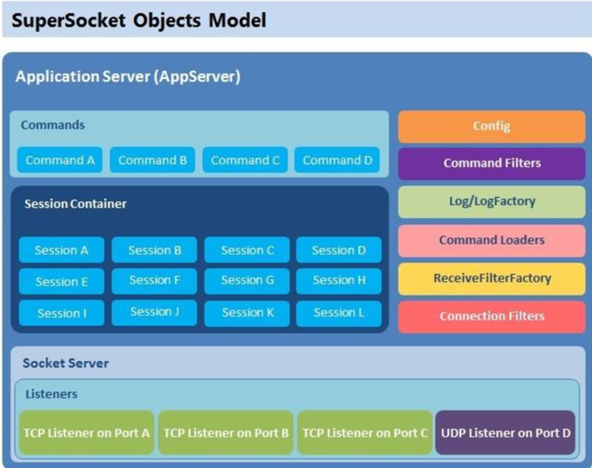
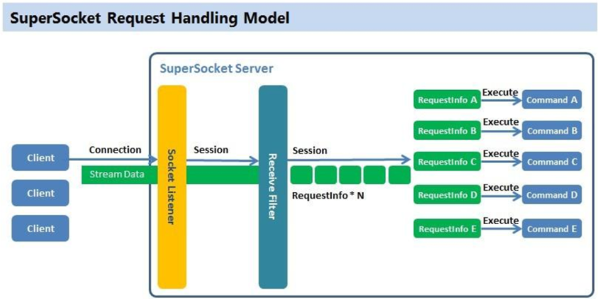
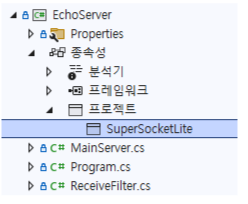
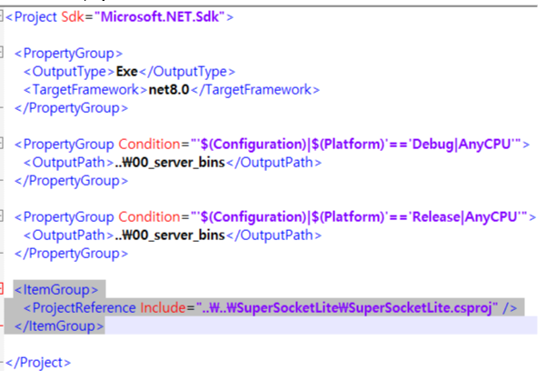
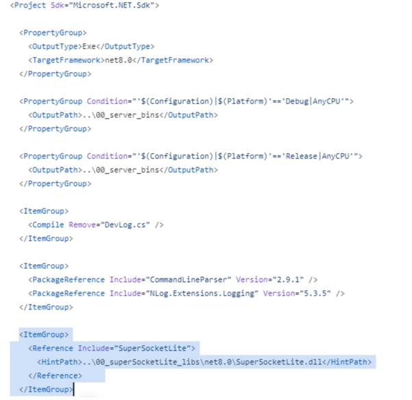
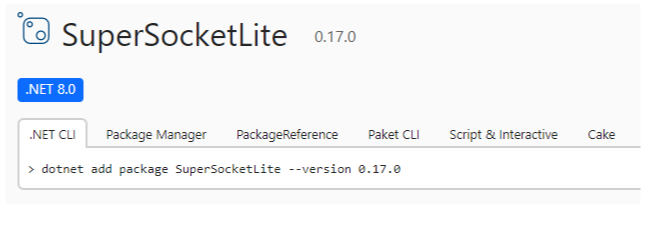

# SuperSocketLite를 이용한 C# 네트워크 프로그래밍
    
저자: 최흥배, Claude AI  
  
- .NET 8 이상, 
- C#
- Windows, Linux
- Visual Studio Code, Visual Studio 2022 이상  
--------
  
# Chapter.01 시작하기
SuperSocketLite는 오픈 소스인 [SuperSocket](https://www.supersocket.net/)을 .NET Core로 포팅하면서 만들어진 라이브러리이다. 그래서 대부분의 코드는 SuperSocket과 비슷하다.   
다만 범용적인 사용을 목적으로 하는 SuperSocket과 달리 게임 서버 개발을 주 목적으로 하여 게임 서버 개발에는 불필요 하다고 생각되는 코드는 제거하여 SuperSocket에 비해 코드는 더 간단하다.  
SuperSocketLite는 핵심 코드는 SuperSocket과 동일하지만 기능을 축소시키면서 코드는 더 간단해졌다.

## SuperSocketLite 저장소
[GitHub - jacking75/SuperSocketLite: SuperSocket 1.6 버전의 .NET Core 포팅](https://github.com/jacking75/SuperSocketLite )  
    
## 아키텍처
[여기에 있는 문서](https://github.com/jacking75/SuperSocketLite/tree/master/Docs/SuperSocket-1_6-Doc)들은 기존 SuperSocket에서 가져온 문서로 주요 기능은 SuperSocketLite와 동일하므로 이 문서를 보면 된다.  
  
[https://github.com/jacking75/SuperSocketLite/tree/master/Docs](https://github.com/jacking75/SuperSocketLite/tree/master/Docs) 에 있는 SuperSocketLite_Code.xlsx 문서를 보면 주요 클래스가 어떻게 관계 되고, 호출 되는지 파악할 수 있다.  
[DeepWiki](https://deepwiki.com/jacking75/SuperSocketLite) 의 문서도 보는 것을 추천한다.
  
   
   
  
이 이미지는 SuperSocket 서버의 요청 처리 모델(Request Handling Model)을 도식화한 것이다.     
주요 구성요소와 흐름을 다음과 같이 설명할 수 있다:  
  
1. 클라이언트 레벨:  
- 여러 클라이언트가 서버에 연결을 시도할 수 있음  
- Stream Data를 통해 서버와 통신
  
2. SuperSocket 서버 내부:  
- Socket Listener: 클라이언트의 연결을 수신하는 첫 번째 계층  
- Session: 클라이언트와의 연결을 관리하는 세션 계층  
- Receive Filter: 수신된 데이터를 처리하고 필터링하는 계층
  
3. 요청 처리 프로세스:  
- RequestInfo \* N: 여러 요청 정보를 처리할 수 있음  
- RequestInfo A부터 E까지 각각의 요청이 해당하는 Command로 실행됨  
- Execute: 각 RequestInfo는 대응하는 Command(A부터 E)를 실행
  
4. 이 모델의 장점:  
- 다중 클라이언트 처리 가능  
- 요청을 체계적으로 관리  
- 모듈화된 구조로 유지보수가 용이  
- 확장성이 뛰어남
  
이는 네트워크 애플리케이션에서 흔히 사용되는 서버 아키텍처로, 효율적인 클라이언트-서버 통신을 가능하게 한다.  
  

클라이언트 연결부터 요청 처리까지의 흐름:
1. 클라이언트 연결 단계:  
- 여러 클라이언트가 서버에 Connection 요청  
- Stream Data를 통해 데이터 전송

2. Socket Listener 처리:  
- 서버의 첫 번째 계층인 Socket Listener가 클라이언트의 연결 요청을 수신  
- 연결이 성립되면 Session을 생성

3. Session 관리:  
- 생성된 Session이 클라이언트와의 지속적인 연결을 관리  
- Session을 통해 데이터의 송수신이 이루어짐

4. Receive Filter 처리:  
- Session을 통해 전달된 데이터는 Receive Filter로 전달  
- Receive Filter는 수신된 데이터를 적절한 RequestInfo 형태로 변환

5. RequestInfo 처리:  
- 변환된 RequestInfo는 각각의 종류에 따라 분류됨 (A, B, C, D, E 등)  
- 각 RequestInfo는 해당하는 Command로 매핑됨

6. Command 실행:  
- 각 RequestInfo에 매핑된 Command가 Execute를 통해 실행  
- Command A부터 E까지 각각의 비즈니스 로직 수행
  
이러한 흐름을 통해 클라이언트의 요청이 체계적으로 처리되며, 각 단계별로 모듈화되어 있어 유지보수와 확장이 용이다.
  

## 설명 동영상
YouTube에 내가 만든 설명 영상을 참고하면 학습에 도움이 될 것이다.  
[.NET Conf 2023 x Seoul Hands-on-Lab: Echo Server](https://www.youtube.com/watch?v=TwMNbxUgMUI&list=PLW_xyUw4fSdZOtyDX5Wf5sKbFMYSH-K3o&index=7&pp=gAQBiAQB)   
[SuperSocketLite Tutorial - Echo Server 만들기](https://youtu.be/ZgzMuHE43hU?si=G7MEbY-rlRthQLUe)  
[SuperSocketLite Tutorial - Chat Server 만들기](https://youtu.be/eiwvQ8NV2h8?si=JGel57hb6HbNEuhY)
 

## 사용 방법
  
### 라이브러리 참조하기
아래 3가지 방법 중에서 선택하면 된다.  
  
1. SuperSocketLite 프로젝트를 참조하기  
[EchoServer](https://github.com/jacking75/SuperSocketLite/tree/master/Tutorials/EchoServer)   
   
  
EchoServer.csproj    
   
    
  
2. 빌드된 lib 파일 참조하기
아래 프로젝트를 참고한다.    
[EchoServerEx](https://github.com/jacking75/SuperSocketLite/tree/master/Tutorials/EchoServerEx)   
  
EchoServerEx.csproj  
   
  

3. Nuget 사용하기  
[nuget](https://www.nuget.org/packages/SuperSocketLite)  
     
  
  
  
### Server 만들기
SuperSocketLite의 AppServer와 AppSession 클래스를 상속한 클래스를 만들어야 한다.    
- AppSession
    - 서버에 연결된 클라이언트의 네트워크 객체를 가리키는 클래스.   
    - 이 클래스를 통해 데이터 주고 받기를 한다.

- AppServer
    - 네트워크 서버 클래스. 모든 AppSession 객체를 관리한다.   
    - SuperSocket의 몸통이다.
  
아래는 AppServer를 상속하여 만든 BoardServerNet 클래스의 예이다.
**NetworkSession** 은 AppSession 클래스를 상속한 클래스이다.  
**EFBinaryRequestInfo** 은 클라이언트에서 보낸 데이터를 가지고 있는 클래스이다. 자세한 설명은 뒤에 하겠다.
```
class BoardServerNet : AppServer<NetworkSession, 
                                EFBinaryRequestInfo> 
{
}

// AppSession의 기능을 확장할 필요가 없으면 그냥 상속만 받으면 된다
public class NetworkSession : AppSession<NetworkSession, EFBinaryRequestInfo>
{
}
```  
      
    
BoardServerNet 클래스에 네트워크 이벤트(연결, 끊어짐, 데이터 수신)가 발생했을 때 호출될 함수를 등록한다.  
```
public BoardServerNet()
    : base(new DefaultReceiveFilterFactory<ReceiveFilter, EFBinaryRequestInfo>())
{
    NewSessionConnected += new SessionHandler<NetworkSession>(OnConnected);
    SessionClosed += new SessionHandler<NetworkSession, CloseReason>(OnClosed);
    NewRequestReceived += new RequestHandler<NetworkSession, EFBinaryRequestInfo>(RequestReceived);
}

// 클라이언트가 접속했을 때 호출
private void OnConnected(NetworkSession session)
{
}

// 클라이언트가 접속을 해제했을 때 호출
private void OnClosed(NetworkSession session, CloseReason reason)
{
}

// 클라이언트로부터 데이터를 수신했을 때 호출
private void RequestReceived(NetworkSession session, EFBinaryRequestInfo reqInfo)
{
}
```  
  
  
위에서 정의한 BoardServerNet을 사용하기 위해서 설정 값을 입력으로 하여 Setup 함수를 호출한다.  
```
void InitConfig()
{
    m_Config = new ServerConfig
    {
        Port = 23478,
        Ip = "Any",
        MaxConnectionNumber = 100,
        Mode = SocketMode.Tcp,
        Name = "BoardServerNet"
    };
}

void CreateServer()
{
      m_Server = new BoardServerNet();
      bool bResult = m_Server.Setup(new RootConfig(), 
                                                         m_Config, 
                                logFactory: new Log4NetLogFactory()
                                );

      if (bResult == false)
      {
      }

      ......
}
```  
  

서버 네트워크 시작에는 Start() 함수를 호출하고, 중단할 때는 Stop() 함수를 호출한다.  
```
// 네트워크 시작
if (! m_Server.Start())
{
	return;
}

....
// 네트워크 중지
m_Server.Stop();
```  


**AppSession 기능 확장**  
```
public class TelnetSession : AppSession<TelnetSession>
{
    protected override void OnSessionStarted()
    {
        this.Send("Welcome to SuperSocket Telnet Server");
    }

    protected override void HandleUnknownRequest(StringRequestInfo requestInfo)
    {
        this.Send("Unknow request");
    }

    protected override void HandleException(Exception e)
    {
        this.Send("Application error: {0}", e.Message);
    }

    protected override void OnSessionClosed(CloseReason reason)
    {
        //add you logics which will be executed after the session is closed
        base.OnSessionClosed(reason);
    }
}
```  
   
  
**네트워크 옵션 파라미터**    
루트 설정(모든 서버 네트워크에 적용)에 사용하는 파리미터 **IRootConfig**  
* maxWorkingThreads: maximum working threads count of .NET thread pool;  
* minWorkingThreads: minimum working threads count of .NET thread pool;  
* maxCompletionPortThreads: maximum completion threads count of .NET thread pool;  
* minCompletionPortThreads: minimum completion threads count of .NET thread pool;  
* disablePerformanceDataCollector: whether disable performance data collector;  
* performanceDataCollectInterval: performance data collecting interval (in seconds, default value: 60);  
* isolation: SuperSocket instances isolation level  
      None - no isolation  
     AppDomain - server instances will be isolated by AppDomains  
     Process - server instances will be isolated by processes  
* logFactory: the name of default logFactory, all log factories are defined in the child node "logFactories" which will be introduced in following documentation;  
* defaultCulture: default thread culture for the global application, only available in .Net 4.5;
  

**서버 인스턴스 옵션 파라미터**           
IServerconfig
* name: the name of the server instance;  
* serverType: the full name the AppServer's type which you want to run;  
* serverTypeName: the name of the selected server types, all server types should be defined in serverTypes node which will be introduced in following documentation;  
* ip: the ip of the server instance listens. You can set an exact ip, you also can set the below values Any - all IPv4 address IPv6Any - all IPv6 address  
* port: the port of the server instance listens;  
* listenBacklog: the listen back log size;  
* mode: the socket server's running mode, Tcp (default) or Udp;  
* disabled: whether the server instance is disabled;  
* startupOrder: the server instance start order, the bootstrap will start all server instances order by this value;  
* sendTimeOut: sending data timeout;  
* sendingQueueSize: the sending queue's maximum size;  
* maxConnectionNumber: maximum connection number the server instance allow to connect at the same time;  
* receiveBufferSize: receiving buffer size; 세션당  
* sendBufferSize: sending buffer size;  세션당  
* syncSend: sending data in sync mode, default value: false;  
* logCommand: whether log command execution record;  
* logBasicSessionActivity: whether log the session's basic activities like connected and closed;  
* clearIdleSession: true or false, whether clear idle sessions, default value is false;  
* clearIdleSessionInterval: the clearing timeout idle session interval, default value is 120, in seconds;  
* idleSessionTimeOut: The session timeout period. Default value is 300, in seconds;  
* security: Empty, Tls, Ssl3. The security option of the socket server, default value is empty;  
* maxRequestLength: The maximum allowed request length, default value is 1024;  
* textEncoding: The default text encoding in the server instance, default value is ASCII;  
* defaultCulture: default thread culture for this appserver instance, only available in .Net 4.5 and cannot be set if the isolation model is 'None';  
* disableSessionSnapshot: Indicate whether disable session snapshot, default value is false. 세션 수 기록  
* sessionSnapshotInterval: The interval of taking session snapshot, default value is 5, in seconds;  
* keepAliveTime: The interval of keeping alive, default value is 600, in seconds;  
* keepAliveInterval: The interval of retry after keep alive fail, default value is 60, in seconds;
  

**AppSession 다루기**  
데이터 보내기  
```
session.Send(data, 0, data.Length);
or
session.Send("Welcome to use SuperSocket!");
```  
  
AppServer 세션 찾기     
GetSessionByID 멤버를 사용한다.     
```
var session = appServer.GetSessionByID(sessionID);
if(session != null)
    session.Send(data, 0, data.Length);
```  
  
sessionID는 AppSession 객체를 생성할 때 GUID를 string으로 할당한다.     
UDP의 경우 UdpRequestInfo를 사용하면 GUID로 만들고, 아니면 리모트의 IP와 Port로 만든다.  
  
연결된 모든 세션에 메시지 보내기  
```
foreach(var session in appServer.GetAllSessions())
{
    session.Send(data, 0, data.Length);
}
```  
    
    
커스텀 Key로 세션들 찾기      
아래의 CompanyId 처럼 새로운 Key를 사용하여 검색이 가능하다.    
```
var sessions = appServer.GetSessions(s => s.CompanyId == companyId);
foreach(var s in sessions)
{
    s.Send(data, 0, data.Length);
}
```  
    
    
**Custome 프로토콜 정의(binary 기반)**    
SuperSocketLite 에서는 binary 기반의 프로토콜을 정의해서 사용하는 것만을 주로 고려하고 있다.   
  
```
/// <summary>
/// 이진 요청 정보 클래스
/// 패킷의 헤더와 보디에 해당하는 부분을 나타냅니다.
/// </summary>
public class EFBinaryRequestInfo : BinaryRequestInfo
{
    /// <summary>
    /// 전체 크기
    /// </summary>
    public Int16 TotalSize { get; private set; }

    /// <summary>
    /// 패킷 ID
    /// </summary>
    public Int16 PacketID { get; private set; }

    /// <summary>
    /// 예약(더미)값 
    /// </summary>
    public SByte Value1 { get; private set; }

    /// <summary>
    /// 헤더 크기
    /// </summary>
    public const int HeaderSize = 5;

    /// <summary>
    /// EFBinaryRequestInfo 클래스의 새 인스턴스를 초기화합니다.
    /// </summary>
    /// <param name="totalSize">전체 크기</param>
    /// <param name="packetID">패킷 ID</param>
    /// <param name="value1">값 1</param>
    /// <param name="body">바디</param>
    public EFBinaryRequestInfo(Int16 totalSize, Int16 packetID, SByte value1, byte[] body)
        : base(null, body)
    {
        this.TotalSize = totalSize;
        this.PacketID = packetID;
        this.Value1 = value1;
    }
}

/// <summary>
/// 수신 필터 클래스
/// </summary>
public class ReceiveFilter : FixedHeaderReceiveFilter<EFBinaryRequestInfo>
{
    /// <summary>
    /// ReceiveFilter 클래스의 새 인스턴스를 초기화합니다.
    /// </summary>
    public ReceiveFilter() : base(EFBinaryRequestInfo.HeaderSize)
    {
    }

    /// <summary>
    /// 헤더에서 바디 길이를 가져옵니다.
    /// </summary>
    /// <param name="header">헤더</param>
    /// <param name="offset">오프셋</param>
    /// <param name="length">길이</param>
    /// <returns>바디 길이</returns>
    protected override int GetBodyLengthFromHeader(byte[] header, int offset, int length)
    {
        if (!BitConverter.IsLittleEndian)
            Array.Reverse(header, offset, 2);

        var packetTotalSize = BitConverter.ToInt16(header, offset);
        return packetTotalSize - EFBinaryRequestInfo.HeaderSize;
    }

    /// <summary>
    /// 요청 정보를 해결합니다.
    /// </summary>
    /// <param name="header">헤더</param>
    /// <param name="buffer">바디 버퍼</param>
    /// <param name="offset">오프셋. receive 버퍼 내의 오프셋으로 패킷의 보디의 시작 지점을 가리킨다</param>
    /// <param name="length">길이. 패킷 바디의 크기</param>
    /// <returns>해결된 요청 정보</returns>
    protected override EFBinaryRequestInfo ResolveRequestInfo(ArraySegment<byte> header, byte[] buffer, int offset, int length)
    {
        if (!BitConverter.IsLittleEndian)
            Array.Reverse(header.Array, 0, EFBinaryRequestInfo.HeaderSize);

        return new EFBinaryRequestInfo(BitConverter.ToInt16(header.Array, 0),
                                       BitConverter.ToInt16(header.Array, 0 + 2),
                                       (SByte)header.Array[4],
                                       buffer.CloneRange(offset, length));
    }
}
```  
    
SuperSocketLite 라이브러리를 참고하고, 핵심 클래스를 사용하는 방법을 설명하였다. 
다음 장부터는 서버 프로그램을 만들면서 사용 방법을 배워보도록 한다.    
  
