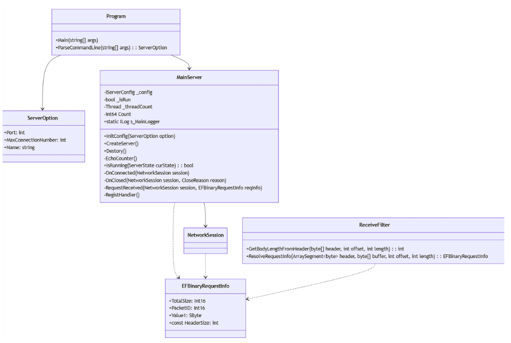
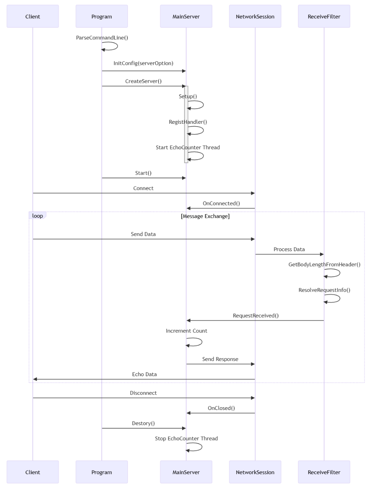
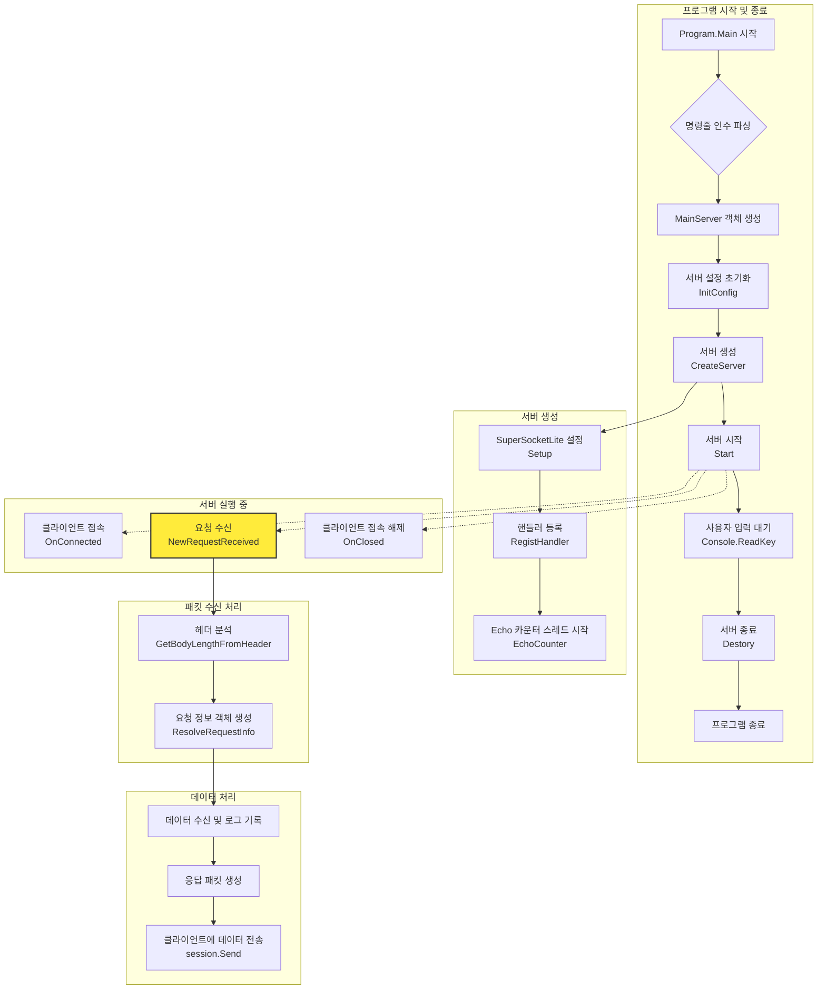

# SuperSocketLite를 이용한 C# 네트워크 프로그래밍
    
저자: 최흥배, Gemini 2.5 Pro  
  
- .NET 8 이상, 
- C#
- Windows, Linux
- Visual Studio Code, Visual Studio 2022 이상  
--------
  
# Chapter.02 에코 서버 만들기 

코드 위치:   
[SuperSocketLite Tutorials - EchoServer](https://github.com/jacking75/SuperSocketLite/tree/master/Tutorials/EchoServer)  
  
<pre>  
┌─────────────────────────────┐
│ Name                        │
├─────────────────────────────┤
│ 📁 ..                       │
├─────────────────────────────┤
│ 📁 Properties               │
├─────────────────────────────┤
│ 📄 EchoServer.csproj        │
├─────────────────────────────┤
│ 📄 EchoServer.sln           │
├─────────────────────────────┤
│ 📄 MainServer.cs            │
├─────────────────────────────┤
│ 📄 Program.cs               │
├─────────────────────────────┤
│ 📄 ReceiveFilter.cs         │
└─────────────────────────────┘  
</pre>  
  

## 클래스 다이어그램



이 다이어그램은 Echo Server의 주요 클래스들과 그들 간의 관계를 보여준다:  
1. Program 클래스: 메인 진입점으로 서버를 초기화하고 실행한다.  
2. ServerOption 클래스: 서버 설정을 담당하는 클래스이다.  
3. MainServer 클래스: 실제 서버 기능을 구현하는 핵심 클래스이다.  
4. NetworkSession 클래스: 클라이언트 연결을 관리하는 세션 클래스이다.  
5. EFBinaryRequestInfo 클래스: 바이너리 패킷의 구조를 정의한다.  
6. ReceiveFilter 클래스: 수신된 데이터를 처리하는 필터 클래스이다.

화살표는 다음과 같은 관계를 나타낸다:

* 실선 화살표(-->): 의존성/소유 관계  
* 점선 화살표(..>): 사용 관계
    

## 코드 흐름을 중심으로 시퀸스 다이어그램
  
  
  
이 시퀀스 다이어그램은 Echo Server의 주요 실행 흐름을 보여준다:

1. 초기화 단계
* Program이 명령줄 인수를 파싱  
* MainServer 구성 및 생성  
* EchoCounter 스레드 시작
   
2. 클라이언트 연결 단계
* 클라이언트 연결 시 OnConnected 호출
  
3. 메시지 처리 단계 (루프)
* 클라이언트로부터 데이터 수신  
* ReceiveFilter를 통한 데이터 처리  
* 패킷 분석 및 응답  
* 클라이언트로 에코 응답

4. 연결 종료 단계  
* 클라이언트 연결 해제  
* 서버 종료 및 정리
  

특징적인 부분:  
* 비동기 통신 처리  
* 패킷 기반의 데이터 처리  
* 에코 카운터를 통한 모니터링  
* 세션 기반의 클라이언트 관리
  

## MainServer 클래스를 중심으로 주요 코드 흐름 다이어그램


     
### 코드 흐름 설명
1.  **프로그램 시작 (`Program.cs`)**

      * 프로그램이 시작되면 `Main` 함수에서 명령줄 인수를 파싱하여 `ServerOption` 객체를 생성한다.
      * `MainServer`의 인스턴스를 만들고 `InitConfig` 메서드를 호출하여 포트, 최대 연결 수 등의 서버 설정을 초기화한다.
      * `CreateServer` 메서드를 호출하여 서버를 생성하고, `Start` 메서드로 서버를 시작하여 클라이언트의 접속을 기다리는 상태가 된다.
      * 사용자가 키를 입력하면 `Destory` 메서드를 호출하여 서버를 정상적으로 종료한다.

2.  **서버 생성 (`MainServer.cs - CreateServer`)**

      * `Setup` 메서드를 호출하여 SuperSocketLite 프레임워크에 필요한 기본 설정을 구성한다.
      * `RegistHandler` 메서드를 호출하여 패킷을 처리할 핸들러들을 등록한다 (주석에 따르면 EchoServer 예제에서는 별도의 핸들러를 등록하지 않는다).
      * `EchoCounter` 메서드를 별도의 스레드로 실행하여 주기적으로 Echo 횟수를 카운트한다.(디버그 용도이다)

3.  **이벤트 기반 동작 (`MainServer.cs`)**

      * **`OnConnected`**: 새로운 클라이언트가 접속하면 호출되어 세션 번호를 로그로 남긴다.
      * **`OnClosed`**: 클라이언트 접속이 끊어지면 호출되어 접속 해제 사유를 로그로 남긴다.
      * **`NewRequestReceived`**: 클라이언트로부터 데이터를 받으면 호출된다. 이것이 Echo 기능의 핵심이다.

4.  **데이터 수신 및 응답 (`MainServer.cs - RequestReceived`)**

      * 클라이언트로부터 `EFBinaryRequestInfo` 형태로 패킷을 받는다.
      * 수신된 데이터의 크기를 로그로 기록한다.
      * `Interlocked.Increment`를 사용하여 스레드에 안전하게 Echo 카운트를 1 증가시킨다.
      * 수신된 패킷의 Body 데이터를 그대로 사용하여 응답 패킷을 다시 생성한다.
      * `session.Send`를 통해 데이터를 보냈던 클라이언트에게 그대로 다시 전송한다 (Echo).

5.  **패킷 수신 처리 (`ReceiveFilter.cs`)**

      * 클라이언트로부터 TCP 스트림 데이터가 들어오면 `ReceiveFilter`가 동작한다.
      * `GetBodyLengthFromHeader` 메서드는 가장 먼저 호출되어, 고정 크기(5바이트)의 헤더를 읽어와 앞으로 수신해야 할 데이터(Body)의 길이를 계산한다.
      * Body 데이터까지 모두 수신되면 `ResolveRequestInfo` 메서드가 호출되어, 헤더와 Body 데이터를 `EFBinaryRequestInfo` 객체 하나로 완전하게 조립한다. 이 객체가 `NewRequestReceived` 이벤트 핸들러로 전달된다. 
         

EchoServer를 만드는 방법을 설명 하겠다.
  
## 프로젝트 설정
1. 새로운 C# 콘솔 애플리케이션 프로젝트를 생성한다.    
2. SuperSocketLite 라이브러리 프로젝트를 참조로 추가한다.
  
EchoServer.csproj    
```
<Project Sdk="Microsoft.NET.Sdk">

  <PropertyGroup>
    <OutputType>Exe</OutputType>
    <TargetFramework>net9.0</TargetFramework>
  </PropertyGroup>

  <PropertyGroup Condition="'$(Configuration)|$(Platform)'=='Debug|AnyCPU'">
    <OutputPath>..\00_server_bins</OutputPath>
  </PropertyGroup>

  <PropertyGroup Condition="'$(Configuration)|$(Platform)'=='Release|AnyCPU'">
    <OutputPath>..\00_server_bins</OutputPath>
  </PropertyGroup>

  <ItemGroup>
    <ProjectReference Include="..\..\SuperSocketLite\SuperSocketLite.csproj" />
  </ItemGroup>

</Project>
```
    
  
## MainServer 클래스  
`MainServer` 클래스는 `EchoServer`의 핵심 로직을 담당하는 메인 서버 클래스이다. SuperSocketLite 라이브러리의 `AppServer`를 상속받아 구현되었으며, 클라이언트의 연결, 데이터 수신 및 연결 종료와 같은 핵심 이벤트를 처리한다.

### 주요 특징 및 구조
* **상속 구조**: `MainServer`는 `AppServer<NetworkSession, EFBinaryRequestInfo>`를 상속받는다.
    * `AppServer`: SuperSocketLite 프레임워크에서 제공하는 서버의 기본 기능을 담고 있는 추상 클래스이다.
    * `NetworkSession`: 클라이언트 한 명과의 연결을 나타내는 세션 클래스이다. `AppSession<NetworkSession, EFBinaryRequestInfo>`을 상속한다.
    * `EFBinaryRequestInfo`: 클라이언트로부터 수신한 데이터를 파싱하여 담는 요청 정보 클래스이다. 패킷의 헤더와 바디 정보를 포함한다.

* **주요 멤버 변수**
    * `s_MainLogger`: 서버의 동작 상태를 기록하기 위한 정적(static) 로거(Logger) 인스턴스이다.
    * `_config`: 포트, IP, 최대 연결 수 등 서버의 설정 정보를 담는 `IServerConfig` 타입의 변수이다.
    * `_isRun`: `EchoCounter` 스레드의 실행 여부를 제어하는 `bool` 타입의 플래그이다.
    * `_threadCount`: 1초마다 수신된 패킷 수를 카운트하는 `EchoCounter` 메서드를 실행하는 스레드 객체이다.
  

### 핵심 메서드 흐름

#### 1. 생성자 (`MainServer()`)
`MainServer` 객체가 처음 생성될 때 호출된다. 여기서는 서버의 주요 이벤트 핸들러를 등록한다.
  
```
public MainServer()
        : base(new DefaultReceiveFilterFactory<ReceiveFilter, EFBinaryRequestInfo>())
{
    NewSessionConnected += new SessionHandler<NetworkSession>(OnConnected);
    SessionClosed += new SessionHandler<NetworkSession, CloseReason>(OnClosed);
    NewRequestReceived += new RequestHandler<NetworkSession, EFBinaryRequestInfo>(RequestReceived);
}
```  
  
* `NewSessionConnected`: 새로운 클라이언트가 접속했을 때 `OnConnected` 메서드를 호출한다.
* `SessionClosed`: 클라이언트 접속이 종료되었을 때 `OnClosed` 메서드를 호출한다.
* `NewRequestReceived`: 클라이언트로부터 새로운 데이터를 수신했을 때 `RequestReceived` 메서드를 호출한다.
  

#### 2. 서버 설정 (`InitConfig(ServerOption option)`)
`Program.cs`에서 파싱한 명령줄 인수를(`ServerOption`) 받아 서버의 구체적인 설정을 초기화한다.
  
```
public void InitConfig(ServerOption option)
{
    _config = new ServerConfig
    {
        Port = option.Port,
        Ip = "Any",
        MaxConnectionNumber = option.MaxConnectionNumber,
        Mode = SocketMode.Tcp,
        Name = option.Name
    };
}
```    
    
* `ServerConfig` 객체를 생성하여 포트(`Port`), IP(`Ip`), 최대 연결 수(`MaxConnectionNumber`), 소켓 모드(`Mode`), 서버 이름(`Name`) 등을 설정한다.
  

#### 3. 서버 생성 (`CreateServer()`)
실질적인 서버 객체를 생성하고 실행 준비를 마치는 단계이다.
  
```
public void CreateServer()
{
    try
    {
        bool isResult = Setup(new RootConfig(), _config, logFactory: new ConsoleLogFactory());

        if (isResult == false)
        {
            Console.WriteLine("[ERROR] 서버 네트워크 설정 실패 ㅠㅠ");
            return;
        }

        s_MainLogger = base.Logger;

        RegistHandler();

        _isRun = true;
        _threadCount = new Thread(EchoCounter);
        _threadCount.Start();

        s_MainLogger.Info($"[{DateTime.Now}] 서버 생성 성공");
    }
    catch (Exception ex)
    {
        s_MainLogger.Error($"서버 생성 실패: {ex.ToString()}");
    }
}
```  
    
1.  `Setup()`: `InitConfig`에서 설정한 `_config` 정보를 바탕으로 SuperSocketLite 프레임워크에 서버를 설정(Setup)한다. 실패 시 에러 메시지를 출력한다.
2.  `s_MainLogger = base.Logger;`: 프레임워크가 생성한 로거를 `s_MainLogger`에 할당하여 서버 전역에서 사용할 수 있게 한다.
3.  `RegistHandler()`: 패킷 ID에 따라 로직을 처리할 핸들러를 등록하는 메서드를 호출한다. (현재 EchoServer 예제에서는 주석 처리되어 있어 실제 등록하는 핸들러는 없다).
4.  `_threadCount.Start()`: 1초마다 수신된 패킷 수를 콘솔에 출력하는 `EchoCounter` 스레드를 시작한다.
  
  
#### 4. 서버 종료 (`Destory()`)
`Program.cs`에서 종료 신호를 받으면 호출되어 서버를 안전하게 종료한다.    
```
public void Destory()
{
    base.Stop();

    _isRun = false;
    _threadCount.Join();
}
```  
  
* `base.Stop()`: SuperSocketLite의 `Stop` 메서드를 호출하여 모든 클라이언트 세션을 닫고 리소스를 해제한다.
* `_isRun = false;`: `EchoCounter` 스레드의 `while` 루프를 중단시킨다.
* `_threadCount.Join()`: `EchoCounter` 스레드가 완전히 종료될 때까지 대기한다.
  

### 이벤트 핸들러 (핵심 로직)

#### `OnConnected(NetworkSession session)`
새로운 클라이언트가 서버에 접속할 때마다 실행된다. 접속한 클라이언트의 세션 ID와 현재 스레드 ID를 디버그 로그로 기록한다.   
```
private void OnConnected(NetworkSession session)
{
    s_MainLogger.Debug($"[{DateTime.Now}] 세션 번호 {session.SessionID} 접속 start, ThreadId: {System.Threading.Thread.CurrentThread.ManagedThreadId}"); 
}
```  
  
#### `OnClosed(NetworkSession session, CloseReason reason)`
클라이언트의 접속이 끊어졌을 때 실행된다. 접속이 끊어진 세션 ID와 그 이유(`CloseReason`)를 정보 로그로 기록한다.   
```
private void OnClosed(NetworkSession session, CloseReason reason)
{
    s_MainLogger.Info($"[{DateTime.Now}] 세션 번호 {session.SessionID},  접속해제: {reason.ToString()}");
}
```  
  
#### `RequestReceived(NetworkSession session, EFBinaryRequestInfo reqInfo)`
**EchoServer의 가장 핵심적인 부분**으로, 클라이언트로부터 데이터를 수신했을 때 실행된다.  
```
private void RequestReceived(NetworkSession session, EFBinaryRequestInfo reqInfo)
{
    s_MainLogger.Debug($"[{DateTime.Now}] 세션 번호 {session.SessionID},  받은 데이터 크기: {reqInfo.Body.Length}, ThreadId: {System.Threading.Thread.CurrentThread.ManagedThreadId}");

    Interlocked.Increment(ref Count);


    var totalSize = (Int16)(reqInfo.Body.Length + EFBinaryRequestInfo.HeaderSize);

    List<byte> dataSource =
    [
        .. BitConverter.GetBytes(totalSize),
        .. BitConverter.GetBytes((Int16)reqInfo.PacketID),
        .. new byte[1],
        .. reqInfo.Body,
    ];

    session.Send(dataSource.ToArray(), 0, dataSource.Count);
}
```  
    
1.  수신된 데이터의 크기(`reqInfo.Body.Length`)와 세션 ID를 로그로 기록한다.
2.  `Interlocked.Increment(ref Count)`: 멀티스레드 환경에서 안전하게 `Count` 변수(초당 패킷 수)를 1 증가시킨다.
3.  수신된 데이터(`reqInfo`)를 그대로 클라이언트에게 돌려주기 위해 응답 패킷을 생성한다.
    * 전체 크기(헤더 + 바디), 패킷 ID, 그리고 실제 데이터(Body)를 `List<byte>`에 조합한다.
    * 헤더 구성은 `EFBinaryRequestInfo` 클래스의 정의와 일치한다.
4.  `session.Send(...)`: 생성된 응답 패킷을 데이터를 보냈던 바로 그 클라이언트(`session`)에게 다시 전송합니다. 이것이 "Echo(메아리)" 기능이다.
      
  
## NetworkSession 클래스 정의   
파일: MainServer.cs      
```
public class NetworkSession : AppSession<NetworkSession, EFBinaryRequestInfo>
{
}
```  

  
## ReceiveFilter 및 EFBinaryRequestInfo 클래스 구현
파일: ReceiveFilter.cs    
  
### EFBinaryRequestInfo 클래스
`EFBinaryRequestInfo` 클래스는 클라이언트로부터 수신한 하나의 완전한 데이터 패킷을 표현하는 데이터 구조 클래스다. TCP/IP 통신으로 들어온 바이트 배열 데이터를 서버가 논리적으로 처리할 수 있는 의미 있는 단위로 정의한 것이다. 이 클래스는 SuperSocketLite의 `BinaryRequestInfo`를 상속받아 구현됐다.

* **주요 속성(Properties)**
    * `TotalSize`: 패킷의 전체 크기(헤더 + 바디)를 나타낸다.
    * `PacketID`: 수신된 패킷의 고유 ID를 나타낸다. 이를 통해 서버는 어떤 종류의 요청인지 구분할 수 있다.
    * `Value1`: 현재 코드에서는 특별한 용도 없이 예약된 1바이트 공간이다.
    * `Body`: `BinaryRequestInfo`로부터 상속받은 속성이며, 헤더를 제외한 실제 데이터(페이로드)를 담는 바이트 배열이다.

* **주요 상수(Constant)**
    * `HeaderSize`: 패킷 헤더의 크기가 5바이트로 고정되어 있음을 정의한다. 헤더는 `TotalSize`(2바이트), `PacketID`(2바이트), `Value1`(1바이트)로 구성된다.

* **생성자**
    * `EFBinaryRequestInfo`의 생성자는 패킷의 전체 크기, ID, 예약 값, 그리고 바디 데이터를 인자로 받아 객체의 각 속성을 초기화하는 역할을 한다. `ResolveRequestInfo` 메서드에서 최종적으로 파싱된 데이터를 사용하여 이 생성자를 호출한다.
  
```
/// <summary>
/// 이진 요청 정보 클래스
/// 패킷의 헤더와 보디에 해당하는 부분을 나타냅니다.
/// </summary>
public class EFBinaryRequestInfo : BinaryRequestInfo
{
    /// 전체 크기
    public Int16 TotalSize { get; private set; }

    /// 패킷 ID
    public Int16 PacketID { get; private set; }

    /// 예약(더미)값 
    public SByte Value1 { get; private set; }

    /// 헤더 크기
    public const int HeaderSize = 5;

    /// <summary>
    /// EFBinaryRequestInfo 클래스의 새 인스턴스를 초기화합니다.
    /// </summary>
    /// <param name="totalSize">전체 크기</param>
    /// <param name="packetID">패킷 ID</param>
    /// <param name="value1">값 1</param>
    /// <param name="body">바디</param>
    public EFBinaryRequestInfo(Int16 totalSize, Int16 packetID, SByte value1, byte[] body)
        : base(null, body)
    {
        this.TotalSize = totalSize;
        this.PacketID = packetID;
        this.Value1 = value1;
    }
}
```  
  
### ReceiveFilter 클래스
`ReceiveFilter` 클래스는 서버가 클라이언트로부터 받은 연속적인 바이트 스트림(Stream)을 분석하여 논리적인 패킷 단위인 `EFBinaryRequestInfo` 객체로 만들어주는 역할을 하는 클래스다. TCP는 경계가 없는 스트림 기반 프로토콜이므로, 어디까지가 하나의 패킷인지를 개발자가 직접 정의하고 구분해야 하며, 이 필터가 바로 그 역할을 수행한다. 이 클래스는 SuperSocketLite에서 제공하는 `FixedHeaderReceiveFilter<EFBinaryRequestInfo>`를 상속받는다. 이는 정해진 크기의 헤더를 먼저 수신하고, 그 헤더 안에 전체 패킷의 크기 정보가 들어있는 프로토콜을 쉽게 구현하도록 도와준다.

* **`GetBodyLengthFromHeader` 메서드**
    * 이 메서드는 고정된 크기(5바이트)의 헤더를 성공적으로 수신했을 때 가장 먼저 호출된다.
    * 수신된 헤더 데이터(`header`)에서 패킷의 전체 크기(`packetTotalSize`)를 읽어온다.
    * 읽어온 전체 크기에서 헤더의 크기(`HeaderSize`)를 빼서 앞으로 더 수신해야 할 바디(Body) 데이터의 길이를 계산하고 반환한다. 프레임워크는 이 메서드가 반환한 길이만큼의 바디 데이터를 추가로 수신한다.

* **`ResolveRequestInfo` 메서드**
    * `GetBodyLengthFromHeader`에서 계산된 길이의 바디 데이터까지 모두 성공적으로 수신하면 이 메서드가 호출된다.
    * 완전히 수신된 헤더(`header`)와 바디(`buffer`) 데이터를 사용하여 `new EFBinaryRequestInfo(...)` 생성자를 호출함으로써 하나의 완전한 요청 정보 객체를 생성한다.
    * 여기서 생성된 `EFBinaryRequestInfo` 객체는 `MainServer`의 `NewRequestReceived` 이벤트 핸들러에 인자로 전달되어 최종적으로 서버의 비즈니스 로직을 처리하게 된다.
    * `BitConverter.IsLittleEndian`을 확인하는 코드는 다른 바이트 순서(엔디언)를 사용하는 시스템 간의 통신 호환성을 보장하기 위한 것이다.
  
```
public class ReceiveFilter : FixedHeaderReceiveFilter<EFBinaryRequestInfo>
{
    /// ReceiveFilter 클래스의 새 인스턴스를 초기화합니다.
    public ReceiveFilter() : base(EFBinaryRequestInfo.HeaderSize)
    {
    }

    /// <summary>
    /// 헤더에서 바디 길이를 가져옵니다.
    /// </summary>
    /// <param name="header">헤더</param>
    /// <param name="offset">오프셋</param>
    /// <param name="length">길이</param>
    /// <returns>바디 길이</returns>
    protected override int GetBodyLengthFromHeader(byte[] header, int offset, int length)
    {
        if (!BitConverter.IsLittleEndian)
            Array.Reverse(header, offset, 2);

        var packetTotalSize = BitConverter.ToInt16(header, offset);
        return packetTotalSize - EFBinaryRequestInfo.HeaderSize;
    }

    /// <summary>
    /// 요청 정보를 해결합니다.
    /// </summary>
    /// <param name="header">헤더</param>
    /// <param name="buffer">바디 버퍼</param>
    /// <param name="offset">오프셋. receive 버퍼 내의 오프셋으로 패킷의 보디의 시작 지점을 가리킨다</param>
    /// <param name="length">길이. 패킷 바디의 크기</param>
    /// <returns>해결된 요청 정보</returns>
    protected override EFBinaryRequestInfo ResolveRequestInfo(ArraySegment<byte> header, byte[] buffer, int offset, int length)
    {
        if (!BitConverter.IsLittleEndian)
            Array.Reverse(header.Array, 0, EFBinaryRequestInfo.HeaderSize);

        return new EFBinaryRequestInfo(BitConverter.ToInt16(header.Array, 0),
                                       BitConverter.ToInt16(header.Array, 0 + 2),
                                       (SByte)header.Array[4],
                                       buffer.CloneRange(offset, length));
    }
}
```    
  
  
## void Main에서 서버 실행
파일: Program.cs      
```
class Program
{
    static void Main(string[] args)
    {
         var server = new EchoServer();
         server.Setup(2000);  // 포트 2000으로 설정

         if (!server.Start())
         {
             Console.WriteLine("Failed to start server");
             return;
         }

         Console.WriteLine("Server started. Press any key to stop.");
         Console.ReadKey();

         server.Stop();
     }
}
```   
      
    
## 주요 포인트
* SuperSocketLite의 AppServer를 상속받아 EchoServer 클래스를 구현한다.  
* NetworkSession은 클라이언트 연결을 나타낸다.  
* ReceiveFilter는 네트워크로 받은 데이터를 우리가 정의한 패킷 구조 맞게 파싱하는 역할을 한다.  
* EFBinaryRequestInfo는 파싱된 데이터를 담는다.  
* OnRequestReceived 메서드에서 실제 에코 로직을 구현한다.
  

이 예제를 기반으로 필요에 따라 더 복잡한 기능을 추가할 수 있다.  

EchoServer를 테스트 할 때는 아래 클라이언트를 사용한다  
[SuperSocketLite Tutorials - EchoClient](https://github.com/jacking75/SuperSocketLite/tree/master/Tutorials/EchoClient)    
WinForm으로 만든 클라이언트로 Windows 에서만 사용할 수 있다.  
  

## 참고 
  
### SuperSocketLite를 사용한 서버 프로그램의 흐름 
SuperSocketLite를 사용한 게임 서버는 대략 아래와 같은 흐름으로 처리가 되니 이 다이얼그램을 꼭 기억하는 것이 좋다.  
  

### TCP는 경계가 없는 스트림 기반 프로토콜  
  
#### 개념 설명
TCP는 메시지의 경계를 보존하지 않는 스트림 기반 프로토콜입니다. 애플리케이션에서 여러 개의 개별 메시지를 보내더라도, TCP는 이를 하나의 연속된 바이트 스트림으로 처리합니다.

#### 시각적 설명

```
애플리케이션이 보내는 데이터:
┌─────────┐ ┌───────────┐ ┌──────┐ ┌─────────────┐
│Message 1│ │Message 2  │ │Msg 3 │ │Message 4    │
└─────────┘ └───────────┘ └──────┘ └─────────────┘
                          │
                          ▼
TCP 스트림 (경계 없음):
┌──────────────────────────────────────────────────┐
│Message1Message2Msg3Message4                      │
└──────────────────────────────────────────────────┘
                          │
                          ▼
네트워크로 전송되는 패킷들:
┌─────────────────┐ ┌─────────────────┐ ┌─────────────────┐
│Packet 1:        │ │Packet 2:        │ │Packet 3:        │
│Message1Me...    │ │...ssage2Msg3... │ │...Message4      │
└─────────────────┘ └─────────────────┘ └─────────────────┘
                          │
                          ▼
수신측에서 받는 데이터:
┌──────────────────────────────────────────────────┐
│Message1Message2Msg3Message4                      │
└──────────────────────────────────────────────────┘
```

#### 문제점

- **원래 메시지의 경계를 알 수 없음**: 수신측에서는 어디서 한 메시지가 끝나고 다른 메시지가 시작되는지 모름
- **애플리케이션이 직접 메시지 구분을 처리해야 함**: TCP는 단순히 바이트만 전달
- **길이 정보나 구분자를 사용해서 파싱 필요**: 프로토콜 설계 시 고려사항

#### 게임 서버 개발에서의 실제 예시

##### 잘못된 예 (TCP에서 이렇게 하면 안 됨)
```csharp
// 개별 메시지를 따로 보냄
socket.Send(Encoding.UTF8.GetBytes("LOGIN:user123"));
socket.Send(Encoding.UTF8.GetBytes("MOVE:100,200"));

// 받는 쪽에서는 "LOGIN:user123MOVE:100,200"로 받을 수 있음
// 메시지 경계를 구분할 수 없음!
```

##### 올바른 예 1: 길이 헤더 사용
```csharp
public void SendMessage(string message)
{
    byte[] messageBytes = Encoding.UTF8.GetBytes(message);
    byte[] lengthBytes = BitConverter.GetBytes(messageBytes.Length);
    
    // 먼저 메시지 길이를 보냄 (4바이트)
    socket.Send(lengthBytes);
    // 그 다음 실제 메시지를 보냄
    socket.Send(messageBytes);
}

public string ReceiveMessage()
{
    // 먼저 길이를 읽음
    byte[] lengthBytes = new byte[4];
    socket.Receive(lengthBytes, 4, SocketFlags.None);
    int messageLength = BitConverter.ToInt32(lengthBytes, 0);
    
    // 길이만큼 메시지를 읽음
    byte[] messageBytes = new byte[messageLength];
    socket.Receive(messageBytes, messageLength, SocketFlags.None);
    
    return Encoding.UTF8.GetString(messageBytes);
}
```

##### 올바른 예 2: 구분자 사용
```csharp
public void SendMessage(string message)
{
    string messageWithDelimiter = message + "\n"; // 개행문자를 구분자로 사용
    byte[] messageBytes = Encoding.UTF8.GetBytes(messageWithDelimiter);
    socket.Send(messageBytes);
}

public string ReceiveMessage()
{
    StringBuilder buffer = new StringBuilder();
    byte[] tempBuffer = new byte[1];
    
    while (true)
    {
        socket.Receive(tempBuffer, 1, SocketFlags.None);
        char receivedChar = Encoding.UTF8.GetString(tempBuffer)[0];
        
        if (receivedChar == '\n') // 구분자를 만나면 메시지 완성
            break;
            
        buffer.Append(receivedChar);
    }
    
    return buffer.ToString();
}
```

#### UDP와의 차이점

| 특성 | TCP | UDP |
|------|-----|-----|
| 메시지 경계 | 없음 (스트림) | 있음 (데이터그램) |
| 신뢰성 | 보장됨 | 보장되지 않음 |
| 순서 | 보장됨 | 보장되지 않음 |
| 패킷 분할 | 투명하게 처리 | 애플리케이션이 처리 |

#### 결론
TCP를 사용할 때는 반드시 **메시지 프레이밍(Message Framing)** 기법을 사용해야 합니다. 게임 서버에서는 보통 다음 중 하나를 선택합니다:

1. **고정 길이 헤더**: 메시지 앞에 길이 정보 포함
2. **구분자**: 특정 문자나 바이트 시퀀스로 메시지 구분
3. **고정 길이 메시지**: 모든 메시지가 같은 크기
4. **프로토콜 버퍼나 JSON**: 자체적으로 경계를 정의하는 형식 사용

이렇게 해야 네트워크 게임에서 안정적인 통신이 가능합니다.