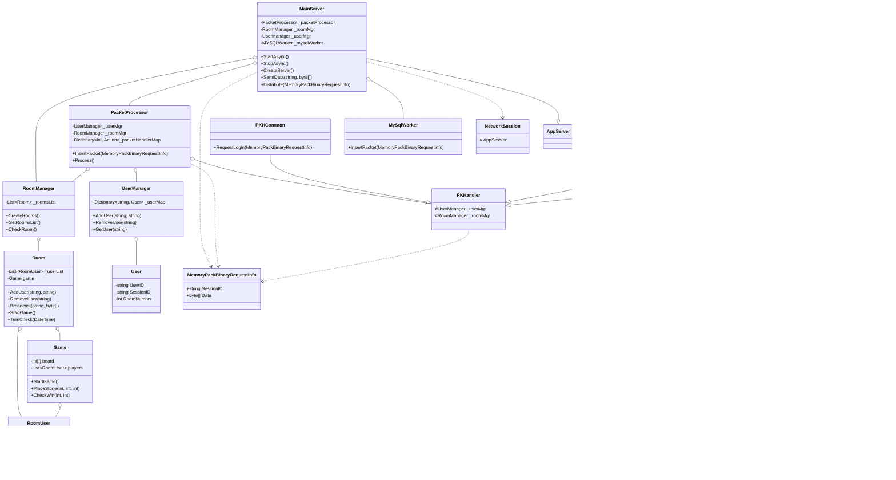

# SuperSocketLite를 이용한 C# 네트워크 프로그래밍
    
저자: 최흥배, Gemini 2.5 Pro  
  
- .NET 8 이상, 
- C#
- Windows, Linux
- Visual Studio Code, Visual Studio 2022 이상  
--------
  
# Chapter.07 온라인 오목 게임

온라인 오목 게임 코드는 https://github.com/yujinS0/GameServer 에 있는 코드를 가져와서 단독으로 사용되도록 코드를 조금 수정하였다.  
[코드](./codes/OnlineOmok/) 
 - OmokClient  winform으로 만든 클라이언트
 - OmokServer  서버 
 - ServerClientCommon   서버와 클라이언트가 공통으로 사용하는 코드  
 - SuperSocketLite   SuperSocketLite를 빌드한 DLL
  


# Server 
  
## 코드 분석하기  

### 1. 프로젝트 시작점 분석 (Program.cs)
* **`Program.cs`**: 모든 애플리케이션의 시작점으로, 서버의 초기 설정과 실행을 담당한다.
    * `Main` 함수에서 `HostBuilder`를 사용하여 서버의 기본 환경을 구성한다.
    * `ConfigureAppConfiguration`을 통해 `appsettings.json` 파일을 로드하여 서버 설정을 가져온다.
    * `ConfigureLogging`으로 로깅 시스템을 설정한다.
    * `ConfigureServices`에서 `MainServer`를 호스팅 서비스로 등록하고 `ServerOption`을 구성한다.
    * `host.RunAsync()`를 호출하여 서버를 비동기적으로 실행한다.

### 2. 메인 서버 로직 파악 (MainServer.cs)
* **`MainServer.cs`**: 서버의 핵심 로직을 담고 있으며, SuperSocketLite 라이브러리의 `AppServer`를 상속받아 구현되었다.
    * 클라이언트 접속(`OnConnected`), 접속 종료(`OnClosed`), 패킷 수신(`OnPacketReceived`)과 같은 네트워크 이벤트를 처리하는 핸들러가 등록되어 있다.
    * `StartAsync`와 `StopAsync` 메서드를 통해 서비스의 시작과 중지를 관리한다.
    * `CreateServer` 메서드에서 서버의 네트워크 설정을 초기화하고, `CreateComponent`를 통해 `RoomManager`, `UserManager`, `PacketProcessor` 등 핵심 컴포넌트를 생성하고 초기화한다.
    * `SendData` 메서드는 특정 세션 ID를 가진 클라이언트에게 데이터를 전송하는 역할을 한다.

### 3. 패킷 수신 및 처리 과정 분석
* **`ReceiveFilter.cs`**: 클라이언트로부터 받은 데이터를 패킷 단위로 분리하는 역할을 한다.
    * `FixedHeaderReceiveFilter`를 상속하여 고정 길이의 헤더를 기반으로 패킷을 파싱한다.
    * `GetBodyLengthFromHeader` 메서드는 패킷 헤더에서 Body의 길이를 추출한다.
    * `ResolveRequestInfo` 메서드는 헤더와 Body를 조합하여 `MemoryPackBinaryRequestInfo` 객체를 생성한다.

* **`PacketProcessor.cs`**: 수신된 패킷을 실제 처리할 핸들러에게 전달하는 역할을 한다.
    * `BufferBlock`을 사용하여 수신된 패킷을 버퍼에 저장하고, 별도의 스레드에서 순차적으로 처리한다.
    * `RegistPacketHandler` 메서드에서 `PACKETID`에 따라 적절한 처리 함수를 `_packetHandlerMap`에 등록한다.
    * `Process` 메서드는 버퍼에서 패킷을 꺼내와 등록된 핸들러를 호출한다.

### 4. 패킷 종류 및 데이터 구조 파악
* **`ServerClientCommon/PacketDefine.cs`**: 클라이언트와 서버 간에 주고받는 패킷의 종류를 `PACKETID` 열거형으로 정의하고 있다. 로그인, 방 입장/퇴장, 채팅, 오목돌 놓기 등 다양한 요청과 응답, 알림 패킷이 정의되어 있다.
* **`ServerClientCommon/PacketData.cs`**: `MemoryPack`을 사용하여 직렬화할 패킷의 데이터 구조를 정의한다. `PKTReqLogin`, `PKTResRoomEnter` 등 각 패킷 ID에 해당하는 클래스들이 정의되어 있다.

### 5. 핵심 기능별 핸들러 분석
* **`PKHCommon.cs`**: 로그인, 하트비트 등 공통적인 기능을 처리하는 핸들러다.
    * `RequestLogin` 메서드는 로그인 요청을 처리하고, 성공 시 `UserManager`에 유저를 추가한다.
* **`PKHRoom.cs`**: 방(Room)과 관련된 로직을 처리하는 핸들러다.
    * `RequestRoomEnter`와 `RequestLeave`는 각각 방 입장 및 퇴장 요청을 처리한다.
    * `RequestChat`은 방 내의 채팅 메시지를 다른 유저들에게 브로드캐스팅한다.
    * `ReqReadyOmok`과 `RequestPlaceStone`은 오목 게임 준비 및 돌 놓기 요청을 처리한다.
* **`PKHDb.cs`**: 데이터베이스 관련 요청을 처리하는 핸들러다.
    * `RequestInUserWin`, `RequestInUserLose` 등의 메서드를 통해 게임 결과를 DB에 업데이트하는 로직을 수행한다.

### 6. 게임 로직 및 상태 관리 분석
* **`Room.cs`**: 개별 오목 게임방의 상태를 관리한다.
    * 방에 속한 유저 리스트(`_userList`)를 관리하며, 유저의 입장 및 퇴장을 처리한다.
    * `Broadcast` 메서드를 통해 방 안의 모든 유저에게 패킷을 전송한다.
    * `StartGame` 메서드가 호출되면 `Game` 객체를 생성하여 게임을 시작한다.
    * `TurnCheck`와 `RoomCheck` 메서드를 통해 일정 시간마다 턴 시간 초과나 방 유지 시간 초과를 검사한다.
* **`Game.cs`**: 실제 오목 게임의 로직을 담당한다.
    * 오목판(`board`)의 상태를 관리하며, `PlaceStone` 메서드를 통해 돌을 놓는 로직을 처리한다.
    * `CheckWin` 메서드를 통해 승리 조건을 검사한다.
    * 게임이 시작되거나 종료될 때 `NotifyGameStart`, `NotifyGameEnd` 등의 메서드를 통해 클라이언트에게 알림을 보낸다.
* **`RoomManager.cs`**: 서버 내의 모든 방을 생성하고 관리하는 역할을 한다.
    * `CreateRooms` 메서드로 서버 옵션에 따라 정해진 수의 방을 미리 생성해둔다.
    * `CheckRoom` 메서드를 주기적으로 호출하여 각 방의 상태를 점검한다.
* **`UserManager.cs`**: 서버에 접속한 모든 유저를 관리한다.
    * `AddUser`와 `RemoveUser` 메서드를 통해 유저의 로그인/로그아웃을 처리하며, 최대 접속자 수를 관리한다.
    * `GetUser` 메서드로 세션 ID를 통해 특정 유저 정보를 가져온다.

### 7. 설정 및 부가 기능 분석
* **`ServerOption.cs`**와 **`appsettings.json`**: 서버의 포트, 최대 접속자 수, 방 개수 등 다양한 설정을 정의하고 관리한다.
* **`NLog*` 파일**: 로깅 라이브러리인 NLog의 설정을 담당하며, 로그 형식과 저장 위치 등을 지정한다.
* **`MySqlWorker.cs`**: 데이터베이스 작업을 처리하기 위한 별도의 워커 스레드를 관리한다. 다만 현재 코드에서는 데이터베이스 기능이 주석 처리되어 임시적으로 사용되지 않고 있다.  
  

## 클래스 다이어그램
  


  
## 오목 게임 서버의 주요 동작을 나타내는 시퀀스 다이어그램
  
### 1. 사용자 로그인 및 방 입장


**동작 설명:**

1.  클라이언트가 `PKTReqLogin` 패킷으로 서버에 로그인을 요청한다.
2.  `MainServer`는 받은 패킷을 `PacketProcessor`에게 넘긴다.
3.  `PacketProcessor`는 패킷 ID를 확인하고 등록된 핸들러인 `PKHCommon`의 `RequestLogin` 함수를 호출한다.
4.  `PKHCommon`은 `UserManager`를 통해 유저를 등록한다.
5.  `UserManager`는 처리 결과를 반환한다.
6.  `PKHCommon`은 결과에 따라 `PKTResLogin` 응답 패킷을 생성하여 `MainServer`를 통해 클라이언트에게 전송한다.
7.  로그인 성공 후, 클라이언트는 `PKTReqRoomEnter` 패킷으로 방 입장을 요청한다.
8.  `MainServer`는 이 패킷 또한 `PacketProcessor`에게 전달한다.
9.  `PacketProcessor`는 이번엔 `PKHRoom`의 `RequestRoomEnter` 함수를 호출한다.
10. `PKHRoom`은 `RoomManager`로부터 요청된 번호의 `Room` 객체를 가져온다.
11. `Room` 객체의 `AddUser` 함수를 호출하여 해당 방에 유저를 추가한다.
12. 방은 새로운 유저의 입장을 다른 유저들에게 알리기 위해 `Broadcast`를 요청하고, 입장한 클라이언트에게는 현재 방에 있는 유저 목록을 전송한다.
13. 최종적으로 `PKTResRoomEnter` 패킷으로 입장 성공/실패 여부를 클라이언트에게 응답한다.

-----

### 2. 오목 게임 진행 (돌 놓기)


**동작 설명:**

1.  차례인 클라이언트(Player A)가 `PKTReqPutMok` 패킷으로 돌을 놓을 위치를 서버에 요청한다.
2.  `MainServer`는 패킷을 `PacketProcessor`에 전달한다.
3.  `PacketProcessor`는 `PKHRoom`의 `RequestPlaceStone` 핸들러를 호출한다.
4.  `PKHRoom`은 유저가 속한 `Room` 객체를 찾아 `Game` 로직 처리를 위임한다.
5.  `Room`에 포함된 `Game` 객체의 `PlaceStone` 함수가 호출되어 오목판에 돌을 놓는다.
6.  돌을 놓은 후, `CheckWin` 함수를 통해 승리 조건을 즉시 확인한다.
7.  **만약 승리했다면**, `Game`은 `EndGame`을 호출하여 게임을 종료 상태로 만들고, `PKTNtfEndOmok` 패킷을 방에 있는 모든 클라이언트에게 전송하여 게임이 종료되었음을 알린다.
8.  **승리가 아니라면**, `PKHRoom`은 `Room`의 `Broadcast` 기능을 통해 `PKTNtfPutMok` 패킷을 상대방(Player B)에게 전송하여 방금 놓인 돌의 위치를 알려준다.
   


## 오목 게임 서버의 주요 기능에 대한 코드 중심의 상세

### 1. 로그인 과정
로그인 과정은 클라이언트가 자신의 ID를 서버에 보내 인증받고, 서버 전체에서 유일한 개체로 관리되기 시작하는 절차다.

1.  **패킷 수신 및 분배 (MainServer.cs -> PacketProcessor.cs)**
    * 클라이언트가 `PKTReqLogin` 패킷을 서버로 전송하면, `MainServer`의 `OnPacketReceived` 이벤트 핸들러가 이를 수신한다.
    * 수신된 패킷(`reqInfo`)은 세션 ID가 부여된 후 `Distribute` 메서드를 통해 `PacketProcessor`의 `InsertPacket`으로 전달된다.
    * `PacketProcessor`는 별도의 스레드에서 `_msgBuffer`에 쌓인 패킷을 하나씩 꺼내 `Process` 메서드로 처리한다.
    * `Process` 메서드는 패킷 헤더를 분석하여 `PACKETID.ReqLogin`에 맞는 핸들러를 `_packetHandlerMap`에서 찾아 호출한다. `ReqLogin`의 핸들러는 `PKHCommon` 클래스의 `RequestLogin` 메서드로 지정되어 있다.

2.  **로그인 처리 (PKHCommon.cs -> UserManager.cs)**
    * `PKHCommon`의 `RequestLogin` 메서드가 호출되면, 먼저 `_userMgr.GetUser(sessionID)`를 통해 이미 접속 중인 유저인지 확인한다.
    * 중복이 아닐 경우, 패킷 데이터를 `MemoryPackSerializer.Deserialize`를 통해 `PKTReqLogin` 객체로 역직렬화하여 클라이언트가 보낸 `UserID`를 얻는다.
    * `_userMgr.AddUser(reqData.UserID, sessionID)`를 호출하여 유저를 시스템에 추가한다.
    * `UserManager`의 `AddUser` 메서드는 현재 접속자 수가 최대치(`_maxUserCount`)를 넘지 않는지 확인하고, `_userMap`에 동일 세션 ID가 없는지 다시 체크한 후, 비어있는 `User` 객체를 찾아 정보를 할당하고 `_userMap`에 등록한다.
    * 성공적으로 추가되면 `ERROR_CODE.NONE`이 반환되고, `ResponseLoginToClient` 메서드를 통해 `PKTResLogin` 패킷이 클라이언트에게 전송되어 로그인 성공을 알린다.

### 2. 방 입장 과정
방 입장은 로그인을 완료한 유저가 특정 방에 참가하여 다른 유저와 상호작용할 수 있는 상태가 되는 과정이다.

1.  **패킷 수신 및 핸들러 호출 (MainServer.cs -> PacketProcessor.cs -> PKHRoom.cs)**
    * 클라이언트가 입장할 방 번호를 담아 `PKTReqRoomEnter` 패킷을 전송하면, 로그인과 동일한 과정을 거쳐 `PacketProcessor`가 `_packetHandlerMap`에서 `PACKETID.ReqRoomEnter`에 해당하는 핸들러를 찾는다.
    * 이 패킷의 핸들러는 `PKHRoom` 클래스의 `RequestRoomEnter` 메서드로 등록되어 있다.

2.  **방 입장 처리 (PKHRoom.cs -> Room.cs)**
    * `RequestRoomEnter` 메서드는 먼저 `_userMgr.GetUser(sessionID)`를 통해 유저 정보를 확인하고, `user.IsStateRoom()`으로 이미 다른 방에 들어가 있는지 검사한다.
    * `GetRoom(reqData.RoomNumber)`를 호출하여 `RoomManager`가 관리하는 방 목록에서 해당하는 `Room` 객체를 찾는다.
    * `room.AddUser(user.ID(), sessionID)`를 호출하여 `Room` 객체의 유저 목록(`_userList`)에 새로운 `RoomUser`를 추가한다.
    * 성공적으로 추가되면, `user.EnteredRoom(reqData.RoomNumber)`를 통해 유저의 상태를 '방에 있음'으로 변경한다.
    * `room.NotifyPacketUserList(sessionID)`를 호출하여 현재 방에 있는 다른 유저들의 목록(`PKTNtfRoomUserList`)을 입장한 클라이언트에게 전송한다.
    * `room.NofifyPacketNewUser(sessionID, user.ID())`를 호출하여 기존에 방에 있던 다른 유저들에게 새로운 유저가 입장했음을 `PKTNtfRoomNewUser` 패킷으로 브로드캐스트한다.
    * 마지막으로 `ResponseEnterRoomToClient`를 통해 `PKTResRoomEnter` 패킷을 전송하여 클라이언트에게 방 입장이 성공적으로 완료되었음을 알린다.

### 3. 게임 시작 과정
게임 시작은 한 방에 있는 모든 유저가 준비를 완료했을 때, 실제 오목 게임을 플레이할 수 있도록 초기화하는 과정이다.

1.  **준비 요청 (PKHRoom.cs)**
    * 클라이언트가 `PKTReqReadyOmok` 패킷을 보내 준비 완료 상태를 알리면 `PKHRoom`의 `ReqReadyOmok` 메서드가 호출된다.
    * 해당 유저의 `RoomUser` 객체를 찾아 `SetReady()`를 호출하여 준비 상태를 `true`로 변경한다.
    * `NotifyReadyOmok`을 통해 해당 유저의 준비 상태가 변경되었음을 `PKTNtfReadyOmok` 패킷으로 전송한다.

2.  **모든 유저 준비 완료 확인 및 게임 시작 (Room.cs -> Game.cs)**
    * `ReqReadyOmok` 메서드 마지막 부분에서 `room.AreAllUsersReady()`를 호출하여 방에 있는 모든 유저가 준비 상태인지 확인한다.
    * `AreAllUsersReady` 메서드는 `_userList`의 모든 `RoomUser`가 `IsReady`가 `true`인지 검사한다.
    * 모두 준비되었다면 `room.StartGame()` 메서드가 호출된다.
    * `Room`의 `StartGame` 메서드는 새로운 `Game` 객체를 생성하고, `game.StartGame()`을 호출한다.
    * `Game`의 `StartGame` 메서드는 게임 상태를 `IsGameStarted = true`로 설정하고, 흑돌과 백돌을 랜덤으로 결정한 후 `NotifyGameStart`를 호출한다.
    * `NotifyGameStart`는 `PKTNtfStartOmok` 패킷을 생성하여 선공할 유저의 ID를 담아 방 안의 모든 플레이어에게 전송하고, 이로써 클라이언트는 게임이 시작되었음을 인지하게 된다.

### 4. 돌 놓기 과정
돌 놓기는 게임이 시작된 후, 자신의 턴에 특정 위치에 오목돌을 두는 게임의 핵심 상호작용이다.

1.  **돌 놓기 요청 및 처리 (PKHRoom.cs -> Room.cs -> Game.cs)**
    * 자신의 턴인 클라이언트가 돌을 놓을 좌표(X, Y)를 담아 `PKTReqPutMok` 패킷을 전송하면, `PKHRoom`의 `RequestPlaceStone` 메서드가 호출된다.
    * 메서드는 `CheckRoomAndRoomUser`를 통해 요청이 유효한지 확인하고, `RoomUser`로부터 돌 색깔(`StoneColor`)을 가져온다.
    * `roomObject.Item2.game.PlaceStone(reqData.PosX, reqData.PosY, StoneColor)`를 호출하여 실제 게임 로직을 처리한다.
    * `Game` 클래스의 `PlaceStone` 메서드는 해당 좌표가 비어있는지, 게임이 진행 중인지 등을 검사한 후, 오목판 배열(`board[x, y]`)에 돌의 종류를 기록한다.

2.  **결과 판정 및 알림 (Game.cs -> Room.cs -> MainServer.cs)**
    * 돌을 놓은 직후, `Game`은 `CheckWin(x, y)` 메서드를 호출하여 해당 위치에 돌을 놓음으로써 게임이 끝났는지(5목 완성)를 판정한다.
    * **승리한 경우**:
        * `EndGame(winner)`을 호출하여 게임을 종료 상태로 만들고 승리자를 기록한다.
        * `NotifyGameEnd(winner)`를 통해 `PKTNtfEndOmok` 패킷을 생성하여 모든 플레이어에게 승리자 정보를 브로드캐스트한다. 이 과정에서 `UpdateUserGameData`를 호출하여 DB에 승패 기록을 요청하는 내부 패킷(`PKTReqInWin`, `PKTReqInLose`)을 `MYSQLWorker`로 보낸다.
    * **승리가 아닌 경우**:
        * `PlaceStone` 메서드가 `true`를 반환하고, `PKHRoom`은 `PKTNtfPutMok` 패킷을 생성한다. 이 패킷에는 방금 놓인 돌의 좌표와 색깔 정보가 담겨있다.
        * `roomObject.Item2.Broadcast(sessionID, sendPacket)`를 호출하여 요청한 자신을 제외한 방 안의 다른 모든 플레이어에게 이 패킷을 전송한다.
        * 상대방 클라이언트는 이 패킷을 받아 자신의 오목판 화면에 돌을 그리게 된다.   

  
## 게임 서버의 Room 과  User 객체 상태 조사
`MainServer` 클래스의 `CreateTimer` 함수는 서버의 주기적인 작업을 실행하기 위한 "신호탄"을 쏘는 매우 중요한 역할을 담당한다. 이 함수 자체는 간단하지만, 여기서 시작된 이벤트는 서버의 핵심적인 상태 관리 로직으로 이어진다.

### 1\. `CreateTimer` 함수의 코드 분석 (MainServer.cs)

  * **코드**:
    ```csharp
    public void CreateTimer(ServerOption serverOpt)
    {
        System.Timers.Timer _timer = new System.Timers.Timer(); ;

        int _checkRoomInterval = 1000; //serverOpt.RoomIntervalMilliseconds;

        _timer.Interval = _checkRoomInterval;
        _timer.Elapsed += NotifyEvent;
        _timer.Start();
        MainServer.MainLogger.Debug("_timer 타이머 시작!");

    }
    ```
  * **세부 동작 설명**:
    1.  `new System.Timers.Timer()`: .NET 프레임워크에서 제공하는 타이머 객체를 생성한다.
    2.  `int _checkRoomInterval = 1000;`: 타이머의 주기를 1000밀리초, 즉 1초로 설정한다. 원래는 `appsettings.json` 파일의 `RoomIntervalMilliseconds` 값을 사용하도록 설계되었으나, 현재는 코드에 1초로 고정되어 있다.
    3.  `_timer.Interval = _checkRoomInterval;`: 생성된 타이머 객체의 주기를 위에서 설정한 1초로 지정한다.
    4.  `_timer.Elapsed += NotifyEvent;`: 타이머의 주기가 다할 때마다(즉, 1초마다) `NotifyEvent`라는 이름의 메서드를 호출하도록 이벤트 핸들러를 등록한다.
    5.  `_timer.Start();`: 타이머의 작동을 즉시 시작시킨다. 이 시점부터 서버는 1초마다 `NotifyEvent` 메서드를 실행하게 된다.

### 2\. `NotifyEvent` 메서드: 내부 패킷 생성 (MainServer.cs)
`CreateTimer`에 의해 1초마다 호출되는 이 메서드는, 실제 로직을 직접 처리하는 대신, 서버 내부에서만 사용되는 특별한 패킷을 만들어 패킷 처리 시스템에 전달하는 역할을 한다.

  * **코드**:
    ```csharp
    private void NotifyEvent(object sender, System.Timers.ElapsedEventArgs e)
    {
        var memoryPakcPacket = new MemoryPackBinaryRequestInfo(null)
        {
            Data = new byte[MemoryPackPacketHeadInfo.HeadSize]
        };

        // 패킷 ID 설정
        MemoryPackPacketHeadInfo.WritePacketId(memoryPakcPacket.Data, (UInt16)PACKETID.NtfInTimer); // 타이머 이너 패킷

        Distribute(memoryPakcPacket);
        MainServer.MainLogger.Debug("NotifyEvent NtfInCheckRoom 이너 패킷 보냄 = 룸 상태 검사");
    }
    ```
  * **세부 동작 설명**:
    1.  `new MemoryPackBinaryRequestInfo(null)`: 클라이언트로부터 받은 패킷과 동일한 형태의 객체를 생성한다. 실제 내용물은 없다.
    2.  `Data = new byte[MemoryPackPacketHeadInfo.HeadSize]`: 패킷의 데이터 부분에 헤더 크기만큼의 비어있는 바이트 배열을 할당한다.
    3.  `MemoryPackPacketHeadInfo.WritePacketId(...)`: 이 비어있는 데이터에 `PACKETID.NtfInTimer`라는 ID를 기록한다. 이 ID는 "주기적인 타이머 이벤트"라는 의미를 가지는 내부 신호다.
    4.  `Distribute(memoryPakcPacket)`: 생성된 내부 패킷을 `PacketProcessor`로 보낸다. 이는 마치 클라이언트로부터 `NtfInTimer`라는 요청이 들어온 것처럼 위장하여, 서버의 표준 패킷 처리 절차를 따르게 하기 위함이다.

### 3\. 패킷 분배 및 처리기 호출 (PacketProcessor.cs -\> PKHRoom.cs)

`PacketProcessor`는 `NotifyEvent`가 보낸 내부 패킷을 받아 적절한 처리기에게 최종적으로 전달한다.

  * **`PacketProcessor.cs`**:
      * `Distribute`를 통해 호출된 `InsertPacket` 메서드는 `NtfInTimer` 패킷을 `_msgBuffer`에 넣는다.
      * 별도의 스레드에서 실행 중인 `Process` 메서드는 이 패킷을 꺼내 ID를 확인하고, `_packetHandlerMap`에서 `PACKETID.NtfInTimer`에 연결된 처리 함수를 찾는다.
  * **`PKHRoom.cs`**:
      * `RegistPacketHandler` 메서드에서 `packetHandlerMap.Add((int)PACKETID.NtfInTimer, CheckTimer);` 코드를 통해 `NtfInTimer` 패킷의 처리기로 `CheckTimer` 메서드를 미리 등록해 두었다.
      * 따라서 `PacketProcessor`는 최종적으로 `PKHRoom` 클래스의 `CheckTimer` 메서드를 호출하게 된다.

### 4\. `CheckTimer` 메서드: 실질적인 주기 작업 수행 (PKHRoom.cs)

이 메서드가 바로 타이머가 1초마다 궁극적으로 실행하고자 하는 핵심 로직이다.

  * **코드**:
    ```csharp
    private void CheckTimer(MemoryPackBinaryRequestInfo info) // 타이머
    {
        _logger.Debug("==NtfInTimer 패킷 처리 함수 : CheckTimer 진입");

        // 룸매니저 처리
        _roomMgr.CheckRoom();

        // 유저 매니저 처리
        _userMgr.CheckUser();
    }
    ```
  * **세부 동작 설명**:
    1.  `_roomMgr.CheckRoom()`: `RoomManager`의 `CheckRoom` 메서드를 호출한다. 이 메서드는 등록된 모든 방(`Room`)을 순회하며 각 방의 `RoomCheck`(장시간 미사용 방 폭파) 및 `TurnCheck`(오목 턴 시간 초과) 로직을 실행시킨다.
    2.  `_userMgr.CheckUser()`: `UserManager`의 `CheckUser` 메서드를 호출한다. 이 메서드는 접속 중인 모든 유저(`User`)를 순회하며 각 유저의 `UserCheck` 메서드를 호출하여, 마지막 하트비트 시간(`LoginTime`)을 기준으로 연결이 끊어졌는지(타임아웃)를 검사한다.

결론적으로 `MainServer`의 `CreateTimer`는 1초마다 내부 신호 패킷을 발생시키는 단순한 역할이지만, 이 신호는 서버의 패킷 처리 시스템을 통해 최종적으로 `RoomManager`와 `UserManager`의 상태 관리 기능을 주기적으로 실행시키는, 서버 안정성 유지의 핵심적인 역할을 수행하는 것이다.
  
  
### 시퀀스 다이어그램이다.


  
### `RoomManager` 및 `UserManager`의 상태 점검 함수 상세 설명
`RoomManager`의 `CheckRoom()`과 `UserManager`의 `CheckUser()` 함수는 `MainServer`의 타이머에 의해 주기적으로 호출되어, 서버의 안정성을 유지하기 위한 핵심적인 상태 관리 작업을 수행한다.

-----

### 1\. `RoomManager.CheckRoom()` 함수
이 함수는 서버 내 모든 게임 방의 상태를 주기적으로 점검하여, 비정상적인 상태의 방을 정리하는 역할을 담당한다.

#### 가. 함수의 동작 원리 (RoomManager.cs)
`CheckRoom` 함수는 서버에 생성된 모든 방을 한 번에 검사할 경우 발생할 수 있는 부하를 분산시키기 위해, 전체 방 목록을 여러 개의 작은 그룹으로 나누어 순차적으로 점검하도록 설계되었다.

  * **코드**:

    ```csharp
    public void CheckRoom()
    {
        if (_checkRoomIndex >= _roomsList.Count)
        {
            _checkRoomIndex = 0;
        }
        int EndIndex = _checkRoomIndex + _maxRoomCount;
        if(EndIndex > _roomsList.Count)
        {
            EndIndex = _roomsList.Count;
        }
        _logger.Debug("==CheckRoom 정상 진입");
        for (int i = _checkRoomIndex; i < EndIndex; i++)
        {
            DateTime cutTime = DateTime.Now;
            // 룸체크
            _roomsList[i].RoomCheck(cutTime); 

            
            // 턴체크
            _roomsList[i].TurnCheck(cutTime);
        }
        _checkRoomIndex += _maxRoomCount;
    }
    ```

  * **세부 동작 설명**:

    1.  `_checkRoomIndex`는 현재까지 점검한 방의 인덱스를 나타낸다. 만약 모든 방을 한 바퀴 다 돌았다면 `0`으로 초기화하여 처음부터 다시 시작한다.
    2.  이번에 점검할 방의 마지막 인덱스(`EndIndex`)를 계산한다.
    3.  `for` 루프를 통해 이번 주기에 할당된 방 그룹만큼만 순회한다.
    4.  루프 내에서 각 `Room` 객체의 `RoomCheck(cutTime)`와 `TurnCheck(cutTime)`라는 두 가지 중요한 메서드를 호출한다.
    5.  점검이 끝나면 `_checkRoomIndex` 값을 증가시켜, 다음 호출 시에는 그 다음 그룹의 방들을 점검하도록 준비한다.

#### 나. `Room` 클래스의 점검 메서드 (Room.cs)
`RoomManager`의 `CheckRoom` 함수는 결국 개별 `Room` 객체의 `RoomCheck`와 `TurnCheck`를 호출하는 것이 핵심이다.

  * **`TurnCheck(DateTime cutTime)`**: 오목 게임의 턴 제한 시간을 관리한다.

      * **코드**:
        ```csharp
        internal void TurnCheck(DateTime cutTime) // 턴체크
        {
            if (game == null || !game.IsGameStarted) return;

            if ((cutTime - TurnTime).TotalSeconds > 20) // TODO : 이거 범위 맞는지? 그리고 Config로 받아오기
            {
                // ... (턴 변경 패킷 전송 로직)
                game.SetTurnSkipCount1();
                game.IsGameTurnSkip6times();
                TurnTime = DateTime.Now;
            }
        }
        ```
      * **설명**: 게임이 시작된 방에서만 동작하며, 마지막으로 돌을 둔 시각(`TurnTime`)으로부터 20초가 지났는지 확인한다. 20초가 초과되면 `NtfChangeTurn` 패킷을 보내 강제로 턴을 넘기고, 턴 넘김 횟수(`turnSkipCount`)를 1 증가시킨다.

  * **`RoomCheck(DateTime cutTime)`**: 방이 너무 오랫동안 유지되는 것을 방지한다.

      * **코드**:
        ```csharp
        internal void RoomCheck(DateTime cutTime) // 룸체크
        {
            if (!(_userList.Any())) { return; } // 유저가 없으면 체크 X
            if ((cutTime - StartTime).TotalMinutes > 30) // 30분
            {
                // ... (모든 유저를 방에서 내보내는 로직)
            }
        }
        ```
      * **설명**: 방에 유저가 입장한 시각(`StartTime`)으로부터 30분이 지났는지 확인한다. 30분이 초과되면 방에 있는 모든 유저에게 내부 퇴장 패킷을 보내 강제로 방에서 내보내고 정리한다.

-----

### 2\. `UserManager.CheckUser()` 함수
이 함수는 서버에 접속한 모든 유저의 연결 상태를 주기적으로 점검하여, 응답이 없는 유저(타임아웃)를 정리하는 역할을 담당한다.

#### 가. 함수의 동작 원리 (UserManager.cs)
`RoomManager`와 마찬가지로, 부하 분산을 위해 전체 유저 목록을 여러 그룹으로 나누어 순차적으로 점검한다.

  * **코드**:
    ```csharp
    public void CheckUser()
    {
        if (_checkUserIndex >= _userList.Count)
        {
            _checkUserIndex = 0;
        }
        int EndIndex = _checkUserIndex + _maxUserGroupCount;
        if (EndIndex > _userList.Count)
        {
            EndIndex = _userList.Count;
        }
        _logger.Debug("==CheckUser 정상 진입");
        for (int i = _checkUserIndex; i < EndIndex; i++)
        {
            DateTime cutTime = DateTime.Now;
            // 유저 상태 체크
            _userList[i].UserCheck(cutTime);
        }
        _checkUserIndex += _maxUserGroupCount;
    }
    ```
  * **세부 동작 설명**:
      * `CheckRoom` 함수와 거의 동일한 구조로 동작한다.
      * `_checkUserIndex`와 `_maxUserGroupCount`를 이용하여 이번 주기에 점검할 유저 그룹을 결정한다.
      * `for` 루프를 통해 해당 그룹에 속한 각 `User` 객체의 `UserCheck(cutTime)` 메서드를 호출한다.

#### 나. `User` 클래스의 점검 메서드 (UserManager.cs)
`UserManager`의 `CheckUser` 함수가 호출하는 `User` 객체의 `UserCheck` 메서드가 실제 타임아웃 판정을 수행하는 핵심 로직이다.

  * **`UserCheck(DateTime cutTime)`**: 유저의 마지막 응답 시간을 기준으로 타임아웃을 판정한다.
      * **코드**:
        ```csharp
        internal void UserCheck(DateTime cutTime)
        {
            if(!IsStateLogin()) { return; } // 로그인 상태가 아니면 체크 X
            if ((cutTime - LoginTime).TotalSeconds > 2.5) // 2.5초
            {
                MainServer.MainLogger.Debug("==시간 초과로 접속 종료");
                // 로그 아웃 처리
                if (_userManager != null) { _userManager.RemoveUser(SessionID); }
            }
        }
        ```
      * **설명**: 먼저 유저가 로그인 상태인지 확인한다. 유저의 마지막 활성 시간(`LoginTime`)과 현재 시간(`cutTime`)을 비교하여 2.5초 이상 차이가 나면 타임아웃으로 간주한다. 이 `LoginTime`은 클라이언트가 주기적으로 보내는 `ReqHeartBeat` 패킷을 서버가 수신할 때마다 현재 시간으로 갱신된다 (`PKHCommon.cs`의 `RequestHeartBeat` 함수 참고). 타임아웃으로 판정되면 `_userManager.RemoveUser`를 호출하여 서버에서 해당 유저의 정보를 완전히 제거한다.

   

## `Game` 클래스 상세 설명
`Game` 클래스는 실제 오목 게임의 모든 규칙과 상태를 관리하는 핵심 로직의 집합체다. 이 클래스는 게임판의 상태, 플레이어 정보, 턴 관리, 승패 판정 등 오목 게임을 진행하는 데 필요한 모든 기능을 직접적으로 수행한다.

-----

### 각 멤버 함수 및 코드 상세 설명

#### 1\. 멤버 변수

  * `BoardSize`: 오목판의 크기를 19x19로 정의하는 상수다.
  * `board`: 2차원 정수 배열로, 오목판의 상태를 저장한다. 0은 빈칸, 1은 흑돌, 2는 백돌을 의미한다.
  * `players`: 게임에 참여하는 두 명의 `RoomUser` 객체를 담고 있는 리스트다.
  * `IsGameStarted`: 게임이 현재 진행 중인지를 나타내는 boolean 플래그다.
  * `NetSendFunc`, `DistributeInnerPacket`: `MainServer`와 `PacketProcessor`로부터 전달받은 함수로, 각각 클라이언트에 패킷을 전송하고, 서버 내부 시스템(주로 DB 워커)에 패킷을 전달하는 역할을 한다.
  * `turnSkipCount`, `MaxSkipCount`: 턴 넘김 횟수를 기록하고, 최대 턴 넘김 횟수(6회)를 정의하여 무승부 판정에 사용한다.

#### 2\. 생성자: `Game(List<RoomUser> players, Func<string, byte[], bool> netSendFunction, ILog logger)`

  * **코드**:
    ```csharp
    public Game(List<RoomUser> players, Func<string, byte[], bool> netSendFunction, ILog logger)
    {
        this.players = players ?? throw new ArgumentNullException(nameof(players));
        NetSendFunc = netSendFunction ?? throw new ArgumentNullException(nameof(netSendFunction));
        InitializeBoard();
        this._logger = logger;
    }
    ```
  * **설명**: 플레이어 리스트와 패킷 전송 함수를 인자로 받아 초기화하고, `InitializeBoard()`를 호출하여 오목판을 깨끗한 상태로 준비시킨다.

#### 3\. `StartGame()`

  * **코드**:
    ```csharp
    public void StartGame()
    {
        IsGameStarted = true;
        NotifyGameStart();
        _logger.Debug("Game has started.");
        turnSkipCount = 0;
    }
    ```
  * **설명**: `IsGameStarted` 플래그를 `true`로 설정하고, `NotifyGameStart()`를 호출하여 실제 게임 시작 절차를 진행하며, 턴 스킵 횟수를 0으로 초기화한다.

#### 4\. `NotifyGameStart()`

  * **코드**:
    ```csharp
    private void NotifyGameStart()
    {
        // ... (오류 처리) ...
        var random = new Random();
        int firstPlayerIndex = random.Next(players.Count);
        var firstPlayer = players[firstPlayerIndex];

        players[firstPlayerIndex].StoneColor = (int)StoneType.Black;
        players[(firstPlayerIndex+1)%2].StoneColor = (int)StoneType.White;

        var startPacket = new PKTNtfStartOmok { FirstUserID = firstPlayer.UserID };
        // ... (패킷 직렬화 및 전송) ...
    }
    ```
  * **설명**: 두 명의 플레이어 중 무작위로 한 명을 선택하여 선공(흑돌)으로 지정하고, 다른 한 명을 후공(백돌)으로 지정한다. 그 후 `PKTNtfStartOmok` 패킷을 생성하여 선공 플레이어의 ID를 담아 모든 플레이어에게 전송함으로써 게임 시작을 알린다.

#### 5\. `PlaceStone(int x, int y, int stoneType)`

  * **코드**:
    ```csharp
    public bool PlaceStone(int x, int y, int stoneType)
    {
        if (!IsGameStarted || x < 0 || y < 0 || x >= BoardSize || y >= BoardSize || board[x, y] != (int)StoneType.None)
        {
            // ... (오류 로깅) ...
            return false;
        }
        board[x, y] = stoneType;
        // ... (디버그 로깅) ...

        if (CheckWin(x, y))
        {
            RoomUser winner = players.FirstOrDefault(p => p.StoneColor == stoneType);
            if (winner != null)
            {
                EndGame(winner);
                NotifyGameEnd(winner);
            }
        }
        return true;
    }
    ```
  * **설명**: 클라이언트가 요청한 좌표 `(x, y)`가 유효한지(게임판 범위 내, 빈 칸인지) 검사한다. 유효하다면 `board` 배열에 해당 돌(`stoneType`)을 기록한다. 돌을 놓은 후 즉시 `CheckWin(x, y)`를 호출하여 승리 여부를 판정하고, 만약 승리했다면 `EndGame`과 `NotifyGameEnd`를 호출하여 게임 종료 절차를 밟는다.

#### 6\. `EndGameDueToTurnSkips()` 및 `UpdateUserGameData()`

  * **`EndGameDueToTurnSkips()`**: 턴 넘김이 6회 누적되었을 때 호출된다. 모든 플레이어에게 게임 종료를 알리고, `UpdateDueGameData`를 호출하여 무승부 결과를 DB에 기록하도록 요청한다.
  * **`UpdateUserGameData()`**: 승자와 패자의 ID를 받아 `PKTReqInWin`, `PKTReqInLose` 같은 내부 패킷을 만든다. 이 패킷들은 `DistributeInnerPacket` 함수를 통해 `PacketProcessor`로 전달되어 최종적으로 `MYSQLWorker`가 DB에 승패 기록을 업데이트하게 된다.

-----

### 다른 코드와의 관계

  * **`Room` 클래스**: `Room`은 게임을 시작할 조건이 되면(`AreAllUsersReady()`) `Game` 객체를 생성하여 소유한다. `Room`은 `Game`의 진행 상태(시작, 종료)를 관리하는 컨테이너 역할을 한다.

  * **`PKHRoom` 클래스**: 이 클래스는 클라이언트의 게임 관련 요청을 직접 처리하는 핸들러다. 클라이언트로부터 `PKTReqPutMok` 패킷을 받으면, 해당 유저가 속한 `Room`을 찾고, 그 `Room`이 소유한 `Game` 객체의 `PlaceStone` 메서드를 호출하여 게임 로직을 실행시킨다.

  * **`PacketProcessor` 및 `MYSQLWorker`**: `Game` 클래스는 게임이 끝나면 승패 결과를 DB에 기록해야 한다. `Game`은 직접 DB에 접근하는 대신, `PKTReqInWin`과 같은 DB 작업용 내부 패킷을 만들어 `DistributeInnerPacket`을 통해 `PacketProcessor`에게 전달한다. `PacketProcessor`는 이 패킷을 받아 `MYSQLWorker`가 처리하도록 전달하는 중개자 역할을 한다.

-----

### 구현된 오목 게임 로직

#### 1\. 승리 판정 로직 (`CheckWin`, `CheckDirection`, `CountInDirection`)

  * `CheckWin(int x, int y)`: 돌이 놓인 `(x, y)` 위치를 기준으로 4가지 방향(가로, 세로, 대각선 2방향)에 대해 5목이 완성되었는지를 검사한다.
  * `CheckDirection(int x, int y, int dx, int dy, int stoneType)`: 한 방향과 그 반대 방향에 대해 연속된 돌의 개수를 모두 세어 합산한다. 예를 들어 가로 방향(`dx=1, dy=0`)을 검사할 때, 오른쪽으로 연속된 돌의 수와 왼쪽으로 연속된 돌의 수를 모두 센다.
  * `CountInDirection(...)`: `(x, y)`에서 시작하여 주어진 방향(`dx, dy`)으로 한 칸씩 이동하면서 같은 색 돌이 몇 개나 연속되는지를 세는 실질적인 카운팅 함수다.

이 로직을 통해, 특정 위치에 돌을 놓았을 때 그 돌을 포함하여 가로, 세로, 혹은 대각선 방향으로 같은 색 돌이 5개 이상 연속되면 승리로 판정한다.

#### 2\. 무승부 판정 로직 (`IsGameTurnSkip6times`)

  * `Room`의 `TurnCheck` 메서드는 20초마다 턴을 강제로 넘기면서 `game.SetTurnSkipCount1()`을 호출하여 턴 스킵 횟수를 1씩 증가시킨다.
  * `Game`의 `IsGameTurnSkip6times` 메서드는 이 턴 스킵 횟수가 `MaxSkipCount`(6회)에 도달했는지 확인한다.
  * 만약 6회에 도달했다면, `EndGameDueToTurnSkips()`를 호출하여 게임을 무승부로 종료시킨다. 이는 양측 플레이어가 장시간 아무런 수를 두지 않을 경우 게임이 교착 상태에 빠지는 것을 방지하는 규칙이다.


<br>   

# Client
클라이언트 코드를 효과적으로 파악하기 위한 순서와 각 부분의 핵심적인 역할을 설명하겠다.

## 1. 프로젝트 구조 및 설정 파악
가장 먼저 전체적인 구조를 이해해야 한다.

* **솔루션 파일 (`.sln`)**: `OmokClient.sln` 파일은 `OmokClient` 와 `ServerClientCommon` 라는 두 개의 프로젝트를 포함하고 있음을 알려준다. 이는 클라이언트와 서버에서 공통으로 사용하는 코드가 별도의 프로젝트로 관리되고 있음을 의미한다.
* **프로젝트 파일 (`.csproj`)**:
    * `OmokClient.csproj`: 클라이언트의 실행 파일(`WinExe`)을 만드는 프로젝트다. `MemoryPack`, `CloudStructures` 등의 외부 라이브러리를 사용하고 있으며, `ServerClientCommon` 프로젝트를 참조하고 있다.
    * `ServerClientCommon.csproj`: 공용 코드를 담는 라이브러리 프로젝트다. `MemoryPack`을 사용하여 데이터 직렬화를 처리하며, `AllowUnsafeBlocks` 속성을 통해 포인터와 같은 C#의 안전하지 않은 코드를 사용할 수 있게 설정되어 있다.

## 2. 프로그램의 시작과 메인 폼 로딩
로그램이 어떻게 시작되고 실행되는지 확인해야 한다.

* **`Program.cs`**: 모든 C# WinForms 애플리케이션의 시작점이다. `Main()` 함수에서 `Application.Run(new mainForm())` 코드를 통해 `mainForm`을 실행시킨다.
* **`mainForm.cs` - `mainForm_Load` 이벤트**: 폼이 처음 로드될 때 호출되는 함수다. 여기서 네트워크 스레드를 시작하고(`NetworkReadProcess`, `NetworkSendProcess`), 패킷 핸들러를 설정하며(`SetPacketHandler`), 오목 게임 로직(`Omok_Init`)을 초기화하는 등 프로그램의 핵심 기능들을 준비한다.

## 3. UI와 사용자 입력 처리
사용자 인터페이스(UI)가 어떻게 구성되고 사용자의 입력에 어떻게 반응하는지 알아야 한다.

* **`mainForm.Designer.cs`**: 로그인, 서버 접속, 채팅, 게임 준비 등 UI 컨트롤들이 어떻게 배치되어 있는지 정의하는 코드다. 각 버튼과 텍스트 상자의 이름과 속성을 여기서 확인할 수 있다.
* **`mainForm.cs` - 이벤트 핸들러**: `mainForm.Designer.cs`에 정의된 UI 컨트롤들의 이벤트(예: 버튼 클릭)를 처리하는 함수들이 있다.
    * `btnConnect_Click`: 서버 접속 버튼을 눌렀을 때 `Network.Connect`를 호출하여 서버에 연결한다.
    * `button_Login_Click`: 로그인 버튼을 누르면 `PKTReqLogin` 패킷을 만들어 서버로 전송한다.
    * `btn_RoomEnter_Click`: 방 입장 버튼을 누르면 `PKTReqRoomEnter` 패킷을 전송한다.
    * `panel1_MouseDown`: 오목판(panel1)을 클릭했을 때 해당 좌표에 돌을 놓는 요청(`SendPacketOmokPut`)을 보낸다.

## 4. 네트워크 통신
클라이언트와 서버가 어떻게 데이터를 주고받는지 이해하는 것이 중요하다.

* **`ClientSimpleTcp.cs`**: TCP 소켓 통신을 담당하는 핵심 클래스다. 서버에 접속(`Connect`), 데이터 수신(`Receive`), 데이터 송신(`Send`) 기능을 제공한다.
* **`mainForm.cs` - 네트워크 스레드**:
    * `NetworkReadProcess`: 별도의 스레드에서 무한 루프를 돌며 `Network.Receive`를 통해 서버로부터 데이터를 계속 수신한다. 수신한 데이터는 `PacketBuffer`에 저장한다.
    * `NetworkSendProcess`: `SendPacketQueue`에 보낼 패킷이 있는지 주기적으로 확인하고, 패킷이 있다면 `Network.Send`를 통해 서버로 전송한다.
* **`PacketBufferManager.cs`**: 서버로부터 받은 데이터 조각들을 모아서 완전한 패킷 형태로 만들어주는 역할을 한다. TCP 통신은 데이터가 나뉘어 도착할 수 있기 때문에 반드시 필요하다.

## 5. 패킷 구조와 처리
네트워크로 주고받는 데이터의 형식(패킷)과 그 처리 방법을 파악해야 한다.

* **`PacketDefine.cs`, `CSCommon/PacketID.cs`**: `PACKETID` 열거형(enum)을 통해 `ReqLogin`, `ResLogin` 등 모든 종류의 패킷을 고유한 ID로 정의한다.
* **`PacketData.cs`, `CSCommon/PacketDatas.cs`**: `MemoryPackable` 어트리뷰트가 붙은 클래스들을 통해 각 패킷의 데이터 구조를 정의한다. 예를 들어, `PKTReqLogin` 클래스는 로그인 요청 시 `UserID`와 `AuthToken`을 담는 구조체다.
* **`PacketProcessForm.cs`**: 서버로부터 받은 패킷을 처리하는 로직의 중심이다.
    * `SetPacketHandler()`: `PacketFuncDic`이라는 딕셔너리에 패킷 ID를 키(key)로, 해당 패킷을 처리할 함수를 값(value)으로 미리 등록해 둔다.
    * `PacketProcess()`: 수신된 패킷의 헤더에서 ID를 읽어와 `PacketFuncDic`에서 해당 ID에 맞는 처리 함수를 찾아 실행시킨다. 예를 들어, `ResLogin` ID의 패킷이 오면 `PacketProcess_Loginin` 함수가 호출된다.

## 6. 오목 게임 로직
실제 오목 게임이 어떻게 동작하는지 분석해야 한다.

* **`OmokBoard.cs`**: `mainForm`의 일부로, 오목판을 그리고(`panel1_Paint`), 돌을 표시하며(`돌그리기`), 사용자가 돌을 놓는 상호작용(`panel1_MouseDown`)을 처리한다.
* **`CSCommon/OmokRule.cs`**: 오목의 규칙을 담당하는 클래스다. 돌을 놓는 행위(`돌두기`), 오목 완성 여부 확인(`오목확인`), 삼삼과 같은 금수 규칙(`삼삼확인`) 등을 처리한다. 이 로직은 `ServerClientCommon`에 있어 서버와 클라이언트가 동일한 규칙을 공유하게 된다.
* **`AIPlayer.cs`**: AI 상대의 로직을 담고 있다. 점수판(`PointBoard`)을 기반으로 가장 유리한 수를 계산하여 돌을 놓을 위치를 결정한다.

## 7. 공용 코드의 역할
마지막으로, 클라이언트와 서버가 함께 사용하는 코드의 역할을 이해해야 한다.

* **`ServerClientCommon` 프로젝트**: 이 프로젝트의 코드들은 클라이언트와 서버 양쪽에서 모두 사용된다.
* **`FastBinaryRead.cs` / `FastBinaryWrite.cs`**: 바이트 배열(네트워크로 전송되는 데이터)을 `int`, `string` 등 C#의 기본 데이터 타입으로 변환하거나 그 반대의 작업을 빠르고 효율적으로 처리하기 위한 유틸리티 클래스다. `unsafe` 코드를 사용하여 메모리에 직접 접근함으로써 성능을 높인다.

이러한 순서로 코드를 분석하면, 각 파일과 코드가 어떤 역할을 하며 서로 어떻게 유기적으로 연결되어 동작하는지 체계적으로 파악할 수 있다.
  

## 오목 게임 로직
오목 게임의 핵심 로직은 `CSCommon/OmokRule.cs` 파일에 집중되어 있으며, `OmokBoard.cs`는 이 로직을 실제 게임 화면에 그려주고 사용자 입력을 처리하는 역할을 한다. 마지막으로 `AIPlayer.cs`는 인공지능 상대의 플레이 로직을 담고 있다.

### 1. 핵심 게임 규칙 및 상태 관리 (`CSCommon/OmokRule.cs`)
이 파일은 클라이언트와 서버가 공유하는 오목의 기본적인 규칙과 게임 상태를 관리하는 가장 중요한 코드다.

* **게임 상태 변수**:
    * `바둑판[,]`: 19x19 크기의 2차원 정수 배열로, 각 칸의 상태(없음, 흑돌, 백돌)를 저장한다.
    * `흑돌차례`: 현재 턴이 흑돌인지 백돌인지를 나타내는 `bool` 변수다.
    * `게임종료`: 게임이 끝났는지 여부를 나타낸다.
    * `현재돌x좌표`, `현재돌y좌표`: 마지막으로 돌을 놓은 위치를 저장하여, 해당 위치에 표식을 남기는 등의 용도로 사용된다.

* **주요 메서드**:
    * `StartGame()`: 게임이 시작될 때 호출되며, 바둑판을 비우고 턴을 흑돌로 초기화하는 등 모든 게임 상태를 리셋한다.
    * `돌두기(x, y)`: 지정된 좌표(x, y)에 현재 턴에 맞는 돌을 놓는다. 흑돌 차례일 경우, '삼삼'과 같은 금수(禁手)인지 확인하는 로직(`삼삼확인`)을 호출하여 금수일 경우 돌을 놓지 않고 실패를 반환한다.
    * `오목확인(x, y)`: 돌을 놓은 직후 호출되며, 해당 위치를 기준으로 가로, 세로, 대각선, 역대각선 방향으로 같은 색 돌이 5개 연속되었는지 검사한다. 만약 5개가 연속되면 `게임종료` 상태를 `true`로 변경한다.
    * `가로확인`, `세로확인`, `사선확인`, `역사선확인`: 각 방향별로 연속된 돌의 개수를 세는 내부적인 도우미 함수들이다.
    * `삼삼확인(x, y)`: 흑돌이 놓을 수 없는 자리인 '삼삼'을 검사하는 메서드다. 4개의 각 방향(가로, 세로, 대각선, 역대각선)에 대해 열린 3(한쪽이 막히지 않은 3개의 돌)이 만들어지는지를 `가로삼삼확인` 등의 함수를 통해 확인하고, 두 개 이상이 되면 `true`를 반환한다.

### 2. 게임 UI 및 사용자 상호작용 (`OmokBoard.cs`)
이 코드는 `OmokRule.cs`의 게임 로직을 기반으로 실제 사용자에게 보여지는 오목판을 그리고, 사용자의 마우스 클릭에 반응하여 게임을 진행시킨다.

* **오목판 그리기**:
    * `panel1_Paint`: WinForms의 `Panel` 컨트롤 위에 바둑판의 선, 화점 등을 그린다. 이후 `OmokRule`의 `바둑판` 배열을 순회하며, 돌이 있는 위치에 `돌그리기` 메서드를 호출하여 검은 돌과 흰 돌을 화면에 표시한다.
    * `현재돌표시`: 가장 마지막에 놓인 돌 위에 빨간 점을 그려서 사용자가 쉽게 인지할 수 있도록 한다.

* **사용자 입력 처리**:
    * `panel1_MouseDown`: 사용자가 오목판 위에서 마우스를 클릭했을 때 발생하는 이벤트다.
        1.  자신의 턴이 아니거나 게임이 종료된 상태라면 아무런 동작도 하지 않는다.
        2.  클릭한 마우스 좌표를 오목판의 배열 인덱스(x, y)로 변환한다.
        3.  `OmokRule.바둑판알(x, y)`을 통해 해당 위치에 이미 돌이 있는지 확인한다.
        4.  빈 곳이라면 `플레이어_돌두기` 메서드를 호출한다.
    * `플레이어_돌두기(isNotify, x, y)`: `OmokRule.돌두기`를 호출하여 게임 규칙에 따라 돌을 놓는다. 성공하면 화면에 돌을 그리고(`돌그리기`), 오목이 완성되었는지 확인(`OmokLogic.오목확인`)한다. 이후 `SendPacketOmokPut`을 호출하여 상대방에게 돌을 놓았다는 정보를 서버로 전송한다.

* **게임 흐름 제어**:
    * `StartGame`: 게임 시작 시 `OmokRule.StartGame()`을 호출하고, 자신의 턴 여부와 플레이어 이름을 설정한다.
    * `EndGame`: 게임 종료 시 `OmokRule.EndGame()`을 호출하여 게임 상태를 초기화하고 화면을 갱신한다.

### 3. 인공지능(AI) 로직 (`AIPlayer.cs`)
`AIPlayer.cs` 파일은 컴퓨터가 어떤 방식으로 수를 계산하고 돌을 놓을지 결정하는 알고리즘을 구현한 코드다.

* **핵심 원리**: 바둑판의 모든 빈칸에 대해 점수를 매기고, 가장 높은 점수를 얻는 위치에 돌을 놓는 방식이다.
* **점수 산정 방식 (`POINT` 열거형)**:
    * `P_GOOD`: 내가 돌을 놓았을 때 유리한 정도를 나타내는 점수다. 예를 들어, `P_GOOD3`(130000점)은 양쪽이 뚫린 3개의 돌을 만드는 자리의 점수이며, `P_GOOD4`(99999999점)는 4개의 돌을 만들어 거의 승리하는 자리의 점수다.
    * `P_BAD`: 상대방이 강한 공격을 할 수 있는 자리를 막는 것에 대한 점수다. 예를 들어 `P_BAD3`(60000점)은 상대가 양쪽 뚫린 3을 만드는 것을 막는 자리의 점수다.
    * 이 점수들을 통해 AI는 자신의 공격과 상대의 공격 방어를 동시에 고려하게 된다.

* **주요 메서드**:
    * `AI_PutAIPlayer`: AI가 돌을 놓을 위치를 결정하는 메인 함수다.
    * `initBoard(PointBoard)`: 점수를 계산하기 전에 `PointBoard`라는 점수판 배열을 0으로 초기화한다.
    * **점수 계산 루프**: 보드의 모든 빈칸을 순회하며, 만약 그곳에 나의 돌(공격)이나 상대의 돌(수비)을 놓았을 경우, 각 방향(가로, 세로, 대각선 등)으로 몇 개의 돌이 연속되는지를 계산하여 `POINT` 열거형에 정의된 점수를 `PointBoard`에 누적시킨다.
    * `AI_GetMaxPointRandom`: 점수 계산이 완료된 `PointBoard`에서 가장 높은 점수를 가진 칸을 찾는다. 만약 최고 점수가 여러 개일 경우, 그중 하나를 무작위로 선택하여 최종 위치를 결정한다.

이처럼 오목 게임 로직은 규칙을 정의하는 핵심 부분, 이를 화면에 그리고 사용자 입력을 받는 UI 부분, 그리고 AI의 수를 계산하는 부분으로 명확하게 나뉘어 구현되어 있다.
    


## 서버가 보낸 패킷 받기

### `NetworkReadProcess()` 함수 상세 설명
이 함수는 `mainForm_Load`에서 생성된 별도의 스레드(`NetworkReadThread`) 위에서 동작하며, 주된 역할은 서버로부터 들어오는 데이터를 지속적으로 수신하고 이를 완전한 패킷 형태로 가공하여 수신 큐(`RecvPacketQueue`)에 저장하는 것이다. UI 스레드와 분리되어 네트워크 수신 작업이 프로그램 전체의 응답성을 해치지 않도록 만든다.

```csharp
// mainForm.cs
void NetworkReadProcess()
{
    // 1. IsNetworkThreadRunning 플래그가 true인 동안 무한 루프를 돈다.
    //    이 플래그는 프로그램이 종료될 때 false가 되어 스레드를 안전하게 종료시킨다.
    while (IsNetworkThreadRunning)
    {
        // 2. 서버와 소켓 연결이 유지되고 있는지 확인한다.
        if (Network.IsConnected() == false)
        {
            // 연결이 끊겼다면 1ms 대기 후 루프의 처음으로 돌아가 다시 연결 상태를 체크한다.
            System.Threading.Thread.Sleep(1);
            continue;
        }

        // 3. 서버로부터 데이터를 수신 시도한다.
        var recvData = Network.Receive();

        // 4. 수신된 데이터가 있는지 확인한다.
        if (recvData != null)
        {
            // 5. 수신된 데이터 조각(recvData)을 PacketBufferManager에 넘겨준다.
            //    recvData.Item1은 수신된 데이터의 크기, recvData.Item2는 데이터 본체(byte 배열)다.
            PacketBuffer.Write(recvData.Item2, 0, recvData.Item1);

            // 6. PacketBufferManager에 완성된 패킷이 있는지 반복해서 확인한다.
            while (true)
            {
                // 7. 완성된 패킷을 하나 꺼내온다.
                var data = PacketBuffer.Read();
                if (data == null)
                {
                    // 꺼내올 패킷이 더 이상 없으면 루프를 종료한다.
                    break;
                }

                // 8. 완성된 패킷(data)을 수신 패킷 큐에 추가한다.
                //    이 큐에 쌓인 패킷은 BackGroundProcess 스레드가 가져가서 처리한다.
                RecvPacketQueue.Enqueue(data);
            }
        }
        else
        {
            // 9. recvData가 null이면 서버와의 연결이 끊겼음을 의미한다.
            Network.Close(); // 소켓을 닫는다.
            SetDisconnectd(); // UI 및 상태를 연결 끊김으로 변경한다.
            DevLog.Write("서버와 접속 종료 !!!", LOG_LEVEL.INFO);
        }
    }
}
```

### 호출되는 다른 클래스 코드 상세 설명
`NetworkReadProcess`의 동작을 이해하기 위해서는 `ClientSimpleTcp`, `PacketBufferManager`, `PacketHeader` 클래스의 역할도 알아야 한다.

#### 1\. `ClientSimpleTcp` 클래스 (`OmokClient/ClientSimpleTcp.cs`)
TCP 소켓 통신을 직접적으로 담당하는 클래스다. `NetworkReadProcess`는 이 클래스의 인스턴스인 `Network`를 사용한다.

  * **`IsConnected()` 메서드**:

      * 현재 소켓(`Sock`)이 null이 아니고, 소켓의 `Connected` 속성이 `true`인지를 확인하여 서버와의 연결 상태를 반환한다. `NetworkReadProcess`는 이 메서드를 통해 루프를 돌기 전에 연결 상태를 먼저 점검한다.

  * **`Receive()` 메서드**:

      * 내부적으로 `byte` 배열 버퍼(`ReadBuffer`)를 생성한다.
      * `Sock.Receive()`를 호출하여 운영체제의 네트워크 버퍼로부터 데이터를 읽어와 `ReadBuffer`에 저장한다. 이 작업은 데이터가 도착할 때까지 스레드를 차단(Blocking)한다.
      * 수신에 성공하면, 실제 수신된 데이터의 크기(`nRecv`)와 데이터가 담긴 버퍼(`ReadBuffer`)를 `Tuple` 형태로 묶어서 반환한다.
      * 만약 `Sock.Receive()`가 0을 반환하면, 이는 서버가 정상적으로 연결을 종료했음을 의미하므로 `null`을 반환한다. 예외가 발생해도 `null`을 반환한다. `NetworkReadProcess`는 이 반환 값을 보고 연결이 끊어졌는지 판단한다.

#### 2\. `PacketBufferManager` 클래스 (`OmokClient/PacketBufferManager.cs`)
TCP는 스트림 기반 프로토콜이라 데이터가 한 번에 완전한 패킷 형태로 오지 않고 조각나서 도착할 수 있다. 이 클래스는 조각난 데이터들을 모아서 하나의 완전한 패킷으로 조립하는 매우 중요한 역할을 한다.

  * **`Write()` 메서드**:

      * `Network.Receive()`를 통해 받은 데이터 조각을 내부 버퍼인 `PacketData` 배열의 `WritePos` 위치에 복사한다(`Buffer.BlockCopy`).
      * 데이터를 쓴 만큼 `WritePos`를 증가시켜 다음 데이터를 받을 위치를 조정한다.

  * **`Read()` 메서드**:

      * 읽지 않은 데이터의 총량(`enableReadSize`)이 최소한 패킷 헤더 크기(`HeaderSize`)보다 작은지 확인한다. 작으면 아직 패킷 길이를 알 수 없으므로 `null`을 반환한다.
      * 헤더 크기 이상이 쌓였다면, `MemoryPackPacketHeadInfo.GetTotalSize()`를 호출하여 패킷의 전체 크기를 알아낸다.
      * 현재 버퍼에 쌓인 데이터(`enableReadSize`)가 방금 알아낸 패킷의 전체 크기보다 작은지 확인한다. 작으면 아직 패킷이 다 도착하지 않은 것이므로 `null`을 반환한다.
      * 버퍼에 완전한 패킷이 도착했다면, 해당 패킷만큼 새로운 `byte` 배열을 생성하여 데이터를 복사한 뒤 반환한다.
      * 패킷을 읽어간 만큼 `ReadPos`를 증가시켜 버퍼의 다음 처리 시작 위치를 갱신한다.

#### 3\. `MemoryPackPacketHeadInfo` 구조체 (`OmokClient/CSCommon/PacketHeader.cs`)
패킷의 맨 앞에 붙는 헤더 정보의 구조와 해석 방법을 정의한다.

  * **`GetTotalSize()` 정적 메서드**:
      * `PacketBufferManager`가 호출하며, 데이터 배열(`data`)과 시작 위치(`startPos`)를 인자로 받는다.
      * 패킷 헤더 규약에 따라 전체 크기 정보가 담겨있는 위치(`startPos + PacketHeaderMemoryPackStartPos`)에서 2바이트를 읽어 `ushort` (UInt16) 값으로 변환하여 반환한다. 이 작업은 `FastBinaryRead.UInt16`을 통해 이루어진다.

### 코드 간의 동작 다이어그램
아래 다이어그램은 `NetworkReadProcess`를 중심으로 각 클래스와 객체들이 어떻게 상호작용하여 서버의 데이터를 수신하고 처리하는지를 보여준다.


이처럼 `NetworkReadProcess` 함수는 여러 클래스와의 유기적인 상호작용을 통해, 신뢰성 없는 네트워크 환경에서도 데이터를 안정적으로 수신하고 이를 처리 가능한 패킷 단위로 정제하는 핵심적인 역할을 수행한다.
  

## 서버에 패킷 보내기

### `NetworkSendProcess()` 함수 상세 설명
이 함수는 `mainForm_Load`에서 생성된 별도의 스레드(`NetworkSendThread`) 위에서 실행된다. 주된 역할은 사용자의 요청(로그인, 채팅, 돌 놓기 등)에 의해 `SendPacketQueue`에 저장된 데이터 패킷을 꺼내서, 실제로 서버에 전송하는 작업을 처리하는 것이다. `NetworkReadProcess`와 마찬가지로 UI 스레드와 분리되어 있어, 네트워크 상황이 좋지 않아 전송이 지연되더라도 프로그램 전체가 멈추지 않도록 보장한다.

```csharp
// mainForm.cs
void NetworkSendProcess()
{
    // 1. IsNetworkThreadRunning 플래그가 true인 동안 무한 루프를 돈다.
    //    이 플래그는 프로그램이 종료될 때 false가 되어 스레드를 안전하게 종료시킨다.
    while (IsNetworkThreadRunning)
    {
        // 2. CPU 자원을 과도하게 사용하는 것을 막기 위해 1ms 동안 스레드를 잠시 멈춘다.
        System.Threading.Thread.Sleep(1);

        // 3. 서버와 소켓 연결이 유지되고 있는지 확인한다.
        if (Network.IsConnected() == false)
        {
            // 연결이 끊겼다면 더 이상 패킷을 보낼 수 없으므로 루프의 처음으로 돌아간다.
            continue;
        }

        // 4. SendPacketQueue가 스레드에 안전하지 않은 Queue<T>이므로,
        //    lock을 사용하여 멀티스레드 환경에서 동시에 접근하는 것을 막는다.
        lock (((System.Collections.ICollection)SendPacketQueue).SyncRoot)
        {
            // 5. 보낼 패킷이 큐에 남아있는지 확인한다.
            if (SendPacketQueue.Count > 0)
            {
                // 6. 큐에서 패킷(byte 배열)을 하나 꺼낸다.
                var packet = SendPacketQueue.Dequeue();
                
                // 7. ClientSimpleTcp 클래스의 Send 메서드를 호출하여 실제 데이터 전송을 요청한다.
                Network.Send(packet);
            }
        }
    }
}
```

### 호출되는 다른 클래스 및 객체 상세 설명
`NetworkSendProcess`의 동작을 이해하려면 `SendPacketQueue` 객체와 `ClientSimpleTcp` 클래스의 역할에 대한 이해가 필수적이다.

#### 1\. `SendPacketQueue` 객체 (`mainForm.cs`)

이 객체는 `Queue<byte[]>` 타입의 필드로, 서버로 전송해야 할 패킷들을 임시로 저장하는 대기열이다.

  * **동작 원리**:

    1.  사용자가 로그인 버튼을 누르는 등의 행동을 하면 `PostSendPacket` 함수가 호출된다.
    2.  `PostSendPacket` 함수는 전송할 데이터를 `byte[]` 배열로 만든 후, `SendPacketQueue.Enqueue(packetData)` 코드를 통해 이 대기열에 패킷을 추가한다.
    3.  `NetworkSendProcess`는 이 `SendPacketQueue`를 주기적으로 감시하다가, 큐에 데이터가 들어오면 이를 꺼내(`Dequeue`) 서버로 전송하는 소비자(Consumer) 역할을 한다.

  * **`lock` 사용 이유**:

      * `mainForm`의 UI 스레드(버튼 클릭 등)는 `SendPacketQueue`에 데이터를 추가(`Enqueue`)하고, `NetworkSendThread`는 데이터를 제거(`Dequeue`)한다.
      * `System.Collections.Generic.Queue<T>`는 기본적으로 스레드에 안전하지 않기 때문에, 두 개 이상의 스레드가 동시에 접근하면 내부 데이터가 손상될 수 있다.
      * `lock` 키워드는 특정 시점에는 오직 하나의 스레드만 해당 코드 블록에 접근할 수 있도록 보장하여, 데이터의 일관성과 안정성을 지켜준다.

#### 2\. `ClientSimpleTcp` 클래스 (`OmokClient/ClientSimpleTcp.cs`)

`NetworkSendProcess`는 이 클래스의 인스턴스인 `Network`를 사용하여 실제 네트워크 통신을 수행한다.

  * **`IsConnected()` 메서드**:

      * 현재 소켓(`Sock`) 객체가 존재하고, `Sock.Connected` 속성이 `true`인지를 확인하여 실제 서버와 물리적인 연결이 활성화되어 있는지 알려준다. `NetworkSendProcess`는 이 메서드를 통해 패킷을 보내기 전에 연결 상태를 우선 확인하여 불필요한 오류 발생을 막는다.

  * **`Send()` 메서드**:

      * 전송할 데이터(`sendData` 라는 `byte` 배열)를 인자로 받는다.
      * 내부적으로 `Sock.Send()` 메서드를 호출하여 운영체제의 네트워크 스택에 데이터 전송을 요청한다.
      * 이 요청은 데이터를 즉시 전송하는 것을 보장하지는 않지만, 운영체제가 책임지고 해당 데이터를 네트워크 버퍼에 넣고 서버로 전송을 시작하도록 지시하는 역할을 한다.

### 코드 간의 동작 Mermaid 다이어그램

아래 다이어그램은 사용자의 입력으로부터 시작하여 `NetworkSendProcess`를 거쳐 서버로 패킷이 전송되는 전체 과정을 시각적으로 보여준다.


이와 같이 `NetworkSendProcess` 함수는 UI 스레드와 네트워크 전송 작업을 분리하고, `Queue`와 `lock`을 이용해 데이터를 안전하게 주고받음으로써 안정적인 비동기 데이터 전송을 구현하는 핵심적인 역할을 담당한다.


## 서버로부터 받은 패킷 처리

### `BackGroundProcess()` 함수 상세 설명
이 함수는 `mainForm`의 백그라운드에서 주기적으로 실행되는 심장과 같은 역할을 한다. 하지만 이름과 달리 별도의 백그라운드 스레드에서 동작하는 것이 아니라, `dispatcherUITimer`에 의해 **UI 스레드에서 주기적으로 호출된다**. 이것이 이 함수의 동작을 이해하는 가장 중요한 핵심이다.

주된 역할은 두 가지로 나뉜다. 첫째, 프로그램 곳곳에서 발생한 로그 메시지를 화면에 표시하는 것. 둘째, `NetworkReadProcess` 스레드가 받아온 네트워크 패킷을 처리하여 실제 게임 상태를 변경하고 UI를 업데이트하는 것이다.

```csharp
// mainForm.cs
void BackGroundProcess(object sender, EventArgs e)
{
    // 1. 로그 큐에 쌓인 메시지들을 가져와 화면의 리스트 박스에 표시한다.
    ProcessLog();

    try
    {
        byte[] packet = null;

        // 2. 수신 패킷 큐(RecvPacketQueue)를 lock으로 잠근다.
        //    NetworkReadProcess 스레드가 이 큐에 데이터를 쓰는(Write) 동시에
        //    이 함수가 데이터를 읽으려고(Read) 할 때 발생할 수 있는 충돌을 방지한다.
        lock (((System.Collections.ICollection)RecvPacketQueue).SyncRoot)
        {
            // 3. 큐에 처리할 패킷이 있는지 확인한다.
            if (RecvPacketQueue.Count() > 0)
            {
                // 4. 패킷이 있다면 하나를 꺼내온다. (Dequeue)
                packet = RecvPacketQueue.Dequeue();
            }
        }

        // 5. 큐에서 성공적으로 패킷을 꺼냈는지 확인한다.
        if (packet != null)
        {
            // 6. 패킷 처리의 허브 역할을 하는 PacketProcess 함수에 패킷을 넘겨준다.
            PacketProcess(packet);
        }
    }
    catch (Exception ex)
    {
        MessageBox.Show(string.Format("ReadPacketQueueProcess. error:{0}", ex.Message));
    }
}
```

### 호출되는 다른 클래스 및 함수 상세 설명

`BackGroundProcess`의 동작을 완전히 이해하기 위해서는 `ProcessLog`, `PacketProcess` 함수와 `DevLog`, `RecvPacketQueue` 객체의 역할을 알아야 한다.

#### 1\. `ProcessLog()` 함수 (`mainForm.cs`)

이 함수는 `DevLog` 클래스에 쌓여있는 로그 메시지들을 가져와 UI의 `listBoxLog` 컨트롤에 표시하는 역할을 한다.

  * **동작 원리**:
    1.  `DevLog.GetLog()`를 반복적으로 호출하여 `DevLog`의 내부 큐에서 로그 메시지를 꺼내온다.
    2.  꺼내온 메시지를 `listBoxLog.Items.Add(msg)`를 통해 화면의 로그 창에 추가한다.
    3.  UI 스레드가 로그 처리만 하다가 멈추는 것을 방지하기 위해, 한 번에 최대 8개의 로그만 처리하도록 `logWorkCount`를 사용해 제한을 두었다.

#### 2\. `DevLog` 클래스 (`OmokClient/DevLog.cs`)

프로그램 전체에서 발생하는 로그를 중앙에서 관리하기 위한 정적(static) 클래스다.

  * `logMsgQueue`: `System.Collections.Concurrent.ConcurrentQueue<string>` 타입의 큐다. `ConcurrentQueue`는 여러 스레드가 동시에 접근해도 안전하게 데이터를 추가하거나 제거할 수 있도록 설계된 자료구조이므로, `lock`을 사용하지 않아도 된다.
  * `Write()`: 어떤 스레드에서든 이 함수를 호출하면, 전달된 로그 메시지가 `logMsgQueue`에 안전하게 추가된다.
  * `GetLog()`: `ProcessLog` 함수가 호출하며, `logMsgQueue`에서 메시지를 하나 꺼내서 반환한다.

#### 3\. `RecvPacketQueue` 객체 (`mainForm.cs`)

`NetworkReadProcess` 스레드와 `BackGroundProcess` 함수(UI 스레드) 간의 데이터 전달을 위한 통로다.

  * **생산자-소비자 패턴**:
      * **생산자(Producer)**: `NetworkReadProcess` 스레드는 서버로부터 데이터를 수신하여 완전한 패킷으로 만든 후 `RecvPacketQueue.Enqueue()`를 호출하여 큐에 패킷을 공급(생산)한다.
      * **소비자(Consumer)**: `BackGroundProcess` 함수는 `dispatcherUITimer`가 호출할 때마다 `RecvPacketQueue.Dequeue()`를 통해 큐에서 패킷을 가져와서 소비(처리)한다.

#### 4\. `PacketProcess()` 함수 (`PacketProcessForm.cs`)

서버로부터 받은 모든 패킷을 종류에 맞게 분기하여 처리하는 컨트롤 타워(Control Tower)다.

  * **동작 원리**:
    1.  `MemoryPackPacketHeadInfo` 구조체를 사용하여 수신된 `packet`의 헤더를 읽고, 어떤 종류의 패킷인지 식별하는 `packetID`를 추출한다.
    2.  미리 정의된 `PacketFuncDic`(패킷 ID와 처리 함수를 짝지어 놓은 딕셔너리)에서 `packetID`에 해당하는 처리 함수를 찾는다.
    3.  찾아낸 함수(예: `PacketProcess_Loginin`, `PacketProcess_RoomChatNotify` 등)를 호출하여 실제 패킷 처리 로직을 수행시킨다. 예를 들어, 로그인 응답 패킷이 오면 `PacketProcess_Loginin`이 호출되어 로그인 성공/실패 메시지를 로그에 출력한다.

### 코드 간의 동작 Mermaid 다이어그램

아래 다이어그램은 `BackGroundProcess`를 중심으로 각 클래스와 객체들이 어떻게 상호작용하여 로그와 네트워크 패킷을 처리하는지를 시각적으로 보여준다.


결론적으로 `BackGroundProcess` 함수는 UI 타이머를 통해 주기적으로 깨어나, 다른 스레드들이 비동기적으로 생성한 작업(로그, 네트워크 패킷)들을 UI 스레드에서 안전하게 가져와 처리함으로써, 프로그램의 반응성을 유지하면서도 다양한 백그라운드 작업을 원활하게 수행하도록 만드는 핵심적인 역할을 한다.
   