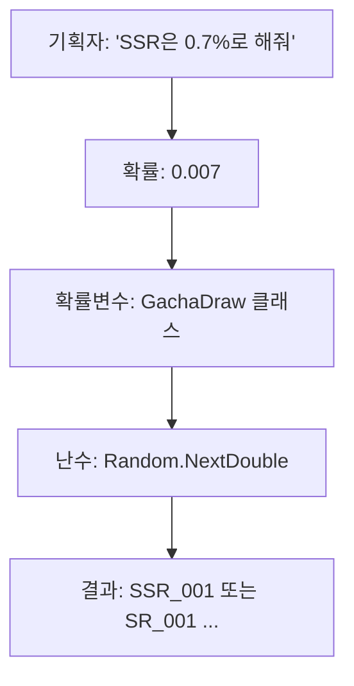

# 1장. 게임에서 확률이란 무엇인가

## 1.1 왜 가챠 확률은 "느낌"과 다를까? — 도박사의 오류, 핫핸드 편향

신입이 가챠 시스템을 만들면 가장 먼저 듣는 컴플레인이 이거다.

> "0.7%인데 왜 100번 뽑아도 안 나옵니까?"

이건 코드 버그가 아니라 **사람의 뇌가 확률을 잘못 인식**해서 생기는 문제다. 확률을 구현하는 입장에서 이 심리를 이해하지 못하면, 멀쩡한 코드를 두고 "확률 조작"이라는 누명을 쓰게 된다.

### 도박사의 오류 (Gambler's Fallacy)

> "10번 연속 R 등급이 나왔으니, 다음엔 SSR이 나올 차례야."

이게 도박사의 오류다. **독립 시행에서 과거 결과는 미래에 영향을 주지 않는다**. 가챠 한 번 한 번은 동전 던지기와 같아서, 직전에 무엇이 나왔든 다음 시행의 확률은 고정이다.

```
실제 동전 던지기 결과(예시):
H H H H H T T H T H ...
        ↑
  여기서 "다음은 T 차례"라고 생각하면 오류
  H가 나올 확률은 여전히 50%
```

게임에서도 똑같다. 천장 시스템이 없는 단순 가챠라면, 99번 미스했어도 100번째 확률은 그대로다.

### 핫핸드 편향 (Hot Hand Fallacy)

> "이 친구는 오늘 운이 좋아. 5연속 SSR이 나왔어. 다음도 나올 거야."

도박사의 오류와 정반대 방향의 착각이다. 짧은 행운의 연속을 보고 "지금이 운이 좋은 상태"라고 믿는 현상이다. 마찬가지로 독립 시행에서는 의미가 없다.

### 우리가 코드에서 해야 할 일

이 심리를 이해해야 다음 두 가지를 결정할 수 있다.

1. **순수 독립 시행으로 둘 것인가**(=수학적으로 정직하지만 유저는 불만)
2. **천장 시스템(Pity System)을 넣을 것인가**(=수학적으로 살짝 유저 편이지만 만족도 높음)

대부분의 상용 게임은 후자를 택한다. 이유는 6장에서 자세히 다룬다.

---

## 1.2 "0.3%인데 100번 뽑아도 안 나와요" — 기댓값으로 설명하기

확률 0.3%인 SSR을 100번 뽑았을 때, 한 번이라도 나올 확률을 계산해보자.

### 한 번도 안 나올 확률

```
P(한 번도 안 나옴) = (1 - 0.003)^100
                  = 0.997^100
                  ≈ 0.7408
                  ≈ 74.08%
```

### 한 번이라도 나올 확률

```
P(한 번 이상 나옴) = 1 - 0.7408
                  ≈ 0.2592
                  ≈ 25.92%
```

**100번 뽑아도 4명 중 3명은 못 뽑는 게 정상이다**. 이걸 모르고 "100번 정도면 나오겠지"라고 기대했다가 부서지는 거다.

### 50% 확률로 나오려면 몇 번?

```
1 - (1 - p)^n ≥ 0.5
(1 - p)^n ≤ 0.5
n × log(1 - p) ≤ log(0.5)
n ≥ log(0.5) / log(1 - p)

p = 0.003일 때:
n ≥ log(0.5) / log(0.997)
n ≥ -0.6931 / -0.003004
n ≥ 230.8

→ 약 231번 뽑아야 50% 확률로 한 번 이상 나옴
```

### 99% 확률로 나오려면?

```
n ≥ log(0.01) / log(0.997)
n ≥ -4.605 / -0.003004
n ≥ 1532.9

→ 약 1533번 뽑아야 99% 확률로 한 번 이상 나옴
```

### C#으로 계산해보자

```csharp
// 부록 B에도 있는 자주 쓰는 공식
public static class GachaMath
{
    /// <summary>
    /// p 확률 아이템을 n번 뽑았을 때 한 번 이상 나올 확률
    /// </summary>
    public static double AtLeastOnce(double p, int n)
    {
        return 1.0 - Math.Pow(1.0 - p, n);
    }

    /// <summary>
    /// targetProbability(예: 0.5) 이상의 확률로 나오려면 몇 번 뽑아야 하는가
    /// </summary>
    public static int RequiredPulls(double p, double targetProbability)
    {
        if (p <= 0 || p >= 1)
            throw new ArgumentOutOfRangeException(nameof(p));
        if (targetProbability <= 0 || targetProbability >= 1)
            throw new ArgumentOutOfRangeException(nameof(targetProbability));

        var n = Math.Log(1 - targetProbability) / Math.Log(1 - p);
        return (int)Math.Ceiling(n);
    }

    /// <summary>
    /// 기댓값: p 확률 아이템을 1번 뽑기 위해 평균 몇 번 시도해야 하는가
    /// 기하분포의 평균 = 1/p
    /// </summary>
    public static double ExpectedPulls(double p) => 1.0 / p;
}
```

### 실행 결과

```csharp
// 0.3% 확률 SSR
Console.WriteLine($"100번 시 한 번 이상 확률: {GachaMath.AtLeastOnce(0.003, 100):P2}");
// 출력: 25.92%

Console.WriteLine($"50% 확률로 뽑으려면: {GachaMath.RequiredPulls(0.003, 0.5)}번");
// 출력: 231번

Console.WriteLine($"기댓값: {GachaMath.ExpectedPulls(0.003):F0}번");
// 출력: 333번
```

이 함수는 **CS 응대용**으로도 유용하다. 컴플레인이 들어오면 통계로 답하면 된다.

---

## 1.3 확률 vs 확률변수 vs 난수 — 세 개념의 차이를 코드로 이해하기

신입이 자주 헷갈리는 세 개념을 코드로 구분해보자.

### 확률 (Probability)

> "어떤 사건이 일어날 가능성. 0과 1 사이의 숫자."

```csharp
public record GachaItem(string Id, double Probability);

var ssr = new GachaItem("SSR_001", 0.007);  // 0.7%
var sr  = new GachaItem("SR_001",  0.18);   // 18%
var r   = new GachaItem("R_001",   0.813);  // 81.3%
```

확률은 **고정된 숫자**다. 이건 기획자가 정한 값이고, 코드에서는 상수처럼 다룬다.

### 확률변수 (Random Variable)

> "확률 분포를 가진 '아직 결정되지 않은 값'. 함수처럼 호출하면 값이 나온다."

```csharp
// 확률변수는 "추첨하는 행위"의 추상화다
public interface IRandomVariable<T>
{
    T Sample();  // 호출할 때마다 분포에 따라 값이 결정된다
}

public class GachaDraw : IRandomVariable<string>
{
    private readonly List<GachaItem> _items;

    public GachaDraw(List<GachaItem> items) => _items = items;

    public string Sample()
    {
        // 실제 추첨 로직은 4장에서
        var roll = Random.Shared.NextDouble();
        var cumulative = 0.0;
        foreach (var item in _items)
        {
            cumulative += item.Probability;
            if (roll < cumulative) return item.Id;
        }
        return _items[^1].Id;
    }
}
```

확률변수는 **추첨할 때마다 다른 값을 반환**한다. 분포는 정해져 있지만, 결과는 그때그때 다르다.

### 난수 (Random Number)

> "확률변수를 구현하기 위해 사용하는 도구. 보통 0~1 사이의 균등분포 값을 생성한다."

```csharp
// 난수는 도구일 뿐
double r1 = Random.Shared.NextDouble();  // 0.0 ~ 1.0
int    r2 = Random.Shared.Next(1, 101);  // 1 ~ 100
```

### 셋의 관계

```
[확률]  ──────→  [확률변수]  ──────→  [난수]
 정의            추상화              구현 도구
 0.007           Sample()            NextDouble()
```



이 셋을 분리해서 보면 코드 설계가 깔끔해진다. **테이블에 들어가는 건 '확률', 코드 인터페이스가 '확률변수', 그 내부 구현이 '난수'**다.

---

## 1.4 [실습] 동전 던지기 1만 번 시뮬레이션

서버를 다루기 전에, 가장 단순한 시뮬레이션부터 해보자. 콘솔이든 Unity든 상관없다.

### 코드

```csharp
using System;
using System.Diagnostics;

public class CoinFlipSimulation
{
    public static void Run(int trials = 10_000)
    {
        var rng = new Random();
        var heads = 0;
        var tails = 0;

        var sw = Stopwatch.StartNew();
        for (int i = 0; i < trials; i++)
        {
            // NextDouble은 [0.0, 1.0) 범위
            if (rng.NextDouble() < 0.5)
                heads++;
            else
                tails++;
        }
        sw.Stop();

        Console.WriteLine($"== {trials:N0}회 시뮬레이션 ==");
        Console.WriteLine($"앞면: {heads:N0} ({(double)heads/trials:P3})");
        Console.WriteLine($"뒷면: {tails:N0} ({(double)tails/trials:P3})");
        Console.WriteLine($"오차: {Math.Abs(0.5 - (double)heads/trials):P3}");
        Console.WriteLine($"소요 시간: {sw.ElapsedMilliseconds}ms");
    }
}

// 사용
CoinFlipSimulation.Run(10_000);
CoinFlipSimulation.Run(100_000);
CoinFlipSimulation.Run(1_000_000);
```

### 실제 결과 (예시)

```
== 10,000회 시뮬레이션 ==
앞면: 5,032 (50.320%)
뒷면: 4,968 (49.680%)
오차: 0.320%
소요 시간: 1ms

== 100,000회 시뮬레이션 ==
앞면: 50,015 (50.015%)
뒷면: 49,985 (49.985%)
오차: 0.015%
소요 시간: 4ms

== 1,000,000회 시뮬레이션 ==
앞면: 499,873 (49.987%)
뒷면: 500,127 (50.013%)
소요 시간: 38ms
```

### 여기서 배울 점

1. **시행 횟수가 늘어날수록 실제 비율이 이론값(0.5)에 수렴**한다. 이걸 **큰 수의 법칙**이라고 한다.
2. **1만 번 정도로는 0.3% 정도의 오차가 정상**이다. 가챠 라이브에서 "0.7% SSR이 0.69%로 나왔어요"는 정상 범위다.
3. **카이제곱 검정**(14장)을 쓰면 이 오차가 통계적으로 유의미한지 자동 판정할 수 있다.

### 한 단계 더: 0.3% SSR 시뮬레이션

```csharp
public class SsrSimulation
{
    public static void Run(int trials = 1_000_000, double p = 0.003)
    {
        var rng = new Random();
        var hits = 0;

        for (int i = 0; i < trials; i++)
        {
            if (rng.NextDouble() < p) hits++;
        }

        Console.WriteLine($"== SSR 시뮬레이션: p={p:P2}, n={trials:N0} ==");
        Console.WriteLine($"기대값: {trials * p:N0}");
        Console.WriteLine($"실제값: {hits:N0}");
        Console.WriteLine($"실제 확률: {(double)hits/trials:P4}");
    }
}

// 출력 예시:
// == SSR 시뮬레이션: p=0.30%, n=1,000,000 ==
// 기대값: 3,000
// 실제값: 2,987
// 실제 확률: 0.2987%
```

100만 번 정도 돌리면 이론값과 거의 일치한다. **확률 검증은 시뮬레이션 횟수를 충분히 늘리는 것부터** 시작한다.

---

## 1장 요약

- 도박사의 오류와 핫핸드 편향을 이해해야 유저 컴플레인에 잘 대응할 수 있다.
- 0.3% 확률 아이템도 100번 뽑아서 안 나올 확률이 74%다. 이걸 통계로 설명할 수 있어야 한다.
- 확률(상수) → 확률변수(인터페이스) → 난수(구현)의 분리를 코드 설계에 반영한다.
- 1만 번이 아니라 100만 번 시뮬레이션해야 안정적인 확률 검증이 된다.

다음 장에서는 그 도구인 **난수**를 제대로 쓰는 법을 다룬다.  