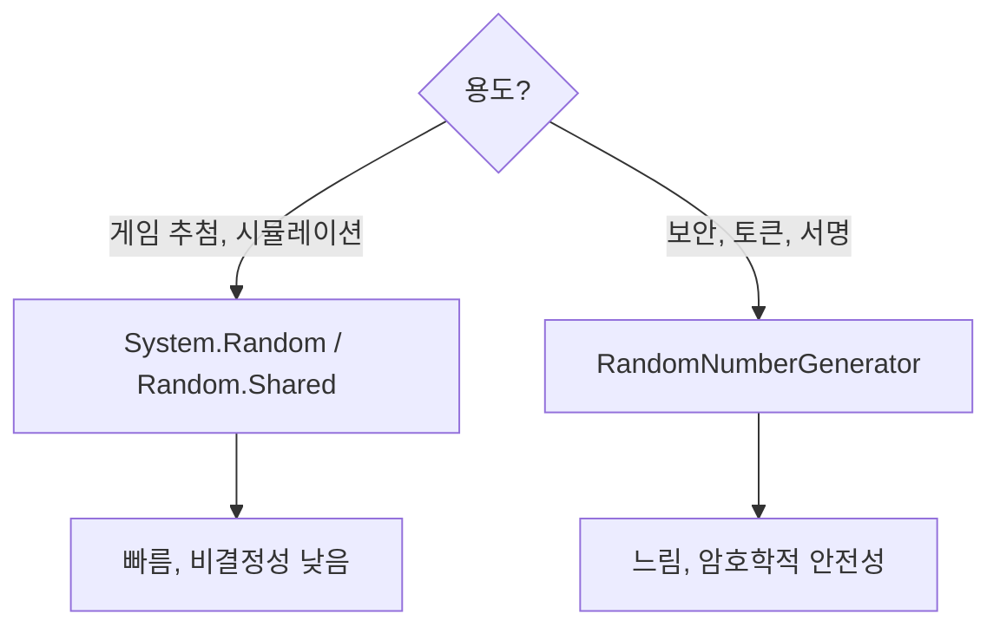

# 2장. 난수(Random)를 제대로 쓰는 법

가챠는 결국 난수를 제대로 다루는 게임이다. 신입이 가장 흔히 만드는 사고도 여기서 나온다. 이번 장에서는 .NET의 난수 API를 둘러싼 함정과, 실전에서 쓸 수 있는 안전한 유틸리티 클래스를 만든다.

---

## 2.1 `System.Random`의 함정 — 멀티스레드에서 왜 터지는가

### 사고 사례 — "가끔 SSR이 안 나오는 게 아니라, 똑같은 값만 나와요"

```csharp
// 신입이 만든 코드
public class GachaService
{
    private readonly Random _rng = new Random();  // ← 문제

    public string Draw() => _rng.NextDouble() < 0.5 ? "A" : "B";
}
```

위 코드를 게임 서버에 그대로 올리면, 동시 접속이 많아질 때 다음 두 가지 중 하나가 발생한다.

1. **항상 0이 나오거나 무한 루프에 빠진다** (.NET 7 이전, 인스턴스를 여러 스레드에서 공유 시)
2. **여러 유저가 동일한 추첨 결과를 받는다** (각자 `new Random()`을 만들 때, 시드가 시간 기반이라 동시에 생성되면 같은 시드를 받음)

### 왜 이런 일이 생기는가

`System.Random`의 내부 상태는 배열이다. 멀티스레드에서 동시 접근하면 그 배열이 깨진다. 깨지면 `0.0`이 무한히 반환되거나 예외가 터진다.

```
Thread A: state[k] 읽음
Thread B: state[k] 갱신 (덮어씀)
Thread A: 갱신된 state[k]를 다시 사용 → 일관성 깨짐
```

### .NET 7 이상의 해결책 — `Random.Shared`

```csharp
// .NET 6 이상부터 등장
public class GachaService
{
    public string Draw() => Random.Shared.NextDouble() < 0.5 ? "A" : "B";
}
```

`Random.Shared`는 내부적으로 **스레드 로컬 인스턴스**를 사용한다. 멀티스레드 안전하고, 매번 만들 필요도 없다. .NET 10 기준 가장 권장되는 방식이다.

---

## 2.2 시드(Seed)가 뭔지 모르면 생기는 버그들

### 시드란 무엇인가

난수 생성기는 사실 **결정론적인 함수**다. 같은 시드를 주면 같은 수열이 나온다. 게임에서는 이걸 잘 쓰면 강력하지만, 모르고 쓰면 사고다.

```csharp
var a = new Random(42);
var b = new Random(42);

Console.WriteLine(a.Next());  // 1255100597
Console.WriteLine(b.Next());  // 1255100597 ← 똑같다
```

### 시드 사고 사례 — 동시에 새로 만들어버린 인스턴스

```csharp
// .NET Framework 시절 코드
public string Draw()
{
    var rng = new Random();  // ← 시드를 주지 않음
    return rng.NextDouble() < 0.5 ? "A" : "B";
}
```

`.NET Framework`나 `.NET Core 1.x`에서는 `new Random()`이 **시스템 시각(밀리초 단위)**을 시드로 썼다. 동시에 들어온 요청 두 개가 같은 밀리초에 생성되면 같은 시드 → 같은 결과.

`.NET 6+` 부터는 `new Random()`이 내부적으로 `Random.Shared`와 비슷한 방식으로 시드를 받지만, **여전히 같은 인스턴스를 멀티스레드에서 쓰면 안 된다**.

### 시드를 의도적으로 쓰는 경우

| 용도 | 설명 |
|------|------|
| **재현 가능한 테스트** | 유닛 테스트에서 결과를 고정해야 할 때 |
| **리플레이 시스템** | 같은 시드로 같은 게임 진행을 재현 |
| **프로시저럴 생성** | 던전·맵을 시드 기반으로 동일하게 생성 |

```csharp
// 테스트 코드 예시
[Fact]
public void SsrDrawn_WhenRollIs_0_001()
{
    var fixedRng = new Random(42);
    var service = new GachaService(fixedRng);

    var result = service.Draw();
    result.Should().Be("SSR_001");
}
```

---

## 2.3 `System.Random` vs `RandomNumberGenerator` — 언제 뭘 쓰는가



### 결론부터

- **가챠 추첨**: `Random.Shared` (속도 우선, 통계적 균등이면 충분)
- **세션 토큰, 비밀번호 솔트, JWT 시크릿**: `RandomNumberGenerator` (암호학적으로 예측 불가)

### 차이를 코드로

```csharp
using System.Security.Cryptography;

// 1. System.Random — 빠르고 가벼움
double v1 = Random.Shared.NextDouble();  // ~10ns

// 2. RandomNumberGenerator — 암호학적 안전
byte[] buffer = new byte[8];
RandomNumberGenerator.Fill(buffer);
ulong v2raw = BitConverter.ToUInt64(buffer, 0);
double v2 = (double)v2raw / ulong.MaxValue;  // ~수백ns
```

### "암호학적 RNG를 가챠에 쓰면 안 되나요?"

써도 된다. 다만 **속도 차이**가 크다. 동시 접속자가 많은 MMORPG에서는 추첨 한 번에 수십만 개의 난수가 필요할 수 있다. `RandomNumberGenerator`는 보안용이라 의도적으로 비용이 크다.

**가챠에는 `Random.Shared`로 충분하다**. 단, 결과가 노출되면 안 되므로 **서버에서만 추첨**한다는 원칙(9장)은 지킨다.

---

## 2.4 [실습] 스레드 안전한 난수 유틸리티 클래스 만들기

`Random.Shared`로 충분하지만, 실전에서는 **테스트 가능성**과 **시드 주입**까지 고려해야 한다. 다음과 같은 인터페이스를 만들자.

### 인터페이스

```csharp
public interface IRandomProvider
{
    /// <summary>[0.0, 1.0) 균등 분포 난수</summary>
    double NextDouble();

    /// <summary>[min, max) 정수 난수</summary>
    int NextInt(int minInclusive, int maxExclusive);

    /// <summary>[0, max) 정수 난수</summary>
    int NextInt(int maxExclusive);

    /// <summary>리스트에서 무작위 하나 선택</summary>
    T Choose<T>(IReadOnlyList<T> items);
}
```

### 운영용 구현 (스레드 안전)

```csharp
public sealed class ThreadSafeRandomProvider : IRandomProvider
{
    public double NextDouble() => Random.Shared.NextDouble();

    public int NextInt(int minInclusive, int maxExclusive)
        => Random.Shared.Next(minInclusive, maxExclusive);

    public int NextInt(int maxExclusive)
        => Random.Shared.Next(maxExclusive);

    public T Choose<T>(IReadOnlyList<T> items)
    {
        if (items.Count == 0)
            throw new ArgumentException("Cannot choose from empty list", nameof(items));
        return items[Random.Shared.Next(items.Count)];
    }
}
```

### 테스트용 구현 (시드 고정)

```csharp
public sealed class SeededRandomProvider : IRandomProvider
{
    private readonly Random _rng;
    private readonly object _lock = new();

    public SeededRandomProvider(int seed) => _rng = new Random(seed);

    public double NextDouble()
    {
        lock (_lock) return _rng.NextDouble();
    }

    public int NextInt(int minInclusive, int maxExclusive)
    {
        lock (_lock) return _rng.Next(minInclusive, maxExclusive);
    }

    public int NextInt(int maxExclusive)
    {
        lock (_lock) return _rng.Next(maxExclusive);
    }

    public T Choose<T>(IReadOnlyList<T> items)
    {
        if (items.Count == 0)
            throw new ArgumentException("Cannot choose from empty list", nameof(items));
        lock (_lock) return items[_rng.Next(items.Count)];
    }
}
```

### 큐 기반 모킹 (특정 시퀀스 강제)

```csharp
public sealed class QueuedRandomProvider : IRandomProvider
{
    private readonly Queue<double> _doubles;
    private readonly Queue<int> _ints;

    public QueuedRandomProvider(IEnumerable<double>? doubles = null, IEnumerable<int>? ints = null)
    {
        _doubles = new Queue<double>(doubles ?? Array.Empty<double>());
        _ints = new Queue<int>(ints ?? Array.Empty<int>());
    }

    public double NextDouble()
    {
        if (_doubles.Count == 0) throw new InvalidOperationException("No more doubles queued");
        return _doubles.Dequeue();
    }

    public int NextInt(int minInclusive, int maxExclusive)
    {
        if (_ints.Count == 0) throw new InvalidOperationException("No more ints queued");
        return _ints.Dequeue();
    }

    public int NextInt(int maxExclusive) => NextInt(0, maxExclusive);

    public T Choose<T>(IReadOnlyList<T> items) => items[NextInt(items.Count)];
}
```

### 사용 예시

```csharp
public class GachaService
{
    private readonly IRandomProvider _rng;

    public GachaService(IRandomProvider rng) => _rng = rng;

    public string DrawSimple(double ssrRate)
        => _rng.NextDouble() < ssrRate ? "SSR" : "R";
}

// 운영
var prod = new GachaService(new ThreadSafeRandomProvider());

// 단위 테스트 — "0.001을 던지면 SSR이 나오는가"
var test = new GachaService(new QueuedRandomProvider(doubles: new[] { 0.001 }));
test.DrawSimple(0.007).Should().Be("SSR");
```

### DI 등록 (.NET 10)

```csharp
// Program.cs
builder.Services.AddSingleton<IRandomProvider, ThreadSafeRandomProvider>();
```

`Singleton`으로 올려도 안전하다. 내부에서 `Random.Shared`를 쓰기 때문이다.

---

## 2.5 [주의] 클라이언트에서 절대 하면 안 되는 것들

### 클라이언트 추첨은 그냥 시각적 효과여야 한다

```csharp
// ❌ 절대 금지: 클라이언트에서 진짜 추첨
public class ClientGacha_NEVER
{
    public string Draw()
    {
        var roll = Random.Shared.NextDouble();
        return roll < 0.007 ? "SSR" : "R";  // 메모리 변조로 100% SSR 가능
    }
}

// ✅ 클라이언트는 서버 결과를 받아서 연출만
public class ClientGachaUI
{
    public async Task PlayDrawAsync()
    {
        var result = await _api.DrawAsync();  // 서버에서 추첨
        await PlayAnimationAsync(result.RarityTier);
        ShowItemPopup(result.ItemId);
    }
}
```

### 시드를 클라이언트에 넘기는 것도 위험

```csharp
// ❌ 위험: 시드를 클라이언트에 알려주면 미래 결과 예측 가능
public DrawResponse DrawNext()
{
    var seed = GetUserSeed(userId);
    return new DrawResponse { Seed = seed, Result = Roll(seed) };
}
```

시드 기반 결정론은 **서버 내부 검증용**으로만 쓴다. 외부에 노출하지 않는다.

### 정리

| 위치 | 난수 사용 | 이유 |
|------|----------|------|
| 클라이언트 | 연출/이펙트만 | 메모리 변조 가능 |
| 게임 서버 | 실제 추첨 | 권위 있는 결과 |
| DB | 결과 저장 | 감사 로그 |
| 클라 ↔ 서버 | 시드 전송 금지 | 결과 예측 가능 |

---

## 2장 요약

- `System.Random`을 인스턴스로 만들어 멀티스레드에서 공유하면 안 된다.
- .NET 6 이상에서는 `Random.Shared`를 쓰는 것이 표준이다.
- 보안용이 아니면 `RandomNumberGenerator`는 과한 선택이다.
- 운영용 `ThreadSafeRandomProvider`와 테스트용 `SeededRandomProvider`/`QueuedRandomProvider`를 분리해서 만든다.
- 클라이언트에서는 절대 진짜 추첨을 하지 않는다.

다음 장에서는 가챠 시스템 전체 구조를 그림으로 살펴본다.
