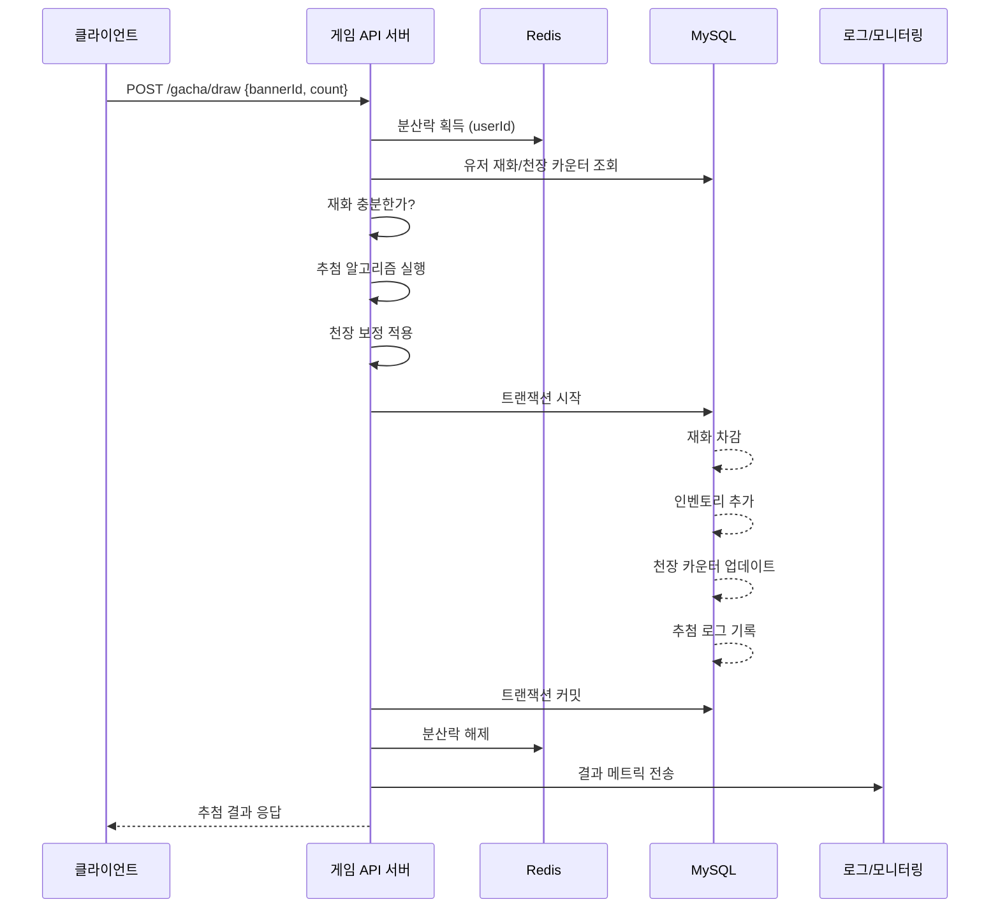

# 3장. 수집형 RPG·MMORPG 가챠의 구조 훑어보기

이번 장에서는 코드를 거의 쓰지 않는다. 대신 **가챠 한 번을 뽑을 때 서버 안에서 무슨 일이 일어나는지**를 그림으로 정리한다. 4장 이후에 나오는 알고리즘이 어디에 들어가는지 알려면, 전체 흐름을 먼저 머릿속에 그려둬야 한다.

---

## 3.1 가챠 한 번의 흐름을 그림으로 이해하기

### 큰 그림 — 클라이언트 ↔ 서버



### 한 번 추첨 안에 들어가는 처리 단위

```
┌────────────────────────────────────────────────────────────────┐
│  1. 인증/권한                                                   │
│     - JWT 검증, 유저 식별                                        │
├────────────────────────────────────────────────────────────────┤
│  2. 유효성 검사                                                  │
│     - 배너 활성화 여부, 점검 모드, 차단 유저                     │
├────────────────────────────────────────────────────────────────┤
│  3. 재화/조건 체크                                               │
│     - 유료 재화, 무료 티켓, 일일 제한 등                          │
├────────────────────────────────────────────────────────────────┤
│  4. 분산락 획득 (Redis)                                          │
│     - 같은 유저 동시 요청 차단                                    │
├────────────────────────────────────────────────────────────────┤
│  5. 추첨 실행                                                    │
│     - 1단계: 등급 추첨                                            │
│     - 2단계: 등급 안에서 아이템 추첨                              │
│     - 천장 보정                                                   │
│     - 픽업 50/50                                                  │
├────────────────────────────────────────────────────────────────┤
│  6. DB 트랜잭션                                                   │
│     - 재화 차감 + 인벤 추가 + 천장 갱신 + 로그                   │
├────────────────────────────────────────────────────────────────┤
│  7. 후처리                                                        │
│     - 우편함, 미션 카운트, 업적, 통계                              │
├────────────────────────────────────────────────────────────────┤
│  8. 응답 + 분산락 해제                                            │
└────────────────────────────────────────────────────────────────┘
```

이 책의 절반 정도가 5번과 6번에 관한 이야기다. 1~4번은 일반 API 설계와 같다.

---

## 3.2 등급(Tier) → 아이템, 2단계 추첨이 표준인 이유

### 왜 2단계인가

가챠는 보통 **등급 → 아이템** 순서로 두 번 추첨한다.

```
┌─────────────────────────────────┐
│   1단계: 등급 추첨               │
│   ┌─────┬─────┬─────┐          │
│   │ SSR │ SR  │  R  │          │
│   │0.7% │ 18% │81.3%│          │
│   └─────┴─────┴─────┘          │
│         ↓ SSR 당첨              │
├─────────────────────────────────┤
│   2단계: 아이템 추첨             │
│   ┌─────────────────────┐      │
│   │ 페로 │ 야엘 │ 메 │ ... │      │
│   │ 0.4% │ 0.3% │ ... │      │  ← SSR 풀 내에서
│   └─────────────────────┘      │
└─────────────────────────────────┘
```

### 왜 한 번에 안 하는가

총 100개 아이템에 각각 0.001 ~ 0.81 확률을 직접 줘도 수학적으로는 같다. 하지만 **운영 편의성**이 다르다.

| 항목 | 한 번에 추첨 | 등급 → 아이템 추첨 |
|------|-------------|------------------|
| 새 SSR 추가 | 모든 확률 재계산 | SSR 풀에만 추가 |
| SSR 등장률 변경 | 모든 SSR 확률 일일이 수정 | 등급 확률 한 줄만 수정 |
| 픽업 처리 | 복잡 | 2단계 안에서 분리 가능 |
| 공시 페이지 | 100줄 표 | 등급 표 + 아이템 표 |
| 천장 시스템 | 등급 단위 카운트 어려움 | 자연스럽게 등급 단위로 카운트 |

### 보너스: 변동 풀(로테이션) 처리도 쉬워진다

```
[고정 풀]
  - SSR: 야엘, 메이 (상시 등장)
  - SR : ...
  - R  : ...

[픽업 풀] (이번 배너만)
  - SSR: 페로 (확률 50% 보장)

→ 1단계: 등급 추첨
→ 2단계: SSR이면 → 픽업 풀 vs 고정 풀 50/50 → 풀 안에서 아이템 추첨
```

원신, 스타레일 등 대부분의 RPG가 이 구조다.

---

## 3.3 단챠 / 10연챠 / 픽업 / 천장 — 용어 한 번에 정리

### 단챠 (Single Pull)

한 번 뽑기. 가장 단순한 단위.

### 10연챠 (10-pull)

10번 뽑기. 보통 **할인**이나 **혜택**이 붙는다.

```
[패턴 1] 1+1 보너스: 10번 가격에 11번 뽑기
[패턴 2] 등급 보장: 10연 안에 SR 이상 1개 보장
[패턴 3] 가격 할인: 10번 가격이 9번 가격
```

서버 입장에서는 단챠 10번을 묶어서 호출하면 되지만, **보장 처리**가 들어가면 한 트랜잭션 안에서 봐야 한다.

```csharp
public async Task<List<DrawResult>> Draw10Async(long userId, int bannerId)
{
    var results = new List<DrawResult>(10);
    bool hasSrPlus = false;

    for (int i = 0; i < 10; i++)
    {
        var r = await DrawOneAsync(userId, bannerId);
        results.Add(r);
        if (r.Tier <= Tier.SR) hasSrPlus = true;
    }

    // 10연 SR 보장 — 마지막에 보정
    if (!hasSrPlus)
    {
        results[^1] = await DrawSrPlusAsync(userId, bannerId);
    }
    return results;
}
```

### 픽업 (Pick-up)

특정 캐릭터의 등장 확률을 일시적으로 올리는 시스템이다. 보통 신규 캐릭터 출시 때 쓴다.

```
[일반 풀]
  SSR 야엘: 0.35%
  SSR 메이: 0.35%
  ...

[페로 픽업 배너]
  SSR 페로: 0.5%   ← 픽업
  SSR 야엘: 0.1%
  SSR 메이: 0.1%
  ...
  (총 SSR은 여전히 0.7%)
```

50/50 시스템(원신식)에서는 SSR이 떴을 때 50%로 픽업, 50%로 일반 풀에서 결정된다.

### 천장 (Pity / Ceiling)

> "N번까지 안 나오면 무조건 나온다."

**하드 천장**: N번째에 무조건 SSR.
**소프트 천장**: M번째부터 확률이 점점 올라감.

```
[하드 천장 예시: 90회]
1~89회:  0.7% 확률
90회:    100% 확률

[소프트 천장 예시: 70회부터]
1~69회:  0.7%
70회:    7%
71회:    13%
...
89회:    90%
90회:    100%
```

이거 6장에서 다룬다.

### 천장 보장 (Guaranteed Pity)

천장으로 SSR이 나왔을 때, **그게 픽업 캐릭터인지 보장**하는 시스템.

원신: 첫 천장에서 50/50 미스했으면, 다음 천장은 100% 픽업.
스타레일: 동일.
블루아카이브: 천장 보장 자체는 없음(별 3개 캐릭터로 교환).

### 박스 가챠 (Box Gacha)

비복원 추첨. 박스 안의 아이템이 정해져 있고, 뽑을수록 풀이 줄어든다.

```
[박스 안]
  - SSR x 1
  - SR  x 5
  - R   x 94
  ─────────
  총 100개

100번 뽑으면 반드시 SSR 1개를 얻는다.
```

7장에서 구현한다.

### 컬렉션(콤플리트) 가챠

- 정해진 N개 아이템을 모두 모으면 추가 보상.
- 일본 카드 시리즈 등에서 시작된 형태.
- 일본에서는 규제 대상이라 형태를 변형해서 운영.

### 스텝업 가챠

뽑을수록 혜택이 커진다.

```
1단계 (1~10회):  SSR 0.7%
2단계 (11~20회): SSR 1.5% + SR 1개 보장
3단계 (21~30회): SSR 3.0% + SSR 1개 보장
4단계 (31~40회): SSR 100% (픽업 확정)
```

소비를 유도하는 강력한 패턴이다.

---

## 3.4 [사례] 원신, 블루아카이브, 리니지M의 구조 비교

### 원신 (HoYoverse)

```
[캐릭터 이벤트 배너]
- 5성 캐릭터: 0.6% (소프트 천장 74부터, 하드 90)
- 4성 캐릭터: 5.1% (10연마다 1개 보장)
- 3성 무기:   94.3%

[픽업 보장]
- 5성이 떴을 때 50/50로 픽업/일반
- 50/50 미스 시, 다음 5성은 100% 픽업
- 4성도 같은 방식 (10연 보장 + 50/50)

[천장 카운터]
- 5성 카운터, 4성 카운터 별도 관리
- 캐릭터 배너끼리 카운터 공유 (무기 배너는 별도)
```

서버 부담이 큰 구조다. **카운터 4종 × 배너 종류**만큼 상태를 관리한다.

### 블루아카이브 (Nexon/Yostar)

```
[상시 배너]
- ★3 학생: 3% (픽업 0.7%)
- ★2 학생: 18.5%
- ★1 학생: 78.5%

[픽업 천장]
- 픽업 캐릭터 200회 천장 (자동 획득)
- 일반 ★3 천장은 없음

[교환 시스템]
- ★3 캐릭 1개 = 청휘석 보상
- 모은 청휘석으로 ★3 캐릭 직접 교환
```

천장 시스템보다 **교환 시스템**이 핵심이다. 구현 복잡도는 원신보다 낮다.

### 리니지M (NCSOFT)

```
[다이아 박스]
- 박스형 비복원 추첨이 메인
- 동일 박스에서 N번 안에 보장

[변신/펫 가챠]
- 합성/등급업 시스템 결합
- 단순 확률보다 합성 시뮬레이션이 더 큰 비중

[프로모션 가챠]
- 단기 이벤트 픽업
- 픽업 천장은 통상 없음
```

리니지M은 **합성 확률**이 가챠보다 더 중요한 요소다. 실패 시 강화 단계 하락 등 상태 변화 처리가 핵심이다.

### 비교표

| 항목 | 원신 | 블루아카이브 | 리니지M |
|------|------|------------|--------|
| **추첨 방식** | 복원 + 천장 | 복원 + 픽업 천장 | 박스(비복원) + 합성 |
| **소프트 천장** | 있음 (74) | 없음 | 게임마다 다름 |
| **하드 천장** | 90 | 200 (픽업만) | 박스 단위 |
| **50/50** | 있음 | 없음 | 없음 |
| **교환권** | 부분적 | 청휘석 | 게임마다 |
| **DB 부담** | 높음 (카운터 다수) | 중간 | 매우 높음 (합성 상태) |

---

## 3장 요약

- 가챠 한 번은 "락 → 검사 → 추첨 → 트랜잭션 → 응답"의 흐름이다. 5번 추첨 부분이 이 책의 핵심이다.
- 등급 → 아이템 2단계 추첨이 표준이다. 운영 편의 때문이다.
- 단챠/10연/픽업/천장/박스/컬렉션/스텝업 — 용어를 코드로 옮길 때 헷갈리지 않게 정리해둔다.
- 게임마다 가챠 구조가 다르고, 그 차이가 곧 서버 구현 복잡도 차이다.

다음 장부터 본격적으로 알고리즘에 들어간다. 룰렛 휠, 누적 확률, 별칭 기법(Alias Method)을 직접 구현하고 비교한다.
