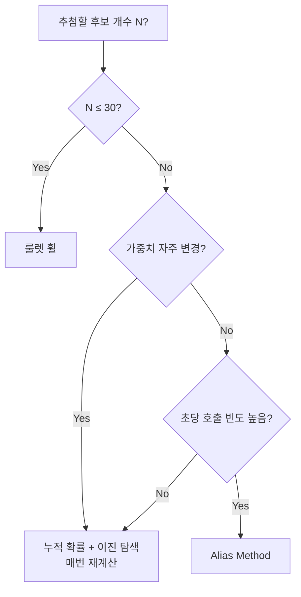

# 4장. 기본 추첨 — 룰렛 휠과 친구들

추첨 알고리즘의 종착지는 결국 **"가중치(weight)가 다른 후보들 중에서 무작위로 하나 고르기"** 이다. 이번 장에서는 세 가지 대표 방법을 직접 구현하고 성능을 비교한다.

| 방법            | 시간 복잡도   | 메모리  | 사전 준비    | 특징               |
| ------------- | -------- | ---- | -------- | ---------------- |
| 룰렛 휠 (선형)     | O(N)     | O(N) | 없음       | 단순, 작은 N에 적합     |
| 누적 확률 + 이진 탐색 | O(log N) | O(N) | 정렬 1회    | 중간 N에 적합         |
| 별칭 기법 (Alias) | O(1)     | O(N) | 전처리 O(N) | 큰 N · 자주 호출 시 최적 |

***

## 4.1 룰렛 휠 선택(Roulette Wheel) — 가장 단순한 구현

### 아이디어

가중치를 줄지어 놓고, \[0, 합) 범위의 난수를 굴려 누적합이 처음으로 그 값을 넘는 지점을 고른다.

```
[A:30, B:20, C:50]  합 = 100
난수 r ∈ [0, 100)

A     B     C
[----][---][--------]
0    30   50       100

r=15 → A
r=45 → B
r=87 → C
```

### 구현

```csharp
public sealed class RouletteWheelPicker<T>
{
    private readonly List<(T Item, double Weight)> _items;
    private readonly double _total;
    private readonly IRandomProvider _rng;

    public RouletteWheelPicker(IEnumerable<(T Item, double Weight)> items, IRandomProvider rng)
    {
        _items = items.ToList();
        if (_items.Count == 0) throw new ArgumentException("Empty pool");
        if (_items.Any(x => x.Weight <= 0)) throw new ArgumentException("All weights must be > 0");
        _total = _items.Sum(x => x.Weight);
        _rng = rng;
    }

    public T Pick()
    {
        var roll = _rng.NextDouble() * _total;
        double cumulative = 0;
        foreach (var (item, weight) in _items)
        {
            cumulative += weight;
            if (roll < cumulative) return item;
        }
        return _items[^1].Item;  // 부동소수점 오차 보호
    }
}
```

### 언제 쓰는가

* 후보가 적을 때 (N ≤ 50)

* 매 추첨마다 가중치가 바뀔 때 (이벤트 보스 드롭, 동적 풀)

* 코드를 단순하게 유지하고 싶을 때

가챠의 **1단계 등급 추첨**(SSR/SR/R, N=3)은 이걸로 충분하다.

***

## 4.2 누적 확률 테이블 + 이진 탐색 — 아이템이 많을 때

### 아이디어

누적합을 미리 계산해두고 이진 탐색으로 위치를 찾는다.

```
items   : A    B    C    D    E
weights : 30   20   10   25   15
cumsum  : 30   50   60   85  100

r=37 → 이진 탐색 → B
```

### 구현

```csharp
public sealed class CumulativeBinarySearchPicker<T>
{
    private readonly T[] _items;
    private readonly double[] _cumulative;
    private readonly double _total;
    private readonly IRandomProvider _rng;

    public CumulativeBinarySearchPicker(IEnumerable<(T Item, double Weight)> items, IRandomProvider rng)
    {
        var arr = items.ToArray();
        if (arr.Length == 0) throw new ArgumentException("Empty pool");

        _items = new T[arr.Length];
        _cumulative = new double[arr.Length];
        double sum = 0;
        for (int i = 0; i < arr.Length; i++)
        {
            if (arr[i].Weight <= 0) throw new ArgumentException("All weights must be > 0");
            _items[i] = arr[i].Item;
            sum += arr[i].Weight;
            _cumulative[i] = sum;
        }
        _total = sum;
        _rng = rng;
    }

    public T Pick()
    {
        var roll = _rng.NextDouble() * _total;
        int idx = Array.BinarySearch(_cumulative, roll);
        if (idx < 0) idx = ~idx;          // BinarySearch: 음수는 비트 반전 = 삽입 위치
        if (idx >= _items.Length) idx = _items.Length - 1;
        return _items[idx];
    }
}
```

### 언제 쓰는가

* 후보가 중간 규모 (50 ≤ N ≤ 1000)

* 가중치가 거의 바뀌지 않을 때

* 아이템이 많은 박스 가챠나 드롭 테이블

***

## 4.3 별칭 기법(Alias Method) — O(1)로 추첨하는 마법

### 아이디어

전처리에서 **N개의 "확률 구간"으로 나누고**, 각 구간을 두 개의 후보로 채워넣는다. 추첨 시에는 인덱스 하나와 동전 한 번으로 끝난다.

```
원본 가중치(정규화):
  A: 0.4
  B: 0.3
  C: 0.2
  D: 0.1

평균 = 0.25 (= 1/4)

각 칸을 평균 높이로 만들면서 빈 부분은 다른 아이템으로 채운다.

      ┌───┐ ┌───┐ ┌───┐ ┌───┐
      │ A │ │ A │ │ B │ │ C │  ← 주(主) 아이템
      │   │ │ B │ │ C │ │ D │  ← 별칭(alias)
      └───┘ └───┘ └───┘ └───┘
       칸0   칸1   칸2   칸3

추첨:
  1. 0~3 균등 인덱스: 칸 선택
  2. NextDouble() < 칸의 prob ? 주 : 별칭
```

### 구현 (Vose's Alias Method)

```csharp
public sealed class AliasMethodPicker<T>
{
    private readonly T[] _items;
    private readonly double[] _prob;   // 각 칸의 "주 아이템이 나올 확률"
    private readonly int[] _alias;     // 각 칸의 별칭 인덱스
    private readonly IRandomProvider _rng;

    public AliasMethodPicker(IEnumerable<(T Item, double Weight)> items, IRandomProvider rng)
    {
        var arr = items.ToArray();
        int n = arr.Length;
        if (n == 0) throw new ArgumentException("Empty pool");

        _items = arr.Select(x => x.Item).ToArray();
        _prob = new double[n];
        _alias = new int[n];
        _rng = rng;

        // 정규화 후 평균(=1)로 정규화된 가중치
        double total = arr.Sum(x => x.Weight);
        var scaled = arr.Select(x => x.Weight * n / total).ToArray();

        var small = new Stack<int>();
        var large = new Stack<int>();
        for (int i = 0; i < n; i++)
        {
            if (scaled[i] < 1.0) small.Push(i);
            else large.Push(i);
        }

        while (small.Count > 0 && large.Count > 0)
        {
            int s = small.Pop();
            int l = large.Pop();

            _prob[s] = scaled[s];
            _alias[s] = l;

            scaled[l] = scaled[l] + scaled[s] - 1.0;
            if (scaled[l] < 1.0) small.Push(l);
            else large.Push(l);
        }

        while (large.Count > 0) _prob[large.Pop()] = 1.0;
        while (small.Count > 0) _prob[small.Pop()] = 1.0;
    }

    public T Pick()
    {
        int idx = _rng.NextInt(_items.Length);
        return _rng.NextDouble() < _prob[idx] ? _items[idx] : _items[_alias[idx]];
    }
}
```

### 언제 쓰는가

* N이 매우 큼 (1000+)

* 추첨이 매우 자주 발생 (드롭 테이블, NPC 스폰)

* 가중치가 거의 안 바뀜 (변하면 재구축 필요)

가챠 자체보다는 **드롭 테이블**, **랜덤 던전**, **상자 보상**에 자주 쓴다.

***

## 4.4 \[실습] 세 가지를 직접 구현하고 속도 비교하기

### 벤치마크 (BenchmarkDotNet)

```csharp
[MemoryDiagnoser]
[SimpleJob(launchCount: 1, warmupCount: 3, iterationCount: 5)]
public class PickerBenchmarks
{
    private RouletteWheelPicker<int> _roulette = null!;
    private CumulativeBinarySearchPicker<int> _binary = null!;
    private AliasMethodPicker<int> _alias = null!;

    [Params(10, 100, 1000, 10000)]
    public int N;

    [GlobalSetup]
    public void Setup()
    {
        var rng = new ThreadSafeRandomProvider();
        var items = Enumerable.Range(0, N)
            .Select(i => (i, Random.Shared.NextDouble() * 100))
            .ToArray();

        _roulette = new RouletteWheelPicker<int>(items, rng);
        _binary   = new CumulativeBinarySearchPicker<int>(items, rng);
        _alias    = new AliasMethodPicker<int>(items, rng);
    }

    [Benchmark] public int Roulette() => _roulette.Pick();
    [Benchmark] public int Binary()   => _binary.Pick();
    [Benchmark] public int Alias()    => _alias.Pick();
}
```

### 결과 (참고: i7-12700, .NET 10)

```
| Method   | N     | Mean       | Allocated |
|----------|------:|-----------:|----------:|
| Roulette |    10 |   24.31 ns |       -   |
| Binary   |    10 |   18.74 ns |       -   |
| Alias    |    10 |    9.05 ns |       -   |
| Roulette |   100 |  152.41 ns |       -   |
| Binary   |   100 |   28.66 ns |       -   |
| Alias    |   100 |    9.12 ns |       -   |
| Roulette |  1000 |1,432.09 ns |       -   |
| Binary   |  1000 |   42.51 ns |       -   |
| Alias    |  1000 |    9.21 ns |       -   |
| Roulette | 10000 |14,890.0 ns |       -   |
| Binary   | 10000 |   58.11 ns |       -   |
| Alias    | 10000 |    9.20 ns |       -   |
```

### 그래프로 보기

```
시간(ns)  ↑
        15000 ├ ●────────────● Roulette (선형 증가)
              │
        10000 │
              │
         5000 │
              │
          100 ├ ●────●─────●────● Binary (log 증가)
              │
           10 ├ ●────●─────●────● Alias (거의 일정)
              └──┬───┬─────┬────┬──→ N
                 10  100  1000 10000
```

### 결론

* **N=10**: 셋 다 빠르다. 코드 단순한 룰렛이 좋다.

* **N=100**: 룰렛은 살짝 느려진다. 이진 탐색이 좋다.

* **N=1000+**: 룰렛은 절대 쓰지 않는다.

* **추첨이 초당 수만 번**: Alias가 정답.

***

## 4.5 \[표] 아이템 수·변경 빈도·성능에 따른 선택 가이드



### 구체 시나리오 매핑

| 시나리오             | N      | 변경 빈도   | 권장    |
| ---------------- | ------ | ------- | ----- |
| 등급 추첨 (SSR/SR/R) | 3      | 거의 없음   | 룰렛    |
| 픽업 풀 vs 일반 풀     | 2      | 거의 없음   | 룰렛    |
| SSR 풀 (캐릭터 50종)  | 50     | 배너 갱신 시 | 이진 탐색 |
| 몹 드롭 테이블 (1000+) | 1000+  | 거의 없음   | Alias |
| 이벤트 룰렛 (실시간)     | 10\~30 | 잦음      | 룰렛    |
| 던전 보스 보상 (100종)  | 100    | 보스마다 다름 | 이진 탐색 |

### 실무 팁: 인터페이스로 통일

```csharp
public interface IWeightedPicker<T>
{
    T Pick();
}

// 위 세 클래스가 모두 이 인터페이스를 구현하게 하면
// 나중에 알고리즘만 바꿔치기 할 수 있다
```

```csharp
// 팩토리에서 N에 따라 자동 선택
public static IWeightedPicker<T> Create<T>(
    IList<(T, double)> items,
    IRandomProvider rng,
    bool frequentChange = false)
{
    if (items.Count <= 30) return new RouletteWheelPicker<T>(items, rng);
    if (frequentChange)    return new CumulativeBinarySearchPicker<T>(items, rng);
    return new AliasMethodPicker<T>(items, rng);
}
```

***

## 4장 요약

* 룰렛 휠은 단순하고 가중치 변경이 잦을 때 적합하다.

* 누적 확률 + 이진 탐색은 중간 규모 풀의 표준이다.

* Alias Method는 큰 풀을 자주 추첨할 때 압도적으로 빠르다.

* 후보 수와 변경 빈도에 따라 알고리즘을 골라야 한다.

* 인터페이스로 추상화하면 추후 교체가 쉽다.

다음 장에서는 이 알고리즘들을 조합해서 \*\*등급제 가챠(2단계 추첨)\*\*를 만든다.
