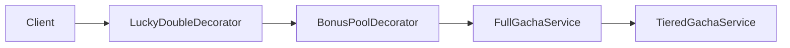

# 8장. 심화 가챠 패턴

이번 장에서는 **운영 단계에서 자주 추가되는 심화 패턴 세 가지**를 다룬다. 신규 가챠를 만드는 일은 드물고, 보통은 기존 가챠에 이 패턴들을 덧붙이는 일이 많다.

- 스텝업(Step-up) 가챠
- 컬렉션(콤플리트) 가챠
- 보너스 / 럭키 시스템

---

## 8.1 스텝업 가챠 — 단계별로 확률이 달라진다

### 정의

```
[단계 1] 1~10회   : SSR 0.7%
[단계 2] 11~20회  : SSR 1.5%   + SR 1개 보장
[단계 3] 21~30회  : SSR 3.0%   + SSR 1개 보장
[단계 4] 31~40회  : SSR 100%   (픽업 확정)

40회 끝나면 단계 1로 다시 시작 (또는 종료)
```

소비를 강하게 유도하는 패턴이다. **"여기까지 왔는데 그만두기 아깝다"**는 심리를 이용한다.

### 데이터 모델

```csharp
public sealed record StepConfig(
    int StepNumber,
    int RequiredPulls,        // 이 단계에서 뽑아야 하는 횟수
    double SsrRate,
    bool GuaranteedSr,        // 단계 끝에 SR 1개 보장
    bool GuaranteedSsr,       // 단계 끝에 SSR 1개 보장 (픽업 포함)
    bool GuaranteedPickup);   // 단계 끝에 픽업 확정

public sealed class StepUpBannerDefinition
{
    public int BannerId { get; init; }
    public IReadOnlyList<StepConfig> Steps { get; init; } = Array.Empty<StepConfig>();
    public bool LoopAfterFinalStep { get; init; }
}
```

### 유저 상태

```csharp
public sealed class StepUpProgressState
{
    public int CurrentStep { get; set; } = 1;
    public int PullsInCurrentStep { get; set; } = 0;
}
```

### 구현

```csharp
public sealed class StepUpGachaService
{
    private readonly StepUpBannerDefinition _def;
    private readonly TieredItemPool _pool;
    private readonly GachaItem _pickupItem;
    private readonly IRandomProvider _rng;

    public List<GachaItem> DrawBatch(StepUpProgressState state, int count)
    {
        var results = new List<GachaItem>(count);
        for (int i = 0; i < count; i++)
            results.Add(DrawOne(state));
        return results;
    }

    public GachaItem DrawOne(StepUpProgressState state)
    {
        var step = _def.Steps[state.CurrentStep - 1];

        // 1) SSR 추첨
        bool isSsr = _rng.NextDouble() < step.SsrRate;
        GachaItem item;

        if (isSsr)
        {
            item = step.GuaranteedPickup ? _pickupItem : _pool.Pick(Tier.SSR);
        }
        else
        {
            // 2) SR/R 비율 (단계 SsrRate를 빼고 정규화)
            var rest = 1.0 - step.SsrRate;
            var srRate = 0.18 / 0.993 * rest;  // 예시 비율
            item = _rng.NextDouble() < srRate
                ? _pool.Pick(Tier.SR)
                : _pool.Pick(Tier.R);
        }

        state.PullsInCurrentStep++;

        // 3) 단계 종료 보장
        bool isLastPullOfStep = state.PullsInCurrentStep == step.RequiredPulls;
        if (isLastPullOfStep)
        {
            // 보장 적용 (이미 충족되어 있다면 그대로)
            if (step.GuaranteedSsr && item.Tier != Tier.SSR)
                item = _pool.Pick(Tier.SSR);
            else if (step.GuaranteedSr && item.Tier == Tier.R)
                item = _pool.Pick(Tier.SR);
            else if (step.GuaranteedPickup && item.Tier != Tier.SSR)
                item = _pickupItem;

            // 다음 단계로 이동
            state.PullsInCurrentStep = 0;
            state.CurrentStep++;
            if (state.CurrentStep > _def.Steps.Count)
                state.CurrentStep = _def.LoopAfterFinalStep ? 1 : _def.Steps.Count;
        }

        return item;
    }
}
```

### 어떤 컨텐츠에 쓰나

- **신규 캐릭 출시 패키지**: 첫 출시 후 3~7일 동안 한정 제공
- **시즌 패스 부속**: 시즌 종료까지 한 번 클리어 가능
- **이탈 유저 복귀**: 14일 미접속 후 복귀 시 제공

스텝업은 **결제 전환율이 매우 높은** 패턴이라 운영 측에서 가장 좋아한다.

---

## 8.2 컬렉션(콤플리트) 가챠 — 이미 가진 건 덜 나오게

### 정의

> 정해진 N개 아이템을 모두 모으면 추가 보상.

> 이미 보유한 아이템은 등장 확률을 낮추거나, 아예 풀에서 빼서 **컬렉션 완성을 유도**한다.

### 일본 규제 주의

일본에서 **"이미 보유한 아이템을 빼고 다시 추첨"** 형태는 콤플리트 가챠로 분류되어 사실상 금지(2012년 자율규제). 한국에는 직접 규제가 없지만, **표기와 구현 방식**에 주의해야 한다.

이 책에서 다루는 건 **합법적 변형**(예: 보유 시 가중치 감소)이다.

### 변형 1: 보유 시 가중치 감소

```csharp
public sealed class CollectionAwarePicker<T> where T : GachaItem
{
    private readonly List<T> _items;
    private readonly IRandomProvider _rng;
    private readonly double _ownedWeightMultiplier;  // 0.0 = 빼버림, 0.3 = 30%

    public CollectionAwarePicker(
        IEnumerable<T> items,
        IRandomProvider rng,
        double ownedWeightMultiplier = 0.0)
    {
        _items = items.ToList();
        _rng = rng;
        _ownedWeightMultiplier = ownedWeightMultiplier;
    }

    public T Pick(IReadOnlySet<long> ownedItemIds)
    {
        // 매 추첨마다 가중치 동적 계산
        var weighted = _items
            .Select(it =>
            {
                var w = it.WeightInTier;
                if (ownedItemIds.Contains(it.ItemId))
                    w *= _ownedWeightMultiplier;
                return (it, w);
            })
            .Where(x => x.w > 0)
            .ToList();

        if (weighted.Count == 0)
            throw new InvalidOperationException("뽑을 수 있는 아이템이 없다");

        return new RouletteWheelPicker<T>(weighted, _rng).Pick();
    }
}
```

### 변형 2: 컬렉션 완성 시 보너스

```csharp
public sealed class CollectionRewardChecker
{
    public async Task<CollectionReward?> CheckAsync(long userId, int collectionId)
    {
        var owned = await _inventory.GetOwnedItemsInCollectionAsync(userId, collectionId);
        var def = await _collectionDef.GetAsync(collectionId);

        if (owned.Count == def.RequiredItems.Count
            && def.RequiredItems.All(req => owned.Contains(req)))
        {
            // 이미 받은 보상이 아닐 때만 지급
            if (!await _claimedRepo.HasClaimedAsync(userId, collectionId))
                return def.CompletionReward;
        }
        return null;
    }
}
```

### MySQL 스키마

```sql
CREATE TABLE collection_definition (
    collection_id INT PRIMARY KEY,
    name VARCHAR(100) NOT NULL,
    completion_reward_json JSON NOT NULL
);

CREATE TABLE collection_items (
    collection_id INT NOT NULL,
    item_id BIGINT NOT NULL,
    PRIMARY KEY (collection_id, item_id)
);

CREATE TABLE user_collection_claimed (
    user_id BIGINT NOT NULL,
    collection_id INT NOT NULL,
    claimed_at DATETIME(3) NOT NULL,
    PRIMARY KEY (user_id, collection_id)
);
```

### 어떤 컨텐츠에 쓰나

- **이벤트 도감**: 시즌 캐릭/아이템 컬렉션
- **세트 효과 캐릭터 그룹**: 모든 캐릭 보유 시 추가 패시브
- **장비 도감**: 모든 장비 획득 시 칭호/스킨

수익 자체보다 **장기 잔존(retention)**을 노리는 컨텐츠다.

---

## 8.3 보너스 / 럭키 시스템 추가하기

### 정의

뽑기 결과에 **추가 보상**이 따라온다. 방법은 다양하다.

#### 패턴 A: 일정 확률로 동일 아이템 추가

```csharp
public sealed class LuckyDoubleDecorator
{
    private readonly IGachaService _inner;
    private readonly IRandomProvider _rng;
    private readonly double _luckyRate;

    public List<GachaItem> Draw(long userId, int bannerId)
    {
        var item = _inner.Draw(userId, bannerId);
        var results = new List<GachaItem> { item };

        if (_rng.NextDouble() < _luckyRate)
            results.Add(item);  // "럭키! 같은 아이템 한 번 더!"

        return results;
    }
}
```

#### 패턴 B: 보너스 풀에서 추가 추첨

```csharp
public sealed class BonusPoolDecorator
{
    private readonly IGachaService _inner;
    private readonly TieredItemPool _bonusPool;
    private readonly double _bonusRate;
    private readonly IRandomProvider _rng;

    public DrawResult Draw(long userId, int bannerId)
    {
        var main = _inner.Draw(userId, bannerId);
        GachaItem? bonus = null;

        if (_rng.NextDouble() < _bonusRate)
            bonus = _bonusPool.Pick(Tier.SR);

        return new DrawResult(main, bonus);
    }
}
```

#### 패턴 C: 등급에 따른 차등 보너스

```csharp
public sealed class TierBasedBonusPolicy
{
    public int CalculateBonusCurrency(GachaItem item)
        => item.Tier switch
        {
            Tier.SSR => 100,  // SSR 뽑으면 다이아 100 추가
            Tier.SR  => 30,
            Tier.R   => 5,
            _ => 0,
        };
}
```

### 데코레이터 패턴

위 코드들은 모두 **데코레이터(Decorator) 패턴**이다. 기본 가챠 서비스를 감싸서 기능을 추가한다.



이렇게 하면 **테스트가 쉬워진다**. 각 데코레이터는 독립적으로 단위 테스트할 수 있다.

---

## 8.4 [실습] 세 가지 패턴을 기존 가챠 클래스에 붙이기

### 인터페이스부터 통일

```csharp
public interface IGachaDrawer
{
    DrawResult Draw(long userId, int bannerId);
}

public sealed record DrawResult(
    GachaItem MainItem,
    GachaItem? BonusItem = null,
    int BonusCurrency = 0,
    bool TriggeredCollectionReward = false);
```

### 데코레이터 합성 — DI 등록

```csharp
// Program.cs (.NET 10)
builder.Services.AddSingleton<IRandomProvider, ThreadSafeRandomProvider>();
builder.Services.AddSingleton<TieredItemPool>(sp => /* 풀 로드 */);

builder.Services.AddScoped<IGachaDrawer>(sp =>
{
    var rng = sp.GetRequiredService<IRandomProvider>();
    var pool = sp.GetRequiredService<TieredItemPool>();

    // 1) 기본 등급제 가챠
    IGachaDrawer drawer = new TieredGachaDrawer(pool, rng);

    // 2) 천장 + 50/50 데코레이터
    drawer = new PityDecorator(drawer, /* state repo */);

    // 3) 보너스 풀
    drawer = new BonusPoolDecorator(drawer, /* bonus pool */, _bonusRate: 0.05, rng);

    // 4) 럭키 더블
    drawer = new LuckyDoubleDecorator(drawer, _luckyRate: 0.01, rng);

    // 5) 컬렉션 완성 체크
    drawer = new CollectionRewardDecorator(drawer, /* collection deps */);

    return drawer;
});
```

### 컨트롤러

```csharp
[ApiController]
[Route("api/gacha")]
public sealed class GachaController : ControllerBase
{
    private readonly IGachaDrawer _drawer;
    public GachaController(IGachaDrawer drawer) => _drawer = drawer;

    [HttpPost("draw")]
    public async Task<DrawResponse> DrawAsync(DrawRequest req)
    {
        var userId = GetUserId();   // 인증 미들웨어에서
        var result = _drawer.Draw(userId, req.BannerId);
        return new DrawResponse(result);
    }
}
```

### 테스트 예시

```csharp
[Fact]
public void LuckyDouble_DoublesItem_When_RngBelowThreshold()
{
    var inner = new Mock<IGachaDrawer>();
    var item = new GachaItem(1, "X", Tier.R, 1, false);
    inner.Setup(x => x.Draw(It.IsAny<long>(), It.IsAny<int>()))
         .Returns(new DrawResult(item));

    var rng = new QueuedRandomProvider(doubles: new[] { 0.005 });  // 0.005 < 0.01 (luckyRate)
    var deco = new LuckyDoubleDecorator(inner.Object, 0.01, rng);

    var r = deco.Draw(123, 1);
    r.BonusItem.Should().NotBeNull();
    r.BonusItem!.ItemId.Should().Be(1);
}
```

---

## 8장 요약

- 스텝업은 단계마다 확률·보장이 달라지는 강력한 결제 유도 패턴이다.
- 컬렉션 가챠는 일본에서 규제 대상이라 표기·구현 방식에 주의가 필요하다.
- 보너스/럭키는 데코레이터 패턴으로 기존 가챠를 감싸 만들면 테스트 가능하고 조합도 쉽다.
- 한 번 잘 만든 인터페이스(`IGachaDrawer`)에 새 패턴을 계속 끼워넣을 수 있다.

여기까지가 2부 알고리즘이다. 다음 3부에서는 이 알고리즘을 **실제 게임 서버에 안전하게 붙이는 법**을 다룬다.
