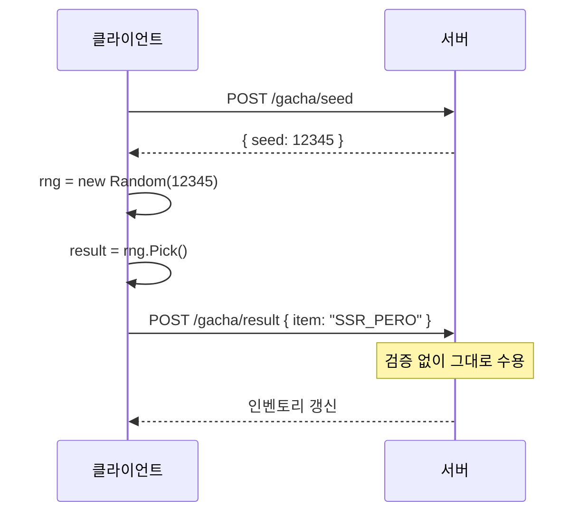
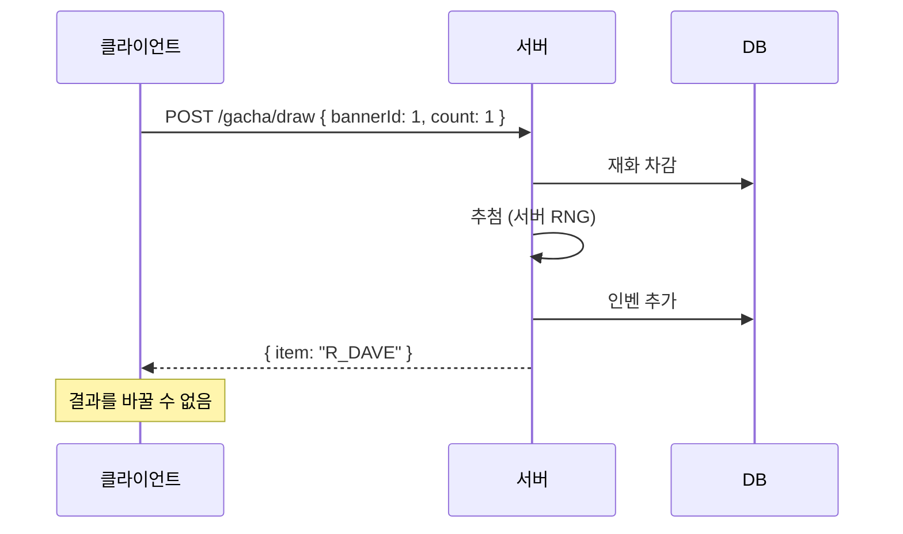

# 9장. 서버에서 추첨하는 이유와 설계 원칙

3부에 들어왔다. 알고리즘은 끝났고, 이제 **이걸 게임 서버에 안전하게 올리는 법**이다. 이번 장에서는 "왜 서버에서만 추첨해야 하는가"부터 시작해서, **서버 권위(Server Authoritative) 설계 원칙**을 다룬다.

---

## 9.1 [그림] 클라이언트 추첨 vs 서버 추첨 — 무슨 차이인가

### 클라이언트 추첨 (절대 하지 말 것)



**이렇게 하면 일어나는 일**:

1. 메모리 변조 → 결과를 SSR로 바꿔 전송 → 서버가 그대로 수용
2. 네트워크 패킷 변조 → "100% 픽업" 결과를 직접 만듦
3. 같은 시드를 미리 알고 → 좋은 결과만 골라서 보냄

### 서버 추첨 (Server Authoritative)



서버는 **클라이언트의 입력을 신뢰하지 않는다**. 어떤 아이템이 나왔는지, 천장이 발동했는지, 픽업 보장이 켜졌는지 모두 서버가 결정한다.

---

## 9.2 해킹 사례로 이해하는 서버 권위(Server Authoritative) 설계

### 사례 1: 결과 조작 (실제 사례 변형)

```http
# 정상 응답
HTTP/1.1 200 OK
{ "result": [{"itemId": 4001, "tier": "R"}] }

# 변조 시도 (Charles, Fiddler 등 프록시)
HTTP/1.1 200 OK
{ "result": [{"itemId": 1001, "tier": "SSR", "code": "PERO"}] }
```

응답을 가로채서 바꾼다. 클라이언트가 그 결과로 인벤토리에 저장하면 끝. 단, 다음 동기화 시 서버가 클라 인벤과 자기 DB를 비교하면 깨진다.

**해결**: 인벤토리 권위는 항상 서버가 갖는다. 클라는 표시용 캐시일 뿐.

### 사례 2: 시드 예측

```csharp
// 클라가 추측한 코드
var seed = DateTime.UtcNow.Ticks % int.MaxValue;
var rng = new Random((int)seed);
var preview = rng.NextDouble();
if (preview < 0.007) // SSR 예측됨, 지금 뽑자
    Draw();
```

서버가 시드를 시간 기반으로 만들면 이런 게 가능하다.

**해결**: 서버 시드는 **외부에 노출되지 않는다**. `Random.Shared`를 쓰고, 시드 정보는 응답에 포함하지 않는다.

### 사례 3: 동시 요청으로 천장 우회

```bash
# 같은 요청을 동시에 100번 보냄
for i in {1..100}; do
  curl -X POST /gacha/draw &
done
```

서버가 천장 카운터를 동시 갱신하지 않으면, 모두 동일한 카운터로 처리되어 **동시에 천장이 발동**할 수 있다.

**해결**: 분산락 + 트랜잭션. 12장에서 자세히 다룬다.

### 원칙 정리

| 원칙 | 설명 |
|------|------|
| **모든 추첨은 서버에서** | 클라는 결과 표시만 |
| **서버 시드는 비공개** | 응답에 포함하지 않음 |
| **결제→차감→지급은 서버 트랜잭션** | 11장 |
| **유저별 동시성 제어** | 12장 |
| **모든 추첨 이력은 로그** | 14·15장 |
| **확률 공시와 실제 일치 검증** | 13·14장 |

---

## 9.3 결과를 미리 만들어두기 vs 요청마다 실시간 추첨

### A. 실시간 추첨 (Real-time)

```csharp
// 요청이 올 때마다 서버에서 추첨
public DrawResult Draw(long userId, int bannerId)
{
    var item = _drawer.Draw(userId, bannerId);
    _repo.Save(...);
    return new DrawResult(item);
}
```

**장점**:
- 가장 단순
- 천장·픽업 등 동적 상태를 즉시 반영
- 확률 변경 시 즉시 적용

**단점**:
- 추첨 비용이 매 요청마다 발생
- 추첨 성능이 응답 시간에 직접 영향

대부분의 RPG는 이 방식이다. 추첨 자체는 미리초 단위라 큰 부담이 없다.

### B. 결과 미리 생성 (Pre-generated)

```csharp
// 한가한 시간에 다음 1만 명분 결과를 미리 만들어둠
public async Task PrepareDrawsAsync(int count)
{
    var prepared = new List<PreparedDraw>(count);
    for (int i = 0; i < count; i++)
        prepared.Add(new PreparedDraw(_drawer.Draw(0, 0)));
    await _redis.PushAsync("prepared_draws", prepared);
}

public DrawResult Draw(long userId)
{
    var prepared = _redis.Pop("prepared_draws");
    return new DrawResult(prepared.Item);
}
```

**언제 쓰나**:
- 초당 수만 건 이상의 추첨이 필요한 대형 이벤트
- 추첨 알고리즘이 매우 무거울 때 (큰 박스, 복잡한 보장)

**문제점**:
- 유저별 천장/픽업 보장을 적용하기 어려움
- 미리 만든 결과는 일반적으로 **익명**이라 가챠보다 룰렛 이벤트에 적합

### 결론

수집형 RPG/MMORPG의 가챠는 **거의 모두 실시간 추첨**이다. 미리 생성은 룰렛/회전판 이벤트 같은 **단순 무작위**에서나 의미가 있다.

---

## 9.4 [실습] 간단한 서버 추첨 API 엔드포인트 만들기

### .NET 10 ASP.NET Core 미니 API

```csharp
// Program.cs
var builder = WebApplication.CreateBuilder(args);

builder.Services.AddSingleton<IRandomProvider, ThreadSafeRandomProvider>();

// MySQL (SqlKata)
builder.Services.AddScoped<QueryFactory>(sp =>
{
    var conn = new MySqlConnection(builder.Configuration.GetConnectionString("Mysql"));
    return new QueryFactory(conn, new SqlKata.Compilers.MySqlCompiler());
});

// Redis (CloudStructures)
builder.Services.AddSingleton(sp =>
    new RedisConnection(new RedisConfig("default", builder.Configuration["Redis:ConnectionString"])));

builder.Services.AddScoped<GachaPityRepository>();
builder.Services.AddScoped<GachaPityCache>();
builder.Services.AddScoped<IGachaDrawer, FullGachaDrawer>();

var app = builder.Build();

// 추첨 엔드포인트
app.MapPost("/api/gacha/draw", async (
    DrawRequest req,
    HttpContext ctx,
    IGachaDrawer drawer,
    GachaPityRepository pityRepo,
    GachaPityCache pityCache,
    QueryFactory db) =>
{
    var userId = GetUserId(ctx);

    // 1) 천장 상태 로드
    var pity = await pityCache.GetAsync(userId, req.BannerId)
            ?? await pityRepo.GetOrCreateAsync(userId, req.BannerId);

    // 2) 추첨 (개수만큼)
    var results = new List<DrawResult>(req.Count);
    for (int i = 0; i < req.Count; i++)
        results.Add(drawer.Draw(userId, req.BannerId));

    // 3) DB 트랜잭션 (11장에서 자세히)
    using var tx = db.Connection.BeginTransaction();
    try
    {
        await DeductCurrencyAsync(db, userId, req.Count, tx);
        await AddItemsAsync(db, userId, results.Select(r => r.MainItem), tx);
        await pityRepo.SaveAsync(userId, req.BannerId, pity);
        tx.Commit();
    }
    catch
    {
        tx.Rollback();
        throw;
    }

    // 4) 캐시 갱신
    await pityCache.SaveAsync(userId, req.BannerId, pity);

    return Results.Ok(new DrawResponse(results));
});

app.Run();

// 모델
public sealed record DrawRequest(int BannerId, int Count);
public sealed record DrawResponse(List<DrawResult> Results);

static long GetUserId(HttpContext ctx)
    => long.Parse(ctx.User.FindFirst("uid")!.Value);
```

### appsettings.json

```json
{
  "ConnectionStrings": {
    "Mysql": "server=localhost;user=game;password=...;database=game"
  },
  "Redis": {
    "ConnectionString": "localhost:6379"
  }
}
```

### 호출 예시

```http
POST /api/gacha/draw
Authorization: Bearer eyJ...
Content-Type: application/json

{ "bannerId": 1, "count": 10 }
```

응답:

```json
{
  "results": [
    { "mainItem": { "itemId": 4001, "code": "DAVE", "tier": "R" } },
    { "mainItem": { "itemId": 4002, "code": "ED",   "tier": "R" } },
    ...
    { "mainItem": { "itemId": 1001, "code": "PERO", "tier": "SSR" } }
  ]
}
```

### 미들웨어로 챙길 것들

이 책에서는 가챠에 집중하지만, 운영 서버라면 다음이 추가로 필요하다.

```csharp
app.UseAuthentication();
app.UseAuthorization();
app.UseRateLimiter();          // 동일 유저 초당 N회 제한
app.UseMaintenanceMode();      // 점검 시 응답 차단
app.UseRequestLogging();       // 모든 추첨 요청 로깅
app.UseExceptionHandler();     // 에러 시 트랜잭션 보호
```

---

## 9장 요약

- 모든 추첨은 서버에서 한다. 클라이언트는 결과를 표시만 한다.
- 서버 시드는 외부에 노출하지 않는다.
- 가챠는 보통 실시간 추첨이고, 미리 생성은 단순 룰렛 이벤트에서나 쓴다.
- ASP.NET Core 미니 API로 서버 추첨 엔드포인트를 한 파일에 만들 수 있다.

다음 장에서는 가챠 시스템의 **데이터 설계**(테이블 스키마, 기획자 친화적 구조)를 다룬다.
