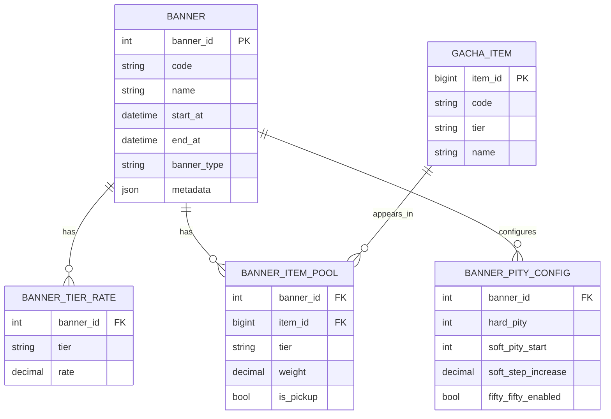
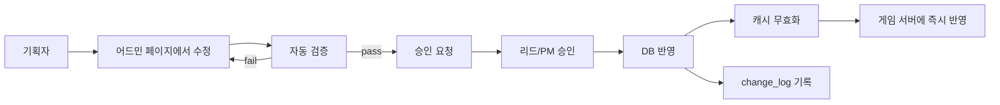

# 10장. 데이터 설계 — 가챠 테이블과 유저 데이터

가챠는 코드보다 **데이터 모델**이 핵심이다. 잘 설계해두면 기획자가 직접 확률을 바꿀 수 있고, 신규 배너 출시도 코드 변경 없이 진행된다. 잘못 설계하면 매번 배포가 필요해진다.

---

## 10.1 가챠 설정 테이블 스키마 설계 (DB 예시 포함)

### 테이블 4총사



### 스키마 (MySQL 8)

```sql
CREATE TABLE banner (
    banner_id INT PRIMARY KEY,
    code VARCHAR(64) NOT NULL UNIQUE,
    name VARCHAR(100) NOT NULL,
    banner_type ENUM('STANDARD','LIMITED','STEP_UP','BOX','COLLECTION') NOT NULL,
    start_at DATETIME(3) NOT NULL,
    end_at DATETIME(3) NOT NULL,
    metadata JSON NULL,
    created_at DATETIME(3) NOT NULL DEFAULT CURRENT_TIMESTAMP(3),
    INDEX idx_active (start_at, end_at)
) ENGINE=InnoDB;

CREATE TABLE banner_tier_rate (
    banner_id INT NOT NULL,
    tier ENUM('SSR','SR','R') NOT NULL,
    rate DECIMAL(10,8) NOT NULL,
    PRIMARY KEY (banner_id, tier),
    FOREIGN KEY (banner_id) REFERENCES banner(banner_id) ON DELETE CASCADE
) ENGINE=InnoDB;

CREATE TABLE gacha_item (
    item_id BIGINT PRIMARY KEY,
    code VARCHAR(64) NOT NULL UNIQUE,
    name VARCHAR(100) NOT NULL,
    tier ENUM('SSR','SR','R') NOT NULL
) ENGINE=InnoDB;

CREATE TABLE banner_item_pool (
    banner_id INT NOT NULL,
    item_id BIGINT NOT NULL,
    tier ENUM('SSR','SR','R') NOT NULL,
    weight DECIMAL(10,4) NOT NULL DEFAULT 1.0,
    is_pickup TINYINT(1) NOT NULL DEFAULT 0,
    PRIMARY KEY (banner_id, item_id),
    INDEX idx_pickup (banner_id, is_pickup),
    FOREIGN KEY (banner_id) REFERENCES banner(banner_id) ON DELETE CASCADE,
    FOREIGN KEY (item_id) REFERENCES gacha_item(item_id)
) ENGINE=InnoDB;

CREATE TABLE banner_pity_config (
    banner_id INT PRIMARY KEY,
    hard_pity INT NOT NULL DEFAULT 90,
    soft_pity_start INT NOT NULL DEFAULT 74,
    soft_step_increase DECIMAL(5,4) NOT NULL DEFAULT 0.06,
    fifty_fifty_enabled TINYINT(1) NOT NULL DEFAULT 1,
    FOREIGN KEY (banner_id) REFERENCES banner(banner_id) ON DELETE CASCADE
) ENGINE=InnoDB;
```

### 데이터 예시

```sql
-- 페로 픽업 배너
INSERT INTO banner VALUES (1, 'PERO_PICKUP', '페로 픽업', 'LIMITED',
    '2026-05-01', '2026-05-21', NULL, NOW(3));

INSERT INTO banner_tier_rate VALUES
    (1, 'SSR', 0.00700000),
    (1, 'SR',  0.18000000),
    (1, 'R',   0.81300000);

INSERT INTO banner_item_pool VALUES
    (1, 1001, 'SSR', 1.0, 1),  -- 페로 (픽업)
    (1, 2001, 'SSR', 1.0, 0),  -- 야엘
    (1, 2002, 'SSR', 1.0, 0),  -- 메이
    (1, 3001, 'SR',  1.0, 0),
    (1, 4001, 'R',   1.0, 0);

INSERT INTO banner_pity_config VALUES (1, 90, 74, 0.06, 1);
```

### 로딩 코드 (SqlKata)

```csharp
public sealed class BannerRepository
{
    private readonly QueryFactory _db;

    public async Task<BannerData?> LoadAsync(int bannerId, CancellationToken ct = default)
    {
        var banner = await _db.Query("banner")
            .Where("banner_id", bannerId)
            .FirstOrDefaultAsync<dynamic?>(cancellationToken: ct);
        if (banner is null) return null;

        var tierRates = (await _db.Query("banner_tier_rate")
            .Where("banner_id", bannerId)
            .GetAsync<dynamic>(cancellationToken: ct))
            .Select(r => new TierProbability(
                Enum.Parse<Tier>((string)r.tier), (double)r.rate))
            .ToArray();

        var pool = (await _db.Query("banner_item_pool")
            .Join("gacha_item", "gacha_item.item_id", "banner_item_pool.item_id")
            .Where("banner_item_pool.banner_id", bannerId)
            .Select("banner_item_pool.item_id",
                    "gacha_item.code",
                    "banner_item_pool.tier",
                    "banner_item_pool.weight",
                    "banner_item_pool.is_pickup")
            .GetAsync<dynamic>(cancellationToken: ct))
            .Select(r => new GachaItem(
                (long)r.item_id,
                (string)r.code,
                Enum.Parse<Tier>((string)r.tier),
                (double)r.weight,
                ((sbyte)r.is_pickup) == 1))
            .ToArray();

        var pity = await _db.Query("banner_pity_config")
            .Where("banner_id", bannerId)
            .FirstAsync<dynamic>(cancellationToken: ct);

        return new BannerData(banner, tierRates, pool, pity);
    }
}
```

---

## 10.2 유저별 천장 카운터 저장 구조

6장에서 잠깐 봤지만 다시 정리해둔다.

```sql
CREATE TABLE user_gacha_pity (
    user_id BIGINT NOT NULL,
    banner_id INT NOT NULL,
    counter INT NOT NULL DEFAULT 0,
    guaranteed_next_ssr_is_pickup TINYINT(1) NOT NULL DEFAULT 0,
    last_drawn_at DATETIME(3) NULL,
    updated_at DATETIME(3) NOT NULL DEFAULT CURRENT_TIMESTAMP(3)
                                  ON UPDATE CURRENT_TIMESTAMP(3),
    PRIMARY KEY (user_id, banner_id)
) ENGINE=InnoDB;
```

### 추첨 이력 테이블

```sql
CREATE TABLE gacha_history (
    id BIGINT PRIMARY KEY AUTO_INCREMENT,
    user_id BIGINT NOT NULL,
    banner_id INT NOT NULL,
    item_id BIGINT NOT NULL,
    tier ENUM('SSR','SR','R') NOT NULL,
    is_pickup TINYINT(1) NOT NULL,
    pity_counter_before INT NOT NULL,
    pity_triggered TINYINT(1) NOT NULL,
    drawn_at DATETIME(3) NOT NULL,
    INDEX idx_user_time (user_id, drawn_at),
    INDEX idx_banner_time (banner_id, drawn_at),
    INDEX idx_tier_time (tier, drawn_at)        -- 통계용
) ENGINE=InnoDB
PARTITION BY RANGE (UNIX_TIMESTAMP(drawn_at)) (
    PARTITION p202604 VALUES LESS THAN (UNIX_TIMESTAMP('2026-05-01')),
    PARTITION p202605 VALUES LESS THAN (UNIX_TIMESTAMP('2026-06-01')),
    PARTITION p202606 VALUES LESS THAN (UNIX_TIMESTAMP('2026-07-01'))
);
```

추첨 이력은 **시간 기반 파티셔닝**이 필수다. 인기 게임은 한 달에 수억 건이 쌓인다.

### 보관 정책

| 데이터 | 보관 기간 | 이유 |
|--------|---------|------|
| 추첨 이력 (raw) | 6개월 | CS·소송 대응 |
| 일별 통계 집계 | 영구 | 트렌드 분석 |
| 배너 정의 | 영구 (논리 삭제) | 과거 배너 조회 |

---

## 10.3 [실습] 기획자가 확률을 수정할 수 있는 구조 만들기

### 원칙: **코드 배포 없이 운영 도구만으로 확률 변경**

기획자에게 SQL을 직접 만지게 하면 사고가 난다. 운영 도구(어드민 페이지)에서 변경하고, 변경은 **버전 관리** + **승인 워크플로우**가 들어가야 한다.

### 패턴 1: 운영 어드민 + 변경 이력

```sql
CREATE TABLE banner_change_log (
    id BIGINT PRIMARY KEY AUTO_INCREMENT,
    banner_id INT NOT NULL,
    changed_by VARCHAR(64) NOT NULL,
    change_type ENUM('CREATE','UPDATE','DELETE') NOT NULL,
    before_json JSON NULL,
    after_json JSON NULL,
    approved_by VARCHAR(64) NULL,
    applied_at DATETIME(3) NOT NULL,
    INDEX idx_banner (banner_id, applied_at)
);
```

배너 변경은 모두 이 테이블에 기록한다. **누가, 언제, 무엇을 바꿨는지**가 남으면 사고 시 추적이 가능하다.

### 패턴 2: 핫 리로드 (캐시 무효화)

```csharp
public sealed class BannerCache
{
    private readonly RedisConnection _redis;
    private readonly BannerRepository _repo;

    private RedisString<BannerData> Key(int id)
        => new(_redis, $"banner:{id}", TimeSpan.FromMinutes(10));

    public async Task<BannerData?> GetAsync(int bannerId)
    {
        var cached = await Key(bannerId).GetAsync();
        if (cached.HasValue) return cached.Value;

        var data = await _repo.LoadAsync(bannerId);
        if (data is not null)
            await Key(bannerId).SetAsync(data);
        return data;
    }

    /// <summary>운영 도구가 변경 후 호출</summary>
    public async Task InvalidateAsync(int bannerId)
        => await Key(bannerId).DeleteAsync();
}
```

### 패턴 3: 게이트(공시) 검증

확률을 바꿀 때 **공시 페이지와 일치하는지** 자동 검증한다.

```csharp
public sealed class ProbabilityDisclosureValidator
{
    public ValidationResult Validate(BannerData data)
    {
        var sum = data.TierRates.Sum(t => t.Probability);
        if (Math.Abs(sum - 1.0) > 1e-6)
            return ValidationResult.Failed($"등급 확률 합 {sum} ≠ 1.0");

        if (data.PityConfig.HardPity < data.PityConfig.SoftPityStart)
            return ValidationResult.Failed("하드 천장이 소프트 시작보다 작음");

        if (data.Items.Any(i => i.WeightInTier <= 0))
            return ValidationResult.Failed("가중치가 0 이하인 아이템 있음");

        return ValidationResult.Ok;
    }
}
```

### 워크플로우



---

## 10.4 Redis와 RDB를 나누는 기준 — 뭘 어디에 저장할까

### 기준

```
[RDB - MySQL]
  - 영속성이 핵심인 데이터
  - 트랜잭션이 필요한 데이터
  - 회계/감사 추적 대상
  - 변경 빈도 < 읽기 빈도

[Redis]
  - 변경 빈도 ≥ 읽기 빈도가 매우 높음
  - 잃어도 재구성 가능한 데이터
  - 분산락, 카운터, 짧은 캐시
```

### 가챠 컴포넌트별 매핑

| 데이터 | RDB | Redis | 비고 |
|--------|-----|-------|------|
| 배너 정의 | ●️ 영구 | 캐시 (10분) | 거의 안 바뀜 |
| 가챠 아이템 | ●️ 영구 | 캐시 (1시간) | 거의 안 바뀜 |
| 유저 천장 카운터 | ●️ 영구 | 핫 캐시 (30일) | RW 둘 다 잦음 |
| 박스 잔여 상태 | ●️ 영구 | 캐시 (1시간) | RW 잦음 |
| 추첨 이력 (raw) | ●️ 영구 | ✗ | 영구 보관 |
| 일일 통계 (집계 중) | ✗ | ●️ (HASH) | 매일 자정 RDB 적재 |
| 분산락 | ✗ | ●️ (TTL 5초) | 12장 |

### 무결성 우선 vs 성능 우선

```csharp
// 무결성 우선: DB가 진실, Redis는 캐시
public async Task<GachaPityState> GetPityAsync(long userId, int bannerId)
{
    var cached = await _cache.GetAsync(userId, bannerId);
    if (cached is not null) return cached;
    var fromDb = await _repo.GetOrCreateAsync(userId, bannerId);
    await _cache.SaveAsync(userId, bannerId, fromDb);
    return fromDb;
}

// 성능 우선: Redis가 진실, 주기적으로 DB 동기화
// → 가챠에는 권장하지 않음 (장애 시 카운터 손실)
```

가챠처럼 **금전적/법적 책임이 따르는 데이터**는 RDB를 진실로 두고 Redis는 캐시로만 쓴다.

---

## 10장 요약

- 배너/등급/아이템풀/천장설정의 4개 테이블이 가챠 데이터의 기본이다.
- 추첨 이력은 시간 파티셔닝과 보관 정책이 필수다.
- 기획자는 SQL이 아닌 어드민 도구로 변경하고, 변경 이력과 자동 검증을 거친다.
- 무결성 우선 데이터(천장, 박스, 이력)는 RDB가 진실이고 Redis는 캐시다.

다음 장에서는 가챠의 핵심인 **재화 차감 + 추첨 + 지급의 원자성**을 다룬다.
