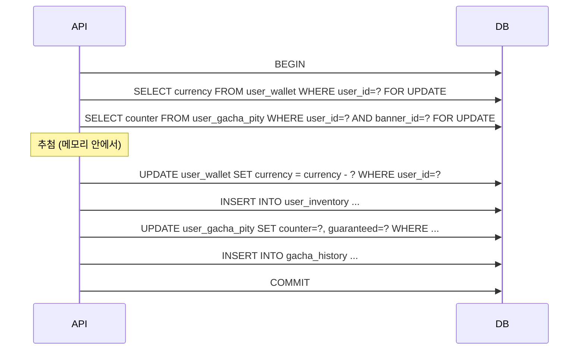
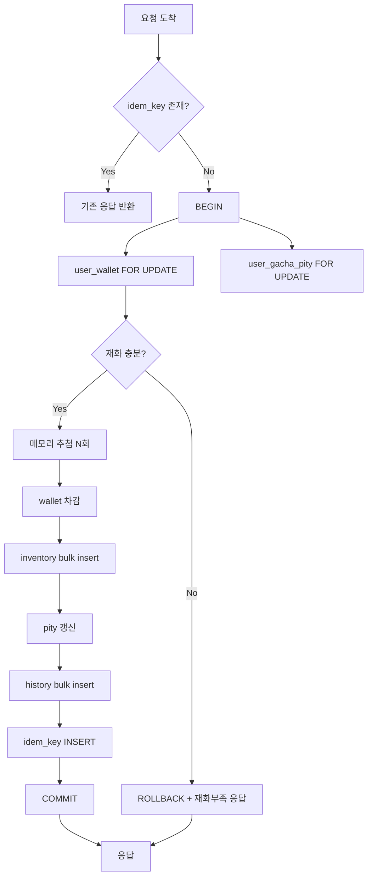

# 11장. 재화 차감과 추첨의 원자성

가챠 사고 중 가장 흔한 유형은 **"재화는 빠졌는데 아이템이 안 들어왔다"** 또는 그 반대다. 이건 알고리즘 버그가 아니라 **트랜잭션 설계 미스**다. 이번 장에서는 안전한 차감-추첨-지급 흐름을 만든다.

---

## 11.1 [사고 사례] 재화는 차감됐는데 아이템이 안 나온 경우

### 시나리오

```csharp
// 신입이 짠 코드
public async Task<DrawResult> DrawAsync(long userId, int bannerId)
{
    // 1. 재화 차감
    await _currency.DeductAsync(userId, 100);

    // 2. 추첨
    var item = _drawer.Draw(userId, bannerId);

    // 3. 인벤 추가 ← 여기서 예외 발생 시 끝
    await _inventory.AddAsync(userId, item.ItemId);

    return new DrawResult(item);
}
```

`_inventory.AddAsync`에서 DB 커넥션이 끊기거나, 외래키 제약에 걸리거나, 데드락에 걸리면 **차감만 일어나고 지급이 안 된다**. 유저는 화가 난다.

### CS 응대 비용

이런 사고가 100건 발생하면 100번 사람이 직접 처리해야 한다. 자동 보상도 어렵다. 누가 어디까지 받았는지 추적이 안 되기 때문이다.

### 해결 방향

**한 트랜잭션 안에서 모든 것이 일어나야 한다**:

1. 재화 차감
2. 인벤 추가
3. 천장 카운터 갱신
4. 추첨 이력 기록

이 네 가지가 **모두 성공하거나 모두 실패**해야 한다. 일부만 성공하는 상황이 가장 위험하다.

---

## 11.2 트랜잭션으로 묶어야 하는 것들

### 한 트랜잭션 단위



### SqlKata + MySqlConnector

```csharp
using MySqlConnector;
using SqlKata.Execution;

public sealed class GachaTransactionService
{
    private readonly QueryFactory _db;
    private readonly IGachaDrawer _drawer;
    private readonly GachaPityRepository _pityRepo;
    private readonly int _costPerDraw = 100;

    public async Task<DrawResult> DrawAsync(long userId, int bannerId, int count, CancellationToken ct = default)
    {
        var totalCost = _costPerDraw * count;

        await using var conn = (MySqlConnection)_db.Connection;
        await conn.OpenAsync(ct);
        await using var tx = await conn.BeginTransactionAsync(ct);

        try
        {
            // 1) 행 잠금: 재화
            var currency = await conn.ExecuteScalarAsync<int>(
                "SELECT currency FROM user_wallet WHERE user_id=@u FOR UPDATE",
                new { u = userId }, tx);
            if (currency < totalCost)
                throw new GachaException("재화 부족");

            // 2) 행 잠금: 천장
            var pity = await LoadPityForUpdateAsync(conn, userId, bannerId, tx);

            // 3) 추첨 (메모리 안)
            var results = new List<DrawResult>(count);
            for (int i = 0; i < count; i++)
                results.Add(_drawer.Draw(userId, bannerId, pity));

            // 4) 차감
            await conn.ExecuteAsync(
                "UPDATE user_wallet SET currency = currency - @cost WHERE user_id = @u",
                new { cost = totalCost, u = userId }, tx);

            // 5) 인벤 추가 (Bulk)
            await BulkAddInventoryAsync(conn, userId, results.Select(r => r.MainItem), tx);

            // 6) 천장 갱신
            await SavePityAsync(conn, userId, bannerId, pity, tx);

            // 7) 이력 기록
            await BulkAddHistoryAsync(conn, userId, bannerId, results, tx);

            await tx.CommitAsync(ct);
            return new DrawResult(results);
        }
        catch
        {
            await tx.RollbackAsync(ct);
            throw;
        }
    }
}
```

### `FOR UPDATE` 주의

`FOR UPDATE`는 **InnoDB 행 잠금**을 건다. 다른 트랜잭션에서 같은 행을 읽으려 하면 대기한다. 이게 12장의 비관적 락이다.

### 트랜잭션 격리 수준

MySQL InnoDB의 기본은 `REPEATABLE READ`다. 가챠에는 이 정도면 충분하다. **`READ UNCOMMITTED`나 `READ COMMITTED`로 낮추면 안 된다** — 같은 트랜잭션 안에서 두 번 읽었을 때 값이 달라질 수 있다.

```sql
-- MySQL 기본
SET TRANSACTION ISOLATION LEVEL REPEATABLE READ;
```

---

## 11.3 멱등성(Idempotency) — 네트워크 끊겨도 중복 지급 안 되게

### 문제 상황

```
1. 클라가 추첨 요청 보냄
2. 서버가 처리 (재화 차감 + 지급)
3. 응답 전달 중 네트워크 끊김
4. 클라는 "실패한 줄 알고" 다시 요청
5. 서버는 또 처리
   → 재화 두 번 차감 + 아이템 두 번 지급
```

### 해결: 클라이언트가 요청 ID(Idempotency Key)를 보낸다

```csharp
public sealed record DrawRequest(int BannerId, int Count, string IdempotencyKey);
```

클라이언트는 추첨 시작 전에 **UUID**를 만들어서 같이 보낸다. 같은 키로 재요청이 와도 서버는 한 번만 처리한다.

### 구현

```sql
CREATE TABLE gacha_idempotency (
    user_id BIGINT NOT NULL,
    idem_key CHAR(36) NOT NULL,
    request_hash CHAR(64) NOT NULL,
    response_json JSON NOT NULL,
    created_at DATETIME(3) NOT NULL DEFAULT CURRENT_TIMESTAMP(3),
    PRIMARY KEY (user_id, idem_key),
    INDEX idx_created (created_at)
) ENGINE=InnoDB;
```

```csharp
public async Task<DrawResponse> DrawAsync(long userId, DrawRequest req, CancellationToken ct = default)
{
    // 1) 멱등성 키로 기존 결과 조회
    var existing = await _db.Query("gacha_idempotency")
        .Where("user_id", userId)
        .Where("idem_key", req.IdempotencyKey)
        .FirstOrDefaultAsync<dynamic?>(cancellationToken: ct);

    if (existing is not null)
    {
        // 같은 결과를 그대로 반환 (요청 해시도 검증)
        return JsonSerializer.Deserialize<DrawResponse>((string)existing.response_json)!;
    }

    // 2) 새 트랜잭션으로 처리
    var result = await _txService.DrawAsync(userId, req.BannerId, req.Count, ct);
    var response = new DrawResponse(result);

    // 3) 멱등 키와 결과 저장 (같은 트랜잭션 안에 들어가는 것이 가장 안전)
    await _db.Query("gacha_idempotency").InsertAsync(new
    {
        user_id = userId,
        idem_key = req.IdempotencyKey,
        request_hash = HashRequest(req),
        response_json = JsonSerializer.Serialize(response),
    }, cancellationToken: ct);

    return response;
}
```

### 더 안전한 패턴: 한 트랜잭션 안에 멱등 키도 INSERT

```csharp
// 트랜잭션 안에서
await conn.ExecuteAsync(@"
    INSERT INTO gacha_idempotency (user_id, idem_key, request_hash, response_json)
    VALUES (@uid, @key, @hash, @resp)",
    new { uid = userId, key = req.IdempotencyKey, hash = ..., resp = ... }, tx);
```

`UNIQUE KEY` 제약 때문에 동일 키 두 번째 INSERT는 즉시 실패한다. 즉, **같은 키로 동시에 두 번 요청해도 한 트랜잭션만 성공**한다.

### TTL 정책

```sql
-- 7일 이상 된 멱등 키는 매일 정리
DELETE FROM gacha_idempotency WHERE created_at < DATE_SUB(NOW(), INTERVAL 7 DAY);
```

---

## 11.4 [실습] 안전한 재화 차감 + 추첨 + 지급 흐름 구현

### 전체 흐름도



### 완성된 서비스

```csharp
public sealed class SafeGachaService
{
    private readonly QueryFactory _db;
    private readonly IGachaDrawer _drawer;
    private readonly int _costPerDraw;

    public async Task<DrawResponse> DrawAsync(long userId, DrawRequest req, CancellationToken ct = default)
    {
        await using var conn = (MySqlConnection)_db.CreateConnection();
        await conn.OpenAsync(ct);

        // 1) 멱등 체크 (트랜잭션 밖)
        var existing = await conn.QueryFirstOrDefaultAsync<string>(@"
            SELECT response_json FROM gacha_idempotency
             WHERE user_id=@u AND idem_key=@k", new { u = userId, k = req.IdempotencyKey });
        if (existing is not null)
            return JsonSerializer.Deserialize<DrawResponse>(existing)!;

        await using var tx = await conn.BeginTransactionAsync(ct);
        try
        {
            // 2) 재화 잠금 + 검증
            var currency = await conn.QueryFirstAsync<int>(@"
                SELECT currency FROM user_wallet WHERE user_id=@u FOR UPDATE",
                new { u = userId }, tx);
            var totalCost = _costPerDraw * req.Count;
            if (currency < totalCost)
                throw new GachaException("재화 부족");

            // 3) 천장 잠금
            var pity = await conn.QueryFirstOrDefaultAsync<GachaPityRow>(@"
                SELECT counter, guaranteed_next_ssr_is_pickup FROM user_gacha_pity
                WHERE user_id=@u AND banner_id=@b FOR UPDATE",
                new { u = userId, b = req.BannerId }, tx);
            var pityState = pity is null
                ? new GachaPityState()
                : new GachaPityState
                  {
                      Counter = pity.counter,
                      GuaranteedNextSsrIsPickup = pity.guaranteed_next_ssr_is_pickup == 1
                  };

            // 4) 추첨
            var results = new List<DrawResult>(req.Count);
            for (int i = 0; i < req.Count; i++)
                results.Add(_drawer.Draw(userId, req.BannerId, pityState));

            // 5) 차감
            await conn.ExecuteAsync(@"
                UPDATE user_wallet SET currency = currency - @c WHERE user_id=@u",
                new { c = totalCost, u = userId }, tx);

            // 6) 인벤 bulk insert
            var inventoryRows = results.Select(r => new
            {
                user_id = userId, item_id = r.MainItem.ItemId,
                amount = 1, acquired_at = DateTime.UtcNow,
            });
            await conn.ExecuteAsync(@"
                INSERT INTO user_inventory (user_id, item_id, amount, acquired_at)
                VALUES (@user_id, @item_id, @amount, @acquired_at)",
                inventoryRows, tx);

            // 7) 천장 upsert
            await conn.ExecuteAsync(@"
                INSERT INTO user_gacha_pity (user_id, banner_id, counter, guaranteed_next_ssr_is_pickup)
                VALUES (@u, @b, @c, @g)
                ON DUPLICATE KEY UPDATE
                    counter = VALUES(counter),
                    guaranteed_next_ssr_is_pickup = VALUES(guaranteed_next_ssr_is_pickup)",
                new {
                    u = userId, b = req.BannerId,
                    c = pityState.Counter,
                    g = pityState.GuaranteedNextSsrIsPickup ? 1 : 0
                }, tx);

            // 8) 이력
            var historyRows = results.Select((r, idx) => new
            {
                user_id = userId,
                banner_id = req.BannerId,
                item_id = r.MainItem.ItemId,
                tier = r.MainItem.Tier.ToString(),
                is_pickup = r.MainItem.IsPickup ? 1 : 0,
                pity_counter_before = r.PityCounterBefore,
                pity_triggered = r.PityTriggered ? 1 : 0,
                drawn_at = DateTime.UtcNow,
            });
            await conn.ExecuteAsync(@"
                INSERT INTO gacha_history (user_id, banner_id, item_id, tier, is_pickup,
                    pity_counter_before, pity_triggered, drawn_at)
                VALUES (@user_id, @banner_id, @item_id, @tier, @is_pickup,
                    @pity_counter_before, @pity_triggered, @drawn_at)",
                historyRows, tx);

            // 9) 멱등 키
            var response = new DrawResponse(results);
            await conn.ExecuteAsync(@"
                INSERT INTO gacha_idempotency (user_id, idem_key, request_hash, response_json)
                VALUES (@u, @k, @h, @r)",
                new
                {
                    u = userId, k = req.IdempotencyKey,
                    h = HashRequest(req),
                    r = JsonSerializer.Serialize(response),
                }, tx);

            await tx.CommitAsync(ct);
            return response;
        }
        catch
        {
            await tx.RollbackAsync(ct);
            throw;
        }
    }

    private static string HashRequest(DrawRequest req)
    {
        using var sha = System.Security.Cryptography.SHA256.Create();
        var bytes = sha.ComputeHash(Encoding.UTF8.GetBytes($"{req.BannerId}|{req.Count}"));
        return Convert.ToHexString(bytes);
    }
}
```

### 실패 케이스 정리

| 실패 지점 | 결과 |
|----------|------|
| 재화 부족 | ROLLBACK, 차감/지급 모두 안 일어남 |
| 추첨 중 예외 | ROLLBACK |
| INSERT 도중 DB 끊김 | ROLLBACK (자동) |
| COMMIT 후 응답 도중 끊김 | 클라가 같은 idem_key로 재요청 → 저장된 응답 반환 |

---

## 11장 요약

- 차감-추첨-지급은 한 트랜잭션 안에서 일어나야 한다.
- `FOR UPDATE`로 행 잠금을 걸어 동시 갱신을 막는다.
- 멱등성 키(IdempotencyKey)로 네트워크 단절 시 중복 차감을 방지한다.
- 멱등 키 INSERT를 트랜잭션 안에 두면 동시 두 번 요청도 한 번만 성공한다.

다음 장에서는 동시성 자체에 더 깊게 들어가서 분산락/낙관적 락/비관적 락을 비교한다.
