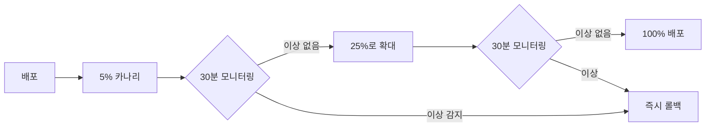

# 15장. 라이브 모니터링 — 사고를 빠르게 잡는 법

배포 전 테스트가 다 통과해도 라이브에서는 사고가 난다. **이상을 빨리 감지**하고 **30분 안에 복구**하는 게 라이브 운영의 핵심이다.

---

## 15.1 [그림] 실시간 확률 대시보드를 왜 만들어야 하는가

### 사고 시나리오 (대시보드 없는 상황)

```
1. 새 배너 배포
2. 4시간 후 운영팀에 컴플레인 폭주 — "SSR이 안 나와요"
3. 개발팀 호출, DB 직접 쿼리로 분석 시작
4. 1시간 만에 원인 파악 (확률 컬럼이 0.07이 아닌 0.007이었음)
5. 핫픽스 배포
6. 사고 보상 설계
7. 보상 지급 코드 작성/배포
8. 사고 ~ 복구까지 8시간

→ 신뢰 손실 + 매출 손실 + 운영팀 야근
```

### 사고 시나리오 (대시보드 있는 상황)

```
1. 새 배너 배포
2. 30분 후 대시보드에 SSR 등장률 0.0% 알람
3. 개발팀 즉시 확인, DB 확률 컬럼 오타 발견
4. 핫픽스 배포 — 35분
5. 보상 자동 발송 도구로 일괄 처리

→ 사고 ~ 복구 1시간 미만
```

대시보드 하나로 **사고 비용을 1/8로** 줄일 수 있다.

### 대시보드에 띄울 핵심 지표

```
┌─────────────────────────────────────────────────────────────┐
│  실시간 가챠 대시보드                            (자동 갱신 1분) │
├─────────────────────────────────────────────────────────────┤
│  배너: 페로 픽업 (활성)                                       │
│                                                              │
│  최근 1시간 추첨: 124,803회                                   │
│                                                              │
│  ┌─ 등급 분포 ────────────┐  ┌─ 천장 발동 ────────────┐    │
│  │ SSR  882 (0.706%)      │  │ 자연: 79개            │    │
│  │ SR   22,512 (18.04%)   │  │ 천장: 3개             │    │
│  │ R    101,409 (81.25%)  │  │ 50/50 미스: 38개      │    │
│  └────────────────────────┘  └───────────────────────┘    │
│                                                              │
│  의도값과 차이: 모두 ±0.5% 이내 ✅                           │
│                                                              │
│  ┌─ 시간대별 SSR 비율 ──────────────────────────────┐       │
│  │  ●●●●●●●●●●●●●●●●●●  (정상)                   │       │
│  │ ↑0.7%                                          │       │
│  └────────────────────────────────────────────────┘       │
└─────────────────────────────────────────────────────────────┘
```

---

## 15.2 3시그마 이상 탐지 — "확률이 이상하다"를 자동으로 알아채기

### 3시그마(3σ) 규칙

> "정규 분포에서 평균 ± 3σ 범위 밖으로 벗어나는 확률은 0.27%."
>
> 즉, 그 범위를 벗어나면 "우연 아님" 알람을 켤 수 있다.

### 표본 비율의 표준편차

```
관찰된 빈도 비율 p̂의 표준편차:
  σ = √(p(1-p) / n)

3σ 범위:
  [p - 3σ, p + 3σ]
```

### 예시 — SSR 0.7% 배너

```
n = 100,000회
p = 0.007
σ = √(0.007 × 0.993 / 100,000) = 0.000264 = 0.0264%
3σ = 0.079%

정상 범위: [0.621%, 0.779%]
이 밖이면 알람
```

### 코드

```csharp
public sealed class SigmaAnomalyDetector
{
    public sealed record AnomalyReport(
        bool IsAnomaly,
        double Observed,
        double Expected,
        double SigmaCount);

    public AnomalyReport Check(int observedCount, int totalDraws, double expectedRate, int sigmaThreshold = 3)
    {
        if (totalDraws < 100) return new AnomalyReport(false, 0, expectedRate, 0);  // 너무 적음

        double observedRate = (double)observedCount / totalDraws;
        double sigma = Math.Sqrt(expectedRate * (1 - expectedRate) / totalDraws);
        double sigmaCount = Math.Abs(observedRate - expectedRate) / sigma;

        return new AnomalyReport(
            IsAnomaly: sigmaCount >= sigmaThreshold,
            Observed: observedRate,
            Expected: expectedRate,
            SigmaCount: sigmaCount);
    }
}
```

### 사용

```csharp
var detector = new SigmaAnomalyDetector();
var report = detector.Check(
    observedCount: 510,    // 100,000회 중 SSR
    totalDraws: 100_000,
    expectedRate: 0.007);

if (report.IsAnomaly)
    SendSlackAlert($"⚠️ SSR 등장률 이상: {report.Observed:P3} (기대: {report.Expected:P3}, {report.SigmaCount:F2}σ)");
```

### 1시그마/2시그마/3시그마 차이

| σ 범위 | 정상 발생 확률 | 알람 정확도 |
|------|------------|-----------|
| ±1σ  | 68.27%     | 너무 잦음 (false positive 많음) |
| ±2σ  | 95.45%     | 보통 |
| ±3σ  | 99.73%     | **권장**, 진짜 이상만 잡음 |

---

## 15.3 [실습] 슬랙 알림 연동 — 이상 감지 시 즉시 통보

### 백그라운드 워커

```csharp
public sealed class GachaAnomalyMonitor : BackgroundService
{
    private readonly QueryFactory _db;
    private readonly ISlackNotifier _slack;
    private readonly SigmaAnomalyDetector _detector = new();

    protected override async Task ExecuteAsync(CancellationToken ct)
    {
        while (!ct.IsCancellationRequested)
        {
            try { await CheckAllActiveBannersAsync(ct); }
            catch (Exception ex) { /* 로깅 */ }
            await Task.Delay(TimeSpan.FromMinutes(5), ct);
        }
    }

    private async Task CheckAllActiveBannersAsync(CancellationToken ct)
    {
        var since = DateTime.UtcNow.AddMinutes(-5);

        var counts = await _db.SelectAsync<dynamic>(@"
            SELECT banner_id, tier, COUNT(*) AS cnt
              FROM gacha_history
             WHERE drawn_at >= @since
             GROUP BY banner_id, tier",
            new { since }, cancellationToken: ct);

        var byBanner = counts.GroupBy(r => (int)r.banner_id);
        foreach (var group in byBanner)
        {
            var bannerId = group.Key;
            var data = await LoadBannerAsync(bannerId, ct);
            if (data is null) continue;

            int total = group.Sum(r => (int)r.cnt);
            if (total < 200) continue;  // 표본 너무 적음

            foreach (var tierRow in group)
            {
                var tier = Enum.Parse<Tier>((string)tierRow.tier);
                var expected = data.TierRates.First(t => t.Tier == tier).Probability;
                var report = _detector.Check((int)tierRow.cnt, total, expected);
                if (report.IsAnomaly)
                {
                    await _slack.SendAsync(
                        channel: "#gacha-alerts",
                        text: $":warning: 배너 *{data.Banner.Name}* {tier} 등장률 이상\n" +
                              $"관찰: {report.Observed:P3} (기대: {report.Expected:P3}, " +
                              $"{report.SigmaCount:F2}σ, n={total:N0})");
                }
            }
        }
    }
}
```

### Slack 클라이언트 (간단)

```csharp
public sealed class SlackNotifier : ISlackNotifier
{
    private readonly HttpClient _http;
    private readonly string _webhook;

    public SlackNotifier(HttpClient http, IConfiguration cfg)
    {
        _http = http;
        _webhook = cfg["Slack:WebhookUrl"]!;
    }

    public async Task SendAsync(string channel, string text)
    {
        var payload = new { channel, text, username = "GachaBot" };
        await _http.PostAsJsonAsync(_webhook, payload);
    }
}
```

### Program.cs 등록

```csharp
builder.Services.AddHttpClient<ISlackNotifier, SlackNotifier>();
builder.Services.AddHostedService<GachaAnomalyMonitor>();
```

### 알람 피로 줄이기

```
[같은 알람 5분 안에 또 발생 시 무시]
- in-memory dictionary로 마지막 알람 시각 기록
- 30분 후 첫 알람만 다시 발송
```

```csharp
private readonly Dictionary<string, DateTime> _lastAlertAt = new();

private bool ShouldAlert(string key)
{
    var now = DateTime.UtcNow;
    if (_lastAlertAt.TryGetValue(key, out var last) && (now - last) < TimeSpan.FromMinutes(30))
        return false;
    _lastAlertAt[key] = now;
    return true;
}
```

---

## 15.4 카나리 배포로 확률 버그 조기 발견하기

### 아이디어

> "전체 유저에게 한 번에 배포하지 말고, 5%부터 시작해서 단계적으로 늘린다."

```
[Day 1] 5%   유저 (테스터 풀)
[Day 2] 25%  유저 (이상 없으면)
[Day 4] 100% 유저
```

### 구현 1: 배너 ID 분기 + 룰

```csharp
// 새 확률은 banner_id=2, 기존은 banner_id=1
public int ResolveBannerId(long userId)
{
    if (IsCanaryUser(userId)) return 2;
    return 1;
}

private bool IsCanaryUser(long userId)
{
    // user_id의 끝자리로 단순 분기
    return userId % 100 < 5;  // 5%
}
```

### 구현 2: 피처 플래그(LaunchDarkly, Unleash 등)

```csharp
if (_featureFlags.IsEnabled("new-gacha-rates", userId))
    return _newDrawer.Draw(...);
return _oldDrawer.Draw(...);
```

피처 플래그를 쓰면 **배포 없이 비율 변경**이 가능하다.

### 카나리 + 모니터링 조합



### 어드민에서 직접 컨트롤

```csharp
// 어드민이 비율을 즉시 조절
[HttpPost("admin/gacha/rollout")]
public IActionResult SetRollout([FromBody] RolloutRequest req)
{
    _featureFlags.SetPercentage("new-gacha-rates", req.Percentage);
    return Ok();
}
```

---

## 15.5 [사고 대응] 이상 탐지 후 30분 안에 해야 할 것들

### 30분 SLA 체크리스트

```
[1분]   알람 수신, 담당자 확인
[2분]   대시보드에서 사고 범위 파악 (어떤 배너, 어떤 등급, 얼마나 차이)
[5분]   1차 가설 (DB 확률, 코드 버그, 데이터 누락 등)
[10분]  핫픽스 또는 데이터 수정 결정
[15분]  핫픽스 적용 (DB 수정 / 피처 플래그 OFF / 코드 롤백)
[20분]  복구 확인 (대시보드 정상화)
[30분]  유저 영향 범위 산정 (사고 시간 동안 추첨한 유저 ID 목록)
```

### 사고 후 작업 (당일)

```
[1시간 내]   임시 공지 발송 ("일부 배너 확률에 이상이 확인되어 조사 중")
[3시간 내]   원인 분석 보고서 (Postmortem)
[24시간 내]  보상 설계 및 발송
[1주일 내]  재발 방지 대책 수립 (테스트, 모니터링, 프로세스)
```

### 보상 자동화 도구

```csharp
public sealed class CompensationTool
{
    public async Task<int> SendCompensationAsync(
        DateTime affectedFrom, DateTime affectedTo, int bannerId,
        Reward reward)
    {
        // 1) 영향 받은 유저 추출
        var users = await _db.SelectAsync<long>(@"
            SELECT DISTINCT user_id FROM gacha_history
             WHERE banner_id = @b AND drawn_at BETWEEN @f AND @t",
            new { b = bannerId, f = affectedFrom, t = affectedTo });

        // 2) 우편함으로 보상 발송 (멱등성 키 포함)
        foreach (var userId in users)
        {
            var idemKey = $"compensation:{bannerId}:{affectedFrom:yyyyMMddHH}:{userId}";
            await _mailbox.SendAsync(userId, reward, idemKey);
        }
        return users.Count;
    }
}
```

### 사후 보고서 템플릿

```
== 가챠 사고 보고서 ==
사고 시작: 2026-05-XX 03:14
사고 인지: 03:42 (28분)
복구 완료: 04:15 (33분)
영향 유저: 4,283명
사고 원인: banner_tier_rate 테이블의 SSR 확률이 0.07로 입력됨 (0.007 의도)
조치 내역:
  1. DB 확률 값 정상화
  2. 영향 유저에 다이아 1000개 + 픽업 캐릭터 1장 일괄 발송
재발 방지:
  1. 어드민 도구에 자동 검증 추가 (확률 ≥ 0.05면 경고)
  2. 카나리 배포 의무화
  3. 3시그마 알람 임계 1시간 → 30분 단축
```

---

## 15장 요약

- 실시간 대시보드는 사고 비용을 8배 이상 줄인다.
- 3시그마 이상 탐지로 false positive를 줄이면서 진짜 이상만 잡는다.
- 슬랙 알림은 백그라운드 워커로 5분마다 체크한다.
- 카나리 배포(5% → 25% → 100%)로 사고를 미리 발견한다.
- 사고 시 30분 SLA, 사후 보상 자동화 도구를 미리 만들어둔다.

다음 장에서는 실제로 일어났던(또는 일어날 수 있는) 가챠 사고 사례들을 정리한다.
