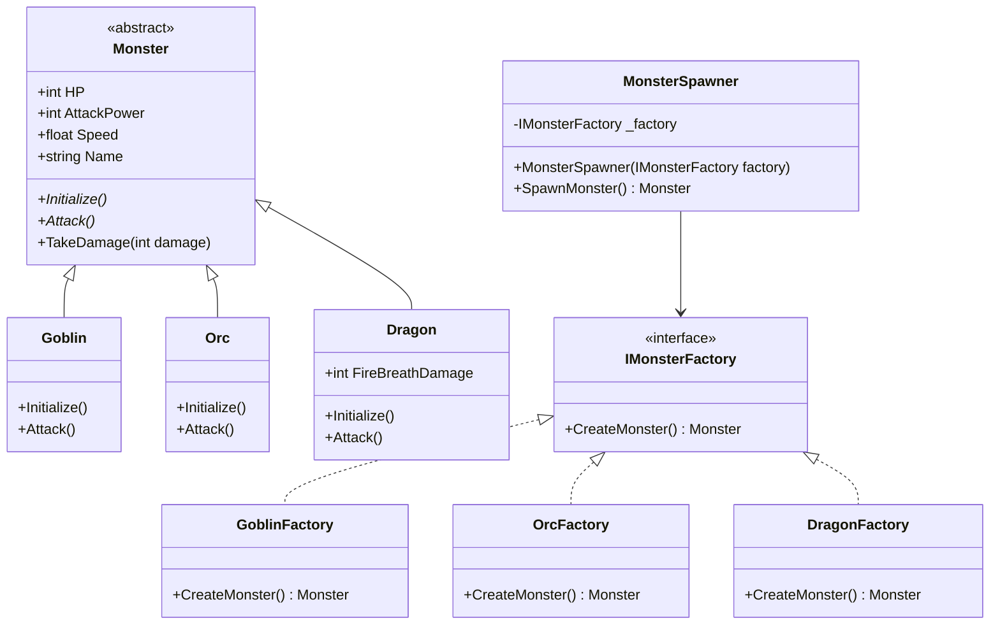
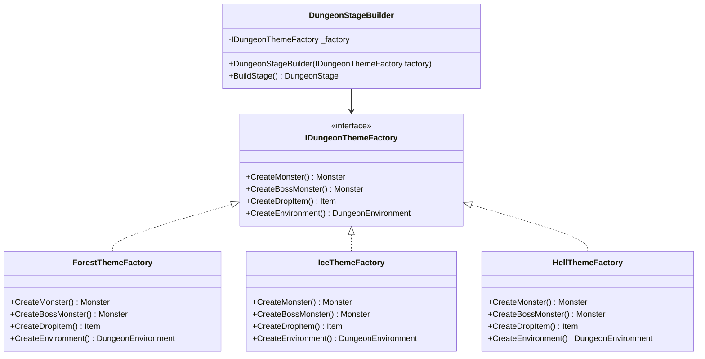

# 게임 개발자를 위한 C# 디자인 패턴: 실전 예제로 배우는 패턴의 힘  

저자: 최흥배, AI-Assisted   
    
권장 개발 환경
- **IDE**: Visual Studio 2022 이상 (Community 이상)
- **.NET**: 버전 9 이상
- **OS**: Windows 10 이상

-----  
  
# Chapter 2: Factory Pattern (팩토리 패턴)

## **들어가며**
게임을 개발하다 보면 수많은 객체를 생성해야 하는 상황에 마주치게 된다. 플레이어가 던전에 입장할 때 몬스터가 등장해야 하고, 보스를 처치하면 아이템이 드롭되어야 하며, 전투 UI가 동적으로 구성되어야 한다. 이처럼 객체 생성이 빈번하고 다양한 게임 환경에서, 생성 로직을 어떻게 구성하느냐는 코드의 유지보수성과 확장성에 결정적인 영향을 미친다.

팩토리 패턴(Factory Pattern)은 객체 생성의 책임을 별도의 클래스나 메서드로 분리함으로써, 클라이언트 코드가 구체적인 클래스에 의존하지 않도록 만드는 생성 패턴(Creational Pattern)이다. 이 장에서는 팩토리 패턴이 왜 필요한지, 어떻게 적용하는지, 그리고 어떻게 Abstract Factory로 발전시킬 수 있는지를 실전 게임 개발 맥락에서 깊이 있게 살펴본다.


## **2.1 패턴 미사용 vs 사용: 하드코딩된 객체 생성의 문제**

### **하드코딩된 객체 생성 방식**
처음 게임을 만들 때 가장 직관적인 방법은 필요한 곳에서 직접 `new` 키워드로 객체를 생성하는 것이다. 아래는 전형적인 하드코딩 방식의 스포너 코드이다.

```csharp
// ❌ 패턴 미사용: 하드코딩된 몬스터 생성
public class MonsterSpawner
{
    public Monster SpawnMonster(string monsterType)
    {
        if (monsterType == "Goblin")
        {
            Goblin goblin = new Goblin();
            goblin.HP = 50;
            goblin.AttackPower = 10;
            goblin.Speed = 1.5f;
            goblin.Initialize();
            return goblin;
        }
        else if (monsterType == "Orc")
        {
            Orc orc = new Orc();
            orc.HP = 120;
            orc.AttackPower = 25;
            orc.Speed = 0.8f;
            orc.Initialize();
            return orc;
        }
        else if (monsterType == "Dragon")
        {
            Dragon dragon = new Dragon();
            dragon.HP = 500;
            dragon.AttackPower = 80;
            dragon.Speed = 1.2f;
            dragon.FireBreathDamage = 150;
            dragon.Initialize();
            return dragon;
        }
        // 새 몬스터 추가 시 이 메서드를 직접 수정해야 한다
        return null;
    }
}
```

이 코드는 당장은 동작하지만, 시간이 지남에 따라 심각한 문제를 드러낸다. 새로운 몬스터 타입이 추가될 때마다 `SpawnMonster` 메서드를 직접 수정해야 하므로 OCP(Open/Closed Principle), 즉 개방-폐쇄 원칙을 위반한다. 또한 몬스터 초기화 로직이 스포너 클래스 안에 뒤섞여 있어 단일 책임 원칙(SRP)도 위반하게 된다. 만약 같은 몬스터를 여러 곳에서 생성해야 한다면, 동일한 초기화 코드가 프로젝트 전반에 중복되어 나타나기 시작한다.

```
문제 상황 시각화:

MonsterSpawner
    │
    ├── if "Goblin"  ──▶ new Goblin()  [초기화 로직 직접 포함]
    ├── if "Orc"     ──▶ new Orc()     [초기화 로직 직접 포함]
    ├── if "Dragon"  ──▶ new Dragon()  [초기화 로직 직접 포함]
    └── if "Troll"?  ──▶ ??? (수정 필요!)
    
    ⚠ 새 몬스터 추가 = SpawnMonster 메서드 직접 수정
    ⚠ 초기화 로직 = 스포너 안에 혼재
    ⚠ 중복 코드 = 여러 곳에서 같은 new Goblin() 반복
```

### **팩토리 패턴이 해결하는 것**
팩토리 패턴은 객체 생성 로직을 전담하는 클래스(팩토리)로 분리함으로써 위의 문제들을 해소한다. 클라이언트 코드는 어떤 구체 클래스가 생성되는지 알 필요 없이 팩토리에게 생성을 위임하면 되고, 새로운 타입이 추가될 때는 팩토리만 수정하거나 새로운 팩토리 클래스를 추가하면 된다.

  
## **2.2 Factory Pattern의 구조**
팩토리 패턴에는 크게 세 가지 변형이 존재한다. **Simple Factory**, **Factory Method**, 그리고 **Abstract Factory**이다. 이 장에서는 Simple Factory와 Factory Method를 먼저 다루고, Abstract Factory는 별도 절에서 심화 학습한다.

### **전체 구조 다이어그램**




## **2.3 게임에서의 활용: 실전 예제로 이해하기**

### **기반 클래스 및 인터페이스 설계**
실전 예제를 시작하기 전에, 게임 내 몬스터가 공유할 기반 구조를 먼저 정의한다.

```csharp
// 모든 몬스터의 기반 추상 클래스
public abstract class Monster
{
    public string Name { get; protected set; }
    public int HP { get; protected set; }
    public int MaxHP { get; protected set; }
    public int AttackPower { get; protected set; }
    public float Speed { get; protected set; }
    public int RewardExp { get; protected set; }

    // 각 몬스터가 자신만의 초기화 로직을 구현한다
    public abstract void Initialize();
    public abstract void Attack(Player target);

    public virtual void TakeDamage(int damage)
    {
        HP = Math.Max(0, HP - damage);
        Console.WriteLine($"[{Name}] {damage} 데미지 받음! 남은 HP: {HP}/{MaxHP}");
    }

    public bool IsDead() => HP <= 0;

    public override string ToString() =>
        $"[{Name}] HP:{HP}/{MaxHP} ATK:{AttackPower} SPD:{Speed}";
}

// 팩토리 인터페이스: 모든 몬스터 팩토리가 이를 구현한다
public interface IMonsterFactory
{
    Monster CreateMonster();
}
```


### **2.3.1 Simple Factory: 가장 직관적인 출발점**
Simple Factory는 엄밀히 말해 GoF 디자인 패턴에 포함되지는 않지만, 팩토리 패턴의 출발점으로 가장 많이 활용된다. 하나의 팩토리 클래스가 조건에 따라 다른 타입의 객체를 생성하는 방식이다.

```csharp
// 구체 몬스터 클래스들
public class Goblin : Monster
{
    public override void Initialize()
    {
        Name = "고블린";
        HP = MaxHP = 50;
        AttackPower = 10;
        Speed = 1.5f;
        RewardExp = 20;
    }

    public override void Attack(Player target)
    {
        Console.WriteLine($"{Name}이 단검으로 {target.Name}을 공격! ({AttackPower} 데미지)");
        target.TakeDamage(AttackPower);
    }
}

public class Orc : Monster
{
    public override void Initialize()
    {
        Name = "오크";
        HP = MaxHP = 120;
        AttackPower = 25;
        Speed = 0.8f;
        RewardExp = 50;
    }

    public override void Attack(Player target)
    {
        Console.WriteLine($"{Name}이 도끼로 {target.Name}을 강타! ({AttackPower} 데미지)");
        target.TakeDamage(AttackPower);
    }
}

public class Dragon : Monster
{
    public int FireBreathDamage { get; private set; }

    public override void Initialize()
    {
        Name = "드래곤";
        HP = MaxHP = 500;
        AttackPower = 80;
        Speed = 1.2f;
        RewardExp = 500;
        FireBreathDamage = 150;
    }

    public override void Attack(Player target)
    {
        Console.WriteLine($"{Name}이 화염 브레스로 {target.Name}을 공격! ({FireBreathDamage} 데미지)");
        target.TakeDamage(FireBreathDamage);
    }
}

// ✅ Simple Factory: 문자열 타입으로 분기하여 생성
public class SimpleMonsterFactory
{
    public static Monster CreateMonster(string monsterType)
    {
        Monster monster = monsterType switch
        {
            "Goblin" => new Goblin(),
            "Orc"    => new Orc(),
            "Dragon" => new Dragon(),
            _ => throw new ArgumentException($"알 수 없는 몬스터 타입: {monsterType}")
        };

        monster.Initialize();
        return monster;
    }
}
```

Simple Factory는 하드코딩 방식보다 한 단계 발전한 형태이지만, 여전히 새로운 몬스터가 추가될 때마다 `SimpleMonsterFactory` 클래스를 수정해야 한다는 한계가 있다.


### **2.3.2 Factory Method: 진정한 팩토리 패턴**
Factory Method 패턴은 객체 생성을 서브클래스에게 위임하는 방식이다. 팩토리 인터페이스를 각 몬스터 전용 팩토리가 구현함으로써, 새로운 몬스터 타입이 추가되어도 기존 코드를 수정할 필요가 없어진다.

```csharp
// ✅ Factory Method: 각 몬스터 전용 팩토리 클래스
public class GoblinFactory : IMonsterFactory
{
    public Monster CreateMonster()
    {
        var goblin = new Goblin();
        goblin.Initialize();
        return goblin;
    }
}

public class OrcFactory : IMonsterFactory
{
    public Monster CreateMonster()
    {
        var orc = new Orc();
        orc.Initialize();
        return orc;
    }
}

public class DragonFactory : IMonsterFactory
{
    public Monster CreateMonster()
    {
        var dragon = new Dragon();
        dragon.Initialize();
        return dragon;
    }
}

// 새 몬스터 추가: 기존 코드 수정 없이 새 파일만 추가하면 된다 ✅
public class Troll : Monster
{
    public override void Initialize()
    {
        Name = "트롤";
        HP = MaxHP = 200;
        AttackPower = 35;
        Speed = 0.6f;
        RewardExp = 80;
    }

    public override void Attack(Player target)
    {
        Console.WriteLine($"{Name}이 주먹으로 {target.Name}을 내리침! ({AttackPower} 데미지)");
        target.TakeDamage(AttackPower);
    }
}

public class TrollFactory : IMonsterFactory
{
    public Monster CreateMonster()
    {
        var troll = new Troll();
        troll.Initialize();
        return troll;
    }
}
```


## **2.4 실전 예제: 몬스터 스포너 시스템**
이제 실제 게임에서 활용할 수 있는 완전한 몬스터 스포너 시스템을 구축한다. 이 시스템은 던전의 층(Floor)에 따라 적절한 몬스터를 스폰하고, 웨이브(Wave) 기반으로 몬스터 그룹을 생성하는 기능을 제공한다.

### **시스템 흐름도**

```
┌─────────────────────────────────────────────────────────────┐
│                    몬스터 스포너 시스템                        │
├─────────────────────────────────────────────────────────────┤
│                                                             │
│  DungeonManager                                             │
│       │                                                     │
│       ▼                                                     │
│  MonsterSpawner ◀── IMonsterFactory 등록                    │
│       │              (GoblinFactory, OrcFactory, ...)       │
│       │                                                     │
│       ├── Floor 1~3  ──▶  Goblin 위주 생성                  │
│       ├── Floor 4~6  ──▶  Orc 위주 생성                     │
│       ├── Floor 7~9  ──▶  Troll 위주 생성                   │
│       └── Floor 10   ──▶  Dragon (보스) 생성                │
│                                                             │
│  Wave System:                                               │
│  Wave 1: ██░░░░  (약한 몬스터, 소수)                         │
│  Wave 2: ████░░  (중간 몬스터, 중간 수)                      │
│  Wave 3: ██████  (강한 몬스터, 다수)                         │
│                                                             │
└─────────────────────────────────────────────────────────────┘
```

### **MonsterSpawner 핵심 구현**

```csharp
// 몬스터 스폰 설정 데이터 클래스
public class SpawnConfig
{
    public IMonsterFactory Factory { get; set; }
    public int MinCount { get; set; }
    public int MaxCount { get; set; }
    public float SpawnWeight { get; set; }  // 확률 가중치
}

// 웨이브 데이터
public class WaveData
{
    public int WaveNumber { get; set; }
    public List<SpawnConfig> SpawnConfigs { get; set; } = new();
    public float WaveInterval { get; set; }  // 다음 웨이브까지 대기 시간
}

// ✅ 팩토리 패턴을 활용한 MonsterSpawner
public class MonsterSpawner
{
    private readonly Dictionary<string, IMonsterFactory> _factories = new();
    private readonly Random _random = new();

    // 팩토리를 동적으로 등록한다 (Open/Closed Principle 준수)
    public void RegisterFactory(string key, IMonsterFactory factory)
    {
        _factories[key] = factory;
        Console.WriteLine($"✅ 팩토리 등록 완료: {key}");
    }

    // 단일 몬스터 스폰
    public Monster SpawnMonster(string monsterType)
    {
        if (!_factories.TryGetValue(monsterType, out var factory))
            throw new KeyNotFoundException($"등록되지 않은 몬스터 타입: {monsterType}");

        var monster = factory.CreateMonster();
        Console.WriteLine($"🐉 몬스터 스폰: {monster}");
        return monster;
    }

    // 가중치 기반 랜덤 스폰
    public Monster SpawnRandomMonster(List<SpawnConfig> configs)
    {
        float totalWeight = configs.Sum(c => c.SpawnWeight);
        float roll = (float)_random.NextDouble() * totalWeight;
        float cumulative = 0f;

        foreach (var config in configs)
        {
            cumulative += config.SpawnWeight;
            if (roll <= cumulative)
            {
                var monster = config.Factory.CreateMonster();
                Console.WriteLine($"🎲 랜덤 스폰: {monster}");
                return monster;
            }
        }

        // 폴백: 마지막 팩토리 사용
        return configs.Last().Factory.CreateMonster();
    }

    // 웨이브 전체 스폰
    public List<Monster> SpawnWave(WaveData wave)
    {
        var spawnedMonsters = new List<Monster>();

        Console.WriteLine($"\n{'='*40}");
        Console.WriteLine($"  ⚔️  WAVE {wave.WaveNumber} 시작!");
        Console.WriteLine($"{'='*40}");

        foreach (var config in wave.SpawnConfigs)
        {
            int count = _random.Next(config.MinCount, config.MaxCount + 1);

            for (int i = 0; i < count; i++)
            {
                var monster = config.Factory.CreateMonster();
                spawnedMonsters.Add(monster);
            }
        }

        Console.WriteLine($"총 {spawnedMonsters.Count}마리 몬스터 스폰 완료");
        foreach (var m in spawnedMonsters)
            Console.WriteLine($"  └─ {m}");

        return spawnedMonsters;
    }

    // 던전 층에 따른 스폰 설정 생성
    public List<WaveData> GenerateDungeonWaves(int floor)
    {
        var waves = new List<WaveData>();

        if (floor <= 3)
        {
            // 초반 층: 고블린 위주
            waves.Add(new WaveData
            {
                WaveNumber = 1,
                SpawnConfigs = new List<SpawnConfig>
                {
                    new() { Factory = _factories["Goblin"], MinCount = 3, MaxCount = 5, SpawnWeight = 1f }
                },
                WaveInterval = 30f
            });
        }
        else if (floor <= 6)
        {
            // 중반 층: 고블린 + 오크 혼합
            waves.Add(new WaveData
            {
                WaveNumber = 1,
                SpawnConfigs = new List<SpawnConfig>
                {
                    new() { Factory = _factories["Goblin"], MinCount = 2, MaxCount = 4, SpawnWeight = 0.6f },
                    new() { Factory = _factories["Orc"],    MinCount = 1, MaxCount = 2, SpawnWeight = 0.4f }
                },
                WaveInterval = 45f
            });
        }
        else if (floor == 10)
        {
            // 보스 층: 드래곤
            waves.Add(new WaveData
            {
                WaveNumber = 1,
                SpawnConfigs = new List<SpawnConfig>
                {
                    new() { Factory = _factories["Dragon"], MinCount = 1, MaxCount = 1, SpawnWeight = 1f }
                },
                WaveInterval = 0f
            });
        }

        return waves;
    }
}
```

### **던전 매니저와의 통합**

```csharp
// 게임 전체를 관리하는 DungeonManager
public class DungeonManager
{
    private readonly MonsterSpawner _spawner;
    private int _currentFloor = 1;

    public DungeonManager()
    {
        _spawner = new MonsterSpawner();

        // 시작 시 팩토리 등록 (초기화 단계에서 한 번만 수행)
        _spawner.RegisterFactory("Goblin", new GoblinFactory());
        _spawner.RegisterFactory("Orc",    new OrcFactory());
        _spawner.RegisterFactory("Dragon", new DragonFactory());
        _spawner.RegisterFactory("Troll",  new TrollFactory());
    }

    public void EnterFloor(int floor)
    {
        _currentFloor = floor;
        Console.WriteLine($"\n🏰 {floor}층 입장!");

        var waves = _spawner.GenerateDungeonWaves(floor);

        foreach (var wave in waves)
        {
            var monsters = _spawner.SpawnWave(wave);
            SimulateCombat(monsters);
        }
    }

    private void SimulateCombat(List<Monster> monsters)
    {
        Console.WriteLine($"\n⚔️ 전투 시뮬레이션 (몬스터 수: {monsters.Count})");
        // 실제 전투 로직은 Combat 시스템에서 처리
    }

    // 런타임에 새 팩토리 추가 가능 (DLC, 확장팩 대응)
    public void RegisterNewMonster(string key, IMonsterFactory factory)
    {
        _spawner.RegisterFactory(key, factory);
    }
}
```

### **실행 결과**

```
✅ 팩토리 등록 완료: Goblin
✅ 팩토리 등록 완료: Orc
✅ 팩토리 등록 완료: Dragon
✅ 팩토리 등록 완료: Troll

🏰 1층 입장!

========================================
  ⚔️  WAVE 1 시작!
========================================
총 4마리 몬스터 스폰 완료
  └─ [고블린] HP:50/50 ATK:10 SPD:1.5
  └─ [고블린] HP:50/50 ATK:10 SPD:1.5
  └─ [고블린] HP:50/50 ATK:10 SPD:1.5
  └─ [고블린] HP:50/50 ATK:10 SPD:1.5

🏰 10층 입장!

========================================
  ⚔️  WAVE 1 시작!
========================================
총 1마리 몬스터 스폰 완료
  └─ [드래곤] HP:500/500 ATK:80 SPD:1.2
```


## **2.5 게임 내 다양한 활용: 아이템과 UI 요소 생성**
팩토리 패턴은 몬스터뿐 아니라 게임 내 모든 객체 생성에 적용할 수 있다. 아이템 시스템과 UI 요소 생성을 통해 패턴의 범용성을 확인해 본다.

### **아이템 팩토리**

```csharp
// 아이템 기반 클래스
public abstract class Item
{
    public string ItemName { get; protected set; }
    public int ItemGrade { get; protected set; }  // 1:일반, 2:희귀, 3:전설
    public abstract void Use(Player player);
    public abstract Item Clone();  // 프로토타입 패턴과의 조합도 가능
}

public class HealthPotion : Item
{
    public int HealAmount { get; private set; }

    public HealthPotion(int healAmount)
    {
        ItemName = $"체력 물약 (+{healAmount})";
        ItemGrade = healAmount > 100 ? 2 : 1;
        HealAmount = healAmount;
    }

    public override void Use(Player player)
    {
        player.Heal(HealAmount);
        Console.WriteLine($"💊 {ItemName} 사용! {player.Name} HP +{HealAmount}");
    }

    public override Item Clone() => new HealthPotion(HealAmount);
}

public class Sword : Item
{
    public int AttackBonus { get; private set; }

    public Sword(string name, int attackBonus, int grade)
    {
        ItemName = name;
        AttackBonus = attackBonus;
        ItemGrade = grade;
    }

    public override void Use(Player player)
    {
        player.EquipWeapon(this);
        Console.WriteLine($"⚔️ {ItemName} 장착! ATK +{AttackBonus}");
    }

    public override Item Clone() => new Sword(ItemName, AttackBonus, ItemGrade);
}

// 아이템 팩토리 인터페이스
public interface IItemFactory
{
    Item CreateItem();
}

// 드롭 테이블 기반 아이템 팩토리
public class MonsterDropFactory : IItemFactory
{
    private readonly List<(IItemFactory factory, float weight)> _dropTable = new();
    private readonly Random _random = new();

    public void AddDrop(IItemFactory factory, float weight)
    {
        _dropTable.Add((factory, weight));
    }

    public Item CreateItem()
    {
        float total = _dropTable.Sum(d => d.weight);
        float roll = (float)_random.NextDouble() * total;
        float cumulative = 0f;

        foreach (var (factory, weight) in _dropTable)
        {
            cumulative += weight;
            if (roll <= cumulative)
                return factory.CreateItem();
        }

        return _dropTable.Last().factory.CreateItem();
    }
}

public class HealthPotionFactory : IItemFactory
{
    private readonly int _healAmount;
    public HealthPotionFactory(int healAmount) => _healAmount = healAmount;
    public Item CreateItem() => new HealthPotion(_healAmount);
}

public class SwordFactory : IItemFactory
{
    private readonly string _name;
    private readonly int _attackBonus;
    private readonly int _grade;

    public SwordFactory(string name, int attackBonus, int grade)
    {
        _name = name;
        _attackBonus = attackBonus;
        _grade = grade;
    }

    public Item CreateItem() => new Sword(_name, _attackBonus, _grade);
}
```


## **2.6 확장: Abstract Factory로 발전하기**
지금까지 다룬 Factory Method 패턴은 단일 객체 계층을 다루는 데 적합하다. 그러나 게임이 복잡해지면 **서로 연관된 객체들의 군(family)**을 함께 생성해야 하는 상황이 발생한다. 예를 들어, 엘프 진영의 몬스터를 생성할 때는 엘프 몬스터뿐 아니라, 그에 맞는 엘프 스타일의 아이템과 UI 테마도 함께 생성되어야 한다. 이런 상황을 위해 Abstract Factory 패턴이 등장한다.

### **Abstract Factory의 개념**
Abstract Factory는 **관련된 객체들을 하나의 팩토리 인터페이스로 묶어서 생성하는 패턴**이다. 구체 팩토리 클래스 하나가 일관된 테마나 진영의 모든 관련 객체를 생성할 책임을 진다.

```
Abstract Factory 개념도:

                  ┌─────────────────────────────┐
                  │    IDungeonThemeFactory      │  ◀── Abstract Factory
                  │  + CreateMonster()           │
                  │  + CreateBoss()              │
                  │  + CreateDropItem()          │
                  │  + CreateEnvironment()       │
                  └─────────────┬───────────────┘
                                │
              ┌─────────────────┼─────────────────┐
              │                 │                 │
              ▼                 ▼                 ▼
    ┌──────────────┐  ┌──────────────┐  ┌──────────────┐
    │  ForestTheme │  │  IceTheme    │  │  HellTheme   │
    │  Factory     │  │  Factory     │  │  Factory     │
    ├──────────────┤  ├──────────────┤  ├──────────────┤
    │ → Goblin     │  │ → IceTroll   │  │ → Demon      │
    │ → TreeGiant  │  │ → FrostDrago │  │ → Balrog     │
    │ → HerbItem   │  │ → IceCrystal │  │ → FireSword  │
    │ → ForestBG   │  │ → SnowField  │  │ → LavaBG     │
    └──────────────┘  └──────────────┘  └──────────────┘
    
    각 팩토리는 테마에 맞는 "제품군"을 일관성 있게 생성한다
```

### **Abstract Factory 구조 다이어그램**



### **Abstract Factory 구현**

```csharp
// 던전 환경 기반 클래스
public abstract class DungeonEnvironment
{
    public abstract string BackgroundName { get; }
    public abstract string AmbientSound { get; }
    public abstract void ApplyEffects();
}

// Abstract Factory 인터페이스: 던전 테마에 맞는 모든 관련 객체를 생성한다
public interface IDungeonThemeFactory
{
    Monster     CreateMonster();
    Monster     CreateBossMonster();
    Item        CreateDropItem();
    DungeonEnvironment CreateEnvironment();
}

// ────────────────────────────────────────
// 🌲 숲 테마 제품군
// ────────────────────────────────────────
public class ForestMonster : Monster
{
    public override void Initialize()
    {
        Name = "숲의 고블린";
        HP = MaxHP = 60;
        AttackPower = 12;
        Speed = 1.8f;
        RewardExp = 25;
    }
    public override void Attack(Player target) =>
        Console.WriteLine($"{Name}이 나뭇가지 창으로 공격! ({AttackPower} 데미지)");
}

public class ForestBoss : Monster
{
    public override void Initialize()
    {
        Name = "숲의 정령 트리 자이언트";
        HP = MaxHP = 800;
        AttackPower = 60;
        Speed = 0.5f;
        RewardExp = 800;
    }
    public override void Attack(Player target) =>
        Console.WriteLine($"{Name}이 뿌리 공격! ({AttackPower} 데미지)");
}

public class ForestEnvironment : DungeonEnvironment
{
    public override string BackgroundName => "forest_dungeon_bg";
    public override string AmbientSound  => "forest_ambient.ogg";
    public override void ApplyEffects()  =>
        Console.WriteLine("🌲 숲 배경 적용, 풀 파티클 활성화, 새 소리 재생");
}

// 숲 테마 팩토리: 숲 관련 모든 객체를 일관성 있게 생성한다
public class ForestThemeFactory : IDungeonThemeFactory
{
    public Monster CreateMonster()
    {
        var m = new ForestMonster();
        m.Initialize();
        return m;
    }

    public Monster CreateBossMonster()
    {
        var boss = new ForestBoss();
        boss.Initialize();
        return boss;
    }

    public Item CreateDropItem()
        => new HealthPotion(80);  // 숲 테마: 회복 아이템 위주

    public DungeonEnvironment CreateEnvironment()
        => new ForestEnvironment();
}

// ────────────────────────────────────────
// ❄️ 얼음 테마 제품군
// ────────────────────────────────────────
public class IceMonster : Monster
{
    public override void Initialize()
    {
        Name = "얼음 트롤";
        HP = MaxHP = 150;
        AttackPower = 30;
        Speed = 0.7f;
        RewardExp = 70;
    }
    public override void Attack(Player target) =>
        Console.WriteLine($"{Name}이 냉기 공격! ({AttackPower} 데미지) 이동속도 감소!");
}

public class IceBoss : Monster
{
    public override void Initialize()
    {
        Name = "서리 용 프로스트드레이크";
        HP = MaxHP = 1200;
        AttackPower = 100;
        Speed = 1.0f;
        RewardExp = 1500;
    }
    public override void Attack(Player target) =>
        Console.WriteLine($"{Name}이 빙하 브레스! ({AttackPower} 데미지) 빙결 상태이상!");
}

public class IceEnvironment : DungeonEnvironment
{
    public override string BackgroundName => "ice_dungeon_bg";
    public override string AmbientSound  => "blizzard_ambient.ogg";
    public override void ApplyEffects()  =>
        Console.WriteLine("❄️ 얼음 배경 적용, 눈보라 파티클, 이동속도 -15% 디버프");
}

// 얼음 테마 팩토리
public class IceThemeFactory : IDungeonThemeFactory
{
    public Monster CreateMonster()
    {
        var m = new IceMonster();
        m.Initialize();
        return m;
    }

    public Monster CreateBossMonster()
    {
        var boss = new IceBoss();
        boss.Initialize();
        return boss;
    }

    public Item CreateDropItem()
        => new Sword("서리 검", 45, 2);  // 얼음 테마: 공격 아이템 위주

    public DungeonEnvironment CreateEnvironment()
        => new IceEnvironment();
}

// ────────────────────────────────────────
// 🔥 지옥 테마 (새 테마 추가: 기존 코드 수정 없음!)
// ────────────────────────────────────────
public class HellMonster : Monster
{
    public override void Initialize()
    {
        Name = "악마 병사";
        HP = MaxHP = 200;
        AttackPower = 45;
        Speed = 1.3f;
        RewardExp = 100;
    }
    public override void Attack(Player target) =>
        Console.WriteLine($"{Name}이 불꽃 창으로 공격! ({AttackPower} 데미지) 화상 적용!");
}

public class HellBoss : Monster
{
    public override void Initialize()
    {
        Name = "지옥의 군주 발록";
        HP = MaxHP = 2000;
        AttackPower = 180;
        Speed = 1.1f;
        RewardExp = 5000;
    }
    public override void Attack(Player target) =>
        Console.WriteLine($"{Name}이 지옥불 강타! ({AttackPower} 데미지) 즉사 판정!");
}

public class HellEnvironment : DungeonEnvironment
{
    public override string BackgroundName => "hell_dungeon_bg";
    public override string AmbientSound  => "hell_ambient.ogg";
    public override void ApplyEffects()  =>
        Console.WriteLine("🔥 지옥 배경 적용, 용암 파티클, 지속 화상 데미지 적용");
}

public class HellThemeFactory : IDungeonThemeFactory
{
    public Monster CreateMonster()
    {
        var m = new HellMonster();
        m.Initialize();
        return m;
    }

    public Monster CreateBossMonster()
    {
        var boss = new HellBoss();
        boss.Initialize();
        return boss;
    }

    public Item CreateDropItem()
        => new Sword("지옥불 검", 100, 3);  // 지옥 테마: 전설 등급 아이템

    public DungeonEnvironment CreateEnvironment()
        => new HellEnvironment();
}
```

### **Abstract Factory를 활용한 던전 스테이지 빌더**

```csharp
// 던전 스테이지 데이터 클래스
public class DungeonStage
{
    public List<Monster> NormalMonsters { get; set; } = new();
    public Monster Boss { get; set; }
    public List<Item> LootPool { get; set; } = new();
    public DungeonEnvironment Environment { get; set; }

    public void PrintStageInfo()
    {
        Console.WriteLine("\n╔══════════════════════════════════════════╗");
        Console.WriteLine("║           던전 스테이지 정보              ║");
        Console.WriteLine("╠══════════════════════════════════════════╣");
        Console.WriteLine($"║ 환경: {Environment.BackgroundName,-34}║");
        Console.WriteLine($"║ 배경음: {Environment.AmbientSound,-32}║");
        Console.WriteLine($"║ 일반 몬스터: {NormalMonsters.Count}마리{"",-26}║");
        foreach (var m in NormalMonsters)
            Console.WriteLine($"║   └─ {m.Name,-36}║");
        Console.WriteLine($"║ 보스: {Boss.Name,-36}║");
        Console.WriteLine($"║ 보상 아이템: {LootPool.Count}개{"",-27}║");
        Console.WriteLine("╚══════════════════════════════════════════╝");
    }
}

// Abstract Factory를 사용하는 클라이언트: 팩토리 구현체를 몰라도 된다
public class DungeonStageBuilder
{
    private readonly IDungeonThemeFactory _factory;

    // 어떤 테마 팩토리가 주입되든 동일한 로직으로 스테이지를 구성한다
    public DungeonStageBuilder(IDungeonThemeFactory factory)
    {
        _factory = factory;
    }

    public DungeonStage BuildStage(int monsterCount, int lootCount)
    {
        var stage = new DungeonStage();

        // 환경 설정
        stage.Environment = _factory.CreateEnvironment();
        stage.Environment.ApplyEffects();

        // 일반 몬스터 생성
        for (int i = 0; i < monsterCount; i++)
            stage.NormalMonsters.Add(_factory.CreateMonster());

        // 보스 생성
        stage.Boss = _factory.CreateBossMonster();

        // 전리품 구성
        for (int i = 0; i < lootCount; i++)
            stage.LootPool.Add(_factory.CreateDropItem());

        return stage;
    }
}

// ✅ 실제 사용: 팩토리만 교체하면 완전히 다른 테마의 던전이 구성된다
public class GameManager
{
    public void StartGame()
    {
        var builder = new DungeonStageBuilder(new ForestThemeFactory());
        var forestStage = builder.BuildStage(monsterCount: 5, lootCount: 3);
        forestStage.PrintStageInfo();

        // 팩토리만 교체하면 동일한 빌더로 완전히 다른 스테이지를 만든다
        builder = new DungeonStageBuilder(new IceThemeFactory());
        var iceStage = builder.BuildStage(monsterCount: 4, lootCount: 2);
        iceStage.PrintStageInfo();

        // 런타임에 테마를 선택하는 것도 가능하다
        IDungeonThemeFactory selectedFactory = GetFactoryByPlayerChoice("Hell");
        builder = new DungeonStageBuilder(selectedFactory);
        var hellStage = builder.BuildStage(monsterCount: 6, lootCount: 4);
        hellStage.PrintStageInfo();
    }

    private IDungeonThemeFactory GetFactoryByPlayerChoice(string theme)
    {
        return theme switch
        {
            "Forest" => new ForestThemeFactory(),
            "Ice"    => new IceThemeFactory(),
            "Hell"   => new HellThemeFactory(),
            _ => throw new ArgumentException($"알 수 없는 테마: {theme}")
        };
    }
}
```


## **2.7 Factory Method vs Abstract Factory 비교**
두 패턴의 핵심 차이를 명확하게 이해하는 것은 실무에서 올바른 패턴을 선택하는 데 있어 매우 중요하다.

```
┌─────────────────────────────────────────────────────────────────┐
│          Factory Method vs Abstract Factory 비교                 │
├───────────────────┬─────────────────────┬───────────────────────┤
│     기준          │   Factory Method    │   Abstract Factory    │
├───────────────────┼─────────────────────┼───────────────────────┤
│ 생성 단위         │ 단일 객체           │ 연관된 객체 군(family) │
│ 팩토리 구조       │ 단일 메서드         │ 여러 메서드의 인터페이스│
│ 적용 시점         │ 한 종류의 객체      │ 여러 관련 객체 일괄    │
│                   │ 생성 방식이 달라질때│ 생성 시                │
│ 확장 방법         │ 새 팩토리 클래스    │ 새 팩토리 클래스       │
│                   │ 추가               │ (여러 메서드 구현)     │
│ 게임 예시         │ 몬스터 스포너       │ 던전 테마 빌더         │
├───────────────────┼─────────────────────┼───────────────────────┤
│ 장점             │ 단순하고 이해하기   │ 관련 객체 간           │
│                   │ 쉽다               │ 일관성을 보장한다      │
│ 단점             │ 관련 객체 간        │ 팩토리 인터페이스가    │
│                   │ 일관성 보장 어렵다  │ 커질 수 있다           │
└───────────────────┴─────────────────────┴───────────────────────┘
```


## **2.8 팩토리 패턴 적용 시 고려사항**

### **언제 팩토리 패턴을 적용해야 하는가**
팩토리 패턴은 모든 상황에 만능 해결책이 아니다. 객체 생성 방식이 런타임에 결정되어야 하거나, 생성 로직이 복잡하여 클라이언트 코드에 노출되기 부적절할 때, 혹은 향후 새로운 타입의 객체가 지속적으로 추가될 가능성이 높을 때 팩토리 패턴의 도입을 강력히 권장한다. 반대로 객체 타입이 고정되어 있고 변경 가능성이 없다면 오히려 과설계가 될 수 있다.

### **Unity 환경에서의 활용 팁**
Unity 게임 엔진을 사용하는 경우, `Instantiate()` 메서드와 팩토리 패턴을 결합하면 프리팹(Prefab) 기반의 강력한 스폰 시스템을 구축할 수 있다.

```csharp
// Unity 환경에서의 팩토리 패턴 적용 예시
public class UnityMonsterFactory : IMonsterFactory
{
    private readonly GameObject _prefab;
    private readonly Transform _spawnPoint;

    public UnityMonsterFactory(GameObject prefab, Transform spawnPoint)
    {
        _prefab = prefab;
        _spawnPoint = spawnPoint;
    }

    public Monster CreateMonster()
    {
        // Unity의 Instantiate와 팩토리 패턴을 결합한다
        GameObject go = GameObject.Instantiate(
            _prefab,
            _spawnPoint.position,
            _spawnPoint.rotation
        );

        var monster = go.GetComponent<Monster>();
        monster.Initialize();
        return monster;
    }
}
```


## **2.9 정리 및 핵심 원칙**
이 장에서 다룬 팩토리 패턴의 핵심 내용을 정리하면 다음과 같다.

```
팩토리 패턴 핵심 원칙 요약

  Simple Factory
  ├─ 객체 생성 로직을 한 곳으로 집중
  ├─ if/switch로 타입 분기
  └─ 새 타입 추가 시 팩토리 메서드 수정 필요 (OCP 미준수)

  Factory Method
  ├─ 생성 책임을 서브클래스(구체 팩토리)에 위임
  ├─ 새 타입 추가 = 새 팩토리 클래스 추가 (OCP 준수)
  └─ 단일 객체 계층에 적합

  Abstract Factory
  ├─ 연관 객체 군(family)을 하나의 팩토리로 묶음
  ├─ 테마/진영 단위의 일관성 보장
  └─ 인터페이스 변경 시 모든 구체 팩토리에 영향

  공통 원칙
  ├─ DIP: 클라이언트는 추상(인터페이스)에 의존한다
  ├─ OCP: 확장에는 열려 있고, 수정에는 닫혀 있다
  └─ SRP: 객체 생성 책임은 팩토리가 전담한다
```

팩토리 패턴은 게임 개발에서 가장 자주 마주치는 설계 문제 중 하나인 '어떻게 유연하게 객체를 생성할 것인가'를 우아하게 해결한다. 몬스터 스포너, 아이템 드롭 시스템, 던전 테마 구성 등 게임 내 거의 모든 동적 생성 로직에 팩토리 패턴을 적용함으로써, 코드는 변경에 강해지고 새로운 콘텐츠 추가가 훨씬 수월해진다. 다음 장에서는 이미 생성된 객체를 어떻게 효율적으로 재활용할 것인지를 다루는 **오브젝트 풀 패턴(Object Pool Pattern)**을 살펴본다.  