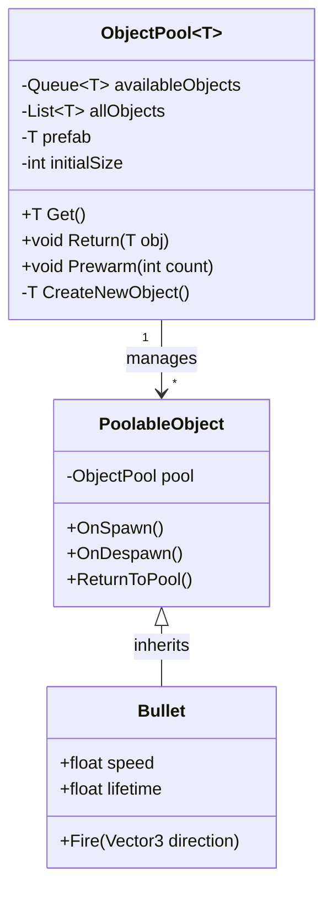

# 게임 개발자를 위한 C# 디자인 패턴: 실전 예제로 배우는 패턴의 힘  

저자: 최흥배, AI-Assisted   
    
권장 개발 환경
- **IDE**: Visual Studio 2022 이상 (Community 이상)
- **.NET**: 버전 9 이상
- **OS**: Windows 10 이상

-----  

# Chapter 3: Object Pool Pattern (오브젝트 풀 패턴)

## 게임 개발 현장에서...
슈팅 게임을 개발 중인 신입 개발자 김개발 씨는 큰 문제에 직면했다. 플레이어가 총을 쏠 때마다 총알 오브젝트를 생성하는데, 빠르게 연사하면 게임이 순간적으로 버벅거리는 현상이 발생한 것이다. 특히 보스전에서 화면에 수백 개의 총알이 날아다닐 때는 프레임 드롭이 눈에 띄게 발생했다.

프로파일러를 돌려보니 충격적인 결과가 나왔다. 메모리 할당(Allocation)이 매 프레임마다 엄청나게 발생하고 있었고, 가비지 컬렉션(GC)이 자주 실행되면서 게임이 멈칫거렸다. 

"총알 하나 만드는 게 이렇게 무거운 작업이었나...?"

## 패턴 없이 코딩하기
김개발 씨가 작성한 초기 코드는 이랬다.

```csharp
// 총알 클래스
public class Bullet : MonoBehaviour
{
    public float speed = 10f;
    public float lifetime = 3f;
    
    private void Start()
    {
        // 일정 시간 후 자동 파괴
        Destroy(gameObject, lifetime);
    }
    
    private void Update()
    {
        // 전진
        transform.Translate(Vector3.forward * speed * Time.deltaTime);
    }
}

// 플레이어 무기 시스템
public class PlayerGun : MonoBehaviour
{
    public GameObject bulletPrefab;
    public Transform firePoint;
    public float fireRate = 0.1f;
    
    private float nextFireTime = 0f;
    
    private void Update()
    {
        if (Input.GetButton("Fire1") && Time.time >= nextFireTime)
        {
            Fire();
            nextFireTime = Time.time + fireRate;
        }
    }
    
    private void Fire()
    {
        // 매번 새로운 총알 생성
        GameObject bullet = Instantiate(bulletPrefab, 
                                       firePoint.position, 
                                       firePoint.rotation);
        
        Debug.Log($"총알 생성됨! 현재 메모리 할당 발생");
    }
}

// 적 스포너 (더 심각한 경우)
public class EnemySpawner : MonoBehaviour
{
    public GameObject enemyPrefab;
    public float spawnInterval = 2f;
    
    private void Start()
    {
        InvokeRepeating(nameof(SpawnEnemy), 0f, spawnInterval);
    }
    
    private void SpawnEnemy()
    {
        // 적 생성
        GameObject enemy = Instantiate(enemyPrefab, 
                                       GetRandomPosition(), 
                                       Quaternion.identity);
    }
    
    private Vector3 GetRandomPosition()
    {
        return new Vector3(Random.Range(-10f, 10f), 0, Random.Range(-10f, 10f));
    }
}

// 적이 죽을 때
public class Enemy : MonoBehaviour
{
    public void Die()
    {
        // 이펙트 생성 후 파괴
        GameObject explosion = Instantiate(explosionPrefab, 
                                          transform.position, 
                                          Quaternion.identity);
        Destroy(explosion, 2f);
        
        // 자신도 파괴
        Destroy(gameObject);
    }
}
```

**실행 결과:**
```
프레임 1: 총알 10개 생성 -> 메모리 할당 1.2KB
프레임 2: 총알 10개 생성 -> 메모리 할당 1.2KB
...
프레임 100: 누적 할당 120KB -> GC 실행! (게임 프리즈 50ms)
프레임 101: 총알 10개 생성 -> 메모리 할당 1.2KB
...
```

## 문제점 분석

### 1. 성능 문제
```
문제 상황:
┌─────────────────────────────────────────┐
│  매 프레임마다 발생하는 일              │
├─────────────────────────────────────────┤
│  1. Instantiate() 호출 (무겁다!)        │
│     - 메모리 할당                        │
│     - 컴포넌트 초기화                    │
│     - 물리 엔진 등록                     │
│                                          │
│  2. Destroy() 호출 (역시 무겁다!)       │
│     - 메모리 해제 표시                   │
│     - 참조 정리                          │
│     - GC 대기열 추가                     │
│                                          │
│  3. 가비지 컬렉션 (게임 멈춤!)          │
│     - 50~200ms 프리즈                    │
│     - 플레이어 경험 저하                 │
└─────────────────────────────────────────┘
```

### 2. 메모리 단편화
매번 생성과 파괴를 반복하면 메모리가 조각조각 나뉘어진다(Fragmentation). 이는 결국 더 큰 메모리 문제로 이어진다.

```
메모리 상태 시각화:

초기:
[□□□□□□□□□□] - 깨끗한 메모리

10초 후:
[■□■□□■□■■□] - 조각난 메모리 (■ = 사용 중, □ = 빈 공간)
                 큰 객체를 할당하기 어려워짐!
```

### 3. 예측 불가능한 성능
GC가 언제 실행될지 모르기 때문에, 중요한 순간(보스전, 긴장감 있는 장면)에 게임이 버벅일 수 있다.

### 4. 실제 성능 수치 비교

```csharp
// 성능 테스트 코드
public class PerformanceTest : MonoBehaviour
{
    private void TestWithoutPool()
    {
        var watch = System.Diagnostics.Stopwatch.StartNew();
        
        for (int i = 0; i < 1000; i++)
        {
            GameObject obj = Instantiate(bulletPrefab);
            Destroy(obj);
        }
        
        watch.Stop();
        Debug.Log($"Without Pool: {watch.ElapsedMilliseconds}ms");
        // 결과: 약 150ms + GC 스파이크
    }
}
```
  

## 패턴 소개
**오브젝트 풀 패턴**은 미리 객체들을 생성해두고 재사용하는 패턴이다. 마치 도서관에서 책을 빌려 쓰고 반납하는 것과 같다.

### 핵심 아이디어
```
┌──────────────────────────────────────────────┐
│         Object Pool (객체 수영장)             │
├──────────────────────────────────────────────┤
│                                               │
│   [대기 중인 객체들]                          │
│   ┌───┐ ┌───┐ ┌───┐ ┌───┐ ┌───┐           │
│   │ ● │ │ ● │ │ ● │ │ ● │ │ ● │  ← 풀     │
│   └───┘ └───┘ └───┘ └───┘ └───┘           │
│     ↓                         ↑              │
│   대여(Get)              반납(Return)        │
│     ↓                         ↑              │
│   [사용 중인 객체들]                          │
│   ┌───┐ ┌───┐ ┌───┐                        │
│   │ ● │ │ ● │ │ ● │  ← 게임에서 활성화    │
│   └───┘ └───┘ └───┘                        │
│                                               │
└──────────────────────────────────────────────┘

장점:
✓ Instantiate 횟수 감소 → 성능 향상
✓ Destroy 횟수 감소 → GC 부하 감소
✓ 메모리 할당 패턴 예측 가능
✓ 일정한 프레임레이트 유지
```

### 구조 다이어그램



### 동작 흐름

```
시퀀스:

초기화 단계:
GameStart → ObjectPool.Initialize(prefab, 50개)
           ↓
         50개의 총알을 미리 생성
           ↓
         모두 비활성화 상태로 Queue에 보관
           
           
실행 단계:
Player.Fire() → Pool.Get()
                  ↓
                Queue에서 꺼내기
                  ↓
                있으면: 활성화해서 반환
                없으면: 새로 생성해서 반환
                  ↓
              총알 발사!
                  ↓
              3초 후...
                  ↓
              Bullet.ReturnToPool()
                  ↓
              비활성화 후 Queue에 반납
```

## 패턴 적용하기

### 1. 기본 오브젝트 풀 구현

```csharp
using System.Collections.Generic;
using UnityEngine;

/// <summary>
/// 제네릭 오브젝트 풀
/// 모든 종류의 게임 오브젝트를 풀링할 수 있다
/// </summary>
public class ObjectPool<T> where T : Component
{
    private readonly T prefab;
    private readonly Queue<T> availableObjects;
    private readonly Transform poolRoot;
    
    public int CountActive { get; private set; }
    public int CountInactive => availableObjects.Count;
    public int CountTotal => CountActive + CountInactive;
    
    /// <summary>
    /// 오브젝트 풀 생성자
    /// </summary>
    /// <param name="prefab">풀링할 프리팹</param>
    /// <param name="initialSize">초기 생성 개수</param>
    public ObjectPool(T prefab, int initialSize = 10)
    {
        this.prefab = prefab;
        this.availableObjects = new Queue<T>(initialSize);
        
        // 풀 관리용 부모 오브젝트 생성
        poolRoot = new GameObject($"[Pool] {prefab.name}").transform;
        
        // 미리 객체 생성 (Prewarm)
        Prewarm(initialSize);
    }
    
    /// <summary>
    /// 초기 객체 생성
    /// </summary>
    private void Prewarm(int count)
    {
        for (int i = 0; i < count; i++)
        {
            T obj = CreateNewObject();
            obj.gameObject.SetActive(false);
            availableObjects.Enqueue(obj);
        }
        
        Debug.Log($"[ObjectPool] {prefab.name} 풀 초기화 완료: {count}개 생성");
    }
    
    /// <summary>
    /// 새 객체 생성
    /// </summary>
    private T CreateNewObject()
    {
        T obj = Object.Instantiate(prefab, poolRoot);
        
        // PoolableObject 컴포넌트가 있다면 풀 참조 설정
        var poolable = obj.GetComponent<PoolableObject>();
        if (poolable != null)
        {
            poolable.SetPool(this);
        }
        
        return obj;
    }
    
    /// <summary>
    /// 풀에서 객체 가져오기
    /// </summary>
    public T Get()
    {
        T obj;
        
        if (availableObjects.Count > 0)
        {
            // 대기 중인 객체 재사용
            obj = availableObjects.Dequeue();
        }
        else
        {
            // 풀이 비었으면 새로 생성
            obj = CreateNewObject();
            Debug.LogWarning($"[ObjectPool] {prefab.name} 풀이 부족하여 추가 생성");
        }
        
        obj.gameObject.SetActive(true);
        CountActive++;
        
        // PoolableObject의 OnSpawn 호출
        var poolable = obj.GetComponent<PoolableObject>();
        poolable?.OnSpawn();
        
        return obj;
    }
    
    /// <summary>
    /// 위치와 회전을 지정하여 가져오기
    /// </summary>
    public T Get(Vector3 position, Quaternion rotation)
    {
        T obj = Get();
        obj.transform.position = position;
        obj.transform.rotation = rotation;
        return obj;
    }
    
    /// <summary>
    /// 풀에 객체 반납하기
    /// </summary>
    public void Return(T obj)
    {
        if (obj == null) return;
        
        // PoolableObject의 OnDespawn 호출
        var poolable = obj.GetComponent<PoolableObject>();
        poolable?.OnDespawn();
        
        obj.gameObject.SetActive(false);
        obj.transform.SetParent(poolRoot);
        
        availableObjects.Enqueue(obj);
        CountActive--;
    }
    
    /// <summary>
    /// 모든 활성 객체를 풀에 반납
    /// </summary>
    public void ReturnAll()
    {
        var activeObjects = new List<T>();
        
        foreach (Transform child in poolRoot)
        {
            if (child.gameObject.activeSelf)
            {
                var obj = child.GetComponent<T>();
                if (obj != null)
                {
                    activeObjects.Add(obj);
                }
            }
        }
        
        foreach (var obj in activeObjects)
        {
            Return(obj);
        }
    }
}
```

### 2. PoolableObject 베이스 클래스

```csharp
using UnityEngine;

/// <summary>
/// 풀링 가능한 객체의 베이스 클래스
/// 모든 풀링되는 객체는 이 클래스를 상속받는다
/// </summary>
public class PoolableObject : MonoBehaviour
{
    private object pool; // ObjectPool<T> 타입이지만 제네릭이라 object로 저장
    
    /// <summary>
    /// 풀 참조 설정
    /// </summary>
    public void SetPool(object pool)
    {
        this.pool = pool;
    }
    
    /// <summary>
    /// 풀에서 꺼내질 때 호출됨
    /// Awake/Start 대신 이 메서드에서 초기화를 수행한다
    /// </summary>
    public virtual void OnSpawn()
    {
        // 하위 클래스에서 오버라이드
    }
    
    /// <summary>
    /// 풀에 반납될 때 호출됨
    /// OnDestroy 대신 이 메서드에서 정리 작업을 수행한다
    /// </summary>
    public virtual void OnDespawn()
    {
        // 하위 클래스에서 오버라이드
    }
    
    /// <summary>
    /// 이 객체를 풀에 반납한다
    /// Destroy(gameObject) 대신 이 메서드를 호출한다
    /// </summary>
    public void ReturnToPool()
    {
        if (pool != null)
        {
            var method = pool.GetType().GetMethod("Return");
            method?.Invoke(pool, new object[] { this });
        }
        else
        {
            Debug.LogWarning($"{name}은 풀에 속하지 않은 객체입니다. Destroy 처리됩니다.");
            Destroy(gameObject);
        }
    }
}
```

### 3. 풀링된 총알 클래스

```csharp
using UnityEngine;

/// <summary>
/// 오브젝트 풀을 사용하는 총알
/// </summary>
public class PooledBullet : PoolableObject
{
    [Header("총알 설정")]
    public float speed = 10f;
    public float lifetime = 3f;
    public int damage = 10;
    
    [Header("이펙트")]
    public ParticleSystem trailEffect;
    
    private Vector3 direction;
    private float spawnTime;
    
    /// <summary>
    /// 풀에서 꺼내질 때 초기화
    /// </summary>
    public override void OnSpawn()
    {
        spawnTime = Time.time;
        
        // 이펙트 재생
        if (trailEffect != null)
        {
            trailEffect.Play();
        }
    }
    
    /// <summary>
    /// 풀에 반납될 때 정리
    /// </summary>
    public override void OnDespawn()
    {
        // 이펙트 정지
        if (trailEffect != null)
        {
            trailEffect.Stop();
            trailEffect.Clear();
        }
        
        // 상태 초기화
        direction = Vector3.zero;
    }
    
    /// <summary>
    /// 총알 발사
    /// </summary>
    public void Fire(Vector3 direction)
    {
        this.direction = direction.normalized;
    }
    
    private void Update()
    {
        // 이동
        transform.Translate(direction * speed * Time.deltaTime, Space.World);
        
        // 수명 체크
        if (Time.time - spawnTime >= lifetime)
        {
            ReturnToPool(); // Destroy 대신 풀에 반납!
        }
    }
    
    private void OnTriggerEnter(Collider other)
    {
        // 적과 충돌
        if (other.CompareTag("Enemy"))
        {
            var enemy = other.GetComponent<Enemy>();
            if (enemy != null)
            {
                enemy.TakeDamage(damage);
            }
            
            // 충돌 후 풀에 반납
            ReturnToPool();
        }
    }
}
```

### 4. 풀을 사용하는 무기 시스템

```csharp
using UnityEngine;

/// <summary>
/// 오브젝트 풀을 사용하는 총
/// </summary>
public class PooledGun : MonoBehaviour
{
    [Header("총알 설정")]
    public PooledBullet bulletPrefab;
    public Transform firePoint;
    public int poolSize = 50; // 미리 생성할 총알 개수
    
    [Header("발사 설정")]
    public float fireRate = 0.1f;
    public float bulletSpeed = 20f;
    
    private ObjectPool<PooledBullet> bulletPool;
    private float nextFireTime = 0f;
    
    private void Awake()
    {
        // 총알 풀 초기화
        bulletPool = new ObjectPool<PooledBullet>(bulletPrefab, poolSize);
        
        Debug.Log($"총알 풀 준비 완료: {poolSize}개");
    }
    
    private void Update()
    {
        if (Input.GetButton("Fire1") && Time.time >= nextFireTime)
        {
            Fire();
            nextFireTime = Time.time + fireRate;
        }
        
        // 디버그 정보 표시
        if (Input.GetKeyDown(KeyCode.P))
        {
            PrintPoolStats();
        }
    }
    
    /// <summary>
    /// 총알 발사
    /// </summary>
    private void Fire()
    {
        // 풀에서 총알 가져오기 (Instantiate 대신!)
        PooledBullet bullet = bulletPool.Get(
            firePoint.position,
            firePoint.rotation
        );
        
        // 총알 초기화
        bullet.speed = bulletSpeed;
        bullet.Fire(firePoint.forward);
        
        // 총 반동, 사운드 등의 이펙트
        PlayFireEffect();
    }
    
    private void PlayFireEffect()
    {
        // 총구 이펙트, 사운드 재생 등
    }
    
    /// <summary>
    /// 풀 상태 출력
    /// </summary>
    private void PrintPoolStats()
    {
        Debug.Log($"====== 총알 풀 상태 ======");
        Debug.Log($"활성 총알: {bulletPool.CountActive}개");
        Debug.Log($"대기 총알: {bulletPool.CountInactive}개");
        Debug.Log($"전체 총알: {bulletPool.CountTotal}개");
        Debug.Log($"=======================");
    }
    
    private void OnDestroy()
    {
        // 게임 종료 시 모든 총알 회수
        bulletPool?.ReturnAll();
    }
}
```

### 5. 범용 오브젝트 풀 매니저

```csharp
using System.Collections.Generic;
using UnityEngine;

/// <summary>
/// 여러 종류의 풀을 관리하는 싱글톤 매니저
/// 게임 전체에서 사용하는 풀들을 중앙에서 관리한다
/// </summary>
public class ObjectPoolManager : MonoBehaviour
{
    private static ObjectPoolManager instance;
    public static ObjectPoolManager Instance
    {
        get
        {
            if (instance == null)
            {
                instance = FindObjectOfType<ObjectPoolManager>();
                
                if (instance == null)
                {
                    GameObject go = new GameObject("ObjectPoolManager");
                    instance = go.AddComponent<ObjectPoolManager>();
                }
            }
            return instance;
        }
    }
    
    // 풀 설정 정보
    [System.Serializable]
    public class PoolInfo
    {
        public string poolName;
        public GameObject prefab;
        public int initialSize = 10;
        public bool expandable = true; // 부족하면 자동으로 늘릴지 여부
    }
    
    [Header("풀 설정")]
    public List<PoolInfo> pools = new List<PoolInfo>();
    
    // 실제 풀들을 저장하는 딕셔너리
    private Dictionary<string, ObjectPool<PoolableObject>> poolDictionary;
    
    private void Awake()
    {
        if (instance != null && instance != this)
        {
            Destroy(gameObject);
            return;
        }
        
        instance = this;
        DontDestroyOnLoad(gameObject);
        
        InitializePools();
    }
    
    /// <summary>
    /// 모든 풀 초기화
    /// </summary>
    private void InitializePools()
    {
        poolDictionary = new Dictionary<string, ObjectPool<PoolableObject>>();
        
        foreach (var poolInfo in pools)
        {
            var poolable = poolInfo.prefab.GetComponent<PoolableObject>();
            if (poolable == null)
            {
                Debug.LogError($"{poolInfo.prefab.name}에 PoolableObject 컴포넌트가 없습니다!");
                continue;
            }
            
            var pool = new ObjectPool<PoolableObject>(poolable, poolInfo.initialSize);
            poolDictionary.Add(poolInfo.poolName, pool);
        }
        
        Debug.Log($"[ObjectPoolManager] {poolDictionary.Count}개의 풀 초기화 완료");
    }
    
    /// <summary>
    /// 풀에서 객체 가져오기
    /// </summary>
    public T Spawn<T>(string poolName) where T : PoolableObject
    {
        if (!poolDictionary.ContainsKey(poolName))
        {
            Debug.LogError($"풀 '{poolName}'을(를) 찾을 수 없습니다!");
            return null;
        }
        
        var obj = poolDictionary[poolName].Get();
        return obj as T;
    }
    
    /// <summary>
    /// 위치와 회전을 지정하여 가져오기
    /// </summary>
    public T Spawn<T>(string poolName, Vector3 position, Quaternion rotation) where T : PoolableObject
    {
        T obj = Spawn<T>(poolName);
        if (obj != null)
        {
            obj.transform.position = position;
            obj.transform.rotation = rotation;
        }
        return obj;
    }
    
    /// <summary>
    /// 풀에 객체 반납하기
    /// </summary>
    public void Despawn(PoolableObject obj)
    {
        obj.ReturnToPool();
    }
    
    /// <summary>
    /// 특정 풀의 모든 객체 반납
    /// </summary>
    public void DespawnAll(string poolName)
    {
        if (poolDictionary.ContainsKey(poolName))
        {
            poolDictionary[poolName].ReturnAll();
        }
    }
}
```

### 6. 사용 예제 - 적 스포너

```csharp
using UnityEngine;

/// <summary>
/// 오브젝트 풀을 사용하는 적 스포너
/// </summary>
public class PooledEnemySpawner : MonoBehaviour
{
    [Header("스폰 설정")]
    public string enemyPoolName = "Enemy";
    public float spawnInterval = 2f;
    public int maxEnemies = 20;
    
    [Header("스폰 영역")]
    public Vector3 spawnAreaSize = new Vector3(20, 0, 20);
    
    private float nextSpawnTime;
    private int currentEnemyCount = 0;
    
    private void Update()
    {
        if (Time.time >= nextSpawnTime && currentEnemyCount < maxEnemies)
        {
            SpawnEnemy();
            nextSpawnTime = Time.time + spawnInterval;
        }
    }
    
    private void SpawnEnemy()
    {
        Vector3 spawnPos = GetRandomPosition();
        
        // 풀에서 적 가져오기
        var enemy = ObjectPoolManager.Instance.Spawn<PoolableObject>(
            enemyPoolName,
            spawnPos,
            Quaternion.identity
        );
        
        if (enemy != null)
        {
            currentEnemyCount++;
            Debug.Log($"적 스폰: {currentEnemyCount}/{maxEnemies}");
        }
    }
    
    private Vector3 GetRandomPosition()
    {
        float x = Random.Range(-spawnAreaSize.x / 2, spawnAreaSize.x / 2);
        float z = Random.Range(-spawnAreaSize.z / 2, spawnAreaSize.z / 2);
        return transform.position + new Vector3(x, 0, z);
    }
    
    /// <summary>
    /// 적이 죽었을 때 호출됨
    /// </summary>
    public void OnEnemyDied()
    {
        currentEnemyCount--;
    }
    
    private void OnDrawGizmosSelected()
    {
        // 스폰 영역 시각화
        Gizmos.color = Color.yellow;
        Gizmos.DrawWireCube(transform.position, spawnAreaSize);
    }
}
```

## Before/After 비교

### 성능 비교표

```
┌──────────────────────────────────────────────────────────┐
│              패턴 미사용 vs 패턴 사용 비교                │
├──────────────────────────────────────────────────────────┤
│ 항목                │ Before         │ After            │
├─────────────────────┼────────────────┼──────────────────┤
│ 총알 100개 생성     │ 15ms           │ 0.5ms (30배↑)   │
│ 메모리 할당         │ 프레임마다     │ 초기화 시 1회    │
│ GC 발생 빈도        │ 5초마다        │ 거의 없음        │
│ GC 소요 시간        │ 50-200ms       │ <10ms            │
│ 평균 FPS            │ 45 (불안정)    │ 60 (안정적)      │
│ 최저 FPS            │ 15 (심각)      │ 58 (양호)        │
│ 메모리 사용량       │ 불규칙         │ 일정             │
└──────────────────────────────────────────────────────────┘
```

### 코드 비교

**Before (패턴 미사용):**
```csharp
// 발사할 때마다 생성
GameObject bullet = Instantiate(bulletPrefab, pos, rot);

// 3초 후 파괴
Destroy(bullet, 3f);

// 문제점:
// ❌ 매번 메모리 할당
// ❌ GC 발생
// ❌ 성능 저하
// ❌ 프레임 드롭
```

**After (패턴 사용):**
```csharp
// 풀에서 가져오기 (재사용)
PooledBullet bullet = bulletPool.Get(pos, rot);

// 3초 후 풀에 반납 (파괴 아님!)
StartCoroutine(ReturnAfterDelay(bullet, 3f));

IEnumerator ReturnAfterDelay(PooledBullet bullet, float delay)
{
    yield return new WaitForSeconds(delay);
    bullet.ReturnToPool();
}

// 장점:
// ✓ 메모리 재사용
// ✓ GC 최소화
// ✓ 성능 향상
// ✓ 안정적인 FPS
```

### 메모리 사용 패턴

```
Before (패턴 미사용):
Memory
  ↑
  │     ╱╲      ╱╲      ╱╲
  │    ╱  ╲    ╱  ╲    ╱  ╲     ← GC가 반복적으로 실행됨
  │   ╱    ╲  ╱    ╲  ╱    ╲
  │  ╱      ╲╱      ╲╱      ╲
  └──────────────────────────────→ Time
     할당   GC  할당   GC  할당


After (패턴 사용):
Memory
  ↑
  │  ┌────────────────────────────   ← 안정적인 메모리 사용
  │  │
  │  │
  │  │
  │  │
  └──────────────────────────────────→ Time
     초기화 후 메모리 사용량 일정
```

## 실전 팁

### 1. 풀 크기 결정하기

```csharp
/// <summary>
/// 적절한 풀 크기를 계산하는 도우미 클래스
/// </summary>
public static class PoolSizeCalculator
{
    /// <summary>
    /// 초당 사용량 기반으로 풀 크기 계산
    /// </summary>
    public static int CalculatePoolSize(float spawnPerSecond, float lifetime, float safetyMargin = 1.5f)
    {
        // 예: 초당 10개 생성, 수명 3초 → 최대 30개 필요
        // 여유분 50%를 더하면 45개
        int baseSize = Mathf.CeilToInt(spawnPerSecond * lifetime);
        int finalSize = Mathf.CeilToInt(baseSize * safetyMargin);
        
        return finalSize;
    }
}

// 사용 예:
// 초당 10발, 수명 3초인 총알
int bulletPoolSize = PoolSizeCalculator.CalculatePoolSize(10f, 3f);
// 결과: 45개
```

### 2. 풀 모니터링

```csharp
/// <summary>
/// 풀 상태를 UI에 표시하는 디버그 도구
/// </summary>
public class PoolDebugger : MonoBehaviour
{
    public ObjectPool<PoolableObject> poolToMonitor;
    
    private void OnGUI()
    {
        if (poolToMonitor == null) return;
        
        GUILayout.BeginArea(new Rect(10, 10, 300, 100));
        GUILayout.Box("Object Pool Stats");
        
        GUILayout.Label($"Active: {poolToMonitor.CountActive}");
        GUILayout.Label($"Inactive: {poolToMonitor.CountInactive}");
        GUILayout.Label($"Total: {poolToMonitor.CountTotal}");
        
        // 사용률 표시
        float usage = (float)poolToMonitor.CountActive / poolToMonitor.CountTotal;
        GUILayout.HorizontalSlider(usage, 0f, 1f);
        GUILayout.Label($"Usage: {usage:P0}");
        
        // 경고 표시
        if (usage > 0.9f)
        {
            GUI.color = Color.red;
            GUILayout.Label("⚠ Pool almost full!");
            GUI.color = Color.white;
        }
        
        GUILayout.EndArea();
    }
}
```

### 3. 자동 확장 풀

```csharp
/// <summary>
/// 필요시 자동으로 크기가 늘어나는 풀
/// </summary>
public class ExpandableObjectPool<T> : ObjectPool<T> where T : Component
{
    private readonly int expandSize;
    private readonly int maxSize;
    
    public ExpandableObjectPool(T prefab, int initialSize = 10, int expandSize = 5, int maxSize = 100)
        : base(prefab, initialSize)
    {
        this.expandSize = expandSize;
        this.maxSize = maxSize;
    }
    
    public new T Get()
    {
        // 풀이 비었고, 최대 크기에 도달하지 않았다면
        if (CountInactive == 0 && CountTotal < maxSize)
        {
            Debug.Log($"[Pool] 풀 확장: +{expandSize}개 (현재: {CountTotal}/{maxSize})");
            Prewarm(expandSize);
        }
        
        return base.Get();
    }
}
```

### 4. 다양한 객체 풀링 예제

```csharp
/// <summary>
/// 파티클 이펙트 풀
/// </summary>
public class ParticleEffectPool : MonoBehaviour
{
    public ParticleSystem explosionPrefab;
    public int poolSize = 20;
    
    private ObjectPool<ParticleSystem> pool;
    
    private void Awake()
    {
        var poolableExplosion = explosionPrefab.gameObject.AddComponent<PoolableParticle>();
        pool = new ObjectPool<ParticleSystem>(explosionPrefab, poolSize);
    }
    
    public void PlayExplosion(Vector3 position)
    {
        var explosion = pool.Get(position, Quaternion.identity);
        explosion.Play();
        
        // 파티클이 끝나면 자동으로 반납
        StartCoroutine(ReturnWhenFinished(explosion));
    }
    
    private IEnumerator ReturnWhenFinished(ParticleSystem particle)
    {
        yield return new WaitWhile(() => particle.isPlaying);
        pool.Return(particle);
    }
}

/// <summary>
/// 파티클 시스템용 풀러블 컴포넌트
/// </summary>
public class PoolableParticle : PoolableObject
{
    private ParticleSystem particles;
    
    private void Awake()
    {
        particles = GetComponent<ParticleSystem>();
    }
    
    public override void OnSpawn()
    {
        particles.Clear();
        particles.time = 0;
    }
    
    public override void OnDespawn()
    {
        particles.Stop();
        particles.Clear();
    }
}
```

### 5. 실전 최적화 팁

```
풀 크기 결정 가이드:
┌────────────────────────────────────────┐
│ 객체 타입        │ 권장 풀 크기       │
├──────────────────┼────────────────────┤
│ 총알 (빠른 발사) │ 50-100개           │
│ 적 캐릭터        │ 20-30개            │
│ 파티클 이펙트    │ 30-50개            │
│ UI 아이템 슬롯   │ 고정 크기 (20-50)  │
│ 데미지 텍스트    │ 20-30개            │
└────────────────────────────────────────┘

체크리스트:
□ 풀 크기는 최대 동시 사용량의 1.5배로 설정했는가?
□ 자주 사용되는 객체만 풀링했는가?
□ OnSpawn/OnDespawn에서 완전히 초기화되는가?
□ 풀 사용률을 모니터링하고 있는가?
□ 메모리 프로파일러로 GC가 줄었는지 확인했는가?
```

## 성능 측정

실제로 성능 향상을 측정하는 방법이다.

```csharp
using UnityEngine;
using UnityEngine.Profiling;

/// <summary>
/// 오브젝트 풀 성능 벤치마크
/// </summary>
public class PoolBenchmark : MonoBehaviour
{
    public GameObject bulletPrefab;
    public int testCount = 1000;
    
    [ContextMenu("Run Benchmark")]
    public void RunBenchmark()
    {
        Debug.Log("====== 벤치마크 시작 ======");
        
        // Without Pool
        TestWithoutPool();
        
        // 잠시 대기 (GC가 실행되도록)
        System.GC.Collect();
        
        // With Pool
        TestWithPool();
        
        Debug.Log("====== 벤치마크 완료 ======");
    }
    
    private void TestWithoutPool()
    {
        Debug.Log("\n[Without Pool Test]");
        
        long memoryBefore = Profiler.GetTotalAllocatedMemoryLong();
        var watch = System.Diagnostics.Stopwatch.StartNew();
        
        for (int i = 0; i < testCount; i++)
        {
            GameObject obj = Instantiate(bulletPrefab);
            Destroy(obj);
        }
        
        watch.Stop();
        long memoryAfter = Profiler.GetTotalAllocatedMemoryLong();
        
        Debug.Log($"시간: {watch.ElapsedMilliseconds}ms");
        Debug.Log($"메모리 할당: {(memoryAfter - memoryBefore) / 1024}KB");
        Debug.Log($"객체당 평균: {(float)watch.ElapsedMilliseconds / testCount:F3}ms");
    }
    
    private void TestWithPool()
    {
        Debug.Log("\n[With Pool Test]");
        
        var poolable = bulletPrefab.AddComponent<PoolableObject>();
        var pool = new ObjectPool<PoolableObject>(poolable, testCount);
        
        long memoryBefore = Profiler.GetTotalAllocatedMemoryLong();
        var watch = System.Diagnostics.Stopwatch.StartNew();
        
        for (int i = 0; i < testCount; i++)
        {
            var obj = pool.Get();
            pool.Return(obj);
        }
        
        watch.Stop();
        long memoryAfter = Profiler.GetTotalAllocatedMemoryLong();
        
        Debug.Log($"시간: {watch.ElapsedMilliseconds}ms");
        Debug.Log($"메모리 할당: {(memoryAfter - memoryBefore) / 1024}KB");
        Debug.Log($"객체당 평균: {(float)watch.ElapsedMilliseconds / testCount:F3}ms");
    }
}
```

**실행 결과 예시:**
```
====== 벤치마크 시작 ======

[Without Pool Test]
시간: 152ms
메모리 할당: 1234KB
객체당 평균: 0.152ms

[With Pool Test]
시간: 5ms
메모리 할당: 12KB
객체당 평균: 0.005ms

====== 벤치마크 완료 ======

개선 효과:
✓ 속도: 30배 향상 (152ms → 5ms)
✓ 메모리: 100배 절감 (1234KB → 12KB)
```

## 연습 문제

### 문제 1: 기본 풀 구현
```
다음 요구사항을 만족하는 코인 풀링 시스템을 만들어보라.

요구사항:
1. Coin 프리팹이 화면에 떨어진다
2. 플레이어가 먹으면 사라진다
3. 매 초 5개씩 생성된다
4. 최대 50개까지 동시에 존재할 수 있다
5. 오브젝트 풀을 사용하여 구현한다

힌트:
- PoolableObject를 상속받는 Coin 클래스를 만든다
- CoinSpawner에서 ObjectPool을 사용한다
- 플레이어와 충돌 시 ReturnToPool()을 호출한다
```

### 문제 2: 풀 크기 최적화
```
다음 상황에서 적절한 풀 크기를 계산하라.

상황:
- 적이 초당 3발의 총알을 발사한다
- 총알의 수명은 5초이다
- 동시에 10마리의 적이 있다

질문:
1. 최소 필요한 풀 크기는?
2. 여유분 50%를 더하면?
3. 만약 적이 20마리로 늘어난다면?
```

**정답:**
```
1. 최소 크기 = 3발/초 × 5초 × 10마리 = 150개
2. 여유분 포함 = 150 × 1.5 = 225개
3. 적 20마리 = 3 × 5 × 20 × 1.5 = 450개
```

### 문제 3: 성능 측정
```
자신의 게임에서 다음을 비교 측정하라.

Before (풀 미사용):
1. 프로파일러를 열고 GC Alloc 수치를 기록한다
2. 1분간 플레이하며 평균 FPS를 측정한다
3. GC 발생 횟수와 최대 스파이크 시간을 기록한다

After (풀 사용):
1. 동일한 조건으로 측정한다
2. 개선된 수치를 비교한다

보고서를 작성하라:
- GC Alloc 감소율: ?%
- 평균 FPS 향상: ?
- GC 스파이크 감소: ?ms → ?ms
```

### 문제 4: 고급 - 다중 풀 관리
```
다음 기능을 가진 AdvancedPoolManager를 구현하라.

기능:
1. 여러 종류의 풀을 관리할 수 있다
2. 런타임에 새 풀을 추가할 수 있다
3. 모든 풀의 통계를 한눈에 볼 수 있다
4. 사용률이 90%를 넘으면 자동으로 경고한다
5. 에디터에서 각 풀의 상태를 시각화한다

보너스:
- 풀별 사용 히스토리 그래프를 그린다
- CSV 파일로 통계를 내보낸다
```

## 마무리

오브젝트 풀 패턴은 게임 개발에서 가장 중요한 최적화 기법 중 하나다. 특히 다음과 같은 상황에서 필수적이다.

**반드시 사용해야 하는 경우:**
- 초당 수십 개 이상 생성되는 객체 (총알, 파티클)
- 수명이 짧은 객체 (이펙트, 데미지 텍스트)
- 모바일 게임 (메모리와 성능이 제한적)
- 대규모 전투 씬 (많은 적, 투사체)

**핵심 기억 사항:**
```
┌─────────────────────────────────────┐
│  오브젝트 풀의 핵심 원리             │
├─────────────────────────────────────┤
│  1. 미리 만들어 둔다 (Prewarm)       │
│  2. 빌려 쓴다 (Get)                  │
│  3. 돌려준다 (Return)                │
│  4. 파괴하지 않는다 (No Destroy!)    │
└─────────────────────────────────────┘
```

다음 장에서는 Unity의 핵심인 **Component Pattern**을 배워, 게임 오브젝트를 모듈화하는 방법을 알아본다. 오브젝트 풀과 컴포넌트 패턴을 함께 사용하면 강력하고 유연한 게임 시스템을 만들 수 있다.  
