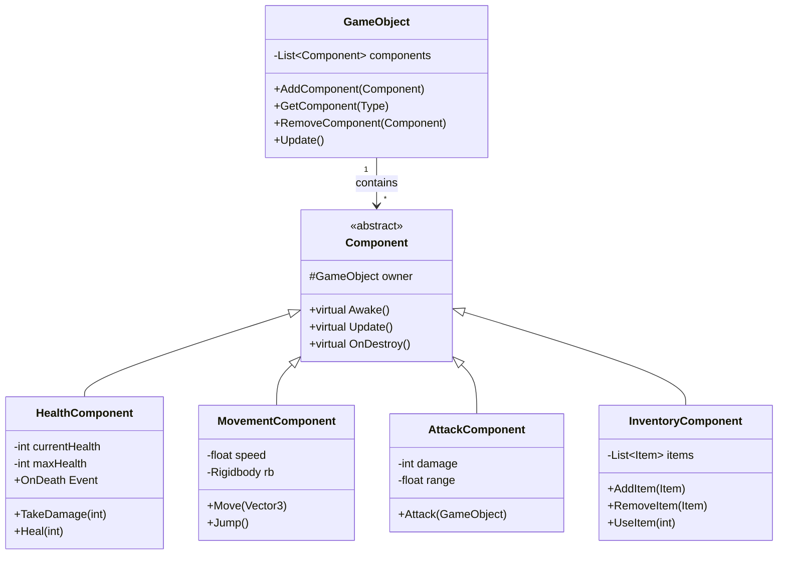

# 게임 개발자를 위한 C# 디자인 패턴: 실전 예제로 배우는 패턴의 힘  

저자: 최흥배, AI-Assisted   
    
권장 개발 환경
- **IDE**: Visual Studio 2022 이상 (Community 이상)
- **.NET**: 버전 9 이상
- **OS**: Windows 10 이상

-----  
  
# Chapter 4: Component Pattern (컴포넌트 패턴)

## 게임 개발 현장에서...
중급 개발자 박게임 씨는 RPG 게임의 캐릭터 시스템을 개발 중이었다. 처음에는 간단했던 Player 클래스가 점점 비대해지기 시작했다.

"플레이어가 움직일 수 있어야 하고... HP도 있어야 하고... 공격도 해야 하고... 인벤토리도 필요하고... 스킬도... 퀘스트도... 업적도..."

한 달 후, Player.cs 파일은 2000줄이 넘어갔다. 새로운 기능을 추가하려면 이 거대한 파일을 스크롤하며 어디에 코드를 추가해야 할지 찾아야 했다. 더 심각한 문제는 적(Enemy) 캐릭터도 비슷한 기능이 필요한데, Player 코드를 복사-붙여넣기 하다 보니 두 클래스가 동시에 비대해졌다는 것이다.

"분명히 더 나은 방법이 있을 텐데..."

박게임 씨는 Unity 엔진 자체가 어떻게 동작하는지 다시 살펴보았다. 그리고 깨달았다. Unity는 이미 완벽한 해답을 제시하고 있었다.

"GameObject + Component 구조! 이게 바로 Component Pattern이었구나!"

## 패턴 없이 코딩하기
박게임 씨가 처음 작성한 거대한 Player 클래스는 다음과 같았다.

```csharp
/// <summary>
/// 모든 기능이 하나로 뭉쳐진 거대한 플레이어 클래스
/// </summary>
public class Player : MonoBehaviour
{
    // ===== 이동 관련 =====
    public float moveSpeed = 5f;
    public float jumpForce = 10f;
    private Rigidbody rb;
    private bool isGrounded;
    
    // ===== 체력 관련 =====
    public int maxHealth = 100;
    private int currentHealth;
    public bool isDead;
    
    // ===== 전투 관련 =====
    public int attackDamage = 10;
    public float attackRange = 2f;
    public float attackCooldown = 1f;
    private float lastAttackTime;
    public GameObject weapon;
    
    // ===== 인벤토리 관련 =====
    public List<Item> inventory = new List<Item>();
    public int maxInventorySize = 20;
    
    // ===== 스킬 관련 =====
    public List<Skill> skills = new List<Skill>();
    public int currentMana;
    public int maxMana = 50;
    
    // ===== 퀘스트 관련 =====
    public List<Quest> activeQuests = new List<Quest>();
    public List<Quest> completedQuests = new List<Quest>();
    
    // ===== 레벨/경험치 =====
    public int level = 1;
    public int currentExp = 0;
    public int expToNextLevel = 100;
    
    // ===== 애니메이션 =====
    private Animator animator;
    
    // ===== UI 관련 =====
    public HealthBar healthBar;
    public ManaBar manaBar;
    
    private void Start()
    {
        rb = GetComponent<Rigidbody>();
        animator = GetComponent<Animator>();
        currentHealth = maxHealth;
        currentMana = maxMana;
        
        healthBar.SetMaxHealth(maxHealth);
        manaBar.SetMaxMana(maxMana);
    }
    
    private void Update()
    {
        HandleMovement();
        HandleJump();
        HandleAttack();
        HandleSkills();
        CheckQuestProgress();
        UpdateAnimations();
    }
    
    // ===== 이동 메서드들 =====
    private void HandleMovement()
    {
        float horizontal = Input.GetAxis("Horizontal");
        float vertical = Input.GetAxis("Vertical");
        
        Vector3 movement = new Vector3(horizontal, 0, vertical) * moveSpeed;
        rb.velocity = new Vector3(movement.x, rb.velocity.y, movement.z);
        
        if (movement != Vector3.zero)
        {
            transform.rotation = Quaternion.LookRotation(movement);
        }
    }
    
    private void HandleJump()
    {
        if (Input.GetKeyDown(KeyCode.Space) && isGrounded)
        {
            rb.AddForce(Vector3.up * jumpForce, ForceMode.Impulse);
        }
    }
    
    // ===== 전투 메서드들 =====
    private void HandleAttack()
    {
        if (Input.GetMouseButtonDown(0) && Time.time >= lastAttackTime + attackCooldown)
        {
            PerformAttack();
            lastAttackTime = Time.time;
        }
    }
    
    private void PerformAttack()
    {
        Collider[] hitEnemies = Physics.OverlapSphere(
            transform.position + transform.forward * attackRange,
            attackRange
        );
        
        foreach (var hit in hitEnemies)
        {
            Enemy enemy = hit.GetComponent<Enemy>();
            if (enemy != null)
            {
                enemy.TakeDamage(attackDamage);
            }
        }
        
        animator.SetTrigger("Attack");
    }
    
    // ===== 체력 메서드들 =====
    public void TakeDamage(int damage)
    {
        if (isDead) return;
        
        currentHealth -= damage;
        healthBar.SetHealth(currentHealth);
        
        if (currentHealth <= 0)
        {
            Die();
        }
        
        animator.SetTrigger("Hit");
    }
    
    private void Die()
    {
        isDead = true;
        animator.SetBool("IsDead", true);
        // 사망 처리...
    }
    
    public void Heal(int amount)
    {
        currentHealth = Mathf.Min(currentHealth + amount, maxHealth);
        healthBar.SetHealth(currentHealth);
    }
    
    // ===== 스킬 메서드들 =====
    private void HandleSkills()
    {
        if (Input.GetKeyDown(KeyCode.Q))
        {
            UseSkill(0);
        }
        else if (Input.GetKeyDown(KeyCode.W))
        {
            UseSkill(1);
        }
        else if (Input.GetKeyDown(KeyCode.E))
        {
            UseSkill(2);
        }
    }
    
    private void UseSkill(int index)
    {
        if (index >= skills.Count) return;
        
        Skill skill = skills[index];
        if (currentMana >= skill.manaCost)
        {
            skill.Execute(this);
            currentMana -= skill.manaCost;
            manaBar.SetMana(currentMana);
        }
    }
    
    // ===== 인벤토리 메서드들 =====
    public bool AddItem(Item item)
    {
        if (inventory.Count >= maxInventorySize)
        {
            return false;
        }
        
        inventory.Add(item);
        return true;
    }
    
    public void UseItem(int index)
    {
        if (index < 0 || index >= inventory.Count) return;
        
        Item item = inventory[index];
        item.Use(this);
        inventory.RemoveAt(index);
    }
    
    // ===== 퀘스트 메서드들 =====
    private void CheckQuestProgress()
    {
        foreach (Quest quest in activeQuests)
        {
            quest.CheckProgress(this);
            
            if (quest.IsCompleted())
            {
                CompleteQuest(quest);
            }
        }
    }
    
    private void CompleteQuest(Quest quest)
    {
        activeQuests.Remove(quest);
        completedQuests.Add(quest);
        GainExp(quest.expReward);
    }
    
    // ===== 레벨 메서드들 =====
    private void GainExp(int exp)
    {
        currentExp += exp;
        
        while (currentExp >= expToNextLevel)
        {
            LevelUp();
        }
    }
    
    private void LevelUp()
    {
        level++;
        currentExp -= expToNextLevel;
        expToNextLevel = (int)(expToNextLevel * 1.5f);
        
        maxHealth += 10;
        currentHealth = maxHealth;
        maxMana += 5;
        currentMana = maxMana;
        
        healthBar.SetMaxHealth(maxHealth);
        manaBar.SetMaxMana(maxMana);
    }
    
    // ===== 애니메이션 =====
    private void UpdateAnimations()
    {
        float speed = rb.velocity.magnitude;
        animator.SetFloat("Speed", speed);
        animator.SetBool("IsGrounded", isGrounded);
    }
    
    // ... 그리고 더 많은 메서드들 ...
    // (저장/로드, 상태이상, 버프/디버프, 파티 시스템 등등)
}
```

이 코드는 끝이 없다. Enemy 클래스도 거의 동일한 구조로 2000줄이다.

```csharp
/// <summary>
/// Player와 거의 똑같이 비대한 Enemy 클래스
/// </summary>
public class Enemy : MonoBehaviour
{
    // Player와 거의 동일한 필드들...
    // 90%의 코드가 중복됨!
    
    // 차이점: AI 로직만 추가됨
    private void AI_Update()
    {
        // AI 행동...
    }
}
```

## 문제점 분석

### 1. 거대한 클래스 (God Object)

```
Player.cs 구조:

┌────────────────────────────────────────┐
│            Player (2000줄)             │
├────────────────────────────────────────┤
│ 이동 (200줄)                            │
│ 전투 (300줄)                            │
│ 체력 (150줄)                            │
│ 인벤토리 (250줄)                        │
│ 스킬 (200줄)                            │
│ 퀘스트 (300줄)                          │
│ 레벨/경험치 (200줄)                     │
│ 애니메이션 (100줄)                      │
│ UI 연동 (150줄)                         │
│ 저장/로드 (150줄)                       │
└────────────────────────────────────────┘

문제점:
❌ 한 파일이 너무 길어서 찾기 어렵다
❌ 한 기능을 수정하면 다른 기능이 깨진다
❌ 테스트하기 어렵다
❌ 여러 명이 동시에 작업할 수 없다
❌ 재사용이 불가능하다
```

### 2. 코드 중복
Player와 Enemy가 90%의 코드를 공유하지만, 상속으로 해결하면 더 복잡해진다.

```csharp
// 상속으로 해결하려고 하면...
public class Character : MonoBehaviour
{
    // 공통 기능 (1500줄)
}

public class Player : Character
{
    // 플레이어 전용 (500줄)
}

public class Enemy : Character
{
    // 적 전용 (500줄)
}

// 문제: Character가 또 거대해진다!
// 그리고 NPC는? 몬스터는? 보스는?
// 모두 Character를 상속받아야 하나?
```

### 3. 유연성 부족
새로운 기능을 추가하기 어렵다.

```
시나리오: "플레이어가 날 수 있게 해주세요"

현재 구조에서:
1. Player 클래스 열기
2. 2000줄 중에서 적절한 위치 찾기
3. 날기 관련 필드 추가 (어디에?)
4. 날기 관련 메서드 추가 (어디에?)
5. Update()에 HandleFly() 추가
6. 다른 기능과 충돌 발생 (점프와 날기가 동시에?)
7. 디버깅... 🔥

결과: 3일 소요, 버그 10개 발생
```

### 4. 재사용 불가능

```
시나리오: "NPC도 인벤토리를 가질 수 있게 해주세요"

현재 구조에서:
- Player의 인벤토리 코드를 복사-붙여넣기?
  → 중복 코드 발생
  
- Player를 상속받기?
  → NPC가 점프, 전투 등 불필요한 기능까지 가지게 됨
  
- 처음부터 다시 작성?
  → 시간 낭비, 일관성 없음
```

### 5. 테스트의 악몽

```csharp
// 인벤토리 기능만 테스트하고 싶은데...
[Test]
public void TestInventory()
{
    Player player = new Player();
    // 문제: Player를 생성하려면
    // Rigidbody, Animator, HealthBar, ManaBar 등
    // 모든 의존성을 설정해야 함!
    
    player.rb = ...
    player.animator = ...
    player.healthBar = ...
    // ... 50줄의 초기화 코드 ...
    
    // 겨우 인벤토리 테스트 시작
    player.AddItem(new Item("포션"));
}
```
  

## 패턴 소개
**Component Pattern**은 하나의 거대한 클래스를 여러 개의 작고 독립적인 컴포넌트로 분해하는 패턴이다. Unity는 이 패턴을 엔진의 핵심 설계로 채택했다.

### 핵심 아이디어

```
Before (상속 중심):
        GameObject
            ↑
      ┌─────┴─────┐
   Player       Enemy
   (2000줄)    (2000줄)


After (컴포넌트 중심):
        GameObject
            ↓
    ┌───────┼───────┬───────┬────────┐
    │       │       │       │        │
  Health Movement Attack Inventory Animation
  (100줄) (150줄) (120줄) (200줄)  (80줄)

장점:
✓ 각 컴포넌트는 한 가지 역할만 담당
✓ 독립적으로 개발/테스트 가능
✓ 자유롭게 조합 가능
✓ 재사용 가능
```

### 구조 다이어그램



### Unity의 컴포넌트 시스템
Unity는 이미 완벽한 Component Pattern을 구현하고 있다.

```
Unity GameObject 구조:

GameObject: "Player"
├─ Transform (필수)
├─ SpriteRenderer
├─ Rigidbody2D
├─ BoxCollider2D
├─ PlayerController (우리가 만든 스크립트)
└─ AudioSource

각 컴포넌트는:
✓ 독립적으로 동작
✓ GetComponent<T>()로 접근
✓ 런타임에 추가/제거 가능
✓ Inspector에서 조합 가능
```
  

## 패턴 적용하기

### 1. Component 베이스 클래스

```csharp
using UnityEngine;

/// <summary>
/// 모든 게임 컴포넌트의 베이스 클래스
/// Unity의 MonoBehaviour와 유사하지만 더 명확한 구조를 제공한다
/// </summary>
public abstract class GameComponent : MonoBehaviour
{
    /// <summary>
    /// 이 컴포넌트가 속한 게임 엔티티
    /// </summary>
    protected GameEntity Entity { get; private set; }
    
    /// <summary>
    /// 컴포넌트가 활성화되었는지 여부
    /// </summary>
    public bool IsEnabled { get; private set; } = true;
    
    /// <summary>
    /// 컴포넌트 초기화
    /// Awake 대신 사용한다
    /// </summary>
    public virtual void Initialize(GameEntity entity)
    {
        Entity = entity;
        OnInitialize();
    }
    
    /// <summary>
    /// 초기화 시 호출됨 (오버라이드 가능)
    /// </summary>
    protected virtual void OnInitialize() { }
    
    /// <summary>
    /// 매 프레임 업데이트
    /// </summary>
    public virtual void OnUpdate(float deltaTime) { }
    
    /// <summary>
    /// 컴포넌트 활성화
    /// </summary>
    public virtual void Enable()
    {
        IsEnabled = true;
        OnEnable();
    }
    
    /// <summary>
    /// 컴포넌트 비활성화
    /// </summary>
    public virtual void Disable()
    {
        IsEnabled = false;
        OnDisable();
    }
    
    /// <summary>
    /// 활성화 시 호출됨 (오버라이드 가능)
    /// </summary>
    protected virtual void OnEnable() { }
    
    /// <summary>
    /// 비활성화 시 호출됨 (오버라이드 가능)
    /// </summary>
    protected virtual void OnDisable() { }
    
    /// <summary>
    /// 컴포넌트 파괴 시 호출됨
    /// </summary>
    public virtual void OnDestroyed() { }
}
```

### 2. GameEntity - 컴포넌트 컨테이너

```csharp
using System;
using System.Collections.Generic;
using UnityEngine;

/// <summary>
/// 여러 컴포넌트를 가질 수 있는 게임 엔티티
/// Unity의 GameObject와 유사한 역할
/// </summary>
public class GameEntity : MonoBehaviour
{
    private Dictionary<Type, GameComponent> components = new Dictionary<Type, GameComponent>();
    private List<GameComponent> componentList = new List<GameComponent>();
    
    /// <summary>
    /// 엔티티 이름
    /// </summary>
    public string EntityName { get; set; }
    
    private void Awake()
    {
        EntityName = gameObject.name;
        
        // 이미 붙어있는 컴포넌트들 초기화
        InitializeAttachedComponents();
    }
    
    /// <summary>
    /// 게임 오브젝트에 이미 붙어있는 컴포넌트들을 찾아서 등록
    /// </summary>
    private void InitializeAttachedComponents()
    {
        GameComponent[] attachedComponents = GetComponents<GameComponent>();
        
        foreach (var component in attachedComponents)
        {
            RegisterComponent(component);
        }
    }
    
    /// <summary>
    /// 컴포넌트 등록
    /// </summary>
    private void RegisterComponent(GameComponent component)
    {
        Type componentType = component.GetType();
        
        if (!components.ContainsKey(componentType))
        {
            components.Add(componentType, component);
            componentList.Add(component);
            component.Initialize(this);
            
            Debug.Log($"[{EntityName}] 컴포넌트 등록: {componentType.Name}");
        }
    }
    
    /// <summary>
    /// 새 컴포넌트 추가
    /// </summary>
    public T AddComponent<T>() where T : GameComponent
    {
        Type type = typeof(T);
        
        if (components.ContainsKey(type))
        {
            Debug.LogWarning($"[{EntityName}] 컴포넌트가 이미 존재합니다: {type.Name}");
            return components[type] as T;
        }
        
        T component = gameObject.AddComponent<T>();
        RegisterComponent(component);
        
        return component;
    }
    
    /// <summary>
    /// 컴포넌트 가져오기
    /// </summary>
    public T GetComponent<T>() where T : GameComponent
    {
        Type type = typeof(T);
        
        if (components.TryGetValue(type, out GameComponent component))
        {
            return component as T;
        }
        
        return null;
    }
    
    /// <summary>
    /// 컴포넌트가 있는지 확인
    /// </summary>
    public bool HasComponent<T>() where T : GameComponent
    {
        return components.ContainsKey(typeof(T));
    }
    
    /// <summary>
    /// 컴포넌트 제거
    /// </summary>
    public void RemoveComponent<T>() where T : GameComponent
    {
        Type type = typeof(T);
        
        if (components.TryGetValue(type, out GameComponent component))
        {
            components.Remove(type);
            componentList.Remove(component);
            component.OnDestroyed();
            Destroy(component);
            
            Debug.Log($"[{EntityName}] 컴포넌트 제거: {type.Name}");
        }
    }
    
    /// <summary>
    /// 모든 컴포넌트 업데이트
    /// </summary>
    private void Update()
    {
        float deltaTime = Time.deltaTime;
        
        foreach (var component in componentList)
        {
            if (component.IsEnabled)
            {
                component.OnUpdate(deltaTime);
            }
        }
    }
    
    /// <summary>
    /// 엔티티 파괴 시 모든 컴포넌트 정리
    /// </summary>
    private void OnDestroy()
    {
        foreach (var component in componentList)
        {
            component.OnDestroyed();
        }
        
        components.Clear();
        componentList.Clear();
    }
}
```

### 3. HealthComponent - 체력 관리

```csharp
using System;
using UnityEngine;

/// <summary>
/// 체력을 관리하는 컴포넌트
/// </summary>
public class HealthComponent : GameComponent
{
    [Header("체력 설정")]
    [SerializeField] private int maxHealth = 100;
    [SerializeField] private int currentHealth;
    [SerializeField] private bool isDead = false;
    
    /// <summary>
    /// 체력 변경 시 발생하는 이벤트
    /// </summary>
    public event Action<int, int> OnHealthChanged; // (current, max)
    
    /// <summary>
    /// 사망 시 발생하는 이벤트
    /// </summary>
    public event Action OnDeath;
    
    /// <summary>
    /// 데미지를 받을 때 발생하는 이벤트
    /// </summary>
    public event Action<int> OnDamaged; // (damage)
    
    /// <summary>
    /// 치료받을 때 발생하는 이벤트
    /// </summary>
    public event Action<int> OnHealed; // (amount)
    
    // 프로퍼티
    public int MaxHealth => maxHealth;
    public int CurrentHealth => currentHealth;
    public bool IsDead => isDead;
    public float HealthPercentage => (float)currentHealth / maxHealth;
    
    protected override void OnInitialize()
    {
        currentHealth = maxHealth;
        Debug.Log($"[{Entity.EntityName}] 체력 초기화: {currentHealth}/{maxHealth}");
    }
    
    /// <summary>
    /// 데미지 받기
    /// </summary>
    public void TakeDamage(int damage)
    {
        if (isDead) return;
        
        int actualDamage = Mathf.Min(damage, currentHealth);
        currentHealth -= actualDamage;
        
        OnDamaged?.Invoke(actualDamage);
        OnHealthChanged?.Invoke(currentHealth, maxHealth);
        
        Debug.Log($"[{Entity.EntityName}] 데미지 받음: -{actualDamage} (남은 체력: {currentHealth}/{maxHealth})");
        
        if (currentHealth <= 0)
        {
            Die();
        }
    }
    
    /// <summary>
    /// 체력 회복
    /// </summary>
    public void Heal(int amount)
    {
        if (isDead) return;
        
        int actualHeal = Mathf.Min(amount, maxHealth - currentHealth);
        currentHealth += actualHeal;
        
        OnHealed?.Invoke(actualHeal);
        OnHealthChanged?.Invoke(currentHealth, maxHealth);
        
        Debug.Log($"[{Entity.EntityName}] 회복: +{actualHeal} (현재 체력: {currentHealth}/{maxHealth})");
    }
    
    /// <summary>
    /// 최대 체력 설정
    /// </summary>
    public void SetMaxHealth(int newMaxHealth, bool healToFull = false)
    {
        maxHealth = newMaxHealth;
        
        if (healToFull)
        {
            currentHealth = maxHealth;
        }
        else
        {
            currentHealth = Mathf.Min(currentHealth, maxHealth);
        }
        
        OnHealthChanged?.Invoke(currentHealth, maxHealth);
    }
    
    /// <summary>
    /// 사망 처리
    /// </summary>
    private void Die()
    {
        isDead = true;
        currentHealth = 0;
        
        Debug.Log($"[{Entity.EntityName}] 사망!");
        OnDeath?.Invoke();
    }
    
    /// <summary>
    /// 부활
    /// </summary>
    public void Revive(int healthAmount = -1)
    {
        isDead = false;
        currentHealth = healthAmount < 0 ? maxHealth : Mathf.Min(healthAmount, maxHealth);
        
        OnHealthChanged?.Invoke(currentHealth, maxHealth);
        Debug.Log($"[{Entity.EntityName}] 부활! (체력: {currentHealth}/{maxHealth})");
    }
}
```

### 4. MovementComponent - 이동 관리

```csharp
using UnityEngine;

/// <summary>
/// 이동을 관리하는 컴포넌트
/// </summary>
[RequireComponent(typeof(Rigidbody))]
public class MovementComponent : GameComponent
{
    [Header("이동 설정")]
    [SerializeField] private float moveSpeed = 5f;
    [SerializeField] private float jumpForce = 10f;
    [SerializeField] private float rotationSpeed = 720f;
    
    [Header("지면 체크")]
    [SerializeField] private LayerMask groundLayer;
    [SerializeField] private float groundCheckDistance = 0.1f;
    
    private Rigidbody rb;
    private bool isGrounded;
    private Vector3 moveDirection;
    
    // 프로퍼티
    public float MoveSpeed 
    { 
        get => moveSpeed; 
        set => moveSpeed = Mathf.Max(0, value); 
    }
    
    public bool IsGrounded => isGrounded;
    public bool IsMoving => moveDirection.magnitude > 0.01f;
    public Vector3 Velocity => rb.velocity;
    
    protected override void OnInitialize()
    {
        rb = GetComponent<Rigidbody>();
        rb.freezeRotation = true; // 물리 회전 방지
        
        Debug.Log($"[{Entity.EntityName}] 이동 컴포넌트 초기화");
    }
    
    public override void OnUpdate(float deltaTime)
    {
        CheckGround();
    }
    
    /// <summary>
    /// 지면 체크
    /// </summary>
    private void CheckGround()
    {
        isGrounded = Physics.Raycast(
            transform.position,
            Vector3.down,
            groundCheckDistance,
            groundLayer
        );
    }
    
    /// <summary>
    /// 이동 방향 설정
    /// </summary>
    public void SetMoveDirection(Vector3 direction)
    {
        moveDirection = direction.normalized;
    }
    
    /// <summary>
    /// 이동 처리 (FixedUpdate에서 호출해야 함)
    /// </summary>
    public void Move(Vector3 direction)
    {
        Vector3 movement = direction.normalized * moveSpeed;
        rb.velocity = new Vector3(movement.x, rb.velocity.y, movement.z);
        
        // 이동 방향으로 회전
        if (movement.magnitude > 0.01f)
        {
            Quaternion targetRotation = Quaternion.LookRotation(movement);
            transform.rotation = Quaternion.RotateTowards(
                transform.rotation,
                targetRotation,
                rotationSpeed * Time.fixedDeltaTime
            );
        }
    }
    
    /// <summary>
    /// 점프
    /// </summary>
    public bool Jump()
    {
        if (!isGrounded) return false;
        
        rb.AddForce(Vector3.up * jumpForce, ForceMode.Impulse);
        Debug.Log($"[{Entity.EntityName}] 점프!");
        return true;
    }
    
    /// <summary>
    /// 순간이동
    /// </summary>
    public void Teleport(Vector3 position)
    {
        rb.position = position;
        rb.velocity = Vector3.zero;
    }
    
    /// <summary>
    /// 넉백 (밀려남)
    /// </summary>
    public void Knockback(Vector3 direction, float force)
    {
        rb.AddForce(direction.normalized * force, ForceMode.Impulse);
    }
}
```

### 5. AttackComponent - 전투 관리

```csharp
using System;
using UnityEngine;

/// <summary>
/// 공격을 관리하는 컴포넌트
/// </summary>
public class AttackComponent : GameComponent
{
    [Header("공격 설정")]
    [SerializeField] private int attackDamage = 10;
    [SerializeField] private float attackRange = 2f;
    [SerializeField] private float attackCooldown = 1f;
    [SerializeField] private LayerMask targetLayer;
    
    private float lastAttackTime = -999f;
    
    /// <summary>
    /// 공격 시작 시 발생하는 이벤트
    /// </summary>
    public event Action OnAttackStarted;
    
    /// <summary>
    /// 공격 성공 시 발생하는 이벤트
    /// </summary>
    public event Action<GameObject> OnAttackHit;
    
    // 프로퍼티
    public int AttackDamage => attackDamage;
    public float AttackRange => attackRange;
    public bool CanAttack => Time.time >= lastAttackTime + attackCooldown;
    public float CooldownRemaining => Mathf.Max(0, lastAttackTime + attackCooldown - Time.time);
    
    /// <summary>
    /// 공격 시도
    /// </summary>
    public bool TryAttack()
    {
        if (!CanAttack) return false;
        
        PerformAttack();
        return true;
    }
    
    /// <summary>
    /// 공격 실행
    /// </summary>
    private void PerformAttack()
    {
        lastAttackTime = Time.time;
        OnAttackStarted?.Invoke();
        
        // 범위 내 적 탐지
        Collider[] hits = Physics.OverlapSphere(
            transform.position + transform.forward * attackRange * 0.5f,
            attackRange,
            targetLayer
        );
        
        foreach (var hit in hits)
        {
            if (hit.gameObject == gameObject) continue; // 자기 자신 제외
            
            // 상대의 HealthComponent에 데미지 전달
            var targetEntity = hit.GetComponent<GameEntity>();
            if (targetEntity != null)
            {
                var targetHealth = targetEntity.GetComponent<HealthComponent>();
                if (targetHealth != null && !targetHealth.IsDead)
                {
                    targetHealth.TakeDamage(attackDamage);
                    OnAttackHit?.Invoke(hit.gameObject);
                    
                    Debug.Log($"[{Entity.EntityName}] {hit.gameObject.name}에게 {attackDamage} 데미지!");
                }
            }
        }
    }
    
    /// <summary>
    /// 특정 타겟 공격
    /// </summary>
    public bool AttackTarget(GameObject target)
    {
        if (!CanAttack) return false;
        
        float distance = Vector3.Distance(transform.position, target.transform.position);
        if (distance > attackRange) return false;
        
        lastAttackTime = Time.time;
        OnAttackStarted?.Invoke();
        
        var targetEntity = target.GetComponent<GameEntity>();
        if (targetEntity != null)
        {
            var targetHealth = targetEntity.GetComponent<HealthComponent>();
            if (targetHealth != null)
            {
                targetHealth.TakeDamage(attackDamage);
                OnAttackHit?.Invoke(target);
                return true;
            }
        }
        
        return false;
    }
    
    /// <summary>
    /// 공격력 업그레이드
    /// </summary>
    public void UpgradeDamage(int amount)
    {
        attackDamage += amount;
        Debug.Log($"[{Entity.EntityName}] 공격력 증가: {attackDamage}");
    }
    
    /// <summary>
    /// 디버그 시각화
    /// </summary>
    private void OnDrawGizmosSelected()
    {
        Gizmos.color = Color.red;
        Gizmos.DrawWireSphere(
            transform.position + transform.forward * attackRange * 0.5f,
            attackRange
        );
    }
}
```

### 6. InventoryComponent - 인벤토리 관리

```csharp
using System;
using System.Collections.Generic;
using UnityEngine;

/// <summary>
/// 인벤토리를 관리하는 컴포넌트
/// </summary>
public class InventoryComponent : GameComponent
{
    [Header("인벤토리 설정")]
    [SerializeField] private int maxSlots = 20;
    
    private List<InventoryItem> items = new List<InventoryItem>();
    
    /// <summary>
    /// 아이템 추가 시 발생하는 이벤트
    /// </summary>
    public event Action<InventoryItem> OnItemAdded;
    
    /// <summary>
    /// 아이템 제거 시 발생하는 이벤트
    /// </summary>
    public event Action<InventoryItem> OnItemRemoved;
    
    /// <summary>
    /// 인벤토리가 가득 찼을 때 발생하는 이벤트
    /// </summary>
    public event Action OnInventoryFull;
    
    // 프로퍼티
    public int MaxSlots => maxSlots;
    public int UsedSlots => items.Count;
    public int FreeSlots => maxSlots - items.Count;
    public bool IsFull => items.Count >= maxSlots;
    public IReadOnlyList<InventoryItem> Items => items.AsReadOnly();
    
    /// <summary>
    /// 아이템 추가
    /// </summary>
    public bool AddItem(InventoryItem item)
    {
        if (IsFull)
        {
            OnInventoryFull?.Invoke();
            Debug.LogWarning($"[{Entity.EntityName}] 인벤토리가 가득 참!");
            return false;
        }
        
        // 스택 가능한 아이템이면 기존 아이템에 추가
        if (item.IsStackable)
        {
            var existingItem = items.Find(i => 
                i.ItemID == item.ItemID && 
                i.StackCount < i.MaxStackCount
            );
            
            if (existingItem != null)
            {
                existingItem.StackCount += item.StackCount;
                Debug.Log($"[{Entity.EntityName}] 아이템 스택: {item.ItemName} x{existingItem.StackCount}");
                return true;
            }
        }
        
        items.Add(item);
        OnItemAdded?.Invoke(item);
        
        Debug.Log($"[{Entity.EntityName}] 아이템 획득: {item.ItemName} ({UsedSlots}/{MaxSlots})");
        return true;
    }
    
    /// <summary>
    /// 아이템 제거
    /// </summary>
    public bool RemoveItem(InventoryItem item, int count = 1)
    {
        if (!items.Contains(item)) return false;
        
        if (item.IsStackable && count < item.StackCount)
        {
            item.StackCount -= count;
        }
        else
        {
            items.Remove(item);
            OnItemRemoved?.Invoke(item);
        }
        
        Debug.Log($"[{Entity.EntityName}] 아이템 제거: {item.ItemName}");
        return true;
    }
    
    /// <summary>
    /// 인덱스로 아이템 제거
    /// </summary>
    public bool RemoveItemAt(int index)
    {
        if (index < 0 || index >= items.Count) return false;
        
        var item = items[index];
        items.RemoveAt(index);
        OnItemRemoved?.Invoke(item);
        
        return true;
    }
    
    /// <summary>
    /// 아이템 사용
    /// </summary>
    public bool UseItem(int index)
    {
        if (index < 0 || index >= items.Count) return false;
        
        var item = items[index];
        
        // 아이템 효과 적용
        item.Use(Entity);
        
        // 소모성 아이템이면 제거
        if (item.IsConsumable)
        {
            RemoveItem(item);
        }
        
        return true;
    }
    
    /// <summary>
    /// 특정 아이템 검색
    /// </summary>
    public InventoryItem FindItem(string itemID)
    {
        return items.Find(i => i.ItemID == itemID);
    }
    
    /// <summary>
    /// 특정 아이템 개수 확인
    /// </summary>
    public int GetItemCount(string itemID)
    {
        int count = 0;
        foreach (var item in items)
        {
            if (item.ItemID == itemID)
            {
                count += item.StackCount;
            }
        }
        return count;
    }
    
    /// <summary>
    /// 인벤토리 정리 (빈 슬롯 제거)
    /// </summary>
    public void Sort()
    {
        items.RemoveAll(i => i == null);
        items.Sort((a, b) => string.Compare(a.ItemName, b.ItemName));
    }
    
    /// <summary>
    /// 모든 아이템 제거
    /// </summary>
    public void Clear()
    {
        items.Clear();
        Debug.Log($"[{Entity.EntityName}] 인벤토리 초기화");
    }
}

/// <summary>
/// 인벤토리 아이템 데이터
/// </summary>
[System.Serializable]
public class InventoryItem
{
    public string ItemID;
    public string ItemName;
    public Sprite Icon;
    public bool IsStackable;
    public int MaxStackCount = 99;
    public int StackCount = 1;
    public bool IsConsumable;
    
    /// <summary>
    /// 아이템 사용 효과
    /// </summary>
    public virtual void Use(GameEntity user)
    {
        Debug.Log($"{user.EntityName}이(가) {ItemName}을(를) 사용했습니다.");
    }
}
```

### 7. 실제 사용 예제

```csharp
using UnityEngine;

/// <summary>
/// 플레이어 컨트롤러 - 이제 훨씬 간단해졌다!
/// </summary>
public class PlayerController : MonoBehaviour
{
    private GameEntity entity;
    private HealthComponent health;
    private MovementComponent movement;
    private AttackComponent attack;
    private InventoryComponent inventory;
    
    private void Awake()
    {
        // 엔티티 설정
        entity = gameObject.AddComponent<GameEntity>();
        
        // 필요한 컴포넌트 추가
        health = entity.AddComponent<HealthComponent>();
        movement = entity.AddComponent<MovementComponent>();
        attack = entity.AddComponent<AttackComponent>();
        inventory = entity.AddComponent<InventoryComponent>();
        
        // 이벤트 구독
        health.OnDeath += HandleDeath;
        health.OnDamaged += HandleDamaged;
        attack.OnAttackStarted += PlayAttackAnimation;
        inventory.OnItemAdded += ShowItemNotification;
    }
    
    private void Update()
    {
        HandleInput();
    }
    
    private void FixedUpdate()
    {
        HandleMovement();
    }
    
    /// <summary>
    /// 입력 처리
    /// </summary>
    private void HandleInput()
    {
        // 공격
        if (Input.GetMouseButtonDown(0))
        {
            attack.TryAttack();
        }
        
        // 점프
        if (Input.GetKeyDown(KeyCode.Space))
        {
            movement.Jump();
        }
        
        // 아이템 사용
        if (Input.GetKeyDown(KeyCode.Alpha1))
        {
            inventory.UseItem(0);
        }
    }
    
    /// <summary>
    /// 이동 처리
    /// </summary>
    private void HandleMovement()
    {
        float horizontal = Input.GetAxis("Horizontal");
        float vertical = Input.GetAxis("Vertical");
        
        Vector3 direction = new Vector3(horizontal, 0, vertical);
        movement.Move(direction);
    }
    
    /// <summary>
    /// 사망 처리
    /// </summary>
    private void HandleDeath()
    {
        Debug.Log("플레이어 사망!");
        // 사망 애니메이션, UI 표시 등
    }
    
    /// <summary>
    /// 데미지 받음 처리
    /// </summary>
    private void HandleDamaged(int damage)
    {
        Debug.Log($"아야! {damage} 데미지!");
        // 피격 이펙트, 사운드 등
    }
    
    /// <summary>
    /// 공격 애니메이션 재생
    /// </summary>
    private void PlayAttackAnimation()
    {
        // 애니메이터 트리거
    }
    
    /// <summary>
    /// 아이템 획득 알림
    /// </summary>
    private void ShowItemNotification(InventoryItem item)
    {
        Debug.Log($"아이템 획득: {item.ItemName}");
        // UI 알림 표시
    }
}
```

### 8. 에디터에서 동적으로 컴포넌트 구성

```csharp
using UnityEngine;

/// <summary>
/// 게임 엔티티 빌더 - 런타임에 엔티티 구성
/// </summary>
public class EntityBuilder : MonoBehaviour
{
    /// <summary>
    /// 플레이어 생성
    /// </summary>
    public static GameEntity CreatePlayer(Vector3 position)
    {
        GameObject go = new GameObject("Player");
        go.transform.position = position;
        
        var entity = go.AddComponent<GameEntity>();
        
        // 기본 컴포넌트 추가
        var health = entity.AddComponent<HealthComponent>();
        var movement = entity.AddComponent<MovementComponent>();
        var attack = entity.AddComponent<AttackComponent>();
        var inventory = entity.AddComponent<InventoryComponent>();
        
        // 플레이어 컨트롤러 추가
        go.AddComponent<PlayerController>();
        
        Debug.Log("플레이어 생성 완료!");
        return entity;
    }
    
    /// <summary>
    /// 적 생성
    /// </summary>
    public static GameEntity CreateEnemy(Vector3 position, EnemyType type)
    {
        GameObject go = new GameObject($"Enemy_{type}");
        go.transform.position = position;
        
        var entity = go.AddComponent<GameEntity>();
        
        // 적 기본 컴포넌트
        var health = entity.AddComponent<HealthComponent>();
        var movement = entity.AddComponent<MovementComponent>();
        var attack = entity.AddComponent<AttackComponent>();
        
        // 타입별 설정
        switch (type)
        {
            case EnemyType.Weak:
                health.SetMaxHealth(50);
                movement.MoveSpeed = 3f;
                break;
            
            case EnemyType.Strong:
                health.SetMaxHealth(200);
                movement.MoveSpeed = 2f;
                break;
            
            case EnemyType.Fast:
                health.SetMaxHealth(30);
                movement.MoveSpeed = 8f;
                break;
        }
        
        // AI 컴포넌트 추가
        go.AddComponent<EnemyAI>();
        
        return entity;
    }
    
    /// <summary>
    /// NPC 생성
    /// </summary>
    public static GameEntity CreateNPC(Vector3 position, string name)
    {
        GameObject go = new GameObject($"NPC_{name}");
        go.transform.position = position;
        
        var entity = go.AddComponent<GameEntity>();
        entity.EntityName = name;
        
        // NPC는 체력과 인벤토리만 가짐
        entity.AddComponent<HealthComponent>();
        entity.AddComponent<InventoryComponent>();
        
        // 대화 컴포넌트 추가
        go.AddComponent<DialogueComponent>();
        
        return entity;
    }
}

public enum EnemyType
{
    Weak,
    Strong,
    Fast
}
```
  

## Before/After 비교

### 코드 복잡도 비교

```
Before (단일 클래스):

Player.cs
├─ 2000줄
├─ 50개 필드
├─ 30개 메서드
├─ 모든 기능이 얽혀있음
└─ 수정 시 전체 영향

테스트:
❌ 불가능 (의존성 너무 많음)

재사용:
❌ 불가능 (모든 기능이 결합됨)

유지보수:
❌ 매우 어려움


After (컴포넌트 분리):

GameEntity.cs (100줄)
HealthComponent.cs (150줄)
MovementComponent.cs (120줄)
AttackComponent.cs (130줄)
InventoryComponent.cs (180줄)
PlayerController.cs (80줄) ← 입력만 처리!

총합: 760줄 (Before보다 적음!)

테스트:
✓ 각 컴포넌트 독립적으로 테스트 가능

재사용:
✓ 어디서든 조합 가능

유지보수:
✓ 해당 컴포넌트만 수정
```

### 유연성 비교

```
시나리오: "날 수 있는 캐릭터 추가"

Before:
1. Player.cs 2000줄 분석
2. 날기 코드 어디 추가? 🤔
3. 기존 점프와 충돌 해결
4. 적용 시간: 3일

After:
1. FlyComponent.cs 생성 (100줄)
2. entity.AddComponent<FlyComponent>();
3. 끝!
4. 적용 시간: 1시간
```

### 재사용성 비교

```
시나리오: "NPC도 인벤토리 필요"

Before:
Player.cs에서 인벤토리 부분 복사
→ 400줄 복사
→ Player 변경 시 NPC도 수동 업데이트 필요
→ 코드 중복 발생

After:
npc.AddComponent<InventoryComponent>();
→ 1줄
→ InventoryComponent 수정 시 모든 곳에 자동 반영
→ 중복 없음
```

### 성능 비교

```
메모리:
Before: Player 1개 = 모든 필드 로드 (2KB)
After: 필요한 컴포넌트만 로드 (0.5KB~2KB)

실행 속도:
Before: 큰 차이 없음
After: 약간 느릴 수 있음 (GetComponent 호출)
       → 캐싱으로 해결 가능

결론: 성능 차이는 미미하며, 유지보수성 이득이 훨씬 크다
```

## 실전 팁

### 1. 컴포넌트 간 통신

```csharp
/// <summary>
/// 컴포넌트 간 통신 패턴
/// </summary>
public class CombatComponent : GameComponent
{
    private HealthComponent health;
    private AttackComponent attack;
    private MovementComponent movement;
    
    protected override void OnInitialize()
    {
        // 같은 엔티티의 다른 컴포넌트 참조
        health = Entity.GetComponent<HealthComponent>();
        attack = Entity.GetComponent<AttackComponent>();
        movement = Entity.GetComponent<MovementComponent>();
        
        // 이벤트 구독으로 느슨한 결합 유지
        if (health != null)
        {
            health.OnDamaged += OnDamaged;
        }
        
        if (attack != null)
        {
            attack.OnAttackStarted += OnAttackStarted;
        }
    }
    
    private void OnDamaged(int damage)
    {
        // 피격 시 잠시 이동 불가
        movement?.Disable();
        Invoke(nameof(EnableMovement), 0.5f);
    }
    
    private void OnAttackStarted()
    {
        // 공격 시 이동 속도 감소
        if (movement != null)
        {
            float originalSpeed = movement.MoveSpeed;
            movement.MoveSpeed *= 0.5f;
            
            // 0.3초 후 원래 속도로
            Invoke(() => movement.MoveSpeed = originalSpeed, 0.3f);
        }
    }
    
    private void EnableMovement()
    {
        movement?.Enable();
    }
}
```

### 2. 컴포넌트 의존성 체크

```csharp
/// <summary>
/// 특정 컴포넌트가 필요한 경우
/// </summary>
public class AnimationComponent : GameComponent
{
    private HealthComponent health;
    private MovementComponent movement;
    private Animator animator;
    
    protected override void OnInitialize()
    {
        animator = GetComponent<Animator>();
        
        // 필수 컴포넌트 체크
        health = Entity.GetComponent<HealthComponent>();
        if (health == null)
        {
            Debug.LogError($"[{Entity.EntityName}] AnimationComponent에는 HealthComponent가 필요합니다!");
            return;
        }
        
        movement = Entity.GetComponent<MovementComponent>();
        if (movement == null)
        {
            Debug.LogWarning($"[{Entity.EntityName}] MovementComponent가 없어 일부 애니메이션이 재생되지 않습니다.");
        }
        
        // 이벤트 구독
        health.OnDamaged += (dmg) => animator.SetTrigger("Hit");
        health.OnDeath += () => animator.SetBool("IsDead", true);
        
        if (movement != null)
        {
            // MovementComponent가 있을 때만 구독
        }
    }
    
    public override void OnUpdate(float deltaTime)
    {
        if (movement != null)
        {
            animator.SetFloat("Speed", movement.Velocity.magnitude);
            animator.SetBool("IsGrounded", movement.IsGrounded);
        }
    }
}
```

### 3. 컴포넌트 풀링

자주 생성/파괴되는 엔티티는 컴포넌트 채로 풀링한다.

```csharp
/// <summary>
/// 풀링 가능한 게임 엔티티
/// </summary>
public class PoolableEntity : GameEntity
{
    /// <summary>
    /// 풀에서 꺼내질 때
    /// </summary>
    public void OnSpawn()
    {
        // 모든 컴포넌트 활성화
        foreach (var component in GetComponents<GameComponent>())
        {
            component.Enable();
        }
        
        // 체력 초기화
        var health = GetComponent<HealthComponent>();
        if (health != null && health.IsDead)
        {
            health.Revive();
        }
    }
    
    /// <summary>
    /// 풀에 반납될 때
    /// </summary>
    public void OnDespawn()
    {
        // 모든 컴포넌트 비활성화
        foreach (var component in GetComponents<GameComponent>())
        {
            component.Disable();
        }
    }
}
```

### 4. 데이터 주도 컴포넌트 구성

```csharp
/// <summary>
/// JSON으로 엔티티 설정 정의
/// </summary>
[System.Serializable]
public class EntityConfig
{
    public string entityName;
    public ComponentConfig[] components;
}

[System.Serializable]
public class ComponentConfig
{
    public string componentType;
    public Dictionary<string, object> parameters;
}

/// <summary>
/// 설정 파일로부터 엔티티 생성
/// </summary>
public class EntityFactory : MonoBehaviour
{
    public static GameEntity CreateFromConfig(EntityConfig config)
    {
        GameObject go = new GameObject(config.entityName);
        var entity = go.AddComponent<GameEntity>();
        
        foreach (var compConfig in config.components)
        {
            Type componentType = Type.GetType(compConfig.componentType);
            if (componentType != null)
            {
                var component = go.AddComponent(componentType) as GameComponent;
                
                // 파라미터 적용
                ApplyParameters(component, compConfig.parameters);
            }
        }
        
        return entity;
    }
    
    private static void ApplyParameters(GameComponent component, Dictionary<string, object> parameters)
    {
        // 리플렉션으로 파라미터 적용
        // 예: { "maxHealth": 100, "moveSpeed": 5.0 }
    }
}

// 사용 예:
// JSON 파일: warrior.json
/*
{
    "entityName": "Warrior",
    "components": [
        {
            "componentType": "HealthComponent",
            "parameters": { "maxHealth": 150 }
        },
        {
            "componentType": "MovementComponent",
            "parameters": { "moveSpeed": 4.5 }
        },
        {
            "componentType": "AttackComponent",
            "parameters": { "attackDamage": 25, "attackRange": 2.5 }
        }
    ]
}
*/
```

### 5. Unity 에디터 확장

```csharp
#if UNITY_EDITOR
using UnityEditor;

/// <summary>
/// GameEntity 커스텀 인스펙터
/// </summary>
[CustomEditor(typeof(GameEntity))]
public class GameEntityEditor : Editor
{
    public override void OnInspectorGUI()
    {
        base.OnInspectorGUI();
        
        GameEntity entity = (GameEntity)target;
        
        EditorGUILayout.Space();
        EditorGUILayout.LabelField("컴포넌트 추가", EditorStyles.boldLabel);
        
        if (GUILayout.Button("Add Health Component"))
        {
            entity.gameObject.AddComponent<HealthComponent>();
        }
        
        if (GUILayout.Button("Add Movement Component"))
        {
            entity.gameObject.AddComponent<MovementComponent>();
        }
        
        if (GUILayout.Button("Add Attack Component"))
        {
            entity.gameObject.AddComponent<AttackComponent>();
        }
        
        if (GUILayout.Button("Add Inventory Component"))
        {
            entity.gameObject.AddComponent<InventoryComponent>();
        }
        
        EditorGUILayout.Space();
        EditorGUILayout.LabelField("프리셋", EditorStyles.boldLabel);
        
        if (GUILayout.Button("Create Player"))
        {
            entity.AddComponent<HealthComponent>();
            entity.AddComponent<MovementComponent>();
            entity.AddComponent<AttackComponent>();
            entity.AddComponent<InventoryComponent>();
        }
        
        if (GUILayout.Button("Create Enemy"))
        {
            entity.AddComponent<HealthComponent>();
            entity.AddComponent<MovementComponent>();
            entity.AddComponent<AttackComponent>();
        }
    }
}
#endif
```
  

  
## 연습 문제

### 문제 1: 버프 시스템 만들기

BuffComponent를 구현하라. 요구사항은 다음과 같다.

```
요구사항:
1. 여러 버프를 동시에 가질 수 있다
2. 각 버프는 지속시간이 있다
3. 버프는 다른 컴포넌트에 영향을 준다
   - 공격력 증가: AttackComponent에 영향
   - 이동속도 증가: MovementComponent에 영향
   - 체력 회복: HealthComponent에 영향

힌트:
- Buff 클래스를 만들고 List로 관리한다
- OnUpdate에서 시간을 체크한다
- 버프 적용/제거 시 이벤트를 발생시킨다
```

### 문제 2: 스킬 시스템

SkillComponent를 만들어라.

```
요구사항:
1. 여러 개의 스킬을 가질 수 있다
2. 각 스킬은 쿨다운이 있다
3. 스킬은 마나를 소모한다
4. 스킬 사용 시 이펙트 재생

구현할 것:
- SkillComponent 클래스
- Skill 베이스 클래스
- FireballSkill, HealSkill 등 구체적인 스킬들
```

**힌트 코드:**
```csharp
public abstract class Skill
{
    public string SkillName;
    public int ManaCost;
    public float Cooldown;
    public float LastUsedTime = -999f;
    
    public bool CanUse => Time.time >= LastUsedTime + Cooldown;
    
    public abstract void Execute(GameEntity caster);
}

public class FireballSkill : Skill
{
    public override void Execute(GameEntity caster)
    {
        // 파이어볼 로직
        LastUsedTime = Time.time;
    }
}
```

### 문제 3: AI 컴포넌트

AIComponent를 만들어 적이 플레이어를 추적하고 공격하도록 하라.

```
요구사항:
1. 플레이어 감지 (일정 범위 내)
2. 플레이어 추적 (MovementComponent 사용)
3. 공격 범위 내 들어오면 공격 (AttackComponent 사용)
4. 체력이 낮으면 도망

상태:
- Idle: 대기
- Chase: 추적
- Attack: 공격
- Flee: 도망

힌트:
- State Pattern과 Component Pattern을 함께 사용한다
```

### 문제 4: 종합 - RPG 캐릭터 시스템

다음 요구사항을 만족하는 캐릭터 시스템을 구현하라.

```
캐릭터 종류:
1. Warrior (전사)
   - 높은 체력
   - 근접 공격
   - 방어 스킬

2. Mage (마법사)
   - 낮은 체력
   - 원거리 마법 공격
   - 여러 마법 스킬

3. Archer (궁수)
   - 중간 체력
   - 원거리 화살 공격
   - 빠른 이동속도

요구사항:
- 각 캐릭터는 같은 컴포넌트를 다른 설정으로 사용한다
- 레벨업 시 능력치 증가
- 장비 시스템 (무기, 방어구)
- 스킬 트리

제출물:
1. 모든 필요한 컴포넌트 코드
2. 3가지 캐릭터 프리셋
3. 테스트 씬
```

## 마무리

Component Pattern은 게임 개발에서 가장 중요한 패턴이다. Unity가 이 패턴을 엔진의 핵심으로 채택한 이유를 이제 이해할 수 있을 것이다.

### 핵심 정리

```
┌──────────────────────────────────────────┐
│  Component Pattern의 핵심 원칙           │
├──────────────────────────────────────────┤
│  1. 단일 책임                            │
│     - 한 컴포넌트는 한 가지 일만 한다    │
│                                          │
│  2. 조합 우선                            │
│     - 상속 대신 컴포넌트 조합을 사용     │
│                                          │
│  3. 느슨한 결합                          │
│     - 컴포넌트 간 직접 참조 최소화       │
│     - 이벤트로 통신                      │
│                                          │
│  4. 재사용성                             │
│     - 모든 엔티티에서 사용 가능          │
│                                          │
│  5. 확장성                               │
│     - 새 컴포넌트 추가만으로 기능 확장   │
└──────────────────────────────────────────┘
```

### 언제 사용할까?

**반드시 사용:**
- 복잡한 게임 오브젝트 시스템
- 다양한 종류의 캐릭터/적
- 유연한 능력 조합이 필요한 경우
- 팀 협업 프로젝트

**사용하지 않아도 됨:**
- 매우 단순한 게임 (벽돌깨기, 틱택토 등)
- 프로토타입 단계 (빠른 검증이 목표)

### 주의사항

```
피해야 할 실수:

❌ 너무 작은 컴포넌트
   - GetterComponent, SetterComponent 같은 것
   
❌ 너무 큰 컴포넌트
   - 여전히 God Object
   
❌ 순환 의존성
   - A → B → C → A (컴파일 에러!)
   
❌ 과도한 GetComponent 호출
   - 캐싱하자!
   
✓ 적절한 크기
✓ 명확한 책임
✓ 이벤트로 통신
✓ 참조 캐싱
```

다음 장에서는 **Adapter Pattern**을 배워, 서로 다른 인터페이스를 가진 시스템들을 통합하는 방법을 알아본다. Component Pattern으로 모듈화한 시스템에 Adapter를 적용하면 외부 라이브러리도 손쉽게 통합할 수 있다.   
  