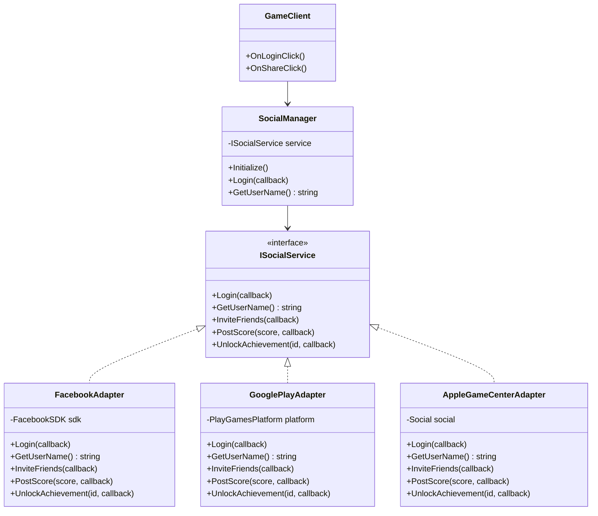

# 게임 개발자를 위한 C# 디자인 패턴: 실전 예제로 배우는 패턴의 힘  

저자: 최흥배, AI-Assisted   
    
권장 개발 환경
- **IDE**: Visual Studio 2022 이상 (Community 이상)
- **.NET**: 버전 9 이상
- **OS**: Windows 10 이상

-----  
  
# Chapter 5: Adapter Pattern (어댑터 패턴)

## 게임 개발 현장에서...
중급 개발자 이게임 씨는 모바일 RPG 프로젝트를 진행 중이었다. 게임의 핵심 기능은 이미 완성했고, 이제 소셜 기능을 추가할 차례였다.

"좋아, Facebook SDK를 연동해서 친구 초대 기능을 만들자!"

이게임 씨는 Facebook SDK 문서를 보며 코드를 작성했다.

```csharp
// 게임 코드 곳곳에...
FacebookSDK.Instance.Login(OnFacebookLoginComplete);
FacebookSDK.Instance.InviteFriends(friendIds);
FacebookSDK.Instance.PostScore(score);
```

몇 주 후, 기획팀에서 요청이 들어왔다.

"Google Play Games도 지원해주세요. 그리고 나중에 Apple Game Center도 추가할 예정이에요."

이게임 씨는 당황했다. Facebook SDK 호출 코드가 게임 코드 전체에 흩어져 있었다. 각 SDK는 완전히 다른 인터페이스를 가지고 있었다.

```csharp
// Facebook SDK
FacebookSDK.Instance.Login(callback);

// Google Play Games SDK
PlayGamesPlatform.Instance.Authenticate((success) => { });

// Apple Game Center (iOS)
Social.localUser.Authenticate((success) => { });
```

"세 개의 SDK를 모두 지원하려면... 모든 코드를 if-else로 분기해야 하나? 그럼 유지보수가 악몽이 될 텐데..."

```csharp
public void Login()
{
    #if UNITY_ANDROID
        PlayGamesPlatform.Instance.Authenticate((success) => { });
    #elif UNITY_IOS
        Social.localUser.Authenticate((success) => { });
    #else
        FacebookSDK.Instance.Login(OnLoginComplete);
    #endif
}

// 이런 코드가 수십 군데... 😱
```

더 심각한 문제는 1년 후에 발생했다. Facebook SDK가 대규모 업데이트를 진행했고, API가 완전히 변경되었다.

```csharp
// 기존 (v1.0)
FacebookSDK.Instance.Login(callback);

// 새 버전 (v2.0)
FacebookManager.AuthenticateUser(new AuthOptions(), callback);
```

"게임 코드 전체를 수정해야 한다고? 100군데가 넘는데..."

이게임 씨는 더 나은 방법이 필요했다. SDK가 변경되거나 새로운 SDK가 추가되어도 게임 코드는 전혀 수정하지 않는 방법. 바로 그때 선배 개발자가 조언했다.

"Adapter Pattern을 사용해봐. 각 SDK를 우리 게임의 인터페이스에 맞게 감싸는 거지. 마치 여행할 때 쓰는 전원 어댑터처럼 말이야."
  

## 패턴 없이 코딩하기
이게임 씨가 처음 작성한 코드는 SDK를 직접 호출하는 방식이었다.

```csharp
using UnityEngine;
using Facebook.Unity;
using GooglePlayGames;
using GooglePlayGames.BasicApi;

/// <summary>
/// 소셜 기능을 관리하는 클래스
/// SDK를 직접 호출하고 있다
/// </summary>
public class SocialManager : MonoBehaviour
{
    private static SocialManager instance;
    public static SocialManager Instance => instance;
    
    private void Awake()
    {
        if (instance == null)
        {
            instance = this;
            DontDestroyOnLoad(gameObject);
        }
        else
        {
            Destroy(gameObject);
        }
    }
    
    /// <summary>
    /// 로그인 처리
    /// </summary>
    public void Login(System.Action<bool> callback)
    {
        #if UNITY_ANDROID
            // Google Play Games 로그인
            PlayGamesPlatform.Instance.Authenticate((success) =>
            {
                if (success == SignInStatus.Success)
                {
                    Debug.Log("Google Play 로그인 성공");
                    callback?.Invoke(true);
                }
                else
                {
                    Debug.Log("Google Play 로그인 실패");
                    callback?.Invoke(false);
                }
            });
        
        #elif UNITY_IOS
            // Apple Game Center 로그인
            Social.localUser.Authenticate((success) =>
            {
                if (success)
                {
                    Debug.Log("Game Center 로그인 성공");
                    callback?.Invoke(true);
                }
                else
                {
                    Debug.Log("Game Center 로그인 실패");
                    callback?.Invoke(false);
                }
            });
        
        #else
            // Facebook 로그인
            if (!FB.IsInitialized)
            {
                FB.Init(() =>
                {
                    FB.ActivateApp();
                    PerformFacebookLogin(callback);
                });
            }
            else
            {
                PerformFacebookLogin(callback);
            }
        #endif
    }
    
    private void PerformFacebookLogin(System.Action<bool> callback)
    {
        FB.LogInWithReadPermissions(new[] { "public_profile", "email" }, (result) =>
        {
            if (FB.IsLoggedIn)
            {
                Debug.Log("Facebook 로그인 성공");
                callback?.Invoke(true);
            }
            else
            {
                Debug.Log("Facebook 로그인 실패");
                callback?.Invoke(false);
            }
        });
    }
    
    /// <summary>
    /// 사용자 이름 가져오기
    /// </summary>
    public string GetUserName()
    {
        #if UNITY_ANDROID
            return PlayGamesPlatform.Instance.GetUserDisplayName();
        
        #elif UNITY_IOS
            return Social.localUser.userName;
        
        #else
            if (FB.IsLoggedIn)
            {
                return AccessToken.CurrentAccessToken?.UserId ?? "Unknown";
            }
            return "Unknown";
        #endif
    }
    
    /// <summary>
    /// 친구 초대하기
    /// </summary>
    public void InviteFriends(System.Action callback)
    {
        #if UNITY_ANDROID
            // Google Play Games는 친구 초대 기능이 제한적
            Debug.LogWarning("Google Play Games에서는 친구 초대가 지원되지 않습니다");
            callback?.Invoke();
        
        #elif UNITY_IOS
            // Game Center는 직접 초대 불가
            Debug.LogWarning("Game Center에서는 친구 초대가 지원되지 않습니다");
            callback?.Invoke();
        
        #else
            FB.AppRequest(
                message: "함께 게임하자!",
                callback: (result) =>
                {
                    if (result.Cancelled)
                    {
                        Debug.Log("친구 초대 취소됨");
                    }
                    else if (!string.IsNullOrEmpty(result.Error))
                    {
                        Debug.LogError("친구 초대 실패: " + result.Error);
                    }
                    else
                    {
                        Debug.Log("친구 초대 성공");
                    }
                    callback?.Invoke();
                }
            );
        #endif
    }
    
    /// <summary>
    /// 점수 게시하기
    /// </summary>
    public void PostScore(int score, System.Action<bool> callback)
    {
        #if UNITY_ANDROID
            PlayGamesPlatform.Instance.ReportScore(
                score,
                "LeaderboardID",
                (success) =>
                {
                    Debug.Log($"점수 게시 {(success ? "성공" : "실패")}");
                    callback?.Invoke(success);
                }
            );
        
        #elif UNITY_IOS
            Social.ReportScore(
                score,
                "LeaderboardID",
                (success) =>
                {
                    Debug.Log($"점수 게시 {(success ? "성공" : "실패")}");
                    callback?.Invoke(success);
                }
            );
        
        #else
            // Facebook은 리더보드 대신 타임라인에 게시
            FB.API(
                "/me/feed",
                HttpMethod.POST,
                (result) =>
                {
                    if (string.IsNullOrEmpty(result.Error))
                    {
                        Debug.Log("점수 게시 성공");
                        callback?.Invoke(true);
                    }
                    else
                    {
                        Debug.LogError("점수 게시 실패");
                        callback?.Invoke(false);
                    }
                },
                new Dictionary<string, string>
                {
                    { "message", $"점수 {score}점 달성!" }
                }
            );
        #endif
    }
    
    /// <summary>
    /// 업적 해제하기
    /// </summary>
    public void UnlockAchievement(string achievementId, System.Action<bool> callback)
    {
        #if UNITY_ANDROID
            PlayGamesPlatform.Instance.UnlockAchievement(
                achievementId,
                (success) =>
                {
                    Debug.Log($"업적 해제 {(success ? "성공" : "실패")}");
                    callback?.Invoke(success);
                }
            );
        
        #elif UNITY_IOS
            Social.ReportProgress(
                achievementId,
                100.0,
                (success) =>
                {
                    Debug.Log($"업적 해제 {(success ? "성공" : "실패")}");
                    callback?.Invoke(success);
                }
            );
        
        #else
            // Facebook은 업적 시스템 없음
            Debug.LogWarning("Facebook에서는 업적이 지원되지 않습니다");
            callback?.Invoke(false);
        #endif
    }
}
```

게임에서 사용하는 코드:

```csharp
/// <summary>
/// 게임 UI에서 소셜 기능 사용
/// </summary>
public class GameUI : MonoBehaviour
{
    public void OnLoginButtonClick()
    {
        // SDK를 직접 의존
        SocialManager.Instance.Login((success) =>
        {
            if (success)
            {
                ShowMessage("로그인 성공!");
                UpdateUI();
            }
            else
            {
                ShowMessage("로그인 실패");
            }
        });
    }
    
    public void OnShareButtonClick()
    {
        SocialManager.Instance.InviteFriends(() =>
        {
            ShowMessage("공유 완료!");
        });
    }
    
    public void OnGameOver(int score)
    {
        SocialManager.Instance.PostScore(score, (success) =>
        {
            if (success)
            {
                ShowMessage("점수가 게시되었습니다!");
            }
        });
    }
    
    private void ShowMessage(string message)
    {
        Debug.Log(message);
    }
    
    private void UpdateUI()
    {
        // UI 업데이트...
    }
}
```
  

## 문제점 분석

### 1. 플랫폼 의존성 코드의 폭발

```
SocialManager.cs의 구조:

public void Login()
{
    #if UNITY_ANDROID
        // Android 전용 코드
    #elif UNITY_IOS
        // iOS 전용 코드
    #else
        // Facebook 코드
    #endif
}

public void GetUserName()
{
    #if UNITY_ANDROID
        // Android 전용 코드
    #elif UNITY_IOS
        // iOS 전용 코드
    #else
        // Facebook 코드
    #endif
}

public void InviteFriends()
{
    #if UNITY_ANDROID
        // Android 전용 코드
    #elif UNITY_IOS
        // iOS 전용 코드
    #else
        // Facebook 코드
    #endif
}

// 모든 메서드마다 반복...

문제점:
❌ 코드 가독성 최악
❌ 새 플랫폼 추가 시 모든 메서드 수정
❌ 테스트가 불가능 (각 플랫폼에서만 동작)
❌ 조건부 컴파일로 인한 디버깅 어려움
```

### 2. SDK 변경에 취약

```
시나리오: Facebook SDK v2.0으로 업데이트

Before:
FB.Login(callback);

After:
FacebookManager.AuthenticateUser(new AuthOptions(), callback);

영향받는 코드:
- SocialManager.Login() 수정
- SocialManager.GetUserName() 수정
- SocialManager.InviteFriends() 수정
- SocialManager.PostScore() 수정
- ... 모든 Facebook 관련 코드 수정

작업 시간: 2~3일
버그 발생 확률: 높음 (누락된 부분이 있을 수 있음)
```

### 3. 일관성 없는 인터페이스
각 SDK는 서로 다른 방식으로 동작한다.

```csharp
// Google Play Games
PlayGamesPlatform.Instance.Authenticate((success) =>
{
    // SignInStatus enum 사용
});

// Apple Game Center
Social.localUser.Authenticate((success) =>
{
    // bool 사용
});

// Facebook
FB.LogInWithReadPermissions(permissions, (result) =>
{
    // ILoginResult 사용
});

문제:
- 각각 다른 콜백 시그니처
- 다른 에러 처리 방식
- 다른 초기화 절차
- 일관성 없는 사용 경험
```

### 4. 테스트의 악몽

```csharp
[Test]
public void TestLogin()
{
    // 문제: 실제 SDK 없이는 테스트 불가능!
    SocialManager.Instance.Login((success) =>
    {
        Assert.IsTrue(success);
    });
    
    // Android에서만 동작하는 테스트
    // iOS에서만 동작하는 테스트
    // 웹에서만 동작하는 테스트
    
    // 통합 테스트 불가능!
}
```

### 5. 확장의 어려움
새로운 소셜 플랫폼을 추가하려면:

```
1. SocialManager의 모든 메서드에 새 #if 추가
2. 각 메서드의 로직 구현
3. 기존 플랫폼 코드가 깨지지 않았는지 확인
4. 모든 플랫폼에서 다시 테스트

새 플랫폼 1개 추가 시간: 1주일
실수로 인한 버그: 높은 확률
```
  
  
## 패턴 소개
**Adapter Pattern**은 호환되지 않는 인터페이스를 가진 클래스들이 함께 동작할 수 있도록 중간에서 변환해주는 패턴이다. 마치 해외여행 시 사용하는 전원 어댑터처럼, 서로 다른 규격을 연결해준다.

### 핵심 아이디어

```
현실 세계의 어댑터:

한국 전자제품 (220V, 2핀)
         ↓
    [전원 어댑터]
         ↓
미국 콘센트 (110V, 3핀)


소프트웨어 어댑터:

외부 라이브러리
(복잡하고 다른 인터페이스)
         ↓
    [Adapter 클래스]
         ↓
우리 게임 코드
(단순하고 일관된 인터페이스)
```

### 구조 다이어그램



### Adapter Pattern의 두 가지 방식

```
1. Class Adapter (클래스 어댑터)
   - 다중 상속 사용
   - C#에서는 인터페이스로 구현

   Target Interface
         ↑
      Adapter ← (상속) → Adaptee
      

2. Object Adapter (객체 어댑터) ← 일반적으로 더 선호됨
   - 컴포지션 사용
   - 더 유연함
   
   Target Interface
         ↑
      Adapter → (포함) → Adaptee
```
  

## 패턴 적용하기

### 1. 소셜 서비스 인터페이스 정의
먼저 우리 게임이 필요로 하는 소셜 기능의 인터페이스를 정의한다.

```csharp
using System;

/// <summary>
/// 모든 소셜 서비스가 구현해야 하는 통합 인터페이스
/// 게임 코드는 이 인터페이스만 의존한다
/// </summary>
public interface ISocialService
{
    /// <summary>
    /// 초기화 여부
    /// </summary>
    bool IsInitialized { get; }
    
    /// <summary>
    /// 로그인 여부
    /// </summary>
    bool IsLoggedIn { get; }
    
    /// <summary>
    /// 서비스 초기화
    /// </summary>
    void Initialize(Action<bool> onComplete);
    
    /// <summary>
    /// 로그인
    /// </summary>
    void Login(Action<bool> onComplete);
    
    /// <summary>
    /// 로그아웃
    /// </summary>
    void Logout();
    
    /// <summary>
    /// 사용자 이름 가져오기
    /// </summary>
    string GetUserName();
    
    /// <summary>
    /// 사용자 ID 가져오기
    /// </summary>
    string GetUserId();
    
    /// <summary>
    /// 친구 초대하기
    /// </summary>
    void InviteFriends(Action<bool> onComplete);
    
    /// <summary>
    /// 점수 게시하기
    /// </summary>
    void PostScore(int score, string leaderboardId, Action<bool> onComplete);
    
    /// <summary>
    /// 리더보드 표시하기
    /// </summary>
    void ShowLeaderboard(string leaderboardId);
    
    /// <summary>
    /// 업적 해제하기
    /// </summary>
    void UnlockAchievement(string achievementId, Action<bool> onComplete);
    
    /// <summary>
    /// 업적 목록 표시하기
    /// </summary>
    void ShowAchievements();
}
```

### 2. Facebook Adapter 구현

```csharp
using System;
using System.Collections.Generic;
using UnityEngine;
using Facebook.Unity;

/// <summary>
/// Facebook SDK를 ISocialService 인터페이스에 맞게 변환하는 어댑터
/// </summary>
public class FacebookAdapter : ISocialService
{
    public bool IsInitialized { get; private set; }
    public bool IsLoggedIn => FB.IsLoggedIn;
    
    private string userName;
    private string userId;
    
    /// <summary>
    /// Facebook SDK 초기화
    /// </summary>
    public void Initialize(Action<bool> onComplete)
    {
        if (IsInitialized)
        {
            onComplete?.Invoke(true);
            return;
        }
        
        if (!FB.IsInitialized)
        {
            FB.Init(() =>
            {
                FB.ActivateApp();
                IsInitialized = true;
                Debug.Log("[FacebookAdapter] 초기화 완료");
                onComplete?.Invoke(true);
            }, (isGameShown) =>
            {
                // 게임 포커스 변경 처리
            });
        }
        else
        {
            FB.ActivateApp();
            IsInitialized = true;
            onComplete?.Invoke(true);
        }
    }
    
    /// <summary>
    /// 로그인
    /// </summary>
    public void Login(Action<bool> onComplete)
    {
        if (!IsInitialized)
        {
            Debug.LogError("[FacebookAdapter] 초기화되지 않았습니다");
            onComplete?.Invoke(false);
            return;
        }
        
        var permissions = new List<string> { "public_profile", "email" };
        
        FB.LogInWithReadPermissions(permissions, (result) =>
        {
            if (FB.IsLoggedIn)
            {
                LoadUserInfo(() =>
                {
                    Debug.Log($"[FacebookAdapter] 로그인 성공: {userName}");
                    onComplete?.Invoke(true);
                });
            }
            else
            {
                Debug.LogError($"[FacebookAdapter] 로그인 실패: {result.Error}");
                onComplete?.Invoke(false);
            }
        });
    }
    
    /// <summary>
    /// 사용자 정보 로드
    /// </summary>
    private void LoadUserInfo(Action onComplete)
    {
        FB.API("/me?fields=id,name", HttpMethod.GET, (result) =>
        {
            if (result.Error == null)
            {
                var data = result.ResultDictionary;
                userId = data["id"].ToString();
                userName = data["name"].ToString();
                onComplete?.Invoke();
            }
            else
            {
                Debug.LogError($"[FacebookAdapter] 사용자 정보 로드 실패: {result.Error}");
                onComplete?.Invoke();
            }
        });
    }
    
    /// <summary>
    /// 로그아웃
    /// </summary>
    public void Logout()
    {
        FB.LogOut();
        userName = null;
        userId = null;
        Debug.Log("[FacebookAdapter] 로그아웃 완료");
    }
    
    public string GetUserName()
    {
        return userName ?? "Unknown";
    }
    
    public string GetUserId()
    {
        return userId ?? "";
    }
    
    /// <summary>
    /// 친구 초대
    /// </summary>
    public void InviteFriends(Action<bool> onComplete)
    {
        if (!IsLoggedIn)
        {
            Debug.LogWarning("[FacebookAdapter] 로그인이 필요합니다");
            onComplete?.Invoke(false);
            return;
        }
        
        FB.AppRequest(
            message: "함께 게임하자!",
            callback: (result) =>
            {
                if (result.Cancelled)
                {
                    Debug.Log("[FacebookAdapter] 친구 초대 취소됨");
                    onComplete?.Invoke(false);
                }
                else if (!string.IsNullOrEmpty(result.Error))
                {
                    Debug.LogError($"[FacebookAdapter] 친구 초대 실패: {result.Error}");
                    onComplete?.Invoke(false);
                }
                else
                {
                    Debug.Log("[FacebookAdapter] 친구 초대 성공");
                    onComplete?.Invoke(true);
                }
            }
        );
    }
    
    /// <summary>
    /// 점수 게시 (Facebook은 타임라인에 게시)
    /// </summary>
    public void PostScore(int score, string leaderboardId, Action<bool> onComplete)
    {
        if (!IsLoggedIn)
        {
            Debug.LogWarning("[FacebookAdapter] 로그인이 필요합니다");
            onComplete?.Invoke(false);
            return;
        }
        
        var parameters = new Dictionary<string, string>
        {
            { "message", $"점수 {score}점 달성!" }
        };
        
        FB.API("/me/feed", HttpMethod.POST, (result) =>
        {
            if (string.IsNullOrEmpty(result.Error))
            {
                Debug.Log("[FacebookAdapter] 점수 게시 성공");
                onComplete?.Invoke(true);
            }
            else
            {
                Debug.LogError($"[FacebookAdapter] 점수 게시 실패: {result.Error}");
                onComplete?.Invoke(false);
            }
        }, parameters);
    }
    
    public void ShowLeaderboard(string leaderboardId)
    {
        Debug.LogWarning("[FacebookAdapter] Facebook은 리더보드를 지원하지 않습니다");
    }
    
    public void UnlockAchievement(string achievementId, Action<bool> onComplete)
    {
        Debug.LogWarning("[FacebookAdapter] Facebook은 업적을 지원하지 않습니다");
        onComplete?.Invoke(false);
    }
    
    public void ShowAchievements()
    {
        Debug.LogWarning("[FacebookAdapter] Facebook은 업적을 지원하지 않습니다");
    }
}
```

### 3. Google Play Games Adapter 구현

```csharp
using System;
using UnityEngine;
using GooglePlayGames;
using GooglePlayGames.BasicApi;

/// <summary>
/// Google Play Games SDK를 ISocialService 인터페이스에 맞게 변환하는 어댑터
/// </summary>
public class GooglePlayAdapter : ISocialService
{
    public bool IsInitialized { get; private set; }
    public bool IsLoggedIn => PlayGamesPlatform.Instance.IsAuthenticated();
    
    /// <summary>
    /// Google Play Games 초기화
    /// </summary>
    public void Initialize(Action<bool> onComplete)
    {
        if (IsInitialized)
        {
            onComplete?.Invoke(true);
            return;
        }
        
        // Google Play Games 설정
        PlayGamesClientConfiguration config = new PlayGamesClientConfiguration.Builder()
            .RequestServerAuthCode(false)
            .RequestEmail()
            .RequestIdToken()
            .Build();
        
        PlayGamesPlatform.InitializeInstance(config);
        PlayGamesPlatform.Activate();
        
        IsInitialized = true;
        Debug.Log("[GooglePlayAdapter] 초기화 완료");
        onComplete?.Invoke(true);
    }
    
    /// <summary>
    /// 로그인
    /// </summary>
    public void Login(Action<bool> onComplete)
    {
        if (!IsInitialized)
        {
            Debug.LogError("[GooglePlayAdapter] 초기화되지 않았습니다");
            onComplete?.Invoke(false);
            return;
        }
        
        PlayGamesPlatform.Instance.Authenticate((success) =>
        {
            if (success == SignInStatus.Success)
            {
                string userName = PlayGamesPlatform.Instance.GetUserDisplayName();
                string userId = PlayGamesPlatform.Instance.GetUserId();
                Debug.Log($"[GooglePlayAdapter] 로그인 성공: {userName}");
                onComplete?.Invoke(true);
            }
            else
            {
                Debug.LogError($"[GooglePlayAdapter] 로그인 실패: {success}");
                onComplete?.Invoke(false);
            }
        });
    }
    
    /// <summary>
    /// 로그아웃
    /// </summary>
    public void Logout()
    {
        PlayGamesPlatform.Instance.SignOut();
        Debug.Log("[GooglePlayAdapter] 로그아웃 완료");
    }
    
    public string GetUserName()
    {
        return IsLoggedIn ? PlayGamesPlatform.Instance.GetUserDisplayName() : "Unknown";
    }
    
    public string GetUserId()
    {
        return IsLoggedIn ? PlayGamesPlatform.Instance.GetUserId() : "";
    }
    
    /// <summary>
    /// 친구 초대 (Google Play Games는 제한적)
    /// </summary>
    public void InviteFriends(Action<bool> onComplete)
    {
        Debug.LogWarning("[GooglePlayAdapter] Google Play Games는 직접 초대를 지원하지 않습니다");
        onComplete?.Invoke(false);
    }
    
    /// <summary>
    /// 점수 게시
    /// </summary>
    public void PostScore(int score, string leaderboardId, Action<bool> onComplete)
    {
        if (!IsLoggedIn)
        {
            Debug.LogWarning("[GooglePlayAdapter] 로그인이 필요합니다");
            onComplete?.Invoke(false);
            return;
        }
        
        PlayGamesPlatform.Instance.ReportScore(
            score,
            leaderboardId,
            (success) =>
            {
                if (success)
                {
                    Debug.Log($"[GooglePlayAdapter] 점수 게시 성공: {score}");
                    onComplete?.Invoke(true);
                }
                else
                {
                    Debug.LogError("[GooglePlayAdapter] 점수 게시 실패");
                    onComplete?.Invoke(false);
                }
            }
        );
    }
    
    /// <summary>
    /// 리더보드 표시
    /// </summary>
    public void ShowLeaderboard(string leaderboardId)
    {
        if (!IsLoggedIn)
        {
            Debug.LogWarning("[GooglePlayAdapter] 로그인이 필요합니다");
            return;
        }
        
        PlayGamesPlatform.Instance.ShowLeaderboardUI(leaderboardId);
    }
    
    /// <summary>
    /// 업적 해제
    /// </summary>
    public void UnlockAchievement(string achievementId, Action<bool> onComplete)
    {
        if (!IsLoggedIn)
        {
            Debug.LogWarning("[GooglePlayAdapter] 로그인이 필요합니다");
            onComplete?.Invoke(false);
            return;
        }
        
        PlayGamesPlatform.Instance.UnlockAchievement(
            achievementId,
            (success) =>
            {
                if (success)
                {
                    Debug.Log($"[GooglePlayAdapter] 업적 해제 성공: {achievementId}");
                    onComplete?.Invoke(true);
                }
                else
                {
                    Debug.LogError("[GooglePlayAdapter] 업적 해제 실패");
                    onComplete?.Invoke(false);
                }
            }
        );
    }
    
    /// <summary>
    /// 업적 목록 표시
    /// </summary>
    public void ShowAchievements()
    {
        if (!IsLoggedIn)
        {
            Debug.LogWarning("[GooglePlayAdapter] 로그인이 필요합니다");
            return;
        }
        
        PlayGamesPlatform.Instance.ShowAchievementsUI();
    }
}
```

### 4. Apple Game Center Adapter 구현

```csharp
using System;
using UnityEngine;
using UnityEngine.SocialPlatforms;

/// <summary>
/// Apple Game Center를 ISocialService 인터페이스에 맞게 변환하는 어댑터
/// </summary>
public class AppleGameCenterAdapter : ISocialService
{
    public bool IsInitialized { get; private set; }
    public bool IsLoggedIn => Social.localUser.authenticated;
    
    /// <summary>
    /// Game Center 초기화
    /// </summary>
    public void Initialize(Action<bool> onComplete)
    {
        IsInitialized = true;
        Debug.Log("[AppleGameCenterAdapter] 초기화 완료");
        onComplete?.Invoke(true);
    }
    
    /// <summary>
    /// 로그인
    /// </summary>
    public void Login(Action<bool> onComplete)
    {
        Social.localUser.Authenticate((success) =>
        {
            if (success)
            {
                Debug.Log($"[AppleGameCenterAdapter] 로그인 성공: {Social.localUser.userName}");
                onComplete?.Invoke(true);
            }
            else
            {
                Debug.LogError("[AppleGameCenterAdapter] 로그인 실패");
                onComplete?.Invoke(false);
            }
        });
    }
    
    /// <summary>
    /// 로그아웃 (Game Center는 명시적 로그아웃 없음)
    /// </summary>
    public void Logout()
    {
        Debug.LogWarning("[AppleGameCenterAdapter] Game Center는 명시적 로그아웃을 지원하지 않습니다");
    }
    
    public string GetUserName()
    {
        return IsLoggedIn ? Social.localUser.userName : "Unknown";
    }
    
    public string GetUserId()
    {
        return IsLoggedIn ? Social.localUser.id : "";
    }
    
    /// <summary>
    /// 친구 초대 (Game Center는 제한적)
    /// </summary>
    public void InviteFriends(Action<bool> onComplete)
    {
        Debug.LogWarning("[AppleGameCenterAdapter] Game Center는 직접 초대를 지원하지 않습니다");
        onComplete?.Invoke(false);
    }
    
    /// <summary>
    /// 점수 게시
    /// </summary>
    public void PostScore(int score, string leaderboardId, Action<bool> onComplete)
    {
        if (!IsLoggedIn)
        {
            Debug.LogWarning("[AppleGameCenterAdapter] 로그인이 필요합니다");
            onComplete?.Invoke(false);
            return;
        }
        
        Social.ReportScore(score, leaderboardId, (success) =>
        {
            if (success)
            {
                Debug.Log($"[AppleGameCenterAdapter] 점수 게시 성공: {score}");
                onComplete?.Invoke(true);
            }
            else
            {
                Debug.LogError("[AppleGameCenterAdapter] 점수 게시 실패");
                onComplete?.Invoke(false);
            }
        });
    }
    
    /// <summary>
    /// 리더보드 표시
    /// </summary>
    public void ShowLeaderboard(string leaderboardId)
    {
        if (!IsLoggedIn)
        {
            Debug.LogWarning("[AppleGameCenterAdapter] 로그인이 필요합니다");
            return;
        }
        
        Social.ShowLeaderboardUI();
    }
    
    /// <summary>
    /// 업적 해제
    /// </summary>
    public void UnlockAchievement(string achievementId, Action<bool> onComplete)
    {
        if (!IsLoggedIn)
        {
            Debug.LogWarning("[AppleGameCenterAdapter] 로그인이 필요합니다");
            onComplete?.Invoke(false);
            return;
        }
        
        Social.ReportProgress(achievementId, 100.0, (success) =>
        {
            if (success)
            {
                Debug.Log($"[AppleGameCenterAdapter] 업적 해제 성공: {achievementId}");
                onComplete?.Invoke(true);
            }
            else
            {
                Debug.LogError("[AppleGameCenterAdapter] 업적 해제 실패");
                onComplete?.Invoke(false);
            }
        });
    }
    
    /// <summary>
    /// 업적 목록 표시
    /// </summary>
    public void ShowAchievements()
    {
        if (!IsLoggedIn)
        {
            Debug.LogWarning("[AppleGameCenterAdapter] 로그인이 필요합니다");
            return;
        }
        
        Social.ShowAchievementsUI();
    }
}
```

### 5. 통합 SocialManager
이제 SocialManager는 어댑터를 통해서만 소셜 기능에 접근한다.

```csharp
using System;
using UnityEngine;

/// <summary>
/// 소셜 서비스 통합 관리자
/// 플랫폼에 맞는 어댑터를 선택하고 사용한다
/// </summary>
public class SocialManager : MonoBehaviour
{
    private static SocialManager instance;
    public static SocialManager Instance => instance;
    
    private ISocialService socialService;
    
    /// <summary>
    /// 현재 사용 중인 소셜 서비스
    /// </summary>
    public ISocialService CurrentService => socialService;
    
    /// <summary>
    /// 로그인 여부
    /// </summary>
    public bool IsLoggedIn => socialService?.IsLoggedIn ?? false;
    
    private void Awake()
    {
        if (instance == null)
        {
            instance = this;
            DontDestroyOnLoad(gameObject);
            InitializeSocialService();
        }
        else
        {
            Destroy(gameObject);
        }
    }
    
    /// <summary>
    /// 플랫폼에 맞는 소셜 서비스 초기화
    /// </summary>
    private void InitializeSocialService()
    {
        #if UNITY_ANDROID
            socialService = new GooglePlayAdapter();
            Debug.Log("[SocialManager] Google Play Games 어댑터 사용");
        
        #elif UNITY_IOS
            socialService = new AppleGameCenterAdapter();
            Debug.Log("[SocialManager] Apple Game Center 어댑터 사용");
        
        #else
            socialService = new FacebookAdapter();
            Debug.Log("[SocialManager] Facebook 어댑터 사용");
        #endif
        
        // 초기화
        socialService.Initialize((success) =>
        {
            if (success)
            {
                Debug.Log("[SocialManager] 소셜 서비스 초기화 완료");
            }
            else
            {
                Debug.LogError("[SocialManager] 소셜 서비스 초기화 실패");
            }
        });
    }
    
    /// <summary>
    /// 로그인
    /// </summary>
    public void Login(Action<bool> onComplete)
    {
        if (socialService == null)
        {
            Debug.LogError("[SocialManager] 소셜 서비스가 초기화되지 않았습니다");
            onComplete?.Invoke(false);
            return;
        }
        
        socialService.Login(onComplete);
    }
    
    /// <summary>
    /// 로그아웃
    /// </summary>
    public void Logout()
    {
        socialService?.Logout();
    }
    
    /// <summary>
    /// 사용자 이름 가져오기
    /// </summary>
    public string GetUserName()
    {
        return socialService?.GetUserName() ?? "Unknown";
    }
    
    /// <summary>
    /// 사용자 ID 가져오기
    /// </summary>
    public string GetUserId()
    {
        return socialService?.GetUserId() ?? "";
    }
    
    /// <summary>
    /// 친구 초대
    /// </summary>
    public void InviteFriends(Action<bool> onComplete)
    {
        if (!IsLoggedIn)
        {
            Debug.LogWarning("[SocialManager] 로그인이 필요합니다");
            onComplete?.Invoke(false);
            return;
        }
        
        socialService.InviteFriends(onComplete);
    }
    
    /// <summary>
    /// 점수 게시
    /// </summary>
    public void PostScore(int score, string leaderboardId = "default", Action<bool> onComplete = null)
    {
        if (!IsLoggedIn)
        {
            Debug.LogWarning("[SocialManager] 로그인이 필요합니다");
            onComplete?.Invoke(false);
            return;
        }
        
        socialService.PostScore(score, leaderboardId, onComplete);
    }
    
    /// <summary>
    /// 리더보드 표시
    /// </summary>
    public void ShowLeaderboard(string leaderboardId = "default")
    {
        if (!IsLoggedIn)
        {
            Debug.LogWarning("[SocialManager] 로그인이 필요합니다");
            return;
        }
        
        socialService.ShowLeaderboard(leaderboardId);
    }
    
    /// <summary>
    /// 업적 해제
    /// </summary>
    public void UnlockAchievement(string achievementId, Action<bool> onComplete = null)
    {
        if (!IsLoggedIn)
        {
            Debug.LogWarning("[SocialManager] 로그인이 필요합니다");
            onComplete?.Invoke(false);
            return;
        }
        
        socialService.UnlockAchievement(achievementId, onComplete);
    }
    
    /// <summary>
    /// 업적 목록 표시
    /// </summary>
    public void ShowAchievements()
    {
        if (!IsLoggedIn)
        {
            Debug.LogWarning("[SocialManager] 로그인이 필요합니다");
            return;
        }
        
        socialService.ShowAchievements();
    }
    
    /// <summary>
    /// 런타임에 소셜 서비스 변경 (테스트용)
    /// </summary>
    public void ChangeSocialService(ISocialService newService)
    {
        if (socialService != null)
        {
            socialService.Logout();
        }
        
        socialService = newService;
        socialService.Initialize((success) =>
        {
            Debug.Log($"[SocialManager] 소셜 서비스 변경 완료: {success}");
        });
    }
}
```

### 6. 게임 클라이언트 코드
이제 게임 코드는 어떤 SDK를 사용하는지 전혀 알 필요가 없다.

```csharp
using UnityEngine;
using UnityEngine.UI;

/// <summary>
/// 게임 UI - 소셜 기능 사용
/// SDK에 대해 전혀 모른다!
/// </summary>
public class GameUI : MonoBehaviour
{
    [Header("UI Elements")]
    [SerializeField] private Button loginButton;
    [SerializeField] private Button logoutButton;
    [SerializeField] private Button inviteButton;
    [SerializeField] private Button leaderboardButton;
    [SerializeField] private Button achievementsButton;
    [SerializeField] private Text userNameText;
    [SerializeField] private Text statusText;
    
    private void Start()
    {
        // 버튼 이벤트 연결
        loginButton.onClick.AddListener(OnLoginClick);
        logoutButton.onClick.AddListener(OnLogoutClick);
        inviteButton.onClick.AddListener(OnInviteClick);
        leaderboardButton.onClick.AddListener(OnLeaderboardClick);
        achievementsButton.onClick.AddListener(OnAchievementsClick);
        
        UpdateUI();
    }
    
    /// <summary>
    /// 로그인 버튼 클릭
    /// </summary>
    private void OnLoginClick()
    {
        statusText.text = "로그인 중...";
        
        SocialManager.Instance.Login((success) =>
        {
            if (success)
            {
                statusText.text = "로그인 성공!";
                UpdateUI();
            }
            else
            {
                statusText.text = "로그인 실패";
            }
        });
    }
    
    /// <summary>
    /// 로그아웃 버튼 클릭
    /// </summary>
    private void OnLogoutClick()
    {
        SocialManager.Instance.Logout();
        statusText.text = "로그아웃 완료";
        UpdateUI();
    }
    
    /// <summary>
    /// 친구 초대 버튼 클릭
    /// </summary>
    private void OnInviteClick()
    {
        SocialManager.Instance.InviteFriends((success) =>
        {
            statusText.text = success ? "친구 초대 성공!" : "친구 초대 실패";
        });
    }
    
    /// <summary>
    /// 리더보드 버튼 클릭
    /// </summary>
    private void OnLeaderboardClick()
    {
        SocialManager.Instance.ShowLeaderboard();
    }
    
    /// <summary>
    /// 업적 버튼 클릭
    /// </summary>
    private void OnAchievementsClick()
    {
        SocialManager.Instance.ShowAchievements();
    }
    
    /// <summary>
    /// 게임 오버 시 점수 게시
    /// </summary>
    public void OnGameOver(int score)
    {
        SocialManager.Instance.PostScore(score, "main_leaderboard", (success) =>
        {
            if (success)
            {
                statusText.text = $"점수 {score}점이 게시되었습니다!";
            }
        });
        
        // 특정 점수 달성 시 업적 해제
        if (score >= 1000)
        {
            SocialManager.Instance.UnlockAchievement("achievement_score_1000");
        }
    }
    
    /// <summary>
    /// UI 업데이트
    /// </summary>
    private void UpdateUI()
    {
        bool isLoggedIn = SocialManager.Instance.IsLoggedIn;
        
        loginButton.gameObject.SetActive(!isLoggedIn);
        logoutButton.gameObject.SetActive(isLoggedIn);
        inviteButton.interactable = isLoggedIn;
        leaderboardButton.interactable = isLoggedIn;
        achievementsButton.interactable = isLoggedIn;
        
        if (isLoggedIn)
        {
            userNameText.text = $"환영합니다, {SocialManager.Instance.GetUserName()}님!";
        }
        else
        {
            userNameText.text = "로그인이 필요합니다";
        }
    }
}
```

### 7. Mock Adapter (테스트용)

테스트를 위한 가짜 어댑터를 만들 수 있다.

```csharp
using System;
using UnityEngine;

/// <summary>
/// 테스트용 Mock 소셜 서비스
/// 실제 SDK 없이도 테스트 가능하다
/// </summary>
public class MockSocialAdapter : ISocialService
{
    public bool IsInitialized { get; private set; }
    public bool IsLoggedIn { get; private set; }
    
    private string userName = "TestUser";
    private string userId = "12345";
    
    // 테스트 설정
    public bool SimulateLoginFailure { get; set; }
    public float NetworkDelay { get; set; } = 0.5f;
    
    public void Initialize(Action<bool> onComplete)
    {
        IsInitialized = true;
        Debug.Log("[MockAdapter] 초기화 완료");
        onComplete?.Invoke(true);
    }
    
    public void Login(Action<bool> onComplete)
    {
        // 네트워크 지연 시뮬레이션
        DelayedCallback(() =>
        {
            if (SimulateLoginFailure)
            {
                Debug.Log("[MockAdapter] 로그인 실패 (시뮬레이션)");
                onComplete?.Invoke(false);
            }
            else
            {
                IsLoggedIn = true;
                Debug.Log($"[MockAdapter] 로그인 성공: {userName}");
                onComplete?.Invoke(true);
            }
        }, NetworkDelay);
    }
    
    public void Logout()
    {
        IsLoggedIn = false;
        Debug.Log("[MockAdapter] 로그아웃 완료");
    }
    
    public string GetUserName() => userName;
    public string GetUserId() => userId;
    
    public void InviteFriends(Action<bool> onComplete)
    {
        DelayedCallback(() =>
        {
            Debug.Log("[MockAdapter] 친구 초대 완료");
            onComplete?.Invoke(true);
        }, NetworkDelay);
    }
    
    public void PostScore(int score, string leaderboardId, Action<bool> onComplete)
    {
        DelayedCallback(() =>
        {
            Debug.Log($"[MockAdapter] 점수 게시: {score} to {leaderboardId}");
            onComplete?.Invoke(true);
        }, NetworkDelay);
    }
    
    public void ShowLeaderboard(string leaderboardId)
    {
        Debug.Log($"[MockAdapter] 리더보드 표시: {leaderboardId}");
    }
    
    public void UnlockAchievement(string achievementId, Action<bool> onComplete)
    {
        DelayedCallback(() =>
        {
            Debug.Log($"[MockAdapter] 업적 해제: {achievementId}");
            onComplete?.Invoke(true);
        }, NetworkDelay);
    }
    
    public void ShowAchievements()
    {
        Debug.Log("[MockAdapter] 업적 목록 표시");
    }
    
    private void DelayedCallback(Action action, float delay)
    {
        // Unity 코루틴 또는 간단한 타이머 사용
        action?.Invoke(); // 여기서는 즉시 호출
    }
}
```

## Before/After 비교

### 코드 복잡도 비교

```
Before (직접 SDK 호출):

SocialManager.cs
├─ Login() → #if #elif #else (50줄)
├─ GetUserName() → #if #elif #else (30줄)
├─ InviteFriends() → #if #elif #else (40줄)
├─ PostScore() → #if #elif #else (60줄)
├─ UnlockAchievement() → #if #elif #else (50줄)
└─ ... 모든 메서드마다 반복

총 1개 파일, 800줄
조건부 컴파일 지시문: 50개 이상
유지보수성: ❌ 매우 어려움


After (Adapter Pattern):

ISocialService.cs (인터페이스, 50줄)
FacebookAdapter.cs (200줄)
GooglePlayAdapter.cs (180줄)
AppleGameCenterAdapter.cs (180줄)
MockSocialAdapter.cs (테스트용, 100줄)
SocialManager.cs (간단해짐, 150줄)

총 6개 파일, 860줄
조건부 컴파일: 1개 (#if UNITY_ANDROID...)
유지보수성: ✓ 각 어댑터 독립적으로 관리
```

### SDK 변경 대응

```
시나리오: Facebook SDK v2.0으로 업데이트

Before:
1. SocialManager.cs 열기
2. Facebook 관련 코드 전체 검색
3. 모든 #else 블록 수정 (10군데 이상)
4. 각 플랫폼에서 다시 테스트
   작업 시간: 2~3일
   위험도: 높음 (놓친 부분 있을 수 있음)

After:
1. FacebookAdapter.cs만 수정
2. ISocialService 인터페이스는 그대로
3. 다른 어댑터는 전혀 영향 없음
4. Mock으로 먼저 테스트 가능
   작업 시간: 1~2시간
   위험도: 낮음 (격리되어 있음)
```

### 새 플랫폼 추가

```
시나리오: Steam 소셜 기능 추가

Before:
1. SocialManager의 모든 메서드에 #elif UNITY_STANDALONE 추가
2. 각 메서드마다 Steam 코드 구현
3. 기존 코드와 충돌 여부 확인
4. 모든 플랫폼 재테스트
   작업 시간: 1주일
   코드 증가: +300줄 (같은 파일에)

After:
1. SteamAdapter.cs 생성
2. ISocialService 구현
3. SocialManager 초기화 부분에 한 줄 추가
4. 완료!
   작업 시간: 1~2일
   코드 증가: +200줄 (새 파일)
   기존 코드: 전혀 수정 안 함!
```

### 테스트 용이성

```
Before:
[Test]
public void TestLogin()
{
    // 문제: 실제 Facebook SDK 필요
    // Android/iOS 기기에서만 테스트 가능
    // 자동화된 테스트 불가능
}

After:
[Test]
public void TestLogin()
{
    // Mock 어댑터 사용
    var mockAdapter = new MockSocialAdapter();
    SocialManager.Instance.ChangeSocialService(mockAdapter);
    
    // 로그인 테스트
    bool loginSuccess = false;
    SocialManager.Instance.Login((success) =>
    {
        loginSuccess = success;
    });
    
    Assert.IsTrue(loginSuccess);
}

[Test]
public void TestLoginFailure()
{
    var mockAdapter = new MockSocialAdapter();
    mockAdapter.SimulateLoginFailure = true;
    SocialManager.Instance.ChangeSocialService(mockAdapter);
    
    bool loginSuccess = true;
    SocialManager.Instance.Login((success) =>
    {
        loginSuccess = success;
    });
    
    Assert.IsFalse(loginSuccess);
}

✓ 에디터에서 즉시 테스트 가능
✓ CI/CD 파이프라인에서 자동 테스트
✓ 다양한 시나리오 시뮬레이션
```

## 실전 팁

### 1. 어댑터의 적절한 크기

```csharp
/// <summary>
/// ❌ 너무 얇은 어댑터 (단순 전달만 함)
/// </summary>
public class ThinAdapter : ISocialService
{
    public void Login(Action<bool> callback)
    {
        // 단순히 SDK 메서드만 호출
        FacebookSDK.Login(callback);
    }
}

/// <summary>
/// ✓ 적절한 어댑터 (변환 로직 포함)
/// </summary>
public class GoodAdapter : ISocialService
{
    public void Login(Action<bool> callback)
    {
        // Facebook SDK의 복잡한 초기화 절차를 숨김
        if (!FB.IsInitialized)
        {
            FB.Init(() =>
            {
                FB.ActivateApp();
                PerformLogin(callback);
            });
        }
        else
        {
            PerformLogin(callback);
        }
    }
    
    private void PerformLogin(Action<bool> callback)
    {
        // Facebook의 ILoginResult를 bool로 변환
        FB.Login(permissions, (result) =>
        {
            bool success = !result.Cancelled && string.IsNullOrEmpty(result.Error);
            callback?.Invoke(success);
        });
    }
}
```

### 2. 어댑터 체인

여러 어댑터를 조합할 수 있다.

```csharp
/// <summary>
/// 로깅 기능을 추가하는 데코레이터 어댑터
/// </summary>
public class LoggingSocialAdapter : ISocialService
{
    private ISocialService wrappedService;
    
    public LoggingSocialAdapter(ISocialService service)
    {
        wrappedService = service;
    }
    
    public bool IsInitialized => wrappedService.IsInitialized;
    public bool IsLoggedIn => wrappedService.IsLoggedIn;
    
    public void Initialize(Action<bool> onComplete)
    {
        Debug.Log($"[LOG] Initialize 시작");
        float startTime = Time.realtimeSinceStartup;
        
        wrappedService.Initialize((success) =>
        {
            float duration = Time.realtimeSinceStartup - startTime;
            Debug.Log($"[LOG] Initialize 완료: {success}, 소요시간: {duration:F2}초");
            onComplete?.Invoke(success);
        });
    }
    
    public void Login(Action<bool> onComplete)
    {
        Debug.Log($"[LOG] Login 시작");
        float startTime = Time.realtimeSinceStartup;
        
        wrappedService.Login((success) =>
        {
            float duration = Time.realtimeSinceStartup - startTime;
            Debug.Log($"[LOG] Login 완료: {success}, 소요시간: {duration:F2}초");
            onComplete?.Invoke(success);
        });
    }
    
    // 나머지 메서드도 동일하게...
    
    public void Logout() => wrappedService.Logout();
    public string GetUserName() => wrappedService.GetUserName();
    public string GetUserId() => wrappedService.GetUserId();
    public void InviteFriends(Action<bool> onComplete) => wrappedService.InviteFriends(onComplete);
    public void PostScore(int score, string leaderboardId, Action<bool> onComplete) => wrappedService.PostScore(score, leaderboardId, onComplete);
    public void ShowLeaderboard(string leaderboardId) => wrappedService.ShowLeaderboard(leaderboardId);
    public void UnlockAchievement(string achievementId, Action<bool> onComplete) => wrappedService.UnlockAchievement(achievementId, onComplete);
    public void ShowAchievements() => wrappedService.ShowAchievements();
}

// 사용
ISocialService service = new FacebookAdapter();
service = new LoggingSocialAdapter(service); // 로깅 기능 추가
```

### 3. 폴백 메커니즘

어댑터에서 기능을 지원하지 않을 때의 처리.

```csharp
/// <summary>
/// 안전한 어댑터 (폴백 포함)
/// </summary>
public class SafeSocialAdapter : ISocialService
{
    private ISocialService primaryService;
    private ISocialService fallbackService;
    
    public SafeSocialAdapter(ISocialService primary, ISocialService fallback)
    {
        primaryService = primary;
        fallbackService = fallback;
    }
    
    public void InviteFriends(Action<bool> onComplete)
    {
        // 먼저 주 서비스 시도
        primaryService.InviteFriends((success) =>
        {
            if (success)
            {
                onComplete?.Invoke(true);
            }
            else
            {
                // 실패 시 폴백 서비스 시도
                Debug.LogWarning("주 서비스 실패, 폴백 서비스 시도");
                fallbackService.InviteFriends(onComplete);
            }
        });
    }
    
    // 다른 메서드들...
}
```

### 4. 어댑터 팩토리

어댑터 생성을 팩토리로 관리한다.

```csharp
/// <summary>
/// 소셜 어댑터 팩토리
/// </summary>
public static class SocialAdapterFactory
{
    public enum PlatformType
    {
        Facebook,
        GooglePlay,
        AppleGameCenter,
        Steam,
        Mock
    }
    
    /// <summary>
    /// 플랫폼에 맞는 어댑터 생성
    /// </summary>
    public static ISocialService CreateAdapter(PlatformType platform)
    {
        switch (platform)
        {
            case PlatformType.Facebook:
                return new FacebookAdapter();
            
            case PlatformType.GooglePlay:
                return new GooglePlayAdapter();
            
            case PlatformType.AppleGameCenter:
                return new AppleGameCenterAdapter();
            
            case PlatformType.Steam:
                return new SteamAdapter();
            
            case PlatformType.Mock:
                return new MockSocialAdapter();
            
            default:
                Debug.LogWarning($"알 수 없는 플랫폼: {platform}, Mock 사용");
                return new MockSocialAdapter();
        }
    }
    
    /// <summary>
    /// 현재 플랫폼에 맞는 어댑터 자동 생성
    /// </summary>
    public static ISocialService CreateAdapterForCurrentPlatform()
    {
        #if UNITY_ANDROID
            return CreateAdapter(PlatformType.GooglePlay);
        #elif UNITY_IOS
            return CreateAdapter(PlatformType.AppleGameCenter);
        #elif UNITY_STANDALONE
            return CreateAdapter(PlatformType.Steam);
        #else
            return CreateAdapter(PlatformType.Facebook);
        #endif
    }
    
    /// <summary>
    /// 로깅 기능이 추가된 어댑터 생성
    /// </summary>
    public static ISocialService CreateAdapterWithLogging(PlatformType platform)
    {
        var adapter = CreateAdapter(platform);
        return new LoggingSocialAdapter(adapter);
    }
}

// 사용
var adapter = SocialAdapterFactory.CreateAdapterForCurrentPlatform();
var loggingAdapter = SocialAdapterFactory.CreateAdapterWithLogging(PlatformType.Facebook);
```

### 5. 어댑터 성능 고려사항

```csharp
/// <summary>
/// 캐싱을 사용하는 효율적인 어댑터
/// </summary>
public class CachedSocialAdapter : ISocialService
{
    private ISocialService wrappedService;
    
    // 캐시
    private string cachedUserName;
    private string cachedUserId;
    private float cacheTime;
    private const float CACHE_DURATION = 60f; // 60초
    
    public CachedSocialAdapter(ISocialService service)
    {
        wrappedService = service;
    }
    
    public string GetUserName()
    {
        // 캐시가 유효하면 캐시된 값 반환
        if (!string.IsNullOrEmpty(cachedUserName) && 
            Time.realtimeSinceStartup - cacheTime < CACHE_DURATION)
        {
            return cachedUserName;
        }
        
        // 캐시 갱신
        cachedUserName = wrappedService.GetUserName();
        cacheTime = Time.realtimeSinceStartup;
        return cachedUserName;
    }
    
    public void Logout()
    {
        // 로그아웃 시 캐시 무효화
        cachedUserName = null;
        cachedUserId = null;
        cacheTime = 0;
        
        wrappedService.Logout();
    }
    
    // 나머지 메서드들...
}
```

### 6. Unity 에디터 테스트

```csharp
#if UNITY_EDITOR
using UnityEditor;

/// <summary>
/// 에디터에서 소셜 어댑터 테스트
/// </summary>
public class SocialAdapterTester : EditorWindow
{
    private ISocialService adapter;
    private PlatformType selectedPlatform = PlatformType.Mock;
    
    [MenuItem("Tools/Social Adapter Tester")]
    public static void ShowWindow()
    {
        GetWindow<SocialAdapterTester>("Social Adapter Tester");
    }
    
    private void OnGUI()
    {
        GUILayout.Label("소셜 어댑터 테스트", EditorStyles.boldLabel);
        
        // 플랫폼 선택
        selectedPlatform = (PlatformType)EditorGUILayout.EnumPopup("플랫폼", selectedPlatform);
        
        if (GUILayout.Button("어댑터 생성"))
        {
            adapter = SocialAdapterFactory.CreateAdapter(selectedPlatform);
            adapter.Initialize((success) =>
            {
                Debug.Log($"초기화: {success}");
            });
        }
        
        if (adapter == null)
        {
            EditorGUILayout.HelpBox("먼저 어댑터를 생성하세요", MessageType.Info);
            return;
        }
        
        EditorGUILayout.Space();
        GUILayout.Label($"상태: {(adapter.IsLoggedIn ? "로그인됨" : "로그아웃됨")}", EditorStyles.helpBox);
        
        if (GUILayout.Button("로그인"))
        {
            adapter.Login((success) =>
            {
                Debug.Log($"로그인: {success}");
            });
        }
        
        if (GUILayout.Button("로그아웃"))
        {
            adapter.Logout();
        }
        
        EditorGUILayout.Space();
        
        if (GUILayout.Button("사용자 이름 가져오기"))
        {
            Debug.Log($"사용자 이름: {adapter.GetUserName()}");
        }
        
        if (GUILayout.Button("친구 초대"))
        {
            adapter.InviteFriends((success) =>
            {
                Debug.Log($"친구 초대: {success}");
            });
        }
        
        if (GUILayout.Button("점수 게시 (1000)"))
        {
            adapter.PostScore(1000, "test_leaderboard", (success) =>
            {
                Debug.Log($"점수 게시: {success}");
            });
        }
    }
}
#endif
```

## 연습 문제

### 문제 1: Analytics Adapter 만들기

여러 분석 SDK를 통합하는 어댑터를 만들어라.

```
요구사항:
- Google Analytics
- Firebase Analytics
- Unity Analytics
- Custom Analytics

구현할 인터페이스:
public interface IAnalyticsService
{
    void Initialize();
    void LogEvent(string eventName, Dictionary<string, object> parameters);
    void SetUserProperty(string propertyName, string value);
    void LogScreenView(string screenName);
}

힌트:
- 각 SDK는 서로 다른 이벤트 로깅 방식을 가진다
- 파라미터 형식도 다르다 (Dictionary vs Hashtable vs params)
- 어댑터에서 적절히 변환해야 한다
```

### 문제 2: Input Adapter

서로 다른 입력 시스템을 통합하라.

```
요구사항:
- Unity Input (구버전)
- New Input System
- 터치 입력
- 커스텀 컨트롤러

구현할 인터페이스:
public interface IInputService
{
    Vector2 GetMoveInput();
    bool GetJumpButton();
    bool GetAttackButton();
    Vector2 GetLookInput();
}

도전 과제:
- 각 입력 시스템은 다른 방식으로 동작한다
- PC와 모바일 입력을 모두 지원해야 한다
- 런타임에 입력 방식을 변경할 수 있어야 한다
```

**힌트 코드:**

```csharp
/// <summary>
/// Legacy Unity Input 어댑터
/// </summary>
public class LegacyInputAdapter : IInputService
{
    public Vector2 GetMoveInput()
    {
        return new Vector2(
            Input.GetAxis("Horizontal"),
            Input.GetAxis("Vertical")
        );
    }
    
    public bool GetJumpButton()
    {
        return Input.GetButtonDown("Jump");
    }
    
    // ... 구현
}

/// <summary>
/// New Input System 어댑터
/// </summary>
public class NewInputSystemAdapter : IInputService
{
    private PlayerInput playerInput;
    
    public Vector2 GetMoveInput()
    {
        return playerInput.actions["Move"].ReadValue<Vector2>();
    }
    
    // ... 구현
}
```

### 문제 3: Save System Adapter

여러 저장 방식을 통합하라.

```
요구사항:
- PlayerPrefs
- JSON 파일
- Binary 파일
- Cloud Save (예: Google Play Games)

구현할 인터페이스:
public interface ISaveService
{
    void Save<T>(string key, T data);
    T Load<T>(string key);
    bool HasKey(string key);
    void Delete(string key);
    void DeleteAll();
}

도전 과제:
- 제네릭 타입 지원
- 직렬화/역직렬화 처리
- 비동기 저장 (클라우드)
```

### 문제 4: 종합 - Ad Network Adapter

여러 광고 SDK를 통합하는 시스템을 만들어라.

```
요구사항:
- Google AdMob
- Unity Ads
- IronSource
- Custom Ad Network

기능:
1. 초기화
2. 배너 광고 표시/숨기기
3. 전면 광고 표시
4. 보상형 광고 표시
5. 광고 로드 상태 확인

인터페이스:
public interface IAdService
{
    void Initialize(Action<bool> onComplete);
    
    void ShowBanner(AdPosition position);
    void HideBanner();
    
    void LoadInterstitial(Action<bool> onComplete);
    void ShowInterstitial(Action<bool> onComplete);
    
    void LoadRewarded(Action<bool> onComplete);
    void ShowRewarded(Action<bool, int> onComplete); // success, reward
}

추가 요구사항:
1. 폴백 시스템 (주 광고 실패 시 다른 광고 시도)
2. 광고 빈도 제한
3. 테스트 모드
4. 분석 데이터 수집

제출물:
1. 인터페이스 정의
2. 최소 2개의 어댑터 구현
3. AdManager 통합 클래스
4. 테스트 코드
```

## 마무리

Adapter Pattern은 외부 라이브러리나 레거시 코드를 우리 시스템에 통합할 때 매우 유용한 패턴이다. 특히 게임 개발에서는 다양한 SDK를 사용하게 되는데, 어댑터를 사용하면 깔끔하게 관리할 수 있다.

### 핵심 정리

```
┌─────────────────────────────────────────┐
│   Adapter Pattern의 핵심 원칙           │
├─────────────────────────────────────────┤
│  1. 인터페이스 통일                     │
│     - 서로 다른 SDK를 하나의 인터페이스로│
│                                         │
│  2. 격리 (Isolation)                    │
│     - SDK 변경이 게임 코드에 영향 없음   │
│                                         │
│  3. 테스트 가능                         │
│     - Mock 어댑터로 쉽게 테스트          │
│                                         │
│  4. 확장 용이                           │
│     - 새 SDK 추가가 간단함               │
│                                         │
│  5. 유지보수성                          │
│     - 각 어댑터를 독립적으로 관리        │
└─────────────────────────────────────────┘
```

### 언제 사용할까?

**반드시 사용:**
- 외부 SDK 통합 (소셜, 광고, 분석 등)
- 플랫폼별로 다른 API 사용
- 레거시 코드 통합
- 서드파티 라이브러리 래핑

**사용하지 않아도 됨:**
- 단일 플랫폼 게임
- SDK가 하나뿐인 경우
- 프로토타입 단계
- 인터페이스가 이미 통일된 경우

### 주의사항

```
피해야 할 실수:

❌ 너무 얇은 어댑터
   - 단순 전달만 하는 어댑터는 불필요
   
❌ 너무 복잡한 어댑터
   - 비즈니스 로직까지 포함하면 안 됨
   - 어댑터는 변환만!
   
❌ 성능 무시
   - 불필요한 객체 생성 주의
   - 필요하면 캐싱 사용
   
❌ 에러 처리 부족
   - SDK 에러를 적절히 변환해야 함

✓ 적절한 추상화 레벨
✓ 명확한 책임 분리
✓ 테스트 가능한 구조
✓ 문서화
```

### 실무에서의 활용

```
실제 게임 프로젝트 구조:

Services/
├─ Social/
│  ├─ ISocialService.cs (인터페이스)
│  ├─ Adapters/
│  │  ├─ FacebookAdapter.cs
│  │  ├─ GooglePlayAdapter.cs
│  │  ├─ AppleGameCenterAdapter.cs
│  │  └─ MockSocialAdapter.cs (테스트용)
│  └─ SocialManager.cs
│
├─ Analytics/
│  ├─ IAnalyticsService.cs
│  ├─ Adapters/
│  │  ├─ FirebaseAnalyticsAdapter.cs
│  │  ├─ UnityAnalyticsAdapter.cs
│  │  └─ MockAnalyticsAdapter.cs
│  └─ AnalyticsManager.cs
│
├─ Ads/
│  ├─ IAdService.cs
│  ├─ Adapters/
│  │  ├─ AdMobAdapter.cs
│  │  ├─ UnityAdsAdapter.cs
│  │  └─ MockAdAdapter.cs
│  └─ AdManager.cs
│
└─ IAP/
   ├─ IIAPService.cs
   ├─ Adapters/
   │  ├─ GooglePlayIAPAdapter.cs
   │  ├─ AppleStoreIAPAdapter.cs
   │  └─ MockIAPAdapter.cs
   └─ IAPManager.cs

장점:
✓ 각 SDK가 독립적
✓ 테스트가 쉬움 (Mock 사용)
✓ SDK 업데이트가 간단
✓ 새 플랫폼 추가가 쉬움
✓ 팀원들이 이해하기 쉬운 구조
```

다음 장에서는 **Decorator Pattern**을 배워, 객체에 동적으로 기능을 추가하는 방법을 알아본다. Adapter Pattern은 인터페이스를 변환하지만, Decorator Pattern은 기능을 추가한다. 두 패턴을 조합하면 더욱 강력한 시스템을 만들 수 있다!    