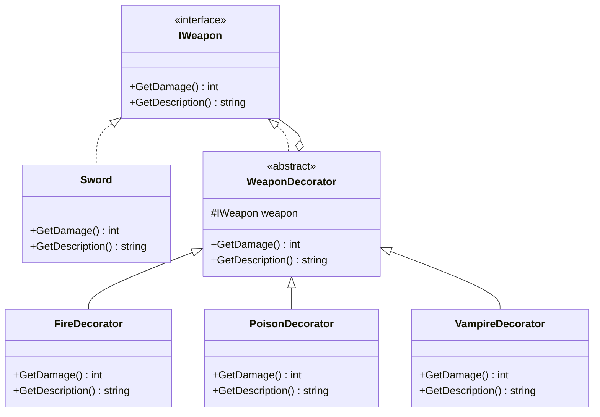

# 게임 개발자를 위한 C# 디자인 패턴: 실전 예제로 배우는 패턴의 힘  

저자: 최흥배, AI-Assisted   
    
권장 개발 환경
- **IDE**: Visual Studio 2022 이상 (Community 이상)
- **.NET**: 버전 9 이상
- **OS**: Windows 10 이상

-----  
  
# Chapter 6: Decorator Pattern (데코레이터 패턴)

## 1. 게임 개발 현장에서...
"이번 업데이트에서 무기 강화 시스템을 추가해야 합니다!"

RPG 게임을 개발 중인 당신은 기획팀으로부터 요구사항을 전달받았다. 기본 무기에 다양한 강화 옵션을 추가해야 한다는 것이다.

- 기본 검: 공격력 10
- 불 속성 추가: +5 화염 데미지
- 독 속성 추가: +3 독 데미지
- 치명타 강화: 크리티컬 확률 +10%
- 흡혈 효과: 데미지의 20% 체력 회복

문제는 이러한 효과들을 **자유롭게 조합**할 수 있어야 한다는 점이다. 플레이어는 "불 속성 + 독 속성 + 흡혈" 같은 조합을 만들 수 있어야 한다.
  

## 2. 패턴 없이 코딩하기
처음에는 상속으로 해결하려고 했다.

```csharp
// 기본 무기
public class Sword
{
    public virtual int GetDamage()
    {
        return 10;
    }

    public virtual string GetDescription()
    {
        return "기본 검";
    }
}

// 불 속성 검
public class FireSword : Sword
{
    public override int GetDamage()
    {
        return 15; // 10 + 5
    }

    public override string GetDescription()
    {
        return "화염 검";
    }
}

// 독 속성 검
public class PoisonSword : Sword
{
    public override int GetDamage()
    {
        return 13; // 10 + 3
    }

    public override string GetDescription()
    {
        return "독 검";
    }
}

// 불 + 독 검??? 이걸 어떻게???
public class FirePoisonSword : Sword
{
    public override int GetDamage()
    {
        return 18; // 10 + 5 + 3
    }

    public override string GetDescription()
    {
        return "화염 독 검";
    }
}

// 불 + 독 + 흡혈 검????
public class FirePoisonVampireSword : Sword
{
    // ... 이게 끝이 아니다...
}
```

조합이 늘어날수록 클래스가 기하급수적으로 증가한다!

```
속성 2개 = 2^2 = 4가지 조합
속성 3개 = 2^3 = 8가지 조합  
속성 5개 = 2^5 = 32가지 조합!!!
```
  

## 3. 문제점 분석

### 조합 폭발(Combinatorial Explosion)

```
[ 문제 상황 시각화 ]

                    Sword
                      |
        ┌─────────────┼─────────────┐
        |             |             |
    FireSword    PoisonSword   VampireSword
        |             |             |
    ┌───┴───┐     ┌───┴───┐     ┌───┴───┐
    |       |     |       |     |       |
FirePoison Fire  Poison  Poison Vampire Vampire
  Sword  Vampire  Vampire  Fire   Fire  Poison
         Sword    Sword    Sword  Sword  Sword
            |       |       |       |       |
            └───────┴───────┴───────┴───────┘
                         |
              FirePoisonVampireSword
              
... 그리고 더 많은 조합들...
```

**구체적인 문제점:**

1. **클래스 폭발**: 5개 속성이면 32개 클래스 필요
2. **코드 중복**: 각 클래스마다 데미지 계산 로직 반복
3. **유지보수 지옥**: 불 속성 데미지를 5에서 7로 변경하려면? 모든 Fire가 들어간 클래스를 수정해야 한다
4. **확장 불가능**: 새 속성 추가 시 기존 코드 대규모 수정
5. **런타임 조합 불가**: 게임 중 동적으로 속성을 추가/제거할 수 없다
  

## 4. 패턴 소개
**데코레이터 패턴**은 객체에 동적으로 새로운 기능을 추가할 수 있게 해준다. 마치 선물을 포장지로 감싸듯이, 기본 객체를 여러 "데코레이터"로 감싸서 기능을 추가한다.

### 핵심 아이디어

```
[ 데코레이터 패턴 개념 ]

         ┌─────────────┐
         │  기본 검    │ 공격력: 10
         │ (Sword)     │
         └─────────────┘
               ↓ 감싸기
         ┌─────────────┐
         │ 불 데코레이터│ +5 추가
         │   (Fire)    │
         │ ┌─────────┐ │
         │ │기본 검  │ │
         │ └─────────┘ │
         └─────────────┘
               ↓ 한 번 더 감싸기
         ┌─────────────┐
         │ 독 데코레이터│ +3 추가
         │  (Poison)   │
         │ ┌─────────┐ │
         │ │  Fire   │ │
         │ │ ┌─────┐ │ │
         │ │ │Sword│ │ │
         │ │ └─────┘ │ │
         │ └─────────┘ │
         └─────────────┘
         
최종 데미지: 10 + 5 + 3 = 18
```

### 구조 다이어그램



### 참여자 역할

1. **Component (IWeapon)**: 공통 인터페이스
2. **ConcreteComponent (Sword)**: 기본 기능을 가진 실제 객체
3. **Decorator (WeaponDecorator)**: 데코레이터 기반 클래스
4. **ConcreteDecorator (FireDecorator 등)**: 구체적인 기능 추가

## 5. 패턴 적용하기

### 단계별 구현

**Step 1: 공통 인터페이스 정의**

```csharp
public interface IWeapon
{
    int GetDamage();
    string GetDescription();
    void Attack();
}
```

**Step 2: 기본 무기 구현**

```csharp
public class Sword : IWeapon
{
    public int GetDamage()
    {
        return 10;
    }

    public string GetDescription()
    {
        return "기본 검";
    }

    public void Attack()
    {
        Console.WriteLine($"{GetDescription()}으로 {GetDamage()} 데미지 공격!");
    }
}

public class Bow : IWeapon
{
    public int GetDamage()
    {
        return 8;
    }

    public string GetDescription()
    {
        return "기본 활";
    }

    public void Attack()
    {
        Console.WriteLine($"{GetDescription()}으로 {GetDamage()} 데미지 공격!");
    }
}
```

**Step 3: 데코레이터 기반 클래스**

```csharp
public abstract class WeaponDecorator : IWeapon
{
    protected IWeapon weapon;

    public WeaponDecorator(IWeapon weapon)
    {
        this.weapon = weapon;
    }

    // 기본적으로 감싸진 무기의 기능을 위임
    public virtual int GetDamage()
    {
        return weapon.GetDamage();
    }

    public virtual string GetDescription()
    {
        return weapon.GetDescription();
    }

    public virtual void Attack()
    {
        weapon.Attack();
    }
}
```

**Step 4: 구체적인 데코레이터들**

```csharp
// 불 속성 데코레이터
public class FireDecorator : WeaponDecorator
{
    private int fireDamage = 5;

    public FireDecorator(IWeapon weapon) : base(weapon)
    {
    }

    public override int GetDamage()
    {
        return weapon.GetDamage() + fireDamage;
    }

    public override string GetDescription()
    {
        return weapon.GetDescription() + " + 화염";
    }

    public override void Attack()
    {
        base.Attack();
        Console.WriteLine($"🔥 화염 효과 발동! +{fireDamage} 데미지");
    }
}

// 독 속성 데코레이터
public class PoisonDecorator : WeaponDecorator
{
    private int poisonDamage = 3;
    private int poisonDuration = 3;

    public PoisonDecorator(IWeapon weapon) : base(weapon)
    {
    }

    public override int GetDamage()
    {
        return weapon.GetDamage() + poisonDamage;
    }

    public override string GetDescription()
    {
        return weapon.GetDescription() + " + 독";
    }

    public override void Attack()
    {
        base.Attack();
        Console.WriteLine($"☠️ 독 효과 발동! {poisonDuration}턴 동안 {poisonDamage} 데미지");
    }
}

// 흡혈 데코레이터
public class VampireDecorator : WeaponDecorator
{
    private float lifestealPercent = 0.2f;

    public VampireDecorator(IWeapon weapon) : base(weapon)
    {
    }

    public override string GetDescription()
    {
        return weapon.GetDescription() + " + 흡혈";
    }

    public override void Attack()
    {
        base.Attack();
        int healAmount = (int)(GetDamage() * lifestealPercent);
        Console.WriteLine($"💉 흡혈 효과! {healAmount} 체력 회복");
    }
}

// 치명타 데코레이터
public class CriticalDecorator : WeaponDecorator
{
    private float critChance = 0.3f;
    private float critMultiplier = 2.0f;

    public CriticalDecorator(IWeapon weapon) : base(weapon)
    {
    }

    public override int GetDamage()
    {
        // 30% 확률로 2배 데미지
        if (Random.value < critChance)
        {
            return (int)(weapon.GetDamage() * critMultiplier);
        }
        return weapon.GetDamage();
    }

    public override string GetDescription()
    {
        return weapon.GetDescription() + " + 치명타";
    }

    public override void Attack()
    {
        int damage = GetDamage();
        base.weapon.Attack(); // 원래 공격
        
        if (damage > weapon.GetDamage())
        {
            Console.WriteLine($"💥 치명타 발동! 데미지 2배!");
        }
    }
}

// 강화 데코레이터 (+레벨마다 데미지 증가)
public class EnhancementDecorator : WeaponDecorator
{
    private int level;
    private int damagePerLevel = 2;

    public EnhancementDecorator(IWeapon weapon, int level) : base(weapon)
    {
        this.level = level;
    }

    public override int GetDamage()
    {
        return weapon.GetDamage() + (level * damagePerLevel);
    }

    public override string GetDescription()
    {
        return weapon.GetDescription() + $" +{level}";
    }

    public override void Attack()
    {
        base.Attack();
        Console.WriteLine($"⭐ 강화 +{level} 효과!");
    }
}
```

**Step 5: 사용 예제**

```csharp
public class WeaponTest
{
    public static void TestWeapons()
    {
        Console.WriteLine("=== 무기 강화 시스템 테스트 ===\n");

        // 1. 기본 검
        IWeapon basicSword = new Sword();
        Console.WriteLine($"[{basicSword.GetDescription()}]");
        basicSword.Attack();
        Console.WriteLine();

        // 2. 화염 검 (기본 검 + 불)
        IWeapon fireSword = new FireDecorator(new Sword());
        Console.WriteLine($"[{fireSword.GetDescription()}]");
        fireSword.Attack();
        Console.WriteLine();

        // 3. 화염 독 검 (기본 검 + 불 + 독)
        IWeapon firePoison = new PoisonDecorator(
            new FireDecorator(new Sword())
        );
        Console.WriteLine($"[{firePoison.GetDescription()}]");
        firePoison.Attack();
        Console.WriteLine();

        // 4. 최강 검 (기본 검 + 불 + 독 + 흡혈 + 치명타)
        IWeapon ultimateSword = new CriticalDecorator(
            new VampireDecorator(
                new PoisonDecorator(
                    new FireDecorator(new Sword())
                )
            )
        );
        Console.WriteLine($"[{ultimateSword.GetDescription()}]");
        ultimateSword.Attack();
        Console.WriteLine();

        // 5. 강화된 화염 검 (+5 강화)
        IWeapon enhancedFire = new EnhancementDecorator(
            new FireDecorator(new Sword()),
            5
        );
        Console.WriteLine($"[{enhancedFire.GetDescription()}]");
        enhancedFire.Attack();
        Console.WriteLine();

        // 6. 활에도 적용 가능!
        IWeapon fireBow = new FireDecorator(new Bow());
        Console.WriteLine($"[{fireBow.GetDescription()}]");
        fireBow.Attack();
    }
}
```

**실행 결과:**

```
=== 무기 강화 시스템 테스트 ===

[기본 검]
기본 검으로 10 데미지 공격!

[기본 검 + 화염]
기본 검으로 10 데미지 공격!
🔥 화염 효과 발동! +5 데미지

[기본 검 + 화염 + 독]
기본 검으로 10 데미지 공격!
🔥 화염 효과 발동! +5 데미지
☠️ 독 효과 발동! 3턴 동안 3 데미지

[기본 검 + 화염 + 독 + 흡혈 + 치명타]
기본 검으로 10 데미지 공격!
🔥 화염 효과 발동! +5 데미지
☠️ 독 효과 발동! 3턴 동안 3 데미지
💉 흡혈 효과! 3 체력 회복
💥 치명타 발동! 데미지 2배!

[기본 검 + 화염 +5]
기본 검으로 10 데미지 공격!
🔥 화염 효과 발동! +5 데미지
⭐ 강화 +5 효과!

[기본 활 + 화염]
기본 활으로 8 데미지 공격!
🔥 화염 효과 발동! +5 데미지
```

## 6. Before/After 비교

### ASCII 비교 차트

```
[ Before: 상속 방식 ]

필요한 클래스 수 (속성 5개 기준): 32개
───────────────────────────────────────
Sword
FireSword
PoisonSword  
VampireSword
FirePoisonSword
FireVampireSword
PoisonVampireSword
FirePoisonVampireSword
... (24개 더!)

새 속성 추가 시: 기존 32개 × 2 = 64개!

[ After: 데코레이터 방식 ]

필요한 클래스 수: 6개
───────────────────────────────────────
Sword (기본)
FireDecorator
PoisonDecorator
VampireDecorator
CriticalDecorator
EnhancementDecorator

새 속성 추가 시: +1개만 추가!
```

### 구체적 비교표

| 항목 | Before (상속) | After (데코레이터) |
|------|--------------|-------------------|
| **클래스 수** | 32개 (5개 속성) | 6개 |
| **코드 라인** | ~500줄 | ~200줄 |
| **새 속성 추가** | 기존 클래스 2배 증가 | 1개 클래스만 추가 |
| **런타임 조합** | 불가능 | 자유롭게 가능 |
| **유지보수** | 모든 조합 클래스 수정 | 해당 데코레이터만 수정 |
| **테스트** | 32개 클래스 테스트 | 6개 클래스 테스트 |

### 실제 개선 효과

```csharp
// Before: 화염 데미지를 5에서 7로 변경하려면
public class FireSword : Sword { /* 수정 */ }
public class FirePoisonSword : Sword { /* 수정 */ }
public class FireVampireSword : Sword { /* 수정 */ }
public class FirePoisonVampireSword : Sword { /* 수정 */ }
// ... 16개 클래스 수정 필요!

// After: 한 곳만 수정
public class FireDecorator : WeaponDecorator
{
    private int fireDamage = 7; // 여기만 변경!
    // ...
}
```
  

## 7. 실전 팁

### 게임에서의 활용 시나리오

**1. RPG 장비 시스템**

```csharp
// 인벤토리에서 아이템 강화
public class InventorySystem
{
    public void EnhanceWeapon(IWeapon weapon, ItemType enhancementType)
    {
        switch (enhancementType)
        {
            case ItemType.FireStone:
                return new FireDecorator(weapon);
            case ItemType.PoisonStone:
                return new PoisonDecorator(weapon);
            case ItemType.VampireStone:
                return new VampireDecorator(weapon);
            // ...
        }
    }
}

// 게임 중 동적 강화
IWeapon playerWeapon = new Sword();
playerWeapon = inventory.EnhanceWeapon(playerWeapon, ItemType.FireStone);
playerWeapon = inventory.EnhanceWeapon(playerWeapon, ItemType.PoisonStone);
```

**2. 버프 시스템**

```csharp
// 캐릭터 능력치 버프
public interface ICharacterStats
{
    int GetAttack();
    int GetDefense();
    float GetSpeed();
}

public class Player : ICharacterStats
{
    public int GetAttack() => 50;
    public int GetDefense() => 30;
    public float GetSpeed() => 5.0f;
}

// 버프 데코레이터
public class AttackBuffDecorator : StatsDecorator
{
    private int buffAmount;
    private float duration;

    public AttackBuffDecorator(ICharacterStats stats, int amount, float duration) 
        : base(stats)
    {
        this.buffAmount = amount;
        this.duration = duration;
    }

    public override int GetAttack()
    {
        return stats.GetAttack() + buffAmount;
    }
}

// 사용
ICharacterStats player = new Player();
player = new AttackBuffDecorator(player, 20, 10f); // 10초간 공격력 +20
player = new SpeedBuffDecorator(player, 2f, 5f);   // 5초간 속도 2배
```

**3. 스킬 조합 시스템**

```csharp
public interface ISkill
{
    void Cast();
    int GetManaCost();
    float GetCooldown();
}

public class Fireball : ISkill
{
    public void Cast() => Console.WriteLine("파이어볼 발사!");
    public int GetManaCost() => 20;
    public float GetCooldown() => 3f;
}

// 스킬 강화 데코레이터
public class QuickCastDecorator : SkillDecorator
{
    public QuickCastDecorator(ISkill skill) : base(skill) { }
    
    public override float GetCooldown()
    {
        return skill.GetCooldown() * 0.5f; // 쿨다운 50% 감소
    }
}

public class PowerfulDecorator : SkillDecorator
{
    public PowerfulDecorator(ISkill skill) : base(skill) { }
    
    public override void Cast()
    {
        base.Cast();
        Console.WriteLine("💥 강화된 데미지!");
    }
    
    public override int GetManaCost()
    {
        return skill.GetManaCost() + 10; // 마나 소모 증가
    }
}

// 조합
ISkill myFireball = new Fireball();
myFireball = new QuickCastDecorator(myFireball);   // 빠른 시전
myFireball = new PowerfulDecorator(myFireball);    // 강력한 데미지
```

### Unity 특화 구현

```csharp
// MonoBehaviour와 함께 사용
public interface IGameObject
{
    void Update();
    void Render();
}

public class Enemy : MonoBehaviour, IGameObject
{
    public void Update()
    {
        // 적 기본 행동
    }

    public void Render()
    {
        // 렌더링
    }
}

// Unity용 데코레이터
public class ShieldDecorator : IGameObject
{
    private IGameObject enemy;
    private GameObject shieldEffect;

    public ShieldDecorator(IGameObject enemy)
    {
        this.enemy = enemy;
        shieldEffect = GameObject.Instantiate(shieldPrefab);
    }

    public void Update()
    {
        enemy.Update();
        // 실드 업데이트 로직
    }

    public void Render()
    {
        enemy.Render();
        // 실드 이펙트 렌더링
    }
}
```

### 성능 최적화 팁

```csharp
// 1. 데코레이터 캐싱
public class WeaponCache
{
    private Dictionary<string, IWeapon> cache = new Dictionary<string, IWeapon>();

    public IWeapon GetEnhancedWeapon(string key)
    {
        if (cache.ContainsKey(key))
            return cache[key];

        // 생성 및 캐싱
        IWeapon weapon = CreateWeapon(key);
        cache[key] = weapon;
        return weapon;
    }
}

// 2. 데코레이터 풀링 (자주 생성/파괴되는 경우)
public class DecoratorPool<T> where T : WeaponDecorator
{
    private Queue<T> pool = new Queue<T>();

    public T Get(IWeapon weapon)
    {
        if (pool.Count > 0)
        {
            var decorator = pool.Dequeue();
            decorator.SetWeapon(weapon); // weapon 재설정
            return decorator;
        }
        return CreateNew(weapon);
    }

    public void Return(T decorator)
    {
        pool.Enqueue(decorator);
    }
}
```

### 주의사항

**1. 너무 많은 레이어 감싸기**

```csharp
// ❌ 피해야 할 패턴
IWeapon weapon = new Sword();
for (int i = 0; i < 100; i++)
{
    weapon = new FireDecorator(weapon); // 100겹 래핑!
}
// GetDamage() 호출 시 100번 함수 호출 발생

// ✅ 개선: 데미지 누적
public class CombinedFireDecorator : WeaponDecorator
{
    private int fireStacks;
    
    public void AddStack()
    {
        fireStacks++;
    }
    
    public override int GetDamage()
    {
        return weapon.GetDamage() + (5 * fireStacks);
    }
}
```

**2. 데코레이터 순서 의존성**

```csharp
// 순서가 중요한 경우 명확히 문서화
// 올바른 순서: 기본 → 퍼센트 증가 → 고정 증가
IWeapon weapon = new Sword();                    // 10
weapon = new PercentBoostDecorator(weapon, 0.5f); // 15 (10 * 1.5)
weapon = new FlatBoostDecorator(weapon, 5);      // 20 (15 + 5)

// 잘못된 순서
weapon = new Sword();                            // 10
weapon = new FlatBoostDecorator(weapon, 5);      // 15 (10 + 5)
weapon = new PercentBoostDecorator(weapon, 0.5f); // 22.5 (15 * 1.5) - 의도와 다름!
```

**3. 직렬화/역직렬화**

```csharp
// 게임 저장/로드 시 데코레이터 재구성
[System.Serializable]
public class WeaponSaveData
{
    public string baseWeaponType;
    public List<string> decorators;
    public List<int> decoratorParams;
}

public class WeaponSerializer
{
    public WeaponSaveData Save(IWeapon weapon)
    {
        var data = new WeaponSaveData();
        // 데코레이터 체인을 리스트로 변환
        // ...
        return data;
    }

    public IWeapon Load(WeaponSaveData data)
    {
        IWeapon weapon = CreateBaseWeapon(data.baseWeaponType);
        foreach (var decorator in data.decorators)
        {
            weapon = ApplyDecorator(weapon, decorator);
        }
        return weapon;
    }
}
```
  


## 8. 연습 문제

### 문제 1: 방어구 시스템 만들기
기본 갑옷에 다양한 강화를 추가하는 시스템을 데코레이터 패턴으로 구현하라.

**요구사항:**
- 기본 갑옷: 방어력 20
- 강화 옵션:
  - 철갑: +10 방어력
  - 가시: 피격 시 데미지 반사 5
  - 가벼움: 이동속도 +20%
  - 재생: 초당 체력 회복 2

```csharp
// 여기에 코드를 작성하시오
public interface IArmor
{
    int GetDefense();
    string GetDescription();
    void OnHit(int damage); // 피격 시 호출
}

// TODO: 나머지 구현
```

### 문제 2: 포션 효과 조합

여러 효과를 가진 포션을 만들 수 있는 시스템을 구현하라.

**요구사항:**
- 기본 포션: 체력 회복 50
- 추가 효과:
  - 마나 회복: +30 마나
  - 속도 증가: 5초간 속도 2배
  - 무적: 3초간 데미지 무효
  - 지속 회복: 10초간 초당 체력 5씩 회복

```csharp
public interface IPotion
{
    void Use(Player player);
    string GetEffects();
}

// TODO: 구현하시오
```

### 문제 3: 적 AI 강화 시스템

기본 적에게 다양한 능력을 추가하는 시스템을 만들어라.

**요구사항:**
- 기본 적: 체력 100, 공격력 10, 이동속도 3
- 강화:
  - 엘리트: 체력 2배, 공격력 1.5배
  - 빠른: 이동속도 2배
  - 보스: 특수 패턴 추가, 체력 5배

**도전 과제:** 데코레이터를 런타임에 추가/제거할 수 있는 시스템 구현

```csharp
// 힌트: 데코레이터 관리자 패턴
public class DecoratorManager
{
    public void AddDecorator(IEnemy enemy, string decoratorType) { }
    public void RemoveDecorator(IEnemy enemy, string decoratorType) { }
}
```

---

### 연습 문제 해답 (스스로 풀어본 후 확인)

<details>
<summary>문제 1 해답 보기</summary>

```csharp
public interface IArmor
{
    int GetDefense();
    string GetDescription();
    void OnHit(int damage);
}

public class BasicArmor : IArmor
{
    public int GetDefense() => 20;
    public string GetDescription() => "기본 갑옷";
    public void OnHit(int damage)
    {
        Console.WriteLine($"{damage} 데미지를 받음");
    }
}

public abstract class ArmorDecorator : IArmor
{
    protected IArmor armor;
    
    public ArmorDecorator(IArmor armor)
    {
        this.armor = armor;
    }
    
    public virtual int GetDefense() => armor.GetDefense();
    public virtual string GetDescription() => armor.GetDescription();
    public virtual void OnHit(int damage) => armor.OnHit(damage);
}

public class IronPlatingDecorator : ArmorDecorator
{
    public IronPlatingDecorator(IArmor armor) : base(armor) { }
    
    public override int GetDefense()
    {
        return armor.GetDefense() + 10;
    }
    
    public override string GetDescription()
    {
        return armor.GetDescription() + " + 철갑";
    }
}

public class ThornDecorator : ArmorDecorator
{
    private int reflectDamage = 5;
    
    public ThornDecorator(IArmor armor) : base(armor) { }
    
    public override string GetDescription()
    {
        return armor.GetDescription() + " + 가시";
    }
    
    public override void OnHit(int damage)
    {
        base.OnHit(damage);
        Console.WriteLine($"🔴 가시 효과! {reflectDamage} 반사 데미지");
    }
}

// 사용 예
IArmor armor = new BasicArmor();
armor = new IronPlatingDecorator(armor);
armor = new ThornDecorator(armor);
Console.WriteLine(armor.GetDescription()); // "기본 갑옷 + 철갑 + 가시"
Console.WriteLine($"방어력: {armor.GetDefense()}"); // 30
armor.OnHit(15); // "15 데미지를 받음" + "🔴 가시 효과! 5 반사 데미지"
```
</details>

---

**핵심 요약:**

1. **데코레이터 패턴**은 상속 대신 **조합**을 사용하여 기능을 동적으로 추가한다
2. **조합 폭발** 문제를 해결하고 코드의 유연성을 크게 향상시킨다
3. 게임에서는 **아이템 강화**, **버프 시스템**, **스킬 조합** 등에 매우 유용하다
4. 런타임에 자유롭게 기능을 **추가/제거**할 수 있다
5. 과도한 래핑과 순서 의존성에 주의해야 한다

**다음 장에서는** 사용자 입력을 객체로 캡슐화하여 실행 취소, 재실행, 매크로 등을 구현하는 **Command Pattern**을 배운다. 턴제 게임의 행동 취소 기능을 만들어보자!   