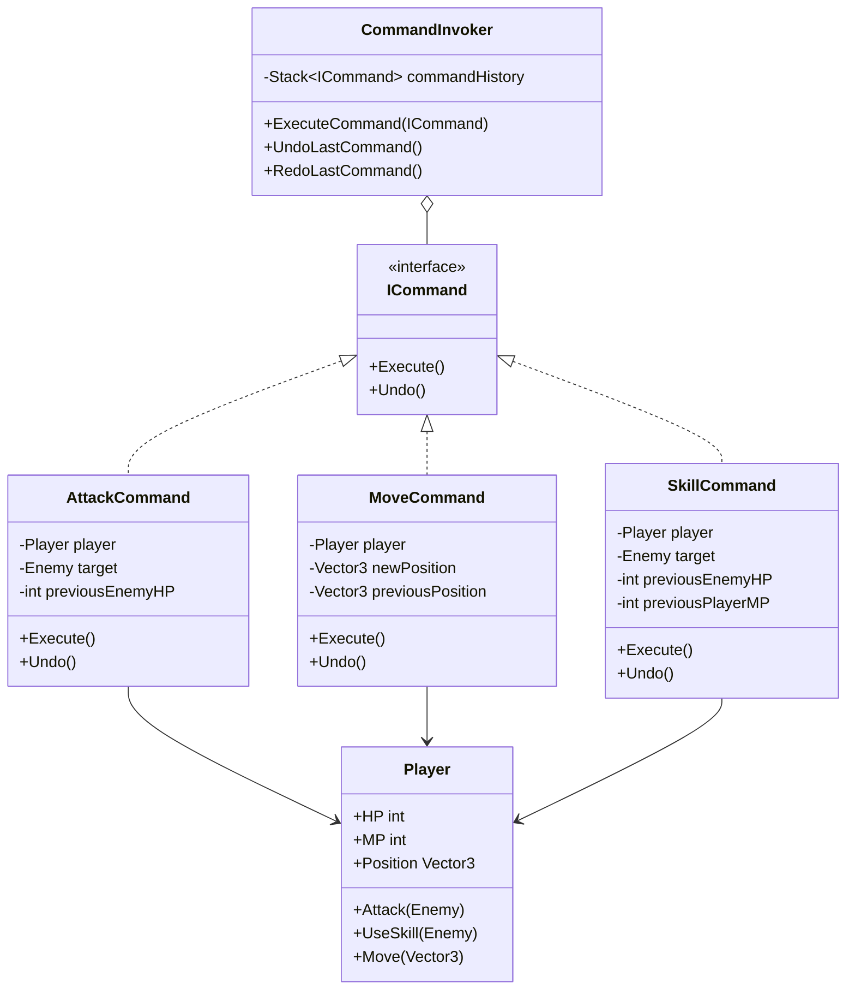

# 게임 개발자를 위한 C# 디자인 패턴: 실전 예제로 배우는 패턴의 힘  

저자: 최흥배, AI-Assisted   
    
권장 개발 환경
- **IDE**: Visual Studio 2022 이상 (Community 이상)
- **.NET**: 버전 9 이상
- **OS**: Windows 10 이상

-----  
  
# Chapter 7: Command Pattern (커맨드 패턴)

## 1. 게임 개발 현장에서...

"턴제 RPG에 실행 취소 기능을 추가해주세요!"

당신은 턴제 전투 게임을 개발 중이다. QA 팀에서 피드백이 왔다. "플레이어가 실수로 잘못된 행동을 선택했을 때 되돌릴 수 있으면 좋겠어요. 특히 전략 게임인데 한 번의 실수로 게임이 끝나버리면 너무 답답합니다."

추가 요구사항도 들어왔다.

- **Undo/Redo**: 최근 3턴까지 되돌리기/다시 실행
- **리플레이**: 전투 과정을 저장하고 다시 재생
- **키 바인딩**: 플레이어가 자유롭게 키 설정 변경
- **매크로**: 자주 쓰는 행동 조합을 단축키로 실행

"이걸 어떻게 구현하지...?"

## 2. 패턴 없이 코딩하기

처음에는 직접 메서드를 호출하는 방식으로 구현했다.

```csharp
public class Player
{
    public int HP { get; set; } = 100;
    public int MP { get; set; } = 50;
    public Vector3 Position { get; set; }
    
    public void Attack(Enemy enemy)
    {
        enemy.HP -= 20;
        Console.WriteLine("플레이어가 공격!");
    }
    
    public void UseSkill(Enemy enemy)
    {
        if (MP >= 10)
        {
            enemy.HP -= 50;
            MP -= 10;
            Console.WriteLine("스킬 사용!");
        }
    }
    
    public void Move(Vector3 newPosition)
    {
        Position = newPosition;
        Console.WriteLine($"이동: {newPosition}");
    }
    
    public void Heal()
    {
        if (MP >= 15)
        {
            HP += 30;
            MP -= 15;
            Console.WriteLine("회복!");
        }
    }
}

public class InputHandler
{
    private Player player;
    private Enemy enemy;
    
    public void HandleInput(KeyCode key)
    {
        // 직접 메서드 호출
        if (key == KeyCode.A)
        {
            player.Attack(enemy);
        }
        else if (key == KeyCode.S)
        {
            player.UseSkill(enemy);
        }
        else if (key == KeyCode.W)
        {
            player.Move(new Vector3(0, 1, 0));
        }
        else if (key == KeyCode.H)
        {
            player.Heal();
        }
    }
}
```

그런데 실행 취소를 어떻게 구현할까?

```csharp
// 무식한 방법: 모든 상태를 저장???
public class TurnManager
{
    private int previousPlayerHP;
    private int previousPlayerMP;
    private int previousEnemyHP;
    private Vector3 previousPlayerPosition;
    
    public void SaveState()
    {
        previousPlayerHP = player.HP;
        previousPlayerMP = player.MP;
        previousEnemyHP = enemy.HP;
        previousPlayerPosition = player.Position;
    }
    
    public void Undo()
    {
        player.HP = previousPlayerHP;
        player.MP = previousPlayerMP;
        enemy.HP = previousEnemyHP;
        player.Position = previousPlayerPosition;
    }
}
```

리플레이는 또 어떻게 하지?

```csharp
// 리플레이 시도... 완전히 잘못된 접근
public class ReplaySystem
{
    private List<string> actions = new List<string>();
    
    public void RecordAction(string action)
    {
        actions.Add(action);
    }
    
    public void Replay()
    {
        foreach (var action in actions)
        {
            // 이걸 어떻게 다시 실행하지???
            if (action == "Attack")
            {
                // ??? 어떻게???
            }
        }
    }
}
```

## 3. 문제점 분석

### 직접 호출의 문제점

```
[ 문제 상황 시각화 ]

InputHandler ──직접호출──> Player.Attack()
      │                         │
      │                    [실행됨]
      │                         │
      │                    [끝. 되돌릴 수 없음]
      │
      └──> Undo??? 
           └──> ❌ 불가능!
```

**구체적인 문제점:**

1. **되돌릴 수 없다**: 메서드가 실행되면 끝. 이전 상태로 돌아갈 방법이 없다
2. **재실행 불가**: 같은 행동을 다시 하려면 코드를 다시 작성해야 한다
3. **저장/로드 불가**: 행동 자체를 저장할 수 없다. 문자열로 저장? 너무 원시적이다
4. **키 바인딩 어려움**: 키와 행동이 하드코딩되어 있다
5. **강한 결합**: InputHandler가 Player의 모든 메서드를 알아야 한다
6. **매크로 구현 불가**: 여러 행동을 묶어서 실행할 수 없다

### 상태 저장 방식의 문제

```csharp
// 캐릭터가 10개면?
int previousPlayer1HP, previousPlayer1MP, previousPlayer1Position...
int previousPlayer2HP, previousPlayer2MP, previousPlayer2Position...
// ... 100개 변수???

// 새 속성 추가되면?
public int Shield; // ← 모든 저장/복원 코드 수정!
```

**유지보수 악몽:**
- 변수 하나 추가할 때마다 저장/복원 코드 모두 수정
- 실수로 한 변수라도 빠뜨리면 버그 발생
- 코드 가독성 최악

## 4. 패턴 소개

**커맨드 패턴**은 요청(행동)을 객체로 캡슐화한다. 이렇게 하면 요청을 저장하고, 큐에 넣고, 되돌리고, 다시 실행할 수 있다.

### 핵심 아이디어

```
[ 기존 방식 ]
Button Click ──> player.Attack() ──> [실행] ──> 끝

[ 커맨드 패턴 ]
Button Click ──> AttackCommand 객체 생성
                        ↓
                  [객체에 저장]
                        ↓
                  Execute() 호출 ──> player.Attack()
                        ↓
                  [Undo 가능!]
                        ↓
                  Undo() 호출 ──> 이전 상태 복원
```

### 비유로 이해하기

**레스토랑 주문 시스템**

```
고객: "스테이크 주세요"
    ↓
웨이터: 주문서(Command) 작성
    ↓
주문서를 주방에 전달
    ↓
주방: 주문서 보고 요리
    ↓
주문 취소? 주문서만 찢으면 됨!
재주문? 같은 주문서 다시 보내면 됨!
```

주문서 = Command 객체!

### 구조 다이어그램



### 참여자 역할

1. **Command (ICommand)**: 명령 인터페이스
2. **ConcreteCommand (AttackCommand 등)**: 구체적인 명령 구현
3. **Invoker (CommandInvoker)**: 명령을 실행하고 관리
4. **Receiver (Player)**: 실제 행동을 수행하는 객체

## 5. 패턴 적용하기

### 단계별 구현

**Step 1: Command 인터페이스 정의**

```csharp
public interface ICommand
{
    void Execute();
    void Undo();
}
```

**Step 2: 구체적인 Command 구현**

```csharp
// 공격 커맨드
public class AttackCommand : ICommand
{
    private Player player;
    private Enemy target;
    private int previousTargetHP;
    
    public AttackCommand(Player player, Enemy target)
    {
        this.player = player;
        this.target = target;
    }
    
    public void Execute()
    {
        // 이전 상태 저장
        previousTargetHP = target.HP;
        
        // 실행
        int damage = 20;
        target.HP -= damage;
        Console.WriteLine($"공격! {target.Name}에게 {damage} 데미지");
    }
    
    public void Undo()
    {
        // 되돌리기
        target.HP = previousTargetHP;
        Console.WriteLine($"공격 취소! {target.Name} HP 복원");
    }
}

// 스킬 커맨드
public class SkillCommand : ICommand
{
    private Player player;
    private Enemy target;
    private int previousTargetHP;
    private int previousPlayerMP;
    private int manaCost = 10;
    private int damage = 50;
    
    public SkillCommand(Player player, Enemy target)
    {
        this.player = player;
        this.target = target;
    }
    
    public void Execute()
    {
        if (player.MP < manaCost)
        {
            Console.WriteLine("마나 부족!");
            return;
        }
        
        // 이전 상태 저장
        previousTargetHP = target.HP;
        previousPlayerMP = player.MP;
        
        // 실행
        target.HP -= damage;
        player.MP -= manaCost;
        Console.WriteLine($"스킬 사용! {damage} 데미지, MP {manaCost} 소모");
    }
    
    public void Undo()
    {
        target.HP = previousTargetHP;
        player.MP = previousPlayerMP;
        Console.WriteLine("스킬 사용 취소!");
    }
}

// 이동 커맨드
public class MoveCommand : ICommand
{
    private Player player;
    private Vector3 newPosition;
    private Vector3 previousPosition;
    
    public MoveCommand(Player player, Vector3 newPosition)
    {
        this.player = player;
        this.newPosition = newPosition;
    }
    
    public void Execute()
    {
        previousPosition = player.Position;
        player.Position = newPosition;
        Console.WriteLine($"이동: {previousPosition} → {newPosition}");
    }
    
    public void Undo()
    {
        player.Position = previousPosition;
        Console.WriteLine($"이동 취소: {newPosition} → {previousPosition}");
    }
}

// 회복 커맨드
public class HealCommand : ICommand
{
    private Player player;
    private int healAmount = 30;
    private int manaCost = 15;
    private int previousHP;
    private int previousMP;
    
    public HealCommand(Player player)
    {
        this.player = player;
    }
    
    public void Execute()
    {
        if (player.MP < manaCost)
        {
            Console.WriteLine("마나 부족!");
            return;
        }
        
        previousHP = player.HP;
        previousMP = player.MP;
        
        player.HP = Math.Min(player.HP + healAmount, player.MaxHP);
        player.MP -= manaCost;
        Console.WriteLine($"회복! HP +{healAmount}, MP -{manaCost}");
    }
    
    public void Undo()
    {
        player.HP = previousHP;
        player.MP = previousMP;
        Console.WriteLine("회복 취소!");
    }
}
```

**Step 3: Command Invoker (실행자)**

```csharp
public class CommandInvoker
{
    private Stack<ICommand> commandHistory = new Stack<ICommand>();
    private Stack<ICommand> redoStack = new Stack<ICommand>();
    private int maxHistorySize = 10;
    
    public void ExecuteCommand(ICommand command)
    {
        command.Execute();
        
        // 히스토리에 추가
        commandHistory.Push(command);
        
        // Redo 스택 초기화 (새 명령 실행 시)
        redoStack.Clear();
        
        // 최대 히스토리 크기 유지
        if (commandHistory.Count > maxHistorySize)
        {
            // 가장 오래된 명령 제거
            var temp = new Stack<ICommand>();
            for (int i = 0; i < maxHistorySize; i++)
            {
                temp.Push(commandHistory.Pop());
            }
            commandHistory.Clear();
            while (temp.Count > 0)
            {
                commandHistory.Push(temp.Pop());
            }
        }
    }
    
    public void UndoLastCommand()
    {
        if (commandHistory.Count == 0)
        {
            Console.WriteLine("되돌릴 명령이 없습니다.");
            return;
        }
        
        ICommand command = commandHistory.Pop();
        command.Undo();
        redoStack.Push(command);
    }
    
    public void RedoLastCommand()
    {
        if (redoStack.Count == 0)
        {
            Console.WriteLine("다시 실행할 명령이 없습니다.");
            return;
        }
        
        ICommand command = redoStack.Pop();
        command.Execute();
        commandHistory.Push(command);
    }
    
    public void ClearHistory()
    {
        commandHistory.Clear();
        redoStack.Clear();
    }
    
    public int GetHistoryCount()
    {
        return commandHistory.Count;
    }
}
```

**Step 4: 입력 처리 개선**

```csharp
public class InputHandler
{
    private Player player;
    private Enemy enemy;
    private CommandInvoker invoker;
    
    public InputHandler(Player player, Enemy enemy)
    {
        this.player = player;
        this.enemy = enemy;
        this.invoker = new CommandInvoker();
    }
    
    public void HandleInput(KeyCode key)
    {
        ICommand command = null;
        
        switch (key)
        {
            case KeyCode.A:
                command = new AttackCommand(player, enemy);
                break;
            case KeyCode.S:
                command = new SkillCommand(player, enemy);
                break;
            case KeyCode.W:
                command = new MoveCommand(player, new Vector3(0, 1, 0));
                break;
            case KeyCode.H:
                command = new HealCommand(player);
                break;
            case KeyCode.Z:
                invoker.UndoLastCommand();
                return;
            case KeyCode.Y:
                invoker.RedoLastCommand();
                return;
        }
        
        if (command != null)
        {
            invoker.ExecuteCommand(command);
        }
    }
}
```

**Step 5: 사용 예제**

```csharp
public class BattleTest
{
    public static void TestBattle()
    {
        Console.WriteLine("=== 턴제 전투 시스템 ===\n");
        
        Player player = new Player 
        { 
            HP = 100, 
            MP = 50, 
            MaxHP = 100,
            Position = new Vector3(0, 0, 0)
        };
        
        Enemy enemy = new Enemy 
        { 
            Name = "슬라임",
            HP = 100 
        };
        
        InputHandler input = new InputHandler(player, enemy);
        
        Console.WriteLine($"플레이어: HP {player.HP}, MP {player.MP}");
        Console.WriteLine($"{enemy.Name}: HP {enemy.HP}\n");
        
        // 턴 1: 일반 공격
        Console.WriteLine("--- 턴 1 ---");
        input.HandleInput(KeyCode.A);
        ShowStatus(player, enemy);
        
        // 턴 2: 스킬 사용
        Console.WriteLine("\n--- 턴 2 ---");
        input.HandleInput(KeyCode.S);
        ShowStatus(player, enemy);
        
        // 턴 3: 실수! 되돌리기
        Console.WriteLine("\n--- 턴 3 ---");
        input.HandleInput(KeyCode.H); // 회복
        ShowStatus(player, enemy);
        Console.WriteLine("\n앗! 회복할 필요 없었는데... Undo!");
        input.HandleInput(KeyCode.Z);
        ShowStatus(player, enemy);
        
        // 다시 실행
        Console.WriteLine("\n아니다, 역시 회복이 필요해! Redo!");
        input.HandleInput(KeyCode.Y);
        ShowStatus(player, enemy);
    }
    
    private static void ShowStatus(Player player, Enemy enemy)
    {
        Console.WriteLine($"플레이어: HP {player.HP}/{player.MaxHP}, MP {player.MP}");
        Console.WriteLine($"{enemy.Name}: HP {enemy.HP}");
    }
}
```

**실행 결과:**

```
=== 턴제 전투 시스템 ===

플레이어: HP 100, MP 50
슬라임: HP 100

--- 턴 1 ---
공격! 슬라임에게 20 데미지
플레이어: HP 100/100, MP 50
슬라임: HP 80

--- 턴 2 ---
스킬 사용! 50 데미지, MP 10 소모
플레이어: HP 100/100, MP 40
슬라임: HP 30

--- 턴 3 ---
회복! HP +30, MP -15
플레이어: HP 100/100, MP 25
슬라임: HP 30

앗! 회복할 필요 없었는데... Undo!
회복 취소!
플레이어: HP 100/100, MP 40
슬라임: HP 30

아니다, 역시 회복이 필요해! Redo!
회복! HP +30, MP -15
플레이어: HP 100/100, MP 25
슬라임: HP 30
```

## 6. Before/After 비교

### ASCII 비교 차트

```
[ Before: 직접 호출 ]

입력 처리
    ↓
즉시 실행
    ↓
끝 (되돌릴 수 없음)

문제점:
❌ Undo 불가능
❌ Redo 불가능  
❌ 리플레이 불가능
❌ 매크로 불가능
❌ 키 바인딩 어려움

[ After: 커맨드 패턴 ]

입력 처리
    ↓
Command 객체 생성
    ↓
Invoker에 전달
    ↓
History에 저장
    ↓
Execute() 실행
    ↓
필요 시 Undo() 호출

장점:
✅ Undo/Redo 구현
✅ 리플레이 시스템
✅ 매크로 기능
✅ 자유로운 키 바인딩
✅ 명령 저장/로드
```

### 구체적 비교표

| 항목 | Before (직접 호출) | After (커맨드 패턴) |
|------|-------------------|---------------------|
| **Undo 기능** | 모든 상태 저장 필요 | Command에 포함 |
| **코드 복잡도** | 높음 (상태 추적) | 낮음 (캡슐화) |
| **새 행동 추가** | 여러 곳 수정 | Command 클래스 추가 |
| **리플레이** | 구현 불가능 | 명령 재실행 |
| **키 바인딩** | 하드코딩 | 동적 변경 가능 |
| **테스트** | 어려움 | 쉬움 (명령 단위) |
| **저장/로드** | 복잡함 | 명령 리스트 직렬화 |

### 실제 개선 효과

```csharp
// Before: 새 행동 추가 시
public void HandleInput(KeyCode key)
{
    // 수정 1: 입력 처리
    if (key == KeyCode.D) { player.Defend(); }
    
    // 수정 2: Undo 처리
    if (lastAction == "Defend") { /* 복잡한 복원 로직 */ }
    
    // 수정 3: 리플레이 처리  
    if (replayAction == "Defend") { /* 재실행 로직 */ }
}

// After: 새 행동 추가 시
public class DefendCommand : ICommand
{
    // 한 곳에서 모든 로직 완결!
    public void Execute() { /* 실행 */ }
    public void Undo() { /* 취소 */ }
}
// 끝! 다른 코드 수정 불필요
```

## 7. 실전 팁

### 게임에서의 활용 시나리오

**1. 리플레이 시스템**

```csharp
public class ReplaySystem
{
    private List<ICommand> recordedCommands = new List<ICommand>();
    private bool isRecording = false;
    private bool isReplaying = false;
    
    public void StartRecording()
    {
        recordedCommands.Clear();
        isRecording = true;
        Console.WriteLine("🔴 녹화 시작");
    }
    
    public void StopRecording()
    {
        isRecording = false;
        Console.WriteLine("⏹️ 녹화 중지");
    }
    
    public void RecordCommand(ICommand command)
    {
        if (isRecording && !isReplaying)
        {
            recordedCommands.Add(command);
        }
    }
    
    public IEnumerator PlayReplay(float speedMultiplier = 1.0f)
    {
        isReplaying = true;
        Console.WriteLine("▶️ 리플레이 재생");
        
        foreach (var command in recordedCommands)
        {
            command.Execute();
            yield return new WaitForSeconds(1.0f / speedMultiplier);
        }
        
        isReplaying = false;
        Console.WriteLine("⏹️ 리플레이 종료");
    }
    
    public void SaveReplay(string filename)
    {
        // 명령 리스트를 JSON으로 저장
        var data = new ReplayData
        {
            Commands = recordedCommands.Select(c => c.Serialize()).ToList()
        };
        File.WriteAllText(filename, JsonUtility.ToJson(data));
    }
    
    public void LoadReplay(string filename)
    {
        var json = File.ReadAllText(filename);
        var data = JsonUtility.FromJson<ReplayData>(json);
        recordedCommands = data.Commands.Select(c => DeserializeCommand(c)).ToList();
    }
}
```

**2. 매크로 시스템**

```csharp
public class MacroCommand : ICommand
{
    private List<ICommand> commands = new List<ICommand>();
    private string name;
    
    public MacroCommand(string name)
    {
        this.name = name;
    }
    
    public void AddCommand(ICommand command)
    {
        commands.Add(command);
    }
    
    public void Execute()
    {
        Console.WriteLine($"매크로 '{name}' 실행");
        foreach (var command in commands)
        {
            command.Execute();
        }
    }
    
    public void Undo()
    {
        Console.WriteLine($"매크로 '{name}' 취소");
        // 역순으로 Undo
        for (int i = commands.Count - 1; i >= 0; i--)
        {
            commands[i].Undo();
        }
    }
}

// 사용 예
public class MacroSystem
{
    public void CreateComboMacro(Player player, Enemy enemy)
    {
        var combo = new MacroCommand("공격 콤보");
        combo.AddCommand(new AttackCommand(player, enemy));
        combo.AddCommand(new AttackCommand(player, enemy));
        combo.AddCommand(new SkillCommand(player, enemy));
        
        // F1 키에 매크로 등록
        keyBindings[KeyCode.F1] = combo;
    }
}
```

**3. 키 바인딩 시스템**

```csharp
public class KeyBindingSystem
{
    private Dictionary<KeyCode, ICommand> keyBindings = 
        new Dictionary<KeyCode, ICommand>();
    
    private Player player;
    private Enemy enemy;
    
    public KeyBindingSystem(Player player, Enemy enemy)
    {
        this.player = player;
        this.enemy = enemy;
        LoadDefaultBindings();
    }
    
    private void LoadDefaultBindings()
    {
        // 기본 키 설정
        keyBindings[KeyCode.A] = new AttackCommand(player, enemy);
        keyBindings[KeyCode.S] = new SkillCommand(player, enemy);
        keyBindings[KeyCode.H] = new HealCommand(player);
    }
    
    public void RebindKey(KeyCode key, ICommand command)
    {
        keyBindings[key] = command;
        Console.WriteLine($"{key} 키가 재설정되었습니다.");
    }
    
    public void HandleInput(KeyCode key)
    {
        if (keyBindings.ContainsKey(key))
        {
            keyBindings[key].Execute();
        }
        else
        {
            Console.WriteLine($"{key} 키에 할당된 명령이 없습니다.");
        }
    }
    
    public void SaveBindings(string filename)
    {
        var data = new Dictionary<string, string>();
        foreach (var binding in keyBindings)
        {
            data[binding.Key.ToString()] = binding.Value.GetType().Name;
        }
        File.WriteAllText(filename, JsonUtility.ToJson(data));
    }
    
    public void ShowBindings()
    {
        Console.WriteLine("=== 현재 키 설정 ===");
        foreach (var binding in keyBindings)
        {
            Console.WriteLine($"{binding.Key}: {binding.Value.GetType().Name}");
        }
    }
}
```

**4. AI 행동 패턴**

```csharp
// AI가 실행할 명령들을 미리 계획
public class AIController
{
    private Queue<ICommand> plannedActions = new Queue<ICommand>();
    private Enemy enemy;
    private Player target;
    
    public void PlanNextTurn()
    {
        plannedActions.Clear();
        
        // 전략에 따라 명령 계획
        if (target.HP < 30)
        {
            // 약한 플레이어에게 공격 집중
            plannedActions.Enqueue(new EnemyAttackCommand(enemy, target));
            plannedActions.Enqueue(new EnemyAttackCommand(enemy, target));
        }
        else if (enemy.HP < 50)
        {
            // 자신의 체력이 낮으면 회복
            plannedActions.Enqueue(new EnemyHealCommand(enemy));
        }
        else
        {
            // 일반 공격
            plannedActions.Enqueue(new EnemyAttackCommand(enemy, target));
        }
    }
    
    public void ExecuteNextAction()
    {
        if (plannedActions.Count > 0)
        {
            var action = plannedActions.Dequeue();
            action.Execute();
        }
    }
    
    public void CancelPlan()
    {
        plannedActions.Clear();
        Console.WriteLine("AI 계획 취소!");
    }
}
```

**5. 퀘스트/업적 시스템과 연동**

```csharp
public class QuestCommand : ICommand
{
    private ICommand actualCommand;
    private QuestSystem questSystem;
    private string questId;
    
    public QuestCommand(ICommand command, QuestSystem quests, string questId)
    {
        this.actualCommand = command;
        this.questSystem = quests;
        this.questId = questId;
    }
    
    public void Execute()
    {
        actualCommand.Execute();
        
        // 퀘스트 진행도 업데이트
        questSystem.UpdateProgress(questId);
    }
    
    public void Undo()
    {
        actualCommand.Undo();
        questSystem.RevertProgress(questId);
    }
}

// 사용 예
var attackWithQuest = new QuestCommand(
    new AttackCommand(player, enemy),
    questSystem,
    "kill_10_enemies"
);
```

### Unity 특화 구현

```csharp
// Unity MonoBehaviour와 통합
public class UnityCommandInvoker : MonoBehaviour
{
    private CommandInvoker invoker = new CommandInvoker();
    
    void Update()
    {
        // Ctrl+Z로 Undo
        if (Input.GetKey(KeyCode.LeftControl) && Input.GetKeyDown(KeyCode.Z))
        {
            invoker.UndoLastCommand();
        }
        
        // Ctrl+Y로 Redo
        if (Input.GetKey(KeyCode.LeftControl) && Input.GetKeyDown(KeyCode.Y))
        {
            invoker.RedoLastCommand();
        }
    }
    
    public void ExecuteCommand(ICommand command)
    {
        invoker.ExecuteCommand(command);
    }
}

// Unity의 Coroutine 활용
public class DelayedCommand : ICommand
{
    private ICommand command;
    private float delay;
    private MonoBehaviour context;
    
    public DelayedCommand(ICommand command, float delay, MonoBehaviour context)
    {
        this.command = command;
        this.delay = delay;
        this.context = context;
    }
    
    public void Execute()
    {
        context.StartCoroutine(ExecuteAfterDelay());
    }
    
    private IEnumerator ExecuteAfterDelay()
    {
        yield return new WaitForSeconds(delay);
        command.Execute();
    }
    
    public void Undo()
    {
        command.Undo();
    }
}
```

### 성능 최적화 팁

```csharp
// 1. Command 객체 풀링
public class CommandPool<T> where T : ICommand, new()
{
    private Queue<T> pool = new Queue<T>();
    
    public T Get()
    {
        if (pool.Count > 0)
            return pool.Dequeue();
        return new T();
    }
    
    public void Return(T command)
    {
        pool.Enqueue(command);
    }
}

// 2. 메모리 효율적인 히스토리 관리
public class CircularCommandHistory
{
    private ICommand[] history;
    private int head = 0;
    private int count = 0;
    
    public CircularCommandHistory(int maxSize)
    {
        history = new ICommand[maxSize];
    }
    
    public void Add(ICommand command)
    {
        history[head] = command;
        head = (head + 1) % history.Length;
        count = Math.Min(count + 1, history.Length);
    }
    
    public ICommand GetLast()
    {
        if (count == 0) return null;
        int index = (head - 1 + history.Length) % history.Length;
        return history[index];
    }
}

// 3. 가벼운 Command (상태 저장 최소화)
public class LightweightMoveCommand : ICommand
{
    private static Player player; // static으로 공유
    private Vector3 delta; // 절대 위치 대신 변화량만 저장
    
    public LightweightMoveCommand(Vector3 delta)
    {
        this.delta = delta;
    }
    
    public void Execute()
    {
        player.Position += delta;
    }
    
    public void Undo()
    {
        player.Position -= delta;
    }
}
```

### 주의사항

**1. 모든 것을 Command로 만들지 말 것**

```csharp
// ❌ 과도한 사용
public class BlinkEyesCommand : ICommand { } // 눈 깜박임까지 Command?
public class BreathCommand : ICommand { } // 숨쉬기까지 Command?

// ✅ 적절한 사용
// Undo가 필요하거나, 저장/재실행이 필요한 행동만 Command로!
```

**2. Command는 작고 단순하게**

```csharp
// ❌ 복잡한 Command
public class ComplexGameTurnCommand : ICommand
{
    public void Execute()
    {
        // 50줄의 복잡한 로직...
        UpdateAllEnemies();
        UpdateAllPlayers();
        CheckVictoryConditions();
        UpdateUI();
        // ...
    }
}

// ✅ 작은 Command들의 조합
public class GameTurnCommand : MacroCommand
{
    public GameTurnCommand()
    {
        AddCommand(new UpdateEnemiesCommand());
        AddCommand(new UpdatePlayersCommand());
        AddCommand(new CheckVictoryCommand());
        AddCommand(new UpdateUICommand());
    }
}
```

**3. 직렬화 고려**

```csharp
[Serializable]
public class SerializableCommand : ICommand
{
    public string commandType;
    public Dictionary<string, object> parameters;
    
    public void Execute()
    {
        // 저장 가능한 형태로 구현
    }
    
    public string Serialize()
    {
        return JsonUtility.ToJson(this);
    }
    
    public static ICommand Deserialize(string json)
    {
        var data = JsonUtility.FromJson<SerializableCommand>(json);
        return CreateCommand(data.commandType, data.parameters);
    }
}
```

## 8. 연습 문제

### 문제 1: 체스 게임 만들기

체스 게임에서 Undo/Redo가 가능한 이동 시스템을 구현하라.

**요구사항:**
- 말의 이동을 Command로 구현
- 잡힌 말 복원 지원
- 캐슬링, 앙파상 같은 특수 이동 지원
- 최근 10수까지 되돌리기 가능

```csharp
public interface IChessPiece
{
    Position Position { get; set; }
    PieceType Type { get; }
}

public class ChessBoard
{
    private IChessPiece[,] board = new IChessPiece[8, 8];
    
    public IChessPiece GetPiece(Position pos) { /* ... */ }
    public void SetPiece(Position pos, IChessPiece piece) { /* ... */ }
}

// TODO: MoveCommand 구현
public class ChessMoveCommand : ICommand
{
    // 여기에 구현하시오
}
```

### 문제 2: 건설 시뮬레이션

건물 건설/철거가 가능한 시뮬레이션 게임을 만들어라.

**요구사항:**
- 건물 배치: BuildCommand
- 건물 철거: DemolishCommand
- 건물 업그레이드: UpgradeCommand
- 실행 취소 시 자원 환불
- 리플레이 모드에서 건설 과정 재생

```csharp
public class BuildCommand : ICommand
{
    private City city;
    private Building building;
    private Position position;
    private int cost;
    
    // TODO: 구현하시오
}
```

### 문제 3: 전투 리플레이 시스템

격투 게임의 전투를 녹화하고 재생하는 시스템을 만들어라.

**요구사항:**
- 모든 입력을 Command로 기록
- 프레임 단위로 정확한 재생
- 배속 조절 (0.5x, 1x, 2x)
- 특정 프레임으로 이동
- 파일로 저장/로드

```csharp
public class FightingGameReplay
{
    private List<(float timestamp, ICommand command)> timeline;
    
    // TODO: 구현하시오
    public void Record(ICommand command) { }
    public IEnumerator PlayReplay(float speed) { }
    public void JumpToFrame(int frame) { }
}
```

**도전 과제:** 리플레이 도중 다른 행동을 시도하면 새로운 타임라인을 생성하는 시스템 구현 (타임 패러독스 방지)

---

### 연습 문제 해답 (스스로 풀어본 후 확인)

<details>
<summary>문제 1 해답 보기</summary>

```csharp
public class ChessMoveCommand : ICommand
{
    private ChessBoard board;
    private IChessPiece piece;
    private Position from;
    private Position to;
    private IChessPiece capturedPiece;
    
    public ChessMoveCommand(ChessBoard board, Position from, Position to)
    {
        this.board = board;
        this.from = from;
        this.to = to;
        this.piece = board.GetPiece(from);
    }
    
    public void Execute()
    {
        // 목표 위치의 말 저장 (잡힌 말)
        capturedPiece = board.GetPiece(to);
        
        // 이동 실행
        board.SetPiece(to, piece);
        board.SetPiece(from, null);
        piece.Position = to;
        
        Console.WriteLine($"{piece.Type} 이동: {from} → {to}");
        if (capturedPiece != null)
        {
            Console.WriteLine($"{capturedPiece.Type} 포획!");
        }
    }
    
    public void Undo()
    {
        // 원래 위치로 복원
        board.SetPiece(from, piece);
        board.SetPiece(to, capturedPiece);
        piece.Position = from;
        
        Console.WriteLine($"이동 취소: {to} → {from}");
        if (capturedPiece != null)
        {
            Console.WriteLine($"{capturedPiece.Type} 복원!");
        }
    }
}

// 캐슬링 (특수 이동)
public class CastlingCommand : ICommand
{
    private ChessBoard board;
    private IChessPiece king;
    private IChessPiece rook;
    private Position kingFrom, kingTo;
    private Position rookFrom, rookTo;
    
    public void Execute()
    {
        // 킹 이동
        board.SetPiece(kingTo, king);
        board.SetPiece(kingFrom, null);
        king.Position = kingTo;
        
        // 룩 이동
        board.SetPiece(rookTo, rook);
        board.SetPiece(rookFrom, null);
        rook.Position = rookTo;
        
        Console.WriteLine("캐슬링!");
    }
    
    public void Undo()
    {
        // 둘 다 원위치
        board.SetPiece(kingFrom, king);
        board.SetPiece(kingTo, null);
        king.Position = kingFrom;
        
        board.SetPiece(rookFrom, rook);
        board.SetPiece(rookTo, null);
        rook.Position = rookFrom;
        
        Console.WriteLine("캐슬링 취소!");
    }
}
```
</details>

<details>
<summary>문제 2 해답 보기</summary>

```csharp
public class BuildCommand : ICommand
{
    private City city;
    private Building building;
    private Position position;
    private int cost;
    
    public BuildCommand(City city, BuildingType type, Position pos)
    {
        this.city = city;
        this.position = pos;
        this.building = BuildingFactory.Create(type);
        this.cost = building.BuildCost;
    }
    
    public void Execute()
    {
        if (city.Gold < cost)
        {
            Console.WriteLine($"자금 부족! ({cost} 골드 필요)");
            return;
        }
        
        if (!city.CanBuildAt(position))
        {
            Console.WriteLine("이곳에는 건설할 수 없습니다!");
            return;
        }
        
        city.Gold -= cost;
        city.PlaceBuilding(position, building);
        Console.WriteLine($"{building.Name} 건설 완료! (비용: {cost})");
    }
    
    public void Undo()
    {
        city.RemoveBuilding(position);
        city.Gold += cost;
        Console.WriteLine($"{building.Name} 철거! (환불: {cost})");
    }
}

public class DemolishCommand : ICommand
{
    private City city;
    private Position position;
    private Building removedBuilding;
    private int refund;
    
    public DemolishCommand(City city, Position pos)
    {
        this.city = city;
        this.position = pos;
    }
    
    public void Execute()
    {
        removedBuilding = city.GetBuilding(position);
        if (removedBuilding == null)
        {
            Console.WriteLine("철거할 건물이 없습니다!");
            return;
        }
        
        refund = removedBuilding.BuildCost / 2; // 50% 환불
        city.RemoveBuilding(position);
        city.Gold += refund;
        
        Console.WriteLine($"{removedBuilding.Name} 철거! (환불: {refund})");
    }
    
    public void Undo()
    {
        city.PlaceBuilding(position, removedBuilding);
        city.Gold -= refund;
        Console.WriteLine($"{removedBuilding.Name} 복구!");
    }
}
```
</details>

---

**핵심 요약:**

1. **커맨드 패턴**은 요청을 **객체로 캡슐화**하여 저장, 취소, 재실행을 가능하게 한다
2. **Undo/Redo** 시스템을 깔끔하게 구현할 수 있다
3. 게임에서는 **리플레이**, **매크로**, **키 바인딩** 등에 매우 유용하다
4. 명령을 **저장**하면 나중에 다시 실행하거나 파일로 저장할 수 있다
5. AI 계획, 퀘스트 시스템 등 다양한 곳에 활용 가능하다

**다음 장에서는** 객체 간의 느슨한 결합을 위한 **Observer Pattern**을 배운다. 플레이어 HP가 변경되면 UI가 자동으로 업데이트되는 이벤트 시스템을 만들어보자!   