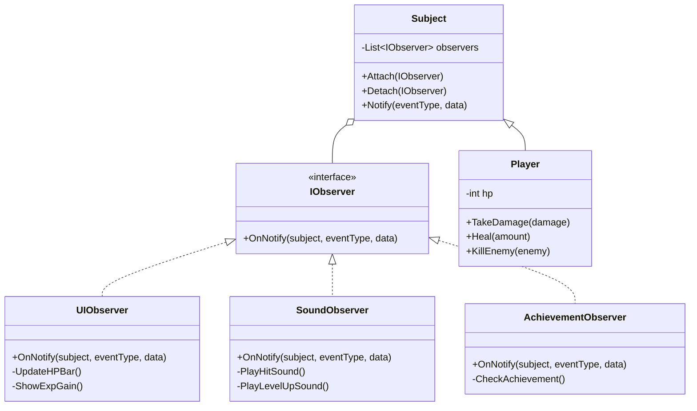

# 게임 개발자를 위한 C# 디자인 패턴: 실전 예제로 배우는 패턴의 힘  

저자: 최흥배, AI-Assisted   
    
권장 개발 환경
- **IDE**: Visual Studio 2022 이상 (Community 이상)
- **.NET**: 버전 9 이상
- **OS**: Windows 10 이상

-----  
  
# Chapter 8: Observer Pattern (옵저버 패턴)

## 1. 게임 개발 현장에서...

"플레이어 HP가 변하면 UI도 업데이트되어야 하고, 업적 시스템도 체크해야 하고, 사운드도 재생해야 하는데..."

당신은 RPG 게임을 개발 중이다. 플레이어가 데미지를 받으면 여러 가지 일이 동시에 일어나야 한다.

**요구사항:**
- HP 바 UI 업데이트
- HP가 30% 이하면 경고 사운드 재생
- HP가 0이 되면 게임 오버 처리
- "첫 피해 받기" 업적 체크
- 퀘스트 진행도 업데이트 (몬스터 처치 횟수)
- 파티클 이펙트 재생
- 화면 흔들림 효과

"플레이어 클래스에서 이 모든 걸 직접 호출해야 하나? 코드가 너무 복잡해질 것 같은데..."

## 2. 패턴 없이 코딩하기

처음에는 Player 클래스에서 모든 것을 직접 처리했다.

```csharp
public class Player
{
    public int HP { get; private set; } = 100;
    public int MaxHP { get; private set; } = 100;
    
    // 모든 시스템에 대한 참조 필요!
    private UIManager uiManager;
    private SoundManager soundManager;
    private AchievementSystem achievementSystem;
    private QuestSystem questSystem;
    private ParticleSystem particleSystem;
    private CameraController cameraController;
    
    public Player(
        UIManager ui, 
        SoundManager sound, 
        AchievementSystem achievement,
        QuestSystem quest,
        ParticleSystem particle,
        CameraController camera)
    {
        this.uiManager = ui;
        this.soundManager = sound;
        this.achievementSystem = achievement;
        this.questSystem = quest;
        this.particleSystem = particle;
        this.cameraController = camera;
    }
    
    public void TakeDamage(int damage)
    {
        HP -= damage;
        
        // 모든 시스템을 하나하나 호출...
        uiManager.UpdateHPBar(HP, MaxHP);
        
        if (HP <= MaxHP * 0.3f)
        {
            soundManager.PlayWarningSound();
            uiManager.ShowLowHealthWarning();
        }
        
        if (HP <= 0)
        {
            HP = 0;
            soundManager.PlayDeathSound();
            uiManager.ShowGameOver();
            // GameOver 처리...
        }
        
        achievementSystem.CheckAchievement("first_damage");
        particleSystem.PlayHitEffect(transform.position);
        cameraController.Shake(0.2f);
        
        // 나중에 추가 요구사항이 들어오면???
        // 이 메서드를 또 수정해야 한다!
    }
}

// 적을 처치했을 때도 비슷한 문제
public void KillEnemy(Enemy enemy)
{
    int exp = enemy.ExpValue;
    Experience += exp;
    
    uiManager.UpdateExpBar(Experience);
    uiManager.ShowExpGain(exp);
    soundManager.PlayExpSound();
    achievementSystem.CheckKillCount(enemy.Type);
    questSystem.UpdateKillQuest(enemy.Type);
    
    if (Experience >= NextLevelExp)
    {
        LevelUp();
        uiManager.ShowLevelUpEffect();
        soundManager.PlayLevelUpSound();
        achievementSystem.CheckLevel(Level);
        // ...
    }
}
```

새로운 기능을 추가하려면?

```csharp
// 새 요구사항: 데미지 로그 시스템 추가
private CombatLogSystem combatLog; // ← 또 추가!

public Player(
    UIManager ui, 
    SoundManager sound, 
    AchievementSystem achievement,
    QuestSystem quest,
    ParticleSystem particle,
    CameraController camera,
    CombatLogSystem combatLog) // ← 생성자 변경!
{
    // ...
    this.combatLog = combatLog; // ← 초기화 추가
}

public void TakeDamage(int damage)
{
    HP -= damage;
    
    // 기존 코드들...
    combatLog.AddEntry($"플레이어가 {damage} 데미지를 받음"); // ← 추가!
}
```

## 3. 문제점 분석

### 강한 결합의 문제

```
[ 문제 상황 시각화 ]

Player ──────┬───────> UIManager
             ├───────> SoundManager
             ├───────> AchievementSystem
             ├───────> QuestSystem
             ├───────> ParticleSystem
             ├───────> CameraController
             └───────> CombatLogSystem (new!)
             
Player는 7개의 시스템을 모두 알아야 함!
새 시스템 추가 시 Player 코드 수정 필수!
```

**구체적인 문제점:**

1. **강한 결합**: Player가 모든 시스템을 직접 알고 참조해야 한다
2. **수정 지옥**: 새 기능 추가 시 Player 클래스를 매번 수정해야 한다
3. **테스트 어려움**: Player를 테스트하려면 7개 시스템을 모두 Mock으로 만들어야 한다
4. **재사용 불가**: Player를 다른 프로젝트에서 재사용하려면? 모든 의존성을 함께 가져가야 한다
5. **단일 책임 원칙 위반**: Player가 전투, UI, 사운드, 업적 등 너무 많은 책임을 진다
6. **확장성 제로**: 런타임에 새로운 리스너를 추가/제거할 수 없다

### 생성자 매개변수 폭발

```csharp
// 이게 정상인가?
public Player(
    UIManager ui,           // 1
    SoundManager sound,     // 2
    AchievementSystem ach,  // 3
    QuestSystem quest,      // 4
    ParticleSystem particle,// 5
    CameraController cam,   // 6
    CombatLogSystem log,    // 7
    TutorialSystem tutorial,// 8
    AnalyticsSystem analytics, // 9
    StreamingSystem streaming  // 10
    // ... 더 많아질 수 있다
)
```

**유지보수 악몽:**
- 매개변수 순서 바뀌면 버그 발생
- 모든 Player 생성 코드를 찾아서 수정
- 코드 가독성 최악

## 4. 패턴 소개

**옵저버 패턴**은 한 객체의 상태 변화를 관찰하는 다수의 "관찰자"들에게 자동으로 알림을 보내는 패턴이다. 주체(Subject)는 관찰자들의 목록만 관리하며, 관찰자가 누구인지 구체적으로 알 필요가 없다.

### 핵심 아이디어

```
[ 기존 방식: 강한 결합 ]

Player ──알고있음──> UIManager
Player ──알고있음──> SoundManager
Player ──알고있음──> AchievementSystem

[ 옵저버 패턴: 느슨한 결합 ]

Player (Subject)
   │
   └──> observers 리스트
         ├──> UIManager (Observer)
         ├──> SoundManager (Observer)
         └──> AchievementSystem (Observer)

Player는 "누군가 관찰하고 있다"는 것만 알고,
그게 누구인지는 몰라도 된다!
```

### 비유로 이해하기

**유튜브 구독 시스템**

```
유튜버(Subject): 새 영상 업로드
    ↓
    자동 알림
    ↓
구독자들(Observers):
- 구독자A: 이메일 알림 받음
- 구독자B: 앱 푸시 알림 받음
- 구독자C: 알림 꺼놨음 (구독 취소)

유튜버는 누가 구독했는지 일일이 몰라도 됨!
구독자는 자유롭게 구독/구독취소 가능!
```

### 구조 다이어그램



### 참여자 역할

1. **Subject**: 관찰 대상. 상태가 변할 때 옵저버들에게 알림
2. **Observer**: 관찰자 인터페이스. 알림을 받을 메서드 정의
3. **ConcreteObserver**: 구체적인 관찰자. 알림 받았을 때 수행할 행동 구현
4. **ConcreteSubject**: 구체적인 주체. 실제 상태를 가지고 있음

## 5. 패턴 적용하기

### 단계별 구현

**Step 1: 이벤트 타입 정의**

```csharp
public enum GameEventType
{
    PlayerDamaged,
    PlayerHealed,
    PlayerDied,
    PlayerLevelUp,
    EnemyKilled,
    ItemCollected,
    QuestCompleted
}

// 이벤트 데이터를 담는 클래스
public class GameEventData
{
    public int IntValue { get; set; }
    public float FloatValue { get; set; }
    public string StringValue { get; set; }
    public object CustomData { get; set; }
    
    public GameEventData(int value = 0)
    {
        IntValue = value;
    }
    
    public GameEventData(float value)
    {
        FloatValue = value;
    }
    
    public GameEventData(string value)
    {
        StringValue = value;
    }
}
```

**Step 2: Observer 인터페이스**

```csharp
public interface IGameObserver
{
    void OnNotify(object subject, GameEventType eventType, GameEventData data);
}
```

**Step 3: Subject 기반 클래스**

```csharp
public abstract class Subject
{
    private List<IGameObserver> observers = new List<IGameObserver>();
    
    public void Attach(IGameObserver observer)
    {
        if (!observers.Contains(observer))
        {
            observers.Add(observer);
            Console.WriteLine($"[Subject] 옵저버 등록: {observer.GetType().Name}");
        }
    }
    
    public void Detach(IGameObserver observer)
    {
        if (observers.Remove(observer))
        {
            Console.WriteLine($"[Subject] 옵저버 제거: {observer.GetType().Name}");
        }
    }
    
    protected void Notify(GameEventType eventType, GameEventData data = null)
    {
        Console.WriteLine($"[Subject] 이벤트 발생: {eventType}");
        
        foreach (var observer in observers)
        {
            observer.OnNotify(this, eventType, data);
        }
    }
    
    public int ObserverCount => observers.Count;
}
```

**Step 4: Player를 Subject로 변경**

```csharp
public class Player : Subject
{
    public int HP { get; private set; } = 100;
    public int MaxHP { get; private set; } = 100;
    public int Level { get; private set; } = 1;
    public int Experience { get; private set; } = 0;
    public int NextLevelExp { get; private set; } = 100;
    
    public void TakeDamage(int damage)
    {
        if (HP <= 0) return;
        
        HP -= damage;
        HP = Math.Max(HP, 0);
        
        // 이벤트 발생만 하면 됨!
        Notify(GameEventType.PlayerDamaged, new GameEventData(damage));
        
        if (HP <= 0)
        {
            Notify(GameEventType.PlayerDied, null);
        }
    }
    
    public void Heal(int amount)
    {
        int oldHP = HP;
        HP = Math.Min(HP + amount, MaxHP);
        int actualHealing = HP - oldHP;
        
        if (actualHealing > 0)
        {
            Notify(GameEventType.PlayerHealed, new GameEventData(actualHealing));
        }
    }
    
    public void GainExperience(int exp)
    {
        Experience += exp;
        
        var data = new GameEventData(exp);
        Notify(GameEventType.ItemCollected, data); // 경험치 획득 알림
        
        while (Experience >= NextLevelExp)
        {
            LevelUp();
        }
    }
    
    private void LevelUp()
    {
        Level++;
        Experience -= NextLevelExp;
        NextLevelExp = (int)(NextLevelExp * 1.5f);
        
        // 레벨업 시 HP 전체 회복
        HP = MaxHP;
        
        Notify(GameEventType.PlayerLevelUp, new GameEventData(Level));
    }
    
    public void KillEnemy(string enemyType, int expReward)
    {
        var data = new GameEventData 
        { 
            StringValue = enemyType,
            IntValue = expReward 
        };
        
        Notify(GameEventType.EnemyKilled, data);
        GainExperience(expReward);
    }
}
```

**Step 5: 구체적인 Observer들**

```csharp
// UI 업데이트 옵저버
public class UIObserver : IGameObserver
{
    public void OnNotify(object subject, GameEventType eventType, GameEventData data)
    {
        if (!(subject is Player player)) return;
        
        switch (eventType)
        {
            case GameEventType.PlayerDamaged:
                UpdateHPBar(player);
                ShowDamageNumber(data.IntValue);
                
                if (player.HP <= player.MaxHP * 0.3f)
                {
                    ShowLowHealthWarning();
                }
                break;
                
            case GameEventType.PlayerHealed:
                UpdateHPBar(player);
                ShowHealNumber(data.IntValue);
                break;
                
            case GameEventType.PlayerDied:
                ShowGameOverScreen();
                break;
                
            case GameEventType.PlayerLevelUp:
                ShowLevelUpEffect(data.IntValue);
                UpdateHPBar(player);
                break;
                
            case GameEventType.ItemCollected:
                ShowExpGain(data.IntValue);
                break;
        }
    }
    
    private void UpdateHPBar(Player player)
    {
        float hpPercent = (float)player.HP / player.MaxHP;
        Console.WriteLine($"[UI] HP 바 업데이트: {player.HP}/{player.MaxHP} ({hpPercent:P0})");
    }
    
    private void ShowDamageNumber(int damage)
    {
        Console.WriteLine($"[UI] 데미지 표시: -{damage}");
    }
    
    private void ShowHealNumber(int heal)
    {
        Console.WriteLine($"[UI] 회복량 표시: +{heal}");
    }
    
    private void ShowLowHealthWarning()
    {
        Console.WriteLine($"[UI] ⚠️ 체력 부족 경고!");
    }
    
    private void ShowGameOverScreen()
    {
        Console.WriteLine($"[UI] 💀 게임 오버 화면 표시");
    }
    
    private void ShowLevelUpEffect(int level)
    {
        Console.WriteLine($"[UI] ⭐ 레벨 업! Lv.{level}");
    }
    
    private void ShowExpGain(int exp)
    {
        Console.WriteLine($"[UI] 경험치 획득: +{exp}");
    }
}

// 사운드 옵저버
public class SoundObserver : IGameObserver
{
    public void OnNotify(object subject, GameEventType eventType, GameEventData data)
    {
        switch (eventType)
        {
            case GameEventType.PlayerDamaged:
                PlayHitSound();
                
                if (subject is Player player && player.HP <= player.MaxHP * 0.3f)
                {
                    PlayWarningSound();
                }
                break;
                
            case GameEventType.PlayerHealed:
                PlayHealSound();
                break;
                
            case GameEventType.PlayerDied:
                PlayDeathSound();
                break;
                
            case GameEventType.PlayerLevelUp:
                PlayLevelUpSound();
                break;
                
            case GameEventType.EnemyKilled:
                PlayEnemyDeathSound();
                break;
        }
    }
    
    private void PlayHitSound() => Console.WriteLine("[Sound] 🔊 피격 사운드");
    private void PlayHealSound() => Console.WriteLine("[Sound] 🔊 회복 사운드");
    private void PlayDeathSound() => Console.WriteLine("[Sound] 🔊 사망 사운드");
    private void PlayLevelUpSound() => Console.WriteLine("[Sound] 🔊 레벨업 사운드");
    private void PlayWarningSound() => Console.WriteLine("[Sound] 🔊 경고음");
    private void PlayEnemyDeathSound() => Console.WriteLine("[Sound] 🔊 적 처치 사운드");
}

// 업적 시스템 옵저버
public class AchievementObserver : IGameObserver
{
    private bool firstDamageTaken = false;
    private int enemiesKilled = 0;
    private bool reachedLevel5 = false;
    
    public void OnNotify(object subject, GameEventType eventType, GameEventData data)
    {
        switch (eventType)
        {
            case GameEventType.PlayerDamaged:
                if (!firstDamageTaken)
                {
                    firstDamageTaken = true;
                    UnlockAchievement("첫 피해");
                }
                break;
                
            case GameEventType.EnemyKilled:
                enemiesKilled++;
                
                if (enemiesKilled == 1)
                    UnlockAchievement("첫 번째 처치");
                else if (enemiesKilled == 10)
                    UnlockAchievement("10마리 처치");
                else if (enemiesKilled == 100)
                    UnlockAchievement("100마리 처치");
                break;
                
            case GameEventType.PlayerLevelUp:
                int level = data.IntValue;
                
                if (level >= 5 && !reachedLevel5)
                {
                    reachedLevel5 = true;
                    UnlockAchievement("레벨 5 달성");
                }
                
                if (level >= 10)
                    UnlockAchievement("레벨 10 달성");
                break;
        }
    }
    
    private void UnlockAchievement(string name)
    {
        Console.WriteLine($"[Achievement] 🏆 업적 달성: {name}");
    }
}

// 퀘스트 시스템 옵저버
public class QuestObserver : IGameObserver
{
    private Dictionary<string, int> enemyKillCount = new Dictionary<string, int>();
    
    public void OnNotify(object subject, GameEventType eventType, GameEventData data)
    {
        if (eventType == GameEventType.EnemyKilled)
        {
            string enemyType = data.StringValue;
            
            if (!enemyKillCount.ContainsKey(enemyType))
                enemyKillCount[enemyType] = 0;
            
            enemyKillCount[enemyType]++;
            
            Console.WriteLine($"[Quest] 퀘스트 진행: {enemyType} {enemyKillCount[enemyType]}마리 처치");
            
            // 퀘스트 완료 체크
            if (enemyType == "슬라임" && enemyKillCount[enemyType] >= 5)
            {
                CompleteQuest("슬라임 5마리 처치");
            }
        }
    }
    
    private void CompleteQuest(string questName)
    {
        Console.WriteLine($"[Quest] ✅ 퀘스트 완료: {questName}");
    }
}

// 전투 로그 옵저버
public class CombatLogObserver : IGameObserver
{
    private List<string> log = new List<string>();
    
    public void OnNotify(object subject, GameEventType eventType, GameEventData data)
    {
        string logEntry = "";
        
        switch (eventType)
        {
            case GameEventType.PlayerDamaged:
                logEntry = $"플레이어가 {data.IntValue} 데미지를 받았다.";
                break;
                
            case GameEventType.PlayerHealed:
                logEntry = $"플레이어가 {data.IntValue} 체력을 회복했다.";
                break;
                
            case GameEventType.PlayerDied:
                logEntry = "플레이어가 쓰러졌다!";
                break;
                
            case GameEventType.EnemyKilled:
                logEntry = $"{data.StringValue}을(를) 처치했다! (+{data.IntValue} EXP)";
                break;
        }
        
        if (!string.IsNullOrEmpty(logEntry))
        {
            log.Add(logEntry);
            Console.WriteLine($"[CombatLog] {logEntry}");
        }
    }
    
    public void ShowLog()
    {
        Console.WriteLine("\n=== 전투 로그 ===");
        foreach (var entry in log)
        {
            Console.WriteLine($"  {entry}");
        }
    }
}
```

**Step 6: 사용 예제**

```csharp
public class GameTest
{
    public static void TestObserverPattern()
    {
        Console.WriteLine("=== 옵저버 패턴 테스트 ===\n");
        
        // Player 생성 (의존성 없음!)
        Player player = new Player();
        
        // 옵저버들 생성
        var uiObserver = new UIObserver();
        var soundObserver = new SoundObserver();
        var achievementObserver = new AchievementObserver();
        var questObserver = new QuestObserver();
        var combatLogObserver = new CombatLogObserver();
        
        // 옵저버 등록
        player.Attach(uiObserver);
        player.Attach(soundObserver);
        player.Attach(achievementObserver);
        player.Attach(questObserver);
        player.Attach(combatLogObserver);
        
        Console.WriteLine($"\n등록된 옵저버 수: {player.ObserverCount}\n");
        
        // 게임 시뮬레이션
        Console.WriteLine("--- 전투 시작 ---\n");
        
        player.TakeDamage(20);
        Console.WriteLine();
        
        player.TakeDamage(30);
        Console.WriteLine();
        
        player.KillEnemy("슬라임", 25);
        Console.WriteLine();
        
        player.Heal(15);
        Console.WriteLine();
        
        // 여러 마리 처치
        for (int i = 0; i < 4; i++)
        {
            player.KillEnemy("슬라임", 25);
            Console.WriteLine();
        }
        
        // 옵저버 동적 제거
        Console.WriteLine("--- 사운드 끄기 ---");
        player.Detach(soundObserver);
        Console.WriteLine();
        
        player.TakeDamage(80); // 사운드 없음
        Console.WriteLine();
        
        // 전투 로그 출력
        combatLogObserver.ShowLog();
    }
}
```

**실행 결과:**

```
=== 옵저버 패턴 테스트 ===

[Subject] 옵저버 등록: UIObserver
[Subject] 옵저버 등록: SoundObserver
[Subject] 옵저버 등록: AchievementObserver
[Subject] 옵저버 등록: QuestObserver
[Subject] 옵저버 등록: CombatLogObserver

등록된 옵저버 수: 5

--- 전투 시작 ---

[Subject] 이벤트 발생: PlayerDamaged
[UI] 데미지 표시: -20
[UI] HP 바 업데이트: 80/100 (80%)
[Sound] 🔊 피격 사운드
[Achievement] 🏆 업적 달성: 첫 피해
[CombatLog] 플레이어가 20 데미지를 받았다.

[Subject] 이벤트 발생: PlayerDamaged
[UI] 데미지 표시: -30
[UI] HP 바 업데이트: 50/100 (50%)
[Sound] 🔊 피격 사운드
[CombatLog] 플레이어가 30 데미지를 받았다.

[Subject] 이벤트 발생: EnemyKilled
[Sound] 🔊 적 처치 사운드
[Achievement] 🏆 업적 달성: 첫 번째 처치
[Quest] 퀘스트 진행: 슬라임 1마리 처치
[CombatLog] 슬라임을(를) 처치했다! (+25 EXP)
[Subject] 이벤트 발생: ItemCollected
[UI] 경험치 획득: +25

...

--- 사운드 끄기 ---
[Subject] 옵저버 제거: SoundObserver

[Subject] 이벤트 발생: PlayerDamaged
[UI] 데미지 표시: -80
[UI] HP 바 업데이트: 0/100 (0%)
[UI] ⚠️ 체력 부족 경고!
[CombatLog] 플레이어가 80 데미지를 받았다.
[Subject] 이벤트 발생: PlayerDied
[UI] 💀 게임 오버 화면 표시
[CombatLog] 플레이어가 쓰러졌다!
```

## 6. Before/After 비교

### ASCII 비교 차트

```
[ Before: 강한 결합 ]

Player
  ├── UIManager (필수)
  ├── SoundManager (필수)
  ├── AchievementSystem (필수)
  ├── QuestSystem (필수)
  └── ... (모두 필수!)

새 시스템 추가: Player 코드 수정 필수
시스템 제거: Player 코드 수정 필수
런타임 변경: 불가능

[ After: 느슨한 결합 ]

Player (Subject)
  └── observers[]
       ├── UIObserver (선택)
       ├── SoundObserver (선택)
       ├── AchievementObserver (선택)
       └── ... (모두 선택!)

새 시스템 추가: observer.Attach()만!
시스템 제거: observer.Detach()만!
런타임 변경: 자유롭게 가능!
```

### 구체적 비교표

| 항목 | Before (강한 결합) | After (옵저버 패턴) |
|------|-------------------|---------------------|
| **의존성** | 모든 시스템 직접 참조 | 인터페이스만 참조 |
| **생성자** | 10개 매개변수 | 매개변수 없음 |
| **새 기능 추가** | Player 수정 필수 | Observer 추가만 |
| **런타임 변경** | 불가능 | Attach/Detach |
| **테스트** | 모든 의존성 Mock | 독립 테스트 가능 |
| **재사용성** | 낮음 (의존성 많음) | 높음 (독립적) |
| **코드 라인** | 150줄+ | 50줄 |

### 실제 개선 효과

```csharp
// Before: 새 기능 추가 시
public class Player
{
    private StreamingSystem streaming; // 1. 필드 추가
    
    public Player(..., StreamingSystem streaming) // 2. 생성자 수정
    {
        this.streaming = streaming; // 3. 초기화
    }
    
    public void TakeDamage(int damage)
    {
        // ...
        streaming.RecordEvent("damage", damage); // 4. 메서드 수정
    }
    
    public void KillEnemy(Enemy enemy)
    {
        // ...
        streaming.RecordEvent("kill", enemy); // 5. 메서드 수정
    }
    // 모든 메서드를 찾아서 수정해야 함!
}

// After: 새 기능 추가 시
public class StreamingObserver : IGameObserver
{
    public void OnNotify(object subject, GameEventType eventType, GameEventData data)
    {
        // 새 기능 구현
        switch (eventType)
        {
            case GameEventType.PlayerDamaged:
                RecordEvent("damage", data.IntValue);
                break;
            case GameEventType.EnemyKilled:
                RecordEvent("kill", data.StringValue);
                break;
        }
    }
}

// Player 코드는 전혀 수정하지 않음!
player.Attach(new StreamingObserver());
```

## 7. 실전 팁

### C# Event와 Delegate 활용

```csharp
// C#의 이벤트 시스템을 활용한 구현
public class PlayerWithEvents
{
    // Delegate 정의
    public delegate void HPChangedHandler(int currentHP, int maxHP, int delta);
    public delegate void LevelUpHandler(int newLevel);
    public delegate void EnemyKilledHandler(string enemyType, int expGained);
    
    // Event 선언
    public event HPChangedHandler OnHPChanged;
    public event LevelUpHandler OnLevelUp;
    public event EnemyKilledHandler OnEnemyKilled;
    
    private int hp = 100;
    public int HP
    {
        get => hp;
        private set
        {
            int delta = value - hp;
            hp = value;
            OnHPChanged?.Invoke(hp, MaxHP, delta);
        }
    }
    
    public int MaxHP { get; private set; } = 100;
    public int Level { get; private set; } = 1;
    
    public void TakeDamage(int damage)
    {
        HP = Math.Max(0, HP - damage);
    }
    
    public void LevelUpPlayer()
    {
        Level++;
        OnLevelUp?.Invoke(Level);
    }
    
    public void KillEnemy(string enemyType, int exp)
    {
        OnEnemyKilled?.Invoke(enemyType, exp);
    }
}

// 사용 예
public class EventExample
{
    public static void Test()
    {
        var player = new PlayerWithEvents();
        
        // 람다로 간단하게 구독
        player.OnHPChanged += (currentHP, maxHP, delta) =>
        {
            Console.WriteLine($"HP 변경: {delta:+#;-#;0} (현재: {currentHP}/{maxHP})");
        };
        
        player.OnLevelUp += (level) =>
        {
            Console.WriteLine($"레벨 업! 현재 레벨: {level}");
        };
        
        player.OnEnemyKilled += (type, exp) =>
        {
            Console.WriteLine($"{type} 처치! +{exp} EXP");
        };
        
        // 테스트
        player.TakeDamage(30);
        player.KillEnemy("슬라임", 25);
        player.LevelUpPlayer();
    }
}
```

### Unity의 UnityEvent 활용

```csharp
using UnityEngine;
using UnityEngine.Events;

[System.Serializable]
public class IntEvent : UnityEvent<int> { }

[System.Serializable]
public class StringEvent : UnityEvent<string> { }

public class PlayerUnity : MonoBehaviour
{
    // Inspector에서 설정 가능!
    public IntEvent onDamaged;
    public IntEvent onHealed;
    public IntEvent onLevelUp;
    public StringEvent onEnemyKilled;
    
    private int hp = 100;
    
    private void Awake()
    {
        // UnityEvent는 null 체크 불필요
        if (onDamaged == null) onDamaged = new IntEvent();
        if (onHealed == null) onHealed = new IntEvent();
        if (onLevelUp == null) onLevelUp = new IntEvent();
        if (onEnemyKilled == null) onEnemyKilled = new StringEvent();
    }
    
    public void TakeDamage(int damage)
    {
        hp -= damage;
        onDamaged.Invoke(damage);
    }
    
    public void Heal(int amount)
    {
        hp += amount;
        onHealed.Invoke(amount);
    }
}

// Unity Inspector에서 드래그 앤 드롭으로 연결 가능!
// onDamaged -> HPBarUI.UpdateHP
// onDamaged -> SoundManager.PlayHitSound
// onLevelUp -> ParticleSystem.PlayLevelUpEffect
```

### 전역 이벤트 버스 (Event Bus)

```csharp
// 전역 이벤트 시스템
public class EventBus
{
    private static EventBus instance;
    public static EventBus Instance
    {
        get
        {
            if (instance == null)
                instance = new EventBus();
            return instance;
        }
    }
    
    private Dictionary<GameEventType, List<Action<GameEventData>>> listeners
        = new Dictionary<GameEventType, List<Action<GameEventData>>>();
    
    public void Subscribe(GameEventType eventType, Action<GameEventData> listener)
    {
        if (!listeners.ContainsKey(eventType))
            listeners[eventType] = new List<Action<GameEventData>>();
        
        listeners[eventType].Add(listener);
    }
    
    public void Unsubscribe(GameEventType eventType, Action<GameEventData> listener)
    {
        if (listeners.ContainsKey(eventType))
        {
            listeners[eventType].Remove(listener);
        }
    }
    
    public void Publish(GameEventType eventType, GameEventData data = null)
    {
        if (listeners.ContainsKey(eventType))
        {
            foreach (var listener in listeners[eventType])
            {
                listener?.Invoke(data);
            }
        }
    }
    
    public void Clear()
    {
        listeners.Clear();
    }
}

// 사용 예
public class UISystem
{
    public UISystem()
    {
        // 구독
        EventBus.Instance.Subscribe(GameEventType.PlayerDamaged, OnPlayerDamaged);
        EventBus.Instance.Subscribe(GameEventType.PlayerLevelUp, OnPlayerLevelUp);
    }
    
    private void OnPlayerDamaged(GameEventData data)
    {
        Console.WriteLine($"UI: {data.IntValue} 데미지!");
    }
    
    private void OnPlayerLevelUp(GameEventData data)
    {
        Console.WriteLine($"UI: 레벨 {data.IntValue}!");
    }
    
    ~UISystem()
    {
        // 구독 해제
        EventBus.Instance.Unsubscribe(GameEventType.PlayerDamaged, OnPlayerDamaged);
        EventBus.Instance.Unsubscribe(GameEventType.PlayerLevelUp, OnPlayerLevelUp);
    }
}

// 어디서든 이벤트 발생
EventBus.Instance.Publish(GameEventType.PlayerDamaged, new GameEventData(25));
```

### 우선순위 있는 옵저버

```csharp
public interface IPriorityObserver : IGameObserver
{
    int Priority { get; } // 높을수록 먼저 실행
}

public class PrioritySubject : Subject
{
    private SortedList<int, List<IGameObserver>> priorityObservers 
        = new SortedList<int, List<IGameObserver>>(Comparer<int>.Create((a, b) => b.CompareTo(a)));
    
    public new void Attach(IGameObserver observer)
    {
        int priority = (observer is IPriorityObserver po) ? po.Priority : 0;
        
        if (!priorityObservers.ContainsKey(priority))
            priorityObservers[priority] = new List<IGameObserver>();
        
        priorityObservers[priority].Add(observer);
    }
    
    protected new void Notify(GameEventType eventType, GameEventData data = null)
    {
        foreach (var kvp in priorityObservers)
        {
            foreach (var observer in kvp.Value)
            {
                observer.OnNotify(this, eventType, data);
            }
        }
    }
}

// 사용 예
public class CriticalSystemObserver : IPriorityObserver
{
    public int Priority => 100; // 최우선 실행
    
    public void OnNotify(object subject, GameEventType eventType, GameEventData data)
    {
        // 중요한 시스템 로직
    }
}
```

### 필터링 옵저버

```csharp
// 특정 조건에서만 반응하는 옵저버
public class ConditionalObserver : IGameObserver
{
    private Func<GameEventType, GameEventData, bool> condition;
    private Action<object, GameEventType, GameEventData> action;
    
    public ConditionalObserver(
        Func<GameEventType, GameEventData, bool> condition,
        Action<object, GameEventType, GameEventData> action)
    {
        this.condition = condition;
        this.action = action;
    }
    
    public void OnNotify(object subject, GameEventType eventType, GameEventData data)
    {
        if (condition(eventType, data))
        {
            action(subject, eventType, data);
        }
    }
}

// 사용 예
var criticalHealthObserver = new ConditionalObserver(
    (type, data) => type == GameEventType.PlayerDamaged && 
                    (subject as Player).HP < 20,
    (subject, type, data) => 
    {
        Console.WriteLine("⚠️ 위험! 체력이 매우 낮습니다!");
    }
);
```

### 성능 최적화

```csharp
// 1. 옵저버 캐싱 (반복 할당 방지)
public class OptimizedSubject : Subject
{
    private IGameObserver[] observerCache;
    private int cacheSize = 0;
    private bool cacheDirty = true;
    
    public new void Attach(IGameObserver observer)
    {
        base.Attach(observer);
        cacheDirty = true;
    }
    
    public new void Detach(IGameObserver observer)
    {
        base.Detach(observer);
        cacheDirty = true;
    }
    
    protected new void Notify(GameEventType eventType, GameEventData data = null)
    {
        if (cacheDirty)
        {
            observerCache = GetObservers().ToArray();
            cacheSize = observerCache.Length;
            cacheDirty = false;
        }
        
        for (int i = 0; i < cacheSize; i++)
        {
            observerCache[i].OnNotify(this, eventType, data);
        }
    }
}

// 2. 이벤트 데이터 풀링
public class EventDataPool
{
    private static Queue<GameEventData> pool = new Queue<GameEventData>();
    
    public static GameEventData Get(int value = 0)
    {
        if (pool.Count > 0)
        {
            var data = pool.Dequeue();
            data.IntValue = value;
            return data;
        }
        return new GameEventData(value);
    }
    
    public static void Return(GameEventData data)
    {
        pool.Enqueue(data);
    }
}
```

### 주의사항

**1. 메모리 누수 조심**

```csharp
// ❌ 잘못된 예: 구독 해제 안 함
public class BadObserver : IGameObserver
{
    public BadObserver(Player player)
    {
        player.Attach(this); // 구독
        // 소멸자에서 Detach 안 함!
    }
    
    public void OnNotify(...) { }
}

// 수백 개 생성하면 메모리 누수!
for (int i = 0; i < 1000; i++)
{
    new BadObserver(player); // 계속 쌓임!
}

// ✅ 올바른 예: IDisposable 구현
public class GoodObserver : IGameObserver, IDisposable
{
    private Player player;
    
    public GoodObserver(Player player)
    {
        this.player = player;
        player.Attach(this);
    }
    
    public void OnNotify(...) { }
    
    public void Dispose()
    {
        player?.Detach(this);
    }
}

// using문으로 안전하게 사용
using (var observer = new GoodObserver(player))
{
    // 사용
} // 자동으로 Detach됨
```

**2. 순환 의존성 주의**

```csharp
// ❌ 위험: 무한 루프 가능
public class PlayerObserver : IGameObserver
{
    private Player player;
    
    public void OnNotify(object subject, GameEventType eventType, GameEventData data)
    {
        if (eventType == GameEventType.PlayerDamaged)
        {
            player.Heal(5); // Heal도 이벤트 발생!
            // OnNotify 다시 호출 -> Heal -> OnNotify -> ...
        }
    }
}

// ✅ 해결: 플래그로 제어
private bool isProcessing = false;

public void OnNotify(...)
{
    if (isProcessing) return;
    
    isProcessing = true;
    // 로직 수행
    isProcessing = false;
}
```

**3. 옵저버 실행 순서 의존 금지**

```csharp
// ❌ 나쁜 예: 순서에 의존
// UIObserver가 SoundObserver보다 먼저 실행된다고 가정
public class UIObserver : IGameObserver
{
    public static bool damageShown = false;
    
    public void OnNotify(...)
    {
        ShowDamage();
        damageShown = true;
    }
}

public class SoundObserver : IGameObserver
{
    public void OnNotify(...)
    {
        if (UIObserver.damageShown) // 순서 의존!
            PlaySound();
    }
}

// ✅ 좋은 예: 각 옵저버는 독립적
public class UIObserver : IGameObserver
{
    public void OnNotify(...)
    {
        ShowDamage(); // 다른 옵저버와 무관
    }
}

public class SoundObserver : IGameObserver
{
    public void OnNotify(...)
    {
        PlaySound(); // 다른 옵저버와 무관
    }
}
```

## 8. 연습 문제

### 문제 1: 업적 시스템 완성하기

다양한 조건의 업적을 옵저버 패턴으로 구현하라.

**요구사항:**
- "10초 안에 적 5마리 처치" (시간 제한)
- "체력 10% 이하에서 적 처치" (위기 극복)
- "한 번도 데미지 안 받고 스테이지 클리어" (노 데미지)
- "레벨 5 달성" (레벨 업적)

```csharp
public class AchievementSystem
{
    // TODO: 구현하시오
    // 힌트: 각 업적을 별도의 Observer로 만들기
}

public class SpeedKillAchievement : IGameObserver
{
    private int killCount = 0;
    private float startTime;
    
    // TODO: 10초 안에 5마리 체크
}

public class CloseCallAchievement : IGameObserver
{
    // TODO: 체력 10% 이하에서 처치 체크
}
```

### 문제 2: 콤보 시스템

연속 공격 콤보를 계산하는 시스템을 만들어라.

**요구사항:**
- 3초 안에 다음 공격하면 콤보 증가
- 3초 지나면 콤보 리셋
- 콤보 5, 10, 20마다 보너스 데미지
- UI에 콤보 표시

```csharp
public class ComboSystem : IGameObserver
{
    private int combo = 0;
    private float lastAttackTime = 0;
    private const float comboWindow = 3.0f;
    
    public void OnNotify(object subject, GameEventType eventType, GameEventData data)
    {
        // TODO: 구현하시오
    }
}
```

### 문제 3: 튜토리얼 시스템

플레이어 행동을 감지하여 튜토리얼을 진행하는 시스템을 만들어라.

**요구사항:**
- "첫 이동" 감지 → "공격 방법" 튜토리얼 표시
- "첫 공격" 감지 → "스킬 사용법" 튜토리얼 표시
- "첫 아이템 획득" 감지 → "인벤토리 열기" 튜토리얼 표시
- 각 단계는 순차적으로 진행

```csharp
public class TutorialSystem : IGameObserver
{
    private enum TutorialStep
    {
        Movement,
        Attack,
        Skill,
        Inventory,
        Complete
    }
    
    private TutorialStep currentStep = TutorialStep.Movement;
    
    // TODO: 구현하시오
}
```

**도전 과제:** 튜토리얼을 건너뛰거나, 특정 단계로 돌아갈 수 있는 기능 추가

---

### 연습 문제 해답 (스스로 풀어본 후 확인)

<details>
<summary>문제 1 해답 보기</summary>

```csharp
public class SpeedKillAchievement : IGameObserver
{
    private int killCount = 0;
    private float startTime = -1;
    private bool achieved = false;
    
    public void OnNotify(object subject, GameEventType eventType, GameEventData data)
    {
        if (achieved) return;
        
        if (eventType == GameEventType.EnemyKilled)
        {
            if (startTime < 0)
            {
                startTime = Time.time;
            }
            
            killCount++;
            float elapsed = Time.time - startTime;
            
            if (killCount >= 5 && elapsed <= 10f)
            {
                achieved = true;
                UnlockAchievement("스피드 킬러");
            }
            else if (elapsed > 10f)
            {
                // 시간 초과, 리셋
                killCount = 0;
                startTime = -1;
            }
        }
    }
    
    private void UnlockAchievement(string name)
    {
        Console.WriteLine($"🏆 업적 달성: {name}");
    }
}

public class CloseCallAchievement : IGameObserver
{
    private bool achieved = false;
    
    public void OnNotify(object subject, GameEventType eventType, GameEventData data)
    {
        if (achieved) return;
        
        if (eventType == GameEventType.EnemyKilled && subject is Player player)
        {
            float hpPercent = (float)player.HP / player.MaxHP;
            
            if (hpPercent <= 0.1f)
            {
                achieved = true;
                UnlockAchievement("위기 극복");
            }
        }
    }
    
    private void UnlockAchievement(string name)
    {
        Console.WriteLine($"🏆 업적 달성: {name}");
    }
}

public class NoDamageAchievement : IGameObserver
{
    private bool damageTaken = false;
    private bool achieved = false;
    
    public void OnNotify(object subject, GameEventType eventType, GameEventData data)
    {
        if (achieved) return;
        
        if (eventType == GameEventType.PlayerDamaged)
        {
            damageTaken = true;
        }
        else if (eventType == GameEventType.QuestCompleted && data.StringValue == "스테이지 클리어")
        {
            if (!damageTaken)
            {
                achieved = true;
                UnlockAchievement("완벽한 승리");
            }
        }
    }
    
    private void UnlockAchievement(string name)
    {
        Console.WriteLine($"🏆 업적 달성: {name}");
    }
}
```
</details>

<details>
<summary>문제 2 해답 보기</summary>

```csharp
public class ComboSystem : IGameObserver
{
    private int combo = 0;
    private float lastAttackTime = 0;
    private const float comboWindow = 3.0f;
    
    public int CurrentCombo => combo;
    
    public void OnNotify(object subject, GameEventType eventType, GameEventData data)
    {
        if (eventType == GameEventType.EnemyKilled)
        {
            float currentTime = Time.time;
            
            // 콤보 윈도우 체크
            if (currentTime - lastAttackTime <= comboWindow)
            {
                combo++;
                Console.WriteLine($"🔥 콤보 {combo}!");
                
                // 보너스 데미지
                if (combo == 5)
                    Console.WriteLine("⭐ 5콤보! 데미지 +10%");
                else if (combo == 10)
                    Console.WriteLine("⭐⭐ 10콤보! 데미지 +20%");
                else if (combo == 20)
                    Console.WriteLine("⭐⭐⭐ 20콤보! 데미지 +50%");
            }
            else
            {
                // 콤보 리셋
                if (combo > 0)
                    Console.WriteLine($"콤보 끊김! (최대 {combo})");
                combo = 1;
            }
            
            lastAttackTime = currentTime;
        }
    }
    
    public float GetBonusDamageMultiplier()
    {
        if (combo >= 20) return 1.5f;
        if (combo >= 10) return 1.2f;
        if (combo >= 5) return 1.1f;
        return 1.0f;
    }
}
```
</details>

---

**핵심 요약:**

1. **옵저버 패턴**은 객체 간의 **일대다 의존관계**를 느슨하게 만든다
2. **Subject**는 옵저버가 누구인지 몰라도 되고, **Observer**는 자유롭게 등록/해제 가능하다
3. 게임에서는 **이벤트 시스템**, **업적**, **퀘스트**, **UI 업데이트** 등에 매우 유용하다
4. C#의 **event와 delegate**를 활용하면 더 간단하게 구현할 수 있다
5. **메모리 누수**와 **순환 의존성**을 조심해야 한다

**다음 장에서는** 객체의 상태에 따라 행동을 변경하는 **State Pattern**을 배운다. 플레이어의 Idle, Run, Jump, Attack 상태를 깔끔하게 관리해보자!  