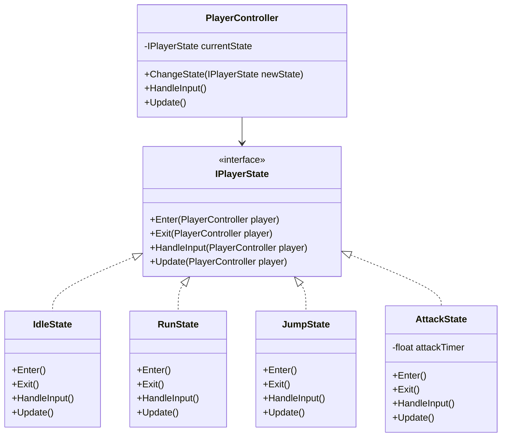
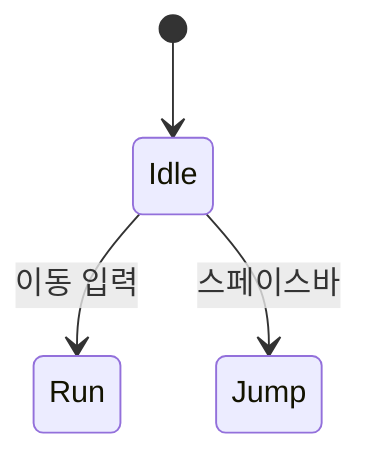

# 게임 개발자를 위한 C# 디자인 패턴: 실전 예제로 배우는 패턴의 힘  

저자: 최흥배, AI-Assisted   
    
권장 개발 환경
- **IDE**: Visual Studio 2022 이상 (Community 이상)
- **.NET**: 버전 9 이상
- **OS**: Windows 10 이상

-----  
  
# Chapter 9: State Pattern (상태 패턴)

## 1. 게임 개발 현장에서...
당신은 2D 액션 게임을 개발하고 있다. 플레이어 캐릭터는 다양한 상태를 가진다: 대기(Idle), 달리기(Run), 점프(Jump), 공격(Attack), 피격(Hit), 사망(Dead). 각 상태에서 할 수 있는 행동이 다르다. 예를 들어:

- 대기 상태에서는 달리기, 점프, 공격이 가능하다
- 점프 상태에서는 공중 공격은 가능하지만 다시 점프할 수 없다
- 공격 중에는 이동할 수 없다
- 피격 중에는 아무 행동도 할 수 없다
- 사망 상태에서는 게임 오버 처리만 가능하다

초보 개발자였던 당신은 이 모든 로직을 하나의 클래스에 조건문으로 처리했다. 하지만 상태가 늘어날수록 코드는 통제 불가능해졌다. 버그를 하나 고치면 다른 곳에서 두 개가 생겨났다.

## 2. 패턴 없이 코딩하기

```csharp
public class Player : MonoBehaviour
{
    private enum PlayerState
    {
        Idle, Run, Jump, Attack, Hit, Dead
    }
    
    private PlayerState currentState = PlayerState.Idle;
    private float attackTimer = 0f;
    private float hitTimer = 0f;
    private bool isGrounded = true;
    
    private const float ATTACK_DURATION = 0.5f;
    private const float HIT_DURATION = 0.3f;
    
    void Update()
    {
        // 타이머 업데이트
        if (attackTimer > 0) attackTimer -= Time.deltaTime;
        if (hitTimer > 0) hitTimer -= Time.deltaTime;
        
        // 거대한 상태 처리 로직
        if (currentState == PlayerState.Dead)
        {
            // 사망 상태에서는 아무것도 안 함
            return;
        }
        
        if (currentState == PlayerState.Hit)
        {
            if (hitTimer <= 0)
            {
                currentState = PlayerState.Idle;
            }
            return; // 피격 중에는 다른 입력 무시
        }
        
        if (currentState == PlayerState.Attack)
        {
            if (attackTimer <= 0)
            {
                currentState = PlayerState.Idle;
            }
            else
            {
                return; // 공격 중에는 다른 입력 무시
            }
        }
        
        // 입력 처리
        float horizontal = Input.GetAxis("Horizontal");
        
        if (Input.GetKeyDown(KeyCode.Space) && isGrounded)
        {
            if (currentState == PlayerState.Idle || currentState == PlayerState.Run)
            {
                currentState = PlayerState.Jump;
                Jump();
            }
        }
        
        if (Input.GetKeyDown(KeyCode.Z))
        {
            if (currentState == PlayerState.Idle || currentState == PlayerState.Run)
            {
                currentState = PlayerState.Attack;
                attackTimer = ATTACK_DURATION;
                Attack();
            }
            else if (currentState == PlayerState.Jump)
            {
                currentState = PlayerState.Attack;
                attackTimer = ATTACK_DURATION;
                AirAttack();
            }
        }
        
        // 이동 처리
        if (currentState == PlayerState.Idle || currentState == PlayerState.Run)
        {
            if (Mathf.Abs(horizontal) > 0.1f)
            {
                currentState = PlayerState.Run;
                Move(horizontal);
            }
            else
            {
                currentState = PlayerState.Idle;
            }
        }
        
        // 애니메이션 업데이트
        UpdateAnimation();
    }
    
    public void TakeDamage(int damage)
    {
        if (currentState == PlayerState.Dead || currentState == PlayerState.Hit)
            return;
            
        health -= damage;
        
        if (health <= 0)
        {
            currentState = PlayerState.Dead;
            Die();
        }
        else
        {
            currentState = PlayerState.Hit;
            hitTimer = HIT_DURATION;
            PlayHitEffect();
        }
    }
    
    private void UpdateAnimation()
    {
        // 상태별 애니메이션 설정
        switch (currentState)
        {
            case PlayerState.Idle:
                animator.Play("Idle");
                break;
            case PlayerState.Run:
                animator.Play("Run");
                break;
            case PlayerState.Jump:
                animator.Play("Jump");
                break;
            case PlayerState.Attack:
                animator.Play("Attack");
                break;
            case PlayerState.Hit:
                animator.Play("Hit");
                break;
            case PlayerState.Dead:
                animator.Play("Dead");
                break;
        }
    }
    
    // 각종 헬퍼 메서드들...
    private void Jump() { /* ... */ }
    private void Attack() { /* ... */ }
    private void AirAttack() { /* ... */ }
    private void Move(float direction) { /* ... */ }
    private void Die() { /* ... */ }
    private void PlayHitEffect() { /* ... */ }
}
```

## 3. 문제점 분석

### 문제 1: 코드 복잡도 폭발
- 상태가 6개뿐인데도 Update 메서드가 60줄이 넘어간다
- 새로운 상태(예: Dash, Climb, Swim)를 추가할 때마다 모든 조건문을 수정해야 한다
- 상태 전환 규칙이 코드 전체에 흩어져 있다

### 문제 2: 유지보수 악몽
```
상태 추가 시나리오:
1. enum에 새 상태 추가
2. Update()의 모든 if문 검토
3. UpdateAnimation()의 switch문 수정
4. TakeDamage()에서 새 상태 고려
5. 다른 메서드들도 확인...
→ 하나라도 놓치면 버그 발생!
```

### 문제 3: 테스트 불가능
- 특정 상태의 동작만 단위 테스트할 수 없다
- 모든 상태가 하나의 거대한 클래스에 얽혀 있다

### 문제 4: 상태별 데이터 관리 어려움
- `attackTimer`, `hitTimer` 같은 상태별 변수가 클래스 멤버로 존재한다
- 각 상태가 필요한 데이터를 명확히 구분할 수 없다

### 문제 5: 확장성 제로
- 상태별로 다른 로직을 적용하기 어렵다
- 예: "공격 상태에서 콤보 시스템 추가"하려면 전체 구조를 뜯어고쳐야 한다

## 4. 패턴 소개

**State Pattern**은 객체의 내부 상태가 변경될 때 객체의 행동이 변경되도록 하는 패턴이다. 상태를 별도의 클래스로 캡슐화하여, 상태 전환을 명확하게 만들고 각 상태별 행동을 독립적으로 관리할 수 있게 한다.

### 핵심 아이디어
```
거대한 조건문 덩어리
    ↓
각 상태를 독립적인 클래스로 분리
    ↓
상태 객체가 자신의 행동을 책임진다
```

### 구조 다이어그램



### ASCII 다이어그램으로 보는 상태 전환

```
                    [Idle State]
                    /    |    \
                   /     |     \
              점프      이동    공격
                 /       |       \
                /        |        \
         [Jump]    [Run State]  [Attack]
            |           |            |
         착지         정지        완료
            |           |            |
            \           |            /
             \          |           /
              \         |          /
                  [Idle State]
```

### 상태 패턴의 구성 요소

1. **Context (PlayerController)**: 현재 상태를 보유하고 상태 전환을 관리한다
2. **State Interface (IPlayerState)**: 모든 상태가 구현해야 할 인터페이스를 정의한다
3. **Concrete States (IdleState, RunState 등)**: 각 상태별 구체적인 행동을 구현한다

## 5. 패턴 적용하기

### Step 1: 상태 인터페이스 정의

```csharp
public interface IPlayerState
{
    // 상태 진입 시 호출
    void Enter(PlayerController player);
    
    // 상태 종료 시 호출
    void Exit(PlayerController player);
    
    // 매 프레임 입력 처리
    void HandleInput(PlayerController player);
    
    // 매 프레임 업데이트
    void Update(PlayerController player);
}
```

### Step 2: PlayerController 리팩토링

```csharp
public class PlayerController : MonoBehaviour
{
    // 상태 관련
    private IPlayerState currentState;
    
    // 캐릭터 속성
    public float moveSpeed = 5f;
    public float jumpForce = 10f;
    public int maxHealth = 100;
    private int currentHealth;
    
    // 컴포넌트 참조
    public Rigidbody2D rb;
    public Animator animator;
    public Transform groundCheck;
    
    // 공용 상태 정보
    public bool IsGrounded { get; private set; }
    
    // 싱글톤 상태 인스턴스들 (메모리 절약)
    public static readonly IdleState IdleState = new IdleState();
    public static readonly RunState RunState = new RunState();
    public static readonly JumpState JumpState = new JumpState();
    public static readonly AttackState AttackState = new AttackState();
    public static readonly HitState HitState = new HitState();
    public static readonly DeadState DeadState = new DeadState();
    
    void Start()
    {
        currentHealth = maxHealth;
        ChangeState(IdleState);
    }
    
    void Update()
    {
        // 지면 체크
        IsGrounded = Physics2D.OverlapCircle(groundCheck.position, 0.1f, LayerMask.GetMask("Ground"));
        
        // 현재 상태의 로직 실행
        currentState.HandleInput(this);
        currentState.Update(this);
    }
    
    // 상태 전환 메서드
    public void ChangeState(IPlayerState newState)
    {
        currentState?.Exit(this);
        currentState = newState;
        currentState.Enter(this);
    }
    
    // 공용 액션 메서드들
    public void Move(float direction)
    {
        rb.velocity = new Vector2(direction * moveSpeed, rb.velocity.y);
        
        if (direction != 0)
        {
            transform.localScale = new Vector3(Mathf.Sign(direction), 1, 1);
        }
    }
    
    public void Jump()
    {
        rb.velocity = new Vector2(rb.velocity.x, jumpForce);
    }
    
    public void TakeDamage(int damage)
    {
        // 특정 상태에서만 피격 가능
        if (currentState == DeadState || currentState == HitState)
            return;
            
        currentHealth -= damage;
        
        if (currentHealth <= 0)
        {
            ChangeState(DeadState);
        }
        else
        {
            ChangeState(HitState);
        }
    }
    
    public void PlayAnimation(string animationName)
    {
        animator.Play(animationName);
    }
}
```

### Step 3: 각 상태 구현

#### IdleState (대기 상태)

```csharp
public class IdleState : IPlayerState
{
    public void Enter(PlayerController player)
    {
        player.PlayAnimation("Idle");
        Debug.Log("Idle 상태 진입");
    }
    
    public void Exit(PlayerController player)
    {
        // Idle 종료 시 특별한 처리 없음
    }
    
    public void HandleInput(PlayerController player)
    {
        float horizontal = Input.GetAxis("Horizontal");
        
        // 이동 입력 감지
        if (Mathf.Abs(horizontal) > 0.1f)
        {
            player.ChangeState(PlayerController.RunState);
            return;
        }
        
        // 점프 입력 감지
        if (Input.GetKeyDown(KeyCode.Space) && player.IsGrounded)
        {
            player.ChangeState(PlayerController.JumpState);
            return;
        }
        
        // 공격 입력 감지
        if (Input.GetKeyDown(KeyCode.Z))
        {
            player.ChangeState(PlayerController.AttackState);
            return;
        }
    }
    
    public void Update(PlayerController player)
    {
        // Idle 상태에서는 특별한 업데이트 로직 없음
    }
}
```

#### RunState (달리기 상태)

```csharp
public class RunState : IPlayerState
{
    public void Enter(PlayerController player)
    {
        player.PlayAnimation("Run");
        Debug.Log("Run 상태 진입");
    }
    
    public void Exit(PlayerController player)
    {
        // Run 종료 시 특별한 처리 없음
    }
    
    public void HandleInput(PlayerController player)
    {
        float horizontal = Input.GetAxis("Horizontal");
        
        // 이동 중지 감지
        if (Mathf.Abs(horizontal) < 0.1f)
        {
            player.ChangeState(PlayerController.IdleState);
            return;
        }
        
        // 점프 입력 감지
        if (Input.GetKeyDown(KeyCode.Space) && player.IsGrounded)
        {
            player.ChangeState(PlayerController.JumpState);
            return;
        }
        
        // 공격 입력 감지
        if (Input.GetKeyDown(KeyCode.Z))
        {
            player.ChangeState(PlayerController.AttackState);
            return;
        }
        
        // 이동 처리
        player.Move(horizontal);
    }
    
    public void Update(PlayerController player)
    {
        // Run 상태 유지 중 특별한 로직 없음
    }
}
```

#### JumpState (점프 상태)

```csharp
public class JumpState : IPlayerState
{
    private bool hasAirAttacked = false; // 공중 공격 여부
    
    public void Enter(PlayerController player)
    {
        player.PlayAnimation("Jump");
        player.Jump();
        hasAirAttacked = false;
        Debug.Log("Jump 상태 진입");
    }
    
    public void Exit(PlayerController player)
    {
        hasAirAttacked = false;
    }
    
    public void HandleInput(PlayerController player)
    {
        float horizontal = Input.GetAxis("Horizontal");
        
        // 공중에서 좌우 이동 가능 (관성)
        if (Mathf.Abs(horizontal) > 0.1f)
        {
            player.Move(horizontal * 0.7f); // 공중에서는 이동속도 70%
        }
        
        // 공중 공격 (한 번만 가능)
        if (Input.GetKeyDown(KeyCode.Z) && !hasAirAttacked)
        {
            hasAirAttacked = true;
            player.ChangeState(PlayerController.AttackState);
            return;
        }
    }
    
    public void Update(PlayerController player)
    {
        // 착지 감지
        if (player.IsGrounded && player.rb.velocity.y <= 0)
        {
            player.ChangeState(PlayerController.IdleState);
        }
    }
}
```

#### AttackState (공격 상태)

```csharp
public class AttackState : IPlayerState
{
    private float attackTimer;
    private const float ATTACK_DURATION = 0.5f;
    private bool isAirAttack = false;
    
    public void Enter(PlayerController player)
    {
        attackTimer = ATTACK_DURATION;
        isAirAttack = !player.IsGrounded;
        
        player.PlayAnimation(isAirAttack ? "AirAttack" : "Attack");
        Debug.Log($"{(isAirAttack ? "공중" : "지상")} 공격 시작");
        
        // 공격 판정 생성 (실제로는 별도 시스템으로 분리하는 것이 좋다)
        CreateAttackHitbox(player);
    }
    
    public void Exit(PlayerController player)
    {
        Debug.Log("공격 종료");
    }
    
    public void HandleInput(PlayerController player)
    {
        // 공격 중에는 대부분의 입력 무시
        // 필요시 콤보 시스템을 여기에 추가할 수 있다
    }
    
    public void Update(PlayerController player)
    {
        attackTimer -= Time.deltaTime;
        
        if (attackTimer <= 0)
        {
            // 공격 완료 후 상태 전환
            if (isAirAttack && !player.IsGrounded)
            {
                player.ChangeState(PlayerController.JumpState);
            }
            else
            {
                player.ChangeState(PlayerController.IdleState);
            }
        }
    }
    
    private void CreateAttackHitbox(PlayerController player)
    {
        // 공격 판정 로직
        // 실제 게임에서는 별도 공격 시스템과 연동
    }
}
```

#### HitState (피격 상태)

```csharp
public class HitState : IPlayerState
{
    private float hitTimer;
    private const float HIT_DURATION = 0.3f;
    
    public void Enter(PlayerController player)
    {
        hitTimer = HIT_DURATION;
        player.PlayAnimation("Hit");
        
        // 넉백 효과
        float knockbackDirection = -Mathf.Sign(player.transform.localScale.x);
        player.rb.velocity = new Vector2(knockbackDirection * 3f, 2f);
        
        Debug.Log("피격!");
    }
    
    public void Exit(PlayerController player)
    {
        // 무적 시간 시작 등의 처리 가능
    }
    
    public void HandleInput(PlayerController player)
    {
        // 피격 중에는 모든 입력 무시
    }
    
    public void Update(PlayerController player)
    {
        hitTimer -= Time.deltaTime;
        
        if (hitTimer <= 0)
        {
            player.ChangeState(PlayerController.IdleState);
        }
    }
}
```

#### DeadState (사망 상태)

```csharp
public class DeadState : IPlayerState
{
    private float deathTimer;
    private const float DEATH_DELAY = 2f;
    
    public void Enter(PlayerController player)
    {
        deathTimer = DEATH_DELAY;
        player.PlayAnimation("Dead");
        
        // 물리 비활성화
        player.rb.velocity = Vector2.zero;
        player.rb.isKinematic = true;
        
        Debug.Log("사망...");
    }
    
    public void Exit(PlayerController player)
    {
        // 부활 시스템이 있다면 여기서 처리
    }
    
    public void HandleInput(PlayerController player)
    {
        // 사망 상태에서는 모든 입력 무시
    }
    
    public void Update(PlayerController player)
    {
        deathTimer -= Time.deltaTime;
        
        if (deathTimer <= 0)
        {
            // 게임 오버 처리
            Debug.Log("게임 오버");
            // GameManager.Instance.GameOver();
        }
    }
}
```

## 6. Before/After 비교

### 코드 복잡도 비교

```
[Before]
PlayerController.cs: 150줄
- Update(): 60줄의 중첩된 조건문
- 상태 전환 로직이 전체에 산재

[After]
PlayerController.cs: 80줄
IdleState.cs: 35줄
RunState.cs: 40줄
JumpState.cs: 45줄
AttackState.cs: 50줄
HitState.cs: 40줄
DeadState.cs: 35줄
---
총 325줄이지만, 각 파일은 독립적이고 명확하다!
```

### 새로운 상태 추가 비교

**Before: Dash(대시) 상태 추가하기**
```csharp
// 1. enum 수정
private enum PlayerState {
    Idle, Run, Jump, Attack, Hit, Dead, Dash // 추가
}

// 2. Update()에 수십 줄 추가
if (currentState == PlayerState.Dash) {
    if (dashTimer <= 0) {
        currentState = PlayerState.Idle;
    }
    // ...
}

// 3. 모든 입력 처리 부분 수정
if (Input.GetKeyDown(KeyCode.LeftShift)) {
    if (currentState == PlayerState.Idle || 
        currentState == PlayerState.Run) {
        currentState = PlayerState.Dash;
        dashTimer = DASH_DURATION;
        // ...
    }
}

// 4. TakeDamage() 수정
if (currentState == PlayerState.Dash) {
    return; // 대시 중 무적
}

// 5. UpdateAnimation() 수정
case PlayerState.Dash:
    animator.Play("Dash");
    break;

// 총 5개 이상의 위치를 수정해야 한다!
```

**After: Dash 상태 추가하기**
```csharp
// 1. DashState.cs 새 파일 생성
public class DashState : IPlayerState
{
    private float dashTimer;
    private const float DASH_DURATION = 0.2f;
    private const float DASH_SPEED = 15f;
    
    public void Enter(PlayerController player)
    {
        dashTimer = DASH_DURATION;
        player.PlayAnimation("Dash");
        
        float direction = Mathf.Sign(player.transform.localScale.x);
        player.rb.velocity = new Vector2(direction * DASH_SPEED, 0);
    }
    
    public void Exit(PlayerController player) { }
    
    public void HandleInput(PlayerController player) 
    {
        // 대시 중 입력 무시
    }
    
    public void Update(PlayerController player)
    {
        dashTimer -= Time.deltaTime;
        if (dashTimer <= 0)
        {
            player.ChangeState(PlayerController.IdleState);
        }
    }
}

// 2. PlayerController에 한 줄 추가
public static readonly DashState DashState = new DashState();

// 3. IdleState, RunState에 입력 처리 추가
if (Input.GetKeyDown(KeyCode.LeftShift))
{
    player.ChangeState(PlayerController.DashState);
    return;
}

// 끝! 기존 코드는 거의 건드리지 않았다!
```

### 테스트 용이성 비교

**Before: 공격 상태만 테스트하기**
```csharp
// 불가능! 전체 PlayerController를 인스턴스화해야 한다
// 모든 의존성 (Rigidbody, Animator 등)이 필요하다
```

**After: 공격 상태만 테스트하기**
```csharp
[Test]
public void AttackState_ShouldTransitionToIdle_AfterDuration()
{
    // Arrange
    var mockPlayer = new Mock<PlayerController>();
    var attackState = new AttackState();
    
    // Act
    attackState.Enter(mockPlayer.Object);
    for (int i = 0; i < 30; i++) // 0.5초 시뮬레이션
    {
        attackState.Update(mockPlayer.Object);
    }
    
    // Assert
    mockPlayer.Verify(p => p.ChangeState(PlayerController.IdleState), Times.Once);
}
```

### 상태 전환 추적 비교

**Before**
```
어떤 상태에서 어떤 상태로 전환 가능한지 파악하려면
Update() 메서드 60줄을 정독해야 한다.
```

**After**
```
각 상태 클래스의 HandleInput()만 보면 된다.
명확하고 문서화가 필요 없다!

IdleState → RunState, JumpState, AttackState
RunState → IdleState, JumpState, AttackState
JumpState → IdleState, AttackState
AttackState → IdleState, JumpState
HitState → IdleState
DeadState → (전환 없음)
```

### 성능 비교

```
메모리:
- Before: 1개의 큰 객체
- After: 1개의 PlayerController + 6개의 경량 상태 객체 (싱글톤)
→ 차이 미미 (약 200 bytes 증가)

CPU:
- Before: 거대한 if-else 체인 (분기 예측 실패 가능)
- After: 가상 메서드 호출 (약간의 오버헤드)
→ 실제 게임에서는 측정 불가능한 수준의 차이
→ 코드 품질 향상이 훨씬 큰 이득!
```

## 7. 실전 팁

### Tip 1: 상태를 싱글톤으로 만들기

```csharp
// ✅ 좋은 방법: 상태 객체를 재사용
public static readonly IdleState IdleState = new IdleState();

// ❌ 나쁜 방법: 매번 새로 생성
player.ChangeState(new IdleState()); // 가비지 컬렉션 유발!
```

상태 객체는 일반적으로 데이터를 거의 가지지 않으므로, 싱글톤으로 만들어 재사용하는 것이 효율적이다.

### Tip 2: 상태별 데이터 캡슐화

```csharp
// 상태별 고유 데이터는 상태 클래스 내부에
public class AttackState : IPlayerState
{
    private float attackTimer;      // 이 상태만의 데이터
    private int comboCount = 0;     // 이 상태만의 데이터
    
    // ...
}

// PlayerController에는 공용 데이터만
public class PlayerController : MonoBehaviour
{
    public int maxHealth = 100;     // 모든 상태가 공유
    public float moveSpeed = 5f;    // 모든 상태가 공유
}
```

### Tip 3: 상태 전환 로그 추가

```csharp
public void ChangeState(IPlayerState newState)
{
    #if UNITY_EDITOR
    Debug.Log($"상태 전환: {currentState?.GetType().Name} → {newState.GetType().Name}");
    #endif
    
    currentState?.Exit(this);
    currentState = newState;
    currentState.Enter(this);
}
```

디버깅 시 상태 전환 흐름을 쉽게 파악할 수 있다.

### Tip 4: 불가능한 전환 방지

```csharp
public class DeadState : IPlayerState
{
    public void HandleInput(PlayerController player)
    {
        // 사망 상태에서는 어떤 입력도 처리하지 않음
        // 다른 상태로의 전환을 명시적으로 차단
    }
}

// 또는 PlayerController에서
public void ChangeState(IPlayerState newState)
{
    // 사망 상태에서는 부활 외 전환 불가
    if (currentState == DeadState && newState != ReviveState)
    {
        Debug.LogWarning("사망 상태에서는 부활만 가능합니다!");
        return;
    }
    
    currentState?.Exit(this);
    currentState = newState;
    currentState.Enter(this);
}
```

### Tip 5: 계층적 상태 머신 (고급)

복잡한 게임에서는 상태 안에 또 다른 상태 머신을 가질 수 있다.

```csharp
public class CombatState : IPlayerState
{
    // 전투 상태 안에 또 다른 상태 머신
    private IPlayerState currentSubState;
    
    public void Enter(PlayerController player)
    {
        currentSubState = new LightAttackState();
        currentSubState.Enter(player);
    }
    
    public void HandleInput(PlayerController player)
    {
        // 서브 상태 전환
        if (Input.GetKeyDown(KeyCode.X))
        {
            currentSubState.Exit(player);
            currentSubState = new HeavyAttackState();
            currentSubState.Enter(player);
        }
        
        currentSubState.HandleInput(player);
    }
    
    // ...
}
```

이를 통해 다음과 같은 구조를 만들 수 있다:
```
Player
├── Idle
├── Combat
│   ├── LightAttack
│   ├── HeavyAttack
│   └── SpecialAttack
├── Movement
│   ├── Walk
│   ├── Run
│   └── Dash
└── Dead
```

### Tip 6: Unity Animator와 통합

```csharp
public interface IPlayerState
{
    void Enter(PlayerController player);
    void Exit(PlayerController player);
    void HandleInput(PlayerController player);
    void Update(PlayerController player);
    string GetAnimationName(); // 애니메이션 이름 반환
}

public class IdleState : IPlayerState
{
    public string GetAnimationName() => "Idle";
    
    public void Enter(PlayerController player)
    {
        player.animator.Play(GetAnimationName());
    }
    // ...
}
```

### Tip 7: 상태 전환 조건을 명확히

```csharp
public class JumpState : IPlayerState
{
    public void Update(PlayerController player)
    {
        // 착지 조건을 명확히
        if (IsLanded(player))
        {
            player.ChangeState(PlayerController.IdleState);
        }
    }
    
    private bool IsLanded(PlayerController player)
    {
        return player.IsGrounded && player.rb.velocity.y <= 0.01f;
    }
}
```

조건을 별도 메서드로 분리하면 가독성이 높아진다.

### Tip 8: 상태 히스토리 추적 (디버깅용)

```csharp
public class PlayerController : MonoBehaviour
{
    private Stack<IPlayerState> stateHistory = new Stack<IPlayerState>();
    
    public void ChangeState(IPlayerState newState)
    {
        if (currentState != null)
        {
            stateHistory.Push(currentState);
            if (stateHistory.Count > 10) // 최근 10개만 유지
            {
                stateHistory = new Stack<IPlayerState>(
                    stateHistory.Take(10).Reverse()
                );
            }
        }
        
        currentState?.Exit(this);
        currentState = newState;
        currentState.Enter(this);
    }
    
    public void PrintStateHistory()
    {
        Debug.Log("상태 히스토리:");
        foreach (var state in stateHistory)
        {
            Debug.Log($"- {state.GetType().Name}");
        }
    }
}
```

## 8. 연습 문제

### 문제 1: Dash 상태 구현하기 ⭐

다음 요구사항을 만족하는 DashState를 구현하라:
- Shift 키를 누르면 대시 시작
- 대시 시간: 0.2초
- 대시 속도: 일반 이동의 3배
- 대시 중에는 무적 (TakeDamage 무시)
- 대시 중에는 방향 전환 불가

**힌트:**
```csharp
public class DashState : IPlayerState
{
    private float dashTimer;
    // TODO: 필요한 상수와 변수 정의
    
    public void Enter(PlayerController player)
    {
        // TODO: 대시 시작 로직
    }
    
    // ...
}

// PlayerController에 추가
public bool IsInvincible => currentState == DashState;

public void TakeDamage(int damage)
{
    if (IsInvincible) return;
    // ...
}
```

### 문제 2: 콤보 시스템 추가하기 ⭐⭐

AttackState를 확장하여 3단 콤보 시스템을 구현하라:
- 공격 중 다시 Z키를 누르면 다음 콤보로 이어짐
- 콤보1 (0.3초) → 콤보2 (0.4초) → 콤보3 (0.5초)
- 각 콤보마다 다른 애니메이션과 데미지
- 콤보 입력 타이밍 윈도우: 공격 마지막 0.1초

**힌트:**
```csharp
public class AttackState : IPlayerState
{
    private int comboStep = 0; // 0, 1, 2
    private float attackTimer;
    private bool comboInputReceived = false;
    
    private readonly float[] comboDurations = { 0.3f, 0.4f, 0.5f };
    private readonly string[] comboAnimations = { "Attack1", "Attack2", "Attack3" };
    
    public void HandleInput(PlayerController player)
    {
        if (Input.GetKeyDown(KeyCode.Z))
        {
            // TODO: 콤보 입력 타이밍 체크
            // TODO: 다음 콤보로 전환 플래그 설정
        }
    }
    
    public void Update(PlayerController player)
    {
        attackTimer -= Time.deltaTime;
        
        if (attackTimer <= 0)
        {
            if (comboInputReceived && comboStep < 2)
            {
                // TODO: 다음 콤보 단계로
            }
            else
            {
                // TODO: 콤보 종료, Idle로 전환
            }
        }
    }
}
```

### 문제 3: 상태 전환 다이어그램 그리기 ⭐

다음 상태들 간의 전환 규칙을 Mermaid 다이어그램으로 작성하라:
- Idle, Run, Jump, Dash, Attack, Hit, Dead
- 각 상태에서 어떤 상태로 전환 가능한지 화살표로 표시
- 전환 조건을 라벨로 추가

**시작 코드:**


### 문제 4: AI 상태 머신 만들기 ⭐⭐⭐

적 캐릭터의 AI를 상태 패턴으로 구현하라:

**요구사항:**
- Patrol: 좌우로 순찰
- Chase: 플레이어 발견 시 추격 (5m 이내)
- Attack: 공격 범위 진입 시 공격 (2m 이내)
- Return: 플레이어를 놓치면 원래 위치로 복귀
- Dead: 사망

**시작 코드:**
```csharp
public interface IEnemyState
{
    void Enter(EnemyController enemy);
    void Exit(EnemyController enemy);
    void Update(EnemyController enemy);
}

public class EnemyController : MonoBehaviour
{
    public Transform player;
    public Vector3 spawnPosition;
    public float detectionRange = 5f;
    public float attackRange = 2f;
    
    private IEnemyState currentState;
    
    public float DistanceToPlayer => 
        Vector3.Distance(transform.position, player.position);
    
    // TODO: 상태들 구현
}

public class PatrolState : IEnemyState
{
    private float patrolDirection = 1f;
    
    public void Update(EnemyController enemy)
    {
        // TODO: 순찰 로직
        // TODO: 플레이어 감지 시 Chase로 전환
    }
}

// TODO: 나머지 상태들 구현
```

### 문제 5: 상태 저장/로드 시스템 ⭐⭐⭐

게임 저장 시 현재 플레이어 상태를 저장하고, 로드 시 복원하는 기능을 구현하라.

**요구사항:**
- 현재 상태 타입 저장
- 상태별 고유 데이터 저장 (예: 콤보 단계, 공격 타이머 등)
- JSON 형식으로 직렬화

**힌트:**
```csharp
[System.Serializable]
public class PlayerStateData
{
    public string stateTypeName;
    public string stateData; // JSON 형식의 상태별 데이터
}

public interface IPlayerState
{
    void Enter(PlayerController player);
    void Exit(PlayerController player);
    void HandleInput(PlayerController player);
    void Update(PlayerController player);
    
    // 저장/로드 인터페이스 추가
    string SerializeState();
    void DeserializeState(string data);
}

public class PlayerController : MonoBehaviour
{
    public PlayerStateData SaveState()
    {
        // TODO: 현재 상태 저장
    }
    
    public void LoadState(PlayerStateData data)
    {
        // TODO: 저장된 상태 복원
    }
}
```

---

## 정리

State Pattern은 복잡한 조건문을 객체 지향적으로 리팩토링하는 강력한 방법이다. 게임 개발에서 캐릭터의 행동, AI, UI 흐름 등 다양한 곳에 적용할 수 있다.

**핵심 장점:**
- 각 상태가 독립적인 클래스로 분리되어 관리하기 쉽다
- 새로운 상태 추가가 기존 코드를 거의 수정하지 않고 가능하다
- 상태별 로직이 명확하게 캡슐화되어 버그가 줄어든다
- 단위 테스트가 가능해진다

**주의사항:**
- 상태가 2~3개밖에 없는 단순한 경우는 오버 엔지니어링이 될 수 있다
- 상태 객체를 싱글톤으로 만들어 메모리를 절약하라
- 상태 전환 규칙을 명확히 문서화하라

다음 장에서는 Strategy Pattern을 배워 AI의 행동 패턴을 유연하게 만드는 방법을 알아본다!  