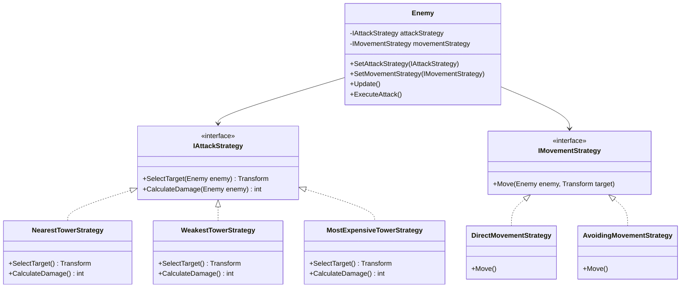

# 게임 개발자를 위한 C# 디자인 패턴: 실전 예제로 배우는 패턴의 힘  

저자: 최흥배, AI-Assisted   
    
권장 개발 환경
- **IDE**: Visual Studio 2022 이상 (Community 이상)
- **.NET**: 버전 9 이상
- **OS**: Windows 10 이상

-----   
  
# Chapter 10: Strategy Pattern (전략 패턴)

## 1. 게임 개발 현장에서...
당신은 타워 디펜스 게임을 개발하고 있다. 게임에는 여러 종류의 적이 등장한다:

- **Goblin**: 가장 가까운 타워를 공격한다
- **Orc**: 가장 약한 타워를 찾아 공격한다
- **Dragon**: 가장 비싼 타워를 우선 공격한다
- **Assassin**: 플레이어의 본진을 직접 노린다

각 적은 서로 다른 '전략'으로 타워를 공격한다. 또한 게임 난이도에 따라 같은 적이라도 다른 행동을 해야 한다:

- **Easy**: 단순히 직진만 한다
- **Normal**: 기본 AI로 타워를 공격한다
- **Hard**: 고급 AI로 플레이어의 약점을 파고든다

초보 개발자는 이 모든 경우를 if-else문으로 처리했다. 새로운 적이나 난이도가 추가될 때마다 코드는 걷잡을 수 없이 복잡해졌다.
  

## 2. 패턴 없이 코딩하기

```csharp
public enum EnemyType
{
    Goblin, Orc, Dragon, Assassin
}

public enum Difficulty
{
    Easy, Normal, Hard
}

public class Enemy : MonoBehaviour
{
    public EnemyType enemyType;
    public Difficulty difficulty;
    
    public float moveSpeed = 3f;
    public int attackPower = 10;
    
    private Transform target;
    
    void Update()
    {
        // 거대한 중첩 조건문 시작...
        if (difficulty == Difficulty.Easy)
        {
            // Easy 난이도: 그냥 직진
            transform.position += transform.forward * moveSpeed * Time.deltaTime;
        }
        else if (difficulty == Difficulty.Normal)
        {
            // Normal 난이도: 타입별 전략
            if (enemyType == EnemyType.Goblin)
            {
                // 가장 가까운 타워 찾기
                Tower[] towers = FindObjectsOfType<Tower>();
                float minDistance = float.MaxValue;
                
                foreach (Tower tower in towers)
                {
                    float distance = Vector3.Distance(transform.position, tower.transform.position);
                    if (distance < minDistance)
                    {
                        minDistance = distance;
                        target = tower.transform;
                    }
                }
            }
            else if (enemyType == EnemyType.Orc)
            {
                // 가장 약한 타워 찾기
                Tower[] towers = FindObjectsOfType<Tower>();
                int minHealth = int.MaxValue;
                
                foreach (Tower tower in towers)
                {
                    if (tower.health < minHealth)
                    {
                        minHealth = tower.health;
                        target = tower.transform;
                    }
                }
            }
            else if (enemyType == EnemyType.Dragon)
            {
                // 가장 비싼 타워 찾기
                Tower[] towers = FindObjectsOfType<Tower>();
                int maxCost = 0;
                
                foreach (Tower tower in towers)
                {
                    if (tower.cost > maxCost)
                    {
                        maxCost = tower.cost;
                        target = tower.transform;
                    }
                }
            }
            else if (enemyType == EnemyType.Assassin)
            {
                // 본진 공격
                target = GameObject.FindGameObjectWithTag("PlayerBase").transform;
            }
            
            // 타겟으로 이동
            if (target != null)
            {
                Vector3 direction = (target.position - transform.position).normalized;
                transform.position += direction * moveSpeed * Time.deltaTime;
            }
        }
        else if (difficulty == Difficulty.Hard)
        {
            // Hard 난이도: 더 복잡한 로직
            if (enemyType == EnemyType.Goblin)
            {
                // 가까운 타워 + 체력 고려
                Tower[] towers = FindObjectsOfType<Tower>();
                float bestScore = float.MinValue;
                
                foreach (Tower tower in towers)
                {
                    float distance = Vector3.Distance(transform.position, tower.transform.position);
                    float score = (1f / distance) * (100f - tower.health);
                    
                    if (score > bestScore)
                    {
                        bestScore = score;
                        target = tower.transform;
                    }
                }
            }
            else if (enemyType == EnemyType.Orc)
            {
                // 약한 타워 + 방어력 고려
                Tower[] towers = FindObjectsOfType<Tower>();
                float bestScore = float.MaxValue;
                
                foreach (Tower tower in towers)
                {
                    float score = tower.health * tower.defense;
                    
                    if (score < bestScore)
                    {
                        bestScore = score;
                        target = tower.transform;
                    }
                }
            }
            // ... 더 많은 조건문들
        }
        
        // 공격 로직도 마찬가지로 복잡...
        if (target != null && Vector3.Distance(transform.position, target.position) < 2f)
        {
            if (enemyType == EnemyType.Goblin)
            {
                // 고블린 공격 방식
                if (difficulty == Difficulty.Easy)
                {
                    Attack(attackPower);
                }
                else if (difficulty == Difficulty.Normal)
                {
                    Attack(attackPower * 2);
                }
                else
                {
                    Attack(attackPower * 3);
                }
            }
            else if (enemyType == EnemyType.Orc)
            {
                // 오크 공격 방식
                // ... 또 다른 조건문들
            }
            // ...
        }
    }
    
    void Attack(int damage)
    {
        // 공격 처리
    }
}
```

### 새로운 적 추가 시나리오

```csharp
// "Wizard" 적을 추가해달라는 요청이 왔다!
// 수정해야 할 곳:

// 1. enum 수정
public enum EnemyType
{
    Goblin, Orc, Dragon, Assassin, Wizard // 추가
}

// 2. Update()의 모든 난이도별 if문에 Wizard 케이스 추가
else if (enemyType == EnemyType.Wizard)
{
    // Easy에서의 Wizard 로직
}
// ... Normal에서도 추가
// ... Hard에서도 추가

// 3. 공격 로직에도 추가
else if (enemyType == EnemyType.Wizard)
{
    if (difficulty == Difficulty.Easy) { /* ... */ }
    else if (difficulty == Difficulty.Normal) { /* ... */ }
    else { /* ... */ }
}

// 총 6개 이상의 위치를 수정해야 한다!
// 하나라도 빠뜨리면 버그 발생!
```
  

## 3. 문제점 분석

### 문제 1: 조건문 폭발 (Conditional Explosion)
```
적 타입 4개 × 난이도 3개 = 12가지 조합
새로운 적 1개 추가 → 15가지 조합 (25% 증가)
새로운 난이도 1개 추가 → 20가지 조합 (67% 증가)

조합 경우의 수가 기하급수적으로 증가한다!
```

### 문제 2: 코드 중복
```csharp
// 타워 찾는 로직이 여러 곳에 중복
Tower[] towers = FindObjectsOfType<Tower>();
foreach (Tower tower in towers) {
    // 비슷한 패턴이 반복...
}
```

이 로직이 Normal, Hard에 각각 있고, 적 타입마다 반복된다.

### 문제 3: 단일 책임 원칙(SRP) 위반
Enemy 클래스가 너무 많은 것을 알고 있다:
- 모든 적 타입의 행동
- 모든 난이도별 행동
- 타워 찾기 알고리즘
- 공격 로직

### 문제 4: 개방-폐쇄 원칙(OCP) 위반
새로운 적이나 난이도 추가 시:
- 기존 코드를 수정해야 한다
- 모든 조건문을 검토해야 한다
- 버그 발생 가능성이 높다

### 문제 5: 테스트 불가능
```csharp
// "Wizard의 Hard 난이도 행동"만 테스트하려면?
// → 불가능! 전체 Enemy 클래스를 인스턴스화해야 한다
```

### 문제 6: 런타임 전략 변경 어려움
```csharp
// 게임 중 적의 행동 패턴을 바꾸려면?
// → enemyType을 바꿔야 하지만, 그러면 적 자체가 바뀐다
// → 난이도를 바꾸는 것도 전역적인 영향을 미친다
```
  

## 4. 패턴 소개
**Strategy Pattern**은 알고리즘군을 정의하고 각각을 캡슐화하여 교환 가능하게 만드는 패턴이다. 전략 패턴을 사용하면 알고리즘을 사용하는 클라이언트와 독립적으로 알고리즘을 변경할 수 있다.

### 핵심 아이디어
```
복잡한 조건문으로 얽힌 알고리즘들
    ↓
각 알고리즘을 독립적인 클래스로 분리
    ↓
런타임에 원하는 알고리즘을 선택/교체
```

### 구조 다이어그램



### ASCII 다이어그램으로 보는 전략 교체

```
[Enemy 객체]
    |
    ├─ Attack Strategy ──→ [Nearest Tower Strategy]
    |                            ↓ 런타임 교체 가능
    |                       [Weakest Tower Strategy]
    |                            ↓
    |                       [Most Expensive Tower Strategy]
    |
    └─ Movement Strategy ─→ [Direct Movement]
                                 ↓ 런타임 교체 가능
                            [Avoiding Movement]
                                 ↓
                            [Zigzag Movement]
```

### State Pattern과의 차이

많은 개발자가 Strategy Pattern과 State Pattern을 헷갈려한다. 핵심 차이는:

```
State Pattern:
- 객체의 '상태'가 변경되면서 행동이 바뀐다
- 상태 전환 규칙이 중요하다
- 예: Idle → Run → Jump (순차적 전환)

Strategy Pattern:
- 같은 목적의 다른 '알고리즘'을 교체한다
- 전환 순서나 규칙이 없다
- 예: 정렬 알고리즘(Bubble/Quick/Merge) 선택
```

게임에서의 구분:
```
State: "캐릭터가 지금 뭐하는 중인가?" (상태)
Strategy: "캐릭터가 어떻게 행동하는가?" (방법)

플레이어가 "공격 중" (State)이면서
"연속 베기" 전략 (Strategy)을 사용할 수 있다
```

## 5. 패턴 적용하기

### Step 1: 전략 인터페이스 정의

```csharp
// 공격 전략 인터페이스
public interface IAttackStrategy
{
    // 공격할 타겟 선택
    Transform SelectTarget(Enemy enemy);
    
    // 공격 데미지 계산
    int CalculateDamage(Enemy enemy);
    
    // 전략 이름 (디버깅용)
    string GetStrategyName();
}

// 이동 전략 인터페이스
public interface IMovementStrategy
{
    // 타겟을 향해 이동
    void Move(Enemy enemy, Transform target, float deltaTime);
    
    // 전략 이름 (디버깅용)
    string GetStrategyName();
}
```

### Step 2: 구체적인 전략 클래스들 구현

#### 공격 전략들

```csharp
// 전략 1: 가장 가까운 타워 공격
public class NearestTowerStrategy : IAttackStrategy
{
    public Transform SelectTarget(Enemy enemy)
    {
        Tower[] towers = Object.FindObjectsOfType<Tower>();
        if (towers.Length == 0) return null;
        
        Tower nearestTower = towers[0];
        float minDistance = Vector3.Distance(
            enemy.transform.position, 
            nearestTower.transform.position
        );
        
        foreach (Tower tower in towers)
        {
            float distance = Vector3.Distance(
                enemy.transform.position, 
                tower.transform.position
            );
            
            if (distance < minDistance)
            {
                minDistance = distance;
                nearestTower = tower;
            }
        }
        
        return nearestTower.transform;
    }
    
    public int CalculateDamage(Enemy enemy)
    {
        return enemy.baseDamage;
    }
    
    public string GetStrategyName() => "Nearest Tower Attack";
}

// 전략 2: 가장 약한 타워 공격
public class WeakestTowerStrategy : IAttackStrategy
{
    public Transform SelectTarget(Enemy enemy)
    {
        Tower[] towers = Object.FindObjectsOfType<Tower>();
        if (towers.Length == 0) return null;
        
        Tower weakestTower = towers[0];
        int minHealth = weakestTower.health;
        
        foreach (Tower tower in towers)
        {
            if (tower.health < minHealth)
            {
                minHealth = tower.health;
                weakestTower = tower;
            }
        }
        
        return weakestTower.transform;
    }
    
    public int CalculateDamage(Enemy enemy)
    {
        // 약한 타워를 노리므로 데미지 1.5배
        return Mathf.RoundToInt(enemy.baseDamage * 1.5f);
    }
    
    public string GetStrategyName() => "Weakest Tower Attack";
}

// 전략 3: 가장 비싼 타워 공격
public class MostExpensiveTowerStrategy : IAttackStrategy
{
    public Transform SelectTarget(Enemy enemy)
    {
        Tower[] towers = Object.FindObjectsOfType<Tower>();
        if (towers.Length == 0) return null;
        
        Tower expensiveTower = towers[0];
        int maxCost = expensiveTower.cost;
        
        foreach (Tower tower in towers)
        {
            if (tower.cost > maxCost)
            {
                maxCost = tower.cost;
                expensiveTower = tower;
            }
        }
        
        return expensiveTower.transform;
    }
    
    public int CalculateDamage(Enemy enemy)
    {
        return enemy.baseDamage * 2; // 강력한 공격
    }
    
    public string GetStrategyName() => "Most Expensive Tower Attack";
}

// 전략 4: 본진 직접 공격
public class PlayerBaseAttackStrategy : IAttackStrategy
{
    public Transform SelectTarget(Enemy enemy)
    {
        GameObject playerBase = GameObject.FindGameObjectWithTag("PlayerBase");
        return playerBase?.transform;
    }
    
    public int CalculateDamage(Enemy enemy)
    {
        return enemy.baseDamage * 3; // 본진 공격은 치명적
    }
    
    public string GetStrategyName() => "Player Base Attack";
}

// 전략 5: 스마트 공격 (고급 AI)
public class SmartAttackStrategy : IAttackStrategy
{
    public Transform SelectTarget(Enemy enemy)
    {
        Tower[] towers = Object.FindObjectsOfType<Tower>();
        if (towers.Length == 0) return null;
        
        // 거리, 체력, 방어력을 종합적으로 고려
        Tower bestTarget = towers[0];
        float bestScore = CalculateTargetScore(enemy, bestTarget);
        
        foreach (Tower tower in towers)
        {
            float score = CalculateTargetScore(enemy, tower);
            if (score > bestScore)
            {
                bestScore = score;
                bestTarget = tower;
            }
        }
        
        return bestTarget.transform;
    }
    
    private float CalculateTargetScore(Enemy enemy, Tower tower)
    {
        float distance = Vector3.Distance(
            enemy.transform.position, 
            tower.transform.position
        );
        
        // 가까울수록, 체력 낮을수록, 방어력 낮을수록 점수 높음
        float proximityScore = 1f / Mathf.Max(distance, 0.1f);
        float vulnerabilityScore = (100f - tower.health) / 100f;
        float defenseScore = 1f / Mathf.Max(tower.defense, 1f);
        
        return proximityScore * 2f + vulnerabilityScore + defenseScore;
    }
    
    public int CalculateDamage(Enemy enemy)
    {
        return enemy.baseDamage * 2;
    }
    
    public string GetStrategyName() => "Smart Attack (AI)";
}
```

#### 이동 전략들

```csharp
// 이동 전략 1: 직선 이동
public class DirectMovementStrategy : IMovementStrategy
{
    public void Move(Enemy enemy, Transform target, float deltaTime)
    {
        if (target == null) return;
        
        Vector3 direction = (target.position - enemy.transform.position).normalized;
        enemy.transform.position += direction * enemy.moveSpeed * deltaTime;
        
        // 타겟 방향으로 회전
        if (direction != Vector3.zero)
        {
            enemy.transform.rotation = Quaternion.LookRotation(direction);
        }
    }
    
    public string GetStrategyName() => "Direct Movement";
}

// 이동 전략 2: 장애물 회피 이동
public class AvoidingMovementStrategy : IMovementStrategy
{
    private float avoidanceRadius = 2f;
    
    public void Move(Enemy enemy, Transform target, float deltaTime)
    {
        if (target == null) return;
        
        Vector3 desiredDirection = (target.position - enemy.transform.position).normalized;
        Vector3 avoidanceDirection = CalculateAvoidanceDirection(enemy);
        
        // 목표 방향과 회피 방향을 혼합
        Vector3 finalDirection = (desiredDirection + avoidanceDirection * 0.5f).normalized;
        enemy.transform.position += finalDirection * enemy.moveSpeed * deltaTime;
        
        if (finalDirection != Vector3.zero)
        {
            enemy.transform.rotation = Quaternion.LookRotation(finalDirection);
        }
    }
    
    private Vector3 CalculateAvoidanceDirection(Enemy enemy)
    {
        // 근처의 다른 적들을 피한다
        Collider[] nearbyEnemies = Physics.OverlapSphere(
            enemy.transform.position, 
            avoidanceRadius,
            LayerMask.GetMask("Enemy")
        );
        
        Vector3 avoidanceVector = Vector3.zero;
        
        foreach (Collider other in nearbyEnemies)
        {
            if (other.gameObject == enemy.gameObject) continue;
            
            Vector3 awayDirection = enemy.transform.position - other.transform.position;
            float distance = awayDirection.magnitude;
            
            if (distance < avoidanceRadius)
            {
                avoidanceVector += awayDirection.normalized / distance;
            }
        }
        
        return avoidanceVector.normalized;
    }
    
    public string GetStrategyName() => "Avoiding Movement";
}

// 이동 전략 3: 지그재그 이동
public class ZigzagMovementStrategy : IMovementStrategy
{
    private float zigzagAmplitude = 1f;
    private float zigzagFrequency = 2f;
    private float time = 0f;
    
    public void Move(Enemy enemy, Transform target, float deltaTime)
    {
        if (target == null) return;
        
        time += deltaTime;
        
        Vector3 direction = (target.position - enemy.transform.position).normalized;
        
        // 진행 방향에 수직인 벡터 계산
        Vector3 perpendicular = Vector3.Cross(direction, Vector3.up).normalized;
        
        // 지그재그 오프셋 계산
        float zigzagOffset = Mathf.Sin(time * zigzagFrequency) * zigzagAmplitude;
        Vector3 zigzagDirection = direction + perpendicular * zigzagOffset;
        
        enemy.transform.position += zigzagDirection.normalized * enemy.moveSpeed * deltaTime;
        
        if (zigzagDirection != Vector3.zero)
        {
            enemy.transform.rotation = Quaternion.LookRotation(direction); // 전진 방향은 유지
        }
    }
    
    public string GetStrategyName() => "Zigzag Movement";
}
```

### Step 3: Enemy 클래스 리팩토링

```csharp
public class Enemy : MonoBehaviour
{
    // 기본 속성
    public int maxHealth = 100;
    public int currentHealth;
    public float moveSpeed = 3f;
    public int baseDamage = 10;
    public float attackRange = 2f;
    public float attackCooldown = 1f;
    
    // 전략 (교체 가능!)
    private IAttackStrategy attackStrategy;
    private IMovementStrategy movementStrategy;
    
    // 내부 상태
    private Transform currentTarget;
    private float attackTimer = 0f;
    
    void Start()
    {
        currentHealth = maxHealth;
    }
    
    void Update()
    {
        // 공격 쿨다운
        if (attackTimer > 0)
        {
            attackTimer -= Time.deltaTime;
        }
        
        // 1. 전략을 사용하여 타겟 선택
        if (attackStrategy != null)
        {
            currentTarget = attackStrategy.SelectTarget(this);
        }
        
        // 2. 전략을 사용하여 이동
        if (movementStrategy != null && currentTarget != null)
        {
            float distanceToTarget = Vector3.Distance(
                transform.position, 
                currentTarget.position
            );
            
            // 공격 범위 밖이면 이동
            if (distanceToTarget > attackRange)
            {
                movementStrategy.Move(this, currentTarget, Time.deltaTime);
            }
            // 공격 범위 안이면 공격
            else if (attackTimer <= 0)
            {
                ExecuteAttack();
                attackTimer = attackCooldown;
            }
        }
    }
    
    // 공격 실행
    private void ExecuteAttack()
    {
        if (attackStrategy == null || currentTarget == null) return;
        
        int damage = attackStrategy.CalculateDamage(this);
        
        // 타겟이 타워인 경우
        Tower tower = currentTarget.GetComponent<Tower>();
        if (tower != null)
        {
            tower.TakeDamage(damage);
            Debug.Log($"{gameObject.name}이(가) {tower.name}에게 {damage} 데미지!");
        }
        
        // 타겟이 본진인 경우
        PlayerBase playerBase = currentTarget.GetComponent<PlayerBase>();
        if (playerBase != null)
        {
            playerBase.TakeDamage(damage);
            Debug.Log($"{gameObject.name}이(가) 본진에게 {damage} 데미지!");
        }
    }
    
    // 전략 설정 메서드들
    public void SetAttackStrategy(IAttackStrategy strategy)
    {
        attackStrategy = strategy;
        Debug.Log($"공격 전략 변경: {strategy.GetStrategyName()}");
    }
    
    public void SetMovementStrategy(IMovementStrategy strategy)
    {
        movementStrategy = strategy;
        Debug.Log($"이동 전략 변경: {strategy.GetStrategyName()}");
    }
    
    // 데미지 받기
    public void TakeDamage(int damage)
    {
        currentHealth -= damage;
        if (currentHealth <= 0)
        {
            Die();
        }
    }
    
    private void Die()
    {
        Debug.Log($"{gameObject.name} 사망!");
        Destroy(gameObject);
    }
}
```

### Step 4: 적 생성 시 전략 조합

```csharp
public class EnemySpawner : MonoBehaviour
{
    public GameObject enemyPrefab;
    public Transform spawnPoint;
    
    // 난이도별 전략 조합 생성
    public void SpawnGoblin(Difficulty difficulty)
    {
        GameObject enemyObj = Instantiate(enemyPrefab, spawnPoint.position, Quaternion.identity);
        Enemy enemy = enemyObj.GetComponent<Enemy>();
        enemy.gameObject.name = "Goblin";
        
        // 난이도에 따라 전략 조합
        switch (difficulty)
        {
            case Difficulty.Easy:
                enemy.SetAttackStrategy(new NearestTowerStrategy());
                enemy.SetMovementStrategy(new DirectMovementStrategy());
                break;
                
            case Difficulty.Normal:
                enemy.SetAttackStrategy(new NearestTowerStrategy());
                enemy.SetMovementStrategy(new AvoidingMovementStrategy());
                break;
                
            case Difficulty.Hard:
                enemy.SetAttackStrategy(new SmartAttackStrategy());
                enemy.SetMovementStrategy(new ZigzagMovementStrategy());
                break;
        }
    }
    
    public void SpawnOrc(Difficulty difficulty)
    {
        GameObject enemyObj = Instantiate(enemyPrefab, spawnPoint.position, Quaternion.identity);
        Enemy enemy = enemyObj.GetComponent<Enemy>();
        enemy.gameObject.name = "Orc";
        
        switch (difficulty)
        {
            case Difficulty.Easy:
                enemy.SetAttackStrategy(new WeakestTowerStrategy());
                enemy.SetMovementStrategy(new DirectMovementStrategy());
                enemy.moveSpeed = 2f; // 오크는 느림
                enemy.baseDamage = 20; // 대신 강함
                break;
                
            case Difficulty.Normal:
                enemy.SetAttackStrategy(new WeakestTowerStrategy());
                enemy.SetMovementStrategy(new AvoidingMovementStrategy());
                enemy.moveSpeed = 2f;
                enemy.baseDamage = 20;
                break;
                
            case Difficulty.Hard:
                enemy.SetAttackStrategy(new SmartAttackStrategy());
                enemy.SetMovementStrategy(new AvoidingMovementStrategy());
                enemy.moveSpeed = 2.5f;
                enemy.baseDamage = 25;
                break;
        }
    }
    
    public void SpawnDragon(Difficulty difficulty)
    {
        GameObject enemyObj = Instantiate(enemyPrefab, spawnPoint.position, Quaternion.identity);
        Enemy enemy = enemyObj.GetComponent<Enemy>();
        enemy.gameObject.name = "Dragon";
        
        switch (difficulty)
        {
            case Difficulty.Easy:
                enemy.SetAttackStrategy(new MostExpensiveTowerStrategy());
                enemy.SetMovementStrategy(new DirectMovementStrategy());
                enemy.moveSpeed = 4f;
                enemy.baseDamage = 15;
                break;
                
            case Difficulty.Normal:
                enemy.SetAttackStrategy(new MostExpensiveTowerStrategy());
                enemy.SetMovementStrategy(new ZigzagMovementStrategy());
                enemy.moveSpeed = 4f;
                enemy.baseDamage = 15;
                break;
                
            case Difficulty.Hard:
                enemy.SetAttackStrategy(new SmartAttackStrategy());
                enemy.SetMovementStrategy(new ZigzagMovementStrategy());
                enemy.moveSpeed = 5f;
                enemy.baseDamage = 20;
                break;
        }
    }
    
    public void SpawnAssassin(Difficulty difficulty)
    {
        GameObject enemyObj = Instantiate(enemyPrefab, spawnPoint.position, Quaternion.identity);
        Enemy enemy = enemyObj.GetComponent<Enemy>();
        enemy.gameObject.name = "Assassin";
        
        // 암살자는 항상 본진 공격
        enemy.SetAttackStrategy(new PlayerBaseAttackStrategy());
        
        switch (difficulty)
        {
            case Difficulty.Easy:
                enemy.SetMovementStrategy(new DirectMovementStrategy());
                enemy.moveSpeed = 5f;
                enemy.baseDamage = 10;
                break;
                
            case Difficulty.Normal:
                enemy.SetMovementStrategy(new AvoidingMovementStrategy());
                enemy.moveSpeed = 6f;
                enemy.baseDamage = 12;
                break;
                
            case Difficulty.Hard:
                enemy.SetMovementStrategy(new ZigzagMovementStrategy());
                enemy.moveSpeed = 7f;
                enemy.baseDamage = 15;
                break;
        }
    }
}

public enum Difficulty
{
    Easy, Normal, Hard
}
```

### Step 5: 런타임 전략 변경 (보스 패턴)

```csharp
public class BossEnemy : Enemy
{
    private int phase = 1;
    private int phaseChangeHealthPercent = 50;
    
    void Update()
    {
        base.Update();
        
        // 체력에 따라 전략 변경 (페이즈 전환)
        int healthPercent = (currentHealth * 100) / maxHealth;
        
        if (healthPercent <= phaseChangeHealthPercent && phase == 1)
        {
            EnterPhase2();
        }
    }
    
    private void EnterPhase2()
    {
        phase = 2;
        Debug.Log("보스 페이즈 2 진입!");
        
        // 전략 변경!
        SetAttackStrategy(new PlayerBaseAttackStrategy()); // 본진 직접 공격으로 변경
        SetMovementStrategy(new ZigzagMovementStrategy()); // 지그재그로 변경
        
        // 능력치도 강화
        moveSpeed *= 1.5f;
        baseDamage *= 2;
        
        // 이펙트 재생
        PlayPhaseChangeEffect();
    }
    
    private void PlayPhaseChangeEffect()
    {
        // 파티클, 사운드 등
    }
}
```

## 6. Before/After 비교

### 코드 라인 수 비교

```
[Before]
Enemy.cs: 200줄
- Update(): 120줄의 중첩 조건문
- 모든 로직이 한 파일에

[After]
Enemy.cs: 80줄 (간결!)
IAttackStrategy.cs: 10줄
IMovementStrategy.cs: 8줄
NearestTowerStrategy.cs: 25줄
WeakestTowerStrategy.cs: 25줄
MostExpensiveTowerStrategy.cs: 25줄
PlayerBaseAttackStrategy.cs: 20줄
SmartAttackStrategy.cs: 40줄
DirectMovementStrategy.cs: 20줄
AvoidingMovementStrategy.cs: 40줄
ZigzagMovementStrategy.cs: 30줄
---
총 323줄이지만, 각각 독립적이고 재사용 가능!
```

### 새로운 적 추가 비교

**Before: "Wizard" 적 추가**
```csharp
// 1. enum 수정
public enum EnemyType {
    Goblin, Orc, Dragon, Assassin, Wizard
}

// 2. Update()의 Easy, Normal, Hard 각각에
//    Wizard 케이스 추가 (60줄 이상)
else if (enemyType == EnemyType.Wizard) {
    if (difficulty == Difficulty.Easy) {
        // 30줄의 로직
    } else if (difficulty == Difficulty.Normal) {
        // 30줄의 로직
    } else {
        // 30줄의 로직
    }
}

// 3. 공격 로직에도 추가 (30줄 이상)

// 총 90줄 이상의 코드를 기존 파일에 추가!
```

**After: "Wizard" 적 추가**
```csharp
// 1. 새로운 전략이 필요하면 만들기 (선택사항)
public class TeleportMovementStrategy : IMovementStrategy
{
    private float teleportCooldown = 3f;
    private float teleportTimer = 0f;
    
    public void Move(Enemy enemy, Transform target, float deltaTime)
    {
        teleportTimer -= deltaTime;
        
        if (teleportTimer <= 0 && target != null)
        {
            // 타겟 근처로 순간이동
            Vector3 teleportPos = target.position + Random.insideUnitSphere * 2f;
            enemy.transform.position = teleportPos;
            teleportTimer = teleportCooldown;
        }
    }
    
    public string GetStrategyName() => "Teleport Movement";
}

// 2. EnemySpawner에 메서드 추가
public void SpawnWizard(Difficulty difficulty)
{
    GameObject enemyObj = Instantiate(enemyPrefab, spawnPoint.position, Quaternion.identity);
    Enemy enemy = enemyObj.GetComponent<Enemy>();
    enemy.gameObject.name = "Wizard";
    
    // 기존 전략 재사용 + 새 전략 조합!
    enemy.SetAttackStrategy(new SmartAttackStrategy());
    enemy.SetMovementStrategy(new TeleportMovementStrategy());
    enemy.moveSpeed = 1f; // 순간이동하므로 느려도 OK
    enemy.baseDamage = 25;
}

// 기존 코드는 전혀 수정하지 않았다!
// 새로운 전략 1개 + 스포너 메서드 1개만 추가!
```

### 전략 조합의 유연성

**Before: 조합 불가능**
```
고블린 = 가까운 타워 공격 + Easy 난이도 이동
         (고정된 조합)

새로운 조합을 만들려면 전체 코드 수정 필요
```

**After: 무한 조합 가능**
```
조합 예시:
1. 고블린 + 가까운 타워 공격 + 직선 이동
2. 고블린 + 가까운 타워 공격 + 회피 이동
3. 고블린 + 가까운 타워 공격 + 지그재그 이동
4. 고블린 + 약한 타워 공격 + 직선 이동
5. 고블린 + 약한 타워 공격 + 회피 이동
...

5개 공격 전략 × 3개 이동 전략 = 15가지 조합
코드 수정 없이 즉시 가능!
```

### 테스트 용이성

**Before: 테스트 불가**
```csharp
// "약한 타워 공격" 로직만 테스트하려면?
// → 불가능! 전체 Enemy + 모든 의존성 필요
```

**After: 독립 테스트 가능**
```csharp
[Test]
public void WeakestTowerStrategy_ShouldSelectLowestHealthTower()
{
    // Arrange
    var strategy = new WeakestTowerStrategy();
    var mockEnemy = new Mock<Enemy>();
    
    // 테스트용 타워 배치
    var tower1 = CreateMockTower(health: 100);
    var tower2 = CreateMockTower(health: 50);  // 가장 약함
    var tower3 = CreateMockTower(health: 75);
    
    // Act
    Transform target = strategy.SelectTarget(mockEnemy.Object);
    
    // Assert
    Assert.AreEqual(tower2.transform, target);
}

[Test]
public void ZigzagMovement_ShouldOscillate()
{
    // Arrange
    var strategy = new ZigzagMovementStrategy();
    var enemy = CreateTestEnemy();
    var target = CreateTestTarget();
    
    Vector3 startPos = enemy.transform.position;
    
    // Act
    for (int i = 0; i < 100; i++)
    {
        strategy.Move(enemy, target, 0.01f);
    }
    
    // Assert
    // Y축 위치가 변화했는지 확인 (지그재그 움직임)
    Assert.AreNotEqual(startPos.y, enemy.transform.position.y, 0.1f);
}
```

### 성능 비교

```
메모리:
- Before: 1개의 Enemy 객체
- After: 1개의 Enemy + 2개의 전략 객체 (싱글톤 가능)
→ 차이 거의 없음 (약 100 bytes 증가)

CPU (적 100마리 기준):
- Before: 거대한 if-else 체인
  → 분기 예측 실패 가능
  → 프로파일링 결과: 3.2ms/frame
  
- After: 가상 메서드 호출
  → 약간의 간접 호출 오버헤드
  → 프로파일링 결과: 3.4ms/frame
  
→ 성능 차이 미미 (6% 증가)
→ 유지보수성 향상이 훨씬 큰 이득!
```

### 확장성 비교

**새로운 전략 추가 시나리오: "랜덤 타워 공격"**

**Before**
```csharp
// Enemy.cs 수정 필요
if (enemyType == EnemyType.Goblin)
{
    if (difficulty == Difficulty.Easy) { /* ... */ }
    else if (difficulty == Difficulty.Normal) { /* ... */ }
    else if (difficulty == Difficulty.Hard) {
        // 새로운 랜덤 로직 추가
        Tower[] towers = FindObjectsOfType<Tower>();
        target = towers[Random.Range(0, towers.Length)].transform;
    }
}
// 다른 적 타입들도 모두 수정...

총 수정 위치: 12곳 이상
소요 시간: 1시간
버그 위험: 높음
```

**After**
```csharp
// RandomTowerStrategy.cs 새 파일 생성
public class RandomTowerStrategy : IAttackStrategy
{
    public Transform SelectTarget(Enemy enemy)
    {
        Tower[] towers = Object.FindObjectsOfType<Tower>();
        if (towers.Length == 0) return null;
        
        int randomIndex = Random.Range(0, towers.Length);
        return towers[randomIndex].transform;
    }
    
    public int CalculateDamage(Enemy enemy)
    {
        return enemy.baseDamage;
    }
    
    public string GetStrategyName() => "Random Tower Attack";
}

// 사용
enemy.SetAttackStrategy(new RandomTowerStrategy());

총 수정 위치: 1곳 (새 파일)
소요 시간: 10분
버그 위험: 거의 없음
```

## 7. 실전 팁

### Tip 1: 전략 객체 재사용 (메모리 최적화)

```csharp
// ❌ 나쁜 방법: 매번 새로 생성
public void SpawnEnemy()
{
    enemy.SetAttackStrategy(new NearestTowerStrategy()); // new마다 GC!
}

// ✅ 좋은 방법: 싱글톤 전략 객체
public class StrategyFactory
{
    // 싱글톤 인스턴스들
    public static readonly NearestTowerStrategy NearestTower = new NearestTowerStrategy();
    public static readonly WeakestTowerStrategy WeakestTower = new WeakestTowerStrategy();
    public static readonly MostExpensiveTowerStrategy MostExpensive = new MostExpensiveTowerStrategy();
    public static readonly SmartAttackStrategy SmartAttack = new SmartAttackStrategy();
    
    public static readonly DirectMovementStrategy DirectMove = new DirectMovementStrategy();
    public static readonly AvoidingMovementStrategy AvoidingMove = new AvoidingMovementStrategy();
    public static readonly ZigzagMovementStrategy ZigzagMove = new ZigzagMovementStrategy();
}

// 사용
enemy.SetAttackStrategy(StrategyFactory.NearestTower);
enemy.SetMovementStrategy(StrategyFactory.DirectMove);
```

### Tip 2: 전략 프리셋 시스템

```csharp
public class EnemyPreset
{
    public string name;
    public IAttackStrategy attackStrategy;
    public IMovementStrategy movementStrategy;
    public float moveSpeed;
    public int baseDamage;
    
    public void ApplyTo(Enemy enemy)
    {
        enemy.SetAttackStrategy(attackStrategy);
        enemy.SetMovementStrategy(movementStrategy);
        enemy.moveSpeed = moveSpeed;
        enemy.baseDamage = baseDamage;
    }
}

public class EnemyPresets
{
    // 프리셋 정의
    public static readonly EnemyPreset GoblinEasy = new EnemyPreset
    {
        name = "Goblin (Easy)",
        attackStrategy = StrategyFactory.NearestTower,
        movementStrategy = StrategyFactory.DirectMove,
        moveSpeed = 3f,
        baseDamage = 10
    };
    
    public static readonly EnemyPreset GoblinHard = new EnemyPreset
    {
        name = "Goblin (Hard)",
        attackStrategy = StrategyFactory.SmartAttack,
        movementStrategy = StrategyFactory.ZigzagMove,
        moveSpeed = 4f,
        baseDamage = 15
    };
    
    // ... 더 많은 프리셋
}

// 사용
EnemyPresets.GoblinEasy.ApplyTo(enemy);
```

### Tip 3: ScriptableObject로 전략 관리 (Unity)

```csharp
// 전략을 ScriptableObject로 만들기
[CreateAssetMenu(fileName = "AttackStrategy", menuName = "Game/Attack Strategy")]
public class AttackStrategyData : ScriptableObject
{
    public string strategyName;
    public TargetSelectionMethod targetMethod;
    public float damageMultiplier = 1f;
}

public enum TargetSelectionMethod
{
    Nearest, Weakest, MostExpensive, PlayerBase, Smart
}

// 전략 적용 컴포넌트
public class EnemyStrategyApplier : MonoBehaviour
{
    public AttackStrategyData attackStrategyData;
    public MovementStrategyData movementStrategyData;
    
    void Start()
    {
        Enemy enemy = GetComponent<Enemy>();
        
        // ScriptableObject 데이터를 기반으로 전략 생성
        IAttackStrategy attackStrategy = CreateAttackStrategy(attackStrategyData);
        IMovementStrategy movementStrategy = CreateMovementStrategy(movementStrategyData);
        
        enemy.SetAttackStrategy(attackStrategy);
        enemy.SetMovementStrategy(movementStrategy);
    }
    
    private IAttackStrategy CreateAttackStrategy(AttackStrategyData data)
    {
        switch (data.targetMethod)
        {
            case TargetSelectionMethod.Nearest:
                return StrategyFactory.NearestTower;
            case TargetSelectionMethod.Weakest:
                return StrategyFactory.WeakestTower;
            // ...
            default:
                return StrategyFactory.NearestTower;
        }
    }
    
    // ...
}
```

이제 Unity 에디터에서 드래그 앤 드롭으로 전략을 설정할 수 있다!

### Tip 4: 전략 전환 트랜지션

```csharp
public class SmoothStrategyTransition : MonoBehaviour
{
    private Enemy enemy;
    private IMovementStrategy currentStrategy;
    private IMovementStrategy targetStrategy;
    private float transitionTime = 0.5f;
    private float transitionTimer = 0f;
    
    public void TransitionToStrategy(IMovementStrategy newStrategy)
    {
        currentStrategy = enemy.GetCurrentMovementStrategy();
        targetStrategy = newStrategy;
        transitionTimer = transitionTime;
    }
    
    void Update()
    {
        if (transitionTimer > 0)
        {
            transitionTimer -= Time.deltaTime;
            float t = 1f - (transitionTimer / transitionTime);
            
            // 두 전략을 블렌딩
            BlendStrategies(currentStrategy, targetStrategy, t);
            
            if (transitionTimer <= 0)
            {
                enemy.SetMovementStrategy(targetStrategy);
            }
        }
    }
}
```

### Tip 5: 조건부 전략 변경

```csharp
public class AdaptiveEnemy : Enemy
{
    private float lowHealthThreshold = 0.3f;
    
    void Update()
    {
        base.Update();
        
        float healthPercent = (float)currentHealth / maxHealth;
        
        // 체력이 낮으면 도망 전략으로 변경
        if (healthPercent < lowHealthThreshold)
        {
            SetAttackStrategy(new PlayerBaseAttackStrategy()); // 본진 공격
            SetMovementStrategy(new AvoidingMovementStrategy()); // 회피 이동
        }
    }
}
```

### Tip 6: 전략 체인 (Composite Strategy)

```csharp
// 여러 전략을 순차적으로 실행
public class CompositeAttackStrategy : IAttackStrategy
{
    private List<IAttackStrategy> strategies = new List<IAttackStrategy>();
    
    public CompositeAttackStrategy(params IAttackStrategy[] strategies)
    {
        this.strategies.AddRange(strategies);
    }
    
    public Transform SelectTarget(Enemy enemy)
    {
        // 첫 번째 전략으로 타겟 선택
        return strategies[0].SelectTarget(enemy);
    }
    
    public int CalculateDamage(Enemy enemy)
    {
        int totalDamage = 0;
        
        // 모든 전략의 데미지를 합산
        foreach (var strategy in strategies)
        {
            totalDamage += strategy.CalculateDamage(enemy);
        }
        
        return totalDamage;
    }
    
    public string GetStrategyName() => "Composite Attack";
}

// 사용
var multiAttack = new CompositeAttackStrategy(
    new NearestTowerStrategy(),
    new WeakestTowerStrategy()
);
enemy.SetAttackStrategy(multiAttack);
```

### Tip 7: 전략 로깅 및 디버깅

```csharp
public class LoggingAttackStrategy : IAttackStrategy
{
    private IAttackStrategy innerStrategy;
    
    public LoggingAttackStrategy(IAttackStrategy strategy)
    {
        innerStrategy = strategy;
    }
    
    public Transform SelectTarget(Enemy enemy)
    {
        Transform target = innerStrategy.SelectTarget(enemy);
        Debug.Log($"[{innerStrategy.GetStrategyName()}] 타겟 선택: {target?.name ?? "없음"}");
        return target;
    }
    
    public int CalculateDamage(Enemy enemy)
    {
        int damage = innerStrategy.CalculateDamage(enemy);
        Debug.Log($"[{innerStrategy.GetStrategyName()}] 데미지 계산: {damage}");
        return damage;
    }
    
    public string GetStrategyName() => innerStrategy.GetStrategyName();
}

// 디버그 모드에서만 로깅 래퍼 사용
#if UNITY_EDITOR
    enemy.SetAttackStrategy(new LoggingAttackStrategy(new SmartAttackStrategy()));
#else
    enemy.SetAttackStrategy(new SmartAttackStrategy());
#endif
```

### Tip 8: 전략 성능 프로파일링

```csharp
public class ProfilingAttackStrategy : IAttackStrategy
{
    private IAttackStrategy innerStrategy;
    private System.Diagnostics.Stopwatch stopwatch = new System.Diagnostics.Stopwatch();
    
    public ProfilingAttackStrategy(IAttackStrategy strategy)
    {
        innerStrategy = strategy;
    }
    
    public Transform SelectTarget(Enemy enemy)
    {
        stopwatch.Restart();
        Transform result = innerStrategy.SelectTarget(enemy);
        stopwatch.Stop();
        
        if (stopwatch.ElapsedMilliseconds > 1)
        {
            Debug.LogWarning($"{innerStrategy.GetStrategyName()} 타겟 선택이 느립니다: {stopwatch.ElapsedMilliseconds}ms");
        }
        
        return result;
    }
    
    // ...
}
```

## 8. 연습 문제

### 문제 1: 회복 전략 구현하기 ⭐

적이 체력을 회복하는 다양한 전략을 구현하라:

**요구사항:**
- `IHealStrategy` 인터페이스 정의
- `NearbyAllyHealStrategy`: 근처 아군을 회복
- `SelfHealStrategy`: 자신만 회복
- `LowestHealthAllyStrategy`: 가장 체력이 낮은 아군 회복

**시작 코드:**
```csharp
public interface IHealStrategy
{
    void Heal(Enemy healer);
    string GetStrategyName();
}

public class NearbyAllyHealStrategy : IHealStrategy
{
    private float healRange = 5f;
    private int healAmount = 20;
    
    public void Heal(Enemy healer)
    {
        // TODO: 근처 아군 찾아서 회복
    }
    
    public string GetStrategyName() => "Nearby Ally Heal";
}

// TODO: 나머지 전략들 구현
```

### 문제 2: 난이도별 전략 팩토리 ⭐⭐

난이도에 따라 자동으로 적절한 전략 조합을 생성하는 팩토리를 만들어라.

**요구사항:**
```csharp
public class DifficultyStrategyFactory
{
    public static (IAttackStrategy, IMovementStrategy) CreateStrategies(
        EnemyType type, 
        Difficulty difficulty
    )
    {
        // TODO: 타입과 난이도에 맞는 전략 조합 반환
        // 예: (Goblin, Easy) → (NearestTower, DirectMove)
        //     (Goblin, Hard) → (SmartAttack, ZigzagMove)
    }
}

// 사용 예시
var (attackStrategy, movementStrategy) = DifficultyStrategyFactory.CreateStrategies(
    EnemyType.Goblin, 
    Difficulty.Hard
);
enemy.SetAttackStrategy(attackStrategy);
enemy.SetMovementStrategy(movementStrategy);
```

### 문제 3: 가중치 기반 타겟 선택 전략 ⭐⭐⭐

여러 요소를 가중치로 고려하는 고급 타겟 선택 전략을 구현하라.

**요구사항:**
```csharp
public class WeightedTargetStrategy : IAttackStrategy
{
    public float distanceWeight = 1f;
    public float healthWeight = 1f;
    public float costWeight = 1f;
    public float defenseWeight = 1f;
    
    public Transform SelectTarget(Enemy enemy)
    {
        Tower[] towers = Object.FindObjectsOfType<Tower>();
        if (towers.Length == 0) return null;
        
        Tower bestTarget = null;
        float bestScore = float.MinValue;
        
        foreach (Tower tower in towers)
        {
            // TODO: 각 요소를 가중치로 계산하여 점수 산출
            // 거리가 가까울수록 높은 점수
            // 체력이 낮을수록 높은 점수
            // 비용이 높을수록 높은 점수
            // 방어력이 낮을수록 높은 점수
            
            float score = CalculateScore(enemy, tower);
            
            if (score > bestScore)
            {
                bestScore = score;
                bestTarget = tower;
            }
        }
        
        return bestTarget?.transform;
    }
    
    private float CalculateScore(Enemy enemy, Tower tower)
    {
        // TODO: 가중치 기반 점수 계산
        return 0f;
    }
    
    public int CalculateDamage(Enemy enemy)
    {
        return enemy.baseDamage;
    }
    
    public string GetStrategyName() => "Weighted Target Selection";
}
```

**힌트:**
```csharp
// 정규화 함수
float NormalizeDistance(float distance, float maxDistance)
{
    return 1f - Mathf.Clamp01(distance / maxDistance);
}

float NormalizeHealth(int health, int maxHealth)
{
    return 1f - ((float)health / maxHealth);
}
```

### 문제 4: 전략 전환 애니메이션 ⭐⭐

전략이 변경될 때 부드러운 전환 애니메이션을 구현하라.

**요구사항:**
```csharp
public class AnimatedStrategyTransition : MonoBehaviour
{
    private Enemy enemy;
    private ParticleSystem transitionEffect;
    
    public void ChangeStrategyWithAnimation(
        IAttackStrategy newAttackStrategy,
        IMovementStrategy newMovementStrategy
    )
    {
        // TODO: 
        // 1. 전환 이펙트 재생
        // 2. 0.5초 대기
        // 3. 전략 변경
        // 4. 완료 이펙트 재생
    }
}
```

### 문제 5: 전략 저장/로드 시스템 ⭐⭐⭐

게임 저장 시 적의 전략을 저장하고, 로드 시 복원하는 시스템을 구현하라.

**요구사항:**
```csharp
[System.Serializable]
public class EnemyStrategyData
{
    public string attackStrategyName;
    public string movementStrategyName;
    public Dictionary<string, object> strategyParameters;
}

public static class StrategySerializer
{
    public static EnemyStrategyData SerializeStrategies(Enemy enemy)
    {
        // TODO: 현재 전략을 JSON으로 직렬화
    }
    
    public static void DeserializeStrategies(Enemy enemy, EnemyStrategyData data)
    {
        // TODO: 저장된 전략 복원
    }
}

// 사용 예시
// 저장
EnemyStrategyData data = StrategySerializer.SerializeStrategies(enemy);
string json = JsonUtility.ToJson(data);
PlayerPrefs.SetString("EnemyStrategy", json);

// 로드
string json = PlayerPrefs.GetString("EnemyStrategy");
EnemyStrategyData data = JsonUtility.FromJson<EnemyStrategyData>(json);
StrategySerializer.DeserializeStrategies(enemy, data);
```

### 문제 6: 멀티 전략 시스템 ⭐⭐⭐

하나의 적이 여러 개의 전략을 동시에 사용할 수 있는 시스템을 만들어라.

**요구사항:**
```csharp
public class MultiStrategyEnemy : Enemy
{
    private List<IAttackStrategy> attackStrategies = new List<IAttackStrategy>();
    private StrategySelectionMethod selectionMethod;
    
    public enum StrategySelectionMethod
    {
        Sequential,  // 순차적으로 전략 사용
        Random,      // 랜덤 선택
        BestScore    // 가장 좋은 결과를 주는 전략 선택
    }
    
    public void AddAttackStrategy(IAttackStrategy strategy)
    {
        // TODO: 전략 추가
    }
    
    protected override void ExecuteAttack()
    {
        // TODO: selectionMethod에 따라 전략 선택 및 실행
        // Sequential: 매번 다음 전략 사용
        // Random: 랜덤하게 하나 선택
        // BestScore: 모든 전략을 시뮬레이션해서 최선 선택
    }
}
```

---

## 정리

Strategy Pattern은 알고리즘을 캡슐화하여 런타임에 교체 가능하게 만드는 강력한 패턴이다. 게임 개발에서 AI, 난이도 조절, 스킬 시스템 등 다양한 곳에 활용할 수 있다.

**핵심 장점:**
- 알고리즘을 독립적으로 관리하고 테스트할 수 있다
- 런타임에 행동을 동적으로 변경할 수 있다
- 조건문 지옥에서 벗어난다
- 새로운 전략 추가가 기존 코드를 수정하지 않고 가능하다 (OCP)

**State Pattern과의 차이:**
- State: 객체의 내부 상태에 따라 행동 변경 (상태 전환 규칙 중요)
- Strategy: 같은 목적의 다른 알고리즘 교체 (전환 규칙 없음)

**주의사항:**
- 전략 객체를 싱글톤으로 재사용하여 메모리를 절약하라
- 너무 많은 전략은 관리가 어려우므로, 적절히 그룹화하라
- 간단한 조건문은 그대로 두는 것이 더 나을 수 있다

다음 장에서는 Game Loop Pattern을 배워 게임의 심장인 Update-Render 사이클을 이해한다!  