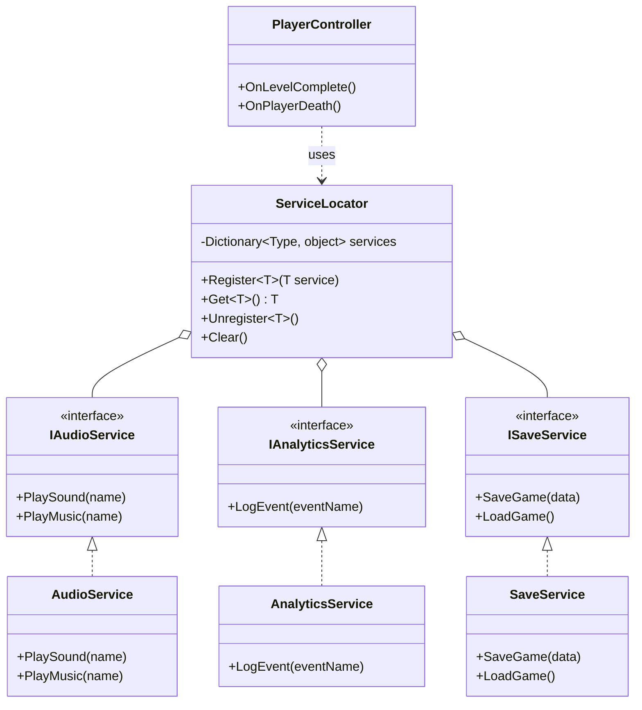

# 게임 개발자를 위한 C# 디자인 패턴: 실전 예제로 배우는 패턴의 힘  

저자: 최흥배, AI-Assisted   
    
권장 개발 환경
- **IDE**: Visual Studio 2022 이상 (Community 이상)
- **.NET**: 버전 9 이상
- **OS**: Windows 10 이상

-----  
  
# Chapter 13: Service Locator Pattern (서비스 로케이터 패턴)

## 1. 게임 개발 현장에서...

당신은 모바일 RPG 게임을 개발하고 있다. 게임에는 여러 전역 서비스가 필요하다.

- **AudioService**: 배경음악과 효과음 재생
- **AnalyticsService**: 플레이어 행동 데이터 수집
- **SaveService**: 게임 진행 상황 저장
- **IAPService**: 인앱 구매 처리
- **AdsService**: 광고 표시
- **NetworkService**: 서버 통신

문제는 이 서비스들을 어떻게 관리하고 접근할 것인가다.

"모든 서비스를 Singleton으로 만들까? 아니면 GameManager에 다 때려박을까?"

팀원 A는 말한다. "그냥 Singleton으로 만들면 되지 않나요?"

```csharp
AudioManager.Instance.PlaySound("explosion");
AnalyticsManager.Instance.LogEvent("level_complete");
SaveManager.Instance.SaveGame();
```

팀원 B는 반박한다. "Singleton이 너무 많으면 관리가 안 되고, 테스트도 어려워져요!"

당신은 고민에 빠진다. 전역 서비스를 깔끔하게 관리할 방법이 없을까?

## 2. 패턴 없이 코딩하기

먼저 Singleton 패턴만으로 서비스를 관리하는 전형적인 방법을 살펴본다.

### 방법 1: Singleton 남용

```csharp
// 각 서비스를 Singleton으로 구현
public class AudioManager
{
    private static AudioManager instance;
    public static AudioManager Instance
    {
        get
        {
            if (instance == null)
                instance = new AudioManager();
            return instance;
        }
    }
    
    private AudioManager() { }
    
    public void PlaySound(string soundName)
    {
        Console.WriteLine($"Playing sound: {soundName}");
    }
    
    public void PlayMusic(string musicName)
    {
        Console.WriteLine($"Playing music: {musicName}");
    }
}

public class AnalyticsManager
{
    private static AnalyticsManager instance;
    public static AnalyticsManager Instance
    {
        get
        {
            if (instance == null)
                instance = new AnalyticsManager();
            return instance;
        }
    }
    
    private AnalyticsManager() { }
    
    public void LogEvent(string eventName, Dictionary<string, object> parameters = null)
    {
        Console.WriteLine($"Analytics: {eventName}");
    }
}

public class SaveManager
{
    private static SaveManager instance;
    public static SaveManager Instance
    {
        get
        {
            if (instance == null)
                instance = new SaveManager();
            return instance;
        }
    }
    
    private SaveManager() { }
    
    public void SaveGame(GameData data)
    {
        Console.WriteLine("Game saved");
    }
    
    public GameData LoadGame()
    {
        Console.WriteLine("Game loaded");
        return new GameData();
    }
}

// 사용 예
public class PlayerController
{
    public void OnLevelComplete()
    {
        // 여러 Singleton에 직접 의존
        AudioManager.Instance.PlaySound("victory");
        AnalyticsManager.Instance.LogEvent("level_complete");
        SaveManager.Instance.SaveGame(currentGameData);
    }
    
    public void OnPlayerDeath()
    {
        AudioManager.Instance.PlaySound("death");
        AnalyticsManager.Instance.LogEvent("player_death");
    }
}
```

### 방법 2: 거대한 GameManager

```csharp
// 모든 서비스를 하나의 매니저에 집중
public class GameManager
{
    private static GameManager instance;
    public static GameManager Instance
    {
        get
        {
            if (instance == null)
                instance = new GameManager();
            return instance;
        }
    }
    
    // 모든 서비스를 직접 소유
    public AudioManager Audio { get; private set; }
    public AnalyticsManager Analytics { get; private set; }
    public SaveManager Save { get; private set; }
    public IAPManager IAP { get; private set; }
    public AdsManager Ads { get; private set; }
    public NetworkManager Network { get; private set; }
    
    private GameManager()
    {
        // 모든 서비스 초기화
        Audio = new AudioManager();
        Analytics = new AnalyticsManager();
        Save = new SaveManager();
        IAP = new IAPManager();
        Ads = new AdsManager();
        Network = new NetworkManager();
    }
    
    // GameManager가 비대해짐
    public void Initialize()
    {
        Audio.Initialize();
        Analytics.Initialize();
        Save.Initialize();
        IAP.Initialize();
        Ads.Initialize();
        Network.Initialize();
    }
}

// 사용 예
public class PlayerController
{
    public void OnLevelComplete()
    {
        // GameManager를 통해 간접 접근
        GameManager.Instance.Audio.PlaySound("victory");
        GameManager.Instance.Analytics.LogEvent("level_complete");
        GameManager.Instance.Save.SaveGame(currentGameData);
    }
}
```

## 3. 문제점 분석

두 방법 모두 심각한 문제가 있다.

### Singleton 남용의 문제

**문제 1: 전역 상태 남발**

```
전역 Singleton들:
├── AudioManager.Instance
├── AnalyticsManager.Instance
├── SaveManager.Instance
├── IAPManager.Instance
├── AdsManager.Instance
├── NetworkManager.Instance
├── InputManager.Instance
├── UIManager.Instance
└── ... (계속 늘어남)
```

프로젝트가 성장하면서 Singleton이 무한정 늘어난다. 각각이 전역 상태를 가지고 있어 디버깅이 어렵고 예측 불가능한 동작이 발생한다.

**문제 2: 강한 결합**

```csharp
public class PlayerController
{
    public void Attack()
    {
        // 구체적인 클래스에 직접 의존
        AudioManager.Instance.PlaySound("attack");
        AnalyticsManager.Instance.LogEvent("player_attack");
    }
}
```

PlayerController가 AudioManager와 AnalyticsManager의 구체적인 구현에 직접 의존한다. 구현을 바꾸거나 테스트용 Mock을 사용하기 어렵다.

**문제 3: 테스트 불가능**

```csharp
[Test]
public void TestPlayerAttack()
{
    var player = new PlayerController();
    player.Attack();
    
    // AudioManager.Instance는 실제 오디오를 재생하려 함
    // 테스트 환경에서는 오디오 시스템이 없어서 실패!
    // Mock으로 대체할 방법이 없음
}
```

**문제 4: 초기화 순서 문제**

```csharp
// AudioManager가 먼저 초기화되어야 하는데...
public class GameInitializer
{
    public void Initialize()
    {
        // 어떤 Singleton을 먼저 초기화해야 할까?
        // 의존성 순서를 추적하기 어려움
        var audio = AudioManager.Instance;      // 1번?
        var analytics = AnalyticsManager.Instance; // 2번?
        var network = NetworkManager.Instance;   // 3번?
    }
}
```

### 거대한 GameManager의 문제

**문제 1: 단일 책임 원칙 위반**

GameManager가 너무 많은 책임을 진다. 오디오, 분석, 저장, IAP, 광고, 네트워크... 모두 GameManager의 책임이 되어버린다.

**문제 2: 의존성 폭발**

```csharp
// GameManager가 모든 서비스에 의존
public class GameManager
{
    public AudioManager Audio { get; private set; }
    public AnalyticsManager Analytics { get; private set; }
    // ... 20개 이상의 서비스 ...
    
    // 새 서비스 추가 시마다 GameManager 수정 필요
}
```

**문제 3: 불필요한 초기화**

```csharp
// 메뉴 화면에서는 IAP만 필요한데...
public class MainMenuScene
{
    public void Initialize()
    {
        // GameManager가 모든 서비스를 초기화해버림
        GameManager.Instance.Initialize();
        
        // 실제로 필요한 건 IAP뿐
        GameManager.Instance.IAP.ShowStore();
    }
}
```

**문제 4: 플랫폼별 구현 교체 어려움**

```csharp
// iOS와 Android에서 다른 Analytics 구현을 사용하고 싶은데...
public class GameManager
{
    // 하드코딩된 구현
    public AnalyticsManager Analytics { get; private set; }
    
    private GameManager()
    {
        // 플랫폼별로 다른 구현을 쓰기 어려움
        Analytics = new AnalyticsManager();
    }
}
```

## 4. 패턴 소개

**Service Locator Pattern**은 서비스를 중앙에서 등록하고 필요할 때 찾아 사용하는 패턴이다. Singleton의 편리함은 유지하면서 결합도를 낮추고 테스트 가능하게 만든다.

### 핵심 개념

1. **중앙 레지스트리**: 모든 서비스를 한 곳에서 관리
2. **인터페이스 기반**: 구체적인 구현이 아닌 인터페이스에 의존
3. **런타임 등록**: 프로그램 실행 중 서비스를 등록/교체 가능
4. **느슨한 결합**: 서비스 사용자와 제공자의 분리

### 구조 다이어그램



### ASCII 다이어그램

```
Service Locator Pattern 동작 흐름:

1. 초기화 단계 (게임 시작 시):
   ┌─────────────────────────────────────┐
   │      ServiceLocator (Empty)         │
   └─────────────────────────────────────┘
                    ↓
   Register(IAudioService, new AudioService())
                    ↓
   ┌─────────────────────────────────────┐
   │      ServiceLocator                 │
   │  ┌───────────────────────────────┐  │
   │  │ IAudioService → AudioService  │  │
   │  └───────────────────────────────┘  │
   └─────────────────────────────────────┘
                    ↓
   Register(IAnalyticsService, new AnalyticsService())
                    ↓
   ┌─────────────────────────────────────┐
   │      ServiceLocator                 │
   │  ┌───────────────────────────────┐  │
   │  │ IAudioService → AudioService  │  │
   │  │ IAnalytics → AnalyticsService │  │
   │  └───────────────────────────────┘  │
   └─────────────────────────────────────┘

2. 사용 단계 (게임 플레이 중):
   
   PlayerController.OnLevelComplete()
           ↓
   audio = ServiceLocator.Get<IAudioService>()
           ↓
   ┌─────────────────────────────────────┐
   │      ServiceLocator                 │
   │  찾기: IAudioService                │
   │  반환: AudioService 인스턴스        │
   └─────────────────────────────────────┘
           ↓
   audio.PlaySound("victory")
           ↓
   [실제 오디오 재생]

3. 테스트 단계:
   
   Register(IAudioService, new MockAudioService())
           ↓
   ┌─────────────────────────────────────┐
   │      ServiceLocator                 │
   │  ┌───────────────────────────────┐  │
   │  │ IAudioService → MockAudio     │  │ (교체됨!)
   │  └───────────────────────────────┘  │
   └─────────────────────────────────────┘
           ↓
   PlayerController.OnLevelComplete()
           ↓
   audio = ServiceLocator.Get<IAudioService>()
           ↓
   audio.PlaySound("victory")
           ↓
   [로그만 남기고 실제 재생 안 함]
```

## 5. 패턴 적용하기

Service Locator 패턴을 단계별로 구현한다.

### Step 1: 서비스 인터페이스 정의

```csharp
// 오디오 서비스 인터페이스
public interface IAudioService
{
    void PlaySound(string soundName);
    void PlayMusic(string musicName);
    void StopMusic();
    void SetVolume(float volume);
}

// 분석 서비스 인터페이스
public interface IAnalyticsService
{
    void LogEvent(string eventName, Dictionary<string, object> parameters = null);
    void SetUserProperty(string propertyName, object value);
}

// 저장 서비스 인터페이스
public interface ISaveService
{
    void SaveGame(GameData data);
    GameData LoadGame();
    bool HasSaveData();
}

// IAP 서비스 인터페이스
public interface IIAPService
{
    void Purchase(string productId, Action<bool> callback);
    bool IsProductAvailable(string productId);
}
```

### Step 2: Service Locator 구현

```csharp
// 중앙 서비스 레지스트리
public static class ServiceLocator
{
    private static Dictionary<Type, object> services = new Dictionary<Type, object>();
    
    // 서비스 등록
    public static void Register<T>(T service) where T : class
    {
        var type = typeof(T);
        
        if (services.ContainsKey(type))
        {
            Console.WriteLine($"Warning: Service {type.Name} is already registered. Replacing...");
            services[type] = service;
        }
        else
        {
            services.Add(type, service);
            Console.WriteLine($"Service registered: {type.Name}");
        }
    }
    
    // 서비스 가져오기
    public static T Get<T>() where T : class
    {
        var type = typeof(T);
        
        if (services.TryGetValue(type, out var service))
        {
            return service as T;
        }
        
        throw new Exception($"Service {type.Name} not found! Did you forget to register it?");
    }
    
    // 서비스가 등록되어 있는지 확인
    public static bool IsRegistered<T>() where T : class
    {
        return services.ContainsKey(typeof(T));
    }
    
    // 서비스 등록 해제
    public static void Unregister<T>() where T : class
    {
        var type = typeof(T);
        
        if (services.ContainsKey(type))
        {
            services.Remove(type);
            Console.WriteLine($"Service unregistered: {type.Name}");
        }
    }
    
    // 모든 서비스 초기화
    public static void Clear()
    {
        services.Clear();
        Console.WriteLine("All services cleared");
    }
}
```

### Step 3: 구체적인 서비스 구현

```csharp
// 실제 오디오 서비스 구현
public class AudioService : IAudioService
{
    private float currentVolume = 1.0f;
    private string currentMusic;
    
    public void PlaySound(string soundName)
    {
        Console.WriteLine($"[Audio] Playing sound: {soundName} (Volume: {currentVolume})");
    }
    
    public void PlayMusic(string musicName)
    {
        currentMusic = musicName;
        Console.WriteLine($"[Audio] Playing music: {musicName}");
    }
    
    public void StopMusic()
    {
        Console.WriteLine($"[Audio] Stopping music: {currentMusic}");
        currentMusic = null;
    }
    
    public void SetVolume(float volume)
    {
        currentVolume = Mathf.Clamp01(volume);
        Console.WriteLine($"[Audio] Volume set to: {currentVolume}");
    }
}

// 실제 분석 서비스 구현
public class AnalyticsService : IAnalyticsService
{
    public void LogEvent(string eventName, Dictionary<string, object> parameters = null)
    {
        Console.Write($"[Analytics] Event: {eventName}");
        
        if (parameters != null && parameters.Count > 0)
        {
            Console.Write(" | Parameters: ");
            foreach (var kvp in parameters)
            {
                Console.Write($"{kvp.Key}={kvp.Value} ");
            }
        }
        
        Console.WriteLine();
    }
    
    public void SetUserProperty(string propertyName, object value)
    {
        Console.WriteLine($"[Analytics] User Property: {propertyName} = {value}");
    }
}

// 실제 저장 서비스 구현
public class SaveService : ISaveService
{
    private const string SAVE_FILE = "savegame.dat";
    
    public void SaveGame(GameData data)
    {
        Console.WriteLine($"[Save] Saving game: Level {data.CurrentLevel}, Gold {data.Gold}");
        // 실제로는 파일에 저장
    }
    
    public GameData LoadGame()
    {
        Console.WriteLine("[Save] Loading game...");
        // 실제로는 파일에서 로드
        return new GameData { CurrentLevel = 1, Gold = 100 };
    }
    
    public bool HasSaveData()
    {
        // 실제로는 파일 존재 여부 확인
        return true;
    }
}

// 실제 IAP 서비스 구현
public class IAPService : IIAPService
{
    public void Purchase(string productId, Action<bool> callback)
    {
        Console.WriteLine($"[IAP] Initiating purchase: {productId}");
        // 실제로는 플랫폼 IAP 호출
        callback?.Invoke(true); // 성공 시뮬레이션
    }
    
    public bool IsProductAvailable(string productId)
    {
        Console.WriteLine($"[IAP] Checking availability: {productId}");
        return true;
    }
}
```

### Step 4: 서비스 초기화

```csharp
// 게임 시작 시 서비스 등록
public class GameBootstrap
{
    public static void Initialize()
    {
        Console.WriteLine("=== Game Bootstrap: Initializing Services ===");
        
        // 각 서비스를 인터페이스로 등록
        ServiceLocator.Register<IAudioService>(new AudioService());
        ServiceLocator.Register<IAnalyticsService>(new AnalyticsService());
        ServiceLocator.Register<ISaveService>(new SaveService());
        ServiceLocator.Register<IIAPService>(new IAPService());
        
        Console.WriteLine("=== All Services Initialized ===\n");
    }
}
```

### Step 5: 서비스 사용

```csharp
// 이제 PlayerController가 인터페이스에만 의존
public class PlayerController
{
    public void OnLevelComplete(int level)
    {
        // Service Locator를 통해 서비스 가져오기
        var audio = ServiceLocator.Get<IAudioService>();
        var analytics = ServiceLocator.Get<IAnalyticsService>();
        var save = ServiceLocator.Get<ISaveService>();
        
        // 서비스 사용
        audio.PlaySound("victory");
        
        analytics.LogEvent("level_complete", new Dictionary<string, object>
        {
            { "level", level },
            { "time", 125.5f }
        });
        
        save.SaveGame(new GameData { CurrentLevel = level + 1, Gold = 1000 });
    }
    
    public void OnPlayerDeath()
    {
        var audio = ServiceLocator.Get<IAudioService>();
        var analytics = ServiceLocator.Get<IAnalyticsService>();
        
        audio.PlaySound("death");
        analytics.LogEvent("player_death");
    }
}

// 상점 UI
public class ShopUI
{
    public void OnPurchaseButtonClick(string productId)
    {
        var iap = ServiceLocator.Get<IIAPService>();
        var audio = ServiceLocator.Get<IAudioService>();
        
        if (iap.IsProductAvailable(productId))
        {
            iap.Purchase(productId, success =>
            {
                if (success)
                {
                    audio.PlaySound("purchase_success");
                }
                else
                {
                    audio.PlaySound("purchase_failed");
                }
            });
        }
    }
}
```

### Step 6: 테스트용 Mock 서비스

```csharp
// 테스트용 Mock 오디오 서비스
public class MockAudioService : IAudioService
{
    public List<string> PlayedSounds { get; } = new List<string>();
    public List<string> PlayedMusic { get; } = new List<string>();
    
    public void PlaySound(string soundName)
    {
        PlayedSounds.Add(soundName);
        // 실제 오디오는 재생하지 않음
    }
    
    public void PlayMusic(string musicName)
    {
        PlayedMusic.Add(musicName);
    }
    
    public void StopMusic() { }
    public void SetVolume(float volume) { }
}

// 테스트용 Mock 분석 서비스
public class MockAnalyticsService : IAnalyticsService
{
    public List<string> LoggedEvents { get; } = new List<string>();
    
    public void LogEvent(string eventName, Dictionary<string, object> parameters = null)
    {
        LoggedEvents.Add(eventName);
    }
    
    public void SetUserProperty(string propertyName, object value) { }
}

// 단위 테스트
public class PlayerControllerTests
{
    [Test]
    public void OnLevelComplete_PlaysVictorySound()
    {
        // Arrange
        ServiceLocator.Clear();
        var mockAudio = new MockAudioService();
        var mockAnalytics = new MockAnalyticsService();
        var mockSave = new MockSaveService();
        
        ServiceLocator.Register<IAudioService>(mockAudio);
        ServiceLocator.Register<IAnalyticsService>(mockAnalytics);
        ServiceLocator.Register<ISaveService>(mockSave);
        
        var player = new PlayerController();
        
        // Act
        player.OnLevelComplete(5);
        
        // Assert
        Assert.Contains("victory", mockAudio.PlayedSounds);
        Assert.Contains("level_complete", mockAnalytics.LoggedEvents);
    }
}
```

## 6. Before/After 비교

### Before: Singleton 남용

```
장점:
✗ 거의 없음

단점:
✗ 구체적인 클래스에 강하게 결합
✗ 테스트 불가능 (Mock으로 교체 불가)
✗ 초기화 순서 제어 어려움
✗ 전역 상태 남발
✗ 플랫폼별 구현 교체 불가

코드 예시:
AudioManager.Instance.PlaySound("attack");
AnalyticsManager.Instance.LogEvent("player_attack");
```

### After: Service Locator 사용

```
장점:
✓ 인터페이스에 의존 (느슨한 결합)
✓ 테스트 가능 (Mock 쉽게 교체)
✓ 중앙 집중식 초기화
✓ 런타임에 구현 교체 가능
✓ 플랫폼별 구현 쉽게 변경

단점:
✗ 런타임 오류 가능 (등록되지 않은 서비스 접근 시)
✗ 약간의 추가 코드 필요 (인터페이스, 등록 로직)
✗ 정적 타입 안정성 약화 (컴파일 타임에 검증 불가)

코드 예시:
var audio = ServiceLocator.Get<IAudioService>();
audio.PlaySound("attack");
```

### 실제 프로젝트 비교

#### Singleton 방식 (Before)

```csharp
// 100개 파일에 흩어진 의존성
public class Enemy : MonoBehaviour
{
    void Die()
    {
        AudioManager.Instance.PlaySound("enemy_death");
        AnalyticsManager.Instance.LogEvent("enemy_killed");
    }
}

public class Player : MonoBehaviour
{
    void TakeDamage()
    {
        AudioManager.Instance.PlaySound("player_hit");
        AnalyticsManager.Instance.LogEvent("player_damage");
    }
}

// AudioManager 구현 변경 시 100개 파일 모두 영향받음
// 테스트 시 실제 오디오 시스템 필요
```

#### Service Locator 방식 (After)

```csharp
// 초기화 한 곳에서만 구현 결정
public class GameBootstrap
{
    void Awake()
    {
        #if UNITY_IOS
            ServiceLocator.Register<IAnalyticsService>(new IOSAnalyticsService());
        #elif UNITY_ANDROID
            ServiceLocator.Register<IAnalyticsService>(new AndroidAnalyticsService());
        #else
            ServiceLocator.Register<IAnalyticsService>(new MockAnalyticsService());
        #endif
    }
}

// 사용하는 곳은 변경 불필요
public class Enemy : MonoBehaviour
{
    void Die()
    {
        var audio = ServiceLocator.Get<IAudioService>();
        var analytics = ServiceLocator.Get<IAnalyticsService>();
        
        audio.PlaySound("enemy_death");
        analytics.LogEvent("enemy_killed");
    }
}

// 테스트 시 Mock으로 쉽게 교체
[SetUp]
public void Setup()
{
    ServiceLocator.Register<IAudioService>(new MockAudioService());
}
```

## 7. 실전 팁

### Tip 1: Null Object Pattern과 함께 사용

서비스가 등록되지 않았을 때 예외 대신 안전한 기본 동작을 제공한다.

```csharp
// Null Object 구현
public class NullAudioService : IAudioService
{
    public void PlaySound(string soundName) { /* 아무것도 안 함 */ }
    public void PlayMusic(string musicName) { /* 아무것도 안 함 */ }
    public void StopMusic() { /* 아무것도 안 함 */ }
    public void SetVolume(float volume) { /* 아무것도 안 함 */ }
}

// ServiceLocator에 안전한 Get 메서드 추가
public static class ServiceLocator
{
    private static Dictionary<Type, object> services = new Dictionary<Type, object>();
    private static Dictionary<Type, object> nullObjects = new Dictionary<Type, object>();
    
    // Null Object 등록
    public static void RegisterNullObject<T>(T nullObject) where T : class
    {
        nullObjects[typeof(T)] = nullObject;
    }
    
    // 안전한 Get (서비스 없으면 Null Object 반환)
    public static T GetSafe<T>() where T : class
    {
        var type = typeof(T);
        
        if (services.TryGetValue(type, out var service))
        {
            return service as T;
        }
        
        if (nullObjects.TryGetValue(type, out var nullObject))
        {
            Console.WriteLine($"Warning: Service {type.Name} not found. Using Null Object.");
            return nullObject as T;
        }
        
        throw new Exception($"Service {type.Name} and its Null Object not found!");
    }
}

// 사용 예
public class GameBootstrap
{
    void Initialize()
    {
        // Null Object 미리 등록
        ServiceLocator.RegisterNullObject<IAudioService>(new NullAudioService());
        
        // 실제 서비스는 나중에 등록 (또는 등록 안 할 수도)
        // ServiceLocator.Register<IAudioService>(new AudioService());
    }
}

public class PlayerController
{
    void Attack()
    {
        // 서비스가 없어도 안전
        var audio = ServiceLocator.GetSafe<IAudioService>();
        audio.PlaySound("attack"); // NullAudioService면 무시됨
    }
}
```

### Tip 2: 플랫폼별 구현 자동 등록

```csharp
// 플랫폼 탐지 및 자동 등록
public class PlatformServiceProvider
{
    public static void RegisterPlatformServices()
    {
        // Analytics
        #if UNITY_IOS
            ServiceLocator.Register<IAnalyticsService>(new FirebaseAnalyticsService());
        #elif UNITY_ANDROID
            ServiceLocator.Register<IAnalyticsService>(new FirebaseAnalyticsService());
        #elif UNITY_WEBGL
            ServiceLocator.Register<IAnalyticsService>(new WebAnalyticsService());
        #else
            ServiceLocator.Register<IAnalyticsService>(new MockAnalyticsService());
        #endif
        
        // IAP
        #if UNITY_IOS
            ServiceLocator.Register<IIAPService>(new AppleIAPService());
        #elif UNITY_ANDROID
            ServiceLocator.Register<IIAPService>(new GoogleIAPService());
        #else
            ServiceLocator.Register<IIAPService>(new MockIAPService());
        #endif
        
        // 광고
        #if UNITY_IOS || UNITY_ANDROID
            ServiceLocator.Register<IAdsService>(new AdMobService());
        #else
            ServiceLocator.Register<IAdsService>(new NullAdsService());
        #endif
    }
}

// 게임 시작 시
public class GameBootstrap : MonoBehaviour
{
    void Awake()
    {
        PlatformServiceProvider.RegisterPlatformServices();
    }
}
```

### Tip 3: 지연 초기화 (Lazy Initialization)

서비스를 실제로 필요할 때만 생성한다.

```csharp
public static class ServiceLocator
{
    private static Dictionary<Type, object> services = new Dictionary<Type, object>();
    private static Dictionary<Type, Func<object>> factories = new Dictionary<Type, Func<object>>();
    
    // Factory 등록
    public static void RegisterFactory<T>(Func<T> factory) where T : class
    {
        factories[typeof(T)] = () => factory();
    }
    
    // 지연 초기화 Get
    public static T Get<T>() where T : class
    {
        var type = typeof(T);
        
        // 이미 생성된 서비스가 있으면 반환
        if (services.TryGetValue(type, out var service))
        {
            return service as T;
        }
        
        // Factory로 생성
        if (factories.TryGetValue(type, out var factory))
        {
            var newService = factory() as T;
            services[type] = newService;
            Console.WriteLine($"Service created lazily: {type.Name}");
            return newService;
        }
        
        throw new Exception($"Service {type.Name} not found!");
    }
}

// 사용 예
public class GameBootstrap
{
    void Initialize()
    {
        // 즉시 생성하지 않고 Factory만 등록
        ServiceLocator.RegisterFactory<IAudioService>(() => 
        {
            var service = new AudioService();
            service.Initialize();
            return service;
        });
        
        ServiceLocator.RegisterFactory<IAnalyticsService>(() => 
        {
            var service = new AnalyticsService();
            service.Connect();
            return service;
        });
    }
}
```

### Tip 4: 서비스 범위 (Scoped Services)

씬이나 레벨별로 다른 서비스 인스턴스를 사용한다.

```csharp
public static class ServiceLocator
{
    // 전역 서비스
    private static Dictionary<Type, object> globalServices = new Dictionary<Type, object>();
    
    // 씬 서비스 (씬 전환 시 자동 제거)
    private static Dictionary<Type, object> scopedServices = new Dictionary<Type, object>();
    
    // 전역 서비스 등록
    public static void RegisterGlobal<T>(T service) where T : class
    {
        globalServices[typeof(T)] = service;
    }
    
    // 범위 서비스 등록
    public static void RegisterScoped<T>(T service) where T : class
    {
        scopedServices[typeof(T)] = service;
    }
    
    // 서비스 가져오기 (범위 우선)
    public static T Get<T>() where T : class
    {
        var type = typeof(T);
        
        // 범위 서비스 먼저 확인
        if (scopedServices.TryGetValue(type, out var scopedService))
        {
            return scopedService as T;
        }
        
        // 없으면 전역 서비스 확인
        if (globalServices.TryGetValue(type, out var globalService))
        {
            return globalService as T;
        }
        
        throw new Exception($"Service {type.Name} not found!");
    }
    
    // 씬 전환 시 범위 서비스 정리
    public static void ClearScoped()
    {
        scopedServices.Clear();
        Console.WriteLine("Scoped services cleared");
    }
}

// Unity 씬 관리자
public class SceneTransition : MonoBehaviour
{
    void OnDestroy()
    {
        ServiceLocator.ClearScoped();
    }
}

// 사용 예
public class BattleScene : MonoBehaviour
{
    void Start()
    {
        // 전투 씬 전용 서비스
        ServiceLocator.RegisterScoped<IBattleUIService>(new BattleUIService());
        ServiceLocator.RegisterScoped<ICombatService>(new CombatService());
    }
}
```

### Tip 5: 의존성 주입(DI)과 혼합 사용

Service Locator의 단점을 보완하기 위해 생성자 주입과 함께 사용한다.

```csharp
// 명시적 의존성은 생성자로 받기
public class PlayerController
{
    private readonly IAudioService audio;
    private readonly IAnalyticsService analytics;
    
    // 생성자 주입 (의존성이 명확함)
    public PlayerController(IAudioService audio, IAnalyticsService analytics)
    {
        this.audio = audio;
        this.analytics = analytics;
    }
    
    public void Attack()
    {
        audio.PlaySound("attack");
        analytics.LogEvent("player_attack");
    }
}

// Factory에서 Service Locator 사용
public class PlayerFactory
{
    public PlayerController Create()
    {
        // Service Locator로 의존성 해결
        var audio = ServiceLocator.Get<IAudioService>();
        var analytics = ServiceLocator.Get<IAnalyticsService>();
        
        // 생성자에 주입
        return new PlayerController(audio, analytics);
    }
}
```

**장점:**
- 의존성이 생성자에서 명확히 드러남
- 테스트 시 Service Locator 없이도 Mock 주입 가능
- 컴파일 타임에 의존성 확인

### Tip 6: 디버그 및 모니터링

```csharp
public static class ServiceLocator
{
    private static Dictionary<Type, object> services = new Dictionary<Type, object>();
    private static Dictionary<Type, int> accessCounts = new Dictionary<Type, int>();
    private static bool debugMode = true;
    
    public static T Get<T>() where T : class
    {
        var type = typeof(T);
        
        // 접근 횟수 기록
        if (!accessCounts.ContainsKey(type))
            accessCounts[type] = 0;
        accessCounts[type]++;
        
        if (services.TryGetValue(type, out var service))
        {
            if (debugMode)
            {
                Console.WriteLine($"[ServiceLocator] Getting {type.Name} (Access #{accessCounts[type]})");
            }
            return service as T;
        }
        
        throw new Exception($"Service {type.Name} not found!");
    }
    
    // 통계 출력
    public static void PrintStatistics()
    {
        Console.WriteLine("=== Service Access Statistics ===");
        foreach (var kvp in accessCounts.OrderByDescending(x => x.Value))
        {
            Console.WriteLine($"{kvp.Key.Name}: {kvp.Value} times");
        }
    }
    
    // 모든 등록된 서비스 나열
    public static void ListRegisteredServices()
    {
        Console.WriteLine("=== Registered Services ===");
        foreach (var type in services.Keys)
        {
            var service = services[type];
            Console.WriteLine($"{type.Name} -> {service.GetType().Name}");
        }
    }
}
```

### Tip 7: Unity 전용 Service Locator

```csharp
// Unity MonoBehaviour 기반 Service Locator
public class UnityServiceLocator : MonoBehaviour
{
    private static UnityServiceLocator instance;
    private Dictionary<Type, MonoBehaviour> services = new Dictionary<Type, MonoBehaviour>();
    
    void Awake()
    {
        if (instance != null)
        {
            Destroy(gameObject);
            return;
        }
        
        instance = this;
        DontDestroyOnLoad(gameObject);
    }
    
    // MonoBehaviour 서비스 등록
    public static void Register<T>(T service) where T : MonoBehaviour
    {
        instance.services[typeof(T)] = service;
    }
    
    public static T Get<T>() where T : MonoBehaviour
    {
        if (instance.services.TryGetValue(typeof(T), out var service))
        {
            return service as T;
        }
        
        throw new Exception($"Service {typeof(T).Name} not found!");
    }
    
    // 씬에서 자동으로 찾아서 등록
    public static void AutoRegister<T>() where T : MonoBehaviour
    {
        var service = FindObjectOfType<T>();
        if (service != null)
        {
            Register(service);
        }
    }
}

// 사용 예
public class GameBootstrap : MonoBehaviour
{
    void Awake()
    {
        // 씬에 있는 서비스 자동 등록
        UnityServiceLocator.AutoRegister<AudioManager>();
        UnityServiceLocator.AutoRegister<UIManager>();
    }
}
```

## 8. 연습 문제

### 문제 1: 다중 환경 지원

요구사항:
- Development, Staging, Production 환경별로 다른 Analytics 구현 사용
- 환경 변수나 설정 파일로 환경 선택
- 런타임에 환경 전환 가능

힌트:
```csharp
public enum Environment
{
    Development,
    Staging,
    Production
}

public class EnvironmentServiceProvider
{
    public static void RegisterForEnvironment(Environment env)
    {
        // TODO: 환경별로 다른 서비스 등록
    }
}
```

### 문제 2: 서비스 생명주기 관리

요구사항:
- 서비스가 IDisposable을 구현하면 자동으로 정리
- 게임 종료 시 모든 서비스를 올바른 순서로 종료
- 순환 의존성 감지

힌트:
```csharp
public interface IService : IDisposable
{
    void Initialize();
    void Shutdown();
}

public static class ServiceLocator
{
    // TODO: 생명주기 관리 구현
}
```

### 문제 3: 서비스 우선순위

요구사항:
- 여러 Analytics 서비스를 동시에 등록 가능 (Firebase, Unity Analytics, Custom)
- 이벤트 발생 시 모든 서비스에 전파
- 서비스별 우선순위 지정

힌트:
```csharp
public interface IAnalyticsService
{
    int Priority { get; }
    void LogEvent(string eventName);
}

public static class ServiceLocator
{
    // TODO: 다중 서비스 지원
    public static List<T> GetAll<T>() where T : class
    {
        // 구현하기
    }
}
```

### 문제 4: 조건부 서비스 활성화

요구사항:
- 특정 조건에서만 서비스 활성화 (예: IAP는 실제 빌드에서만)
- Feature Flag로 서비스 on/off
- 비활성 서비스 접근 시 Null Object 반환

힌트:
```csharp
public class FeatureFlags
{
    public bool EnableIAP { get; set; }
    public bool EnableAds { get; set; }
    public bool EnableAnalytics { get; set; }
}

public static class ServiceLocator
{
    // TODO: 조건부 활성화 구현
}
```

---

## Dependency Injection과의 비교

많은 개발자들이 Service Locator와 Dependency Injection(DI) 중 어느 것을 사용해야 할지 고민한다.

### Service Locator

```csharp
public class PlayerController
{
    public void Attack()
    {
        // 런타임에 서비스 찾기
        var audio = ServiceLocator.Get<IAudioService>();
        audio.PlaySound("attack");
    }
}
```

**장점:**
- 구현이 간단하다
- 런타임에 유연하게 서비스 교체 가능
- Unity 같은 게임 엔진과 잘 맞는다

**단점:**
- 의존성이 숨겨져 있다 (생성자 보고는 알 수 없음)
- 런타임 오류 가능 (서비스 등록 안 하면)
- 테스트 시 ServiceLocator 전역 상태 관리 필요

### Dependency Injection

```csharp
public class PlayerController
{
    private readonly IAudioService audio;
    
    // 의존성이 명확히 드러남
    public PlayerController(IAudioService audio)
    {
        this.audio = audio;
    }
    
    public void Attack()
    {
        audio.PlaySound("attack");
    }
}
```

**장점:**
- 의존성이 명확하다 (생성자 시그니처로 알 수 있음)
- 컴파일 타임에 검증 가능
- 테스트가 쉽다 (Mock 주입만 하면 됨)

**단점:**
- 설정이 복잡하다 (DI 컨테이너 필요)
- Unity에서는 MonoBehaviour와 맞지 않아 사용이 제한적
- 런타임 서비스 교체가 어렵다

### 결론: 게임에서는?

**대부분의 게임에서는 Service Locator가 더 실용적이다.**

이유:
1. Unity/Unreal 같은 엔진의 컴포넌트 시스템과 잘 맞는다
2. 런타임 서비스 교체가 자주 필요하다 (플랫폼별 구현 등)
3. 간단하고 이해하기 쉽다
4. 성능 오버헤드가 거의 없다

하지만 혼합 사용도 좋은 선택이다:
- 핵심 게임 로직: DI 사용 (테스트 중요)
- 전역 시스템 서비스: Service Locator 사용 (유연성 중요)

---

## 정리

**Service Locator Pattern은 게임의 전역 서비스를 깔끔하게 관리하는 실용적인 패턴이다.**

핵심 요점:
- 중앙 레지스트리에서 모든 서비스 관리
- 인터페이스 기반으로 느슨한 결합
- 테스트 시 Mock으로 쉽게 교체
- 플랫폼별 구현을 런타임에 선택 가능

Singleton의 편리함과 Dependency Injection의 유연함을 적절히 조합한 패턴이다. 게임 개발에서 오디오, 분석, 저장, IAP 등의 전역 서비스를 관리할 때 매우 유용하다.

다음 장에서는 MVC/MVP Pattern을 배우면서 게임 UI를 구조화하는 방법을 살펴본다.  