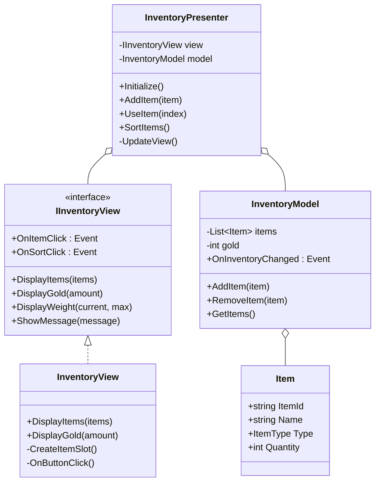

# 게임 개발자를 위한 C# 디자인 패턴: 실전 예제로 배우는 패턴의 힘  

저자: 최흥배, AI-Assisted   
    
권장 개발 환경
- **IDE**: Visual Studio 2022 이상 (Community 이상)
- **.NET**: 버전 9 이상
- **OS**: Windows 10 이상

-----  
   
# Chapter 14: MVC/MVP Pattern (게임 UI용)

## 1. 게임 개발 현장에서...

당신은 RPG 게임의 인벤토리 시스템을 개발하고 있다. 플레이어는 아이템을 습득하고, 사용하고, 버릴 수 있다. UI에는 아이템 목록, 아이템 정보, 골드 표시, 무게 제한 등이 표시된다.

처음에는 간단해 보였다. 하지만 요구사항이 추가되면서 코드가 복잡해진다.

**기획자의 요청:**
- "아이템을 드래그 앤 드롭으로 정렬할 수 있게 해주세요."
- "필터 기능을 추가해주세요. 무기만, 소비 아이템만 보기."
- "아이템 강화 시스템을 추가해주세요."
- "멀티플레이에서 다른 플레이어 인벤토리도 볼 수 있어야 해요."

**디자이너의 요청:**
- "UI 레이아웃을 완전히 바꿔야 해요."
- "PC와 모바일 버전의 UI가 달라야 해요."

당신의 코드는 UI 로직, 게임 로직, 데이터 관리가 뒤섞여 스파게티가 되어버렸다. 버튼 하나를 수정하려면 게임 로직까지 건드려야 하고, 데이터를 변경하면 UI가 깨진다.

"UI와 로직을 어떻게 분리하지? 코드를 다시 짜야 하나?"

## 2. 패턴 없이 코딩하기

먼저 MVC/MVP 패턴 없이 인벤토리를 만들어본다. 모든 것이 하나의 클래스에 뭉쳐있는 전형적인 방식이다.

```csharp
// 모든 것이 하나에 - God Object 안티패턴
public class InventoryUI : MonoBehaviour
{
    // UI 요소들
    public Transform itemContainer;
    public GameObject itemSlotPrefab;
    public Text goldText;
    public Text weightText;
    public Button sortButton;
    public Button filterButton;
    public Dropdown filterDropdown;
    
    // 데이터
    private List<Item> items = new List<Item>();
    private int gold = 0;
    private float currentWeight = 0;
    private float maxWeight = 100;
    
    // UI 상태
    private List<GameObject> itemSlots = new List<GameObject>();
    private ItemType currentFilter = ItemType.All;
    
    void Start()
    {
        // 버튼 이벤트 연결
        sortButton.onClick.AddListener(OnSortButtonClick);
        filterButton.onClick.AddListener(OnFilterButtonClick);
        filterDropdown.onValueChanged.AddListener(OnFilterChanged);
        
        // 초기 아이템 로드
        LoadInventoryData();
        UpdateUI();
    }
    
    // 아이템 추가
    public void AddItem(Item item)
    {
        // 무게 체크
        if (currentWeight + item.Weight > maxWeight)
        {
            ShowMessage("인벤토리가 가득 찼습니다!");
            return;
        }
        
        // 같은 아이템이 있으면 개수 증가
        var existingItem = items.Find(i => i.ItemId == item.ItemId);
        if (existingItem != null && existingItem.IsStackable)
        {
            existingItem.Quantity += item.Quantity;
        }
        else
        {
            items.Add(item);
        }
        
        currentWeight += item.Weight * item.Quantity;
        
        // UI 업데이트
        UpdateUI();
        
        // 사운드 재생
        AudioManager.Instance.PlaySound("item_pickup");
        
        // 업적 체크
        CheckAchievements();
    }
    
    // 아이템 사용
    public void UseItem(int index)
    {
        if (index < 0 || index >= items.Count)
            return;
        
        var item = items[index];
        
        // 아이템 타입별 처리
        switch (item.Type)
        {
            case ItemType.Consumable:
                // 소비 아이템 사용
                ApplyItemEffect(item);
                item.Quantity--;
                
                if (item.Quantity <= 0)
                {
                    items.RemoveAt(index);
                }
                
                currentWeight -= item.Weight;
                break;
                
            case ItemType.Equipment:
                // 장비 착용
                EquipItem(item);
                items.RemoveAt(index);
                currentWeight -= item.Weight;
                break;
                
            case ItemType.QuestItem:
                // 퀘스트 아이템은 사용 불가
                ShowMessage("이 아이템은 사용할 수 없습니다.");
                return;
        }
        
        UpdateUI();
        AudioManager.Instance.PlaySound("item_use");
    }
    
    // 아이템 효과 적용
    private void ApplyItemEffect(Item item)
    {
        var player = GameObject.FindWithTag("Player").GetComponent<PlayerController>();
        
        switch (item.ItemId)
        {
            case "potion_hp":
                player.Heal(50);
                break;
            case "potion_mp":
                player.RestoreMana(30);
                break;
            case "food_bread":
                player.Heal(10);
                player.AddBuff("satiety", 60);
                break;
            // ... 100가지 아이템 케이스 ...
        }
    }
    
    // 장비 착용
    private void EquipItem(Item item)
    {
        var player = GameObject.FindWithTag("Player").GetComponent<PlayerController>();
        player.Equip(item);
    }
    
    // UI 업데이트
    private void UpdateUI()
    {
        // 기존 슬롯 제거
        foreach (var slot in itemSlots)
        {
            Destroy(slot);
        }
        itemSlots.Clear();
        
        // 필터링된 아이템 가져오기
        var filteredItems = GetFilteredItems();
        
        // 슬롯 생성
        foreach (var item in filteredItems)
        {
            var slot = Instantiate(itemSlotPrefab, itemContainer);
            
            // 슬롯 UI 설정
            var icon = slot.transform.Find("Icon").GetComponent<Image>();
            icon.sprite = Resources.Load<Sprite>($"Icons/{item.IconName}");
            
            var nameText = slot.transform.Find("Name").GetComponent<Text>();
            nameText.text = item.Name;
            
            var quantityText = slot.transform.Find("Quantity").GetComponent<Text>();
            if (item.IsStackable)
            {
                quantityText.text = item.Quantity.ToString();
                quantityText.gameObject.SetActive(true);
            }
            else
            {
                quantityText.gameObject.SetActive(false);
            }
            
            // 클릭 이벤트
            var button = slot.GetComponent<Button>();
            int index = items.IndexOf(item);
            button.onClick.AddListener(() => OnItemClick(index));
            
            itemSlots.Add(slot);
        }
        
        // 골드 표시
        goldText.text = $"Gold: {gold}";
        
        // 무게 표시
        weightText.text = $"Weight: {currentWeight:F1} / {maxWeight:F1}";
        
        // 무게 오버 시 빨간색
        if (currentWeight > maxWeight)
        {
            weightText.color = Color.red;
        }
        else
        {
            weightText.color = Color.white;
        }
    }
    
    // 필터링된 아이템 가져오기
    private List<Item> GetFilteredItems()
    {
        if (currentFilter == ItemType.All)
        {
            return items;
        }
        
        return items.Where(item => item.Type == currentFilter).ToList();
    }
    
    // 정렬 버튼 클릭
    private void OnSortButtonClick()
    {
        items.Sort((a, b) => a.Name.CompareTo(b.Name));
        UpdateUI();
    }
    
    // 필터 버튼 클릭
    private void OnFilterButtonClick()
    {
        filterDropdown.gameObject.SetActive(!filterDropdown.gameObject.activeSelf);
    }
    
    // 필터 변경
    private void OnFilterChanged(int index)
    {
        currentFilter = (ItemType)index;
        UpdateUI();
    }
    
    // 아이템 클릭
    private void OnItemClick(int index)
    {
        ShowItemDetail(items[index]);
    }
    
    // 아이템 상세 정보 표시
    private void ShowItemDetail(Item item)
    {
        // 또 다른 UI 코드...
    }
    
    // 데이터 저장
    public void SaveInventoryData()
    {
        var data = new InventorySaveData
        {
            Items = items,
            Gold = gold
        };
        
        string json = JsonUtility.ToJson(data);
        PlayerPrefs.SetString("inventory", json);
    }
    
    // 데이터 로드
    private void LoadInventoryData()
    {
        if (PlayerPrefs.HasKey("inventory"))
        {
            string json = PlayerPrefs.GetString("inventory");
            var data = JsonUtility.FromJson<InventorySaveData>(json);
            
            items = data.Items;
            gold = data.Gold;
            
            // 무게 재계산
            currentWeight = 0;
            foreach (var item in items)
            {
                currentWeight += item.Weight * item.Quantity;
            }
        }
    }
    
    // 업적 체크
    private void CheckAchievements()
    {
        // 업적 시스템과 결합...
    }
    
    // 메시지 표시
    private void ShowMessage(string message)
    {
        // UI 메시지 시스템과 결합...
    }
}

// 아이템 데이터
[System.Serializable]
public class Item
{
    public string ItemId;
    public string Name;
    public string IconName;
    public ItemType Type;
    public int Quantity;
    public float Weight;
    public bool IsStackable;
}

public enum ItemType
{
    All,
    Consumable,
    Equipment,
    QuestItem
}
```

## 3. 문제점 분석

이 코드는 작동은 하지만 여러 심각한 문제가 있다.

### 문제 1: 책임의 혼재

```
InventoryUI가 하는 일:
├── UI 렌더링 (슬롯 생성, 텍스트 업데이트)
├── 데이터 관리 (아이템 추가/제거, 무게 계산)
├── 비즈니스 로직 (아이템 사용, 장비 착용)
├── 입력 처리 (버튼 클릭, 드래그)
├── 저장/로드 (데이터 직렬화)
├── 외부 시스템 연동 (오디오, 업적, 플레이어)
└── 필터링/정렬 알고리즘
```

하나의 클래스가 너무 많은 책임을 진다. 단일 책임 원칙(SRP)을 명백히 위반한다.

### 문제 2: 강한 결합

```csharp
// UI가 게임 로직에 직접 의존
private void ApplyItemEffect(Item item)
{
    var player = GameObject.FindWithTag("Player").GetComponent<PlayerController>();
    player.Heal(50);  // UI가 게임 로직을 직접 호출!
}

// UI가 오디오 시스템에 직접 의존
AudioManager.Instance.PlaySound("item_pickup");

// UI가 업적 시스템에 직접 의존
CheckAchievements();
```

UI 코드가 게임의 모든 시스템과 강하게 결합되어 있다. UI를 수정하면 게임 로직이 깨지고, 게임 로직을 수정하면 UI가 깨진다.

### 문제 3: 테스트 불가능

```csharp
[Test]
public void AddItem_IncreaseInventoryCount()
{
    var ui = new InventoryUI();
    ui.AddItem(new Item { Name = "Potion" });
    
    // 실패! InventoryUI는 MonoBehaviour라 new로 생성 불가
    // UI 요소들이 null이라 NullReferenceException
    // AudioManager.Instance가 없어서 크래시
}
```

MonoBehaviour와 결합되어 있고, 여러 전역 의존성 때문에 단위 테스트가 불가능하다.

### 문제 4: UI 변경이 어려움

```csharp
// UI 레이아웃을 바꾸려면?
// → UpdateUI() 메서드 전체를 다시 작성

// 모바일 UI를 만들려면?
// → InventoryUI를 복사해서 MobileInventoryUI 생성?
// → 비즈니스 로직이 중복됨

// 리스트 뷰를 그리드 뷰로 바꾸려면?
// → UpdateUI() 메서드와 데이터 구조를 함께 수정
```

### 문제 5: 재사용 불가능

```csharp
// 상점 UI를 만들려면?
// → InventoryUI와 거의 같은데 골드 대신 가격 표시
// → 코드를 복사해서 ShopUI 만들기?
// → 비즈니스 로직이 중복됨

// NPC 인벤토리를 보여주려면?
// → 또 다른 UI 클래스?
```

### 문제 6: 유지보수 악몽

```
기획 변경: "아이템 강화 시스템 추가"
→ InventoryUI 수정 (200줄 추가)

디자인 변경: "UI 레이아웃 변경"
→ InventoryUI 수정 (UpdateUI() 메서드 전체 수정)

버그 수정: "무게 계산 오류"
→ InventoryUI의 여러 메서드 수정 (AddItem, UseItem, LoadData)

새 기능: "거래 시스템"
→ InventoryUI를 어떻게 재사용?
```

## 4. 패턴 소개

**MVC (Model-View-Controller)**와 **MVP (Model-View-Presenter)**는 UI를 구조화하는 대표적인 패턴이다. 게임에서는 MVP가 더 적합한 경우가 많다.

### MVC vs MVP

#### MVC (Model-View-Controller)

```
User Input → Controller → Model
                ↓           ↓
              View ←────────┘
              
View가 Model을 직접 관찰
```

#### MVP (Model-View-Presenter)

```
User Input → View → Presenter → Model
              ↑                   ↓
              └───────────────────┘
              
View와 Model이 완전히 분리
Presenter가 중재자 역할
```

**게임에서는 MVP를 선호하는 이유:**
- View와 Model의 완전한 분리 (테스트 용이)
- Unity의 MonoBehaviour와 잘 맞음
- View를 쉽게 교체 가능

### MVP 구조



### ASCII 다이어그램

```
MVP Pattern 동작 흐름:

1. 사용자 입력:
   User clicks [Use Item] button
        ↓
   InventoryView (MonoBehaviour)
        ↓
   OnItemClick event fired
        ↓
   InventoryPresenter.OnItemClicked(index)

2. 비즈니스 로직 처리:
   InventoryPresenter
        ↓
   model.UseItem(index)
        ↓
   InventoryModel (순수 C# 클래스)
        ↓
   - 아이템 효과 적용
   - 수량 감소
   - 무게 재계산
        ↓
   OnInventoryChanged event fired

3. UI 업데이트:
   InventoryPresenter receives OnInventoryChanged
        ↓
   UpdateView()
        ↓
   view.DisplayItems(model.GetItems())
   view.DisplayGold(model.Gold)
   view.DisplayWeight(model.CurrentWeight, model.MaxWeight)
        ↓
   InventoryView (MonoBehaviour)
        ↓
   UI 요소들 업데이트

각 계층의 책임:
┌─────────────────────────────────────┐
│  View (InventoryView)               │
│  - UI 렌더링                        │
│  - 사용자 입력 감지                 │
│  - 이벤트 발생                      │
│  - Unity MonoBehaviour와 결합       │
└─────────────────────────────────────┘
              ↕ Events
┌─────────────────────────────────────┐
│  Presenter (InventoryPresenter)     │
│  - View와 Model 연결                │
│  - 사용자 액션 처리                 │
│  - View 업데이트 지시               │
│  - 순수 C# (테스트 가능)           │
└─────────────────────────────────────┘
              ↕ Method Calls
┌─────────────────────────────────────┐
│  Model (InventoryModel)             │
│  - 데이터 관리                      │
│  - 비즈니스 로직                    │
│  - 데이터 검증                      │
│  - 순수 C# (테스트 가능)           │
└─────────────────────────────────────┘
```

### 핵심 개념

1. **Model**: 데이터와 비즈니스 로직 (순수 C#)
2. **View**: UI 렌더링과 입력 처리 (MonoBehaviour)
3. **Presenter**: View와 Model의 중재자 (순수 C#)

## 5. 패턴 적용하기

MVP 패턴을 단계별로 적용하여 인벤토리 시스템을 리팩토링한다.

### Step 1: Model 정의

```csharp
// 인벤토리 데이터와 비즈니스 로직 (순수 C#)
public class InventoryModel
{
    // 데이터
    private List<Item> items = new List<Item>();
    private int gold;
    private float currentWeight;
    private float maxWeight;
    
    // 이벤트
    public event Action OnInventoryChanged;
    public event Action<int> OnGoldChanged;
    public event Action<string> OnMessage;
    
    // 프로퍼티
    public int Gold => gold;
    public float CurrentWeight => currentWeight;
    public float MaxWeight => maxWeight;
    public IReadOnlyList<Item> Items => items.AsReadOnly();
    
    public InventoryModel(float maxWeight = 100f)
    {
        this.maxWeight = maxWeight;
    }
    
    // 아이템 추가
    public bool AddItem(Item item)
    {
        // 무게 체크
        float totalWeight = item.Weight * item.Quantity;
        if (currentWeight + totalWeight > maxWeight)
        {
            OnMessage?.Invoke("인벤토리가 가득 찼습니다!");
            return false;
        }
        
        // 스택 가능 아이템 병합
        if (item.IsStackable)
        {
            var existing = items.Find(i => i.ItemId == item.ItemId);
            if (existing != null)
            {
                existing.Quantity += item.Quantity;
                currentWeight += totalWeight;
                OnInventoryChanged?.Invoke();
                return true;
            }
        }
        
        // 새 아이템 추가
        items.Add(item);
        currentWeight += totalWeight;
        OnInventoryChanged?.Invoke();
        return true;
    }
    
    // 아이템 제거
    public bool RemoveItem(int index, int quantity = 1)
    {
        if (index < 0 || index >= items.Count)
            return false;
        
        var item = items[index];
        
        if (item.Quantity <= quantity)
        {
            // 전체 제거
            currentWeight -= item.Weight * item.Quantity;
            items.RemoveAt(index);
        }
        else
        {
            // 일부 제거
            item.Quantity -= quantity;
            currentWeight -= item.Weight * quantity;
        }
        
        OnInventoryChanged?.Invoke();
        return true;
    }
    
    // 골드 추가
    public void AddGold(int amount)
    {
        gold += amount;
        OnGoldChanged?.Invoke(gold);
    }
    
    // 골드 사용
    public bool SpendGold(int amount)
    {
        if (gold < amount)
        {
            OnMessage?.Invoke("골드가 부족합니다!");
            return false;
        }
        
        gold -= amount;
        OnGoldChanged?.Invoke(gold);
        return true;
    }
    
    // 아이템 정렬
    public void SortByName()
    {
        items.Sort((a, b) => a.Name.CompareTo(b.Name));
        OnInventoryChanged?.Invoke();
    }
    
    public void SortByType()
    {
        items.Sort((a, b) => a.Type.CompareTo(b.Type));
        OnInventoryChanged?.Invoke();
    }
    
    // 필터링된 아이템 가져오기
    public List<Item> GetFilteredItems(ItemType filter)
    {
        if (filter == ItemType.All)
            return new List<Item>(items);
        
        return items.Where(i => i.Type == filter).ToList();
    }
    
    // 아이템 검색
    public Item GetItem(int index)
    {
        if (index >= 0 && index < items.Count)
            return items[index];
        return null;
    }
    
    // 무게 초과 여부
    public bool IsOverWeight()
    {
        return currentWeight > maxWeight;
    }
    
    // 데이터 저장용
    public InventorySaveData GetSaveData()
    {
        return new InventorySaveData
        {
            Items = new List<Item>(items),
            Gold = gold
        };
    }
    
    // 데이터 로드용
    public void LoadSaveData(InventorySaveData data)
    {
        items = data.Items;
        gold = data.Gold;
        
        // 무게 재계산
        currentWeight = 0;
        foreach (var item in items)
        {
            currentWeight += item.Weight * item.Quantity;
        }
        
        OnInventoryChanged?.Invoke();
        OnGoldChanged?.Invoke(gold);
    }
}

// 아이템 데이터 (변경 없음)
[System.Serializable]
public class Item
{
    public string ItemId;
    public string Name;
    public string Description;
    public string IconName;
    public ItemType Type;
    public int Quantity;
    public float Weight;
    public bool IsStackable;
    
    public Item Clone()
    {
        return new Item
        {
            ItemId = this.ItemId,
            Name = this.Name,
            Description = this.Description,
            IconName = this.IconName,
            Type = this.Type,
            Quantity = this.Quantity,
            Weight = this.Weight,
            IsStackable = this.IsStackable
        };
    }
}

public enum ItemType
{
    All,
    Consumable,
    Equipment,
    QuestItem,
    Material
}

[System.Serializable]
public class InventorySaveData
{
    public List<Item> Items;
    public int Gold;
}
```

### Step 2: View 인터페이스 정의

```csharp
// View가 구현해야 하는 인터페이스
public interface IInventoryView
{
    // UI 업데이트
    void DisplayItems(IReadOnlyList<Item> items);
    void DisplayGold(int amount);
    void DisplayWeight(float current, float max);
    void ShowMessage(string message);
    void ShowItemDetail(Item item);
    void HideItemDetail();
    
    // UI 상태
    void SetSortButtonInteractable(bool interactable);
    void SetFilterActive(ItemType filter);
    
    // 이벤트 (Presenter가 구독)
    event Action<int> OnItemClicked;
    event Action<int> OnItemUsed;
    event Action<int> OnItemDropped;
    event Action OnSortClicked;
    event Action<ItemType> OnFilterChanged;
    event Action OnCloseClicked;
}
```

### Step 3: View 구현 (Unity MonoBehaviour)

```csharp
// Unity UI 구현
public class InventoryView : MonoBehaviour, IInventoryView
{
    [Header("UI References")]
    [SerializeField] private Transform itemContainer;
    [SerializeField] private GameObject itemSlotPrefab;
    [SerializeField] private Text goldText;
    [SerializeField] private Text weightText;
    [SerializeField] private Button sortButton;
    [SerializeField] private Button closeButton;
    [SerializeField] private Dropdown filterDropdown;
    [SerializeField] private GameObject itemDetailPanel;
    [SerializeField] private Text detailNameText;
    [SerializeField] private Text detailDescriptionText;
    
    // 이벤트
    public event Action<int> OnItemClicked;
    public event Action<int> OnItemUsed;
    public event Action<int> OnItemDropped;
    public event Action OnSortClicked;
    public event Action<ItemType> OnFilterChanged;
    public event Action OnCloseClicked;
    
    private List<GameObject> itemSlots = new List<GameObject>();
    
    void Start()
    {
        // 버튼 이벤트 연결
        sortButton.onClick.AddListener(() => OnSortClicked?.Invoke());
        closeButton.onClick.AddListener(() => OnCloseClicked?.Invoke());
        filterDropdown.onValueChanged.AddListener(index => 
            OnFilterChanged?.Invoke((ItemType)index));
        
        HideItemDetail();
    }
    
    // 아이템 목록 표시
    public void DisplayItems(IReadOnlyList<Item> items)
    {
        // 기존 슬롯 제거
        foreach (var slot in itemSlots)
        {
            Destroy(slot);
        }
        itemSlots.Clear();
        
        // 새 슬롯 생성
        for (int i = 0; i < items.Count; i++)
        {
            var item = items[i];
            var slot = Instantiate(itemSlotPrefab, itemContainer);
            
            // 아이콘
            var icon = slot.transform.Find("Icon").GetComponent<Image>();
            icon.sprite = Resources.Load<Sprite>($"Icons/{item.IconName}");
            
            // 이름
            var nameText = slot.transform.Find("Name").GetComponent<Text>();
            nameText.text = item.Name;
            
            // 수량
            var quantityText = slot.transform.Find("Quantity").GetComponent<Text>();
            if (item.IsStackable && item.Quantity > 1)
            {
                quantityText.text = $"x{item.Quantity}";
                quantityText.gameObject.SetActive(true);
            }
            else
            {
                quantityText.gameObject.SetActive(false);
            }
            
            // 클릭 이벤트
            int index = i; // 클로저 캡처
            var button = slot.GetComponent<Button>();
            button.onClick.AddListener(() => OnItemClicked?.Invoke(index));
            
            // 사용 버튼
            var useButton = slot.transform.Find("UseButton").GetComponent<Button>();
            useButton.onClick.AddListener(() => OnItemUsed?.Invoke(index));
            
            // 버리기 버튼
            var dropButton = slot.transform.Find("DropButton").GetComponent<Button>();
            dropButton.onClick.AddListener(() => OnItemDropped?.Invoke(index));
            
            itemSlots.Add(slot);
        }
    }
    
    // 골드 표시
    public void DisplayGold(int amount)
    {
        goldText.text = $"Gold: {amount:N0}";
    }
    
    // 무게 표시
    public void DisplayWeight(float current, float max)
    {
        weightText.text = $"Weight: {current:F1} / {max:F1}";
        
        // 색상 변경
        if (current > max)
        {
            weightText.color = Color.red;
        }
        else if (current > max * 0.8f)
        {
            weightText.color = Color.yellow;
        }
        else
        {
            weightText.color = Color.white;
        }
    }
    
    // 메시지 표시
    public void ShowMessage(string message)
    {
        // 간단한 토스트 메시지
        StartCoroutine(ShowMessageCoroutine(message));
    }
    
    private IEnumerator ShowMessageCoroutine(string message)
    {
        var messageObj = new GameObject("Message");
        messageObj.transform.SetParent(transform);
        
        var text = messageObj.AddComponent<Text>();
        text.text = message;
        text.font = goldText.font;
        text.fontSize = 24;
        text.alignment = TextAnchor.MiddleCenter;
        text.color = Color.yellow;
        
        var rect = messageObj.GetComponent<RectTransform>();
        rect.anchoredPosition = new Vector2(0, 100);
        rect.sizeDelta = new Vector2(400, 50);
        
        yield return new WaitForSeconds(2f);
        
        Destroy(messageObj);
    }
    
    // 아이템 상세 정보
    public void ShowItemDetail(Item item)
    {
        itemDetailPanel.SetActive(true);
        detailNameText.text = item.Name;
        detailDescriptionText.text = item.Description;
    }
    
    public void HideItemDetail()
    {
        itemDetailPanel.SetActive(false);
    }
    
    // UI 상태 제어
    public void SetSortButtonInteractable(bool interactable)
    {
        sortButton.interactable = interactable;
    }
    
    public void SetFilterActive(ItemType filter)
    {
        filterDropdown.value = (int)filter;
    }
}
```

### Step 4: Presenter 구현

```csharp
// Presenter - View와 Model 연결 (순수 C#)
public class InventoryPresenter
{
    private readonly IInventoryView view;
    private readonly InventoryModel model;
    private ItemType currentFilter = ItemType.All;
    
    public InventoryPresenter(IInventoryView view, InventoryModel model)
    {
        this.view = view;
        this.model = model;
        
        // View 이벤트 구독
        view.OnItemClicked += OnItemClicked;
        view.OnItemUsed += OnItemUsed;
        view.OnItemDropped += OnItemDropped;
        view.OnSortClicked += OnSortClicked;
        view.OnFilterChanged += OnFilterChanged;
        view.OnCloseClicked += OnCloseClicked;
        
        // Model 이벤트 구독
        model.OnInventoryChanged += UpdateView;
        model.OnGoldChanged += gold => view.DisplayGold(gold);
        model.OnMessage += message => view.ShowMessage(message);
        
        // 초기 View 업데이트
        UpdateView();
    }
    
    // 아이템 추가 (외부에서 호출)
    public bool AddItem(Item item)
    {
        return model.AddItem(item);
    }
    
    // 골드 추가
    public void AddGold(int amount)
    {
        model.AddGold(amount);
    }
    
    // 저장/로드
    public void Save()
    {
        var data = model.GetSaveData();
        string json = JsonUtility.ToJson(data);
        PlayerPrefs.SetString("inventory", json);
        PlayerPrefs.Save();
    }
    
    public void Load()
    {
        if (PlayerPrefs.HasKey("inventory"))
        {
            string json = PlayerPrefs.GetString("inventory");
            var data = JsonUtility.FromJson<InventorySaveData>(json);
            model.LoadSaveData(data);
        }
    }
    
    // View 이벤트 핸들러
    private void OnItemClicked(int index)
    {
        var item = model.GetItem(index);
        if (item != null)
        {
            view.ShowItemDetail(item);
        }
    }
    
    private void OnItemUsed(int index)
    {
        var item = model.GetItem(index);
        if (item == null)
            return;
        
        // 아이템 사용 로직을 외부 시스템에 위임
        var useResult = ItemUsageService.UseItem(item);
        
        if (useResult.Success)
        {
            model.RemoveItem(index, 1);
            view.ShowMessage(useResult.Message);
        }
        else
        {
            view.ShowMessage(useResult.ErrorMessage);
        }
    }
    
    private void OnItemDropped(int index)
    {
        model.RemoveItem(index, 1);
        view.ShowMessage("아이템을 버렸습니다.");
    }
    
    private void OnSortClicked()
    {
        model.SortByName();
    }
    
    private void OnFilterChanged(ItemType filter)
    {
        currentFilter = filter;
        UpdateView();
    }
    
    private void OnCloseClicked()
    {
        view.HideItemDetail();
        // 인벤토리 창 닫기 로직
    }
    
    // View 업데이트
    private void UpdateView()
    {
        var items = model.GetFilteredItems(currentFilter);
        view.DisplayItems(items);
        view.DisplayGold(model.Gold);
        view.DisplayWeight(model.CurrentWeight, model.MaxWeight);
        
        // 정렬 버튼 활성화 여부
        view.SetSortButtonInteractable(items.Count > 1);
    }
    
    // 정리
    public void Dispose()
    {
        // 이벤트 구독 해제
        view.OnItemClicked -= OnItemClicked;
        view.OnItemUsed -= OnItemUsed;
        view.OnItemDropped -= OnItemDropped;
        view.OnSortClicked -= OnSortClicked;
        view.OnFilterChanged -= OnFilterChanged;
        view.OnCloseClicked -= OnCloseClicked;
        
        model.OnInventoryChanged -= UpdateView;
    }
}
```

### Step 5: 아이템 사용 서비스 (비즈니스 로직 분리)

```csharp
// 아이템 사용 로직을 별도 서비스로 분리
public static class ItemUsageService
{
    public static ItemUseResult UseItem(Item item)
    {
        switch (item.Type)
        {
            case ItemType.Consumable:
                return UseConsumable(item);
                
            case ItemType.Equipment:
                return UseEquipment(item);
                
            case ItemType.QuestItem:
                return new ItemUseResult
                {
                    Success = false,
                    ErrorMessage = "이 아이템은 사용할 수 없습니다."
                };
                
            default:
                return new ItemUseResult { Success = false };
        }
    }
    
    private static ItemUseResult UseConsumable(Item item)
    {
        var player = GameObject.FindWithTag("Player")?.GetComponent<PlayerController>();
        if (player == null)
        {
            return new ItemUseResult
            {
                Success = false,
                ErrorMessage = "플레이어를 찾을 수 없습니다."
            };
        }
        
        switch (item.ItemId)
        {
            case "potion_hp":
                player.Heal(50);
                return new ItemUseResult
                {
                    Success = true,
                    Message = "HP를 50 회복했습니다!"
                };
                
            case "potion_mp":
                player.RestoreMana(30);
                return new ItemUseResult
                {
                    Success = true,
                    Message = "MP를 30 회복했습니다!"
                };
                
            default:
                return new ItemUseResult { Success = false };
        }
    }
    
    private static ItemUseResult UseEquipment(Item item)
    {
        var player = GameObject.FindWithTag("Player")?.GetComponent<PlayerController>();
        if (player == null)
        {
            return new ItemUseResult { Success = false };
        }
        
        player.Equip(item);
        return new ItemUseResult
        {
            Success = true,
            Message = $"{item.Name}을(를) 장착했습니다!"
        };
    }
}

public struct ItemUseResult
{
    public bool Success;
    public string Message;
    public string ErrorMessage;
}
```

### Step 6: 조립 (Bootstrap)

```csharp
// Unity에서 MVP 조립
public class InventoryUIController : MonoBehaviour
{
    [SerializeField] private InventoryView view;
    
    private InventoryModel model;
    private InventoryPresenter presenter;
    
    void Start()
    {
        // Model 생성
        model = new InventoryModel(maxWeight: 100f);
        
        // Presenter 생성 및 연결
        presenter = new InventoryPresenter(view, model);
        
        // 저장된 데이터 로드
        presenter.Load();
    }
    
    void OnDestroy()
    {
        // Presenter 정리
        presenter?.Dispose();
    }
    
    // 외부에서 아이템 추가 (플레이어가 아이템 획득 시)
    public void AddItem(Item item)
    {
        presenter.AddItem(item);
    }
    
    // 외부에서 골드 추가
    public void AddGold(int amount)
    {
        presenter.AddGold(amount);
    }
}
```

## 6. Before/After 비교

### Before: 패턴 미사용

```
구조:
└── InventoryUI (MonoBehaviour)
    ├── 데이터 관리
    ├── 비즈니스 로직
    ├── UI 렌더링
    └── 입력 처리

장점:
✗ 없음

단점:
✗ 모든 것이 하나의 클래스에 뭉쳐있음 (600줄 이상)
✗ UI 변경 시 게임 로직도 수정 필요
✗ 테스트 불가능 (MonoBehaviour 의존)
✗ 재사용 불가능
✗ 유지보수 악몽
✗ 멀티플랫폼 UI 지원 어려움

코드 라인 수: 약 600줄 (1개 파일)
```

### After: MVP 패턴 사용

```
구조:
├── InventoryModel (순수 C#)
│   └── 데이터와 비즈니스 로직
├── IInventoryView (인터페이스)
│   └── View 계약
├── InventoryView (MonoBehaviour)
│   └── UI 렌더링과 입력 처리
├── InventoryPresenter (순수 C#)
│   └── View와 Model 연결
└── ItemUsageService (순수 C#)
    └── 아이템 사용 로직

장점:
✓ 관심사의 명확한 분리
✓ UI 변경해도 비즈니스 로직 영향 없음
✓ Model과 Presenter는 테스트 가능
✓ View를 쉽게 교체 가능 (PC/모바일)
✓ 코드 재사용 가능
✓ 유지보수 용이

단점:
✗ 파일 수 증가 (5개)
✗ 초기 설정 복잡
✗ 작은 UI에는 과도할 수 있음

코드 라인 수: 약 800줄 (5개 파일)
```

### 실제 변경 시나리오 비교

#### 시나리오 1: UI 레이아웃 변경

**Before:**
```csharp
// InventoryUI.cs 전체 수정 (200줄)
// UpdateUI() 메서드 완전히 재작성
// 비즈니스 로직과 뒤섞여 있어 실수하기 쉬움
```

**After:**
```csharp
// InventoryView.cs만 수정 (100줄)
// DisplayItems() 메서드만 재작성
// Model과 Presenter는 전혀 건드리지 않음
```

#### 시나리오 2: 비즈니스 로직 변경 (아이템 강화 추가)

**Before:**
```csharp
// InventoryUI.cs 수정
// UI 코드 사이에 강화 로직 추가
// UpdateUI()도 수정 (강화 레벨 표시)
// 테스트 불가능
```

**After:**
```csharp
// InventoryModel.cs에 EnhanceItem() 추가
// ItemUsageService.cs에 강화 로직 추가
// 단위 테스트로 검증 가능
// View는 자동으로 업데이트됨
```

#### 시나리오 3: 모바일 UI 추가

**Before:**
```csharp
// InventoryUI.cs 복사해서 MobileInventoryUI.cs 생성
// 비즈니스 로직 중복
// 두 파일 모두 유지보수 필요
```

**After:**
```csharp
// MobileInventoryView.cs만 새로 작성
// Model과 Presenter 재사용
// 비즈니스 로직 중복 없음
```

## 7. 실전 팁

### Tip 1: View 교체하기

MVP의 가장 큰 장점은 View를 쉽게 교체할 수 있다는 것이다.

```csharp
// PC용 View
public class PCInventoryView : MonoBehaviour, IInventoryView
{
    // 그리드 레이아웃, 마우스 호버, 툴팁
    public void DisplayItems(IReadOnlyList<Item> items)
    {
        // 그리드 형태로 표시
        // 마우스 오버 시 툴팁
    }
}

// 모바일용 View
public class MobileInventoryView : MonoBehaviour, IInventoryView
{
    // 리스트 레이아웃, 터치 인터랙션
    public void DisplayItems(IReadOnlyList<Item> items)
    {
        // 세로 리스트로 표시
        // 스와이프 제스처 지원
    }
}

// 조립 시 플랫폼에 따라 선택
public class InventoryUIController : MonoBehaviour
{
    void Start()
    {
        IInventoryView view;
        
        #if UNITY_STANDALONE || UNITY_EDITOR
            view = GetComponent<PCInventoryView>();
        #elif UNITY_ANDROID || UNITY_IOS
            view = GetComponent<MobileInventoryView>();
        #endif
        
        var model = new InventoryModel();
        var presenter = new InventoryPresenter(view, model);
    }
}
```

### Tip 2: 단위 테스트

MVP 패턴의 핵심 장점은 테스트 가능성이다.

```csharp
// Mock View
public class MockInventoryView : IInventoryView
{
    public List<Item> DisplayedItems { get; private set; }
    public int DisplayedGold { get; private set; }
    public string LastMessage { get; private set; }
    
    public void DisplayItems(IReadOnlyList<Item> items)
    {
        DisplayedItems = new List<Item>(items);
    }
    
    public void DisplayGold(int amount)
    {
        DisplayedGold = amount;
    }
    
    public void ShowMessage(string message)
    {
        LastMessage = message;
    }
    
    // 나머지 구현...
    public event Action<int> OnItemClicked;
    public event Action<int> OnItemUsed;
    // ...
    
    // 테스트 헬퍼
    public void SimulateItemClick(int index)
    {
        OnItemClicked?.Invoke(index);
    }
}

// 단위 테스트
[TestFixture]
public class InventoryPresenterTests
{
    private MockInventoryView view;
    private InventoryModel model;
    private InventoryPresenter presenter;
    
    [SetUp]
    public void Setup()
    {
        view = new MockInventoryView();
        model = new InventoryModel();
        presenter = new InventoryPresenter(view, model);
    }
    
    [Test]
    public void AddItem_UpdatesView()
    {
        // Arrange
        var item = new Item
        {
            ItemId = "potion",
            Name = "Potion",
            Quantity = 1,
            Weight = 0.5f
        };
        
        // Act
        presenter.AddItem(item);
        
        // Assert
        Assert.AreEqual(1, view.DisplayedItems.Count);
        Assert.AreEqual("Potion", view.DisplayedItems[0].Name);
    }
    
    [Test]
    public void AddItem_ExceedsWeight_ShowsMessage()
    {
        // Arrange
        var heavyItem = new Item
        {
            ItemId = "rock",
            Name = "Heavy Rock",
            Quantity = 1,
            Weight = 150f
        };
        
        // Act
        presenter.AddItem(heavyItem);
        
        // Assert
        Assert.AreEqual("인벤토리가 가득 찼습니다!", view.LastMessage);
        Assert.AreEqual(0, view.DisplayedItems.Count);
    }
    
    [Test]
    public void StackableItems_MergeCorrectly()
    {
        // Arrange
        var potion1 = new Item
        {
            ItemId = "potion",
            Name = "Potion",
            Quantity = 5,
            Weight = 0.5f,
            IsStackable = true
        };
        
        var potion2 = new Item
        {
            ItemId = "potion",
            Name = "Potion",
            Quantity = 3,
            Weight = 0.5f,
            IsStackable = true
        };
        
        // Act
        presenter.AddItem(potion1);
        presenter.AddItem(potion2);
        
        // Assert
        Assert.AreEqual(1, view.DisplayedItems.Count);
        Assert.AreEqual(8, view.DisplayedItems[0].Quantity);
    }
}
```

### Tip 3: 여러 View 동시 업데이트

하나의 Model을 여러 View가 관찰하게 할 수 있다.

```csharp
// 메인 인벤토리 View
public class MainInventoryView : MonoBehaviour, IInventoryView
{
    // 전체 인벤토리 표시
}

// 퀵슬롯 View
public class QuickSlotView : MonoBehaviour, IInventoryView
{
    // 처음 4개 아이템만 표시
    public void DisplayItems(IReadOnlyList<Item> items)
    {
        var quickItems = items.Take(4).ToList();
        // 퀵슬롯에 표시
    }
}

// 하나의 Model, 여러 View
public class InventoryUIController : MonoBehaviour
{
    [SerializeField] private MainInventoryView mainView;
    [SerializeField] private QuickSlotView quickSlotView;
    
    void Start()
    {
        var model = new InventoryModel();
        
        // 같은 Model을 공유하는 두 Presenter
        var mainPresenter = new InventoryPresenter(mainView, model);
        var quickPresenter = new InventoryPresenter(quickSlotView, model);
        
        // Model이 변경되면 두 View 모두 자동 업데이트됨
    }
}
```

### Tip 4: Presenter 재사용

같은 Presenter를 다른 상황에서 재사용할 수 있다.

```csharp
// 플레이어 인벤토리
var playerModel = new InventoryModel();
var playerPresenter = new InventoryPresenter(inventoryView, playerModel);

// NPC 상인 인벤토리 (같은 Presenter 재사용!)
var merchantModel = new InventoryModel();
var merchantPresenter = new InventoryPresenter(shopView, merchantModel);

// 거래 시
public void TradeItem(Item item)
{
    if (playerModel.RemoveItem(item))
    {
        merchantModel.AddItem(item);
        // 두 View 모두 자동 업데이트
    }
}
```

### Tip 5: Command 패턴과 결합

Presenter에서 Command 패턴을 사용하여 Undo/Redo를 구현할 수 있다.

```csharp
public class InventoryPresenter
{
    private Stack<ICommand> undoStack = new Stack<ICommand>();
    
    private void OnItemDropped(int index)
    {
        var item = model.GetItem(index);
        var command = new DropItemCommand(model, index, item);
        
        command.Execute();
        undoStack.Push(command);
    }
    
    public void Undo()
    {
        if (undoStack.Count > 0)
        {
            var command = undoStack.Pop();
            command.Undo();
        }
    }
}

// 명령 인터페이스
public interface ICommand
{
    void Execute();
    void Undo();
}

// 아이템 버리기 명령
public class DropItemCommand : ICommand
{
    private InventoryModel model;
    private int index;
    private Item droppedItem;
    
    public DropItemCommand(InventoryModel model, int index, Item item)
    {
        this.model = model;
        this.index = index;
        this.droppedItem = item.Clone();
    }
    
    public void Execute()
    {
        model.RemoveItem(index, 1);
    }
    
    public void Undo()
    {
        model.AddItem(droppedItem);
    }
}
```

### Tip 6: Unity uGUI 최적화

Unity의 uGUI는 성능 문제가 있을 수 있다. MVP 패턴에서 최적화하는 방법이다.

```csharp
public class OptimizedInventoryView : MonoBehaviour, IInventoryView
{
    [SerializeField] private ScrollRect scrollRect;
    [SerializeField] private GameObject itemSlotPrefab;
    
    private List<GameObject> pooledSlots = new List<GameObject>();
    private List<GameObject> activeSlots = new List<GameObject>();
    
    public void DisplayItems(IReadOnlyList<Item> items)
    {
        // 기존 슬롯을 풀로 반환
        foreach (var slot in activeSlots)
        {
            slot.SetActive(false);
            pooledSlots.Add(slot);
        }
        activeSlots.Clear();
        
        // 필요한 만큼만 활성화
        for (int i = 0; i < items.Count; i++)
        {
            GameObject slot;
            
            // 풀에서 가져오기
            if (pooledSlots.Count > 0)
            {
                slot = pooledSlots[0];
                pooledSlots.RemoveAt(0);
                slot.SetActive(true);
            }
            else
            {
                // 풀이 비었으면 새로 생성
                slot = Instantiate(itemSlotPrefab, scrollRect.content);
            }
            
            // 슬롯 업데이트
            UpdateSlot(slot, items[i], i);
            activeSlots.Add(slot);
        }
        
        // Canvas 리빌드 최소화
        LayoutRebuilder.ForceRebuildLayoutImmediate(scrollRect.content);
    }
    
    private void UpdateSlot(GameObject slot, Item item, int index)
    {
        // 슬롯 내용 업데이트 (생성이 아닌 수정)
        var icon = slot.transform.Find("Icon").GetComponent<Image>();
        icon.sprite = Resources.Load<Sprite>($"Icons/{item.IconName}");
        // ...
    }
}
```

### Tip 7: 애니메이션과 함께

View에서 애니메이션을 쉽게 추가할 수 있다.

```csharp
public class AnimatedInventoryView : MonoBehaviour, IInventoryView
{
    public void DisplayItems(IReadOnlyList<Item> items)
    {
        // 기존 슬롯 제거 (애니메이션과 함께)
        foreach (var slot in itemSlots)
        {
            StartCoroutine(FadeOutAndDestroy(slot));
        }
        
        // 새 슬롯 생성 (애니메이션과 함께)
        for (int i = 0; i < items.Count; i++)
        {
            var slot = Instantiate(itemSlotPrefab, itemContainer);
            StartCoroutine(FadeIn(slot, i * 0.05f)); // 순차적으로 나타남
            // 슬롯 설정...
        }
    }
    
    private IEnumerator FadeOutAndDestroy(GameObject obj)
    {
        var canvasGroup = obj.GetComponent<CanvasGroup>();
        if (canvasGroup == null)
            canvasGroup = obj.AddComponent<CanvasGroup>();
        
        float duration = 0.2f;
        float elapsed = 0;
        
        while (elapsed < duration)
        {
            elapsed += Time.deltaTime;
            canvasGroup.alpha = 1 - (elapsed / duration);
            yield return null;
        }
        
        Destroy(obj);
    }
    
    private IEnumerator FadeIn(GameObject obj, float delay)
    {
        var canvasGroup = obj.GetComponent<CanvasGroup>();
        if (canvasGroup == null)
            canvasGroup = obj.AddComponent<CanvasGroup>();
        
        canvasGroup.alpha = 0;
        
        yield return new WaitForSeconds(delay);
        
        float duration = 0.3f;
        float elapsed = 0;
        
        while (elapsed < duration)
        {
            elapsed += Time.deltaTime;
            canvasGroup.alpha = elapsed / duration;
            yield return null;
        }
        
        canvasGroup.alpha = 1;
    }
}
```

## 8. 연습 문제

### 문제 1: 상점 시스템 만들기

요구사항:
- 인벤토리와 유사하지만 구매/판매 기능 추가
- 아이템 가격 표시
- 골드로 아이템 구매
- 인벤토리 아이템을 판매
- MVP 패턴 적용

힌트:
```csharp
public interface IShopView
{
    void DisplayShopItems(IReadOnlyList<ShopItem> items);
    void DisplayPlayerGold(int gold);
    event Action<int> OnItemBuyClicked;
    event Action<int> OnItemSellClicked;
}

public class ShopModel
{
    // TODO: 상점 데이터와 로직 구현
}

public class ShopPresenter
{
    // TODO: View와 Model 연결
}
```

### 문제 2: 필터와 정렬 확장

요구사항:
- 여러 정렬 옵션 (이름, 타입, 무게, 가격)
- 여러 필터 동시 적용
- 검색 기능
- 정렬/필터 상태 저장

힌트:
```csharp
public class InventoryModel
{
    public List<Item> GetFilteredAndSortedItems(
        List<ItemType> filters,
        SortOption sortOption,
        string searchKeyword)
    {
        // TODO: 구현
    }
}

public enum SortOption
{
    Name,
    Type,
    Weight,
    Price
}
```

### 문제 3: 드래그 앤 드롭

요구사항:
- 아이템을 드래그해서 순서 변경
- 다른 인벤토리로 드래그 (거래)
- MVP 패턴 유지

힌트:
```csharp
public interface IInventoryView
{
    event Action<int, int> OnItemDragged; // fromIndex, toIndex
    event Action<int, IInventoryView> OnItemDraggedToOther;
}

public class InventoryPresenter
{
    private void OnItemDragged(int fromIndex, int toIndex)
    {
        // TODO: Model의 순서 변경
    }
}
```

### 문제 4: 멀티플레이어 인벤토리

요구사항:
- 서버에서 인벤토리 데이터 동기화
- 다른 플레이어 인벤토리 보기 (읽기 전용)
- 거래 시스템

힌트:
```csharp
public class NetworkInventoryModel : InventoryModel
{
    public void SyncFromServer(InventorySaveData data)
    {
        // TODO: 서버 데이터로 동기화
    }
    
    public void SendToServer()
    {
        // TODO: 변경사항 서버로 전송
    }
}

public interface IReadOnlyInventoryView
{
    void DisplayItems(IReadOnlyList<Item> items);
    // 수정 기능 없음
}
```

---

## 정리

**MVP Pattern은 게임 UI를 구조화하는 강력한 방법이다.**

핵심 요점:
- Model: 데이터와 비즈니스 로직 (순수 C#, 테스트 가능)
- View: UI 렌더링과 입력 (MonoBehaviour, 교체 가능)
- Presenter: View와 Model 연결 (순수 C#, 테스트 가능)

장점:
- 관심사의 명확한 분리
- 테스트 가능한 코드
- View를 쉽게 교체 (PC/모바일)
- 비즈니스 로직 재사용
- 유지보수 용이

주의사항:
- 간단한 UI에는 과도할 수 있음
- 초기 설정이 복잡함
- 파일 수 증가

Unity에서 복잡한 UI (인벤토리, 상점, 캐릭터 시트 등)를 만들 때 MVP 패턴은 필수적이다. 처음에는 복잡해 보이지만, 프로젝트가 커질수록 그 가치를 실감하게 된다.

다음 장에서는 지금까지 배운 모든 패턴을 종합하여 미니 RPG를 완성한다.