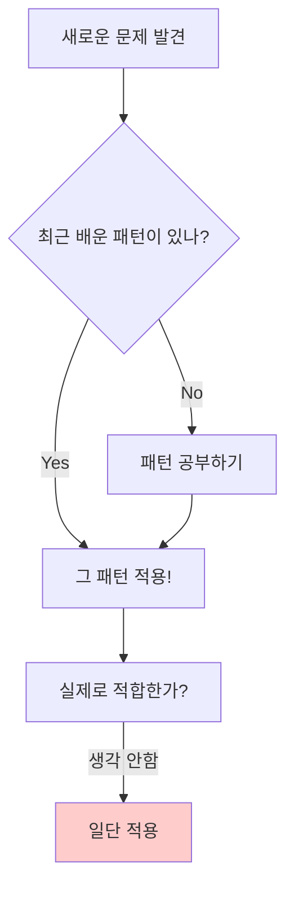

# 게임 개발자를 위한 C# 디자인 패턴: 실전 예제로 배우는 패턴의 힘  

저자: 최흥배, AI-Assisted   
    
권장 개발 환경
- **IDE**: Visual Studio 2022 이상 (Community 이상)
- **.NET**: 버전 9 이상
- **OS**: Windows 10 이상

-----  
  
# Chapter 16: 안티패턴과 주의사항

## 게임 개발 현장에서...

"우리 프로젝트는 완벽하게 디자인 패턴을 적용했어요!"

신입 개발자 김개발은 자랑스럽게 말했다. 하지만 팀장은 코드를 보고 한숨을 쉬었다. 단순한 총알 발사 시스템에 Factory, Builder, Strategy, Observer가 모두 적용되어 있었다. 클래스는 20개가 넘었고, 간단한 기능 하나를 수정하려면 여러 파일을 오가며 코드를 추적해야 했다.

"패턴을 알고 사용하는 것도 중요하지만, 언제 사용하지 말아야 하는지 아는 것은 더 중요합니다."

실제 게임 개발에서는 패턴의 올바른 사용만큼이나 과도한 사용을 피하는 것이 중요하다. 이번 챕터에서는 실무에서 자주 발생하는 안티패턴들과 주의사항들을 살펴본다.

---

## 패턴 없이 코딩하기 - 과도한 패턴 적용

```csharp
// ❌ 나쁜 예: 단순한 기능에 과도한 패턴 적용

// 1. Factory를 위한 인터페이스
public interface IBullet
{
    void Fire();
    void Update();
}

// 2. Abstract Factory
public interface IBulletFactory
{
    IBullet CreateBullet();
}

// 3. Concrete Factory
public class NormalBulletFactory : IBulletFactory
{
    public IBullet CreateBullet()
    {
        return new NormalBullet();
    }
}

// 4. Builder 패턴까지 추가
public class BulletBuilder
{
    private float _speed;
    private float _damage;
    private Vector3 _direction;
    
    public BulletBuilder SetSpeed(float speed)
    {
        _speed = speed;
        return this;
    }
    
    public BulletBuilder SetDamage(float damage)
    {
        _damage = damage;
        return this;
    }
    
    public BulletBuilder SetDirection(Vector3 direction)
    {
        _direction = direction;
        return this;
    }
    
    public IBullet Build()
    {
        return new NormalBullet(_speed, _damage, _direction);
    }
}

// 5. Strategy 패턴으로 움직임 정의
public interface IMovementStrategy
{
    void Move(Transform transform, float deltaTime);
}

public class StraightMovement : IMovementStrategy
{
    public void Move(Transform transform, float deltaTime)
    {
        // 직선 이동
    }
}

// 6. 실제 총알 클래스
public class NormalBullet : IBullet
{
    private IMovementStrategy _movement;
    private List<IObserver> _observers = new List<IObserver>();
    
    // ... 복잡한 구현
}

// 7. 사용 코드 - 단순히 총알을 발사하려는데...
public class PlayerWeapon : MonoBehaviour
{
    void Shoot()
    {
        IBulletFactory factory = new NormalBulletFactory();
        IBullet bullet = new BulletBuilder()
            .SetSpeed(10f)
            .SetDamage(5f)
            .SetDirection(transform.forward)
            .Build();
            
        bullet.Fire();
        
        // 이게 정말 필요한 복잡도인가?
    }
}
```

```csharp
// ❌ 또 다른 나쁜 예: Singleton 남용

public class GameManager : Singleton<GameManager>
{
    // 게임 전체 관리 - OK
}

public class PlayerDataManager : Singleton<PlayerDataManager>
{
    // 플레이어 데이터 - OK
}

public class UIManager : Singleton<UIManager>
{
    // UI 관리 - 아직 OK
}

public class SoundManager : Singleton<SoundManager>
{
    // 사운드 관리 - 괜찮음
}

public class EnemySpawnManager : Singleton<EnemySpawnManager>
{
    // 적 생성 - 음... 꼭 필요한가?
}

public class ParticleManager : Singleton<ParticleManager>
{
    // 파티클 관리 - Object Pool이면 충분하지 않나?
}

public class CameraManager : Singleton<CameraManager>
{
    // 카메라 관리 - 씬에 하나만 있으면 되는데?
}

public class TimeManager : Singleton<TimeManager>
{
    // 시간 관리 - Time.deltaTime으로 충분한데?
}

// 결과: 모든 클래스가 전역 변수처럼 사용됨
// 테스트 불가능, 의존성 추적 불가능, 순환 참조 위험
```

---

## 문제점 분석

### 1. 과도한 추상화의 문제

**증상:**
- 간단한 기능을 위해 10개 이상의 클래스가 필요하다
- 코드를 읽을 때 여러 파일을 오가며 추적해야 한다
- 새로운 팀원이 코드를 이해하는데 오래 걸린다

**원인:**
- "미래를 위한 확장성" 이라는 명분으로 불필요한 패턴을 추가한다
- 패턴 적용 자체가 목적이 되어버린다
- YAGNI(You Aren't Gonna Need It) 원칙을 무시한다

**결과:**
```
개발 시간 ↑  (복잡도 증가)
버그 위험 ↑  (더 많은 코드, 더 많은 버그)
성능 ↓      (불필요한 간접 참조)
가독성 ↓    (추상화 계층이 너무 많음)
```

### 2. Singleton의 과도한 사용

**문제점:**
- 전역 변수와 다를 바 없어진다
- 테스트가 어렵거나 불가능해진다
- 숨겨진 의존성으로 코드 파악이 어렵다
- 멀티씬에서 문제가 발생한다

### 3. 성능을 고려하지 않은 패턴 적용

**Unity에서 특히 주의:**
- Update()에서 복잡한 패턴 사용
- 매 프레임 객체 생성/파괴
- 불필요한 인터페이스 호출
- LINQ 남용

---

## 안티패턴 소개

### 안티패턴 1: Golden Hammer (황금 망치)

```
"망치만 있으면 모든 것이 못으로 보인다"
```



**예시:**
```csharp
// ❌ Observer를 막 배운 개발자
public class Player : MonoBehaviour
{
    // 체력 변경을 Observer로!
    public event Action<int> OnHealthChanged;
    
    // 위치 변경도 Observer로!
    public event Action<Vector3> OnPositionChanged;
    
    // 회전도 Observer로!
    public event Action<Quaternion> OnRotationChanged;
    
    // 속도도 Observer로!
    public event Action<float> OnSpeedChanged;
    
    void Update()
    {
        // 매 프레임 이벤트 발생... 성능 문제
        if (transform.position != _lastPosition)
        {
            OnPositionChanged?.Invoke(transform.position);
        }
    }
}
```

### 안티패턴 2: God Object (신 객체)

```csharp
// ❌ 모든 것을 다 하는 GameManager
public class GameManager : Singleton<GameManager>
{
    // 플레이어 관련
    public Player CurrentPlayer;
    public int PlayerScore;
    public int PlayerLevel;
    
    // 적 관련
    public List<Enemy> Enemies;
    public void SpawnEnemy() { }
    
    // UI 관련
    public void ShowUI() { }
    public void HideUI() { }
    
    // 사운드 관련
    public void PlaySound() { }
    
    // 저장/로드
    public void SaveGame() { }
    public void LoadGame() { }
    
    // 네트워크
    public void SendData() { }
    
    // 물리
    public void CheckCollision() { }
    
    // 카메라
    public void MoveCamera() { }
    
    // ... 끝이 없다
    
    // 결과: 2000줄 넘는 클래스
}
```

### 안티패턴 3: Premature Optimization (조기 최적화)

```csharp
// ❌ 아직 문제도 없는데 미리 최적화
public class EnemyManager : MonoBehaviour
{
    // "나중을 위해" 미리 Object Pool 구현
    private ObjectPool<Enemy>[] _enemyPools = new ObjectPool<Enemy>[100];
    
    // "성능을 위해" 복잡한 캐싱
    private Dictionary<int, Dictionary<string, List<Enemy>>> _cachedEnemies;
    
    // "최적화를 위해" 멀티스레딩
    private Thread _aiThread;
    
    // 실제로는 적이 10마리도 안 나오는 게임...
}
```

### 안티패턴 4: Cargo Cult Programming (화물 숭배 프로그래밍)

```csharp
// ❌ 왜 이렇게 하는지 모르고 따라하기
public class Weapon : MonoBehaviour
{
    // 튜토리얼에서 봤으니까 SerializeField를 쓴다
    [SerializeField] private int damage;
    
    // Stack Overflow에서 봤으니까 이렇게 쓴다
    private static Weapon _instance;
    public static Weapon Instance => _instance;
    
    // 다른 코드에서 봤으니까 추가
    private void OnEnable() => _instance = this;
    
    // 이게 뭔지는 모르지만 있으면 좋을 것 같다
    private void OnValidate() { }
    
    // 어디선가 본 패턴
    public interface IWeapon { }
    public abstract class WeaponBase : IWeapon { }
    
    // 실제로는 단순한 damage 값만 필요했다...
}
```

---

## 올바른 패턴 적용

### 원칙 1: KISS (Keep It Simple, Stupid)

```csharp
// ✅ 좋은 예: 단순하게 시작하기
public class Bullet : MonoBehaviour
{
    public float speed = 10f;
    public float damage = 5f;
    
    void Update()
    {
        transform.Translate(Vector3.forward * speed * Time.deltaTime);
    }
    
    void OnTriggerEnter(Collider other)
    {
        if (other.CompareTag("Enemy"))
        {
            other.GetComponent<Enemy>()?.TakeDamage(damage);
            Destroy(gameObject);
        }
    }
}

// 이 정도면 충분하다. 나중에 필요하면 리팩토링하자.
```

### 원칙 2: Rule of Three (세 번의 법칙)

```csharp
// 같은 코드가 세 번 반복되면 그때 패턴을 고려한다

// 첫 번째: 그냥 쓴다
public void CreateNormalEnemy()
{
    var enemy = Instantiate(normalEnemyPrefab);
    enemy.transform.position = spawnPoint;
}

// 두 번째: 복사-붙여넣기
public void CreateFastEnemy()
{
    var enemy = Instantiate(fastEnemyPrefab);
    enemy.transform.position = spawnPoint;
}

// 세 번째: 이제 패턴을 고려할 때
public void CreateBossEnemy()
{
    var enemy = Instantiate(bossEnemyPrefab);
    enemy.transform.position = spawnPoint;
    
    // 이제 Factory 패턴을 고려해볼까?
}

// ✅ 리팩토링
public Enemy CreateEnemy(EnemyType type)
{
    GameObject prefab = type switch
    {
        EnemyType.Normal => normalEnemyPrefab,
        EnemyType.Fast => fastEnemyPrefab,
        EnemyType.Boss => bossEnemyPrefab,
        _ => normalEnemyPrefab
    };
    
    var enemy = Instantiate(prefab, spawnPoint, Quaternion.identity);
    return enemy.GetComponent<Enemy>();
}
```

### 원칙 3: YAGNI (You Aren't Gonna Need It)

```csharp
// ❌ 나쁜 예: "나중을 위한" 코드
public abstract class Weapon : MonoBehaviour
{
    // 지금은 안 쓰지만 나중을 위해...
    public virtual void OnEquip() { }
    public virtual void OnUnequip() { }
    public virtual void OnUpgrade() { }
    public virtual void OnRepair() { }
    public virtual void OnEnchant() { }
    public virtual void OnSocketGem() { }
    
    // 실제로는 Attack()만 필요하다
    public abstract void Attack();
}

// ✅ 좋은 예: 지금 필요한 것만
public class Weapon : MonoBehaviour
{
    public void Attack()
    {
        // 공격 로직
    }
    
    // 필요할 때 추가하자
}
```

---

## Before/After 비교

### 사례 1: 적 생성 시스템

```csharp
// ❌ Before: 과도한 패턴 적용
// 파일 1: IEnemy.cs
public interface IEnemy { void Initialize(); void Update(); void Die(); }

// 파일 2: IEnemyFactory.cs
public interface IEnemyFactory { IEnemy CreateEnemy(); }

// 파일 3: EnemyFactoryProvider.cs
public class EnemyFactoryProvider
{
    private Dictionary<EnemyType, IEnemyFactory> _factories;
    // ... 복잡한 초기화
}

// 파일 4-7: 각 적 타입별 Factory
public class NormalEnemyFactory : IEnemyFactory { }
public class FastEnemyFactory : IEnemyFactory { }
// ...

// 파일 8-11: 각 적 타입별 클래스
public class NormalEnemy : MonoBehaviour, IEnemy { }
public class FastEnemy : MonoBehaviour, IEnemy { }
// ...

// 사용 코드
var factory = EnemyFactoryProvider.Instance.GetFactory(EnemyType.Normal);
var enemy = factory.CreateEnemy();
enemy.Initialize();

// 총 15개 파일, 500줄의 코드
```

```csharp
// ✅ After: 적절한 수준의 추상화
public class EnemySpawner : MonoBehaviour
{
    [SerializeField] private Enemy[] enemyPrefabs;
    
    public Enemy SpawnEnemy(int enemyIndex)
    {
        if (enemyIndex < 0 || enemyIndex >= enemyPrefabs.Length)
            return null;
            
        return Instantiate(enemyPrefabs[enemyIndex], 
                          transform.position, 
                          Quaternion.identity);
    }
}

public class Enemy : MonoBehaviour
{
    [SerializeField] private float health = 100f;
    [SerializeField] private float speed = 5f;
    
    // 필요한 기능만 구현
}

// 총 2개 파일, 50줄의 코드
// 나중에 복잡해지면 그때 리팩토링
```

**개선 효과:**
```
코드 줄 수:    500줄 → 50줄 (90% 감소)
파일 개수:    15개 → 2개
이해 시간:    30분 → 3분
유지보수성:   낮음 → 높음
```

### 사례 2: Singleton 사용

```csharp
// ❌ Before: 모든 것이 Singleton
public class AudioManager : Singleton<AudioManager> { }
public class EffectManager : Singleton<EffectManager> { }
public class PoolManager : Singleton<PoolManager> { }
public class CameraManager : Singleton<CameraManager> { }

public class Player : MonoBehaviour
{
    void Shoot()
    {
        // 숨겨진 의존성들
        AudioManager.Instance.PlaySound("shoot");
        EffectManager.Instance.PlayEffect("muzzle");
        PoolManager.Instance.Get<Bullet>();
        CameraManager.Instance.Shake();
    }
    
    // 테스트 불가능
    // 의존성 파악 어려움
}
```

```csharp
// ✅ After: 명시적 의존성
public class Player : MonoBehaviour
{
    // 필요한 것만 주입받기
    [SerializeField] private AudioSource audioSource;
    [SerializeField] private ParticleSystem muzzleEffect;
    [SerializeField] private ObjectPool<Bullet> bulletPool;
    
    void Shoot()
    {
        // 명확한 의존성
        audioSource.Play();
        muzzleEffect.Play();
        var bullet = bulletPool.Get();
        
        // 카메라 흔들림은 이벤트로
        OnPlayerShoot?.Invoke();
    }
    
    public event Action OnPlayerShoot;
    
    // 테스트 가능
    // 의존성이 명확함
}

// GameManager는 진짜 필요한 경우만 Singleton
public class GameManager : Singleton<GameManager>
{
    // 게임 전체 상태 관리만
    public GameState CurrentState { get; private set; }
    public void ChangeState(GameState newState) { }
}
```

---

## 게임별 주의사항

### Unity 특화 안티패턴

#### 1. FindObjectOfType 남용

```csharp
// ❌ 나쁜 예
public class Enemy : MonoBehaviour
{
    void Update()
    {
        // 매 프레임 검색!
        var player = FindObjectOfType<Player>();
        if (player != null)
        {
            // 추적 로직
        }
    }
}

// ✅ 좋은 예
public class Enemy : MonoBehaviour
{
    private Player _targetPlayer;
    
    void Start()
    {
        // 한 번만 검색
        _targetPlayer = FindObjectOfType<Player>();
    }
    
    void Update()
    {
        if (_targetPlayer != null)
        {
            // 추적 로직
        }
    }
}

// ✅ 더 좋은 예: 의존성 주입
public class Enemy : MonoBehaviour
{
    private Player _targetPlayer;
    
    public void Initialize(Player player)
    {
        _targetPlayer = player;
    }
}
```

#### 2. 매 프레임 GetComponent

```csharp
// ❌ 나쁜 예
public class PlayerController : MonoBehaviour
{
    void Update()
    {
        GetComponent<Rigidbody>().velocity = Vector3.forward * 10f;
        GetComponent<Animator>().SetFloat("Speed", 10f);
        GetComponent<AudioSource>().pitch = 1.5f;
    }
}

// ✅ 좋은 예
public class PlayerController : MonoBehaviour
{
    private Rigidbody _rb;
    private Animator _animator;
    private AudioSource _audioSource;
    
    void Awake()
    {
        _rb = GetComponent<Rigidbody>();
        _animator = GetComponent<Animator>();
        _audioSource = GetComponent<AudioSource>();
    }
    
    void Update()
    {
        _rb.velocity = Vector3.forward * 10f;
        _animator.SetFloat("Speed", 10f);
        _audioSource.pitch = 1.5f;
    }
}
```

#### 3. string 기반 참조

```csharp
// ❌ 나쁜 예
void Attack()
{
    animator.SetTrigger("Attack");  // 오타 위험
    audioSource.PlayOneShot("sword_swing");  // 오타 위험
    GameObject.Find("Enemy").GetComponent<Enemy>().TakeDamage(10);  // 느림 + 오타 위험
}

// ✅ 좋은 예
public class AnimationParameters
{
    public static readonly int Attack = Animator.StringToHash("Attack");
    public static readonly int Speed = Animator.StringToHash("Speed");
}

public class AudioClipLibrary : ScriptableObject
{
    public AudioClip swordSwing;
    public AudioClip footstep;
}

void Attack()
{
    animator.SetTrigger(AnimationParameters.Attack);
    audioSource.PlayOneShot(audioLibrary.swordSwing);
    _cachedEnemy.TakeDamage(10);
}
```

#### 4. Coroutine 남용

```csharp
// ❌ 나쁜 예: 단순 대기에 Coroutine
IEnumerator ShootRoutine()
{
    while (true)
    {
        Shoot();
        yield return new WaitForSeconds(0.1f);  // 매번 객체 생성
    }
}

// ✅ 좋은 예: Timer 사용
public class Weapon : MonoBehaviour
{
    [SerializeField] private float fireRate = 0.1f;
    private float _nextFireTime;
    
    void Update()
    {
        if (Input.GetButton("Fire") && Time.time >= _nextFireTime)
        {
            Shoot();
            _nextFireTime = Time.time + fireRate;
        }
    }
}

// ✅ Coroutine을 써야 할 때: 복잡한 시퀀스
IEnumerator BossIntroSequence()
{
    yield return FadeOut();
    yield return MoveCamera();
    yield return ShowDialogue();
    yield return FadeIn();
}
```

---

## 실전 팁

### 팁 1: 패턴 적용 체크리스트

패턴을 적용하기 전에 스스로에게 물어보자:

```
✓ 이 코드가 세 번 이상 반복되는가?
✓ 요구사항이 명확하게 정의되어 있는가?
✓ 패턴 없이는 해결하기 어려운가?
✓ 팀원들이 이 패턴을 이해할 수 있는가?
✓ 성능에 문제가 없는가?
✓ 코드가 더 복잡해지지는 않는가?

3개 이상 Yes → 패턴 적용 고려
2개 이하 Yes → 단순하게 구현
```

### 팁 2: 리팩토링 시점

```csharp
// 1단계: 작동하는 코드 작성
public class Enemy : MonoBehaviour
{
    void Update()
    {
        // 일단 작동하게 만들기
        transform.position += Vector3.forward * 5f * Time.deltaTime;
    }
}

// 2단계: 같은 코드가 반복되면 함수로 추출
void MoveForward(float speed)
{
    transform.position += Vector3.forward * speed * Time.deltaTime;
}

// 3단계: 여러 Enemy가 다른 움직임이 필요하면 그때 패턴 고려
public interface IMovement
{
    void Move(Transform transform);
}
```

### 팁 3: 성능 vs 코드 품질

```
모바일 게임 (성능 중요):
├─ 패턴보다 성능 우선
├─ Object Pool 필수
├─ Interface보다 구체 클래스
└─ virtual 호출 최소화

PC/콘솔 게임 (밸런스):
├─ 적절한 패턴 사용
├─ 유지보수성 고려
└─ 프로파일링 후 최적화

프로토타입 (속도 중요):
├─ 패턴 최소화
├─ 빠른 구현 우선
└─ 나중에 리팩토링
```

### 팁 4: 코드 리뷰 관점

```csharp
// 리뷰어가 볼 포인트:

// ❌ 리뷰 반려 사유
"왜 이 패턴을 사용했나요?" → 설명 못함
"이거 없이는 안 되나요?" → 대답 못함
"테스트 코드가 있나요?" → 없음

// ✅ 리뷰 통과
"이 부분이 3번 반복되어서 Factory를 적용했습니다"
"나중에 여러 AI 패턴을 추가할 예정이라 Strategy를 사용했습니다"
"테스트 코드도 함께 작성했습니다"
```

---

## Unity 특화 주의사항 - 상세편

### 주의사항 1: MonoBehaviour와 패턴

```csharp
// ❌ 안 좋은 예: MonoBehaviour Singleton
public class GameManager : MonoBehaviour
{
    public static GameManager Instance { get; private set; }
    
    void Awake()
    {
        if (Instance == null)
        {
            Instance = this;
            DontDestroyOnLoad(gameObject);
        }
        else
        {
            Destroy(gameObject);  // 멀티씬에서 문제 발생 가능
        }
    }
}

// ✅ 더 나은 방법: ScriptableObject Singleton
public class GameSettings : ScriptableObject
{
    private static GameSettings _instance;
    public static GameSettings Instance
    {
        get
        {
            if (_instance == null)
            {
                _instance = Resources.Load<GameSettings>("GameSettings");
            }
            return _instance;
        }
    }
    
    public float masterVolume = 1.0f;
    public int targetFrameRate = 60;
    
    // Scene 전환에도 안전
    // 에디터에서 수정 가능
}
```

### 주의사항 2: Update와 성능

```csharp
// ❌ 나쁜 예
public class EnemyManager : MonoBehaviour
{
    private List<Enemy> enemies = new List<Enemy>();
    
    void Update()
    {
        // 적이 100마리면 100번 호출
        foreach (var enemy in enemies)
        {
            enemy.UpdateAI();
            enemy.UpdateAnimation();
            enemy.CheckPlayer();  // 매 프레임 검사
        }
    }
}

// ✅ 좋은 예: 분산 처리
public class EnemyManager : MonoBehaviour
{
    private List<Enemy> enemies = new List<Enemy>();
    private int _currentEnemyIndex = 0;
    
    void Update()
    {
        // 매 프레임 일부만 업데이트
        int enemiesPerFrame = Mathf.Max(1, enemies.Count / 10);
        
        for (int i = 0; i < enemiesPerFrame; i++)
        {
            if (_currentEnemyIndex >= enemies.Count)
                _currentEnemyIndex = 0;
                
            enemies[_currentEnemyIndex].UpdateAI();
            _currentEnemyIndex++;
        }
    }
    
    // 또는 FixedUpdate 사용
    void FixedUpdate()
    {
        // 물리 연산은 여기서
    }
}
```

### 주의사항 3: Prefab과 Factory

```csharp
// ❌ 복잡한 Factory
public class EnemyFactory : MonoBehaviour
{
    private Dictionary<string, GameObject> _prefabs;
    
    void Awake()
    {
        LoadAllPrefabs();  // Resources.LoadAll - 느림
    }
    
    public Enemy CreateEnemy(string type)
    {
        // 복잡한 생성 로직
        // 문자열 비교 - 오타 위험
    }
}

// ✅ Unity 친화적 방법
[CreateAssetMenu(fileName = "EnemyDatabase", menuName = "Game/Enemy Database")]
public class EnemyDatabase : ScriptableObject
{
    [System.Serializable]
    public class EnemyData
    {
        public string id;
        public GameObject prefab;
        public int maxHealth;
        public float speed;
    }
    
    public List<EnemyData> enemies;
    
    public GameObject GetPrefab(string id)
    {
        return enemies.Find(e => e.id == id)?.prefab;
    }
}

public class EnemySpawner : MonoBehaviour
{
    [SerializeField] private EnemyDatabase database;
    
    public Enemy SpawnEnemy(string id)
    {
        var prefab = database.GetPrefab(id);
        if (prefab == null) return null;
        
        return Instantiate(prefab).GetComponent<Enemy>();
    }
}
```

---

## 안티패턴 실전 사례

### 사례 1: "미래 확장성" 함정

```csharp
// 실제 프로젝트에서 있었던 일

// ❌ 1년 전에 작성한 코드
public abstract class Weapon : MonoBehaviour
{
    // "나중에 여러 무기가 필요할 것 같아서..."
    public abstract void PrimaryAttack();
    public abstract void SecondaryAttack();
    public abstract void Reload();
    public abstract void Upgrade();
    public abstract void Enchant();
    public abstract IEnumerable<IWeaponModifier> GetModifiers();
    
    // 10개의 추상 메서드...
}

// 실제로는 총 한 개만 만들고 프로젝트 종료
// 6개월간 유지보수하며 고생함

// ✅ 했어야 할 방법
public class Gun : MonoBehaviour
{
    public void Shoot()
    {
        // 간단하게 구현
    }
    
    // 필요할 때 추가
}
```

### 사례 2: 프레임워크 만들기 증후군

```csharp
// ❌ 게임 하나 만들려다가 엔진을 만듦

public abstract class GameEntity : MonoBehaviour
{
    protected abstract void OnEntityCreated();
    protected abstract void OnEntityDestroyed();
    protected abstract void OnEntityUpdate();
}

public abstract class Interactable : GameEntity
{
    protected abstract bool CanInteract(IInteractor interactor);
    protected abstract void OnInteract(IInteractor interactor);
}

public interface IInteractor
{
    bool CanInteractWith(Interactable target);
    void Interact(Interactable target);
}

// ... 20개의 추상 클래스와 인터페이스

// 6개월 후: 게임은 10% 완성, 프레임워크는 100% 완성
// 결과: 팀원들은 프레임워크 이해 못함, 게임 개발 중단

// ✅ 했어야 할 방법
public class Door : MonoBehaviour
{
    public void Open()
    {
        // 문을 연다
    }
}

public class Button : MonoBehaviour
{
    public Door targetDoor;
    
    void OnPlayerPress()
    {
        targetDoor.Open();
    }
}

// 간단하고 명확하다
```

---

## 성능 vs 코드 품질 균형

### 균형점 찾기

```
┌─────────────────────────────────────┐
│         성능 최우선 영역             │
│  (모바일, Update, 핫패스)           │
├─────────────────────────────────────┤
│  • 패턴보다 최적화                  │
│  • 인라인, 캐싱 적극 사용           │
│  • 가상 함수 호출 최소화            │
│  • 메모리 할당 최소화               │
└─────────────────────────────────────┘

┌─────────────────────────────────────┐
│         균형 영역                    │
│  (일반 게임플레이 로직)             │
├─────────────────────────────────────┤
│  • 적절한 패턴 사용                 │
│  • 가독성과 성능 고려               │
│  • 프로파일링 후 최적화             │
└─────────────────────────────────────┘

┌─────────────────────────────────────┐
│         코드 품질 최우선 영역       │
│  (에디터 툴, 초기화, 로드)          │
├─────────────────────────────────────┤
│  • 패턴 적극 사용                   │
│  • 유지보수성 최우선                │
│  • 확장성 고려                      │
└─────────────────────────────────────┘
```

### 실전 예시

```csharp
// 성능 최우선: 총알 이동 (매 프레임 실행)
public class Bullet : MonoBehaviour
{
    private Vector3 _velocity;
    private float _speed;
    
    void Update()
    {
        // 패턴 없이 최적화
        transform.position += _velocity * (_speed * Time.deltaTime);
    }
}

// 균형: 적 AI (프레임당 한 번)
public class EnemyAI : MonoBehaviour
{
    private IState _currentState;  // State 패턴 사용
    
    void Update()
    {
        _currentState.Execute();  // 가독성과 확장성 확보
    }
}

// 코드 품질 우선: 레벨 에디터
public class LevelEditor : EditorWindow
{
    private ICommand _lastCommand;  // Command 패턴
    
    void PlaceObject(GameObject obj)
    {
        var command = new PlaceObjectCommand(obj);
        command.Execute();
        _lastCommand = command;  // Undo 가능
    }
}
```

---

## 연습 문제

### 문제 1: 안티패턴 찾기

다음 코드에서 안티패턴을 찾고 개선 방안을 제시하라:

```csharp
public class Player : MonoBehaviour
{
    void Update()
    {
        // 매 프레임 실행
        if (Input.GetKey(KeyCode.Space))
        {
            var enemies = FindObjectsOfType<Enemy>();
            foreach (var enemy in enemies)
            {
                float distance = Vector3.Distance(
                    transform.position, 
                    enemy.transform.position
                );
                
                if (distance < 10f)
                {
                    GameObject.Find("AudioManager")
                        .GetComponent<AudioManager>()
                        .PlaySound("attack");
                        
                    enemy.GetComponent<Health>().TakeDamage(10);
                }
            }
        }
    }
}
```

**해답:**
```csharp
public class Player : MonoBehaviour
{
    // 1. 캐싱
    private List<Enemy> _nearbyEnemies = new List<Enemy>();
    private AudioSource _audioSource;
    private float _nextAttackTime;
    [SerializeField] private float attackCooldown = 0.5f;
    [SerializeField] private float attackRange = 10f;
    
    void Awake()
    {
        _audioSource = GetComponent<AudioSource>();
    }
    
    void Update()
    {
        if (Input.GetKeyDown(KeyCode.Space) && Time.time >= _nextAttackTime)
        {
            Attack();
            _nextAttackTime = Time.time + attackCooldown;
        }
    }
    
    void Attack()
    {
        // 2. 물리 쿼리 사용
        var colliders = Physics.OverlapSphere(transform.position, attackRange);
        
        foreach (var col in colliders)
        {
            if (col.TryGetComponent<Enemy>(out var enemy))
            {
                enemy.TakeDamage(10);
            }
        }
        
        // 3. 직접 재생
        _audioSource.PlayOneShot(_audioSource.clip);
    }
}

// 개선 사항:
// ✓ FindObjectsOfType 제거
// ✓ GameObject.Find 제거
// ✓ GetComponent 캐싱
// ✓ 불필요한 거리 계산 제거 (Physics 사용)
// ✓ 쿨다운 추가
```

### 문제 2: 과도한 패턴 간소화

다음 과도하게 패턴이 적용된 코드를 간소화하라:

```csharp
public interface IPickupable
{
    void OnPickup(IPlayer player);
}

public interface IPlayer
{
    void AddItem(IPickupable item);
}

public abstract class PickupFactory
{
    public abstract IPickupable CreatePickup();
}

public class HealthPickupFactory : PickupFactory
{
    public override IPickupable CreatePickup()
    {
        return new HealthPickup();
    }
}

public class HealthPickup : MonoBehaviour, IPickupable
{
    public void OnPickup(IPlayer player)
    {
        player.AddItem(this);
    }
}

// 사용 코드
var factory = new HealthPickupFactory();
var pickup = factory.CreatePickup();
```

**해답:**
```csharp
// 단순화
public class HealthPickup : MonoBehaviour
{
    [SerializeField] private int healAmount = 20;
    
    void OnTriggerEnter(Collider other)
    {
        if (other.TryGetComponent<PlayerHealth>(out var health))
        {
            health.Heal(healAmount);
            Destroy(gameObject);
        }
    }
}

// 필요하면 Prefab으로 여러 타입 관리
// 복잡한 팩토리 불필요
```

### 문제 3: Singleton 대체

Singleton으로 구현된 다음 코드를 더 나은 방식으로 변경하라:

```csharp
public class SoundManager : Singleton<SoundManager>
{
    public void PlaySound(string soundName)
    {
        // 사운드 재생
    }
}

public class Player : MonoBehaviour
{
    void Shoot()
    {
        // 총알 발사
        SoundManager.Instance.PlaySound("shoot");
    }
}
```

**해답:**
```csharp
// 방법 1: 컴포넌트 참조
public class Player : MonoBehaviour
{
    [SerializeField] private AudioSource audioSource;
    [SerializeField] private AudioClip shootSound;
    
    void Shoot()
    {
        audioSource.PlayOneShot(shootSound);
    }
}

// 방법 2: 이벤트 시스템
public class Player : MonoBehaviour
{
    public static event Action<string> OnSoundRequested;
    
    void Shoot()
    {
        OnSoundRequested?.Invoke("shoot");
    }
}

public class SoundManager : MonoBehaviour
{
    void OnEnable()
    {
        Player.OnSoundRequested += PlaySound;
    }
    
    void OnDisable()
    {
        Player.OnSoundRequested -= PlaySound;
    }
    
    void PlaySound(string soundName)
    {
        // 사운드 재생
    }
}
```

---

## 마무리 체크리스트

```
패턴 적용 전 자가 진단:

□ 정말 이 패턴이 필요한가?
□ 더 간단한 방법은 없는가?
□ 팀원들이 이해할 수 있는가?
□ 성능 문제는 없는가?
□ 테스트 가능한가?
□ 문서화가 필요한가?

하나라도 No면 다시 생각해보자!
```

**핵심 원칙:**
1. **KISS**: 단순하게 유지하라
2. **YAGNI**: 필요할 때 추가하라
3. **Rule of Three**: 세 번 반복되면 그때 리팩토링하라
4. **측정 먼저**: 문제가 확인되면 최적화하라

좋은 코드는 적절한 패턴을 사용한 코드가 아니라, **필요한 만큼만** 패턴을 사용한 코드다.    