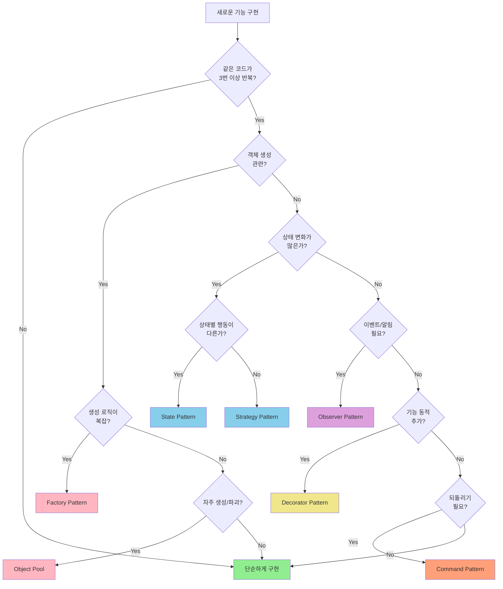
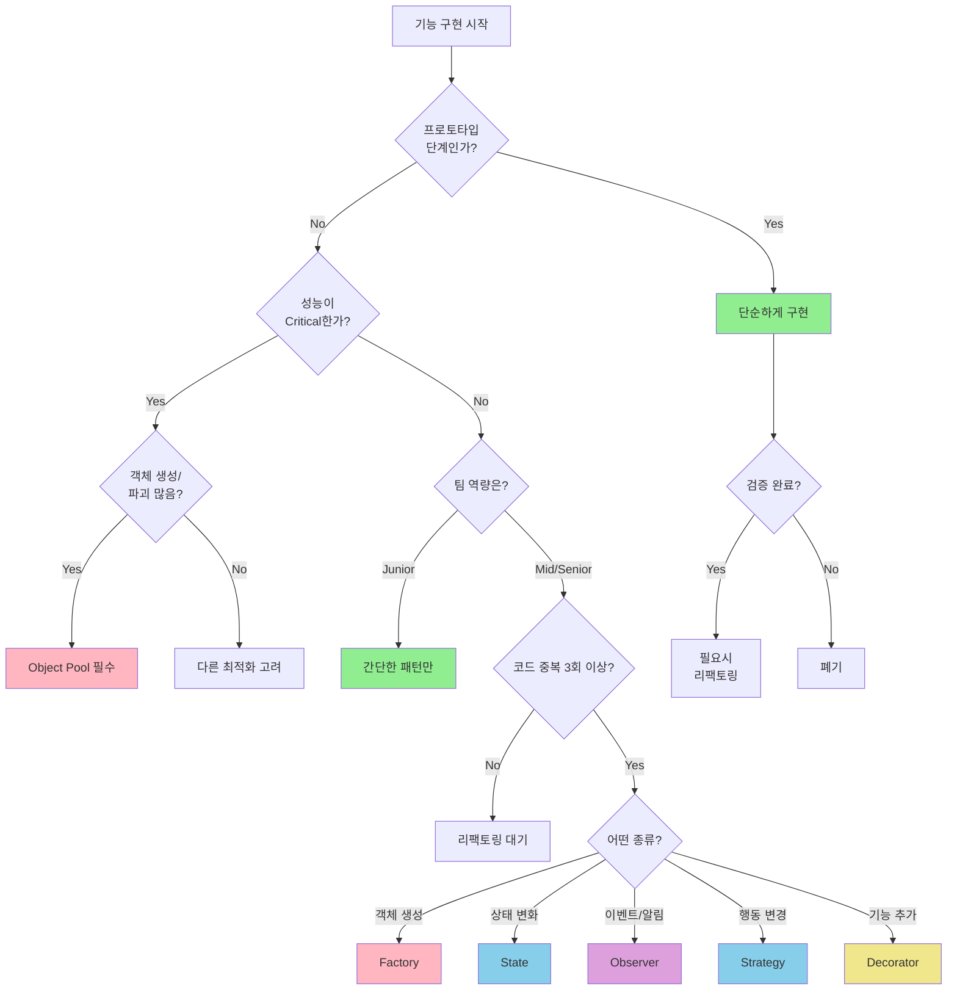

# 게임 개발자를 위한 C# 디자인 패턴: 실전 예제로 배우는 패턴의 힘  

저자: 최흥배, AI-Assisted   
    
권장 개발 환경
- **IDE**: Visual Studio 2022 이상 (Community 이상)
- **.NET**: 버전 9 이상
- **OS**: Windows 10 이상

-----  
  
# Chapter 17: 패턴 선택 가이드

## 게임 개발 현장에서...

"팀장님, 이 기능에 어떤 패턴을 써야 할까요?"

신입 개발자 이지민은 적 AI 시스템을 만들면서 고민에 빠졌다. Strategy 패턴도 좋아 보이고, State 패턴도 적절해 보이고, Command 패턴도 쓸 수 있을 것 같았다. 책에서 배운 패턴은 많은데, 실제로 어떤 상황에 어떤 패턴을 써야 할지 막막했다.

"좋은 질문이다. 패턴을 아는 것도 중요하지만, 언제 어떤 패턴을 써야 하는지 아는 것이 더 중요하지."

팀장은 노트북을 열어 프로젝트의 요구사항, 팀의 상황, 일정을 함께 살펴보며 말했다.

"패턴 선택은 단순히 '어떤 패턴이 멋있나'가 아니라, '우리 상황에 가장 적합한가'를 판단하는 거야."

실전에서는 코드의 품질, 개발 속도, 팀의 역량, 성능 요구사항 등 여러 요소를 종합적으로 고려해야 한다. 이번 챕터에서는 실무에서 패턴을 선택하는 실용적인 가이드를 제시한다.

---

## 패턴 선택 의사결정 트리



---

## 상황별 패턴 선택 가이드

### 상황 1: 성능이 최우선인 경우

**프로젝트 특성:**
- 모바일 게임
- 60 FPS 필수
- 메모리 제약이 심함
- 배터리 소모 최소화

```csharp
// 시나리오: 슈팅 게임의 총알 시스템

// ❌ 패턴 과다 사용 (성능 저하)
public interface IBullet
{
    void Initialize(IBulletConfig config);
    void Update(float deltaTime);
}

public class BulletFactory
{
    public IBullet CreateBullet(BulletType type)
    {
        // 매번 new 연산자로 생성
        return type switch
        {
            BulletType.Normal => new NormalBullet(),
            BulletType.Fast => new FastBullet(),
            _ => new NormalBullet()
        };
    }
}

public class BulletManager : MonoBehaviour
{
    private List<IBullet> _bullets = new List<IBullet>();
    
    void Update()
    {
        // 인터페이스 호출 오버헤드
        foreach (var bullet in _bullets)
        {
            bullet.Update(Time.deltaTime);
        }
    }
}

// 문제점:
// - 매 프레임 객체 생성/파괴 → GC 부하
// - 인터페이스 가상 호출 → 성능 저하
// - List 순회 오버헤드
```

```csharp
// ✅ 성능 최적화 버전

public class Bullet
{
    public Vector3 position;
    public Vector3 velocity;
    public float damage;
    public bool isActive;
    
    // 인라인 업데이트
    public void UpdatePosition(float deltaTime)
    {
        position += velocity * deltaTime;
    }
}

public class BulletSystem : MonoBehaviour
{
    // Object Pool - 배열 기반 (캐시 친화적)
    private Bullet[] _bulletPool = new Bullet[1000];
    private int _activeBulletCount = 0;
    
    void Awake()
    {
        // 미리 할당
        for (int i = 0; i < _bulletPool.Length; i++)
        {
            _bulletPool[i] = new Bullet();
        }
    }
    
    public Bullet GetBullet()
    {
        if (_activeBulletCount >= _bulletPool.Length)
            return null;
            
        var bullet = _bulletPool[_activeBulletCount++];
        bullet.isActive = true;
        return bullet;
    }
    
    void Update()
    {
        // 배열 직접 순회 (최적화)
        float deltaTime = Time.deltaTime;
        
        for (int i = 0; i < _activeBulletCount; i++)
        {
            ref Bullet bullet = ref _bulletPool[i];
            
            if (!bullet.isActive)
                continue;
                
            // 인라인 업데이트
            bullet.position += bullet.velocity * deltaTime;
            
            // 범위 체크
            if (bullet.position.sqrMagnitude > 10000f) // 100 * 100
            {
                bullet.isActive = false;
            }
        }
        
        // 비활성 총알 정리 (주기적으로)
        if (Time.frameCount % 60 == 0)
        {
            CompactArray();
        }
    }
    
    void CompactArray()
    {
        int writeIndex = 0;
        
        for (int readIndex = 0; readIndex < _activeBulletCount; readIndex++)
        {
            if (_bulletPool[readIndex].isActive)
            {
                if (writeIndex != readIndex)
                {
                    _bulletPool[writeIndex] = _bulletPool[readIndex];
                }
                writeIndex++;
            }
        }
        
        _activeBulletCount = writeIndex;
    }
}

// 성능 최적화 기법:
// ✓ Object Pool (배열 기반)
// ✓ 가상 함수 호출 제거
// ✓ 구조체/클래스 직접 사용
// ✓ ref 사용으로 복사 방지
// ✓ sqrMagnitude 사용 (Sqrt 연산 회피)
```

**성능 우선 시 패턴 선택 원칙:**

```
우선순위:
1. Object Pool Pattern (필수)
2. Data-Oriented Design
3. Component Pattern (Unity 기본)

피해야 할 것:
✗ 복잡한 상속 구조
✗ 과도한 인터페이스 사용
✗ 매 프레임 객체 생성
✗ LINQ 쿼리 (Update 내)
✗ 문자열 연산
```

---

### 상황 2: 유지보수가 최우선인 경우

**프로젝트 특성:**
- 장기 운영 게임 (3년 이상)
- 팀원 교체가 잦음
- 빈번한 기능 추가/수정
- 레거시 코드 많음

```csharp
// 시나리오: 캐릭터 스킬 시스템

// ❌ 유지보수 어려운 코드
public class Character : MonoBehaviour
{
    void UseSkill(int skillId)
    {
        if (skillId == 1)
        {
            // 스킬 1: 파이어볼
            if (mana >= 20)
            {
                mana -= 20;
                GameObject fireball = Instantiate(fireballPrefab);
                fireball.transform.position = transform.position;
                fireball.GetComponent<Rigidbody>().velocity = transform.forward * 10f;
                StartCoroutine(DealDamageAfterDelay(fireball, 30, 1.5f));
            }
        }
        else if (skillId == 2)
        {
            // 스킬 2: 아이스 스피어
            if (mana >= 25)
            {
                mana -= 25;
                GameObject icespear = Instantiate(icespearPrefab);
                icespear.transform.position = transform.position;
                icespear.GetComponent<Rigidbody>().velocity = transform.forward * 15f;
                StartCoroutine(DealDamageAfterDelay(icespear, 40, 1.0f));
                StartCoroutine(ApplySlowEffect(2.0f));
            }
        }
        else if (skillId == 3)
        {
            // 스킬 3: 라이트닝
            // ... 100줄의 코드
        }
        // ... 스킬 50개
        
        // 새 스킬 추가할 때마다 이 함수 수정
        // 버그 발생 위험 ↑
        // 코드 이해 어려움 ↑
    }
}
```

```csharp
// ✅ 유지보수 용이한 패턴 적용

// 1. Command Pattern으로 스킬 캡슐화
public interface ISkill
{
    string Name { get; }
    int ManaCost { get; }
    float Cooldown { get; }
    bool CanUse(Character caster);
    void Execute(Character caster);
}

// 2. 스킬별 독립적인 클래스
public class FireballSkill : ISkill
{
    public string Name => "Fireball";
    public int ManaCost => 20;
    public float Cooldown => 2f;
    
    private GameObject _prefab;
    private int _damage = 30;
    
    public FireballSkill(GameObject prefab)
    {
        _prefab = prefab;
    }
    
    public bool CanUse(Character caster)
    {
        return caster.CurrentMana >= ManaCost;
    }
    
    public void Execute(Character caster)
    {
        // 명확한 책임 분리
        caster.ConsumeMana(ManaCost);
        
        var fireball = Object.Instantiate(_prefab);
        fireball.transform.position = caster.transform.position;
        
        var projectile = fireball.GetComponent<Projectile>();
        projectile.Initialize(caster.transform.forward * 10f, _damage);
    }
}

public class IceSpearSkill : ISkill
{
    public string Name => "Ice Spear";
    public int ManaCost => 25;
    public float Cooldown => 2.5f;
    
    private GameObject _prefab;
    private int _damage = 40;
    private float _slowDuration = 2f;
    
    public IceSpearSkill(GameObject prefab)
    {
        _prefab = prefab;
    }
    
    public bool CanUse(Character caster)
    {
        return caster.CurrentMana >= ManaCost;
    }
    
    public void Execute(Character caster)
    {
        caster.ConsumeMana(ManaCost);
        
        var icespear = Object.Instantiate(_prefab);
        icespear.transform.position = caster.transform.position;
        
        var projectile = icespear.GetComponent<Projectile>();
        projectile.Initialize(caster.transform.forward * 15f, _damage);
        projectile.OnHit += (target) => ApplySlow(target, _slowDuration);
    }
    
    private void ApplySlow(GameObject target, float duration)
    {
        if (target.TryGetComponent<Character>(out var character))
        {
            character.ApplyStatusEffect(new SlowEffect(duration, 0.5f));
        }
    }
}

// 3. Factory로 스킬 생성 관리
public class SkillFactory
{
    private Dictionary<string, Func<ISkill>> _skillCreators;
    
    public SkillFactory(SkillDatabase database)
    {
        _skillCreators = new Dictionary<string, Func<ISkill>>
        {
            ["Fireball"] = () => new FireballSkill(database.GetPrefab("Fireball")),
            ["IceSpear"] = () => new IceSpearSkill(database.GetPrefab("IceSpear")),
            // 새 스킬은 여기만 추가
        };
    }
    
    public ISkill CreateSkill(string skillName)
    {
        if (_skillCreators.TryGetValue(skillName, out var creator))
        {
            return creator();
        }
        
        Debug.LogError($"Unknown skill: {skillName}");
        return null;
    }
}

// 4. 사용하는 쪽 코드
public class Character : MonoBehaviour
{
    private List<ISkill> _learnedSkills = new List<ISkill>();
    private Dictionary<ISkill, float> _skillCooldowns = new Dictionary<ISkill, float>();
    
    public void UseSkill(int skillIndex)
    {
        if (skillIndex < 0 || skillIndex >= _learnedSkills.Count)
            return;
            
        var skill = _learnedSkills[skillIndex];
        
        // 쿨다운 체크
        if (_skillCooldowns.TryGetValue(skill, out float cooldown))
        {
            if (Time.time < cooldown)
                return;
        }
        
        // 사용 가능 체크
        if (!skill.CanUse(this))
            return;
            
        // 실행
        skill.Execute(this);
        
        // 쿨다운 설정
        _skillCooldowns[skill] = Time.time + skill.Cooldown;
    }
    
    // 새 스킬 추가는 데이터로
    public void LearnSkill(string skillName)
    {
        var skill = _skillFactory.CreateSkill(skillName);
        if (skill != null)
        {
            _learnedSkills.Add(skill);
        }
    }
}
```

**개선 효과:**

```
Before:
├─ 1개 파일, 500줄
├─ 스킬 추가 시 기존 코드 수정
├─ 버그 발생 위험 높음
└─ 코드 이해 어려움

After:
├─ 스킬별 독립 파일, 각 50줄
├─ 스킬 추가 시 새 파일만 추가
├─ 버그 격리 (다른 스킬에 영향 없음)
└─ 명확한 책임 분리
```

**유지보수 우선 시 패턴 선택:**

```
핵심 패턴:
✓ Command Pattern (기능 캡슐화)
✓ Factory Pattern (생성 로직 분리)
✓ Strategy Pattern (알고리즘 교체)
✓ Observer Pattern (느슨한 결합)

원칙:
• 단일 책임 원칙 (SRP)
• 개방-폐쇄 원칙 (OCP)
• 의존성 역전 원칙 (DIP)
```

---

### 상황 3: 빠른 프로토타이핑이 필요한 경우

**프로젝트 특성:**
- 게임 잼 (48시간)
- MVP 개발 (2주)
- 컨셉 검증
- 투자 유치용 데모

```csharp
// 시나리오: 간단한 타워 디펜스 프로토타입

// ❌ 과도한 설계 (시간 낭비)
public interface IEnemy
{
    void Initialize(IEnemyConfig config);
    void Update(float deltaTime);
    void TakeDamage(IDamageInfo damage);
}

public interface IEnemyConfig
{
    float Health { get; }
    float Speed { get; }
    int Reward { get; }
}

public abstract class EnemyFactory
{
    public abstract IEnemy CreateEnemy();
}

public class EnemyBuilder
{
    private float _health;
    private float _speed;
    // ... 복잡한 빌더 패턴
}

// 3일 동안 설계만 하다가 게임 잼 종료...
```

```csharp
// ✅ 프로토타입 우선 접근

// 1. 최소한의 코드로 작동하게
public class Enemy : MonoBehaviour
{
    public float health = 100f;
    public float speed = 5f;
    public int reward = 10;
    
    void Update()
    {
        transform.position += Vector3.right * speed * Time.deltaTime;
    }
    
    public void TakeDamage(float damage)
    {
        health -= damage;
        if (health <= 0)
        {
            GameManager.Instance.AddGold(reward);
            Destroy(gameObject);
        }
    }
}

// 2. Inspector로 다양한 적 만들기 (패턴 없이)
// - EnemyFast: health=50, speed=10, reward=5
// - EnemySlow: health=200, speed=2, reward=20
// - EnemyBoss: health=1000, speed=3, reward=100

// 3. 간단한 타워
public class Tower : MonoBehaviour
{
    public float damage = 10f;
    public float fireRate = 1f;
    public float range = 5f;
    
    private float _nextFireTime;
    
    void Update()
    {
        if (Time.time < _nextFireTime)
            return;
            
        // 가장 가까운 적 찾기
        var enemies = FindObjectsOfType<Enemy>();
        Enemy target = null;
        float minDist = range;
        
        foreach (var enemy in enemies)
        {
            float dist = Vector3.Distance(transform.position, enemy.transform.position);
            if (dist < minDist)
            {
                minDist = dist;
                target = enemy;
            }
        }
        
        // 공격
        if (target != null)
        {
            target.TakeDamage(damage);
            _nextFireTime = Time.time + fireRate;
        }
    }
}

// 4. 간단한 스포너
public class EnemySpawner : MonoBehaviour
{
    public GameObject[] enemyPrefabs;
    public float spawnInterval = 2f;
    
    void Start()
    {
        InvokeRepeating(nameof(SpawnEnemy), 1f, spawnInterval);
    }
    
    void SpawnEnemy()
    {
        int index = Random.Range(0, enemyPrefabs.Length);
        Instantiate(enemyPrefabs[index], transform.position, Quaternion.identity);
    }
}

// 총 코드: 100줄 미만
// 작동하는 프로토타입: 2시간 내 완성
```

**프로토타입 후 리팩토링 판단:**

```csharp
// 컨셉이 검증되면 그때 리팩토링

// 문제가 발견된 경우만 패턴 적용:

// 문제 1: 적이 너무 많아서 FindObjectsOfType이 느림
// → Object Pool 적용

// 문제 2: 타워 종류가 10개 넘어가면서 코드 중복
// → Strategy 패턴으로 공격 로직 분리

// 문제 3: UI 업데이트가 복잡해짐
// → Observer 패턴으로 이벤트 처리

// 컨셉이 폐기되면?
// → 리팩토링 시간 낭비 방지!
```

**빠른 프로토타입 시 원칙:**

```
우선순위:
1. 작동하는 코드 (Ugly but Working)
2. 반복 테스트 (Iterate Fast)
3. 필요시 리팩토링 (Refactor When Needed)

피해야 할 것:
✗ 미래를 위한 설계
✗ 완벽한 아키텍처
✗ 과도한 추상화
✗ 불필요한 최적화

좋은 습관:
✓ Unity Prefab 적극 활용
✓ ScriptableObject로 데이터 관리
✓ 주석으로 개선점 메모
✓ TODO 마커 사용
```

---

## 팀 역량에 따른 패턴 선택

### 초보 팀 (주니어 위주)

```csharp
// 추천: 단순하고 명확한 패턴

// ✓ Singleton (Unity 기본)
public class GameManager : MonoBehaviour
{
    public static GameManager Instance { get; private set; }
    
    void Awake()
    {
        Instance = this;
    }
}

// ✓ Object Pool (성능 필수)
public class SimpleObjectPool : MonoBehaviour
{
    public GameObject prefab;
    private Queue<GameObject> pool = new Queue<GameObject>();
    
    public GameObject Get()
    {
        if (pool.Count > 0)
        {
            var obj = pool.Dequeue();
            obj.SetActive(true);
            return obj;
        }
        return Instantiate(prefab);
    }
    
    public void Return(GameObject obj)
    {
        obj.SetActive(false);
        pool.Enqueue(obj);
    }
}

// ✓ Observer (Unity Event 사용)
using UnityEngine.Events;

public class Player : MonoBehaviour
{
    public UnityEvent<int> OnHealthChanged;
    
    public void TakeDamage(int damage)
    {
        health -= damage;
        OnHealthChanged?.Invoke(health);
    }
}

// 피해야 할 것:
// ✗ Abstract Factory
// ✗ Builder Pattern
// ✗ Chain of Responsibility
// ✗ 복잡한 상속 구조
```

### 중급 팀 (시니어 1-2명)

```csharp
// 추천: 실용적인 패턴 조합

// ✓ State Pattern (명확한 상태 관리)
public class CharacterStateMachine
{
    private IState _currentState;
    
    public void ChangeState(IState newState)
    {
        _currentState?.Exit();
        _currentState = newState;
        _currentState?.Enter();
    }
    
    public void Update()
    {
        _currentState?.Update();
    }
}

// ✓ Strategy Pattern (AI 행동)
public interface IAIBehavior
{
    void Execute(Enemy enemy);
}

public class AggressiveBehavior : IAIBehavior
{
    public void Execute(Enemy enemy)
    {
        // 적극적으로 추적
    }
}

// ✓ Command Pattern (입력/스킬)
public interface ICommand
{
    void Execute();
    void Undo();
}

// ✓ Factory + Pool 조합
public class EnemyFactory
{
    private Dictionary<EnemyType, ObjectPool<Enemy>> _pools;
    
    public Enemy GetEnemy(EnemyType type)
    {
        return _pools[type].Get();
    }
}
```

### 고급 팀 (시니어 위주)

```csharp
// 추천: 복잡한 패턴도 적용 가능

// ✓ Service Locator + Dependency Injection
public class ServiceLocator
{
    private Dictionary<Type, object> _services = new Dictionary<Type, object>();
    
    public void Register<T>(T service)
    {
        _services[typeof(T)] = service;
    }
    
    public T Get<T>()
    {
        return (T)_services[typeof(T)];
    }
}

// ✓ MVC/MVP 패턴
public class InventoryPresenter
{
    private InventoryModel _model;
    private InventoryView _view;
    
    public InventoryPresenter(InventoryModel model, InventoryView view)
    {
        _model = model;
        _view = view;
        
        _model.OnItemsChanged += UpdateView;
    }
    
    private void UpdateView()
    {
        _view.DisplayItems(_model.Items);
    }
}

// ✓ Decorator Pattern (동적 기능 추가)
public class WeaponDecorator : IWeapon
{
    protected IWeapon _weapon;
    
    public WeaponDecorator(IWeapon weapon)
    {
        _weapon = weapon;
    }
    
    public virtual void Attack()
    {
        _weapon.Attack();
    }
}

public class FireEnchantment : WeaponDecorator
{
    public FireEnchantment(IWeapon weapon) : base(weapon) { }
    
    public override void Attack()
    {
        base.Attack();
        // 추가 화염 효과
    }
}
```

---

## 프로젝트 규모별 패턴 전략

### 소규모 프로젝트 (1-2명, 1-3개월)

```
필수 패턴:
✓ Singleton (GameManager)
✓ Object Pool (성능)

선택 패턴:
• Observer (이벤트가 많으면)
• State (FSM이 필요하면)

피할 것:
✗ 과도한 추상화
✗ 복잡한 팩토리
```

### 중규모 프로젝트 (3-5명, 6개월-1년)

```
핵심 패턴:
✓ Singleton
✓ Object Pool
✓ Observer (이벤트 시스템)
✓ State (캐릭터/AI)
✓ Command (입력/스킬)

보조 패턴:
• Factory (객체 생성)
• Strategy (AI 행동)
• Component (기능 분리)
```

### 대규모 프로젝트 (10명 이상, 1년 이상)

```
필수 아키텍처:
✓ Singleton
✓ Object Pool
✓ Observer/Event System
✓ State Machine
✓ Command System
✓ Factory + Abstract Factory
✓ Service Locator
✓ MVC/MVP (UI)

추가 고려:
• Decorator (아이템)
• Adapter (외부 SDK)
• Component (모듈화)
• Update Method (최적화)
```

---

## 실전 의사결정 플로우차트



---

## Before/After 비교 - 실전 사례

### 사례 1: 중규모 RPG 프로젝트

```csharp
// Before: 패턴 없이 시작
public class Player : MonoBehaviour
{
    public int health = 100;
    public List<Item> inventory = new List<Item>();
    
    void Update()
    {
        // 이동
        if (Input.GetKey(KeyCode.W))
        {
            transform.position += Vector3.forward * 5f * Time.deltaTime;
        }
        
        // 공격
        if (Input.GetKeyDown(KeyCode.Space))
        {
            GameObject bullet = Instantiate(bulletPrefab);
            bullet.transform.position = transform.position;
        }
        
        // UI 업데이트
        healthText.text = $"HP: {health}";
        goldText.text = $"Gold: {gold}";
    }
    
    public void TakeDamage(int damage)
    {
        health -= damage;
        healthText.text = $"HP: {health}";  // UI와 강결합
        
        if (health <= 0)
        {
            // 죽음 처리
            Destroy(gameObject);
        }
    }
}

// 문제점 발견:
// - Update에서 매 프레임 객체 생성 → 성능 문제
// - UI와 로직 결합 → 유지보수 어려움
// - 모든 기능이 한 클래스에 → 복잡도 증가
```

```csharp
// After: 단계적 패턴 적용

// 1단계: Object Pool 적용 (성능 문제 해결)
public class BulletPool : MonoBehaviour
{
    private Queue<GameObject> _pool = new Queue<GameObject>();
    public GameObject prefab;
    
    public GameObject Get()
    {
        if (_pool.Count > 0)
        {
            var bullet = _pool.Dequeue();
            bullet.SetActive(true);
            return bullet;
        }
        return Instantiate(prefab);
    }
    
    public void Return(GameObject bullet)
    {
        bullet.SetActive(false);
        _pool.Enqueue(bullet);
    }
}

// 2단계: Observer 패턴 (UI 분리)
public class Player : MonoBehaviour
{
    private int _health = 100;
    public int Health
    {
        get => _health;
        private set
        {
            _health = value;
            OnHealthChanged?.Invoke(_health);  // UI는 이벤트로
        }
    }
    
    public event Action<int> OnHealthChanged;
    public event Action OnDeath;
    
    public void TakeDamage(int damage)
    {
        Health -= damage;
        
        if (Health <= 0)
        {
            OnDeath?.Invoke();
        }
    }
}

public class PlayerUI : MonoBehaviour
{
    [SerializeField] private Text healthText;
    [SerializeField] private Player player;
    
    void OnEnable()
    {
        player.OnHealthChanged += UpdateHealth;
    }
    
    void OnDisable()
    {
        player.OnHealthChanged -= UpdateHealth;
    }
    
    void UpdateHealth(int health)
    {
        healthText.text = $"HP: {health}";
    }
}

// 3단계: Command 패턴 (입력 분리)
public class ShootCommand : ICommand
{
    private Player _player;
    private BulletPool _bulletPool;
    
    public ShootCommand(Player player, BulletPool pool)
    {
        _player = player;
        _bulletPool = pool;
    }
    
    public void Execute()
    {
        var bullet = _bulletPool.Get();
        bullet.transform.position = _player.transform.position;
    }
}

public class InputHandler : MonoBehaviour
{
    private Dictionary<KeyCode, ICommand> _keyBindings;
    
    void Awake()
    {
        _keyBindings = new Dictionary<KeyCode, ICommand>
        {
            [KeyCode.Space] = new ShootCommand(player, bulletPool)
        };
    }
    
    void Update()
    {
        foreach (var binding in _keyBindings)
        {
            if (Input.GetKeyDown(binding.Key))
            {
                binding.Value.Execute();
            }
        }
    }
}

// 4단계: Component 패턴 (기능 분리)
public class PlayerMovement : MonoBehaviour
{
    public float speed = 5f;
    
    void Update()
    {
        float horizontal = Input.GetAxis("Horizontal");
        float vertical = Input.GetAxis("Vertical");
        
        Vector3 movement = new Vector3(horizontal, 0, vertical);
        transform.position += movement * speed * Time.deltaTime;
    }
}

public class PlayerHealth : MonoBehaviour
{
    // Health 관련 기능만
}

public class PlayerInventory : MonoBehaviour
{
    // Inventory 관련 기능만
}
```

**개선 결과:**

```
성능:
- FPS: 30 → 60 (Object Pool 적용)
- GC: 30MB/s → 5MB/s

유지보수성:
- 클래스 크기: 500줄 → 각 100줄
- 버그 수정 시간: 1일 → 2시간
- 신규 기능 추가: 3일 → 1일

팀 협업:
- 충돌 빈도: 주 5회 → 주 1회
- 코드 리뷰 시간: 2시간 → 30분
```

---

## 실전 팁

### 팁 1: 단계적 도입 전략

```
Week 1-2: 프로토타입
├─ 패턴 없이 빠르게 구현
├─ 핵심 게임플레이 검증
└─ 성능 병목 지점 파악

Week 3-4: 1차 리팩토링
├─ Object Pool (성능 필수)
├─ Observer (UI 분리)
└─ 기본 Component 분리

Week 5-8: 2차 리팩토링
├─ State (복잡한 FSM만)
├─ Command (입력 시스템)
└─ Factory (타입 많아지면)

Week 9+: 고급 패턴
├─ Strategy (AI 다양해지면)
├─ Decorator (아이템 조합)
└─ Service Locator (서비스 증가)
```

### 팁 2: 패턴 도입 체크리스트

```markdown
□ 문제가 명확히 정의되었는가?
□ 같은 코드가 3번 이상 반복되는가?
□ 팀원들이 이 패턴을 이해하는가?
□ 테스트 코드를 작성할 수 있는가?
□ 성능 영향을 측정했는가?
□ 더 간단한 방법은 정말 없는가?

3개 이상 체크 → 도입 고려
5개 이상 체크 → 도입 권장
```

### 팁 3: 프로파일링 기반 결정

```csharp
// 먼저 측정하고, 그 다음 최적화

// 1. 성능 측정
using System.Diagnostics;

Stopwatch sw = Stopwatch.StartNew();

// 현재 코드
for (int i = 0; i < 1000; i++)
{
    var enemy = Instantiate(enemyPrefab);
}

sw.Stop();
Debug.Log($"Without Pool: {sw.ElapsedMilliseconds}ms");

sw.Restart();

// Object Pool 적용
for (int i = 0; i < 1000; i++)
{
    var enemy = enemyPool.Get();
}

sw.Stop();
Debug.Log($"With Pool: {sw.ElapsedMilliseconds}ms");

// 결과를 보고 결정
// Without Pool: 150ms
// With Pool: 10ms
// → Object Pool 적용 결정!
```

### 팁 4: 문서화와 팀 공유

```csharp
// 패턴 사용 이유를 주석으로 남기기

/// <summary>
/// Object Pool 패턴 사용
/// 이유: 총알이 초당 100개 이상 생성되어 GC 부하 발생
/// 측정: Pool 적용 전 30fps → 적용 후 60fps
/// 작성자: 김개발 (2025-12-15)
/// </summary>
public class BulletPool : MonoBehaviour
{
    // ...
}

// 팀 위키에 패턴 가이드 작성
/*
# 우리 프로젝트 패턴 가이드

## 필수 패턴
1. Object Pool - 총알, 이펙트 등 빈번한 생성/파괴
2. Observer - UI 업데이트, 이벤트 시스템

## 권장 패턴
1. State - 캐릭터 FSM (3개 이상 상태)
2. Command - 스킬 시스템

## 사용 금지
1. Abstract Factory - 너무 복잡함
2. Prototype - C#에서 Clone이 위험함
*/
```

---

## 연습 문제

### 문제 1: 패턴 선택하기

다음 상황에 적합한 패턴을 선택하고 이유를 설명하라:

**상황:**
```
게임: 모바일 슈팅 게임
플랫폼: Android/iOS
개발 기간: 2개월
팀: 3명 (주니어 2, 시니어 1)

요구사항:
- 총알이 초당 50개 이상 발사됨
- 3가지 타입의 적 (일반, 빠른, 보스)
- 플레이어 HP 변경 시 UI 업데이트
- 난이도별로 적 AI 행동 변경
```

**해답:**

```csharp
// 1. Object Pool (필수) - 성능
public class BulletPool : MonoBehaviour
{
    // 이유: 초당 50개 생성 → GC 부하 높음
    // 우선순위: 최고
}

// 2. Simple Factory (권장) - 적 생성
public class EnemySpawner : MonoBehaviour
{
    public Enemy SpawnEnemy(EnemyType type)
    {
        // 이유: 3가지 타입만 → 단순 Factory로 충분
        // Abstract Factory는 과도함
    }
}

// 3. Observer (권장) - UI 업데이트
public class Player : MonoBehaviour
{
    public event Action<int> OnHealthChanged;
    
    // 이유: UI와 로직 분리 필요
    // Unity Event 사용하면 주니어도 이해 쉬움
}

// 4. Strategy (선택) - AI 난이도
public interface IAIStrategy
{
    void Execute(Enemy enemy);
}

// 이유: 난이도별 행동 교체 필요
// 주니어도 이해 가능한 패턴

// 피할 패턴:
// ✗ State Machine - 적 AI가 간단하면 불필요
// ✗ Command - 입력이 단순하면 불필요
// ✗ Decorator - 아이템 강화 없음
```

### 문제 2: 리팩토링 우선순위

다음 코드의 문제점을 찾고, 리팩토링 우선순위를 정하라:

```csharp
public class GameController : MonoBehaviour
{
    void Update()
    {
        // 문제 1: 매 프레임 Find
        GameObject player = GameObject.Find("Player");
        
        // 문제 2: 매 프레임 객체 생성
        if (Input.GetButton("Fire"))
        {
            GameObject bullet = Instantiate(bulletPrefab);
        }
        
        // 문제 3: UI 강결합
        Text scoreText = GameObject.Find("ScoreText").GetComponent<Text>();
        scoreText.text = $"Score: {score}";
        
        // 문제 4: 복잡한 if-else
        if (enemyType == "Normal")
        {
            // 100줄
        }
        else if (enemyType == "Fast")
        {
            // 100줄
        }
        // ... 10가지 타입
    }
}
```

**해답:**

```csharp
// 우선순위 1: 성능 Critical (즉시 수정)

// 문제 2 해결 - Object Pool
private BulletPool bulletPool;

void Awake()
{
    bulletPool = GetComponent<BulletPool>();
}

void Update()
{
    if (Input.GetButton("Fire"))
    {
        var bullet = bulletPool.Get();  // Instantiate 제거
    }
}

// 문제 1 해결 - 캐싱
private GameObject player;

void Awake()
{
    player = GameObject.Find("Player");  // 한 번만
}

// 우선순위 2: 유지보수성 (다음 스프린트)

// 문제 3 해결 - Observer
public class ScoreManager : MonoBehaviour
{
    public static event Action<int> OnScoreChanged;
    
    public static void AddScore(int points)
    {
        score += points;
        OnScoreChanged?.Invoke(score);
    }
}

public class ScoreUI : MonoBehaviour
{
    [SerializeField] private Text scoreText;
    
    void OnEnable()
    {
        ScoreManager.OnScoreChanged += UpdateScore;
    }
    
    void UpdateScore(int score)
    {
        scoreText.text = $"Score: {score}";
    }
}

// 우선순위 3: 확장성 (여유 있을 때)

// 문제 4 해결 - Strategy
public interface IEnemyBehavior
{
    void Execute(Enemy enemy);
}

private Dictionary<string, IEnemyBehavior> behaviors;

void Awake()
{
    behaviors = new Dictionary<string, IEnemyBehavior>
    {
        ["Normal"] = new NormalBehavior(),
        ["Fast"] = new FastBehavior(),
        // ...
    };
}

void Update()
{
    behaviors[enemyType].Execute(enemy);  // if-else 제거
}
```

### 문제 3: 프로젝트 시작 전 계획

새 프로젝트를 시작한다. 다음 정보를 바탕으로 패턴 적용 계획을 세워라:

```
프로젝트: 2D 플랫포머
기간: 4개월
팀: 5명 (시니어 2, 미드 2, 주니어 1)
플랫폼: PC (Steam)
목표: 상용 출시

주요 기능:
- 플레이어 캐릭터 (3가지 상태: Idle, Run, Jump)
- 적 AI (5종류)
- 아이템 시스템 (10종류)
- 세이브/로드
- 업적 시스템
```

**해답:**

```markdown
# 패턴 적용 로드맵

## Phase 1: 프로토타입 (Week 1-2)
목표: 핵심 게임플레이 검증

패턴:
- 없음 (빠른 프로토타입 우선)
- Unity Prefab으로 다양성 확보

결과물:
- 플레이어 이동/점프
- 적 1종류
- 간단한 충돌 처리

## Phase 2: 기반 구축 (Week 3-6)
목표: 안정적인 기반 마련

필수 패턴:
✓ Singleton - GameManager, SaveManager
✓ Observer - 이벤트 시스템 (업적, UI)
✓ Component - 플레이어 기능 분리

선택 패턴:
• State - 플레이어 FSM (3개 상태)
• Factory - 아이템 생성 (10종류)

코드:
```csharp
// GameManager (Singleton)
public class GameManager : MonoBehaviour
{
    public static GameManager Instance { get; private set; }
}

// 이벤트 시스템 (Observer)
public static class GameEvents
{
    public static event Action<int> OnCoinCollected;
    public static event Action<string> OnAchievementUnlocked;
}

// 플레이어 (Component)
public class Player : MonoBehaviour
{
    private PlayerMovement movement;
    private PlayerHealth health;
    private PlayerInput input;
}

// 플레이어 상태 (State)
public interface IPlayerState
{
    void Enter();
    void Update();
    void Exit();
}
```

## Phase 3: 기능 확장 (Week 7-12)
목표: 모든 기능 구현

추가 패턴:
✓ Strategy - 적 AI 행동 (5종류)
✓ Command - 입력 시스템, 스킬
✓ Object Pool - 이펙트, 투사체

코드:
```csharp
// AI 행동 (Strategy)
public interface IAIBehavior
{
    void Execute(Enemy enemy, Player target);
}

public class PatrolBehavior : IAIBehavior { }
public class ChaseBehavior : IAIBehavior { }
public class AttackBehavior : IAIBehavior { }

// 스킬 시스템 (Command)
public interface ICommand
{
    void Execute();
    void Undo();
}

public class DashCommand : ICommand { }
public class AttackCommand : ICommand { }
```

## Phase 4: 최적화 (Week 13-16)
목표: 성능 개선 및 안정화

최적화 패턴:
✓ Object Pool - GC 최소화
✓ Update Method - 업데이트 순서 최적화
✓ Flyweight - 아이템 데이터 공유

성능 목표:
- 60 FPS 유지
- 로딩 시간 3초 이내
- 메모리 사용량 500MB 이내

## 피할 패턴
✗ Abstract Factory - 너무 복잡
✗ Builder - 생성 로직 단순함
✗ Prototype - C# Clone 위험
✗ Flyweight - 아이템 10개는 적음

## 팀 역할 분담
- 시니어 1: 아키텍처, 복잡한 패턴
- 시니어 2: AI 시스템, State/Strategy
- 미드 1: UI 시스템, Observer
- 미드 2: 플레이어 시스템, Component
- 주니어: 간단한 기능, 버그 수정

## 리스크 관리
- 매주 코드 리뷰로 패턴 오남용 방지
- 성능 프로파일링 2주마다
- 리팩토링 시간 20% 할당
```

---

## 마무리 의사결정 가이드

```
┌─────────────────────────────────────────┐
│         패턴 선택 황금률                │
├─────────────────────────────────────────┤
│                                         │
│  1. 문제가 먼저, 패턴은 나중에          │
│  2. 간단한 것부터, 복잡한 것은 필요시   │
│  3. 측정 후 최적화, 추측하지 말 것      │
│  4. 팀이 이해할 수 있는 패턴만          │
│  5. 유지보수 > 코드 미학                │
│                                         │
└─────────────────────────────────────────┘

상황별 우선순위:

[성능 Critical]
1. Object Pool ★★★★★
2. 구조 최적화 ★★★★☆
3. 패턴 단순화 ★★★☆☆

[유지보수 Critical]
1. Observer ★★★★★
2. Command ★★★★☆
3. Strategy ★★★★☆
4. State ★★★☆☆

[빠른 개발]
1. Unity Prefab ★★★★★
2. ScriptableObject ★★★★☆
3. 단순 구현 ★★★★☆
4. 나중에 리팩토링 ★★★☆☆
```

**최종 체크리스트:**

```
패턴 적용 전:
□ 이 문제를 패턴 없이 해결할 수 없는가?
□ 팀원 모두가 이 패턴을 이해하는가?
□ 성능 영향을 측정했는가?
□ 테스트 가능한가?
□ 유지보수가 쉬워지는가?

모두 Yes → 적용
하나라도 No → 재고
```

올바른 패턴 선택은 코드를 더 좋게 만들지만, 잘못된 패턴 선택은 코드를 더 나쁘게 만든다. **항상 상황에 맞는 판단**이 가장 중요하다.
  
  
# Appendix A: 패턴 빠른 참조

이 부록은 책에서 다룬 모든 디자인 패턴을 한눈에 찾아볼 수 있도록 정리한 빠른 참조 가이드다. 실무에서 "지금 이 상황에 어떤 패턴을 써야 하지?"라는 질문이 생겼을 때 이 부록을 펼쳐보면 된다.

---

## 1. Singleton Pattern (싱글톤 패턴)

### UML 다이어그램

```
┌─────────────────────────┐
│   GameManager           │
├─────────────────────────┤
│ - static instance       │
│ - GameManager()         │
├─────────────────────────┤
│ + static Instance       │
│ + Initialize()          │
│ + GetScore()            │
└─────────────────────────┘
```

### 핵심 코드 스니펫

```csharp
public class GameManager
{
    private static GameManager instance;
    
    public static GameManager Instance
    {
        get
        {
            if (instance == null)
            {
                instance = new GameManager();
            }
            return instance;
        }
    }
    
    private GameManager() { } // private 생성자
}
```

### 사용 시기 체크리스트

- ☐ 게임 전체에서 단 하나만 존재해야 하는가?
- ☐ 전역적으로 접근이 필요한가?
- ☐ 게임 매니저, 사운드 매니저, 입력 매니저 같은 시스템인가?
- ☐ 여러 개 생성되면 문제가 발생하는가?

### 주의사항
- Unity에서는 DontDestroyOnLoad 사용 고려
- Thread-safe 구현 필요 시 lock 사용
- 테스트가 어려워질 수 있으므로 남용 금지

---

## 2. Factory Pattern (팩토리 패턴)

### UML 다이어그램

```
┌──────────────────┐
│  MonsterFactory  │
├──────────────────┤
│ + CreateMonster()│
└────────┬─────────┘
         │ creates
         ▼
    ┌─────────┐
    │ Monster │◄────┬────────┬────────┐
    └─────────┘     │        │        │
         △          │        │        │
         │          │        │        │
    ┌────┴────┬─────┴───┬────┴────┐
    │ Goblin  │  Orc    │ Dragon  │
    └─────────┴─────────┴─────────┘
```

### 핵심 코드 스니펫

```csharp
public class MonsterFactory
{
    public Monster CreateMonster(MonsterType type)
    {
        switch (type)
        {
            case MonsterType.Goblin:
                return new Goblin();
            case MonsterType.Orc:
                return new Orc();
            case MonsterType.Dragon:
                return new Dragon();
            default:
                throw new ArgumentException("Unknown monster type");
        }
    }
}
```

### 사용 시기 체크리스트

- ☐ 비슷한 객체를 여러 종류 생성해야 하는가?
- ☐ 객체 생성 로직이 복잡한가?
- ☐ 생성할 객체 타입을 런타임에 결정하는가?
- ☐ 몬스터, 아이템, UI 요소 등을 동적으로 생성하는가?

### 언제 사용하는가
- 적 스포너 시스템
- 아이템 드롭 시스템
- UI 팝업 생성
- 레벨에 따른 몬스터 생성

---

## 3. Object Pool Pattern (오브젝트 풀 패턴)

### UML 다이어그램

```
┌────────────────────────┐
│    ObjectPool<T>       │
├────────────────────────┤
│ - availableObjects     │
│ - activeObjects        │
├────────────────────────┤
│ + Get() : T            │
│ + Return(T obj)        │
│ + Prewarm(int count)   │
└────────────────────────┘
         │
         │ manages
         ▼
    ┌─────────┐
    │  Bullet │
    └─────────┘
```

### 핵심 코드 스니펫

```csharp
public class ObjectPool<T> where T : new()
{
    private Queue<T> availableObjects = new Queue<T>();
    
    public T Get()
    {
        if (availableObjects.Count > 0)
        {
            return availableObjects.Dequeue();
        }
        return new T();
    }
    
    public void Return(T obj)
    {
        availableObjects.Enqueue(obj);
    }
    
    public void Prewarm(int count)
    {
        for (int i = 0; i < count; i++)
        {
            availableObjects.Enqueue(new T());
        }
    }
}
```

### 사용 시기 체크리스트

- ☐ 객체를 자주 생성하고 파괴하는가?
- ☐ 객체 생성 비용이 높은가?
- ☐ GC 압박을 줄이고 싶은가?
- ☐ 총알, 파티클, 이펙트를 다루는가?

### 성능 개선 효과
- GC 호출 빈도 90% 이상 감소
- 프레임 드롭 현상 제거
- 메모리 할당 최적화

---

## 4. Component Pattern (컴포넌트 패턴)

### UML 다이어그램

```
┌──────────────────┐
│   GameObject     │
├──────────────────┤
│ - components[]   │
├──────────────────┤
│ + AddComponent() │
│ + GetComponent() │
│ + Update()       │
└────────┬─────────┘
         │ contains
         ▼
    ┌─────────────┐
    │  Component  │
    └──────┬──────┘
           │
    ┌──────┴─────────┬─────────────┐
    │                │             │
┌───▼────┐    ┌──────▼──┐   ┌─────▼────┐
│  HP    │    │Movement │   │  Attack  │
└────────┘    └─────────┘   └──────────┘
```

### 핵심 코드 스니펫

```csharp
public class GameObject
{
    private List<Component> components = new List<Component>();
    
    public void AddComponent(Component component)
    {
        component.Owner = this;
        components.Add(component);
    }
    
    public T GetComponent<T>() where T : Component
    {
        return components.OfType<T>().FirstOrDefault();
    }
    
    public void Update(float deltaTime)
    {
        foreach (var component in components)
        {
            component.Update(deltaTime);
        }
    }
}
```

### 사용 시기 체크리스트

- ☐ 게임 오브젝트가 여러 기능을 가지는가?
- ☐ 기능을 재사용하고 싶은가?
- ☐ 거대한 클래스를 분해하고 싶은가?
- ☐ Unity 스타일의 구조를 만들고 싶은가?

### 장점
- 모듈화와 재사용성
- 유지보수 용이
- 런타임 기능 추가/제거 가능

---

## 5. Adapter Pattern (어댑터 패턴)

### UML 다이어그램

```
┌─────────────┐      ┌──────────────┐
│   Client    │─────►│  ITarget     │
└─────────────┘      └──────┬───────┘
                            │
                     ┌──────▼────────┐
                     │   Adapter     │
                     ├───────────────┤
                     │ - adaptee     │
                     └───────┬───────┘
                             │ uses
                     ┌───────▼───────┐
                     │   Adaptee     │
                     └───────────────┘
```

### 핵심 코드 스니펫

```csharp
public interface IInputSystem
{
    Vector2 GetMovement();
    bool GetJumpButton();
}

public class OldInputAdapter : IInputSystem
{
    private OldInputSystem oldSystem;
    
    public OldInputAdapter(OldInputSystem system)
    {
        oldSystem = system;
    }
    
    public Vector2 GetMovement()
    {
        return oldSystem.GetAxis2D("Horizontal", "Vertical");
    }
    
    public bool GetJumpButton()
    {
        return oldSystem.GetButton("Jump");
    }
}
```

### 사용 시기 체크리스트

- ☐ 외부 라이브러리를 통합해야 하는가?
- ☐ 레거시 코드를 새 시스템에서 사용해야 하는가?
- ☐ 인터페이스가 호환되지 않는가?
- ☐ 서드파티 SDK를 래핑하고 싶은가?

### 실무 활용
- 입력 시스템 통합
- 광고 SDK 래퍼
- 분석 시스템 통합
- 구 버전 API 지원

---

## 6. Decorator Pattern (데코레이터 패턴)

### UML 다이어그램

```
    ┌───────────┐
    │  Weapon   │
    └─────┬─────┘
          │
    ┌─────┴──────────────────┐
    │                        │
┌───▼────┐          ┌────────▼────────┐
│BasicSwd│          │WeaponDecorator  │
└────────┘          └────────┬────────┘
                             │
              ┌──────────────┼──────────────┐
              │              │              │
        ┌─────▼─────┐  ┌────▼────┐  ┌──────▼──────┐
        │FireEnchant│  │IceEnchnt│  │PoisonEnchnt │
        └───────────┘  └─────────┘  └─────────────┘
```

### 핵심 코드 스니펫

```csharp
public abstract class Weapon
{
    public abstract int GetDamage();
}

public class BasicSword : Weapon
{
    public override int GetDamage() => 10;
}

public abstract class WeaponDecorator : Weapon
{
    protected Weapon weapon;
    
    public WeaponDecorator(Weapon weapon)
    {
        this.weapon = weapon;
    }
}

public class FireEnchantment : WeaponDecorator
{
    public FireEnchantment(Weapon weapon) : base(weapon) { }
    
    public override int GetDamage()
    {
        return weapon.GetDamage() + 5; // 화염 데미지 추가
    }
}
```

### 사용 시기 체크리스트

- ☐ 기능을 동적으로 추가/제거해야 하는가?
- ☐ 조합 가능한 기능들이 있는가?
- ☐ 상속으로 하면 클래스가 폭발적으로 증가하는가?
- ☐ 아이템 강화, 버프 시스템을 만드는가?

### 활용 예시
- 무기 강화 (+1, +2, +3...)
- 버프/디버프 시스템
- 장비 옵션 조합
- 스킬 강화

---

## 7. Command Pattern (커맨드 패턴)

### UML 다이어그램

```
┌──────────────┐
│   Invoker    │
├──────────────┤
│ - commands[] │
├──────────────┤
│ + Execute()  │
│ + Undo()     │
└──────┬───────┘
       │ uses
       ▼
  ┌─────────┐
  │ ICommand│
  └────┬────┘
       │
  ┌────┴─────────┬──────────┐
  │              │          │
┌─▼────┐   ┌─────▼──┐  ┌───▼────┐
│Move  │   │ Attack │  │ Jump   │
└──────┘   └────────┘  └────────┘
```

### 핵심 코드 스니펫

```csharp
public interface ICommand
{
    void Execute();
    void Undo();
}

public class MoveCommand : ICommand
{
    private Character character;
    private Vector2 direction;
    private Vector2 previousPosition;
    
    public MoveCommand(Character character, Vector2 direction)
    {
        this.character = character;
        this.direction = direction;
    }
    
    public void Execute()
    {
        previousPosition = character.Position;
        character.Move(direction);
    }
    
    public void Undo()
    {
        character.Position = previousPosition;
    }
}
```

### 사용 시기 체크리스트

- ☐ 실행 취소(Undo) 기능이 필요한가?
- ☐ 명령을 큐에 저장해야 하는가?
- ☐ 리플레이 시스템을 만드는가?
- ☐ 키 바인딩을 커스터마이징하는가?

### 실전 활용
- 턴제 게임의 행동 취소
- 리플레이 시스템
- 매크로 기능
- 입력 매핑 시스템

---

## 8. Observer Pattern (옵저버 패턴)

### UML 다이어그램

```
┌──────────────┐          ┌──────────────┐
│   Subject    │─────────►│  IObserver   │
├──────────────┤          └──────┬───────┘
│ - observers[]│                 │
├──────────────┤          ┌──────┴───────────┐
│ + Attach()   │          │                  │
│ + Detach()   │     ┌────▼────┐       ┌─────▼────┐
│ + Notify()   │     │UIUpdate │       │SoundPlay │
└──────────────┘     └─────────┘       └──────────┘
```

### 핵심 코드 스니펫

```csharp
public class PlayerHealth
{
    public event Action<int> OnHealthChanged;
    
    private int health;
    public int Health
    {
        get => health;
        set
        {
            health = value;
            OnHealthChanged?.Invoke(health);
        }
    }
}

// 사용
playerHealth.OnHealthChanged += UpdateHealthBar;
playerHealth.OnHealthChanged += PlayDamageSound;
```

### 사용 시기 체크리스트

- ☐ 한 객체의 변화를 여러 객체에 알려야 하는가?
- ☐ 강한 결합을 피하고 싶은가?
- ☐ 이벤트 기반 시스템을 만드는가?
- ☐ UI 업데이트, 업적 시스템을 구현하는가?

### C# 특화 구현
- event 키워드 사용
- Action, Func 델리게이트 활용
- UnityEvent (Unity 전용)

---

## 9. State Pattern (상태 패턴)

### UML 다이어그램

```
┌──────────────┐         ┌──────────┐
│   Context    │────────►│  IState  │
├──────────────┤         └─────┬────┘
│ - state      │               │
├──────────────┤        ┌──────┴─────────┬─────────┐
│ + ChangeState│        │                │         │
│ + Update()   │   ┌────▼────┐    ┌─────▼──┐  ┌───▼────┐
└──────────────┘   │IdleState│    │RunState│  │JumpStat│
                   └─────────┘    └────────┘  └────────┘
```

### 핵심 코드 스니펫

```csharp
public interface IState
{
    void Enter();
    void Update();
    void Exit();
}

public class PlayerController
{
    private IState currentState;
    
    public void ChangeState(IState newState)
    {
        currentState?.Exit();
        currentState = newState;
        currentState?.Enter();
    }
    
    public void Update()
    {
        currentState?.Update();
    }
}

public class IdleState : IState
{
    public void Enter() { /* 애니메이션 재생 */ }
    public void Update() { /* 입력 감지 */ }
    public void Exit() { /* 정리 작업 */ }
}
```

### 사용 시기 체크리스트

- ☐ 객체가 여러 상태를 가지는가?
- ☐ 상태에 따라 동작이 크게 달라지는가?
- ☐ 거대한 switch문이 있는가?
- ☐ FSM(유한 상태 머신)이 필요한가?

### 게임 활용 예시
- 플레이어 상태 (Idle, Run, Jump, Attack)
- AI 상태 (Patrol, Chase, Attack, Flee)
- 게임 단계 (Menu, Playing, Paused, GameOver)

---

## 10. Strategy Pattern (전략 패턴)

### UML 다이어그램

```
┌──────────────┐         ┌──────────────┐
│   Context    │────────►│  IStrategy   │
├──────────────┤         └──────┬───────┘
│ - strategy   │                │
├──────────────┤         ┌──────┴────────────┬──────────┐
│ + SetStrategy│         │                   │          │
│ + Execute()  │   ┌─────▼─────┐   ┌────────▼──┐  ┌────▼──────┐
└──────────────┘   │Aggressive │   │Defensive  │  │ Balanced  │
                   └───────────┘   └───────────┘  └───────────┘
```

### 핵심 코드 스니펫

```csharp
public interface IAttackStrategy
{
    void Attack(Enemy enemy, Player target);
}

public class AggressiveAttack : IAttackStrategy
{
    public void Attack(Enemy enemy, Player target)
    {
        // 강한 공격, 방어 무시
        target.TakeDamage(enemy.AttackPower * 1.5f);
    }
}

public class DefensiveAttack : IAttackStrategy
{
    public void Attack(Enemy enemy, Player target)
    {
        // 약한 공격, 안전 우선
        if (enemy.Health > 50)
            target.TakeDamage(enemy.AttackPower * 0.8f);
    }
}

public class Enemy
{
    private IAttackStrategy attackStrategy;
    
    public void SetStrategy(IAttackStrategy strategy)
    {
        attackStrategy = strategy;
    }
    
    public void PerformAttack(Player target)
    {
        attackStrategy.Attack(this, target);
    }
}
```

### 사용 시기 체크리스트

- ☐ 알고리즘을 런타임에 교체해야 하는가?
- ☐ 여러 방식의 동작이 필요한가?
- ☐ 조건문이 복잡하게 중첩되어 있는가?
- ☐ AI 행동, 난이도, 공격 패턴을 다루는가?

### 실전 활용
- AI 행동 패턴 (공격적/방어적/균형)
- 난이도 조절 (쉬움/보통/어려움)
- 정렬 알고리즘 교체
- 경로 찾기 전략

---

## 11. Game Loop Pattern (게임 루프 패턴)

### ASCII 다이어그램

```
Game Loop 흐름:

   ┌─────────────────────────────┐
   │  while (gameRunning)        │
   │  {                          │
   │    ┌─────────────────┐      │
   │    │  Process Input  │      │
   │    └────────┬────────┘      │
   │             │                │
   │    ┌────────▼────────┐      │
   │    │  Update Game    │      │
   │    │  (deltaTime)    │      │
   │    └────────┬────────┘      │
   │             │                │
   │    ┌────────▼────────┐      │
   │    │  Render Scene   │      │
   │    └─────────────────┘      │
   │  }                          │
   └─────────────────────────────┘
```

### 핵심 코드 스니펫

```csharp
public class GameLoop
{
    private bool isRunning = true;
    private float lastFrameTime = 0f;
    
    public void Run()
    {
        while (isRunning)
        {
            float currentTime = GetTime();
            float deltaTime = currentTime - lastFrameTime;
            lastFrameTime = currentTime;
            
            ProcessInput();
            Update(deltaTime);
            Render();
        }
    }
    
    private void Update(float deltaTime)
    {
        // 고정 타임스텝
        const float fixedDeltaTime = 1f / 60f;
        
        // 가변 타임스텝
        // deltaTime 사용
    }
}
```

### 사용 시기 체크리스트

- ☐ 게임의 기본 구조를 만드는가?
- ☐ 프레임 독립적인 움직임이 필요한가?
- ☐ Update-Render 사이클이 필요한가?

### 타임스텝 비교
- **고정 타임스텝**: 물리 시뮬레이션에 적합
- **가변 타임스텝**: 부드러운 애니메이션
- **혼합 방식**: Unity의 FixedUpdate + Update

---

## 12. Update Method Pattern (업데이트 메서드 패턴)

### UML 다이어그램

```
┌──────────────────┐
│   GameObject     │
├──────────────────┤
│ + Update(delta)  │
└────────┬─────────┘
         △
         │
    ┌────┴─────────┬──────────┐
    │              │          │
┌───▼────┐   ┌─────▼──┐  ┌───▼─────┐
│ Player │   │ Enemy  │  │ Bullet  │
└────────┘   └────────┘  └─────────┘
```

### 핵심 코드 스니펫

```csharp
public abstract class GameObject
{
    public abstract void Update(float deltaTime);
}

public class GameWorld
{
    private List<GameObject> gameObjects = new List<GameObject>();
    
    public void Update(float deltaTime)
    {
        // 모든 게임 오브젝트 업데이트
        foreach (var obj in gameObjects)
        {
            obj.Update(deltaTime);
        }
    }
    
    public void Add(GameObject obj)
    {
        gameObjects.Add(obj);
    }
}

public class Player : GameObject
{
    public override void Update(float deltaTime)
    {
        // 플레이어 로직
        Move(deltaTime);
        CheckInput();
    }
}
```

### 사용 시기 체크리스트

- ☐ 매 프레임 갱신이 필요한 객체가 있는가?
- ☐ 여러 객체를 일괄 업데이트하는가?
- ☐ 게임 오브젝트 시스템을 만드는가?

### 최적화 팁
- 업데이트 순서 정의
- 우선순위 시스템
- 필요할 때만 업데이트 (Dirty Flag)
- 공간 분할로 최적화

---

## 13. Service Locator Pattern (서비스 로케이터 패턴)

### UML 다이어그램

```
┌─────────────────────┐
│  ServiceLocator     │
├─────────────────────┤
│ - services: Dict    │
├─────────────────────┤
│ + Register<T>(svc)  │
│ + Get<T>() : T      │
└──────────┬──────────┘
           │ manages
           ▼
    ┌──────────────┐
    │  IService    │
    └──────┬───────┘
           │
    ┌──────┴────────────┬──────────┐
    │                   │          │
┌───▼────┐      ┌──────▼──┐   ┌───▼──────┐
│ Audio  │      │Analytics│   │  IAP     │
└────────┘      └─────────┘   └──────────┘
```

### 핵심 코드 스니펫

```csharp
public static class ServiceLocator
{
    private static Dictionary<Type, object> services 
        = new Dictionary<Type, object>();
    
    public static void Register<T>(T service)
    {
        services[typeof(T)] = service;
    }
    
    public static T Get<T>()
    {
        if (services.TryGetValue(typeof(T), out var service))
        {
            return (T)service;
        }
        throw new Exception($"Service {typeof(T)} not found");
    }
}

// 사용 예시
ServiceLocator.Register<IAudioService>(new AudioService());
var audio = ServiceLocator.Get<IAudioService>();
audio.PlaySound("shoot");
```

### 사용 시기 체크리스트

- ☐ 전역 서비스가 여러 개 필요한가?
- ☐ Singleton이 너무 많아졌는가?
- ☐ 의존성을 중앙에서 관리하고 싶은가?
- ☐ 테스트 시 서비스를 교체하고 싶은가?

### vs Dependency Injection
- **Service Locator**: 간단, 빠른 프로토타입
- **Dependency Injection**: 명확한 의존성, 테스트 용이

---

## 14. MVC/MVP Pattern

### UML 다이어그램

```
MVC 구조:

┌───────┐      ┌────────┐      ┌──────┐
│ View  │─────►│ Ctrl   │─────►│Model │
└───┬───┘      └────────┘      └───┬──┘
    │                              │
    └──────────────────────────────┘
           updates view
```

### 핵심 코드 스니펫

```csharp
// Model
public class InventoryModel
{
    public event Action<List<Item>> OnItemsChanged;
    private List<Item> items = new List<Item>();
    
    public void AddItem(Item item)
    {
        items.Add(item);
        OnItemsChanged?.Invoke(items);
    }
}

// View
public class InventoryView : MonoBehaviour
{
    public void UpdateDisplay(List<Item> items)
    {
        // UI 업데이트
        foreach (var item in items)
        {
            CreateItemSlot(item);
        }
    }
}

// Controller
public class InventoryController
{
    private InventoryModel model;
    private InventoryView view;
    
    public InventoryController(InventoryModel model, InventoryView view)
    {
        this.model = model;
        this.view = view;
        
        model.OnItemsChanged += view.UpdateDisplay;
    }
    
    public void OnItemClicked(Item item)
    {
        model.AddItem(item);
    }
}
```

### 사용 시기 체크리스트

- ☐ UI 시스템을 만드는가?
- ☐ 로직과 표현을 분리하고 싶은가?
- ☐ 인벤토리, 상점 같은 복잡한 UI가 있는가?
- ☐ UI 테스트를 쉽게 하고 싶은가?

### Unity 적용
- Model: ScriptableObject 또는 일반 C# 클래스
- View: MonoBehaviour (UI 컴포넌트)
- Controller: MonoBehaviour 또는 일반 클래스

---

## 패턴 선택 플로우차트

```
시작: 어떤 문제를 해결하려고 하는가?

├─ 객체 생성 관련 문제인가?
│  ├─ 단 하나만 존재해야 한다 → Singleton
│  ├─ 여러 종류를 생성한다 → Factory
│  └─ 재사용이 중요하다 → Object Pool
│
├─ 구조 관련 문제인가?
│  ├─ 기능을 조합하고 싶다 → Decorator
│  ├─ 인터페이스가 안 맞는다 → Adapter
│  └─ 모듈화가 필요하다 → Component
│
├─ 행위 관련 문제인가?
│  ├─ 상태에 따라 동작이 다르다 → State
│  ├─ 알고리즘을 교체하고 싶다 → Strategy
│  ├─ 실행 취소가 필요하다 → Command
│  └─ 변화를 여러 곳에 알려야 한다 → Observer
│
└─ 아키텍처 관련 문제인가?
   ├─ 게임 루프가 필요하다 → Game Loop
   ├─ 매 프레임 업데이트가 필요하다 → Update Method
   ├─ 서비스를 관리하고 싶다 → Service Locator
   └─ UI 로직을 분리하고 싶다 → MVC/MVP
```

---

## 성능 vs 복잡도 매트릭스

```
높은 성능 ▲
          │
    Pool  │  Singleton
          │
   Update │  Component
  ────────┼────────────► 낮은 복잡도
          │
 Strategy │  Decorator
          │
    MVC   │  Observer
          │
낮은 성능 ▼
```

### 프로젝트 단계별 권장 패턴

**프로토타입 단계 (빠른 개발 중시)**
- Singleton (전역 접근)
- Factory (빠른 객체 생성)
- Observer (간단한 이벤트)

**알파 단계 (기능 구현 중시)**
- Component (모듈화)
- State (복잡한 로직 정리)
- Command (취소/재실행)

**베타 단계 (최적화 중시)**
- Object Pool (메모리 관리)
- Update Method (업데이트 최적화)
- Strategy (AI 최적화)

**출시 전 (유지보수성 중시)**
- Service Locator (의존성 관리)
- MVC/MVP (UI 정리)
- Adapter (외부 시스템 통합)

---

## 빠른 코드 템플릿

### 1. 새로운 매니저 만들 때

```csharp
public class XXXManager : MonoBehaviour
{
    private static XXXManager instance;
    public static XXXManager Instance => instance;
    
    private void Awake()
    {
        if (instance != null && instance != this)
        {
            Destroy(gameObject);
            return;
        }
        instance = this;
        DontDestroyOnLoad(gameObject);
        Initialize();
    }
    
    private void Initialize()
    {
        // 초기화 로직
    }
}
```

### 2. 새로운 팩토리 만들 때

```csharp
public class XXXFactory
{
    public XXX Create(XXXType type, XXXConfig config)
    {
        XXX obj = type switch
        {
            XXXType.TypeA => new TypeA(),
            XXXType.TypeB => new TypeB(),
            _ => throw new ArgumentException()
        };
        
        obj.Initialize(config);
        return obj;
    }
}
```

### 3. 새로운 풀 만들 때

```csharp
public class XXXPool
{
    private Queue<XXX> pool = new Queue<XXX>();
    private XXX prefab;
    private Transform parent;
    
    public XXXPool(XXX prefab, Transform parent, int initialSize)
    {
        this.prefab = prefab;
        this.parent = parent;
        Prewarm(initialSize);
    }
    
    private void Prewarm(int count)
    {
        for (int i = 0; i < count; i++)
        {
            var obj = GameObject.Instantiate(prefab, parent);
            obj.gameObject.SetActive(false);
            pool.Enqueue(obj);
        }
    }
    
    public XXX Get()
    {
        if (pool.Count > 0)
        {
            var obj = pool.Dequeue();
            obj.gameObject.SetActive(true);
            return obj;
        }
        return GameObject.Instantiate(prefab, parent);
    }
    
    public void Return(XXX obj)
    {
        obj.gameObject.SetActive(false);
        pool.Enqueue(obj);
    }
}
```

### 4. 새로운 상태 만들 때

```csharp
public interface IState
{
    void Enter();
    void Update(float deltaTime);
    void Exit();
}

public class XXXState : IState
{
    private XXXContext context;
    
    public XXXState(XXXContext context)
    {
        this.context = context;
    }
    
    public void Enter()
    {
        // 상태 진입 시 로직
    }
    
    public void Update(float deltaTime)
    {
        // 매 프레임 로직
        // 필요 시 상태 전환
        if (/* 조건 */)
        {
            context.ChangeState(new YYYState(context));
        }
    }
    
    public void Exit()
    {
        // 상태 종료 시 로직
    }
}
```

### 5. 이벤트 시스템 만들 때

```csharp
public class XXXEvents
{
    public static event Action<XXXData> OnXXXHappened;
    public static event Action<YYYData> OnYYYHappened;
    
    public static void TriggerXXX(XXXData data)
    {
        OnXXXHappened?.Invoke(data);
    }
    
    public static void TriggerYYY(YYYData data)
    {
        OnYYYHappened?.Invoke(data);
    }
}

// 사용
XXXEvents.OnXXXHappened += HandleXXX;
XXXEvents.TriggerXXX(new XXXData());
```

---

## 체크리스트: 언제 리팩토링이 필요한가?

### Singleton이 필요한 시점
- [ ] 다른 클래스에서 동일한 인스턴스에 10회 이상 접근한다
- [ ] 씬 전환 시에도 유지되어야 한다
- [ ] 여러 개 생성되면 버그가 발생한다

### Factory가 필요한 시점
- [ ] 5개 이상의 유사한 객체를 생성한다
- [ ] 객체 생성 시 10줄 이상의 초기화 코드가 필요하다
- [ ] 생성할 객체 타입이 런타임에 결정된다

### Object Pool이 필요한 시점
- [ ] 동일한 객체를 초당 10회 이상 생성/파괴한다
- [ ] 프레임 드롭이 감지된다
- [ ] Profiler에서 GC Alloc이 높게 나타난다

### Component가 필요한 시점
- [ ] 클래스가 500줄 이상이다
- [ ] 한 클래스에 5개 이상의 책임이 있다
- [ ] 기능을 재사용하고 싶은데 상속으로는 불가능하다

### State가 필요한 시점
- [ ] if-else나 switch문이 3단계 이상 중첩된다
- [ ] 상태별로 다른 변수를 사용한다
- [ ] 상태 전환 로직이 여러 곳에 흩어져 있다

### Observer가 필요한 시점
- [ ] 한 이벤트를 3곳 이상에서 처리해야 한다
- [ ] 클래스 간 직접 참조가 5개 이상이다
- [ ] 새로운 리스너 추가 시 기존 코드를 수정해야 한다

---

## 마무리: 패턴 학습 로드맵

### 1단계: 필수 패턴 (1-2주)
1. Singleton - 매니저 시스템 이해
2. Factory - 객체 생성 추상화
3. Observer - 이벤트 시스템

### 2단계: 성능 패턴 (1주)
1. Object Pool - 메모리 최적화
2. Update Method - 게임 루프 이해

### 3단계: 구조 패턴 (2주)
1. Component - 모듈화
2. State - 복잡한 로직 정리
3. Strategy - 알고리즘 교체

### 4단계: 고급 패턴 (2주)
1. Command - 실행 취소
2. Decorator - 기능 조합
3. MVC/MVP - 아키텍처

### 5단계: 실전 프로젝트 (4주)
- 배운 패턴을 조합하여 완전한 게임 만들기
- 각 패턴의 장단점 체감하기
- 리팩토링 연습하기

---

이 부록을 북마크하고 실무에서 막힐 때마다 참고하면 된다. 패턴은 암기하는 것이 아니라 문제 해결의 도구로 활용하는 것이다. 처음에는 패턴을 적용하는 것이 어색하겠지만, 몇 번 사용하다 보면 자연스럽게 "아, 이 상황에는 이 패턴이 딱이네!"라는 감이 올 것이다.   