# fluentd를 이용한 로그 수집과 전송  

저자: 최흥배, AI-Assisted   
    
권장 개발 환경
- **런타임**: .NET 8 이상
- **OS**: Windows 10/11 64비트
- **도구**: Fluent Package(fluent-package), MySQL, MongoDB, Grafana/Prometheus(선택사항)

---

# 목차

## 1부. 기초 다지기

1. 로그 수집의 필요성과 개념 이해

   * 게임 서버에서 로그의 역할
   * 로그 파이프라인 개요
   * 수집, 전송, 저장의 기본 흐름
   * Fluentd란 무엇인가?

2. 개발 환경 준비하기

   * Windows 환경에서 Fluentd 설치
   * Ruby, fluent-package 기본 구조 이해
   * Fluentd 플러그인 구조 살펴보기

3. 첫 번째 로그 수집 예제

   * 간단한 텍스트 로그 수집
   * 콘솔 출력으로 확인하기
   * Serilog → Fluentd 연동 맛보기

---

## 2부. 로그 수집과 전송 실습

4. Serilog와 Fluentd 연동하기 (C# API 서버)

   * Serilog 설정
   * Sink로 Fluentd 설정하기
   * API 서버에서 Request/Response 로그 보내기

5. Socket 서버 로그 수집

   * C# Socket 서버 구현
   * 연결/해제/메시지 로그 수집
   * Fluentd를 통한 로그 구조화

6. 다양한 출력 플러그인 사용하기

   * File, Console Output
   * HTTP/REST API 연동
   * Cloud Storage(S3, GCS) 개요

---

## 3부. 데이터베이스로 로그 저장하기

7. MySQL로 로그 저장

   * Out\_mysql 플러그인 사용
   * Schema 설계 시 고려사항
   * 쿼리 최적화와 인덱싱 전략

8. MongoDB로 로그 저장

   * Out\_mongo 플러그인 사용
   * Document 모델링
   * 대용량 데이터 처리 주의점

---

## 4부. 운영 환경으로 확장하기

9. Fluentd 구성 관리

   * 설정 파일 구조 (fluentd.conf)
   * Tag와 Match를 활용한 라우팅
   * 버퍼링 전략 (memory, file buffer)

10. 로그 파이프라인 설계 패턴

    * 작은 규모(1\~10대 서버)에서의 설계
    * 중간 규모(50\~100대 서버) 확장 방법
    * 대규모(200대 이상) 서버 운영 전략

11. 대규모 환경에서의 고려사항

    * Fluentd 클러스터링
    * 고가용성(HA) 구성
    * Aggregator/Forwarder 아키텍처
    * 로드밸런싱 및 장애 복구 전략

---

## 5부. 고성능 로그 처리

12. 성능 최적화 기법

    * 플러그인 최소화와 효율적 사용
    * Buffer 및 Chunk 크기 조정
    * Disk I/O와 네트워크 병목 회피

13. 장애 대응과 모니터링

    * 로그 유실 방지
    * Retry/Failover 전략
    * Prometheus, Grafana로 모니터링

14. 보안 및 운영 관리

    * 전송 구간 암호화(SSL/TLS)
    * 접근 제어 및 인증
    * 로그 보관 주기와 아카이빙

---

## 부록

* Fluentd 주요 플러그인 정리표
* Serilog 주요 Sink 및 설정 샘플
* ASCII 아트 & Mermaid 다이어그램으로 보는 아키텍처 예시
* 실습 예제 코드 모음

---

</br>  
</br>  
  

# 1. 로그 수집의 필요성과 개념 이해

## 1-1. 게임 서버에서 로그의 역할
게임 서버는 단순히 플레이어의 요청을 처리하는 시스템이 아니다. 실시간으로 수많은 이벤트가 발생하며, 이를 추적하고 분석해야 운영과 개발에 활용할 수 있다. 이때 중요한 도구가 바로 **로그(log)**다.
  
로그는 다음과 같은 역할을 한다:  
  
* **문제 진단**: 서버 장애나 오류 발생 시 원인을 파악한다.
* **운영 모니터링**: 동시 접속자 수, 요청 처리 속도, 네트워크 상태를 추적한다.
* **보안 감사**: 부정 로그인, 핵 사용 시도를 기록한다.
* **게임 밸런스 분석**: 유저 행동 패턴(예: 특정 아이템 사용 빈도)을 분석한다.
  
즉, 로그는 단순한 출력 텍스트가 아니라 **운영을 위한 데이터 자산**이다.

---

## 1-2. 로그 파이프라인 개요
로그는 단순히 한 곳에서 발생해 끝나는 것이 아니라, **여러 단계를 거쳐 수집·전송·저장·분석**된다. 이 과정을 흔히 **로그 파이프라인(log pipeline)**이라 부른다.

아래는 기본적인 로그 파이프라인 구조를 단순화한 것이다.

```
[게임 서버] --> [Fluentd] --> [저장소(MySQL, MongoDB, 파일, 클라우드)] --> [분석/모니터링]
```  
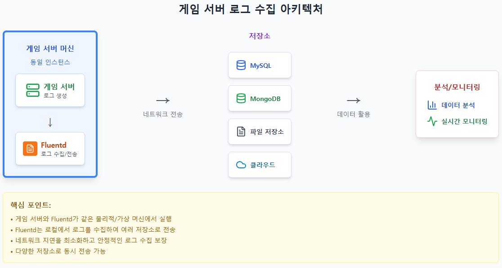  

이 과정을 조금 더 구조적으로 표현하면 다음과 같다.


---

## 1-3. 수집, 전송, 저장의 기본 흐름
로그 파이프라인을 더 세부적으로 나눠 보면 다음 세 단계로 설명할 수 있다.

1. **수집(Collect)**

   * 게임 서버에서 로그가 발생한다.
   * C# 서버에서는 보통 `Serilog` 같은 로깅 라이브러리를 활용한다.
   * Serilog → Fluentd Sink를 통해 로그를 JSON 형태로 보낼 수 있다.

2. **전송(Transfer)**

   * Fluentd는 에이전트(agent) 역할을 하며, 로그를 모아서 지정된 목적지로 전달한다.
   * 단순 파일 저장, 네트워크 전송, DB 입력 등 다양한 플러그인을 통해 확장할 수 있다.

3. **저장(Store)**

   * 로그는 MySQL, MongoDB 같은 데이터베이스나, S3 같은 클라우드 스토리지에 저장된다.
   * 이후 분석 시스템(예: ELK, Grafana, 자체 BI 도구)에서 활용된다.

---

## 1-4. Fluentd란 무엇인가?
[**Fluentd**](https://www.fluentd.org/ )는 CNCF(Cloud Native Computing Foundation)에서 관리하는 오픈소스 데이터 수집기다. 특징은 다음과 같다.

* **플러그인 기반 아키텍처**: 입력(Input), 필터(Filter), 출력(Output) 단계별로 플러그인을 조합해 사용할 수 있다.
* **유연한 확장성**: 단일 서버 로그 수집부터 수백 대 서버의 대규모 파이프라인까지 확장 가능하다.
* **멀티 플랫폼 지원**: Windows, Linux, macOS 등 다양한 운영체제에서 동작한다.
* **풍부한 생태계**: MySQL, MongoDB, Elasticsearch, Kafka 등 다양한 저장소와 연동되는 플러그인을 제공한다.

단순히 파일에 로그를 저장하는 것과 달리, Fluentd를 활용하면 **로그를 구조화하여 분석 가능한 형태로 전송**할 수 있고, 나아가 **대규모 분산 환경**에서도 안정적으로 동작할 수 있다.

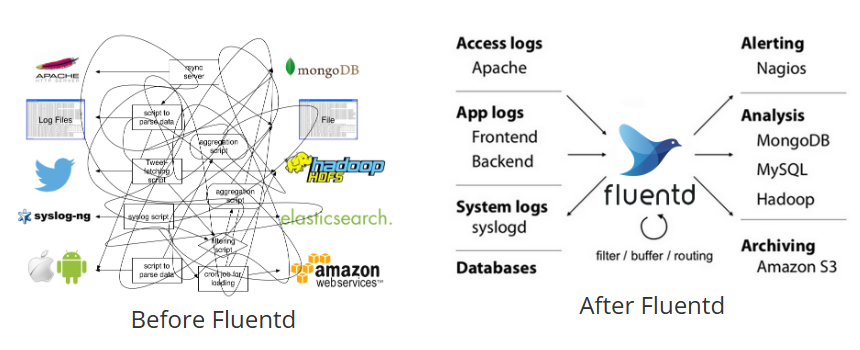   
  
---

## 요약
* 로그는 단순 텍스트 출력이 아니라 게임 운영의 핵심 데이터 자산이다.
* 로그 파이프라인은 **수집 → 전송 → 저장 → 분석/모니터링**의 단계로 이루어진다.
* Fluentd는 플러그인 기반의 강력한 로그 수집기이며, Windows 환경에서도 쉽게 구축할 수 있다.
* 신입 개발자는 우선 작은 서버 환경에서 Fluentd의 기본 흐름을 익히고, 이후 대규모 서버 환경에서 확장하는 방법을 학습해야 한다.

   
-----     

# 2. 개발 환경 준비하기

## 2-1. Windows 환경에서 Fluentd 설치

Fluentd는 Ruby 기반으로 작성되었고 Linux 환경에서 많이 사용되지만, Windows에서도 공식 MSI 패키지로 설치할 수 있다. 현재 공식 문서에서 권장하는 Windows 설치 방식은 **fluent-package** MSI 설치 프로그램이다. `fluent-package`는 예전에 **td-agent**로 알려졌던 Fluentd 패키지 배포판의 현재 이름이므로, 새 문서와 새 실습에서는 `td-agent` 대신 `fluent-package`와 `fluentd.conf`라는 명칭을 기준으로 설명하는 것이 좋다.

### 설치 단계

1. [Fluentd 공식 Windows MSI 설치 문서](https://docs.fluentd.org/installation/install-fluent-package/install-by-msi-fluent-package) 또는 [Fluent Package 다운로드 페이지](https://www.fluentd.org/download/fluent_package/)에서 Windows용 `fluent-package` MSI 파일을 내려받는다.
2. 설치 마법사를 실행하고 기본 설정을 따른다. 기본 설치 경로는 보통 `C:\opt\fluent`이다.
3. 설정 파일은 `C:\opt\fluent\etc\fluent\fluentd.conf`를 사용한다. 이 파일에 로그 입력, 필터, 출력 규칙을 정의한다.
4. 설치 후 Windows 서비스로 등록된다. Fluent Package v5 이후에는 설치 직후 자동 시작되지 않을 수 있으므로 직접 시작해야 한다.

   ```powershell
   # 서비스 시작
   net start fluentdwinsvc

   # 또는 PowerShell Cmdlet 사용
   Start-Service fluentdwinsvc

   # 서비스 중지
   net stop fluentdwinsvc
   ```

5. 플러그인을 설치할 때는 일반 명령 프롬프트보다 **Fluent Package Command Prompt**에서 `fluent-gem`을 사용하는 것이 안전하다.

   ```powershell
   fluent-gem install fluent-plugin-mongo
   ```

---

## 2-2. Ruby, fluent-package 기본 구조 이해

Fluentd는 Ruby로 작성된 프로그램이며, 플러그인을 통해 다양한 입력/필터/출력 기능을 제공한다. Windows용 `fluent-package`는 Fluentd 실행에 필요한 Ruby와 주요 의존성을 함께 포함하고, Windows 서비스 실행 환경을 제공하는 패키지 배포판이다.

```
+--------------------------------------+
|           fluent-package             |
|  (Windows 서비스, Fluentd 기반)      |
+-----------------+--------------------+
                  |
      +-----------+-----------+
      |           |           |
 [Input Plugin] [Filter] [Output Plugin]
      |           |           |
      v           v           v
  로그 수집  ->  변환/가공  ->  저장/전송
```

* **fluent-package**: Fluentd와 Ruby 런타임, 자주 쓰는 의존성을 묶은 공식 패키지 배포판
* **Input Plugin**: 로그를 어디서 가져올지 정의 (예: 파일, 소켓, HTTP, forward 등)
* **Filter Plugin**: 로그를 변환/가공 (예: JSON 파싱, 필드 추가/삭제, grep 필터링)
* **Output Plugin**: 로그를 어디로 보낼지 정의 (예: 파일, MySQL, MongoDB, S3, 다른 Fluentd)

---

## 2-3. Fluentd 플러그인 구조 살펴보기

Fluentd의 가장 큰 강점은 **플러그인 아키텍처**다. 플러그인은 입력(Input), 필터(Filter), 출력(Output) 세 가지 범주로 나뉜다.


### Input Plugins (입력)

* 파일(File) 모니터링: 특정 로그 파일을 tail 방식으로 읽음
* HTTP Input: 외부에서 HTTP 요청으로 로그 전송
* Forward: 다른 Fluentd 또는 Forward 프로토콜을 구현한 클라이언트에서 전달받은 로그 수신

### Filter Plugins (필터)

* Parser 필터: 로그 문자열을 JSON 등 구조화된 레코드로 변환
* Grep 필터: 특정 조건에 맞는 로그만 통과
* Record Transformer: 새로운 필드 추가/변경

### Output Plugins (출력)

* 파일 출력
* 다른 Fluentd로 전달(`out_forward`)
* MySQL, MongoDB, Elasticsearch, Kafka 등 외부 저장소 연동
* 클라우드 서비스(S3, GCS) 업로드

즉, Fluentd는 **“Input → Filter → Output”**의 흐름을 가진 파이프라인이며, 이를 통해 다양한 로그 흐름을 손쉽게 구성할 수 있다.

---

## 2-4. 간단한 fluentd.conf 살펴보기

설정 파일(`fluentd.conf`)은 Fluentd 동작의 핵심이다. 예를 들어, 아래는 특정 로그 파일을 읽어 콘솔로 출력하는 최소 설정 예시다.

```conf
<source>
  @type tail
  path C:/logs/app.log
  pos_file C:/logs/app.log.pos
  tag app.log
  <parse>
    @type none
  </parse>
</source>

<match app.log>
  @type stdout
</match>
```

* `source` 블록: 로그 입력 정의 (여기서는 `app.log` 파일을 tail 방식으로 수집)
* `match` 블록: 수집된 로그를 어떻게 처리할지 정의 (여기서는 콘솔(stdout) 출력)
* `tag`: 로그 라우팅을 위한 식별자
* `<parse>` 블록: 입력 로그를 어떤 방식으로 해석할지 정의 (`@type none`은 원문 문자열을 그대로 보관)

이처럼 간단한 설정으로도 로그 수집 → 전송 → 출력의 흐름을 직접 경험할 수 있다.

---

## 요약

* Windows 환경에서는 현재 **fluent-package** MSI를 기준으로 Fluentd를 설치하는 것이 좋다.
* `td-agent`는 이전 명칭이므로 새 문서에서는 `fluent-package`, `fluentd.conf`, `fluentdwinsvc` 명칭을 우선 사용한다.
* Fluentd는 Input, Filter, Output 플러그인 구조를 가지고 있으며, 이를 조합해 로그 파이프라인을 만든다.
* `fluentd.conf` 설정 파일을 수정해 원하는 방식으로 로그를 수집하고 전송할 수 있다.

---

👉 다음 장(3. 첫 번째 로그 수집 예제)에서는 실제로 간단한 로그 파일을 수집하고 콘솔로 출력해보면서 Fluentd 동작을 직접 확인해본다.

---
  
# 3. 첫 번째 로그 수집 예제

## 3-1. 간단한 텍스트 로그 수집
Fluentd의 가장 기본적인 기능은 파일에서 로그를 읽어들이는 것이다. 먼저 단순 텍스트 로그를 수집해보자.

1. `C:\logs\app.log` 파일을 만든다.

   ```txt
   2025-09-26 12:00:01 INFO Player joined the game
   2025-09-26 12:00:03 WARN Latency is high: 250ms
   2025-09-26 12:00:05 ERROR Failed to load player data
   ```

2. `fluentd.conf` 파일을 다음과 같이 작성한다.

   ```conf
   <source>
     @type tail
     path C:\logs\app.log
     pos_file C:\logs\app.log.pos
     tag app.demo
     <parse>
      @type none
     </parse>
   </source>

   <match app.demo>
     @type stdout
   </match>
   ```

3. Fluentd 서비스를 실행하면, `app.log`에 새로운 로그가 추가될 때마다 Fluentd가 이를 감지해 표준 출력(stdout)으로 내보낸다.
  

### `pos_file C:\logs\app.log.pos`
`pos_file C:\logs\app.log.pos`는 Fluentd가 **어디까지 로그 파일을 읽었는지 기록하는 위치 저장 파일**이다.

이 설정에서는 Fluentd가 `C:\logs\app.log`를 `tail` 방식으로 읽는다. 이때 이미 읽은 바이트 위치를 `C:\logs\app.log.pos`에 저장해 둔다.

그래서 Fluentd가 재시작되어도:

- 예전에 읽었던 로그를 처음부터 다시 읽지 않고
- 마지막으로 읽은 위치 다음부터 이어서 읽을 수 있다
- 중복 전송이나 누락을 줄일 수 있다

즉, `app.log.pos`는 실제 로그 파일이 아니라 Fluentd의 체크포인트 파일이다.

예를 들어 `app.log`에 100줄까지 읽은 뒤 Fluentd가 종료되면, 그 위치가 `app.log.pos`에 기록된다. 다시 실행하면 1줄부터가 아니라 101줄 근처부터 이어서 처리한다.    
    
---

## 3-2. 콘솔 출력으로 확인하기
위 설정으로 Fluentd를 실행하면 콘솔에서 다음과 같은 출력을 볼 수 있다.

```
2025-09-26 12:00:01 +0900 app.demo: 2025-09-26 12:00:01 INFO Player joined the game
2025-09-26 12:00:03 +0900 app.demo: 2025-09-26 12:00:03 WARN Latency is high: 250ms
2025-09-26 12:00:05 +0900 app.demo: 2025-09-26 12:00:05 ERROR Failed to load player data
```

구조는 다음과 같다.

```
[타임스탬프] [태그]: [원본 로그 메시지]
```

이 과정을 통해 Fluentd가 로그 파일을 감시(tail)하고, 새로운 데이터가 들어올 때마다 이벤트로 처리하는 원리를 이해할 수 있다.

---

## 3-3. Serilog → Fluentd 연동 맛보기
실제 게임 서버는 단순 문자열을 콘솔에만 출력하지 않고, 애플리케이션 코드에서 로깅 라이브러리를 활용한다. C# 환경에서는 **Serilog**가 많이 쓰인다. 가장 단순하고 안정적인 입문 방식은 Serilog가 JSON 파일을 쓰고, Fluentd가 그 파일을 `in_tail`로 읽는 구조다.

### Serilog 설정 예시 (C# .NET 콘솔 앱)

```powershell
dotnet add package Serilog
dotnet add package Serilog.Sinks.File
dotnet add package Serilog.Formatting.Compact
```

```csharp
using Serilog;
using Serilog.Formatting.Compact;

class Program
{
    static void Main(string[] args)
    {
        Log.Logger = new LoggerConfiguration()
            .MinimumLevel.Information()
            .WriteTo.File(
                new CompactJsonFormatter(),
                "C:/logs/game_server.log",
                rollingInterval: RollingInterval.Day)
            .CreateLogger();

        Log.Information("Server started");
        Log.Warning("Latency is high: {LatencyMs}ms", 250);
        Log.Error("Database connection failed");

        Log.CloseAndFlush();
    }
}
```

### Fluentd 수신 설정

Fluentd 쪽에서는 `in_tail` 플러그인을 사용하여 Serilog가 쓴 JSON 로그 파일을 읽는다.

```conf
<source>
  @type tail
  path C:/logs/game_server*.log
  pos_file C:/fluentd/pos/game_server.pos
  tag game.server
  <parse>
    @type json
  </parse>
</source>

<match game.server>
  @type stdout
</match>
```

### 실행 흐름 (ASCII 다이어그램)

```
[C# Serilog] --> [JSON log file] --> [Fluentd in_tail] --> [stdout / DB / 파일]
```

Serilog에서 Fluentd로 네트워크 전송을 직접 하고 싶다면, `in_forward`는 단순 UDP/TCP 문자열 입력이 아니라 Fluentd Forward 프로토콜을 사용한다는 점을 기억해야 한다. 원시 TCP/UDP 페이로드를 받을 때는 `in_tcp`/`in_udp`, HTTP로 받을 때는 `in_http`를 사용한다.

---

## 요약
* 텍스트 파일을 수집하는 간단한 예제는 Fluentd의 기본 동작 원리를 이해하는 첫걸음이다.
* Fluentd는 `source`에서 데이터를 읽고, `match` 블록에서 출력 대상을 정의한다.
* Serilog와 Fluentd를 연동하면, C# 서버 애플리케이션 로그를 실시간으로 Fluentd 파이프라인에 전달할 수 있다.

---

👉 다음 장(4. Serilog와 Fluentd 연동하기)에서는 API 서버를 직접 구현하고, Request/Response 로그를 Fluentd로 전송하는 보다 실전적인 예제를 다룬다.

---
  
## 4. Serilog와 Fluentd 연동하기 (C# API 서버)
이 장에서는 **C# 기반 API 서버**에서 `Serilog`를 사용하여 로그를 생성하고, 이를 **Fluentd**로 전송하는 방법을 다룬다. 실습을 통해 실제 게임 서버나 서비스에서 활용할 수 있는 기초를 마련하는 것이 목표다.

---

### 4.1 Serilog 설정
`Serilog`는 .NET 환경에서 널리 쓰이는 구조적 로깅 라이브러리다. Fluentd와 연동할 때는 먼저 **파일 기반 JSON 로그 + Fluentd `in_tail`** 구조를 추천한다. 이 방식은 애플리케이션이 Fluentd 일시 장애에 직접 영향을 덜 받고, Fluentd가 파일 위치를 기준으로 재시작 후 이어 읽을 수 있어 실무에서 다루기 쉽다.

#### NuGet 패키지 설치

```powershell
dotnet add package Serilog
dotnet add package Serilog.AspNetCore
dotnet add package Serilog.Sinks.File
dotnet add package Serilog.Formatting.Compact
```

#### 기본 설정 코드 (Program.cs)

```csharp
using Serilog;
using Serilog.Formatting.Compact;

var builder = WebApplication.CreateBuilder(args);

builder.Host.UseSerilog((ctx, lc) => lc
    .MinimumLevel.Information()
    .Enrich.FromLogContext()
    .WriteTo.Console()
    .WriteTo.File(
        new CompactJsonFormatter(),
        "C:/logs/api-.log",
        rollingInterval: RollingInterval.Day));

var app = builder.Build();

app.MapGet("/hello", () =>
{
    Log.Information("Hello endpoint called");
    return new { message = "Hello, Fluentd!" };
});

app.Run();
```

---

### 4.2 Fluentd에서 Serilog 파일 수집하기
Fluentd는 `tail` 입력 플러그인으로 Serilog JSON 로그 파일을 읽을 수 있다.

#### `fluentd.conf` 예시

```conf
<source>
  @type tail
  path C:/logs/api-*.log
  pos_file C:/fluentd/pos/api.pos
  tag api.logs
  <parse>
    @type json
  </parse>
</source>

<match api.logs>
  @type stdout
</match>
```

* `path`는 Serilog가 기록하는 파일 경로와 맞춘다.
* `pos_file`은 Fluentd가 어디까지 읽었는지 저장하는 파일이므로 로그 파일마다 분리하는 것이 좋다.
* `<parse @type json>`은 Serilog의 구조화 로그를 Fluentd 레코드로 파싱한다.

#### 네트워크로 직접 전송하고 싶을 때
`in_forward`는 Fluentd Forward 프로토콜용 입력이다. 단순 UDP Sink가 보낸 텍스트를 `in_forward`로 받을 수 있다고 설명하면 틀리다. 네트워크 직접 전송이 필요하면 아래처럼 목적에 맞는 입력을 선택한다.

* Fluentd Forward 프로토콜을 구현한 클라이언트나 다른 Fluentd: `in_forward`
* 원시 TCP 문자열/JSON: `in_tcp`
* 원시 UDP 문자열/JSON: `in_udp`
* HTTP POST: `in_http`

---

### 4.3 API 서버에서 Request/Response 로그 보내기
게임 서버 API는 보통 `ASP.NET Core`의 미들웨어나 `Controller`를 통해 요청과 응답이 오간다. Request/Response 로그를 남기면 장애 추적과 사용자 행위 분석에 유용하다.

#### 간단한 ASP.NET Core API 예제

```csharp
app.Use(async (ctx, next) =>
{
    Log.Information("Request: {Method} {Path}", ctx.Request.Method, ctx.Request.Path);
    await next();
    Log.Information("Response: {StatusCode}", ctx.Response.StatusCode);
});
```

* 요청(Request)의 `Method`, `Path`를 기록한다.
* 응답(Response)은 상태 코드와 처리 시간처럼 분석에 필요한 값 중심으로 기록한다.
* Serilog는 `{PropertyName}` 형태의 메시지 템플릿을 사용하면 구조적 속성으로 남기며, Fluentd에서 JSON 처리하기 쉽다.

### 4.4 흐름 다이어그램


---

### 4.5 주의할 점과 팁

1. **UDP 전송 시 유실 가능성**

   * UDP는 빠르지만 신뢰성이 낮아 로그 유실 가능성이 있다.
   * 중요한 로그라면 `TCP` 기반 `forward`를 사용하는 것이 좋다.

2. **JSON 구조 유지**

   * Serilog에서 구조화된 JSON을 남기면 Fluentd에서 바로 파싱 가능하다.
   * 문자열 로그보다는 `{UserId: 123, Action: "Login"}` 형태가 분석에 유리하다.

3. **개발 환경에서는 Console Sink 병행**

   * 개발 시에는 Fluentd뿐 아니라 Console에도 남겨 디버깅을 쉽게 하는 것이 좋다.

---
  
## 5. Socket 서버 로그 수집
이번 장에서는 **C#으로 구현한 간단한 Socket 서버**를 기반으로 연결/해제/메시지 이벤트 로그를 수집하고, 이를 **Fluentd**로 전송해 구조화하는 방법을 다룬다. 실습은 게임 서버 환경과 유사하게 클라이언트 다수가 접속하고 메시지를 주고받는 시나리오를 가정한다.

---

### 5.1 C# Socket 서버 구현
C#의 `System.Net.Sockets` 네임스페이스를 활용하여 TCP 기반 Socket 서버를 만든다. 서버는 클라이언트 연결, 메시지 송수신, 연결 종료 이벤트를 처리한다.

#### 예제 코드 (간단한 TCP 서버)

```csharp
using System;
using System.Net;
using System.Net.Sockets;
using System.Text;
using Serilog;

class SocketServer
{
    private TcpListener _listener;

    public SocketServer(string ip, int port)
    {
        _listener = new TcpListener(IPAddress.Parse(ip), port);
    }

    public void Start()
    {
        _listener.Start();
        Log.Information("Socket 서버 시작됨 {Ip}:{Port}", ((IPEndPoint)_listener.LocalEndpoint).Address, ((IPEndPoint)_listener.LocalEndpoint).Port);

        while (true)
        {
            var client = _listener.AcceptTcpClient();
            Log.Information("클라이언트 연결됨 {Client}", client.Client.RemoteEndPoint);

            var stream = client.GetStream();
            var buffer = new byte[1024];
            int bytesRead;

            while ((bytesRead = stream.Read(buffer, 0, buffer.Length)) > 0)
            {
                var message = Encoding.UTF8.GetString(buffer, 0, bytesRead);
                Log.Information("메시지 수신 {Client} => {Message}", client.Client.RemoteEndPoint, message);

                // Echo 응답
                var response = Encoding.UTF8.GetBytes($"Echo: {message}");
                stream.Write(response, 0, response.Length);
                Log.Information("메시지 응답 {Client} <= {Response}", client.Client.RemoteEndPoint, response);
            }

            Log.Information("클라이언트 연결 해제 {Client}", client.Client.RemoteEndPoint);
        }
    }
}

class Program
{
    static void Main()
    {
        Log.Logger = new LoggerConfiguration()
            .WriteTo.Console()
            .WriteTo.File(
                new CompactJsonFormatter(),
                "C:/logs/socket-.log",
                rollingInterval: RollingInterval.Day)
            .CreateLogger();

        var server = new SocketServer("127.0.0.1", 5000);
        server.Start();
    }
}
```

---

### 5.2 연결/해제/메시지 로그 수집
위 예제에서 로그는 다음과 같은 이벤트를 기록한다.

* **클라이언트 연결**

  ```text
  클라이언트 연결됨 127.0.0.1:12345
  ```
* **메시지 수신**

  ```text
  메시지 수신 127.0.0.1:12345 => {"action":"login","userId":101}
  ```
* **메시지 응답**

  ```text
  메시지 응답 127.0.0.1:12345 <= {"status":"ok"}
  ```
* **클라이언트 연결 해제**

  ```text
  클라이언트 연결 해제 127.0.0.1:12345
  ```

이렇게 이벤트를 구조적으로 남기면, Fluentd에서 JSON 기반으로 파싱하여 DB나 모니터링 시스템으로 보내기 쉽다.

---

### 5.3 Fluentd를 통한 로그 구조화
Fluentd에서 Socket 서버 로그를 처리하려면, `fluentd.conf`에 태그를 기준으로 라우팅한다.

#### Fluentd 설정 예시

```conf
<source>
  @type tail
  path C:/logs/socket-*.log
  pos_file C:/fluentd/pos/socket.pos
  tag socket.logs
  <parse>
    @type json
  </parse>
</source>

<match socket.logs>
  @type stdout
</match>
```

* Serilog가 `C:/logs/socket-*.log` 같은 JSON 파일을 쓰고, Fluentd의 `tag socket.logs` 설정으로 라우팅한다.
* Fluentd는 이를 받아 콘솔(JSON) 형태로 출력하거나 DB, Elasticsearch, MongoDB로 전송할 수 있다.

#### 출력 예시

```json
{
  "time": "2025-09-26T12:30:00Z",
  "level": "Information",
  "message": "메시지 수신",
  "Client": "127.0.0.1:12345",
  "Message": "{\"action\":\"login\",\"userId\":101}"
}
```

---

### 5.4 아키텍처 다이어그램

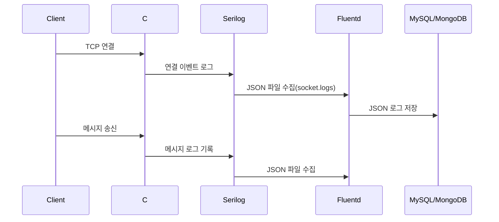

---

### 5.5 주의할 점과 고성능 운영 팁

1. **동시 접속 관리**

   * 수백\~수천 개의 소켓 연결이 발생하면 스레드 기반 처리 대신 `async/await` 기반 비동기 Socket을 사용하는 것이 유리하다.

2. **로그 전송 방식**

   * UDP는 빠르지만 로그 유실 위험이 있다. 중요한 로그는 파일 기반 수집 또는 Forward 프로토콜을 지원하는 전송 방식을 쓰는 것이 안전하다.

3. **로그 구조화**

   * JSON 기반 로그는 Fluentd에서 필터링과 라우팅에 강력하다. 단순 문자열 로그보다는 구조적 데이터로 남기는 것이 장기적으로 분석과 DB 저장에 유리하다.

4. **대규모 환경 확장 시 고려**

   * 서버 수가 200대를 넘어가면 각 서버가 직접 DB로 쓰지 않고, Fluentd **Aggregator**를 거쳐 집계 후 저장하는 구조가 필요하다.
   * 이 경우 Forwarder/Collector 아키텍처로 구성해 네트워크 병목을 줄인다.

---

  
## 6. 다양한 출력 플러그인 사용하기
이 장에서는 Fluentd가 수집한 로그를 **여러 가지 출력 대상(Output Plugin)** 으로 전달하는 방법을 살펴본다. 실제 운영 환경에서는 단순히 DB에 저장하는 것만이 아니라, 개발 중에는 **콘솔 확인**, 장애 대응 시에는 **파일 백업**, 외부 시스템과 연동할 때는 **HTTP/REST API**, 대규모 로그 저장에는 **Cloud Storage(S3, GCS)** 등 다양한 시나리오가 필요하다.

---

### 6.1 File, Console Output

#### Console Output
테스트 환경에서 가장 간단하게 사용하는 방식이다. Fluentd가 수집한 로그를 바로 표준 출력으로 내보낸다.

```conf
<match api.logs>
  @type stdout
</match>
```

* 장점: 설정이 간단하고 디버깅에 유용하다.
* 단점: 운영 환경에서는 로그가 유실되며, 모니터링 용도로만 사용해야 한다.

#### File Output
로그를 파일에 저장하는 방법이다. 장애 시 MySQL, MongoDB 같은 외부 DB로 전송되지 못하는 로그를 **안전하게 보관**하는 용도로도 많이 쓰인다.

```conf
<match socket.logs>
  @type file
  path C:/fluentd/logs/socket.%Y-%m-%d.log
  append true
  format json
</match>
```

* `path`: 로그 파일 저장 경로 및 파일명 포맷 지정 가능
* `format json`: JSON 형식으로 저장하여 이후 분석하기 쉽게 구성

---

### 6.2 HTTP/REST API 연동
게임 서버 운영 중에는 로그를 외부 모니터링 서비스나 내부 전용 API 서버로 전달할 때가 많다. 이 경우 `out_http` 플러그인을 사용한다.

```conf
<match api.logs>
  @type http
  endpoint http://127.0.0.1:8080/logs
  http_method post
  serializer json
</match>
```

* `endpoint`: 로그를 전달할 REST API 주소
* `http_method`: 보통 `POST`를 사용
* `serializer`: JSON 직렬화를 통해 로그를 구조화하여 전송

#### 활용 예시

* 게임 이벤트 로그를 분석 서버로 전송
* Slack, Discord 같은 알림 시스템에 Webhook으로 전달
* 중앙 집중식 APM(Application Performance Monitoring) 도구와 연계

---

### 6.3 Cloud Storage(S3, GCS) 개요
대규모 로그를 **장기 보관**하려면 Cloud Storage가 필수적이다. AWS S3, Google Cloud Storage(GCS)는 무한에 가까운 저장 용량과 저렴한 비용으로 대규모 로그 아카이빙에 적합하다.

#### AWS S3 출력 예시 (`fluent-plugin-s3`)

```conf
<match game.logs>
  @type s3
  aws_key_id YOUR_AWS_KEY
  aws_sec_key YOUR_AWS_SECRET
  s3_bucket my-game-logs
  s3_region ap-northeast-2
  path logs/
  store_as gzip
  buffer_path C:/fluentd/buffer/s3
</match>
```

* `store_as gzip`: 압축 저장으로 비용 절감
* `buffer_path`: 네트워크 장애 시에도 로그 유실을 막고 재전송 가능

#### Google Cloud Storage 출력 예시 (`fluent-plugin-gcs`)

```conf
<match game.logs>
  @type gcs
  project my-gcp-project
  keyfile C:/fluentd/keys/gcp-key.json
  bucket game-log-bucket
  path logs/%Y/%m/%d/
  object_key_format %{path}/%{time_slice}_%{index}.gz
  buffer_path C:/fluentd/buffer/gcs
</match>
```

* 날짜별 디렉터리 구조로 저장 가능
* 장기 보관 후 BigQuery 같은 분석 도구와 연계 가능

---

### 6.4 아키텍처 다이어그램

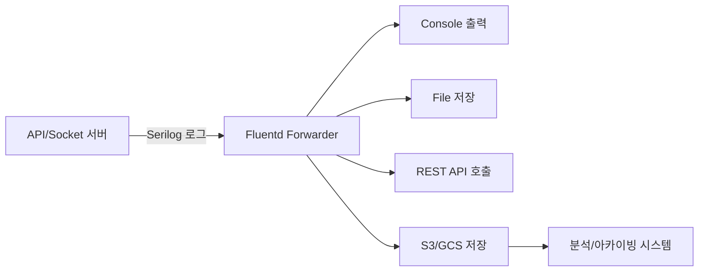

---

### 6.5 운영 시 고려사항

1. **File Output**

   * 단기적인 백업 용도로만 사용하고, 장기 보관은 클라우드 스토리지를 활용하는 것이 바람직하다.

2. **HTTP Output**

   * 네트워크 장애 시 재전송 로직을 반드시 구성해야 한다.
   * `retry_wait`, `retry_limit` 설정으로 안정성을 높일 수 있다.

3. **Cloud Storage**

   * 장기 아카이빙은 S3/GCS에 맡기고, DB에는 최근 데이터만 저장하는 구조가 효율적이다.
   * 대규모 환경에서는 **Aggregator Fluentd**를 두어 각 서버에서 직접 업로드하지 않고 중앙에서 모아 전송하는 구조가 성능상 유리하다.

---
  
  
## 7. Out_MySQL로 로그 저장
이번 장에서는 **Fluentd를 이용해 수집한 로그를 MySQL에 저장**하는 방법을 다룬다. 게임 서버 운영에서는 단순 로그 수집만으로는 부족하며, 이를 **데이터베이스에 저장**하여 분석, 통계, 모니터링에 활용하는 것이 중요하다. 본 장에서는 `out_mysql` 플러그인 사용법부터 **스키마 설계**, **쿼리 최적화 전략**까지 살펴본다.

---

### 7.1 mysql 플러그인 사용

#### 설치 방법 (Windows 기준)
Fluentd는 Ruby 기반이므로, Fluent Package Command Prompt에서 MySQL 출력 플러그인을 설치한다.

```bash
fluent-gem install fluent-plugin-mysql
```

#### 기본 설정 예제 (`fluentd.conf`)

```conf
<source>
  @type forward
  port 24224
  bind 0.0.0.0
</source>

<match api.logs>
  @type mysql

  host localhost
  port 3306
  database game_logs
  username log_user
  password log_pass

  # 테이블 자동 생성 여부
  auto_create_table true
  table logs

  # 컬럼 매핑
  <inject>
    time_key time
    tag_key tag
  </inject>
</match>
```

* **`auto_create_table true`** : 로그 수집 시 자동으로 테이블 생성 가능
* **`inject`** : Fluentd가 내부적으로 추가하는 메타데이터(`time`, `tag`)를 지정
* 로그는 JSON 구조를 해체하여 컬럼에 매핑된다.
  
Fluentd로 들어오는 로그 record는 이런 형태여야 합니다.  
```json
{
  "level": "Information",
  "user_id": 10001,
  "action": "login",
  "message": "User login succeeded"
}
```  
  
따라서 DB에 최종 저장될 때는 개념적으로 이렇게 됩니다.  
```json
{
  "time": "2026-06-20 14:31:05",
  "tag": "api.logs",
  "level": "Information",
  "user_id": 10001,
  "action": "login",
  "message": "User login succeeded"
}
```  

---

### 7.2 Schema 설계 시 고려사항
MySQL에 로그를 저장할 때, 무작정 `text` 필드에 JSON 전체를 저장하는 방법은 **분석과 검색 성능이 떨어진다**. 따라서 **분석할 필요가 있는 주요 필드만 컬럼으로 분리**하는 것이 좋다.

#### 예시 스키마 (게임 서버 API 로그)

```sql
CREATE TABLE logs (
    id BIGINT AUTO_INCREMENT PRIMARY KEY,
    time DATETIME NOT NULL,
    tag VARCHAR(50),
    level VARCHAR(20),
    user_id BIGINT,
    action VARCHAR(50),
    message TEXT,
    created_at TIMESTAMP DEFAULT CURRENT_TIMESTAMP
);
```

* **`time`** : Fluentd에서 주입한 로그 시간
* **`level`** : Serilog에서 남기는 로그 레벨 (Information, Error 등)
* **`user_id`, `action`** : 분석에 자주 쓰이는 필드
* **`message`** : 기타 상세 로그 (JSON이나 문자열 형태)
  
#### C# Serilog 코드 예시
Serilog에서는 구조화 로그로 남겨야 한다. 중요한 값은 message 문자열 안에 묻지 말고 property로 빼야 한다.  

```csharp
using Serilog;

Log.Logger = new LoggerConfiguration()
    .MinimumLevel.Information()
    .WriteTo.Console()
    .CreateLogger();

long userId = 10001;
string action = "login";

Log
    .ForContext("user_id", userId)
    .ForContext("action", action)
    .Information("User login succeeded");
```  
```json
{
  "level": "Information",
  "user_id": 10001,
  "action": "login",
  "message": "User login succeeded"
}
```  
  
에러 로그라면:

```csharp
try
{
    throw new InvalidOperationException("Invalid session token");
}
catch (Exception ex)
{
    Log
        .ForContext("user_id", 10001)
        .ForContext("action", "login")
        .Error(ex, "User login failed");
}
```  
```json
{
  "level": "Error",
  "user_id": 10001,
  "action": "login",
  "message": "User login failed: Invalid session token"
}
```  
  
---

### 7.3 쿼리 최적화와 인덱싱 전략

#### 1. 인덱스 설정

```sql
CREATE INDEX idx_time ON logs(time);
CREATE INDEX idx_user_action ON logs(user_id, action);
```

* 시간 기반 검색 (`WHERE time BETWEEN ...`) 성능을 높이기 위해 `time` 인덱스 필요
* 유저별 행동 로그 조회를 위해 `(user_id, action)` 복합 인덱스 설정

#### 2. 파티셔닝 전략

* **일자별 파티셔닝** : 로그는 시간이 지남에 따라 계속 누적되므로, 날짜 단위(`RANGE COLUMNS (time)`)로 파티션을 나누면 효율적이다.
* **테이블 분리 전략** : 대규모 환경(200대 서버 이상)에서는 서버별, 월별 로그 테이블을 나눠 관리하는 것이 좋다.

#### 3. 쿼리 최적화 예시

```sql
-- 최근 1시간 동안 로그인 시도 로그
SELECT user_id, COUNT(*) as login_attempts
FROM logs
WHERE action = 'login'
  AND time > NOW() - INTERVAL 1 HOUR
GROUP BY user_id
ORDER BY login_attempts DESC;
```

---

### 7.4 아키텍처 흐름도

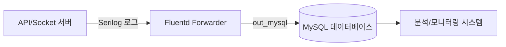

* **서버**에서 Serilog 로그 생성
* **Fluentd**가 수집 후 MySQL에 저장
* **BI 도구/모니터링**에서 쿼리를 통해 대시보드 생성 가능

---

### 7.5 고성능 운영 팁

1. **Buffer 설정**

   * `@type file` 버퍼를 사용하여 장애 시 로그 유실 방지
   * `flush_interval`을 적절히 조절하여 DB 부하를 완화

2. **Batch Insert**

   * `fluent-plugin-mysql`의 bulk insert 계열 설정을 사용하거나, 버퍼 크기와 `flush_interval`을 조정해 다수의 로그를 모아 Insert하면 MySQL 성능 향상

3. **쓰기 전용 DB 분리**

   * 운영 DB와 로그 DB를 분리하여 서비스 쿼리 성능에 영향을 주지 않도록 한다.

4. **대규모 서버 환경**

   * 서버 수가 많아지면 각 서버에서 Fluentd Forwarder만 띄우고, Aggregator 노드가 로그를 모아 MySQL에 저장하도록 구성한다.
   * MySQL 단일 인스턴스로는 감당이 어려울 경우, **샤딩**(user\_id 기준 분할)이나 **MySQL Cluster** 도입을 고려해야 한다.

---
  
## 8. MongoDB로 로그 저장
MongoDB는 문서 지향(Document-Oriented) 데이터베이스로, JSON과 유사한 BSON 형식으로 데이터를 저장한다. 로그 데이터는 구조가 다양하고, 유연한 스키마를 필요로 하기 때문에 MongoDB와 잘 어울린다. 이번 장에서는 Fluentd의 **out\_mongo 플러그인**을 사용하여 로그를 MongoDB에 저장하는 방법을 다룬다. 또한 로그 문서 모델링, 대용량 처리 시 주의점도 설명한다.

---

### 8.1 Out_mongo 플러그인 사용
Fluentd 코어에 MongoDB 출력이 기본 내장되어 있는 것은 아니다. MongoDB로 저장하려면 보통 `fluent-plugin-mongo` 같은 출력 플러그인을 설치해 `out_mongo`를 사용한다.

#### 설치 방법
Windows 환경에서는 Ruby 기반 gem 설치로 진행한다.

```bash
td-agent-gem install fluent-plugin-mongo
```

설치 후 `fluentd.conf`에서 MongoDB 출력 설정을 추가한다.

#### 설정 예제

```conf
<match game.logs>
  @type mongo
  host 127.0.0.1
  port 27017
  database game_logs
  collection api_log
  user fluentd
  password secret123
  capped
  capped_size 100m
</match>
```

* **database**: 로그가 저장될 DB 이름
* **collection**: 로그 컬렉션 이름 (ex. `api_log`, `socket_log`)
* **capped**: capped collection 사용 여부 (고정 크기, 순환 저장)
* **capped\_size**: 컬렉션 최대 크기

---

### 8.2 Document 모델링

MongoDB는 스키마가 자유롭지만, 로그 데이터는 일관된 구조를 가져야 분석 및 검색이 쉽다. 일반적으로 다음과 같은 구조를 권장한다.

```json
{
  "timestamp": "2025-09-26T10:32:45Z",
  "server": "api-server-01",
  "level": "INFO",
  "category": "request",
  "message": "User login success",
  "context": {
    "userId": 12345,
    "ip": "192.168.0.10",
    "endpoint": "/api/login",
    "latencyMs": 120
  }
}
```

#### 설계 팁

* **timestamp**: ISODate 형태를 사용해 MongoDB의 시간 기반 인덱스를 활용한다.
* **server**: 서버명 또는 ID를 기록하여 대규모 환경에서 구분 가능하게 한다.
* **level**: INFO, WARN, ERROR 등 로그 레벨을 넣어 필터링을 쉽게 한다.
* **context**: 세부 데이터(유저 ID, IP, API endpoint 등)를 JSON 객체로 저장한다.

---

### 8.3 C# Serilog 연동 예제

C# 서버에서 Serilog를 사용해 Fluentd로 로그를 전송하고, Fluentd가 MongoDB에 저장하도록 구성한다.

#### Serilog 설정

```csharp
Log.Logger = new LoggerConfiguration()
    .WriteTo.Console()
    .WriteTo.Http("http://localhost:9880/game.logs") // Fluentd input endpoint
    .Enrich.WithProperty("server", "api-server-01")
    .CreateLogger();
```

#### API 서버 로그 예제

```csharp
app.MapPost("/login", (LoginRequest req) => {
    Log.Information("User login request", new {
        userId = req.UserId,
        endpoint = "/login"
    });
    return Results.Ok();
});
```

이 로그는 Fluentd를 거쳐 MongoDB의 `api_log` 컬렉션에 저장된다.

---

### 8.4 대용량 데이터 처리 주의점
게임 서버는 초당 수천\~수만 건의 로그를 발생시킬 수 있다. MongoDB에 직접 저장할 때는 다음 사항을 주의해야 한다.

#### 1) 인덱스 최적화

* 자주 검색하는 필드(`timestamp`, `userId`, `server`)에 인덱스를 생성한다.
* 복합 인덱스를 활용하여 쿼리 효율을 높인다.

```javascript
db.api_log.createIndex({ "timestamp": 1 })
db.api_log.createIndex({ "context.userId": 1 })
db.api_log.createIndex({ "server": 1, "timestamp": -1 })
```

#### 2) Write Concern 조정

* 기본적으로 `w:1`(primary에만 기록)으로 설정해 성능을 확보한다.
* 데이터 유실 방지가 중요한 경우 `w:majority`를 고려한다.

#### 3) Sharding

200대 이상의 서버에서 로그를 모을 경우 **Sharded Cluster**를 활용한다.
샤딩 키는 `timestamp + server` 조합을 추천한다.

```mermaid
graph TD
    A[Fluentd Aggregator] -->|Batch Insert| B[MongoDB Router (mongos)]
    B --> C1[Shard 1]
    B --> C2[Shard 2]
    B --> C3[Shard 3]
```

---

### 8.5 고성능을 위한 팁

* **Batch Insert 활용**: Fluentd는 내부적으로 버퍼링 후 batch insert를 수행하므로, buffer 크기를 적절히 조정한다.
* **Capped Collection**: 단기 모니터링 로그는 capped collection을 사용하면 성능과 디스크 효율성을 확보할 수 있다.
* **TTL Index**: 오래된 로그는 자동 삭제되도록 TTL 인덱스를 설정한다.

```javascript
db.api_log.createIndex({ "timestamp": 1 }, { expireAfterSeconds: 2592000 }) // 30일 보관
```

* **전송 압축**: Fluentd의 buffer에서 gzip 압축을 활성화해 네트워크 비용을 줄인다.

---

## 요약

* Fluentd의 **out_mongo 플러그인**을 사용하여 MongoDB에 로그 저장 가능하다.
* 로그는 일관된 Document 구조를 설계해야 분석 및 검색이 편하다.
* 대규모 서버 환경에서는 인덱스 최적화, 샤딩, TTL 인덱스, capped collection 등을 고려해야 한다.
* C# Serilog → Fluentd → MongoDB 파이프라인으로 손쉽게 확장 가능하다.

---

원한다면 여기서 MongoDB 샤딩 아키텍처를 ASCII 아트로도 표현해줄 수 있는데, 추가로 그려드릴까?


## 9. Fluentd 구성 관리
운영 환경으로 확장하려면 단순히 로그를 수집하는 수준을 넘어, **구성을 체계적으로 관리**하는 것이 중요하다. Fluentd는 플러그인 중심 아키텍처를 가지며, 설정 파일을 통해 동작을 제어한다. 이 장에서는 `td-agent.conf` 설정 구조, Tag와 Match를 활용한 라우팅, 그리고 버퍼링 전략에 대해 설명한다.

---

### 9.1 설정 파일 구조 (td-agent.conf)
Fluentd는 설정 파일을 통해 **입력(source) → 변환(filter) → 출력(match)** 흐름을 정의한다.

#### 기본 구조

```conf
<source>
  @type http
  port 9880
</source>

<match game.logs>
  @type file
  path C:/fluentd/logs/game.log
</match>
```

* **source**: 로그를 받아오는 입력 플러그인 정의 (예: `http`, `forward`, `tail`)
* **match**: 특정 태그(tag)와 일치하는 로그를 어떻게 처리할지 정의
* **filter** (선택): 중간 단계에서 로그를 변환하거나 필터링

#### ASCII 아트로 본 구조

```
+----------+      +----------+      +----------+
|  Source  | ---> |  Filter  | ---> |  Match   |
+----------+      +----------+      +----------+
```

---

### 9.2 Tag와 Match를 활용한 라우팅
Fluentd의 강점은 태그 기반 라우팅이다. 로그에 태그를 붙이고, 특정 태그에 맞는 `match` 규칙을 설정하면 목적지별로 쉽게 분리할 수 있다.

#### 예제: API 로그와 Socket 로그 분리

```conf
<match api.logs>
  @type mongo
  database game_logs
  collection api_log
</match>

<match socket.logs>
  @type mysql
  database game_logs
  table socket_log
</match>
```

* **api.logs** 태그가 붙은 로그 → MongoDB 저장
* **socket.logs** 태그가 붙은 로그 → MySQL 저장

#### Mermaid 다이어그램

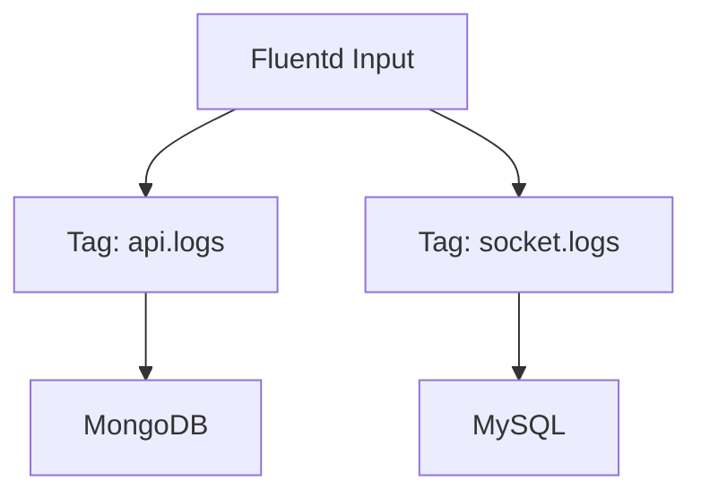

---

### 9.3 버퍼링 전략 (memory, file buffer)
Fluentd는 데이터를 바로 출력하지 않고, 버퍼를 거쳐서 안정적으로 전달한다.
이 과정에서 **유실 방지, 성능 최적화**가 가능하다.

#### Memory Buffer

```conf
<buffer>
  @type memory
  flush_interval 5s
  chunk_limit_size 8m
  queued_chunks_limit_size 32
</buffer>
```

* **장점**: 빠른 처리 속도, 낮은 디스크 I/O 부담
* **단점**: Fluentd가 다운되면 버퍼 데이터 유실 가능

#### File Buffer

```conf
<buffer C:/fluentd/buffer/>
  @type file
  flush_interval 10s
  chunk_limit_size 256m
  queued_chunks_limit_size 128
</buffer>
```

* **장점**: Fluentd 재시작 후에도 버퍼 복구 가능, 안정적
* **단점**: 디스크 I/O 비용 발생, SSD 권장

#### 권장 전략

* **개발/테스트 환경**: memory buffer (간단하고 빠름)
* **운영/대규모 환경**: file buffer (안정성과 복구력 확보)

---

### 9.4 구성 관리 Best Practice

1. **환경별 설정 분리**

   * `td-agent.conf`를 환경(dev/staging/prod)별로 관리
   * 공통 부분을 `include` 구문으로 재사용 가능

   ```conf
   @include common.conf
   @include prod.conf
   ```

2. **Tag 네이밍 규칙**

   * `<서비스명>.<로그유형>.<서버명>` 패턴을 권장
   * 예: `game.api.server01`, `game.socket.server42`

3. **버퍼 디렉토리 모니터링**

   * file buffer 사용 시 디스크 공간 부족으로 인한 장애를 대비
   * 모니터링 시스템(Prometheus/Grafana)과 연동 권장

---

### 9.5 예제: API와 Socket 로그 구성

```conf
<source>
  @type http
  port 9880
  tag api.logs
</source>

<source>
  @type forward
  port 24224
  tag socket.logs
</source>

<match api.logs>
  @type mongo
  database game_logs
  collection api_log
  <buffer C:/fluentd/buffer/api>
    @type file
    flush_interval 5s
  </buffer>
</match>

<match socket.logs>
  @type file
  path C:/fluentd/logs/socket.log
  <buffer>
    @type memory
    flush_interval 3s
  </buffer>
</match>
```

* API 서버 로그는 MongoDB에 저장 (file buffer 사용)
* Socket 서버 로그는 파일에 저장 (memory buffer 사용)

---

## 요약

* Fluentd는 `source → filter → match` 구조로 동작하며, `td-agent.conf` 파일로 관리한다.
* 태그(Tag)를 기반으로 라우팅하면 다양한 로그를 분리·전송할 수 있다.
* 버퍼링 전략은 **memory buffer(빠름, 위험)** vs **file buffer(안정적, I/O 부담)** 로 구분된다.
* 환경별 설정 분리, 태그 네이밍 규칙, 디스크 모니터링을 통해 운영 안정성을 확보해야 한다.

---
  
  
## 10. 로그 파이프라인 설계 패턴
로그 파이프라인은 단순히 로그를 수집하는 단계를 넘어, **수집 → 집계 → 저장/분석**의 일련의 흐름을 체계적으로 설계하는 것이다. 게임 서버는 작은 규모에서 시작해 수십, 수백 대의 서버로 확장될 수 있기 때문에, 단계별 설계 패턴을 이해하는 것이 중요하다. 이 장에서는 규모별로 적용할 수 있는 로그 파이프라인 아키텍처를 설명한다.

---

### 10.1 작은 규모 (1\~10대 서버)
작은 규모에서는 구조가 단순하고 관리가 쉽다. 일반적으로 **각 서버 → Fluentd → 저장소** 형태로 운영한다.

#### 설계 특징

* 서버에 Fluentd 에이전트를 직접 설치
* 로그는 바로 MySQL, MongoDB, 파일 등으로 전송
* 버퍼는 memory buffer로도 충분
* 운영 및 장애 대응이 간단

#### 아키텍처 (ASCII 아트)

```
+-----------+       +-----------+       +-----------+
| Game API  | --->  |  Fluentd  | --->  |  MongoDB  |
| Server(s) |       |  (Agent)  |       |  MySQL    |
+-----------+       +-----------+       +-----------+
```

#### Mermaid 다이어그램

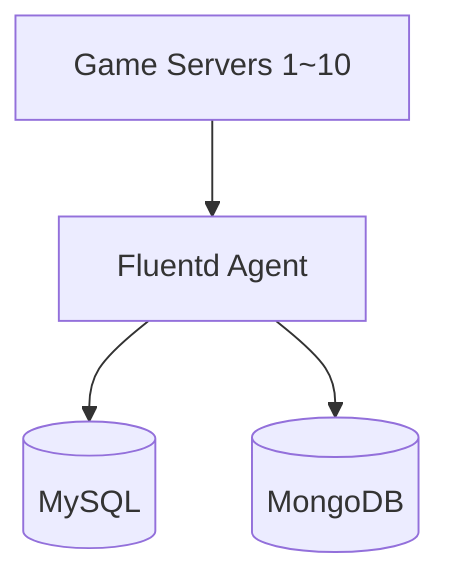

---

### 10.2 중간 규모 (50\~100대 서버)
50대 이상 서버에서는 각 서버에 설치된 Fluentd가 직접 DB로 연결되면 **DB 부하**와 **네트워크 병목** 문제가 발생한다. 따라서 **Forwarder-Aggregator 패턴**을 도입한다.

#### 설계 특징

* 각 게임 서버에는 **Forwarder Fluentd** 설치 (로그 수집 및 전송)
* 중앙에 **Aggregator Fluentd** 서버를 두어 DB나 분석 시스템으로 로그를 일괄 전송
* Forwarder는 가볍게 유지하고, Aggregator에서 변환/필터링/저장을 담당
* file buffer 사용 권장 (중간 장애 대비)

#### 아키텍처 (ASCII 아트)

```
+-----------+        +-------------+        +-------------+
| Game API  | --->   | Fluentd     | --->   | Fluentd     | ---> DB/Storage
| Server(s) |        | Forwarder   |        | Aggregator  |
+-----------+        +-------------+        +-------------+
```

#### Mermaid 다이어그램

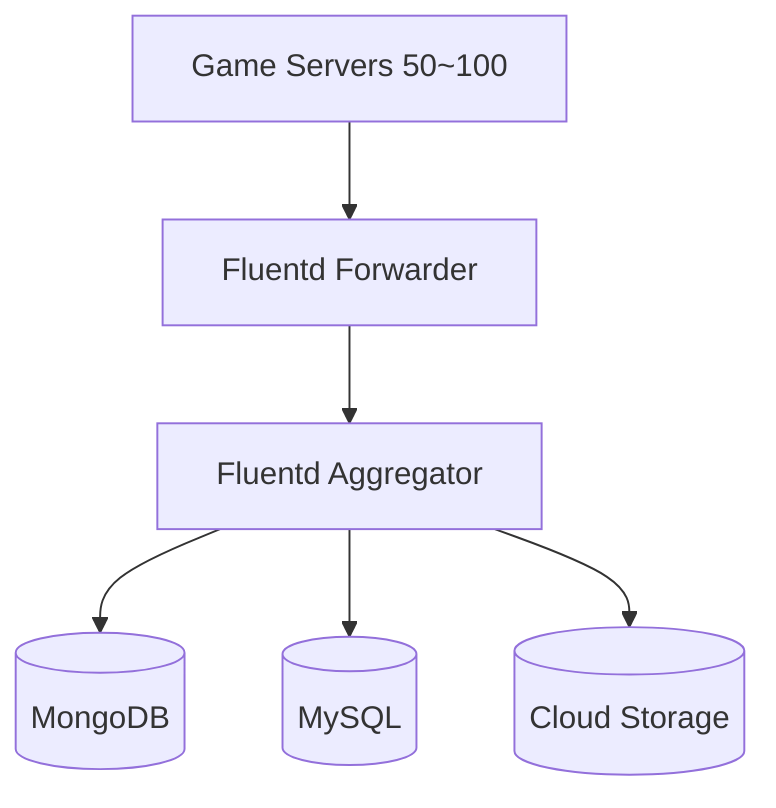

---

### 10.3 대규모 (200대 이상 서버)
200대 이상의 서버에서는 로그 트래픽이 폭발적으로 증가한다. 이때는 **클러스터링, 로드밸런싱, 샤딩** 전략을 적용해야 한다.

#### 설계 특징

* 여러 개의 Aggregator 노드를 구성하고, **로드밸런서**를 통해 부하 분산
* 로그 저장소(DB, NoSQL, Elasticsearch 등)는 샤딩 또는 클러스터링으로 확장
* Fluentd Aggregator 간에 HA(고가용성) 구성 필요
* 장애 복구를 위해 file buffer + 재전송(Retry) 전략 필수
* 로그 전송 구간은 SSL/TLS 암호화 권장

#### 아키텍처 (ASCII 아트)

```
         +----------------+
         | Load Balancer  |
         +--------+-------+
                  |
       +----------+----------+
       |          |          |
+-------------+ +-------------+ +-------------+
| Fluentd     | | Fluentd     | | Fluentd     |
| Aggregator1 | | Aggregator2 | | Aggregator3 |
+-------------+ +-------------+ +-------------+
       |              |               |
       +--------------+---------------+
                      |
          +----------------------+
          |   Storage Cluster    |
          | (MongoDB Shard/ES)   |
          +----------------------+
```

#### Mermaid 다이어그램

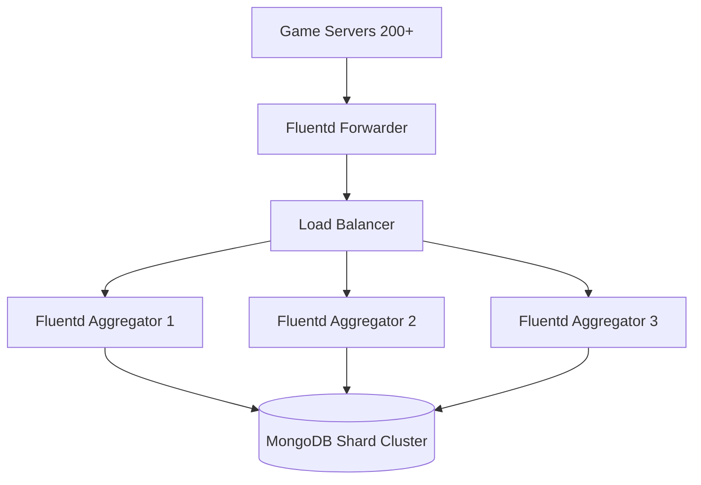

---

### 10.4 설계 패턴 비교 요약

| 규모             | 구조                                               | 특징                 |
| -------------- | ------------------------------------------------ | ------------------ |
| 1\~10대 (소규모)   | 서버 → Fluentd → DB                                | 단순, 빠른 구축 가능       |
| 50\~100대 (중규모) | Forwarder → Aggregator → DB                      | DB 부하 감소, 중앙 집중 처리 |
| 200대 이상 (대규모)  | Forwarder → LB → Aggregator Cluster → Sharded DB | 확장성, 고가용성, 복잡한 운영  |

---

## 요약

* **소규모**: 각 서버에 Fluentd 설치 후 직접 DB 전송 (간단)
* **중규모**: Forwarder-Aggregator 패턴으로 DB 부하를 줄임
* **대규모**: Aggregator 클러스터링, 로드밸런싱, 샤딩 DB로 확장

---
  
  
## 11. 대규모 환경에서의 고려사항
200대 이상의 게임 서버에서 로그를 수집하고 전송하는 경우, 작은 규모나 중간 규모와는 전혀 다른 문제가 발생한다. 데이터의 양이 기하급수적으로 늘어나고, 한 지점의 장애가 전체 파이프라인에 영향을 미칠 수 있기 때문이다. 따라서 대규모 환경에서는 **확장성(Scalability)**, **고가용성(High Availability)**, **부하 분산(Load Balancing)**, **장애 복구(Failover)** 등을 종합적으로 고려해야 한다.

---

### 11.1 Fluentd 클러스터링
단일 Fluentd 인스턴스로는 초당 수십만 건 이상의 로그를 처리하기 어렵다. 이를 위해 여러 개의 Fluentd Aggregator를 클러스터로 구성하여 부하를 나누어 처리한다.

#### 주요 전략

* **Aggregator 다중 배치**: 로그 집계 서버를 여러 대 두어 부하를 분산한다.
* **Forwarder 분산 전송**: 각 게임 서버에 설치된 Forwarder Fluentd가 라운드 로빈 방식으로 Aggregator에 로그를 전송한다.
* **플러그인 최소화**: Aggregator에는 꼭 필요한 필터와 출력 플러그인만 사용하여 병목을 줄인다.

#### 아키텍처 (ASCII 아트)

```
+-------------------+       +-------------------+
| Game Servers      |  -->  | Forwarder Fluentd |
| (200+)            |       | (Lightweight)     |
+-------------------+       +-------------------+
             |                       |
             +-----------------------+
                         |
                +------------------+
                | Load Balancer    |
                +------------------+
                   /    |    \
                  /     |     \
      +-------------+ +-------------+ +-------------+
      | Aggregator1 | | Aggregator2 | | Aggregator3 |
      +-------------+ +-------------+ +-------------+
```

---

### 11.2 고가용성(HA) 구성
대규모 환경에서 로그 수집 시스템이 멈추면 곧바로 모니터링 공백과 장애 대응 지연으로 이어진다. 따라서 Fluentd는 반드시 고가용성 구성을 고려해야 한다.

#### 실무 팁

* **이중화(Active-Active 또는 Active-Standby)**: Aggregator를 두 개 이상 두고 장애 시 자동으로 전환되도록 구성한다.
* **Persistent Buffer (file buffer)**: Fluentd가 재시작되더라도 버퍼 데이터를 복구할 수 있도록 파일 기반 버퍼를 사용한다.
* **스토리지 이중화**: MongoDB나 MySQL 같은 저장소도 ReplicaSet이나 Cluster로 구성한다.

#### Mermaid 다이어그램

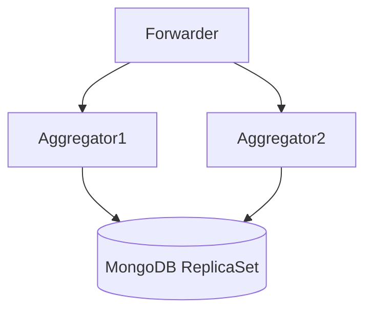

---

### 11.3 Aggregator/Forwarder 아키텍처
Forwarder와 Aggregator의 역할을 명확히 분리하면 시스템 안정성이 높아진다.

* **Forwarder**: 각 게임 서버에 설치. 로그를 수집하고 Aggregator로 전달. CPU/메모리 부담이 적고 가벼운 구성.
* **Aggregator**: 중앙 집중형 서버. 로그 필터링, 구조화, 저장소 전송을 담당. 고사양 서버를 배치하는 것이 일반적.

#### 예시 구성

```conf
# Forwarder
<match game.logs>
  @type forward
  <server>
    host aggregator01.local
    port 24224
  </server>
  <server>
    host aggregator02.local
    port 24224
  </server>
</match>
```

위 설정은 Forwarder가 두 개의 Aggregator로 로그를 전송하고, 한쪽이 장애가 나면 자동으로 다른 쪽으로 전송을 시도한다.

---

### 11.4 로드밸런싱 및 장애 복구 전략
Aggregator는 여러 대를 운영하는 것이 일반적이므로 로드밸런서를 반드시 고려해야 한다.

#### 로드밸런싱 방법

1. **DNS 라운드 로빈**: 단순하지만 장애 감지가 불가능하다.
2. **L4 로드밸런서**: TCP 단위로 부하를 분산. 장애 감지 가능.
3. **L7 로드밸런서**: HTTP input을 사용하는 경우에 적합. 세밀한 라우팅 지원.

#### 장애 복구 전략

* **Retry 메커니즘**: Fluentd의 `retry_wait`, `retry_max_times` 설정으로 자동 재전송을 보장한다.
* **Dead Letter Queue(DLQ)**: 실패한 로그를 별도 파일이나 큐(Kafka, RabbitMQ 등)에 저장하여 후속 처리.
* **모니터링 연동**: Prometheus와 Grafana로 Fluentd의 버퍼 사용량, 큐 적체, 에러율을 시각화.

---

## 요약

* **클러스터링**: 여러 Aggregator를 배치해 로그 부하를 분산.
* **고가용성**: Active-Active 또는 Active-Standby 구성 + file buffer로 데이터 유실 최소화.
* **Aggregator/Forwarder 아키텍처**: Forwarder는 가볍게, Aggregator는 집중 처리 전담.
* **로드밸런싱 & 장애 복구**: L4/L7 LB, Retry 전략, DLQ 활용으로 안정성 확보.

---
  
  
## 12. 성능 최적화 기법
로그 수집 시스템은 단순히 로그를 모으는 것에서 끝나지 않고, 대규모 게임 서버 환경에서도 안정적으로 작동해야 한다. 특히 200대 이상의 서버에서 초당 수천\~수만 건의 로그가 발생할 수 있기 때문에, Fluentd의 성능 최적화는 필수적이다. 이 장에서는 플러그인 사용 최적화, Buffer 및 Chunk 크기 조정, Disk I/O와 네트워크 병목 회피에 대해 다룬다.

---

### 12.1 플러그인 최소화와 효율적 사용
Fluentd의 성능은 사용하는 플러그인의 수와 종류에 큰 영향을 받는다. 불필요하게 많은 플러그인을 사용하면 파이프라인이 복잡해지고, CPU와 메모리 리소스를 많이 소모한다.

* **불필요한 필터 제거**
  예를 들어, 단순 포맷 변환이 필요한 경우에는 복잡한 커스텀 필터 대신 기본 제공되는 `record_transformer`를 사용한다.

* **출력 플러그인 최소화**
  한 번의 로그 전송에 여러 Output을 동시에 쓰는 대신, 중앙 저장소에 모아두고 이후에 분기 처리하는 아키텍처를 고려한다.

* **병렬 처리 고려**
  `out_forward` 플러그인은 멀티 워커 환경에서 높은 처리량을 제공하므로 대규모 환경에 적합하다.

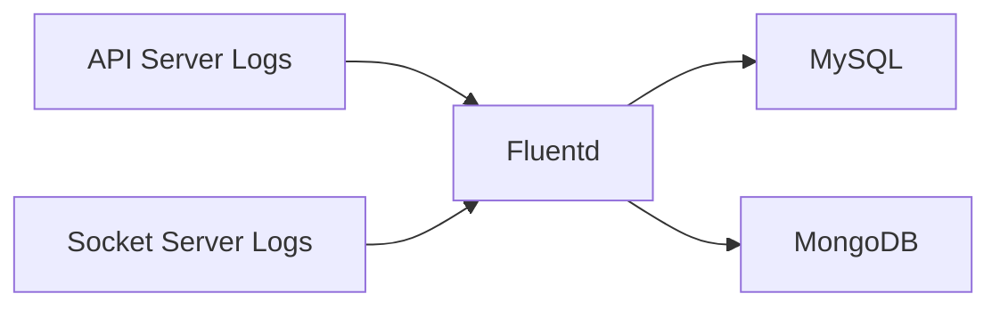

---

### 12.2 Buffer 및 Chunk 크기 조정
Fluentd는 로그를 일정량 모아서 Chunk 단위로 전송한다. Buffer와 Chunk 크기 조정은 성능 최적화의 핵심이다.

* **Buffer 유형 선택**

  * **Memory Buffer**: 속도는 빠르지만 장애 시 유실 위험이 크다.
  * **File Buffer**: 상대적으로 느리지만 안정적이며 대규모 환경에서 권장된다.
* **Chunk 크기 조정**

  * 너무 작은 크기: I/O 오버헤드 증가
  * 너무 큰 크기: 전송 지연 증가
    일반적으로 8MB \~ 32MB 정도가 적당하다.
* **Flush Interval 최적화**
  기본값(60초) 대신, 게임 서버 로그의 특성에 따라 5\~10초로 줄이면 지연 시간을 낮출 수 있다.

```ascii
+-------------------+
|   Log Producer    |
+-------------------+
          |
   [Buffering...]
          v
+-------------------+
|      Chunks       |  --> 전송 (MySQL/MongoDB)
+-------------------+
```

---

### 12.3 Disk I/O와 네트워크 병목 회피
대규모 서버 환경에서는 Disk I/O와 네트워크 대역폭이 가장 큰 병목 구간이 된다.

* **Disk I/O 최적화**

  * SSD 사용을 권장한다.
  * Buffer 경로를 전용 디스크로 분리하여 다른 프로세스와의 I/O 충돌을 줄인다.
* **네트워크 최적화**

  * 로그 전송은 압축(`gzip`, `lz4`)을 적용하면 네트워크 사용량을 크게 줄일 수 있다.
  * 대규모 환경에서는 **Forward 플러그인 + Aggregator 노드**를 사용하여 다수의 서버 로그를 중앙 Fluentd로 모은 후 DB에 저장한다.

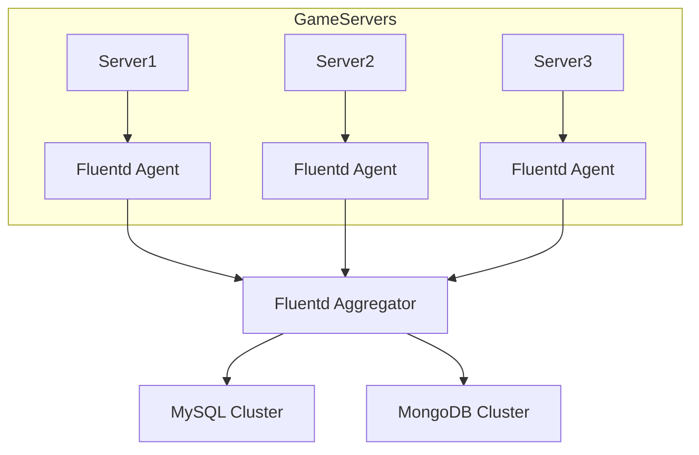

---

### 12.4 고성능을 위한 추가 팁

* **멀티 워커 활용**
  `fluentd -c fluent.conf -p plugins --workers=4` 와 같이 워커 수를 조정하여 CPU 코어를 효율적으로 사용한다.

* **플러그인별 쓰레드 설정**
  일부 플러그인(`in_tail`, `out_forward`)은 별도 쓰레드 설정으로 동시성을 높일 수 있다.

* **Serilog 설정 최적화**

  * 비동기 Sink 사용 (`WriteTo.Async`)
  * 로그 레벨 필터링으로 불필요한 로그 전송 방지

```csharp
Log.Logger = new LoggerConfiguration()
    .MinimumLevel.Information()
    .WriteTo.Async(a => a.File("logs/game.log"))
    .CreateLogger();
```

---

## 요약
성능 최적화는 작은 규모에서는 크게 체감되지 않지만, 수백 대 이상의 서버를 운영하는 환경에서는 필수적이다.
플러그인을 최소화하고, Buffer/Chunk를 적절히 조정하며, Disk I/O와 네트워크 병목을 줄이는 전략을 통해 Fluentd 기반 로그 수집 시스템은 안정적이면서도 고성능으로 동작할 수 있다.

---
  
       
## 13. 장애 대응과 모니터링
로그 수집 시스템은 정상적인 상황에서는 단순히 로그를 모아 전달하는 역할만 하지만, 장애 상황에서는 **로그 유실**, **재전송 실패**, **모니터링 부재** 등의 문제가 치명적으로 작용한다.
게임 서버 환경에서는 특히 서비스 중단이나 장애 시 로그가 문제 원인 분석의 유일한 단서가 되므로, Fluentd 운영에서 장애 대응과 모니터링 체계는 반드시 구축해야 한다.

이 장에서는 로그 유실 방지, Retry/Failover 전략, 그리고 Prometheus/Grafana를 이용한 모니터링 방식을 다룬다.

---

### 13.1 로그 유실 방지
로그 유실은 장애 분석을 어렵게 하고, 운영 인력의 대응 시간을 지연시킨다. Fluentd에서는 아래와 같은 기법으로 로그 유실을 최소화할 수 있다.

* **File Buffer 활용**
  메모리 버퍼만 사용할 경우 프로세스 다운 시 로그가 그대로 사라진다. 반드시 `@type file`을 사용해 디스크에 로그를 안전하게 저장하는 것이 권장된다.

  ```conf
  <buffer>
    @type file
    path C:/fluentd/buffer
    flush_interval 10s
    retry_forever true
  </buffer>
  ```

* **Retry Forever 옵션**
  기본적으로 Fluentd는 재전송 실패 시 몇 번의 재시도 후 로그를 폐기한다. `retry_forever true` 옵션을 사용하면 네트워크나 DB 장애 시 무한 재시도를 수행하여 로그 유실을 막는다.

* **로그 레벨 필터링**
  불필요한 Debug 레벨 로그까지 수집하면 저장소가 금방 가득 차 장애 발생 시 중요한 로그가 밀려버릴 수 있다.
  Serilog와 같은 애플리케이션 로깅 프레임워크에서 **로그 레벨 최소화**를 통해 로그를 선별적으로 수집해야 한다.

```csharp
Log.Logger = new LoggerConfiguration()
    .MinimumLevel.Information() // Debug 이하 로그는 수집하지 않음
    .WriteTo.File("logs/api.log")
    .CreateLogger();
```

---

### 13.2 Retry 및 Failover 전략
대규모 게임 서버 환경에서는 특정 로그 수신처(MySQL, MongoDB 등)가 장애가 날 수 있으며, 이 경우 Fluentd의 Failover 설정이 중요하다.

* **다중 출력(Failover 설정)**
여러 Output을 지정하는 `copy`는 기본적으로 fan-out 용도이며, 첫 번째 출력 실패 시 두 번째 출력으로만 자동 전환되는 failover 구성이 아니다. 장애 대피용 출력은 `<secondary>`를 사용하거나, Fluentd 간 전송에서는 `out_forward`의 `standby` 서버를 사용한다.

  ```conf
  <match game.logs>
    @type copy
    <store>
      @type mysql
      host db1.local
    </store>
    <store>
      @type mysql
      host db2.local
      # copy 플러그인에는 secondary true를 쓰지 않는다.
      # 장애 대피용 출력은 <secondary> 또는 out_forward의 standby 서버를 사용한다.
    </store>
  </match>
  ```

* **Retry Interval Backoff**
  단순히 빠르게 재시도만 하면 DB나 네트워크에 더 큰 부하를 줄 수 있다.
  `retry_wait`와 `retry_max_interval`을 설정해 점진적으로 대기 시간을 늘리는 방식이 효과적이다.

  ```conf
  <buffer>
    retry_wait 5s
    retry_max_interval 5m
  </buffer>
  ```

* **Aggregator 노드 도입**
  200대 이상의 서버에서 발생하는 로그를 모두 직접 DB에 전송하면 DB가 병목이 될 수 있다.
  Aggregator Fluentd를 두어 서버별 로그를 모으고, Aggregator에서 최종 DB로 Retry/Failover를 관리하는 방식이 안정적이다.

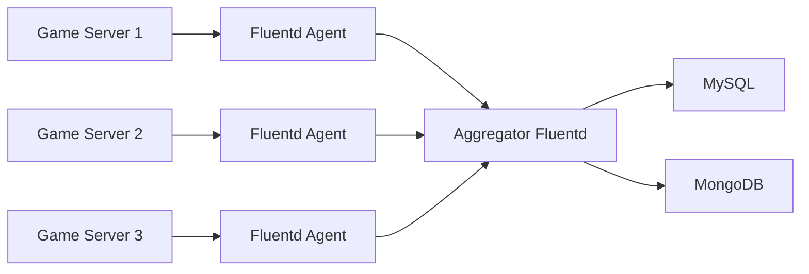

---

### 13.3 Prometheus, Grafana로 모니터링
장애 상황을 빠르게 감지하고 대응하기 위해서는 실시간 모니터링이 필수적이다. Fluentd는 `fluent-plugin-prometheus` 플러그인을 통해 메트릭을 노출할 수 있다.

* **Prometheus Exporter 설정**

  ```conf
  <source>
    @type prometheus
    bind 0.0.0.0
    port 24231
  </source>
  ```

  이 설정을 추가하면 `http://localhost:24231/metrics`에서 Fluentd 내부 메트릭을 수집할 수 있다.

* **주요 모니터링 지표**

  * `fluentd_output_status_emit_count`: 전송된 로그 수
  * `fluentd_output_status_retry_count`: Retry 횟수
  * `fluentd_buffer_queue_length`: Buffer에 쌓인 Chunk 수
  * `fluentd_output_status_emit_records`: 초당 로그 처리량

* **Grafana 대시보드 예시**

```mermaid
graph TD
  Prometheus --> Grafana
  Fluentd --> Prometheus
  Grafana --> Admin[운영자 알림 (Slack/Email)]
```

Grafana에서 알람 조건을 설정해 **Retry 횟수 급증**이나 **Buffer 큐 길이 폭증** 같은 이상 상황이 발생하면 Slack/Email로 알림을 받을 수 있다.

---

## 요약

* 로그 유실을 막기 위해 **File Buffer**, **Retry Forever**를 활용하고 Serilog에서 로그 레벨을 제한해야 한다.
* Failover 전략으로는 **다중 Output**, **Retry Backoff**, **Aggregator 도입**이 효과적이다.
* Prometheus와 Grafana를 통해 **전송 지연, 재시도 횟수, 처리량**을 시각화하고, 알람을 통해 운영자가 즉시 대응할 수 있게 해야 한다.

---
  
  
## 14. 보안 및 운영 관리
로그는 단순한 개발 정보 이상의 의미를 가진다. 게임 서버 환경에서는 사용자 행동 데이터, 결제 기록, 서버 성능 정보 등이 로그로 남는데, 이 정보는 보안적으로 민감하다. 따라서 로그를 수집·전송할 때 반드시 보안과 운영 관리 정책을 고려해야 한다. 본 장에서는 **전송 구간 암호화(SSL/TLS)**, **접근 제어 및 인증**, **로그 보관 주기와 아카이빙**을 중심으로 설명한다.

---

### 14.1 전송 구간 암호화 (SSL/TLS)
로그가 네트워크를 통해 전송되는 과정에서 중간에 탈취될 수 있다. 이를 방지하기 위해 Fluentd는 Forward 입력/출력에서 TLS 암호화를 지원한다.

* **Agent → Aggregator 구간 암호화**

  송신 측 `out_forward` 예시:

  ```conf
  <match game.logs>
    @type forward
    transport tls
    tls_cert_path C:/fluentd/certs/ca.crt

    <server>
      host aggregator.local
      port 24224
    </server>
  </match>
  ```

  수신 측 `in_forward` 예시:

  ```conf
  <source>
    @type forward
    port 24224
    <transport tls>
      cert_path C:/fluentd/certs/server.crt
      private_key_path C:/fluentd/certs/server.key
    </transport>
  </source>
  ```

  상호 TLS 인증이 필요하면 수신 측에는 `client_cert_auth true`와 `ca_path`를 추가하고, 송신 측에는 `tls_client_cert_path`, `tls_client_private_key_path`를 사용한다.

* **운영 시 주의사항**

  * 자체 CA를 운영하거나 신뢰 가능한 CA 인증서를 사용할 수 있다.
  * TLS 버전은 `1.2` 이상을 권장한다.
  * 인증서 갱신 주기를 자동화하고, 호스트명 검증이 실패하지 않도록 인증서의 CN/SAN과 `<server host>` 값을 맞춘다.

```ascii
[Game Server] ---TLS---> [Fluentd Aggregator] ---TLS---> [DB(MySQL/MongoDB)]
```

---

### 14.2 접근 제어 및 인증
로그 수집 파이프라인은 외부에서 접근할 수 없는 폐쇄망으로 운영하는 것이 이상적이다. 하지만 실제 운영에서는 방화벽 설정, 내부 인증 체계가 필요하다.

* **IP/네트워크 기반 접근 제어**

  Fluentd의 `in_forward`에서는 `<security>` 안에 `<client>`를 두어 허용할 호스트나 네트워크를 지정한다. 단순히 `allow 192.168.0.0/24`처럼 쓰는 설정은 공식 `in_forward` 설정 형식이 아니다.

  ```conf
  <source>
    @type forward
    port 24224
    bind 0.0.0.0
    <security>
      self_hostname aggregator.local
      shared_key change_me
      allow_anonymous_source false
      <client>
        network 192.168.0.0/24
        shared_key change_me
      </client>
      <client>
        network 10.0.0.0/16
        shared_key change_me
      </client>
    </security>
  </source>
  ```

* **인증 방식**

  * 현재 Fluentd의 `forward` 입력/출력은 shared key, 사용자 인증, TLS, mTLS를 지원한다.
  * 오래된 `fluent-plugin-secure-forward` 중심으로 새 구성을 설명하기보다는, 내장 `forward` 플러그인의 TLS/mTLS와 `<security>` 설정을 우선 사용한다.

* **운영 체크리스트**

  * 관리자 계정의 비밀번호는 주기적으로 변경한다.
  * Windows 환경에서는 \*\*서비스 계정(전용 OS 사용자)\*\*를 만들어 Fluentd를 실행한다.
  * 로그 저장 DB(MySQL/MongoDB)는 반드시 **DB 계정 분리** 및 최소 권한 원칙을 따른다.

---

### 14.3 로그 보관 주기와 아카이빙
게임 로그는 시간이 지남에 따라 빠르게 누적된다. 보관 정책이 없다면 저장소는 금방 포화되고, 장애 분석에 필요한 중요한 로그를 잃을 수 있다.

* **보관 주기 정책**

  * 운영 로그: 30일 보관
  * 보안/결제 관련 로그: 6개월\~1년 보관
  * 감사 목적 로그: 3년 이상 보관

  실제 보관 기간은 법적 규제와 회사 보안 정책에 따라 달라진다.

* **아카이빙 방법**

  * 일정 기간이 지난 로그를 \*\*압축(gzip, lz4)\*\*하여 스토리지로 이전한다.
  * 장기 보관은 저비용 스토리지(AWS S3, Azure Blob, 온프레미스 NAS)를 사용한다.
  * Fluentd에서는 `out_s3`, `out_gcs` 플러그인을 사용해 자동 아카이빙이 가능하다.

  ```conf
  <match game.logs.archive>
    @type s3
    aws_key_id YOUR_AWS_KEY
    aws_sec_key YOUR_AWS_SECRET
    s3_bucket game-log-archive
    path logs/%Y/%m/%d/
    store_as gzip
  </match>
  ```

* **MongoDB/MySQL에서의 보관 정책**

  * 파티션 테이블 또는 TTL 인덱스를 사용해 자동으로 오래된 데이터를 삭제한다.
  * MongoDB 예시:

    ```js
    db.game_logs.createIndex({ "createdAt": 1 }, { expireAfterSeconds: 2592000 }) // 30일
    ```

---

### 14.4 보안 운영 아키텍처 예시

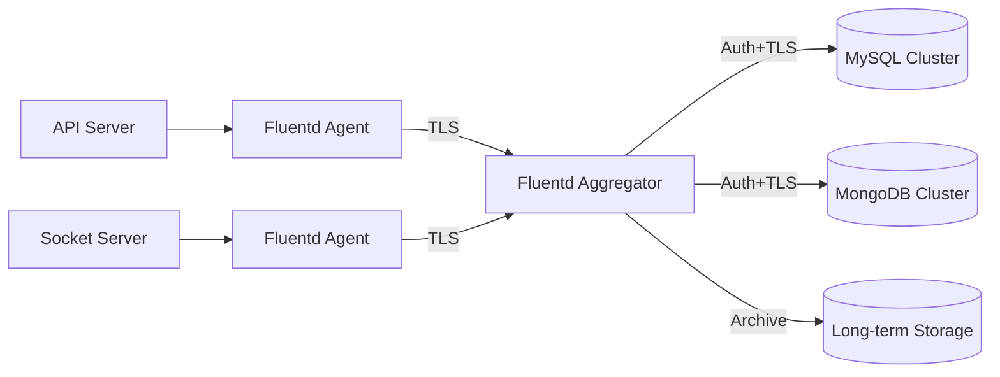

---

## 요약

* **전송 구간 보안**: TLS를 사용하여 로그가 외부에서 탈취되지 않도록 한다.
* **접근 제어 및 인증**: IP 제한, 인증서 기반 인증, 최소 권한 원칙을 준수한다.
* **로그 보관 및 아카이빙**: 운영, 보안, 감사 로그마다 보관 주기를 설정하고, S3나 NAS 같은 장기 스토리지로 이전한다.

---
  
  
## 부록
이 부록에서는 책의 본문에서 다룬 내용을 정리하고, 실습 시 바로 참고할 수 있는 자료들을 제공한다. 신입 게임 서버 개발자가 실제 업무나 프로젝트 환경에서 바로 활용할 수 있도록 **플러그인 정리표**, **Serilog Sink 예제**, **아키텍처 다이어그램 모음**, **실습 코드 샘플**을 담았다.

---

### A. Fluentd 주요 플러그인 정리표

Fluentd는 플러그인 기반으로 확장된다. 여기서는 게임 서버 로그 처리 시 자주 쓰이는 주요 플러그인을 간단한 설명과 함께 정리한다.

| 분류         | 플러그인                           | 설명                                     |
| ---------- | ------------------------------ | -------------------------------------- |
| 입력(Input)  | `in_tail`                      | 파일 로그를 tail 방식으로 읽음 (ex: API 서버 로그 파일) |
|            | `in_tcp`, `in_udp`             | TCP/UDP를 통해 직접 로그를 수신                  |
|            | `in_http`                      | HTTP 요청으로 로그를 수신                       |
| 출력(Output) | `out_forward`                  | 다른 Fluentd 노드로 로그 전달                   |
|            | `out_file`                     | 파일로 로그 저장                              |
|            | `out_mongo`                    | MongoDB로 로그 저장                         |
|            | `out_mysql`                    | MySQL로 로그 저장                           |
|            | `out_s3`                       | AWS S3에 로그 아카이빙                        |
| 필터(Filter) | `record_transformer`           | 로그 레코드 필드 추가/수정                        |
|            | `grep`                         | 정규 표현식으로 로그 필터링                        |
| 모니터링       | `fluent-plugin-prometheus`     | Prometheus 지표 제공                       |
| 보안/전송      | 내장 `forward` TLS/mTLS 설정    | TLS/인증 기반 안전한 전송                       |

---

### B. Serilog 주요 Sink 및 설정 샘플

게임 서버 로그를 수집할 때 Serilog를 사용하면 다양한 Sink를 통해 Fluentd와 쉽게 연동할 수 있다.

#### 파일 로그 출력 (Fluentd `in_tail`과 연동)

```csharp
Log.Logger = new LoggerConfiguration()
    .MinimumLevel.Information()
    .WriteTo.File("logs/game-api.log", rollingInterval: RollingInterval.Day)
    .CreateLogger();
```

#### 파일 로그 출력 후 Fluentd `in_tail`과 연동

```csharp
Log.Logger = new LoggerConfiguration()
    .WriteTo.File(
        new CompactJsonFormatter(),
        "logs/game-api-.log",
        rollingInterval: RollingInterval.Day)
    .CreateLogger();
```

단순 TCP 문자열 전송은 `in_forward`가 아니라 `in_tcp`와 맞춰야 한다. Forward 프로토콜을 쓰려면 해당 프로토콜을 구현한 클라이언트나 다른 Fluentd의 `out_forward`를 사용한다.

#### 비동기 Sink (성능 최적화)

```csharp
Log.Logger = new LoggerConfiguration()
    .WriteTo.Async(a => a.File("logs/socket-server.log"))
    .CreateLogger();
```

---

### C. ASCII 아트 & Mermaid 다이어그램으로 보는 아키텍처 예시

#### 1) 작은 규모 (API 서버 → Fluentd → MySQL)

```ascii
+-------------+     +-------------+     +-------------+
|   API App   | --> |   Fluentd   | --> |   MySQL DB  |
+-------------+     +-------------+     +-------------+
```

---

#### 2) 대규모 환경 (200대 서버, Aggregator 도입)

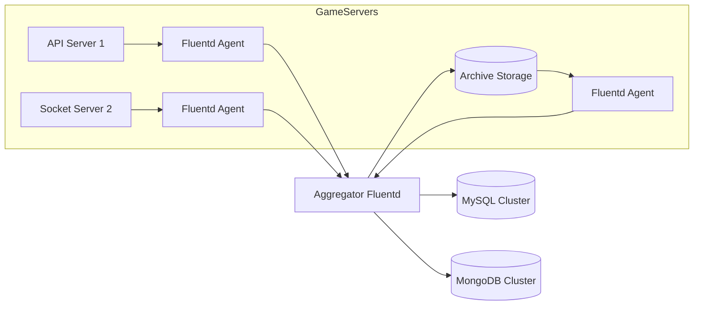

---

### D. 실습 예제 코드 모음

#### 1) API 서버 (C# ASP.NET Core)

```csharp
[ApiController]
[Route("api/[controller]")]
public class GameController : ControllerBase
{
    private readonly ILogger<GameController> _logger;

    public GameController(ILogger<GameController> logger)
    {
        _logger = logger;
    }

    [HttpGet("status")]
    public IActionResult GetStatus()
    {
        _logger.LogInformation("Game server status checked at {time}", DateTime.UtcNow);
        return Ok(new { status = "running" });
    }
}
```

#### 2) Socket 서버 (C#)

```csharp
var listener = new TcpListener(IPAddress.Any, 5000);
listener.Start();

while (true)
{
    var client = await listener.AcceptTcpClientAsync();
    Task.Run(async () =>
    {
        using var stream = client.GetStream();
        var buffer = new byte[1024];
        int bytesRead = await stream.ReadAsync(buffer, 0, buffer.Length);
        var message = Encoding.UTF8.GetString(buffer, 0, bytesRead);
        Log.Information("Received socket message: {Message}", message);
    });
}
```

#### 3) Fluentd 설정 (Windows 예제)

```conf
<source>
  @type tail
  path C:/logs/game-api*.log
  pos_file C:/fluentd/pos/api.pos
  tag game.api
  <parse>
    @type json
  </parse>
</source>

<match game.api>
  @type mysql
  host localhost
  database game_logs
  username root
  password secret
</match>
```

---

## 요약

* 부록에서는 **Fluentd 주요 플러그인**, **Serilog Sink 설정 예제**, **아키텍처 다이어그램**, **실습 예제 코드**를 정리했다.
* 작은 규모의 개발 환경부터 200대 이상의 대규모 서버 운영까지, 실습 코드와 설정 예시는 신입 개발자가 바로 따라 할 수 있도록 준비되었다.  