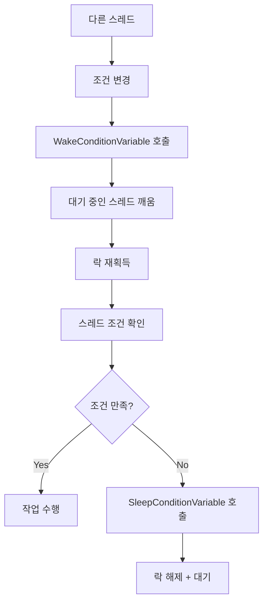
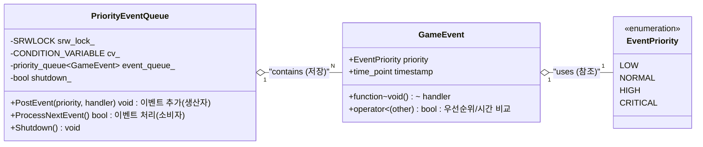
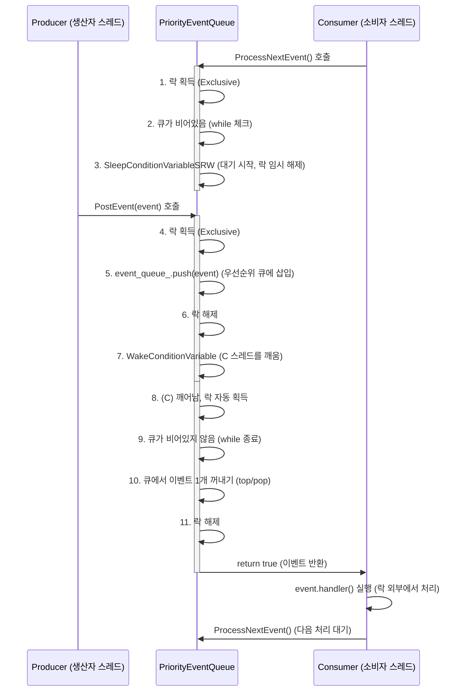
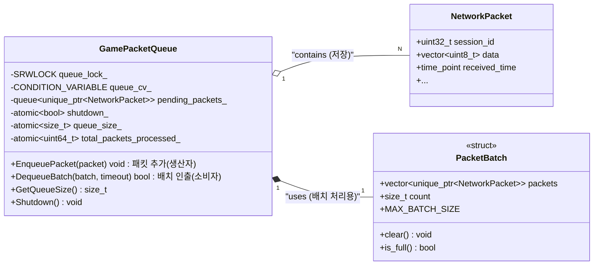
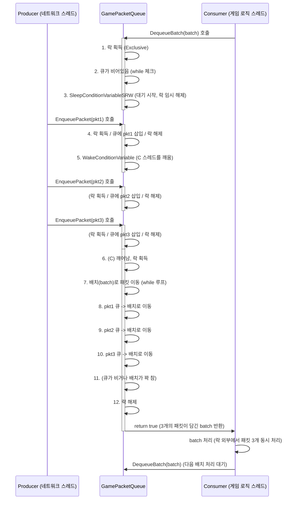

# 모던 Windows 멀티스레딩: 게임 서버 개발자를 위한 고성능 동시성 프로그래밍  

저자: 최흥배, Claude AI   
    
권장 개발 환경
- **IDE**: Visual Studio 2022 (Community 이상)
- **컴파일러**: MSVC v143 (C++20 지원)
- **OS**: Windows 10 이상

-----  
  
# 4장. Condition Variables
Condition Variables는 Windows Vista/Server 2008에서 도입된 동기화 기법으로, 스레드가 특정 조건이 만족될 때까지 효율적으로 대기할 수 있게 해준다. 전통적인 이벤트 객체나 세마포어와 달리, Critical Section이나 SRW Lock과 함께 사용되어 원자적(atomic) 조건 검사와 대기를 제공한다.



## 4.1 생산자-소비자 패턴의 효율적 구현
게임 서버에서 가장 흔히 볼 수 있는 패턴 중 하나가 생산자-소비자 패턴이다. 네트워크 스레드가 패킷을 수신하여 큐에 넣고(생산자), 게임 로직 스레드가 이를 처리하는(소비자) 구조가 대표적이다.
 
### 기본 API 이해

```cpp
#include <windows.h>
#include <queue>
#include <memory>

class ConditionVariableDemo {
private:
    CRITICAL_SECTION cs_;
    CONDITION_VARIABLE cv_;
    std::queue<int> data_queue_;
    bool shutdown_ = false;

public:
    ConditionVariableDemo() {
        InitializeCriticalSection(&cs_);
        InitializeConditionVariable(&cv_);
    }

    ~ConditionVariableDemo() {
        DeleteCriticalSection(&cs_);
        // CONDITION_VARIABLE는 정리가 필요하지 않음
    }

    void Producer(int value) {
        EnterCriticalSection(&cs_);
        data_queue_.push(value);
        LeaveCriticalSection(&cs_);
        
        // 대기 중인 소비자 스레드 하나를 깨움
        WakeConditionVariable(&cv_);
    }

    bool Consumer(int& result) {
        EnterCriticalSection(&cs_);
        
        // 조건이 만족될 때까지 대기
        while (data_queue_.empty() && !shutdown_) {
            // 원자적으로 락을 해제하고 대기
            SleepConditionVariableCS(&cv_, &cs_, INFINITE);
        }
        
        if (shutdown_ && data_queue_.empty()) {
            LeaveCriticalSection(&cs_);
            return false;
        }
        
        result = data_queue_.front();
        data_queue_.pop();
        LeaveCriticalSection(&cs_);
        return true;
    }

    void Shutdown() {
        EnterCriticalSection(&cs_);
        shutdown_ = true;
        LeaveCriticalSection(&cs_);
        
        // 모든 대기 중인 스레드를 깨움
        WakeAllConditionVariable(&cv_);
    }
};
```

### SRW Lock과의 조합
성능이 중요한 게임 서버에서는 SRW Lock과 함께 사용하는 것이 더 효율적이다:

```cpp
class HighPerformanceQueue {
private:
    SRWLOCK srw_lock_;
    CONDITION_VARIABLE cv_;
    std::queue<std::unique_ptr<GamePacket>> packet_queue_;
    
public:
    HighPerformanceQueue() {
        InitializeSRWLock(&srw_lock_);
        InitializeConditionVariable(&cv_);
    }

    void Enqueue(std::unique_ptr<GamePacket> packet) {
        AcquireSRWLockExclusive(&srw_lock_);
        packet_queue_.push(std::move(packet));
        ReleaseSRWLockExclusive(&srw_lock_);
        
        WakeConditionVariable(&cv_);
    }

    std::unique_ptr<GamePacket> Dequeue() {
        AcquireSRWLockExclusive(&srw_lock_);
        
        while (packet_queue_.empty()) {
            SleepConditionVariableSRW(&cv_, &srw_lock_, INFINITE, 0);
        }
        
        auto packet = std::move(packet_queue_.front());
        packet_queue_.pop();
        ReleaseSRWLockExclusive(&srw_lock_);
        
        return packet;
    }
};
```


## 4.2 게임 서버의 이벤트 큐 설계
게임 서버에서는 다양한 종류의 이벤트를 처리해야 한다. 플레이어 액션, 타이머 이벤트, 네트워크 이벤트 등이 있으며, 이들을 효율적으로 처리하기 위한 이벤트 큐 설계가 중요하다.

```
                    Event Queue Architecture
    
    [Network Thread]     [Timer Thread]     [AI Thread]
           |                    |                |
           v                    v                v
    ┌─────────────────────────────────────────────────────┐
    │                Event Queue                          │
    │  ┌─────┐ ┌─────┐ ┌─────┐ ┌─────┐ ┌─────┐ ┌─────┐    │
    │  │ Pkt │ │Timer│ │ AI  │ │Move │ │Chat │ │...  │    │
    │  └─────┘ └─────┘ └─────┘ └─────┘ └─────┘ └─────┘    │
    └─────────────────────────────────────────────────────┘
                              |
                              v
                    [Game Logic Thread]
```
  

### 우선순위 기반 이벤트 큐

```cpp
// std::priority_queue (우선순위 큐) 컨테이너를 사용하기 위해 포함한다.
#include <priority_queue> 
// std::chrono (시간 관련) 기능을 사용하기 위해 포함한다.
#include <chrono> 
// (추정) std::function을 사용하기 위해 <functional> 헤더가 필요하다.
// (추정) SRWLOCK, CONDITION_VARIABLE 등 Windows 동기화 객체를 사용하기 위해 <windows.h> 헤더가 필요하다.

// 이벤트의 우선순위를 정의하는 열거형 클래스다. 값이 클수록 우선순위가 높다.
enum class EventPriority : int {
    LOW = 0,      // 낮음
    NORMAL = 1,   // 보통
    HIGH = 2,     // 높음
    CRITICAL = 3  // 매우 높음 (치명적)
};

// 큐에 저장될 게임 이벤트 구조체다.
struct GameEvent {
    EventPriority priority; // 이벤트 우선순위다.
    std::chrono::steady_clock::time_point timestamp; // 이벤트가 생성된 시간(타임스탬프)이다.
    std::function<void()> handler; // 이벤트가 처리될 때 실행될 함수(핸들러)다.
    
    // 우선순위 큐(std::priority_queue)는 기본적으로 max-heap (큰 값이 위로 감)으로 동작한다.
    // 이 비교 연산자(operator<)는 'less than'을 정의한다.
    // 'true'를 반환하면 'other'가 'this'보다 더 높은 우선순위(더 큰 값)를 갖는 것으로 간주된다.
    bool operator<(const GameEvent& other) const {
        // 1. 우선순위(priority)가 다르면, 우선순위가 *낮은* 쪽이 'less than' (true)이다.
        //    결과적으로 우선순위가 *높은* 이벤트가 큐의 top(최상단)에 오게 된다.
        if (priority != other.priority) {
            return priority < other.priority; // priority 값이 작은 것(LOW)이 'less'다.
        }
        // 2. 우선순위가 같다면, 타임스탬프를 비교한다.
        //    타임스탬프가 *느린*(최근) 쪽이 'less than' (true)이다.
        //    결과적으로 타임스탬프가 *빠른*(이전) 이벤트가 큐의 top에 오게 된다.
        return timestamp > other.timestamp; // timestamp 값이 큰 것(나중 시간)이 'less'다.
    }
};

// 스레드 안전(thread-safe)한 우선순위 이벤트 큐 클래스다.
class PriorityEventQueue {
private:
    // 큐 접근을 보호하기 위한 Windows Slim Reader/Writer 락이다.
    // 'mutable' 키워드는 const 멤버 함수 내에서도 락 상태 변경이 가능하도록 하지만, 이 코드에서는 사용되지 않는다.
    mutable SRWLOCK srw_lock_; 
    // 큐가 비어있을 때 스레드를 대기시키거나, 새 이벤트가 추가될 때 스레드를 깨우기 위한 조건 변수다.
    CONDITION_VARIABLE cv_;   
    // 실제 이벤트를 저장하는 우선순위 큐 컨테이너다.
    std::priority_queue<GameEvent> event_queue_; 
    // 큐가 종료 상태인지 나타내는 플래그다.
    bool shutdown_ = false; 

public:
    // 생성자: 동기화 객체(락과 조건 변수)를 초기화한다.
    PriorityEventQueue() {
        InitializeSRWLock(&srw_lock_); // SRW 락을 초기화한다.
        InitializeConditionVariable(&cv_); // 조건 변수를 초기화한다.
    }

    // (참고: 이 클래스는 RAII를 따르지 않으므로, 소멸자에서 
    //  락이나 조건 변수 해제(예: DeleteCriticalSection)가 필요할 수 있으나,
    //  SRWLOCK과 CONDITION_VARIABLE은 명시적 해제 함수가 필요 없다.)

    // 큐에 새 이벤트를 추가(post)하는 함수다. (생산자 스레드에서 호출)
    void PostEvent(EventPriority priority, std::function<void()> handler) {
        // 전달받은 인자로 GameEvent 객체를 생성한다.
        GameEvent event{
            priority, // 우선순위
            std::chrono::steady_clock::now(), // 현재 시간(타임스탬프)
            std::move(handler) // 핸들러 함수 (소유권 이동)
        };

        // 큐(event_queue_)에 접근하기 위해 배타적(Exclusive) 락을 획득한다. (쓰기 작업)
        AcquireSRWLockExclusive(&srw_lock_);
        event_queue_.push(std::move(event)); // 이벤트를 큐에 추가한다. (소유권 이동)
        ReleaseSRWLockExclusive(&srw_lock_); // 락을 해제한다.

        // 큐에 새 이벤트가 추가되었음을 대기 중인 스레드(ProcessNextEvent)에 알린다.
        WakeConditionVariable(&cv_); // 대기 중인 스레드 중 '하나'를 깨운다.
    }

    // 큐에서 다음 이벤트를 가져와 처리한다. (소비자 스레드에서 호출)
    // 이벤트가 없으면 큐가 종료되거나 새 이벤트가 들어올 때까지 대기한다.
    bool ProcessNextEvent() {
        // 큐에 접근하기 위해 배타적 락을 획득한다. (큐에서 데이터를 꺼내야 하므로)
        AcquireSRWLockExclusive(&srw_lock_);
        
        // 'spurious wakeup'(가짜 깨어남)에 대비하고,
        // 큐가 비어있고(empty) 아직 종료(shutdown) 상태가 아닌 동안 반복적으로 대기한다.
        while (event_queue_.empty() && !shutdown_) {
            // 조건 변수를 사용하여 대기 상태로 들어간다.
            // SleepConditionVariableSRW 함수는 대기하는 동안 자동으로 락(srw_lock_)을 해제하고,
            // 깨어나면(Wake) 자동으로 락을 다시 획득한다.
            SleepConditionVariableSRW(&cv_, &srw_lock_, INFINITE, 0);
        }
        
        // 큐가 종료되었고(shutdown) 큐가 비어있다면,
        // 더 이상 처리할 이벤트가 없으므로 락을 해제하고 false를 반환한다.
        if (shutdown_ && event_queue_.empty()) {
            ReleaseSRWLockExclusive(&srw_lock_);
            return false; // 소비자 스레드의 처리 루프를 종료시키기 위한 신호다.
        }
        
        // (이 시점에서는 shutdown_이 true여도 큐에 남은 이벤트가 있거나, 
        //  shutdown_이 false이고 큐에 이벤트가 있다.)
        
        // 큐의 top(가장 우선순위 높은 이벤트)에 접근한다.
        // std::priority_queue::top()은 const 참조를 반환하므로,
        // std::move를 사용하기 위해 const_cast로 const 한정자를 제거한다. (데이터 이동 최적화)
        GameEvent event = std::move(const_cast<GameEvent&>(event_queue_.top()));
        event_queue_.pop(); // 큐에서 해당 이벤트를 제거한다.
        ReleaseSRWLockExclusive(&srw_lock_); // 큐 조작이 끝났으므로 락을 즉시 해제한다.
        
        // *** 중요: 락을 보유하지 않은 상태(락 밖)에서 이벤트 핸들러를 호출한다. ***
        // (이유: 만약 락을 쥔 채 핸들러를 호출하면, 해당 핸들러 내부에서
        //  다시 PostEvent 등을 호출할 경우 데드락(deadlock)이 발생할 수 있다.)
        event.handler();
        return true; // 이벤트 처리가 성공했음을 알린다. (루프 계속)
    }

    // 이벤트 큐를 종료한다.
    void Shutdown() {
        // 락을 획득하여 shutdown_ 플래그를 스레드 안전하게 변경한다.
        AcquireSRWLockExclusive(&srw_lock_);
        shutdown_ = true; // 종료 플래그를 true로 설정한다.
        ReleaseSRWLockExclusive(&srw_lock_);
        
        // 큐가 비어있어서 대기(SleepConditionVariableSRW) 중일 수 있는
        // '모든' 스레드를 깨운다. (ProcessNextEvent 스레드들)
        WakeAllConditionVariable(&cv_);
    }
};
```
  

## 4.3 실전 예제: 패킷 처리 큐 구현
실제 게임 서버에서 사용할 수 있는 고성능 패킷 처리 큐를 구현해보겠다. 이 예제는 네트워크 I/O 스레드에서 수신한 패킷을 게임 로직 스레드로 전달하는 역할을 한다.

```cpp  
#include <vector> // std::vector를 사용하기 위해 포함한다.
#include <atomic> // std::atomic (원자적 연산)을 사용하기 위해 포함한다.
#include <memory> // std::unique_ptr (스마트 포인터)를 사용하기 위해 포함한다.
// (추정) std::chrono, std::queue, windows.h 헤더가 필요하다.

// 네트워크 패킷을 정의하는 구조체다.
struct NetworkPacket {
    uint32_t session_id; // 세션 ID다.
    uint16_t packet_type; // 패킷의 종류(타입)다.
    uint16_t packet_size; // 패킷의 크기다.
    std::vector<uint8_t> data; // 패킷의 실제 데이터(payload)다.
    std::chrono::steady_clock::time_point received_time; // 패킷이 큐에 추가된 시간이다.
};

// 스레드 안전한 게임 패킷 큐 클래스다.
class GamePacketQueue {
private:
    // 패킷을 일괄(배치) 처리하기 위한 내부 구조체다.
    struct PacketBatch {
        // 패킷들을 소유권(unique_ptr)을 가진 벡터로 저장한다.
        std::vector<std::unique_ptr<NetworkPacket>> packets;
        // 현재 배치에 포함된 패킷의 수다.
        size_t count = 0;
        // 배치의 최대 크기를 64로 정의한다.
        static constexpr size_t MAX_BATCH_SIZE = 64;
        
        // 배치를 초기화(비우기)하는 함수다.
        void clear() {
            packets.clear(); // 벡터를 비운다.
            count = 0; // 카운트를 0으로 리셋한다.
        }
        
        // 배치가 가득 찼는지 확인하는 함수다.
        bool is_full() const {
            return count >= MAX_BATCH_SIZE;
        }
    };

    // 큐 접근을 제어하기 위한 SRW(Slim Reader/Writer) 락이다.
    // 'mutable'은 const 함수 내에서도 락 상태 변경을 허용하지만, 여기서는 const 함수가 락을 잡지 않는다.
    mutable SRWLOCK queue_lock_;
    // 큐가 비어있을 때 스레드를 대기시키기 위한 조건 변수다.
    CONDITION_VARIABLE queue_cv_;
    
    // 실제 패킷들을 저장하는 표준 큐(Queue)다. (FIFO)
    std::queue<std::unique_ptr<NetworkPacket>> pending_packets_;
    // 큐의 종료 상태를 나타내는 원자적(atomic) 불리언 변수다.
    std::atomic<bool> shutdown_{false};
    // 현재 큐의 크기를 나타내는 원자적 변수다. (락 없이 크기를 읽기 위함이다.)
    std::atomic<size_t> queue_size_{0};
    
    // --- 통계 정보 ---
    // 지금까지 처리한 총 패킷 수를 원자적으로 계산한다.
    std::atomic<uint64_t> total_packets_processed_{0};
    // 패킷 처리를 위해 대기한 총 시간(밀리초)을 원자적으로 계산한다.
    std::atomic<uint64_t> total_wait_time_ms_{0};

public:
    // 생성자: 락과 조건 변수를 초기화한다.
    GamePacketQueue() {
        InitializeSRWLock(&queue_lock_);
        InitializeConditionVariable(&queue_cv_);
    }

    // 큐에 패킷을 추가한다. (주로 네트워크 스레드, 즉 생산자 스레드에서 호출된다.)
    void EnqueuePacket(std::unique_ptr<NetworkPacket> packet) {
        // 큐가 종료(shutdown) 상태이면, 더 이상 패킷을 받지 않고 즉시 반환한다.
        // memory_order_relaxed: 가장 약한 메모리 순서. 이 스레드 내의 순서만 보장된다.
        if (shutdown_.load(std::memory_order_relaxed)) {
            return;
        }

        // 패킷이 큐에 들어온 시간을 기록한다.
        packet->received_time = std::chrono::steady_clock::now();

        // 큐(pending_packets_)에 쓰기 작업을 하기 위해 배타적(Exclusive) 락을 획득한다.
        AcquireSRWLockExclusive(&queue_lock_);
        pending_packets_.push(std::move(packet)); // 패킷의 소유권을 큐로 이동(move)시킨다.
        // 큐 크기를 원자적으로 1 증가시킨다. (relaxed 순서 사용)
        queue_size_.fetch_add(1, std::memory_order_relaxed);
        ReleaseSRWLockExclusive(&queue_lock_); // 락을 해제한다.

        // 큐에 새 패킷이 추가되었음을 대기 중인 스레드(소비자) '하나'에 알린다(wake).
        WakeConditionVariable(&queue_cv_);
    }

    // 큐에서 패킷을 배치(일괄) 단위로 꺼내온다. (주로 게임 로직 스레드, 즉 소비자 스레드에서 호출된다.)
    // timeout_ms 만큼 대기하며, 기본값은 무한 대기(INFINITE)다.
    bool DequeueBatch(PacketBatch& batch, uint32_t timeout_ms = INFINITE) {
        // 전달받은 배치를 우선 비운다.
        batch.clear();
        
        // 대기 시간 측정을 위해 시작 시간을 기록한다.
        auto start_time = std::chrono::steady_clock::now();
        
        // 큐에서 패킷을 꺼내기 위해 배타적 락을 획득한다.
        AcquireSRWLockExclusive(&queue_lock_);
        
        // 큐가 비어있고(empty) 종료 상태(shutdown)가 아닌 동안 대기한다.
        while (pending_packets_.empty() && !shutdown_.load(std::memory_order_relaxed)) {
            // 조건 변수를 사용해 대기한다. (대기 중 락은 자동으로 해제된다.)
            DWORD result = SleepConditionVariableSRW(&queue_cv_, &queue_lock_, timeout_ms, 0);
            // 대기 결과가 타임아웃(ERROR_TIMEOUT)이면,
            if (result == 0 && GetLastError() == ERROR_TIMEOUT) {
                ReleaseSRWLockExclusive(&queue_lock_); // 락을 해제하고,
                return false; // 패킷을 꺼내지 못했음(false)을 알린다.
            }
        }
        
        // (이 시점엔 큐에 패킷이 있거나, 큐가 종료되었거나, 둘 다일 수 있다.)
        // 큐(pending_packets_)가 비어있지 않고 배치가 가득 차지 않은 동안 반복한다.
        while (!pending_packets_.empty() && !batch.is_full()) {
            // 큐의 맨 앞(front) 패킷을 배치로 이동(move)시킨다.
            batch.packets.push_back(std::move(pending_packets_.front()));
            pending_packets_.pop(); // 큐에서 패킷을 제거한다.
            batch.count++; // 배치 카운트를 증가시킨다.
            queue_size_.fetch_sub(1, std::memory_order_relaxed); // 큐 크기를 원자적으로 1 감소시킨다.
        }
        
        // 큐 작업이 끝났으므로 락을 해제한다.
        ReleaseSRWLockExclusive(&queue_lock_);
        
        // 배치에 패킷이 하나라도 있다면 (batch.count > 0),
        if (batch.count > 0) {
            auto end_time = std::chrono::steady_clock::now(); // 종료 시간을 기록한다.
            // 대기 시간을 밀리초 단위로 계산한다.
            auto wait_time = std::chrono::duration_cast<std::chrono::milliseconds>(
                end_time - start_time).count();
            
            // 통계 정보를 원자적으로 갱신한다.
            total_packets_processed_.fetch_add(batch.count, std::memory_order_relaxed);
            total_wait_time_ms_.fetch_add(wait_time, std::memory_order_relaxed);
            
            return true; // 패킷 처리에 성공했음(true)을 알린다.
        }
        
        // (배치에 패킷이 없는 경우, 큐가 비어있고 종료되었을 수 있다.)
        // 큐가 종료(shutdown)되지 않았으면 true를, 종료되었으면 false를 반환한다.
        // (소비자 스레드가 루프를 계속 돌지 말지 결정하는 신호다.)
        return !shutdown_.load(std::memory_order_relaxed);
    }

    // 큐에 대기 중인 패킷 수를 (락 없이) 반환한다.
    size_t GetQueueSize() const {
        return queue_size_.load(std::memory_order_relaxed);
    }

    // 큐를 종료한다.
    void Shutdown() {
        // 종료 플래그를 원자적으로 true로 설정한다.
        shutdown_.store(true, std::memory_order_relaxed);
        // 큐가 비어서 대기 중일 수 있는 '모든' 소비자 스레드를 깨운다.
        WakeAllConditionVariable(&queue_cv_);
    }

    // 성능 통계를 위한 구조체다.
    struct Statistics {
        uint64_t total_packets; // 처리된 총 패킷 수
        uint64_t average_wait_time_ms; // 평균 대기 시간 (ms)
        size_t current_queue_size; // 현재 큐 크기
    };

    // 현재 통계 정보를 반환한다. (const 함수)
    Statistics GetStatistics() const {
        // 원자 변수에서 값을 읽어온다.
        uint64_t packets = total_packets_processed_.load(std::memory_order_relaxed);
        uint64_t total_wait = total_wait_time_ms_.load(std::memory_order_relaxed);
        
        // Statistics 구조체를 생성하여 반환한다.
        return Statistics{
            packets,
            // 0으로 나누기 오류를 방지한다.
            packets > 0 ? total_wait / packets : 0, 
            GetQueueSize() // 현재 큐 크기를 가져온다.
        };
    }
};
```  
  
코드는 두 개의 개별 큐(`PriorityEventQueue`와 `GamePacketQueue`)를 정의하므로, 각각에 대해 **클래스 다이어그램(구조)** 과 **시퀀스 다이어그램(동작)** 을 나누어 작성했다.

### PriorityEventQueue (우선순위 기반 이벤트 큐)
이 큐는 `GameEvent`를 `std::priority_queue`에 저장한다. 핵심 동작은 이벤트의 '우선순위'와 '타임스탬프'를 기준으로 정렬하며, 소비자(Consumer)는 한 번에 하나의 이벤트를 가져가 처리한다.

### 1.1. 클래스 다이어그램 (구조)



### 시퀀스 다이어그램 (동작)
생산자(Producer)가 `PostEvent`를 호출하고, 소비자(Consumer)가 `ProcessNextEvent`로 처리하는 일반적인 흐름이다.



### GamePacketQueue (배치 처리 패킷 큐)
이 큐는 `NetworkPacket`을 `std::queue`(FIFO)에 저장한다. 핵심 동작은 소비자가 `DequeueBatch`를 호출할 때, 큐에 쌓인 패킷을 최대 `MAX_BATCH_SIZE`만큼 **일괄(배치)** 로 가져가 처리하는 것이다.

#### 클래스 다이어그램 (구조)



#### 시퀀스 다이어그램 (동작)
생산자(Network Thread)가 `EnqueuePacket`을 여러 번 호출하고, 소비자(Game Logic Thread)가 `DequeueBatch`로 한 번에 여러 개를 가져가는 흐름이다.


  

### 사용 예제

```cpp
// 게임 서버 메인 루프에서의 사용법
class GameServer {
private:
    GamePacketQueue packet_queue_;
    std::atomic<bool> running_{true};

public:
    void NetworkThreadFunction() {
        // 네트워크에서 패킷 수신
        while (running_) {
            auto packet = ReceivePacketFromNetwork();
            if (packet) {
                packet_queue_.EnqueuePacket(std::move(packet));
            }
        }
    }

    void GameLogicThreadFunction() {
        GamePacketQueue::PacketBatch batch;
        
        while (running_) {
            if (packet_queue_.DequeueBatch(batch, 100)) { // 100ms 타임아웃
                ProcessPacketBatch(batch);
            }
            
            // 다른 게임 로직 처리
            UpdateGameWorld();
        }
    }

private:
    void ProcessPacketBatch(const GamePacketQueue::PacketBatch& batch) {
        for (const auto& packet : batch.packets) {
            // 패킷 타입별 처리
            switch (packet->packet_type) {
                case PACKET_MOVE:
                    ProcessMovePacket(*packet);
                    break;
                case PACKET_CHAT:
                    ProcessChatPacket(*packet);
                    break;
                // ... 기타 패킷 타입들
            }
        }
    }
};
```
  


## 4.4 Spurious Wakeup 처리와 최적화
Condition Variables를 사용할 때 주의해야 할 중요한 개념이 "Spurious Wakeup"입니다. 이는 조건이 실제로 만족되지 않았음에도 불구하고 대기 중인 스레드가 깨어나는 현상이다.

```
    Spurious Wakeup 처리 패턴
    
    ┌─────────────────────────────────────┐
    │ AcquireLock()                       │
    │ while (!condition) {                │ ← 반드시 while 사용!
    │     SleepConditionVariable(...)     │
    │ }                                   │
    │ // 조건이 만족됨이 보장됨            │
    │ DoWork()                            │
    │ ReleaseLock()                       │
    └─────────────────────────────────────┘
```

### 잘못된 예제 (if 사용)

```cpp
// ❌ 잘못된 구현 - spurious wakeup에 취약
bool WaitForData() {
    AcquireSRWLockExclusive(&lock_);
    
    if (data_queue_.empty()) {  // ❌ if 사용은 위험!
        SleepConditionVariableSRW(&cv_, &lock_, INFINITE, 0);
    }
    
    // 여기서 data_queue_가 여전히 비어있을 수 있음!
    auto data = data_queue_.front(); // 💥 잠재적 크래시
    data_queue_.pop();
    
    ReleaseSRWLockExclusive(&lock_);
    return true;
}
```

### 올바른 예제 (while 사용)

```cpp
// ✅ 올바른 구현
bool WaitForData() {
    AcquireSRWLockExclusive(&lock_);
    
    while (data_queue_.empty()) {  // ✅ while 사용
        SleepConditionVariableSRW(&cv_, &lock_, INFINITE, 0);
    }
    
    // 여기서 data_queue_가 비어있지 않음이 보장됨
    auto data = data_queue_.front();
    data_queue_.pop();
    
    ReleaseSRWLockExclusive(&lock_);
    return true;
}
```
  

### 성능 최적화 기법

#### 1. 배치 처리 최적화

```cpp
class OptimizedQueue {
private:
    static constexpr size_t SPIN_COUNT = 4000; // CPU 특성에 따라 조정
    
public:
    bool DequeueWithSpin(Item& item) {
        // 먼저 스핀락으로 짧은 대기
        for (size_t i = 0; i < SPIN_COUNT; ++i) {
            if (TryDequeue(item)) {
                return true;
            }
            _mm_pause(); // CPU 최적화 힌트
        }
        
        // 스핀 실패 시 condition variable로 대기
        return DequeueBlocking(item);
    }
};
```

#### 2. 메모리 접근 최적화

```cpp
class CacheOptimizedQueue {
private:
    // 캐시 라인 정렬된 구조체
    struct alignas(64) ProducerData {
        SRWLOCK lock;
        CONDITION_VARIABLE cv;
        std::queue<Item> queue;
        // 패딩으로 캐시 라인 분리
        char padding[64 - sizeof(SRWLOCK) - sizeof(CONDITION_VARIABLE) - sizeof(std::queue<Item>)];
    };
    
    struct alignas(64) ConsumerData {
        std::atomic<size_t> queue_size{0};
        // 통계 정보 등
    };
    
    ProducerData producer_data_;
    ConsumerData consumer_data_;
};
```

#### 3. NUMA 인식 최적화

```cpp
class NUMAOptimizedQueue {
private:
    struct PerNodeQueue {
        SRWLOCK lock;
        CONDITION_VARIABLE cv;
        std::queue<Item> items;
    };
    
    std::vector<PerNodeQueue> node_queues_;
    DWORD numa_node_count_;

public:
    NUMAOptimizedQueue() {
        GetNumaHighestNodeNumber(&numa_node_count_);
        numa_node_count_++; // 0-based to count
        
        node_queues_.resize(numa_node_count_);
        for (auto& queue : node_queues_) {
            InitializeSRWLock(&queue.lock);
            InitializeConditionVariable(&queue.cv);
        }
    }
    
    void Enqueue(const Item& item) {
        UCHAR current_node;
        GetCurrentProcessorNumberEx(&current_node);
        
        auto& queue = node_queues_[current_node % numa_node_count_];
        
        AcquireSRWLockExclusive(&queue.lock);
        queue.items.push(item);
        ReleaseSRWLockExclusive(&queue.lock);
        
        WakeConditionVariable(&queue.cv);
    }
};
```

### 디버깅과 모니터링

```cpp
// (추정) 이 코드가 동작하려면 <atomic>, <chrono>, <windows.h> 등의 헤더가 필요하다.

// Windows의 CONDITION_VARIABLE(조건 변수)를 래핑(wrapping)하여
// 'spurious wakeup'(가짜 깨어남) 탐지 및 대기 시간 통계를 모니터링하는 클래스다.
class MonitoredConditionVariable {
private:
    // 실제 Windows 조건 변수 객체다.
    // (참고: 이 객체는 사용 전에 InitializeConditionVariable(&cv_)로 초기화되어야 한다.)
    CONDITION_VARIABLE cv_; 
    // Wait에서 깨어난(wake) 총 횟수를 원자적으로 카운트한다.
    std::atomic<uint64_t> wake_count_{0};
    // 깨어났지만 조건(predicate)이 충족되지 않은 '가짜 깨어남' 횟수를 원자적으로 카운트한다.
    std::atomic<uint64_t> spurious_wake_count_{0};
    // SleepConditionVariableSRW 함수 내에서 대기한 총 시간(마이크로초)을 원자적으로 누적한다.
    std::atomic<uint64_t> total_wait_time_us_{0};

public:
    // 조건(Predicate)을 확인하며 조건 변수를 모니터링 모드로 대기한다.
    // Predicate는 'true'를 반환하면 대기가 끝났음을 의미하는 함수 객체(예: 람다)다.
    template<typename Predicate>
    bool WaitWithMonitoring(SRWLOCK* lock, Predicate pred, DWORD timeout = INFINITE) {
        // (참고: start_time 변수는 이 함수 내에서 사용되지 않았다.)
        auto start_time = std::chrono::high_resolution_clock::now();
        // 이 함수 호출 한 번에서 발생한 가짜 깨어남 횟수를 세는 지역 변수다.
        uint64_t spurious_count = 0;
        
        // 조건 변수 대기의 표준적인 'while 루프'다.
        // pred()가 true를 반환할 때까지 (즉, 조건이 충족될 때까지) 반복한다.
        while (!pred()) {
            // 실제 '대기' 상태로 들어가기 직전의 시간을 기록한다.
            auto wait_start = std::chrono::high_resolution_clock::now();
            
            // 조건 변수를 사용하여 스레드를 대기 상태로 만든다.
            // 이 함수는 호출 시 'lock'을 원자적으로 해제하고, 깨어나면 'lock'을 다시 획득한다.
            DWORD result = SleepConditionVariableSRW(&cv_, lock, timeout, 0);
            
            // 대기에서 깨어난 직후의 시간을 기록한다.
            auto wait_end = std::chrono::high_resolution_clock::now();
            // 실제 대기한 시간을 마이크로초 단위로 계산한다.
            auto wait_duration = std::chrono::duration_cast<std::chrono::microseconds>(
                wait_end - wait_start).count();
            // 총 대기 시간을 원자적으로(relaxed) 누적한다.
            total_wait_time_us_.fetch_add(wait_duration, std::memory_order_relaxed);
            
            // Sleep 함수가 0을 반환하면 실패를 의미한다.
            if (result == 0) {
                // 실패 원인이 타임아웃(ERROR_TIMEOUT)인지 확인한다.
                if (GetLastError() == ERROR_TIMEOUT) {
                    return false; // 타임아웃이면 false를 반환하고 즉시 종료한다.
                }
            }
            
            // (타임아웃이 아닌 이유로) 깨어났으므로 총 깨어남 횟수를 1 증가시킨다.
            wake_count_.fetch_add(1, std::memory_order_relaxed);
            
            // 깨어난 후, 조건을 다시 확인한다.
            if (!pred()) {
                // 조건을 만족하지 못했다면(false), 이는 '가짜 깨어남(spurious wake)'이다.
                spurious_count++;
            }
            // (pred()가 true가 되면 while 루프가 종료된다.)
        }
        
        // while 루프가 끝난 후 (즉, pred()가 true가 된 후),
        // 이번 Wait 호출에서 발생한 총 가짜 깨어남 횟수를 전체 카운터에 원자적으로 더한다.
        spurious_wake_count_.fetch_add(spurious_count, std::memory_order_relaxed);
        return true; // 조건이 충족되어 성공적으로 대기를 완료했음을 알린다.
    }
    
    // (참고: WakeConditionVariable, WakeAllConditionVariable에 대한 래퍼 함수가 이 코드에는 빠져있다.)

    // 모니터링 통계 데이터를 담기 위한 구조체다.
    struct Statistics {
        uint64_t total_wakes; // 총 깨어남 횟수
        uint64_t spurious_wakes; // 가짜 깨어남 횟수
        uint64_t average_wait_time_us; // 평균 대기 시간 (마이크로초)
        double spurious_rate; // 가짜 깨어남 비율 (%)
    };
    
    // 현재까지 누적된 통계 정보를 반환하는 함수다. (const 함수)
    Statistics GetStatistics() const {
        // 원자 변수들의 현재 값을 'relaxed' 메모리 순서로 읽어온다.
        uint64_t total = wake_count_.load(std::memory_order_relaxed);
        uint64_t spurious = spurious_wake_count_.load(std::memory_order_relaxed);
        uint64_t wait_time = total_wait_time_us_.load(std::memory_order_relaxed);
        
        // 통계 구조체를 생성하여 반환한다.
        return Statistics{
            total,
            spurious,
            // 0으로 나누기 오류를 방지한다. (total이 0이면 평균 시간도 0)
            total > 0 ? wait_time / total : 0,
            // 0으로 나누기 오류를 방지한다. (total이 0이면 비율도 0.0)
            total > 0 ? static_cast<double>(spurious) / total * 100.0 : 0.0
        };
    }
};
```
  
이제 Condition Variables의 기본 개념부터 실전 활용까지 살펴보았다. 다음 장에서는 One-Time Initialization에 대해 다루어 스레드 안전한 초기화 패턴을 학습하겠다.    
   
