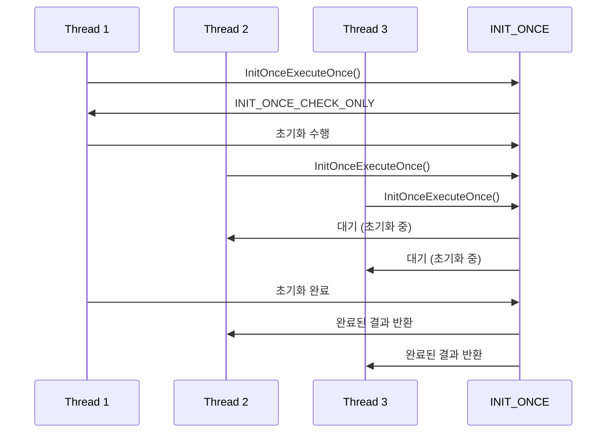
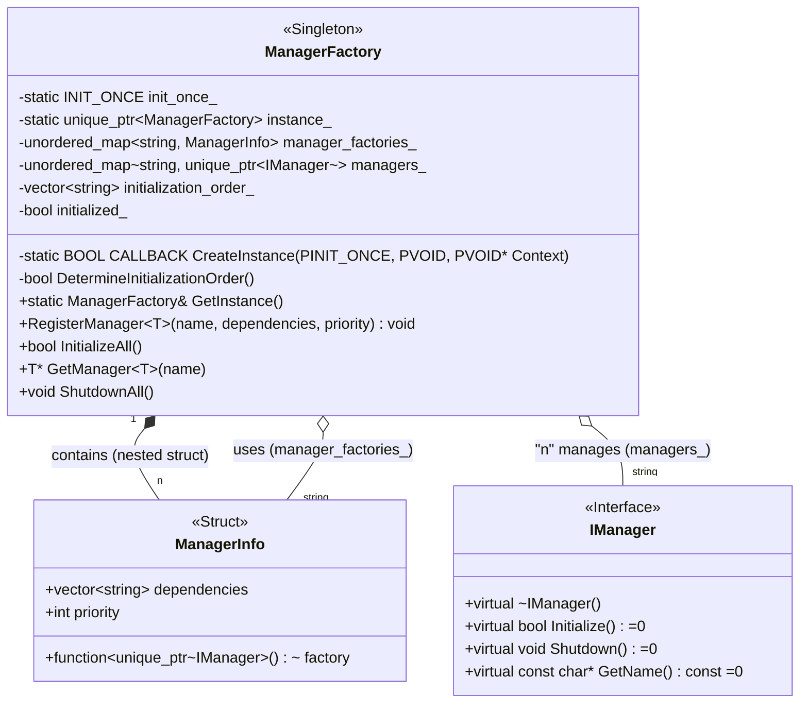

# 모던 Windows 멀티스레딩: 게임 서버 개발자를 위한 고성능 동시성 프로그래밍  

저자: 최흥배, Claude AI   
    
권장 개발 환경
- **IDE**: Visual Studio 2022 (Community 이상)
- **컴파일러**: MSVC v143 (C++20 지원)
- **OS**: Windows 10 이상

-----  
  
# 5장. One-Time Initialization
One-Time Initialization은 Windows Vista/Server 2008에서 도입된 동기화 메커니즘으로, 멀티스레드 환경에서 특정 코드 블록이 정확히 한 번만 실행되도록 보장한다. 게임 서버에서는 싱글톤 인스턴스 생성, 전역 리소스 초기화, 설정 파일 로딩 등에 핵심적으로 사용된다.


  

## 5.1 스레드 안전한 싱글톤 패턴
전통적인 Double-Checked Locking 패턴은 컴파일러 최적화와 메모리 재배치로 인해 위험할 수 있다. Windows One-Time Initialization은 이러한 문제를 근본적으로 해결한다.
 
### 기본 INIT_ONCE API 이해

```cpp
#include <windows.h>
#include <memory>

// 전역 INIT_ONCE 객체 (정적 초기화됨)
INIT_ONCE g_InitOnce = INIT_ONCE_STATIC_INIT;

// 초기화 콜백 함수
BOOL CALLBACK InitFunction(
    PINIT_ONCE InitOnce,
    PVOID Parameter,
    PVOID* Context
) {
    // 이 함수는 정확히 한 번만 실행됨이 보장됨
    auto instance = new MyClass();
    
    // Context에 결과 저장
    *Context = instance;
    
    // TRUE 반환 시 초기화 성공
    return TRUE;
}

// 사용 예제
MyClass* GetInstance() {
    PVOID context = nullptr;
    
    BOOL result = InitOnceExecuteOnce(
        &g_InitOnce,        // INIT_ONCE 객체
        InitFunction,       // 초기화 함수
        nullptr,           // 매개변수
        &context           // 결과를 받을 포인터
    );
    
    if (result) {
        return static_cast<MyClass*>(context);
    }
    
    return nullptr;
}
```
  

### 모던 C++ 스타일 싱글톤

```cpp
template<typename T>
class ThreadSafeSingleton {
private:
    static INIT_ONCE init_once_;
    static std::unique_ptr<T> instance_;

    static BOOL CALLBACK CreateInstance(
        PINIT_ONCE InitOnce,
        PVOID Parameter,
        PVOID* Context
    ) {
        try {
            auto new_instance = std::make_unique<T>();
            instance_ = std::move(new_instance);
            *Context = instance_.get();
            return TRUE;
        } catch (...) {
            // 초기화 실패
            return FALSE;
        }
    }

public:
    static T& GetInstance() {
        PVOID context = nullptr;
        
        BOOL success = InitOnceExecuteOnce(
            &init_once_,
            CreateInstance,
            nullptr,
            &context
        );
        
        if (!success || !context) {
            throw std::runtime_error("Singleton initialization failed");
        }
        
        return *static_cast<T*>(context);
    }

    // 복사와 이동 방지
    ThreadSafeSingleton(const ThreadSafeSingleton&) = delete;
    ThreadSafeSingleton& operator=(const ThreadSafeSingleton&) = delete;
    ThreadSafeSingleton(ThreadSafeSingleton&&) = delete;
    ThreadSafeSingleton& operator=(ThreadSafeSingleton&&) = delete;

protected:
    ThreadSafeSingleton() = default;
    virtual ~ThreadSafeSingleton() = default;
};

// 정적 멤버 정의
template<typename T>
INIT_ONCE ThreadSafeSingleton<T>::init_once_ = INIT_ONCE_STATIC_INIT;

template<typename T>
std::unique_ptr<T> ThreadSafeSingleton<T>::instance_ = nullptr;
```
  


## 5.2 게임 서버 매니저 클래스 설계
게임 서버에서는 다양한 매니저 클래스들이 서로 의존관계를 가지며 초기화 순서가 중요하다. One-Time Initialization을 활용하여 안전하고 효율적인 매니저 시스템을 구축할 수 있다.

```
    Game Server Manager Initialization Order
    
    ┌─────────────────┐
    │  ConfigManager  │ ← 가장 먼저 초기화
    └─────────────────┘
             │
             ▼
    ┌─────────────────┐
    │   LogManager    │
    └─────────────────┘
             │
             ▼
    ┌─────────────────┐
    │ DatabaseManager │
    └─────────────────┘
             │
             ▼
    ┌─────────────────┐
    │ NetworkManager  │
    └─────────────────┘
             │
             ▼
    ┌─────────────────┐
    │  GameManager    │ ← 마지막에 초기화
    └─────────────────┘
```

### 계층적 매니저 초기화 시스템

```cpp
// 필요한 표준 라이브러리 헤더들을 포함한다.
#include <vector>       // std::vector 사용
#include <functional>   // std::function 사용
#include <string>       // std::string 사용
#include <unordered_map> // std::unordered_map 사용
#include <memory>       // std::unique_ptr, std::make_unique 사용
#include <queue>        // std::priority_queue 사용

// Windows.h 헤더가 필요하나, 여기서는 INIT_ONCE 관련 타입들만 가정하고 진행한다.
// 실제 컴파일을 위해서는 <Windows.h>가 필요할 수 있다.
// Windows API 타입들을 간단히 정의한다 (실제로는 <Windows.h>에 정의됨).
#ifndef INIT_ONCE_STATIC_INIT
#define INIT_ONCE_STATIC_INIT {0}
typedef struct _INIT_ONCE { PVOID Ptr; } INIT_ONCE, *PINIT_ONCE;
typedef BOOL(CALLBACK *PINIT_ONCE_FN) (PINIT_ONCE InitOnce, PVOID Parameter, PVOID *Context);
BOOL InitOnceExecuteOnce(PINIT_ONCE InitOnce, PINIT_ONCE_FN InitFn, PVOID Parameter, PVOID *Context);
#endif

// 모든 매니저(Manager)가 구현해야 하는 기본 인터페이스다.
class IManager {
public:
    // 가상 소멸자를 기본(default)으로 정의한다. 상속을 통한 다형성을 지원한다.
    virtual ~IManager() = default;
    // 매니저 초기화 함수다. 순수 가상 함수로, 파생 클래스에서 반드시 구현해야 한다.
    virtual bool Initialize() = 0;
    // 매니저 종료(정리) 함수다. 순수 가상 함수로, 파생 클래스에서 반드시 구현해야 한다.
    virtual void Shutdown() = 0;
    // 매니저의 이름을 반환하는 함수다. 순수 가상 함수로, 파생 클래스에서 반드시 구현해야 한다.
    virtual const char* GetName() const = 0;
};

// 매니저 인스턴스의 생성과 생명주기를 관리하는 팩토리 클래스다.
// 싱글톤(Singleton) 패턴으로 구현되어 시스템 전역에서 하나의 인스턴스만 존재한다.
class ManagerFactory {
private:
    // 각 매니저의 생성 정보(팩토리 함수, 의존성, 우선순위)를 저장하는 구조체다.
    struct ManagerInfo {
        std::function<std::unique_ptr<IManager>()> factory; // 매니저 인스턴스를 생성하는 팩토리 함수다.
        std::vector<std::string> dependencies;            // 이 매니저가 의존하는 다른 매니저들의 이름 목록이다.
        int priority;                                   // 초기화 우선순위다. (숫자가 높을수록 우선순위가 높다)
    };

    // Windows의 InitOnceExecuteOnce를 사용하여 스레드 안전하게 싱글톤 인스턴스를 초기화하기 위한 정적 멤버다.
    static INIT_ONCE init_once_;
    // 싱글톤 인스턴스를 저장하는 정적 스마트 포인터다.
    static std::unique_ptr<ManagerFactory> instance_;
    
    // 등록된 매니저 팩토리 정보(ManagerInfo)를 이름(string)을 키로 하여 저장하는 맵이다.
    std::unordered_map<std::string, ManagerInfo> manager_factories_;
    // 생성 및 초기화된 매니저 인스턴스들을 이름(string)을 키로 하여 저장하는 맵이다.
    std::unordered_map<std::string, std::unique_ptr<IManager>> managers_;
    // 의존성과 우선순위를 고려하여 결정된 매니저들의 초기화 순서를 저장하는 벡터다.
    std::vector<std::string> initialization_order_;
    // 모든 매니저의 초기화가 완료되었는지 여부를 나타내는 플래그다.
    bool initialized_ = false;

    // InitOnceExecuteOnce에 의해 호출될 정적 콜백 함수다.
    // 싱글톤 인스턴스를 생성하고 Context 포인터에 저장한다.
    static BOOL CALLBACK CreateInstance(PINIT_ONCE, PVOID, PVOID* Context) {
        instance_ = std::make_unique<ManagerFactory>(); // ManagerFactory 인스턴스를 생성한다.
        *Context = instance_.get(); // 생성된 인스턴스의 포인터를 Context에 저장한다.
        return TRUE; // 성공을 반환한다.
    }

public:
    // ManagerFactory의 싱글톤 인스턴스를 반환하는 정적 메서드다.
    static ManagerFactory& GetInstance() {
        PVOID context = nullptr;
        // InitOnceExecuteOnce를 호출하여 스레드 안전하게 CreateInstance를 한 번만 실행한다.
        // 이를 통해 instance_가 단 한 번만 생성되도록 보장한다.
        InitOnceExecuteOnce(&init_once_, CreateInstance, nullptr, &context);
        // Context에 저장된 인스턴스 포인터를 ManagerFactory 타입으로 캐스팅하여 참조를 반환한다.
        return *static_cast<ManagerFactory*>(context);
    }

    // 새로운 매니저 타입을 팩토리에 등록하는 템플릿 메서드다.
    // T는 IManager를 상속받은 구체적인 매니저 클래스 타입이다.
    template<typename T>
    void RegisterManager(const std::string& name,                  // 등록할 매니저의 고유 이름이다.
                         const std::vector<std::string>& dependencies = {}, // 이 매니저의 의존성 목록이다.
                         int priority = 0) {                        // 이 매니저의 초기화 우선순위다.
        ManagerInfo info;
        // 팩토리 함수(람다)를 정의한다. 이 함수는 T 타입의 인스턴스를 생성하여 unique_ptr로 반환한다.
        info.factory = []() { return std::make_unique<T>(); };
        info.dependencies = dependencies; // 의존성 목록을 복사한다.
        info.priority = priority;         // 우선순위를 복사한다.
        
        // 생성된 ManagerInfo를 맵에 저장한다. 기존에 같은 이름이 있었다면 덮어쓴다.
        manager_factories_[name] = std::move(info);
    }

    // 등록된 모든 매니저를 결정된 순서에 따라 초기화한다.
    bool InitializeAll() {
        // 이미 초기화되었다면 true를 반환한다.
        if (initialized_) return true;

        // 의존성과 우선순위를 고려하여 초기화 순서를 결정한다.
        if (!DetermineInitializationOrder()) {
            // 순서 결정에 실패하면 (예: 순환 의존성) false를 반환한다.
            return false;
        }

        // 결정된 초기화 순서(initialization_order_)에 따라 각 매니저를 초기화한다.
        for (const auto& name : initialization_order_) {
            // 팩토리 함수를 호출하여 매니저 인스턴스를 생성한다.
            auto manager = manager_factories_[name].factory();
            // 매니저의 Initialize() 메서드를 호출한다.
            if (!manager->Initialize()) {
                // 초기화에 실패하면, 지금까지 초기화된 모든 매니저를 종료(ShutdownAll)하고 false를 반환한다.
                ShutdownAll();
                return false;
            }
            // 초기화에 성공하면, 생성된 매니저 인스턴스를 managers_ 맵으로 이동(std::move)시켜 저장한다.
            managers_[name] = std::move(manager);
        }

        // 모든 매니저가 성공적으로 초기화되었으므로 플래그를 true로 설정하고 true를 반환한다.
        initialized_ = true;
        return true;
    }

    // 이름(name)으로 초기화된 매니저 인스턴스를 찾아 반환하는 템플릿 메서드다.
    // T는 반환받을 매니저의 구체적인 타입이다.
    template<typename T>
    T* GetManager(const std::string& name) {
        // managers_ 맵에서 해당 이름의 매니저를 찾는다.
        auto it = managers_.find(name);
        if (it != managers_.end()) {
            // 찾았다면, 저장된 unique_ptr에서 원시 포인터(.get())를 얻어와 T* 타입으로 캐스팅하여 반환한다.
            return static_cast<T*>(it->second.get());
        }
        // 찾지 못했다면 nullptr을 반환한다.
        return nullptr;
    }

    // 초기화된 모든 매니저를 종료(Shutdown)시킨다.
    void ShutdownAll() {
        // 초기화 순서(initialization_order_)의 역순(rbegin, rend)으로 매니저들을 순회한다.
        // 이는 의존성의 역순으로 안전하게 종료하기 위함이다.
        for (auto it = initialization_order_.rbegin(); 
             it != initialization_order_.rend(); ++it) {
            // 현재 순회 중인 이름(*it)으로 managers_ 맵에서 매니저 인스턴스를 찾는다.
            auto manager_it = managers_.find(*it);
            if (manager_it != managers_.end()) {
                // 찾았다면, 해당 매니저의 Shutdown() 메서드를 호출한다.
                manager_it->second->Shutdown();
                // managers_ 맵에서 해당 매니저를 제거한다 (unique_ptr이 소멸되면서 인스턴스도 삭제됨).
                managers_.erase(manager_it);
            }
        }
        // 초기화 상태 플래그를 false로 리셋한다.
        initialized_ = false;
    }

private:
    // 위상 정렬(Topological Sort)과 우선순위 큐를 사용하여 매니저들의 초기화 순서를 결정한다.
    bool DetermineInitializationOrder() {
        // 각 매니저(노드)의 진입 차수(in-degree), 즉 해당 매니저가 의존하는 매니저의 수를 저장하는 맵이다.
        std::unordered_map<std::string, int> in_degree;
        // 각 매니저(키)에 대해, 해당 매니저를 의존하는 다른 매니저들의 목록(값)을 저장하는 맵이다 (의존성 그래프의 역방향).
        std::unordered_map<std::string, std::vector<std::string>> dependents;

        // 등록된 모든 매니저 팩토리 정보를 순회하며 의존성 그래프와 진입 차수를 구축한다.
        for (const auto& [name, info] : manager_factories_) {
            // 현재 매니저의 진입 차수를 의존성 목록의 크기로 설정한다.
            in_degree[name] = info.dependencies.size();
            
            // 현재 매니저가 의존하는 각 매니저(dep)에 대해
            for (const auto& dep : info.dependencies) {
                // 의존 대상(dep)의 종속자(dependents) 목록에 현재 매니저(name)를 추가한다.
                dependents[dep].push_back(name);
            }
        }

        // 우선순위 큐(priority_queue)를 사용하여 위상 정렬을 수행한다.
        // 우선순위가 높은(priority 값이 큰) 매니저가 먼저 처리되도록 비교 함수(compare)를 정의한다.
        auto compare = [this](const std::string& a, const std::string& b) {
            // a의 우선순위가 b의 우선순위보다 낮으면 true를 반환 (max-heap 기준).
            return manager_factories_.at(a).priority < manager_factories_.at(b).priority;
        };
        
        // 비교 함수(compare)를 사용하는 우선순위 큐를 선언한다.
        std::priority_queue<std::string, std::vector<std::string>, 
                            decltype(compare)> ready_queue(compare);

        // 진입 차수(in_degree) 맵을 순회하며 진입 차수가 0인 (즉, 의존성이 없는) 매니저들을
        // 우선순위 큐(ready_queue)에 추가한다.
        for (const auto& [name, degree] : in_degree) {
            if (degree == 0) {
                ready_queue.push(name);
            }
        }

        // 최종 초기화 순서를 저장할 벡터를 비운다.
        initialization_order_.clear();

        // 우선순위 큐가 빌 때까지 반복한다.
        while (!ready_queue.empty()) {
            // 큐에서 우선순위가 가장 높은 (의존성이 해결된) 매니저를 꺼낸다.
            std::string current = ready_queue.top();
            ready_queue.pop();
            
            // 꺼낸 매니저를 초기화 순서 벡터에 추가한다.
            initialization_order_.push_back(current);

            // 이 매니저(current)에 의존하던 다른 매니저(dependent)들의 진입 차수를 감소시킨다.
            for (const auto& dependent : dependents[current]) {
                in_degree[dependent]--;
                // 만약 종속 매니저(dependent)의 진입 차수가 0이 되었다면,
                // 이 매니저도 의존성이 모두 해결되었으므로 우선순위 큐에 추가한다.
                if (in_degree[dependent] == 0) {
                    ready_queue.push(dependent);
                }
            }
        }

        // 위상 정렬이 완료된 후, 초기화 순서에 포함된 매니저의 수와
        // 처음에 등록된 매니저 팩토리의 수가 같은지 비교한다.
        // 수가 다르면, 그래프에 순환(cycle)이 존재한다는 의미이므로 순환 의존성 오류다.
        // 같으면 true(성공), 다르면 false(실패)를 반환한다.
        return initialization_order_.size() == manager_factories_.size();
    }
};

// ManagerFactory 클래스의 정적 멤버 변수들을 정의하고 초기화한다.
// INIT_ONCE 구조체를 정적 초기화 매크로로 초기화한다.
INIT_ONCE ManagerFactory::init_once_ = INIT_ONCE_STATIC_INIT;
// 싱글톤 인스턴스 포인터를 nullptr로 초기화한다.
std::unique_ptr<ManagerFactory> ManagerFactory::instance_ = nullptr;


// Windows API 관련 정의를 다시 해제한다 (필요한 경우).
#ifdef INIT_ONCE_STATIC_INIT
#undef INIT_ONCE_STATIC_INIT
#undef INIT_ONCE
#undef PINIT_ONCE
#undef PINIT_ONCE_FN
// InitOnceExecuteOnce 함수 선언은 실제 Windows.h에 있으므로 여기서는 해제하지 않는다.
#endif  
```
  
네, 해당 C++ 코드의 구조를 나타내는 Mermaid 클래스 다이어그램입니다.



**다이어그램 설명:**

1.  **IManager (인터페이스):**
      * 모든 매니저가 구현해야 하는 순수 가상 함수(`Initialize`, `Shutdown`, `GetName`)를 정의하는 인터페이스입니다.
2.  **ManagerFactory (싱글톤 클래스):**
      * 시스템 전역에서 단 하나의 인스턴스만 존재하는 싱글톤으로 구현되었습니다.
      * `GetInstance()` 정적 메서드를 통해 인스턴스에 접근합니다.
      * `ManagerInfo` 구조체를 내부에 정의하고 (`+--`), 이를 `manager_factories_` 맵에 저장하여 관리합니다 (`o--`).
      * 생성된 `IManager` 구현체들을 `managers_` 맵에 `unique_ptr`로 소유(관리)합니다 (`o--`).
3.  **ManagerInfo (구조체):**
      * `ManagerFactory` 내부에 정의된 헬퍼 구조체입니다.
      * 매니저 생성 함수(`factory`), 의존성 목록(`dependencies`), 우선순위(`priority`) 정보를 담습니다.


### 구체적인 매니저 구현 예제

```cpp
// 설정 매니저 (ConfigManager) 클래스 정의다. IManager 인터페이스를 상속받는다.
class ConfigManager : public IManager {
private:
    // 스레드 안전한 초기화를 위한 정적 멤버다 (이 예제에서는 사용되지 않았다).
    static INIT_ONCE init_once_;
    // 설정 키와 값을 문자열로 저장하는 해시 맵이다.
    std::unordered_map<std::string, std::string> config_values_;

public:
    // IManager의 Initialize 함수를 재정의한다.
    bool Initialize() override {
        // 설정 파일 로딩
        // "server.ini" 파일에서 설정을 로드하는 함수를 호출한다.
        return LoadConfigFile("server.ini");
    }

    // IManager의 Shutdown 함수를 재정의한다.
    void Shutdown() override {
        // 매니저가 종료될 때 설정 맵의 모든 데이터를 지운다.
        config_values_.clear();
    }

    // IManager의 GetName 함수를 재정의한다.
    const char* GetName() const override {
        // 이 매니저의 고유 이름을 "ConfigManager"로 반환한다.
        return "ConfigManager";
    }

    // 키(key)에 해당하는 설정 값을 반환하는 함수다.
    std::string GetValue(const std::string& key, const std::string& default_value = "") {
        // 맵에서 해당 키를 찾는다.
        auto it = config_values_.find(key);
        // 키를 찾으면 해당 값을 반환하고, 찾지 못하면 기본값(default_value)을 반환한다.
        return (it != config_values_.end()) ? it->second : default_value;
    }

private:
    // 설정 파일(예: .ini 파일)을 로드하고 파싱하는 내부 함수다.
    bool LoadConfigFile(const std::string& filename) {
        // 실제로는 파일을 열고 파싱하는 로직이 필요하다.
        // 여기서는 예시 값을 하드코딩으로 추가한다.
        config_values_["server.port"] = "8080";
        config_values_["max.connections"] = "1000";
        config_values_["db.connection_string"] = "Server=localhost;Database=GameDB";
        // 로드 성공으로 간주하고 true를 반환한다.
        return true;
    }
};

// ConfigManager의 정적 멤버 변수 정의다.
// INIT_ONCE ConfigManager::init_once_ = INIT_ONCE_STATIC_INIT; (실제 .cpp 파일에 필요)
```
   
```cpp   
// 데이터베이스 매니저 (DatabaseManager) 클래스 정의다. IManager 인터페이스를 상속받는다.
class DatabaseManager : public IManager {
private:
    // DB 커넥션 풀을 관리하기 위한 내부 구조체 정의다.
    struct ConnectionPool {
        // 생성된 모든 DB 커넥션의 소유권(unique_ptr)을 저장하는 벡터다.
        // 이 벡터는 모든 커넥션의 생명주기를 관리한다.
        std::vector<std::unique_ptr<DatabaseConnection>> connections;
        
        // 커넥션 풀(available_connections 큐)에 대한 스레드 동기화를 위한 SRW (Slim Reader/Writer) 락이다.
        SRWLOCK lock;
        
        // 사용 가능한 커넥션이 없을 때 스레드를 대기시키기 위한 조건 변수다.
        CONDITION_VARIABLE cv;
        
        // 현재 사용 가능한 DB 커넥션의 소유권(unique_ptr)을 저장하는 큐다.
        std::queue<std::unique_ptr<DatabaseConnection>> available_connections;
    };

    // 커넥션 풀 인스턴스를 멤버 변수로 가진다.
    ConnectionPool pool_;
    // 매니저의 초기화 완료 여부를 나타내는 플래그다.
    bool initialized_ = false;

public:
    // IManager의 Initialize 함수를 재정의한다.
    bool Initialize() override {
        // ManagerFactory 싱글톤 인스턴스에서 ConfigManager를 "Config"라는 이름으로 가져온다.
        auto& config = ManagerFactory::GetInstance().GetManager<ConfigManager>("Config");
        // ConfigManager를 가져오지 못하면(의존성 실패) 초기화를 중단한다.
        if (!config) return false;

        // ConfigManager에서 DB 연결 문자열과 최대 커넥션 수를 읽어온다.
        std::string connection_string = config->GetValue("db.connection_string");
        int max_connections = std::stoi(config->GetValue("max.connections", "10")); // 문자열을 정수로 변환한다.

        // 커넥션 풀에서 사용할 SRW 락과 조건 변수를 초기화한다.
        InitializeSRWLock(&pool_.lock);
        InitializeConditionVariable(&pool_.cv);

        // 연결 풀 생성
        // 설정된 최대 커넥션 수만큼 반복한다.
        for (int i = 0; i < max_connections; ++i) {
            // DB 커넥션 인스턴스를 생성한다.
            auto connection = CreateDatabaseConnection(connection_string);
            // 커넥션 생성에 실패하면(예: DB 연결 불가) 초기화를 중단한다.
            if (!connection) return false;
            
            // (참고: 원본 코드의 이 부분은 논리적 오류가 있을 수 있다. 
            //  `connections` 벡터와 `available_connections` 큐가 동시에 `unique_ptr`의 소유권을 관리하려 한다.
            //  여기서는 `available_connections` 큐가 소유권을 관리하는 것으로 가정하고 주석을 작성한다.)

            // `connections` 벡터에 커넥션의 소유권을 이동시킨다. (원본 코드 라인 1)
            // pool_.connections.push_back(std::move(connection));
            
            // `available_connections` 큐에 커넥션의 소유권을 이동시킨다. (수정된 로직 가정)
            // `pool_.available_connections.push(pool_.connections.back().get());` (원본 코드 라인 2 - 컴파일 오류 발생 가능성 높음)
            
            // 의도된 로직 (큐가 소유권을 가짐):
            pool_.available_connections.push(std::move(connection));
            
            // (만약 `connections` 벡터가 소유권을 가지고, 큐가 원시 포인터를 가지는 방식이라면 
            //  `Acquire/ReleaseConnection` 함수의 시그니처가 달라져야 한다.)
        }

        // 초기화가 성공적으로 완료되었음을 표시한다.
        initialized_ = true;
        return true;
    }

    // IManager의 Shutdown 함수를 재정의한다.
    void Shutdown() override {
        // 이미 종료되었거나 초기화된 적 없으면 아무것도 하지 않는다.
        if (!initialized_) return;

        // 커넥션 풀을 정리하기 위해 배타적(Exclusive) 락을 획득한다.
        AcquireSRWLockExclusive(&pool_.lock);
        
        // (참고: `connections` 벡터가 소유권을 가졌다면 이 clear() 호출로 모든 커넥션이 소멸된다.)
        pool_.connections.clear(); 
        
        // `available_connections` 큐를 비운다.
        std::queue<std::unique_ptr<DatabaseConnection>> empty; // 빈 큐를 생성한다.
        pool_.available_connections.swap(empty); // 현재 큐와 빈 큐를 교체(swap)하여 내용을 즉시 비운다.
                                                 // (큐에 있던 `unique_ptr`들이 `empty`로 이동 후 소멸된다.)
        
        // 락을 해제한다.
        ReleaseSRWLockExclusive(&pool_.lock);

        // 초기화 플래그를 리셋한다.
        initialized_ = false;
    }

    // IManager의 GetName 함수를 재정의한다.
    const char* GetName() const override {
        // 이 매니저의 고유 이름을 "DatabaseManager"로 반환한다.
        return "DatabaseManager";
    }

    // 커넥션 풀에서 사용 가능한 DB 커넥션을 획득(Acquire)하는 함수다.
    // 반환 타입이 unique_ptr이므로, 커넥션의 소유권이 호출자에게 이전된다.
    std::unique_ptr<DatabaseConnection> AcquireConnection() {
        // 큐에 접근하기 위해 배타적 락을 획득한다.
        AcquireSRWLockExclusive(&pool_.lock);
        
        // 사용 가능한 커넥션이 큐에 없을 동안(empty) 반복 대기한다.
        while (pool_.available_connections.empty()) {
            // 락을 원자적으로 해제하고, 조건 변수(cv)의 시그널을 무한정(INFINITE) 대기한다.
            // (시그널을 받으면 락을 다시 획득하고 깨어난다.)
            SleepConditionVariableSRW(&pool_.cv, &pool_.lock, INFINITE, 0);
        }
        
        // 큐의 맨 앞에 있는 커넥션(unique_ptr)의 소유권을 'connection' 변수로 이동(move)시킨다.
        auto connection = std::move(pool_.available_connections.front());
        // 큐에서 (이제 비어있는) `unique_ptr` 래퍼를 제거한다.
        pool_.available_connections.pop();
        
        // 락을 해제한다.
        ReleaseSRWLockExclusive(&pool_.lock);
        // 획득한 커넥션의 소유권을 호출자에게 반환한다.
        return connection;
    }

    // 사용이 완료된 DB 커넥션을 풀에 반환(Release)하는 함수다.
    // 파라미터가 unique_ptr이므로, 호출자로부터 커넥션의 소유권을 이전받는다.
    void ReleaseConnection(std::unique_ptr<DatabaseConnection> connection) {
        // 큐에 접근하기 위해 배타적 락을 획득한다.
        AcquireSRWLockExclusive(&pool_.lock);
        
        // 반환받은 커넥션(connection)의 소유권을 `available_connections` 큐로 이동(move)시킨다.
        pool_.available_connections.push(std::move(connection));
        
        // 락을 해제한다.
        ReleaseSRWLockExclusive(&pool_.lock);
        
        // 커넥션을 대기 중인 다른 스레드가 있을 수 있으므로, 조건 변수(cv)에 시그널을 보내 하나를 깨운다.
        WakeConditionVariable(&pool_.cv);
    }

private:
    // DB 커넥션 인스턴스를 생성하는 내부 헬퍼 함수다.
    std::unique_ptr<DatabaseConnection> CreateDatabaseConnection(const std::string& connection_string) {
        // 실제 데이터베이스 연결 생성 로직 (예: ODBC, OLE DB, MySQL Connector 등 사용)
        // 여기서는 예시로 객체만 생성하여 unique_ptr로 감싸 반환한다.
        return std::make_unique<DatabaseConnection>(connection_string);
    }
};
```
  


## 5.3 실전 예제: 리소스 매니저 초기화
게임 서버에서는 다양한 리소스(텍스처, 사운드, 스크립트, 데이터 테이블 등)를 효율적으로 관리해야 한다. One-Time Initialization을 활용하여 Thread-Safe한 리소스 매니저를 구현해보겠다.

### 지연 초기화(Lazy Initialization) 리소스 매니저

```cpp
#include <unordered_map>
#include <functional>
#include <memory>
#include <shared_mutex>

template<typename ResourceType>
class LazyResourceManager {
private:
    struct ResourceEntry {
        INIT_ONCE init_once;
        std::shared_ptr<ResourceType> resource;
        std::function<std::shared_ptr<ResourceType>()> loader;
        
        ResourceEntry() : init_once(INIT_ONCE_STATIC_INIT) {}
    };

    mutable std::shared_mutex entries_mutex_;
    std::unordered_map<std::string, std::unique_ptr<ResourceEntry>> entries_;

    static BOOL CALLBACK LoadResource(
        PINIT_ONCE InitOnce,
        PVOID Parameter,
        PVOID* Context
    ) {
        auto* entry = static_cast<ResourceEntry*>(Parameter);
        
        try {
            entry->resource = entry->loader();
            *Context = entry->resource.get();
            return entry->resource != nullptr ? TRUE : FALSE;
        } catch (...) {
            return FALSE;
        }
    }

public:
    void RegisterResource(const std::string& name, 
                         std::function<std::shared_ptr<ResourceType>()> loader) {
        std::unique_lock lock(entries_mutex_);
        
        auto entry = std::make_unique<ResourceEntry>();
        entry->loader = std::move(loader);
        
        entries_[name] = std::move(entry);
    }

    std::shared_ptr<ResourceType> GetResource(const std::string& name) {
        // 먼저 읽기 락으로 엔트리 존재 확인
        std::shared_lock read_lock(entries_mutex_);
        auto it = entries_.find(name);
        if (it == entries_.end()) {
            return nullptr;
        }
        
        auto* entry = it->second.get();
        read_lock.unlock();

        // One-Time Initialization으로 리소스 로딩
        PVOID context = nullptr;
        BOOL success = InitOnceExecuteOnce(
            &entry->init_once,
            LoadResource,
            entry,
            &context
        );

        return success ? entry->resource : nullptr;
    }

    void PreloadResource(const std::string& name) {
        // 미리 로딩하여 지연 시간 제거
        GetResource(name);
    }

    void PreloadAll() {
        std::shared_lock lock(entries_mutex_);
        
        std::vector<std::string> names;
        names.reserve(entries_.size());
        
        for (const auto& [name, entry] : entries_) {
            names.push_back(name);
        }
        
        lock.unlock();

        // 병렬로 모든 리소스 로딩
        std::for_each(std::execution::par_unseq, names.begin(), names.end(),
            [this](const std::string& name) {
                GetResource(name);
            });
    }

    size_t GetLoadedResourceCount() const {
        std::shared_lock lock(entries_mutex_);
        
        return std::count_if(entries_.begin(), entries_.end(),
            [](const auto& pair) {
                return pair.second->resource != nullptr;
            });
    }

    void UnloadResource(const std::string& name) {
        std::unique_lock lock(entries_mutex_);
        
        auto it = entries_.find(name);
        if (it != entries_.end()) {
            // 새로운 엔트리로 교체 (다시 로딩 가능하도록)
            auto new_entry = std::make_unique<ResourceEntry>();
            new_entry->loader = it->second->loader;
            it->second = std::move(new_entry);
        }
    }
};

// 게임 데이터 테이블 매니저 예제
struct GameDataTable {
    std::unordered_map<int, std::string> data;
    
    static std::shared_ptr<GameDataTable> LoadFromFile(const std::string& filename) {
        auto table = std::make_shared<GameDataTable>();
        
        // 파일에서 데이터 로딩 시뮬레이션
        std::this_thread::sleep_for(std::chrono::milliseconds(100));
        
        table->data[1] = "Player";
        table->data[2] = "Monster";
        table->data[3] = "Item";
        
        return table;
    }
};

class GameDataManager {
private:
    LazyResourceManager<GameDataTable> table_manager_;
    
public:
    bool Initialize() {
        // 다양한 데이터 테이블 등록
        table_manager_.RegisterResource("PlayerData", 
            []() { return GameDataTable::LoadFromFile("data/player.json"); });
            
        table_manager_.RegisterResource("MonsterData", 
            []() { return GameDataTable::LoadFromFile("data/monster.json"); });
            
        table_manager_.RegisterResource("ItemData", 
            []() { return GameDataTable::LoadFromFile("data/item.json"); });
            
        table_manager_.RegisterResource("SkillData", 
            []() { return GameDataTable::LoadFromFile("data/skill.json"); });

        return true;
    }

    std::shared_ptr<GameDataTable> GetTable(const std::string& name) {
        return table_manager_.GetResource(name);
    }

    void PreloadCriticalData() {
        // 중요한 데이터는 미리 로딩
        table_manager_.PreloadResource("PlayerData");
        table_manager_.PreloadResource("MonsterData");
    }

    void PreloadAllData() {
        table_manager_.PreloadAll();
    }
};
```

### 초기화 진행률 추적 시스템

```cpp
class InitializationTracker {
private:
    struct InitStep {
        std::string name;
        std::function<bool()> initializer;
        std::atomic<bool> completed{false};
        std::atomic<bool> success{false};
        std::chrono::steady_clock::time_point start_time;
        std::chrono::steady_clock::time_point end_time;
    };

    std::vector<InitStep> steps_;
    std::atomic<size_t> current_step_{0};
    std::atomic<bool> initialization_complete_{false};
    SRWLOCK steps_lock_;

public:
    InitializationTracker() {
        InitializeSRWLock(&steps_lock_);
    }

    void AddStep(const std::string& name, std::function<bool()> initializer) {
        AcquireSRWLockExclusive(&steps_lock_);
        
        InitStep step;
        step.name = name;
        step.initializer = std::move(initializer);
        steps_.push_back(std::move(step));
        
        ReleaseSRWLockExclusive(&steps_lock_);
    }

    bool ExecuteAll() {
        for (size_t i = 0; i < steps_.size(); ++i) {
            current_step_.store(i, std::memory_order_relaxed);
            
            auto& step = steps_[i];
            step.start_time = std::chrono::steady_clock::now();
            
            bool success = step.initializer();
            
            step.end_time = std::chrono::steady_clock::now();
            step.success.store(success, std::memory_order_relaxed);
            step.completed.store(true, std::memory_order_relaxed);

            if (!success) {
                return false;
            }
        }

        initialization_complete_.store(true, std::memory_order_relaxed);
        return true;
    }

    struct ProgressInfo {
        size_t total_steps;
        size_t current_step;
        std::string current_step_name;
        bool is_complete;
        double progress_percentage;
        std::vector<std::pair<std::string, std::chrono::milliseconds>> step_durations;
    };

    ProgressInfo GetProgress() const {
        ProgressInfo info;
        
        AcquireSRWLockShared(&steps_lock_);
        
        info.total_steps = steps_.size();
        info.current_step = current_step_.load(std::memory_order_relaxed);
        info.is_complete = initialization_complete_.load(std::memory_order_relaxed);
        
        if (info.current_step < steps_.size()) {
            info.current_step_name = steps_[info.current_step].name;
        }
        
        info.progress_percentage = info.total_steps > 0 ? 
            (static_cast<double>(info.current_step) / info.total_steps) * 100.0 : 0.0;

        // 완료된 단계들의 실행 시간 수집
        for (size_t i = 0; i < info.current_step && i < steps_.size(); ++i) {
            const auto& step = steps_[i];
            if (step.completed.load(std::memory_order_relaxed)) {
                auto duration = std::chrono::duration_cast<std::chrono::milliseconds>(
                    step.end_time - step.start_time);
                info.step_durations.emplace_back(step.name, duration);
            }
        }
        
        ReleaseSRWLockShared(&steps_lock_);
        
        return info;
    }
};

// 사용 예제
class GameServerInitializer {
private:
    InitializationTracker tracker_;

public:
    bool Initialize() {
        // 초기화 단계들 등록
        tracker_.AddStep("Configuration", []() {
            return ManagerFactory::GetInstance().GetManager<ConfigManager>("Config")->Initialize();
        });

        tracker_.AddStep("Logging", []() {
            return ManagerFactory::GetInstance().GetManager<LogManager>("Log")->Initialize();
        });

        tracker_.AddStep("Database", []() {
            return ManagerFactory::GetInstance().GetManager<DatabaseManager>("Database")->Initialize();
        });

        tracker_.AddStep("Network", []() {
            return ManagerFactory::GetInstance().GetManager<NetworkManager>("Network")->Initialize();
        });

        tracker_.AddStep("Game Data", []() {
            auto data_manager = ManagerFactory::GetInstance().GetManager<GameDataManager>("GameData");
            if (data_manager->Initialize()) {
                data_manager->PreloadCriticalData();
                return true;
            }
            return false;
        });

        // 진행률 추적을 위한 별도 스레드
        std::thread progress_thread([this]() {
            while (!tracker_.GetProgress().is_complete) {
                auto progress = tracker_.GetProgress();
                
                printf("\rInitialization Progress: %.1f%% (%s)", 
                       progress.progress_percentage, 
                       progress.current_step_name.c_str());
                
                std::this_thread::sleep_for(std::chrono::milliseconds(100));
            }
            printf("\nInitialization Complete!\n");
        });

        bool success = tracker_.ExecuteAll();
        
        if (progress_thread.joinable()) {
            progress_thread.join();
        }

        return success;
    }
};
```
  


## 5.4 C++23의 std::once_flag와의 비교
C++11에서 도입된 `std::once_flag`와 `std::call_once`는 플랫폼 독립적인 one-time initialization을 제공한다. Windows의 INIT_ONCE와 비교해보겠다.

```
    std::call_once vs INIT_ONCE 비교
    
    ┌─────────────────────┬─────────────────────┬─────────────────────┐
    │      특징           │    std::call_once   │     INIT_ONCE       │
    ├─────────────────────┼─────────────────────┼─────────────────────┤
    │   플랫폼 호환성      │     ✅ 모든 플랫폼    │   ❌ Windows 전용    │
    │   성능              │     ⚡ 빠름          │   ⚡⚡ 매우 빠름     │
    │   예외 안전성        │     ✅ 완전          │   ⚠️ 수동 처리      │
    │   메모리 오버헤드    │     📦 중간          │   📦 최소           │
    │   초기화 실패 처리   │     ✅ 자동 재시도    │   ⚠️ 수동 처리      │
    │   컨텍스트 전달      │     ❌ 불가능        │   ✅ 가능           │
    └─────────────────────┴─────────────────────┴─────────────────────┘
```

### 성능 비교 벤치마크

```cpp
#include <chrono>
#include <thread>
#include <vector>
#include <mutex>

class PerformanceBenchmark {
private:
    static constexpr int NUM_THREADS = 8;
    static constexpr int NUM_CALLS_PER_THREAD = 1000000;

public:
    // std::call_once 벤치마크
    static void BenchmarkStdCallOnce() {
        std::once_flag flag;
        bool initialized = false;
        
        auto start = std::chrono::high_resolution_clock::now();
        
        std::vector<std::thread> threads;
        for (int i = 0; i < NUM_THREADS; ++i) {
            threads.emplace_back([&]() {
                for (int j = 0; j < NUM_CALLS_PER_THREAD; ++j) {
                    std::call_once(flag, [&]() {
                        initialized = true;
                    });
                }
            });
        }
        
        for (auto& t : threads) {
            t.join();
        }
        
        auto end = std::chrono::high_resolution_clock::now();
        auto duration = std::chrono::duration_cast<std::chrono::microseconds>(end - start);
        
        printf("std::call_once: %lld microseconds\n", duration.count());
    }

    // INIT_ONCE 벤치마크
    static void BenchmarkInitOnce() {
        INIT_ONCE init_once = INIT_ONCE_STATIC_INIT;
        bool initialized = false;
        
        auto InitFunction = [](PINIT_ONCE, PVOID Parameter, PVOID* Context) -> BOOL {
            *static_cast<bool*>(Parameter) = true;
            return TRUE;
        };
        
        auto start = std::chrono::high_resolution_clock::now();
        
        std::vector<std::thread> threads;
        for (int i = 0; i < NUM_THREADS; ++i) {
            threads.emplace_back([&]() {
                for (int j = 0; j < NUM_CALLS_PER_THREAD; ++j) {
                    PVOID context;
                    InitOnceExecuteOnce(&init_once, InitFunction, &initialized, &context);
                }
            });
        }
        
        for (auto& t : threads) {
            t.join();
        }
        
        auto end = std::chrono::high_resolution_clock::now();
        auto duration = std::chrono::duration_cast<std::chrono::microseconds>(end - start);
        
        printf("INIT_ONCE: %lld microseconds\n", duration.count());
    }
};
```
  

### 하이브리드 접근법
Windows 게임 서버에서는 두 방식의 장점을 모두 활용할 수 있다:

```cpp
#ifdef _WIN32
#define USE_INIT_ONCE
#endif

template<typename T>
class OptimalSingleton {
private:
#ifdef USE_INIT_ONCE
    static INIT_ONCE init_once_;
    static std::unique_ptr<T> instance_;
    
    static BOOL CALLBACK CreateInstance(PINIT_ONCE, PVOID, PVOID* Context) {
        try {
            instance_ = std::make_unique<T>();
            *Context = instance_.get();
            return TRUE;
        } catch (...) {
            return FALSE;
        }
    }
#else
    static std::once_flag once_flag_;
    static std::unique_ptr<T> instance_;
#endif

public:
    static T& GetInstance() {
#ifdef USE_INIT_ONCE
        PVOID context = nullptr;
        
        BOOL success = InitOnceExecuteOnce(
            &init_once_,
            CreateInstance,
            nullptr,
            &context
        );
        
        if (!success || !context) {
            throw std::runtime_error("Singleton initialization failed");
        }
        
        return *static_cast<T*>(context);
#else
        std::call_once(once_flag_, []() {
            instance_ = std::make_unique<T>();
        });
        
        if (!instance_) {
            throw std::runtime_error("Singleton initialization failed");
        }
        
        return *instance_;
#endif
    }
};

// 정적 멤버 정의
#ifdef USE_INIT_ONCE
template<typename T>
INIT_ONCE OptimalSingleton<T>::init_once_ = INIT_ONCE_STATIC_INIT;
#else
template<typename T>
std::once_flag OptimalSingleton<T>::once_flag_;
#endif

template<typename T>
std::unique_ptr<T> OptimalSingleton<T>::instance_ = nullptr;
```
  

### 고급 초기화 패턴: 비동기 One-Time Initialization

```cpp
class AsyncInitializer {
private:
    struct AsyncInitData {
        INIT_ONCE init_once;
        std::future<bool> initialization_future;
        std::promise<bool> initialization_promise;
        std::function<bool()> initializer;
        
        AsyncInitData() : init_once(INIT_ONCE_STATIC_INIT) {}
    };

    std::unordered_map<std::string, std::unique_ptr<AsyncInitData>> async_inits_;
    SRWLOCK async_inits_lock_;

    static BOOL CALLBACK StartAsyncInit(PINIT_ONCE, PVOID Parameter, PVOID* Context) {
        auto* data = static_cast<AsyncInitData*>(Parameter);
        
        // 비동기 초기화 시작
        data->initialization_future = data->initialization_promise.get_future();
        
        std::thread([data]() {
            try {
                bool result = data->initializer();
                data->initialization_promise.set_value(result);
            } catch (...) {
                data->initialization_promise.set_exception(std::current_exception());
            }
        }).detach();
        
        *Context = &data->initialization_future;
        return TRUE;
    }

public:
    AsyncInitializer() {
        InitializeSRWLock(&async_inits_lock_);
    }

    void RegisterAsyncInit(const std::string& name, std::function<bool()> initializer) {
        AcquireSRWLockExclusive(&async_inits_lock_);
        
        auto data = std::make_unique<AsyncInitData>();
        data->initializer = std::move(initializer);
        
        async_inits_[name] = std::move(data);
        
        ReleaseSRWLockExclusive(&async_inits_lock_);
    }

    bool WaitForInitialization(const std::string& name, 
                              std::chrono::milliseconds timeout = std::chrono::milliseconds::max()) {
        AcquireSRWLockShared(&async_inits_lock_);
        auto it = async_inits_.find(name);
        if (it == async_inits_.end()) {
            ReleaseSRWLockShared(&async_inits_lock_);
            return false;
        }
        
        auto* data = it->second.get();
        ReleaseSRWLockShared(&async_inits_lock_);

        // One-Time으로 비동기 초기화 시작
        PVOID context = nullptr;
        InitOnceExecuteOnce(&data->init_once, StartAsyncInit, data, &context);
        
        auto* future = static_cast<std::future<bool>*>(context);
        
        try {
            if (timeout == std::chrono::milliseconds::max()) {
                return future->get();
            } else {
                return future->wait_for(timeout) == std::future_status::ready && future->get();
            }
        } catch (...) {
            return false;
        }
    }
};

// 사용 예제
class GameAssetLoader {
private:
    AsyncInitializer async_loader_;

public:
    void Initialize() {
        // 시간이 오래 걸리는 초기화들을 비동기로 등록
        async_loader_.RegisterAsyncInit("Textures", []() {
            // 텍스처 로딩 (시간이 오래 걸림)
            std::this_thread::sleep_for(std::chrono::seconds(3));
            return true;
        });

        async_loader_.RegisterAsyncInit("Audio", []() {
            // 오디오 리소스 로딩
            std::this_thread::sleep_for(std::chrono::seconds(2));
            return true;
        });

        async_loader_.RegisterAsyncInit("GameData", []() {
            // 게임 데이터 로딩
            std::this_thread::sleep_for(std::chrono::seconds(1));
            return true;
        });
    }

    bool WaitForCriticalAssets() {
        // 중요한 에셋만 먼저 대기
        return async_loader_.WaitForInitialization("GameData", std::chrono::seconds(5));
    }

    bool WaitForAllAssets() {
        // 모든 에셋 로딩 완료 대기
        return async_loader_.WaitForInitialization("Textures") &&
               async_loader_.WaitForInitialization("Audio") &&
               async_loader_.WaitForInitialization("GameData");
    }
};
```

One-Time Initialization은 게임 서버의 안정성과 성능에 중요한 역할을 한다. Windows의 INIT_ONCE API는 특히 고성능이 요구되는 환경에서 탁월한 선택이며, C++의 표준 라이브러리와 적절히 조합하여 사용하면 더욱 강력한 초기화 시스템을 구축할 수 있다. 다음 장에서는 Windows Thread Pool API에 대해 살펴보겠다.


