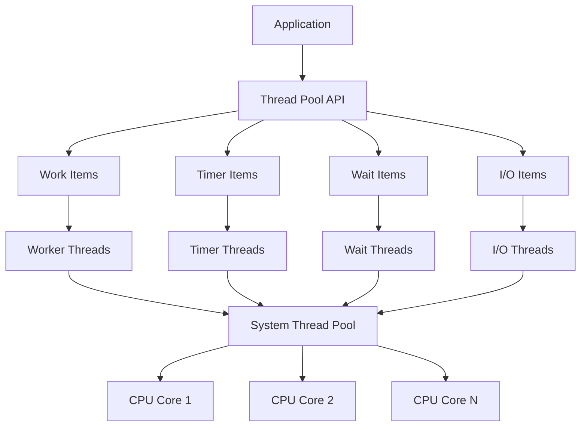
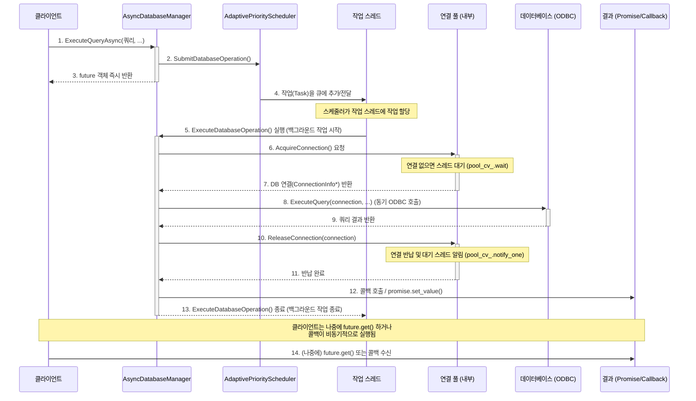

# 모던 Windows 멀티스레딩: 게임 서버 개발자를 위한 고성능 동시성 프로그래밍  

저자: 최흥배, Claude AI   
    
권장 개발 환경
- **IDE**: Visual Studio 2022 (Community 이상)
- **컴파일러**: MSVC v143 (C++20 지원)
- **OS**: Windows 10 이상

-----  
  
# 6장. Windows Thread Pool API
Windows Vista/Server 2008에서 대폭 개선된 Thread Pool API는 게임 서버의 비동기 작업 처리를 혁신적으로 향상시켰다. 기존의 QueueUserWorkItem 보다 훨씬 더 정교한 제어와 성능 최적화를 제공하며, I/O 완료 포트(IOCP)와의 완벽한 통합을 통해 고성능 게임 서버 구축의 핵심 도구가 되었다.


  

## 6.1 Thread Pool 아키텍처 이해
Windows Thread Pool은 시스템 차원에서 관리되는 스레드들의 집합으로, 응용 프로그램이 직접 스레드를 생성하고 관리하는 부담을 덜어준다. 게임 서버에서는 다양한 종류의 작업을 효율적으로 처리할 수 있는 강력한 도구이다.

#### Thread Pool 계층 구조

```
    Windows Thread Pool Architecture
    
    ┌─────────────────────────────────────────────────────────────┐
    │                    Application Layer                        │
    │  ┌─────────────┐ ┌─────────────┐ ┌─────────────┐ ┌────────┐│
    │  │ Work Items  │ │Timer Items  │ │ Wait Items  │ │I/O Items││
    │  └─────────────┘ └─────────────┘ └─────────────┘ └────────┘│
    └─────────────────────────────────────────────────────────────┘
                                   ▼
    ┌─────────────────────────────────────────────────────────────┐
    │                Thread Pool Environment                      │
    │  ┌─────────────┐ ┌─────────────┐ ┌─────────────┐           │
    │  │   Priority  │ │ Callback    │ │   Cleanup   │           │
    │  │  Management │ │ Environment │ │   Groups    │           │
    │  └─────────────┘ └─────────────┘ └─────────────┘           │
    └─────────────────────────────────────────────────────────────┘
                                   ▼
    ┌─────────────────────────────────────────────────────────────┐
    │                 System Thread Pool                          │
    │  ┌─────┐ ┌─────┐ ┌─────┐ ┌─────┐ ┌─────┐ ┌─────┐ ┌─────┐  │
    │  │ T1  │ │ T2  │ │ T3  │ │ T4  │ │ T5  │ │ T6  │ │ ... │  │
    │  └─────┘ └─────┘ └─────┘ └─────┘ └─────┘ └─────┘ └─────┘  │
    └─────────────────────────────────────────────────────────────┘
                                   ▼
    ┌─────────────────────────────────────────────────────────────┐
    │                   Hardware Layer                            │
    │           CPU Cores, Memory, I/O Devices                   │
    └─────────────────────────────────────────────────────────────┘
```

### 기본 Work Item 구현

```cpp
#include <windows.h>
#include <iostream>
#include <memory>
#include <atomic>
#include <chrono>

// 기본적인 작업 아이템 예제
class GameTaskProcessor {
private:
    struct TaskData {
        int task_id;
        std::string task_name;
        std::chrono::steady_clock::time_point created_time;
        std::atomic<bool>* completion_flag;
    };

    static std::atomic<int> completed_tasks_;

    // Thread Pool 콜백 함수
    static VOID CALLBACK WorkCallback(
        PTP_CALLBACK_INSTANCE Instance,
        PVOID Context,
        PTP_WORK Work
    ) {
        auto* task_data = static_cast<TaskData*>(Context);
        
        auto start_time = std::chrono::steady_clock::now();
        auto queue_time = std::chrono::duration_cast<std::chrono::microseconds>(
            start_time - task_data->created_time).count();

        // 작업 시뮬레이션 (게임 로직 처리)
        ProcessGameTask(task_data->task_id, task_data->task_name);

        auto end_time = std::chrono::steady_clock::now();
        auto execution_time = std::chrono::duration_cast<std::chrono::microseconds>(
            end_time - start_time).count();

        completed_tasks_.fetch_add(1, std::memory_order_relaxed);

        std::cout << "Task " << task_data->task_id 
                  << " (" << task_data->task_name << ") completed. "
                  << "Queue time: " << queue_time << "μs, "
                  << "Execution time: " << execution_time << "μs\n";

        if (task_data->completion_flag) {
            task_data->completion_flag->store(true, std::memory_order_release);
        }

        // 작업 데이터 정리
        delete task_data;
    }

    static void ProcessGameTask(int task_id, const std::string& task_name) {
        // 게임 특화 작업 시뮬레이션
        if (task_name == "PlayerUpdate") {
            // 플레이어 상태 업데이트
            std::this_thread::sleep_for(std::chrono::milliseconds(1));
        } else if (task_name == "DatabaseSave") {
            // 데이터베이스 저장
            std::this_thread::sleep_for(std::chrono::milliseconds(5));
        } else if (task_name == "AIProcess") {
            // AI 처리
            std::this_thread::sleep_for(std::chrono::milliseconds(2));
        }
    }

public:
    static void SubmitTask(int task_id, const std::string& task_name, 
                          std::atomic<bool>* completion_flag = nullptr) {
        // Thread Pool Work 객체 생성
        PTP_WORK work = CreateThreadpoolWork(
            WorkCallback,           // 콜백 함수
            nullptr,               // 콘텍스트 (여기서는 나중에 설정)
            nullptr                // 콜백 환경 (기본값 사용)
        );

        if (!work) {
            std::cerr << "Failed to create thread pool work\n";
            return;
        }

        // 작업 데이터 준비
        auto* task_data = new TaskData{
            task_id,
            task_name,
            std::chrono::steady_clock::now(),
            completion_flag
        };

        // 콘텍스트 설정 (CreateThreadpoolWork 이후에 설정해야 함)
        // 실제로는 콜백에 직접 전달하기 위해 다른 방법 사용
        
        // 작업 제출
        SubmitThreadpoolWork(work);

        // Work 객체 정리 (비동기 실행되므로 즉시 정리해도 안전)
        CloseThreadpoolWork(work);
    }

    static int GetCompletedTaskCount() {
        return completed_tasks_.load(std::memory_order_acquire);
    }
};

// 정적 멤버 정의
std::atomic<int> GameTaskProcessor::completed_tasks_{0};
```

### 개선된 Thread Pool 작업 관리자

```cpp
class AdvancedThreadPoolManager {
private:
    struct WorkItem {
        std::function<void()> task_function;
        std::string task_name;
        int priority;
        std::chrono::steady_clock::time_point created_time;
        std::promise<void> completion_promise;
    };

    PTP_POOL custom_pool_;
    PTP_CLEANUP_GROUP cleanup_group_;
    TP_CALLBACK_ENVIRON callback_environ_;
    
    std::atomic<uint64_t> submitted_tasks_{0};
    std::atomic<uint64_t> completed_tasks_{0};
    std::atomic<uint64_t> failed_tasks_{0};

    static VOID CALLBACK AdvancedWorkCallback(
        PTP_CALLBACK_INSTANCE Instance,
        PVOID Context,
        PTP_WORK Work
    ) {
        auto* work_item = static_cast<WorkItem*>(Context);
        
        try {
            auto start_time = std::chrono::steady_clock::now();
            
            // 실제 작업 실행
            work_item->task_function();
            
            auto end_time = std::chrono::steady_clock::now();
            auto execution_time = std::chrono::duration_cast<std::chrono::microseconds>(
                end_time - start_time).count();

            // 통계 업데이트
            auto* manager = GetManagerFromContext(Context);
            if (manager) {
                manager->completed_tasks_.fetch_add(1, std::memory_order_relaxed);
            }

            // 완료 신호
            work_item->completion_promise.set_value();

        } catch (...) {
            auto* manager = GetManagerFromContext(Context);
            if (manager) {
                manager->failed_tasks_.fetch_add(1, std::memory_order_relaxed);
            }
            
            // 예외를 promise에 전달
            work_item->completion_promise.set_exception(std::current_exception());
        }

        // WorkItem 정리
        delete work_item;
    }

    static AdvancedThreadPoolManager* GetManagerFromContext(PVOID Context) {
        // 실제 구현에서는 WorkItem에 manager 포인터를 포함시키거나
        // 다른 방법으로 manager에 접근
        return nullptr;
    }

public:
    AdvancedThreadPoolManager(DWORD min_threads = 1, DWORD max_threads = 0) {
        // 커스텀 Thread Pool 생성
        custom_pool_ = CreateThreadpool(nullptr);
        if (!custom_pool_) {
            throw std::runtime_error("Failed to create thread pool");
        }

        // Thread Pool 크기 설정
        if (max_threads == 0) {
            SYSTEM_INFO sys_info;
            GetSystemInfo(&sys_info);
            max_threads = sys_info.dwNumberOfProcessors * 2;
        }

        SetThreadpoolThreadMinimum(custom_pool_, min_threads);
        SetThreadpoolThreadMaximum(custom_pool_, max_threads);

        // Cleanup Group 생성
        cleanup_group_ = CreateThreadpoolCleanupGroup();
        if (!cleanup_group_) {
            CloseThreadpool(custom_pool_);
            throw std::runtime_error("Failed to create cleanup group");
        }

        // 콜백 환경 초기화
        InitializeThreadpoolEnvironment(&callback_environ_);
        SetThreadpoolCallbackPool(&callback_environ_, custom_pool_);
        SetThreadpoolCallbackCleanupGroup(&callback_environ_, cleanup_group_, nullptr);
    }

    ~AdvancedThreadPoolManager() {
        // 모든 작업 완료 대기
        CloseThreadpoolCleanupGroupMembers(cleanup_group_, FALSE, nullptr);
        CloseThreadpoolCleanupGroup(cleanup_group_);
        
        DestroyThreadpoolEnvironment(&callback_environ_);
        CloseThreadpool(custom_pool_);
    }

    std::future<void> SubmitTask(std::function<void()> task, 
                                const std::string& task_name = "",
                                int priority = 0) {
        auto* work_item = new WorkItem{
            std::move(task),
            task_name,
            priority,
            std::chrono::steady_clock::now(),
            std::promise<void>{}
        };

        auto future = work_item->completion_promise.get_future();

        // Thread Pool Work 생성
        PTP_WORK work = CreateThreadpoolWork(
            AdvancedWorkCallback,
            work_item,
            &callback_environ_
        );

        if (!work) {
            delete work_item;
            throw std::runtime_error("Failed to create thread pool work");
        }

        // 작업 제출
        SubmitThreadpoolWork(work);
        CloseThreadpoolWork(work);

        submitted_tasks_.fetch_add(1, std::memory_order_relaxed);

        return future;
    }

    struct Statistics {
        uint64_t submitted_tasks;
        uint64_t completed_tasks;
        uint64_t failed_tasks;
        uint64_t pending_tasks;
        double success_rate;
    };

    Statistics GetStatistics() const {
        uint64_t submitted = submitted_tasks_.load(std::memory_order_acquire);
        uint64_t completed = completed_tasks_.load(std::memory_order_acquire);
        uint64_t failed = failed_tasks_.load(std::memory_order_acquire);

        return Statistics{
            submitted,
            completed,
            failed,
            submitted - completed - failed,
            submitted > 0 ? static_cast<double>(completed) / submitted * 100.0 : 0.0
        };
    }

    void WaitForAllTasks(DWORD timeout_ms = INFINITE) {
        CloseThreadpoolCleanupGroupMembers(cleanup_group_, FALSE, nullptr);
    }
};
```
  

## 6.2 작업 스케줄링과 우선순위 관리
게임 서버에서는 다양한 우선순위의 작업들이 동시에 실행된다. 실시간 플레이어 액션은 높은 우선순위를, 백그라운드 데이터 정리는 낮은 우선순위를 가져야 한다.

### 우선순위 기반 작업 스케줄러

```cpp
#include <queue>
#include <mutex>
#include <condition_variable>

class PriorityThreadPoolScheduler {
public:
    enum class Priority : int {
        CRITICAL = 0,    // 실시간 플레이어 액션
        HIGH = 1,        // 게임 로직 처리
        NORMAL = 2,      // 일반 작업
        LOW = 3,         // 백그라운드 작업
        BACKGROUND = 4   // 정리 작업
    };

private:
    struct PriorityTask {
        std::function<void()> task;
        Priority priority;
        std::string name;
        std::chrono::steady_clock::time_point created_time;
        uint64_t sequence_number;

        bool operator<(const PriorityTask& other) const {
            if (priority != other.priority) {
                return priority > other.priority; // 낮은 숫자가 높은 우선순위
            }
            return sequence_number > other.sequence_number; // FIFO for same priority
        }
    };

    std::priority_queue<PriorityTask> task_queue_;
    std::mutex queue_mutex_;
    std::condition_variable queue_cv_;
    std::atomic<uint64_t> sequence_counter_{0};
    
    AdvancedThreadPoolManager thread_pool_manager_;
    std::atomic<bool> scheduler_running_{true};
    std::thread scheduler_thread_;

public:
    PriorityThreadPoolScheduler() : thread_pool_manager_(2, 8) {
        scheduler_thread_ = std::thread([this]() { SchedulerWorker(); });
    }

    ~PriorityThreadPoolScheduler() {
        scheduler_running_.store(false, std::memory_order_relaxed);
        queue_cv_.notify_all();
        
        if (scheduler_thread_.joinable()) {
            scheduler_thread_.join();
        }
    }

    void SubmitTask(std::function<void()> task, Priority priority, 
                   const std::string& name = "") {
        PriorityTask priority_task{
            std::move(task),
            priority,
            name,
            std::chrono::steady_clock::now(),
            sequence_counter_.fetch_add(1, std::memory_order_relaxed)
        };

        {
            std::lock_guard<std::mutex> lock(queue_mutex_);
            task_queue_.push(std::move(priority_task));
        }

        queue_cv_.notify_one();
    }

    template<typename Func, typename... Args>
    auto SubmitTaskWithResult(Priority priority, const std::string& name, 
                             Func&& func, Args&&... args) 
        -> std::future<std::invoke_result_t<Func, Args...>> {
        
        using ReturnType = std::invoke_result_t<Func, Args...>;
        auto promise = std::make_shared<std::promise<ReturnType>>();
        auto future = promise->get_future();

        auto task = [promise, func = std::forward<Func>(func), 
                     args = std::make_tuple(std::forward<Args>(args)...)]() mutable {
            try {
                if constexpr (std::is_void_v<ReturnType>) {
                    std::apply(func, args);
                    promise->set_value();
                } else {
                    auto result = std::apply(func, args);
                    promise->set_value(std::move(result));
                }
            } catch (...) {
                promise->set_exception(std::current_exception());
            }
        };

        SubmitTask(std::move(task), priority, name);
        return future;
    }

private:
    void SchedulerWorker() {
        while (scheduler_running_.load(std::memory_order_relaxed)) {
            std::unique_lock<std::mutex> lock(queue_mutex_);
            
            queue_cv_.wait(lock, [this]() {
                return !task_queue_.empty() || 
                       !scheduler_running_.load(std::memory_order_relaxed);
            });

            if (!scheduler_running_.load(std::memory_order_relaxed)) {
                break;
            }

            if (!task_queue_.empty()) {
                auto task = std::move(const_cast<PriorityTask&>(task_queue_.top()));
                task_queue_.pop();
                lock.unlock();

                // Thread Pool에 작업 제출
                thread_pool_manager_.SubmitTask(std::move(task.task), task.name);
            }
        }
    }
};
```

### 동적 우선순위 조정 시스템

```cpp
class AdaptivePriorityScheduler {
private:
    struct TaskMetrics {
        std::atomic<uint64_t> execution_count{0};
        std::atomic<uint64_t> total_execution_time_us{0};
        std::atomic<uint64_t> queue_wait_time_us{0};
        Priority current_priority;
        Priority base_priority;
        std::chrono::steady_clock::time_point last_execution;
    };

    std::unordered_map<std::string, std::unique_ptr<TaskMetrics>> task_metrics_;
    std::shared_mutex metrics_mutex_;
    PriorityThreadPoolScheduler base_scheduler_;

    // 성능 임계값
    static constexpr uint64_t HIGH_LATENCY_THRESHOLD_US = 10000; // 10ms
    static constexpr uint64_t LOW_LATENCY_THRESHOLD_US = 1000;   // 1ms

public:
    void SubmitAdaptiveTask(std::function<void()> task, Priority base_priority,
                           const std::string& task_type) {
        
        auto metrics = GetOrCreateMetrics(task_type, base_priority);
        auto current_priority = CalculateAdaptivePriority(metrics);

        auto wrapped_task = [this, task = std::move(task), task_type, metrics]() {
            auto start_time = std::chrono::steady_clock::now();
            
            task();
            
            auto end_time = std::chrono::steady_clock::now();
            UpdateMetrics(metrics, start_time, end_time);
        };

        base_scheduler_.SubmitTask(std::move(wrapped_task), current_priority, task_type);
    }

private:
    std::shared_ptr<TaskMetrics> GetOrCreateMetrics(const std::string& task_type, 
                                                   Priority base_priority) {
        std::shared_lock read_lock(metrics_mutex_);
        auto it = task_metrics_.find(task_type);
        if (it != task_metrics_.end()) {
            return it->second;
        }
        read_lock.unlock();

        std::unique_lock write_lock(metrics_mutex_);
        // Double-checked locking
        it = task_metrics_.find(task_type);
        if (it != task_metrics_.end()) {
            return it->second;
        }

        auto metrics = std::make_shared<TaskMetrics>();
        metrics->current_priority = base_priority;
        metrics->base_priority = base_priority;
        task_metrics_[task_type] = metrics;
        
        return metrics;
    }

    Priority CalculateAdaptivePriority(std::shared_ptr<TaskMetrics> metrics) {
        uint64_t avg_execution_time = 0;
        uint64_t execution_count = metrics->execution_count.load(std::memory_order_acquire);
        
        if (execution_count > 0) {
            uint64_t total_time = metrics->total_execution_time_us.load(std::memory_order_acquire);
            avg_execution_time = total_time / execution_count;
        }

        Priority adaptive_priority = metrics->base_priority;

        // 실행 시간이 길면 우선순위 낮춤
        if (avg_execution_time > HIGH_LATENCY_THRESHOLD_US) {
            adaptive_priority = static_cast<Priority>(
                std::min(static_cast<int>(Priority::BACKGROUND),
                        static_cast<int>(metrics->base_priority) + 1)
            );
        }
        // 실행 시간이 짧으면 우선순위 높임
        else if (avg_execution_time < LOW_LATENCY_THRESHOLD_US && execution_count > 10) {
            adaptive_priority = static_cast<Priority>(
                std::max(static_cast<int>(Priority::CRITICAL),
                        static_cast<int>(metrics->base_priority) - 1)
            );
        }

        metrics->current_priority = adaptive_priority;
        return adaptive_priority;
    }

    void UpdateMetrics(std::shared_ptr<TaskMetrics> metrics,
                      std::chrono::steady_clock::time_point start_time,
                      std::chrono::steady_clock::time_point end_time) {
        
        auto execution_time = std::chrono::duration_cast<std::chrono::microseconds>(
            end_time - start_time).count();

        metrics->execution_count.fetch_add(1, std::memory_order_relaxed);
        metrics->total_execution_time_us.fetch_add(execution_time, std::memory_order_relaxed);
        metrics->last_execution = end_time;
    }

public:
    void PrintAdaptiveStatistics() const {
        std::shared_lock lock(metrics_mutex_);
        
        std::cout << "\n=== Adaptive Priority Statistics ===\n";
        for (const auto& [task_type, metrics] : task_metrics_) {
            uint64_t count = metrics->execution_count.load(std::memory_order_acquire);
            if (count > 0) {
                uint64_t total_time = metrics->total_execution_time_us.load(std::memory_order_acquire);
                uint64_t avg_time = total_time / count;
                
                std::cout << "Task: " << task_type 
                          << ", Count: " << count
                          << ", Avg Time: " << avg_time << "μs"
                          << ", Base Priority: " << static_cast<int>(metrics->base_priority)
                          << ", Current Priority: " << static_cast<int>(metrics->current_priority)
                          << "\n";
            }
        }
    }
};
```
  


## 6.3 실전 예제: 비동기 DB 작업 처리
게임 서버에서 데이터베이스 작업은 블로킹 I/O이므로 Thread Pool을 통한 비동기 처리가 필수적이다. 플레이어 상태 저장, 아이템 거래, 길드 정보 업데이트 등을 효율적으로 처리해보겠다.
  
### 비동기 데이터베이스 매니저

```cpp
// ODBC(Open Database Connectivity) API의 핵심 헤더 파일을 포함한다.
#include <sql.h>
// ODBC API의 확장 함수 및 데이터 타입을 포함한다.
#include <sqlext.h>
// 큐 자료구조를 사용하기 위해 포함한다. (연결 풀의 가용 연결 관리에 사용)
#include <queue>
// 비동기 프로그래밍을 위한 std::future 및 std::promise를 사용하기 위해 포함한다.
#include <future>
// (가정) AdaptivePriorityScheduler 클래스가 이 헤더에 정의되어 있다고 가정한다.
// #include "AdaptivePriorityScheduler.h" 
// (가정) Priority 열거형이 이 헤더에 정의되어 있다고 가정한다.
// enum class Priority { LOW, NORMAL, HIGH }; 

/**
 * @class AsyncDatabaseManager
 * @brief ODBC를 사용하여 데이터베이스 작업을 비동기적으로 처리하는 클래스다.
 * 연결 풀링, 작업 스케줄링(우선순위 기반), 통계 수집 기능을 제공한다.
 */
class AsyncDatabaseManager {
public:
    /**
     * @enum OperationType
     * @brief 데이터베이스 작업의 유형을 정의하는 열거형이다.
     */
    enum class OperationType {
        SELECT,           // 조회 작업
        INSERT,           // 삽입 작업
        UPDATE,           // 갱신 작업
        DELETE,           // 삭제 작업
        STORED_PROCEDURE  // 저장 프로시저 호출
    };

    /**
     * @struct DatabaseOperation
     * @brief 데이터베이스 작업을 정의하는 구조체다.
     * 필요한 모든 정보(쿼리, 콜백, 우선순위 등)를 포함한다.
     */
    struct DatabaseOperation {
        OperationType type;                                 // 작업 유형
        std::string query;                                  // 실행할 SQL 쿼리 문자열
        std::vector<std::string> parameters;                // 쿼리에 바인딩할 매개변수 목록
        // 작업 성공 시 호출될 콜백 함수. 결과셋을 인자로 받는다.
        std::function<void(const std::vector<std::vector<std::string>>&)> success_callback;
        // 작업 실패 시 호출될 콜백 함수. 에러 메시지를 인자로 받는다.
        std::function<void(const std::string&)> error_callback;
        Priority priority;                                  // 작업의 우선순위 (가정된 타입)
        std::string operation_name;                         // 로깅 및 모니터링을 위한 작업 이름
    };

private:
    /**
     * @struct ConnectionInfo
     * @brief 연결 풀의 개별 데이터베이스 연결 정보를 관리하는 구조체다.
     */
    struct ConnectionInfo {
        SQLHENV env_handle;         // ODBC 환경 핸들
        SQLHDBC connection_handle;  // ODBC 연결 핸들
        std::string connection_string; // 이 연결에 사용된 연결 문자열
        bool is_available;          // 이 연결이 현재 사용 가능한지 여부
        std::mutex connection_mutex; // (주: 현재 코드에서는 사용되지 않으나, 개별 연결 잠금에 사용될 수 있다.)
        std::chrono::steady_clock::time_point last_used; // 마지막으로 사용된 시간 (연결 유효성 검사 등에 사용 가능)
    };

    // 멤버 변수 선언부
    std::vector<std::unique_ptr<ConnectionInfo>> connection_pool_; // DB 연결 객체들을 저장하는 연결 풀
    std::queue<size_t> available_connections_;  // `connection_pool_` 내에서 사용 가능한 연결의 인덱스를 저장하는 큐
    std::mutex pool_mutex_;                     // 연결 풀(`connection_pool_`)과 가용 연결 큐(`available_connections_`)를 보호하기 위한 뮤텍스
    std::condition_variable pool_cv_;           // 사용 가능한 연결이 없을 때 스레드를 대기시키기 위한 조건 변수
    
    AdaptivePriorityScheduler scheduler_;       // (가정) 작업을 스케줄링하는 객체
    std::atomic<uint64_t> operation_counter_{0}; // 고유한 작업 ID를 생성하기 위한 원자적 카운터

    // 통계 수집을 위한 원자적 변수들
    std::atomic<uint64_t> successful_operations_{0}; // 성공한 작업 수
    std::atomic<uint64_t> failed_operations_{0};     // 실패한 작업 수
    std::atomic<uint64_t> total_execution_time_ms_{0}; // 모든 작업의 총 실행 시간 (밀리초)

public:
    /**
     * @brief AsyncDatabaseManager 생성자.
     * @param connection_string 데이터베이스 연결 문자열.
     * @param pool_size 연결 풀의 크기 (기본값 10).
     */
    AsyncDatabaseManager(const std::string& connection_string, size_t pool_size = 10) {
        // 지정된 크기만큼 연결 풀을 초기화한다.
        InitializeConnectionPool(connection_string, pool_size);
    }

    /**
     * @brief AsyncDatabaseManager 소멸자.
     * 모든 데이터베이스 연결을 정리한다.
     */
    ~AsyncDatabaseManager() {
        CleanupConnectionPool();
    }

    /**
     * @brief 쿼리를 비동기적으로 실행하고 결과를 std::future로 반환한다.
     * @param query 실행할 SQL 쿼리.
     * @param parameters 쿼리 매개변수.
     * @param priority 작업 우선순위.
     * @param operation_name 작업 이름.
     * @return 쿼리 결과를 담은 std::future 객체.
     */
    std::future<std::vector<std::vector<std::string>>> ExecuteQueryAsync(
        const std::string& query,
        const std::vector<std::string>& parameters = {},
        Priority priority = Priority::NORMAL,
        const std::string& operation_name = "GenericQuery"
    ) {
        // 비동기 결과(또는 예외)를 저장할 promise 객체를 생성한다.
        auto promise = std::make_shared<std::promise<std::vector<std::vector<std::string>>>>();
        // promise와 연결된 future 객체를 가져온다.
        auto future = promise->get_future();

        // DatabaseOperation 구조체를 생성한다.
        DatabaseOperation operation{
            DetermineOperationType(query), // 쿼리 문자열을 분석하여 작업 유형을 결정한다.
            query,
            parameters,
            // 성공 콜백: promise에 결과값을 설정한다.
            [promise](const std::vector<std::vector<std::string>>& result) {
                promise->set_value(result);
            },
            // 실패 콜백: promise에 예외를 설정한다.
            [promise](const std::string& error) {
                promise->set_exception(std::make_exception_ptr(std::runtime_error(error)));
            },
            priority,
            operation_name
        };

        // 생성된 작업을 스케줄러에 제출한다.
        SubmitDatabaseOperation(std::move(operation));
        // future 객체를 즉시 반환한다.
        return future;
    }

    /**
     * @brief 쿼리를 비동기적으로 실행하고, 결과를 콜백 함수로 처리한다.
     * @param query 실행할 SQL 쿼리.
     * @param parameters 쿼리 매개변수.
     * @param success_callback 성공 시 호출될 콜백.
     * @param error_callback 실패 시 호출될 콜백.
     * @param priority 작업 우선순위.
     * @param operation_name 작업 이름.
     */
    void ExecuteQueryAsync(
        const std::string& query,
        const std::vector<std::string>& parameters,
        std::function<void(const std::vector<std::vector<std::string>>&)> success_callback,
        std::function<void(const std::string&)> error_callback,
        Priority priority = Priority::NORMAL,
        const std::string& operation_name = "AsyncQuery"
    ) {
        // DatabaseOperation 구조체를 생성한다. (콜백 함수를 직접 사용)
        DatabaseOperation operation{
            DetermineOperationType(query),
            query,
            parameters,
            std::move(success_callback), // 콜백 함수를 이동(move)하여 전달한다.
            std::move(error_callback),   // 콜백 함수를 이동(move)하여 전달한다.
            priority,
            operation_name
        };

        // 생성된 작업을 스케줄러에 제출한다.
        SubmitDatabaseOperation(std::move(operation));
    }

    // --- 게임 특화 메서드들 ---

    /**
     * @brief 플레이어 데이터를 비동기적으로 저장한다. (게임 특화)
     * @param player_id 플레이어 ID.
     * @param player_data 저장할 데이터 (예: JSON 문자열).
     * @return 작업 성공 여부를 담은 std::future<bool>.
     */
    std::future<bool> SavePlayerDataAsync(int player_id, const std::string& player_data) {
        auto promise = std::make_shared<std::promise<bool>>();
        auto future = promise->get_future();

        // 플레이어 데이터 갱신 쿼리
        std::string query = "UPDATE Players SET PlayerData = ? WHERE PlayerID = ?";
        std::vector<std::string> params = {player_data, std::to_string(player_id)};

        // 콜백 기반 ExecuteQueryAsync를 사용하여 promise를 처리한다.
        ExecuteQueryAsync(
            query, 
            params,
            // 성공 시: promise에 true를 설정한다.
            [promise](const std::vector<std::vector<std::string>>&) {
                promise->set_value(true);
            },
            // 실패 시: promise에 false를 설정한다. (예외 대신)
            [promise](const std::string& error) {
                // TODO: 에러 로깅이 필요할 수 있다.
                promise->set_value(false);
            },
            Priority::HIGH, // 플레이어 데이터 저장은 높은 우선순위로 처리한다.
            "SavePlayerData"
        );

        return future;
    }

    /**
     * @brief 플레이어 데이터를 비동기적으로 불러온다. (게임 특화)
     * @param player_id 플레이어 ID.
     * @return 플레이어 데이터를 담은 std::future<std::string>.
     */
    std::future<std::string> LoadPlayerDataAsync(int player_id) {
        auto promise = std::make_shared<std::promise<std::string>>();
        auto future = promise->get_future();

        // 플레이어 데이터 조회 쿼리
        std::string query = "SELECT PlayerData FROM Players WHERE PlayerID = ?";
        std::vector<std::string> params = {std::to_string(player_id)};

        ExecuteQueryAsync(
            query,
            params,
            // 성공 시: 결과가 있는지 확인하고 promise에 값을 설정한다.
            [promise](const std::vector<std::vector<std::string>>& result) {
                if (!result.empty() && !result[0].empty()) {
                    // 첫 번째 행, 첫 번째 열의 데이터를 반환한다.
                    promise->set_value(result[0][0]);
                } else {
                    // 데이터가 없으면 빈 문자열을 반환한다.
                    promise->set_value("");
                }
            },
            // 실패 시: promise에 예외를 설정한다.
            [promise](const std::string& error) {
                promise->set_exception(std::make_exception_ptr(std::runtime_error(error)));
            },
            Priority::HIGH, // 플레이어 데이터 로딩은 높은 우선순위로 처리한다.
            "LoadPlayerData"
        );

        return future;
    }

    /**
     * @brief 리더보드 업데이트를 비동기적으로 실행한다. (게임 특화)
     * @param player_scores (주: 현재 구현에서는 이 인자가 사용되지 않는다. 저장 프로시저가 내부 로직을 처리한다고 가정한다.)
     */
    void ExecuteLeaderboardUpdateAsync(const std::vector<std::pair<int, int>>& player_scores) {
        // 리더보드 업데이트를 위한 저장 프로시저 호출 쿼리
        std::string query = "EXEC UpdateLeaderboard";
        
        ExecuteQueryAsync(
            query,
            {}, // 매개변수 없음
            // 성공 시: 로그 출력 (간단한 알림)
            [](const std::vector<std::vector<std::string>>&) {
                std::cout << "Leaderboard update completed\n";
            },
            // 실패 시: 에러 로그 출력
            [](const std::string& error) {
                std::cerr << "Leaderboard update failed: " << error << "\n";
            },
            Priority::LOW, // 리더보드 업데이트는 낮은 우선순위로 처리한다.
            "LeaderboardUpdate"
        );
    }

private:
    /**
     * @brief 데이터베이스 연결 풀을 초기화한다.
     * @param connection_string 모든 연결에 사용할 연결 문자열.
     * @param pool_size 생성할 연결의 수.
     */
    void InitializeConnectionPool(const std::string& connection_string, size_t pool_size) {
        // 지정된 수만큼 연결을 생성하여 풀에 추가한다.
        for (size_t i = 0; i < pool_size; ++i) {
            auto connection = std::make_unique<ConnectionInfo>();
            connection->connection_string = connection_string;
            connection->is_available = true; // 초기 상태는 사용 가능

            // --- ODBC 초기화 단계 ---
            // 1. 환경 핸들 할당
            if (SQL_SUCCESS != SQLAllocHandle(SQL_HANDLE_ENV, SQL_NULL_HANDLE, &connection->env_handle)) {
                throw std::runtime_error("Failed to allocate environment handle");
            }

            // 2. ODBC 버전 설정 (ODBC 3.x 사용)
            SQLSetEnvAttr(connection->env_handle, SQL_ATTR_ODBC_VERSION, 
                          (SQLPOINTER)SQL_OV_ODBC3, 0);

            // 3. 연결 핸들 할당
            if (SQL_SUCCESS != SQLAllocHandle(SQL_HANDLE_DBC, connection->env_handle, 
                                               &connection->connection_handle)) {
                SQLFreeHandle(SQL_HANDLE_ENV, connection->env_handle); // 환경 핸들 정리
                throw std::runtime_error("Failed to allocate connection handle");
            }

            // 4. 데이터베이스 연결 시도
            SQLRETURN ret = SQLDriverConnect(
                connection->connection_handle,
                nullptr, // 부모 창 핸들 (없음)
                (SQLCHAR*)connection_string.c_str(), // 연결 문자열
                SQL_NTS,    // 연결 문자열이 null로 끝남을 의미
                nullptr,    // 반환될 실제 연결 문자열 (필요 없음)
                0,          // 버퍼 크기
                nullptr,    // 실제 길이 (필요 없음)
                SQL_DRIVER_NOPROMPT // 사용자에게 추가 정보 요청 안 함
            );

            // 연결 실패 시
            if (SQL_SUCCESS != ret && SQL_SUCCESS_WITH_INFO != ret) {
                CleanupConnection(connection.get()); // 생성된 핸들 정리
                throw std::runtime_error("Failed to connect to database");
            }

            // 연결 성공 시 풀에 추가
            connection_pool_.push_back(std::move(connection));
            // 가용 연결 큐에 이 연결의 인덱스를 추가
            available_connections_.push(i);
        }
    }

    /**
     * @brief 데이터베이스 작업을 스케줄러에 제출한다.
     * @param operation 실행할 DatabaseOperation 객체.
     */
    void SubmitDatabaseOperation(DatabaseOperation operation) {
        // 원자적으로 작업 ID를 증가시키고 가져온다.
        uint64_t operation_id = operation_counter_.fetch_add(1, std::memory_order_relaxed);

        // 실제 스케줄러가 실행할 작업(람다 함수)을 생성한다.
        auto task = [this, operation = std::move(operation), operation_id]() mutable {
            // 이 람다 함수는 작업 스레드에서 실행된다.
            ExecuteDatabaseOperation(std::move(operation), operation_id);
        };

        // (가정) 스케줄러에 작업, 우선순위, 작업 이름을 전달하여 제출한다.
        scheduler_.SubmitAdaptiveTask(
            std::move(task), 
            operation.priority, 
            operation.operation_name
        );
    }

    /**
     * @brief 스케줄러의 작업 스레드에서 실제 데이터베이스 작업을 실행한다.
     * @param operation 실행할 DatabaseOperation 객체.
     * @param operation_id 이 작업의 고유 ID.
     */
    void ExecuteDatabaseOperation(DatabaseOperation operation, uint64_t operation_id) {
        auto start_time = std::chrono::steady_clock::now(); // 작업 시작 시간 기록
        
        try {
            // 1. 연결 풀에서 사용 가능한 연결을 획득한다. (대기할 수 있음)
            auto connection = AcquireConnection();
            if (!connection) {
                // 연결 획득 실패 (이론상 발생하기 어려움, AcquireConnection이 대기하므로)
                operation.error_callback("Failed to acquire database connection");
                failed_operations_.fetch_add(1, std::memory_order_relaxed);
                return;
            }

            // 2. 동기 방식으로 쿼리를 실행한다.
            auto result = ExecuteQuery(connection, operation.query, operation.parameters);
            
            // 3. 사용한 연결을 풀에 반납한다.
            ReleaseConnection(connection);
            
            // 4. 성공 콜백을 호출한다.
            operation.success_callback(result);
            successful_operations_.fetch_add(1, std::memory_order_relaxed);

        } catch (const std::exception& e) {
            // 5. 예외 발생 시 (쿼리 실행 실패 등) 실패 콜백을 호출한다.
            operation.error_callback(e.what());
            failed_operations_.fetch_add(1, std::memory_order_relaxed);
        }

        // 작업 종료 시간 기록 및 통계 업데이트
        auto end_time = std::chrono::steady_clock::now();
        auto execution_time = std::chrono::duration_cast<std::chrono::milliseconds>(
            end_time - start_time).count();
        
        total_execution_time_ms_.fetch_add(execution_time, std::memory_order_relaxed);
    }

    /**
     * @brief 연결 풀에서 사용 가능한 연결을 획득한다.
     * @return 사용 가능한 ConnectionInfo 포인터.
     */
    ConnectionInfo* AcquireConnection() {
        // pool_mutex_를 잠근다.
        std::unique_lock<std::mutex> lock(pool_mutex_);
        
        // 사용 가능한 연결이 생길 때까지 대기한다.
        // wait은 람다식이 true를 반환할 때까지 lock을 해제하고 대기 상태로 들어간다.
        // 람다식이 true를 반환하면 (즉, available_connections_가 비어있지 않으면) lock을 다시 획득하고 깨어난다.
        pool_cv_.wait(lock, [this]() {
            return !available_connections_.empty();
        });

        // 사용 가능한 연결 큐에서 인덱스를 가져온다.
        size_t connection_index = available_connections_.front();
        available_connections_.pop();
        
        // 해당 인덱스의 연결 포인터를 가져온다.
        auto* connection = connection_pool_[connection_index].get();
        connection->is_available = false; // 상태를 '사용 중'으로 변경
        connection->last_used = std::chrono::steady_clock::now(); // 마지막 사용 시간 기록
        
        // lock은 함수 종료 시 자동으로 해제된다.
        return connection;
    }

    /**
     * @brief 사용한 연결을 연결 풀에 반납한다.
     * @param connection 반납할 ConnectionInfo 포인터.
     */
    void ReleaseConnection(ConnectionInfo* connection) {
        // pool_mutex_를 잠근다.
        std::lock_guard<std::mutex> lock(pool_mutex_);
        
        connection->is_available = true; // 상태를 '사용 가능'으로 변경
        
        // 반납된 연결의 인덱스를 찾아 큐에 다시 넣는다.
        for (size_t i = 0; i < connection_pool_.size(); ++i) {
            if (connection_pool_[i].get() == connection) {
                available_connections_.push(i);
                break;
            }
        }
        
        // 연결을 기다리는 다른 스레드가 있다면 하나를 깨운다.
        pool_cv_.notify_one();
        // lock은 함수 종료 시 자동으로 해제된다.
    }

    /**
     * @brief 동기적으로 SQL 쿼리를 실행하고 결과를 반환한다. (ODBC 작업)
     * @param connection 사용할 데이터베이스 연결.
     * @param query 실행할 쿼리.
     * @param parameters 바인딩할 매개변수.
     * @return 쿼리 결과 (행의 벡터, 각 행은 열의 벡터).
     */
    std::vector<std::vector<std::string>> ExecuteQuery(
        ConnectionInfo* connection,
        const std::string& query,
        const std::vector<std::string>& parameters
    ) {
        SQLHSTMT statement_handle; // 쿼리 실행을 위한 문장 핸들
        
        // 1. 문장 핸들 할당
        if (SQL_SUCCESS != SQLAllocHandle(SQL_HANDLE_STMT, connection->connection_handle, 
                                           &statement_handle)) {
            throw std::runtime_error("Failed to allocate statement handle");
        }

        // 2. 매개변수 바인딩
        for (size_t i = 0; i < parameters.size(); ++i) {
            SQLBindParameter(
                statement_handle,
                static_cast<SQLSMALLINT>(i + 1), // 매개변수 인덱스 (1부터 시작)
                SQL_PARAM_INPUT,                 // 입력 매개변수
                SQL_C_CHAR,                      // C++ 측 데이터 타입 (문자열)
                SQL_VARCHAR,                     // 데이터베이스 측 데이터 타입 (가변 길이 문자열)
                parameters[i].length(),          // 매개변수 문자열의 최대 길이
                0,                               // 소수점 자릿수 (문자열이므로 0)
                const_cast<char*>(parameters[i].c_str()), // 데이터 포인터
                parameters[i].length(),          // 실제 데이터 길이
                nullptr                          // 길이 표시자 (필요 없음)
            );
        }

        // 3. 쿼리 직접 실행
        SQLRETURN ret = SQLExecDirect(statement_handle, (SQLCHAR*)query.c_str(), SQL_NTS);
        
        std::vector<std::vector<std::string>> result; // 결과셋을 저장할 2차원 벡터
        
        if (SQL_SUCCESS == ret || SQL_SUCCESS_WITH_INFO == ret) {
            // 4. 결과셋 처리 (SELECT 쿼리의 경우)
            SQLSMALLINT column_count;
            // 결과셋의 열(column) 수를 가져온다.
            SQLNumResultCols(statement_handle, &column_count);

            // 5. 모든 행(row)을 순회한다.
            while (SQL_SUCCESS == SQLFetch(statement_handle)) {
                std::vector<std::string> row; // 현재 행을 저장할 벡터
                row.reserve(column_count); // 미리 공간을 할당한다.

                // 6. 현재 행의 모든 열을 순회한다.
                for (SQLSMALLINT i = 1; i <= column_count; ++i) {
                    char buffer[1024]; // 데이터를 가져올 버퍼
                    SQLLEN indicator;  // 데이터의 길이 또는 NULL 여부
                    
                    // 열 데이터를 버퍼로 가져온다.
                    SQLGetData(statement_handle, i, SQL_C_CHAR, buffer, sizeof(buffer), &indicator);
                    
                    if (indicator != SQL_NULL_DATA) {
                        // 데이터가 NULL이 아니면 버퍼의 내용을 행에 추가한다.
                        row.emplace_back(buffer);
                    } else {
                        // 데이터가 NULL이면 빈 문자열을 추가한다.
                        row.emplace_back("");
                    }
                }
                
                // 완성된 행을 결과셋에 추가한다.
                result.push_back(std::move(row));
            }
        } else {
            // 쿼리 실행 실패
            SQLFreeHandle(SQL_HANDLE_STMT, statement_handle); // 핸들 정리
            throw std::runtime_error("SQL execution failed");
        }

        // 7. 문장 핸들 해제
        SQLFreeHandle(SQL_HANDLE_STMT, statement_handle);
        return result; // 결과셋 반환
    }

    /**
     * @brief 쿼리 문자열을 분석하여 OperationType을 결정한다.
     * @param query SQL 쿼리 문자열.
     * @return 추정된 OperationType.
     */
    OperationType DetermineOperationType(const std::string& query) {
        std::string upper_query = query;
        // 쿼리 문자열을 모두 대문자로 변환한다.
        std::transform(upper_query.begin(), upper_query.end(), upper_query.begin(), ::toupper);
        
        // 간단한 문자열 비교로 유형을 결정한다.
        if (upper_query.starts_with("SELECT")) return OperationType::SELECT;
        if (upper_query.starts_with("INSERT")) return OperationType::INSERT;
        if (upper_query.starts_with("UPDATE")) return OperationType::UPDATE;
        if (upper_query.starts_with("DELETE")) return OperationType::DELETE;
        if (upper_query.starts_with("EXEC") || upper_query.starts_with("CALL")) {
            return OperationType::STORED_PROCEDURE;
        }
        
        return OperationType::SELECT; // 기본값은 SELECT로 한다.
    }

    /**
     * @brief 개별 데이터베이스 연결을 정리한다. (ODBC 핸들 해제)
     * @param connection 정리할 ConnectionInfo 포인터.
     */
    void CleanupConnection(ConnectionInfo* connection) {
        if (connection->connection_handle) {
            SQLDisconnect(connection->connection_handle); // 연결 해제
            SQLFreeHandle(SQL_HANDLE_DBC, connection->connection_handle); // 연결 핸들 해제
        }
        if (connection->env_handle) {
            SQLFreeHandle(SQL_HANDLE_ENV, connection->env_handle); // 환경 핸들 해제
        }
    }

    /**
     * @brief 연결 풀의 모든 연결을 정리한다.
     */
    void CleanupConnectionPool() {
        for (auto& connection : connection_pool_) {
            CleanupConnection(connection.get());
        }
    }

public:
    /**
     * @struct DatabaseStatistics
     * @brief 데이터베이스 작업 통계를 제공하는 구조체다.
     */
    struct DatabaseStatistics {
        uint64_t successful_operations;     // 성공한 작업 수
        uint64_t failed_operations;         // 실패한 작업 수
        uint64_t total_operations;          // 총 작업 수
        double success_rate;                // 성공률 (%)
        uint64_t average_execution_time_ms; // 평균 실행 시간 (ms)
    };

    /**
     * @brief 현재까지의 데이터베이스 작업 통계를 반환한다.
     * @return DatabaseStatistics 객체.
     */
    DatabaseStatistics GetStatistics() const {
        // 원자적 변수들의 값을 안전하게 읽어온다.
        uint64_t successful = successful_operations_.load(std::memory_order_acquire);
        uint64_t failed = failed_operations_.load(std::memory_order_acquire);
        uint64_t total = successful + failed;
        uint64_t total_time = total_execution_time_ms_.load(std::memory_order_acquire);

        // 통계 구조체를 계산하여 반환한다. (0으로 나누기 방지)
        return DatabaseStatistics{
            successful,
            failed,
            total,
            total > 0 ? static_cast<double>(successful) / total * 100.0 : 0.0,
            total > 0 ? total_time / total : 0
        };
    }
};
```

요청한 `AsyncDatabaseManager`의 작업 흐름 다이어그램 Mermaid 코드를 여기에 바로 출력한다. 이 텍스트를 복사하여 Mermaid를 지원하는 뷰어나 에디터에서 사용할 수 있다.

