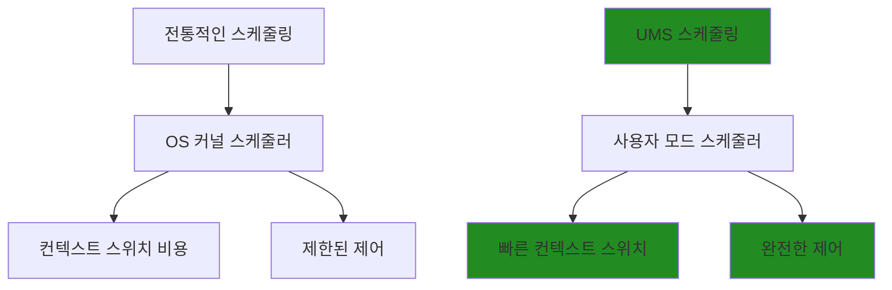
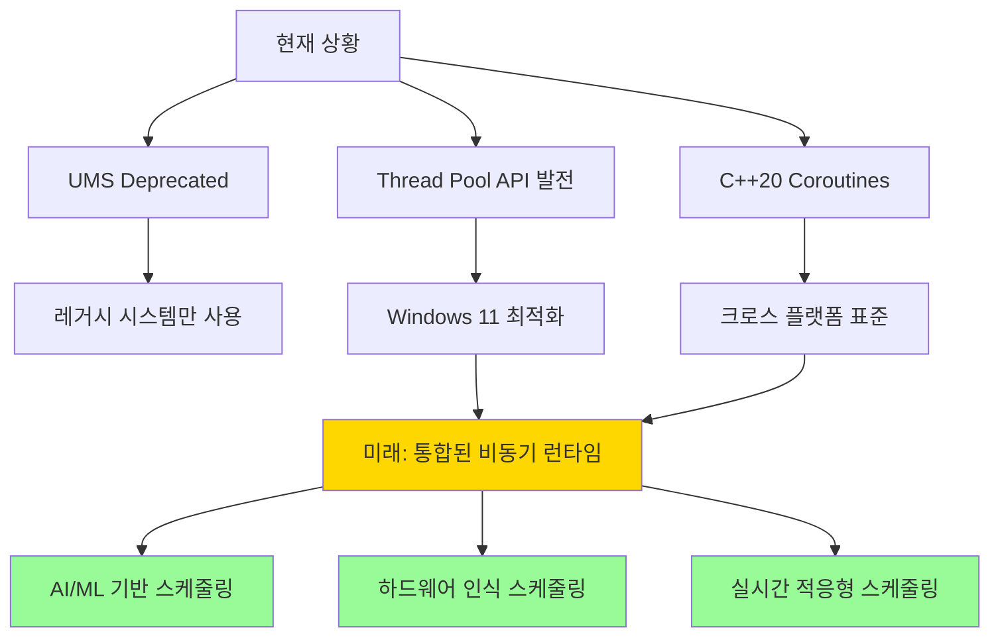

# 모던 Windows 멀티스레딩: 게임 서버 개발자를 위한 고성능 동시성 프로그래밍  

저자: 최흥배, Claude AI   
    
권장 개발 환경
- **IDE**: Visual Studio 2022 (Community 이상)
- **컴파일러**: MSVC v143 (C++20 지원)
- **OS**: Windows 10 이상

-----  
  
# 9장. User-Mode Scheduling (UMS)
[Windows 11부터 UMS를 지원하지 않는다](https://learn.microsoft.com/en-us/windows/win32/procthread/user-mode-scheduling )  
여기에서는 UMS라는 것이 무엇인지 아는 정도로만 한다.    

## 9.1 UMS의 개념과 한계

### UMS란 무엇인가?
User-Mode Scheduling(UMS)는 Windows 7에서 도입된 고급 스케줄링 메커니즘으로, 애플리케이션이 운영체제의 스케줄러를 우회하여 직접 스레드 스케줄링을 제어할 수 있게 해주는 기능이다. 이는 게임 서버와 같이 높은 성능과 정밀한 제어가 필요한 애플리케이션에서 매우 유용하다.



### UMS의 핵심 구성 요소

```
UMS 아키텍처:

┌─────────────────────────────────────────────────────────┐
│                    User Mode                            │
│  ┌──────────────┐  ┌──────────────┐  ┌──────────────┐  │
│  │ UMS Thread 1 │  │ UMS Thread 2 │  │ UMS Thread N │  │
│  └──────────────┘  └──────────────┘  └──────────────┘  │
│           │                │                │           │
│           └────────────────┼────────────────┘           │
│                           │                            │
│  ┌─────────────────────────▼─────────────────────────┐  │
│  │          Scheduler Thread (일반 스레드)           │  │
│  │     - UMS 스레드들의 스케줄링 로직 담당            │  │
│  │     - Completion List에서 실행 가능한 스레드 선택   │  │
│  └─────────────────────────────────────────────────────┘  │
│                           │                            │
│  ┌─────────────────────────▼─────────────────────────┐  │
│  │             Completion List                       │  │
│  │     - 실행 준비된 UMS 스레드들의 큐               │  │
│  │     - 커널이 UMS 스레드 상태 변화 시 알림          │  │
│  └─────────────────────────────────────────────────────┘  │
└─────────────────────────────────────────────────────────┘
```

### 핵심 API 함수들

```cpp
#include <windows.h>

// UMS 완료 리스트 생성
BOOL CreateUmsCompletionList(
    PUMS_COMPLETION_LIST* UmsCompletionList
);

// UMS 스케줄링 모드 진입
BOOL EnterUmsSchedulingMode(
    PUMS_SCHEDULER_STARTUP_INFO SchedulerStartupInfo,
    PUMS_COMPLETION_LIST UmsCompletionList
);

// UMS 스레드 생성
BOOL CreateUmsThreadContext(
    PUMS_CONTEXT* lpUmsThread
);

// UMS 스레드 실행
BOOL ExecuteUmsThread(
    PUMS_CONTEXT UmsThread
);

// 다음 UMS 스레드 획득
BOOL DequeueUmsCompletionListItems(
    PUMS_COMPLETION_LIST UmsCompletionList,
    DWORD WaitTimeOut,
    PUMS_CONTEXT* UmsThreadList
);
``` 
  

#### 1. CreateUmsCompletionList

**용도**: UMS 완료 리스트를 생성한다. 이 리스트는 실행 완료된 UMS 스레드들을 추적하는 자료구조이다.

**언제 사용**: 
- UMS 스케줄러를 초기화하기 전에 반드시 생성해야 한다
- 게임 서버에서 다수의 클라이언트 연결을 처리할 때, 완료된 작업들을 효율적으로 관리하기 위해 사용한다

**사용 방법**:
```cpp
PUMS_COMPLETION_LIST completionList = nullptr;
if (!CreateUmsCompletionList(&completionList)) {
    // 에러 처리
    DWORD error = GetLastError();
    // 로그 출력 및 예외 처리
}
```

#### 2. EnterUmsSchedulingMode

**용도**: 현재 스레드를 UMS 스케줄러 모드로 전환한다. 이 모드에서는 UMS 스레드들을 직접 스케줄링할 수 있다.

**언제 사용**:
- 게임 서버의 메인 워커 스레드에서 다수의 클라이언트 세션을 효율적으로 처리하고 싶을 때
- I/O 바운드 작업이 많은 환경에서 컨텍스트 스위칭 오버헤드를 줄이고 싶을 때

**사용 방법**:
```cpp
UMS_SCHEDULER_STARTUP_INFO startupInfo = {0};
startupInfo.UmsVersion = UMS_VERSION;
startupInfo.CompletionList = completionList;
startupInfo.SchedulerProc = MySchedulerProc; // 스케줄러 콜백 함수
startupInfo.SchedulerParam = nullptr;

if (!EnterUmsSchedulingMode(&startupInfo, completionList)) {
    // 에러 처리
}
```

#### 3. CreateUmsThreadContext

**용도**: UMS 스레드 컨텍스트를 생성한다. 일반 OS 스레드가 아닌 사용자 모드에서 관리되는 경량 스레드이다.

**언제 사용**:
- 게임 서버에서 각 플레이어 세션을 독립적인 UMS 스레드로 처리하고 싶을 때
- 많은 수의 동시 연결을 효율적으로 처리해야 하는 상황에서

**사용 방법**:
```cpp
PUMS_CONTEXT umsThread = nullptr;
if (!CreateUmsThreadContext(&umsThread)) {
    // 에러 처리
    return false;
}

// 스레드 속성 설정 (스택 크기, 시작 주소 등)
// SetUmsThreadInformation 등의 함수 사용
```

#### 4. ExecuteUmsThread

**용도**: 지정된 UMS 스레드의 실행을 시작한다. 스케줄러에서 특정 UMS 스레드를 실행하고 싶을 때 호출한다.

**언제 사용**:
- 스케줄러 콜백 함수 내에서 다음 실행할 스레드를 선택한 후
- 게임 서버에서 우선순위 기반으로 플레이어 요청을 처리할 때

**사용 방법**:
```cpp
// 스케줄러 콜백 함수 내에서
VOID WINAPI MySchedulerProc(
    UMS_SCHEDULER_REASON Reason,
    ULONG_PTR ActivationPayload,
    PVOID SchedulerParam
) {
    switch(Reason) {
        case UmsSchedulerStartup:
            // 첫 번째 UMS 스레드 실행
            if (!ExecuteUmsThread(firstUmsThread)) {
                // 에러 처리
            }
            break;
        // 기타 케이스 처리
    }
}
```

#### 5. DequeueUmsCompletionListItems

**용도**: 완료 리스트에서 실행이 완료된 UMS 스레드들을 가져온다. 블로킹 또는 타임아웃 방식으로 대기할 수 있다.

**언제 사용**:
- I/O 작업이 완료된 스레드들을 찾아서 후속 처리를 하고 싶을 때
- 게임 서버에서 네트워크 I/O 완료된 클라이언트 연결들을 처리할 때

**사용 방법**:
```cpp
PUMS_CONTEXT completedThreads[MAX_THREADS];
if (!DequeueUmsCompletionListItems(
    completionList,
    INFINITE, // 또는 특정 타임아웃 값
    completedThreads
)) {
    DWORD error = GetLastError();
    if (error == WAIT_TIMEOUT) {
        // 타임아웃 처리
    } else {
        // 기타 에러 처리
    }
}
```
    


## UMS API 사용 간단 예제
UMS API들을 실제로 사용하는 간단한 예제 코드를 보여주겠다.

### 전체적으로 이 코드의 목적

**기존 방식의 문제**: 플레이어 1000명이 접속하면 스레드 1000개가 필요해서 메모리를 많이 사용한다.

**UMS 방식의 장점**: 경량 스레드를 사용해서 더 적은 메모리로 더 많은 플레이어를 처리할 수 있다.

**실제 게임 서버 시나리오**: 
- 로비에서 대기 중인 플레이어들
- 매칭 시스템에서 처리 중인 요청들  
- 인게임에서 패킷을 주고받는 플레이어들

이런 상황들을 더 효율적으로 처리하기 위한 기술이다.


### 메인 예제 코드 (main 함수)

**무엇을 하는 코드**: 3개의 작업을 동시에 처리하는 경량 스레드 시스템이다.

**동작 과정**:
1. 작업 완료를 추적할 리스트를 만든다 (CreateUmsCompletionList)
2. 3개의 경량 스레드(UMS Thread)를 생성한다 (CreateUmsThreadContext)
3. 스케줄러가 이 3개 스레드를 순서대로 실행한다 (EnterUmsSchedulingMode)
4. 각 스레드는 1초간 작업하고 완료한다
5. 모든 작업이 끝나면 리소스를 정리한다

**결과**: "UMS Thread 1 작업 시작" → "UMS Thread 1 작업 완료" 이런 식으로 3개 스레드가 순차적으로 실행된다.

### 게임 서버 예제 코드

**무엇을 하는 코드**: 게임 서버에서 여러 플레이어를 동시에 처리하는 시스템이다.

**핵심 아이디어**: 
- 각 플레이어 연결을 하나의 경량 스레드로 처리한다
- 플레이어가 패킷을 보내면 해당 스레드가 깨어나서 처리한다
- 일반 스레드보다 메모리와 CPU를 적게 사용한다

### 완료 작업 처리 예제

**무엇을 하는 코드**: 끝난 작업들을 찾아서 정리하는 코드이다.

**언제 사용**: 
- 플레이어가 로그아웃했을 때
- 네트워크 연결이 끊어졌을 때
- 특정 작업이 완료되었을 때


### 전체 구조 예제

```cpp
#include <windows.h>
#include <iostream>
#include <vector>

// UMS 스레드 함수
VOID WINAPI UmsWorkerThread(LPVOID param) {
    int* taskId = (int*)param;
    
    // 게임 서버에서 클라이언트 요청 처리하는 작업 시뮬레이션
    std::cout << "UMS Thread " << *taskId << " 작업 시작" << std::endl;
    
    // 실제 작업 (예: 패킷 처리, DB 쿼리 등)
    Sleep(1000); // 작업 시뮬레이션
    
    std::cout << "UMS Thread " << *taskId << " 작업 완료" << std::endl;
}

// UMS 스케줄러 콜백 함수
VOID WINAPI UmsSchedulerProc(
    UMS_SCHEDULER_REASON reason,
    ULONG_PTR activationPayload,
    PVOID schedulerParam
) {
    static std::vector<PUMS_CONTEXT>* umsThreads = 
        (std::vector<PUMS_CONTEXT>*)schedulerParam;
    static int currentThreadIndex = 0;
    
    switch(reason) {
        case UmsSchedulerStartup:
            std::cout << "UMS 스케줄러 시작됨" << std::endl;
            // 첫 번째 스레드 실행
            if (currentThreadIndex < umsThreads->size()) {
                ExecuteUmsThread((*umsThreads)[currentThreadIndex++]);
            }
            break;
            
        case UmsSchedulerThreadBlocked:
            std::cout << "UMS 스레드가 블록됨 - 다음 스레드 실행" << std::endl;
            // 다음 스레드 실행
            if (currentThreadIndex < umsThreads->size()) {
                ExecuteUmsThread((*umsThreads)[currentThreadIndex++]);
            }
            break;
            
        case UmsSchedulerThreadYield:
            std::cout << "UMS 스레드가 양보함 - 다음 스레드 실행" << std::endl;
            // 다음 스레드 실행 또는 완료된 스레드 처리
            break;
    }
}

int main() {
    // 1. UMS 완료 리스트 생성
    PUMS_COMPLETION_LIST completionList = nullptr;
    if (!CreateUmsCompletionList(&completionList)) {
        std::cerr << "CreateUmsCompletionList 실패: " << GetLastError() << std::endl;
        return -1;
    }
    std::cout << "UMS 완료 리스트 생성 완료" << std::endl;
    
    // 2. UMS 스레드 컨텍스트들 생성
    const int THREAD_COUNT = 3;
    std::vector<PUMS_CONTEXT> umsThreads(THREAD_COUNT);
    std::vector<int> taskIds(THREAD_COUNT);
    
    for (int i = 0; i < THREAD_COUNT; i++) {
        // UMS 스레드 컨텍스트 생성
        if (!CreateUmsThreadContext(&umsThreads[i])) {
            std::cerr << "CreateUmsThreadContext 실패: " << GetLastError() << std::endl;
            return -1;
        }
        
        taskIds[i] = i + 1;
        
        // UMS 스레드 정보 설정
        UMS_CREATE_THREAD_ATTRIBUTES attrs = {0};
        attrs.UmsVersion = UMS_VERSION;
        attrs.UmsContext = umsThreads[i];
        attrs.UmsCompletionList = completionList;
        
        // 스레드 시작 주소와 파라미터 설정
        if (!SetUmsThreadInformation(umsThreads[i], 
                                   UmsThreadUserContext, 
                                   &taskIds[i], 
                                   sizeof(int*))) {
            std::cerr << "SetUmsThreadInformation 실패" << std::endl;
            return -1;
        }
    }
    std::cout << THREAD_COUNT << "개의 UMS 스레드 생성 완료" << std::endl;
    
    // 3. UMS 스케줄러 시작 정보 설정
    UMS_SCHEDULER_STARTUP_INFO startupInfo = {0};
    startupInfo.UmsVersion = UMS_VERSION;
    startupInfo.CompletionList = completionList;
    startupInfo.SchedulerProc = UmsSchedulerProc;
    startupInfo.SchedulerParam = &umsThreads; // 스케줄러에 스레드 리스트 전달
    
    std::cout << "UMS 스케줄링 모드 진입 시작" << std::endl;
    
    // 4. UMS 스케줄링 모드 진입 (여기서 스케줄러가 실행됨)
    if (!EnterUmsSchedulingMode(&startupInfo, completionList)) {
        std::cerr << "EnterUmsSchedulingMode 실패: " << GetLastError() << std::endl;
        return -1;
    }
    
    // 여기는 UMS 스케줄링이 끝난 후 실행됨
    std::cout << "모든 UMS 스레드 처리 완료" << std::endl;
    
    // 5. 완료된 스레드들 처리
    PUMS_CONTEXT completedThreads[THREAD_COUNT];
    if (DequeueUmsCompletionListItems(completionList, 
                                     0, // 즉시 반환
                                     completedThreads)) {
        std::cout << "완료된 스레드들 정리 중" << std::endl;
        // 완료된 스레드들 정리 작업
    }
    
    // 리소스 정리
    for (auto& thread : umsThreads) {
        DeleteUmsThreadContext(thread);
    }
    DeleteUmsCompletionList(completionList);
    
    return 0;
}
```
  


## UMS의 한계와 주의사항
UMS는 강력한 기능이지만 여러 한계점이 있다:

```cpp
// UMS 제한사항 확인
class UMSLimitations {
public:
    static bool CheckUMSAvailability() {
        // 1. Windows 버전 확인 (Windows 7 이상 필요)
        OSVERSIONINFOEX osvi = {0};
        osvi.dwOSVersionInfoSize = sizeof(OSVERSIONINFOEX);
        osvi.dwMajorVersion = 6;
        osvi.dwMinorVersion = 1; // Windows 7
        
        DWORDLONG conditionMask = 0;
        VER_SET_CONDITION(conditionMask, VER_MAJORVERSION, VER_GREATER_EQUAL);
        VER_SET_CONDITION(conditionMask, VER_MINORVERSION, VER_GREATER_EQUAL);
        
        if (!VerifyVersionInfo(&osvi, VER_MAJORVERSION | VER_MINORVERSION, conditionMask)) {
            std::cout << "Error: UMS requires Windows 7 or later\n";
            return false;
        }
        
        // 2. 서버 에디션 확인 (클라이언트 Windows에서는 제한적)
        DWORD productType;
        if (GetProductInfo(osvi.dwMajorVersion, osvi.dwMinorVersion, 
                          osvi.wServicePackMajor, osvi.wServicePackMinor, &productType)) {
            if (productType == PRODUCT_PROFESSIONAL || 
                productType == PRODUCT_ENTERPRISE ||
                productType >= PRODUCT_SERVER_FOUNDATION) {
                std::cout << "UMS is available on this edition\n";
                return true;
            }
        }
        
        std::cout << "Warning: UMS may have limitations on this Windows edition\n";
        return false;
    }
    
    static void PrintLimitations() {
        std::cout << "\n=== UMS 한계점 ===\n";
        std::cout << "1. Windows Server 에디션에서만 완전 지원\n";
        std::cout << "2. 디버깅 도구 지원 제한\n";
        std::cout << "3. 일부 Win32 API와 호환성 문제\n";
        std::cout << "4. 복잡한 구현과 유지보수\n";
        std::cout << "5. 현재 Microsoft에서 deprecated 상태\n\n";
    }
};
```


### 현대적 대안 기술들
UMS 대신 사용할 수 있는 현대적인 기술들을 살펴보겠다:

```cpp
class ModernAlternatives {
public:
    // 1. Windows Thread Pool API 활용
    static void DemonstrateThreadPoolAPI() {
        std::cout << "=== Modern Thread Pool API ===\n";
        
        // Thread Pool 환경 생성
        PTP_POOL pool = CreateThreadpool(nullptr);
        if (!pool) {
            std::cout << "Failed to create thread pool\n";
            return;
        }
        
        // 스레드 풀 설정
        SetThreadpoolThreadMaximum(pool, 8);
        SetThreadpoolThreadMinimum(pool, 2);
        
        // 콜백 환경 설정
        TP_CALLBACK_ENVIRON env;
        InitializeThreadpoolEnvironment(&env);
        SetThreadpoolCallbackPool(&env, pool);
        
        // 작업 항목 생성 및 제출
        for (int i = 0; i < 10; ++i) {
            PTP_WORK work = CreateThreadpoolWork(
                [](PTP_CALLBACK_INSTANCE, PVOID context, PTP_WORK) {
                    int taskId = reinterpret_cast<intptr_t>(context);
                    std::cout << "Processing task " << taskId << " on thread " 
                              << GetCurrentThreadId() << "\n";
                    
                    // 작업 시뮬레이션
                    std::this_thread::sleep_for(std::chrono::milliseconds(100));
                },
                reinterpret_cast<PVOID>(static_cast<intptr_t>(i)),
                &env
            );
            
            if (work) {
                SubmitThreadpoolWork(work);
                CloseThreadpoolWork(work);
            }
        }
        
        // 정리
        DestroyThreadpoolEnvironment(&env);
        CloseThreadpool(pool);
        
        std::cout << "Thread Pool demonstration completed\n\n";
    }
    
    // 2. C++20 코루틴 활용 (Windows에서는 제한적)
    static void DemonstrateCoroutines() {
        std::cout << "=== C++20 Coroutines Alternative ===\n";
        std::cout << "코루틴은 UMS와 유사한 협력적 멀티태스킹을 제공합니다.\n";
        std::cout << "장점: 크로스 플랫폼, 표준 C++, 디버깅 지원\n";
        std::cout << "단점: 컴파일러 지원 필요, 학습 곡선\n\n";
    }
    
    // 3. 커스텀 스케줄러 구현
    class CustomCooperativeScheduler {
    private:
        struct Task {
            std::function<bool()> func; // true: 완료, false: 재스케줄 필요
            TaskPriority priority;
            std::chrono::steady_clock::time_point nextRun;
            std::string name;
        };
        
        std::vector<std::queue<Task>> priorityQueues_;
        std::atomic<bool> running_{true};
        
    public:
        CustomCooperativeScheduler() : priorityQueues_(static_cast<size_t>(TaskPriority::PRIORITY_COUNT)) {}
        
        void ScheduleTask(std::function<bool()> func, TaskPriority priority, 
                         std::chrono::milliseconds delay = std::chrono::milliseconds(0),
                         const std::string& name = "Task") {
            Task task;
            task.func = std::move(func);
            task.priority = priority;
            task.nextRun = std::chrono::steady_clock::now() + delay;
            task.name = name;
            
            priorityQueues_[static_cast<size_t>(priority)].push(std::move(task));
        }
        
        void RunScheduler() {
            std::cout << "Custom Cooperative Scheduler started\n";
            
            while (running_.load()) {
                bool taskExecuted = false;
                auto now = std::chrono::steady_clock::now();
                
                // 우선순위 순으로 태스크 검사
                for (size_t priority = 0; priority < priorityQueues_.size(); ++priority) {
                    auto& queue = priorityQueues_[priority];
                    
                    if (!queue.empty()) {
                        auto& task = queue.front();
                        
                        if (now >= task.nextRun) {
                            // 태스크 실행
                            bool completed = task.func();
                            
                            if (completed) {
                                queue.pop(); // 태스크 완료
                            } else {
                                // 재스케줄 (큐의 뒤로 이동)
                                task.nextRun = now + std::chrono::milliseconds(1);
                                Task rescheduled = std::move(task);
                                queue.pop();
                                queue.push(std::move(rescheduled));
                            }
                            
                            taskExecuted = true;
                            break; // 한 번에 하나의 태스크만 실행
                        }
                    }
                }
                
                if (!taskExecuted) {
                    // CPU 양보
                    std::this_thread::sleep_for(std::chrono::microseconds(100));
                }
            }
            
            std::cout << "Custom Cooperative Scheduler stopped\n";
        }
        
        void Stop() {
            running_.store(false);
        }
    };
    
    static void DemonstrateCustomScheduler() {
        std::cout << "=== Custom Cooperative Scheduler ===\n";
        
        CustomCooperativeScheduler scheduler;
        
        // 몇 가지 태스크 추가
        scheduler.ScheduleTask(
            []() {
                static int count = 0;
                std::cout << "High priority task " << ++count << "\n";
                return count >= 5; // 5번 실행 후 완료
            },
            TaskPriority::HIGH,
            std::chrono::milliseconds(0),
            "HighTask"
        );
        
        scheduler.ScheduleTask(
            []() {
                static int count = 0;
                std::cout << "Normal priority task " << ++count << "\n";
                std::this_thread::sleep_for(std::chrono::milliseconds(50));
                return count >= 3; // 3번 실행 후 완료
            },
            TaskPriority::NORMAL,
            std::chrono::milliseconds(100),
            "NormalTask"
        );
        
        // 스케줄러 실행 (별도 스레드)
        std::thread schedulerThread([&scheduler]() {
            scheduler.RunScheduler();
        });
        
        // 5초 후 종료
        std::this_thread::sleep_for(std::chrono::seconds(5));
        scheduler.Stop();
        schedulerThread.join();
        
        std::cout << "Custom scheduler demonstration completed\n\n";
    }
};
```

### 미래 기술 전망


  


Windows 11에서 UMS가 지원되지 않는 이유들을 설명하겠다.

## 주요 이유들

### 1. **실제 성능 이득이 예상보다 적었음**
```
기대했던 것: 컨텍스트 스위칭 오버헤드 대폭 감소
실제 결과: 일반 스레드 풀과 큰 차이 없음
```

**이유**: 
- 현대 CPU의 컨텍스트 스위칭이 이미 충분히 빨라졌다
- OS 스케줄러 자체가 많이 개선되었다
- 메모리 접근 패턴이 성능에 더 큰 영향을 미치게 되었다
 

### 2. **복잡성 대비 이익이 낮음**

```cpp
// 일반 스레드 풀 (간단함)
ThreadPool.QueueUserWorkItem(ProcessPacket, packet);

// UMS (복잡함)
CreateUmsCompletionList(&completionList);
CreateUmsThreadContext(&umsThread);
EnterUmsSchedulingMode(&startupInfo, completionList);
// + 스케줄러 콜백 구현
// + 수동 스레드 관리
// + 복잡한 디버깅
```

**개발자들의 반응**: "성능 향상은 미미한데 코드는 10배 복잡해졌다"

### 3. **디버깅과 프로파일링의 어려움**

**기존 도구들이 제대로 작동하지 않음**:
- Visual Studio 디버거에서 UMS 스레드 추적 어려움
- 성능 프로파일러가 UMS 컨텍스트를 제대로 인식 못함
- 크래시 덤프 분석이 복잡해짐

**실제 개발 현장에서**:
```
"버그가 생기면 찾는데 하루 종일 걸리는데,
성능은 5% 정도밖에 안 좋아졌어요"
```

### 4. **더 나은 대안들의 등장**

**async/await 패턴 (C# 5.0+)**:
```csharp
// UMS보다 훨씬 간단하고 효율적
public async Task ProcessPacketAsync(Packet packet) {
    await gameLogic.UpdatePlayerAsync(packet.playerId);
    await networkManager.SendResponseAsync(packet.sessionId, response);
}
```

**Windows ThreadPool 개선**:
- Work Stealing Queue 도입
- NUMA 인식 스케줄링
- I/O 완료 포트와 더 나은 통합

### 5. **보안과 안정성 이슈**

**문제점들**:
```cpp
// UMS에서 실수하기 쉬운 패턴들
UmsThreadYield(nullptr); // 잘못된 타이밍에 호출하면 데드락
ExecuteUmsThread(thread); // 이미 실행 중인 스레드 실행 시 크래시
```

**보안 관점**: 사용자 모드에서 스케줄링 제어권을 주는 것이 공격 벡터가 될 수 있다.

### 6. **유지보수 비용**

**Microsoft 입장에서**:
- UMS를 사용하는 애플리케이션이 매우 적음 (1% 미만)
- 복잡한 코드 유지보수 비용이 큼
- 새로운 하드웨어와의 호환성 문제

## 현재 권장되는 대안들

### 1. **C# 환경 (게임 서버)**
```csharp
// Task 기반 비동기 처리
public async Task<bool> ProcessPlayerActionAsync(PlayerAction action) {
    await gameWorld.UpdateAsync(action);
    return true;
}

// Channel을 이용한 패킷 큐
var channel = Channel.CreateUnbounded<Packet>();
await foreach (var packet in channel.Reader.ReadAllAsync()) {
    await ProcessPacketAsync(packet);
}
```

### 2. **C++ 환경**
```cpp
// std::async와 future
auto future = std::async(std::launch::async, [packet] {
    return ProcessPacket(packet);
});

// Coroutines (C++20)
Task<void> ProcessPacketCoroutine(Packet packet) {
    co_await UpdateGameLogic(packet);
    co_await SendResponse(packet.sessionId);
}
```

### 3. **Golang 스타일 접근**
```go
// 고루틴과 채널 패턴을 C++로 구현
// 라이브러리: libco, boost.fiber 등 사용
```
  

## 게임 서버 개발 관점에서의 조언

**현재 추천하는 아키텍처**:

1. **C# 서버**: ASP.NET Core + SignalR + async/await
2. **C++ 서버**: IOCP + ThreadPool + std::async
3. **Go 서버**: goroutine + channel (가장 UMS와 유사한 경험)

**성능 최적화는**:
- 메모리 풀링
- 락-프리 자료구조  
- NUMA 인식 설계
- 캐시 친화적인 데이터 레이아웃

이런 것들이 UMS보다 훨씬 큰 성능 향상을 가져다준다.

**결론**: UMS는 "너무 이르게 나온 기술"이었고, 현재는 더 간단하면서도 효과적인 방법들이 많아졌다. 