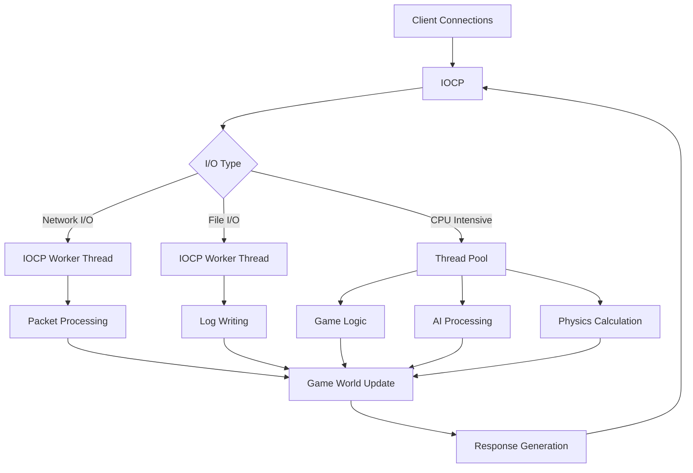

# 모던 Windows 멀티스레딩: 게임 서버 개발자를 위한 고성능 동시성 프로그래밍  

저자: 최흥배, Claude AI   
    
권장 개발 환경
- **IDE**: Visual Studio 2022 (Community 이상)
- **컴파일러**: MSVC v143 (C++20 지원)
- **OS**: Windows 10 이상

-----  
  
# 11장. 고성능 게임 서버 아키텍처
이제까지 우리는 Windows에서 제공하는 다양한 모던 멀티스레딩 API들을 개별적으로 살펴보았다. 이번 장에서는 이러한 API들을 실제 게임 서버 개발에 어떻게 조합하여 사용할 수 있는지, 그리고 고성능과 확장성을 모두 만족하는 아키텍처를 어떻게 설계할 수 있는지 알아보겠다.

## 11.1 모던 API를 활용한 서버 구조 설계

### 레이어드 아키텍처의 재정의
전통적인 게임 서버는 단순한 스레드 풀 방식으로 설계되었지만, 모던 Windows API를 활용하면 훨씬 정교하고 효율적인 구조를 만들 수 있다.

```
┌─────────────────────────────────────────────────┐
│                Application Layer                │
│  ┌─────────────┐ ┌─────────────┐ ┌────────────┐  │
│  │ Game Logic  │ │ Combat Sys  │ │ Trade Sys  │  │
│  └─────────────┘ └─────────────┘ └────────────┘  │
├─────────────────────────────────────────────────┤
│                Coordination Layer               │
│  ┌─────────────┐ ┌─────────────┐ ┌────────────┐  │
│  │Session Mgmt │ │ Work Queue  │ │Event Pump  │  │
│  └─────────────┘ └─────────────┘ └────────────┘  │
├─────────────────────────────────────────────────┤
│                Execution Layer                  │
│  ┌─────────────┐ ┌─────────────┐ ┌────────────┐  │
│  │Thread Pool  │ │ IOCP        │ │Timer Queue │  │
│  └─────────────┘ └─────────────┘ └────────────┘  │
├─────────────────────────────────────────────────┤
│                Foundation Layer                 │
│  ┌─────────────┐ ┌─────────────┐ ┌────────────┐  │
│  │Memory Pool  │ │Object Pool  │ │Lock Manager│  │
│  └─────────────┘ └─────────────┘ └────────────┘  │
└─────────────────────────────────────────────────┘
```

### 핵심 컴포넌트 설계
각 레이어의 핵심 컴포넌트들을 모던 API로 구현해보겠다.

```cpp
// 서버 아키텍처의 핵심 클래스
class ModernGameServer {
private:
    // 모던 API를 활용한 각종 매니저들
    std::unique_ptr<IOCPManager> iocp_manager_;
    std::unique_ptr<ThreadPoolManager> thread_pool_manager_;
    std::unique_ptr<SessionManager> session_manager_;
    std::unique_ptr<GameLogicManager> game_logic_manager_;
    
    // 전역 동기화 객체들
    SRWLOCK global_config_lock_;
    CONDITION_VARIABLE shutdown_cv_;
    INIT_ONCE server_init_once_;
    
    // 서버 상태
    std::atomic<ServerState> server_state_;
    
public:
    ModernGameServer() {
        InitializeSRWLock(&global_config_lock_);
        InitializeConditionVariable(&shutdown_cv_);
        server_state_.store(ServerState::Initializing);
    }
    
    bool Initialize() {
        BOOL success = FALSE;
        InitOnceExecuteOnce(&server_init_once_, 
                           [](PINIT_ONCE, PVOID param, PVOID*) -> BOOL {
            auto* server = static_cast<ModernGameServer*>(param);
            return server->InitializeInternal() ? TRUE : FALSE;
        }, this, nullptr);
        
        return success;
    }
    
private:
    bool InitializeInternal() {
        // IOCP 매니저 초기화
        iocp_manager_ = std::make_unique<IOCPManager>();
        if (!iocp_manager_->Initialize()) {
            return false;
        }
        
        // 스레드 풀 매니저 초기화
        thread_pool_manager_ = std::make_unique<ThreadPoolManager>();
        if (!thread_pool_manager_->Initialize()) {
            return false;
        }
        
        // 세션 매니저 초기화
        session_manager_ = std::make_unique<SessionManager>();
        if (!session_manager_->Initialize()) {
            return false;
        }
        
        // 게임 로직 매니저 초기화
        game_logic_manager_ = std::make_unique<GameLogicManager>();
        if (!game_logic_manager_->Initialize()) {
            return false;
        }
        
        server_state_.store(ServerState::Running);
        return true;
    }
};
```

### 이벤트 드리븐 아키텍처
모던 API를 활용한 이벤트 드리븐 방식으로 서버의 반응성을 극대화할 수 있다.

```cpp
class EventPump {
private:
    HANDLE event_handles_[MAX_EVENTS];
    std::function<void()> event_handlers_[MAX_EVENTS];
    DWORD event_count_;
    SRWLOCK event_lock_;
    std::atomic<bool> is_running_;

public:
    EventPump() : event_count_(0), is_running_(false) {
        InitializeSRWLock(&event_lock_);
    }
    
    void RegisterEvent(HANDLE event_handle, std::function<void()> handler) {
        AcquireSRWLockExclusive(&event_lock_);
        
        if (event_count_ < MAX_EVENTS) {
            event_handles_[event_count_] = event_handle;
            event_handlers_[event_count_] = std::move(handler);
            event_count_++;
        }
        
        ReleaseSRWLockExclusive(&event_lock_);
    }
    
    void Run() {
        is_running_.store(true);
        
        while (is_running_.load()) {
            AcquireSRWLockShared(&event_lock_);
            DWORD current_count = event_count_;
            ReleaseSRWLockShared(&event_lock_);
            
            if (current_count == 0) {
                Sleep(1);
                continue;
            }
            
            DWORD wait_result = WaitForMultipleObjects(
                current_count, event_handles_, FALSE, 100);
                
            if (wait_result >= WAIT_OBJECT_0 && 
                wait_result < WAIT_OBJECT_0 + current_count) {
                
                DWORD index = wait_result - WAIT_OBJECT_0;
                event_handlers_[index]();
            }
        }
    }
    
    void Stop() {
        is_running_.store(false);
    }
};
```
  

## 11.2 IOCP와 Thread Pool의 조화

### 하이브리드 동시성 모델
IOCP는 I/O 집약적인 작업에, Thread Pool은 CPU 집약적인 작업에 최적화되어 있습니다. 이 둘을 조합하면 최적의 성능을 얻을 수 있다.



### IOCP-Thread Pool 통합 관리자

```cpp
class HybridConcurrencyManager {
private:
    // IOCP 관련
    HANDLE iocp_handle_;
    std::vector<std::thread> iocp_workers_;
    
    // Thread Pool 관련
    PTP_POOL thread_pool_;
    PTP_CLEANUP_GROUP cleanup_group_;
    TP_CALLBACK_ENVIRON callback_environ_;
    
    // 작업 분류를 위한 메트릭스
    std::atomic<uint64_t> network_operations_;
    std::atomic<uint64_t> cpu_operations_;
    
    SRWLOCK metrics_lock_;

public:
    HybridConcurrencyManager() : 
        iocp_handle_(INVALID_HANDLE_VALUE),
        thread_pool_(nullptr),
        cleanup_group_(nullptr) {
        InitializeSRWLock(&metrics_lock_);
    }
    
    bool Initialize() {
        // IOCP 초기화
        iocp_handle_ = CreateIoCompletionPort(INVALID_HANDLE_VALUE, 
                                            nullptr, 0, 0);
        if (iocp_handle_ == nullptr) {
            return false;
        }
        
        // Thread Pool 초기화
        thread_pool_ = CreateThreadpool(nullptr);
        if (thread_pool_ == nullptr) {
            return false;
        }
        
        cleanup_group_ = CreateThreadpoolCleanupGroup();
        if (cleanup_group_ == nullptr) {
            return false;
        }
        
        InitializeThreadpoolEnvironment(&callback_environ_);
        SetThreadpoolCallbackPool(&callback_environ_, thread_pool_);
        SetThreadpoolCallbackCleanupGroup(&callback_environ_, 
                                        cleanup_group_, nullptr);
        
        // IOCP 워커 스레드 시작
        SYSTEM_INFO si;
        GetSystemInfo(&si);
        
        for (DWORD i = 0; i < si.dwNumberOfProcessors * 2; ++i) {
            iocp_workers_.emplace_back([this] { IOCPWorkerThread(); });
        }
        
        return true;
    }
    
    void SubmitNetworkOperation(std::shared_ptr<NetworkOperation> op) {
        network_operations_.fetch_add(1);
        
        // IOCP에 직접 제출
        OVERLAPPED* overlapped = op->GetOverlapped();
        PostQueuedCompletionStatus(iocp_handle_, 0, 
                                 reinterpret_cast<ULONG_PTR>(op.get()), 
                                 overlapped);
    }
    
    void SubmitCPUOperation(std::function<void()> operation) {
        cpu_operations_.fetch_add(1);
        
        // Thread Pool에 제출
        auto work = CreateThreadpoolWork([](PTP_CALLBACK_INSTANCE, PVOID context) {
            auto op = static_cast<std::function<void()>*>(context);
            (*op)();
            delete op;
        }, new std::function<void()>(std::move(operation)), &callback_environ_);
        
        if (work) {
            SubmitThreadpoolWork(work);
            CloseThreadpoolWork(work);
        }
    }
    
private:
    void IOCPWorkerThread() {
        DWORD bytes_transferred;
        ULONG_PTR completion_key;
        OVERLAPPED* overlapped;
        
        while (true) {
            BOOL result = GetQueuedCompletionStatus(
                iocp_handle_, &bytes_transferred, &completion_key, 
                &overlapped, INFINITE);
                
            if (!result && overlapped == nullptr) {
                // 서버 종료 신호
                break;
            }
            
            // 네트워크 작업 처리
            auto* operation = reinterpret_cast<NetworkOperation*>(completion_key);
            if (operation) {
                operation->ProcessCompletion(bytes_transferred, result);
            }
        }
    }
    
public:
    // 성능 모니터링을 위한 메트릭스
    struct PerformanceMetrics {
        uint64_t network_ops_per_sec;
        uint64_t cpu_ops_per_sec;
        double network_latency_avg;
        double cpu_utilization;
    };
    
    PerformanceMetrics GetMetrics() {
        AcquireSRWLockShared(&metrics_lock_);
        
        static uint64_t last_network_ops = 0;
        static uint64_t last_cpu_ops = 0;
        static auto last_time = std::chrono::steady_clock::now();
        
        auto current_time = std::chrono::steady_clock::now();
        auto elapsed = std::chrono::duration_cast<std::chrono::seconds>(
            current_time - last_time).count();
            
        PerformanceMetrics metrics{};
        if (elapsed > 0) {
            uint64_t current_network = network_operations_.load();
            uint64_t current_cpu = cpu_operations_.load();
            
            metrics.network_ops_per_sec = 
                (current_network - last_network_ops) / elapsed;
            metrics.cpu_ops_per_sec = 
                (current_cpu - last_cpu_ops) / elapsed;
                
            last_network_ops = current_network;
            last_cpu_ops = current_cpu;
            last_time = current_time;
        }
        
        ReleaseSRWLockShared(&metrics_lock_);
        return metrics;
    }
};
```
   

## 11.3 메모리 풀과 객체 풀 구현

### Lock-Free 메모리 풀
WaitOnAddress API를 활용하여 lock-free 메모리 풀을 구현할 수 있다.

아래 코드는 고성능 다중 스레드 환경을 위해 C++로 구현된 **Lock-Free 메모리 풀** 클래스다. 뮤텍스(Mutex)나 크리티컬 섹션(Critical Section)과 같은 잠금(Lock) 메커니즘을 사용하지 않고, 아토믹(Atomic) 연산을 기반으로 메모리 블록을 할당하고 해제한다.

```cpp
// 템플릿: 블록당 크기(BlockSize)와 총 블록 개수(BlockCount)를 컴파일 타임에 받는다.
template<size_t BlockSize, size_t BlockCount>
class LockFreeMemoryPool {
private:
    // 'alignas(64)' : 메모리 주소를 64바이트 경계로 정렬한다.
    // 이는 CPU 캐시 라인(L1/L2)의 크기(보통 64바이트)에 맞추어,
    // 'False Sharing'을 방지하고 성능을 향상시킨다.
    // False Sharing: 여러 스레드가 서로 다른 데이터를 수정하지만, 
    // 해당 데이터들이 우연히 같은 캐시 라인에 존재하여 불필요한 캐시 무효화가 발생하는 현상.
    struct alignas(64) Block {
        // 다음 free 블록을 가리키는 포인터.
        // atomic 변수로 선언되어, 여러 스레드가 동시에 접근해도 안전하다.
        std::atomic<Block*> next;
        // 실제 데이터가 저장될 공간.
        char data[BlockSize];
        
        // 생성자: next 포인터를 nullptr로 초기화한다.
        Block() : next(nullptr) {}
    };
    
    // [메모리 영역]
    // 실제 메모리 블록들을 저장하는 배열. 
    // 이 배열 자체도 64바이트로 정렬하여 캐시 라인 문제를 방지한다.
    alignas(64) Block blocks_[BlockCount];
    
    // [Lock-free 스택 관리]
    // 사용 가능한(free) 블록 리스트의 헤드(Top).
    // 이 포인터를 atomic하게 조작하여 락프리 스택(Free List)을 구현한다.
    // 역시 64바이트 정렬을 적용한다.
    alignas(64) std::atomic<Block*> free_head_;
    
    // 현재 할당된 블록의 개수 (통계용).
    // atomic으로 스레드 세이프하게 카운팅한다.
    alignas(64) std::atomic<uint32_t> allocation_count_;
    
    // [스레드 대기/알림(Wait/Notify) 관리]
    // WaitOnAddress/WakeByAddressAll API와 함께 사용될 변수.
    // 메모리 풀이 비었을 때 스레드를 재우고, 블록이 반납되면 깨우는 데 사용된다.
    // 해당 API는 4바이트 정렬이 필요하다.
    alignas(4) std::atomic<uint32_t> wait_variable_;

public:
    // 생성자: 메모리 풀을 초기화한다.
    LockFreeMemoryPool() : allocation_count_(0), wait_variable_(0) {
        // 모든 블록을 순서대로 연결하여 free list(연결 리스트)를 만든다.
        // (0) -> (1) -> ... -> (N-1) -> nullptr
        for (size_t i = 0; i < BlockCount - 1; ++i) {
            // store: 원자적으로 값을 쓴다. (초기화 시에는 다른 스레드가 없으므로 relaxed도 가능)
            blocks_[i].next.store(&blocks_[i + 1]);
        }
        // 마지막 블록의 next는 nullptr이다.
        blocks_[BlockCount - 1].next.store(nullptr);
        
        // free_head_가 첫 번째 블록(blocks_[0])을 가리키도록 설정한다.
        free_head_.store(&blocks_[0]);
    }
    
    // 메모리 할당 함수 (Lock-Free Stack Pop)
    void* Allocate() {
        // CAS(Compare-And-Swap) 루프
        while (true) {
            // 현재 free list의 헤드를 원자적으로 읽는다.
            Block* head = free_head_.load();
            
            // [Case 1: 메모리 풀이 비었음]
            if (head == nullptr) {
                // 사용 가능한 메모리가 없으므로, 대기 상태로 진입한다.
                
                // 현재 wait_variable_ 값을 읽어둔다. (대기 조건)
                uint32_t current_wait = wait_variable_.load();
                
                // WaitOnAddress: 
                // 1. &wait_variable_ 주소의 값이 current_wait와 *같은지* 확인한다.
                // 2. [같으면] 스레드를 잠재운다(대기). WakeByAddressAll이 호출될 때까지.
                // 3. [다르면] (즉, 우리가 load한 이후 Deallocate가 발생하여 값이 바뀜)
                //    대기하지 않고 즉시 반환된다.
                WaitOnAddress(&wait_variable_, &current_wait, 
                              sizeof(uint32_t), INFINITE); // 무한정 대기
                
                // 스레드가 깨어났거나(Deallocate 발생) 대기 진입에 실패했다.
                // 루프의 처음으로 돌아가 할당을 다시 시도한다.
                continue; 
            }
            
            // [Case 2: 메모리가 있음]
            // 현재 헤드(head)가 가리키는 다음 블록(next)을 미리 읽어둔다.
            Block* next = head->next.load();
            
            // CAS 연산 (compare_exchange_weak):
            // free_head_의 현재 값이 'head'와 같은지 원자적으로 비교한다.
            // 
            // [성공] (같다면) free_head_의 값을 'next'로 바꾼다. (Pop 성공)
            //    -> 이 스레드가 블록(head)을 성공적으로 획득했다. true 반환.
            // [실패] (같지 않다면) (그 사이 다른 스레드가 먼저 할당/해제에 성공함)
            //    -> 'head' 변수의 값을 free_head_의 현재 값으로 덮어쓰고 false 반환.
            //
            // (weak는 루프 안에서 사용할 때 성능이 더 좋은 CAS다)
            if (free_head_.compare_exchange_weak(head, next)) {
                // CAS 성공! 블록 할당에 성공했다.
                allocation_count_.fetch_add(1); // 할당 카운트 증가
                return head->data; // 실제 데이터가 저장될 포인터(data)를 반환한다.
            }
            // CAS 실패 시 (경합 발생), 루프를 다시 돈다.
        }
    }
    
    // 메모리 해제 함수 (Lock-Free Stack Push)
    void Deallocate(void* ptr) {
        if (ptr == nullptr) return; // 널 포인터 해제 시도 방지
        
        // 사용자가 반환한 데이터 포인터(ptr)로부터
        // Block 구조체의 시작 주소를 역산한다.
        // (data 멤버의 오프셋만큼 주소를 되돌린다)
        Block* block = reinterpret_cast<Block*>(
            static_cast<char*>(ptr) - offsetof(Block, data));
            
        // CAS 루프 (Push 시도)
        while (true) {
            // 현재 free list의 헤드를 읽는다.
            Block* head = free_head_.load();
            // 우리가 반납할 블록(block)의 next가 현재 헤드(head)를 가리키도록 설정한다.
            block->next.store(head);
            
            // CAS 연산 (compare_exchange_weak):
            // free_head_의 현재 값이 'head'와 같은지 원자적으로 비교한다.
            //
            // [성공] (같다면) free_head_의 값을 'block'(반납할 블록)으로 바꾼다. (Push 성공)
            // [실패] (같지 않다면) (경합 발생) 'head'를 현재 값으로 갱신.
            if (free_head_.compare_exchange_weak(head, block)) {
                // CAS 성공! 블록 반납이 완료되었다.
                allocation_count_.fetch_sub(1); // 할당 카운트 감소
                
                // [중요] 대기 중인 스레드 깨우기
                
                // 1. wait_variable_의 값을 원자적으로 1 증가시킨다.
                //    (WaitOnAddress는 값이 *변경*되어야 깨어나므로, 값을 바꿔준다)
                wait_variable_.fetch_add(1);
                
                // 2. WakeByAddressAll: wait_variable_ 주소에서 대기 중인(WaitOnAddress)
                //    *모든* 스레드를 깨운다.
                WakeByAddressAll(&wait_variable_);
                
                // 해제 작업 완료
                break;
            }
            // CAS 실패 시, 루프를 다시 돌아 Push를 재시도한다.
        }
    }
    
    // 메모리 사용량 통계 구조체
    struct MemoryStats {
        uint32_t allocated_blocks; // 할당된 블록 수
        uint32_t free_blocks;      // 사용 가능한 블록 수
        double utilization_rate; // 사용률 (%)
    };
    
    // 현재 메모리 풀 통계를 반환하는 함수
    MemoryStats GetStats() const {
        // atomic 변수에서 현재 값을 원자적으로 읽어온다.
        uint32_t allocated = allocation_count_.load();
        uint32_t free = BlockCount - allocated;
        double utilization = static_cast<double>(allocated) / BlockCount * 100.0;
        
        return { allocated, free, utilization };
    }
};
```

-----

이 코드는 고정된 크기(`BlockSize`)의 메모리 블록을 고정된 개수(`BlockCount`)만큼 미리 할당해두고(배열 `blocks_`) 이를 재사용하는 메모리 풀이다.

#### 1\. 핵심 자료 구조: Lock-Free 스택

  * 이 메모리 풀은 사용 가능한 블록(Free List)을 관리하기 위해 *\락프리 스택(Lock-Free Stack)** 을 사용한다.
  * `free_head_` 변수가 스택의 `Top` 역할을 한다.
  * `Allocate()`는 스택에서 `Pop`하는 연산이다.
  * `Deallocate()`는 스택에 `Push`하는 연산이다.

### 2\. 핵심 동작: `compare_exchange_weak` (CAS)

  * 이 락프리 스택은 **CAS(Compare-And-Swap)** 원자적 연산을 기반으로 동작한다. `std::atomic::compare_exchange_weak`가 이 역할을 수행한다.
  * **경합 (Contention)**: 여러 스레드가 동시에 `Allocate`나 `Deallocate`를 시도하면, 단 하나의 스레드만 CAS 연산에 성공하고 나머지는 실패한다.
  * **재시도 (Retry)**: CAS에 실패한 스레드는 `while(true)` 루프에 따라 현재 `free_head_` 값을 다시 읽어와 CAS 연산을 재시도한다. 이것이 락프리 알고리즘의 기본이다.

### 3\. 성능 최적화: `alignas(64)`와 False Sharing

  * `Block` 구조체, `blocks_` 배열, `free_head_` 등 여러 스레드가 접근할 수 있는 주요 변수들에 `alignas(64)` 키워드가 사용되었다.
  * 이는 CPU 캐시 라인(보통 64바이트)에 주소를 맞추는 것이다.
  * 만약 `free_head_`와 `allocation_count_`가 같은 캐시 라인에 있다면, 스레드 A가 `Allocate`(free\_head\_ 수정)하고 스레드 B가 `Deallocate`(allocation\_count\_ 수정)할 때, 서로 다른 데이터를 수정함에도 불구하고 캐시 라인 무효화가 발생하여 심각한 성능 저하(이를 **False Sharing**이라 함)가 발생한다.
  * `alignas(64)`는 이 변수들을 서로 다른 캐시 라인에 배치하여 False Sharing을 방지한다.

### 4\. 효율적인 대기: `WaitOnAddress` / `WakeByAddressAll`

  * 이 메모리 풀의 가장 독특한 부분이다.
  * **`Allocate` 시 메모리가 없다면?**
      * (나쁜 방식) `while(free_head_.load() == nullptr) {}` 처럼 스핀락(Spinlock)을 돌면 CPU 자원을 100% 낭비한다.
      * (무거운 방식) `std::condition_variable`이나 커널 이벤트를 사용하면 스레드가 잠들고 깨어날 때마다 커널 모드-유저 모드 전환이 발생하여 비용이 크다.
  * **`WaitOnAddress` (Windows API)**:
      * 이 API는 `wait_variable_`라는 변수의 값이 특정 값(current\_wait)과 *같을 때만* 스레드를 잠재운다.
      * 커널 개입 없이 유저 모드에서 효율적으로 대기할 수 있다.
  * **`Deallocate` 시 깨우기**:
      * 블록을 반납(Push)한 스레드는 `wait_variable_`의 값을 1 증가시켜 값을 *변경*한다.
      * `WakeByAddressAll`을 호출하여 `wait_variable_` 주소에서 대기 중인 모든 스레드를 깨운다.
      * 깨어난 스레드들은 `Allocate` 루프를 다시 돌며 할당을 시도한다.
  * 이 방식은 메모리 풀이 비었을 때의 CPU 낭비를 없애고, 커널 동기화 객체를 사용할 때보다 훨씬 가볍게 스레드를 대기/알림 처리한다.

### 객체 풀과 RAII 패턴

```cpp
template<typename T, size_t PoolSize>
class ThreadSafeObjectPool {
private:
    struct ObjectWrapper {
        alignas(T) char storage[sizeof(T)];
        std::atomic<bool> in_use;
        
        ObjectWrapper() : in_use(false) {}
        
        T* GetObject() {
            return reinterpret_cast<T*>(storage);
        }
    };
    
    ObjectWrapper objects_[PoolSize];
    SRWLOCK pool_lock_;
    CONDITION_VARIABLE available_cv_;
    std::atomic<size_t> available_count_;

public:
    class PooledObject {
    private:
        T* object_;
        ThreadSafeObjectPool* pool_;
        
    public:
        PooledObject(T* obj, ThreadSafeObjectPool* pool) 
            : object_(obj), pool_(pool) {}
            
        ~PooledObject() {
            if (object_ && pool_) {
                pool_->ReturnObject(object_);
            }
        }
        
        // 이동만 허용
        PooledObject(const PooledObject&) = delete;
        PooledObject& operator=(const PooledObject&) = delete;
        
        PooledObject(PooledObject&& other) noexcept 
            : object_(other.object_), pool_(other.pool_) {
            other.object_ = nullptr;
            other.pool_ = nullptr;
        }
        
        PooledObject& operator=(PooledObject&& other) noexcept {
            if (this != &other) {
                if (object_ && pool_) {
                    pool_->ReturnObject(object_);
                }
                object_ = other.object_;
                pool_ = other.pool_;
                other.object_ = nullptr;
                other.pool_ = nullptr;
            }
            return *this;
        }
        
        T* operator->() { return object_; }
        T& operator*() { return *object_; }
        T* get() { return object_; }
    };
    
    ThreadSafeObjectPool() : available_count_(PoolSize) {
        InitializeSRWLock(&pool_lock_);
        InitializeConditionVariable(&available_cv_);
    }
    
    template<typename... Args>
    std::optional<PooledObject> AcquireObject(Args&&... args) {
        AcquireSRWLockExclusive(&pool_lock_);
        
        // 사용 가능한 객체 찾기
        for (size_t i = 0; i < PoolSize; ++i) {
            bool expected = false;
            if (objects_[i].in_use.compare_exchange_strong(expected, true)) {
                T* obj = objects_[i].GetObject();
                new(obj) T(std::forward<Args>(args)...);
                
                available_count_.fetch_sub(1);
                ReleaseSRWLockExclusive(&pool_lock_);
                
                return PooledObject(obj, this);
            }
        }
        
        ReleaseSRWLockExclusive(&pool_lock_);
        return std::nullopt;
    }
    
    template<typename... Args>
    PooledObject AcquireObjectBlocking(Args&&... args) {
        while (true) {
            auto obj = AcquireObject(std::forward<Args>(args)...);
            if (obj) {
                return std::move(*obj);
            }
            
            // 객체가 반환될 때까지 대기
            AcquireSRWLockShared(&pool_lock_);
            while (available_count_.load() == 0) {
                SleepConditionVariableSRW(&available_cv_, &pool_lock_, 
                                        INFINITE, CONDITION_VARIABLE_LOCKMODE_SHARED);
            }
            ReleaseSRWLockShared(&pool_lock_);
        }
    }
    
private:
    void ReturnObject(T* obj) {
        obj->~T();  // 소멸자 호출
        
        // 해당 객체를 찾아서 반환
        for (size_t i = 0; i < PoolSize; ++i) {
            if (objects_[i].GetObject() == obj) {
                objects_[i].in_use.store(false);
                available_count_.fetch_add(1);
                
                // 대기 중인 스레드 깨우기
                WakeConditionVariable(&available_cv_);
                break;
            }
        }
    }
    
    friend class PooledObject;
};
```

## 11.4 확장 가능한 아키텍처 패턴

### Actor 모델 구현

```cpp
class Actor {
private:
    std::queue<std::function<void()>> message_queue_;
    SRWLOCK queue_lock_;
    CONDITION_VARIABLE message_cv_;
    std::atomic<bool> is_processing_;
    PTP_WORK work_item_;
    TP_CALLBACK_ENVIRON callback_environ_;

public:
    Actor() : is_processing_(false), work_item_(nullptr) {
        InitializeSRWLock(&queue_lock_);
        InitializeConditionVariable(&message_cv_);
        InitializeThreadpoolEnvironment(&callback_environ_);
    }
    
    template<typename F>
    void SendMessage(F&& message) {
        {
            AcquireSRWLockExclusive(&queue_lock_);
            message_queue_.push(std::forward<F>(message));
            ReleaseSRWLockExclusive(&queue_lock_);
        }
        
        WakeConditionVariable(&message_cv_);
        ScheduleProcessing();
    }
    
private:
    void ScheduleProcessing() {
        bool expected = false;
        if (is_processing_.compare_exchange_strong(expected, true)) {
            work_item_ = CreateThreadpoolWork(
                [](PTP_CALLBACK_INSTANCE, PVOID context) {
                    static_cast<Actor*>(context)->ProcessMessages();
                }, this, &callback_environ_);
                
            if (work_item_) {
                SubmitThreadpoolWork(work_item_);
            }
        }
    }
    
    void ProcessMessages() {
        while (true) {
            std::function<void()> message;
            
            {
                AcquireSRWLockExclusive(&queue_lock_);
                if (message_queue_.empty()) {
                    is_processing_.store(false);
                    ReleaseSRWLockExclusive(&queue_lock_);
                    break;
                }
                
                message = std::move(message_queue_.front());
                message_queue_.pop();
                ReleaseSRWLockExclusive(&queue_lock_);
            }
            
            // 메시지 처리
            try {
                message();
            } catch (...) {
                // 예외 처리
            }
        }
        
        if (work_item_) {
            CloseThreadpoolWork(work_item_);
            work_item_ = nullptr;
        }
    }
};
```

### 파이프라인 패턴

```cpp
template<typename Input, typename Output>
class PipelineStage {
public:
    virtual ~PipelineStage() = default;
    virtual Output Process(const Input& input) = 0;
};

template<typename T>
class Pipeline {
private:
    struct StageInfo {
        std::unique_ptr<PipelineStage<T, T>> stage;
        std::queue<T> input_queue;
        SRWLOCK queue_lock;
        CONDITION_VARIABLE data_available_cv;
        std::thread worker_thread;
        std::atomic<bool> should_stop;
        
        StageInfo() : should_stop(false) {
            InitializeSRWLock(&queue_lock);
            InitializeConditionVariable(&data_available_cv);
        }
    };
    
    std::vector<std::unique_ptr<StageInfo>> stages_;
    std::function<void(const T&)> output_handler_;

public:
    template<typename StageType>
    void AddStage() {
        auto stage_info = std::make_unique<StageInfo>();
        stage_info->stage = std::make_unique<StageType>();
        
        size_t stage_index = stages_.size();
        
        stage_info->worker_thread = std::thread([this, stage_index]() {
            WorkerLoop(stage_index);
        });
        
        stages_.push_back(std::move(stage_info));
    }
    
    void SetOutputHandler(std::function<void(const T&)> handler) {
        output_handler_ = std::move(handler);
    }
    
    void ProcessItem(const T& item) {
        if (!stages_.empty()) {
            auto& first_stage = stages_[0];
            
            AcquireSRWLockExclusive(&first_stage->queue_lock);
            first_stage->input_queue.push(item);
            ReleaseSRWLockExclusive(&first_stage->queue_lock);
            
            WakeConditionVariable(&first_stage->data_available_cv);
        }
    }
    
private:
    void WorkerLoop(size_t stage_index) {
        auto& current_stage = stages_[stage_index];
        
        while (!current_stage->should_stop.load()) {
            T item;
            bool has_item = false;
            
            // 입력 큐에서 아이템 가져오기
            {
                AcquireSRWLockExclusive(&current_stage->queue_lock);
                while (current_stage->input_queue.empty() && 
                       !current_stage->should_stop.load()) {
                    SleepConditionVariableSRW(&current_stage->data_available_cv,
                                            &current_stage->queue_lock,
                                            INFINITE, 0);
                }
                
                if (!current_stage->input_queue.empty()) {
                    item = std::move(current_stage->input_queue.front());
                    current_stage->input_queue.pop();
                    has_item = true;
                }
                ReleaseSRWLockExclusive(&current_stage->queue_lock);
            }
            
            if (has_item) {
                // 아이템 처리
                T processed_item = current_stage->stage->Process(item);
                
                // 다음 스테이지로 전달하거나 출력
                if (stage_index + 1 < stages_.size()) {
                    auto& next_stage = stages_[stage_index + 1];
                    
                    AcquireSRWLockExclusive(&next_stage->queue_lock);
                    next_stage->input_queue.push(std::move(processed_item));
                    ReleaseSRWLockExclusive(&next_stage->queue_lock);
                    
                    WakeConditionVariable(&next_stage->data_available_cv);
                } else if (output_handler_) {
                    output_handler_(processed_item);
                }
            }
        }
    }
};
```

### 실전 예제: MMORPG 던전 시스템

```cpp
class DungeonInstance {
private:
    // 동기화 객체들
    SRWLOCK player_list_lock_;
    SRWLOCK monster_list_lock_;
    CONDITION_VARIABLE update_cv_;
    SYNCHRONIZATION_BARRIER frame_barrier_;
    
    // 게임 데이터
    std::vector<std::shared_ptr<Player>> players_;
    std::vector<std::shared_ptr<Monster>> monsters_;
    std::atomic<uint32_t> frame_counter_;
    
    // 스레드 풀 작업들
    PTP_TIMER update_timer_;
    TP_CALLBACK_ENVIRON callback_environ_;

public:
    DungeonInstance(uint32_t max_players) : frame_counter_(0) {
        InitializeSRWLock(&player_list_lock_);
        InitializeSRWLock(&monster_list_lock_);
        InitializeConditionVariable(&update_cv_);
        
        // 프레임 동기화를 위한 배리어 초기화
        InitializeSynchronizationBarrier(&frame_barrier_, max_players + 1, -1);
        
        InitializeThreadpoolEnvironment(&callback_environ_);
        
        // 게임 업데이트 타이머 설정 (60 FPS)
        FILETIME due_time{};
        ULARGE_INTEGER due_time_value;
        due_time_value.QuadPart = static_cast<ULONGLONG>(-166667LL); // 16.67ms
        due_time.dwLowDateTime = due_time_value.LowPart;
        due_time.dwHighDateTime = due_time_value.HighPart;
        
        update_timer_ = CreateThreadpoolTimer(
            [](PTP_CALLBACK_INSTANCE, PVOID context, PTP_TIMER) {
                static_cast<DungeonInstance*>(context)->UpdateFrame();
            }, this, &callback_environ_);
            
        SetThreadpoolTimer(update_timer_, &due_time, 17, 0); // 17ms 간격
    }
    
    void AddPlayer(std::shared_ptr<Player> player) {
        AcquireSRWLockExclusive(&player_list_lock_);
        players_.push_back(std::move(player));
        ReleaseSRWLockExclusive(&player_list_lock_);
    }
    
private:
    void UpdateFrame() {
        uint32_t current_frame = frame_counter_.fetch_add(1);
        
        // 1. 플레이어 업데이트 (병렬)
        UpdatePlayersParallel();
        
        // 2. 몬스터 업데이트 (병렬)
        UpdateMonstersParallel();
        
        // 3. 충돌 검사
        CheckCollisions();
        
        // 4. 프레임 동기화
        EnterSynchronizationBarrier(&frame_barrier_, SYNCHRONIZATION_BARRIER_FLAGS_BLOCK_ONLY);
        
        // 5. 결과 브로드캐스트
        BroadcastFrameResults(current_frame);
    }
    
    void UpdatePlayersParallel() {
        AcquireSRWLockShared(&player_list_lock_);
        auto players_copy = players_;  // 복사본 생성
        ReleaseSRWLockShared(&player_list_lock_);
        
        // 각 플레이어를 별도 스레드에서 업데이트
        std::vector<PTP_WORK> work_items;
        work_items.reserve(players_copy.size());
        
        for (auto& player : players_copy) {
            auto work = CreateThreadpoolWork(
                [](PTP_CALLBACK_INSTANCE, PVOID context) {
                    auto* p = static_cast<Player*>(context);
                    p->Update();
                }, player.get(), &callback_environ_);
                
            if (work) {
                SubmitThreadpoolWork(work);
                work_items.push_back(work);
            }
        }
        
        // 모든 작업 완료 대기
        for (auto work : work_items) {
            WaitForThreadpoolWorkCallbacks(work, FALSE);
            CloseThreadpoolWork(work);
        }
    }
    
    void UpdateMonstersParallel() {
        AcquireSRWLockShared(&monster_list_lock_);
        auto monsters_copy = monsters_;
        ReleaseSRWLockShared(&monster_list_lock_);
        
        // 몬스터 AI 업데이트를 배치 단위로 처리
        const size_t batch_size = 10;
        
        for (size_t i = 0; i < monsters_copy.size(); i += batch_size) {
            size_t end = std::min(i + batch_size, monsters_copy.size());
            
            auto work = CreateThreadpoolWork(
                [](PTP_CALLBACK_INSTANCE, PVOID context) {
                    auto* batch_info = static_cast<std::pair<size_t, size_t>*>(context);
                    // 배치 처리 로직
                    delete batch_info;
                }, new std::pair<size_t, size_t>(i, end), &callback_environ_);
                
            if (work) {
                SubmitThreadpoolWork(work);
                CloseThreadpoolWork(work);
            }
        }
    }
    
    void CheckCollisions() {
        // 공간 분할을 통한 효율적인 충돌 검사
        // SRW Lock으로 읽기 전용 접근 보장
    }
    
    void BroadcastFrameResults(uint32_t frame_id) {
        // 모든 클라이언트에게 프레임 결과 전송
        // IOCP를 통한 비동기 전송
    }
};
```

이렇게 모던 Windows API들을 조합하면 기존의 단순한 멀티스레딩 방식보다 훨씬 효율적이고 확장 가능한 게임 서버 아키텍처를 구축할 수 있다. 다음 장에서는 이러한 아키텍처를 실제 게임 장르별로 어떻게 적용할 수 있는지 구체적인 케이스 스터디를 통해 살펴보겠다.  