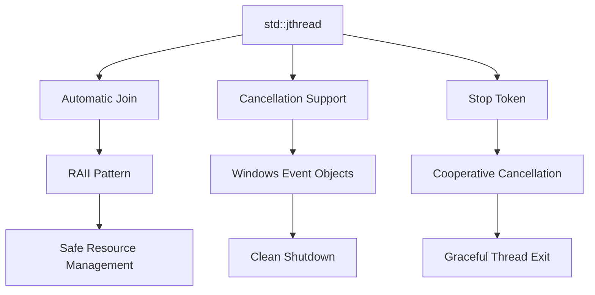
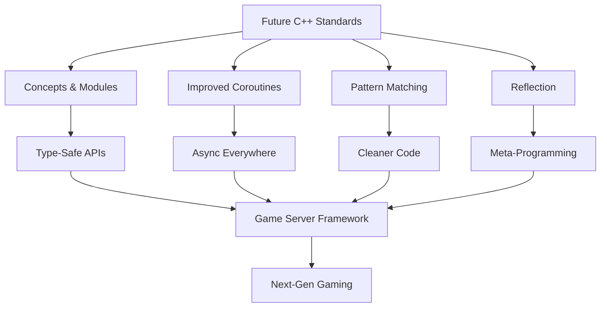

# 모던 Windows 멀티스레딩: 게임 서버 개발자를 위한 고성능 동시성 프로그래밍  

저자: 최흥배, Claude AI   
    
권장 개발 환경
- **IDE**: Visual Studio 2022 (Community 이상)
- **컴파일러**: MSVC v143 (C++20 지원)
- **OS**: Windows 10 이상

-----  
  
## 12장. C++23과의 시너지
C++23은 멀티스레딩과 비동기 프로그래밍 영역에서 많은 개선사항을 제공한다. 이번 장에서는 Windows의 모던 멀티스레딩 API들과 C++23의 최신 기능들을 어떻게 조합하여 더욱 안전하고 효율적인 게임 서버를 구축할 수 있는지 살펴보겠다.

## 12.1 std::jthread와 Windows API 통합

### std::jthread의 장점과 Windows API 활용
C++20에서 도입된 `std::jthread`는 기존 `std::thread`의 문제점들을 해결하고, C++23에서 더욱 개선되었다. Windows API와 함께 사용하면 더욱 강력한 동시성 시스템을 구축할 수 있다.



### RAII 기반 Windows API 래퍼

```cpp
// Windows API를 C++23 스타일로 래핑
class WindowsThreadManager {
private:
    // Windows API 리소스를 RAII로 관리
    class SRWLockGuard {
    private:
        SRWLOCK* lock_;
        bool is_exclusive_;
        
    public:
        explicit SRWLockGuard(SRWLOCK* lock, bool exclusive = true) 
            : lock_(lock), is_exclusive_(exclusive) {
            if (is_exclusive_) {
                AcquireSRWLockExclusive(lock_);
            } else {
                AcquireSRWLockShared(lock_);
            }
        }
        
        ~SRWLockGuard() {
            if (is_exclusive_) {
                ReleaseSRWLockExclusive(lock_);
            } else {
                ReleaseSRWLockShared(lock_);
            }
        }
        
        // 복사/이동 금지
        SRWLockGuard(const SRWLockGuard&) = delete;
        SRWLockGuard& operator=(const SRWLockGuard&) = delete;
        SRWLockGuard(SRWLockGuard&&) = delete;
        SRWLockGuard& operator=(SRWLockGuard&&) = delete;
    };
    
    class ConditionVariableWrapper {
    private:
        CONDITION_VARIABLE cv_;
        
    public:
        ConditionVariableWrapper() {
            InitializeConditionVariable(&cv_);
        }
        
        void notify_one() {
            WakeConditionVariable(&cv_);
        }
        
        void notify_all() {
            WakeAllConditionVariable(&cv_);
        }
        
        template<typename Predicate>
        void wait(SRWLockGuard& lock, Predicate pred) {
            while (!pred()) {
                SleepConditionVariableSRW(&cv_, lock.lock_, INFINITE, 
                    lock.is_exclusive_ ? 0 : CONDITION_VARIABLE_LOCKMODE_SHARED);
            }
        }
        
        template<typename Rep, typename Period, typename Predicate>
        bool wait_for(SRWLockGuard& lock, 
                     const std::chrono::duration<Rep, Period>& timeout_duration,
                     Predicate pred) {
            auto start_time = std::chrono::steady_clock::now();
            
            while (!pred()) {
                auto elapsed = std::chrono::steady_clock::now() - start_time;
                if (elapsed >= timeout_duration) {
                    return false;
                }
                
                auto remaining = std::chrono::duration_cast<std::chrono::milliseconds>(
                    timeout_duration - elapsed);
                
                BOOL result = SleepConditionVariableSRW(&cv_, lock.lock_, 
                    static_cast<DWORD>(remaining.count()),
                    lock.is_exclusive_ ? 0 : CONDITION_VARIABLE_LOCKMODE_SHARED);
                    
                if (!result && GetLastError() == ERROR_TIMEOUT) {
                    return pred();
                }
            }
            return true;
        }
    };

public:
    // std::jthread를 활용한 작업자 스레드 관리
    class WorkerThreadPool {
    private:
        struct WorkerContext {
            std::jthread thread;
            std::queue<std::function<void()>> tasks;
            SRWLOCK tasks_lock;
            ConditionVariableWrapper tasks_cv;
            std::atomic<bool> is_busy{false};
            
            WorkerContext() {
                InitializeSRWLock(&tasks_lock);
            }
        };
        
        std::vector<std::unique_ptr<WorkerContext>> workers_;
        std::atomic<size_t> next_worker_index_{0};
        
    public:
        explicit WorkerThreadPool(size_t thread_count) {
            workers_.reserve(thread_count);
            
            for (size_t i = 0; i < thread_count; ++i) {
                auto worker = std::make_unique<WorkerContext>();
                
                // std::jthread로 워커 스레드 생성
                worker->thread = std::jthread([this, worker_ptr = worker.get()]
                                             (std::stop_token stop_token) {
                    WorkerLoop(worker_ptr, stop_token);
                });
                
                workers_.push_back(std::move(worker));
            }
        }
        
        ~WorkerThreadPool() {
            // std::jthread는 자동으로 정리됨 (RAII)
            // stop_token을 통해 협조적 종료 수행
        }
        
        template<typename F>
        void SubmitTask(F&& task) {
            // 라운드 로빈 방식으로 워커 선택
            size_t worker_index = next_worker_index_.fetch_add(1) % workers_.size();
            auto& worker = workers_[worker_index];
            
            {
                SRWLockGuard lock(&worker->tasks_lock);
                worker->tasks.emplace(std::forward<F>(task));
            }
            
            worker->tasks_cv.notify_one();
        }
        
    private:
        void WorkerLoop(WorkerContext* worker, std::stop_token stop_token) {
            while (!stop_token.stop_requested()) {
                std::function<void()> task;
                bool has_task = false;
                
                // 작업 가져오기
                {
                    SRWLockGuard lock(&worker->tasks_lock);
                    
                    // stop_token을 확인하면서 대기
                    worker->tasks_cv.wait_for(lock, std::chrono::milliseconds(100), [&] {
                        return !worker->tasks.empty() || stop_token.stop_requested();
                    });
                    
                    if (!worker->tasks.empty()) {
                        task = std::move(worker->tasks.front());
                        worker->tasks.pop();
                        has_task = true;
                    }
                }
                
                if (has_task) {
                    worker->is_busy.store(true);
                    try {
                        task();
                    } catch (const std::exception& e) {
                        // 예외 처리 로깅
                        std::cerr << "Worker task exception: " << e.what() << std::endl;
                    }
                    worker->is_busy.store(false);
                }
            }
        }
        
    public:
        // 풀 상태 모니터링
        struct PoolStats {
            size_t total_workers;
            size_t busy_workers;
            size_t total_pending_tasks;
            double utilization_rate;
        };
        
        PoolStats GetStats() const {
            PoolStats stats{};
            stats.total_workers = workers_.size();
            stats.busy_workers = 0;
            stats.total_pending_tasks = 0;
            
            for (const auto& worker : workers_) {
                if (worker->is_busy.load()) {
                    stats.busy_workers++;
                }
                
                SRWLockGuard lock(const_cast<SRWLOCK*>(&worker->tasks_lock), false);
                stats.total_pending_tasks += worker->tasks.size();
            }
            
            stats.utilization_rate = static_cast<double>(stats.busy_workers) / 
                                   stats.total_workers * 100.0;
            
            return stats;
        }
    };
};
```

### C++23 std::expected와 에러 처리
C++23의 `std::expected`를 활용하여 Windows API의 에러 처리를 모던하게 개선할 수 있다.

```cpp
#include <expected>
#include <system_error>

// Windows API 에러를 C++23 스타일로 처리
template<typename T>
using WinResult = std::expected<T, std::error_code>;

class ModernWindowsAPI {
private:
    static std::error_code GetLastErrorAsErrorCode() {
        DWORD error = GetLastError();
        return std::error_code(static_cast<int>(error), std::system_category());
    }

public:
    // SRW Lock 초기화
    static WinResult<SRWLOCK> CreateSRWLock() {
        SRWLOCK lock;
        InitializeSRWLock(&lock);
        return lock;
    }
    
    // Thread Pool Work 생성
    static WinResult<PTP_WORK> CreateThreadPoolWork(
        PTP_WORK_CALLBACK callback, 
        PVOID context,
        PTP_CALLBACK_ENVIRON environ = nullptr) {
        
        PTP_WORK work = CreateThreadpoolWork(callback, context, environ);
        if (work == nullptr) {
            return std::unexpected(GetLastErrorAsErrorCode());
        }
        return work;
    }
    
    // 조건 변수 생성
    static WinResult<CONDITION_VARIABLE> CreateConditionVariable() {
        CONDITION_VARIABLE cv;
        InitializeConditionVariable(&cv);
        return cv;
    }
    
    // 동기화 배리어 생성
    static WinResult<SYNCHRONIZATION_BARRIER> CreateSynchronizationBarrier(
        LONG total_threads, LONG spin_count = -1) {
        
        SYNCHRONIZATION_BARRIER barrier;
        BOOL result = InitializeSynchronizationBarrier(&barrier, total_threads, spin_count);
        if (!result) {
            return std::unexpected(GetLastErrorAsErrorCode());
        }
        return barrier;
    }
    
    // WaitOnAddress 래퍼
    template<typename T>
    static WinResult<void> WaitOnAddressWrapper(
        volatile T* address, 
        T* compare_address, 
        std::chrono::milliseconds timeout = std::chrono::milliseconds::max()) {
        
        DWORD timeout_ms = (timeout == std::chrono::milliseconds::max()) ? 
                          INFINITE : static_cast<DWORD>(timeout.count());
        
        BOOL result = WaitOnAddress(const_cast<T*>(address), compare_address, 
                                   sizeof(T), timeout_ms);
        if (!result) {
            DWORD error = GetLastError();
            if (error == ERROR_TIMEOUT) {
                return std::unexpected(std::make_error_code(std::errc::timed_out));
            }
            return std::unexpected(GetLastErrorAsErrorCode());
        }
        return {};
    }
};

// 게임 서버에서의 실제 사용 예제
class GameSession {
private:
    SRWLOCK session_lock_;
    CONDITION_VARIABLE player_update_cv_;
    std::vector<std::shared_ptr<Player>> players_;
    std::atomic<bool> session_active_{true};

public:
    static WinResult<std::unique_ptr<GameSession>> Create() {
        auto session = std::make_unique<GameSession>();
        
        // SRW Lock 초기화
        auto lock_result = ModernWindowsAPI::CreateSRWLock();
        if (!lock_result) {
            return std::unexpected(lock_result.error());
        }
        session->session_lock_ = *lock_result;
        
        // 조건 변수 초기화
        auto cv_result = ModernWindowsAPI::CreateConditionVariable();
        if (!cv_result) {
            return std::unexpected(cv_result.error());
        }
        session->player_update_cv_ = *cv_result;
        
        return session;
    }
    
    WinResult<void> AddPlayer(std::shared_ptr<Player> player) {
        if (!session_active_.load()) {
            return std::unexpected(std::make_error_code(std::errc::operation_not_permitted));
        }
        
        try {
            WindowsThreadManager::SRWLockGuard lock(&session_lock_);
            players_.push_back(std::move(player));
            
            WindowsThreadManager::ConditionVariableWrapper cv_wrapper;
            // cv_wrapper는 player_update_cv_를 래핑한다고 가정
            cv_wrapper.notify_all();
            
            return {};
        } catch (const std::exception&) {
            return std::unexpected(std::make_error_code(std::errc::resource_unavailable_try_again));
        }
    }
    
    WinResult<std::vector<std::shared_ptr<Player>>> GetPlayers() const {
        try {
            WindowsThreadManager::SRWLockGuard lock(
                const_cast<SRWLOCK*>(&session_lock_), false); // 읽기 전용
            return players_;
        } catch (const std::exception&) {
            return std::unexpected(std::make_error_code(std::errc::resource_unavailable_try_again));
        }
    }
};
```
  


## 12.2 코루틴과 비동기 처리

### Windows IOCP와 C++20 코루틴 통합
C++20 코루틴을 Windows IOCP와 결합하면 매우 효율적인 비동기 I/O 시스템을 구축할 수 있다.
  
아래 코드는 Windows의 고성성능 비동기 I/O 모델인 **IOCP(I/O Completion Port)**를 C++20의 **코루틴(Coroutine)** 과 결합하여, 비동기 코드를 동기식 코드처럼 깔끔하게 작성할 수 있도록 래핑(wrapping)한 것이다.  
  
전통적인 콜백(callback) 방식의 IOCP 코드는 로직이 파편화되고 상태 관리가 복잡하지만, 코루틴을 사용하면 `co_await` 키워드를 통해 비동기 I/O 작업이 완료될 때까지 코드를 논리적으로 "일시 중지"시킬 수 있어 가독성과 유지보수성이 크게 향상된다.  
  
```cpp
#include <coroutine> // C++20 코루틴 헤더
#include <memory>    // std::make_unique (코드에 문제가 있음)
#include <optional>  // std::optional (결과값 저장)
#include <vector>    // std::vector (워커 스레드)
#include <thread>    // std::jthread (C++20 스레드)
#include <atomic>    // std::atomic
#include <stdexcept> // std::runtime_error
#include <iostream>  // (예제용)
#include <string>    // (예제용)
#include <string_view> // (예제용)

// Windows 헤더 (IOCP 및 Winsock)
#include <winsock2.h>
#include <windows.h>
#include <mswsock.h> // WSARecv, WSASend

#pragma comment(lib, "ws2_32.lib")

// 코루틴 기반 비동기 I/O 시스템
class AsyncIOCP {
public:
    // 코루틴의 반환 타입이자 Awaiter 역할을 하는 객체
    struct AsyncOperation {
        // 코루틴의 상태를 관리하는 promise
        struct promise_type {
            std::optional<DWORD> result; // I/O 작업 결과 (전송된 바이트 수)
            // 이 코루틴의 완료를 기다리는 외부 코루틴(호출자)의 핸들
            std::coroutine_handle<> waiting_coroutine; 
            
            // 코루틴이 생성될 때 호출되며, AsyncOperation 객체를 반환한다.
            AsyncOperation get_return_object() {
                return AsyncOperation{std::coroutine_handle<promise_type>::from_promise(*this)};
            }
            
            // 코루틴 시작 시: 즉시 실행 (suspend_never)
            std::suspend_never initial_suspend() { return {}; }
            // 코루틴 종료 시: 즉시 소멸 (suspend_never)
            std::suspend_never final_suspend() noexcept { return {}; }
            
            // 코루틴이 co_return을 호출할 때 실행된다.
            void return_value(DWORD bytes_transferred) {
                result = bytes_transferred; // 결과 저장
                // 이 작업(AsyncOperation)을 co_await하고 있던
                // 외부 코루틴(예: HandleClient)을 깨운다.
                if (waiting_coroutine) {
                    waiting_coroutine.resume();
                }
            }
            
            // 예외 처리
            void unhandled_exception() {
                std::terminate(); // 예외 발생 시 프로그램 종료
            }
        };
        
        // 이 AsyncOperation이 감싸고 있는 코루틴(예: AsyncReceive)의 핸들
        std::coroutine_handle<promise_type> coro;
        
        AsyncOperation(std::coroutine_handle<promise_type> h) : coro(h) {}
        
        ~AsyncOperation() {
            if (coro) {
                coro.destroy(); // 코루틴이 끝나면 소멸시킨다.
            }
        }
        
        // --- Awaiter 인터페이스 구현 ---
        // (이 객체를 co_await할 때 호출됨)

        // co_await 즉시 true를 반환하면: 작업이 이미 완료됨 (suspend 안 함)
        // false를 반환하면: await_sussend 호출 (suspend 함)
        bool await_ready() const {
            // promise의 result에 값이 있으면 (즉, I/O가 이미 완료됐으면) 대기 안 함.
            return coro.promise().result.has_value();
        }
        
        // co_await가 대기(suspend) 상태로 들어갈 때 호출됨.
        // 'waiting'은 co_await를 호출한 코루틴(예: HandleClient)의 핸들이다.
        void await_suspend(std::coroutine_handle<> waiting) {
            // 이 작업이 완료됐을 때 깨워야 할 코루틴(waiting)을 
            // 내 promise(coro.promise())에 저장한다.
            coro.promise().waiting_coroutine = waiting;
        }
        
        // 코루틴이 resume()되어 깨어날 때 호출됨.
        // co_await 표현식의 최종 결과값을 반환한다.
        DWORD await_resume() {
            return coro.promise().result.value_or(0);
        }
    };

private:
    HANDLE iocp_handle_; // IOCP 커널 객체 핸들
    std::vector<std::jthread> worker_threads_; // C++20 워커 스레드
    std::atomic<bool> running_{true}; // 서버 실행 상태
    
    // IOCP 작업을 위한 컨텍스트 구조체
    // (OVERLAPPED와 코루틴 정보를 묶는다)
    struct IOContext {
        OVERLAPPED overlapped; // Windows 비동기 I/O에 필수. (반드시 첫 번째 멤버여야 함)
        
        // [수정 필요] 이 컨텍스트와 연결된 코루틴의 핸들/프로미스
        // 원본 코드에서는 이 부분의 구현이 불완전하고 잠재적 버그가 있다.
        std::coroutine_handle<AsyncOperation::promise_type> coro_handle;
        AsyncOperation::promise_type* promise;
        
        IOContext() : overlapped{}, coro_handle{}, promise(nullptr) {
            // overlapped 구조체 0으로 초기화
            ZeroMemory(&overlapped, sizeof(overlapped));
        }
    };

public:
    // 생성자: 워커 스레드 수만큼 IOCP와 스레드를 생성한다.
    AsyncIOCP(size_t worker_count = 0) {
        if (worker_count == 0) {
            // 0이면 시스템 CPU 코어 수만큼 생성
            SYSTEM_INFO si;
            GetSystemInfo(&si);
            worker_count = si.dwNumberOfProcessors;
        }
        
        // IOCP 생성
        iocp_handle_ = CreateIoCompletionPort(INVALID_HANDLE_VALUE, nullptr, 0, 
                                            static_cast<DWORD>(worker_count));
        if (iocp_handle_ == nullptr) {
            throw std::runtime_error("Failed to create IOCP");
        }
        
        // 워커 스레드들 시작 (C++20 jthread와 stop_token 사용)
        for (size_t i = 0; i < worker_count; ++i) {
            worker_threads_.emplace_back([this](std::stop_token stop_token) {
                // 스레드 풀에서 실행될 메인 루프
                WorkerThreadLoop(stop_token);
            });
        }
    }
    
    // 소멸자: IOCP와 스레드 정리
    ~AsyncIOCP() {
        running_.store(false); // 실행 플래그 내림
        
        // 모든 워커 스레드에 종료 신호(가짜 완료 패킷) 전송
        // GetQueuedCompletionStatus에서 대기 중인 스레드를 깨우기 위함
        for (size_t i = 0; i < worker_threads_.size(); ++i) {
            PostQueuedCompletionStatus(iocp_handle_, 0, 0, nullptr);
        }
        
        // jthread는 소멸자에서 자동으로 request_stop()을 호출하고 join()한다.
        // 스레드들이 모두 안전하게 종료되는 것을 보장한다.
        
        if (iocp_handle_ != nullptr) {
            CloseHandle(iocp_handle_); // IOCP 핸들 닫기
        }
    }
    
    // 소켓을 IOCP에 연결(등록)
    bool AssociateSocket(SOCKET socket, ULONG_PTR completion_key) {
        HANDLE result = CreateIoCompletionPort(reinterpret_cast<HANDLE>(socket),
                                             iocp_handle_, completion_key, 0);
        return result != nullptr;
    }
    
    // ---
    // [치명적 오류 1]
    // 아래 두 함수(AsyncReceive, AsyncSend)는 
    // `auto context = std::make_unique<IOContext>();`를 사용한다.
    // `co_await std::suspend_always{}`에서 코루틴이 일시 중단되면, 
    // `context` (unique_ptr)가 스코프를 벗어나 `IOContext`가 *소멸*된다.
    // 하지만 비동기 I/O는 아직 진행 중이며, 완료 시 `context->overlapped`를 참조하려 할 것이다.
    // 이는 'Use-After-Free' 버그이며 프로그램 충돌을 유발한다.
    // 
    // [치명적 오류 2]
    // `context->promise = &co_await std::suspend_never{}`는 
    // 유효한 C++ 구문이 아니거나, 의도(promise 주소 얻기)대로 동작하지 않는다.
    // 또한 `context->coro_handle`이 설정되지 않아 `WorkerThreadLoop`에서
    // 코루틴을 재개(resume)할 수 없다.
    //
    // *아래 코드는 원본의 의도를 살리되, 주석으로 문제점을 지적한다.*
    // ---

    // 비동기 수신 (코루틴)
    AsyncOperation AsyncReceive(SOCKET socket, char* buffer, DWORD buffer_size) {
        // [버그] unique_ptr은 이 함수가 co_await에서 중단될 때 소멸된다.
        // IOContext는 워커 스레드가 처리(delete)할 때까지 수동 관리(new/delete)되어야 한다.
        auto context = std::make_unique<IOContext>(); 
        
        // [버그] 이 구문은 유효하지 않으며, 코루틴의 promise/handle을 
        // context에 저장해야 한다. (예: context->coro_handle = ...;)
        context->promise = &co_await std::suspend_never{}; 
        
        DWORD bytes_received = 0;
        DWORD flags = 0;
        WSABUF wsabuf{buffer_size, buffer};
        
        // 비동기 수신(WSARecv) 시작
        int result = WSARecv(socket, &wsabuf, 1, &bytes_received, &flags,
                            &context->overlapped, nullptr); // context의 overlapped 사용
        
        if (result == SOCKET_ERROR) {
            int error = WSAGetLastError();
            if (error != WSA_IO_PENDING) {
                // I/O PENDING(비동기 진행 중)이 아니면 즉시 에러 리턴
                co_return 0; // 에러 (0바이트 수신으로 처리)
            }
            // else: WSA_IO_PENDING이면 정상. 비동기 I/O가 시작됨.
        }
        
        // I/O가 완료될 때까지 이 코루틴을 일시 중단(suspend)한다.
        // WorkerThreadLoop가 이 코루틴을 resume() 해줄 때까지 여기서 대기한다.
        co_await std::suspend_always{};
        
        // --- WorkerThreadLoop에 의해 resume()되면 여기서 실행 재개 ---
        
        // promise에 저장된 결과(전송된 바이트)를 반환한다.
        co_return context->promise->result.value_or(0);
    }
    
    // 비동기 송신 (코루틴)
    AsyncOperation AsyncSend(SOCKET socket, const char* buffer, DWORD buffer_size) {
        // [버그] AsyncReceive와 동일한 생명주기(unique_ptr) 및 핸들 설정 문제가 있다.
        auto context = std::make_unique<IOContext>();
        context->promise = &co_await std::suspend_never{}; 
        
        DWORD bytes_sent = 0;
        WSABUF wsabuf{buffer_size, const_cast<char*>(buffer)};
        
        // 비동기 송신(WSASend) 시작
        int result = WSASend(socket, &wsabuf, 1, &bytes_sent, 0,
                            &context->overlapped, nullptr);
        
        if (result == SOCKET_ERROR) {
            int error = WSAGetLastError();
            if (error != WSA_IO_PENDING) {
                co_return 0; // 에러
            }
        }
        
        // I/O 완료 시까지 코루틴 일시 중단
        co_await std::suspend_always{};
        
        // --- WorkerThreadLoop에 의해 resume()되면 여기서 실행 재개 ---
        co_return context->promise->result.value_or(0);
    }

private:
    // IOCP 워커 스레드의 메인 루프
    void WorkerThreadLoop(std::stop_token stop_token) {
        // 스레드가 살아있는 동안 계속 실행 (stop_token이나 running_ 플래그로 종료)
        while (!stop_token.stop_requested() && running_.load()) {
            DWORD bytes_transferred = 0;
            ULONG_PTR completion_key = 0;
            OVERLAPPED* overlapped = nullptr;
            
            // IOCP 큐에서 완료된 I/O 작업을 가져온다. (대기 상태 진입)
            // 100ms 타임아웃을 설정하여, I/O가 없어도 running_ 플래그를 주기적으로 확인할 수 있다.
            BOOL result = GetQueuedCompletionStatus(iocp_handle_, &bytes_transferred,
                                                  &completion_key, &overlapped, 100); 
            
            if (!result) {
                // GQCS 실패
                DWORD error = GetLastError();
                if (error == WAIT_TIMEOUT) {
                    continue; // 타임아웃은 정상. 다시 루프 시작
                }
                // 다른 에러 (예: 클라이언트 강제 종료)
                // (이 예제에서는 간단히 무시. 실제로는 overlapped 기반으로 에러 처리 필요)
                continue;
            }
            
            if (overlapped == nullptr) {
                // overlapped가 nullptr이면 소멸자에서 보낸 종료 신호다.
                break; // 스레드 루프 종료
            }
            
            // [버그]
            // `AsyncReceive/Send`의 `unique_ptr`이 소멸되었으므로,
            // 이 `overlapped` 포인터는 이미 해제된 메모리를 가리키는 
            // '댕글링 포인터(dangling pointer)'다.
            // 아래 코드는 100% 크래시를 유발한다.
            
            // OVERLAPPED 주소로부터 IOContext 컨테이너의 시작 주소를 계산한다.
            IOContext* context = CONTAINING_RECORD(overlapped, IOContext, overlapped);
            
            // (정상 동작을 가정한다면)
            if (context->promise) {
                // 1. 코루틴의 promise에 결과(전송된 바이트)를 저장한다.
                context->promise->result = bytes_transferred;
            }
            if (context->coro_handle) {
                // 2. 이 I/O를 요청했던 코루틴(AsyncReceive/Send)을 재개(resume)한다.
                context->coro_handle.resume(); 
            }
            
            // (수정된 코드라면)
            // 코루틴이 재개되고 작업을 마쳤으므로, context를 삭제해야 한다.
            // delete context; 
        }
    }
};

// ---
// 게임 서버에서의 사용 예제
// (위 AsyncIOCP의 버그로 인해 실제 동작하지 않지만, 사용법을 보여준다)
// ---
class GameServerCoroutine {
private:
    AsyncIOCP iocp_; // IOCP 시스템
    SOCKET listen_socket_;

public:
    GameServerCoroutine() : listen_socket_(INVALID_SOCKET) {
        // Winsock 초기화
        WSADATA wsaData;
        WSAStartup(MAKEWORD(2, 2), &wsaData);
        
        // 리슨 소켓 생성 (Overlapped I/O 플래그 사용)
        listen_socket_ = WSASocket(AF_INET, SOCK_STREAM, IPPROTO_TCP, 
                                 nullptr, 0, WSA_FLAG_OVERLAPPED);
        
        if (listen_socket_ == INVALID_SOCKET) {
            throw std::runtime_error("Failed to create listen socket");
        }
        
        // 리슨 소켓을 IOCP에 연결
        iocp_.AssociateSocket(listen_socket_, 0); 
        // (참고: AcceptEx를 사용하면 리슨 소켓이 아닌, 
        //  AcceptEx 전용 소켓을 연결해야 할 수도 있다)
    }
    
    // 클라이언트 처리를 위한 코루틴
    // 이 함수 자체가 하나의 비동기 작업(AsyncOperation)이다.
    AsyncIOCP::AsyncOperation HandleClient(SOCKET client_socket) {
        // 클라이언트당 하나의 버퍼
        char buffer[4096];
        
        while (true) {
            // [핵심] 비동기로 데이터 수신
            // `co_await`를 만나면, `iocp_.AsyncReceive`가 호출된다.
            // `AsyncReceive` 내부에서 `WSARecv`를 호출하고 `co_await suspend_always`를 만난다.
            // 그러면 `HandleClient` 코루틴은 여기서 '일시 중단'된다.
            // 스레드는 다른 작업을 하러 간다 (스레드 블로킹 아님).
            //
            // ... I/O가 완료되면 `WorkerThreadLoop`가 `AsyncReceive`를 재개(resume)하고,
            // `AsyncReceive`가 `co_return`할 때 `HandleClient`가 재개된다.
            //
            // `bytes_received` 변수에 결과값이 담긴 채로 여기부터 실행이 이어진다.
            DWORD bytes_received = co_await iocp_.AsyncReceive(client_socket, buffer, sizeof(buffer));
            
            if (bytes_received == 0) {
                // 수신된 바이트가 0이면 클라이언트 연결 종료
                break;
            }
            
            // 데이터 처리 (동기식)
            ProcessClientData(buffer, bytes_received);
            
            // 응답 생성 (동기식)
            std::string response = GenerateResponse(buffer, bytes_received);
            
            // [핵심] 비동기로 데이터 송신
            // `co_await`로 응답을 전송하고, 완료될 때까지 이 코루틴은 다시 일시 중단된다.
            DWORD bytes_sent = co_await iocp_.AsyncSend(client_socket, 
                                                       response.c_str(), 
                                                       static_cast<DWORD>(response.size()));
            
            if (bytes_sent == 0) {
                // 송신 실패
                break;
            }
        }
        
        // 루프 종료 시 클라이언트 소켓 닫기
        closesocket(client_socket);
        co_return 0; // 코루틴 종료
    }
    
private:
    // (예제용) 동기식 데이터 처리 함수
    void ProcessClientData(const char* data, DWORD size) {
        std::string_view message(data, size);
        std::cout << "Received: " << message << std::endl;
    }
    
    // (예제용) 동기식 응답 생성 함수
    std::string GenerateResponse(const char* data, DWORD size) {
        return "Echo: " + std::string(data, size);
    }
};
```
  
### 1\. `AsyncIOCP` 클래스
이 클래스는 IOCP의 복잡한 매커니즘을 캡슐화하고 코루틴 인터페이스를 제공한다.

  * **`AsyncOperation` (반환 타입 및 Awaiter)**:

      * `AsyncReceive`나 `AsyncSend` 같은 코루틴 함수가 반환하는 객체다.
      * C++ 코루틴 명세에 따라 내부에 `promise_type`을 정의한다.
      * `promise_type`은 코루틴의 상태(결과값, 대기 중인 다른 코루틴 핸들 등)를 저장한다.
      * `AsyncOperation` 객체 자체가 `co_await`의 대상(Awaiter)이 된다.
          * `await_ready()`: I/O가 이미 완료되었는지 확인한다.
          * `await_suspend(handle)`: `co_await`를 호출한 코루틴(`HandleClient` 등)을 대기 상태로 만들고, 그 핸들을 `promise_type`에 저장한다.
          * `await_resume()`: I/O 완료 후 코루틴이 재개될 때 `co_await` 표현식의 결과값(전송된 바이트 수)을 반환한다.

  * **`IOContext` (I/O 작업 정보)**:

      * `OVERLAPPED` 구조체는 모든 Windows 비동기 I/O의 핵심이다. I/O 작업의 상태를 담는다.
      * 이 `IOContext`는 특정 I/O 작업(`OVERLAPPED`)과 이 작업을 요청한 코루틴(`coro_handle`, `promise`)을 연결하는 "다리" 역할을 한다.

  * **`WorkerThreadLoop` (IOCP 스레드 루프)**:

      * `GetQueuedCompletionStatus(GQCS)`를 호출하며 I/O 완료를 대기한다.
      * I/O가 완료되면 `GQCS`는 완료된 작업의 `OVERLAPPED` 포인터를 반환한다.
      * `CONTAINING_RECORD` 매크로를 사용해 `OVERLAPPED` 포인터로 `IOContext` 전체의 주소를 찾는다.
      * `IOContext`에서 코루틴 핸들(`coro_handle`)을 찾아 `resume()`을 호출한다.
      * 이 `resume()` 호출로 인해 `co_await std::suspend_always{}`에서 멈춰 있던 `AsyncReceive` 또는 `AsyncSend` 코루틴이 다음 줄부터 실행을 재개한다.

  * **치명적인 버그 (코드의 문제점)**:

    1.  **`IOContext`의 생명주기**: `AsyncReceive` 함수 내에서 `std::make_unique<IOContext>()`로 생성된 `context`는, 함수가 `co_await`에서 일시 중단될 때 스코프를 벗어나 소멸된다. 하지만 실제 I/O 작업은 계속 진행 중이며, 완료 시 `WorkerThreadLoop`는 이미 해제된 `context`의 메모리(댕글링 포인터)에 접근하려다 크래시가 발생한다.
          * **(해결책)** `context`는 `new`로 수동 할당해야 하며, `WorkerThreadLoop`에서 코루틴을 `resume`한 *이후*에 `delete context;`를 호출하여 수동으로 메모리를 해제해야 한다.
    2.  **코루틴 핸들/프로미스 전달 오류**:
          * `context->promise = &co_await std::suspend_never{}`는 C++ 표준 구문이 아니며, 코루틴의 `promise_type` 주소를 가져오지 못한다.
          * `context->coro_handle`이 설정되지 않아 `WorkerThreadLoop`의 `context->coro_handle.resume()`가 호출되지 않는다.
        -----
        ```
        (해결책)** `AsyncReceive` 내에서 `co_await`를 통해 자신의 `promise_type` 주소와 `coroutine_handle`을 얻어와 `context`에 명시적으로 저장해야 한다.
        ```

-----

### 2\. `GameServerCoroutine` 클래스

이 클래스는 `AsyncIOCP`를 *사용*하여 게임 서버 로직을 구현하는 방법을 보여준다.

  * **`HandleClient` (클라이언트 처리 코루틴)**:
      * 이것이 코루틴 IOCP의 **핵심 장점**이다.
      * 클라이언트 한 명당 `HandleClient` 코루틴 하나가 할당된다.
      * 코드는 `while (true)` 루프 안에서 `co_await AsyncReceive` (수신 대기) -\> `ProcessClientData` (처리) -\> `co_await AsyncSend` (송신 대기) 순서로 동기식 코드처럼 명확하게 작성된다.
      * `co_await`를 만나면 스레드가 차단(block)되는 것이 아니라, `HandleClient` 코루틴의 상태만 "일시 중지"된다. IOCP 워커 스레드는 즉시 다른 클라이언트의 I/O 작업을 처리하러 간다.
      * 수천 명의 동시 접속자가 있어도, `HandleClient` 코루틴 수천 개가 "일시 중지" 상태로 대기하며, 소수의 워커 스레드(CPU 코어 개수만큼)가 효율적으로 실제 완료된 I/O 작업만 처리(resume)하게 된다.  


### 코루틴 기반 타이머 시스템

```cpp
// 코루틴 기반 고정밀 타이머
class CoroutineTimer {
public:
    struct TimerAwaiter {
        std::chrono::steady_clock::time_point target_time;
        PTP_TIMER timer_handle;
        std::coroutine_handle<> waiting_coroutine;
        
        TimerAwaiter(std::chrono::milliseconds delay) 
            : target_time(std::chrono::steady_clock::now() + delay),
              timer_handle(nullptr) {}
        
        ~TimerAwaiter() {
            if (timer_handle) {
                CloseThreadpoolTimer(timer_handle);
            }
        }
        
        bool await_ready() const {
            return std::chrono::steady_clock::now() >= target_time;
        }
        
        void await_suspend(std::coroutine_handle<> coro) {
            waiting_coroutine = coro;
            
            // Windows Thread Pool Timer 사용
            timer_handle = CreateThreadpoolTimer([](PTP_CALLBACK_INSTANCE, PVOID context, PTP_TIMER) {
                auto* awaiter = static_cast<TimerAwaiter*>(context);
                awaiter->waiting_coroutine.resume();
            }, this, nullptr);
            
            if (timer_handle) {
                auto now = std::chrono::steady_clock::now();
                auto delay = std::chrono::duration_cast<std::chrono::microseconds>(
                    target_time - now);
                
                FILETIME due_time{};
                ULARGE_INTEGER due_time_value;
                due_time_value.QuadPart = static_cast<ULONGLONG>(-delay.count() * 10); // 100ns 단위
                due_time.dwLowDateTime = due_time_value.LowPart;
                due_time.dwHighDateTime = due_time_value.HighPart;
                
                SetThreadpoolTimer(timer_handle, &due_time, 0, 0);
            } else {
                // 타이머 생성 실패 시 즉시 재개
                waiting_coroutine.resume();
            }
        }
        
        void await_resume() const {
            // 타이머 완료
        }
    };
    
    static TimerAwaiter sleep_for(std::chrono::milliseconds duration) {
        return TimerAwaiter(duration);
    }
};

// 게임 루프에서의 사용 예제
class GameLoop {
private:
    std::atomic<bool> running_{true};
    static constexpr auto FRAME_TIME = std::chrono::milliseconds(16); // 60 FPS

public:
    AsyncIOCP::AsyncOperation RunGameLoop() {
        while (running_.load()) {
            auto frame_start = std::chrono::steady_clock::now();
            
            // 게임 로직 업데이트
            UpdateGameLogic();
            
            // 물리 시뮬레이션
            UpdatePhysics();
            
            // 네트워크 처리
            co_await ProcessNetworkEvents();
            
            // 프레임 레이트 조절
            auto frame_end = std::chrono::steady_clock::now();
            auto elapsed = std::chrono::duration_cast<std::chrono::milliseconds>(
                frame_end - frame_start);
            
            if (elapsed < FRAME_TIME) {
                co_await CoroutineTimer::sleep_for(FRAME_TIME - elapsed);
            }
        }
        
        co_return 0;
    }
    
private:
    void UpdateGameLogic() {
        // 게임 로직 업데이트
    }
    
    void UpdatePhysics() {
        // 물리 시뮬레이션
    }
    
    AsyncIOCP::AsyncOperation ProcessNetworkEvents() {
        // 네트워크 이벤트 처리
        co_return 0;
    }
};
```
  


## 12.3 모던 C++ 패턴 적용

### C++23 Ranges와 데이터 처리

```cpp
#include <ranges>
#include <algorithm>
#include <vector>
#include <span>

// Ranges를 활용한 플레이어 데이터 처리
class PlayerManager {
private:
    std::vector<std::shared_ptr<Player>> players_;
    SRWLOCK players_lock_;
    
public:
    PlayerManager() {
        InitializeSRWLock(&players_lock_);
    }
    
    // Ranges를 사용한 플레이어 필터링 및 처리
    template<typename Predicate, typename Transform>
    auto ProcessPlayersWhere(Predicate pred, Transform transform) 
        -> std::vector<std::invoke_result_t<Transform, std::shared_ptr<Player>>> {
        
        WindowsThreadManager::SRWLockGuard lock(&players_lock_, false); // 읽기 전용
        
        auto filtered_players = players_ 
            | std::views::filter(pred)
            | std::views::transform(transform);
        
        return std::vector(filtered_players.begin(), filtered_players.end());
    }
    
    // 특정 지역의 플레이어들만 처리
    std::vector<uint32_t> GetPlayerIDsInRegion(const std::string& region) {
        return ProcessPlayersWhere(
            [&region](const auto& player) { 
                return player->GetRegion() == region; 
            },
            [](const auto& player) { 
                return player->GetID(); 
            }
        );
    }
    
    // 레벨 범위에 있는 플레이어들의 평균 경험치 계산
    double GetAverageExperienceInLevelRange(int min_level, int max_level) {
        auto experiences = ProcessPlayersWhere(
            [=](const auto& player) {
                int level = player->GetLevel();
                return level >= min_level && level <= max_level;
            },
            [](const auto& player) {
                return player->GetExperience();
            }
        );
        
        if (experiences.empty()) {
            return 0.0;
        }
        
        auto sum = std::ranges::fold_left(experiences, 0.0, std::plus{});
        return sum / experiences.size();
    }
    
    // 파이프라인을 사용한 복잡한 데이터 처리
    std::vector<PlayerStats> GetTopPlayerStatsByRegion(const std::string& region, size_t count) {
        WindowsThreadManager::SRWLockGuard lock(&players_lock_, false);
        
        auto result = players_
            | std::views::filter([&region](const auto& player) {
                return player->GetRegion() == region;
            })
            | std::views::transform([](const auto& player) {
                return PlayerStats{
                    .player_id = player->GetID(),
                    .score = player->GetScore(),
                    .level = player->GetLevel(),
                    .play_time = player->GetPlayTime()
                };
            })
            | std::views::take(count);
            
        // 점수 기준으로 정렬
        std::vector<PlayerStats> stats(result.begin(), result.end());
        std::ranges::sort(stats, [](const auto& a, const auto& b) {
            return a.score > b.score;
        });
        
        return stats;
    }
};
```

### std::mdspan을 활용한 게임 월드 데이터

```cpp
#include <mdspan>

// 다차원 게임 월드를 효율적으로 관리
class GameWorld {
private:
    static constexpr size_t WORLD_WIDTH = 1000;
    static constexpr size_t WORLD_HEIGHT = 1000;
    static constexpr size_t WORLD_LAYERS = 10;
    
    // 3차원 월드 데이터 (x, y, layer)
    std::vector<WorldTile> world_data_;
    std::mdspan<WorldTile, std::extents<size_t, WORLD_WIDTH, WORLD_HEIGHT, WORLD_LAYERS>> world_view_;
    
    // 청크 기반 동기화
    struct WorldChunk {
        static constexpr size_t CHUNK_SIZE = 100;
        SRWLOCK chunk_lock;
        std::atomic<uint64_t> last_modified{0};
        
        WorldChunk() {
            InitializeSRWLock(&chunk_lock);
        }
    };
    
    static constexpr size_t CHUNKS_X = WORLD_WIDTH / WorldChunk::CHUNK_SIZE;
    static constexpr size_t CHUNKS_Y = WORLD_HEIGHT / WorldChunk::CHUNK_SIZE;
    
    std::array<std::array<WorldChunk, CHUNKS_Y>, CHUNKS_X> chunks_;

public:
    GameWorld() : world_data_(WORLD_WIDTH * WORLD_HEIGHT * WORLD_LAYERS),
                  world_view_(world_data_.data()) {
        // 월드 초기화
        InitializeWorld();
    }
    
    // 특정 위치의 타일 정보 가져오기 (스레드 안전)
    std::optional<WorldTile> GetTile(size_t x, size_t y, size_t layer) {
        if (x >= WORLD_WIDTH || y >= WORLD_HEIGHT || layer >= WORLD_LAYERS) {
            return std::nullopt;
        }
        
        auto [chunk_x, chunk_y] = GetChunkCoordinates(x, y);
        auto& chunk = chunks_[chunk_x][chunk_y];
        
        WindowsThreadManager::SRWLockGuard lock(&chunk.chunk_lock, false);
        return world_view_[x, y, layer];
    }
    
    // 타일 업데이트 (스레드 안전)
    bool SetTile(size_t x, size_t y, size_t layer, const WorldTile& tile) {
        if (x >= WORLD_WIDTH || y >= WORLD_HEIGHT || layer >= WORLD_LAYERS) {
            return false;
        }
        
        auto [chunk_x, chunk_y] = GetChunkCoordinates(x, y);
        auto& chunk = chunks_[chunk_x][chunk_y];
        
        WindowsThreadManager::SRWLockGuard lock(&chunk.chunk_lock, true);
        world_view_[x, y, layer] = tile;
        chunk.last_modified.store(GetCurrentTimestamp());
        
        return true;
    }
    
    // 영역 기반 업데이트 (Ranges 활용)
    void UpdateRegion(size_t start_x, size_t start_y, size_t end_x, size_t end_y,
                     std::function<WorldTile(const WorldTile&, size_t, size_t)> updater) {
        
        // 영향 받는 청크들 식별
        auto affected_chunks = GetAffectedChunks(start_x, start_y, end_x, end_y);
        
        // 청크별로 병렬 처리
        std::vector<std::jthread> update_threads;
        
        for (const auto& [chunk_x, chunk_y] : affected_chunks) {
            update_threads.emplace_back([=, this](std::stop_token stop_token) {
                UpdateChunkRegion(chunk_x, chunk_y, start_x, start_y, end_x, end_y, updater);
            });
        }
        
        // 모든 업데이트 완료 대기 (jthread가 자동으로 처리)
    }
    
    // 공간 쿼리 (특정 영역의 엔티티 검색)
    template<typename EntityType>
    std::vector<std::shared_ptr<EntityType>> QueryEntitiesInRegion(
        size_t start_x, size_t start_y, size_t end_x, size_t end_y) {
        
        std::vector<std::shared_ptr<EntityType>> results;
        
        // 영역을 스캔하면서 엔티티 수집
        for (size_t x = start_x; x <= end_x; ++x) {
            for (size_t y = start_y; y <= end_y; ++y) {
                for (size_t layer = 0; layer < WORLD_LAYERS; ++layer) {
                    auto tile = GetTile(x, y, layer);
                    if (tile && tile->HasEntity()) {
                        auto entity = tile->GetEntity<EntityType>();
                        if (entity) {
                            results.push_back(entity);
                        }
                    }
                }
            }
        }
        
        return results;
    }

private:
    std::pair<size_t, size_t> GetChunkCoordinates(size_t x, size_t y) {
        return {x / WorldChunk::CHUNK_SIZE, y / WorldChunk::CHUNK_SIZE};
    }
    
    std::vector<std::pair<size_t, size_t>> GetAffectedChunks(
        size_t start_x, size_t start_y, size_t end_x, size_t end_y) {
        
        auto [start_chunk_x, start_chunk_y] = GetChunkCoordinates(start_x, start_y);
        auto [end_chunk_x, end_chunk_y] = GetChunkCoordinates(end_x, end_y);
        
        std::vector<std::pair<size_t, size_t>> chunks;
        
        for (size_t chunk_x = start_chunk_x; chunk_x <= end_chunk_x; ++chunk_x) {
            for (size_t chunk_y = start_chunk_y; chunk_y <= end_chunk_y; ++chunk_y) {
                chunks.emplace_back(chunk_x, chunk_y);
            }
        }
        
        return chunks;
    }
    
    void UpdateChunkRegion(size_t chunk_x, size_t chunk_y,
                          size_t start_x, size_t start_y, size_t end_x, size_t end_y,
                          std::function<WorldTile(const WorldTile&, size_t, size_t)> updater) {
        
        auto& chunk = chunks_[chunk_x][chunk_y];
        WindowsThreadManager::SRWLockGuard lock(&chunk.chunk_lock, true);
        
        size_t chunk_start_x = chunk_x * WorldChunk::CHUNK_SIZE;
        size_t chunk_start_y = chunk_y * WorldChunk::CHUNK_SIZE;
        size_t chunk_end_x = std::min(chunk_start_x + WorldChunk::CHUNK_SIZE - 1, end_x);
        size_t chunk_end_y = std::min(chunk_start_y + WorldChunk::CHUNK_SIZE - 1, end_y);
        
        for (size_t x = std::max(chunk_start_x, start_x); x <= chunk_end_x; ++x) {
            for (size_t y = std::max(chunk_start_y, start_y); y <= chunk_end_y; ++y) {
                for (size_t layer = 0; layer < WORLD_LAYERS; ++layer) {
                    world_view_[x, y, layer] = updater(world_view_[x, y, layer], x, y);
                }
            }
        }
        
        chunk.last_modified.store(GetCurrentTimestamp());
    }
    
    void InitializeWorld() {
        // 월드 초기화 로직
        for (size_t x = 0; x < WORLD_WIDTH; ++x) {
            for (size_t y = 0; y < WORLD_HEIGHT; ++y) {
                for (size_t layer = 0; layer < WORLD_LAYERS; ++layer) {
                    world_view_[x, y, layer] = WorldTile::CreateEmpty();
                }
            }
        }
    }
    
    uint64_t GetCurrentTimestamp() {
        return std::chrono::duration_cast<std::chrono::milliseconds>(
            std::chrono::steady_clock::now().time_since_epoch()).count();
    }
};
```
  

## 12.4 미래를 위한 준비

### 확장 가능한 아키텍처 설계



#### 컨셉을 활용한 타입 안전성

```cpp
#include <concepts>

// 게임 서버 컴포넌트를 위한 컨셉들
template<typename T>
concept Serializable = requires(T t, std::vector<uint8_t>& buffer) {
    { t.Serialize(buffer) } -> std::same_as<bool>;
    { T::Deserialize(buffer) } -> std::same_as<std::optional<T>>;
};

template<typename T>
concept GameEntity = requires(T t) {
    typename T::EntityID;
    { t.GetID() } -> std::convertible_to<typename T::EntityID>;
    { t.Update(std::chrono::milliseconds{}) } -> std::same_as<void>;
    { t.IsValid() } -> std::same_as<bool>;
} && Serializable<T>;

template<typename T>
concept NetworkProtocol = requires(T t, std::span<const uint8_t> data) {
    { t.ParseMessage(data) } -> std::same_as<std::optional<typename T::MessageType>>;
    { t.SerializeMessage(typename T::MessageType{}) } -> std::same_as<std::vector<uint8_t>>;
};

// 타입 안전한 게임 시스템
template<GameEntity EntityType>
class EntityManager {
private:
    std::unordered_map<typename EntityType::EntityID, std::shared_ptr<EntityType>> entities_;
    SRWLOCK entities_lock_;

public:
    EntityManager() {
        InitializeSRWLock(&entities_lock_);
    }
    
    typename EntityType::EntityID AddEntity(std::shared_ptr<EntityType> entity) 
        requires std::movable<EntityType> {
        
        WindowsThreadManager::SRWLockGuard lock(&entities_lock_);
        auto id = entity->GetID();
        entities_[id] = std::move(entity);
        return id;
    }
    
    std::shared_ptr<EntityType> GetEntity(typename EntityType::EntityID id) const {
        WindowsThreadManager::SRWLockGuard lock(
            const_cast<SRWLOCK*>(&entities_lock_), false);
        
        auto it = entities_.find(id);
        return (it != entities_.end()) ? it->second : nullptr;
    }
    
    template<typename Predicate>
    std::vector<std::shared_ptr<EntityType>> FindEntities(Predicate pred) const
        requires std::predicate<Predicate, const EntityType&> {
        
        WindowsThreadManager::SRWLockGuard lock(
            const_cast<SRWLOCK*>(&entities_lock_), false);
        
        std::vector<std::shared_ptr<EntityType>> results;
        
        for (const auto& [id, entity] : entities_) {
            if (entity && pred(*entity)) {
                results.push_back(entity);
            }
        }
        
        return results;
    }
    
    void UpdateAllEntities(std::chrono::milliseconds delta_time) {
        WindowsThreadManager::SRWLockGuard lock(&entities_lock_, false);
        
        // 병렬 업데이트
        std::for_each(std::execution::par_unseq, entities_.begin(), entities_.end(),
            [delta_time](const auto& pair) {
                if (pair.second && pair.second->IsValid()) {
                    pair.second->Update(delta_time);
                }
            });
    }
};

// 네트워크 프로토콜 처리기
template<NetworkProtocol ProtocolType>
class NetworkHandler {
private:
    ProtocolType protocol_;
    AsyncIOCP iocp_;
    
public:
    AsyncIOCP::AsyncOperation HandleClient(SOCKET client_socket) {
        char buffer[8192];
        
        while (true) {
            DWORD bytes_received = co_await iocp_.AsyncReceive(client_socket, buffer, sizeof(buffer));
            
            if (bytes_received == 0) {
                break; // 연결 종료
            }
            
            // 타입 안전한 메시지 파싱
            std::span<const uint8_t> data(reinterpret_cast<const uint8_t*>(buffer), bytes_received);
            auto message = protocol_.ParseMessage(data);
            
            if (message) {
                auto response = ProcessMessage(*message);
                auto response_data = protocol_.SerializeMessage(response);
                
                co_await iocp_.AsyncSend(client_socket, 
                                       reinterpret_cast<const char*>(response_data.data()),
                                       static_cast<DWORD>(response_data.size()));
            }
        }
        
        co_return 0;
    }
    
private:
    typename ProtocolType::MessageType ProcessMessage(const typename ProtocolType::MessageType& message) {
        // 메시지 처리 로직
        return typename ProtocolType::MessageType{}; // 임시 응답
    }
};
```
  

#### 모듈 시스템을 고려한 설계

```cpp
// 미래의 모듈 시스템을 고려한 인터페이스 설계
namespace GameServer {
    // 모듈 인터페이스
    class IServerModule {
    public:
        virtual ~IServerModule() = default;
        virtual bool Initialize() = 0;
        virtual void Shutdown() = 0;
        virtual void Update(std::chrono::milliseconds delta_time) = 0;
        virtual std::string_view GetModuleName() const = 0;
    };
    
    // 모듈 매니저
    class ModuleManager {
    private:
        std::vector<std::unique_ptr<IServerModule>> modules_;
        SRWLOCK modules_lock_;
        std::atomic<bool> initialized_{false};
        
    public:
        ModuleManager() {
            InitializeSRWLock(&modules_lock_);
        }
        
        template<typename ModuleType, typename... Args>
        void RegisterModule(Args&&... args) 
            requires std::derived_from<ModuleType, IServerModule> {
            
            WindowsThreadManager::SRWLockGuard lock(&modules_lock_);
            modules_.push_back(std::make_unique<ModuleType>(std::forward<Args>(args)...));
        }
        
        bool InitializeAllModules() {
            WindowsThreadManager::SRWLockGuard lock(&modules_lock_);
            
            for (auto& module : modules_) {
                if (!module->Initialize()) {
                    return false;
                }
            }
            
            initialized_.store(true);
            return true;
        }
        
        void UpdateAllModules(std::chrono::milliseconds delta_time) {
            if (!initialized_.load()) return;
            
            WindowsThreadManager::SRWLockGuard lock(&modules_lock_, false);
            
            // 병렬 업데이트
            std::for_each(std::execution::par_unseq, modules_.begin(), modules_.end(),
                [delta_time](const auto& module) {
                    module->Update(delta_time);
                });
        }
        
        void ShutdownAllModules() {
            WindowsThreadManager::SRWLockGuard lock(&modules_lock_);
            
            // 역순으로 종료
            for (auto it = modules_.rbegin(); it != modules_.rend(); ++it) {
                (*it)->Shutdown();
            }
            
            modules_.clear();
            initialized_.store(false);
        }
    };
    
    // 미래를 위한 확장 가능한 게임 서버 프레임워크
    class NextGenGameServer {
    private:
        ModuleManager module_manager_;
        std::jthread main_thread_;
        std::atomic<bool> running_{false};
        
    public:
        template<typename... ModuleTypes>
        void Configure() {
            (module_manager_.RegisterModule<ModuleTypes>(), ...);
        }
        
        bool Start() {
            if (!module_manager_.InitializeAllModules()) {
                return false;
            }
            
            running_.store(true);
            main_thread_ = std::jthread([this](std::stop_token stop_token) {
                MainLoop(stop_token);
            });
            
            return true;
        }
        
        void Stop() {
            running_.store(false);
            // jthread가 자동으로 정리
        }
        
    private:
        void MainLoop(std::stop_token stop_token) {
            auto last_time = std::chrono::steady_clock::now();
            
            while (!stop_token.stop_requested() && running_.load()) {
                auto current_time = std::chrono::steady_clock::now();
                auto delta_time = std::chrono::duration_cast<std::chrono::milliseconds>(
                    current_time - last_time);
                
                module_manager_.UpdateAllModules(delta_time);
                
                last_time = current_time;
                
                // 프레임 레이트 제한
                std::this_thread::sleep_for(std::chrono::milliseconds(1));
            }
            
            module_manager_.ShutdownAllModules();
        }
    };
}

// 사용 예제
class NetworkModule : public GameServer::IServerModule {
public:
    bool Initialize() override {
        // 네트워크 초기화
        return true;
    }
    
    void Shutdown() override {
        // 네트워크 정리
    }
    
    void Update(std::chrono::milliseconds delta_time) override {
        // 네트워크 업데이트
    }
    
    std::string_view GetModuleName() const override {
        return "NetworkModule";
    }
};

class GameLogicModule : public GameServer::IServerModule {
public:
    bool Initialize() override {
        // 게임 로직 초기화
        return true;
    }
    
    void Shutdown() override {
        // 게임 로직 정리
    }
    
    void Update(std::chrono::milliseconds delta_time) override {
        // 게임 로직 업데이트
    }
    
    std::string_view GetModuleName() const override {
        return "GameLogicModule";
    }
};

// 서버 실행
int main() {
    GameServer::NextGenGameServer server;
    
    // 모듈 구성
    server.Configure<NetworkModule, GameLogicModule>();
    
    // 서버 시작
    if (server.Start()) {
        std::cout << "Game server started successfully!" << std::endl;
        
        // 서버 실행 대기
        std::this_thread::sleep_for(std::chrono::hours(1));
        
        server.Stop();
    }
    
    return 0;
}
```

C++23과 Windows 모던 멀티스레딩 API의 조합은 게임 서버 개발에 있어 강력한 도구를 제공한다. 타입 안전성, 성능, 그리고 유지보수성을 모두 만족하는 현대적인 게임 서버를 구축할 수 있으며, 미래의 C++ 표준과도 호환되는 확장 가능한 아키텍처를 설계할 수 있다.

다음 부록에서는 지금까지 다룬 모든 API들의 상세한 레퍼런스와 실제 성능 측정 결과, 그리고 문제 해결 가이드를 제공하겠다.  