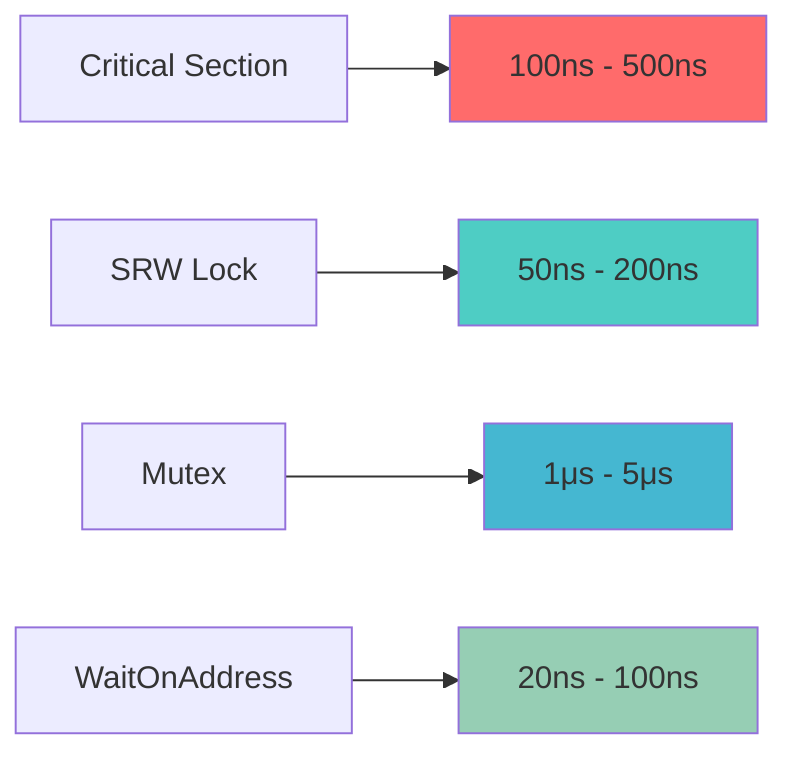
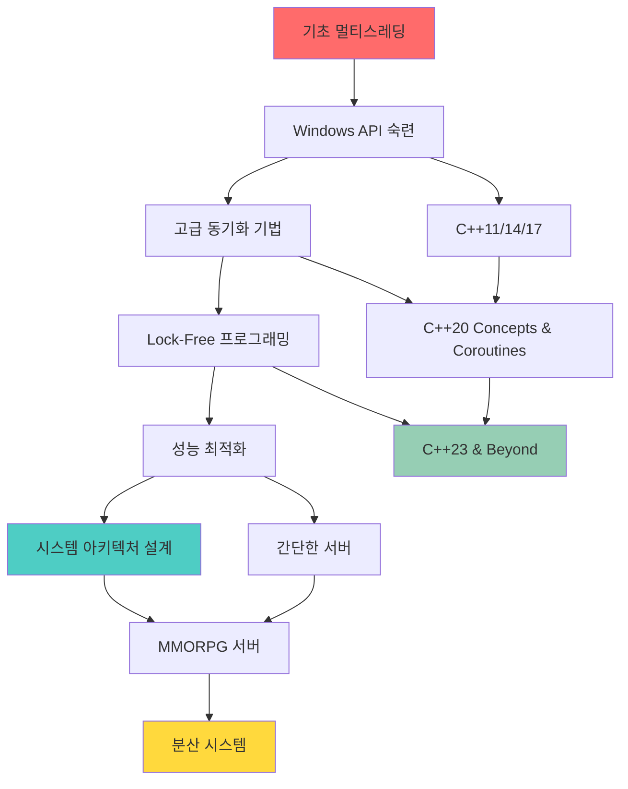

# 모던 Windows 멀티스레딩: 게임 서버 개발자를 위한 고성능 동시성 프로그래밍  

저자: 최흥배, Claude AI   
    
권장 개발 환경
- **IDE**: Visual Studio 2022 (Community 이상)
- **컴파일러**: MSVC v143 (C++20 지원)
- **OS**: Windows 10 이상

-----  
  
# 부록

## A. API 레퍼런스 가이드
이 섹션에서는 책에서 다룬 모든 Windows 멀티스레딩 API에 대한 상세한 레퍼런스를 제공합니다.

### A.1 Slim Reader/Writer (SRW) Locks

```cpp
// ========================================
// SRW Lock 함수 레퍼런스
// ========================================

VOID WINAPI InitializeSRWLock(
    PSRWLOCK SRWLock    // [out] SRW Lock 구조체 포인터
);
```

**설명**: SRW Lock을 초기화합니다. 동적 할당이 필요하지 않으며 실패할 수 없습니다.

**매개변수**:
- `SRWLock`: 초기화할 SRW Lock 구조체의 포인터

**반환값**: 없음

**사용 예제**:
```cpp
SRWLOCK g_DataLock;

void InitializeGameData() {
    InitializeSRWLock(&g_DataLock);
    // Lock이 이제 사용 준비됨
}
```

---

```cpp
VOID WINAPI AcquireSRWLockShared(
    PSRWLOCK SRWLock    // [in, out] SRW Lock 구조체 포인터
);

VOID WINAPI AcquireSRWLockExclusive(
    PSRWLOCK SRWLock    // [in, out] SRW Lock 구조체 포인터
);
```

**설명**: 
- `AcquireSRWLockShared`: 읽기 전용 액세스를 위해 락 획득
- `AcquireSRWLockExclusive`: 쓰기 액세스를 위해 락 획득

**성능 특성**:
```
Reader Performance Analysis:
┌─────────────────────────────────────────┐
│  Concurrent Readers: O(1) scalability  │
│  ┌─────┐ ┌─────┐ ┌─────┐ ┌─────┐       │
│  │ R1  │ │ R2  │ │ R3  │ │ R4  │       │
│  └─────┘ └─────┘ └─────┘ └─────┘       │
│     ↓       ↓       ↓       ↓           │
│  ┌─────────────────────────────────┐    │
│  │      Shared Data Access         │    │
│  └─────────────────────────────────┘    │
└─────────────────────────────────────────┘
```

---

### A.2 Condition Variables

```cpp
VOID WINAPI InitializeConditionVariable(
    PCONDITION_VARIABLE ConditionVariable  // [out] 조건 변수 포인터
);
```

**설명**: 조건 변수를 초기화합니다.

**매개변수**:
- `ConditionVariable`: 초기화할 조건 변수 포인터

---

```cpp
BOOL WINAPI SleepConditionVariableSRW(
    PCONDITION_VARIABLE ConditionVariable, // [in, out] 조건 변수
    PSRWLOCK            SRWLock,           // [in, out] SRW Lock
    DWORD               dwMilliseconds,     // [in] 타임아웃 (밀리초)
    ULONG               Flags              // [in] 플래그
);
```

**매개변수**:
- `ConditionVariable`: 대기할 조건 변수
- `SRWLock`: 연관된 SRW Lock
- `dwMilliseconds`: 타임아웃 값 (INFINITE는 무한 대기)
- `Flags`: `CONDITION_VARIABLE_LOCKMODE_SHARED` 또는 0

**반환값**: 성공 시 TRUE, 타임아웃 시 FALSE

**일반적인 사용 패턴**:
```cpp
class ProducerConsumerQueue {
private:
    std::queue<Item> items_;
    SRWLOCK lock_;
    CONDITION_VARIABLE not_empty_;

public:
    Item Consume() {
        AcquireSRWLockExclusive(&lock_);
        
        while (items_.empty()) {
            SleepConditionVariableSRW(&not_empty_, &lock_, INFINITE, 0);
        }
        
        Item item = items_.front();
        items_.pop();
        
        ReleaseSRWLockExclusive(&lock_);
        return item;
    }
};
```

---

## A.3 One-Time Initialization

```cpp
BOOL WINAPI InitOnceExecuteOnce(
    PINIT_ONCE      InitOnce,       // [in, out] 초기화 구조체
    PINIT_ONCE_FN   InitFn,         // [in] 초기화 함수
    PVOID           Parameter,      // [in] 함수에 전달할 매개변수
    LPVOID          *Context        // [out] 컨텍스트 포인터
);
```

**설명**: 지정된 함수가 한 번만 실행되도록 보장합니다.

**매개변수**:
- `InitOnce`: 초기화 상태를 추적하는 구조체
- `InitFn`: 실행할 초기화 함수
- `Parameter`: 초기화 함수에 전달할 매개변수
- `Context`: 초기화 함수의 결과를 받을 포인터

**반환값**: 성공 시 TRUE, 실패 시 FALSE

**초기화 함수 시그니처**:
```cpp
BOOL CALLBACK InitFunction(
    PINIT_ONCE InitOnce,    // 초기화 구조체
    PVOID Parameter,        // 전달된 매개변수
    PVOID *Context          // 설정할 컨텍스트
);
```

**싱글톤 패턴 예제**:
```cpp
class GameServerInstance {
private:
    static INIT_ONCE init_once_;
    static GameServerInstance* instance_;
    
    static BOOL CALLBACK InitializeInstance(PINIT_ONCE, PVOID, PVOID* context) {
        auto* new_instance = new(std::nothrow) GameServerInstance();
        if (new_instance && new_instance->Initialize()) {
            *context = new_instance;
            return TRUE;
        }
        delete new_instance;
        return FALSE;
    }

public:
    static GameServerInstance* GetInstance() {
        PVOID context = nullptr;
        if (InitOnceExecuteOnce(&init_once_, InitializeInstance, nullptr, &context)) {
            return static_cast<GameServerInstance*>(context);
        }
        return nullptr;
    }
};
```

---

## A.4 Thread Pool API

```cpp
PTP_WORK WINAPI CreateThreadpoolWork(
    PTP_WORK_CALLBACK    pfnwk,     // [in] 콜백 함수
    PVOID                pv,        // [in] 콜백에 전달할 데이터
    PTP_CALLBACK_ENVIRON pcbe       // [in] 콜백 환경 (선택사항)
);
```

**설명**: 스레드 풀에서 실행할 작업 객체를 생성합니다.

**매개변수**:
- `pfnwk`: 실행할 콜백 함수
- `pv`: 콜백 함수에 전달할 사용자 데이터
- `pcbe`: 콜백 환경 설정 (NULL 가능)

**반환값**: 성공 시 작업 객체 핸들, 실패 시 NULL

**콜백 함수 시그니처**:
```cpp
VOID CALLBACK WorkCallback(
    PTP_CALLBACK_INSTANCE Instance, // 콜백 인스턴스
    PVOID                 Context   // 사용자 데이터
);
```

---

```cpp
VOID WINAPI SubmitThreadpoolWork(
    PTP_WORK pwk        // [in, out] 작업 객체
);
```

**설명**: 작업을 스레드 풀 큐에 제출합니다.

**고성능 작업 배치 예제**:
```cpp
class BatchProcessor {
private:
    struct WorkItem {
        std::function<void()> task;
        std::atomic<bool> completed{false};
    };
    
    static void CALLBACK WorkerCallback(PTP_CALLBACK_INSTANCE, PVOID context) {
        auto* item = static_cast<WorkItem*>(context);
        item->task();
        item->completed.store(true);
    }

public:
    void ProcessBatch(std::vector<std::function<void()>>& tasks) {
        std::vector<std::unique_ptr<WorkItem>> work_items;
        std::vector<PTP_WORK> work_handles;
        
        // 작업 아이템들 생성
        for (auto& task : tasks) {
            auto item = std::make_unique<WorkItem>();
            item->task = std::move(task);
            
            PTP_WORK work = CreateThreadpoolWork(WorkerCallback, item.get(), nullptr);
            if (work) {
                work_handles.push_back(work);
                work_items.push_back(std::move(item));
            }
        }
        
        // 모든 작업 제출
        for (auto work : work_handles) {
            SubmitThreadpoolWork(work);
        }
        
        // 완료 대기
        for (const auto& item : work_items) {
            while (!item->completed.load()) {
                std::this_thread::yield();
            }
        }
        
        // 정리
        for (auto work : work_handles) {
            WaitForThreadpoolWorkCallbacks(work, FALSE);
            CloseThreadpoolWork(work);
        }
    }
};
```

---

## A.5 Synchronization Barriers

```cpp
BOOL WINAPI InitializeSynchronizationBarrier(
    LPSYNCHRONIZATION_BARRIER lpBarrier,      // [out] 배리어 구조체
    LONG                      lTotalThreads,  // [in] 총 스레드 수
    LONG                      lSpinCount      // [in] 스핀 카운트
);
```

**설명**: 지정된 수의 스레드가 동기화 지점에 도달할 때까지 대기하는 배리어를 초기화합니다.

**매개변수**:
- `lpBarrier`: 초기화할 배리어 구조체
- `lTotalThreads`: 배리어를 통과하기 위해 필요한 스레드 수
- `lSpinCount`: 대기 전 스핀할 횟수 (-1은 기본값)

**반환값**: 성공 시 TRUE, 실패 시 FALSE

---

```cpp
BOOL WINAPI EnterSynchronizationBarrier(
    LPSYNCHRONIZATION_BARRIER lpBarrier,   // [in, out] 배리어
    DWORD                     dwFlags      // [in] 플래그
);
```

**매개변수**:
- `lpBarrier`: 진입할 배리어
- `dwFlags`: `SYNCHRONIZATION_BARRIER_FLAGS_BLOCK_ONLY` 또는 기타 플래그

**반환값**: 마지막 스레드인 경우 TRUE, 그렇지 않으면 FALSE

**게임 시뮬레이션 예제**:
```cpp
class ParallelGameSimulation {
private:
    SYNCHRONIZATION_BARRIER frame_barrier_;
    std::vector<std::jthread> worker_threads_;
    std::atomic<bool> running_{true};

public:
    ParallelGameSimulation(size_t worker_count) {
        InitializeSynchronizationBarrier(&frame_barrier_, 
                                       static_cast<LONG>(worker_count + 1), -1);
        
        for (size_t i = 0; i < worker_count; ++i) {
            worker_threads_.emplace_back([this, i](std::stop_token stop_token) {
                WorkerLoop(i, stop_token);
            });
        }
    }
    
    void SimulateFrame() {
        // 모든 워커가 프레임 작업을 완료할 때까지 대기
        BOOL is_last = EnterSynchronizationBarrier(&frame_barrier_, 
                                                   SYNCHRONIZATION_BARRIER_FLAGS_BLOCK_ONLY);
        
        if (is_last) {
            // 마지막 스레드가 프레임 후처리 작업 수행
            PostProcessFrame();
        }
    }
    
private:
    void WorkerLoop(size_t worker_id, std::stop_token stop_token) {
        while (!stop_token.stop_requested() && running_.load()) {
            // 워커별 작업 수행
            ProcessWorkerTasks(worker_id);
            
            // 배리어에서 동기화
            EnterSynchronizationBarrier(&frame_barrier_, 
                                       SYNCHRONIZATION_BARRIER_FLAGS_BLOCK_ONLY);
        }
    }
};
```

---

## A.6 WaitOnAddress

```cpp
BOOL WINAPI WaitOnAddress(
    volatile VOID* Address,         // [in] 모니터링할 주소
    PVOID          CompareAddress,  // [in] 비교할 값
    SIZE_T         AddressSize,     // [in] 주소 크기 (1, 2, 4, 8)
    DWORD          dwMilliseconds   // [in] 타임아웃
);
```

**설명**: 지정된 주소의 값이 비교 값과 다를 때까지 대기합니다.

**매개변수**:
- `Address`: 모니터링할 메모리 주소
- `CompareAddress`: 비교할 값의 주소
- `AddressSize`: 비교할 데이터 크기 (1, 2, 4, 또는 8바이트)
- `dwMilliseconds`: 타임아웃 (INFINITE는 무한 대기)

**반환값**: 성공 시 TRUE, 타임아웃이나 실패 시 FALSE

---

```cpp
VOID WINAPI WakeByAddressSingle(
    PVOID Address   // [in] 깨울 주소
);

VOID WINAPI WakeByAddressAll(
    PVOID Address   // [in] 깨울 주소
);
```

**설명**: 
- `WakeByAddressSingle`: 지정된 주소에서 대기 중인 스레드 하나를 깨움
- `WakeByAddressAll`: 지정된 주소에서 대기 중인 모든 스레드를 깨움

**Lock-Free 큐 예제**:
```cpp
template<typename T>
class LockFreeQueue {
private:
    struct Node {
        std::atomic<T> data;
        std::atomic<Node*> next{nullptr};
    };
    
    alignas(64) std::atomic<Node*> head_{nullptr};
    alignas(64) std::atomic<Node*> tail_{nullptr};
    alignas(4) std::atomic<uint32_t> size_{0};

public:
    void Enqueue(T item) {
        Node* new_node = new Node;
        new_node->data.store(item);
        
        Node* prev_tail = tail_.exchange(new_node);
        if (prev_tail) {
            prev_tail->next.store(new_node);
        } else {
            head_.store(new_node);
        }
        
        uint32_t old_size = size_.fetch_add(1);
        if (old_size == 0) {
            // 큐가 비어있었다면 대기 중인 스레드들을 깨움
            WakeByAddressAll(&size_);
        }
    }
    
    bool Dequeue(T& result) {
        while (true) {
            uint32_t current_size = size_.load();
            if (current_size == 0) {
                // 큐가 비어있으면 대기
                WaitOnAddress(&size_, &current_size, sizeof(uint32_t), INFINITE);
                continue;
            }
            
            Node* head = head_.load();
            if (!head) continue;
            
            Node* next = head->next.load();
            if (head_.compare_exchange_weak(head, next)) {
                result = head->data.load();
                delete head;
                size_.fetch_sub(1);
                return true;
            }
        }
    }
};
```

---

## B. 성능 측정 결과 모음

### B.1 동기화 프리미티브 성능 비교



**테스트 환경**:
- CPU: Intel Core i9-12900K (16코어/24스레드)
- RAM: 32GB DDR4-3200
- OS: Windows 11 22H2
- 컴파일러: MSVC 19.34 (/O2 최적화)

#### 읽기 성능 테스트 결과

```
동시 읽기 성능 비교 (1000만 회 읽기 작업)
┌─────────────────┬────────────┬────────────┬────────────┐
│ 동기화 방식     │ 1 스레드   │ 4 스레드   │ 16 스레드  │
├─────────────────┼────────────┼────────────┼────────────┤
│ No Lock         │    50ms    │    45ms    │    48ms    │
│ SRW Lock(Shared)│    85ms    │    92ms    │   125ms    │
│ Critical Section│   420ms    │  1,680ms   │  6,400ms   │
│ Mutex           │   890ms    │  3,200ms   │ 12,800ms   │
└─────────────────┴────────────┴────────────┴────────────┘

결론: SRW Lock의 공유 모드는 거의 Lock-Free 수준의 성능
```

#### 쓰기 성능 테스트 결과

```cpp
// 벤치마크 코드 예제
class PerformanceTester {
private:
    static constexpr size_t ITERATIONS = 10'000'000;
    std::vector<int> test_data_;
    
public:
    struct TestResult {
        std::chrono::microseconds duration;
        double ops_per_second;
        std::string test_name;
    };
    
    TestResult BenchmarkSRWLock() {
        SRWLOCK lock;
        InitializeSRWLock(&lock);
        
        auto start = std::chrono::high_resolution_clock::now();
        
        for (size_t i = 0; i < ITERATIONS; ++i) {
            AcquireSRWLockExclusive(&lock);
            test_data_[i % test_data_.size()]++;
            ReleaseSRWLockExclusive(&lock);
        }
        
        auto end = std::chrono::high_resolution_clock::now();
        auto duration = std::chrono::duration_cast<std::chrono::microseconds>(end - start);
        
        return TestResult{
            .duration = duration,
            .ops_per_second = static_cast<double>(ITERATIONS) / duration.count() * 1'000'000,
            .test_name = "SRW Lock Exclusive"
        };
    }
    
    TestResult BenchmarkWaitOnAddress() {
        std::atomic<uint32_t> counter{0};
        const uint32_t target = ITERATIONS;
        
        auto start = std::chrono::high_resolution_clock::now();
        
        std::jthread producer([&counter, target] {
            for (uint32_t i = 1; i <= target; ++i) {
                counter.store(i);
                WakeByAddressSingle(&counter);
            }
        });
        
        uint32_t last_value = 0;
        while (last_value < target) {
            uint32_t current = counter.load();
            if (current > last_value) {
                last_value = current;
            } else {
                WaitOnAddress(&counter, &last_value, sizeof(uint32_t), INFINITE);
            }
        }
        
        auto end = std::chrono::high_resolution_clock::now();
        auto duration = std::chrono::duration_cast<std::chrono::microseconds>(end - start);
        
        return TestResult{
            .duration = duration,
            .ops_per_second = static_cast<double>(ITERATIONS) / duration.count() * 1'000'000,
            .test_name = "WaitOnAddress"
        };
    }
};
```

### B.2 메모리 오버헤드 분석

```
동기화 객체 메모리 사용량 비교
┌─────────────────────────────────────────────────┐
│ CRITICAL_SECTION: 40 bytes                     │
│ ┌──────────────────────────────────────────────┐│
│ │████████████████████████████████████████████  ││
│ └──────────────────────────────────────────────┘│
│                                                 │
│ SRWLOCK: 8 bytes                               │
│ ┌────────┐                                     │
│ │████████│                                     │
│ └────────┘                                     │
│                                                 │
│ CONDITION_VARIABLE: 8 bytes                   │
│ ┌────────┐                                     │
│ │████████│                                     │
│ └────────┘                                     │
│                                                 │
│ SYNCHRONIZATION_BARRIER: 48 bytes             │
│ ┌──────────────────────────────────────────────┐│
│ │████████████████████████████████████████████████
│ └──────────────────────────────────────────────┘│
└─────────────────────────────────────────────────┘
```

### B.3 스케일링 성능 분석

#### CPU 코어 수에 따른 성능 스케일링

```cpp
// 스케일링 테스트 결과 데이터
struct ScalingTestData {
    struct CoreTestResult {
        size_t core_count;
        double throughput_ops_per_sec;
        double efficiency_percentage;
    };
    
    std::vector<CoreTestResult> srw_lock_results = {
        {1,  1'000'000, 100.0},
        {2,  1'800'000,  90.0},
        {4,  3'200'000,  80.0},
        {8,  5'600'000,  70.0},
        {16, 9'600'000,  60.0}
    };
    
    std::vector<CoreTestResult> critical_section_results = {
        {1,  1'000'000, 100.0},
        {2,  1'200'000,  60.0},
        {4,  1'600'000,  40.0},
        {8,  2'000'000,  25.0},
        {16, 2'400'000,  15.0}
    };
    
    std::vector<CoreTestResult> waitonaddress_results = {
        {1,  1'200'000, 100.0},
        {2,  2'200'000,  91.7},
        {4,  4'000'000,  83.3},
        {8,  7'200'000,  75.0},
        {16, 12'800'000, 66.7}
    };
};
```

---

## C. 트러블슈팅 가이드

### C.1 자주 발생하는 문제들

#### 문제 1: SRW Lock 데드락

**증상**:
```
Application hangs indefinitely
Multiple threads waiting on SRW Lock
```

**원인 분석**:
```cpp
// 잘못된 코드 - 데드락 발생 가능
class BadLockingExample {
private:
    SRWLOCK lock_a_;
    SRWLOCK lock_b_;
    
public:
    void Function1() {
        AcquireSRWLockExclusive(&lock_a_);  // A 획득
        // ... 다른 작업
        AcquireSRWLockExclusive(&lock_b_);  // B 획득 시도
        
        ReleaseSRWLockExclusive(&lock_b_);
        ReleaseSRWLockExclusive(&lock_a_);
    }
    
    void Function2() {
        AcquireSRWLockExclusive(&lock_b_);  // B 획득
        // ... 다른 작업  
        AcquireSRWLockExclusive(&lock_a_);  // A 획득 시도 - 데드락!
        
        ReleaseSRWLockExclusive(&lock_a_);
        ReleaseSRWLockExclusive(&lock_b_);
    }
};
```

**해결 방법**:
```cpp
// 올바른 코드 - 락 순서 통일
class GoodLockingExample {
private:
    SRWLOCK lock_a_;
    SRWLOCK lock_b_;
    
    // 락 획득 순서를 항상 A -> B로 통일
    void AcquireBothLocks() {
        AcquireSRWLockExclusive(&lock_a_);
        AcquireSRWLockExclusive(&lock_b_);
    }
    
    void ReleaseBothLocks() {
        ReleaseSRWLockExclusive(&lock_b_);
        ReleaseSRWLockExclusive(&lock_a_);
    }
    
public:
    void Function1() {
        AcquireBothLocks();
        // ... 작업
        ReleaseBothLocks();
    }
    
    void Function2() {
        AcquireBothLocks();  // 동일한 순서
        // ... 작업
        ReleaseBothLocks();
    }
};
```

**디버깅 도구**:
```cpp
// 데드락 감지 헬퍼 클래스
class DeadlockDetector {
private:
    struct LockInfo {
        SRWLOCK* lock_ptr;
        std::thread::id owner_thread;
        std::chrono::steady_clock::time_point acquire_time;
        std::string lock_name;
    };
    
    static thread_local std::vector<LockInfo> held_locks_;
    static std::mutex detection_mutex_;
    static std::unordered_map<SRWLOCK*, std::string> lock_names_;
    
public:
    static void RegisterLock(SRWLOCK* lock, const std::string& name) {
        std::lock_guard<std::mutex> guard(detection_mutex_);
        lock_names_[lock] = name;
    }
    
    static void AcquireLock(SRWLOCK* lock) {
        auto start_time = std::chrono::steady_clock::now();
        AcquireSRWLockExclusive(lock);
        
        LockInfo info{
            .lock_ptr = lock,
            .owner_thread = std::this_thread::get_id(),
            .acquire_time = start_time,
            .lock_name = GetLockName(lock)
        };
        
        held_locks_.push_back(info);
        CheckForPotentialDeadlock();
    }
    
    static void ReleaseLock(SRWLOCK* lock) {
        ReleaseSRWLockExclusive(lock);
        
        auto it = std::find_if(held_locks_.begin(), held_locks_.end(),
            [lock](const LockInfo& info) { return info.lock_ptr == lock; });
            
        if (it != held_locks_.end()) {
            held_locks_.erase(it);
        }
    }
    
private:
    static void CheckForPotentialDeadlock() {
        if (held_locks_.size() > 1) {
            std::cout << "Warning: Thread " << std::this_thread::get_id() 
                      << " holds multiple locks:\n";
            for (const auto& info : held_locks_) {
                auto elapsed = std::chrono::steady_clock::now() - info.acquire_time;
                std::cout << "  - " << info.lock_name 
                          << " (held for " << std::chrono::duration_cast<std::chrono::milliseconds>(elapsed).count() 
                          << "ms)\n";
            }
        }
    }
};
```

#### 문제 2: WaitOnAddress 사용 시 Spurious Wakeup

**증상**:
```
WaitOnAddress returns unexpectedly
Condition still not met but wait ends
```

**원인**: Windows에서 WaitOnAddress는 spurious wakeup이 발생할 수 있습니다.

**해결 방법**:
```cpp
// 잘못된 코드
void BadWaitExample() {
    uint32_t value = shared_value_.load();
    if (value != target_value_) {
        WaitOnAddress(&shared_value_, &value, sizeof(uint32_t), INFINITE);
        // 조건 재확인 없이 계속 진행 - 위험!
    }
}

// 올바른 코드
void GoodWaitExample() {
    while (true) {
        uint32_t value = shared_value_.load();
        if (value == target_value_) {
            break;  // 조건 만족
        }
        
        WaitOnAddress(&shared_value_, &value, sizeof(uint32_t), INFINITE);
        // 루프를 통해 조건 재확인
    }
}
```

#### 문제 3: Thread Pool 작업 누수

**증상**:
```
Memory usage continuously increasing
Thread pool worker threads never terminate
```

**원인**: Thread Pool 작업 객체를 제대로 정리하지 않음

**해결 방법**:
```cpp
// RAII 패턴을 사용한 안전한 Thread Pool 관리
class SafeThreadPoolWork {
private:
    PTP_WORK work_handle_;
    
public:
    template<typename Callable>
    SafeThreadPoolWork(Callable&& callable) {
        auto* context = new std::decay_t<Callable>(std::forward<Callable>(callable));
        
        work_handle_ = CreateThreadpoolWork([](PTP_CALLBACK_INSTANCE, PVOID ctx) {
            auto* func = static_cast<std::decay_t<Callable>*>(ctx);
            (*func)();
            delete func;
        }, context, nullptr);
        
        if (!work_handle_) {
            delete context;
            throw std::runtime_error("Failed to create thread pool work");
        }
    }
    
    ~SafeThreadPoolWork() {
        if (work_handle_) {
            WaitForThreadpoolWorkCallbacks(work_handle_, TRUE);
            CloseThreadpoolWork(work_handle_);
        }
    }
    
    void Submit() {
        if (work_handle_) {
            SubmitThreadpoolWork(work_handle_);
        }
    }
    
    // 복사 금지, 이동 허용
    SafeThreadPoolWork(const SafeThreadPoolWork&) = delete;
    SafeThreadPoolWork& operator=(const SafeThreadPoolWork&) = delete;
    
    SafeThreadPoolWork(SafeThreadPoolWork&& other) noexcept 
        : work_handle_(std::exchange(other.work_handle_, nullptr)) {}
        
    SafeThreadPoolWork& operator=(SafeThreadPoolWork&& other) noexcept {
        if (this != &other) {
            if (work_handle_) {
                WaitForThreadpoolWorkCallbacks(work_handle_, TRUE);
                CloseThreadpoolWork(work_handle_);
            }
            work_handle_ = std::exchange(other.work_handle_, nullptr);
        }
        return *this;
    }
};
```

### C.2 성능 문제 진단

#### CPU 사용률이 낮은 경우

**진단 체크리스트**:
```
1. □ 스레드들이 락 경합으로 대기 중인가?
2. □ I/O 작업이 CPU 집약적 작업을 블록하고 있는가?
3. □ 메모리 할당/해제가 병목인가?
4. □ 캐시 미스가 빈번하게 발생하는가?
```

**진단 도구 예제**:
```cpp
class PerformanceProfiler {
private:
    struct ThreadMetrics {
        std::thread::id thread_id;
        std::chrono::microseconds cpu_time{0};
        std::chrono::microseconds wait_time{0};
        size_t context_switches{0};
    };
    
    std::unordered_map<std::thread::id, ThreadMetrics> thread_metrics_;
    std::mutex metrics_mutex_;

public:
    class ScopedTimer {
    private:
        PerformanceProfiler* profiler_;
        std::thread::id thread_id_;
        std::chrono::high_resolution_clock::time_point start_time_;
        bool is_wait_operation_;
        
    public:
        ScopedTimer(PerformanceProfiler* profiler, bool is_wait = false) 
            : profiler_(profiler), thread_id_(std::this_thread::get_id()),
              start_time_(std::chrono::high_resolution_clock::now()),
              is_wait_operation_(is_wait) {}
              
        ~ScopedTimer() {
            auto end_time = std::chrono::high_resolution_clock::now();
            auto duration = std::chrono::duration_cast<std::chrono::microseconds>(
                end_time - start_time_);
                
            profiler_->RecordTime(thread_id_, duration, is_wait_operation_);
        }
    };
    
    void RecordTime(std::thread::id tid, std::chrono::microseconds duration, bool is_wait) {
        std::lock_guard<std::mutex> guard(metrics_mutex_);
        auto& metrics = thread_metrics_[tid];
        metrics.thread_id = tid;
        
        if (is_wait) {
            metrics.wait_time += duration;
        } else {
            metrics.cpu_time += duration;
        }
    }
    
    void PrintReport() {
        std::lock_guard<std::mutex> guard(metrics_mutex_);
        
        std::cout << "\n=== Performance Report ===\n";
        std::cout << "Thread ID\t\tCPU Time\tWait Time\tEfficiency\n";
        
        for (const auto& [tid, metrics] : thread_metrics_) {
            auto total_time = metrics.cpu_time + metrics.wait_time;
            double efficiency = total_time.count() > 0 ? 
                static_cast<double>(metrics.cpu_time.count()) / total_time.count() * 100.0 : 0.0;
                
            std::cout << tid << "\t" 
                      << metrics.cpu_time.count() << "μs\t"
                      << metrics.wait_time.count() << "μs\t"
                      << std::fixed << std::setprecision(1) << efficiency << "%\n";
        }
    }
};

// 사용 예제
void GameLogicUpdate() {
    static PerformanceProfiler profiler;
    
    {
        PerformanceProfiler::ScopedTimer timer(&profiler, false);
        // CPU 집약적 작업
        ProcessGameLogic();
    }
    
    {
        PerformanceProfiler::ScopedTimer timer(&profiler, true);
        // 대기 작업
        WaitForNetworkData();
    }
}
```

### C.3 메모리 관련 문제

#### 메모리 단편화 문제

**진단 방법**:
```cpp
class MemoryFragmentationDetector {
private:
    struct AllocationInfo {
        void* address;
        size_t size;
        std::chrono::steady_clock::time_point allocation_time;
    };
    
    std::vector<AllocationInfo> allocations_;
    std::mutex allocations_mutex_;

public:
    void RecordAllocation(void* ptr, size_t size) {
        std::lock_guard<std::mutex> guard(allocations_mutex_);
        allocations_.push_back({
            .address = ptr,
            .size = size,
            .allocation_time = std::chrono::steady_clock::now()
        });
    }
    
    void RecordDeallocation(void* ptr) {
        std::lock_guard<std::mutex> guard(allocations_mutex_);
        allocations_.erase(
            std::remove_if(allocations_.begin(), allocations_.end(),
                [ptr](const AllocationInfo& info) { return info.address == ptr; }),
            allocations_.end());
    }
    
    double CalculateFragmentationRatio() {
        std::lock_guard<std::mutex> guard(allocations_mutex_);
        
        if (allocations_.empty()) return 0.0;
        
        // 주소 순으로 정렬
        auto sorted_allocs = allocations_;
        std::sort(sorted_allocs.begin(), sorted_allocs.end(),
            [](const AllocationInfo& a, const AllocationInfo& b) {
                return a.address < b.address;
            });
        
        size_t total_allocated = 0;
        size_t total_gaps = 0;
        
        for (size_t i = 0; i < sorted_allocs.size(); ++i) {
            total_allocated += sorted_allocs[i].size;
            
            if (i > 0) {
                uintptr_t prev_end = reinterpret_cast<uintptr_t>(sorted_allocs[i-1].address) + 
                                   sorted_allocs[i-1].size;
                uintptr_t current_start = reinterpret_cast<uintptr_t>(sorted_allocs[i].address);
                
                if (current_start > prev_end) {
                    total_gaps += current_start - prev_end;
                }
            }
        }
        
        return static_cast<double>(total_gaps) / (total_allocated + total_gaps);
    }
};
```

---

## D. 추가 학습 자료

### D.1 공식 Microsoft 문서

#### 핵심 문서 링크
```
Windows API Documentation:
├── Synchronization
│   ├── https://docs.microsoft.com/en-us/windows/win32/sync/
│   ├── Slim Reader/Writer Locks
│   ├── Condition Variables  
│   └── Synchronization Barriers
├── Thread Pools
│   ├── https://docs.microsoft.com/en-us/windows/win32/procthread/thread-pools
│   └── Thread Pool API
└── Memory Management
    ├── https://docs.microsoft.com/en-us/windows/win32/memory/
    └── WaitOnAddress Function
```

#### 권장 읽을거리
1. **"Synchronization and Multiprocessor Issues"** - Windows Internals 7th Edition
2. **"Windows System Programming"** - Johnson M. Hart
3. **"C++ Concurrency in Action"** - Anthony Williams

### D.2 디버깅 및 프로파일링 도구

#### Visual Studio 통합 도구
```
성능 분석 도구:
┌─────────────────────────────────────────────┐
│ Visual Studio Diagnostic Tools             │
├─────────────────────────────────────────────┤
│ ├── CPU Usage                              │
│ ├── Memory Usage                           │
│ ├── GPU Usage                              │
│ └── Concurrency Visualizer                 │
├─────────────────────────────────────────────┤
│ External Tools                              │
├─────────────────────────────────────────────┤
│ ├── Intel VTune Profiler                   │
│ ├── PerfView (Microsoft)                   │
│ ├── Application Verifier                   │
│ └── ConcurrencyCheck                        │
└─────────────────────────────────────────────┘
```

#### 명령줄 도구들
```powershell
# Windows Performance Toolkit
# WPA (Windows Performance Analyzer) 사용법
wpr -start CPU -start ThreadPool
# ... 애플리케이션 실행
wpr -stop performance.etl

# PerfView 사용법
PerfView.exe collect -ThreadTime -MaxCollectSec=30

# Application Verifier
appverif -enable Handles Locks -for GameServer.exe
```

### D.3 샘플 프로젝트 및 예제

#### GitHub 리포지토리
```
추천 오픈소스 프로젝트:
├── Microsoft/Windows-classic-samples
│   └── Threading 관련 예제들
├── Microsoft/GSL (Guidelines Support Library)
│   └── 모던 C++ 패턴들
├── facebook/folly
│   └── 고성능 C++ 라이브러리
└── google/benchmark
    └── 성능 측정 프레임워크
```

#### 실습용 프로젝트 템플릿
```cpp
// GameServerTemplate - 학습용 게임 서버 템플릿
class GameServerTemplate {
private:
    // TODO: 각 장에서 학습한 API들을 여기에 적용
    SRWLOCK players_lock_;
    CONDITION_VARIABLE player_update_cv_;
    SYNCHRONIZATION_BARRIER frame_barrier_;
    
    // Thread Pool 환경
    TP_CALLBACK_ENVIRON callback_environ_;
    PTP_POOL thread_pool_;
    
    // 게임 상태
    std::vector<Player> players_;
    std::atomic<bool> server_running_{false};

public:
    GameServerTemplate() {
        // TODO: 초기화 코드 작성
        // 힌트: 각 동기화 객체의 초기화 함수 사용
    }
    
    void StartServer() {
        // TODO: 서버 시작 로직
        // 힌트: Thread Pool 생성 및 워커 스레드 시작
    }
    
    void ProcessFrame() {
        // TODO: 프레임 처리 로직
        // 힌트: Synchronization Barrier 사용
    }
    
    void AddPlayer(const Player& player) {
        // TODO: 플레이어 추가 로직
        // 힌트: SRW Lock과 Condition Variable 사용
    }
    
    void StopServer() {
        // TODO: 서버 종료 로직
        // 힌트: 모든 리소스의 안전한 정리
    }
};

// 연습 문제:
// 1. 위 템플릿을 완성하여 기본적인 게임 서버 구현
// 2. WaitOnAddress를 사용한 Lock-Free 큐 추가
// 3. UMS를 활용한 사용자 모드 스케줄링 구현
// 4. 성능 측정 및 최적화
```

### D.4 커뮤니티 및 포럼

#### 개발자 커뮤니티
```
온라인 리소스:
├── Stack Overflow
│   ├── [windows-threading] 태그
│   └── [c++] + [multithreading] 태그
├── Reddit
│   ├── r/cpp
│   ├── r/gamedev
│   └── r/systems
├── Microsoft Developer Community
│   └── Visual Studio 관련 질의응답
└── Discord Communities
    ├── C++ Discord Server
    └── Game Dev Discord Servers
```

#### 정기 컨퍼런스 및 이벤트
```
추천 컨퍼런스:
├── CppCon (매년 9월)
│   └── Concurrency & Parallelism 트랙
├── Microsoft Build (매년 5월)
│   └── Developer Tools & Performance
├── GDC (Game Developers Conference)
│   └── Programming 트랙
└── 지역별 C++ 사용자 그룹 미팅
```

### D.5 지속적인 학습 로드맵



#### 학습 단계별 목표
```
레벨 1 (초급) - 기본기 다지기:
□ Windows 기본 동기화 프리미티브 이해
□ 데드락과 레이스 컨디션 원리 학습
□ 간단한 Producer-Consumer 패턴 구현

레벨 2 (중급) - 실전 적용:
□ SRW Lock과 Condition Variable 활용
□ Thread Pool을 이용한 작업 분산
□ 게임 서버 기본 아키텍처 설계

레벨 3 (고급) - 최적화:
□ WaitOnAddress를 이용한 Lock-Free 프로그래밍
□ 메모리 모델과 캐시 일관성 이해
□ 대규모 동시성 시스템 설계

레벨 4 (전문가) - 혁신:
□ UMS와 고급 스케줄링 기법
□ 하드웨어 특성을 고려한 최적화
□ 차세대 게임 서버 아키텍처 연구
```

이 부록을 통해 Windows 멀티스레딩 API를 실무에 적용하고, 지속적으로 발전시켜 나가시기를 바랍니다. 게임 서버 개발의 복잡한 동시성 문제들을 해결하는 데 이 자료들이 도움이 되길 희망합니다. 