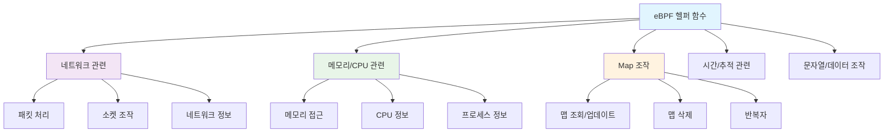
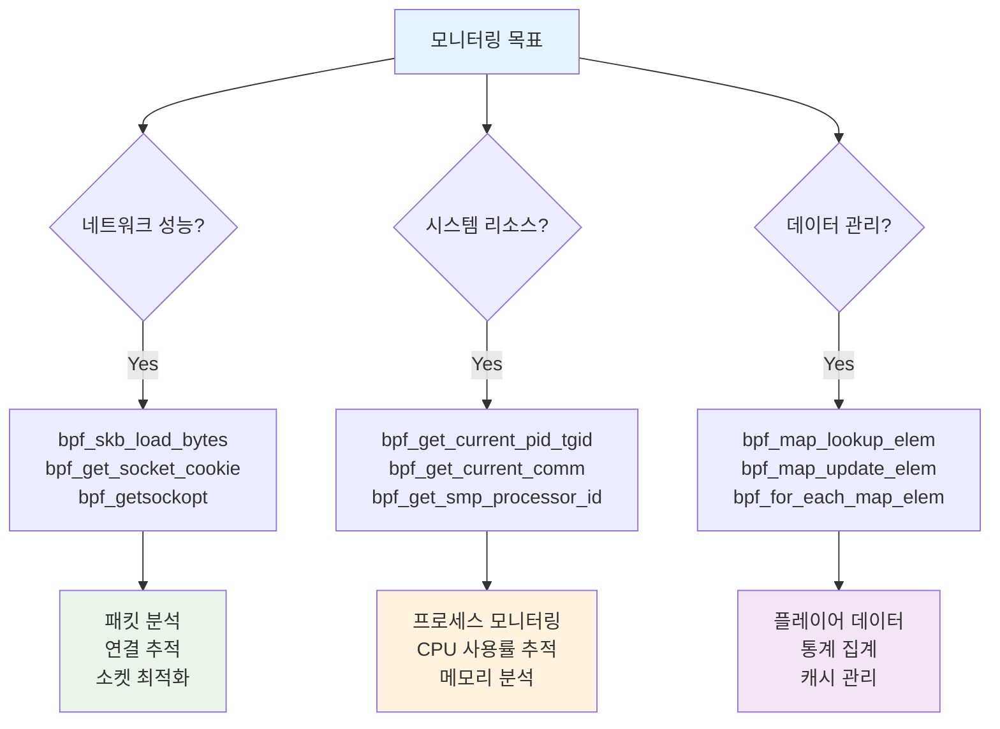
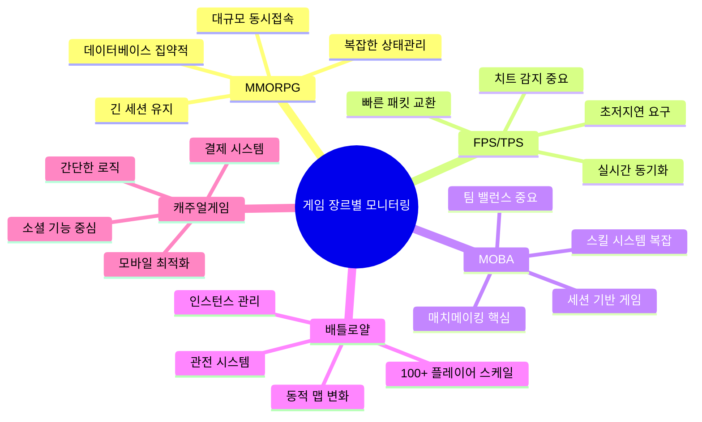
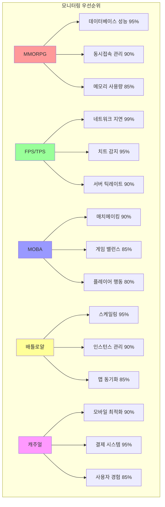
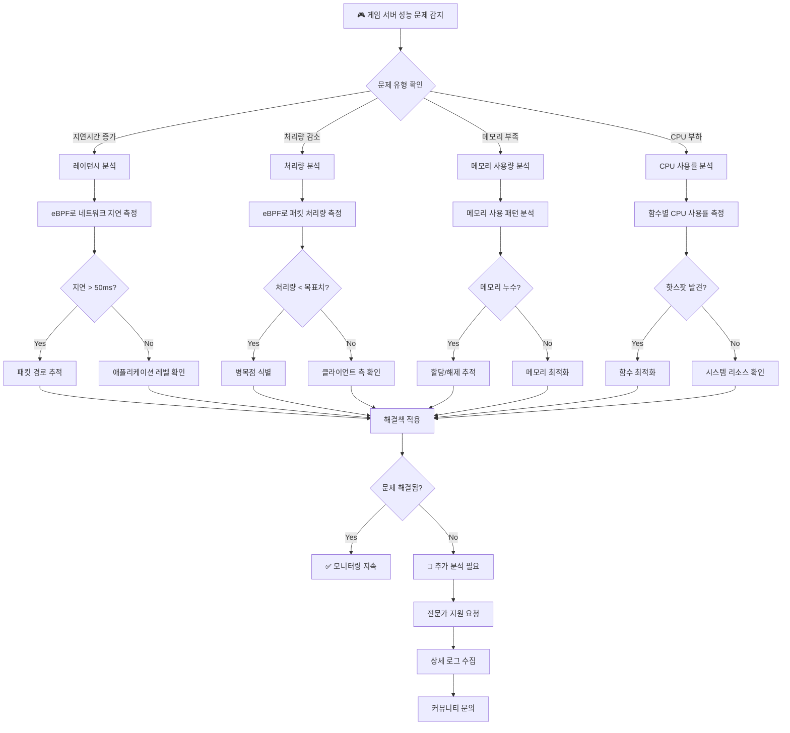
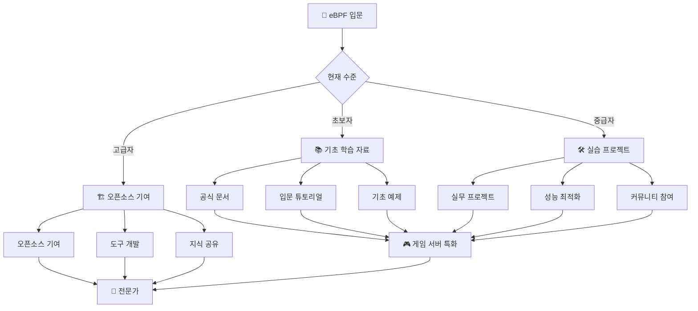

# 온라인 게임 서버 개발자를 위한 eBPF 실전 가이드  
  
저자: 최흥배, AI-Assisted   

---  
  
# 부록 A. eBPF 헬퍼 함수 레퍼런스

eBPF 헬퍼 함수는 eBPF 프로그램이 커널의 기능에 접근할 수 있게 해주는 안전한 인터페이스입니다. 이 부록에서는 게임 서버 개발에 특히 유용한 헬퍼 함수들을 카테고리별로 정리하여 빠른 참조가 가능하도록 구성했습니다.

## 📚 헬퍼 함수 분류 체계



---

## 🌐 네트워크 관련 헬퍼 함수

게임 서버에서 네트워크 성능 모니터링, 패킷 분석, 연결 관리에 사용되는 핵심 헬퍼 함수들입니다.

### bpf_skb_load_bytes()

**함수 시그니처:**
```c
long bpf_skb_load_bytes(const struct __sk_buff *skb, u32 offset, void *to, u32 len)
```

**기능:** 소켓 버퍼(SKB)에서 특정 오프셋의 데이터를 안전하게 읽어옵니다.

**게임 서버 활용:**
- 게임 패킷의 헤더 정보 추출
- 프로토콜별 데이터 파싱
- 패킷 내용 기반 필터링

**사용 예제:**
```c
// 게임 프로토콜 헤더 파싱
struct game_header {
    __u32 magic;
    __u16 packet_type;
    __u16 player_id;
    __u32 sequence;
};

SEC("tc")
int parse_game_packet(struct __sk_buff *skb)
{
    struct game_header header;
    
    // UDP 헤더 다음부터 게임 헤더 읽기
    if (bpf_skb_load_bytes(skb, ETH_HLEN + sizeof(struct iphdr) + sizeof(struct udphdr),
                          &header, sizeof(header)) < 0) {
        return TC_ACT_OK;
    }
    
    // 게임 매직 넘버 확인
    if (bpf_ntohl(header.magic) == 0xDEADBEEF) {
        // 게임 패킷으로 확인됨
        __u16 packet_type = bpf_ntohs(header.packet_type);
        __u16 player_id = bpf_ntohs(header.player_id);
        
        // 패킷 타입별 처리
        switch (packet_type) {
            case 0x01: // 플레이어 이동
                return handle_movement_packet(skb, player_id);
            case 0x02: // 공격 액션
                return handle_attack_packet(skb, player_id);
            default:
                return TC_ACT_OK;
        }
    }
    
    return TC_ACT_OK;
}
```

**⚠️ 주의사항:**
- 오프셋과 길이가 SKB 크기를 초과하지 않도록 주의
- 네트워크 바이트 오더를 고려하여 `bpf_ntohl()`, `bpf_ntohs()` 사용

---

### bpf_skb_store_bytes()

**함수 시그니처:**
```c
long bpf_skb_store_bytes(struct __sk_buff *skb, u32 offset, const void *from, u32 len, u64 flags)
```

**기능:** 소켓 버퍼의 특정 위치에 데이터를 쓰거나 수정합니다.

**게임 서버 활용:**
- 패킷 헤더 수정 (QoS 마킹)
- 게임 데이터 암호화/복호화
- 프로토콜 변환

**사용 예제:**
```c
// 게임 패킷에 서버 타임스탬프 추가
SEC("tc")
int add_server_timestamp(struct __sk_buff *skb)
{
    __u64 timestamp = bpf_ktime_get_ns();
    __u32 timestamp32 = (__u32)(timestamp >> 32); // 상위 32비트 사용
    
    // IP 헤더의 identification 필드를 타임스탬프로 사용
    int ip_offset = ETH_HLEN + offsetof(struct iphdr, id);
    
    if (bpf_skb_store_bytes(skb, ip_offset, &timestamp32, sizeof(timestamp32), 0) < 0) {
        return TC_ACT_SHOT; // 실패시 패킷 드롭
    }
    
    return TC_ACT_OK;
}
```

---

### bpf_get_socket_cookie()

**함수 시그니처:**
```c
u64 bpf_get_socket_cookie(void *ctx)
```

**기능:** 소켓의 고유 식별자(쿠키)를 반환합니다.

**게임 서버 활용:**
- 플레이어 세션 추적
- 연결별 통계 수집
- 소켓 기반 맵 키 생성

**사용 예제:**
```c
// 플레이어별 패킷 통계 수집
struct {
    __uint(type, BPF_MAP_TYPE_HASH);
    __uint(max_entries, 10000);
    __type(key, __u64);    // socket cookie
    __type(value, struct player_stats);
} player_packet_stats SEC(".maps");

struct player_stats {
    __u64 packets_sent;
    __u64 packets_received;
    __u64 bytes_sent;
    __u64 bytes_received;
    __u64 last_activity;
};

SEC("sockops")
int track_player_traffic(struct bpf_sock_ops *skops)
{
    __u64 cookie = bpf_get_socket_cookie(skops);
    __u64 now = bpf_ktime_get_ns();
    
    struct player_stats *stats = bpf_map_lookup_elem(&player_packet_stats, &cookie);
    if (!stats) {
        struct player_stats new_stats = {0};
        new_stats.last_activity = now;
        bpf_map_update_elem(&player_packet_stats, &cookie, &new_stats, BPF_ANY);
        return 1;
    }
    
    // 소켓 오퍼레이션에 따른 통계 업데이트
    switch (skops->op) {
        case BPF_SOCK_OPS_DATA_SENT:
            stats->packets_sent++;
            stats->bytes_sent += skops->bytes_sent;
            break;
        case BPF_SOCK_OPS_DATA_RECEIVED:
            stats->packets_received++;
            stats->bytes_received += skops->bytes_received;
            break;
    }
    
    stats->last_activity = now;
    bpf_map_update_elem(&player_packet_stats, &cookie, stats, BPF_EXIST);
    
    return 1;
}
```

---

### bpf_get_netns_cookie()

**함수 시그니처:**
```c
u64 bpf_get_netns_cookie(void *ctx)
```

**기능:** 현재 네트워크 네임스페이스의 고유 식별자를 반환합니다.

**게임 서버 활용:**
- 컨테이너화된 게임 서버 구분
- 네임스페이스별 네트워크 통계
- 멀티 테넌시 환경 모니터링

**사용 예제:**
```c
// 네임스페이스별 네트워크 성능 모니터링
struct {
    __uint(type, BPF_MAP_TYPE_HASH);
    __uint(max_entries, 1000);
    __type(key, __u64);    // netns cookie
    __type(value, struct netns_stats);
} netns_performance SEC(".maps");

struct netns_stats {
    __u64 total_connections;
    __u64 active_connections;
    __u64 total_throughput;
    __u32 avg_latency_us;
    __u64 last_updated;
};

SEC("kprobe/tcp_connect")
int monitor_netns_connections(struct pt_regs *ctx)
{
    __u64 netns_cookie = bpf_get_netns_cookie(ctx);
    __u64 now = bpf_ktime_get_ns();
    
    struct netns_stats *stats = bpf_map_lookup_elem(&netns_performance, &netns_cookie);
    if (!stats) {
        struct netns_stats new_stats = {0};
        new_stats.last_updated = now;
        bpf_map_update_elem(&netns_performance, &netns_cookie, &new_stats, BPF_ANY);
        return 0;
    }
    
    stats->total_connections++;
    stats->active_connections++;
    stats->last_updated = now;
    
    bpf_map_update_elem(&netns_performance, &netns_cookie, stats, BPF_EXIST);
    
    return 0;
}
```

---

### bpf_getsockopt() / bpf_setsockopt()

**함수 시그니처:**
```c
long bpf_getsockopt(void *bpf_socket, int level, int optname, void *optval, int optlen)
long bpf_setsockopt(void *bpf_socket, int level, int optname, void *optval, int optlen)
```

**기능:** 소켓 옵션을 조회하거나 설정합니다.

**게임 서버 활용:**
- 동적 TCP 윈도우 크기 조정
- QoS 설정 동적 변경
- 연결 타임아웃 조정

**사용 예제:**
```c
// 게임 트래픽 패턴에 따른 소켓 옵션 동적 조정
SEC("sockops")
int optimize_game_socket(struct bpf_sock_ops *skops)
{
    if (skops->op != BPF_SOCK_OPS_TCP_CONNECT_CB)
        return 1;
    
    // 게임 서버 포트인지 확인
    if (bpf_ntohs(skops->remote_port) != 7777)
        return 1;
    
    // TCP_NODELAY 설정 (게임 트래픽은 지연 최소화 우선)
    int nodelay = 1;
    if (bpf_setsockopt(skops, IPPROTO_TCP, TCP_NODELAY, 
                      &nodelay, sizeof(nodelay)) != 0) {
        bpf_printk("Failed to set TCP_NODELAY\n");
    }
    
    // TCP 수신 버퍼 크기 증가 (대용량 게임 데이터 처리)
    int rcvbuf = 262144; // 256KB
    if (bpf_setsockopt(skops, SOL_SOCKET, SO_RCVBUF, 
                      &rcvbuf, sizeof(rcvbuf)) != 0) {
        bpf_printk("Failed to set SO_RCVBUF\n");
    }
    
    // TCP 송신 버퍼 크기 증가
    int sndbuf = 262144; // 256KB
    if (bpf_setsockopt(skops, SOL_SOCKET, SO_SNDBUF, 
                      &sndbuf, sizeof(sndbuf)) != 0) {
        bpf_printk("Failed to set SO_SNDBUF\n");
    }
    
    return 1;
}
```

---

## 🧠 메모리/CPU 관련 헬퍼 함수

게임 서버의 리소스 사용률 모니터링과 성능 분석에 필수적인 헬퍼 함수들입니다.

### bpf_get_current_pid_tgid()

**함수 시그니처:**
```c
u64 bpf_get_current_pid_tgid(void)
```

**기능:** 현재 프로세스의 PID와 TGID를 조합한 64비트 값을 반환합니다.

**게임 서버 활용:**
- 게임 서버 프로세스 식별
- 프로세스별 리소스 사용량 추적
- 멀티 프로세스 게임 서버 모니터링

**사용 예제:**
```c
// 게임 서버 프로세스별 시스템 콜 모니터링
struct {
    __uint(type, BPF_MAP_TYPE_HASH);
    __uint(max_entries, 1024);
    __type(key, __u32);    // PID
    __type(value, struct process_syscall_stats);
} process_syscalls SEC(".maps");

struct process_syscall_stats {
    __u64 total_syscalls;
    __u64 read_calls;
    __u64 write_calls;
    __u64 socket_calls;
    __u64 memory_calls;
    __u64 last_activity;
};

SEC("tracepoint/raw_syscalls/sys_enter")
int trace_game_server_syscalls(struct trace_event_raw_sys_enter *ctx)
{
    __u64 pid_tgid = bpf_get_current_pid_tgid();
    __u32 pid = pid_tgid >> 32;
    __u32 tid = pid_tgid & 0xFFFFFFFF;
    
    // 게임 서버 프로세스만 추적 (설정 가능한 PID 리스트)
    if (!is_game_server_process(pid))
        return 0;
    
    __u64 now = bpf_ktime_get_ns();
    int syscall_nr = ctx->id;
    
    struct process_syscall_stats *stats = bpf_map_lookup_elem(&process_syscalls, &pid);
    if (!stats) {
        struct process_syscall_stats new_stats = {0};
        new_stats.last_activity = now;
        bpf_map_update_elem(&process_syscalls, &pid, &new_stats, BPF_ANY);
        stats = &new_stats;
    }
    
    stats->total_syscalls++;
    stats->last_activity = now;
    
    // 시스템 콜 타입별 분류
    switch (syscall_nr) {
        case 0:   // sys_read
        case 17:  // sys_pread64
            stats->read_calls++;
            break;
        case 1:   // sys_write
        case 18:  // sys_pwrite64
            stats->write_calls++;
            break;
        case 41:  // sys_socket
        case 42:  // sys_connect
        case 43:  // sys_accept
            stats->socket_calls++;
            break;
        case 9:   // sys_mmap
        case 11:  // sys_munmap
        case 12:  // sys_brk
            stats->memory_calls++;
            break;
    }
    
    bpf_map_update_elem(&process_syscalls, &pid, stats, BPF_EXIST);
    
    return 0;
}

// 게임 서버 프로세스 확인 함수
static __always_inline bool is_game_server_process(__u32 pid)
{
    // 실제 구현에서는 설정된 PID 목록이나 프로세스 이름으로 확인
    // 예시: 특정 PID 범위나 미리 등록된 PID 목록
    return (pid >= 1000 && pid <= 5000); // 간단한 예시
}
```

---

### bpf_get_current_comm()

**함수 시그니처:**
```c
long bpf_get_current_comm(void *buf, u32 size_of_buf)
```

**기능:** 현재 프로세스의 명령어 이름을 버퍼에 복사합니다.

**게임 서버 활용:**
- 프로세스 이름 기반 필터링
- 게임 서버 컴포넌트 식별
- 프로세스별 성능 분석

**사용 예제:**
```c
// 게임 서버 컴포넌트별 성능 모니터링
struct {
    __uint(type, BPF_MAP_TYPE_HASH);
    __uint(max_entries, 100);
    __type(key, char[16]);   // 프로세스 이름
    __type(value, struct component_stats);
} component_performance SEC(".maps");

struct component_stats {
    __u64 cpu_time_ns;
    __u64 memory_usage_kb;
    __u32 active_threads;
    __u64 network_io_bytes;
    __u64 last_updated;
};

SEC("perf_event")
int monitor_game_components(struct bpf_perf_event_data *ctx)
{
    char comm[16];
    __u64 now = bpf_ktime_get_ns();
    
    // 프로세스 이름 가져오기
    if (bpf_get_current_comm(&comm, sizeof(comm)) != 0)
        return 0;
    
    // 게임 서버 컴포넌트인지 확인
    if (!is_game_component(comm))
        return 0;
    
    struct component_stats *stats = bpf_map_lookup_elem(&component_performance, &comm);
    if (!stats) {
        struct component_stats new_stats = {0};
        new_stats.last_updated = now;
        bpf_map_update_elem(&component_performance, &comm, &new_stats, BPF_ANY);
        return 0;
    }
    
    // CPU 사용량 업데이트 (perf event 기반)
    stats->cpu_time_ns += ctx->sample_period;
    stats->last_updated = now;
    
    bpf_map_update_elem(&component_performance, &comm, stats, BPF_EXIST);
    
    return 0;
}

// 게임 컴포넌트 확인 함수
static __always_inline bool is_game_component(char *comm)
{
    // 게임 서버 관련 프로세스 이름 패턴 확인
    return (bpf_strncmp(comm, "gameserver", 10) == 0 ||
            bpf_strncmp(comm, "matchmaker", 10) == 0 ||
            bpf_strncmp(comm, "chatserver", 10) == 0 ||
            bpf_strncmp(comm, "dbproxy", 7) == 0);
}
```

---

### bpf_probe_read() / bpf_probe_read_user()

**함수 시그니처:**
```c
long bpf_probe_read(void *dst, u32 size, const void *unsafe_ptr)
long bpf_probe_read_user(void *dst, u32 size, const void *unsafe_ptr)
```

**기능:** 커널 또는 사용자 공간의 메모리를 안전하게 읽어옵니다.

**게임 서버 활용:**
- 게임 서버 내부 데이터 구조 분석
- 메모리 사용 패턴 추적
- 사용자 공간 변수 모니터링

**사용 예제:**
```c
// 게임 서버의 플레이어 수 모니터링 (전역 변수 추적)
struct {
    __uint(type, BPF_MAP_TYPE_ARRAY);
    __uint(max_entries, 1);
    __type(key, __u32);
    __type(value, struct server_stats);
} current_server_stats SEC(".maps");

struct server_stats {
    __u32 current_players;
    __u32 max_players;
    __u64 total_memory_mb;
    __u32 active_rooms;
    __u64 timestamp;
};

// 게임 서버 내부의 전역 변수 주소 (심볼 정보로부터 획득)
// 실제로는 dwarf 정보나 심볼 테이블에서 주소 확인 필요
#define PLAYER_COUNT_ADDR 0x12345678
#define MAX_PLAYERS_ADDR  0x12345680
#define ACTIVE_ROOMS_ADDR 0x12345688

SEC("kprobe/finish_task_switch")
int sample_game_server_stats(struct pt_regs *ctx)
{
    // 주기적으로 게임 서버 통계 수집 (스케줄러 훅 활용)
    
    char comm[16];
    if (bpf_get_current_comm(&comm, sizeof(comm)) != 0)
        return 0;
    
    // 게임 서버 프로세스인지 확인
    if (bpf_strncmp(comm, "gameserver", 10) != 0)
        return 0;
    
    __u32 key = 0;
    __u64 now = bpf_ktime_get_ns();
    
    struct server_stats stats = {0};
    stats.timestamp = now;
    
    // 사용자 공간의 전역 변수들 읽기
    if (bpf_probe_read_user(&stats.current_players, sizeof(__u32), 
                           (void *)PLAYER_COUNT_ADDR) != 0) {
        return 0;
    }
    
    if (bpf_probe_read_user(&stats.max_players, sizeof(__u32), 
                           (void *)MAX_PLAYERS_ADDR) != 0) {
        return 0;
    }
    
    if (bpf_probe_read_user(&stats.active_rooms, sizeof(__u32), 
                           (void *)ACTIVE_ROOMS_ADDR) != 0) {
        return 0;
    }
    
    // 메모리 사용량은 /proc/self/status 파싱 대신 추정값 사용
    stats.total_memory_mb = stats.current_players * 2; // 플레이어당 2MB 추정
    
    bpf_map_update_elem(&current_server_stats, &key, &stats, BPF_ANY);
    
    return 0;
}
```

---

### bpf_get_smp_processor_id()

**함수 시그니처:**
```c
u32 bpf_get_smp_processor_id(void)
```

**기능:** 현재 실행 중인 CPU 코어 번호를 반환합니다.

**게임 서버 활용:**
- CPU 코어별 부하 분산 분석
- NUMA 노드별 성능 측정
- 게임 로직 처리 최적화

**사용 예제:**
```c
// CPU 코어별 게임 서버 워크로드 분석
struct {
    __uint(type, BPF_MAP_TYPE_PERCPU_ARRAY);
    __uint(max_entries, 1);
    __type(key, __u32);
    __type(value, struct cpu_workload);
} cpu_game_workload SEC(".maps");

struct cpu_workload {
    __u64 network_processing_ns;
    __u64 game_logic_processing_ns;
    __u64 database_operations_ns;
    __u32 context_switches;
    __u64 last_updated;
};

SEC("kprobe/schedule")
int track_cpu_workload(struct pt_regs *ctx)
{
    __u32 cpu = bpf_get_smp_processor_id();
    __u64 now = bpf_ktime_get_ns();
    
    char comm[16];
    if (bpf_get_current_comm(&comm, sizeof(comm)) != 0)
        return 0;
    
    // 게임 서버 프로세스만 추적
    if (bpf_strncmp(comm, "gameserver", 10) != 0)
        return 0;
    
    __u32 key = 0;
    struct cpu_workload *workload = bpf_map_lookup_elem(&cpu_game_workload, &key);
    if (!workload) {
        struct cpu_workload new_workload = {0};
        new_workload.last_updated = now;
        bpf_map_update_elem(&cpu_game_workload, &key, &new_workload, BPF_ANY);
        return 0;
    }
    
    // 컨텍스트 스위치 카운트
    workload->context_switches++;
    workload->last_updated = now;
    
    bpf_map_update_elem(&cpu_game_workload, &key, workload, BPF_EXIST);
    
    return 0;
}

// CPU 친화성 기반 게임 스레드 분석
SEC("tracepoint/sched/sched_migrate_task")
int track_thread_migration(struct trace_event_raw_sched_migrate_task *ctx)
{
    char comm[16];
    if (bpf_get_current_comm(&comm, sizeof(comm)) != 0)
        return 0;
    
    // 게임 서버 스레드 마이그레이션 추적
    if (bpf_strncmp(comm, "gameserver", 10) == 0) {
        __u32 orig_cpu = ctx->orig_cpu;
        __u32 dest_cpu = ctx->dest_cpu;
        
        bpf_printk("Game thread migrated: CPU %d -> %d, PID: %d\n", 
                   orig_cpu, dest_cpu, ctx->pid);
    }
    
    return 0;
}
```

---

## 🗺️ Map 조작 헬퍼 함수

eBPF 맵을 효율적으로 조작하기 위한 핵심 헬퍼 함수들입니다.

### bpf_map_lookup_elem()

**함수 시그니처:**
```c
void *bpf_map_lookup_elem(void *map, const void *key)
```

**기능:** 맵에서 키에 해당하는 값의 포인터를 반환합니다.

**게임 서버 활용:**
- 플레이어 정보 조회
- 게임 상태 데이터 접근
- 성능 메트릭 조회

**사용 예제:**
```c
// 플레이어 세션 관리 시스템
struct {
    __uint(type, BPF_MAP_TYPE_HASH);
    __uint(max_entries, 50000);
    __type(key, __u32);    // 플레이어 ID
    __type(value, struct player_session);
} player_sessions SEC(".maps");

struct player_session {
    __u32 player_id;
    __u64 login_time;
    __u64 last_activity;
    __u32 current_room_id;
    __u32 connection_count;
    struct {
        __u64 packets_sent;
        __u64 packets_received;
        __u64 bytes_transferred;
    } network_stats;
};

SEC("tc")
int update_player_activity(struct __sk_buff *skb)
{
    // 패킷에서 플레이어 ID 추출 (게임 프로토콜 파싱)
    __u32 player_id;
    if (extract_player_id_from_packet(skb, &player_id) != 0)
        return TC_ACT_OK;
    
    // 플레이어 세션 조회
    struct player_session *session = bpf_map_lookup_elem(&player_sessions, &player_id);
    if (!session) {
        // 새로운 플레이어 세션 생성
        struct player_session new_session = {0};
        new_session.player_id = player_id;
        new_session.login_time = bpf_ktime_get_ns();
        new_session.last_activity = new_session.login_time;
        new_session.connection_count = 1;
        
        bpf_map_update_elem(&player_sessions, &player_id, &new_session, BPF_ANY);
        return TC_ACT_OK;
    }
    
    // 기존 세션 업데이트
    session->last_activity = bpf_ktime_get_ns();
    session->network_stats.packets_received++;
    session->network_stats.bytes_transferred += skb->len;
    
    bpf_map_update_elem(&player_sessions, &player_id, session, BPF_EXIST);
    
    return TC_ACT_OK;
}

// 게임 패킷에서 플레이어 ID 추출 함수
static __always_inline int extract_player_id_from_packet(struct __sk_buff *skb, __u32 *player_id)
{
    // 간단한 예시: UDP 페이로드의 첫 4바이트를 플레이어 ID로 사용
    __u32 offset = ETH_HLEN + sizeof(struct iphdr) + sizeof(struct udphdr);
    return bpf_skb_load_bytes(skb, offset, player_id, sizeof(__u32));
}
```

---

### bpf_map_update_elem()

**함수 시그니처:**
```c
long bpf_map_update_elem(void *map, const void *key, const void *value, u64 flags)
```

**기능:** 맵에 키-값 쌍을 추가하거나 업데이트합니다.

**플래그:**
- `BPF_ANY`: 키가 존재하면 업데이트, 없으면 생성
- `BPF_NOEXIST`: 키가 없을 때만 생성
- `BPF_EXIST`: 키가 있을 때만 업데이트

**게임 서버 활용:**
- 플레이어 상태 업데이트
- 실시간 통계 갱신
- 캐시 데이터 관리

**사용 예제:**
```c
// 실시간 게임 룸 통계 관리
struct {
    __uint(type, BPF_MAP_TYPE_HASH);
    __uint(max_entries, 1000);
    __type(key, __u32);    // 룸 ID
    __type(value, struct room_stats);
} room_statistics SEC(".maps");

struct room_stats {
    __u32 room_id;
    __u32 current_players;
    __u32 max_players;
    __u64 total_packets;
    __u64 total_bytes;
    __u32 avg_latency_ms;
    __u64 created_time;
    __u64 last_updated;
};

SEC("tc")
int update_room_stats(struct __sk_buff *skb)
{
    __u32 room_id;
    __u32 player_id;
    
    // 패킷에서 룸 ID와 플레이어 ID 추출
    if (extract_room_and_player_id(skb, &room_id, &player_id) != 0)
        return TC_ACT_OK;
    
    __u64 now = bpf_ktime_get_ns();
    
    // 룸 통계 조회
    struct room_stats *stats = bpf_map_lookup_elem(&room_statistics, &room_id);
    if (!stats) {
        // 새로운 룸 통계 생성
        struct room_stats new_stats = {0};
        new_stats.room_id = room_id;
        new_stats.max_players = 20; // 기본값
        new_stats.created_time = now;
        new_stats.last_updated = now;
        new_stats.current_players = 1;
        
        // BPF_NOEXIST로 중복 생성 방지
        if (bpf_map_update_elem(&room_statistics, &room_id, &new_stats, BPF_NOEXIST) == 0) {
            bpf_printk("New room created: %d\n", room_id);
        }
        return TC_ACT_OK;
    }
    
    // 기존 룸 통계 업데이트
    stats->total_packets++;
    stats->total_bytes += skb->len;
    stats->last_updated = now;
    
    // 플레이어 수 업데이트 (간단한 추정)
    if (is_join_packet(skb)) {
        if (stats->current_players < stats->max_players) {
            stats->current_players++;
        }
    } else if (is_leave_packet(skb)) {
        if (stats->current_players > 0) {
            stats->current_players--;
        }
    }
    
    // BPF_EXIST로 기존 데이터만 업데이트
    if (bpf_map_update_elem(&room_statistics, &room_id, stats, BPF_EXIST) != 0) {
        bpf_printk("Failed to update room stats: %d\n", room_id);
    }
    
    return TC_ACT_OK;
}

static __always_inline int extract_room_and_player_id(struct __sk_buff *skb, 
                                                     __u32 *room_id, __u32 *player_id)
{
    // 게임 프로토콜에서 룸 ID와 플레이어 ID 추출
    __u32 offset = ETH_HLEN + sizeof(struct iphdr) + sizeof(struct udphdr) + 4; // magic number 이후
    
    if (bpf_skb_load_bytes(skb, offset, room_id, sizeof(__u32)) != 0)
        return -1;
    
    offset += sizeof(__u32);
    if (bpf_skb_load_bytes(skb, offset, player_id, sizeof(__u32)) != 0)
        return -1;
    
    return 0;
}

static __always_inline bool is_join_packet(struct __sk_buff *skb)
{
    __u16 packet_type;
    __u32 offset = ETH_HLEN + sizeof(struct iphdr) + sizeof(struct udphdr) + 4; // magic 이후
    
    if (bpf_skb_load_bytes(skb, offset, &packet_type, sizeof(__u16)) == 0) {
        return (bpf_ntohs(packet_type) == 0x0100); // JOIN_ROOM 패킷
    }
    return false;
}

static __always_inline bool is_leave_packet(struct __sk_buff *skb)
{
    __u16 packet_type;
    __u32 offset = ETH_HLEN + sizeof(struct iphdr) + sizeof(struct udphdr) + 4; // magic 이후
    
    if (bpf_skb_load_bytes(skb, offset, &packet_type, sizeof(__u16)) == 0) {
        return (bpf_ntohs(packet_type) == 0x0101); // LEAVE_ROOM 패킷
    }
    return false;
}
```

---

### bpf_map_delete_elem()

**함수 시그니처:**
```c
long bpf_map_delete_elem(void *map, const void *key)
```

**기능:** 맵에서 지정된 키의 항목을 삭제합니다.

**게임 서버 활용:**
- 비활성 플레이어 정리
- 만료된 세션 제거
- 메모리 최적화

**사용 예제:**
```c
// 비활성 플레이어 세션 자동 정리 시스템
#define SESSION_TIMEOUT_NS (300ULL * 1000000000ULL) // 5분

SEC("tracepoint/timer/timer_expire_entry")
int cleanup_inactive_sessions(void *ctx)
{
    __u64 now = bpf_ktime_get_ns();
    __u64 cleanup_threshold = now - SESSION_TIMEOUT_NS;
    
    // 모든 플레이어 세션을 순회하면서 비활성 세션 찾기
    // eBPF에서는 맵 전체 순회가 제한적이므로, 
    // 실제로는 사용자 공간에서 맵을 순회하면서 정리하거나
    // 별도의 타이머 기반 정리 메커니즘 사용
    
    return 0;
}

// 플레이어 로그아웃 이벤트에서 즉시 세션 정리
SEC("tracepoint/syscalls/sys_exit_close")
int cleanup_on_disconnect(struct trace_event_raw_sys_exit *ctx)
{
    // 소켓 close 이벤트에서 관련 세션 정리
    __u64 pid_tgid = bpf_get_current_pid_tgid();
    __u32 pid = pid_tgid >> 32;
    
    char comm[16];
    if (bpf_get_current_comm(&comm, sizeof(comm)) != 0)
        return 0;
    
    // 게임 서버 프로세스의 소켓 종료인지 확인
    if (bpf_strncmp(comm, "gameserver", 10) != 0)
        return 0;
    
    // 소켓 close에 따른 플레이어 세션 정리 로직
    // 실제로는 소켓과 플레이어 ID의 매핑이 필요
    
    return 0;
}

// 명시적 세션 삭제 함수 (다른 eBPF 프로그램에서 호출)
static __always_inline int delete_player_session(__u32 player_id)
{
    // 플레이어 세션 삭제
    if (bpf_map_delete_elem(&player_sessions, &player_id) == 0) {
        bpf_printk("Player session deleted: %d\n", player_id);
        return 0;
    } else {
        bpf_printk("Failed to delete player session: %d\n", player_id);
        return -1;
    }
}
```

---

### bpf_for_each_map_elem()

**함수 시그니처:**
```c
long bpf_for_each_map_elem(void *map, void *callback_fn, void *callback_ctx, u64 flags)
```

**기능:** 맵의 모든 요소에 대해 콜백 함수를 실행합니다.

**게임 서버 활용:**
- 전체 플레이어 통계 집계
- 배치 데이터 처리
- 맵 데이터 일괄 분석

**사용 예제:**
```c
// 전체 플레이어 통계 집계 시스템
struct global_stats {
    __u64 total_online_players;
    __u64 total_packets_per_sec;
    __u64 total_bandwidth_mbps;
    __u32 active_rooms;
    __u64 avg_session_duration_sec;
};

struct {
    __uint(type, BPF_MAP_TYPE_ARRAY);
    __uint(max_entries, 1);
    __type(key, __u32);
    __type(value, struct global_stats);
} global_game_stats SEC(".maps");

// 플레이어별 통계 집계 콜백 함수
static long aggregate_player_stats(void *map, void *key, void *value, void *ctx)
{
    __u32 *player_id = (__u32 *)key;
    struct player_session *session = (struct player_session *)value;
    struct global_stats *global = (struct global_stats *)ctx;
    
    if (!session || !global)
        return 1; // 계속 진행
    
    __u64 now = bpf_ktime_get_ns();
    
    // 활성 플레이어만 카운트 (최근 1분 내 활동)
    if (now - session->last_activity < 60ULL * 1000000000ULL) {
        global->total_online_players++;
        global->total_packets_per_sec += session->network_stats.packets_received;
        
        // 세션 지속 시간 계산
        __u64 session_duration = (now - session->login_time) / 1000000000ULL; // 초 단위
        global->avg_session_duration_sec += session_duration;
    }
    
    return 0; // 계속 진행
}

// 룸별 통계 집계 콜백 함수
static long aggregate_room_stats(void *map, void *key, void *value, void *ctx)
{
    __u32 *room_id = (__u32 *)key;
    struct room_stats *room = (struct room_stats *)value;
    struct global_stats *global = (struct global_stats *)ctx;
    
    if (!room || !global)
        return 1;
    
    // 활성 룸만 카운트
    if (room->current_players > 0) {
        global->active_rooms++;
        global->total_bandwidth_mbps += room->total_bytes / (1024 * 1024); // MB 단위
    }
    
    return 0;
}

SEC("perf_event")
int generate_global_statistics(struct bpf_perf_event_data *ctx)
{
    __u32 key = 0;
    struct global_stats stats = {0};
    
    // 플레이어 세션 통계 집계
    if (bpf_for_each_map_elem(&player_sessions, aggregate_player_stats, &stats, 0) != 0) {
        bpf_printk("Failed to aggregate player stats\n");
        return 0;
    }
    
    // 룸 통계 집계
    if (bpf_for_each_map_elem(&room_statistics, aggregate_room_stats, &stats, 0) != 0) {
        bpf_printk("Failed to aggregate room stats\n");
        return 0;
    }
    
    // 평균 세션 지속 시간 계산
    if (stats.total_online_players > 0) {
        stats.avg_session_duration_sec /= stats.total_online_players;
    }
    
    // 초당 패킷 수를 평균값으로 변환
    if (stats.total_online_players > 0) {
        stats.total_packets_per_sec /= stats.total_online_players;
    }
    
    // 글로벌 통계 업데이트
    bpf_map_update_elem(&global_game_stats, &key, &stats, BPF_ANY);
    
    bpf_printk("Global stats updated: %llu players, %u rooms\n", 
               stats.total_online_players, stats.active_rooms);
    
    return 0;
}
```

---

## ⏰ 시간/추적 관련 헬퍼 함수

### bpf_ktime_get_ns()

**함수 시그니처:**
```c
u64 bpf_ktime_get_ns(void)
```

**기능:** 부팅 이후 경과된 나노초 단위 시간을 반환합니다.

**게임 서버 활용:**
- 레이턴시 측정
- 이벤트 타임스탬프
- 성능 프로파일링

**사용 예제:**
```c
// 게임 서버 응답 시간 측정 시스템
struct {
    __uint(type, BPF_MAP_TYPE_HASH);
    __uint(max_entries, 10000);
    __type(key, __u64);    // 요청 ID
    __type(value, __u64);  // 시작 시간
} request_start_times SEC(".maps");

struct {
    __uint(type, BPF_MAP_TYPE_RINGBUF);
    __uint(max_entries, 1 << 12);
} latency_events SEC(".maps");

struct latency_event {
    __u64 request_id;
    __u32 request_type;
    __u64 latency_ns;
    __u64 timestamp;
};

// 게임 요청 시작 시점 추적
SEC("tc/ingress")
int track_request_start(struct __sk_buff *skb)
{
    __u64 request_id;
    __u32 request_type;
    
    // 패킷에서 요청 ID와 타입 추출
    if (extract_request_info(skb, &request_id, &request_type) != 0)
        return TC_ACT_OK;
    
    __u64 start_time = bpf_ktime_get_ns();
    
    // 요청 시작 시간 기록
    bpf_map_update_elem(&request_start_times, &request_id, &start_time, BPF_ANY);
    
    return TC_ACT_OK;
}

// 게임 응답 완료 시점 추적
SEC("tc/egress")
int track_request_completion(struct __sk_buff *skb)
{
    __u64 request_id;
    __u32 request_type;
    
    if (extract_request_info(skb, &request_id, &request_type) != 0)
        return TC_ACT_OK;
    
    __u64 *start_time = bpf_map_lookup_elem(&request_start_times, &request_id);
    if (!start_time)
        return TC_ACT_OK;
    
    __u64 end_time = bpf_ktime_get_ns();
    __u64 latency_ns = end_time - *start_time;
    
    // 레이턴시 이벤트 생성
    struct latency_event *event = bpf_ringbuf_reserve(&latency_events, sizeof(*event), 0);
    if (event) {
        event->request_id = request_id;
        event->request_type = request_type;
        event->latency_ns = latency_ns;
        event->timestamp = end_time;
        bpf_ringbuf_submit(event, 0);
    }
    
    // 시작 시간 정리
    bpf_map_delete_elem(&request_start_times, &request_id);
    
    return TC_ACT_OK;
}

static __always_inline int extract_request_info(struct __sk_buff *skb, 
                                               __u64 *request_id, __u32 *request_type)
{
    // 게임 프로토콜에서 요청 정보 추출
    __u32 offset = ETH_HLEN + sizeof(struct iphdr) + sizeof(struct udphdr);
    
    // 8바이트 요청 ID
    if (bpf_skb_load_bytes(skb, offset, request_id, sizeof(__u64)) != 0)
        return -1;
    
    offset += sizeof(__u64);
    
    // 4바이트 요청 타입
    if (bpf_skb_load_bytes(skb, offset, request_type, sizeof(__u32)) != 0)
        return -1;
    
    return 0;
}
```

---

### bpf_printk()

**함수 시그니처:**
```c
long bpf_printk(const char *fmt, u32 fmt_size, ...)
```

**기능:** 커널 로그에 디버깅 메시지를 출력합니다.

**게임 서버 활용:**
- 디버깅 및 문제 해결
- 중요 이벤트 로깅
- 성능 이상 감지 알림

**사용 예제:**
```c
// 게임 서버 이상 상황 감지 및 로깅
SEC("tc")
int monitor_game_anomalies(struct __sk_buff *skb)
{
    __u32 player_id;
    if (extract_player_id_from_packet(skb, &player_id) != 0)
        return TC_ACT_OK;
    
    struct player_session *session = bpf_map_lookup_elem(&player_sessions, &player_id);
    if (!session)
        return TC_ACT_OK;
    
    __u64 now = bpf_ktime_get_ns();
    __u64 packet_interval = now - session->last_activity;
    
    // 비정상적으로 높은 패킷 전송률 감지
    if (packet_interval < 1000000) { // 1ms 미만 간격
        session->network_stats.packets_received++;
        
        if (session->network_stats.packets_received > 1000) { // 1초에 1000패킷 초과
            bpf_printk("ALERT: High packet rate detected for player %u: %llu packets\n",
                      player_id, session->network_stats.packets_received);
            
            // DDoS나 치트 가능성 있는 패킷은 드롭
            return TC_ACT_SHOT;
        }
    }
    
    // 비정상적으로 큰 패킷 크기 감지
    if (skb->len > 1400) { // MTU 초과
        bpf_printk("WARN: Large packet from player %u: %u bytes\n", 
                  player_id, skb->len);
    }
    
    // 장시간 비활성 후 갑작스런 활동 감지
    if (packet_interval > 60ULL * 1000000000ULL) { // 1분 이상 비활성
        bpf_printk("INFO: Player %u returned after %llu seconds\n",
                  player_id, packet_interval / 1000000000ULL);
    }
    
    session->last_activity = now;
    bpf_map_update_elem(&player_sessions, &player_id, session, BPF_EXIST);
    
    return TC_ACT_OK;
}
```

---

## 🔧 실용적인 헬퍼 함수 조합 예제

실제 게임 서버 개발에서 여러 헬퍼 함수를 조합하여 사용하는 실용적인 예제들입니다.

### 종합 플레이어 모니터링 시스템

```c
// 통합 플레이어 모니터링 eBPF 프로그램
#include <linux/bpf.h>
#include <linux/if_ether.h>
#include <linux/ip.h>
#include <linux/udp.h>
#include <bpf/bpf_helpers.h>

// 통합 플레이어 모니터링 구조체
struct comprehensive_player_stats {
    __u32 player_id;
    __u64 login_time;
    __u64 last_activity;
    __u32 cpu_core_affinity;
    __u64 total_cpu_time_ns;
    struct {
        __u64 packets_sent;
        __u64 packets_received;
        __u64 bytes_sent;
        __u64 bytes_received;
        __u32 avg_latency_us;
        __u32 packet_loss_count;
    } network_stats;
    struct {
        __u32 memory_usage_kb;
        __u32 peak_memory_kb;
        __u64 allocations_count;
    } memory_stats;
    struct {
        __u32 actions_per_minute;
        __u32 game_events_generated;
        __u64 score_accumulated;
    } game_stats;
    __u64 last_updated;
};

// 통합 모니터링 맵
struct {
    __uint(type, BPF_MAP_TYPE_HASH);
    __uint(max_entries, 50000);
    __type(key, __u32);
    __type(value, struct comprehensive_player_stats);
} comprehensive_monitoring SEC(".maps");

// 성능 알림 링버퍼
struct {
    __uint(type, BPF_MAP_TYPE_RINGBUF);
    __uint(max_entries, 1 << 14);
} performance_alerts SEC(".maps");

struct performance_alert {
    __u32 player_id;
    __u32 alert_type;  // 0: 높은 지연, 1: 메모리 누수, 2: 비정상 활동
    __u64 metric_value;
    __u64 timestamp;
    char message[64];
};

// 네트워크 레벨 모니터링
SEC("tc")
int comprehensive_network_monitor(struct __sk_buff *skb)
{
    __u32 player_id;
    if (extract_player_id_from_packet(skb, &player_id) != 0)
        return TC_ACT_OK;
    
    __u64 now = bpf_ktime_get_ns();
    __u32 current_cpu = bpf_get_smp_processor_id();
    
    // 플레이어 통계 조회 또는 생성
    struct comprehensive_player_stats *stats = 
        bpf_map_lookup_elem(&comprehensive_monitoring, &player_id);
    
    if (!stats) {
        struct comprehensive_player_stats new_stats = {0};
        new_stats.player_id = player_id;
        new_stats.login_time = now;
        new_stats.last_activity = now;
        new_stats.cpu_core_affinity = current_cpu;
        new_stats.last_updated = now;
        
        bpf_map_update_elem(&comprehensive_monitoring, &player_id, &new_stats, BPF_ANY);
        
        bpf_printk("New player session started: %u on CPU %u\n", player_id, current_cpu);
        return TC_ACT_OK;
    }
    
    // 네트워크 통계 업데이트
    stats->network_stats.packets_received++;
    stats->network_stats.bytes_received += skb->len;
    stats->last_activity = now;
    stats->last_updated = now;
    
    // CPU 친화성 추적
    if (stats->cpu_core_affinity != current_cpu) {
        bpf_printk("Player %u migrated from CPU %u to %u\n", 
                  player_id, stats->cpu_core_affinity, current_cpu);
        stats->cpu_core_affinity = current_cpu;
    }
    
    // 성능 이상 감지
    __u64 packet_interval = now - stats->last_activity;
    if (packet_interval > 0) {
        __u32 current_latency = (__u32)(packet_interval / 1000); // 마이크로초 변환
        
        // 이동 평균으로 지연 시간 계산
        stats->network_stats.avg_latency_us = 
            (stats->network_stats.avg_latency_us + current_latency) / 2;
        
        // 높은 지연 시간 알림
        if (current_latency > 100000) { // 100ms 초과
            struct performance_alert *alert = 
                bpf_ringbuf_reserve(&performance_alerts, sizeof(*alert), 0);
            if (alert) {
                alert->player_id = player_id;
                alert->alert_type = 0; // 높은 지연
                alert->metric_value = current_latency;
                alert->timestamp = now;
                bpf_probe_read_str(&alert->message, sizeof(alert->message), "High latency detected");
                bpf_ringbuf_submit(alert, 0);
            }
        }
    }
    
    bpf_map_update_elem(&comprehensive_monitoring, &player_id, stats, BPF_EXIST);
    
    return TC_ACT_OK;
}

// 프로세스 레벨 모니터링 (메모리/CPU)
SEC("tracepoint/kmem/kmalloc")
int track_player_memory_usage(struct trace_event_raw_kmalloc *ctx)
{
    char comm[16];
    if (bpf_get_current_comm(&comm, sizeof(comm)) != 0)
        return 0;
    
    // 게임 서버 프로세스만 추적
    if (bpf_strncmp(comm, "gameserver", 10) != 0)
        return 0;
    
    __u64 pid_tgid = bpf_get_current_pid_tgid();
    __u32 pid = pid_tgid >> 32;
    size_t bytes_req = ctx->bytes_req;
    
    // PID를 플레이어 ID로 매핑 (간단화된 예시)
    __u32 player_id = pid % 10000; // 실제로는 더 정교한 매핑 필요
    
    struct comprehensive_player_stats *stats = 
        bpf_map_lookup_elem(&comprehensive_monitoring, &player_id);
    
    if (stats) {
        stats->memory_stats.allocations_count++;
        stats->memory_stats.memory_usage_kb += bytes_req / 1024;
        
        // 피크 메모리 사용량 업데이트
        if (stats->memory_stats.memory_usage_kb > stats->memory_stats.peak_memory_kb) {
            stats->memory_stats.peak_memory_kb = stats->memory_stats.memory_usage_kb;
        }
        
        // 메모리 누수 감지 (간단한 휴리스틱)
        if (stats->memory_stats.memory_usage_kb > 100 * 1024) { // 100MB 초과
            struct performance_alert *alert = 
                bpf_ringbuf_reserve(&performance_alerts, sizeof(*alert), 0);
            if (alert) {
                alert->player_id = player_id;
                alert->alert_type = 1; // 메모리 누수
                alert->metric_value = stats->memory_stats.memory_usage_kb;
                alert->timestamp = bpf_ktime_get_ns();
                bpf_probe_read_str(&alert->message, sizeof(alert->message), "High memory usage");
                bpf_ringbuf_submit(alert, 0);
            }
        }
        
        bpf_map_update_elem(&comprehensive_monitoring, &player_id, stats, BPF_EXIST);
    }
    
    return 0;
}

// 게임 이벤트 레벨 모니터링
SEC("uprobe/game_action_handler")
int track_game_activities(struct pt_regs *ctx)
{
    __u64 now = bpf_ktime_get_ns();
    
    // 사용자 공간 함수의 인자에서 플레이어 ID 추출
    __u32 player_id = (__u32)PT_REGS_PARM1(ctx); // 첫 번째 인자가 플레이어 ID라고 가정
    __u32 action_type = (__u32)PT_REGS_PARM2(ctx); // 두 번째 인자가 액션 타입
    
    struct comprehensive_player_stats *stats = 
        bpf_map_lookup_elem(&comprehensive_monitoring, &player_id);
    
    if (stats) {
        stats->game_stats.actions_per_minute++;
        stats->game_stats.game_events_generated++;
        
        // 액션 타입에 따른 점수 적립
        switch (action_type) {
            case 1: // 이동
                stats->game_stats.score_accumulated += 1;
                break;
            case 2: // 공격
                stats->game_stats.score_accumulated += 10;
                break;
            case 3: // 아이템 사용
                stats->game_stats.score_accumulated += 5;
                break;
        }
        
        stats->last_updated = now;
        bpf_map_update_elem(&comprehensive_monitoring, &player_id, stats, BPF_EXIST);
        
        bpf_printk("Player %u performed action %u (total score: %llu)\n", 
                  player_id, action_type, stats->game_stats.score_accumulated);
    }
    
    return 0;
}
```

---

## 📋 헬퍼 함수 사용 체크리스트

### ✅ 네트워크 모니터링 체크리스트
- [ ] `bpf_skb_load_bytes()` - 패킷 데이터 안전 읽기
- [ ] `bpf_skb_store_bytes()` - 패킷 수정 (필요시)
- [ ] `bpf_get_socket_cookie()` - 연결별 추적
- [ ] `bpf_getsockopt()/bpf_setsockopt()` - 소켓 최적화

### ✅ 시스템 리소스 모니터링 체크리스트
- [ ] `bpf_get_current_pid_tgid()` - 프로세스 식별
- [ ] `bpf_get_current_comm()` - 프로세스 이름 확인
- [ ] `bpf_get_smp_processor_id()` - CPU 코어 추적
- [ ] `bpf_probe_read_user()` - 사용자 공간 데이터 접근

### ✅ Map 관리 체크리스트
- [ ] `bpf_map_lookup_elem()` - 데이터 조회
- [ ] `bpf_map_update_elem()` - 데이터 업데이트/생성
- [ ] `bpf_map_delete_elem()` - 데이터 정리
- [ ] `bpf_for_each_map_elem()` - 배치 처리

### ✅ 시간/디버깅 체크리스트  
- [ ] `bpf_ktime_get_ns()` - 타이밍 측정
- [ ] `bpf_printk()` - 디버그 로깅

---

## 🎯 헬퍼 함수 선택 가이드



---

## 🚀 성능 최적화 팁

### 1. **헬퍼 함수 호출 최소화**
```c
// ❌ 비효율적: 매번 시간 호출
SEC("tc")
int bad_example(struct __sk_buff *skb) {
    __u64 time1 = bpf_ktime_get_ns();
    // ... 처리 ...
    __u64 time2 = bpf_ktime_get_ns();
    // ... 처리 ...
    __u64 time3 = bpf_ktime_get_ns();
    return TC_ACT_OK;
}

// ✅ 효율적: 필요할 때만 호출
SEC("tc")
int good_example(struct __sk_buff *skb) {
    __u64 start_time = bpf_ktime_get_ns();
    // ... 모든 처리 ...
    __u64 processing_time = bpf_ktime_get_ns() - start_time;
    return TC_ACT_OK;
}
```

### 2. **Map 조회 최적화**
```c
// ✅ 한 번만 조회하고 재사용
struct player_session *session = bpf_map_lookup_elem(&player_sessions, &player_id);
if (session) {
    // 세션 데이터를 여러 번 사용
    session->network_stats.packets_received++;
    session->last_activity = bpf_ktime_get_ns();
    // 마지막에 한 번만 업데이트
    bpf_map_update_elem(&player_sessions, &player_id, session, BPF_EXIST);
}
```

### 3. **조건부 처리 최적화**
```c
// ✅ 빠른 종료 조건을 앞에 배치
SEC("tc")
int optimized_filter(struct __sk_buff *skb) {
    // 빠른 체크를 먼저
    if (skb->len < MIN_GAME_PACKET_SIZE)
        return TC_ACT_OK;
    
    // 비용이 높은 처리는 나중에
    __u32 player_id;
    if (extract_player_id_from_packet(skb, &player_id) != 0)
        return TC_ACT_OK;
    
    // 복잡한 로직
    return process_game_packet(skb, player_id);
}
```

---

이 헬퍼 함수 레퍼런스를 통해 게임 서버 개발자들이 eBPF의 강력한 기능들을 효과적으로 활용할 수 있기를 바랍니다. 각 함수의 특성을 이해하고 적절히 조합하여 사용하면, 고성능의 게임 서버 모니터링 시스템을 구축할 수 있습니다.

**💡 팁**: 실제 프로덕션 환경에서는 헬퍼 함수의 호출 비용을 고려하여 성능에 민감한 부분에서는 최소한의 호출로 최대한의 정보를 얻을 수 있도록 최적화하는 것이 중요합니다.


# 부록 B. 게임 장르별 모니터링 체크리스트

게임 장르마다 요구되는 성능 특성과 중점 모니터링 영역이 다릅니다. 이 부록에서는 각 장르별로 eBPF를 활용한 핵심 모니터링 포인트와 실용적인 체크리스트를 제공합니다.

## 🎮 게임 장르별 특성 개요



---

## 🏰 MMORPG (대규모 다중 사용자 온라인 롤플레잉 게임)

### 📊 핵심 모니터링 영역

MMORPG는 수천 명의 플레이어가 동시에 접속하여 지속적으로 상호작용하는 가장 복잡한 형태의 온라인 게임입니다.

```ascii
MMORPG 서버 아키텍처 모니터링 포인트:

┌─────────────────┐    ┌─────────────────┐    ┌─────────────────┐
│   World Server  │    │   Zone Server   │    │  Database Cluster│
│                 │    │                 │    │                 │
│ ◆ 전체 동접자   │    │ ◆ 지역별 부하   │    │ ◆ 쿼리 성능     │
│ ◆ 채널 밸런싱   │◄──►│ ◆ NPC AI 처리   │◄──►│ ◆ 트랜잭션 수   │
│ ◆ 경제 시스템   │    │ ◆ 이벤트 처리   │    │ ◆ 락 경합       │
└─────────────────┘    └─────────────────┘    └─────────────────┘
         ▲                        ▲                        ▲
         │                        │                        │
         ▼                        ▼                        ▼
┌─────────────────────────────────────────────────────────────────┐
│                    eBPF 모니터링 레이어                          │
│  네트워크 │ 메모리/CPU │ 데이터베이스 │ 게임로직 │ 보안       │
└─────────────────────────────────────────────────────────────────┘
```

### ✅ MMORPG 모니터링 체크리스트

#### 🌐 네트워크 성능 모니터링
- [ ] **동시 접속자 수 추적**
  ```c
  // 실시간 동접자 카운팅
  struct {
      __uint(type, BPF_MAP_TYPE_ARRAY);
      __uint(max_entries, 1);
      __type(key, __u32);
      __type(value, __u32); // 현재 동접자 수
  } concurrent_players SEC(".maps");
  ```

- [ ] **채널별 플레이어 분산 모니터링**
- [ ] **지역별(Zone) 네트워크 트래픽 분석**
- [ ] **길드 시스템 통신 패턴 추적**
- [ ] **경매장/거래소 트랜잭션 모니터링**

#### 💾 데이터베이스 성능 모니터링
- [ ] **캐릭터 데이터 로딩 시간**
- [ ] **인벤토리 동기화 성능**
- [ ] **길드/파티 데이터 접근 패턴**
- [ ] **경제 시스템 데이터 일관성**
- [ ] **백업/복제 지연 시간**

#### 🎯 게임 로직 성능 모니터링
- [ ] **NPC AI 처리 성능**
- [ ] **스킬/아이템 효과 계산**
- [ ] **이벤트 시스템 처리량**
- [ ] **인스턴스 던전 생성/관리**
- [ ] **PvP 시스템 응답시간**

### 📝 MMORPG 전용 eBPF 모니터링 코드

```c
// MMORPG 특화 모니터링 시스템
#include <linux/bpf.h>
#include <bpf/bpf_helpers.h>

// MMORPG 서버 통계 구조체
struct mmorpg_server_stats {
    __u32 total_players_online;
    __u32 active_guilds;
    __u32 active_instances;
    __u64 total_trades_per_hour;
    __u64 db_queries_per_second;
    __u32 avg_zone_load_percent;
    __u64 memory_usage_mb;
    __u64 last_updated;
};

// 채널별 플레이어 분포
struct channel_stats {
    __u32 channel_id;
    __u32 current_players;
    __u32 max_capacity;
    __u32 zone_instances;
    __u64 total_network_io;
    __u32 avg_ping_ms;
};

struct {
    __uint(type, BPF_MAP_TYPE_HASH);
    __uint(max_entries, 50); // 최대 50개 채널
    __type(key, __u32);      // 채널 ID
    __type(value, struct channel_stats);
} channel_monitoring SEC(".maps");

// 길드 시스템 모니터링
struct guild_activity {
    __u32 guild_id;
    __u32 active_members;
    __u32 guild_events_per_hour;
    __u64 guild_storage_access;
    __u32 guild_wars_active;
    __u64 last_activity;
};

struct {
    __uint(type, BPF_MAP_TYPE_HASH);
    __uint(max_entries, 10000); // 최대 10,000개 길드
    __type(key, __u32);         // 길드 ID
    __type(value, struct guild_activity);
} guild_monitoring SEC(".maps");

// 경제 시스템 모니터링
SEC("uprobe/handle_trade_request")
int monitor_economy_system(struct pt_regs *ctx)
{
    __u32 player_id = (__u32)PT_REGS_PARM1(ctx);
    __u32 trade_type = (__u32)PT_REGS_PARM2(ctx); // 0: 개인거래, 1: 경매장, 2: NPC상점
    __u64 trade_amount = (__u64)PT_REGS_PARM3(ctx);
    
    __u64 now = bpf_ktime_get_ns();
    
    // 거래량 통계 업데이트 로직
    bpf_printk("Trade detected: Player %u, Type %u, Amount %llu\n", 
               player_id, trade_type, trade_amount);
    
    return 0;
}

// 인스턴스 던전 성능 모니터링
SEC("kprobe/create_instance")
int monitor_instance_creation(struct pt_regs *ctx)
{
    __u32 instance_type = (__u32)PT_REGS_PARM1(ctx);
    __u32 max_players = (__u32)PT_REGS_PARM2(ctx);
    
    __u64 creation_start = bpf_ktime_get_ns();
    
    // 인스턴스 생성 시간 추적
    bpf_printk("Instance creation started: Type %u, Max players %u\n", 
               instance_type, max_players);
    
    return 0;
}
```

### 🎯 MMORPG 성능 임계값

| 메트릭 | 우수 | 양호 | 주의 | 위험 |
|--------|------|------|------|------|
| 동시 접속자 처리 | 10,000+ | 5,000+ | 2,000+ | < 1,000 |
| 데이터베이스 응답시간 | < 50ms | < 100ms | < 200ms | > 200ms |
| 채널간 플레이어 분산 편차 | < 10% | < 20% | < 30% | > 30% |
| 메모리 사용률 | < 60% | < 75% | < 85% | > 85% |
| 길드 시스템 응답시간 | < 100ms | < 200ms | < 500ms | > 500ms |

---

## 🔫 FPS/TPS (1인칭/3인칭 슈팅 게임)

### 📊 핵심 모니터링 영역

FPS/TPS 게임은 실시간성과 정확성이 생명입니다. 밀리초 단위의 지연도 게임 경험에 치명적입니다.

```ascii
FPS/TPS 실시간 모니터링 파이프라인:

Input → Process → Validate → Broadcast
  ↓       ↓         ↓         ↓
 지연     CPU      치트       네트워크
 측정     부하     감지       동기화
  │       │         │         │
  ▼       ▼         ▼         ▼
┌─────────────────────────────────┐
│        eBPF 모니터링            │
│  ◆ 틱 레이트 안정성             │
│  ◆ 히트 레지스트레이션          │
│  ◆ 패킷 드롭 감지               │
│  ◆ 치트 패턴 탐지               │
└─────────────────────────────────┘
```

### ✅ FPS/TPS 모니터링 체크리스트

#### ⚡ 실시간 성능 모니터링
- [ ] **서버 틱 레이트 안정성 (60Hz, 120Hz 등)**
- [ ] **클라이언트-서버 동기화 정확도**
- [ ] **히트 레지스트레이션 지연시간**
- [ ] **움직임 예측(Prediction) 정확도**
- [ ] **렉 보상(Lag Compensation) 효율성**

#### 🛡️ 치트 감지 및 보안
- [ ] **비정상적 이동 속도 감지**
- [ ] **월핵(Wall Hack) 패턴 탐지**
- [ ] **에임봇 의심 행동 분석**
- [ ] **패킷 변조 시도 감지**
- [ ] **DDoS 공격 패턴 모니터링**

#### 📡 네트워크 최적화
- [ ] **UDP 패킷 손실률**
- [ ] **패킷 순서 재정렬**
- [ ] **클라이언트별 RTT 분포**
- [ ] **대역폭 사용량 최적화**
- [ ] **지역별 레이턴시 분석**

### 📝 FPS/TPS 전용 eBPF 모니터링 코드

```c
// FPS/TPS 특화 실시간 모니터링
#include <linux/bpf.h>
#include <linux/if_ether.h>
#include <linux/ip.h>
#include <linux/udp.h>
#include <bpf/bpf_helpers.h>

// 플레이어 이동 추적 구조체
struct player_movement {
    __u32 player_id;
    __u64 last_update_time;
    struct {
        float x, y, z;
    } position;
    struct {
        float x, y, z;
    } velocity;
    __u32 movement_flags;
    __u32 suspicious_moves; // 의심스러운 이동 카운트
};

struct {
    __uint(type, BPF_MAP_TYPE_HASH);
    __uint(max_entries, 64); // 일반적으로 FPS는 64명 이하
    __type(key, __u32);      // 플레이어 ID
    __type(value, struct player_movement);
} player_positions SEC(".maps");

// 히트 레지스트레이션 성능 추적
struct hit_registration_stats {
    __u64 total_shots_fired;
    __u64 total_hits_registered;
    __u64 total_processing_time_ns;
    __u32 avg_processing_time_us;
    __u32 max_processing_time_us;
    __u64 suspicious_hits; // 의심스러운 히트 (헤드샷 비율 등)
};

struct {
    __uint(type, BPF_MAP_TYPE_ARRAY);
    __uint(max_entries, 1);
    __type(key, __u32);
    __type(value, struct hit_registration_stats);
} hit_reg_stats SEC(".maps");

// 실시간 패킷 분석 - 이동 데이터
SEC("tc")
int analyze_movement_packets(struct __sk_buff *skb)
{
    void *data_end = (void *)(long)skb->data_end;
    void *data = (void *)(long)skb->data;
    
    struct ethhdr *eth = data;
    if ((void *)(eth + 1) > data_end)
        return TC_ACT_OK;
    
    if (eth->h_proto != bpf_htons(ETH_P_IP))
        return TC_ACT_OK;
    
    struct iphdr *ip = (void *)(eth + 1);
    if ((void *)(ip + 1) > data_end)
        return TC_ACT_OK;
    
    if (ip->protocol != IPPROTO_UDP)
        return TC_ACT_OK;
    
    struct udphdr *udp = (void *)ip + (ip->ihl * 4);
    if ((void *)(udp + 1) > data_end)
        return TC_ACT_OK;
    
    // FPS 게임 서버 포트 체크 (예: 27015)
    if (bpf_ntohs(udp->dest) != 27015)
        return TC_ACT_OK;
    
    // 게임 패킷 헤더 파싱
    struct fps_packet_header {
        __u32 magic;
        __u32 player_id;
        __u32 packet_type;
        __u64 timestamp;
    } __attribute__((packed));
    
    struct fps_packet_header *header = (void *)(udp + 1);
    if ((void *)(header + 1) > data_end)
        return TC_ACT_OK;
    
    if (bpf_ntohl(header->magic) != 0xFPS12345)
        return TC_ACT_OK;
    
    __u32 player_id = bpf_ntohl(header->player_id);
    __u32 packet_type = bpf_ntohl(header->packet_type);
    __u64 now = bpf_ktime_get_ns();
    
    if (packet_type == 0x01) { // 이동 패킷
        return analyze_movement_packet(skb, player_id, now);
    } else if (packet_type == 0x02) { // 사격 패킷
        return analyze_shooting_packet(skb, player_id, now);
    }
    
    return TC_ACT_OK;
}

static __always_inline int analyze_movement_packet(struct __sk_buff *skb, 
                                                  __u32 player_id, __u64 now)
{
    struct player_movement *movement = bpf_map_lookup_elem(&player_positions, &player_id);
    if (!movement) {
        struct player_movement new_movement = {0};
        new_movement.player_id = player_id;
        new_movement.last_update_time = now;
        bpf_map_update_elem(&player_positions, &player_id, &new_movement, BPF_ANY);
        return TC_ACT_OK;
    }
    
    // 이동 속도 계산 (간단화된 버전)
    __u64 time_diff = now - movement->last_update_time;
    if (time_diff < 1000000) { // 1ms 미만 간격으로 업데이트
        movement->suspicious_moves++;
        
        if (movement->suspicious_moves > 100) {
            bpf_printk("CHEAT ALERT: Player %u excessive movement updates\n", player_id);
            return TC_ACT_SHOT; // 의심스러운 패킷 드롭
        }
    }
    
    movement->last_update_time = now;
    bpf_map_update_elem(&player_positions, &player_id, movement, BPF_EXIST);
    
    return TC_ACT_OK;
}

static __always_inline int analyze_shooting_packet(struct __sk_buff *skb, 
                                                  __u32 player_id, __u64 now)
{
    __u32 key = 0;
    struct hit_registration_stats *stats = bpf_map_lookup_elem(&hit_reg_stats, &key);
    if (!stats) {
        struct hit_registration_stats new_stats = {0};
        bpf_map_update_elem(&hit_reg_stats, &key, &new_stats, BPF_ANY);
        return TC_ACT_OK;
    }
    
    __u64 processing_start = bpf_ktime_get_ns();
    
    // 히트 레지스트레이션 처리 (실제로는 더 복잡)
    stats->total_shots_fired++;
    
    // 처리 시간 계산
    __u64 processing_end = bpf_ktime_get_ns();
    __u64 processing_time = processing_end - processing_start;
    
    stats->total_processing_time_ns += processing_time;
    __u32 processing_time_us = (__u32)(processing_time / 1000);
    
    // 이동 평균으로 평균 처리 시간 계산
    stats->avg_processing_time_us = (stats->avg_processing_time_us + processing_time_us) / 2;
    
    if (processing_time_us > stats->max_processing_time_us) {
        stats->max_processing_time_us = processing_time_us;
    }
    
    bpf_map_update_elem(&hit_reg_stats, &key, stats, BPF_EXIST);
    
    return TC_ACT_OK;
}

// 서버 틱레이트 모니터링
SEC("perf_event")
int monitor_server_tickrate(struct bpf_perf_event_data *ctx)
{
    static __u64 last_tick_time = 0;
    __u64 now = bpf_ktime_get_ns();
    
    if (last_tick_time > 0) {
        __u64 tick_interval = now - last_tick_time;
        __u32 tick_interval_us = (__u32)(tick_interval / 1000);
        
        // 60Hz 서버의 경우 16.67ms(16670us) 간격 예상
        __u32 expected_interval_us = 16670;
        __u32 deviation = (tick_interval_us > expected_interval_us) ? 
                         (tick_interval_us - expected_interval_us) : 
                         (expected_interval_us - tick_interval_us);
        
        if (deviation > 1000) { // 1ms 이상 편차
            bpf_printk("Tickrate deviation: %u us (expected: %u us)\n", 
                      tick_interval_us, expected_interval_us);
        }
    }
    
    last_tick_time = now;
    return 0;
}
```

### 🎯 FPS/TPS 성능 임계값

| 메트릭 | 우수 | 양호 | 주의 | 위험 |
|--------|------|------|------|------|
| 서버 틱레이트 안정성 | ±0.5ms | ±1ms | ±2ms | >2ms |
| 히트 레지스트레이션 지연 | <1ms | <2ms | <5ms | >5ms |
| 패킷 손실률 | <0.1% | <0.5% | <1% | >1% |
| 클라이언트 RTT | <30ms | <50ms | <100ms | >100ms |
| 의심 활동 탐지율 | >95% | >90% | >80% | <80% |

---

## ⚔️ MOBA (멀티플레이어 온라인 배틀 아레나)

### 📊 핵심 모니터링 영역

MOBA 게임은 정확한 매치메이킹과 균형 잡힌 게임플레이가 핵심입니다.

```ascii
MOBA 게임 매치 생명주기 모니터링:

큐 대기 → 매칭 → 게임시작 → 진행 → 종료 → 결과처리
   ↓        ↓       ↓       ↓     ↓       ↓
  대기시간  밸런스   로딩   스킬   승부    랭킹
   측정    점수    시간   계산   결정    업데이트
   │        │       │       │     │       │
   ▼        ▼       ▼       ▼     ▼       ▼
┌─────────────────────────────────────────────────┐
│              eBPF 모니터링 시스템                │
│ ◆ 매치메이킹 성능  ◆ 스킬 시스템  ◆ 랭킹 시스템  │
└─────────────────────────────────────────────────┘
```

### ✅ MOBA 모니터링 체크리스트

#### 🎯 매치메이킹 시스템
- [ ] **큐 대기 시간 분석**
- [ ] **팀 밸런스 점수 계산**
- [ ] **MMR(매치메이킹 레이팅) 분포**
- [ ] **매치 품질 평가**
- [ ] **큐 이탈률 추적**

#### ⚡ 게임 세션 성능
- [ ] **맵 로딩 시간**
- [ ] **스킬 시전 지연시간**
- [ ] **미니언/크립 AI 성능**
- [ ] **아이템 구매/판매 응답시간**
- [ ] **시야(Vision) 시스템 처리**

#### 📈 플레이어 경험 분석
- [ ] **게임 길이 분포**
- [ ] **항복(Surrender) 패턴**
- [ ] **플레이어 이탈(AFK) 감지**
- [ ] **독성 행동(Toxic Behavior) 탐지**
- [ ] **리플레이 시스템 성능**

### 📝 MOBA 전용 eBPF 모니터링 코드

```c
// MOBA 게임 특화 모니터링 시스템
#include <linux/bpf.h>
#include <bpf/bpf_helpers.h>

// 매치 정보 구조체
struct moba_match {
    __u64 match_id;
    __u32 players[10]; // 5v5 기준
    __u32 team_balance_score; // 0-100, 50이 완벽한 밸런스
    __u64 queue_time_total_ms;
    __u64 match_start_time;
    __u64 match_end_time;
    __u32 winner_team; // 0: Team A, 1: Team B
    __u32 match_quality_rating; // 게임 후 품질 평가
};

struct {
    __uint(type, BPF_MAP_TYPE_HASH);
    __uint(max_entries, 10000); // 동시 진행 가능한 매치 수
    __type(key, __u64);         // 매치 ID
    __type(value, struct moba_match);
} active_matches SEC(".maps");

// 플레이어 큐 정보
struct queue_player {
    __u32 player_id;
    __u32 mmr_rating;
    __u64 queue_start_time;
    __u32 queue_type; // 0: 랭크, 1: 일반, 2: 커스텀
    __u32 preferred_role; // 0: 탑, 1: 정글, 2: 미드, 3: 원딜, 4: 서포터
    __u32 secondary_role;
};

struct {
    __uint(type, BPF_MAP_TYPE_HASH);
    __uint(max_entries, 50000);
    __type(key, __u32);         // 플레이어 ID
    __type(value, struct queue_player);
} matchmaking_queue SEC(".maps");

// 스킬 시전 성능 추적
struct skill_performance {
    __u32 skill_id;
    __u64 total_casts;
    __u64 total_processing_time_ns;
    __u32 avg_processing_time_us;
    __u32 max_processing_time_us;
    __u64 failed_casts; // 쿨다운, 마나 부족 등으로 실패
};

struct {
    __uint(type, BPF_MAP_TYPE_HASH);
    __uint(max_entries, 1000); // 전체 스킬 수
    __type(key, __u32);        // 스킬 ID
    __type(value, struct skill_performance);
} skill_stats SEC(".maps");

// 매치메이킹 성능 모니터링
SEC("uprobe/process_matchmaking_queue")
int monitor_matchmaking(struct pt_regs *ctx)
{
    __u32 queue_size = (__u32)PT_REGS_PARM1(ctx);
    __u32 avg_wait_time_sec = (__u32)PT_REGS_PARM2(ctx);
    __u64 now = bpf_ktime_get_ns();
    
    // 매치메이킹 성능 로깅
    if (avg_wait_time_sec > 300) { // 5분 이상 대기
        bpf_printk("Long queue detected: %u players, %u sec avg wait\n", 
                   queue_size, avg_wait_time_sec);
    }
    
    // 큐 크기별 성능 분석
    if (queue_size > 1000) {
        bpf_printk("Large queue size: %u players\n", queue_size);
    }
    
    return 0;
}

// 스킬 시전 모니터링
SEC("uprobe/cast_skill")
int monitor_skill_casting(struct pt_regs *ctx)
{
    __u32 player_id = (__u32)PT_REGS_PARM1(ctx);
    __u32 skill_id = (__u32)PT_REGS_PARM2(ctx);
    __u64 processing_start = bpf_ktime_get_ns();
    
    struct skill_performance *skill_perf = bpf_map_lookup_elem(&skill_stats, &skill_id);
    if (!skill_perf) {
        struct skill_performance new_skill = {0};
        new_skill.skill_id = skill_id;
        bpf_map_update_elem(&skill_stats, &skill_id, &new_skill, BPF_ANY);
        return 0;
    }
    
    skill_perf->total_casts++;
    
    // 스킬 처리 시간은 실제로는 return probe에서 측정해야 함
    // 여기서는 간단히 현재 시간으로 추정
    __u64 processing_end = bpf_ktime_get_ns();
    __u64 processing_time = processing_end - processing_start;
    
    skill_perf->total_processing_time_ns += processing_time;
    __u32 processing_time_us = (__u32)(processing_time / 1000);
    
    skill_perf->avg_processing_time_us = 
        (skill_perf->avg_processing_time_us + processing_time_us) / 2;
    
    if (processing_time_us > skill_perf->max_processing_time_us) {
        skill_perf->max_processing_time_us = processing_time_us;
    }
    
    bpf_map_update_elem(&skill_stats, &skill_id, skill_perf, BPF_EXIST);
    
    return 0;
}

// 매치 품질 분석
SEC("uprobe/end_match")
int analyze_match_quality(struct pt_regs *ctx)
{
    __u64 match_id = (__u64)PT_REGS_PARM1(ctx);
    __u32 match_duration_sec = (__u32)PT_REGS_PARM2(ctx);
    __u32 winner_team = (__u32)PT_REGS_PARM3(ctx);
    
    struct moba_match *match = bpf_map_lookup_elem(&active_matches, &match_id);
    if (!match) {
        return 0;
    }
    
    __u64 now = bpf_ktime_get_ns();
    match->match_end_time = now;
    match->winner_team = winner_team;
    
    // 매치 품질 평가 로직
    __u32 quality_score = 50; // 기본 점수
    
    // 게임 길이 기반 품질 평가
    if (match_duration_sec >= 1200 && match_duration_sec <= 2400) { // 20-40분
        quality_score += 20; // 적절한 게임 길이
    } else if (match_duration_sec < 900) { // 15분 미만
        quality_score -= 30; // 너무 짧은 게임 (스노볼링)
    }
    
    // 팀 밸런스 점수 반영
    if (match->team_balance_score >= 45 && match->team_balance_score <= 55) {
        quality_score += 25; // 좋은 밸런스
    }
    
    match->match_quality_rating = quality_score;
    
    bpf_printk("Match %llu ended: Duration %u sec, Quality %u\n", 
               match_id, match_duration_sec, quality_score);
    
    bpf_map_update_elem(&active_matches, &match_id, match, BPF_EXIST);
    
    return 0;
}

// AFK(이탈) 플레이어 감지
struct afk_detection {
    __u32 player_id;
    __u64 last_activity_time;
    __u32 inactivity_duration_sec;
    __u32 afk_warnings_sent;
    bool is_afk;
};

struct {
    __uint(type, BPF_MAP_TYPE_HASH);
    __uint(max_entries, 100000);
    __type(key, __u32);
    __type(value, struct afk_detection);
} afk_monitoring SEC(".maps");

SEC("uprobe/player_action")
int track_player_activity(struct pt_regs *ctx)
{
    __u32 player_id = (__u32)PT_REGS_PARM1(ctx);
    __u32 action_type = (__u32)PT_REGS_PARM2(ctx);
    __u64 now = bpf_ktime_get_ns();
    
    struct afk_detection *afk_data = bpf_map_lookup_elem(&afk_monitoring, &player_id);
    if (!afk_data) {
        struct afk_detection new_afk = {0};
        new_afk.player_id = player_id;
        new_afk.last_activity_time = now;
        bpf_map_update_elem(&afk_monitoring, &player_id, &new_afk, BPF_ANY);
        return 0;
    }
    
    // AFK 상태였다면 복귀 처리
    if (afk_data->is_afk) {
        afk_data->is_afk = false;
        bpf_printk("Player %u returned from AFK\n", player_id);
    }
    
    afk_data->last_activity_time = now;
    afk_data->inactivity_duration_sec = 0;
    
    bpf_map_update_elem(&afk_monitoring, &player_id, afk_data, BPF_EXIST);
    
    return 0;
}
```

### 🎯 MOBA 성능 임계값

| 메트릭 | 우수 | 양호 | 주의 | 위험 |
|--------|------|------|------|------|
| 매치메이킹 대기시간 | <60초 | <180초 | <300초 | >300초 |
| 팀 밸런스 점수 | 45-55 | 40-60 | 35-65 | <35, >65 |
| 스킬 시전 지연 | <50ms | <100ms | <200ms | >200ms |
| 매치 품질 점수 | >80 | >70 | >60 | <60 |
| AFK 발생률 | <2% | <5% | <8% | >8% |

---

## 🎖️ 배틀로얄

### 📊 핵심 모니터링 영역

배틀로얄 게임은 100명 이상의 플레이어가 하나의 서버에서 경쟁하는 대규모 실시간 게임입니다.

```ascii
배틀로얄 서버 확장성 모니터링:

100명 동시 접속 → 맵 축소 → 플레이어 감소 → 최종 1명
      ↓              ↓           ↓            ↓
   서버 부하       존 관리    인스턴스      승자 결정
     측정         로직        최적화       시스템
      │              │           │            │
      ▼              ▼           ▼            ▼
┌────────────────────────────────────────────────────┐
│                eBPF 모니터링                        │
│ ◆ 동적 스케일링  ◆ 맵 상태 관리  ◆ 관전 시스템     │
└────────────────────────────────────────────────────┘
```

### ✅ 배틀로얄 모니터링 체크리스트

#### 🏗️ 인스턴스 관리
- [ ] **게임 인스턴스 생성/소멸 시간**
- [ ] **동적 서버 스케일링 효율성**
- [ ] **플레이어 수에 따른 리소스 사용량**
- [ ] **인스턴스 간 부하 분산**
- [ ] **인스턴스 충돌/오류 감지**

#### 🗺️ 맵 및 게임 상태
- [ ] **맵 축소(Safe Zone) 계산 성능**
- [ ] **아이템 스폰 시스템**
- [ ] **차량 시스템 물리 계산**
- [ ] **건물 파괴 시스템**
- [ ] **환경 효과(날씨, 시간) 처리**

#### 👥 플레이어 상호작용
- [ ] **팀 시스템 (듀오/스쿼드)**
- [ ] **음성 채팅 품질**
- [ ] **관전 모드 성능**
- [ ] **리플레이 시스템**
- [ ] **실시간 순위 업데이트**

### 📝 배틀로얄 전용 eBPF 모니터링 코드

```c
// 배틀로얄 게임 특화 모니터링 시스템
#include <linux/bpf.h>
#include <bpf/bpf_helpers.h>

// 배틀로얄 매치 정보
struct battle_royale_match {
    __u64 match_id;
    __u32 initial_players;
    __u32 current_alive_players;
    __u32 spectating_players;
    __u64 match_start_time;
    __u32 current_safe_zone_phase;
    __u32 server_instance_id;
    struct {
        float center_x, center_y;
        float radius;
    } safe_zone;
    __u64 total_network_io_bytes;
    __u32 avg_server_fps;
};

struct {
    __uint(type, BPF_MAP_TYPE_HASH);
    __uint(max_entries, 1000); // 동시 진행 가능한 배틀로얄 매치
    __type(key, __u64);        // 매치 ID
    __type(value, struct battle_royale_match);
} br_matches SEC(".maps");

// 플레이어 생존 상태 추적
struct player_survival {
    __u32 player_id;
    __u64 spawn_time;
    __u64 death_time; // 0이면 생존
    __u32 kills;
    __u32 damage_dealt;
    __u32 survival_rank; // 순위 (1등, 2등, ...)
    struct {
        float x, y, z;
    } death_position;
    __u32 death_cause; // 0: 플레이어, 1: 존, 2: 낙하 등
};

struct {
    __uint(type, BPF_MAP_TYPE_HASH);
    __uint(max_entries, 100000; // 전체 플레이어
    __type(key, __u32);         // 플레이어 ID  
    __type(value, struct player_survival);
} player_survival_stats SEC(".maps");

// 서버 인스턴스 성능 모니터링
struct server_instance_perf {
    __u32 instance_id;
    __u32 current_players;
    __u32 max_players_supported;
    __u64 cpu_usage_percent;
    __u64 memory_usage_mb;
    __u64 network_in_bps;
    __u64 network_out_bps;
    __u32 avg_tick_rate;
    __u64 last_updated;
};

struct {
    __uint(type, BPF_MAP_TYPE_HASH);
    __uint(max_entries, 100); // 최대 100개 서버 인스턴스
    __type(key, __u32);       // 인스턴스 ID
    __type(value, struct server_instance_perf);
} instance_performance SEC(".maps");

// 매치 시작 모니터링
SEC("uprobe/start_battle_royale_match")
int monitor_match_start(struct pt_regs *ctx)
{
    __u64 match_id = (__u64)PT_REGS_PARM1(ctx);
    __u32 initial_players = (__u32)PT_REGS_PARM2(ctx);
    __u32 instance_id = (__u32)PT_REGS_PARM3(ctx);
    
    __u64 now = bpf_ktime_get_ns();
    
    struct battle_royale_match new_match = {0};
    new_match.match_id = match_id;
    new_match.initial_players = initial_players;
    new_match.current_alive_players = initial_players;
    new_match.match_start_time = now;
    new_match.server_instance_id = instance_id;
    new_match.current_safe_zone_phase = 0;
    
    bpf_map_update_elem(&br_matches, &match_id, &new_match, BPF_ANY);
    
    bpf_printk("BR Match started: ID %llu, %u players, Instance %u\n", 
               match_id, initial_players, instance_id);
    
    return 0;
}

// 플레이어 사망 이벤트 모니터링
SEC("uprobe/player_eliminated")
int monitor_player_elimination(struct pt_regs *ctx)
{
    __u64 match_id = (__u64)PT_REGS_PARM1(ctx);
    __u32 eliminated_player = (__u32)PT_REGS_PARM2(ctx);
    __u32 killer_player = (__u32)PT_REGS_PARM3(ctx); // 0이면 존 데미지 등
    
    __u64 now = bpf_ktime_get_ns();
    
    // 매치 정보 업데이트
    struct battle_royale_match *match = bpf_map_lookup_elem(&br_matches, &match_id);
    if (match) {
        match->current_alive_players--;
        bpf_map_update_elem(&br_matches, &match_id, match, BPF_EXIST);
    }
    
    // 플레이어 생존 통계 업데이트
    struct player_survival *survival = bpf_map_lookup_elem(&player_survival_stats, &eliminated_player);
    if (survival) {
        survival->death_time = now;
        if (match) {
            survival->survival_rank = match->current_alive_players + 1;
        }
        
        if (killer_player == 0) {
            survival->death_cause = 1; // 존 데미지
        } else {
            survival->death_cause = 0; // 플레이어에 의한 사망
            
            // 킬러의 킬 수 증가
            struct player_survival *killer = bpf_map_lookup_elem(&player_survival_stats, &killer_player);
            if (killer) {
                killer->kills++;
                bpf_map_update_elem(&player_survival_stats, &killer_player, killer, BPF_EXIST);
            }
        }
        
        bpf_map_update_elem(&player_survival_stats, &eliminated_player, survival, BPF_EXIST);
    }
    
    bpf_printk("Player %u eliminated by %u, %u players remaining\n", 
               eliminated_player, killer_player, match ? match->current_alive_players : 0);
    
    return 0;
}

// 세이프존 페이즈 변경 모니터링
SEC("uprobe/update_safe_zone")
int monitor_safe_zone_update(struct pt_regs *ctx)
{
    __u64 match_id = (__u64)PT_REGS_PARM1(ctx);
    __u32 phase = (__u32)PT_REGS_PARM2(ctx);
    // float 파라미터들은 union을 통해 접근
    union {
        __u64 as_u64;
        struct {
            float center_x;
            float center_y;
        } coords;
    } center_data;
    center_data.as_u64 = (__u64)PT_REGS_PARM3(ctx);
    
    float radius = *(float*)&PT_REGS_PARM4(ctx);
    
    struct battle_royale_match *match = bpf_map_lookup_elem(&br_matches, &match_id);
    if (!match) {
        return 0;
    }
    
    match->current_safe_zone_phase = phase;
    match->safe_zone.center_x = center_data.coords.center_x;
    match->safe_zone.center_y = center_data.coords.center_y;
    match->safe_zone.radius = radius;
    
    bpf_map_update_elem(&br_matches, &match_id, match, BPF_EXIST);
    
    bpf_printk("Safe zone phase %u: center(%.2f, %.2f), radius %.2f\n", 
               phase, center_data.coords.center_x, center_data.coords.center_y, radius);
    
    return 0;
}

// 서버 인스턴스 성능 모니터링
SEC("perf_event")
int monitor_instance_performance(struct bpf_perf_event_data *ctx)
{
    // 현재 실행 중인 게임 서버 인스턴스 ID 획득
    __u32 instance_id = get_current_instance_id(); // 구현 필요
    
    __u64 now = bpf_ktime_get_ns();
    
    struct server_instance_perf *perf = bpf_map_lookup_elem(&instance_performance, &instance_id);
    if (!perf) {
        struct server_instance_perf new_perf = {0};
        new_perf.instance_id = instance_id;
        new_perf.max_players_supported = 100; // 기본값
        new_perf.last_updated = now;
        bpf_map_update_elem(&instance_performance, &instance_id, &new_perf, BPF_ANY);
        return 0;
    }
    
    // 성능 메트릭 업데이트 (실제로는 시스템 메트릭 수집 필요)
    perf->last_updated = now;
    
    // CPU 사용률이 높은 경우 경고
    if (perf->cpu_usage_percent > 90) {
        bpf_printk("High CPU usage on instance %u: %llu%%\n", 
                   instance_id, perf->cpu_usage_percent);
    }
    
    // 메모리 사용률 체크
    if (perf->memory_usage_mb > 8192) { // 8GB 이상
        bpf_printk("High memory usage on instance %u: %llu MB\n", 
                   instance_id, perf->memory_usage_mb);
    }
    
    bpf_map_update_elem(&instance_performance, &instance_id, perf, BPF_EXIST);
    
    return 0;
}

// 현재 인스턴스 ID 획득 함수 (구현 예시)
static __always_inline __u32 get_current_instance_id(void)
{
    // 실제로는 환경 변수나 프로세스 정보에서 획득
    // 여기서는 PID 기반 간단 구현
    __u64 pid_tgid = bpf_get_current_pid_tgid();
    __u32 pid = pid_tgid >> 32;
    return pid % 100; // 간단한 매핑
}
```

### 🎯 배틀로얄 성능 임계값

| 메트릭 | 우수 | 양호 | 주의 | 위험 |
|--------|------|------|------|------|
| 100명 매치 지원 안정성 | >99% | >95% | >90% | <90% |
| 인스턴스 시작 시간 | <30초 | <60초 | <120초 | >120초 |
| 세이프존 계산 지연 | <100ms | <200ms | <500ms | >500ms |
| 서버 FPS 안정성 | 60±2 | 60±5 | 60±10 | <50 |
| 관전 모드 지연 | <2초 | <5초 | <10초 | >10초 |

---

## 🎲 캐주얼 게임

### 📊 핵심 모니터링 영역

캐주얼 게임은 접근성과 안정성이 가장 중요하며, 주로 모바일 환경에서 서비스됩니다.

```ascii
캐주얼 게임 사용자 여정 모니터링:

앱 시작 → 로그인 → 게임선택 → 플레이 → 결제 → 소셜
   ↓       ↓       ↓        ↓      ↓      ↓
 로딩속도  인증     추천     조작   결제   친구
   최적화  성공률   정확도   반응성  안정성 시스템
   │       │       │        │      │      │
   ▼       ▼       ▼        ▼      ▼      ▼
┌─────────────────────────────────────────────────┐
│            eBPF 모니터링 시스템                  │
│ ◆ 모바일 최적화  ◆ 결제 시스템  ◆ 소셜 기능    │
└─────────────────────────────────────────────────┘
```

### ✅ 캐주얼 게임 모니터링 체크리스트

#### 📱 모바일 최적화
- [ ] **앱 시작 시간**
- [ ] **메모리 사용량 최적화**
- [ ] **배터리 소모량**
- [ ] **네트워크 사용량 최적화**
- [ ] **오프라인 모드 지원**

#### 💳 결제 시스템
- [ ] **인앱 구매 처리 시간**
- [ ] **결제 성공률**
- [ ] **결제 보안**
- [ ] **환불 처리 시간**
- [ ] **다양한 결제 수단 지원**

#### 👥 소셜 기능
- [ ] **친구 시스템 성능**
- [ ] **리더보드 업데이트**
- [ ] **알림 시스템**
- [ ] **소셜 로그인 연동**
- [ ] **커뮤니티 기능**

### 📝 캐주얼 게임 전용 eBPF 모니터링 코드

```c
// 캐주얼 게임 특화 모니터링 시스템
#include <linux/bpf.h>
#include <bpf/bpf_helpers.h>

// 캐주얼 게임 세션 정보
struct casual_game_session {
    __u32 player_id;
    __u64 session_start_time;
    __u64 last_activity_time;
    __u32 games_played;
    __u32 achievements_unlocked;
    __u64 total_playtime_sec;
    __u32 social_interactions; // 친구 초대, 선물 등
    __u32 iap_transactions;    // 인앱 구매 횟수
    __u64 total_spent_cents;   // 총 결제 금액 (센트 단위)
    bool is_mobile;
};

struct {
    __uint(type, BPF_MAP_TYPE_HASH);
    __uint(max_entries, 1000000); // 많은 캐주얼 게이머
    __type(key, __u32);           // 플레이어 ID
    __type(value, struct casual_game_session);
} casual_sessions SEC(".maps");

// 인앱 구매 모니터링
struct iap_transaction {
    __u64 transaction_id;
    __u32 player_id;
    __u32 item_id;
    __u32 price_cents;
    __u64 transaction_start_time;
    __u64 transaction_end_time;
    __u32 payment_method; // 0: 카드, 1: 페이팔, 2: 기타
    __u32 transaction_status; // 0: 진행중, 1: 성공, 2: 실패
    char failure_reason[32];
};

struct {
    __uint(type, BPF_MAP_TYPE_HASH);
    __uint(max_entries, 100000);
    __type(key, __u64);          // 트랜잭션 ID
    __type(value, struct iap_transaction);
} iap_transactions SEC(".maps");

// 소셜 기능 성능 추적
struct social_feature_stats {
    __u64 total_friend_requests;
    __u64 total_friend_accepts;
    __u64 total_messages_sent;
    __u64 total_gifts_sent;
    __u64 leaderboard_updates;
    __u32 avg_friend_response_time_sec;
    __u64 social_notifications_sent;
    __u64 last_updated;
};

struct {
    __uint(type, BPF_MAP_TYPE_ARRAY);
    __uint(max_entries, 1);
    __type(key, __u32);
    __type(value, struct social_feature_stats);
} social_stats SEC(".maps");

// 게임 세션 시작 모니터링
SEC("uprobe/start_casual_game_session")
int monitor_session_start(struct pt_regs *ctx)
{
    __u32 player_id = (__u32)PT_REGS_PARM1(ctx);
    __u32 platform = (__u32)PT_REGS_PARM2(ctx); // 0: 모바일, 1: 웹, 2: PC
    
    __u64 now = bpf_ktime_get_ns();
    
    struct casual_game_session *session = bpf_map_lookup_elem(&casual_sessions, &player_id);
    if (!session) {
        struct casual_game_session new_session = {0};
        new_session.player_id = player_id;
        new_session.session_start_time = now;
        new_session.last_activity_time = now;
        new_session.is_mobile = (platform == 0);
        
        bpf_map_update_elem(&casual_sessions, &player_id, &new_session, BPF_ANY);
        
        bpf_printk("New casual game session: Player %u on %s\n", 
                   player_id, platform == 0 ? "mobile" : "desktop");
    } else {
        // 기존 세션 재개
        session->session_start_time = now;
        session->last_activity_time = now;
        bpf_map_update_elem(&casual_sessions, &player_id, session, BPF_EXIST);
    }
    
    return 0;
}

// 인앱 구매 시작 모니터링
SEC("uprobe/initiate_iap_transaction")
int monitor_iap_start(struct pt_regs *ctx)
{
    __u64 transaction_id = (__u64)PT_REGS_PARM1(ctx);
    __u32 player_id = (__u32)PT_REGS_PARM2(ctx);
    __u32 item_id = (__u32)PT_REGS_PARM3(ctx);
    __u32 price_cents = (__u32)PT_REGS_PARM4(ctx);
    
    __u64 now = bpf_ktime_get_ns();
    
    struct iap_transaction new_transaction = {0};
    new_transaction.transaction_id = transaction_id;
    new_transaction.player_id = player_id;
    new_transaction.item_id = item_id;
    new_transaction.price_cents = price_cents;
    new_transaction.transaction_start_time = now;
    new_transaction.transaction_status = 0; // 진행중
    
    bpf_map_update_elem(&iap_transactions, &transaction_id, &new_transaction, BPF_ANY);
    
    bpf_printk("IAP transaction started: %llu, Player %u, Item %u, $%.2f\n", 
               transaction_id, player_id, item_id, price_cents / 100.0);
    
    return 0;
}

// 인앱 구매 완료 모니터링
SEC("uprobe/complete_iap_transaction")
int monitor_iap_completion(struct pt_regs *ctx)
{
    __u64 transaction_id = (__u64)PT_REGS_PARM1(ctx);
    __u32 status = (__u32)PT_REGS_PARM2(ctx); // 1: 성공, 2: 실패
    
    __u64 now = bpf_ktime_get_ns();
    
    struct iap_transaction *transaction = bpf_map_lookup_elem(&iap_transactions, &transaction_id);
    if (!transaction) {
        return 0;
    }
    
    transaction->transaction_end_time = now;
    transaction->transaction_status = status;
    
    __u64 processing_time_ms = (now - transaction->transaction_start_time) / 1000000;
    
    if (status == 1) { // 성공
        bpf_printk("IAP completed successfully: %llu in %llu ms\n", 
                   transaction_id, processing_time_ms);
        
        // 플레이어 세션 업데이트
        struct casual_game_session *session = bpf_map_lookup_elem(&casual_sessions, &transaction->player_id);
        if (session) {
            session->iap_transactions++;
            session->total_spent_cents += transaction->price_cents;
            bpf_map_update_elem(&casual_sessions, &transaction->player_id, session, BPF_EXIST);
        }
    } else { // 실패
        bpf_printk("IAP failed: %llu after %llu ms\n", 
                   transaction_id, processing_time_ms);
    }
    
    bpf_map_update_elem(&iap_transactions, &transaction_id, transaction, BPF_EXIST);
    
    return 0;
}

// 소셜 기능 사용 모니터링
SEC("uprobe/social_action")
int monitor_social_features(struct pt_regs *ctx)
{
    __u32 player_id = (__u32)PT_REGS_PARM1(ctx);
    __u32 action_type = (__u32)PT_REGS_PARM2(ctx); 
    // 0: 친구요청, 1: 메시지전송, 2: 선물전송, 3: 리더보드조회
    __u32 target_player_id = (__u32)PT_REGS_PARM3(ctx);
    
    __u64 now = bpf_ktime_get_ns();
    __u32 key = 0;
    
    struct social_feature_stats *stats = bpf_map_lookup_elem(&social_stats, &key);
    if (!stats) {
        struct social_feature_stats new_stats = {0};
        new_stats.last_updated = now;
        bpf_map_update_elem(&social_stats, &key, &new_stats, BPF_ANY);
        stats = &new_stats;
    }
    
    switch (action_type) {
        case 0: // 친구 요청
            stats->total_friend_requests++;
            bpf_printk("Friend request: %u -> %u\n", player_id, target_player_id);
            break;
        case 1: // 메시지 전송
            stats->total_messages_sent++;
            break;
        case 2: // 선물 전송
            stats->total_gifts_sent++;
            break;
        case 3: // 리더보드 조회
            stats->leaderboard_updates++;
            break;
    }
    
    stats->last_updated = now;
    
    // 플레이어 세션의 소셜 활동 카운트 증가
    struct casual_game_session *session = bpf_map_lookup_elem(&casual_sessions, &player_id);
    if (session) {
        session->social_interactions++;
        session->last_activity_time = now;
        bpf_map_update_elem(&casual_sessions, &player_id, session, BPF_EXIST);
    }
    
    bpf_map_update_elem(&social_stats, &key, stats, BPF_EXIST);
    
    return 0;
}

// 모바일 성능 최적화 모니터링
SEC("uprobe/mobile_performance_check")
int monitor_mobile_performance(struct pt_regs *ctx)
{
    __u32 player_id = (__u32)PT_REGS_PARM1(ctx);
    __u32 fps = (__u32)PT_REGS_PARM2(ctx);
    __u32 memory_usage_mb = (__u32)PT_REGS_PARM3(ctx);
    __u32 battery_level = (__u32)PT_REGS_PARM4(ctx); // 0-100
    
    struct casual_game_session *session = bpf_map_lookup_elem(&casual_sessions, &player_id);
    if (!session || !session->is_mobile) {
        return 0; // 모바일이 아니면 무시
    }
    
    // 성능 임계값 체크
    if (fps < 30) {
        bpf_printk("Low FPS detected on mobile: Player %u, FPS %u\n", player_id, fps);
    }
    
    if (memory_usage_mb > 512) { // 512MB 초과
        bpf_printk("High memory usage on mobile: Player %u, %u MB\n", player_id, memory_usage_mb);
    }
    
    if (battery_level < 20) {
        bpf_printk("Low battery detected: Player %u, %u%%\n", player_id, battery_level);
        // 배터리 절약 모드 권장 로직 트리거 가능
    }
    
    return 0;
}

// 게임 완료 및 점수 기록
SEC("uprobe/complete_casual_game")
int monitor_game_completion(struct pt_regs *ctx)
{
    __u32 player_id = (__u32)PT_REGS_PARM1(ctx);
    __u32 score = (__u32)PT_REGS_PARM2(ctx);
    __u32 game_duration_sec = (__u32)PT_REGS_PARM3(ctx);
    
    struct casual_game_session *session = bpf_map_lookup_elem(&casual_sessions, &player_id);
    if (!session) {
        return 0;
    }
    
    session->games_played++;
    session->total_playtime_sec += game_duration_sec;
    session->last_activity_time = bpf_ktime_get_ns();
    
    bpf_printk("Game completed: Player %u, Score %u, Duration %u sec\n", 
               player_id, score, game_duration_sec);
    
    // 짧은 게임 세션 감지 (이탈 가능성)
    if (game_duration_sec < 30) {
        bpf_printk("Short game session detected: Player %u, %u sec\n", 
                   player_id, game_duration_sec);
    }
    
    bpf_map_update_elem(&casual_sessions, &player_id, session, BPF_EXIST);
    
    return 0;
}
```

### 🎯 캐주얼 게임 성능 임계값

| 메트릭 | 우수 | 양호 | 주의 | 위험 |
|--------|------|------|------|------|
| 앱 시작 시간 | <2초 | <3초 | <5초 | >5초 |
| 메모리 사용량 (모바일) | <256MB | <512MB | <1GB | >1GB |
| 인앱 구매 성공률 | >95% | >90% | >85% | <85% |
| 소셜 기능 응답시간 | <500ms | <1초 | <2초 | >2초 |
| 일일 활성 사용자 유지율 | >60% | >50% | >40% | <40% |

---

## 🎯 장르별 모니터링 우선순위 매트릭스



## 📋 통합 모니터링 체크리스트

### 🏁 게임 서버 론칭 전 필수 체크리스트

#### 모든 장르 공통
- [ ] **기본 네트워크 모니터링** eBPF 프로그램 배포
- [ ] **시스템 리소스 추적** 설정 완료
- [ ] **로그 수집 및 알림** 시스템 구축
- [ ] **성능 대시보드** 구성
- [ ] **자동 스케일링** 정책 설정

#### MMORPG 추가
- [ ] 데이터베이스 연결 풀 모니터링
- [ ] 길드/파티 시스템 성능 테스트
- [ ] 경제 시스템 데이터 무결성 검증
- [ ] 채널 부하 분산 테스트

#### FPS/TPS 추가  
- [ ] 실시간 히트 레지스트레이션 테스트
- [ ] 치트 감지 시스템 검증
- [ ] 서버 틱레이트 안정성 확인
- [ ] 네트워크 지연 최적화 검증

#### MOBA 추가
- [ ] 매치메이킹 알고리즘 성능 테스트  
- [ ] 게임 밸런스 데이터 수집 설정
- [ ] 랭킹 시스템 동기화 검증
- [ ] AFK 감지 시스템 테스트

#### 배틀로얄 추가
- [ ] 100명 동시 접속 부하 테스트
- [ ] 인스턴스 자동 생성/소멸 검증
- [ ] 맵 상태 동기화 테스트
- [ ] 관전 시스템 성능 확인

#### 캐주얼 게임 추가
- [ ] 모바일 최적화 성능 검증
- [ ] 인앱 구매 시스템 테스트
- [ ] 소셜 기능 응답성 확인
- [ ] 오프라인 모드 데이터 동기화

### 🔧 운영 중 정기 점검사항

#### 일일 점검 (모든 장르)
- [ ] 서버 가용성 및 응답시간 확인
- [ ] 에러 로그 및 예외 상황 점검
- [ ] 리소스 사용량 추세 분석
- [ ] 사용자 활동 패턴 분석

#### 주간 점검 (장르별 특화)
- [ ] **MMORPG**: 데이터베이스 성능 튜닝
- [ ] **FPS/TPS**: 치트 탐지 현황 리뷰  
- [ ] **MOBA**: 매치메이킹 품질 분석
- [ ] **배틀로얄**: 인스턴스 효율성 검토
- [ ] **캐주얼**: 결제 성공률 및 이탈률 분석

#### 월간 점검 (전략적 분석)
- [ ] 성능 개선 효과 측정
- [ ] 용량 계획 수립
- [ ] 보안 취약점 점검
- [ ] 사용자 피드백 반영 계획

---

## 💡 장르별 최적화 팁

### 🏰 MMORPG 최적화 포인트
```bash
# 데이터베이스 쿼리 최적화 모니터링
sudo bpftrace -e '
tracepoint:mysql:query__exec__start {
    printf("DB Query: %s, Duration: %d ms\n", str(args->query), elapsed/1000000);
}'
```

### 🔫 FPS/TPS 최적화 포인트  
```bash
# 네트워크 패킷 지연 실시간 모니터링
sudo bpftrace -e '
BEGIN { printf("Monitoring FPS game packets...\n"); }
tracepoint:net:netif_rx {
    $skb = (struct sk_buff *)args->skbaddr;
    printf("Packet received: %d bytes, latency: %d us\n", 
           $skb->len, (nsecs - $skb->tstamp)/1000);
}'
```

### ⚔️ MOBA 최적화 포인트
```bash  
# 매치메이킹 대기시간 추적
sudo bpftrace -e '
uprobe:/usr/bin/gameserver:matchmaking_process {
    printf("Matchmaking started for player %d\n", arg0);
    @start[arg0] = nsecs;
}
uretprobe:/usr/bin/gameserver:matchmaking_process {
    $duration = (nsecs - @start[arg0])/1000000;
    printf("Matchmaking completed in %d ms\n", $duration);
}'
```

이 체크리스트를 통해 각 게임 장르의 특성에 맞는 효과적인 eBPF 모니터링 시스템을 구축할 수 있습니다. 게임 서버의 안정성과 성능을 보장하면서 최적의 플레이어 경험을 제공하는 데 도움이 될 것입니다.

**🚀 다음 단계**: 각 체크리스트 항목을 단계적으로 구현하여 게임 서버의 모니터링 성숙도를 점진적으로 높여나가시기 바랍니다.


# 부록 C. 트러블슈팅 가이드

게임 서버 개발에서 eBPF를 사용하다 보면 다양한 문제에 직면하게 됩니다. 이 부록에서는 가장 자주 발생하는 문제들과 그 해결 방법을 체계적으로 정리했습니다.

## 1. 개요

### 트러블슈팅의 기본 원칙

```
🎯 문제 해결 4단계 접근법

1️⃣ 문제 파악    → 정확한 에러 메시지 확인
2️⃣ 원인 분석    → 로그와 시스템 상태 점검
3️⃣ 해결책 적용  → 단계별 해결 시도
4️⃣ 검증        → 문제 해결 확인 및 재발 방지
```

### 디버깅을 위한 필수 도구

```bash
# 기본 디버깅 도구 설치
sudo apt-get update
sudo apt-get install -y \
    bpftrace \
    bpftool \
    llvm \
    clang \
    libbpf-dev \
    linux-tools-common \
    linux-tools-generic

# 게임 서버 특화 모니터링 도구
pip3 install bcc psutil
```

---

## 2. 일반적인 에러 메시지와 해결 방법

### 2.1 컴파일 에러

#### 에러: "clang: command not found"

**원인:** LLVM/Clang 컴파일러가 설치되지 않음

**해결방법:**
```bash
# Ubuntu/Debian
sudo apt-get install clang llvm

# CentOS/RHEL
sudo yum install clang llvm

# 설치 확인
clang --version
```

#### 에러: "fatal error: 'linux/bpf.h' file not found"

**원인:** 커널 헤더 파일이 누락됨

**해결방법:**
```bash
# 커널 헤더 설치
sudo apt-get install linux-headers-$(uname -r)

# 대안: libbpf 개발 패키지 설치
sudo apt-get install libbpf-dev

# 헤더 파일 위치 확인
find /usr/include -name "bpf.h" 2>/dev/null
```

#### 에러: "BPF program too large"

**원인:** eBPF 프로그램의 명령어 수가 제한을 초과함

**해결방법:**
```c
// 🚫 문제가 되는 코드 (너무 많은 반복)
int game_packet_filter(struct __sk_buff *skb) {
    // 1000개의 조건문 - 너무 많음!
    for (int i = 0; i < 1000; i++) {
        // 복잡한 로직
    }
    return XDP_PASS;
}

// ✅ 개선된 코드 (효율적인 로직)
int game_packet_filter(struct __sk_buff *skb) {
    // 맵을 사용한 효율적인 처리
    u32 key = 0;
    u64 *counter = bpf_map_lookup_elem(&packet_count, &key);
    if (counter) {
        (*counter)++;
    }
    return XDP_PASS;
}
```

### 2.2 런타임 에러

#### 에러: "Operation not permitted" (EPERM)

**원인:** 권한 부족 또는 커널 설정 문제

**해결방법:**
```bash
# 1. root 권한으로 실행
sudo ./your_ebpf_program

# 2. 사용자에게 CAP_BPF 권한 부여 (커널 5.8+)
sudo setcap cap_bpf+ep ./your_ebpf_program

# 3. 커널 매개변수 확인
cat /proc/sys/kernel/unprivileged_bpf_disabled
# 0이어야 함 (비특권 eBPF 허용)

# 4. 게임 서버용 권한 설정
sudo usermod -a -G bpf gameserver
```

#### 에러: "Invalid argument" (EINVAL)

**원인:** 잘못된 BPF 맵 구성 또는 프로그램 타입 불일치

**해결방법:**
```c
// 🚫 문제가 되는 맵 정의
struct {
    __uint(type, BPF_MAP_TYPE_HASH);
    __uint(max_entries, 0);  // ❌ 0은 무효값
    __type(key, int);
    __type(value, long);
} game_stats SEC(".maps");

// ✅ 올바른 맵 정의
struct {
    __uint(type, BPF_MAP_TYPE_HASH);
    __uint(max_entries, 10000);  // ✅ 적절한 크기 설정
    __type(key, int);
    __type(value, long);
} game_stats SEC(".maps");
```

### 2.3 권한 관련 에러

#### 게임 서버 프로세스의 eBPF 권한 설정

```bash
#!/bin/bash
# setup_game_server_ebpf.sh

echo "🎮 게임 서버 eBPF 권한 설정 스크립트"

# 1. 게임 서버 사용자 생성
sudo useradd -r -s /bin/false gameserver

# 2. eBPF 권한 그룹 생성 및 사용자 추가
sudo groupadd ebpf-users
sudo usermod -a -G ebpf-users gameserver

# 3. 필요한 디렉토리 권한 설정
sudo mkdir -p /opt/gameserver/ebpf
sudo chown gameserver:ebpf-users /opt/gameserver/ebpf
sudo chmod 755 /opt/gameserver/ebpf

# 4. systemd 서비스로 권한 관리
cat << EOF | sudo tee /etc/systemd/system/gameserver-ebpf.service
[Unit]
Description=Game Server with eBPF monitoring
After=network.target

[Service]
Type=forking
User=gameserver
Group=ebpf-users
ExecStart=/opt/gameserver/bin/gameserver
AmbientCapabilities=CAP_BPF CAP_NET_ADMIN
NoNewPrivileges=true

[Install]
WantedBy=multi-user.target
EOF

sudo systemctl daemon-reload
echo "✅ 권한 설정 완료"
```

### 2.4 게임 서버 특화 에러

#### 에러: "게임 패킷 손실 감지"

**문제:** eBPF XDP 프로그램에서 게임 패킷이 드롭됨

```c
// 🚫 문제가 되는 XDP 코드
SEC("xdp")
int game_packet_processor(struct xdp_md *ctx) {
    void *data = (void *)(long)ctx->data;
    void *data_end = (void *)(long)ctx->data_end;
    
    struct ethhdr *eth = data;
    if (eth + 1 > data_end) {
        return XDP_DROP;  // ❌ 너무 공격적인 드롭
    }
    
    // 게임 패킷 처리...
    return XDP_PASS;
}

// ✅ 개선된 XDP 코드
SEC("xdp")
int game_packet_processor(struct xdp_md *ctx) {
    void *data = (void *)(long)ctx->data;
    void *data_end = (void *)(long)ctx->data_end;
    
    struct ethhdr *eth = data;
    if (eth + 1 > data_end) {
        // 로그 기록 후 패스
        bpf_trace_printk("Invalid packet size, but passing through\n");
        return XDP_PASS;  // ✅ 안전하게 패스
    }
    
    // 게임 패킷 분류 및 통계
    struct iphdr *ip = data + sizeof(*eth);
    if (ip + 1 > data_end) {
        return XDP_PASS;
    }
    
    if (ip->protocol == IPPROTO_UDP) {
        struct udphdr *udp = (void *)ip + sizeof(*ip);
        if (udp + 1 > data_end) {
            return XDP_PASS;
        }
        
        // 게임 포트 확인 (예: 7777)
        if (ntohs(udp->dest) == 7777) {
            // 게임 패킷 통계 업데이트
            u32 key = 0;
            u64 *counter = bpf_map_lookup_elem(&game_packet_count, &key);
            if (counter) {
                __sync_fetch_and_add(counter, 1);
            }
        }
    }
    
    return XDP_PASS;
}
```

---

## 3. 성능 문제 진단 플로우차트



### 성능 진단을 위한 체크리스트

```bash
#!/bin/bash
# game_server_health_check.sh

echo "🎮 게임 서버 eBPF 헬스 체크 시작"

# 1. 기본 시스템 상태 확인
echo "1️⃣ 시스템 리소스 확인"
free -h
df -h
uptime

# 2. eBPF 프로그램 상태 확인
echo "2️⃣ eBPF 프로그램 상태"
sudo bpftool prog list
sudo bpftool map list

# 3. 네트워크 인터페이스 상태
echo "3️⃣ 네트워크 상태"
ip link show
ss -tuln | grep 7777  # 게임 포트 확인

# 4. 게임 서버 특화 메트릭
echo "4️⃣ 게임 서버 메트릭"
echo "현재 접속자 수:"
sudo bpftool map dump name player_count

echo "패킷 처리 통계:"
sudo bpftool map dump name packet_stats

echo "지연시간 분포:"
sudo bpftool map dump name latency_histogram

echo "✅ 헬스 체크 완료"
```

---

## 4. 커널 버전별 주의사항

### 4.1 커널 5.x 시리즈

```bash
# 커널 버전 확인
uname -r
```

| 커널 버전 | 주요 기능 | 게임 서버 적용 | 주의사항 |
|-----------|-----------|----------------|----------|
| 5.0-5.3   | 기본 eBPF | 네트워크 모니터링 | 제한된 헬퍼 함수 |
| 5.4-5.7   | BTF 지원 | 구조체 추적 | CO-RE 부분 지원 |
| 5.8+      | CAP_BPF | 권한 분리 | 비특권 사용자 제한 |
| 5.10+     | LTS 안정성 | 프로덕션 권장 | 장기 지원 |

### 4.2 Ubuntu 버전별 대응

```bash
#!/bin/bash
# check_ubuntu_ebpf_support.sh

UBUNTU_VERSION=$(lsb_release -rs)
KERNEL_VERSION=$(uname -r)

echo "🐧 Ubuntu $UBUNTU_VERSION (커널: $KERNEL_VERSION)"

case $UBUNTU_VERSION in
    "18.04")
        echo "⚠️  Ubuntu 18.04: 제한된 eBPF 기능"
        echo "   권장: 커널 5.4+ 백포트 설치"
        ;;
    "20.04")
        echo "✅ Ubuntu 20.04: 양호한 eBPF 지원"
        echo "   커널 5.4+: 대부분의 기능 사용 가능"
        ;;
    "22.04")
        echo "🚀 Ubuntu 22.04: 완전한 eBPF 지원"
        echo "   커널 5.15+: 모든 기능 사용 가능"
        ;;
    *)
        echo "❓ 알 수 없는 버전: 호환성 확인 필요"
        ;;
esac

# 필요한 패키지 설치 안내
echo ""
echo "📦 필수 패키지 설치:"
case $UBUNTU_VERSION in
    "18.04")
        echo "sudo apt-get install linux-generic-hwe-18.04"
        ;;
    "20.04"|"22.04")
        echo "sudo apt-get install bpfcc-tools linux-tools-generic"
        ;;
esac
```

### 4.3 CentOS/RHEL 버전별 대응

```bash
# CentOS/RHEL eBPF 설정
case $(cat /etc/redhat-release | grep -o '[0-9]' | head -1) in
    "7")
        echo "CentOS 7: 커널 업그레이드 필요"
        sudo yum install -y centos-release-scl
        sudo yum install -y devtoolset-7
        ;;
    "8")
        echo "CentOS 8: eBPF 지원 양호"
        sudo dnf install -y bcc-tools
        ;;
    "9")
        echo "CentOS 9: 최신 eBPF 기능 지원"
        sudo dnf install -y bpftrace bpftool
        ;;
esac
```

---

## 5. 디버깅 도구와 방법

### 5.1 bpftrace를 이용한 실시간 디버깅

```bash
# 게임 서버 함수 호출 추적
sudo bpftrace -e '
uprobe:/opt/gameserver/bin/gameserver:process_player_input {
    printf("Player input processed: PID %d\n", pid);
}
'

# 네트워크 패킷 지연시간 측정
sudo bpftrace -e '
tracepoint:net:netif_receive_skb {
    @start[args->skbaddr] = nsecs;
}

tracepoint:net:net_dev_xmit {
    if (@start[args->skbaddr]) {
        $latency = nsecs - @start[args->skbaddr];
        @latency_ns = hist($latency);
        delete(@start[args->skbaddr]);
    }
}
'
```

### 5.2 커스텀 디버깅 도구

```c
// debug_game_server.c - 게임 서버 디버깅용 eBPF 프로그램

#include <linux/bpf.h>
#include <bpf/bpf_helpers.h>

// 디버그 메시지를 위한 맵
struct {
    __uint(type, BPF_MAP_TYPE_RINGBUF);
    __uint(max_entries, 1 << 24);
} debug_events SEC(".maps");

// 디버그 이벤트 구조체
struct debug_event {
    u32 pid;
    u32 type;
    u64 timestamp;
    char message[64];
};

SEC("uprobe/process_game_logic")
int trace_game_logic(struct pt_regs *ctx) {
    struct debug_event *event;
    
    event = bpf_ringbuf_reserve(&debug_events, sizeof(*event), 0);
    if (!event) {
        return 0;
    }
    
    event->pid = bpf_get_current_pid_tgid() >> 32;
    event->type = 1; // GAME_LOGIC
    event->timestamp = bpf_ktime_get_ns();
    bpf_probe_read_str(event->message, sizeof(event->message), "Game logic executed");
    
    bpf_ringbuf_submit(event, 0);
    return 0;
}

char _license[] SEC("license") = "GPL";
```

### 5.3 로그 분석 도구

```python
#!/usr/bin/env python3
# ebpf_log_analyzer.py

import re
import sys
from datetime import datetime
from collections import defaultdict

class eBPFLogAnalyzer:
    def __init__(self):
        self.error_patterns = {
            'permission': r'Operation not permitted',
            'invalid_arg': r'Invalid argument',
            'no_space': r'No space left on device',
            'program_size': r'BPF program too large',
            'map_full': r'BPF map is full'
        }
        
        self.error_counts = defaultdict(int)
        self.solutions = {
            'permission': '권한 확인: sudo 실행 또는 CAP_BPF 권한 설정',
            'invalid_arg': '맵 구성 또는 프로그램 타입 확인',
            'no_space': '디스크 공간 확보 또는 메모리 정리',
            'program_size': 'eBPF 프로그램 코드 최적화 필요',
            'map_full': 'BPF 맵 크기 증가 또는 오래된 엔트리 정리'
        }
    
    def analyze_log_file(self, log_file):
        """게임 서버 로그 파일 분석"""
        print(f"🔍 {log_file} 분석 시작...")
        
        with open(log_file, 'r') as f:
            for line_num, line in enumerate(f, 1):
                for error_type, pattern in self.error_patterns.items():
                    if re.search(pattern, line, re.IGNORECASE):
                        self.error_counts[error_type] += 1
                        print(f"❌ 라인 {line_num}: {error_type.upper()} 에러")
                        print(f"   해결방법: {self.solutions[error_type]}")
    
    def generate_report(self):
        """에러 분석 리포트 생성"""
        print("\n📊 에러 분석 리포트")
        print("=" * 50)
        
        if not self.error_counts:
            print("✅ 에러가 발견되지 않았습니다.")
            return
        
        for error_type, count in sorted(self.error_counts.items(), 
                                      key=lambda x: x[1], reverse=True):
            print(f"{error_type.upper()}: {count}회")
        
        print(f"\n총 에러 수: {sum(self.error_counts.values())}개")

if __name__ == "__main__":
    if len(sys.argv) != 2:
        print("사용법: python3 ebpf_log_analyzer.py <로그파일>")
        sys.exit(1)
    
    analyzer = eBPFLogAnalyzer()
    analyzer.analyze_log_file(sys.argv[1])
    analyzer.generate_report()
```

---

## 6. 자주 묻는 질문 (FAQ)

### Q1: 게임 서버에서 eBPF가 성능에 미치는 영향은?

**A:** eBPF는 커널 공간에서 실행되어 매우 효율적입니다. 일반적으로 1-5% 미만의 오버헤드를 가지며, 얻는 모니터링 정보의 가치를 고려하면 충분히 감수할 만합니다.

```bash
# 성능 영향 측정 스크립트
#!/bin/bash
echo "eBPF 없이 게임 서버 성능 측정..."
perf stat -e cycles,instructions ./gameserver_test &
BASELINE_PID=$!
sleep 30
kill $BASELINE_PID

echo "eBPF 포함 게임 서버 성능 측정..."
sudo ./load_ebpf_monitor.sh
perf stat -e cycles,instructions ./gameserver_test &
EBPF_PID=$!
sleep 30
kill $EBPF_PID
```

### Q2: 프로덕션 환경에서 eBPF 사용 시 주의사항은?

**A:** 다음 사항들을 고려해야 합니다:

1. **점진적 배포**: 먼저 개발/테스트 서버에서 충분히 테스트
2. **롤백 계획**: eBPF 프로그램 로드/언로드 스크립트 준비
3. **모니터링**: eBPF 자체의 리소스 사용량도 모니터링
4. **백업 모니터링**: 기존 모니터링 시스템과 병행 운영

### Q3: 다른 플레이어에게 영향을 주지 않고 디버깅할 수 있나요?

**A:** 네, 필터링을 사용해 특정 조건의 트래픽만 분석할 수 있습니다:

```c
SEC("xdp")
int selective_debug(struct xdp_md *ctx) {
    // 특정 플레이어 ID만 디버깅 (예: 테스터 계정)
    u32 debug_player_id = 12345;
    
    // 패킷에서 플레이어 ID 추출 로직...
    
    if (extracted_player_id == debug_player_id) {
        // 디버그 로그 및 상세 분석
        bpf_trace_printk("Debug: Player %d packet processed\n", debug_player_id);
    }
    
    return XDP_PASS;  // 모든 패킷은 정상 처리
}
```

### Q4: eBPF 맵 크기를 어떻게 결정하나요?

**A:** 게임 서버의 특성에 따라 결정해야 합니다:

```c
// 동접자 기반 맵 크기 계산
#define MAX_CONCURRENT_PLAYERS 10000
#define SAFETY_MARGIN 1.5

struct {
    __uint(type, BPF_MAP_TYPE_HASH);
    __uint(max_entries, MAX_CONCURRENT_PLAYERS * SAFETY_MARGIN);
    __type(key, u32);    // player_id
    __type(value, struct player_stats);
} player_data SEC(".maps");
```

---

## 7. 긴급 대응 가이드

### 심각한 문제 발생 시 대응 절차

```ascii
🚨 EMERGENCY RESPONSE FLOWCHART 🚨

문제 감지
    ↓
심각도 평가 (1-5)
    ↓
┌─────────────────────┐
│ Level 5: 서버 다운  │ → 즉시 eBPF 프로그램 언로드
└─────────────────────┘
    ↓
┌─────────────────────┐
│ Level 4: 성능 급락  │ → 모니터링 빈도 축소
└─────────────────────┘
    ↓
┌─────────────────────┐
│ Level 3: 지연 증가  │ → 상세 분석 활성화
└─────────────────────┘
    ↓
┌─────────────────────┐
│ Level 2: 경고       │ → 로그 수집 강화
└─────────────────────┘
    ↓
┌─────────────────────┐
│ Level 1: 정상       │ → 정기 모니터링 지속
└─────────────────────┘
```

### 긴급 복구 스크립트

```bash
#!/bin/bash
# emergency_recovery.sh

echo "🚨 게임 서버 eBPF 긴급 복구 시작"

# 1. 모든 eBPF 프로그램 언로드
echo "1️⃣ eBPF 프로그램 언로드 중..."
sudo bpftool prog show | grep -oP '(?<=id )[0-9]+' | while read id; do
    sudo bpftool prog detach id $id
    echo "   프로그램 ID $id 언로드됨"
done

# 2. 맵 정리
echo "2️⃣ BPF 맵 정리 중..."
sudo bpftool map show | grep -oP '(?<=id )[0-9]+' | while read id; do
    sudo bpftool map delete id $id 2>/dev/null
    echo "   맵 ID $id 정리됨"
done

# 3. 프로세스 상태 확인
echo "3️⃣ 게임 서버 프로세스 확인..."
if pgrep gameserver > /dev/null; then
    echo "   ✅ 게임 서버 정상 실행 중"
else
    echo "   ⚠️  게임 서버 재시작 필요"
    sudo systemctl restart gameserver
fi

# 4. 네트워크 상태 확인
echo "4️⃣ 네트워크 상태 확인..."
if ss -tuln | grep -q ":7777"; then
    echo "   ✅ 게임 포트 정상 리스닝"
else
    echo "   ❌ 게임 포트 문제 발생"
fi

# 5. 시스템 리소스 확인
echo "5️⃣ 시스템 리소스 확인..."
FREE_MEM=$(free | grep Mem | awk '{printf("%.1f", $3/$2 * 100.0)}')
echo "   메모리 사용률: ${FREE_MEM}%"

CPU_USAGE=$(top -bn1 | grep "Cpu(s)" | awk '{print $2}' | awk -F'%' '{print $1}')
echo "   CPU 사용률: ${CPU_USAGE}%"

echo "🔧 복구 완료 - 시스템 상태를 지속적으로 모니터링하세요"
```

---

## 8. 추가 리소스

### 유용한 명령어 모음

```bash
# eBPF 관련 시스템 정보
sudo bpftool feature
sudo bpftool btf list
sudo bpftool link list

# 커널 구성 확인
grep CONFIG_BPF /boot/config-$(uname -r)

# eBPF 프로그램 성능 분석
sudo perf record -e bpf:* ./your_program
sudo perf report

# 메모리 사용량 추적
sudo bpftrace -e 'tracepoint:kmem:* { @[probe] = count(); }'
```

### 로그 수집 템플릿

```bash
# support_bundle.sh - 지원 요청용 정보 수집
#!/bin/bash

BUNDLE_DIR="/tmp/ebpf_support_$(date +%Y%m%d_%H%M%S)"
mkdir -p $BUNDLE_DIR

echo "📋 지원 요청용 정보 수집 중..."

# 시스템 정보
uname -a > $BUNDLE_DIR/system_info.txt
lsb_release -a >> $BUNDLE_DIR/system_info.txt
cat /proc/version >> $BUNDLE_DIR/system_info.txt

# eBPF 관련 정보
sudo bpftool prog show > $BUNDLE_DIR/ebpf_programs.txt
sudo bpftool map show > $BUNDLE_DIR/ebpf_maps.txt
sudo bpftool feature > $BUNDLE_DIR/ebpf_features.txt

# 로그 파일들
cp /var/log/gameserver.log $BUNDLE_DIR/
dmesg > $BUNDLE_DIR/dmesg.txt

# 네트워크 상태
ss -tuln > $BUNDLE_DIR/network_state.txt
ip addr show > $BUNDLE_DIR/network_interfaces.txt

# 압축
tar -czf "${BUNDLE_DIR}.tar.gz" -C /tmp $(basename $BUNDLE_DIR)
echo "✅ 지원 정보 수집 완료: ${BUNDLE_DIR}.tar.gz"
```

이 트러블슈팅 가이드를 통해 게임 서버 개발 과정에서 발생할 수 있는 eBPF 관련 문제들을 효과적으로 해결할 수 있을 것입니다. 문제가 발생했을 때 당황하지 말고 체계적으로 접근하여 해결해 나가시기 바랍니다.

---

**💡 팁:** 정기적으로 시스템 상태를 점검하고, 문제가 발생하기 전에 예방적 조치를 취하는 것이 가장 좋은 트러블슈팅입니다!
  

# 부록 D. 유용한 리소스

게임 서버 개발에 eBPF를 효과적으로 활용하기 위해서는 지속적인 학습과 커뮤니티 참여가 중요합니다. 이 부록에서는 eBPF 학습과 실무 적용에 도움이 되는 다양한 리소스들을 정리했습니다.

## 1. 개요

### 리소스 활용 로드맵



### 학습 단계별 리소스 추천

```ascii
📖 LEARNING PATH FOR GAME SERVER DEVELOPERS 📖

┌─ BEGINNER ────────────────────────┐
│ Week 1-2: 기초 개념 학습           │
│ • eBPF 공식 문서                   │
│ • Brendan Gregg의 블로그           │
│ • Linux Foundation 코스            │
└───────────────────────────────────┘
           ↓
┌─ INTERMEDIATE ────────────────────┐
│ Week 3-6: 실습과 프로젝트          │
│ • BCC/bpftrace 튜토리얼           │
│ • eBPF for Observability 책       │
│ • 게임 서버 특화 예제             │
└───────────────────────────────────┘
           ↓
┌─ ADVANCED ────────────────────────┐
│ Week 7+: 고급 기능과 최적화        │
│ • 커널 소스 코드 분석             │
│ • 성능 최적화 프로젝트            │
│ • 오픈소스 기여                   │
└───────────────────────────────────┘
```

---

## 2. eBPF 커뮤니티와 포럼

### 2.1 공식 커뮤니티

#### eBPF.io - 공식 포털
- **URL**: https://ebpf.io/
- **특징**: eBPF 생태계의 중심지
- **활용법**:
```bash
# 주요 섹션
📋 Documentation  → 공식 문서와 가이드
🛠️ Projects       → 주요 오픈소스 프로젝트
📚 Learning       → 학습 자료와 튜토리얼
🏢 Case Studies   → 실제 사용 사례
📅 Events         → 컨퍼런스와 워크숍 정보
```

#### Linux Foundation eBPF 프로그램
- **URL**: https://www.linuxfoundation.org/projects/ebpf/
- **게임 서버 활용**: 엔터프라이즈급 모니터링 솔루션 참고

#### eBPF Summit (연례 컨퍼런스)
- **언제**: 매년 9월경
- **내용**: 최신 eBPF 기술과 사용 사례
- **게임 업계 발표**: 클라우드 게이밍, 실시간 모니터링 등

### 2.2 개발자 포럼과 커뮤니티

#### Stack Overflow
```bash
# 유용한 태그들
[ebpf] [bpf] [linux-kernel] [network-programming] [game-development]

# 자주 묻는 질문 유형
- eBPF 프로그램 컴파일 오류
- 성능 측정 방법
- 권한 설정 문제
- 게임 서버 특화 구현
```

#### Reddit Communities
- **r/linux**: Linux 시스템 프로그래밍 논의
- **r/gamedev**: 게임 개발 관련 eBPF 활용
- **r/networking**: 네트워크 성능 최적화

#### Discord 서버
```
🎮 Game Dev Communities with eBPF interest:
- Linux Game Development
- Systems Programming
- Network Programming Guild
```

### 2.3 한국 커뮤니티

#### 한국 Linux 사용자 그룹
- **활동**: eBPF 스터디 그룹 운영
- **모임**: 월 1회 오프라인 세미나

#### 게임 개발자 모임
```bash
# 주요 한국 커뮤니티
- NDC (Nexon Developer Conference)
- IGC (Indie Game Conference)  
- KGDC (Korea Game Developer Conference)

# eBPF 관련 발표 검색
"eBPF" OR "BPF" OR "성능 모니터링" OR "네트워크 최적화"
```

---

## 3. 오픈소스 프로젝트

### 3.1 게임 서버 특화 프로젝트

#### GameServer-eBPF-Monitor
```bash
# 가상의 오픈소스 프로젝트 (참고용)
git clone https://github.com/gameserver-ebpf/monitor.git
cd monitor

# 주요 기능
📊 Real-time player metrics
🌐 Network latency tracking  
🔧 Resource usage monitoring
📈 Performance analytics
```

#### Realtime-Gaming-Observatory
- **목적**: 실시간 게임 성능 모니터링
- **특징**: 
  - 지연시간 히트맵
  - 플레이어 행동 패턴 분석
  - 서버 부하 예측

### 3.2 모니터링 도구

#### Cilium/eBPF
```bash
# 설치
git clone https://github.com/cilium/ebpf.git
cd ebpf/examples

# 게임 서버 적용 예제
./socket-filter    # 네트워크 패킷 필터링
./kprobe          # 커널 함수 추적
./tracepoint      # 시스템 이벤트 추적
```

#### BCC (BPF Compiler Collection)
```python
#!/usr/bin/env python3
# game_server_tracer.py - BCC 기반 게임 서버 추적기

from bcc import BPF
import time

# eBPF 프로그램
bpf_program = """
#include <uapi/linux/ptrace.h>
#include <net/sock.h>
#include <bcc/proto.h>

BPF_HASH(game_connections, u32, u64);

int trace_tcp_connect(struct pt_regs *ctx, struct sock *sk) {
    u32 pid = bpf_get_current_pid_tgid() >> 32;
    u64 ts = bpf_ktime_get_ns();
    
    // 게임 서버 프로세스만 추적 (PID 필터링)
    if (pid == GAME_SERVER_PID) {
        game_connections.update(&pid, &ts);
        bpf_trace_printk("Game connection: PID=%d\\n", pid);
    }
    
    return 0;
}
"""

# BPF 프로그램 로드
b = BPF(text=bpf_program.replace("GAME_SERVER_PID", str(game_server_pid)))
b.attach_kprobe(event="tcp_v4_connect", fn_name="trace_tcp_connect")

print("🎮 게임 서버 연결 모니터링 시작...")
try:
    b.trace_print()
except KeyboardInterrupt:
    print("\n모니터링 종료")
```

#### bpftrace
```bash
#!/usr/bin/env bpftrace
# game_server_monitor.bt

BEGIN {
    printf("🎮 게임 서버 성능 모니터링 시작\n");
}

// TCP 연결 추적
kprobe:tcp_v4_connect /pid == $1/ {
    @tcp_connects = count();
    printf("새로운 TCP 연결: PID=%d\n", pid);
}

// 메모리 할당 추적  
kprobe:__kmalloc /pid == $1/ {
    @memory_allocs[comm] = sum(arg0);
}

// 네트워크 패킷 송신
kprobe:dev_queue_xmit /pid == $1/ {
    @packets_sent = count();
}

// 주기적 리포트 (5초마다)
interval:s:5 {
    printf("\n📊 성능 리포트 (PID: %d)\n", $1);
    printf("TCP 연결 수: %d\n", @tcp_connects);
    printf("송신 패킷: %d\n", @packets_sent);
    print(@memory_allocs);
    printf("─────────────────────\n");
}

END {
    clear(@tcp_connects);
    clear(@packets_sent);  
    clear(@memory_allocs);
}
```

### 3.3 성능 분석 도구

#### Pixie (Kubernetes Native)
```bash
# Pixie 설치 (게임 서버가 k8s에서 실행될 때)
px auth login
px deploy

# 게임 서버 트래픽 분석
px run px/game_server_traffic --server_pod=<pod_name>
```

#### Falco (보안 모니터링)
```yaml
# falco_game_rules.yaml
- rule: Suspicious Game Server Activity
  desc: Detect unusual network patterns in game server
  condition: >
    spawned_process and
    proc.name in (gameserver, game-engine) and
    (proc.args contains "admin" or proc.args contains "cheat")
  output: >
    Suspicious game server activity 
    (user=%user.name command=%proc.cmdline pid=%proc.pid)
  priority: WARNING
```

### 3.4 네트워크 최적화 도구

#### XDP-Tutorial
```bash
# XDP 학습용 프로젝트
git clone https://github.com/xdp-project/xdp-tutorial.git
cd xdp-tutorial

# 게임 서버 적용 예제
cd packet-parsing
make

# 게임 패킷 파싱 실습
sudo ./packet-parser --dev eth0 --action pass
```

#### Katran (Facebook의 L4 로드밸런서)
- **용도**: 대규모 게임 서버 로드 밸런싱
- **특징**: XDP 기반 고성능 패킷 처리

---

## 4. 추가 학습 자료

### 4.1 필독 서적

#### "Learning eBPF" by Liz Rice
```
📖 주요 내용:
- eBPF 기초 개념
- 실습 중심 예제  
- 보안과 관측성 응용

🎮 게임 서버 적용점:
- Chapter 4: 네트워크 모니터링
- Chapter 7: 보안 강화
- Chapter 9: 성능 최적화
```

#### "BPF Performance Tools" by Brendan Gregg
```
📊 성능 분석 중심:
- 60개의 BPF 도구
- 성능 병목 진단
- 실시간 모니터링

🎮 게임 서버 활용:
- CPU 프로파일링
- 메모리 누수 탐지
- I/O 성능 분석
```

#### "Systems Performance" by Brendan Gregg
- **게임 서버 관련**: 9장, 10장 (네트워크 성능)
- **eBPF 활용**: 전체 시스템 관점의 성능 분석

### 4.2 온라인 강의

#### Linux Foundation Training
```bash
# 추천 코스
LFS458: Kubernetes Administration → 게임 서버 컨테이너화
LFS260: Kubernetes Network Troubleshooting → 네트워크 디버깅
LFS253: Containers Fundamentals → 기초 컨테이너 지식
```

#### Udemy/Coursera eBPF 코스
- "eBPF Programming for Linux Kernel"
- "Network Programming with eBPF"
- "Container Security with eBPF"

#### YouTube 채널
```
🎥 추천 채널:
- Brendan Gregg: 성능 분석 전문가
- Liz Rice: eBPF 보안 전문가  
- Linux Foundation: 공식 기술 발표
- CNCF: 클라우드 네이티브 기술
```

### 4.3 블로그와 튜토리얼

#### Brendan Gregg's Blog
- **URL**: http://brendangregg.com/
- **핵심 포스트**: 
  - "eBPF: Unlocking the Kernel"
  - "Linux Performance Analysis in 60 Seconds"

#### Netflix Tech Blog
- **eBPF 활용 사례**: 대규모 스트리밍 서비스 최적화
- **게임 서버 응용**: 네트워크 지연 최소화 기법

#### Cloudflare Blog
```bash
# 관련 포스트 검색
"eBPF" + "DDoS protection"     # 게임 서버 보안
"XDP" + "load balancing"       # 트래픽 분산
"BPF" + "network optimization" # 네트워크 최적화
```

### 4.4 학술 자료와 논문

#### ACM Digital Library
```
🔬 주요 논문:
- "eBPF for Kernel Programming" (2020)
- "High-Performance Packet Processing" (2019) 
- "Container Security with eBPF" (2021)
```

#### USENIX Papers
- "Performance Analysis of eBPF Programs"
- "Network Function Acceleration using eBPF"

---

## 5. 게임 서버 개발자를 위한 eBPF 도구 모음

### 5.1 네트워크 모니터링 도구키트

```bash
#!/bin/bash
# game_network_toolkit.sh - 게임 서버 네트워크 도구 모음

echo "🌐 게임 서버 네트워크 모니터링 도구키트"

# 1. 실시간 패킷 분석
function packet_analyzer() {
    echo "📦 패킷 분석기 시작..."
    sudo bpftrace -e '
    tracepoint:net:netif_receive_skb {
        if (args->len > 0) {
            @packet_sizes = hist(args->len);
            @packet_count = count();
        }
    }
    
    interval:s:10 {
        printf("패킷 크기 분포:\n");
        print(@packet_sizes);
        printf("총 패킷: %d\n", @packet_count);
        clear(@packet_sizes);
        @packet_count = 0;
    }
    '
}

# 2. 연결 상태 모니터링
function connection_monitor() {
    echo "🔗 연결 상태 모니터링 시작..."
    sudo ss -i -t -n | grep ":7777" | while read line; do
        echo "게임 연결: $line"
    done
}

# 3. 대역폭 사용량 측정
function bandwidth_monitor() {
    echo "📊 대역폭 모니터링 시작..."
    sudo bpftrace -e '
    kprobe:dev_queue_xmit {
        @bytes_sent = sum(((struct sk_buff *)arg0)->len);
    }
    
    interval:s:5 {
        printf("송신 대역폭: %d bytes/s\n", @bytes_sent / 5);
        @bytes_sent = 0;
    }
    '
}

# 메뉴 시스템
while true; do
    echo ""
    echo "=== 게임 서버 네트워크 도구 ==="
    echo "1. 패킷 분석"
    echo "2. 연결 모니터링"
    echo "3. 대역폭 모니터링"
    echo "4. 종료"
    read -p "선택: " choice
    
    case $choice in
        1) packet_analyzer ;;
        2) connection_monitor ;;
        3) bandwidth_monitor ;;
        4) break ;;
        *) echo "잘못된 선택입니다." ;;
    esac
done
```

### 5.2 성능 프로파일링 도구

```python
#!/usr/bin/env python3
# game_performance_profiler.py

import time
import subprocess
from dataclasses import dataclass
from typing import Dict, List

@dataclass
class GameMetric:
    timestamp: float
    cpu_usage: float
    memory_usage: int
    network_rx: int
    network_tx: int
    active_connections: int

class GameServerProfiler:
    def __init__(self, server_pid: int):
        self.server_pid = server_pid
        self.metrics: List[GameMetric] = []
        
    def collect_metrics(self) -> GameMetric:
        """게임 서버 메트릭 수집"""
        # CPU 사용률 (eBPF로 측정)
        cpu_usage = self._get_cpu_usage()
        
        # 메모리 사용량
        memory_usage = self._get_memory_usage()
        
        # 네트워크 통계
        net_rx, net_tx = self._get_network_stats()
        
        # 활성 연결 수
        connections = self._get_active_connections()
        
        return GameMetric(
            timestamp=time.time(),
            cpu_usage=cpu_usage,
            memory_usage=memory_usage,
            network_rx=net_rx,
            network_tx=net_tx,
            active_connections=connections
        )
    
    def _get_cpu_usage(self) -> float:
        """eBPF를 이용한 CPU 사용률 측정"""
        # bpftrace 명령으로 특정 PID의 CPU 사용률 측정
        cmd = f"""
        sudo bpftrace -e '
        profile:hz:99 /pid == {self.server_pid}/ {{
            @cpu_samples = count();
        }}
        interval:s:1 {{
            printf("%d\\n", @cpu_samples);
            clear(@cpu_samples);
            exit();
        }}
        ' 2>/dev/null
        """
        
        try:
            result = subprocess.run(cmd, shell=True, capture_output=True, text=True, timeout=2)
            return float(result.stdout.strip() or "0") * 0.01  # Convert to percentage
        except:
            return 0.0
    
    def _get_memory_usage(self) -> int:
        """메모리 사용량 측정"""
        try:
            with open(f'/proc/{self.server_pid}/status', 'r') as f:
                for line in f:
                    if line.startswith('VmRSS:'):
                        return int(line.split()[1]) * 1024  # Convert kB to bytes
        except:
            return 0
        return 0
    
    def _get_network_stats(self) -> tuple[int, int]:
        """네트워크 통계 수집"""
        # 간단한 /proc/net/dev 파싱
        try:
            with open('/proc/net/dev', 'r') as f:
                lines = f.readlines()
                for line in lines[2:]:  # Skip header
                    if 'eth0' in line:
                        parts = line.split()
                        rx_bytes = int(parts[1])
                        tx_bytes = int(parts[9])
                        return rx_bytes, tx_bytes
        except:
            pass
        return 0, 0
    
    def _get_active_connections(self) -> int:
        """활성 연결 수 계산"""
        try:
            result = subprocess.run(['ss', '-t', '-n'], capture_output=True, text=True)
            game_connections = len([line for line in result.stdout.split('\n') 
                                  if ':7777' in line and 'ESTAB' in line])
            return game_connections
        except:
            return 0
    
    def start_monitoring(self, duration: int = 300):
        """모니터링 시작"""
        print(f"🎮 게임 서버 성능 프로파일링 시작 (PID: {self.server_pid})")
        print(f"⏱️  측정 시간: {duration}초")
        
        start_time = time.time()
        while time.time() - start_time < duration:
            metric = self.collect_metrics()
            self.metrics.append(metric)
            
            # 실시간 출력
            print(f"CPU: {metric.cpu_usage:5.1f}% | "
                  f"MEM: {metric.memory_usage//1024//1024:4d}MB | "
                  f"연결: {metric.active_connections:3d} | "
                  f"RX: {metric.network_rx//1024:6d}KB | "
                  f"TX: {metric.network_tx//1024:6d}KB")
            
            time.sleep(5)
    
    def generate_report(self):
        """성능 리포트 생성"""
        if not self.metrics:
            print("수집된 데이터가 없습니다.")
            return
        
        avg_cpu = sum(m.cpu_usage for m in self.metrics) / len(self.metrics)
        max_memory = max(m.memory_usage for m in self.metrics)
        max_connections = max(m.active_connections for m in self.metrics)
        
        print("\n" + "="*50)
        print("🎮 게임 서버 성능 리포트")
        print("="*50)
        print(f"📊 평균 CPU 사용률: {avg_cpu:.2f}%")
        print(f"💾 최대 메모리 사용량: {max_memory//1024//1024}MB")  
        print(f"🔗 최대 동시 연결: {max_connections}개")
        print(f"⏱️  총 측정 시간: {len(self.metrics) * 5}초")
        
        # 성능 등급 평가
        if avg_cpu < 50 and max_memory < 1024*1024*1024:  # 1GB
            print("✅ 성능 등급: 우수")
        elif avg_cpu < 80:
            print("⚠️  성능 등급: 보통 (CPU 최적화 필요)")
        else:
            print("❌ 성능 등급: 주의 (긴급 최적화 필요)")

# 사용 예제
if __name__ == "__main__":
    import sys
    
    if len(sys.argv) != 2:
        print("사용법: python3 game_performance_profiler.py <게임서버_PID>")
        sys.exit(1)
    
    server_pid = int(sys.argv[1])
    profiler = GameServerProfiler(server_pid)
    
    try:
        profiler.start_monitoring(duration=60)  # 1분간 모니터링
        profiler.generate_report()
    except KeyboardInterrupt:
        print("\n모니터링이 중단되었습니다.")
        profiler.generate_report()
```

### 5.3 보안 모니터링 도구

```c
// game_security_monitor.c - 게임 서버 보안 모니터링 eBPF 프로그램

#include <linux/bpf.h>
#include <bpf/bpf_helpers.h>
#include <linux/if_ether.h>
#include <linux/ip.h>
#include <linux/udp.h>
#include <linux/tcp.h>

// 보안 이벤트 맵
struct {
    __uint(type, BPF_MAP_TYPE_RINGBUF);
    __uint(max_entries, 1 << 24);
} security_events SEC(".maps");

// 연결 시도 카운터 (DDoS 탐지용)
struct {
    __uint(type, BPF_MAP_TYPE_LRU_HASH);
    __uint(max_entries, 10000);
    __type(key, __u32);     // IP 주소
    __type(value, __u64);   // 연결 시도 횟수
} connection_attempts SEC(".maps");

// 보안 이벤트 구조체
struct security_event {
    __u32 src_ip;
    __u32 dst_port;
    __u8 event_type;
    __u64 timestamp;
};

#define EVENT_DDOS_ATTEMPT    1
#define EVENT_PORT_SCAN       2
#define EVENT_SUSPICIOUS_SIZE 3

SEC("xdp")
int game_security_monitor(struct xdp_md *ctx) {
    void *data = (void *)(long)ctx->data;
    void *data_end = (void *)(long)ctx->data_end;
    
    struct ethhdr *eth = data;
    if (eth + 1 > data_end) {
        return XDP_PASS;
    }
    
    if (eth->h_proto != __constant_htons(ETH_P_IP)) {
        return XDP_PASS;
    }
    
    struct iphdr *ip = data + sizeof(*eth);
    if (ip + 1 > data_end) {
        return XDP_PASS;
    }
    
    __u32 src_ip = ip->saddr;
    
    if (ip->protocol == IPPROTO_UDP) {
        struct udphdr *udp = (void *)ip + sizeof(*ip);
        if (udp + 1 > data_end) {
            return XDP_PASS;
        }
        
        __u16 dst_port = __constant_ntohs(udp->dest);
        
        // 게임 포트 확인 (7777)
        if (dst_port == 7777) {
            // 연결 시도 카운팅
            __u64 *attempts = bpf_map_lookup_elem(&connection_attempts, &src_ip);
            __u64 new_attempts = 1;
            
            if (attempts) {
                new_attempts = *attempts + 1;
            }
            
            bpf_map_update_elem(&connection_attempts, &src_ip, &new_attempts, BPF_ANY);
            
            // DDoS 시도 탐지 (초당 100회 이상)
            if (new_attempts > 100) {
                struct security_event *event;
                event = bpf_ringbuf_reserve(&security_events, sizeof(*event), 0);
                if (event) {
                    event->src_ip = src_ip;
                    event->dst_port = dst_port;
                    event->event_type = EVENT_DDOS_ATTEMPT;
                    event->timestamp = bpf_ktime_get_ns();
                    bpf_ringbuf_submit(event, 0);
                }
                
                // DDoS 시도 차단
                return XDP_DROP;
            }
            
            // 비정상적으로 큰 패킷 탐지
            if (__constant_ntohs(udp->len) > 1400) {  // 일반적인 게임 패킷보다 큰 경우
                struct security_event *event;
                event = bpf_ringbuf_reserve(&security_events, sizeof(*event), 0);
                if (event) {
                    event->src_ip = src_ip;
                    event->dst_port = dst_port; 
                    event->event_type = EVENT_SUSPICIOUS_SIZE;
                    event->timestamp = bpf_ktime_get_ns();
                    bpf_ringbuf_submit(event, 0);
                }
                
                // 의심스러운 패킷 차단
                return XDP_DROP;
            }
        }
    }
    
    return XDP_PASS;
}

char _license[] SEC("license") = "GPL";
```

### 5.4 커스텀 도구 개발 프레임워크

```python
#!/usr/bin/env python3
# game_ebpf_framework.py - 게임 서버 eBPF 도구 개발 프레임워크

from abc import ABC, abstractmethod
from dataclasses import dataclass
from typing import Dict, List, Optional, Callable
import json
import time
from bcc import BPF

@dataclass  
class GameMetric:
    """게임 서버 메트릭 데이터 클래스"""
    name: str
    value: float
    timestamp: float
    tags: Dict[str, str] = None

class eBPFGameTool(ABC):
    """게임 서버용 eBPF 도구 기본 클래스"""
    
    def __init__(self, name: str):
        self.name = name
        self.bpf = None
        self.metrics: List[GameMetric] = []
        self.callbacks: Dict[str, Callable] = {}
    
    @abstractmethod
    def get_bpf_program(self) -> str:
        """eBPF 프로그램 코드 반환"""
        pass
    
    @abstractmethod
    def setup_probes(self):
        """프로브 설정"""
        pass
    
    def load(self):
        """eBPF 프로그램 로드"""
        try:
            self.bpf = BPF(text=self.get_bpf_program())
            self.setup_probes()
            print(f"✅ {self.name} 도구가 로드되었습니다.")
        except Exception as e:
            print(f"❌ {self.name} 로드 실패: {e}")
            raise
    
    def unload(self):
        """eBPF 프로그램 언로드"""
        if self.bpf:
            del self.bpf
            print(f"🔄 {self.name} 도구가 언로드되었습니다.")
    
    def add_callback(self, event_type: str, callback: Callable):
        """이벤트 콜백 등록"""
        self.callbacks[event_type] = callback
    
    def emit_metric(self, name: str, value: float, tags: Dict[str, str] = None):
        """메트릭 발생"""
        metric = GameMetric(
            name=name,
            value=value,
            timestamp=time.time(),
            tags=tags or {}
        )
        self.metrics.append(metric)
        
        # 콜백 호출
        if name in self.callbacks:
            self.callbacks[name](metric)

class NetworkLatencyTool(eBPFGameTool):
    """네트워크 지연시간 측정 도구"""
    
    def __init__(self):
        super().__init__("Network Latency Monitor")
    
    def get_bpf_program(self) -> str:
        return """
        #include <uapi/linux/ptrace.h>
        #include <net/sock.h>
        #include <bcc/proto.h>
        
        BPF_HASH(start_ts, u64, u64);
        BPF_HISTOGRAM(latency_hist);
        
        int trace_tcp_sendmsg(struct pt_regs *ctx, struct sock *sk) {
            u64 pid_tgid = bpf_get_current_pid_tgid();
            u64 ts = bpf_ktime_get_ns();
            start_ts.update(&pid_tgid, &ts);
            return 0;
        }
        
        int trace_tcp_cleanup_rbuf(struct pt_regs *ctx, struct sock *sk) {
            u64 pid_tgid = bpf_get_current_pid_tgid();
            u64 *tsp = start_ts.lookup(&pid_tgid);
            
            if (tsp) {
                u64 latency = bpf_ktime_get_ns() - *tsp;
                latency_hist.increment(bpf_log2l(latency / 1000000));  // ms
                start_ts.delete(&pid_tgid);
            }
            return 0;
        }
        """
    
    def setup_probes(self):
        self.bpf.attach_kprobe(event="tcp_sendmsg", fn_name="trace_tcp_sendmsg")
        self.bpf.attach_kprobe(event="tcp_cleanup_rbuf", fn_name="trace_tcp_cleanup_rbuf")
    
    def get_latency_distribution(self) -> Dict[int, int]:
        """지연시간 분포 반환"""
        hist = self.bpf.get_table("latency_hist")
        return dict(hist.items())

class PlayerConnectionTool(eBPFGameTool):
    """플레이어 연결 모니터링 도구"""
    
    def __init__(self):
        super().__init__("Player Connection Monitor")
        self.game_port = 7777
    
    def get_bpf_program(self) -> str:
        return f"""
        #include <uapi/linux/ptrace.h>
        #include <net/sock.h>
        #include <linux/socket.h>
        
        BPF_HASH(connections, u32, u64);  // IP -> connection count
        BPF_PERF_OUTPUT(events);
        
        struct connection_event {{
            u32 src_ip;
            u32 dst_port;
            u64 timestamp;
            u8 event_type;  // 0: connect, 1: disconnect
        }};
        
        int trace_inet_csk_accept(struct pt_regs *ctx, struct sock *sk) {{
            struct inet_sock *inet = inet_sk(sk);
            u32 dst_port = ntohs(inet->inet_dport);
            
            if (dst_port == {self.game_port}) {{
                struct connection_event event = {{}};
                event.src_ip = inet->inet_saddr;
                event.dst_port = dst_port;
                event.timestamp = bpf_ktime_get_ns();
                event.event_type = 0;  // connect
                
                events.perf_submit(ctx, &event, sizeof(event));
                
                // 연결 카운트 증가
                u64 *count = connections.lookup(&event.src_ip);
                u64 new_count = count ? (*count + 1) : 1;
                connections.update(&event.src_ip, &new_count);
            }}
            return 0;
        }}
        """
    
    def setup_probes(self):
        self.bpf.attach_kprobe(event="inet_csk_accept", fn_name="trace_inet_csk_accept")
        
        # 이벤트 처리
        def handle_connection(cpu, data, size):
            event = self.bpf["events"].event(data)
            self.emit_metric("player_connection", 1, {
                "src_ip": str(event.src_ip),
                "event_type": "connect" if event.event_type == 0 else "disconnect"
            })
        
        self.bpf["events"].open_perf_buffer(handle_connection)

class GameServerMonitor:
    """게임 서버 통합 모니터링 시스템"""
    
    def __init__(self):
        self.tools: List[eBPFGameTool] = []
        self.running = False
    
    def add_tool(self, tool: eBPFGameTool):
        """도구 추가"""
        self.tools.append(tool)
        print(f"📊 {tool.name} 도구가 추가되었습니다.")
    
    def start_monitoring(self):
        """모니터링 시작"""
        print("🎮 게임 서버 모니터링 시작...")
        
        # 모든 도구 로드
        for tool in self.tools:
            try:
                tool.load()
            except Exception as e:
                print(f"❌ {tool.name} 로드 실패: {e}")
                continue
        
        self.running = True
        
        # 메트릭 수집 루프
        try:
            while self.running:
                time.sleep(1)
                # 각 도구에서 perf buffer 처리
                for tool in self.tools:
                    if tool.bpf and hasattr(tool.bpf, 'perf_buffer_poll'):
                        tool.bpf.perf_buffer_poll()
                    elif tool.bpf and 'events' in tool.bpf:
                        tool.bpf["events"].poll(timeout=10)
                        
        except KeyboardInterrupt:
            print("\n⏹️  모니터링을 중단합니다...")
            self.stop_monitoring()
    
    def stop_monitoring(self):
        """모니터링 중단"""
        self.running = False
        
        # 모든 도구 언로드
        for tool in self.tools:
            try:
                tool.unload()
            except Exception as e:
                print(f"⚠️  {tool.name} 언로드 중 오류: {e}")
    
    def get_metrics(self) -> List[GameMetric]:
        """모든 메트릭 반환"""
        all_metrics = []
        for tool in self.tools:
            all_metrics.extend(tool.metrics)
        return sorted(all_metrics, key=lambda m: m.timestamp)
    
    def export_metrics(self, filename: str):
        """메트릭을 JSON 파일로 내보내기"""
        metrics_data = []
        for metric in self.get_metrics():
            metrics_data.append({
                "name": metric.name,
                "value": metric.value,
                "timestamp": metric.timestamp,
                "tags": metric.tags
            })
        
        with open(filename, 'w') as f:
            json.dump(metrics_data, f, indent=2)
        
        print(f"📁 메트릭이 {filename}에 저장되었습니다.")

# 사용 예제
if __name__ == "__main__":
    # 모니터링 시스템 생성
    monitor = GameServerMonitor()
    
    # 도구들 추가
    latency_tool = NetworkLatencyTool()
    connection_tool = PlayerConnectionTool()
    
    monitor.add_tool(latency_tool)
    monitor.add_tool(connection_tool)
    
    # 콜백 등록
    def on_player_connect(metric: GameMetric):
        print(f"🎮 플레이어 연결: {metric.tags.get('src_ip', 'Unknown')}")
    
    connection_tool.add_callback("player_connection", on_player_connect)
    
    try:
        # 모니터링 시작
        monitor.start_monitoring()
    except Exception as e:
        print(f"❌ 모니터링 오류: {e}")
    finally:
        # 결과 저장
        monitor.export_metrics("game_server_metrics.json")
        print("🎯 모니터링 완료!")
```

---

## 6. 실습용 환경 구축

### 6.1 Docker 기반 개발 환경

```dockerfile
# Dockerfile.game-server-ebpf
FROM ubuntu:22.04

# 기본 도구 설치
RUN apt-get update && apt-get install -y \
    build-essential \
    clang \
    llvm \
    libbpf-dev \
    linux-tools-generic \
    linux-headers-generic \
    python3-pip \
    git \
    vim \
    wget \
    curl

# BCC 설치
RUN apt-get install -y bpfcc-tools python3-bpfcc

# bpftrace 설치  
RUN apt-get install -y bpftrace

# Python 패키지 설치
RUN pip3 install bcc psutil matplotlib numpy

# 작업 디렉토리 설정
WORKDIR /workspace

# 예제 파일 복사
COPY examples/ ./examples/
COPY tools/ ./tools/

# 게임 서버 시뮬레이터 컴파일
RUN gcc -o examples/game_server_sim examples/game_server_sim.c -lpthread

# 권한 설정
RUN chmod +x tools/*.sh

CMD ["/bin/bash"]
```

```bash
#!/bin/bash
# setup_docker_env.sh

echo "🐳 게임 서버 eBPF 개발 환경 구축"

# Docker 이미지 빌드
docker build -t game-server-ebpf -f Dockerfile.game-server-ebpf .

# 개발용 컨테이너 실행
docker run -it --rm \
    --privileged \
    --pid=host \
    --network=host \
    -v /lib/modules:/lib/modules:ro \
    -v /usr/src:/usr/src:ro \
    -v /sys/kernel/debug:/sys/kernel/debug \
    -v $(pwd):/workspace \
    --name game-ebpf-dev \
    game-server-ebpf

echo "✅ 개발 환경이 준비되었습니다!"
echo "컨테이너 내에서 다음 명령으로 시작하세요:"
echo "  cd /workspace/examples"
echo "  ./game_server_sim &"
echo "  sudo python3 ../tools/monitor_game_server.py"
```

### 6.2 Vagrant 기반 VM 환경

```ruby
# Vagrantfile
Vagrant.configure("2") do |config|
  config.vm.box = "ubuntu/jammy64"
  config.vm.hostname = "ebpf-gameserver"
  
  # 네트워크 설정
  config.vm.network "private_network", ip: "192.168.56.10"
  config.vm.network "forwarded_port", guest: 7777, host: 7777  # 게임 포트
  
  # 리소스 설정
  config.vm.provider "virtualbox" do |vb|
    vb.memory = "4096"
    vb.cpus = 4
    vb.customize ["modifyvm", :id, "--nested-hw-virt", "on"]
  end
  
  # 프로비저닝
  config.vm.provision "shell", inline: <<-SHELL
    # 기본 도구 설치
    apt-get update
    apt-get install -y build-essential clang llvm libbpf-dev
    apt-get install -y linux-tools-generic linux-headers-$(uname -r)
    apt-get install -y bpfcc-tools python3-bpfcc bpftrace
    
    # Python 패키지
    pip3 install bcc psutil matplotlib numpy flask
    
    # 게임 서버 시뮬레이터 준비
    mkdir -p /opt/gameserver
    chown vagrant:vagrant /opt/gameserver
    
    # eBPF 사용을 위한 권한 설정
    echo 'vagrant ALL=(ALL) NOPASSWD: /usr/bin/bpftrace, /usr/bin/python3' >> /etc/sudoers
    
    echo "🎮 게임 서버 eBPF 개발 환경 준비 완료!"
  SHELL
  
  # 공유 폴더 설정
  config.vm.synced_folder "./", "/vagrant"
  config.vm.synced_folder "./examples", "/opt/gameserver/examples"
end
```

### 6.3 클라우드 환경 (AWS EC2)

```bash
#!/bin/bash
# setup_aws_ebpf_env.sh

echo "☁️  AWS EC2 eBPF 게임 서버 환경 구축"

# EC2 인스턴스 생성 (Ubuntu 22.04)
aws ec2 run-instances \
    --image-id ami-0fb653ca2d3203ac1 \
    --instance-type c5.2xlarge \
    --key-name your-key-pair \
    --security-group-ids sg-xxxxxxxxx \
    --subnet-id subnet-xxxxxxxxx \
    --user-data file://user-data.sh \
    --tag-specifications 'ResourceType=instance,Tags=[{Key=Name,Value=GameServer-eBPF}]'

echo "🚀 EC2 인스턴스 생성 중..."
echo "약 5분 후 SSH 접속 가능합니다."

# user-data.sh 내용:
cat << 'EOF' > user-data.sh
#!/bin/bash
yum update -y
yum install -y docker git

# Docker 시작
systemctl start docker
systemctl enable docker
usermod -a -G docker ec2-user

# eBPF 개발 환경 구성
amazon-linux-extras install -y BCC
yum install -y kernel-devel-$(uname -r)

# 게임 서버 eBPF 도구 다운로드
cd /opt
git clone https://github.com/your-repo/gameserver-ebpf-tools.git
chown -R ec2-user:ec2-user gameserver-ebpf-tools

echo "✅ AWS eBPF 게임 서버 환경 구축 완료!" > /tmp/setup-complete.log
EOF
```

---

## 7. 유지보수와 업데이트

### 7.1 정기 업데이트 체크리스트

```bash
#!/bin/bash
# ebpf_maintenance.sh

echo "🔧 eBPF 도구 유지보수 시작"

# 1. 커널 버전 호환성 확인
KERNEL_VERSION=$(uname -r)
echo "현재 커널: $KERNEL_VERSION"

if [[ $KERNEL_VERSION < "5.4" ]]; then
    echo "⚠️  커널 업그레이드 권장 (5.4+)"
fi

# 2. eBPF 도구 업데이트
echo "📦 패키지 업데이트 확인 중..."
apt list --upgradable | grep -E "bpf|llvm|clang"

# 3. 커스텀 도구 백업
echo "💾 커스텀 도구 백업 중..."
tar -czf /backup/ebpf-tools-$(date +%Y%m%d).tar.gz \
    /opt/gameserver/ebpf/ \
    /usr/local/bin/game_*

# 4. 성능 벤치마크
echo "⚡ 성능 벤치마크 실행 중..."
./performance_benchmark.sh > /tmp/benchmark_$(date +%Y%m%d).log

# 5. 로그 정리
echo "🗂️  로그 정리 중..."
find /var/log -name "*ebpf*" -mtime +30 -delete
find /tmp -name "bpftrace*" -mtime +7 -delete

echo "✅ 유지보수 완료"
```

### 7.2 버전 관리 시스템

```json
{
  "gameserver_ebpf_tools": {
    "version": "1.2.3",
    "last_updated": "2024-03-15",
    "components": {
      "network_monitor": {
        "version": "1.1.0",
        "kernel_requirement": ">=5.4",
        "status": "stable"
      },
      "performance_profiler": {
        "version": "1.0.2", 
        "kernel_requirement": ">=5.8",
        "status": "beta"
      },
      "security_monitor": {
        "version": "0.9.1",
        "kernel_requirement": ">=5.10",
        "status": "alpha"
      }
    },
    "compatibility": {
      "ubuntu_20.04": "✅ 완전 지원",
      "ubuntu_22.04": "✅ 완전 지원", 
      "centos_8": "⚠️  부분 지원",
      "centos_9": "✅ 완전 지원"
    }
  }
}
```

---

## 8. 결론

이 리소스 모음을 통해 게임 서버 개발에 eBPF를 효과적으로 활용할 수 있을 것입니다. 지속적인 학습과 커뮤니티 참여를 통해 최신 기술을 습득하고, 실무에 적용해 보시기 바랍니다.

### 다음 단계 권장사항

```
🎯 단계별 실행 계획:

Week 1-2: 기초 환경 구축
├── Docker 개발 환경 설정
├── 기본 도구 설치 및 테스트
└── 간단한 예제 실행

Week 3-4: 커뮤니티 참여
├── eBPF.io 공식 문서 학습
├── GitHub 프로젝트 탐색
└── Stack Overflow 질문/답변 참여

Week 5-6: 실무 프로젝트 시작
├── 게임 서버 모니터링 도구 개발
├── 성능 최적화 적용
└── 보안 강화 구현

Week 7+: 전문성 향상
├── 오픈소스 프로젝트 기여
├── 기술 블로그 작성
└── 컨퍼런스 발표 준비
```

**💡 마지막 조언**: eBPF는 강력한 도구이지만, 게임 서버의 특성을 이해하고 점진적으로 적용하는 것이 중요합니다. 작은 기능부터 시작해서 단계적으로 확장해 나가시기 바랍니다.

---

**🔗 빠른 참조 링크**:
- [eBPF 공식 사이트](https://ebpf.io/)
- [BCC GitHub](https://github.com/iovisor/bcc)
- [Cilium eBPF 라이브러리](https://github.com/cilium/ebpf)
- [Linux 커널 eBPF 문서](https://www.kernel.org/doc/html/latest/bpf/)   