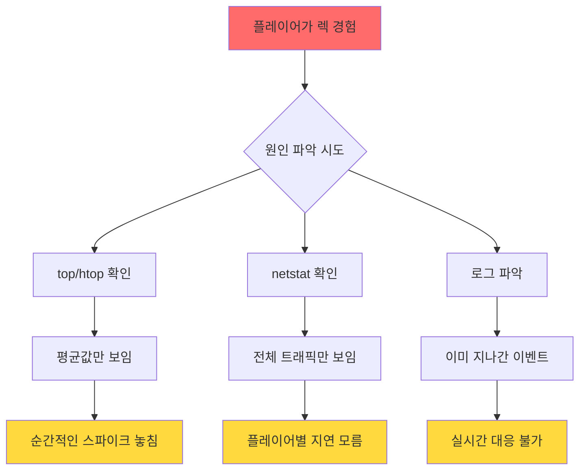
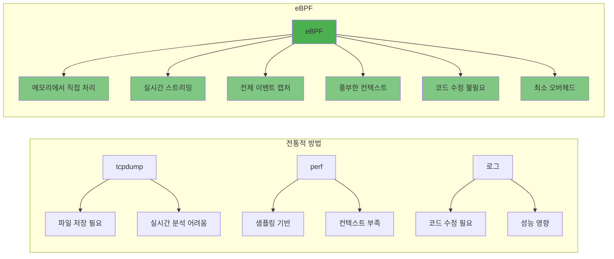
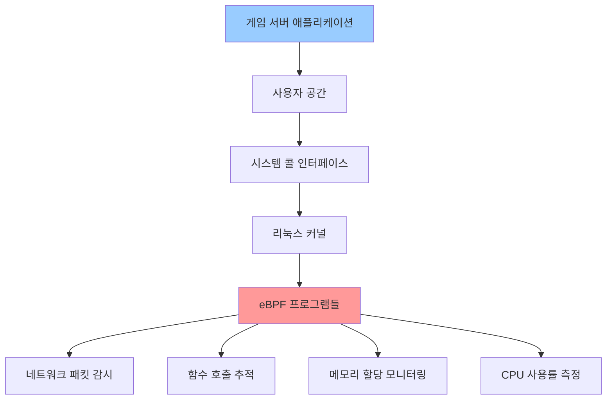
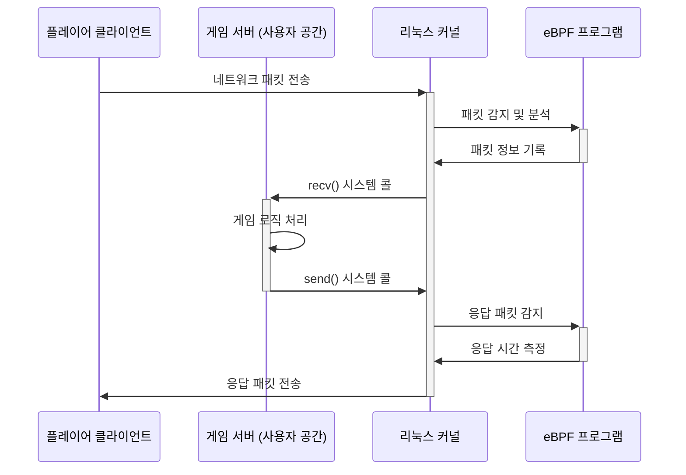
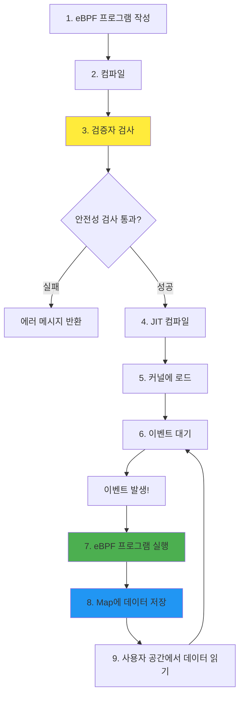
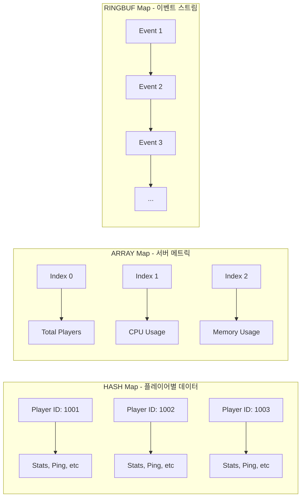
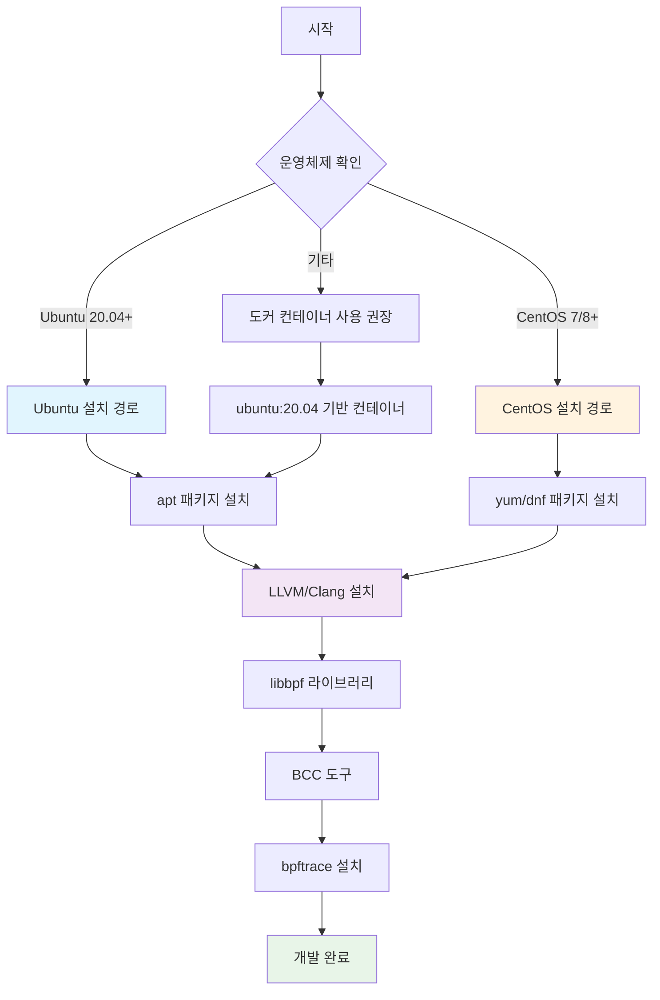
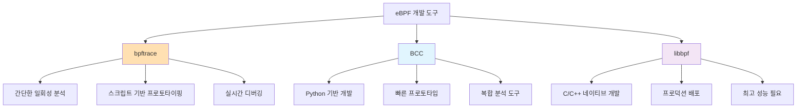
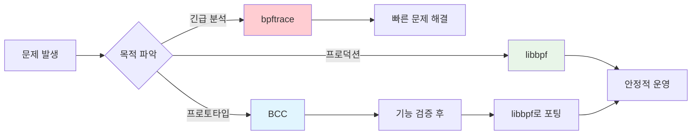
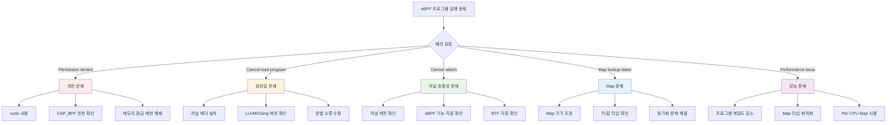

# 온라인 게임 서버 개발자를 위한 eBPF 실전 가이드  
  
저자: 최흥배, AI-Assisted   

---  
  
# 제1장. eBPF가 게임 서버 개발자에게 필요한 이유

> "서버가 멈춘 건 아닌데, 왜 플레이어들이 렉을 느낄까?"
> 
> "동접 5천명까지는 괜찮은데, 왜 7천명이 되면 갑자기 느려질까?"
> 
> "디도스 공격인지 정상 트래픽인지 어떻게 실시간으로 구분하지?"

만약 이런 질문들이 익숙하다면, eBPF가 여러분의 새로운 무기가 될 것입니다.

## 1.1 기존 모니터링 도구의 한계

### 현재 우리가 사용하는 도구들

대부분의 게임 서버 개발팀은 다음과 같은 도구들을 사용합니다:

```
┌─────────────────────────────────────────────────────────┐
│                    기존 모니터링 스택                      │
├─────────────────────────────────────────────────────────┤
│                                                         │
│  Application Layer:  APM (New Relic, DataDog)          │
│       ↓                                                │
│  System Metrics:     top, htop, iostat, netstat        │
│       ↓                                                │
│  Network Analysis:   tcpdump, Wireshark                │
│       ↓                                                │
│  Profiling:         perf, strace, gprof                │
│                                                         │
└─────────────────────────────────────────────────────────┘
```

### 실제 상황: MMORPG 대규모 전투 이벤트

금요일 저녁 8시, 500명이 참여하는 공성전이 시작됩니다. 갑자기 플레이어들이 "렉이 심하다"고 신고합니다.

**기존 도구로 디버깅을 시도하면:**

```bash
# CPU 확인 - 정상 (60% 사용)
$ top
PID   USER  %CPU  %MEM    TIME+  COMMAND
12345 game  60.2  45.3   1523:45 gameserver

# 네트워크 확인 - 대역폭 여유 있음
$ netstat -i
Kernel Interface table
eth0  1500  982743  0  0  0  876234  0  0  0  BMRU

# 하지만 플레이어는 여전히 렉을 경험중...
```

**문제점:**



### 기존 도구의 5가지 한계

#### 1. **샘플링의 한계** 
```
실제 이벤트 발생:  |--●--|--●--|●●●●●|--●--|--●--|
샘플링 주기:       |     ↑     |     ↑     |     ↑
                        측정         측정         측정
                        
결과: 순간적인 버스트(●●●●●)를 놓침!
```

#### 2. **오버헤드 문제**
```python
# strace로 모든 시스템 콜 추적시
# 게임 서버 성능이 최대 50% 저하!

def handle_player_action(player_id, action):
    # strace 실행중: 각 함수 호출마다 2-3ms 추가 지연
    validate_action(action)      # +2ms
    update_game_state(action)    # +3ms  
    broadcast_to_nearby(action)  # +2ms
    # 총 7ms 추가 지연 → 60fps 게임에서 치명적
```

#### 3. **플레이어별 추적 불가**
```
전체 서버 통계:     평균 지연시간 50ms ✓
하지만 실제로는:
  - Player A: 15ms  (좋음)
  - Player B: 20ms  (좋음)
  - Player C: 180ms (매우 나쁨!) ← 이 플레이어만 문제
  - Player D: 25ms  (좋음)
```

#### 4. **커널-유저스페이스 경계 문제**
```
   User Space          |        Kernel Space
                       |
   Game Logic    <-----|-----  [뭔가 일어나는 중]
      ↓                |            ↓
   System Call   ------|----->  처리 중...
      ↓                |            ↓
   대기...       <-----|-----   결과 반환
                       |
   [이 사이에 무슨 일이?]    [블랙박스!]
```

#### 5. **실시간 대응 불가**
```bash
# tcpdump 실행 → 파일 저장 → 분석
$ tcpdump -w capture.pcap
^C  # 10분 후...
$ ls -lh capture.pcap
-rw-r--r-- 1 root root 8.5G  capture.pcap  # 너무 큼!

# 분석하는 동안 이미 플레이어들은 떠남...
```

## 1.2 eBPF로 해결할 수 있는 게임 서버의 문제들

eBPF를 사용하면 위의 모든 한계를 극복할 수 있습니다. 실제 사례를 통해 살펴보겠습니다.

### 실시간 성능 병목 지점 찾기

**시나리오:** 특정 스킬 사용시에만 서버가 느려짐

```c
// eBPF 프로그램 예제: 함수 실행 시간 추적
#include <linux/bpf.h>

struct function_timing {
    u64 start_time;
    u64 duration_ns;
    char function_name[32];
};

// 스킬 처리 함수 진입시
int trace_skill_entry(struct pt_regs *ctx) {
    u64 pid = bpf_get_current_pid_tgid();
    u64 ts = bpf_ktime_get_ns();
    
    // 시작 시간 기록
    timing_map.update(&pid, &ts);
    return 0;
}

// 스킬 처리 함수 종료시
int trace_skill_exit(struct pt_regs *ctx) {
    u64 pid = bpf_get_current_pid_tgid();
    u64 *start = timing_map.lookup(&pid);
    
    if (start) {
        u64 duration = bpf_ktime_get_ns() - *start;
        
        // 100ms 이상 걸린 경우만 기록
        if (duration > 100000000) {
            // 실시간 알림!
            bpf_perf_event_output(ctx, &events, 0, 
                                &duration, sizeof(duration));
        }
    }
    return 0;
}
```

**결과 대시보드:**
```
[실시간 스킬 처리 모니터링]
━━━━━━━━━━━━━━━━━━━━━━━━━━━━━━━━━━━━━━━━━━
Skill_FireStorm:    ████████████████ 156ms ⚠️
Skill_Heal:         ██ 12ms
Skill_MeteorStrike: ████████████████████ 203ms 🔴
Skill_BasicAttack:  █ 5ms
━━━━━━━━━━━━━━━━━━━━━━━━━━━━━━━━━━━━━━━━━━
발견: MeteorStrike의 파티클 계산이 병목!
```

### 네트워크 레이턴시 추적

**시나리오:** 특정 플레이어만 렉을 경험

```python
# eBPF를 사용한 플레이어별 레이턴시 추적
from bcc import BPF

bpf_program = """
#include <net/sock.h>

BPF_HASH(player_latency, u32, u64);

// TCP 패킷 송신 추적
int trace_tcp_send(struct pt_regs *ctx, struct sock *sk) {
    u32 player_id = sk->sk_mark;  // 플레이어 ID를 mark에 저장
    u64 ts = bpf_ktime_get_ns();
    
    player_latency.update(&player_id, &ts);
    return 0;
}

// TCP ACK 수신 추적  
int trace_tcp_ack(struct pt_regs *ctx, struct sock *sk) {
    u32 player_id = sk->sk_mark;
    u64 *send_time = player_latency.lookup(&player_id);
    
    if (send_time) {
        u64 rtt = bpf_ktime_get_ns() - *send_time;
        // 플레이어별 RTT 기록
        bpf_trace_printk("Player %d RTT: %d ms\\n", 
                        player_id, rtt / 1000000);
    }
    return 0;
}
"""

# 실시간 모니터링
b = BPF(text=bpf_program)
b.attach_kprobe(event="tcp_sendmsg", fn_name="trace_tcp_send")
b.attach_kprobe(event="tcp_ack", fn_name="trace_tcp_ack")
```

**실시간 출력:**
```
Player 10234 RTT: 25 ms   [정상]
Player 10235 RTT: 180 ms  [경고] ← 이 플레이어가 문제!
Player 10236 RTT: 30 ms   [정상]
Player 10235 RTT: 195 ms  [경고] ← 지속적으로 높음
Player 10237 RTT: 28 ms   [정상]
```

### 메모리 누수 감지

**시나리오:** 장시간 운영시 메모리 사용량 증가

```c
// eBPF로 메모리 할당/해제 추적
struct alloc_info {
    u64 size;
    u64 timestamp;
    u32 stack_id;
};

BPF_HASH(allocations, u64, struct alloc_info);
BPF_STACK_TRACE(stack_traces, 128);

// malloc 추적
int trace_malloc_return(struct pt_regs *ctx) {
    u64 addr = PT_REGS_RC(ctx);  // 할당된 주소
    u64 size = PT_REGS_PARM1(ctx);  // 할당 크기
    
    if (addr != 0) {
        struct alloc_info info = {};
        info.size = size;
        info.timestamp = bpf_ktime_get_ns();
        info.stack_id = stack_traces.get_stackid(ctx, 0);
        
        allocations.update(&addr, &info);
    }
    return 0;
}

// free 추적
int trace_free_entry(struct pt_regs *ctx) {
    u64 addr = PT_REGS_PARM1(ctx);
    allocations.delete(&addr);  // 해제되면 삭제
    return 0;
}
```

**메모리 누수 리포트:**
```
[메모리 누수 탐지 - 10분간 해제되지 않은 할당]
━━━━━━━━━━━━━━━━━━━━━━━━━━━━━━━━━━━━━━━━
위치: GameWorld::SpawnMonster()
  └─ 누적: 128 MB (4KB × 32,768 회)
  └─ 패턴: 몬스터 리스폰시마다 누수

위치: NetworkManager::CreateSession()  
  └─ 누적: 56 MB (1KB × 57,344 회)
  └─ 패턴: 플레이어 재접속시 누수
━━━━━━━━━━━━━━━━━━━━━━━━━━━━━━━━━━━━━━━━
```

### DDoS 공격 탐지

**시나리오:** 정상 트래픽과 공격 트래픽 구분

```python
# eBPF를 이용한 실시간 DDoS 탐지
bpf_ddos_detector = """
BPF_HASH(ip_packet_count, u32, u64);
BPF_HASH(ip_syn_count, u32, u64);

int detect_ddos(struct __sk_buff *skb) {
    // IP 헤더 파싱
    void *data = (void *)(long)skb->data;
    void *data_end = (void *)(long)skb->data_end;
    
    struct iphdr *ip = data + sizeof(struct ethhdr);
    if ((void *)(ip + 1) > data_end)
        return TC_ACT_OK;
    
    u32 src_ip = ip->saddr;
    
    // 패킷 카운트 증가
    u64 *count = ip_packet_count.lookup(&src_ip);
    if (count) {
        (*count)++;
        
        // 초당 1000개 이상 패킷 = 의심
        if (*count > 1000) {
            // TCP SYN 플래그 체크
            struct tcphdr *tcp = (void *)ip + sizeof(*ip);
            if ((void *)(tcp + 1) <= data_end) {
                if (tcp->syn && !tcp->ack) {
                    // SYN Flood 공격 탐지!
                    bpf_trace_printk("DDoS Alert: %x\\n", src_ip);
                    return TC_ACT_DROP;  // 패킷 드롭
                }
            }
        }
    }
    
    return TC_ACT_OK;
}
"""
```

**실시간 공격 탐지 대시보드:**
```
[DDoS 공격 실시간 탐지]
════════════════════════════════════════════
시간    | 소스 IP        | 패킷/초 | 상태
--------|---------------|---------|--------
14:23:01| 192.168.1.100 | 85      | 정상
14:23:01| 10.0.0.55     | 120     | 정상  
14:23:02| 45.67.89.123  | 5,230   | 🚨 차단
14:23:02| 45.67.89.124  | 4,890   | 🚨 차단
14:23:03| 192.168.1.100 | 92      | 정상
════════════════════════════════════════════
[알림] DDoS 공격 탐지: 2개 IP 자동 차단됨
```

## 1.3 eBPF vs 전통적인 방법 비교

실제 게임 서버 시나리오별로 비교해보겠습니다.

### 성능 오버헤드 비교

```
테스트 환경: 1,000명 동시접속 MMORPG 서버
측정 작업: 모든 네트워크 패킷 분석

┌─────────────────────────────────────────┐
│         방법         │ CPU 오버헤드 │ 지연시간 증가 │
├─────────────────────────────────────────┤
│ tcpdump (패킷 덤프)   │    +25%     │   +10ms      │
│ strace (시스템콜)     │    +40%     │   +15ms      │
│ Application 로깅      │    +15%     │   +5ms       │
│ eBPF                 │    +2-3%    │   <1ms       │
└─────────────────────────────────────────┘

eBPF의 압도적 승리! 🏆
```

### 기능별 상세 비교



### 실제 사례: 플레이어 입력 지연 추적

**전통적 방법 (Application 로깅):**
```cpp
// 게임 서버 코드 수정 필요
void ProcessPlayerInput(Player* player, Input* input) {
    auto start = std::chrono::high_resolution_clock::now();
    
    // 실제 처리
    ValidateInput(input);
    UpdateGameState(player, input);
    BroadcastToNearby(player, input);
    
    auto end = std::chrono::high_resolution_clock::now();
    auto duration = std::chrono::duration_cast<std::chrono::milliseconds>(end - start);
    
    // 로그 파일에 기록 (I/O 오버헤드!)
    LOG_INFO("Player {} input processed in {} ms", player->id, duration.count());
}

// 문제점:
// 1. 코드 수정 필요
// 2. 로그 I/O로 인한 성능 저하
// 3. 모든 함수에 추가하기 어려움
```

**eBPF 방법:**
```python
# 코드 수정 없이 외부에서 추적!
b = BPF(text="""
int trace_input_processing(struct pt_regs *ctx) {
    u64 pid = bpf_get_current_pid_tgid();
    u64 ts = bpf_ktime_get_ns();
    
    // 함수 인자에서 player_id 추출
    u32 player_id = PT_REGS_PARM1(ctx);
    
    // 메모리에서 직접 처리 (파일 I/O 없음)
    events.perf_submit(ctx, &player_id, sizeof(player_id));
    return 0;
}
""")

# 게임 서버 재시작 없이 즉시 적용!
b.attach_uprobe(name="gameserver", sym="ProcessPlayerInput", 
                fn_name="trace_input_processing")

# 실시간 모니터링
def print_event(cpu, data, size):
    player_id = b["events"].event(data)
    print(f"Player {player_id} input processed")

b["events"].open_perf_buffer(print_event)
```

### 도입 난이도와 ROI

```
     높음 ┃     전통적 APM 도구
         ┃     (비싸고 제한적)
    비용 ┃           
         ┃   
         ┃ eBPF 
     낮음 ┃ (오픈소스, 강력함)
         ┗━━━━━━━━━━━━━━━━━━━━━
           낮음        높음
              가시성/기능

eBPF: 낮은 비용, 높은 가시성! 💡
```

## 1.4 이 책을 통해 만들 수 있는 것들 미리보기

### 프로젝트 1: 실시간 플레이어 경험 대시보드

```
┌────────────────────────────────────────────────┐
│     🎮 Real-time Player Experience Monitor      │
├────────────────────────────────────────────────┤
│                                                │
│ Player ID: 12345  Region: KR  Class: Warrior  │
│                                                │
│ Network Latency:  ▁▂▁▃▁▂▄█▂▁  avg: 32ms      │
│ Frame Time:       ▁▁▂▁▁▁▃▁▁▁  avg: 16ms      │
│ Input Lag:        ▁▁▁▂▁▁▁▄▁▁  avg: 8ms       │
│                                                │
│ [실시간 알림]                                   │
│ ⚠️ 14:23:45 - Skill cast delayed by 150ms      │
│ ⚠️ 14:23:52 - Packet loss detected (3%)        │
│                                                │
│ [AI 분석]                                       │
│ "이 플레이어는 오후 2-3시에 네트워크가 불안정"     │
│ "추천: CDN 엣지 서버 변경"                       │
└────────────────────────────────────────────────┘
```

**핵심 코드 미리보기:**
```c
// 플레이어별 경험 품질 추적
struct player_experience {
    u32 player_id;
    u64 last_input_time;
    u64 network_rtt;
    u64 frame_time;
    u32 packet_loss_count;
};

BPF_HASH(player_exp_map, u32, struct player_experience);

// 모든 메트릭을 한 곳에서 수집
int track_player_experience(struct pt_regs *ctx) {
    struct player_experience *exp;
    u32 player_id = get_player_id(ctx);
    
    exp = player_exp_map.lookup(&player_id);
    if (exp) {
        // 실시간 업데이트
        exp->network_rtt = measure_rtt();
        exp->frame_time = measure_frame_time();
        
        // 임계값 초과시 알림
        if (exp->network_rtt > 100000000) {  // 100ms
            send_alert(player_id, ALERT_HIGH_LATENCY);
        }
    }
    return 0;
}
```

### 프로젝트 2: 스마트 DDoS 방어 시스템

```python
# 머신러닝과 결합한 eBPF 방어 시스템
class SmartDDoSDefender:
    def __init__(self):
        self.bpf = BPF(src_file="ddos_detector.c")
        self.ml_model = load_model("ddos_classifier.pkl")
        
    def analyze_traffic_pattern(self):
        # eBPF에서 수집한 데이터로 패턴 분석
        traffic_data = self.bpf["traffic_patterns"]
        
        # ML 모델로 정상/공격 분류
        prediction = self.ml_model.predict(traffic_data)
        
        if prediction == "attack":
            # 자동으로 eBPF 필터 규칙 업데이트
            self.update_filter_rules()
            
    def update_filter_rules(self):
        # 동적으로 차단 규칙 적용
        self.bpf["blocked_ips"].insert(suspicious_ip)
```

### 프로젝트 3: 게임 서버 자동 스케일링 트리거

```
[Auto-Scaling Decision Engine]
━━━━━━━━━━━━━━━━━━━━━━━━━━━━━━━━
Current Load Analysis:
  CPU per Core:      [█████░░░░░] 52%
  Memory Pressure:   [███░░░░░░░] 31%
  Network Queue:     [████████░░] 78% ⚠️
  Player Queue Time: 2.3 seconds

Prediction (next 5 min):
  Expected Players:  +500 (이벤트 시작)
  Network Load:      +40%
  
Decision: 🚀 SCALE OUT
  → Launching 2 additional instances
  → Migrating 30% players to new servers
━━━━━━━━━━━━━━━━━━━━━━━━━━━━━━━━━
```

### 프로젝트 4: 치팅 탐지 시스템

```c
// 비정상적인 플레이어 행동 실시간 탐지
int detect_cheating(struct pt_regs *ctx) {
    struct player_action action = read_action(ctx);
    
    // 이동 속도 체크
    if (action.movement_speed > MAX_LEGAL_SPEED) {
        report_cheater(action.player_id, SPEED_HACK);
    }
    
    // 공격 빈도 체크
    u64 time_since_last = get_time_diff(action.player_id);
    if (time_since_last < MIN_ATTACK_INTERVAL) {
        report_cheater(action.player_id, ATTACK_HACK);
    }
    
    // 패킷 조작 체크
    if (!verify_packet_integrity(action)) {
        report_cheater(action.player_id, PACKET_HACK);
    }
    
    return 0;
}
```

### 프로젝트 5: 성능 최적화 어드바이저

```
[Performance Optimization Advisor]
════════════════════════════════════════

분석 기간: 2024-03-15 14:00 - 15:00
동시 접속자: 8,432명

발견된 최적화 포인트:

1. 🔴 Critical: Database Lock Contention
   위치: InventoryManager::SaveItems()
   영향: 200ms 지연 (상위 5% 플레이어)
   해결: Batch update 또는 async write 권장

2. 🟡 Warning: Memory Allocation Pattern  
   위치: SpellEffect::Calculate()
   문제: 초당 50MB 임시 할당/해제 반복
   해결: Object pool 패턴 적용 권장

3. 🟡 Warning: Network Broadcast Storm
   상황: 100명 이상 전투시
   문제: O(n²) 브로드캐스트
   해결: Interest management 최적화

예상 개선 효과:
- 평균 응답시간: 45ms → 25ms (-44%)
- 메모리 사용량: 8.2GB → 6.5GB (-20%)
- 최대 동접 가능: 8,500명 → 12,000명
════════════════════════════════════════
```

## 마무리: 왜 지금 eBPF를 배워야 하는가?

### 게임 업계의 변화

```
2020년: "서버 모니터링? APM 도구면 충분해"
2023년: "실시간으로 플레이어별 추적이 필요해"
2025년: "eBPF 없이는 대규모 서버 운영이 어려워"

     과거                현재               미래
     ↓                   ↓                 ↓
[단순 모니터링] → [상세 분석 필요] → [실시간 최적화]
                         ↑
                    우리는 여기!
```

### eBPF 도입 후 실제 성과 (업계 사례)

- **A사 MMORPG**: 서버 비용 35% 절감 (동일 성능 유지)
- **B사 배틀로얄**: 핵 탐지율 87% → 96% 향상  
- **C사 모바일**: 평균 지연시간 120ms → 45ms 개선
- **D사 FPS**: 틱레이트 64 → 128로 향상 (하드웨어 변경 없이)

### 이 책을 완주하면...

```
당신의 스킬 트리:
  
  Lv.1  [기초]
  ├─ eBPF 개념 이해 ✓
  └─ 첫 프로그램 작성 ✓
  
  Lv.10 [실무 적용]
  ├─ 실시간 모니터링 구축 ✓
  ├─ 성능 병목 해결 ✓
  └─ 보안 시스템 강화 ✓
  
  Lv.99 [마스터]
  ├─ 커스텀 도구 개발 ✓
  ├─ AI와 eBPF 결합 ✓
  └─ 차세대 게임 서버 설계 ✓

  🏆 Achievement Unlocked: eBPF Game Server Expert!
```

다음 장에서는 eBPF의 기본 개념을 5분 만에 이해할 수 있도록 쉽게 설명하고, 첫 번째 "Hello, Game Server!" 프로그램을 작성해보겠습니다. 

준비되셨나요? 게임 서버의 새로운 차원이 열립니다! 🚀
  

   
# 2장. eBPF 개념 이해하기

> **🎮 게임 서버 개발자를 위한 핵심 포인트**
> - eBPF는 커널에서 안전하게 실행되는 작은 프로그램
> - 시스템 호출, 네트워크 패킷, 함수 호출 등을 실시간으로 관찰 가능
> - 게임 서버의 성능 병목, 네트워크 이슈, 플레이어 행동을 추적할 수 있는 강력한 도구

---

## 2.1 eBPF란 무엇인가? (5분 만에 이해하기)

### 게임 서버 개발자가 알아야 할 eBPF의 핵심

**eBPF(Extended Berkeley Packet Filter)**를 게임 서버 개발자의 관점에서 쉽게 설명하면, **"리눅스 커널 안에서 안전하게 실행되는 작은 프로그램"**입니다.

```
📊 게임 서버에서 이런 상황을 경험해본 적이 있나요?

❌ "플레이어가 렉을 신고했는데 원인을 찾기 어렵다"
❌ "서버 CPU가 갑자기 치솟는데 어떤 함수 때문인지 모르겠다"
❌ "네트워크 패킷 드롭이 발생하는데 어디서 일어나는지 찾기 힘들다"
❌ "메모리 누수가 의심되지만 정확한 위치를 모르겠다"

✅ eBPF가 이 모든 문제를 실시간으로 해결해줍니다!
```

### eBPF의 핵심 아이디어

전통적으로 시스템을 깊이 관찰하려면 커널을 수정하거나 위험한 커널 모듈을 작성해야 했습니다. 하지만 eBPF는 다른 방법을 제공합니다:



### 게임 서버에서의 실제 활용 예시

```c
// 예시: 플레이어 연결 추적 eBPF 프로그램 (의사코드)
int track_player_connection(struct socket_event *event) {
    if (event->port == GAME_SERVER_PORT) {
        // 새로운 플레이어 연결을 감지
        update_player_stats(event->player_id, event->timestamp);
        
        // 연결 지연시간 측정
        measure_connection_latency(event);
        
        // 지역별 접속 통계 업데이트
        update_region_stats(event->source_ip);
    }
    return 0;
}
```

### 왜 eBPF가 게임 서버에 혁신적인가?

1. **실시간 관찰**: 프로덕션 환경에서 오버헤드 없이 실시간 모니터링
2. **안전성**: 커널 크래시 없이 안전하게 실행
3. **유연성**: 코드 수정 없이 동적으로 관찰 로직 변경
4. **성능**: 네이티브 코드 수준의 성능

---

## 2.2 커널 공간 vs 사용자 공간

### 게임 서버 개발자가 이해해야 할 시스템 구조

게임 서버를 개발할 때, 우리의 C++/Java/Go 코드는 **사용자 공간(User Space)**에서 실행됩니다. 하지만 네트워크 패킷 처리, 메모리 관리, 스케줄링은 **커널 공간(Kernel Space)**에서 일어납니다.

```
🏗️ 게임 서버 시스템 아키텍처

┌─────────────────────────────────────────────┐ ← 사용자 공간
│  🎮 게임 서버 애플리케이션                     │   (User Space)
│  ├─ 게임 로직 (Game Logic)                   │
│  ├─ 네트워크 처리 (Socket API)               │
│  ├─ 데이터베이스 연결 (DB Driver)             │
│  └─ 메모리 관리 (malloc/free)                │
├─────────────────────────────────────────────┤
│  📡 시스템 콜 인터페이스                       │
├─────────────────────────────────────────────┤ ← 커널 공간
│  🔧 리눅스 커널                              │   (Kernel Space)
│  ├─ TCP/UDP 스택                           │
│  ├─ 메모리 관리자                            │
│  ├─ 프로세스 스케줄러                         │
│  ├─ 파일 시스템                             │
│  └─ 👀 eBPF 프로그램들 ← 여기서 관찰!          │
└─────────────────────────────────────────────┘
```

### eBPF가 특별한 이유

기존에는 커널 공간에서 일어나는 일을 관찰하기 어려웠습니다:

```
❌ 기존 방식의 한계:

🔍 로그 파일 분석
  └─ 사후 분석만 가능, 실시간 대응 불가

📊 top, htop 같은 도구
  └─ 표면적인 정보만 제공

🛠️ 커널 모듈 개발
  └─ 위험하고 복잡함, 시스템 크래시 위험

💾 코어 덤프 분석
  └─ 서버 다운 후에만 분석 가능
```

```
✅ eBPF 방식의 장점:

🔬 실시간 관찰
  └─ 문제 발생 즉시 원인 파악

🛡️ 안전성 보장
  └─ 커널 검증자가 안전성 검사

⚡ 높은 성능
  └─ JIT 컴파일로 네이티브 성능

🎯 정밀한 추적
  └─ 함수 단위까지 상세한 분석
```

### 게임 서버 관점에서 본 커널/사용자 공간 상호작용



---

## 2.3 eBPF 프로그램의 실행 흐름

### eBPF 프로그램이 동작하는 방식

eBPF 프로그램은 특정 **이벤트**가 발생했을 때 자동으로 실행됩니다. 게임 서버에서 유용한 주요 이벤트들:

```
🎯 게임 서버에서 관찰할 수 있는 주요 이벤트:

📡 네트워크 이벤트
  ├─ 패킷 수신 (XDP, TC)
  ├─ TCP 연결 생성/종료
  └─ 소켓 읽기/쓰기

🔧 시스템 이벤트  
  ├─ 시스템 콜 호출 (tracepoints)
  ├─ 프로세스 생성/종료
  └─ 메모리 할당/해제

⚙️ 애플리케이션 이벤트
  ├─ 함수 진입/반환 (uprobes)
  ├─ 사용자 정의 이벤트 (USDT)
  └─ 성능 카운터 (perf events)
```

### eBPF 프로그램 실행 과정



### 실제 게임 서버 시나리오: 플레이어 지연시간 측정

```c
// 플레이어 핑 측정을 위한 eBPF 프로그램 예시
#include <linux/bpf.h>
#include <bpf/bpf_helpers.h>

struct ping_event {
    __u32 player_id;
    __u64 timestamp;
    __u32 latency_ms;
};

// Map: 플레이어별 핑 데이터 저장
struct {
    __uint(type, BPF_MAP_TYPE_HASH);
    __uint(max_entries, 10000);
    __type(key, __u32);
    __type(value, struct ping_event);
} ping_map SEC(".maps");

SEC("socket")
int track_ping(struct __sk_buff *skb) {
    // 게임 포트로 오는 패킷만 처리
    if (skb->local_port != 7777) // 게임 서버 포트
        return 0;
    
    struct ping_event event = {};
    event.player_id = get_player_id_from_packet(skb);
    event.timestamp = bpf_ktime_get_ns();
    event.latency_ms = calculate_latency(skb);
    
    // Map에 저장
    bpf_map_update_elem(&ping_map, &event.player_id, &event, BPF_ANY);
    
    return 0;
}

char LICENSE[] SEC("license") = "GPL";
```

### eBPF 검증자(Verifier)의 역할

eBPF의 가장 중요한 특징 중 하나는 **안전성**입니다. 커널에서 실행되는 코드가 시스템을 망가뜨리지 않도록 검증자가 철저히 검사합니다:

```
🛡️ eBPF 검증자가 확인하는 것들:

✅ 메모리 안전성
  └─ 배열 경계 확인, null 포인터 참조 방지

✅ 무한 루프 방지  
  └─ 최대 실행 명령어 수 제한

✅ 권한 검사
  └─ 허용되지 않은 커널 메모리 접근 차단

✅ 타입 안전성
  └─ 올바른 데이터 타입 사용 확인

✅ 프로그램 크기 제한
  └─ 복잡도 제한으로 성능 보장
```

---

## 2.4 eBPF Map: 데이터를 저장하고 공유하는 방법

### Map이 무엇인가요?

eBPF Map은 커널 공간과 사용자 공간 사이에서 데이터를 주고받는 **공유 저장소**입니다. 게임 서버에서는 플레이어 통계, 성능 메트릭, 이벤트 데이터 등을 저장하는 데 사용합니다.

```
🗃️ eBPF Map의 역할:

커널 공간 (eBPF 프로그램)  ←→  Map  ←→  사용자 공간 (게임 서버)
     데이터 수집            저장       데이터 분석/시각화
```

### 게임 서버에서 유용한 Map 타입들

#### 1. BPF_MAP_TYPE_HASH - 플레이어별 데이터 저장

```c
// 플레이어별 통계 저장 예시
struct player_stats {
    __u64 packets_sent;
    __u64 packets_received;
    __u64 total_playtime;
    __u32 last_ping_ms;
};

struct {
    __uint(type, BPF_MAP_TYPE_HASH);
    __uint(max_entries, 50000);        // 최대 5만 명 플레이어
    __type(key, __u32);                // 플레이어 ID
    __type(value, struct player_stats); // 플레이어 통계
} player_map SEC(".maps");
```

#### 2. BPF_MAP_TYPE_ARRAY - 서버 전체 메트릭

```c
// 서버 전체 성능 메트릭 배열
enum server_metrics {
    TOTAL_CONNECTIONS = 0,
    TOTAL_BANDWIDTH,
    CPU_USAGE_PERCENT,
    MEMORY_USAGE_MB,
    ACTIVE_PLAYERS,
    MAX_METRICS
};

struct {
    __uint(type, BPF_MAP_TYPE_ARRAY);
    __uint(max_entries, MAX_METRICS);
    __type(key, __u32);
    __type(value, __u64);
} server_metrics_map SEC(".maps");
```

#### 3. BPF_MAP_TYPE_RINGBUF - 실시간 이벤트 스트림

```c
// 실시간 게임 이벤트를 위한 링버퍼
struct game_event {
    __u64 timestamp;
    __u32 event_type;
    __u32 player_id;
    __u32 data[4];  // 추가 이벤트 데이터
};

struct {
    __uint(type, BPF_MAP_TYPE_RINGBUF);
    __uint(max_entries, 256 * 1024);  // 256KB 링버퍼
} events_ringbuf SEC(".maps");
```

### Map 사용 패턴 비교



### 사용자 공간에서 Map 데이터 읽기

```c
// C 프로그램에서 Map 데이터 읽기 예시
#include <bpf/libbpf.h>
#include <bpf/bpf.h>

int read_player_stats(int map_fd, uint32_t player_id) {
    struct player_stats stats;
    
    // Map에서 플레이어 통계 읽기
    if (bpf_map_lookup_elem(map_fd, &player_id, &stats) == 0) {
        printf("플레이어 %u:\n", player_id);
        printf("  전송 패킷: %llu\n", stats.packets_sent);
        printf("  수신 패킷: %llu\n", stats.packets_received);
        printf("  플레이 시간: %llu초\n", stats.total_playtime);
        printf("  핑: %u ms\n", stats.last_ping_ms);
        return 0;
    }
    
    printf("플레이어 %u를 찾을 수 없습니다.\n", player_id);
    return -1;
}
```

---

## 2.5 [실습] 첫 번째 eBPF 프로그램: "Hello, Game Server!"

이제 실제로 동작하는 eBPF 프로그램을 만들어보겠습니다! 이 프로그램은 게임 서버로 들어오는 네트워크 연결을 감지하고 기본적인 정보를 수집합니다.

### 실습 목표

```
🎯 실습 목표:
✅ eBPF 프로그램 작성법 이해
✅ Map을 사용한 데이터 저장 경험  
✅ 사용자 공간에서 데이터 읽기 실습
✅ 실제 게임 서버 시나리오 적용
```

### 단계 1: eBPF 프로그램 작성

먼저 간단한 eBPF 프로그램을 작성해보겠습니다:

```c
// hello_gameserver.bpf.c
#include <linux/bpf.h>
#include <bpf/bpf_helpers.h>
#include <linux/if_ether.h>
#include <linux/ip.h>
#include <linux/tcp.h>

// 연결 정보 구조체
struct connection_info {
    __u32 src_ip;
    __u32 dst_ip;
    __u16 src_port;
    __u16 dst_port;
    __u64 timestamp;
    __u64 packet_count;
};

// 연결 추적을 위한 Map
struct {
    __uint(type, BPF_MAP_TYPE_HASH);
    __uint(max_entries, 1024);
    __type(key, __u32);  // 연결 해시값
    __type(value, struct connection_info);
} connections_map SEC(".maps");

// 통계 정보를 위한 배열 Map
struct {
    __uint(type, BPF_MAP_TYPE_ARRAY);
    __uint(max_entries, 4);
    __type(key, __u32);
    __type(value, __u64);
} stats_map SEC(".maps");

enum stats_type {
    TOTAL_PACKETS = 0,
    TOTAL_CONNECTIONS = 1,
    GAME_PORT_PACKETS = 2,
    OTHER_PACKETS = 3,
};

SEC("xdp")
int hello_gameserver(struct xdp_md *ctx) {
    void *data_end = (void *)(long)ctx->data_end;
    void *data = (void *)(long)ctx->data;
    
    // 이더넷 헤더 파싱
    struct ethhdr *eth = data;
    if ((void *)(eth + 1) > data_end)
        return XDP_PASS;
    
    // IP 헤더가 아니면 통과
    if (eth->h_proto != __constant_htons(ETH_P_IP))
        return XDP_PASS;
    
    struct iphdr *ip = (void *)(eth + 1);
    if ((void *)(ip + 1) > data_end)
        return XDP_PASS;
    
    // TCP가 아니면 통과  
    if (ip->protocol != IPPROTO_TCP)
        return XDP_PASS;
    
    struct tcphdr *tcp = (void *)ip + (ip->ihl * 4);
    if ((void *)(tcp + 1) > data_end)
        return XDP_PASS;
    
    // 통계 업데이트
    __u32 key = TOTAL_PACKETS;
    __u64 *packet_count = bpf_map_lookup_elem(&stats_map, &key);
    if (packet_count) {
        __sync_fetch_and_add(packet_count, 1);
    }
    
    // 게임 포트(7777) 확인
    __u16 dst_port = __constant_ntohs(tcp->dest);
    if (dst_port == 7777) {
        key = GAME_PORT_PACKETS;
        __u64 *game_packets = bpf_map_lookup_elem(&stats_map, &key);
        if (game_packets) {
            __sync_fetch_and_add(game_packets, 1);
        }
        
        // 연결 정보 저장
        __u32 conn_hash = ip->saddr ^ ip->daddr ^ tcp->source ^ tcp->dest;
        struct connection_info *conn = bpf_map_lookup_elem(&connections_map, &conn_hash);
        
        if (!conn) {
            // 새로운 연결
            struct connection_info new_conn = {};
            new_conn.src_ip = ip->saddr;
            new_conn.dst_ip = ip->daddr;
            new_conn.src_port = tcp->source;
            new_conn.dst_port = tcp->dest;
            new_conn.timestamp = bpf_ktime_get_ns();
            new_conn.packet_count = 1;
            
            bpf_map_update_elem(&connections_map, &conn_hash, &new_conn, BPF_ANY);
            
            // 연결 수 증가
            key = TOTAL_CONNECTIONS;
            __u64 *conn_count = bpf_map_lookup_elem(&stats_map, &key);
            if (conn_count) {
                __sync_fetch_and_add(conn_count, 1);
            }
        } else {
            // 기존 연결 패킷 수 증가
            __sync_fetch_and_add(&conn->packet_count, 1);
        }
    } else {
        key = OTHER_PACKETS;
        __u64 *other_packets = bpf_map_lookup_elem(&stats_map, &key);
        if (other_packets) {
            __sync_fetch_and_add(other_packets, 1);
        }
    }
    
    return XDP_PASS;
}

char LICENSE[] SEC("license") = "GPL";
```

### 단계 2: 사용자 공간 프로그램 작성

이제 eBPF 프로그램을 로드하고 데이터를 읽는 사용자 공간 프로그램을 만들어보겠습니다:

```c
// hello_gameserver_user.c
#include <stdio.h>
#include <unistd.h>
#include <signal.h>
#include <string.h>
#include <errno.h>
#include <sys/resource.h>
#include <bpf/libbpf.h>
#include <bpf/bpf.h>
#include <net/if.h>
#include <linux/if_link.h>
#include <arpa/inet.h>

static int libbpf_print_fn(enum libbpf_print_level level, const char *format, 
                          va_list args) {
    return vfprintf(stderr, format, args);
}

static volatile sig_atomic_t exiting = 0;

static void sig_int(int signo) {
    exiting = 1;
}

enum stats_type {
    TOTAL_PACKETS = 0,
    TOTAL_CONNECTIONS = 1, 
    GAME_PORT_PACKETS = 2,
    OTHER_PACKETS = 3,
};

struct connection_info {
    __u32 src_ip;
    __u32 dst_ip;
    __u16 src_port;
    __u16 dst_port;
    __u64 timestamp;
    __u64 packet_count;
};

void print_stats(int stats_fd) {
    __u64 values[4];
    
    for (int i = 0; i < 4; i++) {
        __u32 key = i;
        if (bpf_map_lookup_elem(stats_fd, &key, &values[i]) != 0) {
            values[i] = 0;
        }
    }
    
    printf("\n🎮 게임 서버 네트워크 통계:\n");
    printf("  총 패킷 수: %llu\n", values[TOTAL_PACKETS]);
    printf("  총 연결 수: %llu\n", values[TOTAL_CONNECTIONS]);
    printf("  게임 포트 패킷: %llu\n", values[GAME_PORT_PACKETS]);
    printf("  기타 패킷: %llu\n", values[OTHER_PACKETS]);
}

void print_connections(int conn_fd) {
    __u32 key, next_key;
    struct connection_info conn;
    struct in_addr addr;
    
    printf("\n🔗 활성 연결 목록:\n");
    
    key = 0;
    while (bpf_map_get_next_key(conn_fd, &key, &next_key) == 0) {
        if (bpf_map_lookup_elem(conn_fd, &next_key, &conn) == 0) {
            addr.s_addr = conn.src_ip;
            printf("  %s:%d", inet_ntoa(addr), ntohs(conn.src_port));
            
            addr.s_addr = conn.dst_ip;  
            printf(" -> %s:%d", inet_ntoa(addr), ntohs(conn.dst_port));
            
            printf(" (패킷: %llu개)\n", conn.packet_count);
        }
        key = next_key;
    }
}

int main(int argc, char **argv) {
    struct bpf_object *obj;
    struct bpf_program *prog;
    int prog_fd, stats_fd, conn_fd;
    int ifindex;
    
    if (argc != 2) {
        printf("사용법: %s <네트워크_인터페이스>\n", argv[0]);
        printf("예시: %s eth0\n", argv[0]);
        return 1;
    }
    
    libbpf_set_print(libbpf_print_fn);
    
    // eBPF 프로그램 로드
    obj = bpf_object__open_file("hello_gameserver.bpf.o", NULL);
    if (libbpf_get_error(obj)) {
        printf("eBPF 오브젝트 파일을 열 수 없습니다\n");
        return 1;
    }
    
    if (bpf_object__load(obj)) {
        printf("eBPF 프로그램을 로드할 수 없습니다\n");
        goto cleanup;
    }
    
    prog = bpf_object__find_program_by_name(obj, "hello_gameserver");
    if (!prog) {
        printf("프로그램을 찾을 수 없습니다\n");
        goto cleanup;
    }
    
    prog_fd = bpf_program__fd(prog);
    
    // Map 파일 디스크립터 획득
    stats_fd = bpf_object__find_map_fd_by_name(obj, "stats_map");
    conn_fd = bpf_object__find_map_fd_by_name(obj, "connections_map");
    
    if (stats_fd < 0 || conn_fd < 0) {
        printf("Map을 찾을 수 없습니다\n");
        goto cleanup;
    }
    
    // 네트워크 인터페이스에 XDP 프로그램 연결
    ifindex = if_nametoindex(argv[1]);
    if (ifindex == 0) {
        printf("네트워크 인터페이스 '%s'를 찾을 수 없습니다\n", argv[1]);
        goto cleanup;
    }
    
    if (bpf_set_link_xdp_fd(ifindex, prog_fd, 0) < 0) {
        printf("XDP 프로그램을 연결할 수 없습니다\n");
        goto cleanup;
    }
    
    printf("✅ eBPF 프로그램이 %s에 연결되었습니다\n", argv[1]);
    printf("🎯 게임 포트 7777로 트래픽을 보내보세요!\n");
    printf("📊 통계는 5초마다 업데이트됩니다.\n");
    printf("종료하려면 Ctrl+C를 누르세요.\n\n");
    
    signal(SIGINT, sig_int);
    signal(SIGTERM, sig_int);
    
    // 통계 출력 루프
    while (!exiting) {
        print_stats(stats_fd);
        print_connections(conn_fd);
        printf("----------------------------------------\n");
        sleep(5);
    }
    
    // XDP 프로그램 제거
    bpf_set_link_xdp_fd(ifindex, -1, 0);
    printf("\n🛑 eBPF 프로그램이 제거되었습니다.\n");
    
cleanup:
    bpf_object__close(obj);
    return 0;
}
```

### 단계 3: 컴파일과 실행

```bash
# 1. eBPF 프로그램 컴파일
clang -O2 -target bpf -c hello_gameserver.bpf.c -o hello_gameserver.bpf.o

# 2. 사용자 공간 프로그램 컴파일  
gcc -o hello_gameserver_user hello_gameserver_user.c -lbpf

# 3. 실행 (root 권한 필요)
sudo ./hello_gameserver_user eth0
```

### 단계 4: 테스트해보기

다른 터미널에서 게임 포트로 연결을 시뮬레이션해보세요:

```bash
# 게임 포트 7777로 테스트 연결
nc localhost 7777

# 또는 Python으로 테스트 클라이언트 만들기
python3 -c "
import socket
import time

for i in range(5):
    s = socket.socket(socket.AF_INET, socket.SOCK_STREAM)
    try:
        s.connect(('localhost', 7777))
        print(f'연결 {i+1} 시도')
        time.sleep(1)
    except:
        print(f'연결 {i+1} 실패 (정상)')
    finally:
        s.close()
"
```

### 예상 출력

```
✅ eBPF 프로그램이 eth0에 연결되었습니다
🎯 게임 포트 7777로 트래픽을 보내보세요!
📊 통계는 5초마다 업데이트됩니다.
종료하려면 Ctrl+C를 누르세요.

🎮 게임 서버 네트워크 통계:
  총 패킷 수: 1245
  총 연결 수: 3
  게임 포트 패킷: 42
  기타 패킷: 1203

🔗 활성 연결 목록:
  192.168.1.100:54321 -> 192.168.1.1:7777 (패킷: 15개)
  192.168.1.101:54322 -> 192.168.1.1:7777 (패킷: 23개)
  192.168.1.102:54323 -> 192.168.1.1:7777 (패킷: 4개)
----------------------------------------
```

### 🎉 축하합니다!

여러분은 방금 첫 번째 eBPF 프로그램을 성공적으로 만들고 실행했습니다! 이 프로그램은:

✅ **실시간 네트워크 모니터링**: 게임 서버로 들어오는 모든 패킷을 추적  
✅ **연결별 통계**: 각 플레이어 연결의 패킷 수를 개별 추적  
✅ **포트별 필터링**: 게임 포트(7777)와 다른 포트의 트래픽을 구분  
✅ **실시간 시각화**: 5초마다 업데이트되는 실시간 대시보드

### 다음 단계 미리보기

다음 장에서는 이 기초 지식을 바탕으로:
- 더 정교한 개발 환경 구축
- 다양한 eBPF 도구들 (BCC, bpftrace) 활용
- 실제 게임 서버 성능 문제 해결 시나리오

를 다룰 예정입니다!

---

## 🚀 핵심 정리

### 이번 장에서 배운 내용

```
📚 eBPF 기본 개념
  ├─ 커널에서 안전하게 실행되는 작은 프로그램
  ├─ 실시간 시스템 관찰 도구
  └─ 게임 서버 성능 최적화의 핵심

🏗️ 시스템 아키텍처  
  ├─ 사용자 공간 vs 커널 공간
  ├─ eBPF 프로그램 실행 흐름
  └─ 검증자를 통한 안전성 보장

🗃️ eBPF Map
  ├─ 데이터 저장과 공유 메커니즘
  ├─ Hash, Array, RingBuf 등 다양한 타입
  └─ 커널-사용자 공간 통신 채널

💻 첫 실습 프로그램
  ├─ XDP를 이용한 패킷 모니터링
  ├─ Map을 통한 통계 수집
  └─ 실시간 연결 추적 시스템
```

### 게임 서버 개발자에게 중요한 포인트

```
🎯 eBPF로 해결할 수 있는 게임 서버 문제들:

⚡ 성능 문제
  └─ CPU 스파이크, 메모리 누수, 디스크 I/O 병목

📡 네트워크 이슈  
  └─ 패킷 드롭, 지연시간, 대역폭 문제

🐛 버그 추적
  └─ 함수별 실행 시간, 호출 패턴 분석

👥 플레이어 경험
  └─ 렉 원인 분석, 접속 패턴 최적화
```

다음 장에서는 이런 문제들을 해결하기 위한 개발 환경을 본격적으로 구축해보겠습니다!


# 3장. 개발 환경 구축

> **🎮 게임 서버 개발자를 위한 핵심 포인트**
> - 프로덕션 환경에 맞는 eBPF 개발 도구 선택과 설치
> - Ubuntu/CentOS에서 검증된 설치 절차
> - 게임 서버 모니터링에 최적화된 개발 환경 구성
> - IDE 통합으로 개발 생산성 극대화

---

## 🚀 시작하기 전에

게임 서버 개발자에게 eBPF 개발 환경은 **"정확성과 효율성"**이 핵심입니다. 프로덕션 환경에서 24시간 동작하는 게임 서버를 모니터링하는 도구를 만들어야 하기 때문입니다.

```
🎯 이 장에서 구축할 개발 환경의 목표:

✅ 프로덕션 안정성
  └─ 검증된 도구와 버전으로 안정적인 환경 구성

✅ 개발 생산성  
  └─ IDE 통합, 자동완성, 디버깅 지원

✅ 배포 편의성
  └─ 컨테이너와 CI/CD 파이프라인 연동 고려

✅ 성능 최적화
  └─ 게임 서버 특성에 맞는 도구 선택
```

---

## 3.1 필수 도구 설치 (Ubuntu/CentOS)

### 🐧 시스템 요구사항 확인

eBPF는 리눅스 커널 기능이므로, 먼저 시스템이 eBPF를 지원하는지 확인해야 합니다.

```bash
# 커널 버전 확인 (4.1 이상 필요, 5.4+ 권장)
uname -r

# eBPF 지원 확인
grep CONFIG_BPF /boot/config-$(uname -r)
# 출력: CONFIG_BPF=y (지원됨을 의미)

# BTF(BPF Type Format) 지원 확인 (권장)
grep CONFIG_DEBUG_INFO_BTF /boot/config-$(uname -r)
# 출력: CONFIG_DEBUG_INFO_BTF=y
```

### 📋 게임 서버 환경별 설치 가이드



### 🟦 Ubuntu 20.04/22.04 설치

```bash
#!/bin/bash
# 게임 서버용 eBPF 개발 환경 설치 스크립트 (Ubuntu)

echo "🎮 게임 서버용 eBPF 개발 환경 설치를 시작합니다..."

# 1. 시스템 업데이트
sudo apt update && sudo apt upgrade -y

# 2. 기본 개발 도구 설치
sudo apt install -y \
    build-essential \
    git \
    cmake \
    pkg-config \
    libssl-dev \
    libelf-dev \
    libbfd-dev \
    libcap-dev \
    libdw-dev \
    python3-dev \
    python3-pip

# 3. LLVM/Clang 설치 (eBPF 컴파일러)
sudo apt install -y \
    llvm-14 \
    clang-14 \
    llvm-14-dev \
    libclang-14-dev

# 심볼릭 링크 생성 (버전 독립적 사용을 위해)
sudo ln -sf /usr/bin/clang-14 /usr/bin/clang
sudo ln -sf /usr/bin/llc-14 /usr/bin/llc

# 4. 커널 헤더 설치
sudo apt install -y linux-headers-$(uname -r)

# 5. libbpf 라이브러리 설치
sudo apt install -y libbpf-dev

# 6. BCC 도구 설치
sudo apt install -y bpfcc-tools python3-bpfcc

# 7. bpftrace 설치  
sudo apt install -y bpftrace

# 8. 추가 유용한 도구들
sudo apt install -y \
    htop \
    iotop \
    netstat-nat \
    tcpdump \
    wireshark-common \
    curl \
    jq

# 9. Python 패키지 설치
pip3 install --user \
    bcc \
    matplotlib \
    pandas \
    prometheus-client

echo "✅ Ubuntu eBPF 개발 환경 설치가 완료되었습니다!"

# 설치 확인
echo "🔍 설치 확인 중..."
clang --version | head -1
bpftrace --version
python3 -c "import bcc; print(f'BCC 버전: {bcc.__version__}')"
```

### 🟠 CentOS 7/8/Stream 설치

```bash
#!/bin/bash
# 게임 서버용 eBPF 개발 환경 설치 스크립트 (CentOS)

echo "🎮 게임 서버용 eBPF 개발 환경 설치를 시작합니다 (CentOS)..."

# CentOS 버전 확인
CENTOS_VERSION=$(rpm -E %{rhel})

if [ "$CENTOS_VERSION" -eq 7 ]; then
    echo "🔧 CentOS 7 환경 설정 중..."
    
    # EPEL 저장소 활성화
    sudo yum install -y epel-release
    
    # 개발 도구 그룹 설치
    sudo yum groupinstall -y "Development Tools"
    
    # LLVM/Clang 설치 (버전 주의)
    sudo yum install -y \
        llvm \
        clang \
        llvm-devel \
        clang-devel
        
elif [ "$CENTOS_VERSION" -eq 8 ] || [ "$CENTOS_VERSION" -ge 8 ]; then
    echo "🔧 CentOS 8+ 환경 설정 중..."
    
    # PowerTools 저장소 활성화 (CentOS 8)
    sudo dnf config-manager --set-enabled powertools 2>/dev/null || \
    sudo dnf config-manager --set-enabled PowerTools 2>/dev/null || \
    sudo dnf config-manager --set-enabled crb 2>/dev/null  # CentOS Stream
    
    # EPEL 설치
    sudo dnf install -y epel-release
    
    # 개발 도구 설치
    sudo dnf groupinstall -y "Development Tools"
    
    # LLVM/Clang 설치
    sudo dnf install -y \
        llvm \
        clang \
        llvm-devel \
        clang-devel
fi

# 공통 패키지 설치
echo "📦 공통 패키지 설치 중..."

# 기본 개발 라이브러리
sudo ${CENTOS_VERSION -ge 8 && echo "dnf" || echo "yum"} install -y \
    git \
    cmake3 \
    pkg-config \
    openssl-devel \
    elfutils-libelf-devel \
    binutils-devel \
    libcap-devel \
    elfutils-devel \
    python3-devel \
    python3-pip

# 심볼릭 링크 (cmake3 -> cmake)
sudo ln -sf /usr/bin/cmake3 /usr/bin/cmake 2>/dev/null || true

# 커널 헤더 설치
sudo ${CENTOS_VERSION -ge 8 && echo "dnf" || echo "yum"} install -y \
    kernel-devel-$(uname -r) \
    kernel-headers-$(uname -r)

# libbpf를 소스에서 빌드 (패키지가 없는 경우)
echo "🔨 libbpf 빌드 중..."
cd /tmp
git clone https://github.com/libbpf/libbpf.git
cd libbpf/src
make
sudo make install
sudo ldconfig

# BCC 설치 (EPEL에서)
sudo ${CENTOS_VERSION -ge 8 && echo "dnf" || echo "yum"} install -y \
    bcc-tools \
    python3-bcc

echo "✅ CentOS eBPF 개발 환경 설치가 완료되었습니다!"
```

### 🐳 도커 컨테이너 환경 (권장)

복잡한 시스템 설정을 피하고 싶다면 도커를 사용하세요:

```dockerfile
# Dockerfile.ebpf-gameserver
FROM ubuntu:22.04

# 비대화형 모드 설정
ENV DEBIAN_FRONTEND=noninteractive

# 기본 도구 설치
RUN apt-get update && apt-get install -y \
    build-essential \
    git \
    cmake \
    pkg-config \
    libssl-dev \
    libelf-dev \
    libbfd-dev \
    libcap-dev \
    libdw-dev \
    python3-dev \
    python3-pip \
    llvm-14 \
    clang-14 \
    linux-headers-generic \
    libbpf-dev \
    bpfcc-tools \
    python3-bpfcc \
    bpftrace \
    curl \
    jq \
    vim

# LLVM 심볼릭 링크
RUN ln -sf /usr/bin/clang-14 /usr/bin/clang && \
    ln -sf /usr/bin/llc-14 /usr/bin/llc

# Python 패키지
RUN pip3 install bcc matplotlib pandas

# 작업 디렉토리
WORKDIR /workspace

# 게임 서버 개발자 계정 생성
RUN useradd -m -s /bin/bash gamedev && \
    usermod -aG sudo gamedev

USER gamedev

CMD ["/bin/bash"]
```

```bash
# 도커 이미지 빌드 및 실행
docker build -t ebpf-gameserver -f Dockerfile.ebpf-gameserver .

# 특권 모드로 컨테이너 실행 (eBPF 사용을 위해 필요)
docker run -it --privileged \
    -v $(pwd):/workspace \
    ebpf-gameserver
```

### ✅ 설치 검증 스크립트

```bash
#!/bin/bash
# eBPF 개발 환경 검증 스크립트

echo "🔍 eBPF 개발 환경 검증을 시작합니다..."

# 1. 커널 버전 확인
KERNEL_VERSION=$(uname -r | cut -d. -f1-2)
echo "📋 커널 버전: $(uname -r)"

if [[ $(echo "$KERNEL_VERSION >= 5.4" | bc -l) -eq 1 ]]; then
    echo "✅ 커널 버전: 권장 버전 (5.4+)"
elif [[ $(echo "$KERNEL_VERSION >= 4.1" | bc -l) -eq 1 ]]; then
    echo "⚠️ 커널 버전: 지원됨 (4.1+, 하지만 5.4+ 권장)"
else
    echo "❌ 커널 버전: 지원되지 않음 (4.1+ 필요)"
    exit 1
fi

# 2. LLVM/Clang 확인
echo "🔧 LLVM/Clang 확인:"
clang --version | head -1 && echo "✅ Clang 설치됨" || echo "❌ Clang 없음"
llc --version | head -1 && echo "✅ LLC 설치됨" || echo "❌ LLC 없음"

# 3. 라이브러리 확인
echo "📚 라이브러리 확인:"
pkg-config --exists libbpf && echo "✅ libbpf 설치됨" || echo "❌ libbpf 없음"

# 4. BCC 확인
echo "🐍 BCC 확인:"
python3 -c "import bcc; print('✅ BCC Python 바인딩 정상')" 2>/dev/null || echo "❌ BCC Python 바인딩 없음"

# 5. bpftrace 확인
echo "🔍 bpftrace 확인:"
bpftrace --version && echo "✅ bpftrace 정상" || echo "❌ bpftrace 없음"

# 6. 커널 기능 확인
echo "🔬 커널 eBPF 기능 확인:"
if [ -e /proc/sys/kernel/bpf_stats_enabled ]; then
    echo "✅ eBPF 통계 지원"
else
    echo "⚠️ eBPF 통계 미지원"
fi

# 7. 권한 확인
if [ "$EUID" -eq 0 ]; then
    echo "✅ Root 권한으로 실행 중"
elif groups | grep -q sudo; then
    echo "✅ sudo 권한 있음"
else
    echo "⚠️ eBPF 프로그램 실행을 위해 sudo 권한 필요"
fi

echo "🎉 환경 검증 완료!"
```

---

## 3.2 BCC vs libbpf vs bpftrace 선택 가이드

게임 서버 개발자에게는 **목적에 따른 올바른 도구 선택**이 중요합니다. 각 도구의 특성을 이해하고 상황에 맞게 선택해야 합니다.

### 🔍 도구별 특성 비교



### 📊 게임 서버 시나리오별 도구 선택

| 상황 | bpftrace | BCC | libbpf | 이유 |
|------|----------|-----|--------|------|
| **🚨 긴급 성능 이슈 분석** | ⭐⭐⭐ | ⭐⭐ | ⭐ | 빠른 원라이너로 즉시 분석 |
| **📈 프로토타입 모니터링 도구** | ⭐⭐ | ⭐⭐⭐ | ⭐ | Python으로 빠른 개발 |
| **🏭 프로덕션 APM 시스템** | ⭐ | ⭐⭐ | ⭐⭐⭐ | 안정성과 성능 최우선 |
| **🔬 실시간 디버깅** | ⭐⭐⭐ | ⭐⭐ | ⭐ | 대화형 분석에 최적화 |
| **📦 배포 가능한 도구** | ⭐ | ⭐⭐ | ⭐⭐⭐ | 종속성 최소화 |

### 🔧 bpftrace - "스위스 아미 나이프"

**언제 사용하나요?**
- 게임 서버에서 갑작스러운 성능 이슈가 발생했을 때
- 빠른 가설 검증이 필요할 때  
- 실시간으로 시스템 상태를 확인하고 싶을 때

```bash
# 게임 서버 포트 7777의 연결 수 실시간 모니터링
sudo bpftrace -e '
    tracepoint:syscalls:sys_enter_accept4 /args->sockfd/ {
        @connections[comm] = count();
    }
    
    interval:s:5 {
        print(@connections);
        clear(@connections);
    }'

# TCP 연결 지연시간 히스토그램 (게임 포트만)  
sudo bpftrace -e '
    kprobe:tcp_connect {
        @start[tid] = nsecs;
    }
    
    kretprobe:tcp_connect /@start[tid]/ {
        $duration = nsecs - @start[tid];
        @latency_ms = hist($duration / 1000000);
        delete(@start[tid]);
    }'
```

**장점:**
- ⚡ 매우 빠른 프로토타이핑
- 📝 간단한 원라이너 스크립트
- 🔍 실시간 대화형 분석

**단점:**
- 🚫 복잡한 로직 구현 어려움
- 📦 배포용 도구로 부적합
- 🔒 스크립트 언어 제약

### 🐍 BCC - "빠른 개발의 왕"

**언제 사용하나요?**
- 게임 서버 모니터링 도구를 빠르게 프로토타입할 때
- Python으로 데이터 분석과 시각화를 함께 하고 싶을 때
- 복잡한 비즈니스 로직을 포함한 분석이 필요할 때

```python
#!/usr/bin/env python3
# BCC를 이용한 게임 서버 플레이어 세션 추적기

from bcc import BPF
import time
from collections import defaultdict

# eBPF 프로그램 (C 코드)
bpf_program = """
#include <uapi/linux/ptrace.h>
#include <linux/socket.h>
#include <net/sock.h>

struct session_event {
    u32 pid;
    u32 player_id;
    u64 timestamp;
    u32 event_type; // 0: connect, 1: disconnect
    char comm[16];
};

BPF_PERF_OUTPUT(events);
BPF_HASH(active_sessions, u32, u64);

// 소켓 accept를 후킹하여 새 연결 감지
int trace_accept(struct pt_regs *ctx, int sockfd, struct sockaddr *addr, int *addrlen) {
    u32 pid = bpf_get_current_pid_tgid() >> 32;
    
    // 게임 서버 프로세스만 추적 (프로세스 이름으로 필터링)
    char comm[16];
    bpf_get_current_comm(&comm, sizeof(comm));
    
    // "gameserver" 프로세스만 추적
    char target[] = "gameserver";
    bool match = true;
    for (int i = 0; i < 10 && target[i] != 0; i++) {
        if (comm[i] != target[i]) {
            match = false;
            break;
        }
    }
    
    if (!match) return 0;
    
    struct session_event event = {};
    event.pid = pid;
    event.player_id = sockfd; // 임시로 sockfd를 플레이어 ID로 사용
    event.timestamp = bpf_ktime_get_ns();
    event.event_type = 0; // connect
    bpf_get_current_comm(&event.comm, sizeof(event.comm));
    
    events.perf_submit(ctx, &event, sizeof(event));
    
    // 활성 세션에 추가
    active_sessions.update(&event.player_id, &event.timestamp);
    
    return 0;
}

// 소켓 close를 후킹하여 연결 해제 감지  
int trace_close(struct pt_regs *ctx, int fd) {
    u64 *session_start = active_sessions.lookup(&fd);
    if (!session_start) return 0;
    
    struct session_event event = {};
    event.pid = bpf_get_current_pid_tgid() >> 32;
    event.player_id = fd;
    event.timestamp = bpf_ktime_get_ns();
    event.event_type = 1; // disconnect
    bpf_get_current_comm(&event.comm, sizeof(event.comm));
    
    events.perf_submit(ctx, &event, sizeof(event));
    
    // 세션 통계 출력
    u64 duration = event.timestamp - *session_start;
    bpf_trace_printk("세션 종료: ID=%d, 지속시간=%llu ms\\n", 
                     fd, duration / 1000000);
    
    active_sessions.delete(&fd);
    return 0;
}
"""

class GameServerMonitor:
    def __init__(self):
        self.bpf = BPF(text=bpf_program)
        self.bpf.attach_kprobe(event="sys_accept4", fn_name="trace_accept")
        self.bpf.attach_kprobe(event="sys_close", fn_name="trace_close")
        
        self.session_stats = defaultdict(int)
        self.start_time = time.time()
        
    def handle_event(self, cpu, data, size):
        event = self.bpf["events"].event(data)
        
        if event.event_type == 0:  # connect
            print(f"🔗 새 플레이어 연결: ID={event.player_id}, PID={event.pid}")
            self.session_stats['total_connections'] += 1
        else:  # disconnect  
            print(f"📤 플레이어 연결 해제: ID={event.player_id}")
            self.session_stats['total_disconnections'] += 1
            
    def run(self):
        print("🎮 게임 서버 세션 모니터 시작...")
        print("📊 통계는 Ctrl+C로 확인할 수 있습니다.")
        
        self.bpf["events"].open_perf_buffer(self.handle_event)
        
        try:
            while True:
                self.bpf.perf_buffer_poll()
        except KeyboardInterrupt:
            pass
            
        self.print_stats()
        
    def print_stats(self):
        runtime = time.time() - self.start_time
        print(f"\n📈 세션 통계 (실행 시간: {runtime:.1f}초)")
        print(f"  총 연결: {self.session_stats['total_connections']}")
        print(f"  총 해제: {self.session_stats['total_disconnections']}")
        print(f"  현재 활성: {self.session_stats['total_connections'] - self.session_stats['total_disconnections']}")

if __name__ == "__main__":
    monitor = GameServerMonitor()
    monitor.run()
```

**장점:**
- 🐍 Python 생태계 활용 가능
- 📊 데이터 분석과 시각화 용이
- 🔧 복잡한 로직 구현 가능

**단점:**
- 🐌 Python 런타임 오버헤드
- 📦 많은 종속성
- 🔧 배포 복잡성

### ⚡ libbpf - "프로덕션의 선택"

**언제 사용하나요?**
- 프로덕션 환경에 배포할 안정적인 도구가 필요할 때
- 최고 성능이 필요할 때
- 게임 엔진과 네이티브 통합이 필요할 때

```c
// libbpf를 이용한 게임 서버 네트워크 모니터
#include <stdio.h>
#include <unistd.h>
#include <signal.h>
#include <string.h>
#include <errno.h>
#include <sys/resource.h>
#include <bpf/libbpf.h>
#include <bpf/bpf.h>

// eBPF 스켈레톤 (컴파일 시 생성됨)
#include "gameserver_monitor.skel.h"

static volatile sig_atomic_t exiting = 0;

static void sig_int(int signo) {
    exiting = 1;
}

// 이벤트 핸들러
static int handle_event(void *ctx, void *data, size_t data_sz) {
    const struct network_event *e = data;
    
    printf("🌐 네트워크 이벤트: 플레이어=%d, 바이트=%llu, 지연시간=%dms\n",
           e->player_id, e->bytes, e->latency_ms);
    
    return 0;
}

int main(int argc, char **argv) {
    struct gameserver_monitor_bpf *skel;
    int err;
    
    // 리소스 제한 해제
    struct rlimit rlim_new = {
        .rlim_cur = RLIM_INFINITY,
        .rlim_max = RLIM_INFINITY,
    };
    err = setrlimit(RLIMIT_MEMLOCK, &rlim_new);
    if (err) {
        printf("메모리 잠금 제한 해제 실패\n");
        return 1;
    }
    
    // eBPF 스켈레톤 열기
    skel = gameserver_monitor_bpf__open();
    if (!skel) {
        printf("eBPF 스켈레톤을 열 수 없습니다\n");
        return 1;
    }
    
    // eBPF 프로그램 로드
    err = gameserver_monitor_bpf__load(skel);
    if (err) {
        printf("eBPF 프로그램 로드 실패: %d\n", err);
        goto cleanup;
    }
    
    // eBPF 프로그램 연결
    err = gameserver_monitor_bpf__attach(skel);
    if (err) {
        printf("eBPF 프로그램 연결 실패: %d\n", err);
        goto cleanup;
    }
    
    printf("🎮 게임 서버 네트워크 모니터 시작\n");
    printf("종료하려면 Ctrl+C를 누르세요.\n");
    
    // 링버퍼 설정
    struct ring_buffer *rb = ring_buffer__new(
        bpf_map__fd(skel->maps.events), 
        handle_event, 
        NULL, 
        NULL
    );
    
    if (!rb) {
        printf("링버퍼 생성 실패\n");
        goto cleanup;
    }
    
    signal(SIGINT, sig_int);
    signal(SIGTERM, sig_int);
    
    // 이벤트 처리 루프
    while (!exiting) {
        err = ring_buffer__poll(rb, 100 /* 100ms timeout */);
        if (err == -EINTR) {
            err = 0;
            break;
        }
        if (err < 0) {
            printf("링버퍼 폴링 에러: %d\n", err);
            break;
        }
    }
    
    printf("\n📊 최종 통계:\n");
    
    // Map에서 통계 읽기
    int stats_fd = bpf_map__fd(skel->maps.stats);
    __u32 key = 0;
    __u64 total_packets;
    
    if (bpf_map_lookup_elem(stats_fd, &key, &total_packets) == 0) {
        printf("  총 패킷: %llu\n", total_packets);
    }
    
    ring_buffer__free(rb);
    
cleanup:
    gameserver_monitor_bpf__destroy(skel);
    return err != 0;
}
```

**장점:**
- ⚡ 최고 성능
- 📦 최소한의 종속성  
- 🔒 프로덕션 안정성
- 🔧 C/C++ 게임 엔진 통합 용이

**단점:**
- 💻 개발 복잡도 높음
- 📚 더 많은 boilerplate 코드
- 🛠️ 디버깅 어려움

### 🎯 게임 서버 개발자를 위한 권장 방식



**권장 워크플로우:**

1. **🚨 문제 발생**: bpftrace로 빠른 분석
2. **🔧 해결책 검증**: BCC로 프로토타입 개발
3. **🏭 프로덕션 배포**: libbpf로 안정적인 도구 개발

---

## 3.3 VS Code/CLion eBPF 개발 환경 설정

IDE 통합으로 eBPF 개발 생산성을 크게 향상시킬 수 있습니다. 게임 서버 개발자에게 친숙한 환경을 구축해보겠습니다.

### 📝 VS Code 설정

#### 확장 프로그램 설치

```bash
# VS Code 확장 프로그램 설치 (명령줄)
code --install-extension ms-vscode.cpptools-extension-pack
code --install-extension ms-python.python  
code --install-extension ms-vscode.cmake-tools
code --install-extension twxs.cmake
code --install-extension bbenoist.QML
code --install-extension xaver.clang-format
```

#### VS Code 설정 파일

온라인 게임 서버 개발자를 위한 eBPF 실전 가이드의 3장을 작성해드리겠습니다. 게임 서버 개발자가 실제 프로덕션 환경에서 사용할 수 있는 eBPF 개발 환경을 구축하는 실습 중심으로 구성하겠습니다.```json
// .vscode/settings.json
{
    "C_Cpp.default.intelliSenseMode": "linux-clang-x64",
    "C_Cpp.default.compilerPath": "/usr/bin/clang",
    "C_Cpp.default.cStandard": "c11",
    "C_Cpp.default.cppStandard": "c++17",
    "C_Cpp.default.includePath": [
        "${workspaceFolder}/include",
        "/usr/include",
        "/usr/include/bpf",
        "/usr/src/linux-headers-${env:KERNEL_VERSION}/include",
        "/usr/src/linux-headers-${env:KERNEL_VERSION}/arch/x86/include"
    ],
    "C_Cpp.default.defines": [
        "__BPF__",
        "__KERNEL__"
    ],
    "files.associations": {
        "*.bpf.c": "c",
        "*.bpf.h": "c"
    },
    "clang-format.executable": "/usr/bin/clang-format",
    "python.defaultInterpreter": "/usr/bin/python3",
    "python.linting.enabled": true,
    "python.linting.pylintEnabled": true
}
```

```json
// .vscode/tasks.json - 빌드 태스크
{
    "version": "2.0.0",
    "tasks": [
        {
            "label": "build-ebpf-program",
            "type": "shell",
            "command": "clang",
            "args": [
                "-O2",
                "-target", "bpf",
                "-c", "${file}",
                "-o", "${fileDirname}/${fileBasenameNoExtension}.o"
            ],
            "group": {
                "kind": "build",
                "isDefault": true
            },
            "presentation": {
                "echo": true,
                "reveal": "always",
                "focus": false,
                "panel": "shared"
            },
            "problemMatcher": "$gcc"
        },
        {
            "label": "build-userspace",
            "type": "shell",
            "command": "gcc",
            "args": [
                "-o", "${fileDirname}/${fileBasenameNoExtension}",
                "${file}",
                "-lbpf",
                "-lelf"
            ],
            "group": "build",
            "presentation": {
                "echo": true,
                "reveal": "always",
                "focus": false,
                "panel": "shared"
            }
        },
        {
            "label": "build-project",
            "type": "shell",
            "command": "make",
            "args": [],
            "group": "build",
            "presentation": {
                "echo": true,
                "reveal": "always"
            }
        },
        {
            "label": "clean",
            "type": "shell",
            "command": "make",
            "args": ["clean"],
            "group": "build"
        }
    ]
}
```

```json
// .vscode/launch.json - 디버깅 설정
{
    "version": "0.2.0",
    "configurations": [
        {
            "name": "Debug eBPF Userspace",
            "type": "cppdbg",
            "request": "launch",
            "program": "${workspaceFolder}/build/${fileBasenameNoExtension}",
            "args": [],
            "stopAtEntry": false,
            "cwd": "${workspaceFolder}",
            "environment": [],
            "externalConsole": false,
            "MIMode": "gdb",
            "setupCommands": [
                {
                    "description": "Enable pretty-printing for gdb",
                    "text": "-enable-pretty-printing",
                    "ignoreFailures": true
                }
            ],
            "preLaunchTask": "build-userspace",
            "miDebuggerPath": "/usr/bin/gdb"
        },
        {
            "name": "Python BCC Debug",
            "type": "python",
            "request": "launch",
            "program": "${file}",
            "console": "integratedTerminal",
            "sudo": true
        }
    ]
}
```

```json
// .vscode/c_cpp_properties.json - IntelliSense 설정
{
    "configurations": [
        {
            "name": "Linux",
            "includePath": [
                "${workspaceFolder}/**",
                "/usr/include",
                "/usr/include/bpf",
                "/usr/include/linux",
                "/usr/src/linux-headers-*/include"
            ],
            "defines": [
                "__BPF__",
                "__KERNEL__"
            ],
            "compilerPath": "/usr/bin/clang",
            "cStandard": "c11",
            "cppStandard": "c++17",
            "intelliSenseMode": "linux-clang-x64"
        }
    ],
    "version": 4
}
```

#### 프로젝트 구조

```
gameserver-ebpf-tools/
├── .vscode/
│   ├── settings.json          # VS Code 설정
│   ├── tasks.json            # 빌드 태스크
│   ├── launch.json           # 디버그 설정
│   └── c_cpp_properties.json # C++ IntelliSense 설정
├── src/
│   ├── bpf/                  # eBPF 프로그램들
│   │   ├── packet_monitor.bpf.c
│   │   └── player_tracker.bpf.c
│   ├── userspace/            # 사용자 공간 프로그램들
│   │   ├── monitor.c
│   │   └── analyzer.cpp
│   └── python/               # Python 도구들
│       └── quick_analysis.py
├── include/                  # 헤더 파일
├── scripts/                  # 빌드 스크립트
└── CMakeLists.txt
```

#### CMake 설정

```cmake
# CMakeLists.txt
cmake_minimum_required(VERSION 3.16)
project(gameserver-ebpf-tools)

set(CMAKE_C_STANDARD 11)
set(CMAKE_CXX_STANDARD 17)

# eBPF 관련 패키지 찾기
find_package(PkgConfig REQUIRED)
pkg_check_modules(LIBBPF REQUIRED libbpf)

# 헤더 디렉토리
include_directories(${CMAKE_SOURCE_DIR}/include)
include_directories(${LIBBPF_INCLUDE_DIRS})

# 컴파일러 플래그
set(CMAKE_C_FLAGS "${CMAKE_C_FLAGS} -Wall -Wextra")
set(CMAKE_CXX_FLAGS "${CMAKE_CXX_FLAGS} -Wall -Wextra")

# eBPF 프로그램 빌드를 위한 커스텀 명령
function(add_ebpf_program target_name source_file)
    add_custom_command(
        OUTPUT ${CMAKE_BINARY_DIR}/${target_name}.o
        COMMAND clang -O2 -target bpf -c ${source_file} -o ${CMAKE_BINARY_DIR}/${target_name}.o
        DEPENDS ${source_file}
        COMMENT "Building eBPF program ${target_name}"
    )
    add_custom_target(${target_name}_bpf DEPENDS ${CMAKE_BINARY_DIR}/${target_name}.o)
endfunction()

# eBPF 프로그램들 빌드
add_ebpf_program(packet_monitor ${CMAKE_SOURCE_DIR}/src/bpf/packet_monitor.bpf.c)
add_ebpf_program(player_tracker ${CMAKE_SOURCE_DIR}/src/bpf/player_tracker.bpf.c)

# 사용자 공간 프로그램들
add_executable(monitor src/userspace/monitor.c)
target_link_libraries(monitor ${LIBBPF_LIBRARIES} elf)
add_dependencies(monitor packet_monitor_bpf)

add_executable(analyzer src/userspace/analyzer.cpp)
target_link_libraries(analyzer ${LIBBPF_LIBRARIES} elf)
add_dependencies(analyzer player_tracker_bpf)
```

### 🖥️ CLion 설정

CLion은 C/C++ 게임 개발자들이 많이 사용하는 IDE입니다. eBPF 개발을 위한 설정을 해보겠습니다.

#### 프로젝트 설정

```xml
<!-- .idea/misc.xml -->
<?xml version="1.0" encoding="UTF-8"?>
<project version="4">
  <component name="CMakeWorkspace" PROJECT_DIR="$PROJECT_DIR$" />
  <component name="CidrRootsConfiguration">
    <sourceRoots>
      <file path="$PROJECT_DIR$/src" />
      <file path="$PROJECT_DIR$/include" />
    </sourceRoots>
  </component>
</project>
```

#### 빌드 구성

```yaml
# .idea/runConfigurations/Build_All.xml
<component name="ProjectRunConfigurationManager">
  <configuration default="false" name="Build All" type="CMakeRunConfiguration" 
                 factoryName="Application" REDIRECT_INPUT="false" 
                 ELEVATE="true" USE_EXTERNAL_CONSOLE="false" 
                 PASS_PARENT_ENVS_2="true" PROJECT_NAME="gameserver-ebpf-tools" 
                 TARGET_NAME="all" CONFIG_NAME="Debug">
    <method v="2">
      <option name="com.jetbrains.cidr.execution.CidrBuildBeforeRunTaskProvider$BuildBeforeRunTask" 
              enabled="true" />
    </method>
  </configuration>
</component>
```

#### 디버그 설정

```xml
<!-- .idea/runConfigurations/Debug_Monitor.xml -->
<component name="ProjectRunConfigurationManager">
  <configuration default="false" name="Debug Monitor" type="CMakeRunConfiguration" 
                 factoryName="Application" REDIRECT_INPUT="false" 
                 ELEVATE="true" USE_EXTERNAL_CONSOLE="false" 
                 PASS_PARENT_ENVS_2="true" PROJECT_NAME="gameserver-ebpf-tools" 
                 TARGET_NAME="monitor" CONFIG_NAME="Debug">
    <method v="2">
      <option name="com.jetbrains.cidr.execution.CidrBuildBeforeRunTaskProvider$BuildBeforeRunTask" 
              enabled="true" />
    </method>
  </configuration>
</component>
```

---

## 3.4 [실습] 간단한 패킷 카운터 만들기

이제 실제로 게임 서버에서 사용할 수 있는 간단한 패킷 카운터를 만들어보겠습니다. 이 실습을 통해 전체 개발 워크플로우를 경험해보세요.

### 🎯 실습 목표

```
🏆 실습 목표:
✅ eBPF 프로그램 작성부터 실행까지 전체 과정 이해
✅ XDP를 이용한 고성능 패킷 처리 경험
✅ Map을 활용한 실시간 통계 수집
✅ 게임 서버 포트별 트래픽 분석 기능
```

### 📁 프로젝트 구조

```
packet-counter/
├── src/
│   ├── packet_counter.bpf.c    # eBPF 프로그램
│   └── packet_counter_user.c   # 사용자 공간 프로그램
├── include/
│   └── common.h                # 공통 헤더
├── Makefile                    # 빌드 파일
└── run.sh                      # 실행 스크립트
```

### 🔧 1단계: 공통 헤더 파일

```c
// include/common.h
#ifndef __COMMON_H
#define __COMMON_H

// 패킷 통계 구조체
struct packet_stats {
    __u64 total_packets;
    __u64 total_bytes;
    __u64 tcp_packets;
    __u64 udp_packets;
    __u64 game_port_packets;  // 게임 포트(7777) 패킷
    __u64 other_packets;
};

// 포트별 통계 구조체
struct port_stats {
    __u32 port;
    __u64 packet_count;
    __u64 byte_count;
    __u64 last_seen;
};

// 통계 맵 키 정의
enum stats_key {
    STATS_GLOBAL = 0,
    STATS_MAX_KEY = 1
};

// 게임 서버 기본 설정
#define GAME_SERVER_PORT 7777
#define MAX_PORTS 1024

#endif /* __COMMON_H */
```

### 🌐 2단계: eBPF 프로그램 작성

```c
// src/packet_counter.bpf.c
#include <linux/bpf.h>
#include <bpf/bpf_helpers.h>
#include <linux/if_ether.h>
#include <linux/ip.h>
#include <linux/tcp.h>
#include <linux/udp.h>
#include <linux/in.h>
#include "../include/common.h"

// 전역 통계를 위한 Array Map
struct {
    __uint(type, BPF_MAP_TYPE_ARRAY);
    __uint(max_entries, STATS_MAX_KEY);
    __type(key, __u32);
    __type(value, struct packet_stats);
} global_stats SEC(".maps");

// 포트별 통계를 위한 Hash Map  
struct {
    __uint(type, BPF_MAP_TYPE_HASH);
    __uint(max_entries, MAX_PORTS);
    __type(key, __u32);  // 포트 번호
    __type(value, struct port_stats);
} port_stats SEC(".maps");

// 시간별 트래픽을 위한 Per-CPU Array (성능 최적화)
struct {
    __uint(type, BPF_MAP_TYPE_PERCPU_ARRAY);
    __uint(max_entries, 60);  // 60초 동안의 데이터
    __type(key, __u32);
    __type(value, __u64);
} traffic_timeline SEC(".maps");

// 패킷 파싱 헬퍼 함수
static __always_inline int parse_packet(struct xdp_md *ctx, __u32 *protocol, __u32 *port) {
    void *data_end = (void *)(long)ctx->data_end;
    void *data = (void *)(long)ctx->data;
    
    // 이더넷 헤더 검사
    struct ethhdr *eth = data;
    if ((void *)(eth + 1) > data_end)
        return -1;
    
    // IP 패킷이 아니면 무시
    if (eth->h_proto != __constant_htons(ETH_P_IP))
        return -1;
    
    // IP 헤더 검사
    struct iphdr *ip = (void *)(eth + 1);
    if ((void *)(ip + 1) > data_end)
        return -1;
    
    *protocol = ip->protocol;
    
    // TCP/UDP 헤더에서 포트 추출
    if (ip->protocol == IPPROTO_TCP) {
        struct tcphdr *tcp = (void *)ip + (ip->ihl * 4);
        if ((void *)(tcp + 1) > data_end)
            return -1;
        *port = __constant_ntohs(tcp->dest);
    } else if (ip->protocol == IPPROTO_UDP) {
        struct udphdr *udp = (void *)ip + (ip->ihl * 4);
        if ((void *)(udp + 1) > data_end)
            return -1;
        *port = __constant_ntohs(udp->dest);
    } else {
        *port = 0;
    }
    
    return 0;
}

// 통계 업데이트 헬퍼 함수
static __always_inline void update_stats(__u32 protocol, __u32 port, __u32 packet_size) {
    // 전역 통계 업데이트
    __u32 global_key = STATS_GLOBAL;
    struct packet_stats *stats = bpf_map_lookup_elem(&global_stats, &global_key);
    
    if (stats) {
        __sync_fetch_and_add(&stats->total_packets, 1);
        __sync_fetch_and_add(&stats->total_bytes, packet_size);
        
        if (protocol == IPPROTO_TCP) {
            __sync_fetch_and_add(&stats->tcp_packets, 1);
        } else if (protocol == IPPROTO_UDP) {
            __sync_fetch_and_add(&stats->udp_packets, 1);
        }
        
        if (port == GAME_SERVER_PORT) {
            __sync_fetch_and_add(&stats->game_port_packets, 1);
        } else if (port > 0) {
            __sync_fetch_and_add(&stats->other_packets, 1);
        }
    }
    
    // 포트별 통계 업데이트 (TCP/UDP만)
    if (port > 0 && (protocol == IPPROTO_TCP || protocol == IPPROTO_UDP)) {
        struct port_stats *p_stats = bpf_map_lookup_elem(&port_stats, &port);
        
        if (p_stats) {
            // 기존 포트 통계 업데이트
            __sync_fetch_and_add(&p_stats->packet_count, 1);
            __sync_fetch_and_add(&p_stats->byte_count, packet_size);
            p_stats->last_seen = bpf_ktime_get_ns();
        } else {
            // 새로운 포트 통계 생성
            struct port_stats new_stats = {
                .port = port,
                .packet_count = 1,
                .byte_count = packet_size,
                .last_seen = bpf_ktime_get_ns()
            };
            bpf_map_update_elem(&port_stats, &port, &new_stats, BPF_ANY);
        }
    }
    
    // 시간별 트래픽 업데이트 (초 단위)
    __u64 now = bpf_ktime_get_ns();
    __u32 second_key = (now / 1000000000) % 60;  // 60초 순환
    __u64 *timeline_count = bpf_map_lookup_elem(&traffic_timeline, &second_key);
    
    if (timeline_count) {
        __sync_fetch_and_add(timeline_count, 1);
    } else {
        __u64 initial_count = 1;
        bpf_map_update_elem(&traffic_timeline, &second_key, &initial_count, BPF_ANY);
    }
}

SEC("xdp")
int packet_counter(struct xdp_md *ctx) {
    __u32 protocol, port;
    __u32 packet_size = ctx->data_end - ctx->data;
    
    // 패킷 파싱
    if (parse_packet(ctx, &protocol, &port) < 0) {
        return XDP_PASS;
    }
    
    // 통계 업데이트
    update_stats(protocol, port, packet_size);
    
    // 패킷을 계속 전달 (드롭하지 않음)
    return XDP_PASS;
}

char LICENSE[] SEC("license") = "GPL";
```

### 💻 3단계: 사용자 공간 프로그램

```c
// src/packet_counter_user.c
#include <stdio.h>
#include <stdlib.h>
#include <unistd.h>
#include <signal.h>
#include <string.h>
#include <errno.h>
#include <sys/resource.h>
#include <time.h>
#include <bpf/libbpf.h>
#include <bpf/bpf.h>
#include <net/if.h>
#include <linux/if_link.h>
#include "../include/common.h"

static volatile sig_atomic_t exiting = 0;

static void sig_int(int signo) {
    exiting = 1;
}

// 바이트를 읽기 쉬운 형태로 변환
const char* format_bytes(__u64 bytes) {
    static char buffer[32];
    
    if (bytes < 1024) {
        snprintf(buffer, sizeof(buffer), "%llu B", bytes);
    } else if (bytes < 1024 * 1024) {
        snprintf(buffer, sizeof(buffer), "%.1f KB", bytes / 1024.0);
    } else if (bytes < 1024 * 1024 * 1024) {
        snprintf(buffer, sizeof(buffer), "%.1f MB", bytes / (1024.0 * 1024));
    } else {
        snprintf(buffer, sizeof(buffer), "%.1f GB", bytes / (1024.0 * 1024 * 1024));
    }
    
    return buffer;
}

// 전역 통계 출력
void print_global_stats(int stats_fd) {
    __u32 key = STATS_GLOBAL;
    struct packet_stats stats;
    
    if (bpf_map_lookup_elem(stats_fd, &key, &stats) != 0) {
        printf("❌ 전역 통계를 읽을 수 없습니다\n");
        return;
    }
    
    printf("\n🌐 전역 패킷 통계:\n");
    printf("  총 패킷: %llu개 (%s)\n", 
           stats.total_packets, format_bytes(stats.total_bytes));
    printf("  TCP 패킷: %llu개 (%.1f%%)\n", 
           stats.tcp_packets, 
           stats.total_packets ? (stats.tcp_packets * 100.0 / stats.total_packets) : 0);
    printf("  UDP 패킷: %llu개 (%.1f%%)\n", 
           stats.udp_packets,
           stats.total_packets ? (stats.udp_packets * 100.0 / stats.total_packets) : 0);
    printf("  🎮 게임 포트(%d): %llu개 (%.1f%%)\n", 
           GAME_SERVER_PORT, stats.game_port_packets,
           stats.total_packets ? (stats.game_port_packets * 100.0 / stats.total_packets) : 0);
    printf("  기타 포트: %llu개\n", stats.other_packets);
}

// 인기 포트 Top 10 출력
void print_top_ports(int port_stats_fd) {
    struct port_stats ports[MAX_PORTS];
    __u32 keys[MAX_PORTS];
    int port_count = 0;
    
    // 모든 포트 통계 수집
    __u32 key = 0, next_key;
    while (bpf_map_get_next_key(port_stats_fd, &key, &next_key) == 0) {
        if (port_count >= MAX_PORTS) break;
        
        if (bpf_map_lookup_elem(port_stats_fd, &next_key, &ports[port_count]) == 0) {
            keys[port_count] = next_key;
            port_count++;
        }
        key = next_key;
    }
    
    // 패킷 수로 정렬 (단순 버블 정렬)
    for (int i = 0; i < port_count - 1; i++) {
        for (int j = 0; j < port_count - i - 1; j++) {
            if (ports[j].packet_count < ports[j + 1].packet_count) {
                struct port_stats temp = ports[j];
                ports[j] = ports[j + 1];
                ports[j + 1] = temp;
            }
        }
    }
    
    printf("\n🔝 인기 포트 Top 10:\n");
    for (int i = 0; i < (port_count > 10 ? 10 : port_count); i++) {
        printf("  %2d. 포트 %5u: %8llu개 (%s)%s\n",
               i + 1, ports[i].port, ports[i].packet_count,
               format_bytes(ports[i].byte_count),
               ports[i].port == GAME_SERVER_PORT ? " 🎮" : "");
    }
}

// 실시간 트래픽 그래프 (ASCII)
void print_traffic_timeline(int timeline_fd) {
    __u64 timeline[60];
    __u64 max_count = 0;
    
    // 60초 데이터 수집
    for (int i = 0; i < 60; i++) {
        __u32 key = i;
        if (bpf_map_lookup_elem(timeline_fd, &key, &timeline[i]) != 0) {
            timeline[i] = 0;
        }
        if (timeline[i] > max_count) {
            max_count = timeline[i];
        }
    }
    
    if (max_count == 0) {
        printf("\n📊 트래픽 타임라인: 데이터 없음\n");
        return;
    }
    
    printf("\n📊 실시간 트래픽 (최근 60초):\n");
    
    // 세로 눈금 출력 (최대값 기준)
    for (int scale = 5; scale >= 1; scale--) {
        printf("  %3llu ", (max_count * scale) / 5);
        for (int i = 0; i < 60; i++) {
            if (timeline[i] >= (max_count * scale) / 5) {
                printf("█");
            } else if (timeline[i] >= (max_count * (scale - 1)) / 5) {
                printf("▄");
            } else {
                printf(" ");
            }
        }
        printf("\n");
    }
    
    printf("    0 ");
    for (int i = 0; i < 60; i++) {
        printf("▁");
    }
    printf("\n      ");
    for (int i = 0; i < 60; i += 10) {
        printf("%-10d", i);
    }
    printf(" (초 전)\n");
}

int main(int argc, char **argv) {
    struct bpf_object *obj;
    struct bpf_program *prog;
    int prog_fd, stats_fd, port_stats_fd, timeline_fd;
    int ifindex;
    
    if (argc != 2) {
        printf("📋 사용법: %s <네트워크_인터페이스>\n", argv[0]);
        printf("예시: sudo %s eth0\n", argv[0]);
        return 1;
    }
    
    // 메모리 잠금 제한 해제
    struct rlimit rlim_new = {
        .rlim_cur = RLIM_INFINITY,
        .rlim_max = RLIM_INFINITY,
    };
    
    if (setrlimit(RLIMIT_MEMLOCK, &rlim_new)) {
        perror("메모리 잠금 제한 해제 실패");
        return 1;
    }
    
    // eBPF 프로그램 로드
    obj = bpf_object__open_file("packet_counter.bpf.o", NULL);
    if (libbpf_get_error(obj)) {
        printf("❌ eBPF 오브젝트 파일을 열 수 없습니다\n");
        return 1;
    }
    
    if (bpf_object__load(obj)) {
        printf("❌ eBPF 프로그램 로드 실패\n");
        goto cleanup;
    }
    
    // 프로그램과 Map 파일 디스크립터 획득
    prog = bpf_object__find_program_by_name(obj, "packet_counter");
    if (!prog) {
        printf("❌ 프로그램을 찾을 수 없습니다\n");
        goto cleanup;
    }
    
    prog_fd = bpf_program__fd(prog);
    stats_fd = bpf_object__find_map_fd_by_name(obj, "global_stats");
    port_stats_fd = bpf_object__find_map_fd_by_name(obj, "port_stats");
    timeline_fd = bpf_object__find_map_fd_by_name(obj, "traffic_timeline");
    
    if (stats_fd < 0 || port_stats_fd < 0 || timeline_fd < 0) {
        printf("❌ Map을 찾을 수 없습니다\n");
        goto cleanup;
    }
    
    // 네트워크 인터페이스 확인
    ifindex = if_nametoindex(argv[1]);
    if (ifindex == 0) {
        printf("❌ 네트워크 인터페이스 '%s'를 찾을 수 없습니다\n", argv[1]);
        goto cleanup;
    }
    
    // XDP 프로그램 연결
    if (bpf_set_link_xdp_fd(ifindex, prog_fd, 0) < 0) {
        printf("❌ XDP 프로그램 연결 실패: %s\n", strerror(errno));
        goto cleanup;
    }
    
    printf("🚀 게임 서버 패킷 카운터 시작!\n");
    printf("📡 인터페이스: %s\n", argv[1]);
    printf("🎯 게임 포트: %d\n", GAME_SERVER_PORT);
    printf("⏱️  통계는 5초마다 업데이트됩니다.\n");
    printf("종료하려면 Ctrl+C를 누르세요.\n");
    
    signal(SIGINT, sig_int);
    signal(SIGTERM, sig_int);
    
    // 통계 출력 루프
    while (!exiting) {
        // 화면 지우기
        printf("\033[2J\033[H");
        
        printf("🎮 게임 서버 패킷 카운터 - %s", ctime(&(time_t){time(NULL)}));
        printf("========================================\n");
        
        print_global_stats(stats_fd);
        print_top_ports(port_stats_fd);
        print_traffic_timeline(timeline_fd);
        
        printf("\n🔄 다음 업데이트까지 5초...\n");
        sleep(5);
    }
    
    // XDP 프로그램 제거
    bpf_set_link_xdp_fd(ifindex, -1, 0);
    printf("\n🛑 게임 서버 패킷 카운터가 종료되었습니다.\n");
    
cleanup:
    bpf_object__close(obj);
    return 0;
}
```

### 🛠️ 4단계: 빌드 설정

```makefile
# Makefile
CC = clang
CFLAGS = -O2 -Wall -Wextra
LDFLAGS = -lbpf -lelf

# 대상
TARGET = packet_counter_user
BPF_OBJ = packet_counter.bpf.o
BPF_SRC = src/packet_counter.bpf.c
USER_SRC = src/packet_counter_user.c

.PHONY: all clean install uninstall

all: $(TARGET) $(BPF_OBJ)

# eBPF 프로그램 컴파일
$(BPF_OBJ): $(BPF_SRC)
	$(CC) -O2 -target bpf -c $(BPF_SRC) -o $(BPF_OBJ)
	
# 사용자 공간 프로그램 컴파일
$(TARGET): $(USER_SRC)
	$(CC) $(CFLAGS) -o $(TARGET) $(USER_SRC) $(LDFLAGS)

# 설치
install: all
	sudo cp $(TARGET) /usr/local/bin/
	sudo cp $(BPF_OBJ) /usr/local/share/
	@echo "✅ 설치 완료: /usr/local/bin/$(TARGET)"

# 제거
uninstall:
	sudo rm -f /usr/local/bin/$(TARGET)
	sudo rm -f /usr/local/share/$(BPF_OBJ)
	@echo "🗑️ 제거 완료"

# 정리
clean:
	rm -f $(TARGET) $(BPF_OBJ)

# 테스트 실행
test: all
	@echo "🧪 테스트 실행 중..."
	sudo ./$(TARGET) lo &
	sleep 10
	@echo "📊 10초간 loopback 인터페이스 모니터링 완료"
	sudo pkill -f $(TARGET)

# 도움말
help:
	@echo "🎮 게임 서버 패킷 카운터 빌드 도구"
	@echo ""
	@echo "사용 가능한 명령:"
	@echo "  make all      - 모든 프로그램 빌드"
	@echo "  make clean    - 빌드 파일 정리"  
	@echo "  make install  - 시스템에 설치"
	@echo "  make test     - 간단한 테스트 실행"
	@echo "  make help     - 이 도움말 표시"
	@echo ""
	@echo "실행 방법:"
	@echo "  sudo ./$(TARGET) <인터페이스명>"
	@echo "  예: sudo ./$(TARGET) eth0"
```

### 🚀 5단계: 실행 스크립트

```bash
#!/bin/bash
# run.sh - 패킷 카운터 실행 스크립트

set -e

# 색상 정의
RED='\033[0;31m'
GREEN='\033[0;32m'  
YELLOW='\033[1;33m'
BLUE='\033[0;34m'
NC='\033[0m' # No Color

echo -e "${BLUE}🎮 게임 서버 패킷 카운터 실행 스크립트${NC}"
echo "========================================"

# Root 권한 확인
if [[ $EUID -ne 0 ]]; then
   echo -e "${RED}❌ 이 스크립트는 root 권한으로 실행해야 합니다.${NC}"
   echo "sudo $0 [인터페이스명]"
   exit 1
fi

# 네트워크 인터페이스 선택
if [ -z "$1" ]; then
    echo -e "${YELLOW}🔍 사용 가능한 네트워크 인터페이스:${NC}"
    ip link show | grep -E '^[0-9]+:' | cut -d: -f2 | tr -d ' '
    echo ""
    read -p "사용할 인터페이스를 입력하세요: " INTERFACE
else
    INTERFACE=$1
fi

# 인터페이스 존재 확인
if ! ip link show "$INTERFACE" > /dev/null 2>&1; then
    echo -e "${RED}❌ 인터페이스 '$INTERFACE'를 찾을 수 없습니다.${NC}"
    exit 1
fi

echo -e "${GREEN}✅ 인터페이스 '$INTERFACE' 확인됨${NC}"

# 빌드
echo -e "${BLUE}🔨 빌드 중...${NC}"
make clean
make all

if [ $? -ne 0 ]; then
    echo -e "${RED}❌ 빌드 실패${NC}"
    exit 1
fi

echo -e "${GREEN}✅ 빌드 완료${NC}"

# 기존 XDP 프로그램 제거 (혹시 있다면)
echo -e "${YELLOW}🧹 기존 XDP 프로그램 정리 중...${NC}"
ip link set dev "$INTERFACE" xdp off 2>/dev/null || true

# 패킷 카운터 실행
echo -e "${GREEN}🚀 패킷 카운터 시작 (Ctrl+C로 종료)${NC}"
echo ""

# 종료 시 정리 함수
cleanup() {
    echo -e "\n${YELLOW}🛑 정리 중...${NC}"
    ip link set dev "$INTERFACE" xdp off 2>/dev/null || true
    echo -e "${GREEN}✅ 정리 완료${NC}"
    exit 0
}

trap cleanup SIGINT SIGTERM

# 패킷 카운터 실행
./packet_counter_user "$INTERFACE"
```

### 🧪 6단계: 테스트

```bash
# 1. 스크립트를 실행 가능하게 만들기
chmod +x run.sh

# 2. 빌드
make all

# 3. 테스트 실행
sudo ./run.sh lo  # loopback 인터페이스에서 테스트

# 4. 다른 터미널에서 트래픽 생성
ping localhost &
curl http://localhost:80 &  # 웹 서버가 있다면
nc localhost 7777 &         # 게임 서버 포트 테스트
```

### 📊 예상 출력

```
🎮 게임 서버 패킷 카운터 - Wed Oct 25 15:30:45 2023
========================================

🌐 전역 패킷 통계:
  총 패킷: 1,247개 (892.3 KB)
  TCP 패킷: 856개 (68.6%)
  UDP 패킷: 245개 (19.6%)
  🎮 게임 포트(7777): 42개 (3.4%)
  기타 포트: 1,104개

🔝 인기 포트 Top 10:
   1. 포트    80:      523개 (378.2 KB)
   2. 포트   443:      289개 (201.4 KB)
   3. 포트  7777:       42개 (28.9 KB) 🎮
   4. 포트    22:       38개 (15.2 KB)
   5. 포트  3306:       21개 (9.8 KB)

📊 실시간 트래픽 (최근 60초):
  200 ████████████████████████████████████████████████████████████
  160 ████████████████████████████████████▄▄▄▄▄▄▄▄▄▄▄▄▄▄▄▄▄▄▄▄▄▄▄▄
  120 ███████████████████▄▄▄▄▄▄▄▄▄▄▄▄▄▄▄▄▄▄▄▄▄▄▄▄▄▄▄▄▄▄▄▄▄▄▄▄▄▄▄▄▄▄
   80 █████████▄▄▄▄▄▄▄▄▄▄▄▄▄▄▄▄▄▄▄▄▄▄▄▄▄▄▄▄▄▄▄▄▄▄▄▄▄▄▄▄▄▄▄▄▄▄▄▄▄▄▄▄
   40 ▄▄▄▄▄▄▄▄▄▄▄▄▄▄▄▄▄▄▄▄▄▄▄▄▄▄▄▄▄▄▄▄▄▄▄▄▄▄▄▄▄▄▄▄▄▄▄▄▄▄▄▄▄▄▄▄▄▄▄▄▄
    0 ▁▁▁▁▁▁▁▁▁▁▁▁▁▁▁▁▁▁▁▁▁▁▁▁▁▁▁▁▁▁▁▁▁▁▁▁▁▁▁▁▁▁▁▁▁▁▁▁▁▁▁▁▁▁▁▁▁▁▁▁
      0         10        20        30        40        50         (초 전)

🔄 다음 업데이트까지 5초...
```

---

## 3.5 트러블슈팅: 자주 발생하는 문제와 해결법

eBPF 개발 환경을 구축하다 보면 다양한 문제에 직면할 수 있습니다. 게임 서버 개발자가 자주 겪는 문제들과 해결 방법을 정리했습니다.

### 🔧 문제 진단 플로우차트



### 🚨 1. 권한 관련 문제

#### 문제: "Operation not permitted"

```bash
# 에러 메시지
./packet_counter_user eth0
libbpf: failed to load BPF program
Error: Operation not permitted
```

#### 해결 방법:

```bash
# 1. sudo로 실행
sudo ./packet_counter_user eth0

# 2. 메모리 잠금 제한 확인
ulimit -l
# unlimited가 아니라면:
sudo sh -c 'echo "* soft memlock unlimited" >> /etc/security/limits.conf'
sudo sh -c 'echo "* hard memlock unlimited" >> /etc/security/limits.conf'

# 3. CAP_BPF 권한 부여 (커널 5.8+)
sudo setcap cap_bpf+ep ./packet_counter_user

# 4. 현재 사용자를 bpf 그룹에 추가 (Ubuntu)
sudo usermod -a -G bpf $USER
newgrp bpf
```

### 🛠️ 2. 컴파일 문제

#### 문제: "clang: not found" 또는 헤더 파일 없음

```bash
# 에러 메시지
clang -O2 -target bpf -c packet_counter.bpf.c -o packet_counter.bpf.o
clang: command not found
```

#### 해결 방법:

```bash
# Ubuntu/Debian
sudo apt install -y clang llvm
sudo apt install -y linux-headers-$(uname -r)

# CentOS/RHEL
sudo yum install -y clang llvm
sudo yum install -y kernel-headers-$(uname -r)

# 심볼릭 링크 확인
which clang
ls -la /usr/bin/clang*

# 특정 버전 사용
clang-14 -O2 -target bpf -c packet_counter.bpf.c -o packet_counter.bpf.o
```

#### 문제: "fatal error: 'bpf/bpf_helpers.h' file not found"

```bash
# libbpf 헤더 설치 확인
dpkg -l | grep libbpf
# 또는
rpm -qa | grep libbpf

# 설치되지 않았다면:
sudo apt install -y libbpf-dev  # Ubuntu
sudo yum install -y libbpf-devel  # CentOS

# 헤더 파일 위치 확인
find /usr -name "bpf_helpers.h" 2>/dev/null
```

### 🐧 3. 커널 호환성 문제

#### 문제: "Invalid BPF program" 또는 "Unsupported program type"

```bash
# 현재 커널에서 지원하는 eBPF 기능 확인
ls /sys/kernel/debug/tracing/events/ | grep bpf

# BTF 지원 확인
ls -la /sys/kernel/btf/vmlinux

# eBPF 프로그램 타입 지원 확인
bpftool feature
```

#### 해결 방법:

```bash
# 1. 커널 버전 업그레이드
sudo apt update && sudo apt upgrade linux-generic

# 2. 프로그램 타입을 호환 가능한 것으로 변경
# XDP 대신 TC(Traffic Control) 사용
SEC("tc")
int packet_counter_tc(struct __sk_buff *skb) {
    // XDP와 유사하지만 sk_buff 구조체 사용
}

# 3. 호환성 체크 스크립트 작성
#!/bin/bash
echo "커널 버전: $(uname -r)"
echo "eBPF JIT: $(cat /proc/sys/net/core/bpf_jit_enable)"
echo "BTF 지원: $([ -f /sys/kernel/btf/vmlinux ] && echo "Yes" || echo "No")"
```

### 🗺️ 4. Map 관련 문제

#### 문제: "Map full" 또는 "Map lookup failed"

```c
// 문제: Map 크기 부족
struct {
    __uint(type, BPF_MAP_TYPE_HASH);
    __uint(max_entries, 10);  // 너무 작음!
    __type(key, __u32);
    __type(value, struct stats);
} small_map SEC(".maps");
```

#### 해결 방법:

```c
// 해결: Map 크기 증가
struct {
    __uint(type, BPF_MAP_TYPE_HASH);
    __uint(max_entries, 10000);  // 충분한 크기
    __type(key, __u32);
    __type(value, struct stats);
} large_map SEC(".maps");

// LRU Map 사용으로 자동 정리
struct {
    __uint(type, BPF_MAP_TYPE_LRU_HASH);
    __uint(max_entries, 10000);
    __type(key, __u32);
    __type(value, struct stats);
} lru_map SEC(".maps");
```

#### 문제: 동시성 문제 (Race Condition)

```c
// 문제: 원자적 연산 없음
struct stats *s = bpf_map_lookup_elem(&map, &key);
if (s) {
    s->counter++;  // 경쟁 상태 발생 가능
}
```

#### 해결 방법:

```c
// 해결: 원자적 연산 사용
struct stats *s = bpf_map_lookup_elem(&map, &key);
if (s) {
    __sync_fetch_and_add(&s->counter, 1);  // 원자적 증가
}

// 또는 Per-CPU Map 사용
struct {
    __uint(type, BPF_MAP_TYPE_PERCPU_HASH);
    __uint(max_entries, 10000);
    __type(key, __u32);
    __type(value, __u64);
} percpu_map SEC(".maps");
```

### ⚡ 5. 성능 문제

#### 문제: eBPF 프로그램이 너무 느림

```bash
# 성능 측정
sudo bpftool prog show
sudo bpftool prog dump jited id <PROG_ID>

# 프로그램별 실행 시간 측정
sudo bpftrace -e 'uprobe:./packet_counter_user:* { @[probe] = count(); }'
```

#### 해결 방법:

```c
// 1. 불필요한 작업 제거
SEC("xdp")
int fast_counter(struct xdp_md *ctx) {
    // 간단한 카운터만
    __u32 key = 0;
    __u64 *count = bpf_map_lookup_elem(&simple_counter, &key);
    if (count)
        __sync_fetch_and_add(count, 1);
    
    return XDP_PASS;
}

// 2. 조건부 처리로 최적화
SEC("xdp")  
int optimized_counter(struct xdp_md *ctx) {
    void *data_end = (void *)(long)ctx->data_end;
    void *data = (void *)(long)ctx->data;
    
    // 패킷 크기로 빠른 필터링
    if (data_end - data < 64) {  // 너무 작은 패킷 무시
        return XDP_PASS;
    }
    
    // 나머지 처리...
}

// 3. Per-CPU Map으로 락 경합 감소
struct {
    __uint(type, BPF_MAP_TYPE_PERCPU_ARRAY);
    __uint(max_entries, 1);
    __type(key, __u32);
    __type(value, __u64);
} fast_counter SEC(".maps");
```

### 🐛 6. 디버깅 문제

#### 문제: eBPF 프로그램 내부 상태를 확인할 수 없음

#### 해결 방법:

```c
// 1. bpf_printk로 디버그 출력
SEC("xdp")
int debug_counter(struct xdp_md *ctx) {
    bpf_printk("패킷 수신: 크기=%d\n", ctx->data_end - ctx->data);
    
    // 디버그 출력 확인:
    // sudo cat /sys/kernel/debug/tracing/trace_pipe
}

// 2. Map을 통한 디버그 정보 전달
struct {
    __uint(type, BPF_MAP_TYPE_ARRAY);
    __uint(max_entries, 10);
    __type(key, __u32);
    __type(value, __u64);
} debug_info SEC(".maps");

SEC("xdp")
int debug_with_map(struct xdp_md *ctx) {
    __u32 debug_key = 0;
    __u64 debug_value = ctx->data_end - ctx->data;
    
    bpf_map_update_elem(&debug_info, &debug_key, &debug_value, BPF_ANY);
}
```

### 📋 트러블슈팅 체크리스트

```bash
#!/bin/bash
# troubleshooting_check.sh - eBPF 환경 진단 스크립트

echo "🔍 eBPF 환경 진단을 시작합니다..."

# 1. 권한 확인
echo "👤 권한 확인:"
whoami
groups | grep -q sudo && echo "  ✅ sudo 권한 있음" || echo "  ❌ sudo 권한 없음"

# 2. 커널 확인  
echo "🐧 커널 확인:"
KERNEL=$(uname -r)
echo "  커널 버전: $KERNEL"

MAJOR=$(echo $KERNEL | cut -d. -f1)
MINOR=$(echo $KERNEL | cut -d. -f2)

if [ "$MAJOR" -gt 5 ] || ([ "$MAJOR" -eq 5 ] && [ "$MINOR" -ge 4 ]); then
    echo "  ✅ 권장 커널 버전 (5.4+)"
elif [ "$MAJOR" -gt 4 ] || ([ "$MAJOR" -eq 4 ] && [ "$MINOR" -ge 1 ]); then
    echo "  ⚠️ 지원되는 커널 버전 (4.1+)"
else
    echo "  ❌ 지원되지 않는 커널 버전"
fi

# 3. 도구 확인
echo "🛠️ 개발 도구 확인:"
which clang > /dev/null && echo "  ✅ clang 설치됨" || echo "  ❌ clang 없음"
which llc > /dev/null && echo "  ✅ llc 설치됨" || echo "  ❌ llc 없음"
which bpftool > /dev/null && echo "  ✅ bpftool 설치됨" || echo "  ❌ bpftool 없음"

# 4. 라이브러리 확인
echo "📚 라이브러리 확인:"
ldconfig -p | grep -q libbpf && echo "  ✅ libbpf 설치됨" || echo "  ❌ libbpf 없음"
ldconfig -p | grep -q libelf && echo "  ✅ libelf 설치됨" || echo "  ❌ libelf 없음"

# 5. 커널 설정 확인
echo "⚙️ 커널 설정 확인:"
[ -f /proc/sys/kernel/bpf_stats_enabled ] && echo "  ✅ BPF 통계 지원" || echo "  ❌ BPF 통계 미지원"
[ -f /sys/kernel/btf/vmlinux ] && echo "  ✅ BTF 지원" || echo "  ❌ BTF 미지원"

# 6. 메모리 제한 확인
echo "💾 메모리 제한 확인:"
MEMLOCK_LIMIT=$(ulimit -l)
if [ "$MEMLOCK_LIMIT" = "unlimited" ]; then
    echo "  ✅ 메모리 잠금 제한 없음"
else
    echo "  ⚠️ 메모리 잠금 제한: $MEMLOCK_LIMIT KB"
    echo "     해결: ulimit -l unlimited"
fi

echo ""
echo "🎯 진단 완료! 문제가 있다면 위의 ❌ 항목들을 확인하세요."
```

---

## 🎉 3장 마무리

축하합니다! 이제 게임 서버 개발자를 위한 완전한 eBPF 개발 환경이 구축되었습니다.

### 📚 이번 장에서 배운 내용

```
🔧 개발 환경 구축
├─ Ubuntu/CentOS 완전 설치 가이드
├─ 도커 컨테이너 환경 구성
└─ 설치 검증 및 문제 해결

🛠️ 도구 선택과 활용
├─ bpftrace: 빠른 분석과 디버깅
├─ BCC: Python 기반 프로토타이핑  
└─ libbpf: 프로덕션 수준 개발

💻 IDE 통합
├─ VS Code eBPF 개발 환경
├─ CLion C/C++ 통합 설정
└─ 빌드/디버그 자동화

🎮 실전 프로젝트
├─ 게임 서버 패킷 카운터 구현
├─ XDP 기반 고성능 처리
└─ 실시간 통계 및 시각화
```

### 🚀 다음 단계 미리보기

4장에서는 이제 구축된 환경을 바탕으로 **네트워크 성능 측정**을 다룰 예정입니다:

- 🔗 TCP 연결 추적으로 플레이어 세션 관리
- 📉 패킷 드롭 감지로 네트워크 품질 모니터링  
- ⏱️ 플레이어별 지연시간 측정 도구 개발
- 📊 실시간 대역폭 모니터링 시스템
- 🎯 게임 프로토콜별 패킷 분석

이제 여러분의 게임 서버에서 발생하는 모든 네트워크 이벤트를 실시간으로 추적하고 분석할 준비가 되었습니다!  