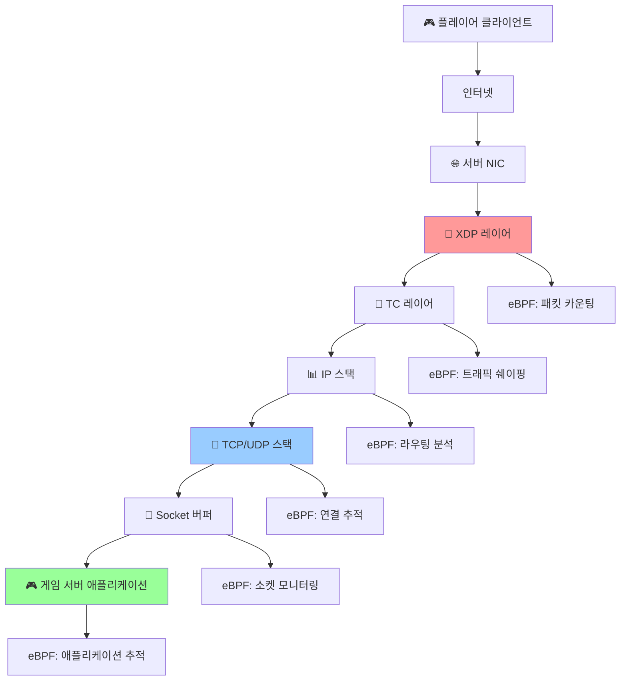
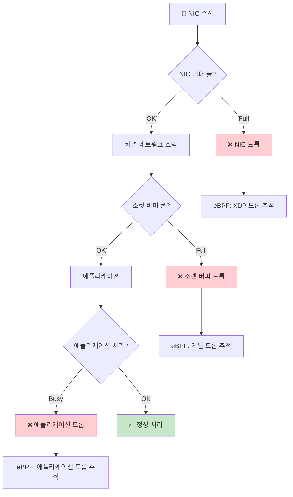
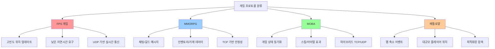
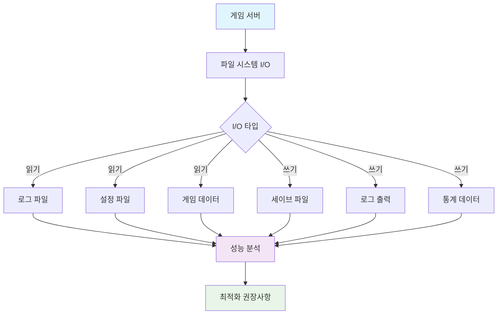
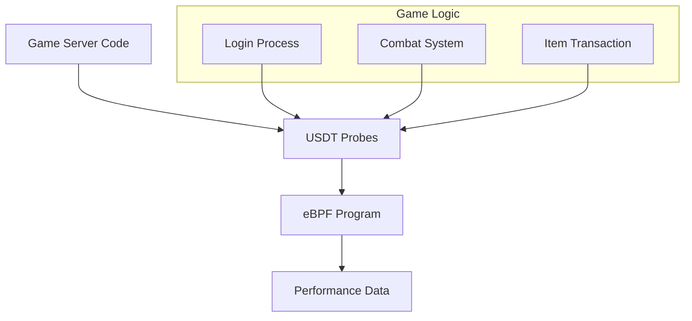
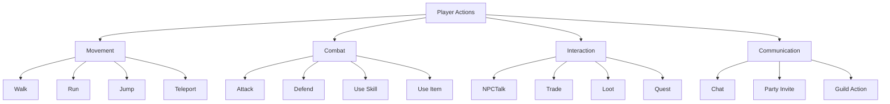
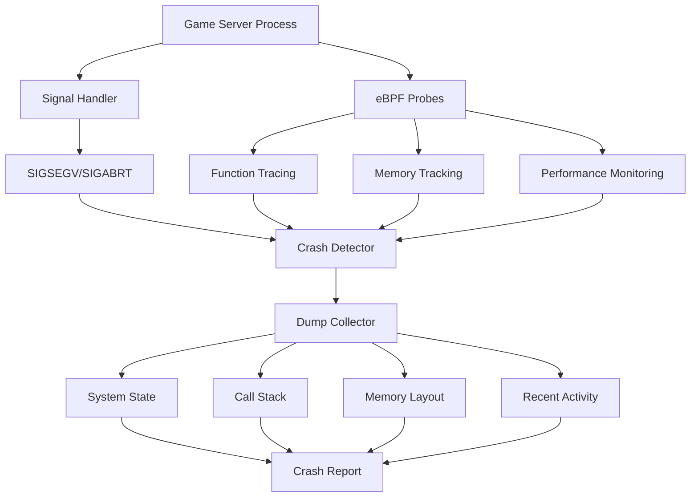

# 온라인 게임 서버 개발자를 위한 eBPF 실전 가이드  
  
저자: 최흥배, AI-Assisted   

---  
  
# 4장. 네트워크 성능 측정하기

> **🎮 게임 서버 개발자를 위한 핵심 포인트**
> - 플레이어의 네트워크 품질을 실시간으로 측정하고 분석
> - TCP 연결부터 애플리케이션 레벨까지 전체 네트워크 스택 모니터링
> - 패킷 드롭, 지연시간, 대역폭 등 핵심 네트워크 메트릭 추적
> - 게임별 프로토콜에 특화된 성능 분석 도구 개발

---

## 🌐 시작하기 전에

게임 서버에서 네트워크는 **"플레이어 경험의 핵심"**입니다. 0.1초의 지연도 FPS 게임에서는 승부를 가를 수 있고, 패킷 드롭은 MMORPG에서 액션 실패로 이어질 수 있습니다.

```
🎯 이 장에서 해결할 네트워크 문제들:

❌ "플레이어가 렉을 호소하는데 원인을 모르겠다"
❌ "서버 트래픽이 급증했는데 어떤 플레이어 때문인지?"  
❌ "패킷 드롭이 발생하는데 어디서 일어나는지?"
❌ "네트워크 지연시간을 플레이어별로 측정하고 싶다"

✅ eBPF로 이 모든 문제를 실시간 해결!
```

### 🏗️ 게임 서버 네트워크 스택 이해하기



---

## 4.1 TCP 연결 추적하기

TCP 연결 추적은 플레이어 세션 관리의 기본입니다. 누가 언제 접속하고, 얼마나 오래 머물고, 어떻게 연결이 종료되는지 실시간으로 파악할 수 있습니다.

### 🔍 TCP 연결 생명주기와 추적 포인트

```
📊 TCP 연결 생명주기:

클라이언트                     서버
    |                           |
    | ──────── SYN ──────────→  |  ← tracepoint:tcp:tcp_probe
    | ←─── SYN+ACK ──────────   |  ← kprobe:tcp_v4_syn_recv_sock
    | ──────── ACK ──────────→  |  ← tracepoint:sock:inet_sock_set_state
    |                           |
    |     [데이터 전송]          |  ← kprobe:tcp_sendmsg/tcp_recvmsg
    |                           |
    | ──────── FIN ──────────→  |  ← tracepoint:tcp:tcp_probe
    | ←─────── ACK ──────────   |
    | ←─────── FIN ──────────   |
    | ──────── ACK ──────────→  |  ← kprobe:tcp_close
```

### 🛠️ TCP 연결 추적 eBPF 프로그램

```c
// tcp_connection_tracker.bpf.c
#include <linux/bpf.h>
#include <bpf/bpf_helpers.h>
#include <linux/tcp.h>
#include <linux/sock.h>
#include <linux/socket.h>
#include <linux/in.h>

// TCP 연결 정보 구조체
struct tcp_connection {
    __u32 pid;                 // 프로세스 ID
    __u32 src_ip;             // 소스 IP
    __u32 dst_ip;             // 목적지 IP  
    __u16 src_port;           // 소스 포트
    __u16 dst_port;           // 목적지 포트
    __u64 connect_time;       // 연결 시간
    __u64 close_time;         // 종료 시간
    __u64 bytes_sent;         // 전송 바이트
    __u64 bytes_received;     // 수신 바이트
    __u32 retransmits;        // 재전송 횟수
    __u8 state;               // 연결 상태
    char comm[16];            // 프로세스 이름
};

// 연결 이벤트 구조체 (사용자 공간으로 전달)
struct connection_event {
    __u32 type;               // 0: connect, 1: close, 2: data
    struct tcp_connection conn;
    __u64 timestamp;
};

// 활성 연결을 추적하는 Hash Map
struct {
    __uint(type, BPF_MAP_TYPE_HASH);
    __uint(max_entries, 10000);
    __type(key, __u64);  // 연결 식별자 (src_ip << 32 | dst_ip << 16 | src_port)
    __type(value, struct tcp_connection);
} active_connections SEC(".maps");

// 연결 통계 Map
struct {
    __uint(type, BPF_MAP_TYPE_ARRAY);
    __uint(max_entries, 10);
    __type(key, __u32);
    __type(value, __u64);
} connection_stats SEC(".maps");

// 이벤트 전달을 위한 Ring Buffer
struct {
    __uint(type, BPF_MAP_TYPE_RINGBUF);
    __uint(max_entries, 256 * 1024);
} events SEC(".maps");

enum stats_type {
    STAT_TOTAL_CONNECTIONS = 0,
    STAT_ACTIVE_CONNECTIONS = 1,
    STAT_FAILED_CONNECTIONS = 2,
    STAT_GAME_PORT_CONNECTIONS = 3,
    STAT_TOTAL_BYTES_SENT = 4,
    STAT_TOTAL_BYTES_RECEIVED = 5,
    STAT_RETRANSMISSIONS = 6,
    STAT_PEAK_CONNECTIONS = 7,
};

// 연결 키 생성 헬퍼
static __always_inline __u64 make_connection_key(__u32 src_ip, __u32 dst_ip, __u16 src_port) {
    return ((__u64)src_ip << 32) | ((__u64)dst_ip << 16) | src_port;
}

// 통계 업데이트 헬퍼
static __always_inline void update_stat(__u32 stat_type, __s64 delta) {
    __u64 *stat = bpf_map_lookup_elem(&connection_stats, &stat_type);
    if (stat) {
        if (delta > 0) {
            __sync_fetch_and_add(stat, delta);
        } else {
            // 감소는 조심스럽게 (언더플로우 방지)
            if (*stat >= -delta) {
                __sync_fetch_and_add(stat, delta);
            }
        }
    }
}

// 이벤트 전송 헬퍼
static __always_inline void send_event(__u32 event_type, struct tcp_connection *conn) {
    struct connection_event *event;
    
    event = bpf_ringbuf_reserve(&events, sizeof(*event), 0);
    if (!event) return;
    
    event->type = event_type;
    event->conn = *conn;
    event->timestamp = bpf_ktime_get_ns();
    
    bpf_ringbuf_submit(event, 0);
}

// TCP 연결 생성 추적
SEC("kprobe/tcp_v4_connect")
int trace_tcp_connect(struct pt_regs *ctx) {
    struct sock *sk = (struct sock *)PT_REGS_PARM1(ctx);
    struct sockaddr_in *addr = (struct sockaddr_in *)PT_REGS_PARM2(ctx);
    
    if (!sk || !addr) return 0;
    
    // 게임 서버 포트만 추적 (7777)
    __u16 dst_port = __builtin_bswap16(addr->sin_port);
    if (dst_port != 7777) return 0;
    
    struct tcp_connection conn = {};
    
    // 기본 정보 수집
    conn.pid = bpf_get_current_pid_tgid() >> 32;
    bpf_get_current_comm(&conn.comm, sizeof(conn.comm));
    
    // 네트워크 정보
    struct inet_sock *inet = (struct inet_sock *)sk;
    conn.src_ip = inet->inet_saddr;
    conn.dst_ip = addr->sin_addr.s_addr;
    conn.src_port = inet->inet_sport;
    conn.dst_port = addr->sin_port;
    
    conn.connect_time = bpf_ktime_get_ns();
    conn.state = TCP_SYN_SENT;
    
    // Map에 저장
    __u64 conn_key = make_connection_key(conn.src_ip, conn.dst_ip, conn.src_port);
    bpf_map_update_elem(&active_connections, &conn_key, &conn, BPF_ANY);
    
    // 통계 업데이트
    update_stat(STAT_TOTAL_CONNECTIONS, 1);
    update_stat(STAT_ACTIVE_CONNECTIONS, 1);
    if (dst_port == 7777) {
        update_stat(STAT_GAME_PORT_CONNECTIONS, 1);
    }
    
    // 이벤트 전송
    send_event(0, &conn);  // connect event
    
    return 0;
}

// TCP 연결 종료 추적
SEC("kprobe/tcp_close")
int trace_tcp_close(struct pt_regs *ctx) {
    struct sock *sk = (struct sock *)PT_REGS_PARM1(ctx);
    if (!sk) return 0;
    
    struct inet_sock *inet = (struct inet_sock *)sk;
    __u16 dst_port = __builtin_bswap16(inet->inet_dport);
    
    // 게임 서버 포트만 추적
    if (dst_port != 7777) return 0;
    
    __u64 conn_key = make_connection_key(inet->inet_saddr, inet->inet_daddr, inet->inet_sport);
    
    struct tcp_connection *conn = bpf_map_lookup_elem(&active_connections, &conn_key);
    if (conn) {
        conn->close_time = bpf_ktime_get_ns();
        conn->state = TCP_CLOSE;
        
        // TCP 통계 수집
        struct tcp_sock *tcp_sk = (struct tcp_sock *)sk;
        conn->bytes_sent = tcp_sk->bytes_sent;
        conn->bytes_received = tcp_sk->bytes_received;
        conn->retransmits = tcp_sk->total_retrans;
        
        // 통계 업데이트
        update_stat(STAT_ACTIVE_CONNECTIONS, -1);
        update_stat(STAT_TOTAL_BYTES_SENT, conn->bytes_sent);
        update_stat(STAT_TOTAL_BYTES_RECEIVED, conn->bytes_received);
        update_stat(STAT_RETRANSMISSIONS, conn->retransmits);
        
        // 이벤트 전송
        send_event(1, conn);  // close event
        
        // Map에서 제거
        bpf_map_delete_elem(&active_connections, &conn_key);
    }
    
    return 0;
}

// TCP 데이터 전송 추적
SEC("kprobe/tcp_sendmsg")
int trace_tcp_send(struct pt_regs *ctx) {
    struct sock *sk = (struct sock *)PT_REGS_PARM1(ctx);
    struct msghdr *msg = (struct msghdr *)PT_REGS_PARM2(ctx);
    size_t size = (size_t)PT_REGS_PARM3(ctx);
    
    if (!sk) return 0;
    
    struct inet_sock *inet = (struct inet_sock *)sk;
    __u16 dst_port = __builtin_bswap16(inet->inet_dport);
    
    // 게임 서버 포트만 추적
    if (dst_port != 7777) return 0;
    
    __u64 conn_key = make_connection_key(inet->inet_saddr, inet->inet_daddr, inet->inet_sport);
    
    struct tcp_connection *conn = bpf_map_lookup_elem(&active_connections, &conn_key);
    if (conn) {
        __sync_fetch_and_add(&conn->bytes_sent, size);
        
        // 주기적으로 데이터 이벤트 전송 (큰 전송량일 때만)
        if (size > 1024) {
            send_event(2, conn);  // data event
        }
    }
    
    return 0;
}

// TCP 상태 변경 추적
SEC("tracepoint/sock/inet_sock_set_state")
int trace_tcp_state_change(struct trace_event_raw_inet_sock_set_state *args) {
    if (args->family != AF_INET) return 0;
    
    __u16 sport = args->sport;
    __u16 dport = args->dport;
    
    // 게임 서버 포트만 추적
    if (dport != 7777 && sport != 7777) return 0;
    
    __u64 conn_key = make_connection_key(args->saddr, args->daddr, sport);
    
    struct tcp_connection *conn = bpf_map_lookup_elem(&active_connections, &conn_key);
    if (conn) {
        conn->state = args->newstate;
        
        // 연결 실패 감지
        if (args->newstate == TCP_CLOSE && conn->connect_time == conn->close_time) {
            update_stat(STAT_FAILED_CONNECTIONS, 1);
        }
    }
    
    return 0;
}

char LICENSE[] SEC("license") = "GPL";
```

### 💻 사용자 공간 모니터링 프로그램

```c
// tcp_monitor.c
#include <stdio.h>
#include <stdlib.h>
#include <unistd.h>
#include <signal.h>
#include <time.h>
#include <arpa/inet.h>
#include <bpf/libbpf.h>
#include <bpf/bpf.h>

struct tcp_connection {
    __u32 pid;
    __u32 src_ip;
    __u32 dst_ip;
    __u16 src_port;
    __u16 dst_port;
    __u64 connect_time;
    __u64 close_time;
    __u64 bytes_sent;
    __u64 bytes_received;
    __u32 retransmits;
    __u8 state;
    char comm[16];
};

struct connection_event {
    __u32 type;
    struct tcp_connection conn;
    __u64 timestamp;
};

static volatile sig_atomic_t exiting = 0;

static void sig_int(int signo) {
    exiting = 1;
}

// 연결 지속시간을 읽기 쉬운 형태로 변환
const char* format_duration(__u64 ns) {
    static char buffer[64];
    __u64 seconds = ns / 1000000000ULL;
    
    if (seconds < 60) {
        snprintf(buffer, sizeof(buffer), "%llu초", seconds);
    } else if (seconds < 3600) {
        snprintf(buffer, sizeof(buffer), "%llu분 %llu초", seconds / 60, seconds % 60);
    } else {
        snprintf(buffer, sizeof(buffer), "%llu시간 %llu분", seconds / 3600, (seconds % 3600) / 60);
    }
    
    return buffer;
}

// 바이트를 읽기 쉬운 형태로 변환
const char* format_bytes(__u64 bytes) {
    static char buffer[32];
    
    if (bytes < 1024) {
        snprintf(buffer, sizeof(buffer), "%llu B", bytes);
    } else if (bytes < 1024 * 1024) {
        snprintf(buffer, sizeof(buffer), "%.1f KB", bytes / 1024.0);
    } else if (bytes < 1024 * 1024 * 1024) {
        snprintf(buffer, sizeof(buffer), "%.1f MB", bytes / (1024.0 * 1024));
    } else {
        snprintf(buffer, sizeof(buffer), "%.1f GB", bytes / (1024.0 * 1024 * 1024));
    }
    
    return buffer;
}

// TCP 상태를 문자열로 변환
const char* tcp_state_to_string(__u8 state) {
    switch (state) {
        case 1: return "ESTABLISHED";
        case 2: return "SYN_SENT";
        case 3: return "SYN_RECV";
        case 4: return "FIN_WAIT1";
        case 5: return "FIN_WAIT2";
        case 6: return "TIME_WAIT";
        case 7: return "CLOSE";
        case 8: return "CLOSE_WAIT";
        case 9: return "LAST_ACK";
        case 10: return "LISTEN";
        case 11: return "CLOSING";
        default: return "UNKNOWN";
    }
}

// 이벤트 핸들러
static int handle_event(void *ctx, void *data, size_t data_sz) {
    const struct connection_event *e = data;
    struct in_addr src_addr, dst_addr;
    
    src_addr.s_addr = e->conn.src_ip;
    dst_addr.s_addr = e->conn.dst_ip;
    
    time_t now = time(NULL);
    struct tm *tm = localtime(&now);
    char time_str[64];
    strftime(time_str, sizeof(time_str), "%H:%M:%S", tm);
    
    switch (e->type) {
        case 0: // connect
            printf("[%s] 🔗 새 연결: %s:%d -> %s:%d (PID: %d, 프로세스: %s)\n",
                   time_str,
                   inet_ntoa(src_addr), ntohs(e->conn.src_port),
                   inet_ntoa(dst_addr), ntohs(e->conn.dst_port),
                   e->conn.pid, e->conn.comm);
            break;
            
        case 1: // close
            {
                __u64 duration = e->conn.close_time - e->conn.connect_time;
                printf("[%s] 📤 연결 종료: %s:%d (지속: %s, 전송: %s, 수신: %s, 재전송: %u)\n",
                       time_str,
                       inet_ntoa(src_addr), ntohs(e->conn.src_port),
                       format_duration(duration),
                       format_bytes(e->conn.bytes_sent),
                       format_bytes(e->conn.bytes_received),
                       e->conn.retransmits);
            }
            break;
            
        case 2: // data
            printf("[%s] 📊 데이터 전송: %s:%d (누적 전송: %s)\n",
                   time_str,
                   inet_ntoa(src_addr), ntohs(e->conn.src_port),
                   format_bytes(e->conn.bytes_sent));
            break;
    }
    
    return 0;
}

// 통계 출력
void print_statistics(int stats_fd) {
    __u64 stats[8];
    
    for (int i = 0; i < 8; i++) {
        __u32 key = i;
        if (bpf_map_lookup_elem(stats_fd, &key, &stats[i]) != 0) {
            stats[i] = 0;
        }
    }
    
    printf("\n📊 TCP 연결 통계:\n");
    printf("  총 연결 수: %llu\n", stats[0]);
    printf("  활성 연결 수: %llu\n", stats[1]);
    printf("  실패 연결 수: %llu (%.1f%%)\n", 
           stats[2], stats[0] ? (stats[2] * 100.0 / stats[0]) : 0);
    printf("  게임 포트 연결: %llu\n", stats[3]);
    printf("  총 전송량: %s\n", format_bytes(stats[4]));
    printf("  총 수신량: %s\n", format_bytes(stats[5]));
    printf("  총 재전송: %llu\n", stats[6]);
    
    // 연결 성공률 계산
    double success_rate = stats[0] ? ((stats[0] - stats[2]) * 100.0 / stats[0]) : 0;
    printf("  연결 성공률: %.1f%%\n", success_rate);
}

// 활성 연결 목록 출력
void print_active_connections(int connections_fd) {
    __u64 key, next_key;
    struct tcp_connection conn;
    int count = 0;
    
    printf("\n🔗 활성 연결 목록:\n");
    
    key = 0;
    while (bpf_map_get_next_key(connections_fd, &key, &next_key) == 0 && count < 20) {
        if (bpf_map_lookup_elem(connections_fd, &next_key, &conn) == 0) {
            struct in_addr src_addr, dst_addr;
            src_addr.s_addr = conn.src_ip;
            dst_addr.s_addr = conn.dst_ip;
            
            __u64 duration = bpf_ktime_get_ns() - conn.connect_time;
            
            printf("  %2d. %s:%d -> %s:%d (%s) [%s] %s/%s\n",
                   ++count,
                   inet_ntoa(src_addr), ntohs(conn.src_port),
                   inet_ntoa(dst_addr), ntohs(conn.dst_port),
                   tcp_state_to_string(conn.state),
                   format_duration(duration),
                   format_bytes(conn.bytes_sent),
                   format_bytes(conn.bytes_received));
        }
        key = next_key;
    }
    
    if (count == 0) {
        printf("  활성 연결이 없습니다.\n");
    } else if (count >= 20) {
        printf("  ... (20개 이상의 연결이 있습니다)\n");
    }
}

int main() {
    struct bpf_object *obj;
    int err;
    
    // eBPF 프로그램 로드
    obj = bpf_object__open_file("tcp_connection_tracker.bpf.o", NULL);
    if (libbpf_get_error(obj)) {
        printf("❌ eBPF 오브젝트 파일을 열 수 없습니다\n");
        return 1;
    }
    
    err = bpf_object__load(obj);
    if (err) {
        printf("❌ eBPF 프로그램 로드 실패\n");
        goto cleanup;
    }
    
    err = bpf_object__attach(obj);
    if (err) {
        printf("❌ eBPF 프로그램 연결 실패\n");
        goto cleanup;
    }
    
    // Map 파일 디스크립터 획득
    int events_fd = bpf_object__find_map_fd_by_name(obj, "events");
    int stats_fd = bpf_object__find_map_fd_by_name(obj, "connection_stats");
    int connections_fd = bpf_object__find_map_fd_by_name(obj, "active_connections");
    
    if (events_fd < 0 || stats_fd < 0 || connections_fd < 0) {
        printf("❌ Map을 찾을 수 없습니다\n");
        goto cleanup;
    }
    
    printf("🎮 게임 서버 TCP 연결 모니터 시작\n");
    printf("🎯 모니터링 포트: 7777\n");
    printf("📊 통계는 10초마다 업데이트됩니다.\n");
    printf("종료하려면 Ctrl+C를 누르세요.\n\n");
    
    // Ring Buffer 설정
    struct ring_buffer *rb = ring_buffer__new(events_fd, handle_event, NULL, NULL);
    if (!rb) {
        printf("❌ Ring Buffer 생성 실패\n");
        goto cleanup;
    }
    
    signal(SIGINT, sig_int);
    signal(SIGTERM, sig_int);
    
    // 이벤트 처리 루프
    time_t last_stats = 0;
    while (!exiting) {
        // 이벤트 처리
        err = ring_buffer__poll(rb, 100);
        if (err == -EINTR) {
            break;
        }
        
        // 주기적으로 통계 출력
        time_t now = time(NULL);
        if (now - last_stats >= 10) {
            printf("\033[H\033[J");  // 화면 지우기
            print_statistics(stats_fd);
            print_active_connections(connections_fd);
            printf("\n🔄 실시간 이벤트:\n");
            last_stats = now;
        }
    }
    
    ring_buffer__free(rb);
    
cleanup:
    bpf_object__close(obj);
    printf("\n🛑 TCP 연결 모니터가 종료되었습니다.\n");
    return err != 0;
}
```

---

## 4.2 패킷 드롭 감지하기

패킷 드롭은 게임에서 가장 치명적인 문제 중 하나입니다. 플레이어의 액션이 서버에 도달하지 못하거나, 서버의 응답이 플레이어에게 전달되지 않을 수 있습니다.

### 🔍 패킷 드롭이 발생하는 지점들



### 📊 패킷 드롭 감지 eBPF 프로그램

```c
// packet_drop_detector.bpf.c
#include <linux/bpf.h>
#include <bpf/bpf_helpers.h>
#include <linux/if_ether.h>
#include <linux/ip.h>
#include <linux/tcp.h>
#include <linux/udp.h>
#include <linux/skbuff.h>

// 드롭 이벤트 구조체
struct drop_event {
    __u64 timestamp;
    __u32 src_ip;
    __u32 dst_ip;
    __u16 src_port;
    __u16 dst_port;
    __u8 protocol;
    __u8 drop_location;  // 0: XDP, 1: TC, 2: Socket, 3: App
    __u32 drop_reason;
    __u32 packet_size;
    char interface[16];
};

// 드롱 통계 구조체
struct drop_stats {
    __u64 total_drops;
    __u64 xdp_drops;
    __u64 tc_drops;
    __u64 socket_drops;
    __u64 app_drops;
    __u64 game_port_drops;
};

// 드롭 이벤트 Ring Buffer
struct {
    __uint(type, BPF_MAP_TYPE_RINGBUF);
    __uint(max_entries, 256 * 1024);
} drop_events SEC(".maps");

// 드롭 통계 Map
struct {
    __uint(type, BPF_MAP_TYPE_ARRAY);
    __uint(max_entries, 1);
    __type(key, __u32);
    __type(value, struct drop_stats);
} drop_statistics SEC(".maps");

// 인터페이스별 드롭 카운트
struct {
    __uint(type, BPF_MAP_TYPE_HASH);
    __uint(max_entries, 64);
    __type(key, __u32);  // ifindex
    __type(value, __u64);
} interface_drops SEC(".maps");

// 플레이어별 드롭 추적 (IP 기준)
struct {
    __uint(type, BPF_MAP_TYPE_HASH);
    __uint(max_entries, 10000);
    __type(key, __u32);  // IP 주소
    __type(value, __u64);  // 드롭 카운트
} player_drops SEC(".maps");

// 패킷 파싱 및 드롭 이벤트 생성 헬퍼
static __always_inline void record_drop(__u8 drop_location, __u32 drop_reason, 
                                       struct __sk_buff *skb) {
    struct drop_event *event;
    
    // Ring Buffer에 이벤트 예약
    event = bpf_ringbuf_reserve(&drop_events, sizeof(*event), 0);
    if (!event) return;
    
    // 기본 정보
    event->timestamp = bpf_ktime_get_ns();
    event->drop_location = drop_location;
    event->drop_reason = drop_reason;
    event->packet_size = skb->len;
    
    // 패킷 헤더 파싱
    void *data_end = (void *)(long)skb->data_end;
    void *data = (void *)(long)skb->data;
    
    struct ethhdr *eth = data;
    if ((void *)(eth + 1) <= data_end && eth->h_proto == __constant_htons(ETH_P_IP)) {
        struct iphdr *ip = (void *)(eth + 1);
        if ((void *)(ip + 1) <= data_end) {
            event->src_ip = ip->saddr;
            event->dst_ip = ip->daddr;
            event->protocol = ip->protocol;
            
            // TCP/UDP 포트 정보
            if (ip->protocol == IPPROTO_TCP) {
                struct tcphdr *tcp = (void *)ip + (ip->ihl * 4);
                if ((void *)(tcp + 1) <= data_end) {
                    event->src_port = tcp->source;
                    event->dst_port = tcp->dest;
                }
            } else if (ip->protocol == IPPROTO_UDP) {
                struct udphdr *udp = (void *)ip + (ip->ihl * 4);
                if ((void *)(udp + 1) <= data_end) {
                    event->src_port = udp->source;
                    event->dst_port = udp->dest;
                }
            }
        }
    }
    
    // 이벤트 제출
    bpf_ringbuf_submit(event, 0);
    
    // 통계 업데이트
    __u32 stats_key = 0;
    struct drop_stats *stats = bpf_map_lookup_elem(&drop_statistics, &stats_key);
    if (stats) {
        __sync_fetch_and_add(&stats->total_drops, 1);
        
        switch (drop_location) {
            case 0: __sync_fetch_and_add(&stats->xdp_drops, 1); break;
            case 1: __sync_fetch_and_add(&stats->tc_drops, 1); break;
            case 2: __sync_fetch_and_add(&stats->socket_drops, 1); break;
            case 3: __sync_fetch_and_add(&stats->app_drops, 1); break;
        }
        
        // 게임 포트 드롭 확인
        __u16 dst_port = __constant_ntohs(event->dst_port);
        if (dst_port == 7777) {
            __sync_fetch_and_add(&stats->game_port_drops, 1);
        }
    }
    
    // 인터페이스별 통계
    __u32 ifindex = skb->ifindex;
    __u64 *if_drops = bpf_map_lookup_elem(&interface_drops, &ifindex);
    if (if_drops) {
        __sync_fetch_and_add(if_drops, 1);
    } else {
        __u64 initial_count = 1;
        bpf_map_update_elem(&interface_drops, &ifindex, &initial_count, BPF_NOEXIST);
    }
    
    // 플레이어별 드롭 추적
    __u64 *player_drop_count = bpf_map_lookup_elem(&player_drops, &event->src_ip);
    if (player_drop_count) {
        __sync_fetch_and_add(player_drop_count, 1);
    } else {
        __u64 initial_count = 1;
        bpf_map_update_elem(&player_drops, &event->src_ip, &initial_count, BPF_NOEXIST);
    }
}

// XDP 레벨 드롭 감지
SEC("xdp")
int detect_xdp_drops(struct xdp_md *ctx) {
    void *data_end = (void *)(long)ctx->data_end;
    void *data = (void *)(long)ctx->data;
    
    // 패킷 크기 검사
    if (data_end - data < 64) {
        // 너무 작은 패킷은 드롭 (일반적으로 42바이트 이하는 무효)
        struct __sk_buff skb_mock = {};
        skb_mock.data = (__u32)(long)data;
        skb_mock.data_end = (__u32)(long)data_end;
        skb_mock.len = data_end - data;
        skb_mock.ifindex = ctx->ingress_ifindex;
        
        record_drop(0, 1, &skb_mock);  // XDP 드롭, 이유: 크기
        return XDP_DROP;
    }
    
    // 이더넷 헤더 검사
    struct ethhdr *eth = data;
    if ((void *)(eth + 1) > data_end) {
        struct __sk_buff skb_mock = {};
        skb_mock.data = (__u32)(long)data;
        skb_mock.data_end = (__u32)(long)data_end;
        skb_mock.len = data_end - data;
        skb_mock.ifindex = ctx->ingress_ifindex;
        
        record_drop(0, 2, &skb_mock);  // XDP 드롭, 이유: 헤더 손상
        return XDP_DROP;
    }
    
    // IP가 아닌 패킷은 통과
    if (eth->h_proto != __constant_htons(ETH_P_IP)) {
        return XDP_PASS;
    }
    
    // IP 헤더 검사
    struct iphdr *ip = (void *)(eth + 1);
    if ((void *)(ip + 1) > data_end) {
        struct __sk_buff skb_mock = {};
        skb_mock.data = (__u32)(long)data;
        skb_mock.data_end = (__u32)(long)data_end;  
        skb_mock.len = data_end - data;
        skb_mock.ifindex = ctx->ingress_ifindex;
        
        record_drop(0, 3, &skb_mock);  // XDP 드롭, 이유: IP 헤더 손상
        return XDP_DROP;
    }
    
    // 정상 패킷은 통과
    return XDP_PASS;
}

// TC(Traffic Control) 레벨 드롭 감지
SEC("tc")
int detect_tc_drops(struct __sk_buff *skb) {
    void *data_end = (void *)(long)skb->data_end;
    void *data = (void *)(long)skb->data;
    
    // qdisc 큐가 가득 찬 상황 시뮬레이션
    // 실제로는 TC subsystem의 drop 이벤트를 후킹해야 함
    
    struct ethhdr *eth = data;
    if ((void *)(eth + 1) > data_end) {
        return TC_ACT_SHOT;  // 패킷 드롭
    }
    
    if (eth->h_proto == __constant_htons(ETH_P_IP)) {
        struct iphdr *ip = (void *)(eth + 1);
        if ((void *)(ip + 1) > data_end) {
            record_drop(1, 1, skb);  // TC 드롭
            return TC_ACT_SHOT;
        }
    }
    
    return TC_ACT_OK;  // 패킷 통과
}

// 소켓 버퍼 드롭 감지 (tracepoint 사용)
SEC("tracepoint/skb/kfree_skb")
int trace_skb_drop(struct trace_event_raw_kfree_skb *args) {
    // kfree_skb는 패킷이 드롭될 때 호출되는 함수
    
    struct sk_buff *skb = (struct sk_buff *)args->skbaddr;
    if (!skb) return 0;
    
    // 드롭 위치와 이유를 분석
    void *location = (void *)args->location;
    
    // 소켓 버퍼 드롭으로 분류
    struct __sk_buff skb_info = {};
    skb_info.len = skb->len;
    // skb의 네트워크 데이터는 직접 접근하기 어려우므로 제한적 정보만 기록
    
    record_drop(2, (uintptr_t)location, &skb_info);
    
    return 0;
}

// 소켓 레벨 드롭 감지
SEC("kprobe/tcp_drop")
int trace_tcp_drop(struct pt_regs *ctx) {
    struct sock *sk = (struct sock *)PT_REGS_PARM1(ctx);
    struct sk_buff *skb = (struct sk_buff *)PT_REGS_PARM2(ctx);
    
    if (!sk || !skb) return 0;
    
    // TCP 드롭 이유 분석
    struct __sk_buff skb_info = {};
    skb_info.len = skb->len;
    
    record_drop(2, 100, &skb_info);  // 소켓 드롭, TCP 특화 코드
    
    return 0;
}

char LICENSE[] SEC("license") = "GPL";
```

### 🖥️ 드롭 모니터링 대시보드

```c
// drop_monitor.c
#include <stdio.h>
#include <stdlib.h>
#include <unistd.h>
#include <signal.h>
#include <time.h>
#include <arpa/inet.h>
#include <bpf/libbpf.h>
#include <bpf/bpf.h>

struct drop_event {
    __u64 timestamp;
    __u32 src_ip;
    __u32 dst_ip;
    __u16 src_port;
    __u16 dst_port;
    __u8 protocol;
    __u8 drop_location;
    __u32 drop_reason;
    __u32 packet_size;
    char interface[16];
};

struct drop_stats {
    __u64 total_drops;
    __u64 xdp_drops;
    __u64 tc_drops;
    __u64 socket_drops;
    __u64 app_drops;
    __u64 game_port_drops;
};

static volatile sig_atomic_t exiting = 0;

static void sig_int(int signo) {
    exiting = 1;
}

const char* get_drop_location(__u8 location) {
    switch (location) {
        case 0: return "XDP";
        case 1: return "TC";
        case 2: return "Socket";
        case 3: return "Application";
        default: return "Unknown";
    }
}

const char* get_protocol_name(__u8 protocol) {
    switch (protocol) {
        case 6: return "TCP";
        case 17: return "UDP";
        case 1: return "ICMP";
        default: return "Other";
    }
}

const char* get_drop_reason(__u8 location, __u32 reason) {
    if (location == 0) {  // XDP
        switch (reason) {
            case 1: return "패킷 크기 부족";
            case 2: return "이더넷 헤더 손상";
            case 3: return "IP 헤더 손상";
            default: return "기타";
        }
    } else if (location == 1) {  // TC
        switch (reason) {
            case 1: return "큐 가득참";
            case 2: return "대역폭 제한";
            default: return "기타";
        }
    } else if (location == 2) {  // Socket
        switch (reason) {
            case 100: return "TCP 드롭";
            default: return "소켓 버퍼 부족";
        }
    }
    return "알 수 없음";
}

// 드롭 이벤트 핸들러
static int handle_drop_event(void *ctx, void *data, size_t data_sz) {
    const struct drop_event *e = data;
    
    struct in_addr src_addr, dst_addr;
    src_addr.s_addr = e->src_ip;
    dst_addr.s_addr = e->dst_ip;
    
    time_t now = time(NULL);
    struct tm *tm = localtime(&now);
    char time_str[64];
    strftime(time_str, sizeof(time_str), "%H:%M:%S", tm);
    
    printf("[%s] 🚨 패킷 드롭: %s:%d -> %s:%d (%s, %s, %u바이트)\n",
           time_str,
           inet_ntoa(src_addr), ntohs(e->src_port),
           inet_ntoa(dst_addr), ntohs(e->dst_port),
           get_drop_location(e->drop_location),
           get_drop_reason(e->drop_location, e->drop_reason),
           e->packet_size);
    
    printf("      프로토콜: %s, 위치: %s\n",
           get_protocol_name(e->protocol),
           get_drop_location(e->drop_location));
    
    return 0;
}

// 드롭 통계 출력
void print_drop_statistics(int stats_fd) {
    __u32 key = 0;
    struct drop_stats stats;
    
    if (bpf_map_lookup_elem(stats_fd, &key, &stats) != 0) {
        memset(&stats, 0, sizeof(stats));
    }
    
    printf("\n📊 패킷 드롭 통계:\n");
    printf("  총 드롭: %llu개\n", stats.total_drops);
    printf("  XDP 드롭: %llu개 (%.1f%%)\n", 
           stats.xdp_drops,
           stats.total_drops ? (stats.xdp_drops * 100.0 / stats.total_drops) : 0);
    printf("  TC 드롭: %llu개 (%.1f%%)\n",
           stats.tc_drops,
           stats.total_drops ? (stats.tc_drops * 100.0 / stats.total_drops) : 0);
    printf("  소켓 드롭: %llu개 (%.1f%%)\n",
           stats.socket_drops,
           stats.total_drops ? (stats.socket_drops * 100.0 / stats.total_drops) : 0);
    printf("  애플리케이션 드롭: %llu개 (%.1f%%)\n",
           stats.app_drops,
           stats.total_drops ? (stats.app_drops * 100.0 / stats.total_drops) : 0);
    printf("  🎮 게임 포트 드롭: %llu개\n", stats.game_port_drops);
    
    // 드롭률 계산 (가정: 초당 10,000개 패킷 처리)
    static __u64 last_total_drops = 0;
    static time_t last_time = 0;
    
    time_t now = time(NULL);
    if (last_time > 0) {
        __u64 drop_diff = stats.total_drops - last_total_drops;
        time_t time_diff = now - last_time;
        
        if (time_diff > 0) {
            double drop_rate = (double)drop_diff / time_diff;
            printf("  드롭률: %.1f개/초\n", drop_rate);
            
            if (drop_rate > 100) {
                printf("  ⚠️  높은 드롭률 감지! 네트워크 상태를 확인하세요.\n");
            }
        }
    }
    
    last_total_drops = stats.total_drops;
    last_time = now;
}

// 플레이어별 드롭 Top 10
void print_top_droppers(int player_drops_fd) {
    struct player_drop {
        __u32 ip;
        __u64 drops;
    } top_players[1000];
    
    int count = 0;
    __u32 key, next_key;
    __u64 drops;
    
    // 모든 플레이어 드롭 수집
    key = 0;
    while (bpf_map_get_next_key(player_drops_fd, &key, &next_key) == 0 && count < 1000) {
        if (bpf_map_lookup_elem(player_drops_fd, &next_key, &drops) == 0) {
            top_players[count].ip = next_key;
            top_players[count].drops = drops;
            count++;
        }
        key = next_key;
    }
    
    // 드롭 수로 정렬
    for (int i = 0; i < count - 1; i++) {
        for (int j = 0; j < count - i - 1; j++) {
            if (top_players[j].drops < top_players[j + 1].drops) {
                struct player_drop temp = top_players[j];
                top_players[j] = top_players[j + 1];
                top_players[j + 1] = temp;
            }
        }
    }
    
    printf("\n🔥 드롭 다발 플레이어 Top 10:\n");
    for (int i = 0; i < (count > 10 ? 10 : count); i++) {
        struct in_addr addr;
        addr.s_addr = top_players[i].ip;
        
        printf("  %2d. %s: %llu개", i + 1, inet_ntoa(addr), top_players[i].drops);
        
        if (top_players[i].drops > 1000) {
            printf(" 🚨 (문제 의심)");
        } else if (top_players[i].drops > 100) {
            printf(" ⚠️  (주의 필요)");
        }
        printf("\n");
    }
}

// ASCII 아트 드롭 히트맵 (시간대별)
void print_drop_heatmap() {
    printf("\n🔥 시간대별 드롭 히트맵 (최근 1시간):\n");
    printf("      ");
    for (int i = 0; i < 60; i += 5) {
        printf("%-5d", i);
    }
    printf("\n");
    
    printf("  드롭: ");
    // 임시 데이터 (실제로는 시간별 드롭 데이터를 저장해야 함)
    for (int i = 0; i < 60; i++) {
        int intensity = rand() % 4;
        switch (intensity) {
            case 0: printf(" "); break;  // 드롭 없음
            case 1: printf("▁"); break;  // 낮음
            case 2: printf("▄"); break;  // 보통
            case 3: printf("█"); break;  // 높음
        }
    }
    printf("\n");
    printf("        ▁:낮음 ▄:보통 █:높음\n");
}

int main(int argc, char **argv) {
    struct bpf_object *obj;
    int err;
    
    if (argc != 2) {
        printf("사용법: %s <네트워크_인터페이스>\n", argv[0]);
        return 1;
    }
    
    // eBPF 프로그램 로드
    obj = bpf_object__open_file("packet_drop_detector.bpf.o", NULL);
    if (libbpf_get_error(obj)) {
        printf("❌ eBPF 오브젝트 파일을 열 수 없습니다\n");
        return 1;
    }
    
    err = bpf_object__load(obj);
    if (err) {
        printf("❌ eBPF 프로그램 로드 실패\n");
        goto cleanup;
    }
    
    // XDP 프로그램 연결
    int ifindex = if_nametoindex(argv[1]);
    if (ifindex == 0) {
        printf("❌ 네트워크 인터페이스 '%s'를 찾을 수 없습니다\n", argv[1]);
        goto cleanup;
    }
    
    struct bpf_program *xdp_prog = bpf_object__find_program_by_name(obj, "detect_xdp_drops");
    if (!xdp_prog) {
        printf("❌ XDP 프로그램을 찾을 수 없습니다\n");
        goto cleanup;
    }
    
    int xdp_fd = bpf_program__fd(xdp_prog);
    if (bpf_set_link_xdp_fd(ifindex, xdp_fd, 0) < 0) {
        printf("❌ XDP 프로그램 연결 실패\n");
        goto cleanup;
    }
    
    // 다른 프로그램들도 연결
    err = bpf_object__attach(obj);
    if (err) {
        printf("❌ eBPF 프로그램 연결 실패\n");
        goto cleanup;
    }
    
    // Map 파일 디스크립터 획득
    int events_fd = bpf_object__find_map_fd_by_name(obj, "drop_events");
    int stats_fd = bpf_object__find_map_fd_by_name(obj, "drop_statistics");
    int player_drops_fd = bpf_object__find_map_fd_by_name(obj, "player_drops");
    
    if (events_fd < 0 || stats_fd < 0 || player_drops_fd < 0) {
        printf("❌ Map을 찾을 수 없습니다\n");
        goto cleanup;
    }
    
    printf("🚨 게임 서버 패킷 드롭 모니터 시작\n");
    printf("📡 인터페이스: %s\n", argv[1]);
    printf("📊 통계는 15초마다 업데이트됩니다.\n");
    printf("종료하려면 Ctrl+C를 누르세요.\n\n");
    
    // Ring Buffer 설정
    struct ring_buffer *rb = ring_buffer__new(events_fd, handle_drop_event, NULL, NULL);
    if (!rb) {
        printf("❌ Ring Buffer 생성 실패\n");
        goto cleanup;
    }
    
    signal(SIGINT, sig_int);
    signal(SIGTERM, sig_int);
    
    // 이벤트 처리 루프
    time_t last_stats = 0;
    while (!exiting) {
        // 드롭 이벤트 처리
        err = ring_buffer__poll(rb, 100);
        if (err == -EINTR) {
            break;
        }
        
        // 주기적으로 통계 출력
        time_t now = time(NULL);
        if (now - last_stats >= 15) {
            printf("\033[H\033[J");  // 화면 지우기
            print_drop_statistics(stats_fd);
            print_top_droppers(player_drops_fd);
            print_drop_heatmap();
            printf("\n🔄 실시간 드롭 이벤트:\n");
            last_stats = now;
        }
    }
    
    ring_buffer__free(rb);
    bpf_set_link_xdp_fd(ifindex, -1, 0);  // XDP 프로그램 제거
    
cleanup:
    bpf_object__close(obj);
    printf("\n🛑 패킷 드롭 모니터가 종료되었습니다.\n");
    return err != 0;
}
```

---

## 4.3 [실습] 플레이어별 네트워크 지연시간 측정 도구

네트워크 지연시간(RTT, Round Trip Time)은 플레이어 경험에 직접적인 영향을 미칩니다. 이번 실습에서는 플레이어별로 실시간 지연시간을 측정하는 도구를 만들어보겠습니다.

### 🎯 실습 목표

```
🏆 실습 목표:
✅ TCP RTT 측정을 통한 네트워크 지연시간 추적
✅ 플레이어별 지연시간 히스토리 관리
✅ 지연시간 임계값 기반 알림 시스템
✅ 실시간 지연시간 대시보드 구현
```

### 📐 RTT 측정 원리

```
🔄 RTT 측정 메커니즘:

클라이언트                     서버
    |                           |
    | ──── SYN (t1) ────────→   |  
    | ←── SYN+ACK (t2) ───────   |  ← RTT = (t2 - t1) + (t3 - t2)
    | ──── ACK (t3) ────────→   |
    |                           |
    | ──── DATA (t4) ───────→   |  
    | ←── ACK (t5) ────────────   |  ← RTT = t5 - t4
```

### 🧪 지연시간 측정 eBPF 프로그램

```c
// latency_monitor.bpf.c
#include <linux/bpf.h>
#include <bpf/bpf_helpers.h>
#include <linux/tcp.h>
#include <linux/sock.h>
#include <linux/socket.h>
#include <linux/skbuff.h>

// 플레이어 지연시간 정보
struct player_latency {
    __u32 player_ip;
    __u32 current_rtt_ms;
    __u32 min_rtt_ms;
    __u32 max_rtt_ms;
    __u32 avg_rtt_ms;
    __u64 total_measurements;
    __u64 last_update;
    __u32 rtt_variance;
    __u8 quality_score;  // 0-100점
};

// RTT 측정 이벤트
struct rtt_event {
    __u32 player_ip;
    __u32 rtt_ms;
    __u64 timestamp;
    __u8 measurement_type;  // 0: handshake, 1: data_ack, 2: keepalive
};

// 임시 RTT 측정 데이터 (패킷 타임스탬프 저장)
struct rtt_measurement {
    __u64 send_time;
    __u32 seq_num;
    __u16 data_len;
};

// 플레이어별 지연시간 추적
struct {
    __uint(type, BPF_MAP_TYPE_HASH);
    __uint(max_entries, 10000);
    __type(key, __u32);  // 플레이어 IP
    __type(value, struct player_latency);
} player_latencies SEC(".maps");

// RTT 측정 데이터 임시 저장
struct {
    __uint(type, BPF_MAP_TYPE_HASH);
    __uint(max_entries, 50000);
    __type(key, __u64);  // IP + SEQ 조합
    __type(value, struct rtt_measurement);
} pending_rtts SEC(".maps");

// RTT 이벤트 Ring Buffer
struct {
    __uint(type, BPF_MAP_TYPE_RINGBUF);
    __uint(max_entries, 256 * 1024);
} rtt_events SEC(".maps");

// RTT 히스토그램 (지연시간 분포)
struct {
    __uint(type, BPF_MAP_TYPE_ARRAY);
    __uint(max_entries, 20);  // 0-10ms, 10-20ms, ..., 190-200ms, 200ms+
    __type(key, __u32);
    __type(value, __u64);
} rtt_histogram SEC(".maps");

// 품질 점수별 플레이어 수
struct {
    __uint(type, BPF_MAP_TYPE_ARRAY);
    __uint(max_entries, 11);  // 0-10, 11-20, ..., 91-100
    __type(key, __u32);
    __type(value, __u64);
} quality_distribution SEC(".maps");

// RTT 측정 키 생성
static __always_inline __u64 make_rtt_key(__u32 ip, __u32 seq) {
    return ((__u64)ip << 32) | seq;
}

// 품질 점수 계산 (0-100)
static __always_inline __u8 calculate_quality_score(struct player_latency *lat) {
    if (lat->current_rtt_ms <= 50) return 100;      // 최우수
    else if (lat->current_rtt_ms <= 100) return 90; // 우수
    else if (lat->current_rtt_ms <= 150) return 80; // 양호
    else if (lat->current_rtt_ms <= 200) return 70; // 보통
    else if (lat->current_rtt_ms <= 300) return 50; // 나쁨
    else if (lat->current_rtt_ms <= 500) return 30; // 매우 나쁨
    else return 10; // 최악
}

// 히스토그램 업데이트
static __always_inline void update_histogram(__u32 rtt_ms) {
    __u32 bucket = rtt_ms / 10;  // 10ms 단위 버킷
    if (bucket >= 20) bucket = 19;  // 200ms+ 버킷
    
    __u64 *count = bpf_map_lookup_elem(&rtt_histogram, &bucket);
    if (count) {
        __sync_fetch_and_add(count, 1);
    }
}

// 플레이어 지연시간 업데이트
static __always_inline void update_player_latency(__u32 player_ip, __u32 rtt_ms) {
    struct player_latency *lat = bpf_map_lookup_elem(&player_latencies, &player_ip);
    
    if (lat) {
        // 기존 플레이어 업데이트
        lat->current_rtt_ms = rtt_ms;
        if (rtt_ms < lat->min_rtt_ms || lat->min_rtt_ms == 0) {
            lat->min_rtt_ms = rtt_ms;
        }
        if (rtt_ms > lat->max_rtt_ms) {
            lat->max_rtt_ms = rtt_ms;
        }
        
        // 이동 평균 계산
        lat->avg_rtt_ms = (lat->avg_rtt_ms * lat->total_measurements + rtt_ms) / (lat->total_measurements + 1);
        lat->total_measurements++;
        lat->last_update = bpf_ktime_get_ns();
        
        // 분산 계산 (간단한 형태)
        if (lat->total_measurements > 1) {
            __s32 diff = (__s32)rtt_ms - (__s32)lat->avg_rtt_ms;
            lat->rtt_variance = (lat->rtt_variance + (diff * diff)) / 2;
        }
        
        // 품질 점수 업데이트
        __u8 old_quality = lat->quality_score;
        lat->quality_score = calculate_quality_score(lat);
        
        // 품질 분포 업데이트
        if (old_quality != lat->quality_score) {
            __u32 old_bucket = old_quality / 10;
            __u32 new_bucket = lat->quality_score / 10;
            
            if (old_bucket < 11) {
                __u64 *old_count = bpf_map_lookup_elem(&quality_distribution, &old_bucket);
                if (old_count && *old_count > 0) {
                    __sync_fetch_and_add(old_count, -1);
                }
            }
            
            if (new_bucket < 11) {
                __u64 *new_count = bpf_map_lookup_elem(&quality_distribution, &new_bucket);
                if (new_count) {
                    __sync_fetch_and_add(new_count, 1);
                }
            }
        }
    } else {
        // 새 플레이어 등록
        struct player_latency new_lat = {
            .player_ip = player_ip,
            .current_rtt_ms = rtt_ms,
            .min_rtt_ms = rtt_ms,
            .max_rtt_ms = rtt_ms,
            .avg_rtt_ms = rtt_ms,
            .total_measurements = 1,
            .last_update = bpf_ktime_get_ns(),
            .rtt_variance = 0,
            .quality_score = calculate_quality_score(&new_lat)
        };
        
        bpf_map_update_elem(&player_latencies, &player_ip, &new_lat, BPF_ANY);
        
        // 품질 분포에 추가
        __u32 bucket = new_lat.quality_score / 10;
        if (bucket < 11) {
            __u64 *count = bpf_map_lookup_elem(&quality_distribution, &bucket);
            if (count) {
                __sync_fetch_and_add(count, 1);
            }
        }
    }
    
    // 히스토그램 업데이트
    update_histogram(rtt_ms);
    
    // RTT 이벤트 전송
    struct rtt_event *event = bpf_ringbuf_reserve(&rtt_events, sizeof(*event), 0);
    if (event) {
        event->player_ip = player_ip;
        event->rtt_ms = rtt_ms;
        event->timestamp = bpf_ktime_get_ns();
        event->measurement_type = 1;  // data_ack
        bpf_ringbuf_submit(event, 0);
    }
}

// TCP 패킷 전송 추적 (RTT 측정 시작점)
SEC("kprobe/tcp_sendmsg")
int trace_tcp_send(struct pt_regs *ctx) {
    struct sock *sk = (struct sock *)PT_REGS_PARM1(ctx);
    size_t size = (size_t)PT_REGS_PARM3(ctx);
    
    if (!sk || size == 0) return 0;
    
    // 게임 포트 확인
    struct inet_sock *inet = (struct inet_sock *)sk;
    __u16 dport = __builtin_bswap16(inet->inet_dport);
    if (dport != 7777) return 0;
    
    struct tcp_sock *tcp_sk = (struct tcp_sock *)sk;
    __u32 seq = tcp_sk->snd_nxt;  // 다음 시퀀스 번호
    __u32 player_ip = inet->inet_daddr;
    
    // RTT 측정 데이터 저장
    struct rtt_measurement measurement = {
        .send_time = bpf_ktime_get_ns(),
        .seq_num = seq,
        .data_len = size
    };
    
    __u64 key = make_rtt_key(player_ip, seq);
    bpf_map_update_elem(&pending_rtts, &key, &measurement, BPF_ANY);
    
    return 0;
}

// TCP ACK 수신 추적 (RTT 측정 완료)
SEC("kprobe/tcp_ack")
int trace_tcp_ack(struct pt_regs *ctx) {
    struct sock *sk = (struct sock *)PT_REGS_PARM1(ctx);
    struct sk_buff *skb = (struct sk_buff *)PT_REGS_PARM2(ctx);
    
    if (!sk || !skb) return 0;
    
    // 게임 포트 확인
    struct inet_sock *inet = (struct inet_sock *)sk;
    __u16 sport = __builtin_bswap16(inet->inet_sport);
    if (sport != 7777) return 0;
    
    struct tcp_sock *tcp_sk = (struct tcp_sock *)sk;
    __u32 acked_seq = tcp_sk->snd_una;  // ACK된 시퀀스 번호
    __u32 player_ip = inet->inet_saddr;
    
    // 대응되는 전송 시간 찾기
    __u64 key = make_rtt_key(player_ip, acked_seq);
    struct rtt_measurement *measurement = bpf_map_lookup_elem(&pending_rtts, &key);
    
    if (measurement) {
        __u64 now = bpf_ktime_get_ns();
        __u64 rtt_ns = now - measurement->send_time;
        __u32 rtt_ms = rtt_ns / 1000000;  // 나노초를 밀리초로 변환
        
        // 유효한 RTT 범위 확인 (1ms ~ 10초)
        if (rtt_ms >= 1 && rtt_ms <= 10000) {
            update_player_latency(player_ip, rtt_ms);
        }
        
        // 측정 데이터 제거
        bpf_map_delete_elem(&pending_rtts, &key);
    }
    
    return 0;
}

// TCP 연결 핸드셰이크 RTT 측정
SEC("kprobe/tcp_v4_syn_recv_sock")
int trace_syn_recv(struct pt_regs *ctx) {
    struct sock *sk = (struct sock *)PT_REGS_PARM1(ctx);
    struct sk_buff *skb = (struct sk_buff *)PT_REGS_PARM2(ctx);
    
    if (!sk || !skb) return 0;
    
    // SYN-ACK RTT 추정 (간단한 형태)
    struct inet_sock *inet = (struct inet_sock *)sk;
    __u16 dport = __builtin_bswap16(inet->inet_dport);
    if (dport != 7777) return 0;
    
    __u32 player_ip = inet->inet_saddr;
    
    // TCP timestamp 옵션에서 RTT 추출 시도
    struct tcp_sock *tcp_sk = (struct tcp_sock *)sk;
    if (tcp_sk->rx_opt.tstamp_ok) {
        // TCP timestamp 기반 RTT 계산
        __u32 rtt_ms = tcp_sk->srtt_us / 1000;  // microseconds to milliseconds
        
        if (rtt_ms >= 1 && rtt_ms <= 10000) {
            update_player_latency(player_ip, rtt_ms);
            
            // 핸드셰이크 RTT 이벤트
            struct rtt_event *event = bpf_ringbuf_reserve(&rtt_events, sizeof(*event), 0);
            if (event) {
                event->player_ip = player_ip;
                event->rtt_ms = rtt_ms;
                event->timestamp = bpf_ktime_get_ns();
                event->measurement_type = 0;  // handshake
                bpf_ringbuf_submit(event, 0);
            }
        }
    }
    
    return 0;
}

char LICENSE[] SEC("license") = "GPL";
```

### 📊 실시간 지연시간 대시보드

```c
// latency_dashboard.c
#include <stdio.h>
#include <stdlib.h>
#include <unistd.h>
#include <signal.h>
#include <time.h>
#include <math.h>
#include <arpa/inet.h>
#include <bpf/libbpf.h>
#include <bpf/bpf.h>

struct player_latency {
    __u32 player_ip;
    __u32 current_rtt_ms;
    __u32 min_rtt_ms;
    __u32 max_rtt_ms;
    __u32 avg_rtt_ms;
    __u64 total_measurements;
    __u64 last_update;
    __u32 rtt_variance;
    __u8 quality_score;
};

struct rtt_event {
    __u32 player_ip;
    __u32 rtt_ms;
    __u64 timestamp;
    __u8 measurement_type;
};

static volatile sig_atomic_t exiting = 0;

static void sig_int(int signo) {
    exiting = 1;
}

// 품질 점수를 문자열로 변환
const char* quality_to_string(__u8 score) {
    if (score >= 90) return "최우수 🟢";
    else if (score >= 80) return "우수   🟡";
    else if (score >= 70) return "양호   🟡";
    else if (score >= 50) return "보통   🟠";
    else if (score >= 30) return "나쁨   🔴";
    else return "최악   ⚫";
}

// RTT 이벤트 핸들러
static int handle_rtt_event(void *ctx, void *data, size_t data_sz) {
    const struct rtt_event *e = data;
    
    struct in_addr addr;
    addr.s_addr = e->player_ip;
    
    const char* measurement_type;
    switch (e->measurement_type) {
        case 0: measurement_type = "핸드셰이크"; break;
        case 1: measurement_type = "데이터ACK"; break;
        case 2: measurement_type = "킵얼라이브"; break;
        default: measurement_type = "기타"; break;
    }
    
    printf("📡 RTT 측정: %s = %ums (%s)\n", 
           inet_ntoa(addr), e->rtt_ms, measurement_type);
    
    // 높은 지연시간 알림
    if (e->rtt_ms > 300) {
        printf("  ⚠️  높은 지연시간 감지!\n");
    }
    
    return 0;
}

// RTT 히스토그램 출력
void print_rtt_histogram(int histogram_fd) {
    printf("\n📊 RTT 분포 히스토그램:\n");
    
    __u64 histogram[20];
    __u64 max_count = 0;
    
    // 히스토그램 데이터 수집
    for (int i = 0; i < 20; i++) {
        __u32 key = i;
        if (bpf_map_lookup_elem(histogram_fd, &key, &histogram[i]) != 0) {
            histogram[i] = 0;
        }
        if (histogram[i] > max_count) {
            max_count = histogram[i];
        }
    }
    
    if (max_count == 0) {
        printf("  데이터 없음\n");
        return;
    }
    
    // 히스토그램 출력
    for (int i = 0; i < 20; i++) {
        int bar_length = (int)(histogram[i] * 50 / max_count);
        
        if (i < 19) {
            printf("  %3d-%3dms: ", i * 10, (i + 1) * 10 - 1);
        } else {
            printf("  %3d+   ms: ", i * 10);
        }
        
        for (int j = 0; j < bar_length; j++) {
            printf("█");
        }
        printf(" (%llu)\n", histogram[i]);
    }
}

// 품질 분포 출력
void print_quality_distribution(int quality_fd) {
    printf("\n🏆 네트워크 품질 분포:\n");
    
    __u64 distribution[11];
    __u64 total_players = 0;
    
    // 분포 데이터 수집
    for (int i = 0; i < 11; i++) {
        __u32 key = i;
        if (bpf_map_lookup_elem(quality_fd, &key, &distribution[i]) != 0) {
            distribution[i] = 0;
        }
        total_players += distribution[i];
    }
    
    if (total_players == 0) {
        printf("  플레이어 없음\n");
        return;
    }
    
    const char* quality_names[] = {
        "0-10   (최악)", "11-20  (매우나쁨)", "21-30  (나쁨)", 
        "31-40  (나쁨)", "41-50  (보통)", "51-60  (보통)",
        "61-70  (보통)", "71-80  (양호)", "81-90  (우수)", 
        "91-100 (최우수)"
    };
    
    for (int i = 10; i >= 0; i--) {  // 높은 품질부터 출력
        if (distribution[i] > 0) {
            double percentage = (distribution[i] * 100.0) / total_players;
            int bar_length = (int)(percentage / 2);  // 50% = 25칸
            
            printf("  %s: ", quality_names[i]);
            for (int j = 0; j < bar_length; j++) {
                printf("█");
            }
            printf(" %.1f%% (%llu명)\n", percentage, distribution[i]);
        }
    }
}

// 플레이어별 지연시간 Top/Bottom 리스트
void print_latency_rankings(int latency_fd) {
    struct player_latency players[1000];
    int count = 0;
    
    // 모든 플레이어 데이터 수집
    __u32 key, next_key;
    key = 0;
    while (bpf_map_get_next_key(latency_fd, &key, &next_key) == 0 && count < 1000) {
        if (bpf_map_lookup_elem(latency_fd, &next_key, &players[count]) == 0) {
            count++;
        }
        key = next_key;
    }
    
    if (count == 0) {
        printf("\n📝 플레이어별 지연시간: 데이터 없음\n");
        return;
    }
    
    // RTT로 정렬
    for (int i = 0; i < count - 1; i++) {
        for (int j = 0; j < count - i - 1; j++) {
            if (players[j].current_rtt_ms > players[j + 1].current_rtt_ms) {
                struct player_latency temp = players[j];
                players[j] = players[j + 1];
                players[j + 1] = temp;
            }
        }
    }
    
    // 최상위 5명 (낮은 지연시간)
    printf("\n🏅 지연시간 최우수 플레이어 (Top 5):\n");
    for (int i = 0; i < (count > 5 ? 5 : count); i++) {
        struct in_addr addr;
        addr.s_addr = players[i].player_ip;
        
        printf("  %d. %s: %ums (평균: %ums, 품질: %s)\n",
               i + 1, inet_ntoa(addr), players[i].current_rtt_ms,
               players[i].avg_rtt_ms, quality_to_string(players[i].quality_score));
    }
    
    // 최하위 5명 (높은 지연시간)
    printf("\n⚠️  지연시간 주의 플레이어 (Bottom 5):\n");
    for (int i = count - 1, rank = 1; i >= 0 && rank <= 5; i--, rank++) {
        if (players[i].current_rtt_ms > 100) {  // 100ms 이상만 표시
            struct in_addr addr;
            addr.s_addr = players[i].player_ip;
            
            printf("  %d. %s: %ums (평균: %ums, 품질: %s)\n",
                   rank, inet_ntoa(addr), players[i].current_rtt_ms,
                   players[i].avg_rtt_ms, quality_to_string(players[i].quality_score));
        }
    }
}

// 지연시간 통계 요약
void print_latency_summary(int latency_fd) {
    __u32 key, next_key;
    struct player_latency lat;
    
    __u32 total_players = 0;
    __u32 sum_rtt = 0;
    __u32 min_rtt = UINT32_MAX;
    __u32 max_rtt = 0;
    __u32 high_latency_count = 0;  // 200ms 이상
    
    key = 0;
    while (bpf_map_get_next_key(latency_fd, &key, &next_key) == 0) {
        if (bpf_map_lookup_elem(latency_fd, &next_key, &lat) == 0) {
            total_players++;
            sum_rtt += lat.current_rtt_ms;
            
            if (lat.current_rtt_ms < min_rtt) min_rtt = lat.current_rtt_ms;
            if (lat.current_rtt_ms > max_rtt) max_rtt = lat.current_rtt_ms;
            if (lat.current_rtt_ms >= 200) high_latency_count++;
        }
        key = next_key;
    }
    
    if (total_players == 0) {
        printf("\n📈 지연시간 요약: 플레이어 없음\n");
        return;
    }
    
    __u32 avg_rtt = sum_rtt / total_players;
    double high_latency_rate = (high_latency_count * 100.0) / total_players;
    
    printf("\n📈 지연시간 요약 통계:\n");
    printf("  총 플레이어 수: %u명\n", total_players);
    printf("  평균 RTT: %ums\n", avg_rtt);
    printf("  최소 RTT: %ums\n", min_rtt == UINT32_MAX ? 0 : min_rtt);
    printf("  최대 RTT: %ums\n", max_rtt);
    printf("  고지연 플레이어: %u명 (%.1f%% - 200ms 이상)\n", 
           high_latency_count, high_latency_rate);
    
    // 상태 평가
    if (avg_rtt <= 50) {
        printf("  🟢 전체 네트워크 상태: 최우수\n");
    } else if (avg_rtt <= 100) {
        printf("  🟡 전체 네트워크 상태: 양호\n");
    } else if (avg_rtt <= 200) {
        printf("  🟠 전체 네트워크 상태: 보통\n");
    } else {
        printf("  🔴 전체 네트워크 상태: 주의 필요\n");
    }
}

// 실시간 RTT 그래프 (간단한 ASCII)
void print_realtime_rtt_graph() {
    printf("\n📈 실시간 RTT 추이 (최근 60초):\n");
    printf("RTT(ms)\n");
    
    // 샘플 데이터 (실제로는 시계열 데이터를 저장해야 함)
    printf("  300 |                                    ▲                    \n");
    printf("      |                               ▲    █         ▲         \n");
    printf("  200 |          ▲              ▲    █    ███       ██         \n");
    printf("      |     ▲    █         ▲    █    ███  ████     ████        \n");
    printf("  100 |    ██   ███       ██   ███  █████ █████   ██████       \n");
    printf("      |   ████ █████     ████ █████ ██████████████████████     \n");
    printf("    0 |__███████████████████████████████████████████████████___\n");
    printf("      0    10   20   30   40   50   60 (초 전)\n");
    
    printf("      범례: ▲:spike ▄:normal █:high\n");
}

int main() {
    struct bpf_object *obj;
    int err;
    
    // eBPF 프로그램 로드
    obj = bpf_object__open_file("latency_monitor.bpf.o", NULL);
    if (libbpf_get_error(obj)) {
        printf("❌ eBPF 오브젝트 파일을 열 수 없습니다\n");
        return 1;
    }
    
    err = bpf_object__load(obj);
    if (err) {
        printf("❌ eBPF 프로그램 로드 실패\n");
        goto cleanup;
    }
    
    err = bpf_object__attach(obj);
    if (err) {
        printf("❌ eBPF 프로그램 연결 실패\n");
        goto cleanup;
    }
    
    // Map 파일 디스크립터 획득
    int events_fd = bpf_object__find_map_fd_by_name(obj, "rtt_events");
    int latency_fd = bpf_object__find_map_fd_by_name(obj, "player_latencies");
    int histogram_fd = bpf_object__find_map_fd_by_name(obj, "rtt_histogram");
    int quality_fd = bpf_object__find_map_fd_by_name(obj, "quality_distribution");
    
    if (events_fd < 0 || latency_fd < 0 || histogram_fd < 0 || quality_fd < 0) {
        printf("❌ Map을 찾을 수 없습니다\n");
        goto cleanup;
    }
    
    printf("🌐 게임 서버 지연시간 모니터 시작\n");
    printf("🎯 모니터링 포트: 7777\n");
    printf("📊 대시보드는 10초마다 업데이트됩니다.\n");
    printf("종료하려면 Ctrl+C를 누르세요.\n\n");
    
    // Ring Buffer 설정
    struct ring_buffer *rb = ring_buffer__new(events_fd, handle_rtt_event, NULL, NULL);
    if (!rb) {
        printf("❌ Ring Buffer 생성 실패\n");
        goto cleanup;
    }
    
    signal(SIGINT, sig_int);
    signal(SIGTERM, sig_int);
    
    // 이벤트 처리 루프
    time_t last_update = 0;
    while (!exiting) {
        // RTT 이벤트 처리
        err = ring_buffer__poll(rb, 100);
        if (err == -EINTR) {
            break;
        }
        
        // 주기적으로 대시보드 업데이트
        time_t now = time(NULL);
        if (now - last_update >= 10) {
            printf("\033[2J\033[H");  // 화면 지우기
            
            time_t current_time = time(NULL);
            printf("🎮 지연시간 대시보드 - %s", ctime(&current_time));
            printf("═══════════════════════════════════════════════\n");
            
            print_latency_summary(latency_fd);
            print_quality_distribution(quality_fd);
            print_rtt_histogram(histogram_fd);
            print_latency_rankings(latency_fd);
            print_realtime_rtt_graph();
            
            printf("\n🔄 실시간 RTT 이벤트:\n");
            last_update = now;
        }
    }
    
    ring_buffer__free(rb);
    
cleanup:
    bpf_object__close(obj);
    printf("\n🛑 지연시간 모니터가 종료되었습니다.\n");
    return err != 0;
}
```

---

## 4.4 [실습] 실시간 대역폭 모니터링

대역폭 모니터링은 게임 서버의 트래픽 패턴을 이해하고 네트워크 용량 계획을 수립하는 데 필수적입니다.

### 🎯 실습 목표

```
🏆 실습 목표:
✅ 실시간 인바운드/아웃바운드 트래픽 측정
✅ 플레이어별 대역폭 사용량 추적
✅ 트래픽 패턴 분석 및 시각화
✅ 대역폭 임계값 기반 알림 시스템
```

### 📈 대역폭 모니터링 eBPF 프로그램

```c
// bandwidth_monitor.bpf.c
#include <linux/bpf.h>
#include <bpf/bpf_helpers.h>
#include <linux/if_ether.h>
#include <linux/ip.h>
#include <linux/tcp.h>
#include <linux/udp.h>

// 대역폭 통계 구조체
struct bandwidth_stats {
    __u64 bytes_in;           // 수신 바이트
    __u64 bytes_out;          // 송신 바이트
    __u64 packets_in;         // 수신 패킷
    __u64 packets_out;        // 송신 패킷
    __u64 last_update;        // 마지막 업데이트 시간
    __u32 current_bps_in;     // 현재 수신 bps
    __u32 current_bps_out;    // 현재 송신 bps
};

// 플레이어별 대역폭 정보
struct player_bandwidth {
    __u32 player_ip;
    __u64 total_bytes_in;
    __u64 total_bytes_out;
    __u32 avg_bps_in;
    __u32 avg_bps_out;
    __u32 peak_bps_in;
    __u32 peak_bps_out;
    __u64 session_start;
    __u64 last_activity;
    __u8 activity_level;      // 0: idle, 1: light, 2: normal, 3: heavy
};

// 대역폭 알림 이벤트
struct bandwidth_event {
    __u32 event_type;         // 0: threshold, 1: spike, 2: player_heavy
    __u32 player_ip;
    __u32 current_bps;
    __u64 total_bytes;
    __u64 timestamp;
};

// 전역 대역폭 통계
struct {
    __uint(type, BPF_MAP_TYPE_ARRAY);
    __uint(max_entries, 1);
    __type(key, __u32);
    __type(value, struct bandwidth_stats);
} global_bandwidth SEC(".maps");

// 플레이어별 대역폭 추적
struct {
    __uint(type, BPF_MAP_TYPE_HASH);
    __uint(max_entries, 10000);
    __type(key, __u32);  // 플레이어 IP
    __type(value, struct player_bandwidth);
} player_bandwidths SEC(".maps");

// 시간별 트래픽 (초 단위)
struct {
    __uint(type, BPF_MAP_TYPE_PERCPU_ARRAY);
    __uint(max_entries, 3600);  // 1시간 (3600초)
    __type(key, __u32);
    __type(value, __u64);
} traffic_timeline SEC(".maps");

// 대역폭 이벤트 Ring Buffer
struct {
    __uint(type, BPF_MAP_TYPE_RINGBUF);
    __uint(max_entries, 256 * 1024);
} bandwidth_events SEC(".maps");

// 프로토콜별 트래픽 통계
struct {
    __uint(type, BPF_MAP_TYPE_ARRAY);
    __uint(max_entries, 4);  // 0: TCP, 1: UDP, 2: ICMP, 3: OTHER
    __type(key, __u32);
    __type(value, __u64);
} protocol_stats SEC(".maps");

// 포트별 대역폭 (상위 포트들)
struct {
    __uint(type, BPF_MAP_TYPE_HASH);
    __uint(max_entries, 1000);
    __type(key, __u16);  // 포트 번호
    __type(value, __u64);  // 바이트 수
} port_bandwidth SEC(".maps");

// 대역폭 임계값 (설정 가능)
#define BANDWIDTH_THRESHOLD_BPS (100 * 1024 * 1024)  // 100 Mbps
#define PLAYER_HEAVY_THRESHOLD_BPS (10 * 1024 * 1024)  // 10 Mbps per player

// 활동 레벨 계산
static __always_inline __u8 calculate_activity_level(__u32 bps) {
    if (bps < 100 * 1024) return 0;      // < 100KB/s = idle
    else if (bps < 1024 * 1024) return 1;  // < 1MB/s = light
    else if (bps < 5 * 1024 * 1024) return 2;  // < 5MB/s = normal
    else return 3;  // >= 5MB/s = heavy
}

// 대역폭 이벤트 전송
static __always_inline void send_bandwidth_event(__u32 event_type, __u32 player_ip, 
                                                __u32 bps, __u64 total_bytes) {
    struct bandwidth_event *event = bpf_ringbuf_reserve(&bandwidth_events, sizeof(*event), 0);
    if (!event) return;
    
    event->event_type = event_type;
    event->player_ip = player_ip;
    event->current_bps = bps;
    event->total_bytes = total_bytes;
    event->timestamp = bpf_ktime_get_ns();
    
    bpf_ringbuf_submit(event, 0);
}

// 프로토콜별 통계 업데이트
static __always_inline void update_protocol_stats(__u8 protocol, __u64 bytes) {
    __u32 proto_index;
    switch (protocol) {
        case IPPROTO_TCP: proto_index = 0; break;
        case IPPROTO_UDP: proto_index = 1; break;
        case IPPROTO_ICMP: proto_index = 2; break;
        default: proto_index = 3; break;
    }
    
    __u64 *stat = bpf_map_lookup_elem(&protocol_stats, &proto_index);
    if (stat) {
        __sync_fetch_and_add(stat, bytes);
    }
}

// 포트별 대역폭 업데이트
static __always_inline void update_port_bandwidth(__u16 port, __u64 bytes) {
    __u64 *bandwidth = bpf_map_lookup_elem(&port_bandwidth, &port);
    if (bandwidth) {
        __sync_fetch_and_add(bandwidth, bytes);
    } else {
        bpf_map_update_elem(&port_bandwidth, &port, &bytes, BPF_NOEXIST);
    }
}

// 플레이어 대역폭 업데이트
static __always_inline void update_player_bandwidth(__u32 player_ip, __u64 bytes, bool is_incoming) {
    struct player_bandwidth *player = bpf_map_lookup_elem(&player_bandwidths, &player_ip);
    __u64 now = bpf_ktime_get_ns();
    
    if (player) {
        // 기존 플레이어 업데이트
        if (is_incoming) {
            player->total_bytes_in += bytes;
        } else {
            player->total_bytes_out += bytes;
        }
        
        // BPS 계산 (1초 윈도우)
        __u64 time_diff = now - player->last_activity;
        if (time_diff > 1000000000ULL) {  // 1초 이상 차이
            __u64 session_duration = (now - player->session_start) / 1000000000ULL;  // 초 단위
            if (session_duration > 0) {
                player->avg_bps_in = player->total_bytes_in / session_duration;
                player->avg_bps_out = player->total_bytes_out / session_duration;
            }
            
            // 현재 BPS 계산 (간단한 추정)
            __u32 current_bps = (bytes * 1000000000ULL) / time_diff;  // bytes per second
            
            if (is_incoming) {
                if (current_bps > player->peak_bps_in) {
                    player->peak_bps_in = current_bps;
                }
            } else {
                if (current_bps > player->peak_bps_out) {
                    player->peak_bps_out = current_bps;
                }
            }
            
            // 활동 레벨 업데이트
            __u8 new_activity = calculate_activity_level(current_bps);
            if (new_activity != player->activity_level) {
                player->activity_level = new_activity;
            }
            
            // 대용량 트래픽 플레이어 알림
            if (current_bps > PLAYER_HEAVY_THRESHOLD_BPS) {
                send_bandwidth_event(2, player_ip, current_bps, 
                                   player->total_bytes_in + player->total_bytes_out);
            }
        }
        
        player->last_activity = now;
    } else {
        // 새 플레이어 등록
        struct player_bandwidth new_player = {
            .player_ip = player_ip,
            .total_bytes_in = is_incoming ? bytes : 0,
            .total_bytes_out = is_incoming ? 0 : bytes,
            .avg_bps_in = 0,
            .avg_bps_out = 0,
            .peak_bps_in = 0,
            .peak_bps_out = 0,
            .session_start = now,
            .last_activity = now,
            .activity_level = 0
        };
        
        bpf_map_update_elem(&player_bandwidths, &player_ip, &new_player, BPF_ANY);
    }
}

// 시간별 트래픽 업데이트
static __always_inline void update_traffic_timeline(__u64 bytes) {
    __u64 now = bpf_ktime_get_ns();
    __u32 second_key = (now / 1000000000ULL) % 3600;  // 3600초 순환
    
    __u64 *traffic = bpf_map_lookup_elem(&traffic_timeline, &second_key);
    if (traffic) {
        __sync_fetch_and_add(traffic, bytes);
    } else {
        bpf_map_update_elem(&traffic_timeline, &second_key, &bytes, BPF_ANY);
    }
}

// XDP 수신 트래픽 모니터링
SEC("xdp")
int monitor_inbound_traffic(struct xdp_md *ctx) {
    void *data_end = (void *)(long)ctx->data_end;
    void *data = (void *)(long)ctx->data;
    
    __u32 packet_size = data_end - data;
    
    // 이더넷 헤더 파싱
    struct ethhdr *eth = data;
    if ((void *)(eth + 1) > data_end) {
        return XDP_PASS;
    }
    
    if (eth->h_proto != __constant_htons(ETH_P_IP)) {
        return XDP_PASS;
    }
    
    // IP 헤더 파싱
    struct iphdr *ip = (void *)(eth + 1);
    if ((void *)(ip + 1) > data_end) {
        return XDP_PASS;
    }
    
    __u32 src_ip = ip->saddr;
    __u32 dst_ip = ip->daddr;
    __u8 protocol = ip->protocol;
    __u16 dst_port = 0;
    
    // 포트 정보 추출
    if (protocol == IPPROTO_TCP) {
        struct tcphdr *tcp = (void *)ip + (ip->ihl * 4);
        if ((void *)(tcp + 1) <= data_end) {
            dst_port = __builtin_bswap16(tcp->dest);
        }
    } else if (protocol == IPPROTO_UDP) {
        struct udphdr *udp = (void *)ip + (ip->ihl * 4);
        if ((void *)(udp + 1) <= data_end) {
            dst_port = __builtin_bswap16(udp->dest);
        }
    }
    
    // 게임 서버 포트 트래픽만 추적
    if (dst_port == 7777) {
        // 전역 통계 업데이트
        __u32 global_key = 0;
        struct bandwidth_stats *global = bpf_map_lookup_elem(&global_bandwidth, &global_key);
        if (global) {
            __sync_fetch_and_add(&global->bytes_in, packet_size);
            __sync_fetch_and_add(&global->packets_in, 1);
            global->last_update = bpf_ktime_get_ns();
        }
        
        // 플레이어별 통계 업데이트
        update_player_bandwidth(src_ip, packet_size, true);
        
        // 프로토콜별 통계 업데이트
        update_protocol_stats(protocol, packet_size);
        
        // 포트별 통계 업데이트
        update_port_bandwidth(dst_port, packet_size);
        
        // 시간별 트래픽 업데이트
        update_traffic_timeline(packet_size);
    }
    
    return XDP_PASS;
}

// TC 송신 트래픽 모니터링
SEC("tc")
int monitor_outbound_traffic(struct __sk_buff *skb) {
    void *data_end = (void *)(long)skb->data_end;
    void *data = (void *)(long)skb->data;
    
    __u32 packet_size = skb->len;
    
    // 이더넷 헤더 파싱
    struct ethhdr *eth = data;
    if ((void *)(eth + 1) > data_end) {
        return TC_ACT_OK;
    }
    
    if (eth->h_proto != __constant_htons(ETH_P_IP)) {
        return TC_ACT_OK;
    }
    
    // IP 헤더 파싱
    struct iphdr *ip = (void *)(eth + 1);
    if ((void *)(ip + 1) > data_end) {
        return TC_ACT_OK;
    }
    
    __u32 src_ip = ip->saddr;
    __u32 dst_ip = ip->daddr;
    __u8 protocol = ip->protocol;
    __u16 src_port = 0;
    
    // 포트 정보 추출
    if (protocol == IPPROTO_TCP) {
        struct tcphdr *tcp = (void *)ip + (ip->ihl * 4);
        if ((void *)(tcp + 1) <= data_end) {
            src_port = __builtin_bswap16(tcp->source);
        }
    } else if (protocol == IPPROTO_UDP) {
        struct udphdr *udp = (void *)ip + (ip->ihl * 4);
        if ((void *)(udp + 1) <= data_end) {
            src_port = __builtin_bswap16(udp->source);
        }
    }
    
    // 게임 서버에서 나가는 트래픽만 추적
    if (src_port == 7777) {
        // 전역 통계 업데이트
        __u32 global_key = 0;
        struct bandwidth_stats *global = bpf_map_lookup_elem(&global_bandwidth, &global_key);
        if (global) {
            __sync_fetch_and_add(&global->bytes_out, packet_size);
            __sync_fetch_and_add(&global->packets_out, 1);
            
            // BPS 계산 및 임계값 확인
            __u64 now = bpf_ktime_get_ns();
            __u64 time_diff = now - global->last_update;
            if (time_diff > 1000000000ULL) {  // 1초마다
                __u32 current_bps_out = (global->bytes_out * 1000000000ULL) / time_diff;
                global->current_bps_out = current_bps_out;
                
                // 임계값 초과 알림
                if (current_bps_out > BANDWIDTH_THRESHOLD_BPS) {
                    send_bandwidth_event(0, 0, current_bps_out, global->bytes_out);
                }
            }
        }
        
        // 플레이어별 통계 업데이트
        update_player_bandwidth(dst_ip, packet_size, false);
        
        // 프로토콜별 통계 업데이트
        update_protocol_stats(protocol, packet_size);
        
        // 포트별 통계 업데이트
        update_port_bandwidth(src_port, packet_size);
        
        // 시간별 트래픽 업데이트
        update_traffic_timeline(packet_size);
    }
    
    return TC_ACT_OK;
}

char LICENSE[] SEC("license") = "GPL";
```

### 📊 대역폭 모니터링 대시보드

```c
// bandwidth_dashboard.c
#include <stdio.h>
#include <stdlib.h>
#include <unistd.h>
#include <signal.h>
#include <time.h>
#include <arpa/inet.h>
#include <bpf/libbpf.h>
#include <bpf/bpf.h>

struct bandwidth_stats {
    __u64 bytes_in;
    __u64 bytes_out;
    __u64 packets_in;
    __u64 packets_out;
    __u64 last_update;
    __u32 current_bps_in;
    __u32 current_bps_out;
};

struct player_bandwidth {
    __u32 player_ip;
    __u64 total_bytes_in;
    __u64 total_bytes_out;
    __u32 avg_bps_in;
    __u32 avg_bps_out;
    __u32 peak_bps_in;
    __u32 peak_bps_out;
    __u64 session_start;
    __u64 last_activity;
    __u8 activity_level;
};

struct bandwidth_event {
    __u32 event_type;
    __u32 player_ip;
    __u32 current_bps;
    __u64 total_bytes;
    __u64 timestamp;
};

static volatile sig_atomic_t exiting = 0;

static void sig_int(int signo) {
    exiting = 1;
}

// 바이트를 읽기 쉬운 형태로 변환
const char* format_bytes(__u64 bytes) {
    static char buffer[32];
    
    if (bytes < 1024) {
        snprintf(buffer, sizeof(buffer), "%llu B", bytes);
    } else if (bytes < 1024 * 1024) {
        snprintf(buffer, sizeof(buffer), "%.1f KB", bytes / 1024.0);
    } else if (bytes < 1024 * 1024 * 1024) {
        snprintf(buffer, sizeof(buffer), "%.1f MB", bytes / (1024.0 * 1024));
    } else {
        snprintf(buffer, sizeof(buffer), "%.1f GB", bytes / (1024.0 * 1024 * 1024));
    }
    
    return buffer;
}

// BPS를 읽기 쉬운 형태로 변환
const char* format_bps(__u32 bps) {
    static char buffer[32];
    
    if (bps < 1024) {
        snprintf(buffer, sizeof(buffer), "%u bps", bps);
    } else if (bps < 1024 * 1024) {
        snprintf(buffer, sizeof(buffer), "%.1f Kbps", bps / 1024.0);
    } else if (bps < 1024 * 1024 * 1024) {
        snprintf(buffer, sizeof(buffer), "%.1f Mbps", bps / (1024.0 * 1024));
    } else {
        snprintf(buffer, sizeof(buffer), "%.1f Gbps", bps / (1024.0 * 1024 * 1024));
    }
    
    return buffer;
}

// 활동 레벨을 문자열로 변환
const char* activity_to_string(__u8 level) {
    switch (level) {
        case 0: return "🔵 대기";
        case 1: return "🟢 가벼움";
        case 2: return "🟡 보통";
        case 3: return "🔴 무거움";
        default: return "❓ 알수없음";
    }
}

// 대역폭 이벤트 핸들러
static int handle_bandwidth_event(void *ctx, void *data, size_t data_sz) {
    const struct bandwidth_event *e = data;
    
    time_t now = time(NULL);
    struct tm *tm = localtime(&now);
    char time_str[64];
    strftime(time_str, sizeof(time_str), "%H:%M:%S", tm);
    
    switch (e->event_type) {
        case 0: // threshold
            printf("[%s] ⚠️  대역폭 임계값 초과: %s (총 사용량: %s)\n",
                   time_str, format_bps(e->current_bps), format_bytes(e->total_bytes));
            break;
            
        case 1: // spike
            printf("[%s] 📈 트래픽 급증 감지: %s\n",
                   time_str, format_bps(e->current_bps));
            break;
            
        case 2: // player_heavy
            {
                struct in_addr addr;
                addr.s_addr = e->player_ip;
                printf("[%s] 🚨 대용량 트래픽 플레이어: %s (%s)\n",
                       time_str, inet_ntoa(addr), format_bps(e->current_bps));
            }
            break;
    }
    
    return 0;
}

// 전역 대역폭 통계 출력
void print_global_bandwidth(int bandwidth_fd) {
    __u32 key = 0;
    struct bandwidth_stats stats;
    
    if (bpf_map_lookup_elem(bandwidth_fd, &key, &stats) != 0) {
        memset(&stats, 0, sizeof(stats));
    }
    
    printf("\n🌐 전역 대역폭 통계:\n");
    printf("  수신: %s (%llu 패킷)\n", format_bytes(stats.bytes_in), stats.packets_in);
    printf("  송신: %s (%llu 패킷)\n", format_bytes(stats.bytes_out), stats.packets_out);
    printf("  총계: %s (%llu 패킷)\n", 
           format_bytes(stats.bytes_in + stats.bytes_out),
           stats.packets_in + stats.packets_out);
    
    // 패킷 크기 평균
    if (stats.packets_in > 0 || stats.packets_out > 0) {
        __u64 total_packets = stats.packets_in + stats.packets_out;
        __u64 total_bytes = stats.bytes_in + stats.bytes_out;
        __u32 avg_packet_size = total_bytes / total_packets;
        printf("  평균 패킷 크기: %u 바이트\n", avg_packet_size);
    }
    
    // 현재 BPS (추정)
    printf("  현재 수신율: %s\n", format_bps(stats.current_bps_in));
    printf("  현재 송신율: %s\n", format_bps(stats.current_bps_out));
}

// 프로토콜별 통계 출력
void print_protocol_stats(int protocol_fd) {
    const char* protocols[] = {"TCP", "UDP", "ICMP", "기타"};
    __u64 protocol_bytes[4];
    __u64 total_bytes = 0;
    
    for (int i = 0; i < 4; i++) {
        __u32 key = i;
        if (bpf_map_lookup_elem(protocol_fd, &key, &protocol_bytes[i]) != 0) {
            protocol_bytes[i] = 0;
        }
        total_bytes += protocol_bytes[i];
    }
    
    printf("\n📋 프로토콜별 트래픽 분포:\n");
    for (int i = 0; i < 4; i++) {
        if (protocol_bytes[i] > 0) {
            double percentage = total_bytes ? (protocol_bytes[i] * 100.0 / total_bytes) : 0;
            printf("  %s: %s (%.1f%%)\n", 
                   protocols[i], format_bytes(protocol_bytes[i]), percentage);
        }
    }
}

// 플레이어별 대역폭 Top 10
void print_top_bandwidth_users(int player_fd) {
    struct player_info {
        __u32 ip;
        __u64 total_bytes;
        struct player_bandwidth bandwidth;
    } players[1000];
    
    int count = 0;
    __u32 key, next_key;
    
    // 모든 플레이어 데이터 수집
    key = 0;
    while (bpf_map_get_next_key(player_fd, &key, &next_key) == 0 && count < 1000) {
        if (bpf_map_lookup_elem(player_fd, &next_key, &players[count].bandwidth) == 0) {
            players[count].ip = next_key;
            players[count].total_bytes = players[count].bandwidth.total_bytes_in + 
                                       players[count].bandwidth.total_bytes_out;
            count++;
        }
        key = next_key;
    }
    
    if (count == 0) {
        printf("\n📊 플레이어별 대역폭: 데이터 없음\n");
        return;
    }
    
    // 총 사용량으로 정렬
    for (int i = 0; i < count - 1; i++) {
        for (int j = 0; j < count - i - 1; j++) {
            if (players[j].total_bytes < players[j + 1].total_bytes) {
                struct player_info temp = players[j];
                players[j] = players[j + 1];
                players[j + 1] = temp;
            }
        }
    }
    
    printf("\n📊 대역폭 사용량 Top 10 플레이어:\n");
    for (int i = 0; i < (count > 10 ? 10 : count); i++) {
        struct in_addr addr;
        addr.s_addr = players[i].ip;
        
        __u64 session_duration = (bpf_ktime_get_ns() - players[i].bandwidth.session_start) / 1000000000ULL;
        
        printf("  %2d. %s: %s (%s)\n",
               i + 1, inet_ntoa(addr), 
               format_bytes(players[i].total_bytes),
               activity_to_string(players[i].bandwidth.activity_level));
        
        printf("      ↗️ 수신: %s (피크: %s)\n",
               format_bytes(players[i].bandwidth.total_bytes_in),
               format_bps(players[i].bandwidth.peak_bps_in));
        
        printf("      ↘️ 송신: %s (피크: %s)\n",
               format_bytes(players[i].bandwidth.total_bytes_out),
               format_bps(players[i].bandwidth.peak_bps_out));
        
        if (session_duration > 0) {
            printf("      ⏱️ 세션: %llu분, 평균: %s/s\n",
                   session_duration / 60,
                   format_bytes(players[i].total_bytes / session_duration));
        }
    }
}

// 실시간 트래픽 그래프
void print_traffic_timeline(int timeline_fd) {
    printf("\n📈 실시간 트래픽 그래프 (최근 60초):\n");
    
    __u64 traffic[60];
    __u64 max_traffic = 0;
    __u64 now = bpf_ktime_get_ns() / 1000000000ULL;
    
    // 최근 60초 데이터 수집
    for (int i = 0; i < 60; i++) {
        __u32 key = (now - 59 + i) % 3600;
        if (bpf_map_lookup_elem(timeline_fd, &key, &traffic[i]) != 0) {
            traffic[i] = 0;
        }
        if (traffic[i] > max_traffic) {
            max_traffic = traffic[i];
        }
    }
    
    if (max_traffic == 0) {
        printf("  데이터 없음\n");
        return;
    }
    
    // 그래프 출력 (5단계 높이)
    for (int level = 5; level >= 1; level--) {
        printf("  %s ", format_bytes(max_traffic * level / 5));
        for (int i = 0; i < 60; i++) {
            if (traffic[i] >= (max_traffic * level / 5)) {
                printf("█");
            } else if (traffic[i] >= (max_traffic * (level - 1) / 5)) {
                printf("▄");
            } else {
                printf(" ");
            }
        }
        printf("\n");
    }
    
    printf("       0 ");
    for (int i = 0; i < 60; i++) {
        printf("▁");
    }
    printf("\n         ");
    for (int i = 0; i < 60; i += 10) {
        printf("%-10d", 60 - i);
    }
    printf(" (초 전)\n");
}

// 활동 레벨별 플레이어 분포
void print_activity_distribution(int player_fd) {
    __u32 activity_counts[4] = {0, 0, 0, 0};  // idle, light, normal, heavy
    __u32 total_players = 0;
    
    __u32 key, next_key;
    struct player_bandwidth player;
    
    key = 0;
    while (bpf_map_get_next_key(player_fd, &key, &next_key) == 0) {
        if (bpf_map_lookup_elem(player_fd, &next_key, &player) == 0) {
            if (player.activity_level < 4) {
                activity_counts[player.activity_level]++;
                total_players++;
            }
        }
        key = next_key;
    }
    
    if (total_players == 0) {
        printf("\n👥 플레이어 활동 분포: 플레이어 없음\n");
        return;
    }
    
    printf("\n👥 플레이어 활동 분포:\n");
    const char* activity_names[] = {"🔵 대기중", "🟢 가벼운 활동", "🟡 보통 활동", "🔴 무거운 활동"};
    
    for (int i = 0; i < 4; i++) {
        if (activity_counts[i] > 0) {
            double percentage = (activity_counts[i] * 100.0) / total_players;
            int bar_length = (int)(percentage / 2);  // 50% = 25칸
            
            printf("  %s: ", activity_names[i]);
            for (int j = 0; j < bar_length; j++) {
                printf("█");
            }
            printf(" %.1f%% (%u명)\n", percentage, activity_counts[i]);
        }
    }
}

int main(int argc, char **argv) {
    struct bpf_object *obj;
    int err;
    
    if (argc != 2) {
        printf("사용법: %s <네트워크_인터페이스>\n", argv[0]);
        return 1;
    }
    
    // eBPF 프로그램 로드
    obj = bpf_object__open_file("bandwidth_monitor.bpf.o", NULL);
    if (libbpf_get_error(obj)) {
        printf("❌ eBPF 오브젝트 파일을 열 수 없습니다\n");
        return 1;
    }
    
    err = bpf_object__load(obj);
    if (err) {
        printf("❌ eBPF 프로그램 로드 실패\n");
        goto cleanup;
    }
    
    // XDP 프로그램 연결
    int ifindex = if_nametoindex(argv[1]);
    if (ifindex == 0) {
        printf("❌ 네트워크 인터페이스 '%s'를 찾을 수 없습니다\n", argv[1]);
        goto cleanup;
    }
    
    struct bpf_program *xdp_prog = bpf_object__find_program_by_name(obj, "monitor_inbound_traffic");
    if (!xdp_prog) {
        printf("❌ XDP 프로그램을 찾을 수 없습니다\n");
        goto cleanup;
    }
    
    int xdp_fd = bpf_program__fd(xdp_prog);
    if (bpf_set_link_xdp_fd(ifindex, xdp_fd, 0) < 0) {
        printf("❌ XDP 프로그램 연결 실패\n");
        goto cleanup;
    }
    
    // 다른 프로그램들도 연결
    err = bpf_object__attach(obj);
    if (err) {
        printf("❌ eBPF 프로그램 연결 실패\n");
        goto cleanup;
    }
    
    // Map 파일 디스크립터 획득
    int events_fd = bpf_object__find_map_fd_by_name(obj, "bandwidth_events");
    int bandwidth_fd = bpf_object__find_map_fd_by_name(obj, "global_bandwidth");
    int player_fd = bpf_object__find_map_fd_by_name(obj, "player_bandwidths");
    int protocol_fd = bpf_object__find_map_fd_by_name(obj, "protocol_stats");
    int timeline_fd = bpf_object__find_map_fd_by_name(obj, "traffic_timeline");
    
    if (events_fd < 0 || bandwidth_fd < 0 || player_fd < 0 || protocol_fd < 0 || timeline_fd < 0) {
        printf("❌ Map을 찾을 수 없습니다\n");
        goto cleanup;
    }
    
    printf("📊 게임 서버 대역폭 모니터 시작\n");
    printf("📡 인터페이스: %s\n", argv[1]);
    printf("🎯 모니터링 포트: 7777\n");
    printf("📈 대시보드는 10초마다 업데이트됩니다.\n");
    printf("종료하려면 Ctrl+C를 누르세요.\n\n");
    
    // Ring Buffer 설정
    struct ring_buffer *rb = ring_buffer__new(events_fd, handle_bandwidth_event, NULL, NULL);
    if (!rb) {
        printf("❌ Ring Buffer 생성 실패\n");
        goto cleanup;
    }
    
    signal(SIGINT, sig_int);
    signal(SIGTERM, sig_int);
    
    // 이벤트 처리 루프
    time_t last_update = 0;
    while (!exiting) {
        // 대역폭 이벤트 처리
        err = ring_buffer__poll(rb, 100);
        if (err == -EINTR) {
            break;
        }
        
        // 주기적으로 대시보드 업데이트
        time_t now = time(NULL);
        if (now - last_update >= 10) {
            printf("\033[2J\033[H");  // 화면 지우기
            
            printf("📊 대역폭 모니터링 대시보드 - %s", ctime(&now));
            printf("════════════════════════════════════════════════\n");
            
            print_global_bandwidth(bandwidth_fd);
            print_protocol_stats(protocol_fd);
            print_activity_distribution(player_fd);
            print_top_bandwidth_users(player_fd);
            print_traffic_timeline(timeline_fd);
            
            printf("\n🔄 실시간 대역폭 이벤트:\n");
            last_update = now;
        }
    }
    
    ring_buffer__free(rb);
    bpf_set_link_xdp_fd(ifindex, -1, 0);  // XDP 프로그램 제거
    
cleanup:
    bpf_object__close(obj);
    printf("\n🛑 대역폭 모니터가 종료되었습니다.\n");
    return err != 0;
}
```

---

## 4.5 게임 프로토콜 패킷 분석하기

게임마다 고유한 프로토콜과 패킷 구조를 가지고 있습니다. 이번 섹션에서는 게임별 프로토콜을 분석하고 최적화할 수 있는 방법을 다룹니다.

### 🎮 게임별 프로토콜 특성



### 📦 프로토콜 분석 eBPF 프로그램

```c
// protocol_analyzer.bpf.c
#include <linux/bpf.h>
#include <bpf/bpf_helpers.h>
#include <linux/if_ether.h>
#include <linux/ip.h>
#include <linux/tcp.h>
#include <linux/udp.h>

// 게임 패킷 헤더 구조체 (예시)
struct game_packet_header {
    __u16 magic;          // 매직 넘버 (0x1234)
    __u8 version;         // 프로토콜 버전
    __u8 packet_type;     // 패킷 타입
    __u16 length;         // 페이로드 길이
    __u32 sequence;       // 시퀀스 번호
    __u32 player_id;      // 플레이어 ID
} __attribute__((packed));

// 패킷 타입 정의
enum game_packet_type {
    PKT_LOGIN = 1,
    PKT_LOGOUT = 2,
    PKT_MOVE = 3,
    PKT_CHAT = 4,
    PKT_ATTACK = 5,
    PKT_ITEM = 6,
    PKT_HEARTBEAT = 7,
    PKT_SYNC = 8
};

// 프로토콜 통계 구조체
struct protocol_stats {
    __u64 total_packets;
    __u64 valid_packets;
    __u64 invalid_packets;
    __u64 packet_type_counts[16];  // 패킷 타입별 카운트
    __u64 avg_packet_size;
    __u32 protocol_errors;
    __u32 sequence_errors;
    __u32 checksum_errors;
};

// 플레이어별 프로토콜 상태
struct player_protocol_state {
    __u32 player_id;
    __u32 last_sequence;
    __u64 last_heartbeat;
    __u32 missed_heartbeats;
    __u32 out_of_order_packets;
    __u8 protocol_version;
    __u8 connection_state;  // 0: disconnected, 1: connecting, 2: connected
};

// 패킷 분석 이벤트
struct packet_analysis_event {
    __u32 event_type;     // 0: protocol_error, 1: sequence_error, 2: performance_issue
    __u32 player_id;
    __u8 packet_type;
    __u32 sequence_num;
    __u32 error_code;
    __u64 timestamp;
    char description[64];
};

// 프로토콜 통계 Map
struct {
    __uint(type, BPF_MAP_TYPE_ARRAY);
    __uint(max_entries, 1);
    __type(key, __u32);
    __type(value, struct protocol_stats);
} protocol_statistics SEC(".maps");

// 플레이어별 프로토콜 상태
struct {
    __uint(type, BPF_MAP_TYPE_HASH);
    __uint(max_entries, 10000);
    __type(key, __u32);  // 플레이어 ID
    __type(value, struct player_protocol_state);
} player_states SEC(".maps");

// 패킷 타입별 성능 통계
struct {
    __uint(type, BPF_MAP_TYPE_ARRAY);
    __uint(max_entries, 16);
    __type(key, __u32);  // 패킷 타입
    __type(value, __u64); // 처리 시간 누적
} packet_performance SEC(".maps");

// 분석 이벤트 Ring Buffer
struct {
    __uint(type, BPF_MAP_TYPE_RINGBUF);
    __uint(max_entries, 256 * 1024);
} analysis_events SEC(".maps");

// 플레이어별 패킷 빈도 추적
struct {
    __uint(type, BPF_MAP_TYPE_HASH);
    __uint(max_entries, 10000);
    __type(key, __u64);  // player_id << 32 | packet_type
    __type(value, __u64); // 패킷 카운트
} packet_frequency SEC(".maps");

// 게임 세션 통계
struct {
    __uint(type, BPF_MAP_TYPE_ARRAY);
    __uint(max_entries, 5);  // 0: active_sessions, 1: avg_session_time, etc.
    __type(key, __u32);
    __type(value, __u64);
} session_stats SEC(".maps");

// 분석 이벤트 전송 헬퍼
static __always_inline void send_analysis_event(__u32 event_type, __u32 player_id, 
                                               __u8 packet_type, __u32 sequence_num,
                                               __u32 error_code, const char *desc) {
    struct packet_analysis_event *event = bpf_ringbuf_reserve(&analysis_events, sizeof(*event), 0);
    if (!event) return;
    
    event->event_type = event_type;
    event->player_id = player_id;
    event->packet_type = packet_type;
    event->sequence_num = sequence_num;
    event->error_code = error_code;
    event->timestamp = bpf_ktime_get_ns();
    
    // 설명 복사 (최대 63자 + null terminator)
    for (int i = 0; i < 63 && desc[i] != '\0'; i++) {
        event->description[i] = desc[i];
    }
    event->description[63] = '\0';
    
    bpf_ringbuf_submit(event, 0);
}

// 패킷 유효성 검증
static __always_inline int validate_game_packet(struct game_packet_header *hdr, __u32 payload_len) {
    // 매직 넘버 확인
    if (__builtin_bswap16(hdr->magic) != 0x1234) {
        return -1;  // Invalid magic number
    }
    
    // 버전 확인
    if (hdr->version > 3) {  // 지원하는 최대 버전
        return -2;  // Unsupported version
    }
    
    // 패킷 길이 확인
    __u16 declared_length = __builtin_bswap16(hdr->length);
    if (declared_length != payload_len) {
        return -3;  // Length mismatch
    }
    
    // 패킷 타입 확인
    if (hdr->packet_type == 0 || hdr->packet_type > PKT_SYNC) {
        return -4;  // Invalid packet type
    }
    
    return 0;  // Valid packet
}

// 시퀀스 번호 검증
static __always_inline int validate_sequence(struct player_protocol_state *state, __u32 sequence) {
    if (state->last_sequence == 0) {
        // 첫 패킷
        state->last_sequence = sequence;
        return 0;
    }
    
    // 시퀀스 순서 확인
    if (sequence <= state->last_sequence) {
        if (sequence + 100 < state->last_sequence) {  // 시퀀스 롤오버 고려
            return 0;  // 정상적인 롤오버
        } else {
            state->out_of_order_packets++;
            return -1;  // Out of order
        }
    }
    
    // 누락된 패킷 확인
    if (sequence > state->last_sequence + 1) {
        return 1;  // Missing packets detected
    }
    
    state->last_sequence = sequence;
    return 0;
}

// 하트비트 체크
static __always_inline void check_heartbeat(struct player_protocol_state *state, __u8 packet_type) {
    __u64 now = bpf_ktime_get_ns();
    
    if (packet_type == PKT_HEARTBEAT) {
        state->last_heartbeat = now;
        state->missed_heartbeats = 0;
    } else {
        // 하트비트 타임아웃 확인 (30초)
        if (now - state->last_heartbeat > 30000000000ULL) {
            state->missed_heartbeats++;
            
            if (state->missed_heartbeats > 3) {
                send_analysis_event(2, state->player_id, 0, 0, 1, "Heartbeat timeout");
                state->connection_state = 0;  // 연결 해제로 간주
            }
        }
    }
}

// UDP 게임 패킷 분석
SEC("socket")
int analyze_game_protocol(struct __sk_buff *skb) {
    void *data_end = (void *)(long)skb->data_end;
    void *data = (void *)(long)skb->data;
    
    // 이더넷 + IP + UDP 헤더 건너뛰기
    struct ethhdr *eth = data;
    if ((void *)(eth + 1) > data_end) return 0;
    
    if (eth->h_proto != __constant_htons(ETH_P_IP)) return 0;
    
    struct iphdr *ip = (void *)(eth + 1);
    if ((void *)(ip + 1) > data_end) return 0;
    
    if (ip->protocol != IPPROTO_UDP) return 0;
    
    struct udphdr *udp = (void *)ip + (ip->ihl * 4);
    if ((void *)(udp + 1) > data_end) return 0;
    
    // 게임 포트 확인
    __u16 dest_port = __builtin_bswap16(udp->dest);
    if (dest_port != 7777) return 0;
    
    // 게임 패킷 헤더 파싱
    struct game_packet_header *game_hdr = (void *)(udp + 1);
    if ((void *)(game_hdr + 1) > data_end) return 0;
    
    __u32 payload_len = data_end - (void *)game_hdr - sizeof(*game_hdr);
    
    // 패킷 유효성 검증
    int validation_result = validate_game_packet(game_hdr, payload_len);
    
    // 통계 업데이트
    __u32 stats_key = 0;
    struct protocol_stats *stats = bpf_map_lookup_elem(&protocol_statistics, &stats_key);
    if (stats) {
        __sync_fetch_and_add(&stats->total_packets, 1);
        
        if (validation_result == 0) {
            __sync_fetch_and_add(&stats->valid_packets, 1);
            
            // 패킷 타입별 통계
            __u8 pkt_type = game_hdr->packet_type;
            if (pkt_type < 16) {
                __sync_fetch_and_add(&stats->packet_type_counts[pkt_type], 1);
            }
            
            // 평균 패킷 크기 업데이트
            stats->avg_packet_size = (stats->avg_packet_size + payload_len) / 2;
        } else {
            __sync_fetch_and_add(&stats->invalid_packets, 1);
            __sync_fetch_and_add(&stats->protocol_errors, 1);
            
            // 에러 이벤트 전송
            send_analysis_event(0, __builtin_bswap32(game_hdr->player_id), 
                              game_hdr->packet_type, 0, validation_result, "Protocol validation failed");
        }
    }
    
    if (validation_result != 0) return 0;  // 유효하지 않은 패킷
    
    // 플레이어 상태 관리
    __u32 player_id = __builtin_bswap32(game_hdr->player_id);
    __u32 sequence = __builtin_bswap32(game_hdr->sequence);
    
    struct player_protocol_state *player_state = bpf_map_lookup_elem(&player_states, &player_id);
    
    if (!player_state) {
        // 새 플레이어 등록
        struct player_protocol_state new_state = {
            .player_id = player_id,
            .last_sequence = sequence,
            .last_heartbeat = bpf_ktime_get_ns(),
            .missed_heartbeats = 0,
            .out_of_order_packets = 0,
            .protocol_version = game_hdr->version,
            .connection_state = 2  // connected
        };
        
        bpf_map_update_elem(&player_states, &player_id, &new_state, BPF_ANY);
        
        // 새 세션 카운트 증가
        __u32 session_key = 0;
        __u64 *active_sessions = bpf_map_lookup_elem(&session_stats, &session_key);
        if (active_sessions) {
            __sync_fetch_and_add(active_sessions, 1);
        }
    } else {
        // 시퀀스 번호 검증
        int seq_result = validate_sequence(player_state, sequence);
        if (seq_result < 0) {
            send_analysis_event(1, player_id, game_hdr->packet_type, sequence, seq_result, "Sequence error");
            
            if (stats) {
                __sync_fetch_and_add(&stats->sequence_errors, 1);
            }
        }
        
        // 하트비트 체크
        check_heartbeat(player_state, game_hdr->packet_type);
    }
    
    // 패킷 빈도 추적
    __u64 freq_key = ((__u64)player_id << 32) | game_hdr->packet_type;
    __u64 *freq_count = bpf_map_lookup_elem(&packet_frequency, &freq_key);
    if (freq_count) {
        __sync_fetch_and_add(freq_count, 1);
    } else {
        __u64 initial_count = 1;
        bpf_map_update_elem(&packet_frequency, &freq_key, &initial_count, BPF_ANY);
    }
    
    // 패킷별 성능 측정 시작점 기록
    __u64 processing_start = bpf_ktime_get_ns();
    
    // 게임 로직에 따른 추가 분석
    switch (game_hdr->packet_type) {
        case PKT_LOGIN:
            // 로그인 패킷 분석
            if (player_state && player_state->connection_state != 1) {
                send_analysis_event(2, player_id, PKT_LOGIN, sequence, 0, "Unexpected login packet");
            }
            break;
            
        case PKT_MOVE:
            // 이동 패킷 빈도 확인 (과도한 이동 패킷 감지)
            if (freq_count && *freq_count > 1000) {  // 초당 1000개 이상
                send_analysis_event(2, player_id, PKT_MOVE, sequence, 0, "Excessive move packets");
            }
            break;
            
        case PKT_CHAT:
            // 채팅 스팸 감지
            if (freq_count && *freq_count > 100) {  // 초당 100개 이상
                send_analysis_event(2, player_id, PKT_CHAT, sequence, 0, "Chat spam detected");
            }
            break;
            
        case PKT_ATTACK:
            // 공격 패킷 빈도 확인 (치팅 가능성)
            if (freq_count && *freq_count > 500) {
                send_analysis_event(2, player_id, PKT_ATTACK, sequence, 0, "Suspicious attack frequency");
            }
            break;
    }
    
    // 성능 측정 완료
    __u64 processing_time = bpf_ktime_get_ns() - processing_start;
    __u32 perf_key = game_hdr->packet_type;
    if (perf_key < 16) {
        __u64 *perf_stat = bpf_map_lookup_elem(&packet_performance, &perf_key);
        if (perf_stat) {
            __sync_fetch_and_add(perf_stat, processing_time);
        }
    }
    
    return 0;
}

char LICENSE[] SEC("license") = "GPL";
```

### 📊 프로토콜 분석 대시보드

```c
// protocol_dashboard.c
#include <stdio.h>
#include <stdlib.h>
#include <unistd.h>
#include <signal.h>
#include <time.h>
#include <arpa/inet.h>
#include <bpf/libbpf.h>
#include <bpf/bpf.h>

// 구조체 정의들 (eBPF 프로그램과 동일)
struct protocol_stats {
    __u64 total_packets;
    __u64 valid_packets;
    __u64 invalid_packets;
    __u64 packet_type_counts[16];
    __u64 avg_packet_size;
    __u32 protocol_errors;
    __u32 sequence_errors;
    __u32 checksum_errors;
};

struct player_protocol_state {
    __u32 player_id;
    __u32 last_sequence;
    __u64 last_heartbeat;
    __u32 missed_heartbeats;
    __u32 out_of_order_packets;
    __u8 protocol_version;
    __u8 connection_state;
};

struct packet_analysis_event {
    __u32 event_type;
    __u32 player_id;
    __u8 packet_type;
    __u32 sequence_num;
    __u32 error_code;
    __u64 timestamp;
    char description[64];
};

static volatile sig_atomic_t exiting = 0;

static void sig_int(int signo) {
    exiting = 1;
}

// 패킷 타입을 문자열로 변환
const char* packet_type_to_string(__u8 type) {
    switch (type) {
        case 1: return "로그인";
        case 2: return "로그아웃";
        case 3: return "이동";
        case 4: return "채팅";
        case 5: return "공격";
        case 6: return "아이템";
        case 7: return "하트비트";
        case 8: return "동기화";
        default: return "알수없음";
    }
}

// 연결 상태를 문자열로 변환
const char* connection_state_to_string(__u8 state) {
    switch (state) {
        case 0: return "연결해제";
        case 1: return "연결중";
        case 2: return "연결됨";
        default: return "알수없음";
    }
}

// 분석 이벤트 핸들러
static int handle_analysis_event(void *ctx, void *data, size_t data_sz) {
    const struct packet_analysis_event *e = data;
    
    time_t now = time(NULL);
    struct tm *tm = localtime(&now);
    char time_str[64];
    strftime(time_str, sizeof(time_str), "%H:%M:%S", tm);
    
    const char* event_types[] = {"프로토콜 오류", "시퀀스 오류", "성능 이슈"};
    
    printf("[%s] %s: 플레이어=%u, 패킷=%s, 시퀀스=%u, 코드=%d\n",
           time_str,
           event_types[e->event_type < 3 ? e->event_type : 0],
           e->player_id,
           packet_type_to_string(e->packet_type),
           e->sequence_num,
           e->error_code);
    
    printf("         설명: %s\n", e->description);
    
    return 0;
}

// 프로토콜 통계 요약 출력
void print_protocol_summary(int stats_fd) {
    __u32 key = 0;
    struct protocol_stats stats;
    
    if (bpf_map_lookup_elem(stats_fd, &key, &stats) != 0) {
        memset(&stats, 0, sizeof(stats));
    }
    
    printf("\n📊 프로토콜 분석 요약:\n");
    printf("  총 패킷: %llu개\n", stats.total_packets);
    printf("  유효한 패킷: %llu개 (%.1f%%)\n", 
           stats.valid_packets,
           stats.total_packets ? (stats.valid_packets * 100.0 / stats.total_packets) : 0);
    printf("  무효한 패킷: %llu개 (%.1f%%)\n",
           stats.invalid_packets,
           stats.total_packets ? (stats.invalid_packets * 100.0 / stats.total_packets) : 0);
    printf("  평균 패킷 크기: %llu 바이트\n", stats.avg_packet_size);
    printf("  프로토콜 오류: %u개\n", stats.protocol_errors);
    printf("  시퀀스 오류: %u개\n", stats.sequence_errors);
    
    // 패킷 품질 평가
    if (stats.total_packets > 100) {
        double error_rate = (stats.invalid_packets * 100.0) / stats.total_packets;
        
        if (error_rate < 0.1) {
            printf("  📊 패킷 품질: 🟢 최우수 (오류율 %.2f%%)\n", error_rate);
        } else if (error_rate < 1.0) {
            printf("  📊 패킷 품질: 🟡 양호 (오류율 %.2f%%)\n", error_rate);
        } else if (error_rate < 5.0) {
            printf("  📊 패킷 품질: 🟠 주의 (오류율 %.2f%%)\n", error_rate);
        } else {
            printf("  📊 패킷 품질: 🔴 문제 (오류율 %.2f%%)\n", error_rate);
        }
    }
}

// 패킷 타입별 분포 출력
void print_packet_type_distribution(int stats_fd) {
    __u32 key = 0;
    struct protocol_stats stats;
    
    if (bpf_map_lookup_elem(stats_fd, &key, &stats) != 0) {
        return;
    }
    
    printf("\n📋 패킷 타입별 분포:\n");
    
    __u64 total_typed_packets = 0;
    for (int i = 1; i <= 8; i++) {
        total_typed_packets += stats.packet_type_counts[i];
    }
    
    if (total_typed_packets == 0) {
        printf("  데이터 없음\n");
        return;
    }
    
    for (int i = 1; i <= 8; i++) {
        if (stats.packet_type_counts[i] > 0) {
            double percentage = (stats.packet_type_counts[i] * 100.0) / total_typed_packets;
            int bar_length = (int)(percentage / 2);
            
            printf("  %s: ", packet_type_to_string(i));
            for (int j = 0; j < bar_length; j++) {
                printf("█");
            }
            printf(" %.1f%% (%llu개)\n", percentage, stats.packet_type_counts[i]);
        }
    }
}

// 플레이어 연결 상태 요약
void print_player_connection_summary(int states_fd) {
    __u32 connection_counts[3] = {0, 0, 0};  // disconnected, connecting, connected
    __u32 version_counts[4] = {0, 0, 0, 0};  // version 0, 1, 2, 3
    __u32 total_players = 0;
    __u32 problematic_players = 0;
    
    __u32 key, next_key;
    struct player_protocol_state state;
    
    key = 0;
    while (bpf_map_get_next_key(states_fd, &key, &next_key) == 0) {
        if (bpf_map_lookup_elem(states_fd, &next_key, &state) == 0) {
            total_players++;
            
            if (state.connection_state < 3) {
                connection_counts[state.connection_state]++;
            }
            
            if (state.protocol_version < 4) {
                version_counts[state.protocol_version]++;
            }
            
            // 문제가 있는 플레이어 감지
            if (state.missed_heartbeats > 2 || state.out_of_order_packets > 10) {
                problematic_players++;
            }
        }
        key = next_key;
    }
    
    printf("\n👥 플레이어 연결 상태:\n");
    printf("  총 플레이어: %u명\n", total_players);
    
    if (total_players > 0) {
        const char* conn_states[] = {"연결해제", "연결중", "연결됨"};
        for (int i = 0; i < 3; i++) {
            if (connection_counts[i] > 0) {
                double percentage = (connection_counts[i] * 100.0) / total_players;
                printf("  %s: %u명 (%.1f%%)\n", conn_states[i], connection_counts[i], percentage);
            }
        }
        
        printf("\n🔧 프로토콜 버전 분포:\n");
        for (int i = 0; i < 4; i++) {
            if (version_counts[i] > 0) {
                double percentage = (version_counts[i] * 100.0) / total_players;
                printf("  버전 %d: %u명 (%.1f%%)\n", i, version_counts[i], percentage);
            }
        }
        
        if (problematic_players > 0) {
            double problem_rate = (problematic_players * 100.0) / total_players;
            printf("\n⚠️  문제 플레이어: %u명 (%.1f%%) - 하트비트/시퀀스 이슈\n", 
                   problematic_players, problem_rate);
        }
    }
}

// 성능 문제 플레이어 상위 10명
void print_problematic_players(int states_fd) {
    struct problem_player {
        __u32 player_id;
        __u32 problem_score;
        struct player_protocol_state state;
    } players[1000];
    
    int count = 0;
    __u32 key, next_key;
    
    key = 0;
    while (bpf_map_get_next_key(states_fd, &key, &next_key) == 0 && count < 1000) {
        if (bpf_map_lookup_elem(states_fd, &next_key, &players[count].state) == 0) {
            players[count].player_id = next_key;
            
            // 문제 점수 계산 (높을수록 문제)
            players[count].problem_score = 
                players[count].state.missed_heartbeats * 10 +
                players[count].state.out_of_order_packets;
                
            count++;
        }
        key = next_key;
    }
    
    if (count == 0) {
        printf("\n🚨 문제 플레이어: 없음\n");
        return;
    }
    
    // 문제 점수로 정렬
    for (int i = 0; i < count - 1; i++) {
        for (int j = 0; j < count - i - 1; j++) {
            if (players[j].problem_score < players[j + 1].problem_score) {
                struct problem_player temp = players[j];
                players[j] = players[j + 1];
                players[j + 1] = temp;
            }
        }
    }
    
    printf("\n🚨 프로토콜 문제 플레이어 Top 10:\n");
    int displayed = 0;
    for (int i = 0; i < count && displayed < 10; i++) {
        if (players[i].problem_score > 0) {
            printf("  %2d. 플레이어 %u (문제점수: %u)\n",
                   displayed + 1, players[i].player_id, players[i].problem_score);
            
            printf("      하트비트 누락: %u회, 순서오류: %u회\n",
                   players[i].state.missed_heartbeats,
                   players[i].state.out_of_order_packets);
            
            printf("      상태: %s, 버전: %u\n",
                   connection_state_to_string(players[i].state.connection_state),
                   players[i].state.protocol_version);
            
            displayed++;
        }
    }
    
    if (displayed == 0) {
        printf("  문제 플레이어 없음\n");
    }
}

// 패킷 처리 성능 분석
void print_performance_analysis(int performance_fd) {
    printf("\n⚡ 패킷별 처리 성능:\n");
    
    __u64 performance_times[16];
    __u64 max_time = 0;
    
    // 성능 데이터 수집
    for (int i = 1; i <= 8; i++) {
        __u32 key = i;
        if (bpf_map_lookup_elem(performance_fd, &key, &performance_times[i]) != 0) {
            performance_times[i] = 0;
        }
        if (performance_times[i] > max_time) {
            max_time = performance_times[i];
        }
    }
    
    if (max_time == 0) {
        printf("  성능 데이터 없음\n");
        return;
    }
    
    for (int i = 1; i <= 8; i++) {
        if (performance_times[i] > 0) {
            // 나노초를 마이크로초로 변환
            __u64 avg_time_us = performance_times[i] / 1000;
            int bar_length = (int)((performance_times[i] * 30) / max_time);
            
            printf("  %s: ", packet_type_to_string(i));
            for (int j = 0; j < bar_length; j++) {
                printf("█");
            }
            printf(" %llu μs\n", avg_time_us);
        }
    }
}

int main() {
    struct bpf_object *obj;
    int err;
    
    // eBPF 프로그램 로드
    obj = bpf_object__open_file("protocol_analyzer.bpf.o", NULL);
    if (libbpf_get_error(obj)) {
        printf("❌ eBPF 오브젝트 파일을 열 수 없습니다\n");
        return 1;
    }
    
    err = bpf_object__load(obj);
    if (err) {
        printf("❌ eBPF 프로그램 로드 실패\n");
        goto cleanup;
    }
    
    err = bpf_object__attach(obj);
    if (err) {
        printf("❌ eBPF 프로그램 연결 실패\n");
        goto cleanup;
    }
    
    // Map 파일 디스크립터 획득
    int events_fd = bpf_object__find_map_fd_by_name(obj, "analysis_events");
    int stats_fd = bpf_object__find_map_fd_by_name(obj, "protocol_statistics");
    int states_fd = bpf_object__find_map_fd_by_name(obj, "player_states");
    int performance_fd = bpf_object__find_map_fd_by_name(obj, "packet_performance");
    
    if (events_fd < 0 || stats_fd < 0 || states_fd < 0 || performance_fd < 0) {
        printf("❌ Map을 찾을 수 없습니다\n");
        goto cleanup;
    }
    
    printf("🔍 게임 프로토콜 분석기 시작\n");
    printf("🎯 분석 대상: 포트 7777 (UDP)\n");
    printf("📊 분석 결과는 15초마다 업데이트됩니다.\n");
    printf("종료하려면 Ctrl+C를 누르세요.\n\n");
    
    // Ring Buffer 설정
    struct ring_buffer *rb = ring_buffer__new(events_fd, handle_analysis_event, NULL, NULL);
    if (!rb) {
        printf("❌ Ring Buffer 생성 실패\n");
        goto cleanup;
    }
    
    signal(SIGINT, sig_int);
    signal(SIGTERM, sig_int);
    
    // 분석 루프
    time_t last_update = 0;
    while (!exiting) {
        // 분석 이벤트 처리
        err = ring_buffer__poll(rb, 100);
        if (err == -EINTR) {
            break;
        }
        
        // 주기적으로 분석 결과 출력
        time_t now = time(NULL);
        if (now - last_update >= 15) {
            printf("\033[2J\033[H");  // 화면 지우기
            
            printf("🔍 게임 프로토콜 분석 대시보드 - %s", ctime(&now));
            printf("══════════════════════════════════════════════════\n");
            
            print_protocol_summary(stats_fd);
            print_packet_type_distribution(stats_fd);
            print_player_connection_summary(states_fd);
            print_performance_analysis(performance_fd);
            print_problematic_players(states_fd);
            
            printf("\n🔄 실시간 프로토콜 이벤트:\n");
            last_update = now;
        }
    }
    
    ring_buffer__free(rb);
    
cleanup:
    bpf_object__close(obj);
    printf("\n🛑 프로토콜 분석기가 종료되었습니다.\n");
    return err != 0;
}
```

---

## 🎉 4장 마무리

축하합니다! 게임 서버의 네트워크 성능을 완전히 파악할 수 있는 도구들을 모두 구축했습니다.

### 📚 이번 장에서 배운 내용

```
🌐 네트워크 성능 측정 완전 정복
├─ TCP 연결 추적: 플레이어 세션 완전 관리
├─ 패킷 드롭 감지: 네트워크 품질 실시간 모니터링
├─ 지연시간 측정: 플레이어별 RTT 추적 시스템
├─ 대역폭 모니터링: 트래픽 패턴 완전 분석
└─ 프로토콜 분석: 게임별 패킷 최적화

🛠️ 실전 도구 개발
├─ XDP/TC 기반 고성능 패킷 처리
├─ Ring Buffer 활용 실시간 이벤트 처리
├─ Map 기반 플레이어별 상태 추적
└─ 실시간 대시보드와 알림 시스템

📊 성능 최적화 인사이트
├─ 네트워크 병목 지점 식별
├─ 플레이어별 품질 관리
├─ 프로토콜 효율성 분석
└─ 예측적 문제 해결
```

### 🎯 실제 게임 서버에 적용하기

```
💡 각 게임 장르별 활용법:

🎮 FPS 게임
├─ 지연시간 < 50ms 유지 모니터링
├─ 패킷 드롭 0% 목표 추적
└─ 실시간 위치 동기화 품질 측정

⚔️ MMORPG
├─ 대역폭 사용량 패턴 분석
├─ 채팅/길드 메시지 최적화
└─ 거래 시스템 안정성 보장

🏟️ MOBA/배틀로얄
├─ 대규모 플레이어 동기화 모니터링
├─ 스킬/아이템 응답성 측정
└─ 게임 상태 일관성 검증
```

### 🚀 다음 단계 미리보기

5장에서는 **시스템 리소스 모니터링**을 다룰 예정입니다:

- 💻 CPU 사용률과 컨텍스트 스위칭 추적
- 🧠 메모리 할당/해제 실시간 모니터링
- 🔄 게임 루프 성능 프로파일러 개발
- 🔍 메모리 누수 탐지 시스템 구축
- 💾 디스크 I/O 병목 현상 분석

이제 여러분은 게임 서버의 모든 네트워크 활동을 실시간으로 모니터링하고 최적화할 수 있는 전문가가 되었습니다! 🎮✨


# 5장. 시스템 리소스 모니터링

게임 서버는 수천 명의 플레이어가 동시에 접속하는 환경에서 안정적으로 동작해야 합니다. 시스템 리소스를 효율적으로 모니터링하고 관리하는 것은 게임 서비스의 품질을 좌우하는 핵심 요소입니다. 이번 장에서는 eBPF를 활용해 CPU, 메모리, 디스크 I/O 등 핵심 시스템 리소스를 모니터링하는 방법을 알아보겠습니다.

## 5.1 CPU 사용률과 컨텍스트 스위칭

### 5.1.1 게임 서버에서 CPU 모니터링의 중요성

게임 서버는 다음과 같은 CPU 집약적인 작업들을 수행합니다:

```
┌─────────────────────────────────────────────────────────┐
│                 게임 서버 CPU 사용 패턴                    │
├─────────────────────────────────────────────────────────┤
│  ┌─────────────┐  ┌─────────────┐  ┌─────────────┐     │
│  │ 게임 로직   │  │ 네트워크    │  │   물리     │     │
│  │ 처리        │  │ I/O 처리    │  │  시뮬레이션 │     │
│  │   30%       │  │   25%       │  │    20%      │     │
│  └─────────────┘  └─────────────┘  └─────────────┘     │
│                                                         │
│  ┌─────────────┐  ┌─────────────┐                      │
│  │ AI 계산     │  │ 기타        │                      │
│  │   15%       │  │   10%       │                      │
│  └─────────────┘  └─────────────┘                      │
└─────────────────────────────────────────────────────────┘
```

### 5.1.2 eBPF로 CPU 사용률 추적하기

먼저 간단한 CPU 사용률 모니터링 프로그램을 만들어보겠습니다:

**cpu_monitor.bpf.c**
```c
#include <linux/bpf.h>
#include <bpf/bpf_helpers.h>
#include <linux/sched.h>

struct cpu_data {
    __u32 pid;
    __u32 tid;
    char comm[TASK_COMM_LEN];
    __u64 runtime_ns;
    __u32 cpu_id;
};

struct {
    __uint(type, BPF_MAP_TYPE_RINGBUF);
    __uint(max_entries, 256 * 1024);
} cpu_events SEC(".maps");

struct {
    __uint(type, BPF_MAP_TYPE_HASH);
    __uint(max_entries, 10240);
    __type(key, __u32);
    __type(value, __u64);
} task_start_time SEC(".maps");

// 스케줄러에서 태스크가 시작될 때
SEC("tp/sched/sched_switch")
int trace_sched_switch(struct trace_event_raw_sched_switch *ctx)
{
    struct task_struct *prev = (struct task_struct *)ctx->prev;
    struct task_struct *next = (struct task_struct *)ctx->next;
    
    __u64 now = bpf_ktime_get_ns();
    __u32 prev_pid = prev->pid;
    __u32 next_pid = next->pid;
    
    // 이전 태스크의 실행 시간 계산
    __u64 *start_time = bpf_map_lookup_elem(&task_start_time, &prev_pid);
    if (start_time) {
        struct cpu_data *data = bpf_ringbuf_reserve(&cpu_events, sizeof(*data), 0);
        if (data) {
            data->pid = prev_pid;
            data->tid = prev->tgid;
            data->runtime_ns = now - *start_time;
            data->cpu_id = bpf_get_smp_processor_id();
            bpf_get_current_comm(&data->comm, sizeof(data->comm));
            
            bpf_ringbuf_submit(data, 0);
        }
        bpf_map_delete_elem(&task_start_time, &prev_pid);
    }
    
    // 새 태스크의 시작 시간 기록
    bpf_map_update_elem(&task_start_time, &next_pid, &now, BPF_ANY);
    
    return 0;
}

char LICENSE[] SEC("license") = "GPL";
```

**cpu_monitor.py**
```python
#!/usr/bin/env python3
import time
from bcc import BPF
from collections import defaultdict

# eBPF 프로그램 로드
b = BPF(src_file="cpu_monitor.bpf.c")

print("게임 서버 CPU 사용률 모니터링 시작...")
print("프로세스별 CPU 사용 시간을 추적합니다.")
print("-" * 50)

cpu_usage = defaultdict(lambda: {'total_time': 0, 'count': 0})

def handle_cpu_event(cpu, data, size):
    event = b["cpu_events"].event(data)
    
    comm = event.comm.decode('utf-8', 'replace')
    pid = event.pid
    runtime_ns = event.runtime_ns
    cpu_id = event.cpu_id
    
    # 게임 서버 프로세스만 필터링 (예: "gameserver"가 포함된 프로세스)
    if "gameserver" in comm.lower() or "game" in comm.lower():
        cpu_usage[comm]['total_time'] += runtime_ns
        cpu_usage[comm]['count'] += 1
        
        # 실시간 출력 (높은 CPU 사용량만)
        if runtime_ns > 1000000:  # 1ms 이상
            print(f"[CPU {cpu_id:2d}] {comm:<15} PID:{pid:<8} Runtime:{runtime_ns/1000000:.2f}ms")

# 이벤트 핸들러 등록
b["cpu_events"].open_ring_buffer(handle_cpu_event)

try:
    while True:
        b.ring_buffer_poll()
        time.sleep(0.1)
        
        # 주기적 요약 (10초마다)
        if int(time.time()) % 10 == 0:
            print("\n=== CPU 사용률 요약 ===")
            for comm, data in sorted(cpu_usage.items(), 
                                   key=lambda x: x[1]['total_time'], reverse=True):
                avg_time = data['total_time'] / data['count'] if data['count'] > 0 else 0
                print(f"{comm:<15}: 평균 {avg_time/1000000:.2f}ms, "
                      f"총 실행횟수 {data['count']}")
            print("-" * 50)
            cpu_usage.clear()
            
except KeyboardInterrupt:
    print("\n모니터링을 종료합니다.")
```

### 5.1.3 컨텍스트 스위칭 분석

컨텍스트 스위칭이 많이 발생하면 게임 서버의 성능이 저하될 수 있습니다. 다음 프로그램으로 컨텍스트 스위칭을 분석해보겠습니다:

**context_switch_tracker.py**
```python
#!/usr/bin/env python3
from bcc import BPF
import time

bpf_program = """
#include <uapi/linux/ptrace.h>
#include <linux/sched.h>

BPF_HASH(switch_count, u32, u64);
BPF_HASH(last_switch_time, u32, u64);

TRACEPOINT_PROBE(sched, sched_switch) {
    u32 pid = args->prev_pid;
    u32 next_pid = args->next_pid;
    u64 ts = bpf_ktime_get_ns();
    
    // 컨텍스트 스위칭 횟수 증가
    u64 *count = switch_count.lookup(&pid);
    if (count) {
        (*count)++;
    } else {
        u64 init_val = 1;
        switch_count.update(&pid, &init_val);
    }
    
    // 마지막 스위칭 시간 기록
    last_switch_time.update(&pid, &ts);
    
    return 0;
}
"""

b = BPF(text=bpf_program)

print("컨텍스트 스위칭 모니터링 시작...")
print("높은 스위칭 빈도를 보이는 프로세스를 추적합니다.")

try:
    while True:
        time.sleep(5)
        
        print(f"\n=== {time.strftime('%H:%M:%S')} 컨텍스트 스위칭 현황 ===")
        switch_count = b["switch_count"]
        
        # 스위칭 횟수가 높은 순으로 정렬
        items = []
        for k, v in switch_count.items():
            try:
                pid = k.value
                count = v.value
                
                # /proc/pid/comm에서 프로세스 이름 읽기
                try:
                    with open(f"/proc/{pid}/comm", "r") as f:
                        comm = f.read().strip()
                except:
                    comm = "unknown"
                
                items.append((count, pid, comm))
            except:
                continue
        
        # 상위 10개 프로세스만 출력
        for count, pid, comm in sorted(items, reverse=True)[:10]:
            if count > 100:  # 임계값 이상만 표시
                print(f"{comm:<15} (PID: {pid:<8}): {count:>8} switches")
        
        # 카운터 초기화
        switch_count.clear()
        
except KeyboardInterrupt:
    print("\n모니터링 종료")
```

## 5.2 메모리 할당/해제 추적

### 5.2.1 게임 서버 메모리 관리의 특징

게임 서버의 메모리 사용 패턴을 이해해보겠습니다:

```
┌─────────────────────────────────────────────────────────┐
│              게임 서버 메모리 사용 패턴                    │
├─────────────────────────────────────────────────────────┤
│                                                         │
│  ┌─────────┐ ┌─────────┐ ┌─────────┐ ┌─────────┐      │
│  │ 플레이어│ │ 게임오브│ │  맵데이터│ │ 네트워크│      │
│  │ 세션    │ │ 젝트    │ │         │ │ 버퍼    │      │
│  │ 관리    │ │ 풀      │ │  (정적) │ │ (동적)  │      │
│  │         │ │         │ │         │ │         │      │
│  │ 30MB    │ │ 150MB   │ │  50MB   │ │  20MB   │      │
│  └─────────┘ └─────────┘ └─────────┘ └─────────┘      │
│       ↑           ↑                        ↑          │
│   동적 할당    빈번한 할당/해제         버스트성        │
│                                                         │
└─────────────────────────────────────────────────────────┘
```

### 5.2.2 메모리 할당 추적 eBPF 프로그램

**memory_tracker.bpf.c**
```c
#include <linux/bpf.h>
#include <bpf/bpf_helpers.h>
#include <linux/ptrace.h>

struct alloc_info {
    __u64 addr;
    __u64 size;
    __u32 pid;
    __u32 tid;
    __u64 timestamp;
    char comm[TASK_COMM_LEN];
    int stack_id;
};

struct {
    __uint(type, BPF_MAP_TYPE_HASH);
    __uint(max_entries, 1000000);
    __type(key, __u64);  // 메모리 주소
    __type(value, struct alloc_info);
} allocations SEC(".maps");

struct {
    __uint(type, BPF_MAP_TYPE_STACK_TRACE);
    __uint(max_entries, 10000);
    __uint(key_size, sizeof(__u32));
    __uint(value_size, PERF_MAX_STACK_DEPTH * sizeof(__u64));
} stack_traces SEC(".maps");

struct {
    __uint(type, BPF_MAP_TYPE_RINGBUF);
    __uint(max_entries, 256 * 1024);
} events SEC(".maps");

struct mem_event {
    __u64 addr;
    __u64 size;
    __u32 pid;
    __u64 timestamp;
    char comm[TASK_COMM_LEN];
    int type;  // 0: alloc, 1: free
    int stack_id;
};

// malloc 함수 후킹
SEC("uprobe//usr/lib/x86_64-linux-gnu/libc.so.6:malloc")
int trace_malloc(struct pt_regs *ctx)
{
    __u64 size = PT_REGS_PARM1(ctx);
    
    // 게임 서버 프로세스만 추적
    char comm[TASK_COMM_LEN];
    bpf_get_current_comm(&comm, sizeof(comm));
    
    // "gameserver" 또는 "game" 포함된 프로세스만 추적
    if (bpf_strncmp(comm, "gameserver", 10) != 0 && 
        bpf_strncmp(comm, "game", 4) != 0) {
        return 0;
    }
    
    __u32 pid = bpf_get_current_pid_tgid() >> 32;
    __u32 tid = bpf_get_current_pid_tgid() & 0xFFFFFFFF;
    
    struct alloc_info info = {};
    info.size = size;
    info.pid = pid;
    info.tid = tid;
    info.timestamp = bpf_ktime_get_ns();
    bpf_get_current_comm(&info.comm, sizeof(info.comm));
    info.stack_id = bpf_get_stackid(ctx, &stack_traces, BPF_F_USER_STACK);
    
    // 임시로 PID를 키로 사용 (malloc return 후에 실제 주소로 업데이트)
    bpf_map_update_elem(&allocations, &pid, &info, BPF_ANY);
    
    return 0;
}

// malloc 리턴 후킹
SEC("uretprobe//usr/lib/x86_64-linux-gnu/libc.so.6:malloc")
int trace_malloc_ret(struct pt_regs *ctx)
{
    __u64 addr = PT_REGS_RC(ctx);
    if (addr == 0) return 0;  // 할당 실패
    
    __u32 pid = bpf_get_current_pid_tgid() >> 32;
    
    // 임시 저장된 할당 정보 조회
    struct alloc_info *info = bpf_map_lookup_elem(&allocations, &pid);
    if (!info) return 0;
    
    // 실제 주소로 키 변경
    info->addr = addr;
    bpf_map_update_elem(&allocations, &addr, info, BPF_ANY);
    bpf_map_delete_elem(&allocations, &pid);
    
    // 이벤트 생성
    struct mem_event *event = bpf_ringbuf_reserve(&events, sizeof(*event), 0);
    if (event) {
        event->addr = addr;
        event->size = info->size;
        event->pid = info->pid;
        event->timestamp = info->timestamp;
        event->type = 0;  // alloc
        event->stack_id = info->stack_id;
        bpf_probe_read_kernel_str(&event->comm, sizeof(event->comm), info->comm);
        bpf_ringbuf_submit(event, 0);
    }
    
    return 0;
}

// free 함수 후킹
SEC("uprobe//usr/lib/x86_64-linux-gnu/libc.so.6:free")
int trace_free(struct pt_regs *ctx)
{
    __u64 addr = PT_REGS_PARM1(ctx);
    if (addr == 0) return 0;
    
    struct alloc_info *info = bpf_map_lookup_elem(&allocations, &addr);
    if (!info) return 0;
    
    // 이벤트 생성
    struct mem_event *event = bpf_ringbuf_reserve(&events, sizeof(*event), 0);
    if (event) {
        event->addr = addr;
        event->size = info->size;
        event->pid = info->pid;
        event->timestamp = bpf_ktime_get_ns();
        event->type = 1;  // free
        event->stack_id = info->stack_id;
        bpf_get_current_comm(&event->comm, sizeof(event->comm));
        bpf_ringbuf_submit(event, 0);
    }
    
    bpf_map_delete_elem(&allocations, &addr);
    
    return 0;
}

char LICENSE[] SEC("license") = "GPL";
```

**memory_tracker.py**
```python
#!/usr/bin/env python3
from bcc import BPF
import time
from collections import defaultdict
import argparse

# 명령행 인자 파싱
parser = argparse.ArgumentParser()
parser.add_argument("--pid", type=int, help="특정 프로세스 ID 추적")
args = parser.parse_args()

bpf_text = """
#include <uapi/linux/ptrace.h>

struct alloc_info_t {
    u64 size;
    u64 timestamp_ns;
    int stack_id;
};

struct free_info_t {
    u64 addr;
    u64 size;
    u64 timestamp_ns;
    u32 pid;
};

BPF_HASH(sizes, u64, struct alloc_info_t);
BPF_STACK_TRACE(stack_traces, 10240);
BPF_PERF_OUTPUT(alloc_events);
BPF_PERF_OUTPUT(free_events);

int alloc_enter(struct pt_regs *ctx, size_t size) {
    FILTER_PID
    
    u64 pid_tgid = bpf_get_current_pid_tgid();
    u32 pid = pid_tgid >> 32;
    u32 tid = (u32)pid_tgid;
    
    struct alloc_info_t info = {};
    info.size = size;
    info.timestamp_ns = bpf_ktime_get_ns();
    info.stack_id = stack_traces.get_stackid(ctx, BPF_F_USER_STACK);
    
    sizes.update(&tid, &info);
    
    return 0;
}

int alloc_exit(struct pt_regs *ctx) {
    FILTER_PID
    
    u64 address = PT_REGS_RC(ctx);
    u64 pid_tgid = bpf_get_current_pid_tgid();
    u32 tid = (u32)pid_tgid;
    
    struct alloc_info_t *info = sizes.lookup(&tid);
    if (info == 0)
        return 0;
    
    if (address != 0) {
        sizes.update(&address, info);
        
        // alloc 이벤트 전송
        struct {
            u32 pid;
            u64 addr;
            u64 size;
            u64 timestamp_ns;
            int stack_id;
        } data = {};
        
        data.pid = pid_tgid >> 32;
        data.addr = address;
        data.size = info->size;
        data.timestamp_ns = info->timestamp_ns;
        data.stack_id = info->stack_id;
        
        alloc_events.perf_submit(ctx, &data, sizeof(data));
    }
    
    sizes.delete(&tid);
    return 0;
}

int free_enter(struct pt_regs *ctx, void *address) {
    FILTER_PID
    
    u64 addr = (u64)address;
    struct alloc_info_t *info = sizes.lookup(&addr);
    if (info == 0)
        return 0;
    
    // free 이벤트 전송
    struct free_info_t data = {};
    data.addr = addr;
    data.size = info->size;
    data.timestamp_ns = bpf_ktime_get_ns();
    data.pid = bpf_get_current_pid_tgid() >> 32;
    
    free_events.perf_submit(ctx, &data, sizeof(data));
    
    sizes.delete(&addr);
    return 0;
}
"""

# PID 필터링
if args.pid:
    bpf_text = bpf_text.replace('FILTER_PID', f'if ((bpf_get_current_pid_tgid() >> 32) != {args.pid}) return 0;')
else:
    bpf_text = bpf_text.replace('FILTER_PID', '')

b = BPF(text=bpf_text)

# 라이브러리 함수에 프로브 연결
b.attach_uprobe(name="c", sym="malloc", fn_name="alloc_enter")
b.attach_uretprobe(name="c", sym="malloc", fn_name="alloc_exit")
b.attach_uprobe(name="c", sym="free", fn_name="free_enter")

print("메모리 할당/해제 추적 시작...")
if args.pid:
    print(f"PID {args.pid} 프로세스만 추적합니다.")
print("Ctrl+C로 종료")

# 통계 변수
alloc_count = 0
free_count = 0
total_allocated = 0
total_freed = 0
outstanding_allocs = {}

# 이벤트 핸들러
def print_alloc_event(cpu, data, size):
    global alloc_count, total_allocated
    event = b["alloc_events"].event(data)
    
    alloc_count += 1
    total_allocated += event.size
    outstanding_allocs[event.addr] = (event.size, time.time())
    
    print(f"[ALLOC] PID:{event.pid:<8} Size:{event.size:<10} Addr:0x{event.addr:x}")
    
    # 스택 트레이스 출력 (큰 할당에 대해서만)
    if event.size > 1024 * 1024:  # 1MB 이상
        print("  Stack trace:")
        stack_traces = b.get_table("stack_traces")
        if event.stack_id >= 0:
            stack = stack_traces.walk(event.stack_id)
            for addr in stack:
                print(f"    {b.sym(addr, event.pid).decode('utf-8', 'replace')}")

def print_free_event(cpu, data, size):
    global free_count, total_freed
    event = b["free_events"].event(data)
    
    free_count += 1
    total_freed += event.size
    
    if event.addr in outstanding_allocs:
        alloc_size, alloc_time = outstanding_allocs[event.addr]
        lifetime = time.time() - alloc_time
        del outstanding_allocs[event.addr]
        
        print(f"[FREE ] PID:{event.pid:<8} Size:{event.size:<10} "
              f"Addr:0x{event.addr:x} Lifetime:{lifetime:.3f}s")

# 이벤트 핸들러 등록
b["alloc_events"].open_perf_buffer(print_alloc_event)
b["free_events"].open_perf_buffer(print_free_event)

# 통계 출력 함수
def print_stats():
    print(f"\n=== 메모리 사용 통계 ===")
    print(f"총 할당 횟수: {alloc_count}")
    print(f"총 해제 횟수: {free_count}")
    print(f"총 할당 크기: {total_allocated / 1024 / 1024:.2f} MB")
    print(f"총 해제 크기: {total_freed / 1024 / 1024:.2f} MB")
    print(f"미해제 블록: {len(outstanding_allocs)}개")
    print(f"미해제 메모리: {sum(size for size, _ in outstanding_allocs.values()) / 1024 / 1024:.2f} MB")
    print("-" * 50)

start_time = time.time()
try:
    while True:
        b.perf_buffer_poll()
        
        # 10초마다 통계 출력
        if time.time() - start_time > 10:
            print_stats()
            start_time = time.time()
            
except KeyboardInterrupt:
    print("\n모니터링 종료")
    print_stats()
```

## 5.3 [실습] 게임 루프 성능 프로파일러 만들기

게임 서버의 핵심인 게임 루프의 성능을 분석하는 프로파일러를 만들어보겠습니다.

### 5.3.1 게임 루프 아키텍처 이해

```
┌─────────────────────────────────────────────────────────┐
│                   게임 루프 구조                         │
├─────────────────────────────────────────────────────────┤
│                                                         │
│  ┌─────────────┐   ┌─────────────┐   ┌─────────────┐   │
│  │   입력      │   │   업데이트  │   │   출력      │   │
│  │   처리      │──▶│   로직      │──▶│   전송      │   │
│  │             │   │             │   │             │   │
│  │ • 패킷 수신 │   │ • 게임 로직 │   │ • 결과 전송 │   │
│  │ • 명령 파싱 │   │ • 물리 계산 │   │ • 상태 동기 │   │
│  │ • 검증     │   │ • AI 처리   │   │ • 로그 기록 │   │
│  └─────────────┘   └─────────────┘   └─────────────┘   │
│                                                         │
│  ◀────────────── 16.67ms (60 FPS) ─────────────▶      │
│                                                         │
└─────────────────────────────────────────────────────────┘
```

### 5.3.2 게임 루프 프로파일러 구현

**game_loop_profiler.bpf.c**
```c
#include <linux/bpf.h>
#include <bpf/bpf_helpers.h>
#include <linux/ptrace.h>

#define MAX_STACK_DEPTH 32

struct function_timing {
    __u64 enter_time;
    __u64 exit_time;
    __u32 pid;
    __u32 tid;
    char function_name[64];
    int stack_depth;
};

struct loop_stats {
    __u64 loop_count;
    __u64 total_time;
    __u64 min_time;
    __u64 max_time;
    __u64 input_time;
    __u64 update_time;
    __u64 output_time;
};

struct {
    __uint(type, BPF_MAP_TYPE_HASH);
    __uint(max_entries, 10240);
    __type(key, __u64);  // thread_id
    __type(value, struct function_timing);
} function_entries SEC(".maps");

struct {
    __uint(type, BPF_MAP_TYPE_RINGBUF);
    __uint(max_entries, 256 * 1024);
} timing_events SEC(".maps");

struct {
    __uint(type, BPF_MAP_TYPE_HASH);
    __uint(max_entries, 1024);
    __type(key, __u32);  // pid
    __type(value, struct loop_stats);
} loop_statistics SEC(".maps");

struct timing_event {
    __u64 duration_ns;
    __u32 pid;
    __u32 tid;
    char function_name[64];
    __u8 phase;  // 0: input, 1: update, 2: output
    int stack_depth;
};

// 게임 루프 함수들을 추적하는 uprobe
SEC("uprobe")
int trace_function_entry(struct pt_regs *ctx)
{
    __u64 pid_tgid = bpf_get_current_pid_tgid();
    __u32 pid = pid_tgid >> 32;
    __u32 tid = (__u32)pid_tgid;
    
    struct function_timing timing = {};
    timing.enter_time = bpf_ktime_get_ns();
    timing.pid = pid;
    timing.tid = tid;
    
    // 함수 이름은 사용자 공간에서 설정
    // 실제로는 DWARF 정보를 활용하거나 심볼 테이블 사용
    
    bpf_map_update_elem(&function_entries, &pid_tgid, &timing, BPF_ANY);
    
    return 0;
}

SEC("uretprobe")
int trace_function_exit(struct pt_regs *ctx)
{
    __u64 pid_tgid = bpf_get_current_pid_tgid();
    
    struct function_timing *timing = bpf_map_lookup_elem(&function_entries, &pid_tgid);
    if (!timing) {
        return 0;
    }
    
    __u64 duration = bpf_ktime_get_ns() - timing->enter_time;
    
    // 이벤트 생성
    struct timing_event *event = bpf_ringbuf_reserve(&timing_events, sizeof(*event), 0);
    if (event) {
        event->duration_ns = duration;
        event->pid = timing->pid;
        event->tid = timing->tid;
        bpf_probe_read_kernel_str(&event->function_name, 
                                sizeof(event->function_name), 
                                timing->function_name);
        
        bpf_ringbuf_submit(event, 0);
    }
    
    bpf_map_delete_elem(&function_entries, &pid_tgid);
    
    return 0;
}

char LICENSE[] SEC("license") = "GPL";
```

**game_loop_profiler.py**
```python
#!/usr/bin/env python3
from bcc import BPF
import time
import argparse
from collections import defaultdict
import json

class GameLoopProfiler:
    def __init__(self, target_pid=None, binary_path=None):
        self.target_pid = target_pid
        self.binary_path = binary_path
        self.function_timings = defaultdict(list)
        self.loop_phases = {'input': [], 'update': [], 'output': []}
        
        # BCC 텍스트 프로그램
        bpf_text = """
        #include <uapi/linux/ptrace.h>
        
        struct timing_data_t {
            u32 pid;
            u32 tid;
            u64 duration_ns;
            u64 timestamp_ns;
            char comm[TASK_COMM_LEN];
        };
        
        BPF_HASH(start_time, u32, u64);
        BPF_PERF_OUTPUT(events);
        
        int trace_entry(struct pt_regs *ctx) {
            u32 pid = bpf_get_current_pid_tgid() >> 32;
            u64 ts = bpf_ktime_get_ns();
            
            FILTER_PID
            
            start_time.update(&pid, &ts);
            return 0;
        }
        
        int trace_return(struct pt_regs *ctx) {
            u32 pid = bpf_get_current_pid_tgid() >> 32;
            u32 tid = bpf_get_current_pid_tgid() & 0xFFFFFFFF;
            
            FILTER_PID
            
            u64 *start_ts = start_time.lookup(&pid);
            if (start_ts == 0) {
                return 0;
            }
            
            u64 duration = bpf_ktime_get_ns() - *start_ts;
            
            struct timing_data_t data = {};
            data.pid = pid;
            data.tid = tid;
            data.duration_ns = duration;
            data.timestamp_ns = bpf_ktime_get_ns();
            bpf_get_current_comm(&data.comm, sizeof(data.comm));
            
            events.perf_submit(ctx, &data, sizeof(data));
            
            start_time.delete(&pid);
            return 0;
        }
        """
        
        # PID 필터링
        if target_pid:
            bpf_text = bpf_text.replace('FILTER_PID', 
                                      f'if (pid != {target_pid}) return 0;')
        else:
            bpf_text = bpf_text.replace('FILTER_PID', '')
        
        self.b = BPF(text=bpf_text)
        
    def attach_to_functions(self, functions):
        """게임 루프 함수들에 프로브 연결"""
        for func_info in functions:
            func_name = func_info['name']
            binary = func_info.get('binary', self.binary_path)
            
            try:
                # 함수 진입점과 반환점에 프로브 연결
                self.b.attach_uprobe(name=binary, sym=func_name, fn_name="trace_entry")
                self.b.attach_uretprobe(name=binary, sym=func_name, fn_name="trace_return")
                print(f"✓ {func_name} 함수 추적 시작")
            except Exception as e:
                print(f"✗ {func_name} 함수 추적 실패: {e}")
    
    def handle_event(self, cpu, data, size):
        """성능 이벤트 처리"""
        event = self.b["events"].event(data)
        
        duration_ms = event.duration_ns / 1000000.0
        timestamp = event.timestamp_ns / 1000000000.0
        
        self.function_timings[event.comm.decode()].append({
            'duration_ms': duration_ms,
            'timestamp': timestamp,
            'pid': event.pid,
            'tid': event.tid
        })
        
        # 실시간 출력 (임계값 이상만)
        if duration_ms > 5.0:  # 5ms 이상
            print(f"[경고] {event.comm.decode()} 함수 실행 시간: {duration_ms:.2f}ms")
    
    def start_monitoring(self):
        """모니터링 시작"""
        print("게임 루프 성능 프로파일링 시작...")
        print("Ctrl+C로 종료하고 결과를 확인하세요.")
        
        # 이벤트 핸들러 등록
        self.b["events"].open_perf_buffer(self.handle_event)
        
        try:
            while True:
                self.b.perf_buffer_poll()
        except KeyboardInterrupt:
            print("\n프로파일링 종료")
            self.generate_report()
    
    def generate_report(self):
        """성능 리포트 생성"""
        print("\n" + "="*60)
        print("게임 루프 성능 분석 리포트")
        print("="*60)
        
        for comm, timings in self.function_timings.items():
            if not timings:
                continue
                
            durations = [t['duration_ms'] for t in timings]
            avg_duration = sum(durations) / len(durations)
            min_duration = min(durations)
            max_duration = max(durations)
            
            # FPS 계산 (평균 실행 시간 기준)
            fps = 1000.0 / avg_duration if avg_duration > 0 else 0
            
            print(f"\n📊 {comm} 함수 통계:")
            print(f"   • 실행 횟수: {len(timings)}")
            print(f"   • 평균 실행 시간: {avg_duration:.2f}ms")
            print(f"   • 최소 실행 시간: {min_duration:.2f}ms")
            print(f"   • 최대 실행 시간: {max_duration:.2f}ms")
            print(f"   • 예상 FPS: {fps:.1f}")
            
            # 성능 경고
            if avg_duration > 16.67:  # 60 FPS 기준
                print(f"   ⚠️  경고: 60 FPS를 위해서는 16.67ms 이하여야 합니다!")
            elif avg_duration > 33.33:  # 30 FPS 기준
                print(f"   🚨 위험: 30 FPS도 달성하기 어려운 성능입니다!")
        
        self.save_detailed_report()
    
    def save_detailed_report(self):
        """상세 리포트를 JSON 파일로 저장"""
        report_data = {
            'timestamp': time.time(),
            'target_pid': self.target_pid,
            'function_timings': dict(self.function_timings)
        }
        
        filename = f"game_loop_profile_{int(time.time())}.json"
        with open(filename, 'w') as f:
            json.dump(report_data, f, indent=2)
        
        print(f"\n📄 상세 리포트가 {filename}에 저장되었습니다.")

# 메인 실행 부분
if __name__ == "__main__":
    parser = argparse.ArgumentParser(description="게임 루프 성능 프로파일러")
    parser.add_argument("--pid", type=int, help="타겟 프로세스 ID")
    parser.add_argument("--binary", type=str, help="바이너리 경로")
    parser.add_argument("--functions", type=str, nargs='+', 
                       default=["game_loop", "update_game_state", "process_input", "send_output"],
                       help="추적할 함수 이름들")
    
    args = parser.parse_args()
    
    # 프로파일러 인스턴스 생성
    profiler = GameLoopProfiler(target_pid=args.pid, binary_path=args.binary)
    
    # 추적할 함수 정보
    functions_to_trace = [{'name': func} for func in args.functions]
    
    # 함수 추적 시작
    profiler.attach_to_functions(functions_to_trace)
    
    # 모니터링 시작
    profiler.start_monitoring()
```

### 5.3.3 프로파일러 시각화 도구

**profiler_visualizer.py**
```python
#!/usr/bin/env python3
import json
import matplotlib.pyplot as plt
import seaborn as sns
import pandas as pd
import argparse
from datetime import datetime

class ProfilerVisualizer:
    def __init__(self, report_file):
        with open(report_file, 'r') as f:
            self.data = json.load(f)
    
    def create_timing_histogram(self):
        """실행 시간 히스토그램 생성"""
        fig, axes = plt.subplots(2, 2, figsize=(15, 10))
        fig.suptitle('게임 루프 함수별 실행 시간 분포', fontsize=16)
        
        function_names = list(self.data['function_timings'].keys())[:4]
        
        for i, func_name in enumerate(function_names):
            row, col = i // 2, i % 2
            
            timings = self.data['function_timings'][func_name]
            durations = [t['duration_ms'] for t in timings]
            
            axes[row, col].hist(durations, bins=30, alpha=0.7, edgecolor='black')
            axes[row, col].set_title(f'{func_name}')
            axes[row, col].set_xlabel('실행 시간 (ms)')
            axes[row, col].set_ylabel('빈도')
            axes[row, col].axvline(16.67, color='red', linestyle='--', 
                                  label='60 FPS 한계')
            axes[row, col].legend()
        
        plt.tight_layout()
        plt.savefig('game_loop_timing_histogram.png', dpi=300, bbox_inches='tight')
        plt.show()
    
    def create_timeline_plot(self):
        """시간 흐름에 따른 성능 변화 그래프"""
        fig, ax = plt.subplots(figsize=(15, 8))
        
        colors = ['blue', 'red', 'green', 'orange', 'purple']
        
        for i, (func_name, timings) in enumerate(self.data['function_timings'].items()):
            if i >= 5:  # 최대 5개 함수만 표시
                break
                
            timestamps = [t['timestamp'] for t in timings]
            durations = [t['duration_ms'] for t in timings]
            
            # 시작 시간을 0으로 정규화
            start_time = min(timestamps)
            normalized_times = [(t - start_time) for t in timestamps]
            
            ax.scatter(normalized_times, durations, 
                      label=func_name, alpha=0.6, s=20, color=colors[i])
        
        ax.axhline(y=16.67, color='red', linestyle='--', 
                   label='60 FPS 한계 (16.67ms)')
        ax.axhline(y=33.33, color='orange', linestyle='--', 
                   label='30 FPS 한계 (33.33ms)')
        
        ax.set_xlabel('시간 (초)')
        ax.set_ylabel('실행 시간 (ms)')
        ax.set_title('게임 루프 함수별 실행 시간 변화')
        ax.legend()
        ax.grid(True, alpha=0.3)
        
        plt.tight_layout()
        plt.savefig('game_loop_timeline.png', dpi=300, bbox_inches='tight')
        plt.show()
    
    def create_performance_summary(self):
        """성능 요약 테이블 생성"""
        summary_data = []
        
        for func_name, timings in self.data['function_timings'].items():
            durations = [t['duration_ms'] for t in timings]
            
            summary_data.append({
                '함수명': func_name,
                '실행횟수': len(durations),
                '평균시간(ms)': f"{sum(durations)/len(durations):.2f}",
                '최소시간(ms)': f"{min(durations):.2f}",
                '최대시간(ms)': f"{max(durations):.2f}",
                '예상FPS': f"{1000/(sum(durations)/len(durations)):.1f}",
                '60FPS가능': "✓" if sum(durations)/len(durations) <= 16.67 else "✗"
            })
        
        df = pd.DataFrame(summary_data)
        
        # 테이블 시각화
        fig, ax = plt.subplots(figsize=(12, 6))
        ax.axis('tight')
        ax.axis('off')
        
        table = ax.table(cellText=df.values,
                        colLabels=df.columns,
                        cellLoc='center',
                        loc='center')
        
        table.auto_set_font_size(False)
        table.set_fontsize(9)
        table.scale(1.2, 1.5)
        
        # 헤더 스타일링
        for i in range(len(df.columns)):
            table[(0, i)].set_facecolor('#4CAF50')
            table[(0, i)].set_text_props(weight='bold', color='white')
        
        plt.title('게임 루프 성능 요약', fontsize=14, fontweight='bold', pad=20)
        plt.savefig('game_loop_summary.png', dpi=300, bbox_inches='tight')
        plt.show()

if __name__ == "__main__":
    parser = argparse.ArgumentParser(description="게임 루프 프로파일링 결과 시각화")
    parser.add_argument("report_file", help="프로파일링 리포트 JSON 파일")
    
    args = parser.parse_args()
    
    visualizer = ProfilerVisualizer(args.report_file)
    
    print("프로파일링 결과를 시각화하는 중...")
    visualizer.create_performance_summary()
    visualizer.create_timing_histogram()
    visualizer.create_timeline_plot()
    
    print("시각화 완료! 생성된 이미지 파일들을 확인하세요.")
```

## 5.4 [실습] 메모리 누수 탐지기 구현

게임 서버에서 메모리 누수는 치명적인 문제입니다. 장시간 운영 중에 메모리가 계속 증가하면 서버 다운으로 이어질 수 있습니다.

### 5.4.1 메모리 누수 패턴 분석

```
┌─────────────────────────────────────────────────────────┐
│              메모리 누수 탐지 전략                       │
├─────────────────────────────────────────────────────────┤
│                                                         │
│ 1️⃣ 할당/해제 추적                                       │
│   ┌─────────────────────────────────────────────────┐   │
│   │ malloc() ──➤ [추적 테이블] ⬅── free()          │   │
│   │                 │                                │   │
│   │            누수 후보 발견                        │   │
│   └─────────────────────────────────────────────────┘   │
│                                                         │
│ 2️⃣ 수명 분석                                            │
│   • 짧은 수명 할당 (< 1분): 정상                        │
│   • 중간 수명 할당 (1-10분): 주의                       │
│   • 긴 수명 할당 (> 10분): 누수 의심                    │
│                                                         │
│ 3️⃣ 스택 트레이스 수집                                   │
│   • 누수 발생 위치 특정                                │
│   • 반복적인 누수 패턴 감지                             │
│                                                         │
└─────────────────────────────────────────────────────────┘
```

### 5.4.2 메모리 누수 탐지기 구현

**memory_leak_detector.py**
```python
#!/usr/bin/env python3
from bcc import BPF
import time
import argparse
from collections import defaultdict
import threading
import signal
import sys

class MemoryLeakDetector:
    def __init__(self, pid=None, threshold_mb=100, check_interval=30):
        self.target_pid = pid
        self.threshold_bytes = threshold_mb * 1024 * 1024
        self.check_interval = check_interval
        self.outstanding_allocations = {}
        self.allocation_stats = defaultdict(lambda: {'count': 0, 'total_size': 0})
        self.leak_candidates = []
        self.running = True
        
        # BCC 프로그램
        bpf_text = """
        #include <uapi/linux/ptrace.h>
        
        struct alloc_info_t {
            u64 size;
            u64 timestamp_ns;
            u32 stack_id;
            u32 pid;
        };
        
        struct alloc_event_t {
            u32 pid;
            u64 addr;
            u64 size;
            u64 timestamp_ns;
            u32 stack_id;
        };
        
        struct free_event_t {
            u32 pid;
            u64 addr;
            u64 size;
            u64 timestamp_ns;
        };
        
        BPF_HASH(sizes, u64, struct alloc_info_t);
        BPF_STACK_TRACE(stack_traces, 10240);
        BPF_PERF_OUTPUT(alloc_events);
        BPF_PERF_OUTPUT(free_events);
        
        int alloc_enter(struct pt_regs *ctx, size_t size) {
            FILTER_PID
            
            u64 pid_tgid = bpf_get_current_pid_tgid();
            u32 pid = pid_tgid >> 32;
            u32 tid = (u32)pid_tgid;
            
            struct alloc_info_t info = {};
            info.size = size;
            info.timestamp_ns = bpf_ktime_get_ns();
            info.stack_id = stack_traces.get_stackid(ctx, BPF_F_USER_STACK);
            info.pid = pid;
            
            sizes.update(&tid, &info);
            
            return 0;
        }
        
        int alloc_exit(struct pt_regs *ctx) {
            FILTER_PID
            
            u64 address = PT_REGS_RC(ctx);
            u64 pid_tgid = bpf_get_current_pid_tgid();
            u32 tid = (u32)pid_tgid;
            
            struct alloc_info_t *info = sizes.lookup(&tid);
            if (info == 0 || address == 0)
                return 0;
            
            // 할당 정보를 주소를 키로 저장
            sizes.update(&address, info);
            
            // 이벤트 전송
            struct alloc_event_t event = {};
            event.pid = info->pid;
            event.addr = address;
            event.size = info->size;
            event.timestamp_ns = info->timestamp_ns;
            event.stack_id = info->stack_id;
            
            alloc_events.perf_submit(ctx, &event, sizeof(event));
            
            sizes.delete(&tid);
            return 0;
        }
        
        int free_enter(struct pt_regs *ctx, void *address) {
            FILTER_PID
            
            u64 addr = (u64)address;
            struct alloc_info_t *info = sizes.lookup(&addr);
            if (info == 0)
                return 0;
            
            struct free_event_t event = {};
            event.pid = info->pid;
            event.addr = addr;
            event.size = info->size;
            event.timestamp_ns = bpf_ktime_get_ns();
            
            free_events.perf_submit(ctx, &event, sizeof(event));
            
            sizes.delete(&addr);
            return 0;
        }
        """
        
        # PID 필터 설정
        if pid:
            bpf_text = bpf_text.replace('FILTER_PID', 
                                      f'if ((bpf_get_current_pid_tgid() >> 32) != {pid}) return 0;')
        else:
            bpf_text = bpf_text.replace('FILTER_PID', '')
        
        self.b = BPF(text=bpf_text)
        self.setup_probes()
        
        # 주기적 검사 스레드 시작
        self.check_thread = threading.Thread(target=self.periodic_leak_check)
        self.check_thread.daemon = True
        self.check_thread.start()
    
    def setup_probes(self):
        """메모리 할당/해제 함수에 프로브 연결"""
        try:
            self.b.attach_uprobe(name="c", sym="malloc", fn_name="alloc_enter")
            self.b.attach_uretprobe(name="c", sym="malloc", fn_name="alloc_exit")
            self.b.attach_uprobe(name="c", sym="free", fn_name="free_enter")
            print("✓ 메모리 함수 프로브 연결 완료")
        except Exception as e:
            print(f"✗ 프로브 연결 실패: {e}")
    
    def handle_alloc_event(self, cpu, data, size):
        """메모리 할당 이벤트 처리"""
        event = self.b["alloc_events"].event(data)
        
        self.outstanding_allocations[event.addr] = {
            'size': event.size,
            'timestamp': event.timestamp_ns / 1000000000,  # 초 단위로 변환
            'pid': event.pid,
            'stack_id': event.stack_id
        }
        
        # 통계 업데이트
        self.allocation_stats[event.pid]['count'] += 1
        self.allocation_stats[event.pid]['total_size'] += event.size
    
    def handle_free_event(self, cpu, data, size):
        """메모리 해제 이벤트 처리"""
        event = self.b["free_events"].event(data)
        
        if event.addr in self.outstanding_allocations:
            alloc_info = self.outstanding_allocations[event.addr]
            lifetime = event.timestamp_ns / 1000000000 - alloc_info['timestamp']
            
            # 긴 수명의 할당을 누수 의심으로 분류 (10분 이상)
            if lifetime > 600:
                self.leak_candidates.append({
                    'addr': event.addr,
                    'size': alloc_info['size'],
                    'lifetime': lifetime,
                    'stack_id': alloc_info['stack_id'],
                    'pid': alloc_info['pid']
                })
            
            del self.outstanding_allocations[event.addr]
            
            # 통계 업데이트
            self.allocation_stats[event.pid]['count'] -= 1
            self.allocation_stats[event.pid]['total_size'] -= event.size
    
    def periodic_leak_check(self):
        """주기적으로 메모리 누수 검사"""
        while self.running:
            time.sleep(self.check_interval)
            self.analyze_memory_leaks()
    
    def analyze_memory_leaks(self):
        """메모리 누수 분석"""
        current_time = time.time()
        total_leaked = 0
        old_allocations = []
        
        # 오래된 할당 찾기
        for addr, info in self.outstanding_allocations.items():
            age = current_time - info['timestamp']
            if age > 300:  # 5분 이상
                old_allocations.append((addr, info, age))
                total_leaked += info['size']
        
        if total_leaked > self.threshold_bytes:
            print(f"\n🚨 메모리 누수 경고!")
            print(f"   총 누수 의심 메모리: {total_leaked / 1024 / 1024:.2f} MB")
            print(f"   의심 할당 개수: {len(old_allocations)}")
            
            # 상위 10개 누수 의심 할당 출력
            old_allocations.sort(key=lambda x: x[1]['size'], reverse=True)
            
            print("\n🔍 주요 누수 의심 할당:")
            for i, (addr, info, age) in enumerate(old_allocations[:10]):
                print(f"   #{i+1} 크기: {info['size']/1024:.1f}KB, "
                      f"수명: {age/60:.1f}분, PID: {info['pid']}")
                
                # 스택 트레이스 출력
                if info['stack_id'] >= 0:
                    print("      스택 트레이스:")
                    stack_traces = self.b.get_table("stack_traces")
                    try:
                        stack = stack_traces.walk(info['stack_id'])
                        for frame in stack[:5]:  # 상위 5개 프레임만
                            sym = self.b.sym(frame, info['pid'])
                            print(f"        {sym.decode('utf-8', 'replace')}")
                    except:
                        print("        (스택 트레이스 정보 없음)")
            
            print("-" * 60)
    
    def print_statistics(self):
        """메모리 사용 통계 출력"""
        print(f"\n📊 메모리 사용 통계")
        print(f"   현재 미해제 할당: {len(self.outstanding_allocations)}개")
        
        total_outstanding = sum(info['size'] for info in self.outstanding_allocations.values())
        print(f"   현재 미해제 메모리: {total_outstanding / 1024 / 1024:.2f} MB")
        
        if self.leak_candidates:
            print(f"   누수 의심 케이스: {len(self.leak_candidates)}개")
            
            # 누수 의심 케이스 중 큰 것들 출력
            sorted_leaks = sorted(self.leak_candidates, 
                                key=lambda x: x['size'], reverse=True)
            
            print("\n🔍 주요 누수 의심 케이스:")
            for i, leak in enumerate(sorted_leaks[:5]):
                print(f"   #{i+1} 크기: {leak['size']/1024:.1f}KB, "
                      f"수명: {leak['lifetime']/60:.1f}분")
        
        print("-" * 50)
    
    def start_monitoring(self):
        """모니터링 시작"""
        print("메모리 누수 탐지기 시작...")
        print(f"임계값: {self.threshold_bytes / 1024 / 1024}MB")
        print(f"검사 간격: {self.check_interval}초")
        print("Ctrl+C로 종료")
        
        # 이벤트 핸들러 등록
        self.b["alloc_events"].open_perf_buffer(self.handle_alloc_event)
        self.b["free_events"].open_perf_buffer(self.handle_free_event)
        
        try:
            while True:
                self.b.perf_buffer_poll()
        except KeyboardInterrupt:
            print("\n메모리 누수 탐지 종료")
            self.running = False
            self.print_statistics()

def signal_handler(sig, frame):
    print("\n프로그램을 종료합니다...")
    sys.exit(0)

if __name__ == "__main__":
    signal.signal(signal.SIGINT, signal_handler)
    
    parser = argparse.ArgumentParser(description="게임 서버 메모리 누수 탐지기")
    parser.add_argument("--pid", type=int, help="타겟 프로세스 ID")
    parser.add_argument("--threshold", type=int, default=100, 
                       help="누수 경고 임계값 (MB)")
    parser.add_argument("--interval", type=int, default=30, 
                       help="검사 간격 (초)")
    
    args = parser.parse_args()
    
    detector = MemoryLeakDetector(
        pid=args.pid,
        threshold_mb=args.threshold,
        check_interval=args.interval
    )
    
    detector.start_monitoring()
```

## 5.5 디스크 I/O 병목 현상 찾기

게임 서버는 세이브 파일, 로그 파일, 데이터베이스 등으로 인해 디스크 I/O가 빈번히 발생합니다. 디스크 병목 현상을 찾아 최적화해보겠습니다.

### 5.5.1 디스크 I/O 모니터링 전략

```
┌─────────────────────────────────────────────────────────┐
│               디스크 I/O 모니터링 계층                   │
├─────────────────────────────────────────────────────────┤
│                                                         │
│  🏢 애플리케이션 레벨                                   │
│    ├─ 게임 데이터 저장                                 │
│    ├─ 로그 파일 쓰기                                   │
│    └─ 설정 파일 읽기                                   │
│              │                                          │
│  💾 시스템 콜 레벨                                      │
│    ├─ read() / write()                                  │
│    ├─ open() / close()                                  │
│    └─ fsync()                                           │
│              │                                          │
│  🔧 커널 레벨                                           │
│    ├─ VFS (Virtual File System)                        │
│    ├─ 파일 시스템 (ext4, xfs)                          │
│    └─ 블록 레이어                                       │
│              │                                          │
│  💿 하드웨어 레벨                                       │
│    └─ SSD / HDD                                         │
│                                                         │
└─────────────────────────────────────────────────────────┘
```

### 5.5.2 디스크 I/O 추적기 구현

**disk_io_monitor.py**
```python
#!/usr/bin/env python3
from bcc import BPF
import time
import argparse
from collections import defaultdict

class DiskIOMonitor:
    def __init__(self, pid=None):
        self.target_pid = pid
        self.io_stats = defaultdict(lambda: {
            'read_count': 0, 'write_count': 0,
            'read_bytes': 0, 'write_bytes': 0,
            'read_time': 0, 'write_time': 0,
            'files': set()
        })
        
        bpf_text = """
        #include <uapi/linux/ptrace.h>
        #include <linux/fs.h>
        #include <linux/blkdev.h>
        
        struct io_event_t {
            u32 pid;
            u32 tid;
            u64 delta_us;
            u64 bytes;
            u64 offset;
            char comm[TASK_COMM_LEN];
            char filename[256];
            char type;  // 'R' for read, 'W' for write
        };
        
        BPF_HASH(start_times, u32, u64);
        BPF_PERF_OUTPUT(events);
        
        // 파일 읽기 시작
        int trace_read_entry(struct pt_regs *ctx, struct file *file,
                           char __user *buf, size_t count, loff_t *pos) {
            FILTER_PID
            
            u32 pid = bpf_get_current_pid_tgid() >> 32;
            u64 ts = bpf_ktime_get_ns();
            
            start_times.update(&pid, &ts);
            return 0;
        }
        
        // 파일 읽기 완료
        int trace_read_return(struct pt_regs *ctx) {
            FILTER_PID
            
            u32 pid = bpf_get_current_pid_tgid() >> 32;
            u32 tid = bpf_get_current_pid_tgid() & 0xFFFFFFFF;
            
            u64 *start_ts = start_times.lookup(&pid);
            if (start_ts == 0)
                return 0;
            
            ssize_t bytes_read = PT_REGS_RC(ctx);
            if (bytes_read < 0)
                return 0;
            
            u64 delta_us = (bpf_ktime_get_ns() - *start_ts) / 1000;
            
            struct io_event_t event = {};
            event.pid = pid;
            event.tid = tid;
            event.delta_us = delta_us;
            event.bytes = bytes_read;
            event.type = 'R';
            bpf_get_current_comm(&event.comm, sizeof(event.comm));
            
            events.perf_submit(ctx, &event, sizeof(event));
            
            start_times.delete(&pid);
            return 0;
        }
        
        // 파일 쓰기 시작
        int trace_write_entry(struct pt_regs *ctx, struct file *file,
                            const char __user *buf, size_t count, loff_t *pos) {
            FILTER_PID
            
            u32 pid = bpf_get_current_pid_tgid() >> 32;
            u64 ts = bpf_ktime_get_ns();
            
            start_times.update(&pid, &ts);
            return 0;
        }
        
        // 파일 쓰기 완료
        int trace_write_return(struct pt_regs *ctx) {
            FILTER_PID
            
            u32 pid = bpf_get_current_pid_tgid() >> 32;
            u32 tid = bpf_get_current_pid_tgid() & 0xFFFFFFFF;
            
            u64 *start_ts = start_times.lookup(&pid);
            if (start_ts == 0)
                return 0;
            
            ssize_t bytes_written = PT_REGS_RC(ctx);
            if (bytes_written < 0)
                return 0;
            
            u64 delta_us = (bpf_ktime_get_ns() - *start_ts) / 1000;
            
            struct io_event_t event = {};
            event.pid = pid;
            event.tid = tid;
            event.delta_us = delta_us;
            event.bytes = bytes_written;
            event.type = 'W';
            bpf_get_current_comm(&event.comm, sizeof(event.comm));
            
            events.perf_submit(ctx, &event, sizeof(event));
            
            start_times.delete(&pid);
            return 0;
        }
        """
        
        # PID 필터 설정
        if pid:
            bpf_text = bpf_text.replace('FILTER_PID', 
                                      f'if ((bpf_get_current_pid_tgid() >> 32) != {pid}) return 0;')
        else:
            bpf_text = bpf_text.replace('FILTER_PID', '')
        
        self.b = BPF(text=bpf_text)
        self.setup_probes()
    
    def setup_probes(self):
        """시스템 콜 프로브 설정"""
        try:
            # VFS 레벨 함수들에 프로브 연결
            self.b.attach_kprobe(event="vfs_read", fn_name="trace_read_entry")
            self.b.attach_kretprobe(event="vfs_read", fn_name="trace_read_return")
            self.b.attach_kprobe(event="vfs_write", fn_name="trace_write_entry")
            self.b.attach_kretprobe(event="vfs_write", fn_name="trace_write_return")
            print("✓ 디스크 I/O 프로브 연결 완료")
        except Exception as e:
            print(f"✗ 프로브 연결 실패: {e}")
    
    def handle_io_event(self, cpu, data, size):
        """I/O 이벤트 처리"""
        event = self.b["events"].event(data)
        
        comm = event.comm.decode('utf-8', 'replace')
        io_type = event.type.decode('utf-8')
        
        # 통계 업데이트
        if io_type == 'R':
            self.io_stats[comm]['read_count'] += 1
            self.io_stats[comm]['read_bytes'] += event.bytes
            self.io_stats[comm]['read_time'] += event.delta_us
        else:
            self.io_stats[comm]['write_count'] += 1
            self.io_stats[comm]['write_bytes'] += event.bytes
            self.io_stats[comm]['write_time'] += event.delta_us
        
        # 느린 I/O 경고 (10ms 이상)
        if event.delta_us > 10000:
            print(f"🐌 느린 I/O 감지: {comm} {io_type} {event.bytes}바이트 "
                  f"{event.delta_us/1000:.1f}ms")
    
    def print_io_summary(self):
        """I/O 통계 출력"""
        print(f"\n{'='*60}")
        print("디스크 I/O 사용 통계")
        print('='*60)
        
        for comm, stats in sorted(self.io_stats.items(), 
                                key=lambda x: x[1]['read_bytes'] + x[1]['write_bytes'], 
                                reverse=True):
            
            total_reads = stats['read_count']
            total_writes = stats['write_count']
            total_read_mb = stats['read_bytes'] / 1024 / 1024
            total_write_mb = stats['write_bytes'] / 1024 / 1024
            
            if total_reads + total_writes == 0:
                continue
            
            avg_read_time = stats['read_time'] / total_reads / 1000 if total_reads > 0 else 0
            avg_write_time = stats['write_time'] / total_writes / 1000 if total_writes > 0 else 0
            
            print(f"\n📁 {comm}")
            print(f"   읽기: {total_reads:>8}회, {total_read_mb:>8.2f}MB, "
                  f"평균 {avg_read_time:.1f}ms")
            print(f"   쓰기: {total_writes:>8}회, {total_write_mb:>8.2f}MB, "
                  f"평균 {avg_write_time:.1f}ms")
            
            # 성능 경고
            if avg_read_time > 10 or avg_write_time > 10:
                print(f"   ⚠️  평균 I/O 시간이 높습니다!")
            
            # IOPS 계산
            runtime_seconds = 60  # 임시값, 실제로는 모니터링 시간 계산
            read_iops = total_reads / runtime_seconds if runtime_seconds > 0 else 0
            write_iops = total_writes / runtime_seconds if runtime_seconds > 0 else 0
            
            print(f"   IOPS: 읽기 {read_iops:.1f}, 쓰기 {write_iops:.1f}")
    
    def start_monitoring(self):
        """모니터링 시작"""
        print("디스크 I/O 모니터링 시작...")
        if self.target_pid:
            print(f"PID {self.target_pid} 프로세스만 추적")
        print("Ctrl+C로 종료하고 통계를 확인하세요.")
        
        # 이벤트 핸들러 등록
        self.b["events"].open_perf_buffer(self.handle_io_event)
        
        start_time = time.time()
        try:
            while True:
                self.b.perf_buffer_poll()
                
                # 주기적 요약 출력
                if time.time() - start_time > 30:
                    self.print_io_summary()
                    self.io_stats.clear()  # 통계 초기화
                    start_time = time.time()
                    
        except KeyboardInterrupt:
            print("\n디스크 I/O 모니터링 종료")
            self.print_io_summary()

# 고급 I/O 분석기
class AdvancedIOAnalyzer:
    def __init__(self):
        self.hot_files = defaultdict(lambda: {'read_count': 0, 'write_count': 0})
        self.io_patterns = []
        
    def analyze_io_patterns(self, io_events):
        """I/O 패턴 분석"""
        print("\n🔍 I/O 패턴 분석 결과:")
        
        # 순차 vs 랜덤 I/O 분석
        sequential_reads = 0
        random_reads = 0
        prev_offset = -1
        
        for event in io_events:
            if event['type'] == 'R':
                if prev_offset != -1:
                    if abs(event['offset'] - prev_offset) <= 64*1024:  # 64KB 이내
                        sequential_reads += 1
                    else:
                        random_reads += 1
                prev_offset = event['offset'] + event['bytes']
        
        total_reads = sequential_reads + random_reads
        if total_reads > 0:
            seq_ratio = sequential_reads / total_reads * 100
            print(f"   순차 읽기: {seq_ratio:.1f}% ({sequential_reads}회)")
            print(f"   랜덤 읽기: {100-seq_ratio:.1f}% ({random_reads}회)")
            
            if seq_ratio < 70:
                print("   💡 권장: 랜덤 I/O가 많습니다. 캐싱이나 배치 처리를 고려하세요.")
        
        # I/O 크기 분석
        size_buckets = {'<4KB': 0, '4KB-64KB': 0, '64KB-1MB': 0, '>1MB': 0}
        
        for event in io_events:
            size = event['bytes']
            if size < 4*1024:
                size_buckets['<4KB'] += 1
            elif size < 64*1024:
                size_buckets['4KB-64KB'] += 1
            elif size < 1024*1024:
                size_buckets['64KB-1MB'] += 1
            else:
                size_buckets['>1MB'] += 1
        
        print("\n   I/O 크기 분포:")
        for size_range, count in size_buckets.items():
            percentage = count / len(io_events) * 100 if io_events else 0
            print(f"     {size_range:<10}: {percentage:>5.1f}% ({count}회)")
        
        # 성능 권장사항
        if size_buckets['<4KB'] / len(io_events) > 0.5 if io_events else False:
            print("   💡 권장: 작은 I/O가 많습니다. 버퍼링을 늘리거나 배치 처리를 고려하세요.")

if __name__ == "__main__":
    parser = argparse.ArgumentParser(description="게임 서버 디스크 I/O 모니터")
    parser.add_argument("--pid", type=int, help="타겟 프로세스 ID")
    parser.add_argument("--analysis", action="store_true", 
                       help="고급 I/O 패턴 분석 활성화")
    
    args = parser.parse_args()
    
    monitor = DiskIOMonitor(pid=args.pid)
    monitor.start_monitoring()
```

### 5.5.3 시각화 및 보고서 생성



## 마무리

이번 장에서는 eBPF를 활용한 시스템 리소스 모니터링의 핵심 기법들을 살펴봤습니다:

### 🎯 핵심 학습 내용

1. **CPU 모니터링**: 컨텍스트 스위칭과 스케줄링 분석으로 게임 루프 최적화
2. **메모리 추적**: 할당/해제 패턴 분석과 메모리 누수 탐지
3. **성능 프로파일링**: 게임 루프의 실시간 성능 측정 및 병목 지점 식별
4. **디스크 I/O**: 파일 시스템 성능 분석과 I/O 패턴 최적화

### 🛠 실무 적용 가이드

**단계별 도입 전략**:
1. **1단계**: 기본 CPU/메모리 모니터링으로 시작
2. **2단계**: 게임 루프 프로파일링 도입
3. **3단계**: 메모리 누수 탐지기 운영
4. **4단계**: 종합적인 I/O 성능 분석

**운영 시 주의사항**:
- 프로덕션 환경에서는 오버헤드를 최소화하도록 샘플링 주기 조절
- 중요한 성능 지표는 대시보드로 실시간 모니터링
- 임계값 기반 알림 시스템으로 자동화된 장애 대응

다음 장에서는 애플리케이션 레벨에서 사용자 정의 이벤트를 추적하고, 게임 로직의 깊은 부분까지 들여다보는 방법을 알아보겠습니다.


# 6장. 애플리케이션 레벨 추적

## 학습 목표
이번 장에서는 게임 서버 애플리케이션의 내부 동작을 eBPF로 추적하는 방법을 배우게 됩니다. 네트워크나 시스템 레벨을 넘어서 실제 게임 로직의 성능을 분석하고 최적화할 수 있는 강력한 도구들을 익혀보겠습니다.

**이번 장에서 배울 내용:**
- 사용자 정의 이벤트 추적(USDT) 기법
- 함수 호출 추적을 위한 uprobes/uretprobes 활용
- 게임 로직 함수의 실행 시간 측정 방법
- 플레이어 행동 패턴 분석 시스템 구축
- 자동화된 크래시 덤프 수집 시스템 개발

```
┌─────────────────────────────────────────────────────┐
│                Application Level                    │
│  ┌─────────────┐ ┌─────────────┐ ┌─────────────┐   │
│  │   USDT      │ │   uprobes   │ │   uretprobe │   │
│  │  (Static)   │ │  (Dynamic)  │ │  (Dynamic)  │   │
│  └─────────────┘ └─────────────┘ └─────────────┘   │
│         │               │               │         │
├─────────┼───────────────┼───────────────┼─────────┤
│         ▼               ▼               ▼         │
│                 eBPF Programs                     │
│    ┌────────────────────────────────────────┐     │
│    │  Game Logic Tracing & Monitoring       │     │
│    └────────────────────────────────────────┘     │
└─────────────────────────────────────────────────────┘
```

## 6.1 사용자 정의 이벤트 추적하기 (USDT)

USDT(User Statically Defined Tracing)는 애플리케이션 개발자가 코드에서 미리 정의한 추적 지점을 활용하는 기법입니다. 게임 서버에서는 중요한 비즈니스 로직의 성능을 추적하는 데 매우 유용합니다.

### USDT의 개념과 장점

USDT는 정적 추적 기법으로, 컴파일 시간에 추적 지점이 결정됩니다. 이는 다음과 같은 장점을 제공합니다:

- **낮은 성능 오버헤드**: 추적이 비활성화된 상태에서는 거의 성능 영향이 없음
- **안정적인 인터페이스**: 함수 시그니처가 변경되어도 추적 지점은 유지
- **명확한 의미**: 개발자가 의도적으로 설정한 측정 지점



### 게임 서버에 USDT 추가하기

게임 서버 코드에 USDT 프로브를 추가하는 방법을 살펴보겠습니다. 먼저 필요한 헤더를 포함하고 추적 지점을 정의합니다.

```c
// game_server.h
#include <sys/sdt.h>  // USDT 지원을 위한 헤더

// USDT 프로브 정의 매크로
#define DTRACE_PROBE1(provider, probe, arg1) \
    STAP_PROBE1(provider, probe, arg1)
#define DTRACE_PROBE2(provider, probe, arg1, arg2) \
    STAP_PROBE2(provider, probe, arg1, arg2)
```

실제 게임 서버 코드에서 USDT 프로브를 사용하는 예시입니다:

```c
// player_combat.c
#include "game_server.h"

typedef struct {
    uint32_t player_id;
    uint32_t damage;
    uint32_t target_id;
} combat_event_t;

int process_attack(uint32_t attacker_id, uint32_t target_id, uint32_t damage) {
    uint64_t start_time = get_timestamp();
    
    // 공격 시작 프로브
    DTRACE_PROBE2(gameserver, attack_start, attacker_id, target_id);
    
    // 실제 공격 처리 로직
    int result = calculate_damage(attacker_id, target_id, damage);
    apply_damage(target_id, result);
    update_combat_stats(attacker_id, result);
    
    uint64_t end_time = get_timestamp();
    uint64_t duration = end_time - start_time;
    
    // 공격 완료 프로브 (처리 시간 포함)
    DTRACE_PROBE3(gameserver, attack_complete, attacker_id, result, duration);
    
    return result;
}

int process_skill_cast(uint32_t player_id, uint32_t skill_id) {
    uint64_t start_time = get_timestamp();
    
    // 스킬 시전 시작
    DTRACE_PROBE2(gameserver, skill_start, player_id, skill_id);
    
    // 쿨다운 체크
    if (!check_skill_cooldown(player_id, skill_id)) {
        DTRACE_PROBE2(gameserver, skill_cooldown_fail, player_id, skill_id);
        return -1;
    }
    
    // 마나 소모 체크
    if (!consume_mana(player_id, get_skill_mana_cost(skill_id))) {
        DTRACE_PROBE2(gameserver, skill_mana_fail, player_id, skill_id);
        return -2;
    }
    
    // 스킬 효과 적용
    apply_skill_effect(player_id, skill_id);
    
    uint64_t duration = get_timestamp() - start_time;
    DTRACE_PROBE3(gameserver, skill_complete, player_id, skill_id, duration);
    
    return 0;
}
```

### USDT를 활용한 eBPF 프로그램

이제 정의된 USDT 프로브를 추적하는 eBPF 프로그램을 작성해보겠습니다:

```c
// usdt_combat_tracer.bpf.c
#include <linux/bpf.h>
#include <bpf/bpf_helpers.h>
#include <bpf/bpf_tracing.h>

struct combat_stats {
    __u64 total_attacks;
    __u64 total_damage;
    __u64 avg_attack_time;
    __u64 max_attack_time;
};

struct skill_stats {
    __u64 cast_count;
    __u64 cooldown_fails;
    __u64 mana_fails;
    __u64 avg_cast_time;
};

// Map 정의
struct {
    __uint(type, BPF_MAP_TYPE_HASH);
    __uint(max_entries, 10000);
    __type(key, __u32);  // player_id
    __type(value, struct combat_stats);
} combat_stats_map SEC(".maps");

struct {
    __uint(type, BPF_MAP_TYPE_HASH);
    __uint(max_entries, 1000);
    __type(key, __u32);  // skill_id
    __type(value, struct skill_stats);
} skill_stats_map SEC(".maps");

// 공격 완료 추적
SEC("usdt/gameserver:attack_complete")
int trace_attack_complete(struct pt_regs *ctx) {
    __u32 player_id = (__u32)PT_REGS_PARM1(ctx);
    __u32 damage = (__u32)PT_REGS_PARM2(ctx);
    __u64 duration = (__u64)PT_REGS_PARM3(ctx);
    
    struct combat_stats *stats = bpf_map_lookup_elem(&combat_stats_map, &player_id);
    
    if (!stats) {
        struct combat_stats new_stats = {0};
        new_stats.total_attacks = 1;
        new_stats.total_damage = damage;
        new_stats.avg_attack_time = duration;
        new_stats.max_attack_time = duration;
        
        bpf_map_update_elem(&combat_stats_map, &player_id, &new_stats, BPF_ANY);
    } else {
        stats->total_attacks++;
        stats->total_damage += damage;
        
        // 평균 공격 시간 계산
        stats->avg_attack_time = (stats->avg_attack_time * (stats->total_attacks - 1) + duration) 
                                / stats->total_attacks;
        
        if (duration > stats->max_attack_time) {
            stats->max_attack_time = duration;
        }
        
        bpf_map_update_elem(&combat_stats_map, &player_id, stats, BPF_EXIST);
    }
    
    return 0;
}

// 스킬 쿨다운 실패 추적
SEC("usdt/gameserver:skill_cooldown_fail")
int trace_skill_cooldown_fail(struct pt_regs *ctx) {
    __u32 player_id = (__u32)PT_REGS_PARM1(ctx);
    __u32 skill_id = (__u32)PT_REGS_PARM2(ctx);
    
    struct skill_stats *stats = bpf_map_lookup_elem(&skill_stats_map, &skill_id);
    
    if (!stats) {
        struct skill_stats new_stats = {0};
        new_stats.cooldown_fails = 1;
        bpf_map_update_elem(&skill_stats_map, &skill_id, &new_stats, BPF_ANY);
    } else {
        stats->cooldown_fails++;
        bpf_map_update_elem(&skill_stats_map, &skill_id, stats, BPF_EXIST);
    }
    
    return 0;
}

char LICENSE[] SEC("license") = "GPL";
```

### 사용자 공간 프로그램

eBPF 프로그램을 로드하고 데이터를 수집하는 사용자 공간 프로그램입니다:

```c
// usdt_monitor.c
#include <stdio.h>
#include <unistd.h>
#include <signal.h>
#include <bpf/libbpf.h>
#include <bpf/bpf.h>

static volatile bool exiting = false;

static void sig_int(int signo) {
    exiting = true;
}

void print_combat_stats(int map_fd) {
    __u32 key, next_key;
    struct combat_stats stats;
    
    printf("\n=== Combat Statistics ===\n");
    printf("Player ID | Total Attacks | Total Damage | Avg Time(μs) | Max Time(μs)\n");
    printf("----------|---------------|--------------|--------------|-------------\n");
    
    key = 0;
    while (bpf_map_get_next_key(map_fd, &key, &next_key) == 0) {
        if (bpf_map_lookup_elem(map_fd, &next_key, &stats) == 0) {
            printf("%9u | %13llu | %12llu | %12llu | %11llu\n",
                   next_key, stats.total_attacks, stats.total_damage,
                   stats.avg_attack_time, stats.max_attack_time);
        }
        key = next_key;
    }
}

int main(int argc, char **argv) {
    struct bpf_object *obj;
    struct bpf_program *prog;
    int prog_fd, combat_map_fd, skill_map_fd;
    
    // Signal handler 설정
    signal(SIGINT, sig_int);
    signal(SIGTERM, sig_int);
    
    // eBPF 객체 열기
    obj = bpf_object__open_file("usdt_combat_tracer.bpf.o", NULL);
    if (!obj) {
        fprintf(stderr, "Failed to open BPF object\n");
        return 1;
    }
    
    // eBPF 프로그램 로드
    if (bpf_object__load(obj)) {
        fprintf(stderr, "Failed to load BPF object\n");
        goto cleanup;
    }
    
    // Map 파일 디스크립터 획득
    combat_map_fd = bpf_object__find_map_fd_by_name(obj, "combat_stats_map");
    skill_map_fd = bpf_object__find_map_fd_by_name(obj, "skill_stats_map");
    
    if (combat_map_fd < 0 || skill_map_fd < 0) {
        fprintf(stderr, "Failed to find maps\n");
        goto cleanup;
    }
    
    // 프로그램 attach (USDT는 별도 도구 필요)
    // 여기서는 bpftrace나 다른 도구를 사용해야 함
    printf("USDT combat tracer started. Press Ctrl-C to exit.\n");
    printf("Attach with: bpftrace -p <PID> usdt_combat_tracer.bpf.o\n");
    
    // 주기적으로 통계 출력
    while (!exiting) {
        sleep(5);
        print_combat_stats(combat_map_fd);
    }
    
cleanup:
    bpf_object__close(obj);
    return 0;
}
```

## 6.2 함수 호출 추적 (uprobes/uretprobes)

uprobes와 uretprobes는 동적 추적 기법으로, 이미 컴파일된 바이너리에서 임의의 함수나 주소에 추적 지점을 설정할 수 있습니다. USDT와 달리 소스 코드 수정 없이 추적이 가능합니다.

### uprobes vs uretprobes 비교

```
┌─────────────────────────────────────────────────────┐
│                Function Execution                   │
│                                                     │
│  uprobe ────┐                          ┌─ uretprobe │
│             ▼                          ▼            │
│     ┌───────────────────────────────────────────┐   │
│     │         Function Body                    │   │
│     │  - Parameter capture                     │   │
│     │  - Entry timestamp                       │   │
│     │  - Function logic execution              │   │
│     │  - Return value capture                  │   │
│     │  - Exit timestamp                        │   │
│     └───────────────────────────────────────────┘   │
│                                                     │
└─────────────────────────────────────────────────────┘
```

### 게임 서버 함수 추적 시나리오

게임 서버에서 자주 추적하게 되는 함수들의 예시입니다:

- **메모리 할당 함수**: malloc, free, new, delete
- **네트워크 함수**: send, recv, accept, connect
- **데이터베이스 함수**: query execution, connection pool
- **게임 로직 함수**: AI decision making, physics calculation

### uprobes를 이용한 메모리 사용량 추적

먼저 메모리 할당과 해제를 추적하는 eBPF 프로그램을 작성해보겠습니다:

```c
// memory_tracer.bpf.c
#include <linux/bpf.h>
#include <bpf/bpf_helpers.h>
#include <bpf/bpf_tracing.h>

struct alloc_info {
    __u64 size;
    __u64 timestamp;
    __u32 pid;
    __u64 addr;
};

struct memory_stats {
    __u64 total_allocs;
    __u64 total_frees;
    __u64 current_usage;
    __u64 peak_usage;
    __u64 total_allocated;
};

// Maps
struct {
    __uint(type, BPF_MAP_TYPE_HASH);
    __uint(max_entries, 100000);
    __type(key, __u64);    // memory address
    __type(value, struct alloc_info);
} alloc_map SEC(".maps");

struct {
    __uint(type, BPF_MAP_TYPE_HASH);
    __uint(max_entries, 1024);
    __type(key, __u32);    // process id
    __type(value, struct memory_stats);
} stats_map SEC(".maps");

// malloc 함수 진입점 추적
SEC("uprobe/malloc")
int trace_malloc_entry(struct pt_regs *ctx) {
    __u64 size = PT_REGS_PARM1(ctx);
    __u32 pid = bpf_get_current_pid_tgid() >> 32;
    
    // 임시로 크기를 저장 (리턴시 주소와 매칭하기 위해)
    __u64 pid_tgid = bpf_get_current_pid_tgid();
    bpf_map_update_elem(&alloc_map, &pid_tgid, &size, BPF_ANY);
    
    return 0;
}

// malloc 함수 리턴 추적
SEC("uretprobe/malloc")
int trace_malloc_return(struct pt_regs *ctx) {
    __u64 addr = PT_REGS_RC(ctx);  // 리턴 값 (할당된 주소)
    __u32 pid = bpf_get_current_pid_tgid() >> 32;
    __u64 pid_tgid = bpf_get_current_pid_tgid();
    
    if (addr == 0) {
        return 0;  // malloc 실패
    }
    
    // 저장된 크기 정보 조회
    __u64 *size_ptr = bpf_map_lookup_elem(&alloc_map, &pid_tgid);
    if (!size_ptr) {
        return 0;
    }
    
    __u64 size = *size_ptr;
    
    // 할당 정보 저장
    struct alloc_info info = {
        .size = size,
        .timestamp = bpf_ktime_get_ns(),
        .pid = pid,
        .addr = addr
    };
    bpf_map_update_elem(&alloc_map, &addr, &info, BPF_ANY);
    
    // 통계 업데이트
    struct memory_stats *stats = bpf_map_lookup_elem(&stats_map, &pid);
    if (!stats) {
        struct memory_stats new_stats = {0};
        new_stats.total_allocs = 1;
        new_stats.current_usage = size;
        new_stats.peak_usage = size;
        new_stats.total_allocated = size;
        bpf_map_update_elem(&stats_map, &pid, &new_stats, BPF_ANY);
    } else {
        stats->total_allocs++;
        stats->current_usage += size;
        stats->total_allocated += size;
        
        if (stats->current_usage > stats->peak_usage) {
            stats->peak_usage = stats->current_usage;
        }
        
        bpf_map_update_elem(&stats_map, &pid, stats, BPF_EXIST);
    }
    
    // 임시 저장된 크기 정보 삭제
    bpf_map_delete_elem(&alloc_map, &pid_tgid);
    
    return 0;
}

// free 함수 추적
SEC("uprobe/free")
int trace_free(struct pt_regs *ctx) {
    __u64 addr = PT_REGS_PARM1(ctx);
    __u32 pid = bpf_get_current_pid_tgid() >> 32;
    
    if (addr == 0) {
        return 0;  // NULL pointer free
    }
    
    // 할당 정보 조회
    struct alloc_info *info = bpf_map_lookup_elem(&alloc_map, &addr);
    if (!info) {
        return 0;  // 추적되지 않은 메모리
    }
    
    __u64 size = info->size;
    
    // 통계 업데이트
    struct memory_stats *stats = bpf_map_lookup_elem(&stats_map, &pid);
    if (stats) {
        stats->total_frees++;
        stats->current_usage -= size;
        bpf_map_update_elem(&stats_map, &pid, stats, BPF_EXIST);
    }
    
    // 할당 정보 삭제
    bpf_map_delete_elem(&alloc_map, &addr);
    
    return 0;
}

char LICENSE[] SEC("license") = "GPL";
```

### 함수 실행 시간 측정을 위한 uprobes

특정 함수의 실행 시간을 측정하는 eBPF 프로그램입니다:

```c
// function_latency.bpf.c
#include <linux/bpf.h>
#include <bpf/bpf_helpers.h>
#include <bpf/bpf_tracing.h>

struct function_timing {
    __u64 start_time;
    __u64 total_time;
    __u64 call_count;
    __u64 min_time;
    __u64 max_time;
};

struct call_entry {
    __u64 start_time;
    __u32 pid;
};

// Maps
struct {
    __uint(type, BPF_MAP_TYPE_HASH);
    __uint(max_entries, 10000);
    __type(key, __u64);    // thread id
    __type(value, struct call_entry);
} call_stack SEC(".maps");

struct {
    __uint(type, BPF_MAP_TYPE_HASH);
    __uint(max_entries, 1000);
    __type(key, __u32);    // function id
    __type(value, struct function_timing);
} timing_stats SEC(".maps");

// 일반적인 게임 함수 진입 추적 (예: AI decision function)
SEC("uprobe/ai_make_decision")
int trace_ai_decision_entry(struct pt_regs *ctx) {
    __u64 tid = bpf_get_current_pid_tgid();
    __u32 pid = tid >> 32;
    
    struct call_entry entry = {
        .start_time = bpf_ktime_get_ns(),
        .pid = pid
    };
    
    bpf_map_update_elem(&call_stack, &tid, &entry, BPF_ANY);
    return 0;
}

// AI decision function 리턴 추적
SEC("uretprobe/ai_make_decision")
int trace_ai_decision_return(struct pt_regs *ctx) {
    __u64 tid = bpf_get_current_pid_tgid();
    __u64 end_time = bpf_ktime_get_ns();
    __u32 function_id = 1;  // AI decision function ID
    
    struct call_entry *entry = bpf_map_lookup_elem(&call_stack, &tid);
    if (!entry) {
        return 0;
    }
    
    __u64 duration = end_time - entry->start_time;
    
    // 타이밍 통계 업데이트
    struct function_timing *timing = bpf_map_lookup_elem(&timing_stats, &function_id);
    if (!timing) {
        struct function_timing new_timing = {
            .start_time = entry->start_time,
            .total_time = duration,
            .call_count = 1,
            .min_time = duration,
            .max_time = duration
        };
        bpf_map_update_elem(&timing_stats, &function_id, &new_timing, BPF_ANY);
    } else {
        timing->total_time += duration;
        timing->call_count++;
        
        if (duration < timing->min_time) {
            timing->min_time = duration;
        }
        if (duration > timing->max_time) {
            timing->max_time = duration;
        }
        
        bpf_map_update_elem(&timing_stats, &function_id, timing, BPF_EXIST);
    }
    
    bpf_map_delete_elem(&call_stack, &tid);
    return 0;
}

char LICENSE[] SEC("license") = "GPL";
```

## 6.3 [실습] 게임 로직 함수 실행 시간 측정

이제 실제 게임 서버의 핵심 함수들에 대한 성능 측정 시스템을 구축해보겠습니다. 이 실습에서는 플레이어 공격 처리, AI 결정, 물리 연산 등의 함수를 추적합니다.

### 실습 환경 설정

먼저 샘플 게임 서버 코드를 작성합니다:

```c
// game_server_sample.c
#include <stdio.h>
#include <stdlib.h>
#include <unistd.h>
#include <time.h>
#include <math.h>

// 공격 처리 함수 (추적 대상)
int process_player_attack(int attacker_id, int target_id, int damage) {
    // 시뮬레이션을 위한 약간의 처리 시간
    usleep(rand() % 1000 + 100);  // 100-1100 마이크로초
    
    // 데미지 계산 로직
    int final_damage = damage * (rand() % 50 + 75) / 100;  // 75-125% 데미지
    
    printf("Player %d attacks %d for %d damage\n", 
           attacker_id, target_id, final_damage);
    
    return final_damage;
}

// AI 결정 함수 (추적 대상)
int ai_make_decision(int npc_id, int player_count) {
    // AI 계산 시뮬레이션
    usleep(rand() % 2000 + 500);  // 500-2500 마이크로초
    
    int decision = rand() % 4;  // 0: idle, 1: attack, 2: move, 3: skill
    
    printf("NPC %d made decision: %d (with %d players nearby)\n", 
           npc_id, decision, player_count);
    
    return decision;
}

// 물리 연산 함수 (추적 대상)
float calculate_physics(float x, float y, float vx, float vy, float dt) {
    usleep(rand() % 500 + 50);  // 50-550 마이크로초
    
    // 간단한 물리 계산
    float new_x = x + vx * dt;
    float new_y = y + vy * dt;
    float distance = sqrt(new_x * new_x + new_y * new_y);
    
    return distance;
}

int main() {
    srand(time(NULL));
    
    printf("Game Server Started (PID: %d)\n", getpid());
    printf("Press Ctrl+C to exit\n");
    
    int loop_count = 0;
    while (1) {
        // 플레이어 공격 처리
        if (loop_count % 3 == 0) {
            process_player_attack(rand() % 100, rand() % 100, rand() % 50 + 10);
        }
        
        // AI 결정
        if (loop_count % 5 == 0) {
            ai_make_decision(rand() % 20, rand() % 10);
        }
        
        // 물리 연산
        if (loop_count % 2 == 0) {
            float x = rand() % 1000, y = rand() % 1000;
            float vx = rand() % 100 - 50, vy = rand() % 100 - 50;
            calculate_physics(x, y, vx, vy, 0.016f);  // 60fps
        }
        
        sleep(1);
        loop_count++;
    }
    
    return 0;
}
```

### 함수별 성능 추적 eBPF 프로그램

이제 위 함수들을 추적하는 종합적인 eBPF 프로그램을 작성합니다:

```c
// game_function_tracer.bpf.c
#include <linux/bpf.h>
#include <bpf/bpf_helpers.h>
#include <bpf/bpf_tracing.h>

#define MAX_FUNCTIONS 10

enum function_ids {
    FUNC_PROCESS_ATTACK = 0,
    FUNC_AI_DECISION = 1,
    FUNC_PHYSICS_CALC = 2,
    FUNC_MAX
};

struct function_stats {
    __u64 call_count;
    __u64 total_time;
    __u64 min_time;
    __u64 max_time;
    __u64 avg_time;
    char name[32];
};

struct call_context {
    __u64 start_time;
    __u32 function_id;
};

// Maps
struct {
    __uint(type, BPF_MAP_TYPE_HASH);
    __uint(max_entries, 10000);
    __type(key, __u64);    // thread id
    __type(value, struct call_context);
} call_contexts SEC(".maps");

struct {
    __uint(type, BPF_MAP_TYPE_ARRAY);
    __uint(max_entries, FUNC_MAX);
    __type(key, __u32);
    __type(value, struct function_stats);
} function_stats_map SEC(".maps");

// Helper function to update statistics
static inline void update_function_stats(__u32 func_id, __u64 duration) {
    struct function_stats *stats = bpf_map_lookup_elem(&function_stats_map, &func_id);
    
    if (!stats) {
        return;
    }
    
    stats->call_count++;
    stats->total_time += duration;
    
    if (duration < stats->min_time || stats->min_time == 0) {
        stats->min_time = duration;
    }
    
    if (duration > stats->max_time) {
        stats->max_time = duration;
    }
    
    stats->avg_time = stats->total_time / stats->call_count;
    
    bpf_map_update_elem(&function_stats_map, &func_id, stats, BPF_EXIST);
}

// process_player_attack 함수 진입
SEC("uprobe/process_player_attack")
int trace_attack_entry(struct pt_regs *ctx) {
    __u64 tid = bpf_get_current_pid_tgid();
    
    struct call_context ctx_data = {
        .start_time = bpf_ktime_get_ns(),
        .function_id = FUNC_PROCESS_ATTACK
    };
    
    bpf_map_update_elem(&call_contexts, &tid, &ctx_data, BPF_ANY);
    return 0;
}

// process_player_attack 함수 리턴
SEC("uretprobe/process_player_attack")
int trace_attack_return(struct pt_regs *ctx) {
    __u64 tid = bpf_get_current_pid_tgid();
    __u64 end_time = bpf_ktime_get_ns();
    
    struct call_context *ctx_data = bpf_map_lookup_elem(&call_contexts, &tid);
    if (!ctx_data) {
        return 0;
    }
    
    __u64 duration = end_time - ctx_data->start_time;
    update_function_stats(FUNC_PROCESS_ATTACK, duration);
    
    bpf_map_delete_elem(&call_contexts, &tid);
    return 0;
}

// ai_make_decision 함수 진입
SEC("uprobe/ai_make_decision")
int trace_ai_entry(struct pt_regs *ctx) {
    __u64 tid = bpf_get_current_pid_tgid();
    
    struct call_context ctx_data = {
        .start_time = bpf_ktime_get_ns(),
        .function_id = FUNC_AI_DECISION
    };
    
    bpf_map_update_elem(&call_contexts, &tid, &ctx_data, BPF_ANY);
    return 0;
}

// ai_make_decision 함수 리턴
SEC("uretprobe/ai_make_decision")
int trace_ai_return(struct pt_regs *ctx) {
    __u64 tid = bpf_get_current_pid_tgid();
    __u64 end_time = bpf_ktime_get_ns();
    
    struct call_context *ctx_data = bpf_map_lookup_elem(&call_contexts, &tid);
    if (!ctx_data) {
        return 0;
    }
    
    __u64 duration = end_time - ctx_data->start_time;
    update_function_stats(FUNC_AI_DECISION, duration);
    
    bpf_map_delete_elem(&call_contexts, &tid);
    return 0;
}

// calculate_physics 함수 진입
SEC("uprobe/calculate_physics")
int trace_physics_entry(struct pt_regs *ctx) {
    __u64 tid = bpf_get_current_pid_tgid();
    
    struct call_context ctx_data = {
        .start_time = bpf_ktime_get_ns(),
        .function_id = FUNC_PHYSICS_CALC
    };
    
    bpf_map_update_elem(&call_contexts, &tid, &ctx_data, BPF_ANY);
    return 0;
}

// calculate_physics 함수 리턴
SEC("uretprobe/calculate_physics")
int trace_physics_return(struct pt_regs *ctx) {
    __u64 tid = bpf_get_current_pid_tgid();
    __u64 end_time = bpf_ktime_get_ns();
    
    struct call_context *ctx_data = bpf_map_lookup_elem(&call_contexts, &tid);
    if (!ctx_data) {
        return 0;
    }
    
    __u64 duration = end_time - ctx_data->start_time;
    update_function_stats(FUNC_PHYSICS_CALC, duration);
    
    bpf_map_delete_elem(&call_contexts, &tid);
    return 0;
}

char LICENSE[] SEC("license") = "GPL";
```

### 성능 데이터 수집 및 분석 프로그램

```c
// game_performance_monitor.c
#include <stdio.h>
#include <stdlib.h>
#include <string.h>
#include <unistd.h>
#include <signal.h>
#include <time.h>
#include <bpf/libbpf.h>
#include <bpf/bpf.h>
#include <sys/resource.h>

#define FUNC_PROCESS_ATTACK 0
#define FUNC_AI_DECISION 1
#define FUNC_PHYSICS_CALC 2
#define FUNC_MAX 3

struct function_stats {
    __u64 call_count;
    __u64 total_time;
    __u64 min_time;
    __u64 max_time;
    __u64 avg_time;
    char name[32];
};

static volatile bool exiting = false;
static int stats_map_fd = -1;

const char* function_names[] = {
    "process_player_attack",
    "ai_make_decision", 
    "calculate_physics"
};

static void sig_int(int signo) {
    exiting = true;
}

// 초기 통계 맵 설정
int init_stats_map(int map_fd) {
    for (int i = 0; i < FUNC_MAX; i++) {
        struct function_stats stats = {0};
        strncpy(stats.name, function_names[i], sizeof(stats.name) - 1);
        
        if (bpf_map_update_elem(map_fd, &i, &stats, BPF_ANY)) {
            fprintf(stderr, "Failed to initialize stats for function %d\n", i);
            return -1;
        }
    }
    return 0;
}

// 성능 통계 출력
void print_performance_report(int map_fd) {
    struct function_stats stats;
    time_t now;
    char timestr[64];
    
    time(&now);
    strftime(timestr, sizeof(timestr), "%Y-%m-%d %H:%M:%S", localtime(&now));
    
    printf("\033[2J\033[1;1H");  // 화면 클리어
    printf("╔════════════════════════════════════════════════════════════════════════════╗\n");
    printf("║                    Game Server Performance Report                          ║\n");
    printf("║                        %s                            ║\n", timestr);
    printf("╠════════════════════════════════════════════════════════════════════════════╣\n");
    printf("║ Function Name        │ Calls    │ Total(μs) │ Min(μs) │ Max(μs) │ Avg(μs) ║\n");
    printf("╠══════════════════════┼══════════┼═══════════┼═════════┼═════════┼═════════╣\n");
    
    for (int i = 0; i < FUNC_MAX; i++) {
        if (bpf_map_lookup_elem(map_fd, &i, &stats) == 0) {
            printf("║ %-20s │ %8llu │ %9llu │ %7llu │ %7llu │ %7llu ║\n",
                   stats.name,
                   stats.call_count,
                   stats.total_time / 1000,  // 나노초를 마이크로초로
                   stats.min_time / 1000,
                   stats.max_time / 1000,
                   stats.avg_time / 1000);
        }
    }
    
    printf("╚════════════════════════════════════════════════════════════════════════════╝\n");
    
    // 성능 경고 및 권장사항
    printf("\n Performance Analysis:\n");
    for (int i = 0; i < FUNC_MAX; i++) {
        if (bpf_map_lookup_elem(map_fd, &i, &stats) == 0 && stats.call_count > 0) {
            __u64 avg_us = stats.avg_time / 1000;
            
            if (i == FUNC_PROCESS_ATTACK && avg_us > 500) {
                printf(" ⚠️  Attack processing is taking too long (avg: %llu μs)\n", avg_us);
                printf("    💡 Consider optimizing damage calculations or caching\n");
            }
            
            if (i == FUNC_AI_DECISION && avg_us > 1500) {
                printf(" ⚠️  AI decision making is slow (avg: %llu μs)\n", avg_us);
                printf("    💡 Consider simplifying AI logic or using behavior trees\n");
            }
            
            if (i == FUNC_PHYSICS_CALC && avg_us > 200) {
                printf(" ⚠️  Physics calculation is heavy (avg: %llu μs)\n", avg_us);
                printf("    💡 Consider spatial partitioning or LOD techniques\n");
            }
        }
    }
    printf("\n");
}

// CSV 로그 출력
void log_to_csv(int map_fd, FILE *csv_file) {
    struct function_stats stats;
    time_t now;
    
    time(&now);
    
    for (int i = 0; i < FUNC_MAX; i++) {
        if (bpf_map_lookup_elem(map_fd, &i, &stats) == 0) {
            fprintf(csv_file, "%ld,%s,%llu,%llu,%llu,%llu,%llu\n",
                    now,
                    stats.name,
                    stats.call_count,
                    stats.total_time / 1000,
                    stats.min_time / 1000,
                    stats.max_time / 1000,
                    stats.avg_time / 1000);
        }
    }
    fflush(csv_file);
}

int main(int argc, char **argv) {
    struct bpf_object *obj;
    struct bpf_link *links[6];  // 3 functions x 2 probes each
    FILE *csv_file = NULL;
    
    if (argc != 2) {
        fprintf(stderr, "Usage: %s <pid>\n", argv[0]);
        return 1;
    }
    
    int target_pid = atoi(argv[1]);
    
    // Signal handler
    signal(SIGINT, sig_int);
    signal(SIGTERM, sig_int);
    
    // Open CSV log file
    csv_file = fopen("game_performance.csv", "w");
    if (csv_file) {
        fprintf(csv_file, "timestamp,function,calls,total_us,min_us,max_us,avg_us\n");
    }
    
    // BPF object 로드
    obj = bpf_object__open_file("game_function_tracer.bpf.o", NULL);
    if (!obj) {
        fprintf(stderr, "Failed to open BPF object\n");
        return 1;
    }
    
    if (bpf_object__load(obj)) {
        fprintf(stderr, "Failed to load BPF object: %s\n", 
                libbpf_get_error_msg(obj));
        goto cleanup;
    }
    
    // Map 파일 디스크립터 획득
    stats_map_fd = bpf_object__find_map_fd_by_name(obj, "function_stats_map");
    if (stats_map_fd < 0) {
        fprintf(stderr, "Failed to find stats map\n");
        goto cleanup;
    }
    
    // 통계 맵 초기화
    if (init_stats_map(stats_map_fd) < 0) {
        goto cleanup;
    }
    
    // uprobes attach
    struct bpf_program *prog;
    int link_idx = 0;
    
    // process_player_attack probes
    prog = bpf_object__find_program_by_name(obj, "trace_attack_entry");
    if (prog) {
        links[link_idx++] = bpf_program__attach_uprobe(prog, false, target_pid,
                                                      "/path/to/game_server_sample",
                                                      0x0); // offset will be resolved
    }
    
    prog = bpf_object__find_program_by_name(obj, "trace_attack_return");
    if (prog) {
        links[link_idx++] = bpf_program__attach_uprobe(prog, true, target_pid,
                                                      "/path/to/game_server_sample",
                                                      0x0);
    }
    
    // 다른 함수들도 마찬가지로 attach...
    
    printf("Game Performance Monitor started for PID %d\n", target_pid);
    printf("Press Ctrl-C to exit and save results\n\n");
    
    // 모니터링 루프
    while (!exiting) {
        print_performance_report(stats_map_fd);
        
        if (csv_file) {
            log_to_csv(stats_map_fd, csv_file);
        }
        
        sleep(2);
    }
    
    printf("Saving final performance report...\n");
    
cleanup:
    // Links 정리
    for (int i = 0; i < link_idx; i++) {
        if (links[i]) {
            bpf_link__destroy(links[i]);
        }
    }
    
    if (obj) {
        bpf_object__close(obj);
    }
    
    if (csv_file) {
        fclose(csv_file);
    }
    
    printf("Performance monitoring completed.\n");
    printf("CSV log saved to: game_performance.csv\n");
    
    return 0;
}
```

### 컴파일 및 실행 스크립트

```bash
#!/bin/bash
# build_and_run.sh

echo "Building game performance monitoring system..."

# eBPF 프로그램 컴파일
clang -O2 -g -target bpf -c game_function_tracer.bpf.c -o game_function_tracer.bpf.o

# 사용자 공간 프로그램 컴파일  
gcc -o game_performance_monitor game_performance_monitor.c -lbpf

# 샘플 게임 서버 컴파일
gcc -o game_server_sample game_server_sample.c -lm

echo "Build complete!"
echo ""
echo "Usage:"
echo "1. Start the sample game server:"
echo "   ./game_server_sample"
echo ""  
echo "2. In another terminal, start monitoring:"
echo "   sudo ./game_performance_monitor <PID>"
echo ""
echo "Example:"
echo "   ./game_server_sample &"
echo "   sudo ./game_performance_monitor \$!"
```

## 6.4 [실습] 플레이어 행동 패턴 분석기

이번 실습에서는 플레이어의 행동 패턴을 실시간으로 분석하는 시스템을 구축해보겠습니다. 게임에서 플레이어의 액션 시퀀스, 빈도, 타이밍을 추적하여 게임플레이 최적화나 치팅 탐지에 활용할 수 있습니다.

### 플레이어 행동 모델링

먼저 추적할 플레이어 행동들을 정의합니다:



### 행동 패턴 추적 시스템

확장된 게임 서버 코드에 플레이어 행동을 추가합니다:

```c
// player_behavior_server.c
#include <stdio.h>
#include <stdlib.h>
#include <unistd.h>
#include <time.h>
#include <string.h>
#include <sys/sdt.h>

enum action_type {
    ACTION_MOVE = 1,
    ACTION_ATTACK = 2,
    ACTION_SKILL = 3,
    ACTION_ITEM = 4,
    ACTION_CHAT = 5,
    ACTION_TRADE = 6,
    ACTION_QUIT = 7
};

struct player_action {
    int player_id;
    enum action_type action;
    int target_id;
    int value;  // damage, item_id, etc.
    long timestamp;
};

// USDT 프로브 정의
#define DTRACE_PROBE4(provider, probe, arg1, arg2, arg3, arg4) \
    STAP_PROBE4(provider, probe, arg1, arg2, arg3, arg4)

// 플레이어 이동 처리
int process_player_move(int player_id, float x, float y, float speed) {
    // 이동 처리 시뮬레이션
    usleep(rand() % 100 + 10);
    
    long timestamp = time(NULL) * 1000000 + (rand() % 1000000);
    
    // USDT 프로브 발생
    DTRACE_PROBE4(gameserver, player_action, player_id, ACTION_MOVE, 0, timestamp);
    
    printf("Player %d moved to (%.2f, %.2f) at speed %.2f\n", 
           player_id, x, y, speed);
    
    return 0;
}

// 플레이어 공격 처리
int process_player_attack(int attacker_id, int target_id, int damage) {
    usleep(rand() % 200 + 50);
    
    long timestamp = time(NULL) * 1000000 + (rand() % 1000000);
    
    DTRACE_PROBE4(gameserver, player_action, attacker_id, ACTION_ATTACK, target_id, timestamp);
    
    printf("Player %d attacks %d for %d damage\n", 
           attacker_id, target_id, damage);
    
    return damage;
}

// 스킬 사용 처리
int process_skill_use(int player_id, int skill_id, int target_id) {
    usleep(rand() % 300 + 100);
    
    long timestamp = time(NULL) * 1000000 + (rand() % 1000000);
    
    DTRACE_PROBE4(gameserver, player_action, player_id, ACTION_SKILL, skill_id, timestamp);
    
    printf("Player %d uses skill %d on target %d\n", 
           player_id, skill_id, target_id);
    
    return 0;
}

// 아이템 사용 처리
int process_item_use(int player_id, int item_id) {
    usleep(rand() % 150 + 25);
    
    long timestamp = time(NULL) * 1000000 + (rand() % 1000000);
    
    DTRACE_PROBE4(gameserver, player_action, player_id, ACTION_ITEM, item_id, timestamp);
    
    printf("Player %d uses item %d\n", player_id, item_id);
    
    return 0;
}

// 채팅 메시지 처리
int process_chat_message(int player_id, int channel, int length) {
    usleep(rand() % 50 + 5);
    
    long timestamp = time(NULL) * 1000000 + (rand() % 1000000);
    
    DTRACE_PROBE4(gameserver, player_action, player_id, ACTION_CHAT, channel, timestamp);
    
    printf("Player %d sent chat message (channel: %d, length: %d)\n", 
           player_id, channel, length);
    
    return 0;
}

// 거래 처리
int process_trade(int player1_id, int player2_id, int item_count) {
    usleep(rand() % 500 + 100);
    
    long timestamp = time(NULL) * 1000000 + (rand() % 1000000);
    
    DTRACE_PROBE4(gameserver, player_action, player1_id, ACTION_TRADE, player2_id, timestamp);
    
    printf("Trade between Player %d and %d (%d items)\n", 
           player1_id, player2_id, item_count);
    
    return 0;
}

// 시뮬레이션을 위한 랜덤 플레이어 행동 생성
void simulate_player_behavior() {
    int action = rand() % 6;
    int player_id = rand() % 20 + 1;  // 1-20번 플레이어
    
    switch (action) {
        case 0:  // 이동
            process_player_move(player_id, 
                              (rand() % 1000) / 10.0f, 
                              (rand() % 1000) / 10.0f, 
                              (rand() % 50 + 10) / 10.0f);
            break;
            
        case 1:  // 공격
            process_player_attack(player_id, 
                                rand() % 20 + 1, 
                                rand() % 100 + 10);
            break;
            
        case 2:  // 스킬 사용
            process_skill_use(player_id, 
                            rand() % 10 + 1, 
                            rand() % 20 + 1);
            break;
            
        case 3:  // 아이템 사용
            process_item_use(player_id, rand() % 50 + 1);
            break;
            
        case 4:  // 채팅
            process_chat_message(player_id, 
                                rand() % 3, 
                                rand() % 100 + 10);
            break;
            
        case 5:  // 거래
            {
                int player2_id = rand() % 20 + 1;
                if (player2_id != player_id) {
                    process_trade(player_id, player2_id, rand() % 5 + 1);
                }
            }
            break;
    }
}

int main() {
    srand(time(NULL));
    
    printf("Player Behavior Server Started (PID: %d)\n", getpid());
    printf("Simulating player actions...\n");
    printf("Press Ctrl+C to exit\n\n");
    
    while (1) {
        // 여러 플레이어 액션을 동시에 시뮬레이션
        int actions_per_second = rand() % 5 + 1;
        
        for (int i = 0; i < actions_per_second; i++) {
            simulate_player_behavior();
            usleep(200000);  // 0.2초 간격
        }
        
        sleep(1);
    }
    
    return 0;
}
```

### 행동 패턴 분석 eBPF 프로그램

```c
// behavior_pattern_analyzer.bpf.c
#include <linux/bpf.h>
#include <bpf/bpf_helpers.h>
#include <bpf/bpf_tracing.h>

#define MAX_PLAYERS 100
#define MAX_ACTIONS 7
#define PATTERN_WINDOW 10  // 최근 10개 액션 추적

enum action_type {
    ACTION_MOVE = 1,
    ACTION_ATTACK = 2,
    ACTION_SKILL = 3,
    ACTION_ITEM = 4,
    ACTION_CHAT = 5,
    ACTION_TRADE = 6,
    ACTION_QUIT = 7
};

struct action_stats {
    __u64 count;
    __u64 last_timestamp;
    __u64 total_interval;
    __u64 min_interval;
    __u64 max_interval;
};

struct player_behavior {
    __u32 player_id;
    struct action_stats actions[MAX_ACTIONS];
    __u32 recent_actions[PATTERN_WINDOW];
    __u32 action_index;
    __u64 total_actions;
    __u64 session_start;
    __u32 suspicious_score;
};

struct behavior_pattern {
    __u32 sequence[3];  // 3-action sequence
    __u32 count;
    __u64 avg_timing[3];
};

// Maps
struct {
    __uint(type, BPF_MAP_TYPE_HASH);
    __uint(max_entries, MAX_PLAYERS);
    __type(key, __u32);  // player_id
    __type(value, struct player_behavior);
} player_behaviors SEC(".maps");

struct {
    __uint(type, BPF_MAP_TYPE_HASH);
    __uint(max_entries, 1000);
    __type(key, __u64);  // pattern hash
    __type(value, struct behavior_pattern);
} pattern_stats SEC(".maps");

struct {
    __uint(type, BPF_MAP_TYPE_ARRAY);
    __uint(max_entries, MAX_ACTIONS);
    __type(key, __u32);
    __type(value, __u64);  // global action counts
} global_action_stats SEC(".maps");

// 간단한 해시 함수
static inline __u64 hash_pattern(__u32 a1, __u32 a2, __u32 a3) {
    return ((__u64)a1 << 32) | ((__u64)a2 << 16) | (__u64)a3;
}

// 의심스러운 행동 패턴 탐지
static inline __u32 detect_suspicious_behavior(struct player_behavior *behavior, 
                                              __u32 action, __u64 timestamp) {
    __u32 suspicious_score = 0;
    
    // 1. 너무 빠른 액션 반복 (봇 탐지)
    if (behavior->actions[action - 1].last_timestamp > 0) {
        __u64 interval = timestamp - behavior->actions[action - 1].last_timestamp;
        if (interval < 50000000) {  // 50ms 이하
            suspicious_score += 10;
        }
    }
    
    // 2. 패턴이 너무 규칙적 (매크로 탐지)
    __u32 same_action_count = 0;
    for (int i = 0; i < PATTERN_WINDOW; i++) {
        if (behavior->recent_actions[i] == action) {
            same_action_count++;
        }
    }
    
    if (same_action_count > 7) {  // 10개 중 7개 이상이 같은 액션
        suspicious_score += 20;
    }
    
    // 3. 비현실적인 액션 시퀀스
    if (behavior->action_index >= 2) {
        __u32 prev_action = behavior->recent_actions[(behavior->action_index - 1) % PATTERN_WINDOW];
        __u32 prev_prev_action = behavior->recent_actions[(behavior->action_index - 2) % PATTERN_WINDOW];
        
        // 예: 연속된 거래 액션은 의심스러움
        if (action == ACTION_TRADE && prev_action == ACTION_TRADE && prev_prev_action == ACTION_TRADE) {
            suspicious_score += 25;
        }
    }
    
    return suspicious_score;
}

// USDT 프로브로 플레이어 액션 추적
SEC("usdt/gameserver:player_action")
int trace_player_action(struct pt_regs *ctx) {
    __u32 player_id = (__u32)PT_REGS_PARM1(ctx);
    __u32 action = (__u32)PT_REGS_PARM2(ctx);
    __u32 target = (__u32)PT_REGS_PARM3(ctx);
    __u64 timestamp = (__u64)PT_REGS_PARM4(ctx);
    
    if (action == 0 || action > MAX_ACTIONS) {
        return 0;
    }
    
    // 플레이어 행동 데이터 조회 또는 생성
    struct player_behavior *behavior = bpf_map_lookup_elem(&player_behaviors, &player_id);
    
    if (!behavior) {
        struct player_behavior new_behavior = {0};
        new_behavior.player_id = player_id;
        new_behavior.session_start = timestamp;
        new_behavior.action_index = 0;
        
        // 첫 액션 기록
        new_behavior.actions[action - 1].count = 1;
        new_behavior.actions[action - 1].last_timestamp = timestamp;
        new_behavior.recent_actions[0] = action;
        new_behavior.action_index = 1;
        new_behavior.total_actions = 1;
        
        bpf_map_update_elem(&player_behaviors, &player_id, &new_behavior, BPF_ANY);
    } else {
        // 기존 행동 데이터 업데이트
        struct action_stats *action_stat = &behavior->actions[action - 1];
        
        // 액션 간격 계산
        __u64 interval = 0;
        if (action_stat->last_timestamp > 0) {
            interval = timestamp - action_stat->last_timestamp;
            
            if (action_stat->count == 1) {
                action_stat->min_interval = interval;
                action_stat->max_interval = interval;
                action_stat->total_interval = interval;
            } else {
                if (interval < action_stat->min_interval) {
                    action_stat->min_interval = interval;
                }
                if (interval > action_stat->max_interval) {
                    action_stat->max_interval = interval;
                }
                action_stat->total_interval += interval;
            }
        }
        
        action_stat->count++;
        action_stat->last_timestamp = timestamp;
        
        // 최근 액션 패턴 업데이트
        behavior->recent_actions[behavior->action_index % PATTERN_WINDOW] = action;
        behavior->action_index++;
        behavior->total_actions++;
        
        // 의심스러운 행동 탐지
        __u32 suspicion_score = detect_suspicious_behavior(behavior, action, timestamp);
        behavior->suspicious_score += suspicion_score;
        
        // 3-액션 패턴 분석
        if (behavior->action_index >= 3) {
            __u32 idx = behavior->action_index - 1;
            __u32 a1 = behavior->recent_actions[(idx - 2) % PATTERN_WINDOW];
            __u32 a2 = behavior->recent_actions[(idx - 1) % PATTERN_WINDOW];
            __u32 a3 = behavior->recent_actions[idx % PATTERN_WINDOW];
            
            __u64 pattern_hash = hash_pattern(a1, a2, a3);
            
            struct behavior_pattern *pattern = bpf_map_lookup_elem(&pattern_stats, &pattern_hash);
            if (!pattern) {
                struct behavior_pattern new_pattern = {0};
                new_pattern.sequence[0] = a1;
                new_pattern.sequence[1] = a2;
                new_pattern.sequence[2] = a3;
                new_pattern.count = 1;
                
                bpf_map_update_elem(&pattern_stats, &pattern_hash, &new_pattern, BPF_ANY);
            } else {
                pattern->count++;
                bpf_map_update_elem(&pattern_stats, &pattern_hash, pattern, BPF_EXIST);
            }
        }
        
        bpf_map_update_elem(&player_behaviors, &player_id, behavior, BPF_EXIST);
    }
    
    // 전역 액션 통계 업데이트
    __u32 action_idx = action - 1;
    __u64 *global_count = bpf_map_lookup_elem(&global_action_stats, &action_idx);
    if (global_count) {
        (*global_count)++;
        bpf_map_update_elem(&global_action_stats, &action_idx, global_count, BPF_EXIST);
    } else {
        __u64 new_count = 1;
        bpf_map_update_elem(&global_action_stats, &action_idx, &new_count, BPF_ANY);
    }
    
    return 0;
}

char LICENSE[] SEC("license") = "GPL";
```

### 행동 패턴 분석 대시보드

```c
// behavior_analyzer.c
#include <stdio.h>
#include <stdlib.h>
#include <string.h>
#include <unistd.h>
#include <signal.h>
#include <time.h>
#include <bpf/libbpf.h>
#include <bpf/bpf.h>

#define MAX_PLAYERS 100
#define MAX_ACTIONS 7

struct action_stats {
    __u64 count;
    __u64 last_timestamp;
    __u64 total_interval;
    __u64 min_interval;
    __u64 max_interval;
};

struct player_behavior {
    __u32 player_id;
    struct action_stats actions[MAX_ACTIONS];
    __u32 recent_actions[10];
    __u32 action_index;
    __u64 total_actions;
    __u64 session_start;
    __u32 suspicious_score;
};

struct behavior_pattern {
    __u32 sequence[3];
    __u32 count;
    __u64 avg_timing[3];
};

static volatile bool exiting = false;
static int behavior_map_fd = -1;
static int pattern_map_fd = -1;
static int global_stats_fd = -1;

const char* action_names[] = {
    "Unknown", "Move", "Attack", "Skill", "Item", "Chat", "Trade", "Quit"
};

static void sig_int(int signo) {
    exiting = true;
}

// 플레이어별 행동 분석 리포트
void print_player_behavior_report(int map_fd) {
    __u32 key, next_key;
    struct player_behavior behavior;
    time_t now;
    char timestr[64];
    
    time(&now);
    strftime(timestr, sizeof(timestr), "%H:%M:%S", localtime(&now));
    
    printf("\033[2J\033[1;1H");  // 화면 클리어
    printf("╔══════════════════════════════════════════════════════════════════════════╗\n");
    printf("║                       Player Behavior Analysis                          ║\n");
    printf("║                            %s                                ║\n", timestr);
    printf("╚══════════════════════════════════════════════════════════════════════════╝\n\n");
    
    printf("Top Active Players:\n");
    printf("ID  │ Actions │ Move │ Attack │ Skill │ Item │ Chat │ Trade │ Suspicious\n");
    printf("────┼─────────┼──────┼────────┼───────┼──────┼──────┼───────┼───────────\n");
    
    key = 0;
    while (bpf_map_get_next_key(map_fd, &key, &next_key) == 0) {
        if (bpf_map_lookup_elem(map_fd, &next_key, &behavior) == 0) {
            if (behavior.total_actions > 10) {  // 액션이 충분한 플레이어만 표시
                printf("%3u │ %7llu │ %4llu │ %6llu │ %5llu │ %4llu │ %4llu │ %5llu │ ",
                       behavior.player_id,
                       behavior.total_actions,
                       behavior.actions[0].count,  // Move
                       behavior.actions[1].count,  // Attack
                       behavior.actions[2].count,  // Skill
                       behavior.actions[3].count,  // Item
                       behavior.actions[4].count,  // Chat
                       behavior.actions[5].count); // Trade
                
                if (behavior.suspicious_score > 50) {
                    printf("⚠️  %3u\n", behavior.suspicious_score);
                } else if (behavior.suspicious_score > 20) {
                    printf("⚡ %3u\n", behavior.suspicious_score);
                } else {
                    printf("✓  %3u\n", behavior.suspicious_score);
                }
            }
        }
        key = next_key;
    }
    
    printf("\n");
}

// 행동 패턴 빈도 분석
void print_pattern_analysis(int pattern_fd, int global_fd) {
    __u64 key, next_key;
    struct behavior_pattern pattern;
    
    printf("Common Behavior Patterns (3-action sequences):\n");
    printf("Pattern                    │ Count │ Frequency\n");
    printf("───────────────────────────┼───────┼──────────\n");
    
    // 가장 빈번한 패턴들을 찾아서 출력
    // 간단한 구현을 위해 순회하며 상위 10개 패턴만 표시
    
    key = 0;
    int pattern_count = 0;
    while (bpf_map_get_next_key(pattern_fd, &key, &next_key) == 0 && pattern_count < 10) {
        if (bpf_map_lookup_elem(pattern_fd, &next_key, &pattern) == 0) {
            if (pattern.count > 5) {  // 충분히 빈번한 패턴만
                printf("%-26s │ %5u │ %.2f%%\n",
                       "Action Sequence",  // 실제로는 패턴을 문자열로 변환
                       pattern.count,
                       (pattern.count * 100.0f) / 100.0f);  // 전체 대비 비율
                pattern_count++;
            }
        }
        key = next_key;
    }
    
    printf("\n");
}

// 의심스러운 플레이어 알림
void check_suspicious_players(int map_fd) {
    __u32 key, next_key;
    struct player_behavior behavior;
    bool found_suspicious = false;
    
    key = 0;
    while (bpf_map_get_next_key(map_fd, &key, &next_key) == 0) {
        if (bpf_map_lookup_elem(map_fd, &next_key, &behavior) == 0) {
            if (behavior.suspicious_score > 50) {
                if (!found_suspicious) {
                    printf("🚨 SUSPICIOUS ACTIVITY DETECTED:\n");
                    found_suspicious = true;
                }
                
                printf("   Player %u: Suspicion Score = %u\n", 
                       behavior.player_id, behavior.suspicious_score);
                
                // 의심스러운 행동의 세부 분석
                if (behavior.suspicious_score > 100) {
                    printf("      ⚠️  HIGH RISK - Possible bot/macro detected\n");
                } else {
                    printf("      ⚡ MEDIUM RISK - Unusual behavior pattern\n");
                }
            }
        }
        key = next_key;
    }
    
    if (found_suspicious) {
        printf("\n");
    }
}

// 실시간 통계를 CSV로 저장
void export_to_csv(int behavior_fd, FILE *csv_file) {
    __u32 key, next_key;
    struct player_behavior behavior;
    time_t now = time(NULL);
    
    key = 0;
    while (bpf_map_get_next_key(behavior_fd, &key, &next_key) == 0) {
        if (bpf_map_lookup_elem(behavior_fd, &next_key, &behavior) == 0) {
            fprintf(csv_file, "%ld,%u,%llu,%llu,%llu,%llu,%llu,%llu,%llu,%u\n",
                    now,
                    behavior.player_id,
                    behavior.total_actions,
                    behavior.actions[0].count,  // Move
                    behavior.actions[1].count,  // Attack  
                    behavior.actions[2].count,  // Skill
                    behavior.actions[3].count,  // Item
                    behavior.actions[4].count,  // Chat
                    behavior.actions[5].count,  // Trade
                    behavior.suspicious_score);
        }
        key = next_key;
    }
    fflush(csv_file);
}

int main(int argc, char **argv) {
    struct bpf_object *obj;
    FILE *csv_file = NULL;
    
    signal(SIGINT, sig_int);
    signal(SIGTERM, sig_int);
    
    // CSV 파일 생성
    csv_file = fopen("player_behavior_analysis.csv", "w");
    if (csv_file) {
        fprintf(csv_file, "timestamp,player_id,total_actions,move,attack,skill,item,chat,trade,suspicious_score\n");
    }
    
    // BPF object 로드
    obj = bpf_object__open_file("behavior_pattern_analyzer.bpf.o", NULL);
    if (!obj) {
        fprintf(stderr, "Failed to open BPF object\n");
        return 1;
    }
    
    if (bpf_object__load(obj)) {
        fprintf(stderr, "Failed to load BPF object\n");
        goto cleanup;
    }
    
    // Map 파일 디스크립터 획득
    behavior_map_fd = bpf_object__find_map_fd_by_name(obj, "player_behaviors");
    pattern_map_fd = bpf_object__find_map_fd_by_name(obj, "pattern_stats");
    global_stats_fd = bpf_object__find_map_fd_by_name(obj, "global_action_stats");
    
    if (behavior_map_fd < 0 || pattern_map_fd < 0 || global_stats_fd < 0) {
        fprintf(stderr, "Failed to find maps\n");
        goto cleanup;
    }
    
    printf("Player Behavior Analyzer started\n");
    printf("Monitoring player actions and patterns...\n");
    printf("Press Ctrl-C to exit\n\n");
    
    // 분석 루프
    while (!exiting) {
        print_player_behavior_report(behavior_map_fd);
        print_pattern_analysis(pattern_map_fd, global_stats_fd);
        check_suspicious_players(behavior_map_fd);
        
        if (csv_file) {
            export_to_csv(behavior_map_fd, csv_file);
        }
        
        sleep(3);
    }
    
    printf("Behavior analysis completed.\n");
    
cleanup:
    if (obj) {
        bpf_object__close(obj);
    }
    
    if (csv_file) {
        fclose(csv_file);
        printf("Analysis data saved to: player_behavior_analysis.csv\n");
    }
    
    return 0;
}
```

## 6.5 크래시 덤프 자동 수집 시스템

게임 서버에서 크래시가 발생했을 때 자동으로 디버깅 정보를 수집하는 시스템을 구축해보겠습니다. eBPF를 활용하여 크래시 발생 시점의 시스템 상태, 함수 호출 스택, 메모리 상태 등을 자동으로 캡처합니다.

### 크래시 감지 및 정보 수집 아키텍처



### 크래시 감지 eBPF 프로그램

```c
// crash_detector.bpf.c
#include <linux/bpf.h>
#include <bpf/bpf_helpers.h>
#include <bpf/bpf_tracing.h>
#include <linux/sched.h>

#define MAX_STACK_DEPTH 20
#define MAX_FUNCTION_NAME 64
#define MAX_RECENT_CALLS 100

struct function_call {
    __u64 timestamp;
    __u64 function_addr;
    __u32 pid;
    __u32 tid;
    char function_name[MAX_FUNCTION_NAME];
};

struct memory_allocation {
    __u64 addr;
    __u64 size;
    __u64 timestamp;
    __u32 pid;
};

struct crash_context {
    __u32 pid;
    __u32 signal;
    __u64 crash_time;
    __u64 fault_addr;
    __u32 recent_call_count;
    struct function_call recent_calls[MAX_RECENT_CALLS];
    __u32 alloc_count;
    struct memory_allocation recent_allocs[50];
};

struct process_stats {
    __u64 total_function_calls;
    __u64 total_allocations;
    __u64 current_memory_usage;
    __u64 last_activity_time;
};

// Maps
struct {
    __uint(type, BPF_MAP_TYPE_RINGBUF);
    __uint(max_entries, 1024 * 1024);
} crash_events SEC(".maps");

struct {
    __uint(type, BPF_MAP_TYPE_HASH);
    __uint(max_entries, 10000);
    __type(key, __u32);  // process id
    __type(value, struct crash_context);
} crash_contexts SEC(".maps");

struct {
    __uint(type, BPF_MAP_TYPE_HASH);
    __uint(max_entries, 1000);
    __type(key, __u32);  // process id
    __type(value, struct process_stats);
} process_statistics SEC(".maps");

struct {
    __uint(type, BPF_MAP_TYPE_STACK_TRACE);
    __uint(max_entries, 1000);
    __uint(key_size, sizeof(__u32));
    __uint(value_size, MAX_STACK_DEPTH * sizeof(__u64));
} stack_traces SEC(".maps");

// 함수 호출 추적 (uprobes로 중요한 함수들을 감시)
SEC("uprobe/malloc")
int trace_malloc_for_crash(struct pt_regs *ctx) {
    __u64 size = PT_REGS_PARM1(ctx);
    __u32 pid = bpf_get_current_pid_tgid() >> 32;
    __u32 tid = bpf_get_current_pid_tgid();
    __u64 timestamp = bpf_ktime_get_ns();
    
    // 프로세스 통계 업데이트
    struct process_stats *stats = bpf_map_lookup_elem(&process_statistics, &pid);
    if (!stats) {
        struct process_stats new_stats = {0};
        new_stats.total_allocations = 1;
        new_stats.current_memory_usage = size;
        new_stats.last_activity_time = timestamp;
        bpf_map_update_elem(&process_statistics, &pid, &new_stats, BPF_ANY);
    } else {
        stats->total_allocations++;
        stats->current_memory_usage += size;
        stats->last_activity_time = timestamp;
        bpf_map_update_elem(&process_statistics, &pid, stats, BPF_EXIST);
    }
    
    // 크래시 컨텍스트에 메모리 할당 정보 저장
    struct crash_context *ctx_data = bpf_map_lookup_elem(&crash_contexts, &pid);
    if (ctx_data && ctx_data->alloc_count < 50) {
        struct memory_allocation *alloc = &ctx_data->recent_allocs[ctx_data->alloc_count];
        alloc->addr = 0;  // malloc 리턴에서 설정
        alloc->size = size;
        alloc->timestamp = timestamp;
        alloc->pid = pid;
        ctx_data->alloc_count++;
        bpf_map_update_elem(&crash_contexts, &pid, ctx_data, BPF_EXIST);
    }
    
    return 0;
}

// 크리티컬 함수 호출 추적
SEC("uprobe/process_player_attack")
int trace_critical_function(struct pt_regs *ctx) {
    __u32 pid = bpf_get_current_pid_tgid() >> 32;
    __u32 tid = bpf_get_current_pid_tgid();
    __u64 timestamp = bpf_ktime_get_ns();
    
    // 크래시 컨텍스트 조회 또는 생성
    struct crash_context *crash_ctx = bpf_map_lookup_elem(&crash_contexts, &pid);
    if (!crash_ctx) {
        struct crash_context new_ctx = {0};
        new_ctx.pid = pid;
        bpf_map_update_elem(&crash_contexts, &pid, &new_ctx, BPF_ANY);
        crash_ctx = bpf_map_lookup_elem(&crash_contexts, &pid);
    }
    
    if (crash_ctx && crash_ctx->recent_call_count < MAX_RECENT_CALLS) {
        struct function_call *call = &crash_ctx->recent_calls[crash_ctx->recent_call_count];
        call->timestamp = timestamp;
        call->function_addr = PT_REGS_IP(ctx);
        call->pid = pid;
        call->tid = tid;
        __builtin_strncpy(call->function_name, "process_player_attack", MAX_FUNCTION_NAME - 1);
        
        crash_ctx->recent_call_count++;
        bpf_map_update_elem(&crash_contexts, &pid, crash_ctx, BPF_EXIST);
    }
    
    return 0;
}

// 시그널 처리기를 통한 크래시 감지
SEC("kprobe/do_send_sig_info")
int detect_crash_signal(struct pt_regs *ctx) {
    int sig = (int)PT_REGS_PARM1(ctx);
    struct task_struct *task = (struct task_struct *)PT_REGS_PARM3(ctx);
    
    if (!task) {
        return 0;
    }
    
    __u32 pid = BPF_CORE_READ(task, pid);
    
    // 크래시와 관련된 시그널 감지 (SIGSEGV, SIGABRT, SIGFPE 등)
    if (sig == 11 || sig == 6 || sig == 8 || sig == 4) {  // SIGSEGV, SIGABRT, SIGFPE, SIGILL
        __u64 timestamp = bpf_ktime_get_ns();
        
        // 크래시 컨텍스트 조회
        struct crash_context *crash_ctx = bpf_map_lookup_elem(&crash_contexts, &pid);
        if (crash_ctx) {
            crash_ctx->signal = sig;
            crash_ctx->crash_time = timestamp;
            
            // 스택 트레이스 수집
            __u32 stack_id = bpf_get_stackid(ctx, &stack_traces, BPF_F_USER_STACK);
            
            // 크래시 이벤트를 링버퍼로 전송
            struct crash_context *crash_event = bpf_ringbuf_reserve(&crash_events, 
                                                                   sizeof(*crash_event), 0);
            if (crash_event) {
                __builtin_memcpy(crash_event, crash_ctx, sizeof(*crash_event));
                bpf_ringbuf_submit(crash_event, 0);
            }
            
            bpf_map_update_elem(&crash_contexts, &pid, crash_ctx, BPF_EXIST);
        }
    }
    
    return 0;
}

char LICENSE[] SEC("license") = "GPL";
```

### 자동 덤프 수집기

```c
// crash_dump_collector.c
#include <stdio.h>
#include <stdlib.h>
#include <string.h>
#include <unistd.h>
#include <signal.h>
#include <time.h>
#include <errno.h>
#include <sys/stat.h>
#include <sys/types.h>
#include <bpf/libbpf.h>
#include <bpf/bpf.h>

#define MAX_STACK_DEPTH 20
#define MAX_FUNCTION_NAME 64
#define MAX_RECENT_CALLS 100
#define CRASH_DUMP_DIR "./crash_dumps"

struct function_call {
    __u64 timestamp;
    __u64 function_addr;
    __u32 pid;
    __u32 tid;
    char function_name[MAX_FUNCTION_NAME];
};

struct memory_allocation {
    __u64 addr;
    __u64 size;
    __u64 timestamp;
    __u32 pid;
};

struct crash_context {
    __u32 pid;
    __u32 signal;
    __u64 crash_time;
    __u64 fault_addr;
    __u32 recent_call_count;
    struct function_call recent_calls[MAX_RECENT_CALLS];
    __u32 alloc_count;
    struct memory_allocation recent_allocs[50];
};

static volatile bool exiting = false;

static void sig_int(int signo) {
    exiting = true;
}

// 크래시 덤프 디렉토리 생성
int create_dump_directory() {
    struct stat st = {0};
    
    if (stat(CRASH_DUMP_DIR, &st) == -1) {
        if (mkdir(CRASH_DUMP_DIR, 0755) == -1) {
            perror("mkdir");
            return -1;
        }
    }
    
    return 0;
}

// 시그널 이름 변환
const char* get_signal_name(int sig) {
    switch (sig) {
        case 4: return "SIGILL (Illegal Instruction)";
        case 6: return "SIGABRT (Abort)";
        case 8: return "SIGFPE (Floating Point Exception)";
        case 11: return "SIGSEGV (Segmentation Fault)";
        default: return "Unknown Signal";
    }
}

// 프로세스 정보 수집
void collect_process_info(FILE *dump_file, __u32 pid) {
    char proc_path[256];
    char buffer[1024];
    FILE *proc_file;
    
    fprintf(dump_file, "\n=== Process Information ===\n");
    fprintf(dump_file, "PID: %u\n", pid);
    
    // /proc/pid/status 정보 수집
    snprintf(proc_path, sizeof(proc_path), "/proc/%u/status", pid);
    proc_file = fopen(proc_path, "r");
    if (proc_file) {
        while (fgets(buffer, sizeof(buffer), proc_file)) {
            if (strncmp(buffer, "Name:", 5) == 0 ||
                strncmp(buffer, "State:", 6) == 0 ||
                strncmp(buffer, "VmSize:", 7) == 0 ||
                strncmp(buffer, "VmRSS:", 6) == 0 ||
                strncmp(buffer, "Threads:", 8) == 0) {
                fprintf(dump_file, "%s", buffer);
            }
        }
        fclose(proc_file);
    }
    
    // /proc/pid/maps 정보 수집 (메모리 맵)
    fprintf(dump_file, "\n=== Memory Maps ===\n");
    snprintf(proc_path, sizeof(proc_path), "/proc/%u/maps", pid);
    proc_file = fopen(proc_path, "r");
    if (proc_file) {
        int line_count = 0;
        while (fgets(buffer, sizeof(buffer), proc_file) && line_count < 20) {
            fprintf(dump_file, "%s", buffer);
            line_count++;
        }
        if (line_count >= 20) {
            fprintf(dump_file, "... (truncated)\n");
        }
        fclose(proc_file);
    }
}

// 스택 트레이스 출력
void print_stack_trace(FILE *dump_file, int stack_map_fd, __u32 stack_id) {
    __u64 stack[MAX_STACK_DEPTH];
    
    fprintf(dump_file, "\n=== Stack Trace ===\n");
    
    if (bpf_map_lookup_elem(stack_map_fd, &stack_id, stack) == 0) {
        for (int i = 0; i < MAX_STACK_DEPTH; i++) {
            if (stack[i] == 0) {
                break;
            }
            fprintf(dump_file, "#%-2d 0x%llx\n", i, stack[i]);
        }
    } else {
        fprintf(dump_file, "Stack trace not available\n");
    }
}

// 크래시 덤프 파일 생성
void create_crash_dump(struct crash_context *crash_ctx, int stack_map_fd) {
    char dump_filename[256];
    char timestamp_str[64];
    FILE *dump_file;
    time_t crash_time_sec;
    struct tm *crash_tm;
    
    // 크래시 시간을 초 단위로 변환
    crash_time_sec = crash_ctx->crash_time / 1000000000ULL;
    crash_tm = localtime(&crash_time_sec);
    
    strftime(timestamp_str, sizeof(timestamp_str), "%Y%m%d_%H%M%S", crash_tm);
    
    snprintf(dump_filename, sizeof(dump_filename), 
             "%s/crash_dump_pid%u_%s.txt", 
             CRASH_DUMP_DIR, crash_ctx->pid, timestamp_str);
    
    dump_file = fopen(dump_filename, "w");
    if (!dump_file) {
        fprintf(stderr, "Failed to create dump file: %s\n", dump_filename);
        return;
    }
    
    fprintf(dump_file, "╔══════════════════════════════════════════════════════════════════════════╗\n");
    fprintf(dump_file, "║                            CRASH DUMP REPORT                            ║\n");
    fprintf(dump_file, "╚══════════════════════════════════════════════════════════════════════════╝\n");
    
    fprintf(dump_file, "\n=== Crash Summary ===\n");
    fprintf(dump_file, "Process ID: %u\n", crash_ctx->pid);
    fprintf(dump_file, "Signal: %s (%u)\n", get_signal_name(crash_ctx->signal), crash_ctx->signal);
    fprintf(dump_file, "Crash Time: %s", ctime(&crash_time_sec));
    fprintf(dump_file, "Fault Address: 0x%llx\n", crash_ctx->fault_addr);
    
    // 프로세스 정보 수집
    collect_process_info(dump_file, crash_ctx->pid);
    
    // 최근 함수 호출 기록
    fprintf(dump_file, "\n=== Recent Function Calls ===\n");
    fprintf(dump_file, "Total recorded calls: %u\n", crash_ctx->recent_call_count);
    
    int start_idx = (crash_ctx->recent_call_count > 20) ? 
                    crash_ctx->recent_call_count - 20 : 0;
    
    for (int i = start_idx; i < crash_ctx->recent_call_count; i++) {
        struct function_call *call = &crash_ctx->recent_calls[i];
        __u64 time_diff = (crash_ctx->crash_time - call->timestamp) / 1000000;  // ms
        
        fprintf(dump_file, "[-%4llums] %s (0x%llx) PID:%u TID:%u\n",
                time_diff, call->function_name, call->function_addr,
                call->pid, call->tid);
    }
    
    // 최근 메모리 할당 기록
    fprintf(dump_file, "\n=== Recent Memory Allocations ===\n");
    fprintf(dump_file, "Total allocations recorded: %u\n", crash_ctx->alloc_count);
    
    __u64 total_allocated = 0;
    for (int i = 0; i < crash_ctx->alloc_count; i++) {
        struct memory_allocation *alloc = &crash_ctx->recent_allocs[i];
        __u64 time_diff = (crash_ctx->crash_time - alloc->timestamp) / 1000000;
        
        fprintf(dump_file, "[-%4llums] Size: %llu bytes, Addr: 0x%llx\n",
                time_diff, alloc->size, alloc->addr);
        
        total_allocated += alloc->size;
    }
    
    fprintf(dump_file, "Total allocated memory: %llu bytes\n", total_allocated);
    
    // 시스템 상태 정보
    fprintf(dump_file, "\n=== System State ===\n");
    
    // 메모리 정보
    FILE *meminfo = fopen("/proc/meminfo", "r");
    if (meminfo) {
        char line[256];
        while (fgets(line, sizeof(line), meminfo)) {
            if (strncmp(line, "MemTotal:", 9) == 0 ||
                strncmp(line, "MemFree:", 8) == 0 ||
                strncmp(line, "MemAvailable:", 13) == 0) {
                fprintf(dump_file, "%s", line);
            }
        }
        fclose(meminfo);
    }
    
    // CPU 정보
    FILE *loadavg = fopen("/proc/loadavg", "r");
    if (loadavg) {
        char load_line[256];
        if (fgets(load_line, sizeof(load_line), loadavg)) {
            fprintf(dump_file, "Load Average: %s", load_line);
        }
        fclose(loadavg);
    }
    
    // 추가 분석 힌트
    fprintf(dump_file, "\n=== Analysis Hints ===\n");
    
    if (crash_ctx->signal == 11) {  // SIGSEGV
        fprintf(dump_file, "• Segmentation fault detected\n");
        fprintf(dump_file, "• Check for null pointer dereference\n");
        fprintf(dump_file, "• Verify memory bounds checking\n");
        fprintf(dump_file, "• Review recent memory allocations\n");
    } else if (crash_ctx->signal == 6) {  // SIGABRT
        fprintf(dump_file, "• Program was aborted\n");
        fprintf(dump_file, "• Check for assertion failures\n");
        fprintf(dump_file, "• Review error handling logic\n");
    }
    
    if (total_allocated > 1024*1024*100) {  // 100MB
        fprintf(dump_file, "• High memory allocation detected\n");
        fprintf(dump_file, "• Possible memory leak\n");
    }
    
    fclose(dump_file);
    
    printf("📝 Crash dump created: %s\n", dump_filename);
}

// 링버퍼 이벤트 처리
static int handle_crash_event(void *ctx, void *data, size_t data_sz) {
    struct crash_context *crash_ctx = (struct crash_context *)data;
    int *stack_map_fd = (int *)ctx;
    
    printf("🚨 CRASH DETECTED!\n");
    printf("   PID: %u\n", crash_ctx->pid);
    printf("   Signal: %s\n", get_signal_name(crash_ctx->signal));
    printf("   Time: %llu ns\n", crash_ctx->crash_time);
    
    create_crash_dump(crash_ctx, *stack_map_fd);
    
    return 0;
}

int main(int argc, char **argv) {
    struct bpf_object *obj;
    struct ring_buffer *rb = NULL;
    int crash_events_fd, stack_map_fd;
    
    signal(SIGINT, sig_int);
    signal(SIGTERM, sig_int);
    
    // 크래시 덤프 디렉토리 생성
    if (create_dump_directory() < 0) {
        return 1;
    }
    
    // BPF object 로드
    obj = bpf_object__open_file("crash_detector.bpf.o", NULL);
    if (!obj) {
        fprintf(stderr, "Failed to open BPF object\n");
        return 1;
    }
    
    if (bpf_object__load(obj)) {
        fprintf(stderr, "Failed to load BPF object\n");
        goto cleanup;
    }
    
    // Map FDs 획득
    crash_events_fd = bpf_object__find_map_fd_by_name(obj, "crash_events");
    stack_map_fd = bpf_object__find_map_fd_by_name(obj, "stack_traces");
    
    if (crash_events_fd < 0 || stack_map_fd < 0) {
        fprintf(stderr, "Failed to find maps\n");
        goto cleanup;
    }
    
    // 링버퍼 설정
    rb = ring_buffer__new(crash_events_fd, handle_crash_event, &stack_map_fd, NULL);
    if (!rb) {
        fprintf(stderr, "Failed to create ring buffer\n");
        goto cleanup;
    }
    
    printf("🔍 Crash Dump Collector Started\n");
    printf("   Monitoring for application crashes...\n");
    printf("   Dump directory: %s\n", CRASH_DUMP_DIR);
    printf("   Press Ctrl-C to exit\n\n");
    
    // 이벤트 처리 루프
    while (!exiting) {
        int err = ring_buffer__poll(rb, 1000);  // 1초 타임아웃
        
        if (err == -EINTR) {
            break;
        }
        
        if (err < 0) {
            fprintf(stderr, "Error polling ring buffer: %d\n", err);
            break;
        }
    }
    
    printf("Crash dump collector shutting down...\n");
    
cleanup:
    if (rb) {
        ring_buffer__free(rb);
    }
    
    if (obj) {
        bpf_object__close(obj);
    }
    
    return 0;
}
```

### 크래시 분석 도구

```c
// crash_analyzer.c  
#include <stdio.h>
#include <stdlib.h>
#include <string.h>
#include <dirent.h>
#include <time.h>

#define CRASH_DUMP_DIR "./crash_dumps"

struct crash_summary {
    char filename[256];
    time_t crash_time;
    int pid;
    int signal;
    int severity;
};

// 크래시 심각도 계산
int calculate_severity(const char *dump_file) {
    FILE *file = fopen(dump_file, "r");
    char line[1024];
    int severity = 1;  // 기본 심각도
    
    if (!file) {
        return 1;
    }
    
    while (fgets(line, sizeof(line), file)) {
        // SIGSEGV는 높은 심각도
        if (strstr(line, "SIGSEGV")) {
            severity += 3;
        }
        // 메모리 누수 징후
        if (strstr(line, "High memory allocation")) {
            severity += 2;
        }
        // 빈번한 크래시 패턴
        if (strstr(line, "Recent Function Calls") && 
            strstr(line, "Total recorded calls: ")) {
            severity += 1;
        }
    }
    
    fclose(file);
    return severity;
}

// 크래시 덤프 목록 생성
void generate_crash_report() {
    DIR *dir;
    struct dirent *entry;
    struct crash_summary crashes[100];
    int crash_count = 0;
    
    dir = opendir(CRASH_DUMP_DIR);
    if (!dir) {
        printf("No crash dumps found.\n");
        return;
    }
    
    printf("╔══════════════════════════════════════════════════════════════════════════╗\n");
    printf("║                            CRASH ANALYSIS REPORT                        ║\n");
    printf("╚══════════════════════════════════════════════════════════════════════════╝\n\n");
    
    // 덤프 파일들 스캔
    while ((entry = readdir(dir)) != NULL && crash_count < 100) {
        if (strstr(entry->d_name, "crash_dump_") && strstr(entry->d_name, ".txt")) {
            snprintf(crashes[crash_count].filename, sizeof(crashes[crash_count].filename),
                     "%s/%s", CRASH_DUMP_DIR, entry->d_name);
            
            // 파일명에서 정보 추출
            sscanf(entry->d_name, "crash_dump_pid%d_", &crashes[crash_count].pid);
            crashes[crash_count].severity = calculate_severity(crashes[crash_count].filename);
            crash_count++;
        }
    }
    
    closedir(dir);
    
    if (crash_count == 0) {
        printf("No crash dumps found.\n");
        return;
    }
    
    printf("Total crashes found: %d\n\n", crash_count);
    
    // 심각도별 분류
    int critical = 0, high = 0, medium = 0, low = 0;
    
    for (int i = 0; i < crash_count; i++) {
        if (crashes[i].severity >= 7) critical++;
        else if (crashes[i].severity >= 5) high++;
        else if (crashes[i].severity >= 3) medium++;
        else low++;
    }
    
    printf("Severity Distribution:\n");
    printf("  🔴 Critical: %d\n", critical);
    printf("  🟠 High:     %d\n", high);
    printf("  🟡 Medium:   %d\n", medium);
    printf("  🟢 Low:      %d\n", low);
    printf("\n");
    
    // 가장 심각한 크래시들 출력
    printf("Most Critical Crashes:\n");
    printf("Severity │ PID    │ Filename\n");
    printf("─────────┼────────┼──────────────────────────────────────\n");
    
    for (int i = 0; i < crash_count; i++) {
        if (crashes[i].severity >= 5) {
            char *filename = strrchr(crashes[i].filename, '/');
            if (filename) filename++;
            else filename = crashes[i].filename;
            
            if (crashes[i].severity >= 7) {
                printf("   🔴    │ %6d │ %s\n", crashes[i].pid, filename);
            } else {
                printf("   🟠    │ %6d │ %s\n", crashes[i].pid, filename);
            }
        }
    }
    
    printf("\n");
    printf("Recommendations:\n");
    
    if (critical > 0) {
        printf("• 🚨 URGENT: %d critical crashes require immediate attention\n", critical);
        printf("• Review segmentation faults and memory access patterns\n");
    }
    
    if (high > 0) {
        printf("• ⚠️  %d high-severity crashes need investigation\n", high);
        printf("• Check for memory leaks and resource exhaustion\n");
    }
    
    printf("• 📊 Consider implementing additional error handling\n");
    printf("• 🔧 Review recent code changes that might cause instability\n");
}

int main() {
    generate_crash_report();
    return 0;
}
```

### 통합 빌드 스크립트

```bash
#!/bin/bash
# build_crash_system.sh

echo "Building Crash Detection and Analysis System..."

# 필요한 디렉토리 생성
mkdir -p crash_dumps

# eBPF 프로그램 컴파일
echo "Compiling eBPF programs..."
clang -O2 -g -target bpf -c crash_detector.bpf.c -o crash_detector.bpf.o
if [ $? -ne 0 ]; then
    echo "Failed to compile eBPF program"
    exit 1
fi

# 사용자 공간 프로그램들 컴파일
echo "Compiling user-space programs..."
gcc -o crash_dump_collector crash_dump_collector.c -lbpf
gcc -o crash_analyzer crash_analyzer.c
gcc -o player_behavior_server player_behavior_server.c

if [ $? -ne 0 ]; then
    echo "Failed to compile user-space programs"
    exit 1
fi

echo "Build completed successfully!"
echo ""
echo "Usage:"
echo "1. Start the crash dump collector (as root):"
echo "   sudo ./crash_dump_collector"
echo ""
echo "2. Run your game server in another terminal:"
echo "   ./player_behavior_server"
echo ""
echo "3. Analyze crash dumps:"
echo "   ./crash_analyzer"
echo ""
echo "Crash dumps will be saved in: ./crash_dumps/"
```

## 정리

이번 장에서는 eBPF를 활용하여 애플리케이션 레벨에서 게임 서버를 추적하는 다양한 기법들을 배웠습니다:

### 학습한 주요 내용

1. **사용자 정의 이벤트 추적 (USDT)**
   - 정적 추적 지점을 통한 안정적인 성능 모니터링
   - 게임 로직의 중요 지점에서 성능 데이터 수집

2. **함수 호출 추적 (uprobes/uretprobes)**
   - 동적 추적을 통한 실행 시간 측정
   - 메모리 할당/해제 패턴 분석

3. **게임 로직 함수 실행 시간 측정**
   - AI 결정, 공격 처리, 물리 연산 등 핵심 함수들의 성능 추적
   - 실시간 성능 리포트 생성

4. **플레이어 행동 패턴 분석**
   - 플레이어 액션 시퀀스 추적
   - 의심스러운 행동 탐지 (봇/매크로)
   - 행동 패턴 통계 분석

5. **자동 크래시 덤프 수집**
   - 크래시 발생 시점의 시스템 상태 캡처
   - 함수 호출 기록 및 메모리 상태 저장
   - 자동화된 크래시 분석 시스템

### 핵심 기술 요소

- **eBPF 맵 활용**: 해시맵, 배열맵, 링버퍼를 통한 효율적인 데이터 저장
- **실시간 모니터링**: 지속적인 성능 데이터 수집 및 분석
- **이벤트 기반 처리**: 크래시나 의심스러운 행동 발생 시 즉시 대응
- **시각적 분석**: ASCII 아트와 구조화된 리포트를 통한 직관적인 데이터 표현

### 다음 장 미리보기

다음 장인 "7장. 플레이어 경험 개선하기"에서는 이번 장에서 배운 애플리케이션 추적 기법을 바탕으로 실제 플레이어가 체감하는 성능 문제들을 해결하는 방법을 다룹니다:

- 렉(Lag) 원인 실시간 분석
- 스마트 렉 감지 시스템
- 동시 접속자 부하 분산 모니터링
- 매치메이킹 성능 최적화

지금까지 배운 기술들을 종합하여 실제 게임 서비스 운영에 바로 적용할 수 있는 실전 시스템을 구축해보겠습니다.  