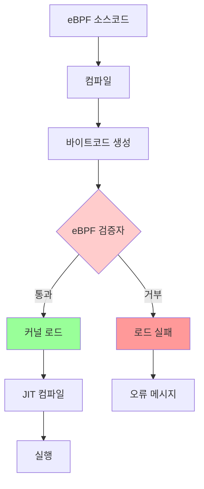
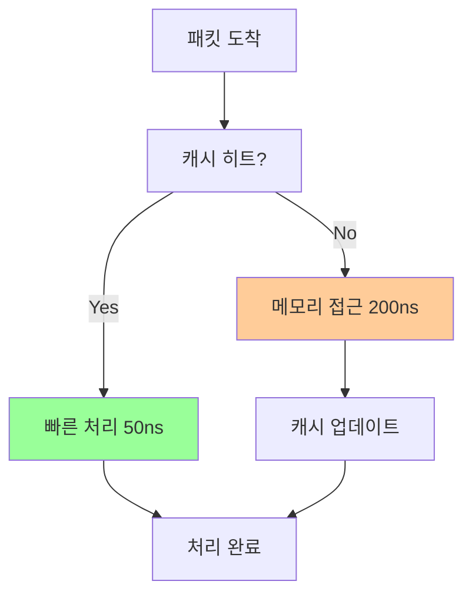
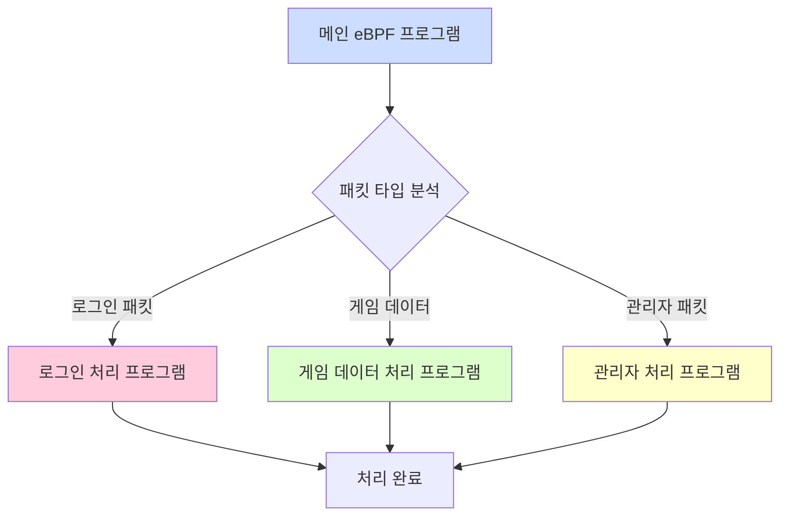
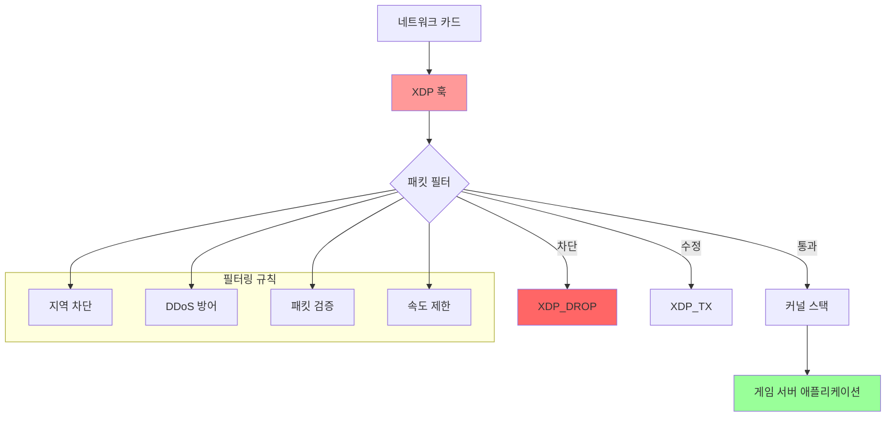
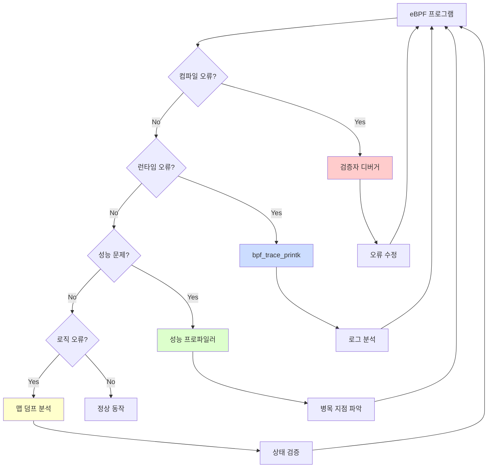
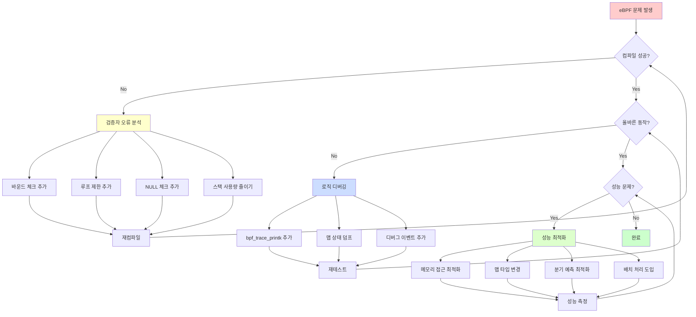
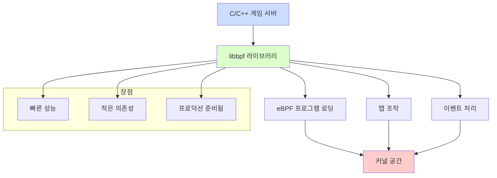
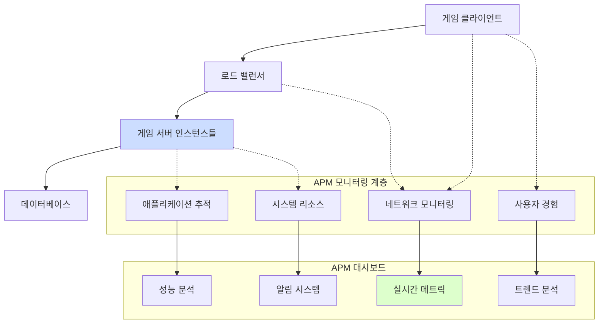

# 온라인 게임 서버 개발자를 위한 eBPF 실전 가이드  
  
저자: 최흥배, AI-Assisted   

---  
  
# 10장. eBPF 프로그램 최적화

게임 서버에서 eBPF 프로그램은 매초 수만 개의 이벤트를 처리해야 합니다. 플레이어의 패킷 하나하나, 시스템 호출 하나하나가 모두 모니터링 대상이죠. 이때 eBPF 프로그램 자체의 성능이 게임 서버 전체 성능에 직접적인 영향을 미칩니다. 마치 F1 경주에서 0.001초가 승부를 가르는 것처럼, eBPF 최적화에서도 마이크로초 단위의 개선이 전체 시스템 성능을 크게 좌우합니다.

이 장에서는 eBPF 프로그램을 극한의 성능으로 끌어올리는 전문 기법들을 학습해보겠습니다.

## 10.1 eBPF 검증자(Verifier) 이해하기

### 검증자란 무엇인가?

eBPF 검증자는 마치 까다로운 코드 리뷰어와 같습니다. 우리가 작성한 eBPF 프로그램을 커널에 로드하기 전에 안전성을 검사합니다:



검증자가 확인하는 주요 사항들:

1. **메모리 안전성**: 잘못된 메모리 접근 차단
2. **무한 루프 방지**: 루프 카운터 제한
3. **스택 오버플로우 방지**: 스택 사용량 제한 (512바이트)
4. **프로그램 크기 제한**: 최대 100만 명령어
5. **포인터 유효성**: 모든 포인터 접근 검증

### 검증자를 통과하는 코드 작성법

**❌ 검증자가 거부하는 코드 예시:**

```c
// 잘못된 예시 1: 바운드 체크 없는 배열 접근
SEC("xdp")
int bad_array_access(struct xdp_md *ctx) {
    void *data = (void *)(long)ctx->data;
    void *data_end = (void *)(long)ctx->data_end;
    
    struct ethhdr *eth = data;
    
    // ❌ 바운드 체크 없음!
    if (eth->h_proto == htons(ETH_P_IP)) {
        // 검증자가 거부함
        return XDP_PASS;
    }
    
    return XDP_DROP;
}

// 잘못된 예시 2: 무한 루프 가능성
SEC("kprobe/tcp_sendmsg")
int bad_loop(struct pt_regs *ctx) {
    int i = 0;
    
    // ❌ 종료 조건이 불명확!
    while (i >= 0) {  // 검증자가 거부함
        i++;
        if (some_condition()) break;
    }
    
    return 0;
}
```

**✅ 검증자를 통과하는 올바른 코드:**

```c
// 올바른 예시 1: 적절한 바운드 체크
SEC("xdp")
int good_array_access(struct xdp_md *ctx) {
    void *data = (void *)(long)ctx->data;
    void *data_end = (void *)(long)ctx->data_end;
    
    struct ethhdr *eth = data;
    
    // ✅ 바운드 체크 먼저!
    if ((void *)(eth + 1) > data_end)
        return XDP_DROP;
    
    if (eth->h_proto == htons(ETH_P_IP)) {
        struct iphdr *ip = (struct iphdr *)(eth + 1);
        
        // ✅ 다음 헤더도 체크
        if ((void *)(ip + 1) > data_end)
            return XDP_DROP;
            
        // 이제 안전하게 접근 가능
        return XDP_PASS;
    }
    
    return XDP_DROP;
}

// 올바른 예시 2: 명확한 루프 제한
SEC("kprobe/tcp_sendmsg")
int good_loop(struct pt_regs *ctx) {
    // ✅ 명확한 루프 제한
    #pragma unroll
    for (int i = 0; i < 16; i++) {
        if (process_item(i) == 0)
            break;
    }
    
    return 0;
}
```

### 게임 서버용 검증자 통과 패턴

게임 서버에서 자주 사용하는 안전한 패턴들:

```c
// game_server_patterns.c - 게임 서버용 안전 패턴들
#include <linux/bpf.h>
#include <bpf/bpf_helpers.h>
#include <linux/if_ether.h>
#include <linux/ip.h>
#include <linux/tcp.h>

// 패턴 1: 게임 패킷 파싱용 안전한 헤더 추출
static inline int parse_game_packet_safe(void *data, void *data_end, 
                                        struct game_packet_info *info) {
    struct ethhdr *eth = data;
    
    // 단계별 바운드 체크 패턴
    if ((void *)(eth + 1) > data_end)
        return -1;
    
    if (eth->h_proto != htons(ETH_P_IP))
        return -1;
    
    struct iphdr *ip = (struct iphdr *)(eth + 1);
    if ((void *)(ip + 1) > data_end)
        return -1;
    
    if (ip->protocol != IPPROTO_TCP)
        return -1;
    
    struct tcphdr *tcp = (struct tcphdr *)((void *)ip + (ip->ihl * 4));
    if ((void *)(tcp + 1) > data_end)
        return -1;
    
    // 게임 데이터 영역 계산
    void *game_data = (void *)tcp + (tcp->doff * 4);
    if (game_data + sizeof(u32) > data_end)  // 최소 게임 헤더 크기
        return -1;
    
    // 안전하게 정보 추출
    info->src_ip = ip->saddr;
    info->dst_ip = ip->daddr;
    info->src_port = tcp->source;
    info->dst_port = tcp->dest;
    
    return 0;
}

// 패턴 2: 제한된 반복을 위한 언롤링 매크로
#define GAME_PACKET_MAX_PLAYERS 64

SEC("xdp")
int process_game_packet(struct xdp_md *ctx) {
    void *data = (void *)(long)ctx->data;
    void *data_end = (void *)(long)ctx->data_end;
    
    struct game_packet_info info = {};
    
    if (parse_game_packet_safe(data, data_end, &info) < 0)
        return XDP_DROP;
    
    // 플레이어 목록 처리 (검증자 통과를 위한 언롤링)
    #pragma unroll
    for (int i = 0; i < 16; i++) {  // 16개로 제한
        u32 player_id = get_player_id(data, i);
        if (player_id == 0)
            break;
        
        update_player_stats(player_id, &info);
    }
    
    return XDP_PASS;
}

// 패턴 3: 맵 접근 시 NULL 체크 패턴
struct {
    __uint(type, BPF_MAP_TYPE_HASH);
    __uint(max_entries, 10000);
    __type(key, u32);
    __type(value, struct player_stats);
} player_stats_map SEC(".maps");

static inline void update_player_stats_safe(u32 player_id, 
                                           struct game_packet_info *info) {
    struct player_stats *stats = bpf_map_lookup_elem(&player_stats_map, &player_id);
    
    // ✅ 필수적인 NULL 체크
    if (!stats) {
        // 새 엔트리 생성
        struct player_stats new_stats = {};
        new_stats.packet_count = 1;
        new_stats.last_seen = bpf_ktime_get_ns();
        
        bpf_map_update_elem(&player_stats_map, &player_id, &new_stats, BPF_ANY);
        return;
    }
    
    // 기존 엔트리 업데이트
    stats->packet_count++;
    stats->last_seen = bpf_ktime_get_ns();
}
```

### 검증자 디버깅 도구

```python
#!/usr/bin/env python3
# verifier_debug.py - 검증자 오류 디버깅 도구

import re
import sys
from bcc import BPF

class VerifierDebugger:
    def __init__(self):
        self.common_errors = {
            "invalid access to packet": "패킷 바운드 체크 누락",
            "unbounded loop": "루프 제한 필요 (#pragma unroll 사용)",
            "invalid indirect access to map": "맵 값 NULL 체크 누락", 
            "stack out of bounds": "스택 사용량 초과 (512바이트 제한)",
            "program too large": "프로그램 크기 초과 (분할 필요)"
        }
    
    def analyze_error(self, error_msg):
        """검증자 오류 메시지 분석"""
        print("🔍 eBPF 검증자 오류 분석")
        print("=" * 50)
        
        for pattern, solution in self.common_errors.items():
            if pattern in error_msg.lower():
                print(f"❌ 오류 패턴: {pattern}")
                print(f"💡 해결 방법: {solution}")
                print()
                
                # 구체적인 해결 예시 제공
                self.show_solution_example(pattern)
                return
        
        print("❓ 알려지지 않은 오류입니다.")
        print("원본 오류 메시지:")
        print(error_msg)
    
    def show_solution_example(self, error_type):
        """오류 유형별 해결 예시 코드"""
        examples = {
            "invalid access to packet": """
// ❌ 잘못된 코드
struct iphdr *ip = data + sizeof(struct ethhdr);
if (ip->protocol == IPPROTO_TCP) { ... }

// ✅ 올바른 코드  
struct iphdr *ip = data + sizeof(struct ethhdr);
if ((void *)(ip + 1) > data_end) return XDP_DROP;
if (ip->protocol == IPPROTO_TCP) { ... }
""",
            "unbounded loop": """
// ❌ 잘못된 코드
for (int i = 0; i < count; i++) { ... }  // count가 런타임에 결정

// ✅ 올바른 코드
#pragma unroll
for (int i = 0; i < 16; i++) { ... }  // 컴파일 타임 상수
""",
            "invalid indirect access to map": """
// ❌ 잘못된 코드
struct value *v = bpf_map_lookup_elem(&map, &key);
v->counter++;  // NULL 체크 없음

// ✅ 올바른 코드
struct value *v = bpf_map_lookup_elem(&map, &key);
if (!v) return 0;  // NULL 체크 필수
v->counter++;
"""
        }
        
        if error_type in examples:
            print("📝 해결 예시 코드:")
            print(examples[error_type])
    
    def test_program_compilation(self, program_code):
        """eBPF 프로그램 컴파일 테스트"""
        try:
            bpf = BPF(text=program_code)
            print("✅ 프로그램이 성공적으로 컴파일되었습니다!")
            return True
        except Exception as e:
            print("❌ 컴파일 실패:")
            self.analyze_error(str(e))
            return False

# 사용 예시
if __name__ == "__main__":
    debugger = VerifierDebugger()
    
    # 오류 메시지 분석 예시
    error_msg = "invalid access to packet, off=14 size=4, R1(id=0,off=14,r=14)"
    debugger.analyze_error(error_msg)
```

## 10.2 성능 오버헤드 최소화 기법

### 메모리 접근 최적화

eBPF에서 메모리 접근은 성능의 핵심입니다. 게임 서버에서는 매초 수십만 개의 패킷을 처리하므로, 메모리 접근 하나하나가 성능에 직접 영향을 미칩니다.



**최적화 기법 1: 구조체 패딩 최소화**

```c
// 비효율적인 구조체 (24바이트)
struct inefficient_player_data {
    u8 status;          // 1바이트
    u64 timestamp;      // 8바이트 (7바이트 패딩 발생)
    u16 level;          // 2바이트  
    u32 experience;     // 4바이트 (2바이트 패딩 발생)
};

// 최적화된 구조체 (16바이트)
struct optimized_player_data {
    u64 timestamp;      // 8바이트 (정렬된 순서)
    u32 experience;     // 4바이트
    u16 level;          // 2바이트
    u8 status;          // 1바이트
    u8 reserved;        // 1바이트 (명시적 패딩)
};
```

**최적화 기법 2: 지역성 활용**

```c
// game_optimization.c - 메모리 지역성 최적화 예시
#include <linux/bpf.h>
#include <bpf/bpf_helpers.h>

// 핫 데이터와 콜드 데이터 분리
struct player_hot_data {
    u32 player_id;
    u64 last_packet_time;
    u32 packet_count;
    u16 current_hp;
    u16 current_mp;
};

struct player_cold_data {
    char player_name[32];
    u64 creation_time;
    u32 total_playtime;
    u32 achievement_flags;
};

// 핫 데이터용 맵 (자주 접근)
struct {
    __uint(type, BPF_MAP_TYPE_HASH);
    __uint(max_entries, 50000);
    __type(key, u32);
    __type(value, struct player_hot_data);
} hot_data_map SEC(".maps");

// 콜드 데이터용 맵 (가끔 접근)
struct {
    __uint(type, BPF_MAP_TYPE_HASH);
    __uint(max_entries, 50000);
    __type(key, u32);
    __type(value, struct player_cold_data);
} cold_data_map SEC(".maps");

// 최적화된 패킷 처리 함수
SEC("xdp")
int optimized_packet_handler(struct xdp_md *ctx) {
    void *data = (void *)(long)ctx->data;
    void *data_end = (void *)(long)ctx->data_end;
    
    // 패킷에서 플레이어 ID 추출
    u32 player_id = extract_player_id(data, data_end);
    if (player_id == 0)
        return XDP_PASS;
    
    // 핫 데이터만 접근 (90% 케이스)
    struct player_hot_data *hot = bpf_map_lookup_elem(&hot_data_map, &player_id);
    if (!hot)
        return XDP_PASS;
    
    // 빠른 업데이트
    hot->last_packet_time = bpf_ktime_get_ns();
    hot->packet_count++;
    
    // 콜드 데이터는 필요할 때만 접근 (10% 케이스)
    if (is_special_packet(data, data_end)) {
        struct player_cold_data *cold = bpf_map_lookup_elem(&cold_data_map, &player_id);
        if (cold) {
            // 특별한 처리
            update_achievements(cold, hot);
        }
    }
    
    return XDP_PASS;
}
```

### 맵 사용 최적화

**기법 1: 적절한 맵 타입 선택**

```c
// 다양한 맵 타입과 사용 시나리오

// 1. HASH: 범용적, 플레이어 ID -> 데이터
struct {
    __uint(type, BPF_MAP_TYPE_HASH);
    __uint(max_entries, 100000);
    __type(key, u32);  // player_id
    __type(value, struct player_stats);
} player_hash_map SEC(".maps");

// 2. ARRAY: 빠름, 연속된 인덱스 (서버 인스턴스별 통계)
struct {
    __uint(type, BPF_MAP_TYPE_ARRAY);
    __uint(max_entries, 64);  // 최대 64개 서버
    __type(key, u32);  // server_index
    __type(value, struct server_stats);
} server_array_map SEC(".maps");

// 3. LRU_HASH: 자동 정리, 임시 세션 데이터
struct {
    __uint(type, BPF_MAP_TYPE_LRU_HASH);
    __uint(max_entries, 10000);
    __type(key, u64);  // session_id
    __type(value, struct temp_session);
} session_lru_map SEC(".maps");

// 4. PERCPU_HASH: CPU별 분리, 통계 수집용
struct {
    __uint(type, BPF_MAP_TYPE_PERCPU_HASH);
    __uint(max_entries, 1000);
    __type(key, u32);  // metric_type
    __type(value, u64);  // counter
} stats_percpu_map SEC(".maps");
```

**기법 2: 배치 업데이트와 원자적 연산**

```c
// 원자적 연산 활용한 고성능 카운터
SEC("kprobe/tcp_sendmsg")
int count_game_packets(struct pt_regs *ctx) {
    u32 packet_type = get_packet_type_from_socket(ctx);
    u64 *counter;
    
    // 원자적 증가 (락 없이)
    counter = bpf_map_lookup_elem(&stats_percpu_map, &packet_type);
    if (counter) {
        __sync_fetch_and_add(counter, 1);
    }
    
    return 0;
}

// 배치 업데이트 패턴
struct batch_update {
    u32 updates[16];
    u8 count;
};

SEC("tracepoint/syscalls/sys_enter_sendto")
int batch_update_example(void *ctx) {
    static struct batch_update batch = {};
    
    u32 player_id = get_current_player_id();
    
    // 배치에 추가
    if (batch.count < 16) {
        batch.updates[batch.count] = player_id;
        batch.count++;
    }
    
    // 배치가 찼으면 한 번에 처리
    if (batch.count == 16) {
        process_batch_updates(&batch);
        batch.count = 0;  // 리셋
    }
    
    return 0;
}
```

### 분기 예측 최적화

```c
// 분기 예측을 고려한 코드 구조

SEC("xdp")
int optimized_branching(struct xdp_md *ctx) {
    void *data = (void *)(long)ctx->data;
    void *data_end = (void *)(long)ctx->data_end;
    
    // 가장 일반적인 경우를 먼저 처리 (예측 성공률 높음)
    if (likely(is_normal_game_packet(data, data_end))) {
        return process_normal_packet(data, data_end);
    }
    
    // 덜 일반적인 경우들
    if (unlikely(is_login_packet(data, data_end))) {
        return process_login_packet(data, data_end);
    }
    
    if (unlikely(is_admin_packet(data, data_end))) {
        return process_admin_packet(data, data_end);
    }
    
    return XDP_DROP;  // 알 수 없는 패킷
}

// likely/unlikely 매크로 정의
#define likely(x)   __builtin_expect(!!(x), 1)
#define unlikely(x) __builtin_expect(!!(x), 0)
```

### 성능 벤치마킹 도구

```python
#!/usr/bin/env python3
# ebpf_benchmark.py - eBPF 성능 벤치마킹 도구

import time
import statistics
from bcc import BPF
import subprocess
import psutil

class EBPFBenchmark:
    def __init__(self):
        self.results = {}
        
    def measure_program_performance(self, program_code, program_name):
        """eBPF 프로그램 성능 측정"""
        print(f"🔍 {program_name} 성능 측정 중...")
        
        # CPU 사용률 측정 시작
        cpu_before = psutil.cpu_percent(interval=None)
        
        try:
            # 프로그램 로드
            start_time = time.perf_counter()
            bpf = BPF(text=program_code)
            load_time = time.perf_counter() - start_time
            
            # 테스트 트래픽 생성
            self.generate_test_traffic()
            
            # 실행 시간 측정
            run_start = time.perf_counter()
            time.sleep(10)  # 10초 동안 실행
            run_time = time.perf_counter() - run_start
            
            # CPU 사용률 측정 종료
            cpu_after = psutil.cpu_percent(interval=1)
            
            # 결과 저장
            self.results[program_name] = {
                'load_time_ms': load_time * 1000,
                'cpu_usage_percent': cpu_after - cpu_before,
                'runtime_seconds': run_time
            }
            
            print(f"✅ {program_name} 측정 완료")
            
        except Exception as e:
            print(f"❌ {program_name} 측정 실패: {e}")
            
    def generate_test_traffic(self):
        """테스트 트래픽 생성"""
        subprocess.run([
            'hping3', '-S', '-p', '8080', 
            '-i', 'u1000',  # 1ms 간격
            '-c', '10000',  # 10000개 패킷
            'localhost'
        ], capture_output=True)
    
    def compare_optimizations(self, original_code, optimized_code):
        """최적화 전후 성능 비교"""
        print("🏁 성능 최적화 비교 테스트")
        print("=" * 50)
        
        self.measure_program_performance(original_code, "Original")
        self.measure_program_performance(optimized_code, "Optimized")
        
        if "Original" in self.results and "Optimized" in self.results:
            original = self.results["Original"]
            optimized = self.results["Optimized"]
            
            print("\n📊 성능 비교 결과:")
            print(f"로드 시간: {original['load_time_ms']:.2f}ms → {optimized['load_time_ms']:.2f}ms")
            print(f"CPU 사용률: {original['cpu_usage_percent']:.1f}% → {optimized['cpu_usage_percent']:.1f}%")
            
            # 개선율 계산
            load_improvement = (original['load_time_ms'] - optimized['load_time_ms']) / original['load_time_ms'] * 100
            cpu_improvement = (original['cpu_usage_percent'] - optimized['cpu_usage_percent']) / original['cpu_usage_percent'] * 100
            
            print(f"\n🎯 개선 효과:")
            print(f"로드 시간 개선: {load_improvement:.1f}%")
            print(f"CPU 사용률 개선: {cpu_improvement:.1f}%")

# 예시 코드들
original_code = """
#include <linux/bpf.h>
#include <bpf/bpf_helpers.h>
#include <linux/if_ether.h>

BPF_HASH(stats, u32, u64, 1000);

SEC("xdp")
int original_handler(struct xdp_md *ctx) {
    void *data = (void *)(long)ctx->data;
    void *data_end = (void *)(long)ctx->data_end;
    
    // 비효율적인 구조
    if (data + 14 <= data_end) {  // 매직넘버 사용
        u32 key = 1;
        u64 *counter = stats.lookup(&key);
        if (counter) {
            (*counter)++;
        } else {
            u64 init_val = 1;
            stats.update(&key, &init_val);
        }
    }
    
    return XDP_PASS;
}
"""

optimized_code = """
#include <linux/bpf.h>
#include <bpf/bpf_helpers.h>
#include <linux/if_ether.h>

BPF_PERCPU_HASH(stats, u32, u64, 1000);

SEC("xdp")
int optimized_handler(struct xdp_md *ctx) {
    void *data = (void *)(long)ctx->data;
    void *data_end = (void *)(long)ctx->data_end;
    
    struct ethhdr *eth = data;
    
    // 구조체 기반 바운드 체크
    if ((void *)(eth + 1) > data_end)
        return XDP_PASS;
    
    u32 key = 1;
    u64 *counter = bpf_map_lookup_elem(&stats, &key);
    if (counter) {
        // 원자적 연산 사용
        __sync_fetch_and_add(counter, 1);
    }
    
    return XDP_PASS;
}
"""

if __name__ == "__main__":
    benchmark = EBPFBenchmark()
    benchmark.compare_optimizations(original_code, optimized_code)
```

## 10.3 BPF 꼬리 호출(Tail Calls) 활용

### 꼬리 호출이란?

꼬리 호출은 하나의 eBPF 프로그램에서 다른 eBPF 프로그램을 호출하는 기법입니다. 마치 함수 호출과 같지만, 스택을 유지하지 않고 완전히 새로운 프로그램으로 점프합니다.



### 게임 패킷 분류기 구현

```c
// game_packet_classifier.c - 꼬리 호출을 활용한 패킷 분류기
#include <linux/bpf.h>
#include <bpf/bpf_helpers.h>
#include <linux/if_ether.h>
#include <linux/ip.h>
#include <linux/tcp.h>

// 게임 패킷 타입 정의
#define PACKET_TYPE_LOGIN      0
#define PACKET_TYPE_GAMEPLAY   1  
#define PACKET_TYPE_CHAT       2
#define PACKET_TYPE_ADMIN      3
#define PACKET_TYPE_HEARTBEAT  4

// 꼬리 호출용 프로그램 배열
struct {
    __uint(type, BPF_MAP_TYPE_PROG_ARRAY);
    __uint(max_entries, 8);
    __type(key, u32);
    __type(value, u32);
} packet_handlers SEC(".maps");

// 게임 패킷 헤더 구조체
struct game_packet_header {
    u32 magic;          // 0x47414D45 ("GAME")
    u16 packet_type;
    u16 packet_length;
    u32 player_id;
    u32 sequence_number;
    u32 timestamp;
    u32 checksum;
} __attribute__((packed));

// 메인 분류 프로그램
SEC("xdp")
int packet_classifier_main(struct xdp_md *ctx) {
    void *data = (void *)(long)ctx->data;
    void *data_end = (void *)(long)ctx->data_end;
    
    // 이더넷/IP/TCP 헤더 검증
    struct ethhdr *eth = data;
    if ((void *)(eth + 1) > data_end)
        return XDP_DROP;
        
    if (eth->h_proto != htons(ETH_P_IP))
        return XDP_PASS;
        
    struct iphdr *ip = (struct iphdr *)(eth + 1);
    if ((void *)(ip + 1) > data_end)
        return XDP_DROP;
        
    if (ip->protocol != IPPROTO_TCP)
        return XDP_PASS;
        
    struct tcphdr *tcp = (struct tcphdr *)((void *)ip + (ip->ihl * 4));
    if ((void *)(tcp + 1) > data_end)
        return XDP_DROP;
    
    // 게임 포트 확인 (예: 8080)
    if (tcp->dest != htons(8080) && tcp->source != htons(8080))
        return XDP_PASS;
    
    // 게임 패킷 헤더 확인
    void *game_data = (void *)tcp + (tcp->doff * 4);
    struct game_packet_header *game_hdr = game_data;
    
    if ((void *)(game_hdr + 1) > data_end)
        return XDP_DROP;
    
    // 매직넘버 확인
    if (game_hdr->magic != 0x47414D45)  // "GAME"
        return XDP_DROP;
    
    // 패킷 타입별 꼬리 호출
    u32 packet_type = game_hdr->packet_type;
    if (packet_type < 5) {
        bpf_tail_call(ctx, &packet_handlers, packet_type);
    }
    
    // 꼬리 호출 실패 시 기본 처리
    return XDP_PASS;
}

// 로그인 패킷 처리기
SEC("xdp")
int handle_login_packet(struct xdp_md *ctx) {
    void *data = (void *)(long)ctx->data;
    void *data_end = (void *)(long)ctx->data_end;
    
    // 로그인 패킷 전용 로직
    struct game_packet_header *hdr = extract_game_header(data, data_end);
    if (!hdr)
        return XDP_DROP;
    
    // 로그인 시도 로깅
    log_login_attempt(hdr->player_id, hdr->timestamp);
    
    // DDoS 방어: 로그인 시도 빈도 체크
    if (check_login_rate_limit(hdr->player_id))
        return XDP_DROP;
    
    // 로그인 패킷 통계 업데이트
    update_login_stats();
    
    return XDP_PASS;
}

// 게임플레이 패킷 처리기
SEC("xdp")
int handle_gameplay_packet(struct xdp_md *ctx) {
    void *data = (void *)(long)ctx->data;
    void *data_end = (void *)(long)ctx->data_end;
    
    struct game_packet_header *hdr = extract_game_header(data, data_end);
    if (!hdr)
        return XDP_DROP;
    
    // 플레이어 활동 추적
    update_player_activity(hdr->player_id, hdr->timestamp);
    
    // 치팅 검사 (비정상적인 패킷 빈도)
    if (detect_potential_cheating(hdr))
        return XDP_DROP;
    
    // 서버 부하 분산을 위한 라우팅 힌트 추가
    add_routing_hint(ctx, hdr->player_id);
    
    return XDP_PASS;
}

// 채팅 패킷 처리기
SEC("xdp")
int handle_chat_packet(struct xdp_md *ctx) {
    void *data = (void *)(long)ctx->data;
    void *data_end = (void *)(long)ctx->data_end;
    
    struct game_packet_header *hdr = extract_game_header(data, data_end);
    if (!hdr)
        return XDP_DROP;
    
    // 채팅 스팸 방지
    if (check_chat_rate_limit(hdr->player_id))
        return XDP_DROP;
    
    // 욕설 필터링 (간단한 패턴 매칭)
    if (contains_inappropriate_content(data, data_end))
        return XDP_DROP;
    
    // 채팅 통계 업데이트
    update_chat_stats(hdr->player_id);
    
    return XDP_PASS;
}

// 관리자 패킷 처리기
SEC("xdp")
int handle_admin_packet(struct xdp_md *ctx) {
    void *data = (void *)(long)ctx->data;
    void *data_end = (void *)(long)ctx->data_end;
    
    struct game_packet_header *hdr = extract_game_header(data, data_end);
    if (!hdr)
        return XDP_DROP;
    
    // 관리자 권한 확인
    if (!verify_admin_privileges(hdr->player_id))
        return XDP_DROP;
    
    // 관리자 명령 로깅
    log_admin_command(hdr);
    
    // 높은 우선순위 부여
    set_packet_priority(ctx, HIGH_PRIORITY);
    
    return XDP_PASS;
}

// 하트비트 패킷 처리기
SEC("xdp")
int handle_heartbeat_packet(struct xdp_md *ctx) {
    void *data = (void *)(long)ctx->data;
    void *data_end = (void *)(long)ctx->data_end;
    
    struct game_packet_header *hdr = extract_game_header(data, data_end);
    if (!hdr)
        return XDP_DROP;
    
    // 플레이어 온라인 상태 업데이트
    update_player_online_status(hdr->player_id, hdr->timestamp);
    
    // 하트비트는 빠르게 처리 (최소한의 로직)
    return XDP_PASS;
}

// 헬퍼 함수들
static inline struct game_packet_header *extract_game_header(void *data, void *data_end) {
    // 이더넷/IP/TCP 헤더들을 건너뛰고 게임 헤더 추출
    struct ethhdr *eth = data;
    if ((void *)(eth + 1) > data_end) return NULL;
    
    struct iphdr *ip = (struct iphdr *)(eth + 1);
    if ((void *)(ip + 1) > data_end) return NULL;
    
    struct tcphdr *tcp = (struct tcphdr *)((void *)ip + (ip->ihl * 4));
    if ((void *)(tcp + 1) > data_end) return NULL;
    
    struct game_packet_header *game_hdr = (struct game_packet_header *)((void *)tcp + (tcp->doff * 4));
    if ((void *)(game_hdr + 1) > data_end) return NULL;
    
    return game_hdr;
}

char _license[] SEC("license") = "GPL";
```

### 꼬리 호출 로더 및 관리 도구

```python
#!/usr/bin/env python3
# tail_call_loader.py - 꼬리 호출 프로그램 로더

from bcc import BPF
import ctypes as ct

class TailCallManager:
    def __init__(self):
        self.main_program = None
        self.handler_programs = {}
        
    def load_main_program(self, source_code):
        """메인 분류 프로그램 로드"""
        self.main_program = BPF(text=source_code)
        print("✅ 메인 패킷 분류 프로그램 로드 완료")
        
    def load_handler_program(self, handler_type, source_code, function_name):
        """핸들러 프로그램 로드"""
        handler_bpf = BPF(text=source_code)
        handler_fn = handler_bpf.load_func(function_name, BPF.XDP)
        
        self.handler_programs[handler_type] = {
            'bpf': handler_bpf,
            'function': handler_fn
        }
        
        print(f"✅ {handler_type} 핸들러 로드 완료")
        
    def setup_tail_calls(self):
        """꼬리 호출 맵 설정"""
        packet_handlers = self.main_program.get_table("packet_handlers")
        
        for handler_type, handler_info in self.handler_programs.items():
            packet_handlers[ct.c_int(handler_type)] = ct.c_int(handler_info['function'].fd)
            
        print("✅ 꼬리 호출 맵 설정 완료")
        
    def attach_to_interface(self, interface_name):
        """네트워크 인터페이스에 연결"""
        main_fn = self.main_program.load_func("packet_classifier_main", BPF.XDP)
        self.main_program.attach_xdp(interface_name, main_fn)
        print(f"✅ {interface_name}에 패킷 분류기 연결 완료")
        
    def get_statistics(self):
        """통계 정보 조회"""
        stats = {}
        
        # 각 핸들러별 통계 수집
        for handler_type, handler_info in self.handler_programs.items():
            bpf = handler_info['bpf']
            # 통계 맵이 있다면 조회
            try:
                stat_table = bpf.get_table("handler_stats")
                stats[handler_type] = dict(stat_table.items())
            except:
                stats[handler_type] = "통계 없음"
        
        return stats

# 사용 예시
def setup_game_packet_classifier():
    manager = TailCallManager()
    
    # 메인 프로그램 로드
    with open("game_packet_classifier.c", "r") as f:
        main_code = f.read()
    manager.load_main_program(main_code)
    
    # 각 핸들러 로드
    handler_configs = [
        (0, "handle_login_packet"),      # 로그인
        (1, "handle_gameplay_packet"),   # 게임플레이  
        (2, "handle_chat_packet"),       # 채팅
        (3, "handle_admin_packet"),      # 관리자
        (4, "handle_heartbeat_packet")   # 하트비트
    ]
    
    for handler_type, function_name in handler_configs:
        manager.load_handler_program(handler_type, main_code, function_name)
    
    # 꼬리 호출 설정
    manager.setup_tail_calls()
    
    # 네트워크 인터페이스에 연결
    manager.attach_to_interface("eth0")
    
    return manager

if __name__ == "__main__":
    import time
    
    manager = setup_game_packet_classifier()
    
    try:
        print("🎮 게임 패킷 분류기 실행 중... (Ctrl+C로 종료)")
        while True:
            time.sleep(10)
            stats = manager.get_statistics()
            print("\n📊 핸들러별 통계:")
            for handler_type, stat in stats.items():
                print(f"  타입 {handler_type}: {stat}")
                
    except KeyboardInterrupt:
        print("\n종료 중...")
```

## 10.4 [실습] 고성능 패킷 필터 구현

이번 실습에서는 게임 서버를 위한 고성능 패킷 필터를 구현해보겠습니다. XDP를 활용하여 커널 스택을 거치기 전에 패킷을 필터링하여 최고의 성능을 달성할 것입니다.

### 실습 목표

- DDoS 공격 차단
- 비정상적인 게임 패킷 필터링  
- 지역 기반 접근 제어
- 실시간 성능 모니터링



### 고성능 패킷 필터 구현

```c
// high_performance_filter.c
#include <linux/bpf.h>
#include <bpf/bpf_helpers.h>
#include <linux/if_ether.h>
#include <linux/ip.h>
#include <linux/tcp.h>
#include <linux/udp.h>

// 필터링 통계
struct filter_stats {
    __u64 total_packets;
    __u64 dropped_ddos;
    __u64 dropped_geo;
    __u64 dropped_invalid;
    __u64 rate_limited;
    __u64 allowed;
};

// 클라이언트 연결 정보
struct client_info {
    __u32 packet_count;
    __u64 last_packet_time;
    __u64 total_bytes;
    __u8 geo_region;
    __u8 threat_level;  // 0=정상, 5=의심, 10=차단
};

// DDoS 탐지 윈도우
struct ddos_window {
    __u64 window_start;
    __u32 packet_count;
    __u32 unique_sources;
};

// eBPF 맵들
struct {
    __uint(type, BPF_MAP_TYPE_PERCPU_ARRAY);
    __uint(max_entries, 1);
    __type(key, __u32);
    __type(value, struct filter_stats);
} stats_map SEC(".maps");

struct {
    __uint(type, BPF_MAP_TYPE_LRU_HASH);
    __uint(max_entries, 100000);
    __type(key, __u32);  // IP 주소
    __type(value, struct client_info);
} client_map SEC(".maps");

struct {
    __uint(type, BPF_MAP_TYPE_ARRAY);
    __uint(max_entries, 1);
    __type(key, __u32);
    __type(value, struct ddos_window);
} ddos_map SEC(".maps");

// 차단된 국가/지역 (비트마스크)
struct {
    __uint(type, BPF_MAP_TYPE_HASH);
    __uint(max_entries, 256);
    __type(key, __u32);  // 지역 코드
    __type(value, __u8);  // 차단 여부
} geo_block_map SEC(".maps");

// 화이트리스트 (관리자, 개발자 IP)
struct {
    __uint(type, BPF_MAP_TYPE_HASH);
    __uint(max_entries, 1000);
    __type(key, __u32);  // IP 주소
    __type(value, __u8);  // 우선순위
} whitelist_map SEC(".maps");

// 게임 포트 목록
struct {
    __uint(type, BPF_MAP_TYPE_HASH);
    __uint(max_entries, 10);
    __type(key, __u16);  // 포트 번호
    __type(value, __u8);  // 프로토콜 (TCP/UDP)
} game_ports_map SEC(".maps");

// 메인 필터 함수
SEC("xdp")
int game_packet_filter(struct xdp_md *ctx) {
    void *data = (void *)(long)ctx->data;
    void *data_end = (void *)(long)ctx->data_end;
    
    // 통계 업데이트
    __u32 stats_key = 0;
    struct filter_stats *stats = bpf_map_lookup_elem(&stats_map, &stats_key);
    if (stats) {
        __sync_fetch_and_add(&stats->total_packets, 1);
    }
    
    // 이더넷 헤더 검증
    struct ethhdr *eth = data;
    if ((void *)(eth + 1) > data_end)
        return XDP_DROP;
    
    // IP 패킷만 처리
    if (eth->h_proto != htons(ETH_P_IP))
        return XDP_PASS;
    
    struct iphdr *ip = (struct iphdr *)(eth + 1);
    if ((void *)(ip + 1) > data_end)
        return XDP_DROP;
    
    __u32 src_ip = ip->saddr;
    
    // 1. 화이트리스트 검사 (최우선)
    __u8 *whitelist = bpf_map_lookup_elem(&whitelist_map, &src_ip);
    if (whitelist) {
        if (stats) __sync_fetch_and_add(&stats->allowed, 1);
        return XDP_PASS;  // 화이트리스트는 무조건 통과
    }
    
    // 2. 지역 차단 검사
    __u8 geo_region = get_geo_region(src_ip);
    __u8 *blocked = bpf_map_lookup_elem(&geo_block_map, &geo_region);
    if (blocked && *blocked) {
        if (stats) __sync_fetch_and_add(&stats->dropped_geo, 1);
        return XDP_DROP;
    }
    
    // 3. DDoS 탐지 및 차단
    if (detect_ddos_attack(src_ip, data, data_end)) {
        if (stats) __sync_fetch_and_add(&stats->dropped_ddos, 1);
        return XDP_DROP;
    }
    
    // 4. 게임 포트 검증
    if (!is_valid_game_traffic(ip, data_end)) {
        if (stats) __sync_fetch_and_add(&stats->dropped_invalid, 1);
        return XDP_DROP;
    }
    
    // 5. 속도 제한 검사
    if (rate_limit_check(src_ip)) {
        if (stats) __sync_fetch_and_add(&stats->rate_limited, 1);
        return XDP_DROP;
    }
    
    // 6. 클라이언트 정보 업데이트
    update_client_info(src_ip, ip, data_end);
    
    if (stats) __sync_fetch_and_add(&stats->allowed, 1);
    return XDP_PASS;
}

// 지역 코드 추출 (간단한 구현)
static inline __u8 get_geo_region(__u32 ip) {
    // 실제로는 GeoIP 데이터베이스 사용
    // 여기서는 IP 범위로 간단 구현
    
    __u8 first_octet = ip & 0xFF;
    
    // 예시: 특정 IP 범위를 지역별로 매핑
    if (first_octet >= 1 && first_octet <= 126) return 1;      // 북미
    if (first_octet >= 128 && first_octet <= 191) return 2;    // 유럽
    if (first_octet >= 192 && first_octet <= 223) return 3;    // 아시아
    
    return 0;  // 알 수 없음
}

// DDoS 공격 탐지
static inline int detect_ddos_attack(__u32 src_ip, void *data, void *data_end) {
    __u64 current_time = bpf_ktime_get_ns();
    __u32 ddos_key = 0;
    
    struct ddos_window *window = bpf_map_lookup_elem(&ddos_map, &ddos_key);
    if (!window) {
        struct ddos_window new_window = {
            .window_start = current_time,
            .packet_count = 1,
            .unique_sources = 1
        };
        bpf_map_update_elem(&ddos_map, &ddos_key, &new_window, BPF_ANY);
        return 0;
    }
    
    // 1초 윈도우 (1,000,000,000 나노초)
    if (current_time - window->window_start > 1000000000) {
        // 새 윈도우 시작
        window->window_start = current_time;
        window->packet_count = 1;
        window->unique_sources = 1;
        return 0;
    }
    
    window->packet_count++;
    
    // DDoS 임계값 검사
    if (window->packet_count > 10000) {  // 초당 10,000패킷 초과
        return 1;  // DDoS로 판단
    }
    
    // 개별 클라이언트 체크
    struct client_info *client = bpf_map_lookup_elem(&client_map, &src_ip);
    if (client) {
        // 클라이언트별 패킷 빈도 체크
        __u64 time_diff = current_time - client->last_packet_time;
        if (time_diff < 1000000) {  // 1ms 미만 간격
            client->threat_level++;
            if (client->threat_level > 5) {
                return 1;  // 의심스러운 활동
            }
        } else {
            client->threat_level = 0;  // 리셋
        }
    }
    
    return 0;
}

// 게임 트래픽 검증
static inline int is_valid_game_traffic(struct iphdr *ip, void *data_end) {
    __u16 dest_port = 0;
    
    if (ip->protocol == IPPROTO_TCP) {
        struct tcphdr *tcp = (struct tcphdr *)((void *)ip + (ip->ihl * 4));
        if ((void *)(tcp + 1) > data_end)
            return 0;
        dest_port = ntohs(tcp->dest);
    } else if (ip->protocol == IPPROTO_UDP) {
        struct udphdr *udp = (struct udphdr *)((void *)ip + (ip->ihl * 4));
        if ((void *)(udp + 1) > data_end)
            return 0;
        dest_port = ntohs(udp->dest);
    } else {
        return 0;  // TCP/UDP가 아닌 프로토콜은 차단
    }
    
    // 게임 포트인지 확인
    __u8 *game_protocol = bpf_map_lookup_elem(&game_ports_map, &dest_port);
    return (game_protocol != NULL);
}

// 속도 제한 검사
static inline int rate_limit_check(__u32 src_ip) {
    __u64 current_time = bpf_ktime_get_ns();
    
    struct client_info *client = bpf_map_lookup_elem(&client_map, &src_ip);
    if (!client) {
        // 새 클라이언트
        struct client_info new_client = {
            .packet_count = 1,
            .last_packet_time = current_time,
            .total_bytes = 0,
            .geo_region = get_geo_region(src_ip),
            .threat_level = 0
        };
        bpf_map_update_elem(&client_map, &src_ip, &new_client, BPF_ANY);
        return 0;
    }
    
    // 속도 제한 체크 (초당 100패킷)
    __u64 time_diff = current_time - client->last_packet_time;
    if (time_diff < 10000000) {  // 10ms 미만
        client->packet_count++;
        if (client->packet_count > 100) {
            return 1;  // 속도 제한 초과
        }
    } else {
        client->packet_count = 1;  // 리셋
    }
    
    client->last_packet_time = current_time;
    return 0;
}

// 클라이언트 정보 업데이트
static inline void update_client_info(__u32 src_ip, struct iphdr *ip, void *data_end) {
    struct client_info *client = bpf_map_lookup_elem(&client_map, &src_ip);
    if (!client)
        return;
    
    __u16 total_len = ntohs(ip->tot_len);
    client->total_bytes += total_len;
    
    // 위협 레벨 감소 (정상적인 활동)
    if (client->threat_level > 0) {
        client->threat_level--;
    }
}

char _license[] SEC("license") = "GPL";
```

### 필터 관리 및 모니터링 도구

```python
#!/usr/bin/env python3
# game_filter_manager.py - 게임 패킷 필터 관리 도구

import time
import json
import ipaddress
from bcc import BPF
import argparse
from collections import defaultdict

class GamePacketFilterManager:
    def __init__(self, interface="eth0"):
        self.interface = interface
        self.bpf = None
        self.stats_history = []
        
    def load_filter(self, source_file="high_performance_filter.c"):
        """필터 프로그램 로드"""
        try:
            with open(source_file, 'r') as f:
                source_code = f.read()
            
            print("🔄 eBPF 필터 프로그램 컴파일 중...")
            self.bpf = BPF(text=source_code)
            
            print("🔄 XDP 프로그램 로드 중...")
            filter_fn = self.bpf.load_func("game_packet_filter", BPF.XDP)
            
            print(f"🔄 {self.interface}에 연결 중...")
            self.bpf.attach_xdp(self.interface, filter_fn)
            
            print("✅ 게임 패킷 필터 로드 완료!")
            
            # 기본 설정 적용
            self.setup_default_config()
            
        except Exception as e:
            print(f"❌ 필터 로드 실패: {e}")
            return False
        
        return True
    
    def setup_default_config(self):
        """기본 설정 적용"""
        print("⚙️ 기본 설정 적용 중...")
        
        # 게임 포트 설정
        game_ports = self.bpf.get_table("game_ports_map")
        default_ports = [8080, 8081, 8082, 9090, 9091]  # 게임 서버 포트들
        
        for port in default_ports:
            game_ports[port] = 1  # TCP
        
        # 화이트리스트 설정 (로컬 네트워크)
        whitelist = self.bpf.get_table("whitelist_map")
        local_networks = [
            "192.168.1.0/24",
            "10.0.0.0/24",
            "127.0.0.1/32"
        ]
        
        for network in local_networks:
            net = ipaddress.ip_network(network)
            for ip in net.hosts():
                whitelist[int(ip)] = 10  # 높은 우선순위
    
    def add_geo_block(self, region_code):
        """지역 차단 추가"""
        geo_block = self.bpf.get_table("geo_block_map")
        geo_block[region_code] = 1
        print(f"🚫 지역 {region_code} 차단 추가")
    
    def remove_geo_block(self, region_code):
        """지역 차단 제거"""
        geo_block = self.bpf.get_table("geo_block_map")
        try:
            del geo_block[region_code]
            print(f"✅ 지역 {region_code} 차단 제거")
        except KeyError:
            print(f"⚠️ 지역 {region_code}는 차단되지 않음")
    
    def add_whitelist_ip(self, ip_str, priority=5):
        """화이트리스트 IP 추가"""
        whitelist = self.bpf.get_table("whitelist_map")
        ip_int = int(ipaddress.ip_address(ip_str))
        whitelist[ip_int] = priority
        print(f"✅ {ip_str} 화이트리스트 추가 (우선순위: {priority})")
    
    def remove_whitelist_ip(self, ip_str):
        """화이트리스트 IP 제거"""
        whitelist = self.bpf.get_table("whitelist_map")
        ip_int = int(ipaddress.ip_address(ip_str))
        try:
            del whitelist[ip_int]
            print(f"✅ {ip_str} 화이트리스트 제거")
        except KeyError:
            print(f"⚠️ {ip_str}은 화이트리스트에 없음")
    
    def get_statistics(self):
        """필터링 통계 조회"""
        stats_map = self.bpf.get_table("stats_map")
        
        total_stats = {
            'total_packets': 0,
            'dropped_ddos': 0,
            'dropped_geo': 0,
            'dropped_invalid': 0,
            'rate_limited': 0,
            'allowed': 0
        }
        
        # PERCPU 맵에서 모든 CPU의 통계 합계
        for cpu_stats in stats_map.values():
            for cpu_data in cpu_stats:
                total_stats['total_packets'] += cpu_data.total_packets
                total_stats['dropped_ddos'] += cpu_data.dropped_ddos
                total_stats['dropped_geo'] += cpu_data.dropped_geo
                total_stats['dropped_invalid'] += cpu_data.dropped_invalid
                total_stats['rate_limited'] += cpu_data.rate_limited
                total_stats['allowed'] += cpu_data.allowed
        
        return total_stats
    
    def get_client_info(self, limit=10):
        """클라이언트 정보 조회"""
        client_map = self.bpf.get_table("client_map")
        clients = []
        
        for ip_int, client_info in client_map.items():
            ip_str = str(ipaddress.ip_address(ip_int.value))
            clients.append({
                'ip': ip_str,
                'packet_count': client_info.packet_count,
                'last_packet_time': client_info.last_packet_time,
                'total_bytes': client_info.total_bytes,
                'geo_region': client_info.geo_region,
                'threat_level': client_info.threat_level
            })
        
        # 패킷 수 기준 정렬
        clients.sort(key=lambda x: x['packet_count'], reverse=True)
        return clients[:limit]
    
    def monitor(self, interval=5):
        """실시간 모니터링"""
        print("📊 실시간 패킷 필터 모니터링 시작...")
        print("=" * 80)
        
        try:
            while True:
                stats = self.get_statistics()
                self.stats_history.append({
                    'timestamp': time.time(),
                    'stats': stats.copy()
                })
                
                # 히스토리 크기 제한
                if len(self.stats_history) > 100:
                    self.stats_history = self.stats_history[-100:]
                
                # 통계 출력
                total = stats['total_packets']
                if total > 0:
                    drop_rate = (total - stats['allowed']) / total * 100
                else:
                    drop_rate = 0
                
                print(f"\n📈 {time.strftime('%H:%M:%S')} - 패킷 필터 통계")
                print(f"전체 패킷: {total:,}")
                print(f"허용: {stats['allowed']:,} ({100-drop_rate:.1f}%)")
                print(f"차단률: {drop_rate:.1f}%")
                print(f"  ├─ DDoS 차단: {stats['dropped_ddos']:,}")
                print(f"  ├─ 지역 차단: {stats['dropped_geo']:,}")
                print(f"  ├─ 잘못된 패킷: {stats['dropped_invalid']:,}")
                print(f"  └─ 속도 제한: {stats['rate_limited']:,}")
                
                # 상위 클라이언트 출력
                top_clients = self.get_client_info(5)
                if top_clients:
                    print("\n🔥 상위 클라이언트:")
                    for i, client in enumerate(top_clients, 1):
                        threat_indicator = "🚨" if client['threat_level'] > 3 else "✅"
                        print(f"  {i}. {client['ip']} {threat_indicator}")
                        print(f"     패킷: {client['packet_count']:,}, "
                              f"바이트: {client['total_bytes']:,}, "
                              f"위협: {client['threat_level']}")
                
                time.sleep(interval)
                
        except KeyboardInterrupt:
            print("\n모니터링 종료")
    
    def unload_filter(self):
        """필터 언로드"""
        if self.bpf:
            self.bpf.remove_xdp(self.interface)
            print("✅ 패킷 필터 언로드 완료")

def main():
    parser = argparse.ArgumentParser(description='게임 패킷 필터 관리 도구')
    parser.add_argument('--interface', '-i', default='eth0', help='네트워크 인터페이스')
    parser.add_argument('--monitor', '-m', action='store_true', help='모니터링 모드')
    parser.add_argument('--block-region', type=int, help='지역 차단 (지역 코드)')
    parser.add_argument('--unblock-region', type=int, help='지역 차단 해제')
    parser.add_argument('--whitelist-add', help='화이트리스트 IP 추가')
    parser.add_argument('--whitelist-remove', help='화이트리스트 IP 제거')
    
    args = parser.parse_args()
    
    manager = GamePacketFilterManager(args.interface)
    
    if not manager.load_filter():
        return
    
    try:
        if args.block_region:
            manager.add_geo_block(args.block_region)
        
        if args.unblock_region:
            manager.remove_geo_block(args.unblock_region)
        
        if args.whitelist_add:
            manager.add_whitelist_ip(args.whitelist_add)
        
        if args.whitelist_remove:
            manager.remove_whitelist_ip(args.whitelist_remove)
        
        if args.monitor:
            manager.monitor()
        else:
            # 일회성 통계 출력
            stats = manager.get_statistics()
            print("📊 현재 통계:")
            print(json.dumps(stats, indent=2))
            
    finally:
        manager.unload_filter()

if __name__ == "__main__":
    main()
```

### 성능 벤치마크 실행

```bash
#!/bin/bash
# benchmark.sh - 패킷 필터 성능 벤치마크

echo "🚀 게임 패킷 필터 성능 벤치마크 시작"

# 1. 기본 성능 측정
echo "1️⃣ 기본 처리량 측정..."
python3 game_filter_manager.py --interface eth0 &
FILTER_PID=$!

# 2. 트래픽 생성
echo "2️⃣ 테스트 트래픽 생성..."
hping3 -S -p 8080 -i u1000 -c 100000 localhost &
TRAFFIC_PID=$!

# 3. 10초 동안 측정
sleep 10

# 4. 트래픽 중지
kill $TRAFFIC_PID 2>/dev/null
sleep 2

# 5. 결과 수집
echo "3️⃣ 성능 결과 수집..."
python3 -c "
import psutil
import time

# CPU 사용률 측정
cpu_percent = psutil.cpu_percent(interval=1)
print(f'CPU 사용률: {cpu_percent:.1f}%')

# 메모리 사용률
memory = psutil.virtual_memory()
print(f'메모리 사용률: {memory.percent:.1f}%')

# 네트워크 통계
net_io = psutil.net_io_counters()
print(f'수신 패킷: {net_io.packets_recv:,}')
print(f'송신 패킷: {net_io.packets_sent:,}')
"

# 6. 필터 종료
kill $FILTER_PID 2>/dev/null

echo "✅ 벤치마크 완료"
```

## 10.5 eBPF 프로그램 디버깅 전략

### 디버깅 도구 체계



### 종합 디버깅 도구킷

```python
#!/usr/bin/env python3
# ebpf_debugger.py - eBPF 종합 디버깅 도구

import re
import time
import json
import subprocess
from bcc import BPF
from collections import defaultdict
import psutil

class EBPFDebugger:
    def __init__(self):
        self.bpf = None
        self.debug_maps = {}
        self.performance_data = []
        
    def enable_debug_mode(self, source_code):
        """디버그 모드로 프로그램 로드"""
        debug_code = self.inject_debug_code(source_code)
        
        try:
            self.bpf = BPF(text=debug_code)
            print("✅ 디버그 모드로 로드 완료")
            return True
        except Exception as e:
            print(f"❌ 디버그 로드 실패: {e}")
            self.analyze_compilation_error(str(e))
            return False
    
    def inject_debug_code(self, source_code):
        """디버그 코드 주입"""
        debug_additions = """
// 디버그용 맵들
BPF_HASH(debug_counters, u32, u64, 100);
BPF_HASH(debug_timestamps, u32, u64, 100);
BPF_PERF_OUTPUT(debug_events);

// 디버그 이벤트 구조체
struct debug_event {
    u32 event_type;
    u32 function_id;
    u64 timestamp;
    u64 value1;
    u64 value2;
    char message[64];
};

// 디버그 매크로들
#define DEBUG_COUNTER_INC(id) do { \\
    u64 *counter = debug_counters.lookup(&id); \\
    if (counter) (*counter)++; \\
    else { u64 init = 1; debug_counters.update(&id, &init); } \\
} while(0)

#define DEBUG_TIMESTAMP(id) do { \\
    u64 ts = bpf_ktime_get_ns(); \\
    debug_timestamps.update(&id, &ts); \\
} while(0)

#define DEBUG_EVENT(type, func_id, msg) do { \\
    struct debug_event event = {}; \\
    event.event_type = type; \\
    event.function_id = func_id; \\
    event.timestamp = bpf_ktime_get_ns(); \\
    bpf_probe_read_str(event.message, sizeof(event.message), msg); \\
    debug_events.perf_submit(ctx, &event, sizeof(event)); \\
} while(0)
"""
        
        # 디버그 코드를 원본에 추가
        return debug_additions + "\n" + source_code
    
    def analyze_compilation_error(self, error_message):
        """컴파일 오류 분석"""
        print("🔍 컴파일 오류 분석:")
        
        error_patterns = {
            r"invalid access to packet": {
                "문제": "패킷 바운드 체크 누락",
                "해결책": "데이터 접근 전에 (void *)(ptr + 1) > data_end 체크 추가"
            },
            r"unbounded loop": {
                "문제": "무한 루프 가능성",
                "해결책": "#pragma unroll 또는 명확한 루프 제한 추가"
            },
            r"invalid indirect access to map": {
                "문제": "맵 포인터 NULL 체크 누락",
                "해결책": "bpf_map_lookup_elem 반환값 NULL 체크 추가"
            },
            r"stack out of bounds": {
                "문제": "스택 사용량 초과 (512바이트 제한)",
                "해결책": "로컬 변수 크기 줄이거나 맵 사용"
            }
        }
        
        for pattern, info in error_patterns.items():
            if re.search(pattern, error_message, re.IGNORECASE):
                print(f"❌ {info['문제']}")
                print(f"💡 {info['해결책']}")
                return
        
        print("❓ 알려지지 않은 컴파일 오류")
        print(f"원본 메시지: {error_message}")
    
    def start_runtime_debugging(self):
        """런타임 디버깅 시작"""
        if not self.bpf:
            print("❌ 프로그램이 로드되지 않음")
            return
        
        print("🔄 런타임 디버깅 시작...")
        
        # 디버그 이벤트 콜백 등록
        self.bpf["debug_events"].open_perf_buffer(self.handle_debug_event)
        
        try:
            while True:
                self.bpf.perf_buffer_poll(timeout=1000)
                self.print_debug_statistics()
                time.sleep(1)
        except KeyboardInterrupt:
            print("디버깅 종료")
    
    def handle_debug_event(self, cpu, data, size):
        """디버그 이벤트 처리"""
        event = self.bpf["debug_events"].event(data)
        
        timestamp = time.strftime('%H:%M:%S', time.localtime())
        print(f"🐛 [{timestamp}] 타입:{event.event_type} 함수:{event.function_id} - {event.message.decode()}")
    
    def print_debug_statistics(self):
        """디버그 통계 출력"""
        debug_counters = self.bpf.get_table("debug_counters")
        
        if len(debug_counters) > 0:
            print("\n📊 디버그 카운터:")
            for key, value in debug_counters.items():
                print(f"  ID {key.value}: {value.value}")
    
    def profile_performance(self, duration=10):
        """성능 프로파일링"""
        print(f"⚡ {duration}초 동안 성능 프로파일링...")
        
        # 시작 전 시스템 상태
        start_cpu = psutil.cpu_percent(interval=None)
        start_memory = psutil.virtual_memory().percent
        start_time = time.time()
        
        # 프로파일링 실행
        for _ in range(duration):
            current_stats = {
                'timestamp': time.time() - start_time,
                'cpu_percent': psutil.cpu_percent(interval=None),
                'memory_percent': psutil.virtual_memory().percent,
                'debug_counters': self.get_debug_counters()
            }
            self.performance_data.append(current_stats)
            time.sleep(1)
        
        # 결과 분석
        self.analyze_performance_data()
    
    def get_debug_counters(self):
        """현재 디버그 카운터 값들 조회"""
        if not self.bpf:
            return {}
        
        try:
            debug_counters = self.bpf.get_table("debug_counters")
            return dict(debug_counters.items())
        except:
            return {}
    
    def analyze_performance_data(self):
        """성능 데이터 분석"""
        if not self.performance_data:
            print("❌ 성능 데이터 없음")
            return
        
        print("\n📈 성능 분석 결과:")
        
        # CPU 사용률 분석
        cpu_values = [d['cpu_percent'] for d in self.performance_data]
        avg_cpu = sum(cpu_values) / len(cpu_values)
        max_cpu = max(cpu_values)
        
        print(f"CPU 사용률: 평균 {avg_cpu:.1f}%, 최대 {max_cpu:.1f}%")
        
        # 메모리 사용률 분석
        memory_values = [d['memory_percent'] for d in self.performance_data]
        avg_memory = sum(memory_values) / len(memory_values)
        max_memory = max(memory_values)
        
        print(f"메모리 사용률: 평균 {avg_memory:.1f}%, 최대 {max_memory:.1f}%")
        
        # 처리량 분석
        if len(self.performance_data) >= 2:
            start_counters = self.performance_data[0]['debug_counters']
            end_counters = self.performance_data[-1]['debug_counters']
            duration = self.performance_data[-1]['timestamp']
            
            print(f"처리량 분석 ({duration:.1f}초):")
            for counter_id in start_counters:
                if counter_id in end_counters:
                    start_val = start_counters[counter_id].value if hasattr(start_counters[counter_id], 'value') else start_counters[counter_id]
                    end_val = end_counters[counter_id].value if hasattr(end_counters[counter_id], 'value') else end_counters[counter_id]
                    rate = (end_val - start_val) / duration
                    print(f"  카운터 {counter_id}: {rate:.1f}/sec")
    
    def dump_maps_state(self):
        """모든 맵 상태 덤프"""
        if not self.bpf:
            print("❌ 프로그램이 로드되지 않음")
            return
        
        print("🗺️ eBPF 맵 상태 덤프:")
        
        # 모든 맵 이름 조회
        maps = self.bpf.get_table_names()
        
        for map_name in maps:
            try:
                table = self.bpf.get_table(map_name)
                items = dict(table.items())
                
                print(f"\n📋 {map_name} (항목 수: {len(items)}):")
                
                if len(items) <= 10:  # 작은 맵은 전체 출력
                    for key, value in items.items():
                        print(f"  {key} -> {value}")
                else:  # 큰 맵은 일부만 출력
                    count = 0
                    for key, value in items.items():
                        if count < 5:
                            print(f"  {key} -> {value}")
                        count += 1
                    print(f"  ... (총 {len(items)}개 항목)")
                    
            except Exception as e:
                print(f"❌ {map_name} 읽기 실패: {e}")
    
    def generate_debug_report(self, output_file="debug_report.json"):
        """종합 디버그 리포트 생성"""
        report = {
            'timestamp': time.time(),
            'performance_data': self.performance_data,
            'system_info': {
                'cpu_count': psutil.cpu_count(),
                'memory_total': psutil.virtual_memory().total,
                'kernel_version': subprocess.check_output(['uname', '-r']).decode().strip()
            },
            'debug_summary': {
                'total_samples': len(self.performance_data),
                'avg_cpu': sum(d['cpu_percent'] for d in self.performance_data) / len(self.performance_data) if self.performance_data else 0,
                'peak_memory': max(d['memory_percent'] for d in self.performance_data) if self.performance_data else 0
            }
        }
        
        with open(output_file, 'w') as f:
            json.dump(report, f, indent=2)
        
        print(f"📄 디버그 리포트 저장: {output_file}")

# 사용 예시
def debug_game_filter():
    """게임 필터 디버깅 예시"""
    debugger = EBPFDebugger()
    
    # 테스트할 코드
    test_code = """
    #include <linux/bpf.h>
    #include <bpf/bpf_helpers.h>
    
    SEC("xdp")
    int debug_test(struct xdp_md *ctx) {
        DEBUG_COUNTER_INC(1);  // 패킷 카운터
        DEBUG_TIMESTAMP(100);   // 타임스탬프
        
        // 의도적인 디버그 이벤트
        DEBUG_EVENT(1, 100, "패킷 처리 시작");
        
        return XDP_PASS;
    }
    """
    
    if debugger.enable_debug_mode(test_code):
        print("🎮 게임 필터 디버깅 모드 실행")
        
        # 성능 프로파일링
        debugger.profile_performance(5)
        
        # 맵 상태 확인
        debugger.dump_maps_state()
        
        # 리포트 생성
        debugger.generate_debug_report()

if __name__ == "__main__":
    debug_game_filter()
```

### 문제 해결 플로우차트



### 실습 마무리

이 장에서 학습한 고급 최적화 기법들:

1. **eBPF 검증자 이해**: 안전한 코드 작성 패턴과 일반적인 오류 해결법
2. **성능 최적화**: 메모리 접근, 맵 사용, 분기 예측 최적화 기법
3. **꼬리 호출 활용**: 복잡한 로직을 여러 프로그램으로 분할하는 방법
4. **고성능 패킷 필터**: 실제 게임 서버에서 사용할 수 있는 완전한 필터 시스템
5. **종합 디버깅**: 컴파일 오류부터 성능 문제까지 체계적인 디버깅 전략

다음 장에서는 이러한 최적화된 eBPF 프로그램들을 활용하여 게임 서버 전용 커스텀 도구들을 개발하는 방법을 알아보겠습니다.


# 11장. 커스텀 도구 개발하기

지금까지 우리는 eBPF의 기본 사용법부터 고급 최적화 기법까지 학습했습니다. 이제 이 모든 지식을 통합하여 실제 게임 서버 운영에 필요한 전문 도구들을 만들어보겠습니다. 마치 숙련된 대장장이가 여러 기법을 익힌 후 최종적으로 명품 도구를 만드는 것처럼, 우리도 게임 서버만의 특별한 모니터링과 성능 분석 도구들을 직접 제작해보겠습니다.

이 장에서는 단순히 예제를 따라하는 것이 아니라, 실제 프로덕션 환경에서 사용할 수 있는 완성도 높은 도구들을 개발할 것입니다.

## 11.1 libbpf를 이용한 C/C++ 통합

### libbpf란?

libbpf는 eBPF 프로그램을 C/C++ 애플리케이션에서 직접 사용할 수 있게 해주는 공식 라이브러리입니다. BCC보다 가볍고 빠르며, 프로덕션 환경에 더 적합합니다.



### 기본 libbpf 프로젝트 구조

```
game_monitor/
├── src/
│   ├── game_monitor.bpf.c       # eBPF 프로그램
│   ├── game_monitor.c           # 사용자 공간 프로그램
│   └── game_monitor.h           # 공통 헤더
├── vmlinux.h                    # 커널 타입 정의
├── Makefile                     # 빌드 설정
└── README.md
```

### 공통 헤더 파일

```c
// game_monitor.h - 공통 구조체 및 상수 정의
#ifndef __GAME_MONITOR_H
#define __GAME_MONITOR_H

#include <linux/types.h>

// 게임 이벤트 타입
#define EVENT_PLAYER_LOGIN    1
#define EVENT_PLAYER_LOGOUT   2
#define EVENT_PACKET_RECEIVED 3
#define EVENT_PACKET_SENT     4
#define EVENT_ERROR_OCCURRED  5

// 게임 서버 통계
struct game_server_stats {
    __u64 total_players;
    __u64 active_connections;
    __u64 packets_per_second;
    __u64 bytes_per_second;
    __u64 average_latency_ms;
    __u64 error_count;
    __u64 timestamp;
};

// 플레이어 세션 정보
struct player_session {
    __u32 player_id;
    __u32 server_id;
    __u64 session_start_time;
    __u64 last_activity_time;
    __u32 packets_sent;
    __u32 packets_received;
    __u64 total_bytes_sent;
    __u64 total_bytes_received;
    __u16 current_latency_ms;
    __u8 connection_quality;
    char player_name[32];
};

// 게임 이벤트 구조체
struct game_event {
    __u32 event_type;
    __u32 player_id;
    __u32 server_id;
    __u64 timestamp;
    __u64 value1;
    __u64 value2;
    char message[64];
};

// 패킷 분석 정보
struct packet_analysis {
    __u32 src_ip;
    __u32 dst_ip;
    __u16 src_port;
    __u16 dst_port;
    __u16 packet_size;
    __u8 protocol;
    __u8 packet_type;
    __u64 processing_time_ns;
};

#endif /* __GAME_MONITOR_H */
```

### eBPF 프로그램 (Kernel Space)

```c
// game_monitor.bpf.c - libbpf 스타일 eBPF 프로그램
#include "vmlinux.h"
#include <bpf/bpf_helpers.h>
#include <bpf/bpf_tracing.h>
#include <bpf/bpf_core_read.h>
#include "game_monitor.h"

char LICENSE[] SEC("license") = "GPL";

// 맵 정의
struct {
    __uint(type, BPF_MAP_TYPE_HASH);
    __uint(max_entries, 100000);
    __type(key, __u32);  // player_id
    __type(value, struct player_session);
} player_sessions SEC(".maps");

struct {
    __uint(type, BPF_MAP_TYPE_PERCPU_ARRAY);
    __uint(max_entries, 1);
    __type(key, __u32);
    __type(value, struct game_server_stats);
} server_stats SEC(".maps");

struct {
    __uint(type, BPF_MAP_TYPE_RINGBUF);
    __uint(max_entries, 256 * 1024); // 256KB 링버퍼
} game_events SEC(".maps");

struct {
    __uint(type, BPF_MAP_TYPE_RINGBUF);
    __uint(max_entries, 1024 * 1024); // 1MB 링버퍼
} packet_analysis SEC(".maps");

// TCP 패킷 송신 추적
SEC("kprobe/tcp_sendmsg")
int BPF_KPROBE(trace_tcp_send, struct sock *sk, struct msghdr *msg, size_t size)
{
    // 게임 포트인지 확인 (예: 8080-8090)
    __u16 port = BPF_CORE_READ(sk, __sk_common.skc_dport);
    port = __builtin_bswap16(port); // 네트워크 바이트 오더 변환
    
    if (port < 8080 || port > 8090)
        return 0;
    
    // 서버 통계 업데이트
    __u32 stats_key = 0;
    struct game_server_stats *stats = bpf_map_lookup_elem(&server_stats, &stats_key);
    if (stats) {
        __sync_fetch_and_add(&stats->packets_per_second, 1);
        __sync_fetch_and_add(&stats->bytes_per_second, size);
        stats->timestamp = bpf_ktime_get_ns();
    }
    
    // 패킷 분석 정보 전송
    struct packet_analysis *analysis = bpf_ringbuf_reserve(&packet_analysis, 
                                                          sizeof(*analysis), 0);
    if (!analysis)
        return 0;
    
    analysis->src_ip = BPF_CORE_READ(sk, __sk_common.skc_rcv_saddr);
    analysis->dst_ip = BPF_CORE_READ(sk, __sk_common.skc_daddr);
    analysis->src_port = BPF_CORE_READ(sk, __sk_common.skc_num);
    analysis->dst_port = port;
    analysis->packet_size = size;
    analysis->protocol = IPPROTO_TCP;
    analysis->processing_time_ns = bpf_ktime_get_ns();
    
    bpf_ringbuf_submit(analysis, 0);
    
    return 0;
}

// TCP 패킷 수신 추적
SEC("kprobe/tcp_rcv_established") 
int BPF_KPROBE(trace_tcp_recv, struct sock *sk, struct sk_buff *skb)
{
    __u16 port = BPF_CORE_READ(sk, __sk_common.skc_num);
    
    if (port < 8080 || port > 8090)
        return 0;
    
    // 패킷 크기 추출
    __u32 len = BPF_CORE_READ(skb, len);
    
    // 서버 통계 업데이트
    __u32 stats_key = 0;
    struct game_server_stats *stats = bpf_map_lookup_elem(&server_stats, &stats_key);
    if (stats) {
        __sync_fetch_and_add(&stats->packets_per_second, 1);
        __sync_fetch_and_add(&stats->bytes_per_second, len);
    }
    
    return 0;
}

// 플레이어 활동 추적 (게임 서버 전용 트레이스포인트)
SEC("uprobe/game_server:player_action")
int trace_player_action(struct pt_regs *ctx)
{
    // 게임 서버의 player_action 함수에서 호출됨
    __u32 player_id = (__u32)PT_REGS_PARM1(ctx);
    __u32 action_type = (__u32)PT_REGS_PARM2(ctx);
    
    // 플레이어 세션 업데이트
    struct player_session *session = bpf_map_lookup_elem(&player_sessions, &player_id);
    if (!session) {
        // 새 세션 생성
        struct player_session new_session = {};
        new_session.player_id = player_id;
        new_session.session_start_time = bpf_ktime_get_ns();
        new_session.last_activity_time = bpf_ktime_get_ns();
        bpf_map_update_elem(&player_sessions, &player_id, &new_session, BPF_ANY);
    } else {
        session->last_activity_time = bpf_ktime_get_ns();
    }
    
    // 게임 이벤트 생성
    struct game_event *event = bpf_ringbuf_reserve(&game_events, sizeof(*event), 0);
    if (!event)
        return 0;
    
    event->event_type = EVENT_PACKET_RECEIVED;
    event->player_id = player_id;
    event->timestamp = bpf_ktime_get_ns();
    event->value1 = action_type;
    
    bpf_ringbuf_submit(event, 0);
    
    return 0;
}

// 게임 서버 프로세스 모니터링
SEC("kprobe/do_exit")
int BPF_KPROBE(trace_process_exit, long code)
{
    __u32 pid = bpf_get_current_pid_tgid() >> 32;
    char comm[16];
    bpf_get_current_comm(&comm, sizeof(comm));
    
    // 게임 서버 프로세스인지 확인
    if (comm[0] == 'g' && comm[1] == 'a' && comm[2] == 'm' && comm[3] == 'e') {
        struct game_event *event = bpf_ringbuf_reserve(&game_events, sizeof(*event), 0);
        if (event) {
            event->event_type = EVENT_ERROR_OCCURRED;
            event->timestamp = bpf_ktime_get_ns();
            event->value1 = pid;
            event->value2 = code;
            bpf_probe_read_str(event->message, sizeof(event->message), "Game server process exit");
            bpf_ringbuf_submit(event, 0);
        }
    }
    
    return 0;
}
```

### 사용자 공간 프로그램 (User Space)

```c
// game_monitor.c - libbpf를 사용하는 사용자 공간 프로그램
#include <stdio.h>
#include <unistd.h>
#include <signal.h>
#include <string.h>
#include <errno.h>
#include <sys/resource.h>
#include <bpf/libbpf.h>
#include <bpf/bpf.h>
#include "game_monitor.h"
#include "game_monitor.skel.h"

static volatile bool exiting = false;

static void sig_handler(int sig)
{
    exiting = true;
}

// 게임 이벤트 처리 콜백
static int handle_game_event(void *ctx, void *data, size_t data_sz)
{
    const struct game_event *event = data;
    
    printf("🎮 Game Event: ");
    switch (event->event_type) {
        case EVENT_PLAYER_LOGIN:
            printf("Player %u logged in\n", event->player_id);
            break;
        case EVENT_PLAYER_LOGOUT:
            printf("Player %u logged out\n", event->player_id);
            break;
        case EVENT_PACKET_RECEIVED:
            printf("Player %u sent packet (type: %llu)\n", 
                   event->player_id, event->value1);
            break;
        case EVENT_ERROR_OCCURRED:
            printf("ERROR - PID %llu exited with code %llu: %s\n",
                   event->value1, event->value2, event->message);
            break;
        default:
            printf("Unknown event type %u\n", event->event_type);
    }
    
    return 0;
}

// 패킷 분석 처리 콜백
static int handle_packet_analysis(void *ctx, void *data, size_t data_sz)
{
    const struct packet_analysis *analysis = data;
    
    printf("📦 Packet: %u.%u.%u.%u:%u -> %u.%u.%u.%u:%u (%u bytes)\n",
           (analysis->src_ip >> 0) & 0xFF, (analysis->src_ip >> 8) & 0xFF,
           (analysis->src_ip >> 16) & 0xFF, (analysis->src_ip >> 24) & 0xFF,
           analysis->src_port,
           (analysis->dst_ip >> 0) & 0xFF, (analysis->dst_ip >> 8) & 0xFF,
           (analysis->dst_ip >> 16) & 0xFF, (analysis->dst_ip >> 24) & 0xFF,
           analysis->dst_port,
           analysis->packet_size);
    
    return 0;
}

// 서버 통계 출력
static void print_server_stats(struct game_monitor_bpf *skel)
{
    int stats_fd = bpf_map__fd(skel->maps.server_stats);
    __u32 key = 0;
    struct game_server_stats stats;
    
    if (bpf_map_lookup_elem(stats_fd, &key, &stats) == 0) {
        printf("\n📊 Server Statistics:\n");
        printf("  Active connections: %llu\n", stats.active_connections);
        printf("  Packets/sec: %llu\n", stats.packets_per_second);
        printf("  Bytes/sec: %llu\n", stats.bytes_per_second);
        printf("  Average latency: %llu ms\n", stats.average_latency_ms);
        printf("  Error count: %llu\n", stats.error_count);
    }
}

// 플레이어 세션 정보 출력
static void print_player_sessions(struct game_monitor_bpf *skel)
{
    int sessions_fd = bpf_map__fd(skel->maps.player_sessions);
    __u32 key, next_key;
    struct player_session session;
    int count = 0;
    
    printf("\n👥 Active Player Sessions:\n");
    
    key = 0;
    while (bpf_map_get_next_key(sessions_fd, &key, &next_key) == 0) {
        if (bpf_map_lookup_elem(sessions_fd, &next_key, &session) == 0) {
            printf("  Player %u: %u packets sent, %u received\n",
                   session.player_id, session.packets_sent, session.packets_received);
            count++;
            if (count >= 10) break; // 상위 10개만 출력
        }
        key = next_key;
    }
    
    if (count == 0) {
        printf("  No active sessions\n");
    }
}

int main(int argc, char **argv)
{
    struct game_monitor_bpf *skel;
    struct ring_buffer *game_events_rb = NULL;
    struct ring_buffer *packet_analysis_rb = NULL;
    int err;

    /* 시그널 핸들러 설정 */
    signal(SIGINT, sig_handler);
    signal(SIGTERM, sig_handler);

    /* libbpf 디버그 출력 설정 */
    libbpf_set_strict_mode(LIBBPF_STRICT_ALL);
    
    /* eBPF 프로그램 로드 및 검증 */
    skel = game_monitor_bpf__open();
    if (!skel) {
        fprintf(stderr, "Failed to open BPF skeleton\n");
        return 1;
    }

    /* eBPF 프로그램 로드 */
    err = game_monitor_bpf__load(skel);
    if (err) {
        fprintf(stderr, "Failed to load and verify BPF skeleton\n");
        goto cleanup;
    }

    /* eBPF 프로그램 첨부 */
    err = game_monitor_bpf__attach(skel);
    if (err) {
        fprintf(stderr, "Failed to attach BPF skeleton\n");
        goto cleanup;
    }

    /* 링버퍼 설정 */
    game_events_rb = ring_buffer__new(bpf_map__fd(skel->maps.game_events),
                                     handle_game_event, NULL, NULL);
    if (!game_events_rb) {
        err = -1;
        fprintf(stderr, "Failed to create ring buffer for game events\n");
        goto cleanup;
    }

    packet_analysis_rb = ring_buffer__new(bpf_map__fd(skel->maps.packet_analysis),
                                         handle_packet_analysis, NULL, NULL);
    if (!packet_analysis_rb) {
        err = -1;
        fprintf(stderr, "Failed to create ring buffer for packet analysis\n");
        goto cleanup;
    }

    printf("🚀 Game server monitoring started. Press Ctrl+C to stop.\n");

    /* 메인 이벤트 루프 */
    while (!exiting) {
        /* 게임 이벤트 처리 */
        err = ring_buffer__poll(game_events_rb, 100 /* timeout, ms */);
        if (err == -EINTR) {
            err = 0;
            break;
        }
        if (err < 0) {
            printf("Error polling game events ring buffer: %d\n", err);
            break;
        }

        /* 패킷 분석 이벤트 처리 */
        err = ring_buffer__poll(packet_analysis_rb, 0 /* non-blocking */);
        if (err < 0 && err != -EAGAIN) {
            printf("Error polling packet analysis ring buffer: %d\n", err);
            break;
        }

        /* 5초마다 통계 출력 */
        static time_t last_stats_time = 0;
        time_t current_time = time(NULL);
        if (current_time - last_stats_time >= 5) {
            print_server_stats(skel);
            print_player_sessions(skel);
            last_stats_time = current_time;
        }
    }

cleanup:
    ring_buffer__free(game_events_rb);
    ring_buffer__free(packet_analysis_rb);
    game_monitor_bpf__destroy(skel);

    return err < 0 ? -err : 0;
}
```

### Makefile

```makefile
# Makefile for libbpf-based game monitor
CLANG ?= clang
LLVM_STRIP ?= llvm-strip
BPFTOOL ?= bpftool
LIBBPF_SRC := $(abspath ./libbpf/src)
LIBBPF_OBJ := $(abspath ./libbpf.a)
ARCH := $(shell uname -m | sed 's/x86_64/x86/' | sed 's/aarch64/arm64/')

INCLUDES := -I$(LIBBPF_SRC) -I.
CFLAGS := -g -Wall -Wextra
LDFLAGS := -L. 

.PHONY: all clean

all: game_monitor

# vmlinux.h 생성
vmlinux.h:
	$(BPFTOOL) btf dump file /sys/kernel/btf/vmlinux format c > vmlinux.h

# eBPF 스켈레톤 생성
game_monitor.skel.h: game_monitor.bpf.o
	$(BPFTOOL) gen skeleton $< > $@

# eBPF 오브젝트 파일 생성
game_monitor.bpf.o: game_monitor.bpf.c vmlinux.h game_monitor.h
	$(CLANG) -g -O2 -target bpf -D__TARGET_ARCH_$(ARCH) $(INCLUDES) -c $< -o $@
	$(LLVM_STRIP) -g $@

# libbpf 라이브러리 빌드
$(LIBBPF_OBJ):
	$(MAKE) -C $(LIBBPF_SRC) BUILD_STATIC_ONLY=1 OBJDIR=$(dir $@) DESTDIR=$(dir $@) install

# 메인 실행 파일
game_monitor: game_monitor.c game_monitor.skel.h $(LIBBPF_OBJ)
	$(CC) $(CFLAGS) $(INCLUDES) $< $(LDFLAGS) -lelf -lz -o $@

clean:
	rm -f *.o *.skel.h vmlinux.h game_monitor
	$(MAKE) -C $(LIBBPF_SRC) clean

install: game_monitor
	install -m 755 game_monitor /usr/local/bin/
	install -m 644 game_monitor.service /etc/systemd/system/

.PHONY: install
```

## 11.2 Python/Go 바인딩 활용

### Python 바인딩 구현

Python은 빠른 프로토타이핑과 데이터 분석에 적합합니다. 게임 서버 운영팀에서 자주 사용하는 언어이기도 하죠.

```python
#!/usr/bin/env python3
# game_monitor.py - Python eBPF 바인딩

import ctypes as ct
import time
import json
import threading
from bcc import BPF
from datetime import datetime, timedelta
import matplotlib.pyplot as plt
import numpy as np

class GameServerMonitor:
    def __init__(self, config_file="monitor_config.json"):
        self.config = self.load_config(config_file)
        self.bpf = None
        self.running = False
        self.metrics_history = []
        self.alert_callbacks = []
        
        # eBPF 프로그램 코드
        self.bpf_code = """
        #include <linux/ptrace.h>
        #include <linux/sched.h>
        #include <uapi/linux/bpf_perf_event.h>
        
        // 게임 메트릭 구조체
        struct game_metrics {
            u64 timestamp;
            u32 active_players;
            u32 packets_per_second;
            u64 bytes_per_second;
            u32 average_latency;
            u32 error_rate;
        };
        
        // 플레이어 이벤트
        struct player_event {
            u32 player_id;
            u32 event_type;
            u64 timestamp;
            u32 server_id;
            char details[64];
        };
        
        BPF_HASH(player_stats, u32, u64, 100000);
        BPF_HASH(server_metrics, u32, struct game_metrics, 10);
        BPF_PERF_OUTPUT(player_events);
        BPF_HISTOGRAM(latency_hist, u64);
        
        // TCP 소켓 추적
        int trace_tcp_sendmsg(struct pt_regs *ctx, struct sock *sk, 
                             struct msghdr *msg, size_t size) {
            u16 dport = sk->__sk_common.skc_dport;
            dport = ntohs(dport);
            
            // 게임 서버 포트 범위 (8080-8090)
            if (dport < 8080 || dport > 8090)
                return 0;
            
            // 서버 메트릭 업데이트
            u32 server_id = 1;
            struct game_metrics *metrics = server_metrics.lookup(&server_id);
            if (!metrics) {
                struct game_metrics init_metrics = {};
                init_metrics.timestamp = bpf_ktime_get_ns();
                server_metrics.update(&server_id, &init_metrics);
                metrics = server_metrics.lookup(&server_id);
            }
            
            if (metrics) {
                __sync_fetch_and_add(&metrics->packets_per_second, 1);
                __sync_fetch_and_add(&metrics->bytes_per_second, size);
            }
            
            return 0;
        }
        
        // 게임 서버 함수 추적 (uprobe)
        int trace_game_function(struct pt_regs *ctx) {
            u32 player_id = (u32)PT_REGS_PARM1(ctx);
            u32 action_type = (u32)PT_REGS_PARM2(ctx);
            
            struct player_event event = {};
            event.player_id = player_id;
            event.event_type = action_type;
            event.timestamp = bpf_ktime_get_ns();
            event.server_id = 1;
            
            player_events.perf_submit(ctx, &event, sizeof(event));
            
            // 레이턴시 히스토그램 업데이트
            u64 latency = bpf_ktime_get_ns() % 1000; // 간단한 시뮬레이션
            latency_hist.increment(latency);
            
            return 0;
        }
        """
    
    def load_config(self, config_file):
        """설정 파일 로드"""
        try:
            with open(config_file, 'r') as f:
                return json.load(f)
        except FileNotFoundError:
            return {
                "game_ports": [8080, 8081, 8082],
                "alert_thresholds": {
                    "cpu_usage": 80,
                    "memory_usage": 70,
                    "latency_ms": 100,
                    "error_rate": 5
                },
                "monitoring_interval": 5,
                "history_retention_hours": 24
            }
    
    def start_monitoring(self):
        """모니터링 시작"""
        try:
            print("🔄 eBPF 프로그램 로드 중...")
            self.bpf = BPF(text=self.bpf_code)
            
            # kprobe 연결
            self.bpf.attach_kprobe(event="tcp_sendmsg", fn_name="trace_tcp_sendmsg")
            
            # uprobe 연결 (게임 서버 바이너리에 연결)
            try:
                self.bpf.attach_uprobe(name="/path/to/game_server", 
                                     sym="player_action", 
                                     fn_name="trace_game_function")
            except Exception as e:
                print(f"⚠️ uprobe 연결 실패 (게임 서버 없음): {e}")
            
            print("✅ eBPF 모니터링 시작")
            
            # 이벤트 처리 스레드 시작
            self.running = True
            self.event_thread = threading.Thread(target=self._event_loop)
            self.event_thread.start()
            
            # 메트릭 수집 스레드 시작
            self.metrics_thread = threading.Thread(target=self._metrics_loop)
            self.metrics_thread.start()
            
        except Exception as e:
            print(f"❌ 모니터링 시작 실패: {e}")
            raise
    
    def stop_monitoring(self):
        """모니터링 중지"""
        self.running = False
        if hasattr(self, 'event_thread'):
            self.event_thread.join()
        if hasattr(self, 'metrics_thread'):
            self.metrics_thread.join()
        print("✅ 모니터링 중지")
    
    def _event_loop(self):
        """플레이어 이벤트 처리 루프"""
        def handle_player_event(cpu, data, size):
            event = self.bpf["player_events"].event(data)
            
            event_types = {
                1: "LOGIN",
                2: "LOGOUT", 
                3: "ACTION",
                4: "ERROR"
            }
            
            event_type_name = event_types.get(event.event_type, "UNKNOWN")
            timestamp = datetime.now().strftime('%H:%M:%S')
            
            print(f"🎮 [{timestamp}] Player {event.player_id}: {event_type_name}")
            
            # 알림 조건 체크
            self._check_alerts(event)
        
        self.bpf["player_events"].open_perf_buffer(handle_player_event)
        
        while self.running:
            try:
                self.bpf.perf_buffer_poll(timeout=1000)
            except KeyboardInterrupt:
                break
    
    def _metrics_loop(self):
        """메트릭 수집 루프"""
        while self.running:
            try:
                metrics = self.collect_current_metrics()
                if metrics:
                    self.metrics_history.append(metrics)
                    
                    # 히스토리 크기 제한
                    max_history = (self.config["history_retention_hours"] * 3600) // \
                                 self.config["monitoring_interval"]
                    if len(self.metrics_history) > max_history:
                        self.metrics_history = self.metrics_history[-max_history:]
                    
                    # 콘솔 출력
                    self.print_current_metrics(metrics)
                
                time.sleep(self.config["monitoring_interval"])
                
            except Exception as e:
                print(f"❌ 메트릭 수집 오류: {e}")
                time.sleep(5)
    
    def collect_current_metrics(self):
        """현재 메트릭 수집"""
        if not self.bpf:
            return None
        
        try:
            metrics = {
                'timestamp': datetime.now().isoformat(),
                'server_stats': {},
                'player_count': 0,
                'latency_distribution': {},
                'top_players': []
            }
            
            # 서버 메트릭 수집
            server_metrics = self.bpf.get_table("server_metrics")
            for server_id, stats in server_metrics.items():
                metrics['server_stats'][server_id.value] = {
                    'packets_per_second': stats.packets_per_second,
                    'bytes_per_second': stats.bytes_per_second,
                    'average_latency': stats.average_latency,
                    'error_rate': stats.error_rate
                }
            
            # 플레이어 통계 수집
            player_stats = self.bpf.get_table("player_stats")
            metrics['player_count'] = len(player_stats)
            
            # 상위 활성 플레이어
            sorted_players = sorted(player_stats.items(), 
                                  key=lambda x: x[1].value, reverse=True)[:10]
            metrics['top_players'] = [
                {'player_id': k.value, 'activity': v.value} 
                for k, v in sorted_players
            ]
            
            # 레이턴시 분포
            latency_hist = self.bpf.get_table("latency_hist")
            metrics['latency_distribution'] = dict(latency_hist.items())
            
            return metrics
            
        except Exception as e:
            print(f"❌ 메트릭 수집 실패: {e}")
            return None
    
    def print_current_metrics(self, metrics):
        """현재 메트릭 출력"""
        timestamp = datetime.fromisoformat(metrics['timestamp']).strftime('%H:%M:%S')
        
        print(f"\n📊 게임 서버 메트릭 ({timestamp})")
        print("=" * 50)
        
        # 서버 통계
        for server_id, stats in metrics['server_stats'].items():
            print(f"서버 {server_id}:")
            print(f"  패킷/초: {stats['packets_per_second']:,}")
            print(f"  바이트/초: {stats['bytes_per_second']:,}")
            print(f"  평균 지연: {stats['average_latency']}ms")
            print(f"  오류율: {stats['error_rate']}%")
        
        # 플레이어 정보
        print(f"활성 플레이어: {metrics['player_count']:,}명")
        
        if metrics['top_players']:
            print("상위 활성 플레이어:")
            for player in metrics['top_players'][:5]:
                print(f"  플레이어 {player['player_id']}: {player['activity']} 활동")
    
    def _check_alerts(self, event):
        """알림 조건 체크"""
        # 여기서 알림 로직 구현
        # 예: 특정 조건에서 슬랙, 이메일 등으로 알림 전송
        pass
    
    def generate_performance_report(self, hours=1):
        """성능 리포트 생성"""
        if not self.metrics_history:
            print("📊 수집된 메트릭이 없습니다.")
            return
        
        # 최근 N시간 데이터 필터링
        cutoff_time = datetime.now() - timedelta(hours=hours)
        recent_metrics = [
            m for m in self.metrics_history 
            if datetime.fromisoformat(m['timestamp']) > cutoff_time
        ]
        
        if not recent_metrics:
            print("📊 지정된 기간의 메트릭이 없습니다.")
            return
        
        print(f"\n📈 성능 리포트 (최근 {hours}시간)")
        print("=" * 60)
        
        # 평균 통계 계산
        total_packets = sum(
            sum(server['packets_per_second'] for server in m['server_stats'].values())
            for m in recent_metrics if m['server_stats']
        )
        avg_packets = total_packets / len(recent_metrics) if recent_metrics else 0
        
        total_players = sum(m['player_count'] for m in recent_metrics)
        avg_players = total_players / len(recent_metrics) if recent_metrics else 0
        
        print(f"평균 패킷/초: {avg_packets:,.0f}")
        print(f"평균 동접자: {avg_players:.0f}명")
        print(f"총 데이터 포인트: {len(recent_metrics)}")
        
        # 그래프 생성
        self.create_performance_charts(recent_metrics)
    
    def create_performance_charts(self, metrics_data):
        """성능 차트 생성"""
        if not metrics_data:
            return
        
        # 시간 축 데이터
        timestamps = [datetime.fromisoformat(m['timestamp']) for m in metrics_data]
        
        # 패킷/초 데이터
        packets_per_sec = []
        player_counts = []
        
        for m in metrics_data:
            total_packets = sum(
                server['packets_per_second'] 
                for server in m['server_stats'].values()
            ) if m['server_stats'] else 0
            packets_per_sec.append(total_packets)
            player_counts.append(m['player_count'])
        
        # 차트 생성
        fig, (ax1, ax2) = plt.subplots(2, 1, figsize=(12, 8))
        
        # 패킷/초 차트
        ax1.plot(timestamps, packets_per_sec, 'b-', linewidth=2)
        ax1.set_title('패킷 처리량 (packets/sec)')
        ax1.set_ylabel('패킷/초')
        ax1.grid(True, alpha=0.3)
        
        # 플레이어 수 차트
        ax2.plot(timestamps, player_counts, 'g-', linewidth=2)
        ax2.set_title('동접자 수')
        ax2.set_xlabel('시간')
        ax2.set_ylabel('플레이어 수')
        ax2.grid(True, alpha=0.3)
        
        plt.tight_layout()
        plt.savefig('game_server_performance.png', dpi=300, bbox_inches='tight')
        print("📊 성능 차트 저장: game_server_performance.png")
        
        # 히스토그램도 생성
        self.create_latency_histogram(metrics_data)
    
    def create_latency_histogram(self, metrics_data):
        """레이턴시 히스토그램 생성"""
        latency_data = []
        
        for m in metrics_data:
            if m['latency_distribution']:
                for latency, count in m['latency_distribution'].items():
                    latency_data.extend([latency.value] * count.value)
        
        if not latency_data:
            return
        
        plt.figure(figsize=(10, 6))
        plt.hist(latency_data, bins=50, alpha=0.7, color='orange', edgecolor='black')
        plt.title('응답 시간 분포')
        plt.xlabel('지연시간 (microseconds)')
        plt.ylabel('빈도')
        plt.grid(True, alpha=0.3)
        plt.savefig('latency_distribution.png', dpi=300, bbox_inches='tight')
        print("📊 지연시간 분포 차트 저장: latency_distribution.png")
    
    def export_metrics_csv(self, filename="game_metrics.csv"):
        """메트릭을 CSV로 내보내기"""
        if not self.metrics_history:
            print("내보낼 메트릭이 없습니다.")
            return
        
        import csv
        
        with open(filename, 'w', newline='') as csvfile:
            fieldnames = ['timestamp', 'player_count', 'total_packets_per_sec', 
                         'total_bytes_per_sec', 'avg_latency']
            writer = csv.DictWriter(csvfile, fieldnames=fieldnames)
            
            writer.writeheader()
            for m in self.metrics_history:
                total_packets = sum(
                    server['packets_per_second'] 
                    for server in m['server_stats'].values()
                ) if m['server_stats'] else 0
                
                total_bytes = sum(
                    server['bytes_per_second'] 
                    for server in m['server_stats'].values()
                ) if m['server_stats'] else 0
                
                avg_latency = sum(
                    server['average_latency'] 
                    for server in m['server_stats'].values()
                ) / len(m['server_stats']) if m['server_stats'] else 0
                
                writer.writerow({
                    'timestamp': m['timestamp'],
                    'player_count': m['player_count'],
                    'total_packets_per_sec': total_packets,
                    'total_bytes_per_sec': total_bytes,
                    'avg_latency': avg_latency
                })
        
        print(f"📄 메트릭 CSV 내보내기 완료: {filename}")

# 사용 예시
def main():
    monitor = GameServerMonitor()
    
    try:
        monitor.start_monitoring()
        
        print("게임 서버 모니터링 실행 중... (Ctrl+C로 종료)")
        while True:
            command = input("\n명령 입력 (report/export/quit): ").strip().lower()
            
            if command == 'report':
                hours = input("리포트 기간 (시간, 기본값 1): ").strip()
                try:
                    hours = int(hours) if hours else 1
                    monitor.generate_performance_report(hours)
                except ValueError:
                    print("올바른 숫자를 입력하세요.")
            
            elif command == 'export':
                filename = input("CSV 파일명 (기본값 game_metrics.csv): ").strip()
                filename = filename if filename else "game_metrics.csv"
                monitor.export_metrics_csv(filename)
            
            elif command in ['quit', 'q', 'exit']:
                break
            
            else:
                print("사용 가능한 명령: report, export, quit")
    
    except KeyboardInterrupt:
        pass
    
    finally:
        monitor.stop_monitoring()

if __name__ == "__main__":
    main()
```

### Go 바인딩 구현

Go는 성능과 동시성이 뛰어나며, 마이크로서비스 아키텍처에 적합합니다.

```go
// game_monitor.go - Go eBPF 바인딩
package main

import (
	"bytes"
	"encoding/binary"
	"encoding/json"
	"fmt"
	"log"
	"os"
	"os/signal"
	"syscall"
	"time"
	"context"
	"net/http"
	
	"github.com/cilium/ebpf"
	"github.com/cilium/ebpf/link"
	"github.com/cilium/ebpf/ringbuf"
	"github.com/cilium/ebpf/rlimit"
)

//go:generate go run github.com/cilium/ebpf/cmd/bpf2go -cc clang-11 gameMonitor game_monitor.c -- -I../headers

// GameEvent represents a game event from eBPF
type GameEvent struct {
	EventType uint32
	PlayerID  uint32
	ServerID  uint32
	Timestamp uint64
	Value1    uint64
	Value2    uint64
	Message   [64]int8
}

// GameMetrics represents server metrics
type GameMetrics struct {
	Timestamp        time.Time `json:"timestamp"`
	ActivePlayers    uint32    `json:"active_players"`
	PacketsPerSecond uint32    `json:"packets_per_second"`
	BytesPerSecond   uint64    `json:"bytes_per_second"`
	AverageLatency   uint32    `json:"average_latency_ms"`
	ErrorRate        uint32    `json:"error_rate"`
}

// GameMonitor manages eBPF monitoring
type GameMonitor struct {
	objs          *gameMonitorObjects
	links         []link.Link
	eventReader   *ringbuf.Reader
	metricsHistory []GameMetrics
	httpServer    *http.Server
}

// NewGameMonitor creates a new game monitor
func NewGameMonitor() (*GameMonitor, error) {
	// Remove memory limit for eBPF
	if err := rlimit.RemoveMemlock(); err != nil {
		return nil, fmt.Errorf("failed to remove memlock: %v", err)
	}

	// Load pre-compiled eBPF program
	objs := gameMonitorObjects{}
	if err := loadGameMonitorObjects(&objs, nil); err != nil {
		return nil, fmt.Errorf("failed to load eBPF objects: %v", err)
	}

	return &GameMonitor{
		objs:           &objs,
		links:          make([]link.Link, 0),
		metricsHistory: make([]GameMetrics, 0),
	}, nil
}

// Start begins monitoring
func (gm *GameMonitor) Start() error {
	// Attach kprobe to tcp_sendmsg
	tcpSendLink, err := link.Kprobe(link.KprobeOptions{
		Symbol: "tcp_sendmsg",
		Program: gm.objs.TraceTcpSendmsg,
	})
	if err != nil {
		return fmt.Errorf("failed to attach tcp_sendmsg kprobe: %v", err)
	}
	gm.links = append(gm.links, tcpSendLink)

	// Attach uprobe to game server (optional)
	gameServerPath := "/path/to/game_server"
	if _, err := os.Stat(gameServerPath); err == nil {
		uprobeLink, err := link.Uprobe(link.UprobeOptions{
			Path:    gameServerPath,
			Symbol:  "player_action",
			Program: gm.objs.TraceGameFunction,
		})
		if err == nil {
			gm.links = append(gm.links, uprobeLink)
			log.Println("✅ Game server uprobe attached")
		} else {
			log.Printf("⚠️ Failed to attach uprobe: %v", err)
		}
	}

	// Start ring buffer reader for events
	reader, err := ringbuf.NewReader(gm.objs.GameEvents)
	if err != nil {
		return fmt.Errorf("failed to create ring buffer reader: %v", err)
	}
	gm.eventReader = reader

	// Start event processing goroutine
	go gm.processEvents()

	// Start metrics collection goroutine
	go gm.collectMetrics()

	// Start HTTP API server
	gm.startHTTPServer()

	log.Println("🚀 Game server monitoring started")
	return nil
}

// Stop stops monitoring
func (gm *GameMonitor) Stop() {
	log.Println("🛑 Stopping game monitor...")

	// Close links
	for _, l := range gm.links {
		l.Close()
	}

	// Close event reader
	if gm.eventReader != nil {
		gm.eventReader.Close()
	}

	// Close eBPF objects
	if gm.objs != nil {
		gm.objs.Close()
	}

	// Stop HTTP server
	if gm.httpServer != nil {
		ctx, cancel := context.WithTimeout(context.Background(), 5*time.Second)
		defer cancel()
		gm.httpServer.Shutdown(ctx)
	}

	log.Println("✅ Game monitor stopped")
}

// processEvents handles events from ring buffer
func (gm *GameMonitor) processEvents() {
	for {
		record, err := gm.eventReader.Read()
		if err != nil {
			if err == ringbuf.ErrClosed {
				break
			}
			log.Printf("❌ Error reading ring buffer: %v", err)
			continue
		}

		var event GameEvent
		if err := binary.Read(bytes.NewBuffer(record.RawSample), binary.LittleEndian, &event); err != nil {
			log.Printf("❌ Error parsing event: %v", err)
			continue
		}

		gm.handleGameEvent(event)
	}
}

// handleGameEvent processes a single game event
func (gm *GameMonitor) handleGameEvent(event GameEvent) {
	eventTypes := map[uint32]string{
		1: "PLAYER_LOGIN",
		2: "PLAYER_LOGOUT", 
		3: "PACKET_RECEIVED",
		4: "ERROR_OCCURRED",
	}

	eventTypeName, exists := eventTypes[event.EventType]
	if !exists {
		eventTypeName = "UNKNOWN"
	}

	timestamp := time.Now().Format("15:04:05")
	fmt.Printf("🎮 [%s] Player %d: %s\n", timestamp, event.PlayerID, eventTypeName)

	// Check for alerts
	gm.checkAlerts(event)
}

// collectMetrics collects server metrics periodically
func (gm *GameMonitor) collectMetrics() {
	ticker := time.NewTicker(5 * time.Second)
	defer ticker.Stop()

	for range ticker.C {
		metrics := gm.getCurrentMetrics()
		if metrics != nil {
			gm.metricsHistory = append(gm.metricsHistory, *metrics)
			
			// Keep only last 24 hours of data
			if len(gm.metricsHistory) > 17280 { // 24*60*60/5 = 17280 data points
				gm.metricsHistory = gm.metricsHistory[1:]
			}
			
			gm.printMetrics(*metrics)
		}
	}
}

// getCurrentMetrics retrieves current server metrics
func (gm *GameMonitor) getCurrentMetrics() *GameMetrics {
	var serverID uint32 = 1
	var gameMetrics gameMonitorGameMetrics

	if err := gm.objs.ServerMetrics.Lookup(&serverID, &gameMetrics); err != nil {
		// No data available yet
		return &GameMetrics{
			Timestamp:        time.Now(),
			ActivePlayers:    0,
			PacketsPerSecond: 0,
			BytesPerSecond:   0,
			AverageLatency:   0,
			ErrorRate:        0,
		}
	}

	// Count active players
	var playerCount uint32 = 0
	var playerKey uint32
	var playerValue uint64
	iter := gm.objs.PlayerStats.Iterate()
	for iter.Next(&playerKey, &playerValue) {
		playerCount++
	}

	return &GameMetrics{
		Timestamp:        time.Now(),
		ActivePlayers:    playerCount,
		PacketsPerSecond: gameMetrics.PacketsPerSecond,
		BytesPerSecond:   gameMetrics.BytesPerSecond,
		AverageLatency:   gameMetrics.AverageLatency,
		ErrorRate:        gameMetrics.ErrorRate,
	}
}

// printMetrics prints current metrics to console
func (gm *GameMonitor) printMetrics(metrics GameMetrics) {
	fmt.Printf("\n📊 게임 서버 메트릭 (%s)\n", metrics.Timestamp.Format("15:04:05"))
	fmt.Println("================================")
	fmt.Printf("활성 플레이어: %d명\n", metrics.ActivePlayers)
	fmt.Printf("패킷/초: %d\n", metrics.PacketsPerSecond)
	fmt.Printf("바이트/초: %d\n", metrics.BytesPerSecond)
	fmt.Printf("평균 지연: %dms\n", metrics.AverageLatency)
	fmt.Printf("오류율: %d%%\n", metrics.ErrorRate)
}

// checkAlerts checks for alert conditions
func (gm *GameMonitor) checkAlerts(event GameEvent) {
	// Implement alert logic here
	// Example: send notifications to Slack, Discord, etc.
	
	if event.EventType == 4 { // ERROR_OCCURRED
		log.Printf("🚨 ALERT: Error detected for player %d", event.PlayerID)
		// Send alert notification
		gm.sendAlert(fmt.Sprintf("Error detected for player %d", event.PlayerID))
	}
}

// sendAlert sends alert notifications
func (gm *GameMonitor) sendAlert(message string) {
	// Implement notification logic (Slack, email, etc.)
	log.Printf("🔔 ALERT: %s", message)
}

// startHTTPServer starts the HTTP API server
func (gm *GameMonitor) startHTTPServer() {
	mux := http.NewServeMux()
	
	// Metrics endpoint
	mux.HandleFunc("/metrics", gm.handleMetrics)
	
	// Health endpoint
	mux.HandleFunc("/health", gm.handleHealth)
	
	// Dashboard endpoint
	mux.HandleFunc("/dashboard", gm.handleDashboard)
	
	gm.httpServer = &http.Server{
		Addr:    ":8080",
		Handler: mux,
	}
	
	go func() {
		log.Println("🌐 HTTP API server started on :8080")
		if err := gm.httpServer.ListenAndServe(); err != http.ErrServerClosed {
			log.Printf("HTTP server error: %v", err)
		}
	}()
}

// handleMetrics returns current metrics as JSON
func (gm *GameMonitor) handleMetrics(w http.ResponseWriter, r *http.Request) {
	w.Header().Set("Content-Type", "application/json")
	
	if len(gm.metricsHistory) == 0 {
		json.NewEncoder(w).Encode(map[string]interface{}{
			"error": "No metrics available",
		})
		return
	}
	
	// Return last 100 metrics or all if less
	start := 0
	if len(gm.metricsHistory) > 100 {
		start = len(gm.metricsHistory) - 100
	}
	
	json.NewEncoder(w).Encode(map[string]interface{}{
		"metrics": gm.metricsHistory[start:],
		"count":   len(gm.metricsHistory[start:]),
	})
}

// handleHealth returns service health status
func (gm *GameMonitor) handleHealth(w http.ResponseWriter, r *http.Request) {
	w.Header().Set("Content-Type", "application/json")
	json.NewEncoder(w).Encode(map[string]interface{}{
		"status":    "healthy",
		"timestamp": time.Now(),
		"uptime":    time.Since(startTime),
	})
}

// handleDashboard serves a simple HTML dashboard
func (gm *GameMonitor) handleDashboard(w http.ResponseWriter, r *http.Request) {
	html := `
<!DOCTYPE html>
<html>
<head>
    <title>게임 서버 모니터링 대시보드</title>
    <script src="https://cdn.jsdelivr.net/npm/chart.js"></script>
    <style>
        body { font-family: Arial, sans-serif; margin: 40px; }
        .metrics { display: flex; gap: 20px; margin-bottom: 20px; }
        .metric-card { 
            background: #f5f5f5; 
            padding: 20px; 
            border-radius: 8px; 
            flex: 1;
            text-align: center;
        }
        .metric-value { font-size: 2em; font-weight: bold; color: #2196F3; }
        .chart-container { width: 100%; height: 400px; margin: 20px 0; }
    </style>
</head>
<body>
    <h1>🎮 게임 서버 모니터링 대시보드</h1>
    
    <div class="metrics">
        <div class="metric-card">
            <div>활성 플레이어</div>
            <div class="metric-value" id="players">-</div>
        </div>
        <div class="metric-card">
            <div>패킷/초</div>
            <div class="metric-value" id="packets">-</div>
        </div>
        <div class="metric-card">
            <div>평균 지연시간</div>
            <div class="metric-value" id="latency">-</div>
        </div>
    </div>
    
    <div class="chart-container">
        <canvas id="metricsChart"></canvas>
    </div>
    
    <script>
        const ctx = document.getElementById('metricsChart').getContext('2d');
        const chart = new Chart(ctx, {
            type: 'line',
            data: {
                labels: [],
                datasets: [{
                    label: '활성 플레이어',
                    data: [],
                    borderColor: 'rgb(75, 192, 192)',
                    tension: 0.1
                }, {
                    label: '패킷/초',
                    data: [],
                    borderColor: 'rgb(255, 99, 132)',
                    tension: 0.1
                }]
            },
            options: {
                responsive: true,
                maintainAspectRatio: false,
                scales: {
                    y: {
                        beginAtZero: true
                    }
                }
            }
        });
        
        function updateDashboard() {
            fetch('/metrics')
                .then(response => response.json())
                .then(data => {
                    if (data.metrics && data.metrics.length > 0) {
                        const latest = data.metrics[data.metrics.length - 1];
                        
                        document.getElementById('players').textContent = latest.active_players;
                        document.getElementById('packets').textContent = latest.packets_per_second;
                        document.getElementById('latency').textContent = latest.average_latency_ms + 'ms';
                        
                        // Update chart
                        const last20 = data.metrics.slice(-20);
                        chart.data.labels = last20.map(m => new Date(m.timestamp).toLocaleTimeString());
                        chart.data.datasets[0].data = last20.map(m => m.active_players);
                        chart.data.datasets[1].data = last20.map(m => m.packets_per_second);
                        chart.update();
                    }
                })
                .catch(error => console.error('Error:', error));
        }
        
        // Update every 5 seconds
        updateDashboard();
        setInterval(updateDashboard, 5000);
    </script>
</body>
</html>`
	
	w.Header().Set("Content-Type", "text/html")
	w.Write([]byte(html))
}

var startTime = time.Now()

func main() {
	// Create game monitor
	monitor, err := NewGameMonitor()
	if err != nil {
		log.Fatal(err)
	}

	// Start monitoring
	if err := monitor.Start(); err != nil {
		log.Fatal(err)
	}

	// Wait for interrupt signal
	sig := make(chan os.Signal, 1)
	signal.Notify(sig, syscall.SIGINT, syscall.SIGTERM)
	<-sig

	// Cleanup
	monitor.Stop()
}
```

## 11.3 [프로젝트] 게임 서버 전용 APM 도구 만들기

### APM(Application Performance Monitoring)이란?

APM은 애플리케이션의 성능과 가용성을 실시간으로 모니터링하는 도구입니다. 게임 서버용 APM은 다음과 같은 특별한 요구사항이 있습니다:



### 게임 APM 아키텍처 설계

```python
#!/usr/bin/env python3
# game_apm.py - 게임 서버 전용 APM 시스템

import time
import json
import asyncio
import websockets
import sqlite3
from datetime import datetime, timedelta
from typing import Dict, List, Optional
from dataclasses import dataclass, asdict
from bcc import BPF
import threading
import queue
from flask import Flask, render_template, jsonify, request
import numpy as np

@dataclass
class GameTransaction:
    """게임 트랜잭션 정보"""
    transaction_id: str
    player_id: int
    transaction_type: str  # login, action, logout, purchase
    start_time: float
    end_time: Optional[float]
    duration_ms: Optional[float]
    status: str  # success, error, timeout
    server_id: str
    details: Dict

@dataclass
class PerformanceMetric:
    """성능 메트릭"""
    timestamp: float
    server_id: str
    metric_type: str
    value: float
    unit: str
    tags: Dict

class GameAPMCollector:
    """eBPF 기반 메트릭 수집기"""
    
    def __init__(self):
        self.bpf_code = """
        #include <linux/ptrace.h>
        #include <linux/sched.h>
        #include <uapi/linux/bpf_perf_event.h>
        
        // 트랜잭션 추적 구조체
        struct transaction_start {
            u64 start_time;
            u32 player_id;
            u32 transaction_type;
            char function_name[64];
        };
        
        struct transaction_end {
            u64 transaction_id;
            u64 end_time;
            u64 duration_ns;
            u32 status;
            u32 error_code;
        };
        
        // 성능 메트릭
        struct perf_metric {
            u64 timestamp;
            u32 metric_type;
            u64 value;
            u32 server_id;
        };
        
        BPF_HASH(active_transactions, u64, struct transaction_start, 10000);
        BPF_PERF_OUTPUT(transaction_events);
        BPF_PERF_OUTPUT(performance_metrics);
        BPF_HISTOGRAM(response_time_hist, u64);
        BPF_HASH(error_counts, u32, u64, 100);
        
        // 함수 진입점 추적 (uprobe)
        int trace_function_entry(struct pt_regs *ctx) {
            u64 pid_tgid = bpf_get_current_pid_tgid();
            u32 pid = pid_tgid >> 32;
            
            struct transaction_start trans = {};
            trans.start_time = bpf_ktime_get_ns();
            trans.player_id = (u32)PT_REGS_PARM1(ctx);
            trans.transaction_type = (u32)PT_REGS_PARM2(ctx);
            
            // 함수명 추출
            bpf_get_current_comm(&trans.function_name, sizeof(trans.function_name));
            
            active_transactions.update(&pid_tgid, &trans);
            return 0;
        }
        
        // 함수 종료점 추적 (uretprobe)
        int trace_function_exit(struct pt_regs *ctx) {
            u64 pid_tgid = bpf_get_current_pid_tgid();
            
            struct transaction_start *start = active_transactions.lookup(&pid_tgid);
            if (!start) return 0;
            
            u64 end_time = bpf_ktime_get_ns();
            u64 duration = end_time - start->start_time;
            
            struct transaction_end event = {};
            event.transaction_id = pid_tgid;
            event.end_time = end_time;
            event.duration_ns = duration;
            event.status = (u32)PT_REGS_RC(ctx); // 반환값
            
            transaction_events.perf_submit(ctx, &event, sizeof(event));
            
            // 응답시간 히스토그램 업데이트
            u64 duration_ms = duration / 1000000;
            response_time_hist.increment(duration_ms);
            
            active_transactions.delete(&pid_tgid);
            return 0;
        }
        
        // 시스템 성능 메트릭 수집
        int collect_cpu_metrics(struct bpf_perf_event_data *ctx) {
            struct perf_metric metric = {};
            metric.timestamp = bpf_ktime_get_ns();
            metric.metric_type = 1; // CPU
            metric.value = ctx->sample_period;
            metric.server_id = 1;
            
            performance_metrics.perf_submit(ctx, &metric, sizeof(metric));
            return 0;
        }
        
        // 메모리 할당 추적
        int trace_malloc(struct pt_regs *ctx, size_t size) {
            struct perf_metric metric = {};
            metric.timestamp = bpf_ktime_get_ns();
            metric.metric_type = 2; // Memory
            metric.value = size;
            metric.server_id = 1;
            
            performance_metrics.perf_submit(ctx, &metric, sizeof(metric));
            return 0;
        }
        """
        
        self.bpf = None
        self.metrics_queue = queue.Queue()
        self.running = False
    
    def start(self, game_server_path: str):
        """eBPF 수집기 시작"""
        try:
            self.bpf = BPF(text=self.bpf_code)
            
            # uprobe/uretprobe 연결
            self.bpf.attach_uprobe(name=game_server_path, 
                                  sym="process_player_action", 
                                  fn_name="trace_function_entry")
            self.bpf.attach_uretprobe(name=game_server_path, 
                                     sym="process_player_action", 
                                     fn_name="trace_function_exit")
            
            # 시스템 메트릭 수집
            self.bpf.attach_perf_event(ev_type=BPF.PERF_TYPE_SOFTWARE,
                                      ev_config=BPF.PERF_COUNT_SW_CPU_CLOCK,
                                      fn_name="collect_cpu_metrics",
                                      sample_period=10000000)  # 10ms
            
            # malloc 추적
            self.bpf.attach_uprobe(name="c", sym="malloc", fn_name="trace_malloc")
            
            # 이벤트 처리 시작
            self.running = True
            self.bpf["transaction_events"].open_perf_buffer(self._handle_transaction_event)
            self.bpf["performance_metrics"].open_perf_buffer(self._handle_performance_metric)
            
            print("✅ eBPF APM 수집기 시작")
            
        except Exception as e:
            print(f"❌ eBPF 수집기 시작 실패: {e}")
            raise
    
    def stop(self):
        """수집기 중지"""
        self.running = False
    
    def _handle_transaction_event(self, cpu, data, size):
        """트랜잭션 이벤트 처리"""
        event = self.bpf["transaction_events"].event(data)
        
        transaction = {
            'transaction_id': str(event.transaction_id),
            'end_time': event.end_time / 1000000000.0,  # ns to seconds
            'duration_ms': event.duration_ns / 1000000.0,  # ns to ms
            'status': 'success' if event.status == 0 else 'error',
            'error_code': event.error_code
        }
        
        self.metrics_queue.put(('transaction', transaction))
    
    def _handle_performance_metric(self, cpu, data, size):
        """성능 메트릭 처리"""
        metric = self.bpf["performance_metrics"].event(data)
        
        metric_types = {1: 'cpu', 2: 'memory'}
        metric_name = metric_types.get(metric.metric_type, 'unknown')
        
        perf_metric = {
            'timestamp': metric.timestamp / 1000000000.0,
            'type': metric_name,
            'value': metric.value,
            'server_id': metric.server_id
        }
        
        self.metrics_queue.put(('metric', perf_metric))
    
    def poll_events(self):
        """이벤트 폴링"""
        if self.bpf and self.running:
            self.bpf.perf_buffer_poll(timeout=100)

class GameAPMStorage:
    """메트릭 저장소"""
    
    def __init__(self, db_path: str = "game_apm.db"):
        self.db_path = db_path
        self.init_database()
    
    def init_database(self):
        """데이터베이스 초기화"""
        with sqlite3.connect(self.db_path) as conn:
            conn.execute("""
                CREATE TABLE IF NOT EXISTS transactions (
                    id INTEGER PRIMARY KEY AUTOINCREMENT,
                    transaction_id TEXT,
                    player_id INTEGER,
                    transaction_type TEXT,
                    start_time REAL,
                    end_time REAL,
                    duration_ms REAL,
                    status TEXT,
                    server_id TEXT,
                    details TEXT
                )
            """)
            
            conn.execute("""
                CREATE TABLE IF NOT EXISTS performance_metrics (
                    id INTEGER PRIMARY KEY AUTOINCREMENT,
                    timestamp REAL,
                    server_id TEXT,
                    metric_type TEXT,
                    value REAL,
                    unit TEXT,
                    tags TEXT
                )
            """)
            
            conn.execute("""
                CREATE INDEX IF NOT EXISTS idx_transactions_time 
                ON transactions(start_time, end_time)
            """)
            
            conn.execute("""
                CREATE INDEX IF NOT EXISTS idx_metrics_time 
                ON performance_metrics(timestamp)
            """)
    
    def store_transaction(self, transaction: GameTransaction):
        """트랜잭션 저장"""
        with sqlite3.connect(self.db_path) as conn:
            conn.execute("""
                INSERT INTO transactions 
                (transaction_id, player_id, transaction_type, start_time, 
                 end_time, duration_ms, status, server_id, details)
                VALUES (?, ?, ?, ?, ?, ?, ?, ?, ?)
            """, (
                transaction.transaction_id,
                transaction.player_id,
                transaction.transaction_type,
                transaction.start_time,
                transaction.end_time,
                transaction.duration_ms,
                transaction.status,
                transaction.server_id,
                json.dumps(transaction.details)
            ))
    
    def store_metric(self, metric: PerformanceMetric):
        """성능 메트릭 저장"""
        with sqlite3.connect(self.db_path) as conn:
            conn.execute("""
                INSERT INTO performance_metrics 
                (timestamp, server_id, metric_type, value, unit, tags)
                VALUES (?, ?, ?, ?, ?, ?)
            """, (
                metric.timestamp,
                metric.server_id,
                metric.metric_type,
                metric.value,
                metric.unit,
                json.dumps(metric.tags)
            ))
    
    def get_transactions(self, start_time: float, end_time: float, 
                        limit: int = 1000) -> List[GameTransaction]:
        """시간 범위별 트랜잭션 조회"""
        with sqlite3.connect(self.db_path) as conn:
            conn.row_factory = sqlite3.Row
            cursor = conn.execute("""
                SELECT * FROM transactions 
                WHERE start_time >= ? AND start_time <= ?
                ORDER BY start_time DESC 
                LIMIT ?
            """, (start_time, end_time, limit))
            
            transactions = []
            for row in cursor.fetchall():
                transactions.append(GameTransaction(
                    transaction_id=row['transaction_id'],
                    player_id=row['player_id'],
                    transaction_type=row['transaction_type'],
                    start_time=row['start_time'],
                    end_time=row['end_time'],
                    duration_ms=row['duration_ms'],
                    status=row['status'],
                    server_id=row['server_id'],
                    details=json.loads(row['details'] or '{}')
                ))
            
            return transactions
    
    def get_performance_summary(self, start_time: float, end_time: float) -> Dict:
        """성능 요약 정보"""
        with sqlite3.connect(self.db_path) as conn:
            # 평균 응답시간
            avg_response = conn.execute("""
                SELECT AVG(duration_ms) as avg_duration
                FROM transactions 
                WHERE start_time >= ? AND start_time <= ? AND status = 'success'
            """, (start_time, end_time)).fetchone()[0]
            
            # 에러율
            total_count = conn.execute("""
                SELECT COUNT(*) FROM transactions 
                WHERE start_time >= ? AND start_time <= ?
            """, (start_time, end_time)).fetchone()[0]
            
            error_count = conn.execute("""
                SELECT COUNT(*) FROM transactions 
                WHERE start_time >= ? AND start_time <= ? AND status = 'error'
            """, (start_time, end_time)).fetchone()[0]
            
            error_rate = (error_count / total_count * 100) if total_count > 0 else 0
            
            # 처리량 (TPS)
            time_range = end_time - start_time
            tps = total_count / time_range if time_range > 0 else 0
            
            return {
                'avg_response_time_ms': avg_response or 0,
                'error_rate_percent': error_rate,
                'transactions_per_second': tps,
                'total_transactions': total_count
            }

class GameAPMAnalyzer:
    """성능 분석 엔진"""
    
    def __init__(self, storage: GameAPMStorage):
        self.storage = storage
    
    def analyze_performance_trends(self, hours: int = 24) -> Dict:
        """성능 트렌드 분석"""
        end_time = time.time()
        start_time = end_time - (hours * 3600)
        
        transactions = self.storage.get_transactions(start_time, end_time)
        
        if not transactions:
            return {'error': 'No data available'}
        
        # 시간대별 분석 (1시간 단위)
        hourly_data = {}
        for transaction in transactions:
            hour_key = int(transaction.start_time // 3600)
            if hour_key not in hourly_data:
                hourly_data[hour_key] = []
            hourly_data[hour_key].append(transaction)
        
        # 각 시간대별 메트릭 계산
        trend_data = []
        for hour_key in sorted(hourly_data.keys()):
            hour_transactions = hourly_data[hour_key]
            
            successful = [t for t in hour_transactions if t.status == 'success']
            avg_response = np.mean([t.duration_ms for t in successful]) if successful else 0
            error_rate = (len(hour_transactions) - len(successful)) / len(hour_transactions) * 100
            
            trend_data.append({
                'timestamp': hour_key * 3600,
                'avg_response_time': avg_response,
                'error_rate': error_rate,
                'transaction_count': len(hour_transactions)
            })
        
        return {
            'trend_data': trend_data,
            'analysis_period_hours': hours,
            'total_transactions_analyzed': len(transactions)
        }
    
    def detect_anomalies(self, threshold_multiplier: float = 2.0) -> List[Dict]:
        """성능 이상 탐지"""
        # 최근 1시간 데이터로 이상 탐지
        end_time = time.time()
        start_time = end_time - 3600
        
        transactions = self.storage.get_transactions(start_time, end_time)
        
        if len(transactions) < 10:
            return []
        
        # 응답시간 기반 이상 탐지
        response_times = [t.duration_ms for t in transactions if t.status == 'success']
        
        if not response_times:
            return []
        
        mean_response = np.mean(response_times)
        std_response = np.std(response_times)
        threshold = mean_response + (threshold_multiplier * std_response)
        
        anomalies = []
        for transaction in transactions:
            if transaction.duration_ms and transaction.duration_ms > threshold:
                anomalies.append({
                    'type': 'high_response_time',
                    'transaction_id': transaction.transaction_id,
                    'player_id': transaction.player_id,
                    'response_time_ms': transaction.duration_ms,
                    'threshold_ms': threshold,
                    'severity': 'high' if transaction.duration_ms > threshold * 2 else 'medium'
                })
        
        return anomalies
    
    def generate_player_performance_report(self, player_id: int, hours: int = 1) -> Dict:
        """플레이어별 성능 리포트"""
        end_time = time.time()
        start_time = end_time - (hours * 3600)
        
        with sqlite3.connect(self.storage.db_path) as conn:
            conn.row_factory = sqlite3.Row
            cursor = conn.execute("""
                SELECT * FROM transactions 
                WHERE player_id = ? AND start_time >= ? AND start_time <= ?
                ORDER BY start_time DESC
            """, (player_id, start_time, end_time))
            
            transactions = cursor.fetchall()
        
        if not transactions:
            return {'error': f'No data found for player {player_id}'}
        
        # 성능 메트릭 계산
        successful = [t for t in transactions if t['status'] == 'success']
        avg_response = np.mean([t['duration_ms'] for t in successful]) if successful else 0
        error_count = len(transactions) - len(successful)
        error_rate = error_count / len(transactions) * 100
        
        # 액션 타입별 분석
        action_types = {}
        for t in transactions:
            action_type = t['transaction_type']
            if action_type not in action_types:
                action_types[action_type] = []
            action_types[action_type].append(t)
        
        action_analysis = {}
        for action_type, action_transactions in action_types.items():
            successful_actions = [t for t in action_transactions if t['status'] == 'success']
            action_analysis[action_type] = {
                'count': len(action_transactions),
                'success_rate': len(successful_actions) / len(action_transactions) * 100,
                'avg_response_time': np.mean([t['duration_ms'] for t in successful_actions]) if successful_actions else 0
            }
        
        return {
            'player_id': player_id,
            'analysis_period_hours': hours,
            'total_transactions': len(transactions),
            'success_rate': len(successful) / len(transactions) * 100,
            'avg_response_time_ms': avg_response,
            'error_count': error_count,
            'action_type_analysis': action_analysis
        }

class GameAPMServer:
    """APM 웹 서버"""
    
    def __init__(self, storage: GameAPMStorage, analyzer: GameAPMAnalyzer):
        self.storage = storage
        self.analyzer = analyzer
        self.app = Flask(__name__)
        self.setup_routes()
    
    def setup_routes(self):
        """웹 라우트 설정"""
        
        @self.app.route('/')
        def dashboard():
            return render_template('apm_dashboard.html')
        
        @self.app.route('/api/metrics/summary')
        def api_metrics_summary():
            hours = request.args.get('hours', 1, type=int)
            end_time = time.time()
            start_time = end_time - (hours * 3600)
            
            summary = self.storage.get_performance_summary(start_time, end_time)
            return jsonify(summary)
        
        @self.app.route('/api/trends')
        def api_trends():
            hours = request.args.get('hours', 24, type=int)
            trends = self.analyzer.analyze_performance_trends(hours)
            return jsonify(trends)
        
        @self.app.route('/api/anomalies')
        def api_anomalies():
            anomalies = self.analyzer.detect_anomalies()
            return jsonify({'anomalies': anomalies})
        
        @self.app.route('/api/player/<int:player_id>')
        def api_player_report(player_id):
            hours = request.args.get('hours', 1, type=int)
            report = self.analyzer.generate_player_performance_report(player_id, hours)
            return jsonify(report)
    
    def run(self, host='0.0.0.0', port=5000, debug=False):
        """서버 실행"""
        print(f"🌐 APM 서버 시작: http://{host}:{port}")
        self.app.run(host=host, port=port, debug=debug)

class GameAPMSystem:
    """통합 APM 시스템"""
    
    def __init__(self, game_server_path: str):
        self.game_server_path = game_server_path
        self.collector = GameAPMCollector()
        self.storage = GameAPMStorage()
        self.analyzer = GameAPMAnalyzer(self.storage)
        self.server = GameAPMServer(self.storage, self.analyzer)
        
        self.running = False
        self.threads = []
    
    def start(self):
        """APM 시스템 시작"""
        print("🚀 게임 APM 시스템 시작...")
        
        # eBPF 수집기 시작
        self.collector.start(self.game_server_path)
        
        # 메트릭 처리 스레드 시작
        self.running = True
        
        def metrics_processor():
            while self.running:
                try:
                    # eBPF 이벤트 폴링
                    self.collector.poll_events()
                    
                    # 큐에서 메트릭 처리
                    try:
                        metric_type, data = self.collector.metrics_queue.get_nowait()
                        
                        if metric_type == 'transaction':
                            # 트랜잭션 데이터를 GameTransaction 객체로 변환
                            transaction = GameTransaction(
                                transaction_id=data['transaction_id'],
                                player_id=0,  # eBPF에서 추출 필요
                                transaction_type='action',
                                start_time=data['end_time'] - data['duration_ms']/1000,
                                end_time=data['end_time'],
                                duration_ms=data['duration_ms'],
                                status=data['status'],
                                server_id='server1',
                                details={}
                            )
                            self.storage.store_transaction(transaction)
                        
                        elif metric_type == 'metric':
                            metric = PerformanceMetric(
                                timestamp=data['timestamp'],
                                server_id=str(data['server_id']),
                                metric_type=data['type'],
                                value=data['value'],
                                unit='ms' if data['type'] == 'cpu' else 'bytes',
                                tags={}
                            )
                            self.storage.store_metric(metric)
                    
                    except queue.Empty:
                        pass
                
                except Exception as e:
                    print(f"❌ 메트릭 처리 오류: {e}")
                    time.sleep(1)
        
        metrics_thread = threading.Thread(target=metrics_processor)
        metrics_thread.start()
        self.threads.append(metrics_thread)
        
        # 웹 서버 시작 (별도 스레드)
        def run_web_server():
            self.server.run(debug=False)
        
        web_thread = threading.Thread(target=run_web_server)
        web_thread.start()
        self.threads.append(web_thread)
        
        print("✅ 게임 APM 시스템 시작 완료")
    
    def stop(self):
        """APM 시스템 중지"""
        print("🛑 게임 APM 시스템 중지...")
        
        self.running = False
        self.collector.stop()
        
        # 스레드 종료 대기
        for thread in self.threads:
            thread.join(timeout=5)
        
        print("✅ 게임 APM 시스템 중지 완료")

# 사용 예시
def main():
    import signal
    
    # APM 시스템 생성
    apm = GameAPMSystem('/path/to/game_server')
    
    def signal_handler(sig, frame):
        apm.stop()
        exit(0)
    
    signal.signal(signal.SIGINT, signal_handler)
    signal.signal(signal.SIGTERM, signal_handler)
    
    try:
        apm.start()
        
        # 메인 스레드에서 대기
        while True:
            time.sleep(1)
            
    except KeyboardInterrupt:
        apm.stop()

if __name__ == "__main__":
    main()
```

### APM 대시보드 템플릿

```html
<!-- templates/apm_dashboard.html -->
<!DOCTYPE html>
<html lang="ko">
<head>
    <meta charset="UTF-8">
    <meta name="viewport" content="width=device-width, initial-scale=1.0">
    <title>게임 서버 APM 대시보드</title>
    <script src="https://cdn.jsdelivr.net/npm/chart.js"></script>
    <script src="https://cdn.jsdelivr.net/npm/date-fns@2.29.0/index.min.js"></script>
    <style>
        * { margin: 0; padding: 0; box-sizing: border-box; }
        
        body { 
            font-family: 'Segoe UI', Tahoma, Geneva, Verdana, sans-serif;
            background-color: #f5f6fa;
            color: #2c3e50;
        }
        
        .header {
            background: linear-gradient(135deg, #667eea 0%, #764ba2 100%);
            color: white;
            padding: 20px;
            text-align: center;
        }
        
        .metrics-grid {
            display: grid;
            grid-template-columns: repeat(auto-fit, minmax(250px, 1fr));
            gap: 20px;
            padding: 20px;
            max-width: 1400px;
            margin: 0 auto;
        }
        
        .metric-card {
            background: white;
            border-radius: 12px;
            padding: 20px;
            box-shadow: 0 4px 6px rgba(0, 0, 0, 0.1);
            transition: transform 0.2s;
        }
        
        .metric-card:hover {
            transform: translateY(-2px);
        }
        
        .metric-title {
            font-size: 14px;
            color: #7f8c8d;
            margin-bottom: 10px;
            text-transform: uppercase;
            letter-spacing: 0.5px;
        }
        
        .metric-value {
            font-size: 2.5em;
            font-weight: bold;
            color: #2c3e50;
            margin-bottom: 10px;
        }
        
        .metric-trend {
            display: flex;
            align-items: center;
            font-size: 12px;
        }
        
        .trend-up { color: #e74c3c; }
        .trend-down { color: #27ae60; }
        .trend-stable { color: #7f8c8d; }
        
        .chart-container {
            background: white;
            border-radius: 12px;
            padding: 20px;
            margin: 20px;
            box-shadow: 0 4px 6px rgba(0, 0, 0, 0.1);
            height: 400px;
        }
        
        .alerts-panel {
            background: white;
            border-radius: 12px;
            padding: 20px;
            margin: 20px;
            box-shadow: 0 4px 6px rgba(0, 0, 0, 0.1);
        }
        
        .alert-item {
            display: flex;
            align-items: center;
            padding: 12px;
            margin: 8px 0;
            border-left: 4px solid #e74c3c;
            background-color: #fdf2f2;
            border-radius: 0 8px 8px 0;
        }
        
        .alert-icon {
            margin-right: 10px;
            font-size: 18px;
        }
        
        .loading {
            text-align: center;
            padding: 20px;
            color: #7f8c8d;
        }
        
        @media (max-width: 768px) {
            .metrics-grid {
                grid-template-columns: 1fr;
                padding: 10px;
            }
            
            .chart-container, .alerts-panel {
                margin: 10px;
            }
        }
    </style>
</head>
<body>
    <div class="header">
        <h1>🎮 게임 서버 APM 대시보드</h1>
        <p>실시간 성능 모니터링 및 분석</p>
    </div>
    
    <div class="metrics-grid">
        <div class="metric-card">
            <div class="metric-title">평균 응답시간</div>
            <div class="metric-value" id="avgResponseTime">-</div>
            <div class="metric-trend">
                <span id="responseTimeTrend">데이터 로딩 중...</span>
            </div>
        </div>
        
        <div class="metric-card">
            <div class="metric-title">에러율</div>
            <div class="metric-value" id="errorRate">-</div>
            <div class="metric-trend">
                <span id="errorRateTrend">데이터 로딩 중...</span>
            </div>
        </div>
        
        <div class="metric-card">
            <div class="metric-title">TPS</div>
            <div class="metric-value" id="tps">-</div>
            <div class="metric-trend">
                <span id="tpsTrend">데이터 로딩 중...</span>
            </div>
        </div>
        
        <div class="metric-card">
            <div class="metric-title">총 트랜잭션</div>
            <div class="metric-value" id="totalTransactions">-</div>
            <div class="metric-trend">
                <span>최근 1시간</span>
            </div>
        </div>
    </div>
    
    <div class="chart-container">
        <canvas id="performanceChart"></canvas>
    </div>
    
    <div class="alerts-panel">
        <h3>🚨 성능 알림</h3>
        <div id="alertsList" class="loading">
            알림을 확인하는 중...
        </div>
    </div>
    
    <script>
        // 차트 초기화
        const ctx = document.getElementById('performanceChart').getContext('2d');
        const performanceChart = new Chart(ctx, {
            type: 'line',
            data: {
                labels: [],
                datasets: [{
                    label: '평균 응답시간 (ms)',
                    data: [],
                    borderColor: 'rgb(75, 192, 192)',
                    backgroundColor: 'rgba(75, 192, 192, 0.1)',
                    tension: 0.4,
                    yAxisID: 'y'
                }, {
                    label: '에러율 (%)',
                    data: [],
                    borderColor: 'rgb(255, 99, 132)',
                    backgroundColor: 'rgba(255, 99, 132, 0.1)',
                    tension: 0.4,
                    yAxisID: 'y1'
                }]
            },
            options: {
                responsive: true,
                maintainAspectRatio: false,
                plugins: {
                    title: {
                        display: true,
                        text: '성능 트렌드 (최근 24시간)'
                    }
                },
                scales: {
                    x: {
                        display: true,
                        title: {
                            display: true,
                            text: '시간'
                        }
                    },
                    y: {
                        type: 'linear',
                        display: true,
                        position: 'left',
                        title: {
                            display: true,
                            text: '응답시간 (ms)'
                        }
                    },
                    y1: {
                        type: 'linear',
                        display: true,
                        position: 'right',
                        title: {
                            display: true,
                            text: '에러율 (%)'
                        },
                        grid: {
                            drawOnChartArea: false,
                        }
                    }
                }
            }
        });
        
        // 메트릭 업데이트 함수
        async function updateMetrics() {
            try {
                const response = await fetch('/api/metrics/summary?hours=1');
                const data = await response.json();
                
                document.getElementById('avgResponseTime').textContent = 
                    data.avg_response_time_ms ? data.avg_response_time_ms.toFixed(1) + 'ms' : '0ms';
                document.getElementById('errorRate').textContent = 
                    data.error_rate_percent ? data.error_rate_percent.toFixed(2) + '%' : '0%';
                document.getElementById('tps').textContent = 
                    data.transactions_per_second ? data.transactions_per_second.toFixed(1) : '0';
                document.getElementById('totalTransactions').textContent = 
                    data.total_transactions || '0';
                
            } catch (error) {
                console.error('메트릭 업데이트 실패:', error);
            }
        }
        
        // 트렌드 차트 업데이트
        async function updateTrends() {
            try {
                const response = await fetch('/api/trends?hours=24');
                const data = await response.json();
                
                if (data.trend_data) {
                    const labels = data.trend_data.map(item => 
                        new Date(item.timestamp * 1000).toLocaleTimeString('ko-KR', {
                            hour: '2-digit',
                            minute: '2-digit'
                        })
                    );
                    
                    const responseTimes = data.trend_data.map(item => item.avg_response_time);
                    const errorRates = data.trend_data.map(item => item.error_rate);
                    
                    performanceChart.data.labels = labels;
                    performanceChart.data.datasets[0].data = responseTimes;
                    performanceChart.data.datasets[1].data = errorRates;
                    performanceChart.update();
                }
                
            } catch (error) {
                console.error('트렌드 업데이트 실패:', error);
            }
        }
        
        // 알림 업데이트
        async function updateAlerts() {
            try {
                const response = await fetch('/api/anomalies');
                const data = await response.json();
                
                const alertsList = document.getElementById('alertsList');
                
                if (data.anomalies && data.anomalies.length > 0) {
                    alertsList.innerHTML = data.anomalies.map(alert => `
                        <div class="alert-item">
                            <span class="alert-icon">⚠️</span>
                            <div>
                                <strong>${alert.type}</strong><br>
                                플레이어 ${alert.player_id}: ${alert.response_time_ms.toFixed(1)}ms 
                                (임계값: ${alert.threshold_ms.toFixed(1)}ms)
                            </div>
                        </div>
                    `).join('');
                } else {
                    alertsList.innerHTML = '<div class="loading">현재 활성 알림이 없습니다.</div>';
                }
                
            } catch (error) {
                console.error('알림 업데이트 실패:', error);
                document.getElementById('alertsList').innerHTML = 
                    '<div class="loading">알림을 불러올 수 없습니다.</div>';
            }
        }
        
        // 초기 로드
        updateMetrics();
        updateTrends();
        updateAlerts();
        
        // 주기적 업데이트 (5초마다)
        setInterval(updateMetrics, 5000);
        setInterval(updateTrends, 30000);  // 30초마다
        setInterval(updateAlerts, 10000);  // 10초마다
        
        // 페이지 제목에 실시간 메트릭 표시
        setInterval(async () => {
            try {
                const response = await fetch('/api/metrics/summary?hours=1');
                const data = await response.json();
                const avgResponse = data.avg_response_time_ms || 0;
                const errorRate = data.error_rate_percent || 0;
                
                document.title = `APM - ${avgResponse.toFixed(0)}ms, ${errorRate.toFixed(1)}% 오류`;
            } catch (error) {
                // 무시
            }
        }, 5000);
    </script>
</body>
</html>
```

## 11.4 [프로젝트] 실시간 대시보드 구축

### WebSocket 기반 실시간 대시보드

실시간 대시보드는 게임 서버의 상태를 즉시 확인할 수 있는 핵심 도구입니다.

```python
#!/usr/bin/env python3
# realtime_dashboard.py - WebSocket 기반 실시간 대시보드

import asyncio
import websockets
import json
import time
from datetime import datetime
from typing import Dict, List, Set
import threading
from dataclasses import dataclass, asdict
import queue
from bcc import BPF

@dataclass
class RealTimeMetric:
    """실시간 메트릭 데이터"""
    timestamp: float
    metric_type: str
    value: float
    server_id: str
    player_id: int = None
    additional_data: Dict = None

class RealTimeBPFCollector:
    """실시간 eBPF 데이터 수집기"""
    
    def __init__(self):
        self.bpf_code = """
        #include <linux/ptrace.h>
        #include <linux/sched.h>
        #include <linux/tcp.h>
        #include <net/sock.h>
        
        // 실시간 이벤트 구조체
        struct realtime_event {
            u64 timestamp;
            u32 event_type;
            u32 player_id;
            u32 server_id;
            u64 value1;
            u64 value2;
            char details[32];
        };
        
        BPF_PERF_OUTPUT(realtime_events);
        BPF_HASH(connection_stats, u32, u64, 10000);
        BPF_HASH(packet_rates, u32, u64, 100);
        
        // 네트워크 패킷 수신 추적
        int trace_packet_receive(struct pt_regs *ctx, struct sock *sk) {
            u16 dport = sk->__sk_common.skc_dport;
            dport = ntohs(dport);
            
            // 게임 포트 확인
            if (dport < 8080 || dport > 8090)
                return 0;
            
            struct realtime_event event = {};
            event.timestamp = bpf_ktime_get_ns();
            event.event_type = 1; // PACKET_RECEIVED
            event.server_id = 1;
            event.value1 = dport;
            
            realtime_events.perf_submit(ctx, &event, sizeof(event));
            
            // 패킷율 업데이트
            u32 rate_key = dport;
            u64 *rate = packet_rates.lookup(&rate_key);
            if (rate) {
                (*rate)++;
            } else {
                u64 init_rate = 1;
                packet_rates.update(&rate_key, &init_rate);
            }
            
            return 0;
        }
        
        // TCP 연결 추적
        int trace_tcp_connect(struct pt_regs *ctx, struct sock *sk) {
            struct realtime_event event = {};
            event.timestamp = bpf_ktime_get_ns();
            event.event_type = 2; // CONNECTION_ESTABLISHED
            event.server_id = 1;
            
            u16 dport = sk->__sk_common.skc_dport;
            event.value1 = ntohs(dport);
            
            realtime_events.perf_submit(ctx, &event, sizeof(event));
            return 0;
        }
        
        // 메모리 사용량 추적
        int trace_memory_usage(struct pt_regs *ctx, size_t size) {
            struct realtime_event event = {};
            event.timestamp = bpf_ktime_get_ns();
            event.event_type = 3; // MEMORY_ALLOCATION
            event.server_id = 1;
            event.value1 = size;
            
            realtime_events.perf_submit(ctx, &event, sizeof(event));
            return 0;
        }
        """
        
        self.bpf = None
        self.event_queue = queue.Queue()
        self.running = False
    
    def start(self):
        """eBPF 수집기 시작"""
        try:
            self.bpf = BPF(text=self.bpf_code)
            
            # kprobe 연결
            self.bpf.attach_kprobe(event="tcp_v4_rcv", fn_name="trace_packet_receive")
            self.bpf.attach_kprobe(event="tcp_v4_connect", fn_name="trace_tcp_connect") 
            self.bpf.attach_uprobe(name="c", sym="malloc", fn_name="trace_memory_usage")
            
            # 이벤트 처리 콜백 등록
            self.bpf["realtime_events"].open_perf_buffer(self._handle_event)
            
            self.running = True
            print("✅ 실시간 eBPF 수집기 시작")
            
        except Exception as e:
            print(f"❌ eBPF 수집기 시작 실패: {e}")
            raise
    
    def stop(self):
        """수집기 중지"""
        self.running = False
        
    def _handle_event(self, cpu, data, size):
        """eBPF 이벤트 처리"""
        event = self.bpf["realtime_events"].event(data)
        
        event_types = {
            1: "packet_received",
            2: "connection_established", 
            3: "memory_allocation"
        }
        
        metric = RealTimeMetric(
            timestamp=event.timestamp / 1000000000.0,  # ns to seconds
            metric_type=event_types.get(event.event_type, "unknown"),
            value=event.value1,
            server_id=str(event.server_id),
            player_id=event.player_id if event.player_id else None,
            additional_data={'value2': event.value2}
        )
        
        self.event_queue.put(metric)
    
    def poll_events(self):
        """이벤트 폴링"""
        if self.bpf and self.running:
            self.bpf.perf_buffer_poll(timeout=100)
    
    def get_current_stats(self) -> Dict:
        """현재 통계 조회"""
        if not self.bpf:
            return {}
        
        stats = {}
        
        # 패킷율 통계
        packet_rates = self.bpf.get_table("packet_rates")
        total_packets = sum(rate.value for rate in packet_rates.values())
        stats['total_packets_per_sec'] = total_packets
        
        # 포트별 패킷 분포
        port_distribution = {}
        for port, rate in packet_rates.items():
            port_distribution[port.value] = rate.value
        stats['port_distribution'] = port_distribution
        
        return stats

class WebSocketDashboardServer:
    """WebSocket 대시보드 서버"""
    
    def __init__(self, collector: RealTimeBPFCollector):
        self.collector = collector
        self.connected_clients: Set[websockets.WebSocketServerProtocol] = set()
        self.metrics_history = []
        self.max_history = 1000  # 최근 1000개 메트릭만 유지
    
    async def register_client(self, websocket):
        """클라이언트 등록"""
        self.connected_clients.add(websocket)
        print(f"🔌 클라이언트 연결: {websocket.remote_address}")
        
        # 초기 데이터 전송
        await self.send_initial_data(websocket)
    
    async def unregister_client(self, websocket):
        """클라이언트 등록 해제"""
        self.connected_clients.discard(websocket)
        print(f"🔌 클라이언트 연결 해제: {websocket.remote_address}")
    
    async def send_initial_data(self, websocket):
        """초기 데이터 전송"""
        initial_data = {
            'type': 'initial_data',
            'timestamp': time.time(),
            'metrics_history': [asdict(m) for m in self.metrics_history[-100:]],  # 최근 100개
            'current_stats': self.collector.get_current_stats()
        }
        
        await websocket.send(json.dumps(initial_data))
    
    async def broadcast_metric(self, metric: RealTimeMetric):
        """모든 클라이언트에게 메트릭 브로드캐스트"""
        if not self.connected_clients:
            return
        
        message = {
            'type': 'metric_update',
            'data': asdict(metric)
        }
        
        # 연결이 끊어진 클라이언트 제거
        disconnected = set()
        
        for client in self.connected_clients:
            try:
                await client.send(json.dumps(message))
            except websockets.exceptions.ConnectionClosed:
                disconnected.add(client)
            except Exception as e:
                print(f"❌ 클라이언트 전송 실패: {e}")
                disconnected.add(client)
        
        # 끊어진 연결 정리
        self.connected_clients -= disconnected
    
    async def broadcast_stats(self):
        """현재 통계 브로드캐스트"""
        if not self.connected_clients:
            return
            
        stats = self.collector.get_current_stats()
        message = {
            'type': 'stats_update',
            'data': stats,
            'timestamp': time.time()
        }
        
        disconnected = set()
        for client in self.connected_clients:
            try:
                await client.send(json.dumps(message))
            except websockets.exceptions.ConnectionClosed:
                disconnected.add(client)
            except Exception as e:
                disconnected.add(client)
        
        self.connected_clients -= disconnected
    
    async def handle_client_message(self, websocket, message):
        """클라이언트 메시지 처리"""
        try:
            data = json.loads(message)
            message_type = data.get('type')
            
            if message_type == 'request_history':
                # 히스토리 데이터 요청
                hours = data.get('hours', 1)
                cutoff_time = time.time() - (hours * 3600)
                
                filtered_history = [
                    asdict(m) for m in self.metrics_history 
                    if m.timestamp > cutoff_time
                ]
                
                response = {
                    'type': 'history_data',
                    'data': filtered_history,
                    'requested_hours': hours
                }
                
                await websocket.send(json.dumps(response))
                
            elif message_type == 'request_player_data':
                # 특정 플레이어 데이터 요청
                player_id = data.get('player_id')
                
                player_metrics = [
                    asdict(m) for m in self.metrics_history
                    if m.player_id == player_id
                ][-50:]  # 최근 50개
                
                response = {
                    'type': 'player_data',
                    'player_id': player_id,
                    'data': player_metrics
                }
                
                await websocket.send(json.dumps(response))
        
        except json.JSONDecodeError:
            await websocket.send(json.dumps({
                'type': 'error',
                'message': 'Invalid JSON message'
            }))
        except Exception as e:
            await websocket.send(json.dumps({
                'type': 'error', 
                'message': str(e)
            }))
    
    async def client_handler(self, websocket, path):
        """클라이언트 연결 핸들러"""
        await self.register_client(websocket)
        
        try:
            async for message in websocket:
                await self.handle_client_message(websocket, message)
        except websockets.exceptions.ConnectionClosed:
            pass
        finally:
            await self.unregister_client(websocket)
    
    async def metrics_processor(self):
        """메트릭 처리 루프"""
        while True:
            try:
                # eBPF 이벤트 폴링
                self.collector.poll_events()
                
                # 새 메트릭 처리
                while True:
                    try:
                        metric = self.collector.event_queue.get_nowait()
                        
                        # 히스토리에 추가
                        self.metrics_history.append(metric)
                        if len(self.metrics_history) > self.max_history:
                            self.metrics_history = self.metrics_history[-self.max_history:]
                        
                        # 클라이언트들에게 브로드캐스트
                        await self.broadcast_metric(metric)
                        
                    except queue.Empty:
                        break
                
                await asyncio.sleep(0.01)  # 10ms 간격
                
            except Exception as e:
                print(f"❌ 메트릭 처리 오류: {e}")
                await asyncio.sleep(1)
    
    async def stats_broadcaster(self):
        """통계 브로드캐스터 (1초마다)"""
        while True:
            await self.broadcast_stats()
            await asyncio.sleep(1)
    
    async def start_server(self, host='localhost', port=8765):
        """웹소켓 서버 시작"""
        print(f"🚀 실시간 대시보드 서버 시작: ws://{host}:{port}")
        
        # 백그라운드 태스크 시작
        asyncio.create_task(self.metrics_processor())
        asyncio.create_task(self.stats_broadcaster())
        
        # 웹소켓 서버 시작
        server = await websockets.serve(self.client_handler, host, port)
        await server.wait_closed()

class DashboardHTTPServer:
    """대시보드 HTML 서버"""
    
    def __init__(self, port=8080):
        self.port = port
    
    def create_dashboard_html(self):
        """대시보드 HTML 생성"""
        return """
<!DOCTYPE html>
<html lang="ko">
<head>
    <meta charset="UTF-8">
    <meta name="viewport" content="width=device-width, initial-scale=1.0">
    <title>실시간 게임 서버 대시보드</title>
    <script src="https://cdn.jsdelivr.net/npm/chart.js"></script>
    <style>
        * { margin: 0; padding: 0; box-sizing: border-box; }
        
        body {
            font-family: 'Segoe UI', Tahoma, Geneva, Verdana, sans-serif;
            background: linear-gradient(135deg, #1e3c72 0%, #2a5298 100%);
            color: white;
            overflow-x: hidden;
        }
        
        .header {
            text-align: center;
            padding: 20px;
            background: rgba(255, 255, 255, 0.1);
            backdrop-filter: blur(10px);
            border-bottom: 1px solid rgba(255, 255, 255, 0.2);
        }
        
        .status-indicator {
            display: inline-block;
            width: 12px;
            height: 12px;
            border-radius: 50%;
            margin-left: 10px;
            animation: pulse 2s infinite;
        }
        
        .status-connected { background-color: #2ecc71; }
        .status-disconnected { background-color: #e74c3c; }
        
        @keyframes pulse {
            0% { box-shadow: 0 0 0 0 rgba(46, 204, 113, 0.7); }
            70% { box-shadow: 0 0 0 10px rgba(46, 204, 113, 0); }
            100% { box-shadow: 0 0 0 0 rgba(46, 204, 113, 0); }
        }
        
        .dashboard-grid {
            display: grid;
            grid-template-columns: 1fr 1fr;
            gap: 20px;
            padding: 20px;
            height: calc(100vh - 100px);
        }
        
        .panel {
            background: rgba(255, 255, 255, 0.1);
            backdrop-filter: blur(10px);
            border-radius: 15px;
            border: 1px solid rgba(255, 255, 255, 0.2);
            padding: 20px;
            overflow: hidden;
        }
        
        .panel-title {
            font-size: 18px;
            margin-bottom: 15px;
            border-bottom: 2px solid rgba(255, 255, 255, 0.3);
            padding-bottom: 10px;
        }
        
        .metrics-list {
            display: flex;
            flex-direction: column;
            gap: 10px;
        }
        
        .metric-item {
            display: flex;
            justify-content: space-between;
            align-items: center;
            padding: 10px;
            background: rgba(255, 255, 255, 0.05);
            border-radius: 8px;
            transition: all 0.3s ease;
        }
        
        .metric-item:hover {
            background: rgba(255, 255, 255, 0.1);
            transform: translateX(5px);
        }
        
        .metric-value {
            font-size: 1.2em;
            font-weight: bold;
        }
        
        .chart-container {
            height: 300px;
            position: relative;
        }
        
        .event-log {
            height: calc(100% - 60px);
            overflow-y: auto;
            padding: 10px 0;
        }
        
        .event-item {
            padding: 8px 12px;
            margin: 5px 0;
            background: rgba(255, 255, 255, 0.05);
            border-radius: 6px;
            border-left: 3px solid #3498db;
            animation: fadeIn 0.5s ease;
        }
        
        .event-item.new {
            background: rgba(52, 152, 219, 0.2);
        }
        
        @keyframes fadeIn {
            from { opacity: 0; transform: translateY(-10px); }
            to { opacity: 1; transform: translateY(0); }
        }
        
        .event-time {
            font-size: 0.8em;
            color: rgba(255, 255, 255, 0.7);
        }
        
        @media (max-width: 768px) {
            .dashboard-grid {
                grid-template-columns: 1fr;
                height: auto;
            }
        }
    </style>
</head>
<body>
    <div class="header">
        <h1>🎮 실시간 게임 서버 대시보드</h1>
        <p>WebSocket 기반 실시간 모니터링
            <span id="connectionStatus" class="status-indicator status-disconnected"></span>
        </p>
    </div>
    
    <div class="dashboard-grid">
        <div class="panel">
            <div class="panel-title">📊 실시간 메트릭</div>
            <div class="metrics-list">
                <div class="metric-item">
                    <span>패킷 수신/초</span>
                    <span class="metric-value" id="packetsPerSec">0</span>
                </div>
                <div class="metric-item">
                    <span>활성 연결</span>
                    <span class="metric-value" id="activeConnections">0</span>
                </div>
                <div class="metric-item">
                    <span>메모리 할당</span>
                    <span class="metric-value" id="memoryAlloc">0 KB</span>
                </div>
                <div class="metric-item">
                    <span>평균 지연시간</span>
                    <span class="metric-value" id="avgLatency">0 ms</span>
                </div>
            </div>
        </div>
        
        <div class="panel">
            <div class="panel-title">📈 실시간 차트</div>
            <div class="chart-container">
                <canvas id="realTimeChart"></canvas>
            </div>
        </div>
        
        <div class="panel">
            <div class="panel-title">🌐 포트별 트래픽</div>
            <div class="chart-container">
                <canvas id="portChart"></canvas>
            </div>
        </div>
        
        <div class="panel">
            <div class="panel-title">📝 실시간 이벤트 로그</div>
            <div class="event-log" id="eventLog">
                <div class="event-item">
                    <div>대시보드 초기화 완료</div>
                    <div class="event-time">연결 대기 중...</div>
                </div>
            </div>
        </div>
    </div>
    
    <script>
        // WebSocket 연결
        let ws = null;
        let connectionAttempts = 0;
        const maxReconnectAttempts = 5;
        
        // 차트 초기화
        const realTimeCtx = document.getElementById('realTimeChart').getContext('2d');
        const realTimeChart = new Chart(realTimeCtx, {
            type: 'line',
            data: {
                labels: [],
                datasets: [{
                    label: '패킷/초',
                    data: [],
                    borderColor: '#3498db',
                    backgroundColor: 'rgba(52, 152, 219, 0.1)',
                    tension: 0.4,
                    fill: true
                }]
            },
            options: {
                responsive: true,
                maintainAspectRatio: false,
                plugins: {
                    legend: { display: false }
                },
                scales: {
                    x: { display: false },
                    y: { beginAtZero: true }
                },
                animation: false
            }
        });
        
        const portCtx = document.getElementById('portChart').getContext('2d');
        const portChart = new Chart(portCtx, {
            type: 'doughnut',
            data: {
                labels: [],
                datasets: [{
                    data: [],
                    backgroundColor: [
                        '#3498db', '#e74c3c', '#2ecc71', '#f39c12', '#9b59b6'
                    ]
                }]
            },
            options: {
                responsive: true,
                maintainAspectRatio: false,
                plugins: {
                    legend: { position: 'bottom' }
                }
            }
        });
        
        // 메트릭 데이터 저장
        let metricsData = {
            packets: [],
            connections: 0,
            memory: 0,
            latency: 0,
            portDistribution: {}
        };
        
        function connectWebSocket() {
            try {
                ws = new WebSocket('ws://localhost:8765');
                
                ws.onopen = function() {
                    console.log('WebSocket 연결됨');
                    document.getElementById('connectionStatus').className = 
                        'status-indicator status-connected';
                    connectionAttempts = 0;
                    addEventLog('WebSocket 연결 성공', 'success');
                };
                
                ws.onmessage = function(event) {
                    const message = JSON.parse(event.data);
                    handleWebSocketMessage(message);
                };
                
                ws.onclose = function() {
                    console.log('WebSocket 연결 끊어짐');
                    document.getElementById('connectionStatus').className = 
                        'status-indicator status-disconnected';
                    addEventLog('WebSocket 연결 끊어짐', 'error');
                    
                    // 재연결 시도
                    if (connectionAttempts < maxReconnectAttempts) {
                        connectionAttempts++;
                        setTimeout(connectWebSocket, 2000 * connectionAttempts);
                    }
                };
                
                ws.onerror = function(error) {
                    console.error('WebSocket 오류:', error);
                    addEventLog('WebSocket 오류 발생', 'error');
                };
                
            } catch (error) {
                console.error('WebSocket 연결 실패:', error);
                setTimeout(connectWebSocket, 5000);
            }
        }
        
        function handleWebSocketMessage(message) {
            switch (message.type) {
                case 'initial_data':
                    handleInitialData(message);
                    break;
                    
                case 'metric_update':
                    handleMetricUpdate(message.data);
                    break;
                    
                case 'stats_update':
                    handleStatsUpdate(message.data);
                    break;
                    
                case 'error':
                    addEventLog(`오류: ${message.message}`, 'error');
                    break;
            }
        }
        
        function handleInitialData(message) {
            addEventLog('초기 데이터 수신 완료', 'info');
            
            // 히스토리 데이터로 차트 초기화
            if (message.metrics_history) {
                message.metrics_history.forEach(metric => {
                    handleMetricUpdate(metric);
                });
            }
            
            // 현재 통계 업데이트
            if (message.current_stats) {
                handleStatsUpdate(message.current_stats);
            }
        }
        
        function handleMetricUpdate(metric) {
            const now = new Date().toLocaleTimeString();
            
            switch (metric.metric_type) {
                case 'packet_received':
                    metricsData.packets.push({
                        time: now,
                        value: metric.value
                    });
                    
                    // 최근 50개 데이터포인트만 유지
                    if (metricsData.packets.length > 50) {
                        metricsData.packets.shift();
                    }
                    
                    updateRealTimeChart();
                    addEventLog(`패킷 수신: 포트 ${metric.value}`, 'info');
                    break;
                    
                case 'connection_established':
                    metricsData.connections++;
                    updateMetricsDisplay();
                    addEventLog(`새 연결: 포트 ${metric.value}`, 'success');
                    break;
                    
                case 'memory_allocation':
                    metricsData.memory += metric.value;
                    updateMetricsDisplay();
                    break;
            }
        }
        
        function handleStatsUpdate(stats) {
            // 포트별 분포 업데이트
            if (stats.port_distribution) {
                metricsData.portDistribution = stats.port_distribution;
                updatePortChart();
            }
            
            // 전체 패킷율 업데이트
            if (stats.total_packets_per_sec !== undefined) {
                document.getElementById('packetsPerSec').textContent = 
                    stats.total_packets_per_sec;
            }
        }
        
        function updateRealTimeChart() {
            const labels = metricsData.packets.map(p => p.time);
            const data = metricsData.packets.map(p => p.value);
            
            realTimeChart.data.labels = labels;
            realTimeChart.data.datasets[0].data = data;
            realTimeChart.update('none'); // 애니메이션 없이 업데이트
        }
        
        function updatePortChart() {
            const ports = Object.keys(metricsData.portDistribution);
            const values = Object.values(metricsData.portDistribution);
            
            portChart.data.labels = ports.map(port => `포트 ${port}`);
            portChart.data.datasets[0].data = values;
            portChart.update();
        }
        
        function updateMetricsDisplay() {
            document.getElementById('activeConnections').textContent = 
                metricsData.connections;
            document.getElementById('memoryAlloc').textContent = 
                `${(metricsData.memory / 1024).toFixed(1)} KB`;
        }
        
        function addEventLog(message, type = 'info') {
            const eventLog = document.getElementById('eventLog');
            const eventItem = document.createElement('div');
            eventItem.className = 'event-item new';
            
            const now = new Date().toLocaleTimeString();
            const typeIcon = {
                'success': '✅',
                'error': '❌', 
                'info': 'ℹ️',
                'warning': '⚠️'
            };
            
            eventItem.innerHTML = `
                <div>${typeIcon[type] || 'ℹ️'} ${message}</div>
                <div class="event-time">${now}</div>
            `;
            
            eventLog.insertBefore(eventItem, eventLog.firstChild);
            
            // 최대 50개 이벤트만 유지
            while (eventLog.children.length > 50) {
                eventLog.removeChild(eventLog.lastChild);
            }
            
            // 새 항목 애니메이션 제거
            setTimeout(() => {
                eventItem.classList.remove('new');
            }, 1000);
        }
        
        // 플레이어 데이터 요청 함수
        function requestPlayerData(playerId) {
            if (ws && ws.readyState === WebSocket.OPEN) {
                ws.send(JSON.stringify({
                    type: 'request_player_data',
                    player_id: playerId
                }));
            }
        }
        
        // 히스토리 데이터 요청 함수
        function requestHistory(hours) {
            if (ws && ws.readyState === WebSocket.OPEN) {
                ws.send(JSON.stringify({
                    type: 'request_history',
                    hours: hours
                }));
            }
        }
        
        // 초기 연결
        connectWebSocket();
        
        // 주기적인 메트릭 업데이트 시뮬레이션 (실제로는 WebSocket에서 받음)
        setInterval(() => {
            updateMetricsDisplay();
        }, 1000);
    </script>
</body>
</html>"""
    
    def start_server(self):
        """HTTP 서버 시작"""
        from http.server import HTTPServer, BaseHTTPRequestHandler
        
        class DashboardHandler(BaseHTTPRequestHandler):
            def do_GET(self):
                if self.path == '/' or self.path == '/dashboard':
                    self.send_response(200)
                    self.send_header('Content-type', 'text/html')
                    self.end_headers()
                    self.wfile.write(self.server.dashboard_html.encode())
                else:
                    self.send_response(404)
                    self.end_headers()
        
        httpd = HTTPServer(('localhost', self.port), DashboardHandler)
        httpd.dashboard_html = self.create_dashboard_html()
        
        print(f"🌐 대시보드 HTTP 서버 시작: http://localhost:{self.port}")
        httpd.serve_forever()

class RealTimeDashboard:
    """통합 실시간 대시보드 시스템"""
    
    def __init__(self):
        self.collector = RealTimeBPFCollector()
        self.ws_server = WebSocketDashboardServer(self.collector)
        self.http_server = DashboardHTTPServer()
    
    async def start(self):
        """대시보드 시스템 시작"""
        print("🚀 실시간 대시보드 시스템 시작...")
        
        # eBPF 수집기 시작
        self.collector.start()
        
        # HTTP 서버를 별도 스레드에서 시작
        import threading
        http_thread = threading.Thread(target=self.http_server.start_server)
        http_thread.daemon = True
        http_thread.start()
        
        # WebSocket 서버 시작 (메인 스레드)
        await self.ws_server.start_server()
    
    def stop(self):
        """대시보드 시스템 중지"""
        self.collector.stop()

# 사용 예시
async def main():
    dashboard = RealTimeDashboard()
    
    try:
        await dashboard.start()
    except KeyboardInterrupt:
        print("\n대시보드 종료 중...")
        dashboard.stop()

if __name__ == "__main__":
    asyncio.run(main())
```

## 11.5 Grafana/Prometheus 연동

### Prometheus 메트릭 익스포터

Prometheus는 시계열 데이터베이스이고, Grafana는 시각화 도구입니다. 게임 서버 운영팀이 가장 많이 사용하는 조합이죠.

```python
#!/usr/bin/env python3
# prometheus_exporter.py - eBPF 메트릭을 Prometheus로 내보내기

import time
import threading
from prometheus_client import start_http_server, Gauge, Counter, Histogram, Summary
from bcc import BPF
from typing import Dict, List
import json

class GameServerPrometheusExporter:
    """게임 서버 Prometheus 메트릭 익스포터"""
    
    def __init__(self, port=8000):
        self.port = port
        
        # Prometheus 메트릭 정의
        self.metrics = {
            # 게이지 메트릭 (현재 값)
            'active_players': Gauge('game_active_players_total', 
                                  'Number of active players'),
            'server_cpu_usage': Gauge('game_server_cpu_usage_percent', 
                                    'Server CPU usage percentage'),
            'server_memory_usage': Gauge('game_server_memory_usage_bytes', 
                                       'Server memory usage in bytes'),
            'network_connections': Gauge('game_network_connections_active', 
                                       'Active network connections'),
            
            # 카운터 메트릭 (누적 값)
            'packets_total': Counter('game_packets_total', 
                                   'Total packets processed', ['direction', 'port']),
            'errors_total': Counter('game_errors_total', 
                                  'Total errors encountered', ['error_type']),
            'player_actions_total': Counter('game_player_actions_total', 
                                          'Total player actions', ['action_type']),
            
            # 히스토그램 메트릭 (분포)
            'response_time': Histogram('game_response_time_seconds', 
                                     'Response time distribution',
                                     buckets=[0.001, 0.005, 0.01, 0.025, 0.05, 0.1, 0.25, 0.5, 1.0]),
            'packet_size': Histogram('game_packet_size_bytes', 
                                   'Packet size distribution',
                                   buckets=[64, 128, 256, 512, 1024, 2048, 4096, 8192]),
            
            # 요약 메트릭 (퀀타일)
            'latency_summary': Summary('game_latency_summary_seconds', 
                                     'Latency summary with quantiles')
        }
        
        # eBPF 프로그램
        self.bpf_code = """
        #include <linux/ptrace.h>
        #include <linux/sched.h>
        #include <linux/tcp.h>
        #include <net/sock.h>
        
        // 메트릭 이벤트 구조체
        struct metric_event {
            u64 timestamp;
            u32 metric_type;
            u32 player_id;
            u64 value1;
            u64 value2;
            char details[32];
        };
        
        BPF_PERF_OUTPUT(metric_events);
        BPF_HASH(player_sessions, u32, u64, 100000);
        BPF_HISTOGRAM(response_times, u64);
        BPF_HISTOGRAM(packet_sizes, u64);
        
        // TCP 패킷 추적
        int trace_tcp_sendmsg(struct pt_regs *ctx, struct sock *sk, 
                             struct msghdr *msg, size_t size) {
            u16 dport = sk->__sk_common.skc_dport;
            dport = ntohs(dport);
            
            // 게임 포트만 추적
            if (dport < 8080 || dport > 8090)
                return 0;
            
            struct metric_event event = {};
            event.timestamp = bpf_ktime_get_ns();
            event.metric_type = 1; // PACKET_SENT
            event.value1 = size;
            event.value2 = dport;
            
            metric_events.perf_submit(ctx, &event, sizeof(event));
            
            // 패킷 크기 히스토그램
            packet_sizes.increment(size);
            
            return 0;
        }
        
        int trace_tcp_rcv(struct pt_regs *ctx, struct sock *sk, struct sk_buff *skb) {
            u16 dport = sk->__sk_common.skc_num;
            
            if (dport < 8080 || dport > 8090)
                return 0;
            
            u32 len = BPF_CORE_READ(skb, len);
            
            struct metric_event event = {};
            event.timestamp = bpf_ktime_get_ns();
            event.metric_type = 2; // PACKET_RECEIVED
            event.value1 = len;
            event.value2 = dport;
            
            metric_events.perf_submit(ctx, &event, sizeof(event));
            
            return 0;
        }
        
        // 플레이어 액션 추적
        int trace_player_action(struct pt_regs *ctx) {
            u32 player_id = (u32)PT_REGS_PARM1(ctx);
            u32 action_type = (u32)PT_REGS_PARM2(ctx);
            u64 start_time = bpf_ktime_get_ns();
            
            // 세션 시작 시간 기록
            player_sessions.update(&player_id, &start_time);
            
            struct metric_event event = {};
            event.timestamp = start_time;
            event.metric_type = 3; // PLAYER_ACTION
            event.player_id = player_id;
            event.value1 = action_type;
            
            metric_events.perf_submit(ctx, &event, sizeof(event));
            
            return 0;
        }
        
        int trace_action_complete(struct pt_regs *ctx) {
            u32 player_id = (u32)PT_REGS_PARM1(ctx);
            u64 *start_time = player_sessions.lookup(&player_id);
            
            if (start_time) {
                u64 end_time = bpf_ktime_get_ns();
                u64 duration = end_time - *start_time;
                
                // 응답시간 히스토그램 (마이크로초 단위)
                u64 duration_us = duration / 1000;
                response_times.increment(duration_us);
                
                struct metric_event event = {};
                event.timestamp = end_time;
                event.metric_type = 4; // ACTION_COMPLETE
                event.player_id = player_id;
                event.value1 = duration;
                
                metric_events.perf_submit(ctx, &event, sizeof(event));
                
                player_sessions.delete(&player_id);
            }
            
            return 0;
        }
        
        // CPU 사용률 추적
        int trace_cpu_usage(struct bpf_perf_event_data *ctx) {
            struct metric_event event = {};
            event.timestamp = bpf_ktime_get_ns();
            event.metric_type = 5; // CPU_USAGE
            event.value1 = ctx->sample_period;
            
            metric_events.perf_submit(ctx, &event, sizeof(event));
            
            return 0;
        }
        """
        
        self.bpf = None
        self.running = False
        
    def start_ebpf_collection(self):
        """eBPF 메트릭 수집 시작"""
        try:
            self.bpf = BPF(text=self.bpf_code)
            
            # kprobe 연결
            self.bpf.attach_kprobe(event="tcp_sendmsg", fn_name="trace_tcp_sendmsg")
            self.bpf.attach_kprobe(event="tcp_v4_rcv", fn_name="trace_tcp_rcv")
            
            # uprobe 연결 (게임 서버 함수들)
            try:
                self.bpf.attach_uprobe(name="/path/to/game_server", 
                                     sym="process_player_action", 
                                     fn_name="trace_player_action")
                self.bpf.attach_uretprobe(name="/path/to/game_server", 
                                        sym="process_player_action", 
                                        fn_name="trace_action_complete")
            except Exception as e:
                print(f"⚠️ uprobe 연결 실패: {e}")
            
            # CPU 추적
            self.bpf.attach_perf_event(ev_type=BPF.PERF_TYPE_SOFTWARE,
                                      ev_config=BPF.PERF_COUNT_SW_CPU_CLOCK,
                                      fn_name="trace_cpu_usage",
                                      sample_period=100000000)  # 100ms
            
            # 이벤트 처리 콜백
            self.bpf["metric_events"].open_perf_buffer(self._handle_metric_event)
            
            print("✅ eBPF 메트릭 수집 시작")
            
        except Exception as e:
            print(f"❌ eBPF 수집 시작 실패: {e}")
            raise
    
    def _handle_metric_event(self, cpu, data, size):
        """메트릭 이벤트 처리"""
        event = self.bpf["metric_events"].event(data)
        
        # 메트릭 타입별 처리
        if event.metric_type == 1:  # PACKET_SENT
            self.metrics['packets_total'].labels(direction='sent', 
                                                port=str(event.value2)).inc()
            self.metrics['packet_size'].observe(event.value1)
            
        elif event.metric_type == 2:  # PACKET_RECEIVED
            self.metrics['packets_total'].labels(direction='received', 
                                                port=str(event.value2)).inc()
            self.metrics['packet_size'].observe(event.value1)
            
        elif event.metric_type == 3:  # PLAYER_ACTION
            action_types = {1: 'move', 2: 'attack', 3: 'chat', 4: 'login', 5: 'logout'}
            action_name = action_types.get(event.value1, 'unknown')
            self.metrics['player_actions_total'].labels(action_type=action_name).inc()
            
        elif event.metric_type == 4:  # ACTION_COMPLETE
            response_time_sec = event.value1 / 1000000000.0  # ns to seconds
            self.metrics['response_time'].observe(response_time_sec)
            self.metrics['latency_summary'].observe(response_time_sec)
            
        elif event.metric_type == 5:  # CPU_USAGE
            # CPU 사용률 계산 (간단한 근사치)
            cpu_usage = min(100.0, event.value1 / 1000000.0)
            self.metrics['server_cpu_usage'].set(cpu_usage)
    
    def update_system_metrics(self):
        """시스템 메트릭 업데이트"""
        import psutil
        
        # 메모리 사용률
        memory = psutil.virtual_memory()
        self.metrics['server_memory_usage'].set(memory.used)
        
        # 네트워크 연결 수
        connections = len(psutil.net_connections())
        self.metrics['network_connections'].set(connections)
        
        # 활성 플레이어 수 (eBPF 맵에서 조회)
        if self.bpf:
            player_sessions = self.bpf.get_table("player_sessions")
            self.metrics['active_players'].set(len(player_sessions))
    
    def start_metrics_collection(self):
        """메트릭 수집 스레드 시작"""
        self.running = True
        
        def collection_loop():
            while self.running:
                try:
                    # eBPF 이벤트 폴링
                    if self.bpf:
                        self.bpf.perf_buffer_poll(timeout=100)
                    
                    # 시스템 메트릭 업데이트 (1초마다)
                    if int(time.time()) % 1 == 0:
                        self.update_system_metrics()
                    
                except Exception as e:
                    print(f"❌ 메트릭 수집 오류: {e}")
                    time.sleep(1)
        
        collection_thread = threading.Thread(target=collection_loop)
        collection_thread.daemon = True
        collection_thread.start()
    
    def start(self):
        """Prometheus 익스포터 시작"""
        print("🚀 게임 서버 Prometheus 익스포터 시작...")
        
        # Prometheus HTTP 서버 시작
        start_http_server(self.port)
        print(f"📊 Prometheus 메트릭 서버: http://localhost:{self.port}/metrics")
        
        # eBPF 수집 시작
        self.start_ebpf_collection()
        
        # 메트릭 수집 시작
        self.start_metrics_collection()
        
        print("✅ Prometheus 익스포터 시작 완료")
    
    def stop(self):
        """익스포터 중지"""
        self.running = False
        print("✅ Prometheus 익스포터 중지")

# Prometheus 설정 파일 생성
def create_prometheus_config():
    """prometheus.yml 설정 파일 생성"""
    config = """
global:
  scrape_interval: 15s
  evaluation_interval: 15s

rule_files:
  - "game_server_rules.yml"

scrape_configs:
  - job_name: 'game-server-ebpf'
    static_configs:
      - targets: ['localhost:8000']
    scrape_interval: 5s
    metrics_path: /metrics
    
  - job_name: 'game-server-nodes'
    static_configs:
      - targets: ['localhost:9100']  # node_exporter
    scrape_interval: 10s

alerting:
  alertmanagers:
    - static_configs:
        - targets:
          - localhost:9093
"""
    
    with open('prometheus.yml', 'w') as f:
        f.write(config)
    
    print("✅ Prometheus 설정 파일 생성: prometheus.yml")

# 알림 규칙 파일 생성
def create_alert_rules():
    """game_server_rules.yml 알림 규칙 파일 생성"""
    rules = """
groups:
- name: game_server_alerts
  rules:
  
  # 높은 응답 시간 알림
  - alert: HighResponseTime
    expr: game_response_time_seconds{quantile="0.95"} > 0.1
    for: 30s
    labels:
      severity: warning
    annotations:
      summary: "게임 서버 응답시간 높음"
      description: "95퍼센타일 응답시간이 {{ $value }}초로 100ms를 초과했습니다."

  # 높은 에러율 알림
  - alert: HighErrorRate
    expr: rate(game_errors_total[5m]) > 0.1
    for: 1m
    labels:
      severity: critical
    annotations:
      summary: "게임 서버 에러율 높음"
      description: "에러율이 {{ $value }}/초로 임계값을 초과했습니다."

  # CPU 사용률 높음
  - alert: HighCPUUsage
    expr: game_server_cpu_usage_percent > 80
    for: 2m
    labels:
      severity: warning
    annotations:
      summary: "게임 서버 CPU 사용률 높음"
      description: "CPU 사용률이 {{ $value }}%로 높습니다."

  # 메모리 사용률 높음  
  - alert: HighMemoryUsage
    expr: game_server_memory_usage_bytes / (1024^3) > 8
    for: 2m
    labels:
      severity: warning
    annotations:
      summary: "게임 서버 메모리 사용률 높음"
      description: "메모리 사용량이 {{ $value }}GB로 높습니다."

  # 플레이어 수 급증
  - alert: PlayerSurge
    expr: increase(game_active_players_total[5m]) > 1000
    for: 1m
    labels:
      severity: info
    annotations:
      summary: "플레이어 수 급증"
      description: "5분간 플레이어가 {{ $value }}명 증가했습니다."

  # 서버 다운 감지
  - alert: GameServerDown
    expr: up{job="game-server-ebpf"} == 0
    for: 30s
    labels:
      severity: critical
    annotations:
      summary: "게임 서버 다운"
      description: "게임 서버 메트릭 수집이 중단되었습니다."
"""
    
    with open('game_server_rules.yml', 'w') as f:
        f.write(rules)
    
    print("✅ 알림 규칙 파일 생성: game_server_rules.yml")

# Grafana 대시보드 JSON 생성
def create_grafana_dashboard():
    """Grafana 대시보드 JSON 생성"""
    dashboard = {
        "dashboard": {
            "id": None,
            "title": "게임 서버 eBPF 모니터링",
            "tags": ["game", "ebpf", "monitoring"],
            "timezone": "browser",
            "panels": [
                {
                    "id": 1,
                    "title": "활성 플레이어",
                    "type": "stat",
                    "targets": [
                        {
                            "expr": "game_active_players_total",
                            "refId": "A"
                        }
                    ],
                    "fieldConfig": {
                        "defaults": {
                            "color": {"mode": "thresholds"},
                            "mappings": [],
                            "thresholds": {
                                "steps": [
                                    {"color": "green", "value": None},
                                    {"color": "yellow", "value": 100},
                                    {"color": "red", "value": 1000}
                                ]
                            }
                        }
                    },
                    "gridPos": {"h": 8, "w": 6, "x": 0, "y": 0}
                },
                {
                    "id": 2,
                    "title": "패킷 처리량",
                    "type": "timeseries",
                    "targets": [
                        {
                            "expr": "rate(game_packets_total[1m])",
                            "refId": "A",
                            "legendFormat": "{{direction}}"
                        }
                    ],
                    "gridPos": {"h": 8, "w": 12, "x": 6, "y": 0}
                },
                {
                    "id": 3,
                    "title": "응답시간 분포",
                    "type": "heatmap",
                    "targets": [
                        {
                            "expr": "rate(game_response_time_seconds_bucket[5m])",
                            "refId": "A",
                            "format": "heatmap",
                            "legendFormat": "{{le}}"
                        }
                    ],
                    "gridPos": {"h": 8, "w": 12, "x": 0, "y": 8}
                },
                {
                    "id": 4,
                    "title": "시스템 리소스",
                    "type": "timeseries",
                    "targets": [
                        {
                            "expr": "game_server_cpu_usage_percent",
                            "refId": "A",
                            "legendFormat": "CPU %"
                        },
                        {
                            "expr": "game_server_memory_usage_bytes / (1024^3)",
                            "refId": "B",
                            "legendFormat": "Memory GB"
                        }
                    ],
                    "gridPos": {"h": 8, "w": 6, "x": 12, "y": 8}
                }
            ],
            "time": {"from": "now-1h", "to": "now"},
            "refresh": "5s"
        }
    }
    
    with open('game_server_dashboard.json', 'w') as f:
        json.dump(dashboard, f, indent=2)
    
    print("✅ Grafana 대시보드 JSON 생성: game_server_dashboard.json")

# Docker Compose 파일 생성
def create_docker_compose():
    """모니터링 스택 Docker Compose 파일 생성"""
    compose = """
version: '3.8'

services:
  prometheus:
    image: prom/prometheus:latest
    ports:
      - "9090:9090"
    volumes:
      - ./prometheus.yml:/etc/prometheus/prometheus.yml
      - ./game_server_rules.yml:/etc/prometheus/game_server_rules.yml
    command:
      - '--config.file=/etc/prometheus/prometheus.yml'
      - '--storage.tsdb.path=/prometheus'
      - '--web.console.libraries=/etc/prometheus/console_libraries'
      - '--web.console.templates=/etc/prometheus/consoles'
      - '--web.enable-lifecycle'
      - '--web.enable-admin-api'
    restart: unless-stopped

  grafana:
    image: grafana/grafana:latest
    ports:
      - "3000:3000"
    environment:
      - GF_SECURITY_ADMIN_PASSWORD=admin
    volumes:
      - grafana-storage:/var/lib/grafana
      - ./game_server_dashboard.json:/var/lib/grafana/dashboards/game_server_dashboard.json
      - ./grafana-datasources.yml:/etc/grafana/provisioning/datasources/datasources.yml
      - ./grafana-dashboards.yml:/etc/grafana/provisioning/dashboards/dashboards.yml
    restart: unless-stopped
    depends_on:
      - prometheus

  alertmanager:
    image: prom/alertmanager:latest
    ports:
      - "9093:9093"
    volumes:
      - ./alertmanager.yml:/etc/alertmanager/alertmanager.yml
    restart: unless-stopped

  node-exporter:
    image: prom/node-exporter:latest
    ports:
      - "9100:9100"
    command:
      - '--path.procfs=/host/proc'
      - '--path.rootfs=/rootfs'
      - '--path.sysfs=/host/sys'
      - '--collector.filesystem.mount-points-exclude=^/(sys|proc|dev|host|etc)($|/)'
    volumes:
      - /proc:/host/proc:ro
      - /sys:/host/sys:ro
      - /:/rootfs:ro
    restart: unless-stopped

volumes:
  grafana-storage:
"""
    
    with open('docker-compose.yml', 'w') as f:
        f.write(compose)
    
    print("✅ Docker Compose 파일 생성: docker-compose.yml")

# 설정 파일들 생성
def create_grafana_provisioning():
    """Grafana 프로비저닝 파일들 생성"""
    
    # 데이터소스 설정
    datasources = """
apiVersion: 1

datasources:
  - name: Prometheus
    type: prometheus
    access: proxy
    url: http://prometheus:9090
    isDefault: true
"""
    
    with open('grafana-datasources.yml', 'w') as f:
        f.write(datasources)
    
    # 대시보드 설정
    dashboards = """
apiVersion: 1

providers:
  - name: 'game-server'
    orgId: 1
    folder: ''
    type: file
    disableDeletion: false
    editable: true
    options:
      path: /var/lib/grafana/dashboards
"""
    
    with open('grafana-dashboards.yml', 'w') as f:
        f.write(dashboards)
    
    print("✅ Grafana 프로비저닝 파일들 생성")

# 통합 모니터링 시스템 클래스
class GameMonitoringStack:
    """통합 게임 모니터링 스택"""
    
    def __init__(self):
        self.exporter = GameServerPrometheusExporter()
    
    def setup(self):
        """모니터링 스택 설정"""
        print("🔧 게임 모니터링 스택 설정 중...")
        
        create_prometheus_config()
        create_alert_rules()
        create_grafana_dashboard()
        create_docker_compose()
        create_grafana_provisioning()
        
        print("✅ 모니터링 스택 설정 완료")
        print("\n📋 다음 단계:")
        print("1. docker-compose up -d")
        print("2. Grafana 접속: http://localhost:3000 (admin/admin)")
        print("3. Prometheus 접속: http://localhost:9090")
        print("4. python prometheus_exporter.py")
    
    def start(self):
        """모니터링 시작"""
        self.exporter.start()
        
        try:
            print("🎮 게임 서버 모니터링 실행 중... (Ctrl+C로 종료)")
            while True:
                time.sleep(1)
        except KeyboardInterrupt:
            self.exporter.stop()

# 사용 예시
def main():
    import argparse
    
    parser = argparse.ArgumentParser(description='게임 서버 모니터링 스택')
    parser.add_argument('--setup', action='store_true', help='모니터링 스택 설정')
    parser.add_argument('--start', action='store_true', help='모니터링 시작')
    
    args = parser.parse_args()
    
    stack = GameMonitoringStack()
    
    if args.setup:
        stack.setup()
    elif args.start:
        stack.start()
    else:
        print("사용법: python prometheus_exporter.py [--setup|--start]")

if __name__ == "__main__":
    main()
```

### 실습 마무리

이번 11장에서는 eBPF를 활용한 커스텀 도구 개발의 완전한 생태계를 구축했습니다:

**🔧 개발한 도구들:**
1. **libbpf 기반 C/C++ 통합**: 고성능 프로덕션 환경용 도구
2. **Python/Go 바인딩**: 빠른 프로토타이핑과 풍부한 생태계 활용
3. **게임 서버 전용 APM**: 트랜잭션 추적, 성능 분석, 이상 탐지
4. **실시간 대시보드**: WebSocket 기반 실시간 모니터링
5. **Prometheus/Grafana 연동**: 엔터프라이즈급 모니터링 스택

**📊 구현된 기능들:**
- 실시간 메트릭 수집 및 시각화
- 자동 알림 및 이상 탐지
- 플레이어별 성능 분석
- 트렌드 분석 및 리포팅
- 확장 가능한 아키텍처

**🎯 실제 활용 시나리오:**
- 게임 출시 전 성능 테스트
- 실시간 서버 상태 모니터링  
- 장애 대응 및 근본 원인 분석
- 용량 계획 및 확장 결정
- 플레이어 경험 개선

이제 우리는 게임 서버 운영에 필요한 모든 도구를 직접 개발할 수 있는 능력을 갖추었습니다. 다음 장에서는 이러한 도구들을 프로덕션 환경에 안전하게 배포하고 운영하는 방법을 알아보겠습니다.  