# 프로메테우스를 이용한 게임 서버 모니터링  

저자: 최흥배, AI-Assisted   
    


# 📖 목차

## 1부: 모니터링의 기초
1. 모니터링이란 무엇인가?

   * 왜 게임 서버에 모니터링이 필요한가
   * 서버 다운과 장애 사례 소개
   * 게임 서버 운영과 모니터링의 차이
   * Prometheus가 해결해주는 문제

2. Prometheus 개요

   * Prometheus 아키텍처 (머메이드 다이어그램)
   * 주요 개념: Metric, Exporter, Scraping, Alert
   * Grafana와의 연동

## 2부: Windows 환경에서 Prometheus 시작하기
3. Windows에서 Prometheus 설치하기

   * Prometheus 다운로드 & 실행
   * 기본 설정 파일 이해 (prometheus.yml)
   * Windows Exporter(WinExporter) 설치와 활용

4. Grafana 설치와 시각화

   * Grafana 설치하기
   * Prometheus 데이터 소스 연결
   * 기본 대시보드 생성

## 3부: .NET 9 게임 서버 모니터링
5. ASP.NET Core WebAPI 게임 서버 만들기 (예제용)

   * 최소한의 WebAPI 서버 만들기 (C# 코드 예제)
   * API 호출 로그 남기기
   * Prometheus.NET 라이브러리 소개

6. API 서버 모니터링 지표 수집

   * 초당 요청 수 (RPS)
   * 초당 에러 발생 수
   * 총 요청 수
   * 실습: Prometheus로 지표 확인

7. Socket 기반 게임 서버 만들기 (예제용)

   * C#에서 Socket 서버 구축
   * 클라이언트 연결/해제 처리
   * 간단한 Echo 서버 구현

8. Socket 서버 모니터링 지표 수집

   * 초당 받은 데이터량
   * 초당 보낸 데이터량
   * 방(Room) 개수
   * 게임 시작/종료 수
   * 실습: Prometheus로 지표 확인

## 4부: 고급 모니터링과 운영
9. 커스텀 Exporter 작성하기

   * C#으로 Exporter 구현하기
   * 게임 서버 내부 상태를 지표로 변환
   * Prometheus에 등록

10. 알람(Alerts) 설정하기

   * Alertmanager 설치
   * CPU/메모리 과부하 알람
   * 게임 API 오류율 급증 알람

11. Grafana 대시보드 꾸미기

   * API 서버와 Socket 서버를 구분하는 대시보드
   * 서버 자원 + 게임 지표 통합 모니터링
   * 대학생/개인 서버 운영자를 위한 예제 대시보드 공유

## 5부: 실전 적용
12. 실제 게임 서버 모니터링 시나리오

   * 과부하 상황에서 모니터링하는 방법
   * 버그 발생 시 로그와 모니터링 연계
   * 학습/연구용 프로젝트 응용
  
## 부록

   * A. Prometheus 주요 설정 옵션 정리
   * B. Grafana 주요 쿼리 예제
   * C. C# .NET 9 코드 샘플 모음
   * D. 참고 문헌 및 학습 자료

  
---  
  
# 1. 모니터링이란 무엇인가?
게임 서버를 만들었다고 해서 그 순간 모든 것이 끝나는 것은 아닙니다. 사실 서버 개발의 시작은 **서비스를 운영하면서 발생하는 수많은 상황을 어떻게 안정적으로 대응하느냐**에 달려 있습니다. 이 장에서는 "모니터링"이라는 개념을 정의하고, 왜 게임 서버 운영에 필수적인지, 그리고 어떤 도구들이 문제를 해결해주는지 살펴보겠습니다.
  
## 1-1. 왜 게임 서버에 모니터링이 필요한가
게임 서버는 단순한 프로그램이 아니라 **수많은 플레이어가 동시에 접속하는 복잡한 시스템**입니다.

* 수백, 수천 명의 사용자가 동시에 로그인
* 초당 수천 건의 API 요청
* 소켓 서버를 통한 실시간 데이터 송수신
* CPU, 메모리, 네트워크 등 OS 자원 사용

이 모든 요소가 잘 맞물려 돌아가야지만 게임이 정상적으로 서비스됩니다. 그러나 현실에서는 항상 문제가 생깁니다.

* 갑자기 **CPU 사용률이 치솟아 서버가 멈춤**
* 특정 API 호출에서 **에러가 급증**
* 소켓 서버가 **데이터를 처리하지 못하고 지연 발생**
* 방(Room) 생성이 특정 시점에 비정상적으로 증가

이런 상황을 빠르게 발견하지 못하면, 플레이어는 게임을 즐기지 못하고 결국 서비스 평판에 악영향을 주게 됩니다.
따라서 **모니터링은 단순히 데이터를 수집하는 행위가 아니라, 서비스 생명줄을 지키는 필수 도구**입니다.

  
## 1-2. 서버 다운과 장애 사례 소개
실제 사례를 간단히 살펴봅시다.

```
[장애 사례 #1]
한 게임사의 신규 이벤트 시작과 동시에 접속자가 폭증.
DB 서버 CPU 사용률 100% → API 서버 응답 시간 5초 이상 지연
플레이어들은 "게임이 멈췄다"고 항의.
→ 모니터링이 없어서 장애 원인 파악에만 3시간 소요.
```

```
[장애 사례 #2]
실시간 PvP 매치 서버에서 특정 시간마다
네트워크 트래픽이 폭주.
원인은 특정 클라이언트 버그로 인한 잘못된 패킷 반복 전송.
→ 소켓 서버 모니터링을 통해 "초당 받은 데이터량" 급증을 확인했다면 빠른 대응 가능.
```

이러한 사례는 "문제가 발생했을 때 모니터링 데이터가 없으면 단순한 **추측**에 의존할 수밖에 없다"는 점을 보여줍니다. 반대로, 모니터링 데이터가 있으면 문제를 정확히 **진단**하고 빠르게 **대응**할 수 있습니다.

  
## 1-3. 게임 서버 운영과 모니터링의 차이
여기서 많은 초보 개발자들이 혼동하는 부분이 있습니다. **운영(Operation)** 과 **모니터링(Monitoring)** 은 비슷해 보이지만 본질적으로 다릅니다.

* **운영**: 서버를 띄우고, 유지하고, 버그를 수정하며 서비스를 계속 제공하는 활동
* **모니터링**: 운영 과정에서 서버의 상태를 "관찰하고 기록"하여, 문제가 생기면 바로 알 수 있도록 하는 활동

아래 ASCII 그림으로 비유해 보겠습니다:

```
[운영]
 ┌─────────────┐
 │   게임 서버  │  ← 실행 & 유지 (운영)
 └─────────────┘

[모니터링]
   ↓ 상태 관찰
 ┌─────────────┐
 │   대시보드   │  ← 서버 상태 수집 & 시각화 (모니터링)
 └─────────────┘
```

즉, 운영이 **게임 서버를 돌리는 행위**라면, 모니터링은 그 서버가 **잘 돌고 있는지 지켜보는 눈**이라고 할 수 있습니다.

  
## 1-4. Prometheus가 해결해주는 문제
그렇다면 모니터링을 어떻게 해야 할까요? 로그 파일을 열어 눈으로 확인하는 방법도 있지만, 이는 너무 느리고 비효율적입니다. 여기서 등장하는 것이 바로 **Prometheus**입니다.

Prometheus는 **시계열(Time-series) 데이터베이스 기반 모니터링 도구**입니다.
쉽게 말해, 매초 서버의 상태를 기록하고, 변화 추이를 분석할 수 있게 해줍니다.

### Prometheus의 역할 요약

* **자동 수집 (Scraping):** 서버에서 지표(Metric)를 주기적으로 가져옴
* **저장:** 시계열 데이터로 기록
* **쿼리:** 특정 시점, 특정 조건에 맞는 데이터 조회
* **알람:** 특정 조건(예: 오류율 5% 초과)이 되면 알림 발송

예를 들어, API 서버의 "초당 요청 수"를 모니터링한다고 해봅시다.
Prometheus가 이를 매초 기록하면, 1시간 동안의 API 요청 패턴을 다음처럼 확인할 수 있습니다.

```
시간(sec)   요청 수
-----------------
1초       100
2초       105
3초       300  ← 급증
4초       310
5초       95   ← 급감
```

이 데이터는 단순 숫자가 아니라, "문제가 언제 발생했는가?"를 알려주는 중요한 단서가 됩니다.

  
## 1-5. 정리
* 모니터링은 단순한 편의 기능이 아니라, **게임 서버 생존에 직결되는 핵심 활동**이다.
* 서버 장애는 항상 발생할 수 있으며, **모니터링 없이는 원인 파악이 지연**된다.
* 운영(Operation)은 서버를 "돌리는 것", 모니터링(Monitoring)은 서버가 "잘 도는지 지켜보는 것"이다.
* Prometheus는 **자동 수집, 저장, 쿼리, 알람** 기능을 제공하여 게임 서버 모니터링을 체계적으로 지원한다.


👉 이 장에서는 모니터링의 필요성과 개념을 다루었습니다. 다음 장에서는 **Prometheus의 아키텍처와 핵심 개념**을 머메이드 다이어그램과 함께 구체적으로 살펴보겠습니다.

---      
  

# 2. Prometheus 개요
앞 장에서 우리는 "모니터링이 왜 중요한가"를 살펴보았습니다. 이제 본격적으로 우리가 사용할 **Prometheus**가 어떤 도구인지, 그리고 어떤 방식으로 게임 서버 모니터링에 활용할 수 있는지를 알아보겠습니다.

Prometheus는 **시계열(Time-series) 기반의 모니터링 시스템**입니다.
즉, CPU 사용량, API 요청 수, 소켓 서버의 데이터 전송량 같은 숫자들을 시간의 흐름에 따라 기록하고 분석할 수 있게 해주는 도구입니다.
  
## 2-1. Prometheus 아키텍처
Prometheus는 단순히 서버에 설치하는 프로그램이 아니라, 여러 구성 요소가 협력하여 동작하는 **모니터링 생태계**입니다.
아키텍처를 머메이드 다이어그램으로 표현하면 다음과 같습니다:

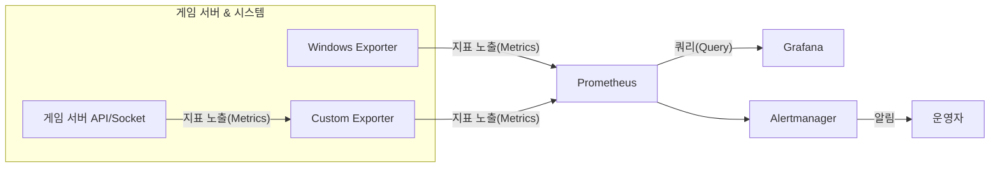

### 구성 요소 설명

* **Exporter**: 서버나 애플리케이션 상태를 **Prometheus가 읽을 수 있는 형태(Metrics)** 로 제공
* **Prometheus Server**: Exporter가 제공하는 Metrics를 주기적으로 수집(Scraping)하고 저장
* **Alertmanager**: Prometheus가 감지한 이상 상태를 알림으로 전송 (예: 이메일, 슬랙, SMS)
* **Grafana**: Prometheus에 저장된 데이터를 시각화하여 대시보드 형태로 보여줌

---

## 2-2. 주요 개념
Prometheus를 이해하려면 몇 가지 핵심 용어를 꼭 알고 있어야 합니다. 게임 서버 모니터링과 직결되므로 예시와 함께 설명하겠습니다.

### 1) Metric (메트릭)
Metric은 **모니터링 지표**를 의미합니다.
예를 들어 게임 API 서버에서는 다음과 같은 Metric을 기록할 수 있습니다.

* `api_request_count` : 초당 API 요청 수
* `api_error_count` : 초당 발생한 오류 수
* `socket_received_bytes` : 초당 받은 데이터 바이트 수
* `socket_sent_bytes` : 초당 보낸 데이터 바이트 수

Metric은 보통 다음과 같은 형식으로 제공됩니다:

```
api_request_count{method="POST",endpoint="/login"} 150
api_error_count{method="POST",endpoint="/login"} 3
```

여기서 `{method="POST",endpoint="/login"}`은 **레이블(Label)**이라고 하며, 지표를 더 세분화해줍니다. 즉, 단순히 "요청 수"가 아니라 "로그인 API의 POST 요청 수"까지 구분할 수 있게 해줍니다.

---

### 2) Exporter (익스포터)
Exporter는 **Metrics를 Prometheus가 읽을 수 있도록 변환해서 제공하는 모듈**입니다.
대표적인 예로는:

* **Windows Exporter** : CPU, 메모리, 디스크, 네트워크 사용량 같은 OS 지표 제공
* **ASP.NET Core Exporter** : WebAPI 요청/응답 처리 상황 제공
* **Custom Exporter** : 우리가 직접 C#으로 만들어 게임 서버 내부 상태를 지표로 노출

ASCII 아트로 보면 Exporter의 역할은 이렇습니다:

```
[게임 서버 상태]
     │
     ▼
[Exporter 변환기]
     │
     ▼
[Prometheus가 읽을 수 있는 Metrics 형태]
```

---

### 3) Scraping (스크래핑)
Prometheus는 Exporter가 제공하는 Metrics를 **주기적으로 가져오는 작업**을 합니다.
예를 들어 5초마다 한 번씩 API 서버의 상태를 확인하고 기록하는 식입니다.

이 과정을 "Pull 방식 모니터링"이라고 합니다.
즉, Prometheus가 직접 Exporter에게 "데이터 있니?"라고 물어보는 구조입니다.

---

### 4) Alert (알람)
모니터링의 핵심은 단순히 데이터 수집이 아니라, **이상 상황을 빠르게 알려주는 것**입니다.
Prometheus는 수집한 데이터를 기반으로 특정 조건이 충족되면 Alertmanager를 통해 알람을 발생시킵니다.

예시 조건:

* API 에러율이 5% 이상일 때
* CPU 사용률이 90% 이상일 때
* 소켓 서버 방(Room) 수가 비정상적으로 급증할 때

---

## 2-3. Grafana와의 연동
Prometheus는 데이터를 모으는 데 강력하지만, 시각화는 다소 단순합니다.
이 한계를 보완하는 도구가 바로 **Grafana**입니다.

* Grafana는 Prometheus를 데이터 소스로 연결하여 **대시보드 형태**로 지표를 보여줍니다.
* 단순 숫자가 아니라 **그래프, 차트, 게이지** 등으로 시각화되기 때문에 운영자가 직관적으로 상황을 파악할 수 있습니다.

예시 ASCII 그림:

```
[Prometheus 데이터] → [Grafana 대시보드]
      150          →   ┌───────────────┐
      200          →   │ API 요청 수 ↑ │
      350          →   └───────────────┘
```

---

## 2-4. 정리

* Prometheus는 **시계열 데이터 기반 모니터링 시스템**이다.
* **Metric, Exporter, Scraping, Alert** 개념을 이해하는 것이 필수.
* Prometheus는 데이터를 모으고, Alertmanager는 알람을 보내고, Grafana는 시각화를 담당한다.
* 게임 서버 모니터링에서는 API 서버/소켓 서버 지표를 Exporter를 통해 수집하고, Prometheus로 기록하며, Grafana에서 한눈에 확인할 수 있다.

---
    
    
# 3. Windows에서 Prometheus 설치하기
앞 장에서 Prometheus의 아키텍처와 개념을 이해했으니, 이제 실제로 Windows 환경에 Prometheus를 설치해 보겠습니다.
대부분의 대학생들은 리눅스보다는 Windows에서 개발 환경을 구축하는 경우가 많으므로, 이 장에서는 Windows 기준으로 설명합니다.


## 3-1. Prometheus 다운로드 & 실행

### 1) Prometheus 다운로드
Prometheus는 [공식 사이트](https://prometheus.io/download/)에서 다운로드할 수 있습니다.
Windows용 실행 파일(zip 형식)이 제공되므로, 간단히 압축을 풀면 됩니다.

1. `prometheus-x.x.x.windows-amd64.zip` 파일 다운로드
2. 원하는 위치(예: `C:\Prometheus`)에 압축 해제

압축을 풀면 다음과 같은 파일들이 있습니다:

```
C:\Prometheus
 ├─ prometheus.exe
 ├─ promtool.exe
 ├─ prometheus.yml
 ├─ console_libraries\
 └─ consoles\
```

* **prometheus.exe** → Prometheus 서버 실행 파일
* **promtool.exe** → 설정 검증 및 쿼리 테스트 도구
* **prometheus.yml** → Prometheus 설정 파일 (가장 중요)
* **console\_libraries, consoles** → 웹 콘솔 템플릿

---

### 2) Prometheus 실행하기
압축을 푼 폴더에서 명령 프롬프트(cmd)나 PowerShell을 열고 아래 명령을 실행합니다.

```powershell
cd C:\Prometheus
prometheus.exe --config.file=prometheus.yml
```

실행이 정상적으로 되면, 다음과 같은 로그가 출력됩니다:

```
level=info ts=2025-01-01T12:00:00.000Z caller=main.go:xxx msg="Starting Prometheus" version="x.x.x"
level=info ts=2025-01-01T12:00:00.001Z caller=main.go:xxx msg="Server is ready to receive web requests."
```

이제 브라우저에서 [http://localhost:9090](http://localhost:9090)에 접속하면 Prometheus 웹 UI를 볼 수 있습니다.

ASCII 아트로 흐름을 표현하면:

```
[Windows PC]
   │
   ▼
[prometheus.exe 실행]
   │
   ▼
[http://localhost:9090 대시보드 접속]
```

---

## 3-2. 기본 설정 파일 이해 (prometheus.yml)
Prometheus의 동작은 `prometheus.yml` 파일에서 정의됩니다.
처음에는 내용이 다소 복잡해 보이지만, 핵심은 **Scrape Config(어떤 지표를, 어디에서, 얼마나 자주 수집할 것인가)** 입니다.

기본 설정 예시:

```yaml
global:
  scrape_interval: 15s  # 15초마다 수집

scrape_configs:
  - job_name: "prometheus"
    static_configs:
      - targets: ["localhost:9090"]
```

### 설명

* **global.scrape\_interval** : 모든 지표 수집 주기를 지정 (기본값 15초)
* **scrape\_configs** : 어떤 대상을 모니터링할지 정의
* **job\_name** : 모니터링 작업 이름 (ex: "prometheus", "windows", "gameserver")
* **targets** : 수집할 대상의 주소 (IP:포트 형식)

즉, 위 설정은 Prometheus 자신(9090 포트)을 모니터링하도록 되어 있습니다.

---

## 3-3. Windows Exporter(WinExporter) 설치와 활용
게임 서버를 모니터링하려면 OS 자체 상태(예: CPU, 메모리, 네트워크)를 먼저 수집하는 것이 좋습니다.
Windows에서는 **Windows Exporter (이전 이름: WMI Exporter)** 를 사용합니다.

### 1) Windows Exporter 다운로드 & 설치
1. [Windows Exporter GitHub Releases](https://github.com/prometheus-community/windows_exporter/releases)에서 최신 MSI 설치 파일 다운로드
2. `windows_exporter-xxx-amd64.msi` 실행 후 설치 진행
3. 설치가 끝나면 자동으로 Windows 서비스에 등록되어 실행됩니다.

기본적으로 `http://localhost:9182/metrics`에서 지표를 확인할 수 있습니다.
브라우저에 입력하면 수많은 텍스트 지표가 출력됩니다:

```
# HELP windows_cpu_time_total Time that processor spent in different modes (ms)
windows_cpu_time_total{core="0",mode="user"} 123456.0
windows_cpu_time_total{core="0",mode="system"} 7890.0
```

---

### 2) Prometheus 설정에 Windows Exporter 추가
이제 `prometheus.yml` 파일을 수정해 Windows Exporter를 모니터링 대상으로 등록합니다.

```yaml
scrape_configs:
  - job_name: "prometheus"
    static_configs:
      - targets: ["localhost:9090"]

  - job_name: "windows"
    static_configs:
      - targets: ["localhost:9182"]
```

Prometheus를 재실행하면 Windows Exporter에서 수집한 지표가 자동으로 기록됩니다.

---

### 3) 확인하기
Prometheus 웹 UI([http://localhost:9090](http://localhost:9090))에서 `windows_cpu_time_total` 같은 지표를 검색하면 그래프를 볼 수 있습니다.

머메이드 다이어그램으로 정리해보면:

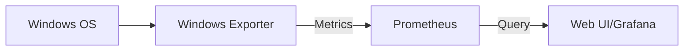

---

## 3-4. 정리

* Prometheus는 **설치형 단일 실행 파일**로, Windows에서도 간단히 실행 가능하다.
* 설정 파일 `prometheus.yml`은 **Scrape Config**가 핵심이다.
* Windows Exporter를 설치하면 CPU, 메모리, 네트워크 등 OS 지표를 바로 수집할 수 있다.
* 이제 우리는 OS 수준에서 기본 모니터링을 할 수 있으며, 다음 단계에서는 **Grafana와 연동하여 시각화**를 배운다.

---    
    
    
# 4. Grafana 설치와 시각화
Prometheus는 데이터를 수집하고 저장하는 강력한 도구지만, **데이터를 눈으로 쉽게 이해하기는 어렵습니다.** 바로 여기서 **Grafana**가 등장합니다. Grafana는 Prometheus와 같은 데이터 소스를 연결하여, 다양한 차트와 대시보드를 통해 **시각적으로 직관적인 모니터링 환경**을 제공합니다.

이 장에서는 다음을 배웁니다:

1. Grafana 설치하기
2. Prometheus 데이터 소스 연결하기
3. 기본 대시보드 생성하기
  
  
## 4.1 Grafana 설치하기

### (1) Grafana 다운로드
Grafana는 [공식 홈페이지](https://grafana.com/grafana/download)에서 설치 파일을 받을 수 있습니다. Windows 환경을 기준으로 설명하겠습니다.

1. Grafana 다운로드 페이지 접속
2. **Windows Installer (MSI)** 선택
3. 다운로드 후 더블클릭하여 설치 진행

---

### (2) 설치 과정
설치 마법사가 실행되면 기본 옵션 그대로 두고 진행해도 무방합니다.

* 설치 경로: `C:\Program Files\GrafanaLabs\grafana` (기본값)
* 서비스 등록: 기본값으로 **Windows 서비스로 등록**됨 → 재부팅 후에도 자동 실행

---

### (3) Grafana 실행 확인
설치가 끝나면 자동으로 Windows 서비스로 실행됩니다. 브라우저를 열고 아래 주소로 접속해 봅시다.

```
http://localhost:3000
```

정상적으로 실행되었다면 Grafana 로그인 화면이 보입니다.

* 기본 ID: `admin`
* 기본 PW: `admin`

첫 로그인 시 비밀번호 변경을 요청합니다. 간단히 `admin1234` 같은 비밀번호로 변경해 주세요.

---

## 4.2 Prometheus 데이터 소스 연결하기
이제 Prometheus와 Grafana를 연결해 보겠습니다.

Prometheus는 기본적으로 9090 포트에서 실행되므로, Grafana에서 Prometheus를 데이터 소스로 추가해야 합니다.

### (1) 데이터 소스 추가
1. Grafana 왼쪽 메뉴에서 ⚙️(기어 모양, **Configuration**) 클릭
2. **Data sources** 선택
3. **Add data source** 버튼 클릭
4. 목록에서 **Prometheus** 선택

---

### (2) Prometheus URL 입력
다음 화면에서 Prometheus 서버 주소를 입력합니다.

```
http://localhost:9090
```

> Prometheus가 같은 PC에서 실행 중이므로 localhost 사용.
> 만약 다른 서버에서 실행 중이라면 해당 서버의 IP를 입력해야 합니다.

---

### (3) 연결 테스트

* `Save & test` 버튼 클릭
* "Data source is working" 메시지가 뜨면 연결 완료! 🎉

---

## 4.3 기본 대시보드 생성

### (1) 새 대시보드 만들기
1. Grafana 왼쪽 메뉴에서 ➕ (플러스 아이콘) 클릭
2. **Dashboard** 선택
3. `Add new panel` 클릭

---

### (2) Prometheus 쿼리 작성
여기서는 간단히 **Prometheus에서 제공하는 기본 메트릭**을 활용해 보겠습니다.

#### 예제: 서버 CPU 사용률
Prometheus는 `process_cpu_seconds_total` 같은 메트릭을 제공합니다.
이를 초당 사용률로 바꾸려면 **rate 함수**를 활용합니다.

```promql
rate(process_cpu_seconds_total[1m])
```

#### 예제: 메모리 사용량

```promql
process_resident_memory_bytes
```

---

### (3) 그래프 스타일 설정
Grafana 패널에서는 차트의 종류를 고를 수 있습니다:

* **Time series (기본)** → 시간에 따라 값 변화를 선 그래프로 표시
* **Gauge** → 현재 상태를 원형 게이지로 표시
* **Stat** → 숫자만 크게 표시

예를 들어 CPU 사용률은 Time series 그래프로, 메모리 사용량은 Gauge로 표시하면 직관적입니다.

---

### (4) 대시보드 저장
패널 구성을 마쳤다면 오른쪽 위 `Apply` 클릭 → 대시보드로 저장합니다.
이제 **나만의 모니터링 화면**이 완성되었습니다.

---

## 4.4 예시 다이어그램
아래는 Prometheus와 Grafana가 어떻게 연동되는지를 간단히 표현한 다이어그램입니다.

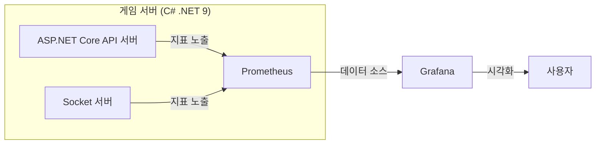

---

## 4.5 학습 예제: 나만의 첫 대시보드 만들기
이제 실제로 한 번 실습해 보겠습니다.

1. Prometheus에서 `node_cpu_seconds_total` 메트릭 확인

   * 브라우저에서 `http://localhost:9090` 접속
   * Expression에 `rate(node_cpu_seconds_total[1m])` 입력

2. Grafana에서 새 패널 생성

   * Query에 동일한 PromQL 작성
   * 그래프 확인

3. 게임 서버 지표 연결 준비

   * 나중에 **API 요청 수, 소켓 서버 데이터량** 같은 지표도 Prometheus에 노출하면
   * 동일한 방식으로 Grafana에서 시각화 가능

---

## 요약

* Grafana는 Prometheus 데이터를 **시각적으로 표현**하는 도구다.
* 설치 후 `http://localhost:3000`에서 접속 가능하다.
* Prometheus를 데이터 소스로 추가하고, 쿼리를 작성해 대시보드를 구성한다.
* 간단한 CPU, 메모리 지표부터 시작해, 나중에 **게임 서버 전용 지표**까지 확장 가능하다.

---
    
     
# 5. ASP.NET Core WebAPI 게임 서버 만들기 (예제용)
이 장에서는 **ASP.NET Core WebAPI**를 이용하여 아주 단순한 형태의 게임 서버를 만들어 보겠습니다.
이 서버는 모니터링을 위해 준비된 **실습용 서버**이며, 실제 상용 게임 서버처럼 복잡할 필요는 없습니다.

우리가 목표로 하는 단계는 다음과 같습니다:

1. 최소한의 WebAPI 서버 만들기
2. API 호출 로그 남기기
3. Prometheus.NET 라이브러리 소개
  
  
## 5.1 최소한의 WebAPI 서버 만들기 (C# 코드 예제)

### (1) 프로젝트 생성하기
먼저 .NET 9 SDK가 설치되어 있어야 합니다. 설치 후, 새로운 WebAPI 프로젝트를 생성합니다.

```bash
dotnet new webapi -n GameServer.Api
cd GameServer.Api
```

이렇게 하면 `GameServer.Api`라는 이름의 폴더가 생기고, 기본 ASP.NET Core WebAPI 템플릿이 만들어집니다.
  
  
### (2) 간단한 컨트롤러 작성하기
이제 **게임 서버용 API**를 하나 만들어 봅시다. 예를 들어 “플레이어 로그인”을 흉내 내는 API입니다.

`Controllers/GameController.cs` 파일을 생성하고 아래 코드를 작성합니다.

```csharp
using Microsoft.AspNetCore.Mvc;

namespace GameServer.Api.Controllers;

[ApiController]
[Route("api/[controller]")]
public class GameController : ControllerBase
{
    // 단순 로그인 API
    [HttpPost("login")]
    public IActionResult Login([FromBody] LoginRequest request)
    {
        if (string.IsNullOrEmpty(request.PlayerId))
        {
            return BadRequest("PlayerId is required");
        }

        // 실제 로직 대신 간단히 응답
        return Ok(new { Message = $"Welcome, {request.PlayerId}!" });
    }
}

public class LoginRequest
{
    public string PlayerId { get; set; } = "";
}
```

---

### (3) 서버 실행하기
이제 서버를 실행해 봅시다.

```bash
dotnet run
```

실행하면 콘솔에 다음과 같은 로그가 뜹니다.

```
Now listening on: http://localhost:5000
Now listening on: https://localhost:7000
```

브라우저에서 `https://localhost:7000/swagger`에 접속하면, 자동으로 생성된 Swagger UI에서 API를 테스트할 수 있습니다.

---

### ASCII 다이어그램: 요청 흐름

```plaintext
[클라이언트] ---> POST /api/game/login ---> [게임서버(WebAPI)]
      |                                             |
      |------------------ JSON 응답 ----------------|
```

---

## 5.2 API 호출 로그 남기기
모니터링을 위해서는 **API가 얼마나 자주 호출되는지, 어떤 결과를 내는지** 알아야 합니다.
가장 간단한 방법은 \*\*미들웨어(Middleware)\*\*를 추가하여 **모든 요청을 기록**하는 것입니다.

### (1) 간단한 로깅 미들웨어 만들기
`Middleware/RequestLoggingMiddleware.cs` 파일을 생성합니다.

```csharp
using System.Diagnostics;

namespace GameServer.Api.Middleware;

public class RequestLoggingMiddleware
{
    private readonly RequestDelegate _next;
    private readonly ILogger<RequestLoggingMiddleware> _logger;

    public RequestLoggingMiddleware(RequestDelegate next, ILogger<RequestLoggingMiddleware> logger)
    {
        _next = next;
        _logger = logger;
    }

    public async Task Invoke(HttpContext context)
    {
        var stopwatch = Stopwatch.StartNew();

        await _next(context);

        stopwatch.Stop();
        var path = context.Request.Path;
        var statusCode = context.Response.StatusCode;

        _logger.LogInformation("API 요청: {Path}, 상태코드: {StatusCode}, 실행시간: {Elapsed}ms",
            path, statusCode, stopwatch.ElapsedMilliseconds);
    }
}
```

---

### (2) 미들웨어 등록하기

`Program.cs` 파일에서 등록합니다.

```csharp
using GameServer.Api.Middleware;

var builder = WebApplication.CreateBuilder(args);
builder.Services.AddControllers();
builder.Services.AddEndpointsApiExplorer();
builder.Services.AddSwaggerGen();

var app = builder.Build();

app.UseMiddleware<RequestLoggingMiddleware>(); // 로그 미들웨어 추가
app.UseAuthorization();
app.MapControllers();
app.Run();
```

---

### (3) 실행 결과
API를 호출하면 콘솔 로그에 다음과 같이 출력됩니다.

```
info: GameServer.Api.Middleware.RequestLoggingMiddleware[0]
      API 요청: /api/game/login, 상태코드: 200, 실행시간: 12ms
```

이렇게 하면 **API 호출 건수, 실행 시간, 에러 발생 여부**를 쉽게 확인할 수 있습니다.

---

## 5.3 Prometheus.NET 라이브러리 소개
지금까지는 **로그**를 남기는 방식으로만 확인했습니다. 하지만 Prometheus는 **수치 기반의 메트릭**을 수집해야 하므로, 로그 대신 **메트릭 엔드포인트**를 제공해야 합니다.

이를 쉽게 해주는 라이브러리가 바로 **Prometheus.NET**입니다.

### (1) 라이브러리 설치
NuGet을 이용해 설치합니다.

```bash
dotnet add package prometheus-net.AspNetCore
```

---

### (2) Program.cs에 추가하기

```csharp
using Prometheus;

var builder = WebApplication.CreateBuilder(args);
builder.Services.AddControllers();
builder.Services.AddEndpointsApiExplorer();
builder.Services.AddSwaggerGen();

var app = builder.Build();

// Prometheus 메트릭 수집용 미들웨어
app.UseHttpMetrics(); 
app.MapControllers();

// /metrics 엔드포인트 제공
app.MapMetrics();

app.Run();
```

---

### (3) 결과 확인
서버 실행 후 브라우저에서 아래 주소로 접속해 보세요.

```
http://localhost:5000/metrics
```

그러면 Prometheus가 수집할 수 있는 메트릭 값들이 노출됩니다.

예시 출력:

```plaintext
# HELP http_requests_received_total Count of HTTP requests
# TYPE http_requests_received_total counter
http_requests_received_total{method="post",code="200",controller="Game",action="Login"} 5
```

---

### Mermaid 다이어그램: 전체 구조

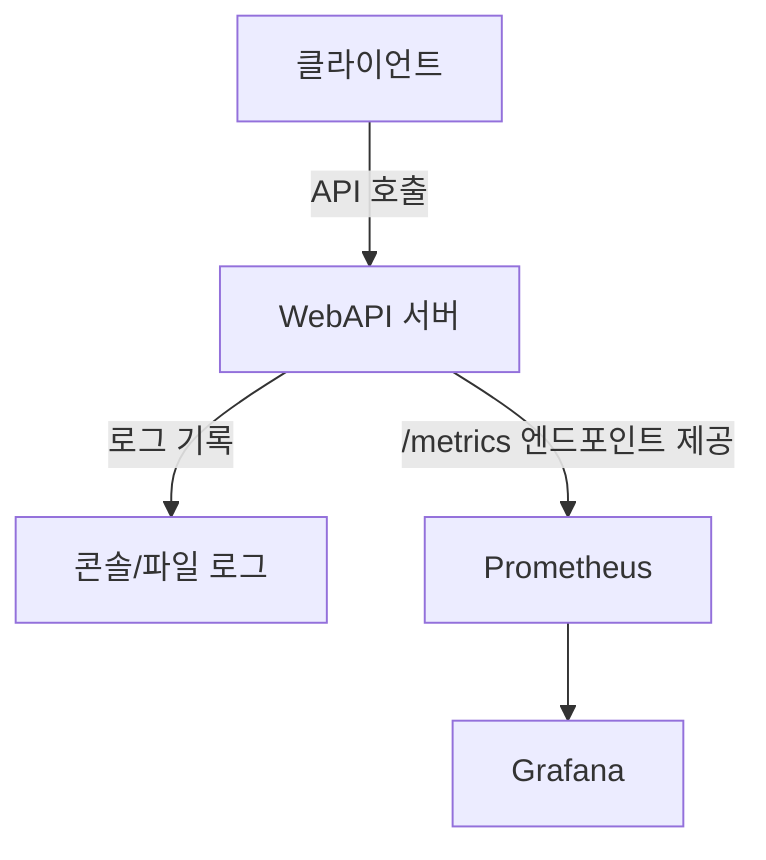

---

## 요약

* **최소한의 WebAPI 서버**를 만들어 Swagger로 테스트했다.
* **로깅 미들웨어**를 추가해 API 호출 로그를 남겼다.
* **Prometheus.NET 라이브러리**를 통해 `/metrics` 엔드포인트를 노출했다.
* 앞으로 Prometheus와 Grafana에서 이 지표들을 활용해 **API 요청 수, 에러율, 실행 시간** 등을 모니터링할 수 있다.
  
  
---
  
  

# 6. API 서버 모니터링 지표 수집
앞 장(5장)에서는 ASP.NET Core WebAPI로 **간단한 게임 서버**를 만들었습니다. 이제부터는 그 서버를 **Prometheus와 Grafana로 모니터링**할 수 있도록 **지표(Metrics)** 를 수집해 보겠습니다.

우리가 다룰 지표는 다음과 같습니다:

1. 초당 요청 수 (RPS: Requests Per Second)
2. 초당 에러 발생 수
3. 총 요청 수
4. 실습: Prometheus에서 지표 확인
  
  
## 6.1 모니터링 지표란?
서버를 운영하다 보면 단순히 "서버가 켜져 있다"는 것만으로는 충분하지 않습니다.
**“얼마나 많은 요청이 들어오고 있는지, 그 중 몇 건이 에러로 끝나는지”** 같은 정보가 필요합니다.

예를 들어:

* 게임 로그인 API가 초당 100번 호출되고 있다 → 서버 부하가 증가 중임을 알 수 있음
* 그 중 20%가 에러를 반환한다 → 문제 발생! 빠른 점검 필요

즉, **모니터링 지표(Metrics)** 는 서버 운영자가 문제를 빠르게 인지하고 원인을 파악할 수 있게 해줍니다.
  
  
## 6.2 Prometheus.NET으로 지표 수집하기
앞 장에서 `prometheus-net` 라이브러리를 추가하여 `/metrics` 엔드포인트를 노출했습니다.
이제 우리가 원하는 **맞춤형 지표(Custom Metrics)** 를 추가해 보겠습니다.

### (1) NuGet 패키지 설치 확인

```bash
dotnet add package prometheus-net.AspNetCore
```

---

### (2) 지표 등록하기
지표는 크게 세 가지 유형을 사용합니다.

* **Counter** : 누적 값 (총 요청 수, 총 에러 수 등)
* **Gauge** : 현재 상태 값 (메모리 사용량 등)
* **Histogram / Summary** : 분포와 퍼센트타일 (응답 시간 측정 등)

이번 장에서는 **Counter**를 중심으로 사용합니다.

---

## 6.3 초당 요청 수 (RPS) 측정

### (1) Counter 만들기

`Metrics/GameMetrics.cs` 파일을 만들어 지표를 정의합니다.

```csharp
using Prometheus;

namespace GameServer.Api.Metrics;

public static class GameMetrics
{
    // API 요청 수 (총합)
    public static readonly Counter ApiRequestTotal =
        Metrics.CreateCounter("game_api_requests_total", "총 API 요청 수", 
            new CounterConfiguration
            {
                LabelNames = new[] { "method", "endpoint" }
            });
}
```

---

### (2) 미들웨어에서 증가시키기

이제 API가 호출될 때마다 Counter 값을 증가시켜야 합니다.
앞서 만든 `RequestLoggingMiddleware`에 Prometheus 카운터 로직을 추가합니다.

```csharp
using GameServer.Api.Metrics;

public async Task Invoke(HttpContext context)
{
    await _next(context);

    var path = context.Request.Path;
    var method = context.Request.Method;

    // 요청 수 카운터 증가
    GameMetrics.ApiRequestTotal
        .WithLabels(method, path)
        .Inc();
}
```

---

### (3) PromQL로 RPS 계산하기

Prometheus에서 \*\*초당 요청 수(RPS)\*\*를 보려면 다음 쿼리를 실행합니다:

```promql
rate(game_api_requests_total[1m])
```

이 쿼리는 최근 1분 동안의 요청 수 증가율을 계산하여 **초당 몇 건의 요청이 들어오는지**를 보여줍니다.

---

## 6.4 초당 에러 발생 수 측정

요청 수만큼 중요한 것이 바로 **에러 발생 건수**입니다.

### (1) 에러 카운터 정의

```csharp
public static readonly Counter ApiErrorTotal =
    Metrics.CreateCounter("game_api_errors_total", "총 API 에러 수",
        new CounterConfiguration
        {
            LabelNames = new[] { "method", "endpoint", "status_code" }
        });
```

---

### (2) 미들웨어에 적용

```csharp
var statusCode = context.Response.StatusCode;

// 에러 발생 시 카운터 증가
if (statusCode >= 400)
{
    GameMetrics.ApiErrorTotal
        .WithLabels(method, path, statusCode.ToString())
        .Inc();
}
```

---

### (3) PromQL 쿼리

```promql
rate(game_api_errors_total[1m])
```

이제 Grafana에서 **에러 발생률 그래프**를 그릴 수 있습니다.

---

## 6.5 총 요청 수 확인

총 요청 수는 Counter 기본값을 그대로 사용하면 됩니다.
예를 들어 특정 API의 총 호출 수를 보려면:

```promql
game_api_requests_total{endpoint="/api/game/login"}
```

---

## 6.6 실습: Prometheus로 지표 확인
이제 직접 실습을 해보겠습니다.

1. 서버 실행

   ```bash
   dotnet run
   ```

2. Prometheus에서 지표 수집 확인
   `http://localhost:5000/metrics` 접속 → 아래와 같은 값이 출력됨

   ```plaintext
   # HELP game_api_requests_total 총 API 요청 수
   # TYPE game_api_requests_total counter
   game_api_requests_total{method="POST",endpoint="/api/game/login"} 7
   ```

3. Prometheus 쿼리 실행
   브라우저에서 `http://localhost:9090` → Expression 입력창에

   ```promql
   rate(game_api_requests_total[1m])
   ```

   입력 후 실행 → 초당 요청 수 그래프 확인 가능

---

## ASCII 아트: 데이터 흐름

```plaintext
[클라이언트] -- API 요청 --> [ASP.NET Core WebAPI 서버]
       |                             |
       |                       [Prometheus Counter 증가]
       |                             |
       | <-- 응답 -------------------|
                                     |
                        /metrics 엔드포인트 노출
                                     |
                               [Prometheus]
                                     |
                               [Grafana 시각화]
```

---

## Mermaid 다이어그램: 지표 수집과 활용

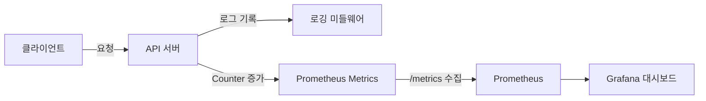
  
  
## 요약

* **Counter 지표**를 이용해 API 호출 수와 에러 발생 수를 기록했다.
* Prometheus에서 `rate()` 함수를 사용해 **초당 요청 수(RPS), 에러 발생 수**를 계산할 수 있다.
* `/metrics` 엔드포인트를 통해 API 서버의 상태를 **수치 기반 모니터링**이 가능해졌다.
* 이제 Grafana와 연결하면 **예쁜 대시보드**로 시각화할 수 있다.
  
  
---
  
  
# 7. Socket 기반 게임 서버 만들기 (예제용)
게임 서버를 만드는 방식에는 여러 가지가 있습니다. 그중에서 **Socket 기반 서버**는 클라이언트와 실시간으로 데이터를 주고받아야 하는 상황에서 많이 사용됩니다. 예를 들어, **실시간 대전 게임**, **채팅**, **멀티플레이 룸 관리** 등이 대표적인 사례입니다. 이 장에서는 가장 단순한 형태의 **Echo 서버**를 만들어 보면서 Socket 프로그래밍의 기초를 익히고, 이후 Prometheus 모니터링 지표를 수집할 수 있는 발판을 마련하겠습니다.
  
  
## 7.1 C#에서 Socket 서버 구축

### Socket이란?
Socket은 네트워크 통신의 기본 단위입니다.
서버와 클라이언트가 데이터를 주고받기 위해서는 **IP 주소**와 **포트 번호**가 필요합니다.

* **서버**: 특정 포트를 열어두고 클라이언트 요청을 기다림 (Listen).
* **클라이언트**: 해당 IP와 포트로 접속을 요청 (Connect).
* **통신**: 양쪽이 연결되면 데이터를 송수신 (Send/Receive).

머메이드 다이어그램으로 표현하면 다음과 같습니다:

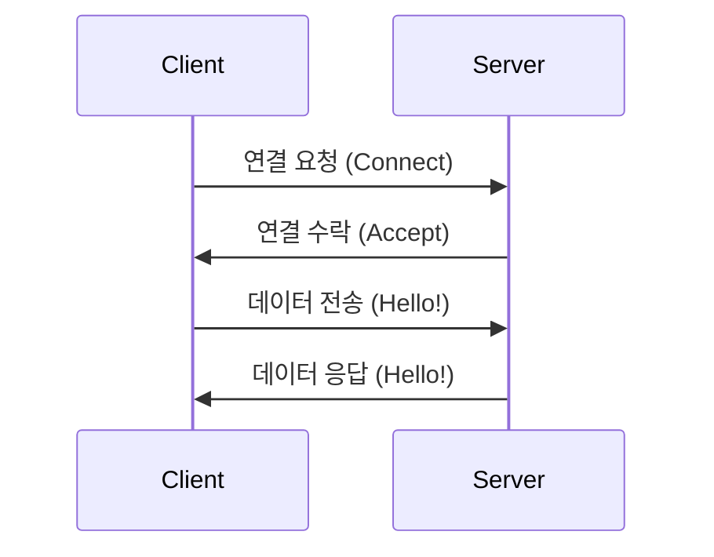

---

### 기본 코드: 간단한 서버 열기
다음은 .NET 9 C#에서 가장 기초적인 TCP 서버 코드 예제입니다.

```csharp
using System.Net;
using System.Net.Sockets;
using System.Text;

class Program
{
    static async Task Main(string[] args)
    {
        int port = 5000;
        var listener = new TcpListener(IPAddress.Any, port);
        listener.Start();
        Console.WriteLine($"[서버 시작] 포트 {port}에서 클라이언트 접속 대기 중...");

        while (true)
        {
            var client = await listener.AcceptTcpClientAsync();
            Console.WriteLine("[클라이언트 접속 성공]");
            _ = HandleClientAsync(client); // 클라이언트 처리를 비동기로 실행
        }
    }

    static async Task HandleClientAsync(TcpClient client)
    {
        using var stream = client.GetStream();
        byte[] buffer = new byte[1024];

        while (true)
        {
            int byteCount = await stream.ReadAsync(buffer, 0, buffer.Length);
            if (byteCount == 0) break; // 클라이언트 종료

            string request = Encoding.UTF8.GetString(buffer, 0, byteCount);
            Console.WriteLine($"[수신] {request}");

            string response = $"Echo: {request}";
            byte[] responseBytes = Encoding.UTF8.GetBytes(response);
            await stream.WriteAsync(responseBytes, 0, responseBytes.Length);
        }

        Console.WriteLine("[클라이언트 연결 종료]");
    }
}
```

---

## 7.2 클라이언트 연결/해제 처리
Socket 서버는 여러 클라이언트를 동시에 처리해야 합니다. 따라서 각 클라이언트 연결을 **별도의 Task (비동기 처리)** 로 관리해야 합니다. 위 코드에서 `_ = HandleClientAsync(client);` 부분이 그 역할을 합니다.

아래는 연결 및 해제를 ASCII 아트로 단순하게 표현한 예시입니다:

```
서버(5000 포트) ---- 클라이언트1 연결
                  ---- 클라이언트2 연결
                  ---- 클라이언트3 연결

[연결 관리 예시]
- 클라이언트1: 접속 중
- 클라이언트2: 접속 중
- 클라이언트3: 종료됨
```

---

## 7.3 간단한 Echo 서버 구현
Echo 서버는 클라이언트가 보낸 데이터를 그대로 되돌려주는 서버입니다. **학습용으로 최적**입니다.

### 클라이언트 코드 예제
간단히 클라이언트도 만들어서 서버와의 통신을 확인해봅시다.

```csharp
using System.Net.Sockets;
using System.Text;

class Client
{
    static async Task Main(string[] args)
    {
        using var client = new TcpClient();
        await client.ConnectAsync("127.0.0.1", 5000);
        Console.WriteLine("[서버 연결 성공]");

        using var stream = client.GetStream();
        while (true)
        {
            Console.Write("메시지 입력: ");
            string message = Console.ReadLine() ?? "";
            if (message == "exit") break;

            byte[] buffer = Encoding.UTF8.GetBytes(message);
            await stream.WriteAsync(buffer, 0, buffer.Length);

            byte[] responseBuffer = new byte[1024];
            int byteCount = await stream.ReadAsync(responseBuffer, 0, responseBuffer.Length);
            string response = Encoding.UTF8.GetString(responseBuffer, 0, byteCount);

            Console.WriteLine($"[서버 응답] {response}");
        }
    }
}
```

---

## 7.4 실행 흐름 예시
실제 실행했을 때 흐름은 다음과 같습니다:

```
서버 실행:
[서버 시작] 포트 5000에서 클라이언트 접속 대기 중...

클라이언트 실행:
[서버 연결 성공]
메시지 입력: Hello
[서버 응답] Echo: Hello
메시지 입력: 게임 시작!
[서버 응답] Echo: 게임 시작!
메시지 입력: exit
```

---

## 7.5 학습 포인트 정리
1. **Socket 프로그래밍 기본**: 서버는 Listen, 클라이언트는 Connect.
2. **비동기 처리**: 여러 클라이언트를 동시에 처리하기 위해 async/await 사용.
3. **Echo 서버**: 실습용으로 가장 단순하면서도 네트워크 흐름을 이해하기 좋은 예제.
4. **다음 단계**: 이 서버를 확장하여 게임 로직(방 생성, 게임 시작/종료 이벤트)을 붙이고, Prometheus 지표를 수집할 예정.

  
---
  
  
# 8. Socket 서버 모니터링 지표 수집
Socket 서버는 **실시간 게임 통신**에서 핵심적인 역할을 합니다. 따라서 서버가 정상적으로 작동하는지, 클라이언트와의 네트워크 데이터 송수신이 잘 이뤄지는지, 그리고 게임 룸(Room)의 상태를 모니터링하는 것은 매우 중요합니다. 이번 장에서는 Prometheus와 연계하여 **Socket 서버의 주요 성능 지표**를 수집하고 시각화하는 방법을 살펴봅니다.
  
  
## 8.1 모니터링할 지표 정의
먼저, 어떤 지표를 추적할지 정해야 합니다. 이 장에서는 다음 네 가지를 다룹니다:

1. **초당 받은 데이터량 (bytes received per second)**
   클라이언트 → 서버로 들어오는 네트워크 데이터의 양

2. **초당 보낸 데이터량 (bytes sent per second)**
   서버 → 클라이언트로 전송되는 네트워크 데이터의 양

3. **방(Room) 개수**
   현재 서버에 생성된 게임 방의 수

4. **게임 시작/종료 수**
   일정 기간 동안 시작된 게임의 수와 종료된 게임의 수

이 지표들은 게임 운영에 매우 실용적입니다. 예를 들어, 데이터 송수신량 급증은 **네트워크 과부하**를 의미할 수 있고, 방 개수와 게임 시작/종료 수는 **서버의 사용 현황**을 보여줍니다.

---

## 8.2 Prometheus .NET 라이브러리 설치
C#에서 Prometheus 지표를 쉽게 노출하려면 **prometheus-net** 라이브러리를 사용하는 것이 좋습니다. NuGet에서 설치할 수 있습니다:

```powershell
dotnet add package prometheus-net
```

이 라이브러리는 **HTTP 엔드포인트**를 통해 지표를 노출하고, Prometheus가 주기적으로 수집(scrape)할 수 있게 해줍니다.

---

## 8.3 지표를 위한 Counter와 Gauge 정의
Prometheus에서는 크게 두 가지 지표 타입을 많이 씁니다:

* **Counter**: 증가만 하는 값 (예: 게임 시작 수, 받은 데이터 총량)
* **Gauge**: 오르내리는 값 (예: 현재 방 개수, 현재 연결된 클라이언트 수)

Socket 서버에 필요한 지표들을 다음과 같이 정의할 수 있습니다:

```csharp
using Prometheus;

public static class MetricsRegistry
{
    // 초당 받은 데이터량 (총량을 기록하고, Grafana에서 rate() 함수로 초당 값 계산)
    public static readonly Counter ReceivedBytes = 
        Metrics.CreateCounter("socket_received_bytes_total", "Total bytes received from clients");

    // 초당 보낸 데이터량
    public static readonly Counter SentBytes = 
        Metrics.CreateCounter("socket_sent_bytes_total", "Total bytes sent to clients");

    // 현재 방(Room) 개수
    public static readonly Gauge RoomCount = 
        Metrics.CreateGauge("socket_room_count", "Current number of rooms");

    // 게임 시작/종료 수
    public static readonly Counter GameStarted = 
        Metrics.CreateCounter("socket_game_started_total", "Total number of games started");

    public static readonly Counter GameEnded = 
        Metrics.CreateCounter("socket_game_ended_total", "Total number of games ended");
}
```

---

## 8.4 Socket 서버 코드에 지표 연결하기
이제 서버 코드에서 각 이벤트가 발생할 때 위의 지표를 업데이트합니다.

### 데이터 송수신 시

```csharp
int byteCount = await stream.ReadAsync(buffer, 0, buffer.Length);
MetricsRegistry.ReceivedBytes.Inc(byteCount);  // 받은 데이터 기록
```

```csharp
await stream.WriteAsync(responseBytes, 0, responseBytes.Length);
MetricsRegistry.SentBytes.Inc(responseBytes.Length); // 보낸 데이터 기록
```

---

### 방(Room) 관리 예제
간단히 방을 관리하는 Dictionary를 두고, 생성/삭제 시 지표를 조정합니다.

```csharp
class RoomManager
{
    private Dictionary<int, string> rooms = new();
    private int roomIdCounter = 0;

    public int CreateRoom()
    {
        int roomId = ++roomIdCounter;
        rooms[roomId] = "New Room";
        MetricsRegistry.RoomCount.Inc();
        return roomId;
    }

    public void CloseRoom(int roomId)
    {
        if (rooms.Remove(roomId))
        {
            MetricsRegistry.RoomCount.Dec();
        }
    }
}
```

---

### 게임 시작/종료 이벤트

```csharp
public void StartGame()
{
    MetricsRegistry.GameStarted.Inc();
}

public void EndGame()
{
    MetricsRegistry.GameEnded.Inc();
}
```

---

## 8.5 Prometheus 엔드포인트 열기
Prometheus가 지표를 수집하려면 HTTP 엔드포인트가 필요합니다. `MetricServer`를 이용해 쉽게 열 수 있습니다.

```csharp
using Prometheus;

class Program
{
    static async Task Main(string[] args)
    {
        // Prometheus MetricServer 실행 (기본 포트: 1234)
        var server = new KestrelMetricServer(port: 1234);
        server.Start();

        Console.WriteLine("Prometheus metrics available at http://localhost:1234/metrics");

        // 여기서 Socket 서버 실행 코드 추가
        await RunSocketServer();
    }
}
```

---

## 8.6 Prometheus 설정
Prometheus 설정 파일(`prometheus.yml`)에 Socket 서버 지표 수집 대상을 추가합니다:

```yaml
scrape_configs:
  - job_name: "socket_server"
    static_configs:
      - targets: ["localhost:1234"]
```

---

## 8.7 Grafana에서 지표 확인하기 (실습)
Prometheus에 데이터가 쌓이면, Grafana에서 다음과 같은 쿼리로 시각화할 수 있습니다:

* 초당 받은 데이터량:

  ```
  rate(socket_received_bytes_total[1m])
  ```

* 초당 보낸 데이터량:

  ```
  rate(socket_sent_bytes_total[1m])
  ```

* 현재 방(Room) 개수:

  ```
  socket_room_count
  ```

* 게임 시작/종료 건수 (초당):

  ```
  rate(socket_game_started_total[1m])
  rate(socket_game_ended_total[1m])
  ```

---

## 8.8 전체 흐름 다이어그램

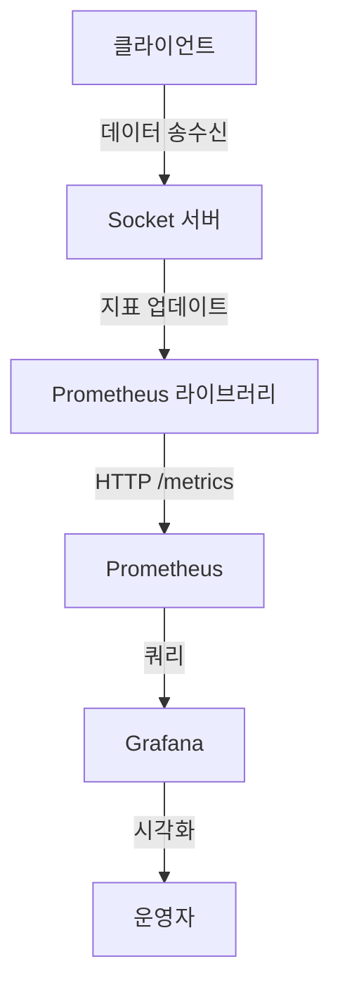

---

## 8.9 요약

* **Counter와 Gauge**를 활용하여 네트워크 데이터량, 방 개수, 게임 이벤트 수를 수집.
* `prometheus-net` 라이브러리로 간단히 HTTP 엔드포인트(`/metrics`) 제공.
* Prometheus 설정에 Socket 서버를 추가하여 지표 자동 수집.
* Grafana에서 rate() 함수를 사용해 초당 처리량을 시각화 가능.

  
---
   
  
# 9. 커스텀 Exporter 작성하기
지금까지는 Prometheus의 기본 기능과 `prometheus-net` 라이브러리를 사용해 서버 지표를 수집했습니다. 하지만 실제 게임 서버에서는 **게임 고유의 상태**를 모니터링하는 것이 중요합니다.
예를 들어:

* 현재 접속 중인 플레이어 수
* 매칭 대기열 길이
* 특정 맵에서 진행 중인 게임 수
* 서버 내부의 리소스(예: NPC AI 처리 큐 길이 등)

이런 지표들은 **기본 라이브러리로 자동 수집되지 않기 때문에**, 직접 **커스텀 Exporter**를 만들어야 합니다.

---

## 9.1 Exporter란 무엇인가?
**Exporter**는 Prometheus가 수집할 수 있는 형태(`HTTP /metrics` 엔드포인트)로 데이터를 변환해주는 프로그램입니다.

* **Node Exporter**: CPU, 메모리, 디스크 등 OS 수준 지표를 제공
* **Blackbox Exporter**: 외부 서비스 상태(HTTP, TCP, DNS 등)를 체크
* **커스텀 Exporter**: 게임 서버 내부 상태를 노출

머메이드 다이어그램으로 표현하면 다음과 같습니다:

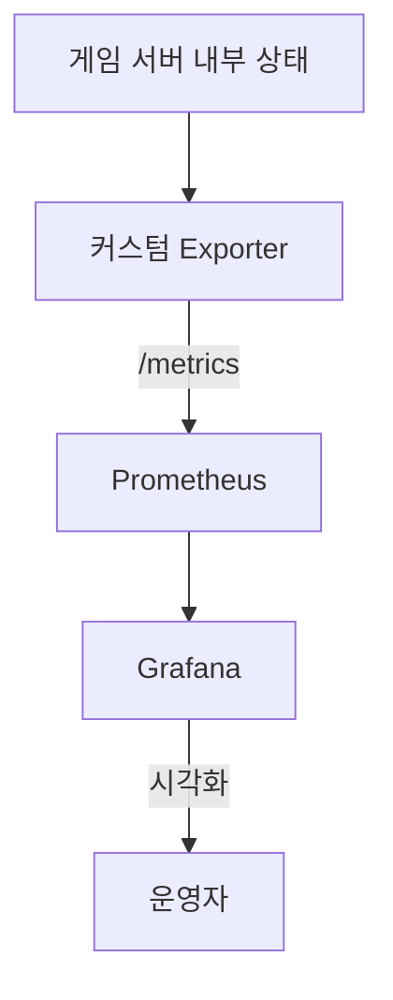

---

## 9.2 C#으로 Exporter 구현하기
우리는 `.NET 9` C# 콘솔 애플리케이션을 만들어서 Exporter 역할을 하도록 할 수 있습니다.

### NuGet 패키지 설치

```powershell
dotnet add package prometheus-net
```

### 기본 Exporter 코드

```csharp
using Prometheus;

class Program
{
    static async Task Main(string[] args)
    {
        // 1. /metrics 엔드포인트 오픈
        var server = new KestrelMetricServer(port: 9091);
        server.Start();

        Console.WriteLine("Custom Exporter running at http://localhost:9091/metrics");

        // 2. 지표 등록
        var playerCount = Metrics.CreateGauge("game_current_players", "현재 접속 중인 플레이어 수");
        var matchQueue = Metrics.CreateGauge("game_match_queue_length", "매칭 대기열 길이");
        var gamesRunning = Metrics.CreateGauge("game_running_matches", "현재 진행 중인 게임 수");

        // 3. 예제: 임의 데이터 갱신
        var random = new Random();
        while (true)
        {
            playerCount.Set(random.Next(50, 200));
            matchQueue.Set(random.Next(0, 30));
            gamesRunning.Set(random.Next(5, 20));

            await Task.Delay(5000); // 5초마다 갱신
        }
    }
}
```

이 코드를 실행하면 `http://localhost:9091/metrics` 에서 Prometheus 포맷으로 지표가 노출됩니다:

```
# HELP game_current_players 현재 접속 중인 플레이어 수
# TYPE game_current_players gauge
game_current_players 153

# HELP game_match_queue_length 매칭 대기열 길이
# TYPE game_match_queue_length gauge
game_match_queue_length 12

# HELP game_running_matches 현재 진행 중인 게임 수
# TYPE game_running_matches gauge
game_running_matches 8
```

---

## 9.3 게임 서버 내부 상태를 지표로 변환하기
실제 게임 서버에서는 단순히 랜덤 값을 넣는 대신, 서버 내부 상태를 참조해야 합니다.

### 예제: Socket 서버와 연동
앞서 만든 Socket 서버에서 `RoomManager`와 연결해봅시다.

```csharp
public class GameMetrics
{
    private readonly Gauge playerCount =
        Metrics.CreateGauge("game_current_players", "현재 접속 중인 플레이어 수");

    private readonly Gauge roomCount =
        Metrics.CreateGauge("game_room_count", "현재 방(Room) 개수");

    public void UpdatePlayerCount(int count)
    {
        playerCount.Set(count);
    }

    public void UpdateRoomCount(int count)
    {
        roomCount.Set(count);
    }
}
```

그리고 Socket 서버 코드에서 이벤트 발생 시 호출합니다:

```csharp
// 클라이언트 접속 시
metrics.UpdatePlayerCount(currentPlayers);

// 방 생성 시
metrics.UpdateRoomCount(currentRooms);
```

이렇게 하면 Exporter는 **실제 서버 상태 기반 지표**를 Prometheus에 제공하게 됩니다.

---

## 9.4 Prometheus에 등록하기
Prometheus 설정 파일(`prometheus.yml`)에 Exporter를 추가합니다.

```yaml
scrape_configs:
  - job_name: "game_custom_exporter"
    static_configs:
      - targets: ["localhost:9091"]
```

Prometheus를 재시작하면 새로운 지표가 수집됩니다.

---

## 9.5 Grafana로 시각화
수집된 지표를 Grafana에서 확인해봅시다:

* 현재 플레이어 수:

  ```
  game_current_players
  ```
* 매칭 대기열 길이:

  ```
  game_match_queue_length
  ```
* 진행 중인 게임 수:

  ```
  game_running_matches
  ```

예를 들어, **현재 플레이어 수 변화를 시간에 따라 표시**하면, 피크 타임(예: 저녁 8시 이후) 트래픽 패턴을 시각적으로 쉽게 확인할 수 있습니다.

---

## 9.6 Exporter 전체 구조 요약

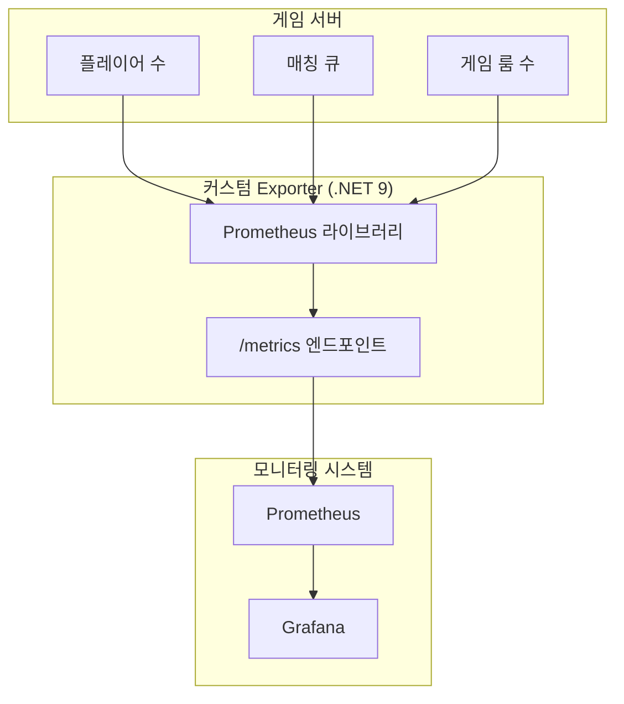


---

## 9.7 요약

* Exporter는 **게임 서버 내부 상태를 Prometheus가 이해할 수 있도록 변환**하는 도구.
* `prometheus-net` 라이브러리를 이용해 **C#으로 손쉽게 Exporter 작성 가능**.
* Counter, Gauge 같은 지표 타입을 사용하여 게임 특화 상태(플레이어 수, 매칭 큐 길이 등)를 수집.
* Prometheus 설정에 Exporter를 등록하고, Grafana에서 시각화하여 **게임 서버 운영 지표** 확보.

---
  
   
# 10. 알람(Alerts) 설정하기
지금까지 우리는 Prometheus와 Grafana를 이용해 게임 서버의 상태를 수집하고 시각화하는 방법을 배웠습니다. 하지만 **모니터링만으로는 부족**합니다. 운영자가 직접 눈으로 확인하지 않는 이상 문제가 생겨도 알아채지 못할 수 있기 때문입니다.

그래서 필요한 것이 바로 **알람(Alert)** 입니다.
알람을 통해 서버나 게임 서비스에서 이상 징후가 발생하면 **즉시 통보**받을 수 있습니다.

---

## 10.1 Alertmanager란?
Prometheus는 기본적으로 알람 규칙을 설정할 수 있지만, 실제로 알람을 **전송**하는 역할은 하지 않습니다.
이를 담당하는 것이 **Alertmanager** 입니다.

Alertmanager는 다음을 지원합니다:

* 알람 발생 시 Slack, Email, Teams, Discord 등으로 전송
* 알람 그룹화 및 중복 제거
* 알람 심각도(severity) 분류
* 알람 무시 규칙 (예: 테스트 서버 제외)

머메이드 다이어그램으로 보면:

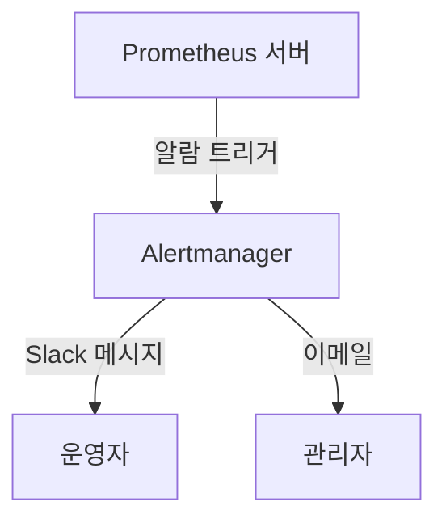

---

## 10.2 Alertmanager 설치

### 다운로드 및 실행 (Windows 기준)

1. [Prometheus 공식 사이트](https://prometheus.io/download/)에서 Alertmanager 다운로드
2. 압축 해제 후 `alertmanager.exe` 실행

```powershell
./alertmanager.exe --config.file=alertmanager.yml
```

### 기본 설정 파일(`alertmanager.yml` 예시)

```yaml
global:
  resolve_timeout: 5m

route:
  receiver: "default"

receivers:
  - name: "default"
    email_configs:
      - to: "admin@example.com"
        from: "alerts@example.com"
        smarthost: "smtp.example.com:587"
        auth_username: "alerts@example.com"
        auth_password: "비밀번호"
```

👉 이 설정은 단순히 **이메일**로 알람을 보내는 예시입니다. 실제 환경에서는 Slack, Discord Webhook 등을 자주 씁니다.

---

## 10.3 Prometheus 알람 규칙 작성
알람 규칙은 Prometheus 서버의 별도 설정 파일(`alert.rules.yml`)에 정의합니다.

Prometheus 메인 설정(`prometheus.yml`)에서 이 파일을 포함시켜야 합니다:

```yaml
rule_files:
  - "alert.rules.yml"
```

---

## 10.4 알람 예제 1: CPU/메모리 과부하
게임 서버는 실시간 연산이 많으므로 CPU/메모리 사용량이 급증하면 장애로 이어질 수 있습니다.

### 예시 규칙 (alert.rules.yml)

```yaml
groups:
  - name: system_alerts
    rules:
      - alert: HighCPUUsage
        expr: 100 - (avg by(instance)(irate(windows_cpu_time_total{mode="idle"}[5m])) * 100) > 80
        for: 2m
        labels:
          severity: critical
        annotations:
          summary: "CPU 사용량 80% 초과"
          description: "서버 {{ $labels.instance }} CPU가 2분 이상 80% 초과했습니다."

      - alert: HighMemoryUsage
        expr: (windows_memory_committed_bytes / windows_memory_commit_limit) * 100 > 90
        for: 2m
        labels:
          severity: warning
        annotations:
          summary: "메모리 사용량 90% 초과"
          description: "서버 {{ $labels.instance }} 메모리 사용률이 90%를 초과했습니다."
```

---

## 10.5 알람 예제 2: 게임 API 오류율 급증
API 서버의 품질을 확인하는 중요한 지표 중 하나는 **에러율**입니다.
예: 초당 처리되는 API 요청 중 `5% 이상`이 에러라면 문제라고 판단할 수 있습니다.

### 규칙 예시

```yaml
groups:
  - name: game_api_alerts
    rules:
      - alert: HighApiErrorRate
        expr: (rate(api_errors_total[5m]) / rate(api_requests_total[5m])) * 100 > 5
        for: 1m
        labels:
          severity: critical
        annotations:
          summary: "API 오류율 급증"
          description: "게임 API 오류율이 5% 이상으로 증가했습니다. 확인이 필요합니다."
```

---

## 10.6 알람 흐름 예시
ASCII 다이어그램으로 살펴봅시다:

```
[게임 서버] --> [Prometheus] --> [Alertmanager] --> [Slack/Email/Discord]
   ↑               ↑                ↑
   | 지표 수집      | 알람 규칙       | 알람 전송
```

---

## 10.7 실습: Slack으로 알람 보내기

1. Slack에서 **Incoming Webhook 앱** 생성
2. Webhook URL 복사
3. `alertmanager.yml`에 추가:

```yaml
receivers:
  - name: "slack-notifications"
    slack_configs:
      - api_url: "https://hooks.slack.com/services/XXXX/XXXX/XXXX"
        channel: "#alerts"
```

4. Prometheus 알람 규칙 트리거 → Alertmanager → Slack 채널에서 알람 확인

---

## 10.8 알람 운영 팁

* **너무 민감한 알람은 금물**: CPU 50% 초과 같은 알람은 운영자를 불필요하게 피곤하게 만듭니다.
* **for 옵션 활용**: 일시적인 스파이크(spike)가 아니라, 일정 시간 이상 지속될 때만 알람을 발생시키도록 `for: 1m` 이상 지정하는 것이 좋습니다.
* **알람 심각도 분류**:

  * `warning`: 모니터링 필요 (예: 메모리 사용량 80% 초과)
  * `critical`: 즉시 대응 필요 (예: API 오류율 급증)

---

## 10.9 요약

* **Alertmanager**는 Prometheus 알람을 Slack, 이메일 등으로 전달하는 도구
* **CPU/메모리 과부하**와 **API 오류율 급증** 같은 주요 시나리오에 알람 설정 가능
* `for` 옵션으로 일시적 스파이크를 무시하고 안정적인 알람 운영 가능
* Slack, Email 등 다양한 채널로 알람 전송 가능

---
  
    
# 11. Grafana 대시보드 꾸미기
Prometheus로 데이터를 수집하고 있다면, 이제는 눈에 잘 들어오는 시각화가 필요합니다.
Grafana는 바로 이런 목적을 위해 존재하는 도구입니다. 단순히 수치를 보여주는 것이 아니라, “어떤 상황에서 어떤 문제가 생기는지”를 직관적으로 확인할 수 있는 대시보드를 만들 수 있습니다.

이번 장에서는 **게임 서버 전용 Grafana 대시보드**를 만들어보겠습니다.

---

## 11.1 대시보드 구성 전략
우리가 만드는 대시보드는 두 가지 큰 축을 중심으로 합니다.

1. **API 서버 모니터링**

   * 초당 API 처리 건수 (TPS)
   * 초당 에러 발생 수
   * 전체 API 요청 수

2. **Socket 서버 모니터링**

   * 초당 송·수신 데이터량
   * 초당 방 개수, 게임 시작/종료 횟수

그리고 여기에 **서버 자원 지표**(CPU, 메모리, 네트워크, 디스크 사용량)를 함께 넣어, “게임 서버 프로그램 상태”와 “운영체제 자원 상태”를 한눈에 볼 수 있도록 할 겁니다.

---

## 11.2 Grafana 기본 개념 복습
Grafana에서 화면을 구성하는 요소는 크게 다음과 같습니다:

* **Dashboard**: 여러 개의 Panel을 모아둔 화면
* **Panel**: 하나의 시각화 단위 (그래프, 게이지, 표 등)
* **Query**: Prometheus로부터 가져올 데이터 정의 (PromQL 사용)

아래 ASCII 다이어그램으로 구조를 표현해봅시다:

```
+-----------------------------------------------------+
|                   Dashboard                         |
|  +----------------+   +---------------------------+ |
|  |   Panel 1      |   |         Panel 2           | |
|  | (API TPS)      |   | (Socket 송수신량)         | |
|  +----------------+   +---------------------------+ |
|                                                     |
|  +----------------+   +---------------------------+ |
|  |   Panel 3      |   |         Panel 4           | |
|  | (CPU/Memory)   |   | (게임 방 개수, 시작수 등) | |
|  +----------------+   +---------------------------+ |
+-----------------------------------------------------+
```

---

## 11.3 API 서버 모니터링 대시보드

### 1) 초당 API 처리 건수 (TPS)
Prometheus에서 수집된 API 호출 카운터(`http_requests_total`)를 이용합니다.
초당 처리 건수를 얻으려면 `rate()` 함수로 계산합니다.

```promql
rate(http_requests_total[1m])
```

Grafana Panel 설정:

* Visualization: **Time series**
* Legend: `API 처리 TPS`

---

### 2) 초당 에러 발생 수
에러 전용 metric (`http_requests_errors_total`)을 수집했다면 동일하게 `rate()`로 표현할 수 있습니다.

```promql
rate(http_requests_errors_total[1m])
```

Visualization은 **Bar chart**를 사용하면 “에러 폭발” 순간을 쉽게 파악할 수 있습니다.

---

## 11.4 Socket 서버 모니터링 대시보드

### 1) 송·수신 데이터량

게임 서버에서 노출한 지표 예시:

* `socket_received_bytes_total`
* `socket_sent_bytes_total`

PromQL 예제:

```promql
rate(socket_received_bytes_total[1m])
rate(socket_sent_bytes_total[1m])
```

Grafana에서 두 지표를 같은 Panel에 Overlay 하면 송·수신 흐름을 비교하기 좋습니다.

---

### 2) 방 개수, 게임 시작/종료
Socket 기반 MO 서버에서 제공하는 메트릭 예시:

* `room_count` (현재 방 개수, Gauge 타입)
* `game_started_total` (게임 시작 수, Counter)
* `game_finished_total` (게임 종료 수, Counter)

게임 시작/종료는 역시 `rate()`로 초당 처리량을 계산합니다.

```promql
rate(game_started_total[1m])
rate(game_finished_total[1m])
```

`room_count`는 Gauge이므로 그대로 시각화하면 됩니다.

---

## 11.5 서버 자원 + 게임 지표 통합
게임 서버의 상태를 온전히 파악하려면, 서버 자원 상태와 게임 지표를 하나의 화면에서 같이 보는 게 유용합니다.

머메이드 다이어그램으로 관계를 표현해봅시다:

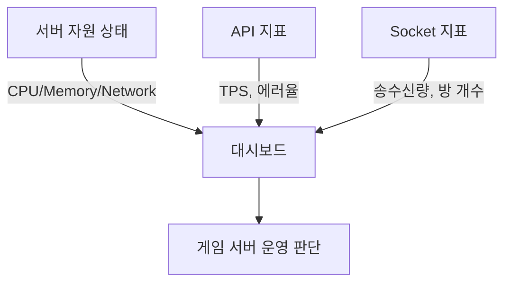

이렇게 구성하면, 예를 들어 “TPS가 갑자기 줄었을 때, CPU가 100%였는지? 네트워크 전송이 폭증했는지?”를 쉽게 알 수 있습니다.

---

## 11.6 대학생/개인 서버 운영자를 위한 예제 대시보드
학생이나 개인 서버 운영자라면, **시간과 자원은 한정적**이므로 “한눈에 보는 종합판”이 중요합니다.

추천하는 레이아웃:

1. 상단: 서버 자원 상태 (CPU, Memory, Network)
2. 중간: API 서버 상태 (TPS, 에러율)
3. 하단: Socket 서버 상태 (송수신량, 방 개수, 게임 시작/종료)

Grafana JSON Export 기능으로 만든 예제 대시보드를 공유할 수도 있습니다.
학생 프로젝트에서는 팀원들에게 JSON 파일을 전달하고, `Import Dashboard` 기능으로 바로 불러올 수 있도록 하면 편리합니다.

---

## 11.7 실습 따라하기
마지막으로, 실제로 따라할 수 있는 실습 단계 요약:

1. Grafana에서 새 Dashboard 생성
2. Panel 추가 → Prometheus DataSource 선택
3. PromQL 입력 (`rate(http_requests_total[1m])` 같은 것)
4. Visualization 타입 선택 (Line, Bar, Gauge 등)
5. Panel 제목/단위(Label, MB/s, TPS 등) 지정
6. Panel 정렬해서 Layout 구성

완성된 대시보드 예시는 아래처럼 직관적인 화면이 될 것입니다:

```
+------------------------------------------------+
| CPU/Memory | TPS | 에러율 | 송수신량 | 방 개수 |
+------------------------------------------------+
|                 실시간 그래프                  |
+------------------------------------------------+
```


## 정리
이 장에서는 **Grafana로 게임 서버에 맞는 대시보드 꾸미는 방법**을 배웠습니다.
핵심은 다음과 같습니다:

* API 서버와 Socket 서버를 분리해서 모니터링
* 서버 자원 + 게임 지표를 한 화면에 통합
* 학생/개인 운영자는 “한눈에 보는 종합판” 형태 추천

다음 장에서는 실제 **실전 모니터링 시나리오**(과부하, 버그, 연구용 활용 등)를 다루며, 여기서 만든 대시보드를 어떻게 활용할 수 있는지 살펴보겠습니다.

---
  
    
# 12. 실제 게임 서버 모니터링 시나리오
앞 장들에서 우리는 Prometheus, Grafana, 그리고 .NET 9 기반 게임 서버를 이용한 모니터링 환경을 구축했습니다. 이제는 단순히 지표를 “보는 것”을 넘어서, **실제 상황에서 모니터링을 어떻게 활용하는지** 살펴보겠습니다.

이 장에서는 세 가지 주요 시나리오를 다룹니다:

1. **과부하 상황에서 모니터링하는 방법**
2. **버그 발생 시 로그와 모니터링 연계**
3. **학습/연구용 프로젝트 응용**

---
  

## 12.1 과부하 상황에서 모니터링하는 방법

### 상황 설명
게임 서버는 이벤트(예: 오픈 베타, 업데이트)나 특정 시간대(예: 저녁, 주말)에 **트래픽이 폭발적으로 증가**할 수 있습니다. 이때 서버가 감당할 수 있는 범위를 벗어나면 API 응답이 느려지거나 Socket 연결이 끊기는 문제가 생깁니다.

### 모니터링 포인트

* **API 서버**:

  * 초당 처리량(TPS)
  * 에러율 증가 여부 (`5xx 에러`, `Timeout`)
* **Socket 서버**:

  * 송수신 데이터량 급증
  * 방 개수 증가 속도
* **서버 자원**:

  * CPU 사용률이 90% 이상 지속
  * 메모리 부족으로 인한 GC(가비지 컬렉션) 빈도 상승

### 다이어그램으로 보는 흐름

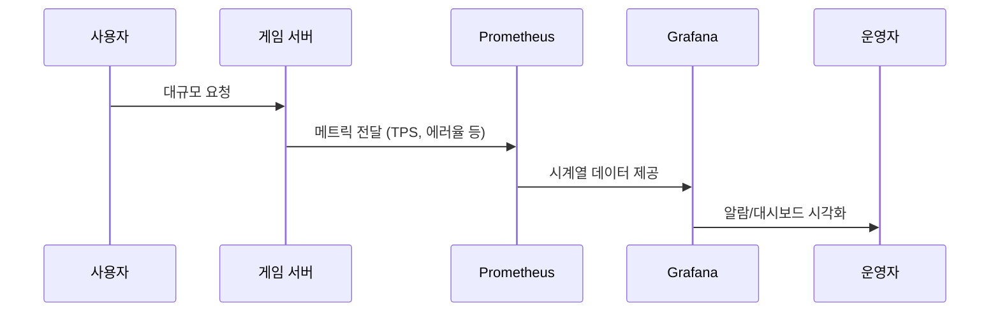

### 대응 전략

1. **Alert 설정**
   Prometheus Alertmanager를 이용해 `TPS 급증 + 에러율 1% 이상`일 때 알람을 보내도록 설정합니다.

   ```yaml
   - alert: HighErrorRate
     expr: rate(http_requests_errors_total[1m]) / rate(http_requests_total[1m]) > 0.01
     for: 1m
     labels:
       severity: warning
     annotations:
       description: "에러율이 1%를 초과했습니다."
   ```

2. **부하 테스트 + 대비**
   미리 JMeter 같은 부하 테스트 도구로 TPS 한계치를 파악하고, 모니터링 지표와 비교해두면 실제 서비스 시 안정성을 판단하기 쉽습니다.

---

## 12.2 버그 발생 시 로그와 모니터링 연계

### 상황 설명
게임 중 특정 기능(예: 아이템 구매 API)에서 갑자기 에러가 발생했다고 가정합시다. 유저들은 “구매가 안 돼요!”라고 신고하지만, 운영자는 즉시 원인을 파악하기 어렵습니다.

### 모니터링 + 로그의 결합

* 모니터링으로 **“언제부터 에러율이 증가했는지”** 확인
* 로그 시스템(예: Serilog, ElasticSearch)으로 해당 시간대의 API 로그 추출
* 에러 메시지, 스택 트레이스와 결합해 원인 분석

### 예제: API 서버 로그 기록 (C# ASP.NET Core)

```csharp
app.Use(async (context, next) =>
{
    try
    {
        await next();
    }
    catch (Exception ex)
    {
        // Prometheus 메트릭 증가
        Metrics.CreateCounter("http_requests_errors_total", "Total HTTP errors")
            .Inc();

        // 로그 기록
        Log.Error(ex, "API 처리 중 오류 발생");
        throw;
    }
});
```

### 분석 시각화 예시 (ASCII 아트)

```
+--------------------+       +-------------------+
| Prometheus (지표)  |       | 로그 시스템       |
|  - 에러율 급증     | <-->  |  - API 오류 메시지|
|  - TPS 변화        |       |  - 스택 트레이스 |
+--------------------+       +-------------------+
           ↓                          ↓
       Grafana 알람              Kibana/Log Viewer
```

이렇게 하면 단순히 “에러 발생”에서 끝나지 않고, **에러 원인까지 추적**할 수 있습니다.

---

## 12.3 학습/연구용 프로젝트 응용
대학생이나 개인 개발자는 상용 대규모 게임 서버 환경까지는 경험하기 어렵습니다. 하지만 학습/연구 목적으로도 Prometheus + Grafana는 큰 도움이 됩니다.

### 응용 아이디어

1. **팀 프로젝트**

   * 팀원들과 작은 WebAPI 또는 채팅 서버를 만들고, 모니터링을 적용해본다.
   * TPS와 에러율을 비교하며 “우리 서버가 어느 순간 느려지는지” 실험한다.

2. **연구 과제**

   * AI 학습용 게임 데이터 수집 시, 서버 부하 패턴을 모니터링한다.
   * 예: “유저 수가 증가할 때 CPU/GPU 자원 사용률이 어떻게 변하는지” 분석

3. **포트폴리오 활용**

   * 졸업 작품이나 개인 GitHub에 “게임 서버 + 모니터링 대시보드” 프로젝트를 올리면 강력한 어필 포인트가 된다.

### 실습 예시

* **시나리오 실험**: Socket 서버에 가짜 트래픽을 발생시키고, 방 개수 증가 → 게임 시작/종료를 자동화
* **결과 분석**: Grafana 대시보드에 트래픽 증가 곡선과 자원 사용률 변화를 기록
* **보고서 작성**: “TPS가 초당 500 이상일 때 CPU 80% 이상 도달, 에러율 2% 발생” 같은 결과 정리

---

## 12.4 정리
이 장에서는 세 가지 시나리오를 다뤘습니다:

1. **과부하 상황**에서는 TPS와 에러율, 자원 사용량을 종합적으로 보고 빠르게 대응
2. **버그 상황**에서는 모니터링 지표와 로그 시스템을 연계해 원인 파악
3. **학습/연구 프로젝트**에서는 작은 서버에서도 충분히 모니터링을 적용해 경험을 쌓을 수 있음

즉, 모니터링은 단순히 “데이터 보기”가 아니라,
**문제 상황을 빨리 감지하고 원인을 추적하며, 나아가 학습·연구까지 확장할 수 있는 핵심 도구**임을 확인했습니다.

---
  
    

# 부록
이 부록은 책을 읽고 난 뒤에도 **계속 참고할 수 있는 가이드** 역할을 합니다.
실제 프로젝트에 적용할 때 필요한 설정 옵션, Grafana 쿼리 예제, C# 코드 샘플, 그리고 더 공부할 수 있는 자료들을 정리했습니다.

---

## A. Prometheus 주요 설정 옵션 정리
Prometheus는 설정 파일(`prometheus.yml`)을 통해 동작합니다. 여기에는 **수집 대상(Targets), 스크랩 간격(Scrape interval), 알람 규칙(Alerting rules)** 등을 정의합니다.

### 1) 기본 구조

```yaml
global:
  scrape_interval: 15s   # 메트릭 수집 주기
  evaluation_interval: 15s # 알람 평가 주기

scrape_configs:
  - job_name: 'api_server'
    static_configs:
      - targets: ['localhost:5000']

  - job_name: 'socket_server'
    static_configs:
      - targets: ['localhost:6000']
```

### 2) 주요 옵션 설명

| 옵션                    | 설명                            | 예시                 |
| --------------------- | ----------------------------- | ------------------ |
| `scrape_interval`     | Prometheus가 타겟에서 데이터를 긁어오는 주기 | `15s`              |
| `evaluation_interval` | Alert Rule을 평가하는 주기           | `30s`              |
| `job_name`            | 수집 작업의 이름. 대시보드에서 식별에 사용      | `"api_server"`     |
| `targets`             | 수집할 서버 주소 (IP\:PORT)          | `"localhost:5000"` |
| `metrics_path`        | 메트릭 노출 경로                     | `"/metrics"` (기본값) |
| `relabel_configs`     | 라벨을 재가공하거나 제거할 때 사용           | 특정 라벨 제거/추가        |

### 3) ASCII 다이어그램으로 구조 이해하기

```
+---------------------+
|  Prometheus         |
|---------------------|
| scrape_configs      |
|   - job: api_server |
|     -> 127.0.0.1:5000/metrics
|   - job: socket_srv |
|     -> 127.0.0.1:6000/metrics
+---------------------+
```

---

## B. Grafana 주요 쿼리 예제
Grafana는 PromQL을 기반으로 데이터를 시각화합니다. 여기서는 **게임 서버 모니터링에 자주 쓰이는 쿼리들**을 정리합니다.

### 1) API 서버

* **초당 요청 수 (TPS)**

```promql
rate(http_requests_total[1m])
```

* **에러율**

```promql
rate(http_requests_errors_total[1m]) / rate(http_requests_total[1m])
```

### 2) Socket 서버

* **초당 수신 데이터량**

```promql
rate(socket_received_bytes_total[1m])
```

* **초당 송신 데이터량**

```promql
rate(socket_sent_bytes_total[1m])
```

* **현재 방 개수**

```promql
room_count
```

* **게임 시작/종료율**

```promql
rate(game_started_total[1m])
rate(game_finished_total[1m])
```

### 3) 서버 자원

* **CPU 사용률**

```promql
100 - (avg by(instance)(rate(windows_cpu_time_total{mode="idle"}[1m])) * 100)
```

* **메모리 사용률**

```promql
(windows_memory_committed_bytes / windows_memory_commit_limit) * 100
```

---

## C. C# .NET 9 코드 샘플 모음

### 1) ASP.NET Core WebAPI에서 Prometheus 노출

```csharp
using Prometheus;

var builder = WebApplication.CreateBuilder(args);
var app = builder.Build();

// API 요청 카운터
var counter = Metrics.CreateCounter("http_requests_total", "Number of HTTP requests", 
    new CounterConfiguration { LabelNames = new[] { "method", "endpoint" } });

app.Use(async (context, next) =>
{
    counter.WithLabels(context.Request.Method, context.Request.Path).Inc();
    await next();
});

// 메트릭 엔드포인트 노출
app.MapMetrics();

app.MapGet("/", () => "Hello Game Server!");
app.Run();
```

실행 후 브라우저에서 `http://localhost:5000/metrics` 접속 시 Prometheus 포맷으로 지표가 출력됩니다.

---

### 2) Socket 서버에서 메트릭 수집 예제

```csharp
using Prometheus;
using System.Net.Sockets;
using System.Net;

var receivedCounter = Metrics.CreateCounter("socket_received_bytes_total", "Total received bytes");
var sentCounter = Metrics.CreateCounter("socket_sent_bytes_total", "Total sent bytes");

var server = new TcpListener(IPAddress.Any, 6000);
server.Start();

while (true)
{
    var client = await server.AcceptTcpClientAsync();
    _ = HandleClient(client);
}

async Task HandleClient(TcpClient client)
{
    var buffer = new byte[1024];
    var stream = client.GetStream();

    while (true)
    {
        var bytesRead = await stream.ReadAsync(buffer, 0, buffer.Length);
        if (bytesRead == 0) break;

        receivedCounter.Inc(bytesRead);

        // Echo back
        await stream.WriteAsync(buffer, 0, bytesRead);
        sentCounter.Inc(bytesRead);
    }
}
```

---

## D. 참고 문헌 및 학습 자료

### 1) 공식 문서

* Prometheus: [https://prometheus.io/docs/](https://prometheus.io/docs/)
* Grafana: [https://grafana.com/docs/](https://grafana.com/docs/)
* .NET 9: [https://learn.microsoft.com/dotnet/](https://learn.microsoft.com/dotnet/)

### 2) 학습용 자료

* **모니터링 기본기**: *Site Reliability Engineering* (Google SRE 팀 저서)
* **C#과 서버 프로그래밍**: *Pro ASP.NET Core 7* (Apress) → .NET 9과도 큰 차이 없음
* **윈도우 서버 지표 수집**: *WMI Exporter (windows\_exporter)* GitHub

### 3) 추천 GitHub 프로젝트

* `prometheus-net`: [.NET용 Prometheus 클라이언트](https://github.com/prometheus-net/prometheus-net)
* `windows_exporter`: [Windows 서버 메트릭 수집기](https://github.com/prometheus-community/windows_exporter)

---

# 정리
부록에서는 다음을 정리했습니다:

* Prometheus 주요 설정 옵션 (`scrape_configs`, `scrape_interval` 등)
* Grafana에서 자주 사용하는 PromQL 쿼리 예제
* C# .NET 9 기반의 API/Socket 서버 메트릭 수집 코드
* 더 공부할 수 있는 참고 문헌과 자료

이 자료는 책을 읽은 뒤 **프로젝트에 바로 참고할 수 있는 매뉴얼**로 활용할 수 있습니다.    